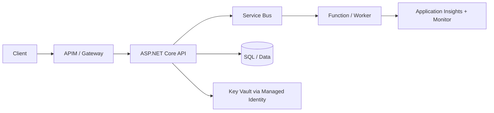

# Azure + .NET Interview Preparation Handbook

## Overview
This handbook is a normalized, interview-focused reference for Senior .NET and Azure Architect roles. It combines Azure platform, ASP.NET Core, C# runtime, messaging, security, SQL, and modernization topics in one consistent format.

## Why this topic matters
Most senior interviews assess decision-making, trade-offs, and production design maturity, not only definitions. You must explain how to build secure, scalable, observable, and cost-aware systems on Azure with .NET.

## Core concepts
- Azure compute and integration services
- API security and identity
- ASP.NET Core architecture and runtime behavior
- Async and concurrency patterns
- Data and SQL performance
- Reliability and operations
- Architecture modernization and governance

## Detailed explanation of each concept
Enterprise .NET architecture on Azure requires selecting the right compute model for each workload: synchronous APIs, event-driven processing, long-running orchestration, and scheduled automation. Security must be identity-first with Entra ID, managed identity, Key Vault, least privilege, and private connectivity.

For application internals, architects should understand middleware, exception pipelines, dependency lifetimes, async behavior, resource disposal, and data-access optimization patterns. Messaging and eventing choices (Service Bus, Event Grid, Event Hub) should be based on business semantics and delivery guarantees.

Operational excellence is as important as design. Production readiness includes health telemetry, alerting, retries, DLQ handling, rollout safety, and incident playbooks. Modernization should follow business-driven phased transformation, not a big-bang rewrite.

## Evaluation (How to assess design quality)
- Requirement-to-architecture traceability
- Security and identity control coverage
- Reliability under dependency failure
- Performance and cost efficiency
- Operational observability and incident readiness
- Evolution and migration safety

## Architecture / flow diagram


**Flow explanation:**  
Client traffic is governed at gateway, business APIs run in ASP.NET Core, asynchronous workflows are decoupled via Service Bus and workers, secrets are fetched through managed identity, and observability is centralized.

## Real-world example
An enterprise claims platform runs customer APIs on App Service, dispatches asynchronous document and notification work to Service Bus, uses Functions for event-driven jobs, stores secrets in Key Vault, and monitors end-to-end latency, failure rates, and queue backlog through Azure Monitor and App Insights.

## Best practices
- Choose service by workload semantics, not habit
- Use Entra ID + managed identity as default auth model
- Keep synchronous request paths short
- Use queue-backed async processing for long tasks
- Enforce consistent error handling and observability
- Plan migration in phases with rollback points

## Common mistakes / misconceptions
- Treating Functions as universal replacement for APIs
- Using function keys as primary enterprise auth
- Mixing blocking calls in async-heavy services
- Ignoring idempotency in retried message workflows
- Skipping DLQ ownership and replay runbooks

## Industry relevance
These topics are central in product companies, consulting programs, and enterprise modernization initiatives where .NET and Azure are core technology stacks.

## Interview discussion points
- App Service vs Functions trade-offs
- Service Bus vs Event Grid vs Event Hub
- Timeout, retry, fallback, and idempotency controls
- Identity-first security model for APIs and workloads
- Architecture modernization strategy with business alignment

## Links to dependent / related topics
- [Compute Architecture Decisions](../docs/compute/compute_architecture.md)
- [APIM, Messaging, Eventing](../docs/integration/apim_messaging_eventing.md)
- [Security, IAM, Networking](../docs/security/security_iam_networking.md)
- [System Design HLD/LLD](../docs/system-design/system_design_hld_lld.md)

## Interview Questions (50)
1. What is Azure Functions and when should you use it?
2. Which trigger types are most relevant in enterprise projects?
3. How do you secure Function Apps in production?
4. How do you fetch third-party credentials securely from Key Vault?
5. What are Azure Blob access tiers and when do you use each?
6. How do you ensure users access only their own blobs?
7. App Service vs Function App: how do you choose?
8. When should Function App be preferred over Web API?
9. What is Durable Functions and where does it fit?
10. PUT vs PATCH: what is the architectural implication?
11. Why prefer global exception handling in ASP.NET Core?
12. IEnumerable vs IQueryable: when does it matter?
13. Why dispose IDisposable resources if GC exists?
14. Singleton vs Scoped vs Transient: how to choose?
15. Middleware vs filters and Use vs Run?
16. WHERE vs HAVING and clustered vs non-clustered index?
17. How do you secure Azure Functions end to end?
18. Service Bus Queue vs Topic, Event Grid, Event Hub differences?
19. How do you improve API performance in .NET systems?
20. Task vs Thread vs async/await in practical design?
21. ValueTask vs Task: when to use?
22. What causes ThreadPool starvation and how to prevent?
23. How do you design API rate limiting strategy?
24. How do you monitor and alert Function/App Service failures?
25. How do you handle long-running operations without client timeouts?
26. How do you design idempotent API endpoints?
27. How do you design idempotent message consumers?
28. How do you apply retry and circuit breaker patterns?
29. How do you handle poison messages and DLQ operations?
30. How do you reduce DB load when queue volume spikes?
31. How do you secure API with JWT/OAuth in enterprise?
32. Access token vs refresh token: architecture view?
33. How do you implement API versioning safely?
34. How do you structure clean architecture in ASP.NET Core?
35. Why should controller stay thin?
36. Where should business logic and orchestration live?
37. How do you choose repository pattern usage sensibly?
38. How do you approach SQL query tuning at scale?
39. How do you optimize queries on very large tables?
40. How do you design caching strategy for APIs?
41. How do you centralize observability across services?
42. How do you design CI/CD for .NET on Azure?
43. How do you secure deployment pipelines?
44. How do you design blue-green/canary rollout for APIs?
45. How do you choose Azure hosting option for Web APIs?
46. How do you design microservice communication securely?
47. How do you present modernization approach to leadership?
48. What are common anti-patterns in .NET + Azure architecture?
49. How do you create first-90-day architecture plan?
50. How do you conclude architect interview answers strongly?

## Answers for important questions (Summary + Crisp + Deep)

### Q1. What is Azure Functions and when should you use it?
**Question summary:** Interviewers test whether you understand serverless execution semantics and correct workload fit.
**Crisp answer (7-8 lines):** Azure Functions is event-driven serverless compute on Azure. It is best for triggered workloads like HTTP webhooks, timers, queues, and blob events. It reduces infrastructure management overhead. It scales with demand and supports burst traffic well. It is ideal for asynchronous or background work. It is not always the best choice for large controller-heavy APIs. Use it where trigger-based execution is a natural fit.
**Deep explanation (~40 lines):** Functions is optimized for units of work activated by events. Its value is strongest in integration-heavy systems where demand fluctuates and operational simplicity matters. It should be combined with secure identity, private connectivity, and observability controls. For large synchronous API surfaces, App Service or containerized APIs are often better. Architects should explain plan-dependent behavior, cold-start considerations, timeout expectations, and event-driven patterns clearly.
**Answer summary:** Use Azure Functions for event-driven, bursty, and asynchronous workloads with strong platform integration.
**Simple diagram:**  
```text
Trigger -> Function -> Business action -> Telemetry
```
**Trusted reference links:**  
- https://learn.microsoft.com/en-us/azure/azure-functions/functions-overview

### Q2. Which trigger types are most relevant in enterprise projects?
**Question summary:** Tests practical usage of trigger semantics, not just memorized list.
**Crisp answer (7-8 lines):** HTTP trigger for lightweight APIs/webhooks. Timer trigger for scheduled tasks. Service Bus trigger for reliable async workflows. Blob trigger for file processing. Event Grid trigger for notification fan-out. Event Hub trigger for high-throughput telemetry streams. Cosmos DB trigger for change-feed reactions. Choose based on business semantics and delivery guarantees.
**Deep explanation (~40 lines):** The key is matching trigger to workflow type. Service Bus is command/workflow reliable messaging, Event Grid is event notification, and Event Hub is stream ingestion. Blob and timer triggers are common for operational automation. In interviews, explain why one trigger is selected over another in terms of reliability, ordering, throughput, and failure handling.
**Answer summary:** Trigger choice should reflect workload behavior and reliability requirements.
**Simple diagram:**  
```text
HTTP/Timer/Queue/Event -> Function Execution
```
**Trusted reference links:**  
- https://learn.microsoft.com/en-us/azure/azure-functions/functions-triggers-bindings

### Q3. How do you secure Function Apps in production?
**Question summary:** Evaluates layered security architecture.
**Crisp answer (7-8 lines):** Use Entra ID for caller authentication. Use managed identity for downstream resource access. Keep secrets in Key Vault, not app settings. Restrict network access with private endpoints/VNet integration. Put APIM/WAF in front for governance controls. Apply least privilege RBAC. Monitor auth and runtime anomalies continuously.
**Deep explanation (~40 lines):** Production function security is defense-in-depth. Function keys alone are insufficient. Identity assurance, workload identity, secret governance, and network controls should be combined. Add policy enforcement at gateway and robust monitoring for incident response. Security controls must be auditable and consistent across environments.
**Answer summary:** Secure Functions with identity-first, secretless, network-restricted, and monitored controls.
**Simple diagram:**  
```text
Entra ID -> Function -> Managed Identity -> Key Vault/Data
```
**Trusted reference links:**  
- https://learn.microsoft.com/en-us/azure/azure-functions/security-concepts

### Q4. How do you fetch third-party credentials securely from Key Vault?
**Question summary:** Tests secret lifecycle and runtime access design.
**Crisp answer (7-8 lines):** Store external API secrets in Key Vault. Enable managed identity on workload. Grant least-privilege secret access. Fetch at runtime using SDK or Key Vault references. Avoid hardcoding secrets or pipeline variables where possible. Rotate secrets centrally without code changes. Audit secret access and failures.
**Deep explanation (~40 lines):** Key Vault centralizes secret lifecycle and minimizes leakage risk. Managed identity removes static credentials from code and config. Runtime retrieval with policy-based access provides better control and auditability. Rotation and incident response become operationally manageable.
**Answer summary:** Use Key Vault + managed identity + least privilege for secure third-party credential access.
**Simple diagram:**  
```text
Workload Identity -> Key Vault -> External API Secret
```
**Trusted reference links:**  
- https://learn.microsoft.com/en-us/azure/key-vault/secrets/quick-create-net

### Q5. What are Azure Blob access tiers and when do you use each?
**Question summary:** Tests storage cost/performance optimization logic.
**Crisp answer (7-8 lines):** Hot tier for frequently accessed data. Cool tier for infrequent but online access. Cold tier for rare online access with higher retrieval cost. Archive tier for long-term, rarely accessed retention with rehydration delay. Choose by access frequency and retrieval urgency. Reassess tiering as usage changes. Use lifecycle policies to automate transitions.
**Deep explanation (~40 lines):** Tier selection is an economics decision. Storage cost and access/retrieval cost trade off by tier. Wrong tiering inflates spend or degrades usability. Lifecycle automation and telemetry-driven reclassification improve cost posture over time.
**Answer summary:** Match blob tier to access patterns and automate tier transitions.
**Simple diagram:**  
```text
Hot -> Cool -> Cold -> Archive (by access frequency)
```
**Trusted reference links:**  
- https://learn.microsoft.com/en-us/azure/storage/blobs/access-tiers-overview

### Q6. How do you ensure users access only their own blobs?
**Question summary:** Tests authorization design for object access.
**Crisp answer (7-8 lines):** Authenticate users with Entra ID. Authorize object ownership in API layer. Avoid exposing account keys to clients. Use short-lived user delegation SAS for scoped access when needed. Apply path/container-level policy boundaries. Log all access decisions and downloads. Revoke tokens quickly on abuse signals.
**Deep explanation (~40 lines):** Object security should be identity-driven and least-privilege. API-mediated access gives strongest control and auditing. SAS should be narrowly scoped and time-bound. Ownership checks must be explicit and consistent to prevent horizontal data access.
**Answer summary:** Use identity + authorization checks + scoped temporary access, never broad storage keys.
**Simple diagram:**  
```text
User -> Auth API -> Ownership check -> Scoped blob access
```
**Trusted reference links:**  
- https://learn.microsoft.com/en-us/azure/storage/blobs/security-recommendations

### Q7. App Service vs Function App: how do you choose?
**Question summary:** Platform decision trade-off.
**Crisp answer (7-8 lines):** App Service suits full web apps and rich API surfaces. Function App suits event-driven triggered workloads. Use App Service for predictable synchronous traffic and larger API contracts. Use Functions for timers, queues, blob events, and bursty background processing. Both can coexist in one architecture. Choose based on workload shape and operational model. Do not force one model everywhere.
**Deep explanation (~40 lines):** Hosting choice should map to request patterns, lifecycle behavior, and non-functional requirements. Architects should discuss scaling, observability, deployment model, and cost characteristics of each service.
**Answer summary:** App Service for full API hosting; Functions for event-driven serverless workloads.
**Simple diagram:**  
```text
Synchronous API -> App Service
Triggered async work -> Functions
```
**Trusted reference links:**  
- https://learn.microsoft.com/en-us/azure/azure-functions/functions-compare-logic-apps-ms-flow-webjobs

### Q8. When should Function App be preferred over Web API?
**Question summary:** Clarifies service fit in practical architectures.
**Crisp answer (7-8 lines):** Prefer Function App for trigger-based asynchronous tasks. Use it for scheduled jobs, queue processing, file workflows, and lightweight webhooks. It is strong for bursty workloads with serverless scaling. Prefer Web API for broad synchronous domain APIs and complex routing. Keep critical synchronous user journeys in stable API hosting. Mix both when architecture needs both patterns.
**Deep explanation (~40 lines):** The choice depends on interaction style and operational needs. Web API is better for rich request/response domains, while Functions reduce operational overhead for event processing.
**Answer summary:** Use Functions for event-driven async workloads; Web API for rich synchronous contracts.
**Simple diagram:**  
```text
Event workflow -> Function
Business API surface -> Web API
```
**Trusted reference links:**  
- https://learn.microsoft.com/en-us/azure/architecture/guide/technology-choices/compute-decision-tree

### Q9. What is Durable Functions and where does it fit?
**Question summary:** Tests understanding of stateful orchestration.
**Crisp answer (7-8 lines):** Durable Functions adds stateful workflow orchestration to Functions. It uses orchestrator and activity patterns. It supports long-running multi-step processes. It handles retries, checkpoints, and wait/resume behavior. It is useful for approvals, document pipelines, and fan-out/fan-in. Avoid using it for simple one-step tasks. Use it where stateful coordination is required.
**Deep explanation (~40 lines):** Durable Functions solves distributed workflow coordination without managing orchestration infrastructure directly. It improves resiliency and operational control for long-lived flows. Architects should explain when orchestration overhead is justified and how to design idempotent activities.
**Answer summary:** Use Durable Functions for stateful, multi-step, long-running orchestrated workflows.
**Simple diagram:**  
```text
Orchestrator -> Activity1/2/3 -> Checkpoint/Resume
```
**Trusted reference links:**  
- https://learn.microsoft.com/en-us/azure/azure-functions/durable/durable-functions-overview

### Q10. PUT vs PATCH: what is the architectural implication?
**Question summary:** API contract correctness.
**Crisp answer (7-8 lines):** PUT usually implies full resource replacement. PATCH implies partial update semantics. Using PUT for partial changes can unintentionally overwrite fields. PATCH is safer for targeted field updates. Contract clarity prevents client-side ambiguity. Validation and concurrency controls should accompany both. Choose method semantics intentionally.
**Deep explanation (~40 lines):** HTTP verb misuse causes data consistency and backward-compatibility issues. Architects should align method semantics with domain update behavior and include versioning/idempotency considerations.
**Answer summary:** Use PATCH for partial updates and PUT for full replacement intent.
**Simple diagram:**  
```text
PUT -> full replace
PATCH -> partial modify
```
**Trusted reference links:**  
- https://learn.microsoft.com/en-us/azure/architecture/best-practices/api-design

### Q11. Why prefer global exception handling in ASP.NET Core?
**Question summary:** Operational consistency and maintainability.
**Crisp answer (7-8 lines):** Global handling centralizes error behavior. It avoids duplicated try/catch in controllers. It ensures consistent error contracts. It improves structured logging and correlation. It prevents sensitive leak in raw exceptions. It simplifies maintenance and observability. Use local handling only for domain-specific recovery cases.
**Deep explanation (~40 lines):** Centralized exception middleware improves reliability and supportability. It supports uniform status mapping, error IDs, and observability integration. Controller logic remains focused on business behavior.
**Answer summary:** Global exception handling is cleaner, safer, and operationally superior.
**Simple diagram:**  
```text
Request -> Middleware -> Controller -> Unified Error Response
```
**Trusted reference links:**  
- https://learn.microsoft.com/en-us/aspnet/core/fundamentals/error-handling

### Q12. IEnumerable vs IQueryable: when does it matter?
**Question summary:** Data access performance correctness.
**Crisp answer (7-8 lines):** IEnumerable is in-memory iteration. IQueryable builds provider-translatable query expressions. Premature materialization can move filtering to memory. That increases data transfer and latency. Keep query composition as IQueryable in data layer. Materialize only after filters/sorts/paging are defined. Use clear boundary before returning DTOs.
**Deep explanation (~40 lines):** Query execution location matters for performance. Database-side filtering is usually required for scalable data access. Architects should explain deferred execution and projection best practices.
**Answer summary:** Use IQueryable for DB query composition; IEnumerable after materialization.
**Simple diagram:**  
```text
IQueryable -> SQL execution
IEnumerable -> in-memory processing
```
**Trusted reference links:**  
- https://learn.microsoft.com/en-us/ef/core/querying/

### Q13. Why dispose IDisposable resources if GC exists?
**Question summary:** Runtime resource management.
**Crisp answer (7-8 lines):** GC manages managed memory, not timely release of external resources. DB connections, streams, and sockets need deterministic cleanup. IDisposable enables explicit release. Delayed cleanup causes leaks and exhaustion. Use using/await using patterns consistently. Keep ownership boundaries clear. Monitor for resource pressure symptoms.
**Deep explanation (~40 lines):** Resource cleanup is a reliability concern. Finalization timing is nondeterministic, so explicit disposal is necessary for scarce resources.
**Answer summary:** Dispose resources deterministically to avoid connection/file/socket exhaustion.
**Simple diagram:**  
```text
Acquire resource -> Use -> Dispose deterministically
```
**Trusted reference links:**  
- https://learn.microsoft.com/en-us/dotnet/standard/garbage-collection/implementing-dispose

### Q14. Singleton vs Scoped vs Transient: how to choose?
**Question summary:** DI lifetime correctness.
**Crisp answer (7-8 lines):** Singleton is app-lifetime and must be thread-safe. Scoped is request/scope lifetime and fits context-bound services. Transient creates new instance per resolution. Use scoped for DbContext-like units of work. Use singleton for stateless shared services. Use transient for lightweight stateless helpers. Avoid injecting scoped service directly into singleton.
**Deep explanation (~40 lines):** Lifetime mismatch can create data corruption or runtime errors. Service design should align with state, concurrency, and request boundaries.
**Answer summary:** Pick DI lifetime by state scope and concurrency needs.
**Simple diagram:**  
```text
Singleton: app
Scoped: request
Transient: resolve instance
```
**Trusted reference links:**  
- https://learn.microsoft.com/en-us/dotnet/core/extensions/dependency-injection

### Q15. Middleware vs filters and Use vs Run?
**Question summary:** Pipeline composition understanding.
**Crisp answer (7-8 lines):** Middleware runs in app request pipeline globally. Filters run inside MVC/action pipeline. Use adds middleware that can continue to next. Run adds terminal middleware that ends pipeline. Middleware fits cross-cutting concerns broadly. Filters fit controller/action concerns. Keep responsibilities clear to avoid duplication.
**Deep explanation (~40 lines):** Correct placement improves maintainability and avoids conflicting behaviors in request processing.
**Answer summary:** Middleware is global pipeline control; filters are MVC-scoped behavior.
**Simple diagram:**  
```text
Middleware chain -> MVC -> Filters -> Action
```
**Trusted reference links:**  
- https://learn.microsoft.com/en-us/aspnet/core/fundamentals/middleware

### Q16. WHERE vs HAVING and clustered vs non-clustered index?
**Question summary:** SQL fundamentals with performance angle.
**Crisp answer (7-8 lines):** WHERE filters rows before grouping. HAVING filters after aggregation. Clustered index defines physical row order and only one exists per table. Non-clustered indexes are secondary structures for lookup acceleration. Use indexes based on query patterns. Over-indexing increases write cost. Validate with execution plans.
**Deep explanation (~40 lines):** Query shape and index design must be aligned. Architects should discuss balancing read optimization with write overhead and storage cost.
**Answer summary:** Use WHERE/HAVING and index types correctly based on query stage and workload patterns.
**Simple diagram:**  
```text
WHERE -> GROUP BY -> HAVING
```
**Trusted reference links:**  
- https://learn.microsoft.com/en-us/sql/relational-databases/sql-server-index-design-guide

### Q17. How do you secure Azure Functions end to end?
**Question summary:** Re-validates integrated security control model.
**Crisp answer (7-8 lines):** Authenticate callers with Entra ID. Authorize with scoped RBAC/claims. Use managed identity for downstream resources. Store secrets in Key Vault only. Restrict network ingress/egress with private controls. Place APIM policies at edge. Monitor, alert, and run security incident drills.
**Deep explanation (~40 lines):** End-to-end security combines identity, authorization, secret governance, network controls, and continuous detection.
**Answer summary:** Use layered identity, secret, network, and monitoring controls for secure Functions.
**Simple diagram:**  
```text
Client Auth -> Function -> Managed Identity -> Secure Resources
```
**Trusted reference links:**  
- https://learn.microsoft.com/en-us/azure/azure-functions/security-concepts

### Q18. Service Bus Queue vs Topic, Event Grid, Event Hub differences?
**Question summary:** Messaging and eventing semantic clarity.
**Crisp answer (7-8 lines):** Service Bus Queue is point-to-point with competing consumers. Service Bus Topic is pub/sub with independent subscriptions. Event Grid is event notification routing. Event Hub is high-throughput stream ingestion. Choose by delivery guarantees and workload semantics. Do not treat them as interchangeable. Map business pattern first, then service.
**Deep explanation (~40 lines):** Correct service choice prevents costly redesign and reliability issues later.
**Answer summary:** Queue/Topic for business messaging, Event Grid for notification, Event Hub for telemetry streaming.
**Simple diagram:**  
```text
Command -> Service Bus
Notification -> Event Grid
Telemetry -> Event Hub
```
**Trusted reference links:**  
- https://learn.microsoft.com/en-us/azure/service-bus-messaging/service-bus-messaging-overview  
- https://learn.microsoft.com/en-us/azure/event-grid/overview  
- https://learn.microsoft.com/en-us/azure/event-hubs/event-hubs-about

### Q19. How do you improve API performance in .NET systems?
**Question summary:** Performance engineering breadth.
**Crisp answer (7-8 lines):** Optimize end-to-end, not only controller code. Use async I/O and efficient serialization. Optimize SQL with indexes and projections. Apply caching for stable reads. Offload heavy tasks to async workers. Tune connection pools and timeouts. Monitor p95/p99 and regressions continuously.
**Deep explanation (~40 lines):** Performance is systemic: app logic, data access, infrastructure, and integration latency all contribute.
**Answer summary:** Improve API performance through layered optimization and telemetry-driven iteration.
**Simple diagram:**  
```text
App + DB + Cache + Infra tuning -> lower latency
```
**Trusted reference links:**  
- https://learn.microsoft.com/en-us/aspnet/core/performance/

### Q20. Task vs Thread vs async/await in practical design?
**Question summary:** Runtime scalability and correctness.
**Crisp answer (7-8 lines):** Thread is execution resource. Task represents asynchronous operation abstraction. async/await composes non-blocking I/O workflows. Tasks do not always map one-to-one to dedicated threads. Blocking calls inside async paths reduce scalability. Use async for I/O-bound operations. Keep CPU-bound work explicitly isolated.
**Deep explanation (~40 lines):** Understanding this prevents thread starvation and poor scalability under load.
**Answer summary:** Use async/await for I/O scalability and avoid blocking in async pipelines.
**Simple diagram:**  
```text
Request -> async I/O tasks -> resumed continuation
```
**Trusted reference links:**  
- https://learn.microsoft.com/en-us/dotnet/csharp/asynchronous-programming/

### Q21. ValueTask vs Task: when to use?
**Question summary:** Advanced optimization judgment.
**Crisp answer (7-8 lines):** Task is default and simpler for most async methods. ValueTask can reduce allocations in hot paths where sync completion is common. Misuse can add complexity and bugs. Use only after profiling shows allocation pressure. Keep API consistency and readability. Prefer Task until optimization is justified.
**Deep explanation (~40 lines):** ValueTask is a targeted optimization, not a universal replacement for Task.
**Answer summary:** Use ValueTask selectively in measured hot paths; otherwise prefer Task.
**Simple diagram:**  
```text
Default: Task
Hot-path optimization: ValueTask
```
**Trusted reference links:**  
- https://learn.microsoft.com/en-us/dotnet/api/system.threading.tasks.valuetask

### Q22. What causes ThreadPool starvation and how to prevent?
**Question summary:** Production outage pattern.
**Crisp answer (7-8 lines):** Blocking async flows with .Result/.Wait is common cause. Synchronous I/O in request paths also contributes. Excessive long-running blocking work in thread pool saturates workers. Use async end-to-end for I/O. Isolate CPU-heavy work patterns. Monitor thread pool counters. Fix blocking hotspots first.
**Deep explanation (~40 lines):** Starvation causes latency spikes and request timeouts even when CPU appears moderate.
**Answer summary:** Prevent starvation by eliminating blocking patterns and monitoring runtime counters.
**Simple diagram:**  
```text
Blocking calls -> worker exhaustion -> latency spike
```
**Trusted reference links:**  
- https://learn.microsoft.com/en-us/dotnet/core/diagnostics/debug-threadpool-starvation

### Q23. How do you design API rate limiting strategy?
**Question summary:** Abuse protection and fairness.
**Crisp answer (7-8 lines):** Define limits by client, tenant, and endpoint class. Use burst and sustained limits separately. Protect high-cost routes with stricter quotas. Return clear 429 and retry guidance. Integrate with gateway/APIM policy where possible. Monitor limit hits and abuse patterns. Adjust limits by plan and risk profile.
**Deep explanation (~40 lines):** Rate limiting protects reliability and cost while preserving fair multi-tenant behavior.
**Answer summary:** Implement multi-dimensional rate limits aligned to risk, cost, and SLOs.
**Simple diagram:**  
```text
Request -> quota check -> allow/throttle
```
**Trusted reference links:**  
- https://learn.microsoft.com/en-us/azure/architecture/patterns/throttling

### Q24. How do you monitor and alert Function/App Service failures?
**Question summary:** Operational readiness.
**Crisp answer (7-8 lines):** Centralize telemetry in Application Insights/Azure Monitor. Track failed requests, exceptions, dependencies, and availability. Create alert rules with severity thresholds. Use action groups for email/Teams/webhook. Add dashboards for trend and incident drill-down. Link alerts to runbooks. Review noisy alerts and tune.
**Deep explanation (~40 lines):** Reliable operations need clear telemetry, actionable alerts, and practiced response procedures.
**Answer summary:** Use centralized monitoring, actionable alerts, and runbook-driven incident handling.
**Simple diagram:**  
```text
Telemetry -> Alert Rules -> Action Group -> Runbook
```
**Trusted reference links:**  
- https://learn.microsoft.com/en-us/azure/azure-monitor/overview

### Q25. How do you handle long-running operations without client timeouts?
**Question summary:** Async API architecture.
**Crisp answer (7-8 lines):** Accept request and return 202 with tracking ID. Queue heavy work asynchronously. Expose status endpoint or callback webhook. Keep retries/idempotency in worker path. Set timeout budgets per stage. Use DLQ for terminal failures. Provide clear completion/failure state contract.
**Deep explanation (~40 lines):** Async request-reply pattern improves UX and reliability for long operations.
**Answer summary:** Use queued async processing with job-status contracts for long-running operations.
**Simple diagram:**  
```text
POST -> 202 + jobId -> worker -> status/result
```
**Trusted reference links:**  
- https://learn.microsoft.com/en-us/azure/architecture/patterns/async-request-reply

### Q26. How do you design idempotent API endpoints?
**Question summary:** Duplicate request safety.
**Crisp answer (7-8 lines):** Use idempotency key for write operations. Store processing outcome by key. Return prior result for duplicate submissions. Scope key by tenant and operation type. Use expiry window aligned to retry horizon. Log duplicate suppressions. Test retry/replay scenarios.
**Deep explanation (~40 lines):** Idempotent API design prevents duplicate business effects under retries and network uncertainty.
**Answer summary:** Use operation keys and outcome ledger for duplicate-safe API behavior.
**Simple diagram:**  
```text
Request + key -> dedupe check -> execute once
```
**Trusted reference links:**  
- https://learn.microsoft.com/en-us/azure/architecture/patterns/idempotent-messaging

### Q27. How do you design idempotent message consumers?
**Question summary:** At-least-once delivery correctness.
**Crisp answer (7-8 lines):** Assume duplicate delivery by default. Use business operation ID in message payload. Check dedupe store before side effects. Persist successful processing decisions. Keep retry and DLQ policy bounded. Avoid non-idempotent external calls without safeguards. Monitor duplicate hit rate.
**Deep explanation (~40 lines):** Message retries/replays require duplicate-safe handlers to preserve correctness.
**Answer summary:** Design consumers to process duplicates safely using operation identity and durable dedupe checks.
**Simple diagram:**  
```text
Message -> dedupe check -> process/skip -> record
```
**Trusted reference links:**  
- https://learn.microsoft.com/en-us/azure/architecture/patterns/competing-consumers

### Q28. How do you apply retry and circuit breaker patterns?
**Question summary:** Dependency resilience.
**Crisp answer (7-8 lines):** Retry only transient failures with exponential backoff and jitter. Limit retry attempts and time budget. Use circuit breaker for repeated dependency failure. Provide fallback/degraded response while open. Probe in half-open state before recovery. Monitor retry and breaker metrics. Tune thresholds per dependency.
**Deep explanation (~40 lines):** Combined retry + breaker prevents both silent failures and retry storms.
**Answer summary:** Use bounded retries and circuit breakers for safe dependency recovery.
**Simple diagram:**  
```text
Fail -> retry -> breaker open -> fallback -> probe recover
```
**Trusted reference links:**  
- https://learn.microsoft.com/en-us/azure/architecture/patterns/retry  
- https://learn.microsoft.com/en-us/azure/architecture/patterns/circuit-breaker

### Q29. How do you handle poison messages and DLQ operations?
**Question summary:** Operational messaging maturity.
**Crisp answer (7-8 lines):** Send terminally failing messages to DLQ after bounded retries. Include failure context for triage. Classify failure causes quickly. Assign ownership and SLA for DLQ processing. Build controlled replay tooling with idempotency checks. Alert on DLQ growth trends. Track replay success metrics.
**Deep explanation (~40 lines):** DLQ management is production reliability function, not a passive storage bucket.
**Answer summary:** Treat DLQ as active triage/recovery workflow with clear ownership.
**Simple diagram:**  
```text
Fail -> retry limit -> DLQ -> triage -> replay
```
**Trusted reference links:**  
- https://learn.microsoft.com/en-us/azure/service-bus-messaging/service-bus-dead-letter-queues

### Q30. How do you reduce DB load when queue volume spikes?
**Question summary:** Throughput and efficiency under burst.
**Crisp answer (7-8 lines):** Batch reads/writes where domain-safe. Cache reference data to avoid repeated lookups. Use upsert and set-based operations. Control consumer concurrency to avoid DB saturation. Add backpressure when DB latency rises. Prioritize high-value messages during overload. Tune indexes for dominant queue-driven queries.
**Deep explanation (~40 lines):** Queue spikes can overwhelm databases unless consumer patterns are optimized and throttled.
**Answer summary:** Combine batching, caching, controlled concurrency, and prioritized processing to protect DB.
**Simple diagram:**  
```text
Queue burst -> controlled consumers -> batched DB access
```
**Trusted reference links:**  
- https://learn.microsoft.com/en-us/azure/architecture/patterns/queue-based-load-leveling

### Q31. How do you secure API with JWT/OAuth in enterprise?
**Question summary:** Identity and authorization design.
**Crisp answer (7-8 lines):** Validate issuer, audience, expiry, and signature. Enforce scopes/roles for route-level authorization. Use short-lived access tokens with refresh strategy. Protect token issuance and rotation pipelines. Keep token validation centralized in gateway/middleware. Log auth failures with correlation IDs. Apply least privilege across APIs.
**Deep explanation (~40 lines):** Enterprise JWT/OAuth security requires both robust token validation and fine-grained authorization.
**Answer summary:** Use strict token validation + scope-based authorization + robust lifecycle controls.
**Simple diagram:**  
```text
Token validate -> claims authorize -> API access
```
**Trusted reference links:**  
- https://learn.microsoft.com/en-us/entra/identity-platform/access-tokens

### Q32. Access token vs refresh token: architecture view?
**Question summary:** Session lifecycle and security.
**Crisp answer (7-8 lines):** Access token is short-lived for API authorization. Refresh token gets new access tokens without re-login. Keep access token TTL short to reduce risk. Protect refresh tokens with stricter storage and rotation controls. Revoke refresh tokens on suspected compromise. Use least privilege and token audience scoping. Monitor anomalous refresh patterns.
**Deep explanation (~40 lines):** Token pair strategy balances user experience and security posture.
**Answer summary:** Access tokens authorize requests; refresh tokens maintain sessions with stronger protection.
**Simple diagram:**  
```text
Refresh token -> new access token -> API calls
```
**Trusted reference links:**  
- https://learn.microsoft.com/en-us/entra/identity-platform/refresh-tokens

### Q33. How do you implement API versioning safely?
**Question summary:** Lifecycle governance.
**Crisp answer (7-8 lines):** Define version policy and deprecation windows early. Prefer additive backward-compatible changes. Introduce new version for breaking changes. Track client usage by version telemetry. Run parallel versions during migration. Communicate timelines and migration guides. Retire old versions only after readiness criteria.
**Deep explanation (~40 lines):** Versioning is consumer stability and governance discipline, not just URL naming.
**Answer summary:** Manage API versions with compatibility-first evolution and telemetry-driven retirement.
**Simple diagram:**  
```text
v1 + v2 coexist -> client migration -> v1 retire
```
**Trusted reference links:**  
- https://learn.microsoft.com/en-us/azure/architecture/best-practices/api-design

### Q34. How do you structure clean architecture in ASP.NET Core?
**Question summary:** Maintainability and testability design.
**Crisp answer (7-8 lines):** Keep domain logic independent from framework concerns. Separate API, application, domain, and infrastructure layers. Use dependency inversion for external integrations. Keep contracts clear between layers. Unit test domain/application rules independently. Keep adapters in infrastructure layer. Avoid unnecessary abstraction overengineering.
**Deep explanation (~40 lines):** Clean structure improves evolution, testability, and team collaboration in long-lived systems.
**Answer summary:** Use layered boundaries and dependency inversion to keep business logic maintainable.
**Simple diagram:**  
```text
API -> Application -> Domain <- Infrastructure adapters
```
**Trusted reference links:**  
- https://learn.microsoft.com/en-us/dotnet/architecture/modern-web-apps-azure/common-web-application-architectures

### Q35. Why should controller stay thin?
**Question summary:** Separation of concerns.
**Crisp answer (7-8 lines):** Controllers should orchestrate request/response concerns only. Heavy business logic in controllers reduces testability and reuse. Thin controllers improve maintainability. Business rules belong in application/domain services. Error handling and policy checks remain consistent through middleware/services. Thin boundaries simplify code reviews and onboarding. They reduce accidental coupling.
**Deep explanation (~40 lines):** Controller thickness correlates with architectural entropy. Keep orchestration minimal and delegate logic properly.
**Answer summary:** Thin controllers preserve clean boundaries and improve long-term maintainability.
**Simple diagram:**  
```text
Controller -> App Service -> Domain Logic
```
**Trusted reference links:**  
- https://learn.microsoft.com/en-us/aspnet/core/mvc/controllers/actions

### Q36. Where should business logic and orchestration live?
**Question summary:** Layer responsibility clarity.
**Crisp answer (7-8 lines):** Domain rules live in domain/application services. Cross-service orchestration lives in application workflows or dedicated orchestrators. Controllers and handlers stay thin. Integration adapters stay in infrastructure layer. Keep orchestration explicit for reliability and observability. Avoid scattering workflow logic across endpoints. Align with ownership boundaries.
**Deep explanation (~40 lines):** Clear placement improves testability, consistency, and incident diagnosis.
**Answer summary:** Keep business logic in domain/application layers and orchestration in explicit workflow components.
**Simple diagram:**  
```text
API -> Application Orchestrator -> Domain + Infrastructure
```
**Trusted reference links:**  
- https://learn.microsoft.com/en-us/dotnet/architecture/

### Q37. How do you choose repository pattern usage sensibly?
**Question summary:** Pattern-overuse awareness.
**Crisp answer (7-8 lines):** Use repository when it adds abstraction value and testability. Avoid unnecessary wrappers over simple EF usage. Keep query complexity and domain needs as decision drivers. Use specifications/query objects for complex querying needs. Avoid generic repository anti-pattern for all cases. Keep persistence concerns encapsulated where useful. Optimize for clarity and maintainability.
**Deep explanation (~40 lines):** Pattern choice should be pragmatic, not dogmatic.
**Answer summary:** Apply repository pattern selectively where it improves design, not by default everywhere.
**Simple diagram:**  
```text
Domain need? -> yes: repository/specification | no: direct data service
```
**Trusted reference links:**  
- https://learn.microsoft.com/en-us/dotnet/architecture/microservices/microservice-ddd-cqrs-patterns/

### Q38. How do you approach SQL query tuning at scale?
**Question summary:** Database performance method.
**Crisp answer (7-8 lines):** Start with execution plan analysis. Identify scans, bad joins, and high-cost operators. Add/adjust indexes based on query patterns. Reduce row/column scope through projection and filters. Optimize pagination and avoid N+1 access patterns. Validate changes with benchmark and production telemetry. Reassess after data growth shifts.
**Deep explanation (~40 lines):** Tuning should be evidence-driven and iterative with plan/metric feedback loops.
**Answer summary:** Use plan-driven, index-aware, workload-tested SQL tuning practices.
**Simple diagram:**  
```text
Slow query -> plan analysis -> targeted fix -> verify
```
**Trusted reference links:**  
- https://learn.microsoft.com/en-us/sql/relational-databases/performance/performance-monitoring-and-tuning-tools

### Q39. How do you optimize queries on very large tables?
**Question summary:** Big data access strategy.
**Crisp answer (7-8 lines):** Partition data where appropriate. Use selective indexes aligned to critical queries. Filter early and project only needed columns. Avoid full scans in hot paths. Use incremental processing and batching for large operations. Archive cold data to reduce active table size. Monitor query plan regressions continuously.
**Deep explanation (~40 lines):** Very large table strategy combines schema design, indexing, query shaping, and lifecycle archiving.
**Answer summary:** Optimize large-table queries with partitioning, selective indexing, and workload-aware query design.
**Simple diagram:**  
```text
Large table -> partition/index/filter -> scalable query path
```
**Trusted reference links:**  
- https://learn.microsoft.com/en-us/sql/relational-databases/partitions/partitioned-tables-and-indexes

### Q40. How do you design caching strategy for APIs?
**Question summary:** Performance and correctness balance.
**Crisp answer (7-8 lines):** Cache only data with acceptable staleness. Define TTL by business freshness requirements. Use tenant/role-aware cache keys where needed. Invalidate on known state-changing events. Keep critical real-time flows uncached or very short TTL. Monitor hit ratio and stale-read incidents. Document cache behavior in API contracts.
**Deep explanation (~40 lines):** Caching is a consistency trade-off and should be workload-specific.
**Answer summary:** Design cache with explicit freshness semantics, safe keying, and monitored invalidation.
**Simple diagram:**  
```text
Request -> Cache -> Backend fallback -> response
```
**Trusted reference links:**  
- https://learn.microsoft.com/en-us/azure/architecture/best-practices/caching

### Q41. How do you centralize observability across services?
**Question summary:** Production operations design.
**Crisp answer (7-8 lines):** Use unified logs, metrics, and distributed traces. Propagate correlation IDs end-to-end. Standardize log schema across services. Build dashboards by user journey and dependency path. Alert on SLO and error budget signals. Keep trace-linking across async boundaries. Use post-incident reviews to improve telemetry.
**Deep explanation (~40 lines):** Central observability is essential for debugging distributed failures and measuring platform health.
**Answer summary:** Centralize and correlate telemetry to support reliable operations and rapid incident response.
**Simple diagram:**  
```text
Services -> unified telemetry -> dashboards/alerts
```
**Trusted reference links:**  
- https://learn.microsoft.com/en-us/azure/architecture/framework/operational-excellence/monitoring

### Q42. How do you design CI/CD for .NET on Azure?
**Question summary:** Delivery pipeline maturity.
**Crisp answer (7-8 lines):** Build pipeline includes compile, tests, security checks, and artifact packaging. Deploy through staged environments with gates. Use infrastructure as code for environment consistency. Apply canary/blue-green where risk is high. Keep rollback automation ready. Tag releases with metadata for observability correlation. Track deployment frequency and failure metrics.
**Deep explanation (~40 lines):** CI/CD should optimize both speed and safety with objective promotion gates.
**Answer summary:** Use staged, gated, automated pipelines with rollback and traceable release metadata.
**Simple diagram:**  
```text
Build -> Test -> Security -> Deploy stage gates -> Prod
```
**Trusted reference links:**  
- https://learn.microsoft.com/en-us/azure/devops/pipelines/

### Q43. How do you secure deployment pipelines?
**Question summary:** DevSecOps controls.
**Crisp answer (7-8 lines):** Use least-privilege pipeline identities. Prefer federated/workload identity over static secrets. Separate non-prod and prod permissions. Require approval gates for production releases. Scan code/dependencies/images and block critical findings. Audit pipeline actions and artifact provenance. Rotate credentials and review access regularly.
**Deep explanation (~40 lines):** Pipelines are privileged attack surfaces and require strong governance.
**Answer summary:** Secure pipelines with identity-first auth, gated releases, and continuous security scanning.
**Simple diagram:**  
```text
Pipeline identity -> scoped deploy rights -> audited actions
```
**Trusted reference links:**  
- https://learn.microsoft.com/en-us/azure/devops/pipelines/security/overview

### Q44. How do you design blue-green/canary rollout for APIs?
**Question summary:** Safe release strategies.
**Crisp answer (7-8 lines):** Use blue-green for fast full environment switch and quick revert. Use canary for progressive traffic exposure and behavior validation. Define quality, latency, and error thresholds before rollout. Automate rollback on breach. Keep release observability by version. Communicate rollout status clearly. Choose strategy by change risk and capacity.
**Deep explanation (~40 lines):** Progressive rollout reduces blast radius and supports evidence-driven promotion decisions.
**Answer summary:** Select rollout method by risk profile and enforce metric-based promotion/rollback.
**Simple diagram:**  
```text
Canary: gradual traffic
Blue-green: full switch
```
**Trusted reference links:**  
- https://learn.microsoft.com/en-us/azure/architecture/patterns/canary-release

### Q45. How do you choose Azure hosting option for Web APIs?
**Question summary:** Compute selection framework.
**Crisp answer (7-8 lines):** Evaluate control needs, scale profile, ops maturity, and compliance. App Service is strong for managed API hosting simplicity. AKS fits complex microservices and platform control needs. Functions suit event-driven or lightweight API patterns. Container Apps can fit moderate containerized service cases. Choose by workload semantics and team capability. Avoid tool-first decisions.
**Deep explanation (~40 lines):** Hosting choice should follow non-functional requirements and operating model readiness.
**Answer summary:** Pick hosting option based on workload and operational fit, not popularity.
**Simple diagram:**  
```text
Requirements -> App Service / AKS / Functions / Container Apps
```
**Trusted reference links:**  
- https://learn.microsoft.com/en-us/azure/architecture/guide/technology-choices/compute-decision-tree

### Q46. How do you design microservice communication securely?
**Question summary:** Service-to-service security.
**Crisp answer (7-8 lines):** Use identity-based auth for service calls. Apply least-privilege authorization per service scope. Use mTLS or secure tokens based on environment. Restrict network paths with segmentation policies. Validate input contracts strictly. Monitor and audit inter-service calls. Use private connectivity for sensitive flows.
**Deep explanation (~40 lines):** Secure communication requires layered identity, network, and contract controls.
**Answer summary:** Protect service communication with identity-first auth, network segmentation, and observability.
**Simple diagram:**  
```text
Service A -> authN/authZ -> Service B (audited)
```
**Trusted reference links:**  
- https://learn.microsoft.com/en-us/azure/architecture/microservices/design/security

### Q47. How do you present modernization approach to leadership?
**Question summary:** Executive communication capability.
**Crisp answer (7-8 lines):** Start with business outcomes and current pain points. Present phased modernization options with cost, risk, and timeline. Quantify reliability and delivery improvements expected. Include security/compliance uplift explicitly. Recommend stepwise roadmap with measurable milestones. Highlight rollback and continuity controls. Ask for decision on risk/cost posture.
**Deep explanation (~40 lines):** Leadership-level communication should focus on outcomes, trade-offs, and controlled execution.
**Answer summary:** Present modernization as phased value delivery with explicit risk and governance controls.
**Simple diagram:**  
```text
Current State -> Target State Options -> Phased Roadmap
```
**Trusted reference links:**  
- https://learn.microsoft.com/en-us/azure/cloud-adoption-framework/

### Q48. What are common anti-patterns in .NET + Azure architecture?
**Question summary:** Pattern recognition maturity.
**Crisp answer (7-8 lines):** Overloading synchronous APIs with long-running tasks. Hardcoding secrets in app configs. No idempotency in retried workflows. Choosing messaging services without semantic fit. Tight coupling across service boundaries. Missing observability and alert ownership. Big-bang modernization without transitional architecture.
**Deep explanation (~40 lines):** Anti-patterns usually appear when growth outpaces architecture governance.
**Answer summary:** Avoid coupling, weak security, missing resiliency controls, and uncontrolled modernization patterns.
**Simple diagram:**  
```text
Anti-patterns -> reliability/security/cost regressions
```
**Trusted reference links:**  
- https://learn.microsoft.com/en-us/azure/architecture/framework/

### Q49. How do you create first-90-day architecture plan?
**Question summary:** Execution planning for new role.
**Crisp answer (7-8 lines):** First 30 days: discovery and risk baseline. Next 30 days: target options and quick wins. Final 30 days: prioritized roadmap and governance cadence. Align stakeholders and ownership early. Define measurable KPIs per initiative. Address top reliability/security debt first. Report progress transparently.
**Deep explanation (~40 lines):** A 90-day plan balances learning, stabilization, and forward execution with measurable outcomes.
**Answer summary:** Structure first 90 days into assess, align, and execute with clear KPIs.
**Simple diagram:**  
```text
0-30 Assess -> 31-60 Align -> 61-90 Execute
```
**Trusted reference links:**  
- https://learn.microsoft.com/en-us/azure/architecture/framework/

### Q50. How do you conclude architect interview answers strongly?
**Question summary:** Final communication technique.
**Crisp answer (7-8 lines):** Reconnect solution to business goal and NFRs. Summarize key trade-offs and why chosen. Highlight security, reliability, and operations readiness. Mention rollout and rollback strategy briefly. State risks and mitigation plan explicitly. Confirm measurable success criteria. End with confident, structured closure.
**Deep explanation (~40 lines):** Strong closure demonstrates synthesis, operational realism, and leadership communication maturity.
**Answer summary:** Finish by mapping architecture decisions back to outcomes, risks, and execution plan.
**Simple diagram:**  
```text
Goal -> Design -> Trade-offs -> Operations -> Outcome
```
**Trusted reference links:**  
- https://learn.microsoft.com/en-us/azure/architecture/framework/
# Azure + .NET Interview Preparation Handbook
## Senior .NET / Azure Architect / Solution Architect

This handbook converts your collected interview questions into a structured preparation guide.

Technical corrections refreshed:
- Azure Function timeout behavior clarified as plan-specific.
- Service Bus queue semantics clarified as point-to-point with competing consumers.
- Event Grid semantics clarified as event notification with at-least-once delivery behavior.
- Minor precision and wording cleanup for interview safety.

For each major topic, it includes:
- Deep explanation
- Crisp answer
- Answer summary
- Simple architecture / flow diagram

It also includes a large grouped question bank at the end.

---

# How to use this file

For each topic, prepare in this order:
1. Definition
2. Why it is used
3. How it works internally
4. When to use
5. When not to use
6. Security / performance / scalability angle
7. Project example
8. Common follow-up questions

---

# 1) Azure Functions

## Deep explanation

Azure Functions is Microsoft’s serverless compute service used to run event-driven code without managing servers directly.  
The main advantage is that developers focus on business logic while Azure manages runtime hosting, scale-out, infrastructure patching, and event invocation.  
A function normally runs because some trigger fires, such as an HTTP request, a timer schedule, a queue message, a blob upload, or an event notification.  

This makes Azure Functions a strong fit for lightweight APIs, scheduled jobs, message processing, file handling, webhooks, automation, and integration workloads.  
It is especially useful when traffic is bursty or unpredictable, because you do not need to keep full application servers running all the time.  
Instead, code runs when triggered and scales based on demand.  

From a solution architecture perspective, Functions works very well in event-driven and integration-heavy systems.  
Typical usage patterns include:
- webhook receivers
- queue consumers
- blob/file processing
- background jobs
- scheduled maintenance tasks
- lightweight internal APIs
- orchestration through Durable Functions

In enterprise architectures, Azure Functions usually works alongside other Azure services:
- API hosted on App Service or AKS
- asynchronous jobs on Functions
- messaging through Service Bus
- secrets in Key Vault
- files in Blob Storage
- telemetry in Application Insights

A Function App should be secured carefully.  
For enterprise use, I prefer Microsoft Entra ID for caller authentication, Managed Identity for downstream resource access, Key Vault for secrets, and private networking or APIM in front wherever possible.  
Function keys alone are not enough for strong enterprise security.

The key interview point is this: Azure Functions is not simply “another way to host APIs.”  
It is a specialized serverless execution model for event-driven, asynchronous, and operationally lightweight workloads.  
Timeout behavior is plan-dependent, so avoid giving one fixed timeout number in interviews; explain by hosting plan and workload pattern (short request-response vs async background processing).

## Crisp answer

Azure Functions is a serverless compute service used to execute code in response to triggers like HTTP, timers, queues, blobs, and events.  
It is best for event-driven, asynchronous, lightweight, and bursty workloads.  
The main benefit is that Azure manages scaling and infrastructure, so developers focus on business logic.  
In .NET projects, I use it for queue processing, file handling, scheduled jobs, integrations, and small webhook/API endpoints.  
For production use, I secure it with Entra ID, Managed Identity, Key Vault, and monitoring through Application Insights.  
It is not always a replacement for Web API; it is better for triggered units of work than for large controller-heavy APIs.  

## Answer summary

- Event-driven serverless compute
- Best for queues, timers, blobs, webhooks, background work
- Strong Azure integrations
- Use enterprise security, not just function keys

## Diagram

```text
Event Source
   │
   ├── HTTP Request
   ├── Timer
   ├── Service Bus
   ├── Blob Upload
   └── Event Grid
        │
        ▼
  Azure Function
        │
        ├── Business Logic
        ├── Call DB / API
        ├── Write Blob
        └── Send Telemetry
```

---

# 2) Types of triggers in Azure Functions and how they are used in projects

## Deep explanation

A trigger is the event source that starts function execution.  
Every function has exactly one trigger.  
The trigger decides when the function runs and often provides the input data or context to the function.

Common triggers and their project usage:

### HTTP Trigger
Used for:
- lightweight APIs
- webhooks
- internal endpoints
- callback endpoints from third-party systems

### Timer Trigger
Used for:
- scheduled reports
- cleanup jobs
- nightly batch jobs
- periodic sync
- token refresh or retry sweeps

### Service Bus Trigger
Used for:
- asynchronous enterprise workflows
- decoupled microservices
- order processing
- notification pipelines
- retryable background work

### Blob Trigger
Used for:
- file ingestion
- document processing
- image processing
- OCR/extraction
- ETL-style file workflows

### Event Grid Trigger
Used for event notification and reactive processing:
- blob created
- resource changed
- custom events

### Event Hub Trigger
Used for:
- telemetry
- IoT
- clickstream
- high-throughput streaming ingestion

### Queue Storage Trigger
Used for simple asynchronous processing where advanced Service Bus features are not required.

### Cosmos DB Trigger
Used when reacting to document changes via change feed.

The correct interview answer is not just to list triggers.  
You should explain why a specific trigger is chosen.  
For example:
- Service Bus over Storage Queue for dead-lettering, sessions, ordering, topics
- Event Hub for streaming, not command processing
- Event Grid for event notification fan-out

## Crisp answer

Triggers define what starts an Azure Function.  
HTTP trigger is used for APIs and webhooks.  
Timer trigger is used for scheduled jobs.  
Service Bus trigger is used for reliable asynchronous processing.  
Blob trigger is used for file-based processing.  
Event Grid trigger is used for event notifications.  
Event Hub trigger is used for very high-throughput event streams.  
The trigger is chosen based on whether the workload is synchronous, scheduled, asynchronous, file-based, or streaming.  

## Answer summary

- HTTP = API / webhook
- Timer = scheduler
- Service Bus = enterprise async processing
- Blob = file processing
- Event Grid = event notification
- Event Hub = stream ingestion

---

# 3) Authentication options for Azure Function App

## Deep explanation

Interviewers often mix together endpoint authorization, user authentication, and workload identity, so answer in layers.

### Layer 1: Function authorization levels
For HTTP-triggered functions:
- Anonymous
- Function
- Admin

These use function/host keys.  
They are simple endpoint protection mechanisms, not full enterprise identity models.

### Layer 2: App Service Authentication / Easy Auth
Function Apps run on App Service infrastructure, so they can use built-in authentication and authorization.  
Common providers include:
- Microsoft Entra ID
- Google
- Facebook
- GitHub
- X
- generic OpenID Connect providers

In enterprise systems, Entra ID is usually the preferred answer.

### Layer 3: Managed Identity
Managed Identity is not user authentication.  
It is the identity of the Function App when calling downstream Azure resources like:
- Key Vault
- Storage
- Service Bus
- SQL

### Layer 4: JWT / APIM / custom enterprise auth
Sometimes APIM sits in front of the function and validates JWT, rate limits, and applies common security policies.

A strong answer is:
“For enterprise systems I use Entra ID for caller authentication, Managed Identity for resource access, and private access/APIM where needed. Function keys alone are not enough.”

## Crisp answer

Azure Functions can be protected at different layers.  
At HTTP level, there are authorization modes like Anonymous, Function, and Admin using keys.  
For enterprise authentication, App Service Authentication with Microsoft Entra ID is the preferred approach.  
Managed Identity is used by the Function App to access Azure resources securely, but it is not end-user authentication.  
In production, I often combine Entra ID, APIM, Managed Identity, and network restrictions for stronger security.  

## Answer summary

- Function keys = basic protection
- Entra ID = enterprise auth
- Managed Identity = workload/resource access
- APIM/private access = stronger perimeter

## Diagram

```text
Client
  │
  ▼
Entra ID / APIM
  │
  ▼
Azure Function
  │
  └── Managed Identity ─► Key Vault / Storage / SQL / Service Bus
```

---

# 4) Third-party API credentials in Key Vault: how to fetch them

## Deep explanation

Third-party API credentials should never be hardcoded in source code or stored in plain text config.  
Azure Key Vault is the standard place to store secrets, certificates, and keys.

The two common access patterns are:

### Pattern 1: Key Vault references in app settings
A Function App setting can point to a Key Vault secret.  
Azure resolves the secret value into configuration.  
This is simple and operationally easy.

### Pattern 2: Programmatic retrieval through Managed Identity
The Function App uses its Managed Identity to authenticate to Key Vault.  
It then reads the secret using Azure SDK at runtime.  
This is often the preferred enterprise pattern because it provides stronger control and avoids general secret exposure in app settings.

If an interviewer says “apart from connection string and managed identity,” the realistic answer is:
- Key Vault reference
- service principal with certificate/client secret
But for secure Azure-native design, Managed Identity remains the preferred approach.

Best practice:
- Store secret in Key Vault.
- Enable Managed Identity on Function App.
- Grant least-privilege access to the secret.
- Fetch at runtime or use Key Vault reference.
- Rotate secret in Key Vault without code changes.

## Crisp answer

For third-party API credentials, I store the secret in Azure Key Vault instead of code or plain config.  
The best secure pattern is for the Function App to use Managed Identity and read the secret from Key Vault at runtime.  
A simpler alternative is a Key Vault reference in application settings.  
If someone asks for an option other than Managed Identity, a service principal can be used, but it is operationally weaker because credentials still need management.  
My preferred enterprise answer is Key Vault plus Managed Identity.  

## Answer summary

- Store third-party credentials in Key Vault
- Access using Managed Identity
- Key Vault reference is also valid
- Avoid hardcoded secrets

## Diagram

```text
Azure Function
   │
   └── Managed Identity
           │
           ▼
       Azure Key Vault
           │
           ▼
   Secret used to call external API
```

---

# 5) Types of Azure Blob tiers

## Deep explanation

Blob access tiers optimize cost based on access frequency.

### Hot
For frequently accessed data.  
Higher storage cost, lower access cost.

### Cool
For infrequently accessed but still online data.  
Lower storage cost than hot, higher read/access cost.

### Cold
For rarely accessed online data.  
Lower storage cost than cool, but higher access cost.

### Archive
For long-term retention where retrieval is rare and delayed.  
Cheapest storage, but data must be rehydrated before use.

Interviewers sometimes mix up blob access tiers with storage account types.  
Clarify that these tiers are about blob data access characteristics.

## Crisp answer

Azure Blob Storage access tiers are Hot, Cool, Cold, and Archive.  
Hot is for frequent access.  
Cool is for infrequent access.  
Cold is for rarely accessed online data.  
Archive is for very low-cost long-term retention where data must be rehydrated before reading.  
The right choice depends on access frequency, cost, and retrieval expectations.  

## Answer summary

- Hot = frequent
- Cool = infrequent
- Cold = rare but online
- Archive = cheapest, delayed retrieval

---

# 6) How to ensure a user can access only their own blob files

## Deep explanation

Never expose storage account keys to end users.  
User-level file security should be identity-driven and least-privilege.

Safe design options:

### Option 1: API-mediated access
Users call a secure API.  
The API validates identity and authorization, then serves the file or performs the storage operation on behalf of the user.  
This gives the strongest control and auditability.

### Option 2: User delegation SAS
Your backend authenticates the user, verifies ownership, and generates a short-lived SAS token for only that specific blob or container path.  
This is a common enterprise pattern for uploads/downloads.

### Option 3: Identity-based RBAC / ACL approaches
Use Entra ID and scoped permissions where architecture supports it.

Strong interview answer:
“I authenticate with Entra ID, check authorization in my API, and either proxy the file through the API or issue a short-lived user delegation SAS for only that user’s allowed object. I avoid account keys in user-facing design.”

## Crisp answer

To ensure a user accesses only their own blobs, I avoid account keys and broad direct access.  
I authenticate the user with Entra ID, validate authorization in the API layer, and then either return the file through the API or issue a short-lived user delegation SAS for only that user’s allowed blob or path.  
This gives least-privilege access and better auditing.  

## Answer summary

- Do not expose account keys
- Use Entra ID + authorization checks
- Prefer API-mediated access or user delegation SAS

## Diagram

```text
User
 │
 ▼
Secure API
 │  checks identity + ownership
 ├── returns file
 └── or issues short-lived SAS
        │
        ▼
   Azure Blob Storage
```

---

# 7) App Service vs Function App

## Deep explanation

App Service is a managed hosting platform for web apps and APIs.  
Function App is a serverless/event-driven execution model built on App Service infrastructure.

### App Service is better for:
- full ASP.NET Core APIs
- MVC / web apps
- larger route surfaces
- long-running HTTP workloads
- predictable application hosting

### Function App is better for:
- triggered code
- event-driven workflows
- queue and blob processing
- timers
- serverless scaling
- smaller units of business logic

A mature answer is not “one is better.”  
They solve different hosting problems.  
In real architectures, both are often used together.

## Crisp answer

App Service is used to host full web applications and APIs.  
Function App is used for event-driven serverless workloads.  
Use App Service for richer ASP.NET Core APIs and applications.  
Use Function App for queues, timers, blobs, webhooks, and background processing.  
In enterprise systems, both are often used together.  

## Answer summary

- App Service = full web app / API hosting
- Function App = triggered serverless execution

---

# 8) When to use Function App over Web API

## Deep explanation

Use Function App when the workload is:
- event-driven
- asynchronous
- bursty
- scheduled
- file-triggered
- integration-focused

Use Web API when you need:
- richer routing
- many endpoints
- controller conventions
- structured versioning
- predictable request/response hosting
- large API surface

The strongest interview answer is to say:
“If the workload is primarily synchronous business APIs, I prefer Web API. If it is event-driven or asynchronous background processing, I prefer Functions.”

## Crisp answer

Use Function App over Web API when the workload is event-driven, asynchronous, scheduled, message-based, or file-based.  
Use Web API when you need a rich synchronous API surface with many endpoints and controller-style structure.  
Functions is best for triggered units of work, not necessarily as the primary platform for every API.  

## Answer summary

- Function App = event-driven async work
- Web API = rich synchronous API hosting

---

# 9) Durable Functions

## Deep explanation

Durable Functions extends Azure Functions to support stateful orchestration.  
Normal functions are stateless.  
Durable Functions adds workflow coordination, checkpointing, retries, waiting, and long-running execution management.

Core parts:

### Orchestrator function
Defines the workflow and coordinates steps.

### Activity function
Performs real business work such as API calls, DB operations, file processing, notification sending.

### Entity function
Used in some durable state scenarios.

Use Durable Functions when:
- workflow has multiple coordinated steps
- retries and checkpoints matter
- state must survive restarts
- external events must be awaited
- fan-out/fan-in is needed
- process is long running

Typical use cases:
- document generation workflows
- approval flows
- order processing pipelines
- import/export jobs
- human-in-the-loop processing

Do not use Durable Functions for every simple one-step function.  
Use it only when orchestration and state are needed.

## Crisp answer

Durable Functions is used for stateful workflow orchestration in Azure Functions.  
It adds orchestrator, activity, and optional entity functions so that long-running, multi-step, retryable workflows can run reliably.  
I use it for approval flows, document pipelines, external API orchestration, and fan-out/fan-in scenarios.  
For a simple one-step trigger, normal Functions is enough.  

## Answer summary

- Normal Function = stateless triggered work
- Durable Function = stateful orchestration
- Best for long-running multi-step workflows

## Diagram

```text
Trigger
  │
  ▼
Orchestrator
  ├── Activity 1
  ├── Activity 2
  ├── Activity 3
  └── Wait / Retry / Resume / Checkpoint
```

---

# 10) REST, PUT vs PATCH

## Deep explanation

REST is a resource-oriented API style over HTTP.  
The main verbs are GET, POST, PUT, PATCH, and DELETE.

### PUT
Usually used to replace the full resource representation.

### PATCH
Used for partial updates.

If a resource has `id, name, isActive` and you send only `name` using PUT, a pure REST interpretation says the full representation is being replaced.  
So omitted fields may be reset, lost, or overwritten depending on implementation.  
That is why PUT is risky for partial updates.

PATCH is the better semantic choice when only one or a few fields change.

## Crisp answer

PUT is generally used for full replacement of a resource, while PATCH is used for partial updates.  
If a resource has `id, name, isActive` and I send only `name` using PUT, the result depends on implementation, but semantically it is risky because omitted fields may be overwritten.  
If only one field changes, PATCH is the safer and more correct choice.  

## Answer summary

- PUT = full replace
- PATCH = partial update
- Partial update should usually use PATCH

---

# 11) Exception handling and global exception handling

## Deep explanation

In ASP.NET Core, exception handling should be centralized instead of repeated in every controller action.  
Too many local try-catch blocks create duplication and inconsistent API behavior.

Preferred production pattern:
- global exception handling middleware or exception handler pipeline
- structured logging
- correlation IDs
- consistent problem details / error response
- safe messages in production

Extra interview points:
- `try` can be used with `catch`, with `finally`, or with both
- multiple catch blocks are allowed
- specific exceptions should be caught before general exceptions

## Crisp answer

I prefer centralized exception handling using middleware or the ASP.NET Core exception handling pipeline instead of putting try-catch in every controller.  
This gives consistent responses, better logging, and easier maintenance.  
A `try` block can be used with `catch`, `finally`, or both.  
Multiple catch blocks are allowed, and they should be ordered from specific to general.  

## Answer summary

- Use global exception handling
- Multiple catch blocks are valid
- `try` can be with `catch`, `finally`, or both

---

# 12) IEnumerable vs IQueryable

## Deep explanation

`IEnumerable` is mainly for in-memory iteration.  
`IQueryable` represents a query that can be translated by providers such as Entity Framework into SQL.

If you switch too early from IQueryable to IEnumerable, filtering and paging may happen in memory instead of in the database.  
That hurts performance.

A senior answer is:
“I use IQueryable while building the query inside the data access layer, then materialize to DTOs or collections before crossing boundaries.”

## Crisp answer

`IEnumerable` is for in-memory iteration.  
`IQueryable` is provider-aware and can be translated into SQL by Entity Framework.  
For database communication, IQueryable is more useful while composing the query because filtering, sorting, and paging stay in the database.  
After finalizing the query, I materialize the results.  

## Answer summary

- IEnumerable = in-memory
- IQueryable = DB-translatable query
- Use IQueryable while composing DB queries

---

# 13) Why explicitly dispose IDisposable if GC exists?

## Deep explanation

Garbage Collection manages managed memory.  
It does not guarantee timely release of unmanaged or expensive resources like:
- DB connections
- file handles
- sockets
- streams

`IDisposable` exists for deterministic cleanup.  
If such resources are not released quickly, you may face connection exhaustion, locked files, resource leaks, and performance problems.

## Crisp answer

GC handles managed memory, but it does not guarantee timely cleanup of unmanaged or scarce external resources.  
That is why `IDisposable` is important.  
I dispose objects like DB connections, streams, and file handles explicitly using `using` or `await using`.  

## Answer summary

- GC = memory
- IDisposable = deterministic resource cleanup

---

# 14) DI lifetimes: Singleton, Scoped, Transient

## Deep explanation

### Singleton
One instance for the application lifetime.  
Good for shared, thread-safe, stateless services.

### Scoped
One instance per request/scope.  
Common for DbContext and request-specific services.

### Transient
New instance every time resolved.  
Useful for lightweight stateless helpers.

Interview traps:
- injecting scoped into singleton directly is dangerous
- singleton services must be thread-safe

## Crisp answer

`AddSingleton` gives one instance for the whole app lifetime.  
`AddScoped` gives one instance per request or scope.  
`AddTransient` creates a new instance each time.  
I use scoped for DbContext, singleton for shared thread-safe services, and transient for lightweight stateless helpers.  

## Answer summary

- Singleton = app lifetime
- Scoped = request lifetime
- Transient = new every time

---

# 15) Middleware, Use vs Run, and filters

## Deep explanation

Middleware forms the ASP.NET Core request pipeline.  
It can inspect, modify, short-circuit, or pass the request onward.

### Use
Adds middleware that can call the next delegate.

### Run
Adds terminal middleware and ends the pipeline.

### Filters
Filters work inside MVC/controller/action execution and are more specific to that layer.  
Middleware is broader application-wide behavior.

## Crisp answer

Middleware is the ASP.NET Core request pipeline mechanism.  
`Use` adds middleware that can continue to the next component.  
`Run` adds terminal middleware that ends the pipeline.  
Filters are different; they work inside MVC/controller execution and are better for action-specific behavior.  

## Answer summary

- Middleware = app pipeline
- Use = continue pipeline
- Run = terminal
- Filters = MVC/controller level

---

# 16) SQL topics: WHERE vs HAVING, indexes, optimization

## Deep explanation

### WHERE vs HAVING
`WHERE` filters rows before grouping.  
`HAVING` filters grouped results after `GROUP BY`.

### Clustered index
Defines the physical order of table rows.  
A table can have only one clustered index.

### Non-clustered index
Separate index structure pointing to the rows.  
A table can have many non-clustered indexes.

### Query optimization
For large data:
- analyze execution plan
- add proper indexes
- filter early
- return only required columns
- paginate
- avoid scans where possible
- review joins and sorts
- consider partitioning if data is massive

### Toggle IsActive
```sql
UPDATE YourTable
SET IsActive = CASE WHEN IsActive = 1 THEN 0 ELSE 1 END;
```

## Crisp answer

`WHERE` filters rows before aggregation, while `HAVING` filters aggregated results.  
A clustered index controls physical row order and only one can exist.  
Non-clustered indexes are secondary structures that speed up lookups.  
To optimize slow SQL, I review execution plans, indexing, filtering, projections, joins, and pagination.  

## Answer summary

- WHERE = before grouping
- HAVING = after grouping
- Clustered = physical order
- Non-clustered = secondary index

---

# 17) How to secure Azure Functions

## Deep explanation

Azure Function security should be layered:

- Entra ID for caller authentication
- Managed Identity for secure access to Azure resources
- Key Vault for secrets
- APIM for central security policies
- private endpoints / access restrictions / VNet integration for network protection
- least-privilege authorization
- monitoring and alerts

If storage must remain secure and not openly accessible, keep storage private and allow Function access through approved identity and network paths.

## Crisp answer

I secure Azure Functions using Entra ID, Managed Identity, Key Vault, private networking, access restrictions, and often APIM in front.  
I do not rely only on function keys in enterprise systems.  
For downstream Azure resources, I use Managed Identity and least privilege.  
For storage access, I keep the storage account restricted and let only approved app identities and network paths access it.  

## Answer summary

- Entra ID + Managed Identity + Key Vault
- private networking + least privilege
- APIM for policy enforcement

---

# 18) Service Bus, Queue vs Topic, Event Grid, Event Hub

## Deep explanation

### Azure Service Bus
Enterprise messaging service for reliable business messaging.

#### Queue
Point-to-point messaging with competing consumers.  
Each message is processed by one receiver, but many consumers can compete on the same queue for scale.

#### Topic
Publish-subscribe.  
Same message can go to multiple subscriptions independently.

### Event Grid
Event routing / event notification service.  
Great for reactive handling of resource and custom events with push-based delivery and retry behavior.

### Event Hub
High-throughput streaming ingestion service.  
Best for telemetry, clickstream, logs, IoT events.

A mature answer:
- Service Bus for business commands/messages
- Event Grid for event notification
- Event Hub for large-scale streaming ingestion

## Crisp answer

Service Bus is used for reliable enterprise messaging.  
Use Queue for point-to-point processing and Topic for pub/sub scenarios.  
Event Grid is used for event notification and routing.  
Event Hub is used for very high-throughput stream ingestion like telemetry and logs.  

## Answer summary

- Queue = point-to-point with competing consumers
- Topic = pub/sub
- Event Grid = notifications
- Event Hub = high-volume streaming

---

# 19) API performance, rate limiting, caching, health, alerts

## Deep explanation

Performance tuning should be addressed in layers:

### App layer
- async I/O
- reduce payload size
- efficient serialization
- avoid unnecessary work

### Data layer
- optimize SQL
- indexes
- pagination
- projection
- caching
- avoid N+1 queries

### Infra layer
- scaling
- connection pooling
- CDN where relevant
- queue offloading for expensive work

### Rate limiting
Protects APIs from abuse and overload, commonly via APIM or gateway policies.

### Health and alerts
Use:
- Application Insights
- Azure Monitor
- alert rules
- action groups for email/Teams/webhook notifications

For Function Apps, monitor failed executions, exceptions, dependency failures, and availability.

## Crisp answer

To improve API performance, I optimize the code path, database queries, payloads, caching, and scaling together.  
I use async operations, indexing, pagination, projections, and queue offloading for long-running work.  
Rate limiting protects APIs from overload.  
For health and failures, I use Application Insights, Azure Monitor, alert rules, and action groups to send notifications such as email when the app or function is failing.  

## Answer summary

- Optimize app + DB + infra together
- Use caching, pagination, async, indexes
- Rate limiting for protection
- Monitor with App Insights + Azure Monitor alerts

---

# 20) Task, Thread, async/await, ValueTask, ThreadPool starvation

## Deep explanation

### Thread
An execution unit managed by runtime/OS.

### Task
An abstraction for asynchronous work; not every task needs a dedicated thread for its entire lifecycle.

### async/await
Allows scalable non-blocking I/O and easier async composition.

### ValueTask
Optimization for some hot paths where a result may already be available and allocation reduction matters.  
Should not be used everywhere.

### ThreadPool starvation
Occurs when worker threads are blocked/exhausted and queued work cannot get threads fast enough.  
Common causes:
- blocking on async code
- `.Result` / `.Wait()`
- synchronous I/O in request paths

## Crisp answer

A thread is an execution unit, while a Task represents asynchronous work.  
`async/await` helps build scalable non-blocking applications, especially for I/O operations.  
`ValueTask` is an optimization for specific cases and should not be used blindly.  
ThreadPool starvation happens when too many worker threads are blocked or exhausted, often due to synchronous blocking in async flows.  

## Answer summary

- Thread = execution unit
- Task = async abstraction
- async/await = scalable I/O
- ValueTask = advanced optimization
- starvation = blocked/exhausted thread pool

---

# 21) Clean code and design patterns

## Deep explanation

Clean code at senior level means:
- readability
- maintainability
- testability
- separation of concerns
- meaningful naming
- dependency injection
- SOLID where appropriate
- low duplication
- minimal over-engineering
- operational clarity

Interviewers want to know whether your code is easy for teams to change, test, debug, and operate.

## Crisp answer

For clean code, I focus on readability, single responsibility, meaningful naming, testability, separation of concerns, and avoiding duplication.  
I use SOLID principles when they improve maintainability and try not to over-engineer.  
For me, clean code also means the system is easier to observe, secure, debug, and change over time.  

## Answer summary

- Readable
- Maintainable
- Testable
- Simple but scalable

---

# 22) Coding questions frequently asked

## Balanced brackets using stack

```csharp
public static bool IsBalanced(string input)
{
    var stack = new Stack<char>();
    var map = new Dictionary<char, char>
    {
        {')', '('},
        {'}', '{'},
        {']', '['}
    };

    foreach (var ch in input)
    {
        if (ch == '(' || ch == '{' || ch == '[')
        {
            stack.Push(ch);
        }
        else if (map.ContainsKey(ch))
        {
            if (stack.Count == 0 || stack.Pop() != map[ch])
                return false;
        }
    }

    return stack.Count == 0;
}
```

## Run-length style compression

```csharp
public static string Encode(string input)
{
    if (string.IsNullOrEmpty(input)) return string.Empty;

    var sb = new System.Text.StringBuilder();
    int count = 1;

    for (int i = 1; i <= input.Length; i++)
    {
        if (i < input.Length && input[i] == input[i - 1])
        {
            count++;
        }
        else
        {
            sb.Append(count);
            sb.Append(input[i - 1]);
            count = 1;
        }
    }

    return sb.ToString();
}
```

## Top 3 salaries using LINQ

```csharp
var top3 = employees
    .OrderByDescending(e => e.Salary)
    .Take(3)
    .ToList();
```

## Toggle IsActive in SQL

```sql
UPDATE YourTable
SET IsActive = CASE WHEN IsActive = 1 THEN 0 ELSE 1 END;
```

---

# 23) Architect-style modernization answer

## Deep explanation

For modernization, I begin with business goals, not technology choices.  
I first understand why the client wants modernization:
- cost
- scalability
- maintainability
- supportability
- security
- release agility
- cloud readiness

Then I assess current state:
- application architecture
- dependencies
- hosting
- data stores
- integrations
- auth/security
- observability
- release process
- operational pain points

Then I classify workloads:
- retain
- rehost
- replatform
- refactor
- rebuild
- retire

Then I define target architecture and a phased roadmap with quick wins, risk reduction, rollback strategy, and measurable outcomes.

## Crisp answer

My modernization approach starts with business goals and current-state assessment before recommending technical changes.  
I analyze architecture, integrations, security, data, deployment, and operations, then classify systems into retain, rehost, replatform, refactor, rebuild, or retire.  
After that, I define a phased target-state roadmap with priorities, risk controls, and observability built in.  

## Answer summary

- Start with business goal
- Assess current estate
- Choose modernization strategy
- Design target state
- Execute in phases

---

# 24) Grouped question bank from your collected list

## Azure Functions / App Service
- What is Azure Function?
- Types of triggers and project use cases
- Authentication types in Function App
- How to access Key Vault from Function App
- Difference between App Service and Function App
- When to use Function App over Web API
- Durable Functions and all related concepts
- How do you secure Azure Functions?
- How do you monitor Function App health?
- How to configure email alerts if Function App fails?
- Default timeout and long-running processing strategy
- Difference between App Service and Azure VM
- How does Azure App Service work?
- Did you work on App Service?
- How do you deploy .NET app to App Service?
- How do you configure logging and monitoring in Azure?

## Blob / Storage / Key Vault
- Types of blob tiers
- How will you secure user-level access to blobs?
- What is Azure Blob Storage?
- What is Key Vault and why important?
- What is Managed Identity?
- How to keep storage private while Functions can still read it?

## Messaging / Eventing
- What is Azure Service Bus?
- Queue vs Topic
- Event Grid and when to use it
- Event Hub with example
- How can we send bulk requests efficiently with Service Bus?
- How to reduce DB calls when 15,000 messages are in queue?
- How do two microservices exchange data securely?

## API / REST / Security
- Web API protocols
- REST best practices
- PUT vs PATCH
- How do you secure APIs with JWT / OAuth?
- Session auth vs JWT
- Access token vs refresh token
- Token expiration
- How will you use Entra ID?
- How to avoid SQL injection?
- What is API rate limiting?

## ASP.NET Core / C#
- How you handled exceptions
- Global exception handling
- Middleware
- Middleware vs Filter
- Model binding and filters
- Use vs Run in request pipeline
- Which ASP.NET Core version are you using?
- How do you improve API performance?
- How do you handle high traffic?
- Caching strategies
- Difference between synchronous and asynchronous APIs
- Task vs Thread vs async/await
- How async/await works under the hood
- IAsyncStateMachine
- ValueTask vs Task
- ThreadPool starvation
- Garbage Collection
- How do you identify memory leaks?
- Why explicitly dispose IDisposable?
- Interface vs abstract class
- Dynamic vs var
- TempData vs ViewBag vs ViewData
- Sealed class
- Minimal APIs
- API versioning
- Latest .NET version and important features
- Structure of query pipeline in EF

## DI / Design / Architecture
- What is dependency injection?
- DI lifetimes
- Scoped vs Transient
- Singleton vs Transient
- Design patterns used in project
- Repository pattern
- SOLID principles
- Strategy pattern and OCP
- Factory pattern and OCP
- DI and DIP
- Constructor injection
- When to use Factory vs DI
- Where should business logic be placed?
- Why should controller not contain business logic?
- How do you handle different account types without if-else?
- Design patterns in event-driven architecture
- Application modernization approach
- Azure deployment options for Web API
- Why choose App Service for Web API?
- Observability / traceability design

## SQL / Data
- IEnumerable vs IQueryable
- Where vs Having
- Clustered vs Non-clustered index
- What are indexes?
- Stored procedure vs function
- How to improve slow stored procedure?
- CTE
- Normalization vs de-normalization
- How do you optimize slow queries?
- How do you optimize query returning 100 million records?
- Top salaries using LINQ
- Second highest salary SQL/LINQ
- Toggle IsActive 0 to 1 and 1 to 0
- Union vs Union All

## CI/CD / Monitoring
- What did you do in CI/CD?
- Did you create pipelines?
- How do you implement CI/CD for .NET project in Azure?
- Where will you check logs?
- Which tools do you use for performance monitoring?
- App Insights tables and purpose
- How to identify Function App downtime duration?
- Can you centralize App Insights logs of multiple apps?

## Coding
- Reverse string / reverse sentence
- Character occurrence count
- Balanced brackets
- Run-length compression
- 2nd highest salary
- API controller and action method sample

---

# Final note

This is a strong architect-level preparation file, but not the complete universe of questions.  
At your level, one simple question often expands into:
- why
- when not to use
- trade-offs
- real project examples
- scalability/security/operability impact

So your preparation model should always be:

Definition → Usage → Trade-off → Real project example → Follow-up scenarios
