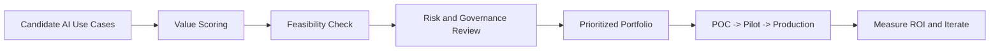

# Enterprise AI Foundations Topic Master

## Overview
This page consolidates the 10 senior-architect AI fundamentals topics into one navigation and study reference, so you do not need to search multiple files.

## Why this topic matters
In architect interviews, these 10 themes are used to test decision quality, risk framing, and business-value alignment before deep implementation details.

## Coverage status (topic-by-topic)
1. **AI vs ML vs GenAI vs Automation vs RPA** - Covered  
   - `senior_architect_cheat_sheet.md` (core positioning, decision rules)
2. **LLM basics** - Covered  
   - `senior_architect_cheat_sheet.md` (LLM, token, context window, embedding)
3. **RAG architecture** - Covered (deep)  
   - `../data-ai/rag_openai_ai_search.md`  
   - `../data-ai/rag_retrieval_engineering_architecture.md`
4. **Copilot vs assistant vs agent** - Covered  
   - `senior_architect_cheat_sheet.md`  
   - `../data-ai/agentic_ai_langchain_langgraph.md`
5. **Single-agent vs multi-agent** - Covered  
   - `senior_architect_cheat_sheet.md`  
   - `../data-ai/agentic_ai_langchain_langgraph.md`
6. **When not to use LLMs** - Covered  
   - `senior_architect_cheat_sheet.md`
7. **Enterprise AI risk categories** - Covered  
   - `senior_architect_cheat_sheet.md`  
   - `../data-ai/guardrails_security_privacy_responsible_ai.md`
8. **Guardrails and governance** - Covered (deep)  
   - `../data-ai/guardrails_security_privacy_responsible_ai.md`  
   - `../data-ai/llmops_observability_evaluation_langsmith_arize.md`
9. **Enterprise AI architecture patterns** - Covered  
   - `senior_architect_cheat_sheet.md`  
   - `../ai-modern-architecture/genai_rag_and_llmops_architecture.md`  
   - `../data-ai/README.md`
10. **ROI and use-case prioritization** - Partially covered (now consolidated here)  
   - Existing partials: `30_day_study_plan.md`, `enterprise_ai_study_handbook.md`

## Detailed topic notes (quick interview framing)

### 1) AI vs ML vs GenAI vs Automation vs RPA
Use the simplest correct tool: automation for deterministic workflows, RPA for UI-driven legacy systems, ML for predictive tasks, GenAI for unstructured language-heavy reasoning.

### 2) LLM basics
LLMs are probabilistic next-token predictors. Core operating levers are prompt quality, context window, retrieval grounding, guardrails, and evaluation loops.

### 3) RAG architecture
RAG quality depends on ingestion, chunking, metadata, ACL filtering, retrieval/rerank quality, and citation validation. Model quality alone is insufficient.

### 4) Copilot vs assistant vs agent
Copilot keeps humans in control. Assistant is reactive conversational support. Agent is goal-driven and autonomous; use autonomy only when measurable value exceeds control risk.

### 5) Single-agent vs multi-agent
Default to single-agent for simplicity. Move to multi-agent only when specialization clearly improves quality, latency, or operational ownership.

### 6) When not to use LLMs
Avoid LLMs for strict deterministic logic, exact arithmetic, hard-regulatory decisions, and high-volume simple workflows where classic systems are safer/cheaper.

### 7) Enterprise AI risk categories
Include privacy, security, accuracy, compliance, bias/fairness, operational drift, governance, and reputational risk. Risk model must map to controls and ownership.

### 8) Guardrails and governance
Guardrails must be layered: input screening, retrieval authorization, tool policy gating, output moderation, audit trails, incident playbooks, and model release governance.

### 9) Enterprise AI architecture patterns
Common patterns: knowledge copilot (RAG), workflow agent with approval gates, document intelligence pipeline, model routing/fallback architecture, HITL risk review.

### 10) ROI and use-case prioritization
Prioritize use cases by value, feasibility, risk, and time-to-impact:
- **Value:** revenue uplift, cost reduction, risk reduction, productivity gain
- **Feasibility:** data readiness, integration complexity, model fit
- **Risk:** compliance impact, safety/accuracy tolerance, blast radius
- **Delivery speed:** pilot effort, ownership clarity, change readiness

Recommended prioritization rubric:  
`Priority Score = (Business Value + Feasibility + Strategic Fit) - (Risk + Delivery Friction)`

## Architecture / flow diagram (prioritization flow)

## Real-world example
A support organization evaluated 12 AI candidates. They prioritized "agent-assist for ticket summarization" first because value and feasibility were high, while compliance risk was manageable. High-risk autonomous case-handling was deferred until guardrails matured.

## Best practices
- Start with low-risk, high-volume, measurable use cases
- Define success metrics before pilot launch
- Tie every use case to risk controls and owner
- Use phased rollout (POC -> pilot -> production) with explicit gates
- Reassess ROI quarterly with telemetry and adoption data

## Common mistakes / misconceptions
- Selecting use cases based on hype instead of measurable value
- Starting with fully autonomous agents before copilots
- Underestimating governance and change-management effort
- Treating model benchmark score as business ROI proxy

## Industry relevance
These 10 topics are now baseline expectations for enterprise architect and principal engineer interviews in AI transformation programs.

## Interview discussion points
- Simplest-safe-solution mindset
- Business value vs control trade-off
- Governance maturity before autonomy
- Portfolio prioritization over one-off demos

## Related/dependent links
- [Senior Architect Cheat Sheet](./senior_architect_cheat_sheet.md)
- [Interview QA Handbook](./interview_qa_handbook.md)
- [Enterprise AI Study Handbook](./enterprise_ai_study_handbook.md)
- [Data-AI README](../data-ai/README.md)
