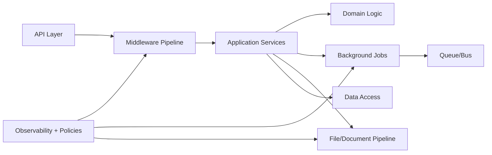

# Enterprise Design Patterns and Runtime Architecture

## Overview
This page provides architect-level guidance for application architecture in enterprise systems: design patterns, dependency injection, middleware pipelines, background processing, workflow orchestration, file/document processing, and performance-memory optimization.

## Why this topic matters
Application architecture quality directly affects delivery speed, maintainability, security posture, reliability, and total operating cost. Senior architect interviews assess whether you can choose patterns based on context and trade-offs, not by checklist memorization.

## Core concepts
- Enterprise application architecture styles and boundaries
- Design patterns and anti-patterns in real systems
- Dependency Injection and composition roots
- Middleware and request pipeline governance
- Background processing and async workload design
- Workflow and orchestration models
- File/document processing architecture
- Performance and memory optimization strategy

## Detailed explanation of each concept
Strong application architecture begins with clear boundaries and ownership models. Patterns should be selected to solve specific failure modes or scaling limits, not because they are popular. Dependency injection improves testability and modularity when used with disciplined interfaces and lifetimes; overuse can create hidden complexity.

Middleware and request pipelines should enforce cross-cutting concerns consistently (auth, observability, rate limits, policy). Background processing design must address idempotency, retries, poison handling, and operational observability. Workflow orchestration choices should be tied to consistency and failure-handling requirements. File/document processing systems need explicit control over throughput, validation, security scanning, and lifecycle retention. Performance and memory optimization should follow telemetry-driven bottleneck analysis rather than premature micro-optimizations.

## Evaluation (How to assess architecture quality)
- Change lead time and deployment failure rate
- Defect recurrence and maintainability indicators
- p95 latency and resource utilization trends
- Queue lag and background job success rates
- Memory pressure and GC pause impact
- Security incident rate tied to app-layer controls
- Architecture conformance and policy compliance

## Architecture / flow diagram


**Flow explanation:**  
Request and async paths share cross-cutting controls through middleware, policy, and observability. Domain/application boundaries separate business behavior from transport and infrastructure concerns.

## Real-world example
A claims platform uses layered services with DI and policy-based middleware for authentication, tracing, and rate limiting. Claim document ingestion runs in async workers with malware scanning, OCR extraction, and retry/DLQ controls. Domain workflows are orchestrated with compensating actions for partial failures. Performance tuning focuses on queue bottlenecks, DB round-trips, and memory spikes under large file uploads.

## Best practices
- Keep architecture boundaries explicit and enforceable
- Use pattern selection by problem context and measurable need
- Design background processing with idempotency and observability first
- Treat middleware as policy enforcement layer, not business logic layer
- Apply file/document security scanning and validation early in pipeline
- Optimize performance based on profiling and production telemetry

## Common mistakes / misconceptions
- Pattern overuse without clear problem statement
- DI container abuse causing hidden runtime complexity
- Putting business logic in middleware
- Async processing without retry/idempotency governance
- File processing without security and lifecycle controls
- Premature optimization without bottleneck evidence

## Industry relevance
Application architecture decisions are central in architect interviews because they reveal whether you can deliver maintainable, secure, and scalable systems under real constraints.

## Interview discussion points
- How to choose clean/layered/hexagonal boundaries pragmatically
- How to balance simplicity and extensibility in pattern selection
- How to design safe async processing for enterprise workflows
- How to optimize runtime behavior without harming maintainability
- How to align application architecture with governance and platform standards

## Links to dependent / related topics
- [Application Architecture Overview](./README.md)
- [.NET Azure Interview Handbook](../dotnet/azure_dotnet_interview_handbook.md)
- [Compute Architecture](../compute/compute_architecture.md)
- [Integration Architecture](../integration/apim_messaging_eventing.md)
- [Reliability Operations](../reliability-operations/ha_dr_sli_slo_incident_capacity.md)

## Interview Questions (50)
1. How do you choose application architecture style for enterprise systems?
2. Layered vs clean vs hexagonal: how do you decide?
3. What are common enterprise design patterns and when to apply them?
4. What are common architecture anti-patterns in large applications?
5. How do you define bounded context boundaries in applications?
6. How do you separate domain logic from infrastructure concerns?
7. What is Dependency Injection and why does it matter?
8. How do you choose DI lifetimes safely?
9. How do you avoid DI container anti-patterns?
10. What is composition root and why is it important?
11. How do you design middleware pipeline responsibilities?
12. What concerns belong in middleware vs application services?
13. How do you design authn/authz in middleware safely?
14. How do you integrate tracing and correlation in request pipeline?
15. How do you enforce request validation and policy controls?
16. How do you design background processing architecture?
17. Queue workers vs in-process background tasks: how to choose?
18. How do you design retry and DLQ strategy for jobs?
19. How do you ensure idempotency in background jobs?
20. How do you design scheduling and cron-style workloads?
21. How do you design workflow orchestration for long-running processes?
22. Orchestration vs choreography in app workflows: when to choose?
23. How do you handle compensating actions in workflow failures?
24. How do you design state tracking for workflow execution?
25. How do you design file upload architecture for enterprise scale?
26. How do you secure file/document processing pipelines?
27. How do you design OCR/document extraction workflows?
28. How do you handle large file throughput and backpressure?
29. How do you design document lifecycle and retention controls?
30. How do you optimize API performance in application layer?
31. How do you identify bottlenecks before optimization?
32. How do you optimize database access in application architecture?
33. How do you optimize serialization and payload behavior?
34. How do you design memory-efficient runtime behavior?
35. How do you reduce GC pressure in high-throughput APIs?
36. How do you manage connection pooling and client lifecycles?
37. How do you apply caching at application layer safely?
38. How do you design feature flags in application architecture?
39. How do you design zero-downtime deployment compatibility?
40. How do you handle schema and contract evolution safely?
41. How do you design observability in application architecture?
42. How do you define application-level SLIs/SLOs?
43. How do you design operational readiness for app teams?
44. How do you govern code quality and architecture conformance?
45. How do you align app architecture with security/compliance controls?
46. How do you scale application architecture across multiple teams?
47. How do you run architecture reviews effectively?
48. How do you modernize legacy application architecture incrementally?
49. How do you measure application architecture success?
50. How do you conclude application architecture interview answers strongly?

## Answers for important questions (Summary + Crisp + Deep)

### Q1. How do you choose application architecture style for enterprise systems?
**Question summary:** Architecture style selection based on context and constraints.  
**Crisp answer (7-8 lines):** Choose style from business complexity, team structure, and change frequency. Simple domains may use layered architecture. Complex domains with integration variability may benefit from clean or hexagonal styles. Optimize for maintainability and delivery speed, not purity. Align architecture style to skills and governance maturity.  
**Deep explanation:** Architecture style selection should start from business volatility, domain complexity, and operational constraints rather than framework defaults. Layered style can be effective for straightforward CRUD-centric systems with limited integration complexity. Clean/hexagonal patterns provide stronger boundary control when domain logic must remain stable while adapters, integrations, and transport layers change frequently. Architects should also evaluate team topology and skill maturity, because highly abstract styles can increase cognitive load if the organization is not prepared. Strong interview answers acknowledge that style can evolve over time as domain and scale characteristics change.  
**Answer summary:**  
- Match style to domain complexity, change rate, and team capability.  
- Prefer pragmatic maintainability over architectural ideology.  
- Treat architecture style as an evolving decision, not a permanent label.  
**Simple diagram:**  
```text
Context factors -> style choice (layered/clean/hexagonal)
```
**Trusted reference links:**  
- https://learn.microsoft.com/en-us/azure/architecture/guide/architecture-styles/

### Q2. Layered vs clean vs hexagonal: how do you decide?
**Question summary:** Comparative decision framework for common architecture styles.  
**Crisp answer (7-8 lines):** Layered is simpler and faster for low-complexity domains. Clean/hexagonal improve domain isolation and testability for complex business logic. Choose clean/hexagonal when integration churn is high and business rules are critical. Use layered when delivery simplicity is priority and boundaries remain manageable.  
**Deep explanation:** Layered architecture provides familiar structure and lower onboarding overhead, which can accelerate delivery for simpler systems. Clean and hexagonal approaches are valuable when domain logic needs protection from framework and integration volatility, enabling longer-term maintainability and testing quality. The trade-off is additional abstraction and discipline requirements. Architects should make decision criteria explicit: domain complexity, expected adapter churn, team experience, and governance rigor. In interviews, strong answers include migration path between styles rather than framing them as mutually exclusive absolutes.  
**Answer summary:**  
- Layered favors simplicity; clean/hexagonal favor domain protection and adaptability.  
- Decision hinges on complexity, integration volatility, and team readiness.  
- Plan style transitions incrementally when system complexity evolves.  
**Simple diagram:**  
```text
Low complexity -> layered | High domain complexity -> clean/hexagonal
```
**Trusted reference links:**  
- https://learn.microsoft.com/en-us/dotnet/architecture/modern-web-apps-azure/common-web-application-architectures

### Q3. What are common enterprise design patterns and when to apply them?
**Question summary:** Pattern applicability model for enterprise systems.  
**Crisp answer (7-8 lines):** Common patterns include repository, unit-of-work, strategy, adapter, facade, circuit-breaker, outbox, and CQRS. Apply patterns to solve specific recurring problems. Avoid pattern-first design. Evaluate trade-offs in complexity, testability, and runtime behavior. Use minimal pattern set needed.  
**Deep explanation:** Design patterns are reusable problem-solution templates, not architecture goals. In enterprise systems, the best pattern choice depends on the specific failure mode or change pressure being addressed. For example, outbox improves consistency across DB/message boundaries, strategy supports runtime behavior variability, and facade simplifies integration complexity. Over-patterning introduces accidental complexity and slows onboarding. Senior architects should explain both the benefit and the operational cost of each chosen pattern to demonstrate mature decision-making.  
**Answer summary:**  
- Use patterns to solve concrete recurring problems, not for stylistic completeness.  
- Each pattern adds both value and maintenance overhead that must be justified.  
- Keep pattern usage minimal, explicit, and aligned to measurable architecture needs.  
**Simple diagram:**  
```text
Problem type -> fit-for-purpose pattern -> controlled complexity
```
**Trusted reference links:**  
- https://learn.microsoft.com/en-us/azure/architecture/patterns/

### Q4. What are common architecture anti-patterns in large applications?
**Question summary:** High-risk anti-pattern identification and prevention.  
**Crisp answer (7-8 lines):** Common anti-patterns include god services, shared mutable state, tight coupling, anemic domain models, and hidden cross-layer dependencies. Also common are unbounded synchronous chains and missing idempotency in async flows. These increase fragility and change cost. Prevent through clear boundaries, ownership, and architecture reviews.  
**Deep explanation:** Anti-patterns usually emerge gradually when delivery pressure outpaces architectural governance. God services centralize unrelated responsibilities, making regression risk and deployment coupling severe. Hidden dependencies and cross-layer leakage reduce testability and make change impact unpredictable. Excessive synchronous chains amplify failures and latency tails in distributed environments. Architects should combine standards, static analysis, and review rituals to detect and reverse anti-pattern growth before systems become operationally brittle.  
**Answer summary:**  
- Anti-patterns are often governance and boundary failures, not tooling failures.  
- They increase instability, deployment friction, and long-term maintenance cost.  
- Early detection and corrective refactoring must be built into delivery workflow.  
**Simple diagram:**  
```text
Weak boundaries -> coupling growth -> fragility
```
**Trusted reference links:**  
- https://learn.microsoft.com/en-us/azure/architecture/antipatterns/

### Q5. How do you define bounded context boundaries in applications?
**Question summary:** Domain boundary design in enterprise applications.  
**Crisp answer (7-8 lines):** Define boundaries around business language, ownership, and lifecycle independence. Separate contexts when models diverge semantically. Avoid sharing domain models across unrelated capabilities. Use explicit contracts between contexts. Align context ownership with team responsibilities.  
**Deep explanation:** Bounded contexts reduce semantic ambiguity and organizational coupling by ensuring each domain area owns its language, rules, and evolution pace. Without clear contexts, teams reuse models across domains with different meanings, causing correctness drift and integration friction. Architects should map contexts using business process analysis, ownership structure, and change frequency patterns. Explicit API/event contracts between contexts preserve autonomy while enabling collaboration.  
**Answer summary:**  
- Bound contexts by business meaning, ownership, and change independence.  
- Separate models where semantics differ to avoid cross-domain confusion.  
- Use explicit contracts to keep context integration controlled and evolvable.  
**Simple diagram:**  
```text
Context A <-> explicit contract <-> Context B
```
**Trusted reference links:**  
- https://learn.microsoft.com/en-us/azure/architecture/microservices/model/domain-analysis

### Q6. How do you separate domain logic from infrastructure concerns?
**Question summary:** Domain/infrastructure isolation strategy.  
**Crisp answer (7-8 lines):** Keep domain logic pure and independent of frameworks and transport details. Use ports/adapters or service abstractions for external dependencies. Place infrastructure implementation in outer layers. Keep domain tests isolated from infrastructure mocks where possible. Enforce layering rules in code review/automation.  
**Deep explanation:** Domain-infrastructure separation protects business rules from technology churn and makes core behavior easier to test and evolve. When domain logic directly depends on frameworks, databases, or messaging clients, business changes become coupled to technical migrations. Architects should enforce dependency direction (domain inward) and provide adapter layers for integration points. This separation improves maintainability and supports platform modernization with lower risk.  
**Answer summary:**  
- Keep core business behavior independent from infrastructure implementation details.  
- Use abstraction and adapter layers to isolate external dependencies.  
- Enforce dependency direction through governance and code-level controls.  
**Simple diagram:**  
```text
Domain core <- interfaces -> infrastructure adapters
```
**Trusted reference links:**  
- https://learn.microsoft.com/en-us/dotnet/architecture/modern-web-apps-azure/architectural-principles

### Q7. What is Dependency Injection and why does it matter?
**Question summary:** DI purpose in maintainable enterprise codebases.  
**Crisp answer (7-8 lines):** DI provides dependencies from outside components instead of hard-coding them internally. It improves modularity, testability, and substitution of implementations. It reduces tight coupling and promotes clear contracts. It enables policy-driven composition at startup/runtime.  
**Deep explanation:** Dependency Injection improves architectural flexibility by separating what a component does from how its collaborators are instantiated. This enables easier testing, environment-specific wiring, and progressive implementation changes without rewriting business logic. In enterprise systems, DI also supports policy-based composition (e.g., retries, logging decorators, feature toggles). Architects should mention that DI value depends on disciplined interface design and lifetime management; otherwise, complexity shifts into container configuration chaos.  
**Answer summary:**  
- DI reduces coupling and improves modular testable application design.  
- It supports flexible runtime composition and environment-specific behavior.  
- DI requires disciplined contracts and lifecycle governance to stay beneficial.  
**Simple diagram:**  
```text
Component <- injected dependency contract -> implementation
```
**Trusted reference links:**  
- https://learn.microsoft.com/en-us/dotnet/core/extensions/dependency-injection

### Q8. How do you choose DI lifetimes safely?
**Question summary:** Service lifetime selection and runtime safety.  
**Crisp answer (7-8 lines):** Choose singleton for stateless shared components, scoped for request-bound services, and transient for lightweight isolated operations. Avoid capturing scoped dependencies in singletons. Validate thread safety for singletons. Use profiling and review to confirm lifetime behavior.  
**Deep explanation:** DI lifetime mistakes cause subtle memory leaks, concurrency bugs, and cross-request state corruption. Singleton services must be thread-safe and free from request-specific state. Scoped services should align with request/operation boundaries and must not leak into long-lived contexts. Transients can increase allocation churn if overused in hot paths. Architects should require lifetime review standards and runtime diagnostics to detect misconfigurations early.  
**Answer summary:**  
- Lifetime selection is a correctness and performance decision, not just coding style.  
- Enforce scope safety and thread-safety rules for singleton/scoped interactions.  
- Monitor runtime behavior to catch allocation or state-leak issues early.  
**Simple diagram:**  
```text
Singleton / Scoped / Transient -> behavior and safety implications
```
**Trusted reference links:**  
- https://learn.microsoft.com/en-us/dotnet/core/extensions/dependency-injection#service-lifetimes

### Q9. How do you avoid DI container anti-patterns?
**Question summary:** Preventing DI misuse in large applications.  
**Crisp answer (7-8 lines):** Avoid service locator usage and hidden container access. Keep constructor dependencies focused and meaningful. Prevent giant object graphs with unclear ownership. Use composition root for registration clarity. Validate registrations and lifetime mismatches in CI.  
**Deep explanation:** DI anti-patterns often emerge when teams bypass explicit dependency design and rely on runtime container lookups or overly generic abstractions. This hides coupling and makes testing and debugging harder. Large constructor signatures often indicate misplaced responsibilities and should trigger refactoring. Architects should enforce container governance, including registration conventions, validation tests, and ownership boundaries for modules.  
**Answer summary:**  
- Keep DI explicit and avoid hidden runtime container access patterns.  
- Treat oversized dependency graphs as architecture-smell indicators.  
- Govern registration/lifetime quality with automated validation and reviews.  
**Simple diagram:**  
```text
Explicit DI contracts > hidden service locator patterns
```
**Trusted reference links:**  
- https://learn.microsoft.com/en-us/dotnet/core/extensions/dependency-injection-guidelines

### Q10. What is composition root and why is it important?
**Question summary:** Composition root role in controlled application wiring.  
**Crisp answer (7-8 lines):** Composition root is the place where object graph is assembled. It centralizes dependency wiring, policy decorators, and environment-specific registrations. It keeps wiring concerns out of domain logic. It improves maintainability and startup clarity.  
**Deep explanation:** Composition root provides a single, governed entry point for dependency assembly, making runtime behavior predictable and auditable. Without it, registration logic spreads across modules and becomes difficult to reason about, especially in multi-team codebases. Architects should use composition root to enforce cross-cutting policies (resilience decorators, observability wrappers, feature flags) consistently. This pattern improves maintainability and reduces accidental configuration drift across environments.  
**Answer summary:**  
- Composition root centralizes wiring and policy composition responsibilities.  
- It keeps business code free from container/configuration concerns.  
- Centralized wiring improves runtime predictability and governance at scale.  
**Simple diagram:**  
```text
Composition root -> configured object graph -> app runtime
```
**Trusted reference links:**  
- https://learn.microsoft.com/en-us/dotnet/architecture/modern-web-apps-azure/develop-asp-net-core-mvc-apps

### Q11. How do you design middleware pipeline responsibilities?
**Question summary:** Middleware boundary and ordering strategy.  
**Crisp answer (7-8 lines):** Middleware should handle cross-cutting concerns like auth, logging, correlation, rate limits, and error handling. Keep it policy-centric and lightweight. Define deterministic ordering rules. Avoid domain business logic in middleware. Validate behavior through integration tests.  
**Deep explanation:** Middleware is the control plane for request lifecycle governance. Its value comes from consistent enforcement of cross-cutting concerns before requests reach business services. Ordering matters because authentication, authorization, validation, observability, and exception handling interact in sequence-sensitive ways. Architects should define pipeline standards and anti-pattern boundaries to prevent middleware from becoming a hidden business logic layer. This preserves clarity and testability in application services.  
**Answer summary:**  
- Middleware should enforce platform policies, not business rules.  
- Deterministic ordering is essential for security and observability correctness.  
- Pipeline behavior should be governed and verified with integration tests.  
**Simple diagram:**  
```text
Request -> middleware policies -> application service
```
**Trusted reference links:**  
- https://learn.microsoft.com/en-us/aspnet/core/fundamentals/middleware/

### Q12. What concerns belong in middleware vs application services?
**Question summary:** Clear responsibility split in request processing.  
**Crisp answer (7-8 lines):** Middleware handles cross-cutting platform concerns. Application services handle use-case orchestration and business workflows. Domain rules stay in domain layer. Keep validation split: generic protocol checks in middleware, business validation in services/domain. Avoid overlap to reduce ambiguity.  
**Deep explanation:** Responsibility clarity prevents duplication and hidden coupling across layers. Middleware should remain generic and reusable across endpoints, while application services coordinate use-case behavior specific to domain operations. If business decisions leak into middleware, testability and maintainability decline quickly. Architects should enforce these boundaries through coding standards and review checklists to maintain architecture integrity as teams grow.  
**Answer summary:**  
- Middleware = cross-cutting platform policies; services/domain = business behavior.  
- Keep validation responsibilities split by scope and semantic purpose.  
- Clear boundaries reduce duplication, ambiguity, and maintenance overhead.  
**Simple diagram:**  
```text
Cross-cutting checks -> app orchestration -> domain decisions
```
**Trusted reference links:**  
- https://learn.microsoft.com/en-us/dotnet/architecture/modern-web-apps-azure/architectural-principles

### Q13. How do you design authn/authz in middleware safely?
**Question summary:** Secure request-gating architecture.  
**Crisp answer (7-8 lines):** Authenticate early and authorize per endpoint/use-case policy. Use least-privilege claims mapping and centralized policy definitions. Deny by default for unknown paths. Log decision context for auditability. Keep token validation robust and time-synchronized.  
**Deep explanation:** Safe authn/authz design requires both cryptographic correctness and policy governance clarity. Authentication middleware should verify identity token integrity, issuer, audience, and expiry with resilient key-rotation behavior. Authorization should enforce role/scope/policy checks tied to business operations, not generic broad grants. Architects should include audit logging and policy versioning to support compliance and incident investigation. This strengthens security posture without scattering access logic through code.  
**Answer summary:**  
- Authenticate early, authorize explicitly, and deny by default.  
- Keep policy definitions centralized, versioned, and auditable.  
- Secure token validation and least-privilege mapping are non-negotiable controls.  
**Simple diagram:**  
```text
AuthN -> AuthZ policy check -> app execution
```
**Trusted reference links:**  
- https://learn.microsoft.com/en-us/aspnet/core/security/authorization/introduction

### Q14. How do you integrate tracing and correlation in request pipeline?
**Question summary:** End-to-end observability correlation architecture.  
**Crisp answer (7-8 lines):** Generate or propagate correlation IDs at ingress. Attach IDs across logs, traces, and downstream calls. Include async hops and background jobs. Standardize propagation headers and context handling. Verify continuity in integration tests. Use traces for latency and failure analysis.  
**Deep explanation:** Distributed tracing and correlation are essential for root-cause analysis in service-oriented systems. Architects should ensure ingress middleware sets trace context consistently and that downstream libraries propagate context across HTTP, messaging, and job-processing boundaries. Missing propagation across async boundaries is a common blind spot. Strong implementation includes telemetry standards, sampling strategy, and dashboard views that align with user journeys and incident workflows.  
**Answer summary:**  
- Correlation must be established at ingress and preserved across all sync/async hops.  
- Standardized context propagation enables fast distributed troubleshooting.  
- Test and monitor trace continuity as a reliability control, not optional instrumentation.  
**Simple diagram:**  
```text
Request ID -> service calls -> queue/job -> unified trace
```
**Trusted reference links:**  
- https://learn.microsoft.com/en-us/azure/azure-monitor/app/distributed-trace-data

### Q15. How do you enforce request validation and policy controls?
**Question summary:** Input and policy enforcement model.  
**Crisp answer (7-8 lines):** Validate protocol/schema at edge and business rules in application/domain layers. Apply rate limits, payload limits, and threat checks in middleware/gateway. Reject invalid requests early with clear error semantics. Log policy rejections for audit and tuning. Keep validation rules versioned and testable.  
**Deep explanation:** Validation and policy controls are most effective when applied in layers aligned to concern type. Edge/middleware should block malformed or abusive traffic quickly to protect system resources. Application and domain layers should enforce business semantics and invariants with clear feedback. Architects should avoid duplicated validation logic across layers and should instrument rejection reasons for security and usability improvement. This improves resilience and governance transparency.  
**Answer summary:**  
- Layer validation by concern: protocol at edge, business rules in domain flow.  
- Enforce protective controls early to reduce attack and overload risk.  
- Version and observe validation policies to maintain accuracy and usability.  
**Simple diagram:**  
```text
Edge validation -> app validation -> domain invariants
```
**Trusted reference links:**  
- https://learn.microsoft.com/en-us/azure/architecture/framework/security/design-safe-deployments

### Q16. How do you design background processing architecture?
**Question summary:** Async architecture design for enterprise workloads.  
**Crisp answer (7-8 lines):** Decouple long-running/non-interactive work from request path. Use queues/brokers and worker services. Design idempotency, retries, timeout, and DLQ behavior explicitly. Track queue lag and job success SLIs. Separate job types by criticality and resource profile.  
**Deep explanation:** Background processing should be treated as first-class runtime architecture, not utility code. Request threads should hand off work quickly to durable queues to protect API latency and user experience. Worker design must include idempotency and failure handling because retries and duplicate deliveries are normal in distributed systems. Architects should partition workloads to prevent low-priority jobs from starving critical operations and should provide strong observability for lag, error patterns, and throughput.  
**Answer summary:**  
- Move non-interactive work off request path with durable async orchestration.  
- Reliability depends on idempotency, retry governance, and DLQ discipline.  
- Partition and monitor worker workloads by criticality to avoid hidden starvation.  
**Simple diagram:**  
```text
API -> queue -> worker -> outcome store
```
**Trusted reference links:**  
- https://learn.microsoft.com/en-us/azure/architecture/patterns/async-request-reply

### Q17. Queue workers vs in-process background tasks: how to choose?
**Question summary:** Background execution model selection trade-off.  
**Crisp answer (7-8 lines):** In-process tasks are simpler for lightweight local operations. Queue workers are better for durable, scalable, and decoupled workloads. Use workers for critical jobs needing retries, isolation, and independent scaling. Avoid long tasks in web process. Decide by durability and scalability requirements.  
**Deep explanation:** In-process execution can be acceptable for short-lived, non-critical tasks that can fail without major consequence. For enterprise workloads requiring durability, observability, and independent scaling, queue-backed workers are safer and more operable. Web-process tasks are vulnerable to restarts and deployment interruptions, making them risky for critical workflows. Architects should map execution model to failure tolerance and operational control requirements.  
**Answer summary:**  
- In-process tasks suit simple non-critical jobs with minimal durability needs.  
- Queue workers suit critical scalable workloads with failure-handling requirements.  
- Choose model by durability, isolation, and scaling expectations.  
**Simple diagram:**  
```text
Simple task -> in-process | durable task -> queue worker
```
**Trusted reference links:**  
- https://learn.microsoft.com/en-us/azure/architecture/best-practices/background-jobs

### Q18. How do you design retry and DLQ strategy for jobs?
**Question summary:** Retry/DLQ governance for async reliability.  
**Crisp answer (7-8 lines):** Classify errors into transient and terminal categories. Apply bounded retries with exponential backoff and jitter. Route terminal/poison messages to DLQ with context. Define DLQ triage ownership and replay policy. Track retry and DLQ rates as SLIs.  
**Deep explanation:** Retry strategy should prevent both silent data loss and retry storms. Transient failures can often be recovered with controlled retry behavior, while terminal failures should move quickly to DLQ for investigation. DLQ governance is essential: without ownership and replay processes, DLQs become hidden failure sinks. Architects should include observability and alerting for retry escalation and DLQ accumulation to maintain operational reliability.  
**Answer summary:**  
- Separate transient and terminal failures to control retry behavior safely.  
- DLQ is a governed workflow requiring ownership and replay strategy.  
- Monitor retry/DLQ metrics to prevent hidden async reliability debt.  
**Simple diagram:**  
```text
Job fail -> retry policy -> DLQ if terminal/exhausted
```
**Trusted reference links:**  
- https://learn.microsoft.com/en-us/azure/service-bus-messaging/service-bus-dead-letter-queues

### Q19. How do you ensure idempotency in background jobs?
**Question summary:** Idempotency controls for repeated job execution.  
**Crisp answer (7-8 lines):** Use deterministic operation IDs and dedup keys. Track processed state safely. Ensure repeated execution does not duplicate side effects. Design external calls with idempotency tokens where possible. Validate idempotency in replay tests and chaos scenarios.  
**Deep explanation:** Idempotency is mandatory in async systems because retries and duplicate deliveries cannot be eliminated fully. Architects should define idempotency boundaries at business-operation level, not just message-level metadata. Safe implementations include dedup stores, optimistic concurrency checks, and side-effect guards for external integrations. Testing should explicitly include replay and out-of-order delivery scenarios to prove correctness under failure conditions.  
**Answer summary:**  
- Assume duplicate execution will happen and design for safe repeats.  
- Implement operation-level idempotency controls with durable state tracking.  
- Prove idempotency through replay/failure test scenarios, not assumptions.  
**Simple diagram:**  
```text
Repeat job -> idempotency check -> single business effect
```
**Trusted reference links:**  
- https://learn.microsoft.com/en-us/azure/architecture/patterns/idempotent-message-processing

### Q20. How do you design scheduling and cron-style workloads?
**Question summary:** Scheduled workload architecture model.  
**Crisp answer (7-8 lines):** Define schedule ownership, concurrency policy, and timeout controls. Keep jobs idempotent and observable. Avoid overlapping runs unless explicitly safe. Use distributed locks or orchestration controls where needed. Capture execution history and SLA metrics.  
**Deep explanation:** Scheduled workloads often become hidden reliability risks when treated as simple cron scripts without governance. Architects should design them as managed workflows with run-state tracking, retries, dead-letter paths, and alerting on misses/overruns. Concurrency control is critical for preventing duplicate processing and resource contention. Strong designs include dependency health checks and fallback plans when schedules are missed.  
**Answer summary:**  
- Treat scheduled jobs as governed production workflows, not ad hoc scripts.  
- Control overlap, timeout, and concurrency explicitly to avoid hidden failures.  
- Monitor schedule adherence and execution outcomes as operational SLIs.  
**Simple diagram:**  
```text
Scheduler -> job execution policy -> monitored outcomes
```
**Trusted reference links:**  
- https://learn.microsoft.com/en-us/azure/architecture/best-practices/background-jobs

### Q21. How do you design workflow orchestration for long-running processes?
**Question summary:** Long-running workflow architecture design.  
**Crisp answer (7-8 lines):** Use explicit workflow state model and durable checkpoints. Separate orchestration logic from task execution. Include timeout, retry, and compensation paths. Track progress and correlation IDs across steps. Support pause/resume and manual intervention where needed.  
**Deep explanation:** Long-running workflows require durable state and deterministic step transitions because failures, retries, and human approvals are expected. Orchestration engines should coordinate execution while workers perform isolated tasks. Architects must define failure semantics and compensation strategy per step to avoid partial-completion ambiguity. Observability and audit trails are essential for compliance-heavy enterprise processes.  
**Answer summary:**  
- Durable state and explicit transitions are core to reliable long-running workflows.  
- Keep orchestration coordination separate from task implementation details.  
- Design compensation, observability, and intervention paths from the start.  
**Simple diagram:**  
```text
Workflow state -> step tasks -> checkpoint -> next state
```
**Trusted reference links:**  
- https://learn.microsoft.com/en-us/azure/azure-functions/durable/durable-functions-overview

### Q22. Orchestration vs choreography in app workflows: when to choose?
**Question summary:** Centralized vs event-driven workflow coordination decision.  
**Crisp answer (7-8 lines):** Choose orchestration when process visibility, control, and auditability are critical. Choose choreography when loose coupling and independent evolution are priorities. Orchestration simplifies end-to-end control but can centralize complexity. Choreography scales autonomy but can reduce global observability. Hybrid patterns are common.  
**Deep explanation:** Orchestration and choreography are coordination styles with different governance and operability characteristics. Orchestration provides explicit control flow and easier compliance traceability, useful for regulated workflows with strict process guarantees. Choreography promotes autonomy and decoupling through event-driven interactions but requires stronger observability and contract governance to prevent emergent complexity. Architects should explain selection by domain criticality, organizational structure, and operational maturity.  
**Answer summary:**  
- Orchestration favors control and auditability; choreography favors autonomy and decoupling.  
- Both styles have complexity trade-offs in visibility and governance.  
- Choose by domain risk and team operating model, often with hybrid adoption.  
**Simple diagram:**  
```text
Central orchestrator vs event-driven peer interactions
```
**Trusted reference links:**  
- https://learn.microsoft.com/en-us/azure/architecture/patterns/choreography

### Q23. How do you handle compensating actions in workflow failures?
**Question summary:** Compensation design for partial-failure recovery.  
**Crisp answer (7-8 lines):** Define forward and reverse actions per workflow step. Trigger compensation on failure boundaries with clear ordering. Keep compensation idempotent and observable. Record compensation outcomes for audit. Avoid assuming hard rollback in distributed workflows.  
**Deep explanation:** Distributed workflows cannot rely on single-transaction rollback semantics, so compensation patterns are required for business consistency. Architects should model which side effects are reversible, which are offsettable, and which require manual intervention. Compensation logic must be tested under retries, duplicate signals, and concurrent failures. A clear compensation ledger improves auditability and operational confidence during incident triage.  
**Answer summary:**  
- Compensation replaces global rollback in distributed long-running workflows.  
- Define reversible/offset actions and test them under failure/retry conditions.  
- Keep compensation execution auditable, idempotent, and operationally observable.  
**Simple diagram:**  
```text
Step failure -> compensation chain -> consistent business state
```
**Trusted reference links:**  
- https://learn.microsoft.com/en-us/azure/architecture/patterns/compensating-transaction

### Q24. How do you design state tracking for workflow execution?
**Question summary:** Workflow state management architecture.  
**Crisp answer (7-8 lines):** Model explicit workflow states and transitions. Persist state durably with versioning. Include correlation metadata and event history. Support replay and recovery logic. Keep state schema evolution backward compatible. Monitor stuck/inconsistent states.  
**Deep explanation:** Workflow state tracking enables deterministic recovery, observability, and compliance evidence across long-running processes. A robust model includes state machine semantics, transition constraints, and durable event history. Architects should design for replay safety and state schema evolution so workflows remain operable across application releases. Operational dashboards should detect stalled states and transition anomalies before business impact grows.  
**Answer summary:**  
- Explicit durable state modeling is essential for reliable workflow operations.  
- Include correlation, history, and versioning for replay-safe recovery.  
- Monitor state health continuously to detect stalled or inconsistent executions.  
**Simple diagram:**  
```text
State store + event history -> workflow progress/recovery
```
**Trusted reference links:**  
- https://learn.microsoft.com/en-us/azure/azure-functions/durable/durable-functions-concepts

### Q25. How do you design file upload architecture for enterprise scale?
**Question summary:** Scalable and secure file ingestion design.  
**Crisp answer (7-8 lines):** Use staged upload endpoints with size/type validation and chunked transfer support. Store files in durable object storage. Offload processing to async workers. Track upload state and integrity checks. Isolate metadata from binary content. Enforce quotas and throttling.  
**Deep explanation:** Enterprise file upload design must handle throughput spikes, large object sizes, and security controls while preserving user experience. Staged upload approaches with signed URLs or tokenized upload sessions reduce API server load and improve scalability. Architects should include checksum validation, resumable uploads, and explicit metadata lifecycle controls. Decoupling upload from processing protects request latency and improves reliability.  
**Answer summary:**  
- Separate upload transport from processing to scale and protect API performance.  
- Enforce validation, integrity checks, and quota controls at ingestion boundary.  
- Use durable storage + async pipeline for resilient enterprise file workflows.  
**Simple diagram:**  
```text
Client upload -> object store -> async processing pipeline
```
**Trusted reference links:**  
- https://learn.microsoft.com/en-us/azure/architecture/best-practices/api-design

### Q26. How do you secure file/document processing pipelines?
**Question summary:** Security controls for document workflows.  
**Crisp answer (7-8 lines):** Apply malware scanning, MIME/type validation, content sanitization, and access controls. Isolate processing environments from core services. Encrypt data at rest/in transit. Restrict execution of embedded content. Audit document access and transformations.  
**Deep explanation:** File/document pipelines are high-risk attack surfaces due to untrusted input and potential payload complexity. Architects should implement layered controls: pre-ingest validation, malware scanning, sandboxed processing, and strict egress restrictions for processing workers. Sensitive documents need classification-aware handling, masking/redaction controls, and comprehensive audit trails. Security must be integrated into each processing stage, not bolted on after ingestion.  
**Answer summary:**  
- Treat document ingestion as untrusted input and apply layered defense controls.  
- Use sandboxed processing and strict access policies for sensitive content.  
- Maintain full auditability across scan, transform, and access operations.  
**Simple diagram:**  
```text
Upload -> scan/sanitize -> isolated processing -> controlled access
```
**Trusted reference links:**  
- https://learn.microsoft.com/en-us/azure/security/fundamentals/

### Q27. How do you design OCR/document extraction workflows?
**Question summary:** OCR pipeline architecture with quality governance.  
**Crisp answer (7-8 lines):** Use async extraction pipeline with preprocessing, OCR, post-validation, and confidence scoring. Store raw and extracted artifacts with lineage links. Route low-confidence outputs to human review. Version extraction models/rules. Monitor quality drift over time.  
**Deep explanation:** OCR workflows should be designed as quality-controlled data pipelines rather than one-step processing calls. Preprocessing improves extraction accuracy, while post-processing validates structural and semantic plausibility. Confidence thresholds and human-in-the-loop paths are critical for regulated or high-stakes domains. Architects should include lineage and model/version metadata so extracted data can be audited, retrained, and corrected systematically.  
**Answer summary:**  
- Build OCR as staged pipeline with confidence-aware quality controls.  
- Preserve lineage between source documents and extracted structured outputs.  
- Include human review and model-version governance for high-trust use cases.  
**Simple diagram:**  
```text
Document -> preprocess -> OCR -> validate -> human review if low confidence
```
**Trusted reference links:**  
- https://learn.microsoft.com/en-us/azure/ai-services/document-intelligence/

### Q28. How do you handle large file throughput and backpressure?
**Question summary:** Throughput control for heavy document workloads.  
**Crisp answer (7-8 lines):** Use chunked uploads, queue buffering, worker autoscaling, and admission controls. Apply backpressure policies when processing capacity is saturated. Prioritize critical workloads by class. Track queue depth, age, and processing latency. Protect downstream dependencies.  
**Deep explanation:** Large-file systems are vulnerable to overload and cascading failures if ingress rate exceeds processing capacity. Architects should design explicit pressure valves: upload throttling, queue capacity limits, worker concurrency tuning, and workload prioritization. Backpressure should be communicated clearly to clients with retry guidance and SLA expectations. This keeps system behavior stable under burst conditions and prevents hidden operational debt.  
**Answer summary:**  
- Control ingress and processing rates explicitly to prevent overload cascades.  
- Use queue depth/age metrics to trigger scaling and backpressure actions.  
- Prioritize workloads to protect critical processing paths during saturation.  
**Simple diagram:**  
```text
High upload rate -> queue -> controlled worker throughput/backpressure
```
**Trusted reference links:**  
- https://learn.microsoft.com/en-us/azure/architecture/patterns/queue-based-load-leveling

### Q29. How do you design document lifecycle and retention controls?
**Question summary:** Document lifecycle governance architecture.  
**Crisp answer (7-8 lines):** Classify documents by sensitivity and retention obligations. Define storage tiering, archival, legal hold, and deletion workflows. Enforce retention policy as code where possible. Keep immutable audit trail for lifecycle actions. Validate purge outcomes and compliance evidence.  
**Deep explanation:** Document lifecycle architecture must align legal, compliance, and business access requirements across creation, active use, archive, and destruction stages. Architects should avoid manual retention handling and instead automate policy application by document class and jurisdiction. Legal hold workflows should supersede purge automation safely when required. Full auditability of lifecycle events is essential for compliance and dispute resolution.  
**Answer summary:**  
- Lifecycle controls should be classification-driven and automation-first.  
- Include legal hold overrides and auditable retention/deletion actions.  
- Validate policy execution outcomes to maintain compliance assurance.  
**Simple diagram:**  
```text
Classify -> store/use -> archive/hold -> purge
```
**Trusted reference links:**  
- https://learn.microsoft.com/en-us/azure/storage/blobs/lifecycle-management-overview

### Q30. How do you optimize API performance in application layer?
**Question summary:** Application-layer API performance optimization strategy.  
**Crisp answer (7-8 lines):** Optimize request path depth, payload size, and dependency calls. Reduce synchronous chaining and N+1 query patterns. Apply caching and batching where appropriate. Use async I/O and connection reuse. Profile before and after changes. Protect correctness while optimizing.  
**Deep explanation:** API performance optimization should target measurable bottlenecks across request orchestration, serialization, network dependency calls, and data access behavior. Architects should prioritize high-impact changes such as reducing unnecessary round trips, optimizing query plans, and eliminating redundant transformations. Performance tuning must be validated against correctness and maintainability to avoid fragile optimizations. Continuous profiling and percentile-based metrics should guide iteration.  
**Answer summary:**  
- Focus optimization on measured high-impact bottlenecks in request flow.  
- Reduce dependency fan-out and payload overhead to lower latency tails.  
- Validate gains with profiling while preserving correctness and maintainability.  
**Simple diagram:**  
```text
Request path simplification -> lower p95 latency
```
**Trusted reference links:**  
- https://learn.microsoft.com/en-us/azure/architecture/framework/performance-efficiency/

### Q31. How do you identify bottlenecks before optimization?
**Question summary:** Evidence-driven bottleneck discovery process.  
**Crisp answer (7-8 lines):** Use tracing, profiling, and percentile telemetry across app/data/dependency layers. Identify top contributors to latency and failures. Reproduce in controlled load tests where possible. Avoid assumption-driven tuning. Prioritize bottlenecks by user impact and frequency.  
**Deep explanation:** Bottleneck identification should be data-driven to avoid wasted optimization effort on non-critical paths. Architects should use distributed traces to map end-to-end latency composition and correlate hot spots with resource utilization and error behavior. Percentile metrics are more informative than averages for user experience and SLO outcomes. Prioritization should combine impact severity and occurrence rate to maximize optimization ROI.  
**Answer summary:**  
- Start with trace and percentile evidence before making optimization decisions.  
- Prioritize bottlenecks by customer impact and recurrence.  
- Avoid speculative tuning that adds complexity without measurable benefit.  
**Simple diagram:**  
```text
Telemetry/traces -> bottleneck ranking -> optimization backlog
```
**Trusted reference links:**  
- https://learn.microsoft.com/en-us/azure/azure-monitor/app/performance

### Q32. How do you optimize database access in application architecture?
**Question summary:** DB access optimization patterns in app layer.  
**Crisp answer (7-8 lines):** Minimize round-trips, use efficient query shapes, and avoid N+1 patterns. Use proper indexing and projection. Batch where suitable. Separate read and write paths if needed. Monitor query latency and lock contention continuously.  
**Deep explanation:** Database access optimization should align with workload behavior and query semantics, not only ORM defaults. Architects should guide teams toward explicit query patterns, selective projections, and command/query separation where useful. Lock contention, transaction scope, and network chatter are common hidden costs that degrade API performance. Optimization should be validated under realistic concurrency and not compromise transactional correctness.  
**Answer summary:**  
- Optimize query shape and round-trip behavior before scaling infrastructure.  
- Address lock contention and transaction scope as key latency contributors.  
- Maintain correctness guarantees while improving throughput and response time.  
**Simple diagram:**  
```text
App query design -> DB efficiency -> API performance
```
**Trusted reference links:**  
- https://learn.microsoft.com/en-us/azure/architecture/best-practices/data-partitioning-strategies

### Q33. How do you optimize serialization and payload behavior?
**Question summary:** Payload and serialization performance strategy.  
**Crisp answer (7-8 lines):** Use lean DTOs, avoid over-fetching, and compress payloads where appropriate. Choose serialization settings balancing speed and compatibility. Avoid deep object graphs in hot paths. Version contracts carefully to prevent payload bloat. Measure encode/decode cost.  
**Deep explanation:** Serialization overhead can be a major contributor to latency and CPU use in high-throughput APIs. Architects should enforce payload contracts that include only required fields and avoid accidental expansion through generic entity exposure. Compression, binary formats, or schema optimization can improve throughput but must be evaluated against interoperability and operational complexity. Contract governance is important to prevent payload growth over time.  
**Answer summary:**  
- Keep payloads intentionally minimal and contract-driven.  
- Measure serialization cost explicitly in hot paths and optimize where justified.  
- Govern contract evolution to prevent gradual payload and latency inflation.  
**Simple diagram:**  
```text
Lean contract -> faster serialize/transport/deserialize
```
**Trusted reference links:**  
- https://learn.microsoft.com/en-us/aspnet/core/web-api/advanced/formatting

### Q34. How do you design memory-efficient runtime behavior?
**Question summary:** Memory-efficiency architecture practices.  
**Crisp answer (7-8 lines):** Limit large object allocations, stream data when possible, and reuse buffers. Avoid unnecessary object creation in hot paths. Manage caches with bounded sizes and eviction policy. Profile memory usage and leak patterns regularly.  
**Deep explanation:** Memory efficiency is a design concern that affects latency, throughput, and cost. Excessive allocations increase GC pressure and can produce unpredictable response-time spikes under load. Architects should guide teams toward streaming APIs, pooled buffers, and immutable/shared object strategies where appropriate. Memory governance should include profiling in load environments and guardrails for cache growth and object lifecycle management.  
**Answer summary:**  
- Design for low-allocation hot paths and bounded memory growth.  
- Use streaming and pooling patterns to reduce GC and latency volatility.  
- Monitor memory behavior continuously to catch leaks and lifecycle issues early.  
**Simple diagram:**  
```text
Allocation control + pooling + bounded caches -> stable runtime
```
**Trusted reference links:**  
- https://learn.microsoft.com/en-us/dotnet/standard/garbage-collection/performance

### Q35. How do you reduce GC pressure in high-throughput APIs?
**Question summary:** GC optimization approach in API runtimes.  
**Crisp answer (7-8 lines):** Reduce allocations in frequent code paths, avoid large temporary objects, and reuse buffers/collections where safe. Use async streaming and object pooling. Tune serialization and logging overhead. Measure GC pauses and allocation rates under realistic load.  
**Deep explanation:** GC pressure is often a symptom of allocation-heavy design rather than runtime misconfiguration. In high-throughput APIs, repeated transient object creation and oversized payload transformations drive frequent collections and tail-latency spikes. Architects should prioritize allocation reduction in critical paths and validate improvements through production-like load profiles. GC tuning should follow code/design optimization, not replace it.  
**Answer summary:**  
- Minimize allocations in hot paths to reduce GC churn and latency spikes.  
- Combine code-level optimization with measured runtime diagnostics.  
- Treat GC tuning as secondary to allocation-aware application design.  
**Simple diagram:**  
```text
Lower allocations -> fewer GC pauses -> better p95 latency
```
**Trusted reference links:**  
- https://learn.microsoft.com/en-us/dotnet/core/diagnostics/

### Q36. How do you manage connection pooling and client lifecycles?
**Question summary:** Resource lifecycle management in app runtime.  
**Crisp answer (7-8 lines):** Reuse expensive clients/connections via managed pools. Avoid per-request client instantiation. Configure pool sizes and timeouts by workload profile. Monitor exhaustion and latency behavior. Dispose resources correctly on shutdown/recycle. Test under concurrent load.  
**Deep explanation:** Connection and client lifecycle mismanagement causes throughput collapse, timeout cascades, and resource exhaustion under load. Architects should enforce standardized client usage patterns and pooling configuration aligned to dependency capacity. Per-request construction of HTTP/DB clients is a common anti-pattern that increases latency and socket/resource churn. Operational telemetry should include pool saturation, wait times, and connection error trends for proactive tuning.  
**Answer summary:**  
- Treat connection/client lifecycle as critical performance and reliability control.  
- Reuse pooled resources and avoid per-request instantiation anti-patterns.  
- Monitor saturation and tune pool behavior with real workload evidence.  
**Simple diagram:**  
```text
App threads -> pooled connections -> dependency services
```
**Trusted reference links:**  
- https://learn.microsoft.com/en-us/dotnet/fundamentals/networking/http/httpclient-guidelines

### Q37. How do you apply caching at application layer safely?
**Question summary:** Safe caching strategy in app architecture.  
**Crisp answer (7-8 lines):** Cache only where freshness risk is acceptable and latency gain is meaningful. Define key strategy, TTL, invalidation triggers, and fallback paths. Keep source-of-truth authoritative. Monitor hit ratio and stale-read impact. Review cache policy per domain.  
**Deep explanation:** Application-layer caching is effective when paired with clear correctness boundaries and ownership. Architects should avoid blanket caching and instead target hotspots with measurable ROI. Policy should include stale tolerance per data type, eviction behavior, and incident response for cache outages. Governance around invalidation and observability is required to prevent subtle correctness drift.  
**Answer summary:**  
- Use caching selectively with explicit freshness and ownership rules.  
- Keep source-of-truth and fallback behavior clear for resilience.  
- Monitor cache impact on both latency and correctness outcomes.  
**Simple diagram:**  
```text
Request -> cache hit/miss -> source-of-truth fallback
```
**Trusted reference links:**  
- https://learn.microsoft.com/en-us/azure/architecture/best-practices/caching

### Q38. How do you design feature flags in application architecture?
**Question summary:** Feature-flag governance for safe releases.  
**Crisp answer (7-8 lines):** Use flags for controlled rollout, experimentation, and kill-switch capability. Keep flag ownership and expiry policy explicit. Avoid permanent flag accumulation. Validate flag combinations in tests. Track runtime flag states in observability.  
**Deep explanation:** Feature flags are powerful safety tools but can create complexity debt if unmanaged. Architects should define lifecycle governance: creation criteria, owner, cleanup deadlines, and rollout policy. Flags should support progressive exposure and emergency disable paths for high-risk features. Strong implementations include telemetry segmentation by flag state and automated checks to prevent stale flag accumulation.  
**Answer summary:**  
- Feature flags improve release safety when lifecycle governance is strict.  
- Include ownership, expiry, and observability by flag state.  
- Remove stale flags proactively to prevent hidden complexity growth.  
**Simple diagram:**  
```text
Feature flag -> controlled rollout -> full release or rollback
```
**Trusted reference links:**  
- https://learn.microsoft.com/en-us/azure/azure-app-configuration/concept-feature-management

### Q39. How do you design zero-downtime deployment compatibility?
**Question summary:** Compatibility-first deployment architecture.  
**Crisp answer (7-8 lines):** Design backward-compatible API/schema changes. Support mixed-version coexistence during rollout windows. Use canary/blue-green strategies with health gates. Avoid tightly coupled release dependencies. Keep rollback-safe contract behavior. Validate compatibility in staging and production-like tests.  
**Deep explanation:** Zero-downtime deployment depends on compatibility discipline across API contracts, database schema, and async message formats. Architects should plan for temporary mixed-version operation where old and new components run simultaneously. Deployment patterns like canary and blue-green reduce risk only when compatibility assumptions are valid. Strong answers include rollback-safe design and coordinated schema evolution strategy to prevent hard cutover failures.  
**Answer summary:**  
- Zero downtime requires compatibility-first contract and schema evolution.  
- Plan explicitly for mixed-version coexistence during rollout.  
- Combine progressive deployment with rollback-safe behavior validation.  
**Simple diagram:**  
```text
Old + new versions coexist -> gradual traffic shift
```
**Trusted reference links:**  
- https://learn.microsoft.com/en-us/azure/architecture/framework/devops/ci-cd

### Q40. How do you handle schema and contract evolution safely?
**Question summary:** Safe evolution of persistence and interface contracts.  
**Crisp answer (7-8 lines):** Prefer additive changes and compatibility windows. Version contracts and deprecate with clear timelines. Sequence schema and app rollout to avoid breakage. Validate consumer readiness with telemetry. Keep migration/rollback scripts tested.  
**Deep explanation:** Safe evolution requires coordinated lifecycle across producers, consumers, and storage. Architects should prevent breaking changes from propagating unexpectedly by enforcing version governance and compatibility testing. Schema changes should be migration-safe and reversible where possible, with rollout sequencing that supports both old and new application versions. Monitoring consumer adoption and error trends is essential before deprecating legacy paths.  
**Answer summary:**  
- Use additive versioned evolution with controlled deprecation timelines.  
- Coordinate app, schema, and consumer rollout sequencing carefully.  
- Validate readiness via telemetry before removing compatibility paths.  
**Simple diagram:**  
```text
Additive change -> coexistence -> consumer migration -> retire old
```
**Trusted reference links:**  
- https://learn.microsoft.com/en-us/azure/architecture/best-practices/api-design

### Q41. How do you design observability in application architecture?
**Question summary:** Application-level observability architecture model.  
**Crisp answer (7-8 lines):** Instrument logs, metrics, traces, and events with correlation context. Define observability by user journeys and critical workflows. Build actionable dashboards and alerts by ownership domains. Include async and background paths. Keep telemetry cost and signal quality balanced.  
**Deep explanation:** Application observability should reveal behavior, not just emit data. Architects should define telemetry standards tied to business workflows, error taxonomies, and performance objectives. Observability design must include request-response and async paths to avoid blind spots in end-to-end diagnosis. Good implementations balance detail and cost through sampling, structured logging, and clear ownership-driven dashboards.  
**Answer summary:**  
- Build observability around user journeys and ownership, not raw metric volume.  
- Ensure correlation continuity across sync and async execution paths.  
- Balance telemetry richness with operational signal quality and cost discipline.  
**Simple diagram:**  
```text
Logs + metrics + traces -> domain dashboards -> action
```
**Trusted reference links:**  
- https://learn.microsoft.com/en-us/azure/azure-monitor/overview

### Q42. How do you define application-level SLIs/SLOs?
**Question summary:** SLI/SLO definition for app behavior governance.  
**Crisp answer (7-8 lines):** Choose SLIs tied to user-impacting behavior: success rate, latency, correctness, and critical workflow completion. Define SLOs by service tier and business expectations. Include async completion SLIs for background workflows. Use error budgets for release governance. Review targets with incident evidence.  
**Deep explanation:** Application-level SLI/SLO design should avoid infrastructure-only focus and emphasize business-relevant outcomes. Architects should identify a small set of high-signal indicators per capability and map them to measurable targets by criticality tier. Async and eventual workflows need explicit completion/freshness SLIs, not only API latency metrics. Governance should connect SLO adherence to release pacing and reliability investment decisions.  
**Answer summary:**  
- Application SLI/SLO should represent real user and workflow outcomes.  
- Include both synchronous API and asynchronous process reliability metrics.  
- Tie SLO performance to release policy and reliability roadmap governance.  
**Simple diagram:**  
```text
App behavior metrics -> SLO targets -> error budget decisions
```
**Trusted reference links:**  
- https://learn.microsoft.com/en-us/azure/architecture/framework/reliability/

### Q43. How do you design operational readiness for app teams?
**Question summary:** Operational readiness model for application delivery teams.  
**Crisp answer (7-8 lines):** Define readiness gates for runbooks, alerting, ownership, rollback, and support handoff. Validate incident response via drills. Ensure dependencies and external integrations are observable. Require evidence-based go-live approvals. Keep readiness standards tier-aware.  
**Deep explanation:** App-team readiness should verify that services are operable under failure, not just deployable under normal conditions. Architects should require evidence for monitoring quality, on-call ownership, fallback behavior, and communication plans before release. Drills and game-days reveal hidden operational gaps early. Tier-based readiness criteria prevent overburdening low-criticality teams while maintaining strong controls for high-impact services.  
**Answer summary:**  
- Operational readiness is a mandatory release gate, not post-go-live cleanup.  
- Verify response capability through drills and evidence-backed controls.  
- Scale readiness rigor by service criticality to balance safety and velocity.  
**Simple diagram:**  
```text
Readiness evidence -> go/no-go decision
```
**Trusted reference links:**  
- https://learn.microsoft.com/en-us/azure/well-architected/operational-excellence/

### Q44. How do you govern code quality and architecture conformance?
**Question summary:** Code and architecture governance model.  
**Crisp answer (7-8 lines):** Use coding standards, architecture rules, CI quality gates, and review checklists. Enforce boundary rules with static analysis where possible. Track deviations and technical debt explicitly. Run periodic architecture health reviews. Align governance with delivery speed goals.  
**Deep explanation:** Architecture conformance requires continuous governance embedded in development workflow. Standards alone are insufficient without automated checks and review rituals that detect boundary violations, complexity growth, and test coverage erosion. Architects should treat deviations transparently by recording rationale, expiry, and remediation plan. This creates disciplined flexibility and prevents silent architecture drift.  
**Answer summary:**  
- Combine automated checks with human review to enforce architecture intent.  
- Track and govern deviations explicitly to avoid uncontrolled design drift.  
- Keep governance practical so it supports delivery rather than blocking it.  
**Simple diagram:**  
```text
Standards + CI checks + reviews -> conformance feedback loop
```
**Trusted reference links:**  
- https://learn.microsoft.com/en-us/azure/architecture/framework/devops/

### Q45. How do you align app architecture with security/compliance controls?
**Question summary:** Security-compliant application architecture alignment.  
**Crisp answer (7-8 lines):** Embed security controls in design: least privilege, secure defaults, input validation, secret handling, and auditability. Map compliance requirements to app-layer controls and evidence outputs. Automate policy checks in CI/CD. Review controls as architecture evolves.  
**Deep explanation:** Security and compliance alignment should be proactive at architecture stage, not retrofitted after development. Architects should define control mappings from requirements to implementation points (authZ, logging, encryption, data handling) and ensure evidence can be produced operationally. Automation in pipelines reduces drift and improves repeatability. Ongoing review is necessary because application architecture changes can invalidate previous compliance assumptions.  
**Answer summary:**  
- Design security and compliance controls as first-class architecture requirements.  
- Map each requirement to implementation and evidence paths explicitly.  
- Automate checks and review continuously to maintain alignment over time.  
**Simple diagram:**  
```text
Compliance requirement -> app control -> audit evidence
```
**Trusted reference links:**  
- https://learn.microsoft.com/en-us/azure/architecture/framework/security/

### Q46. How do you scale application architecture across multiple teams?
**Question summary:** Multi-team architecture scaling model.  
**Crisp answer (7-8 lines):** Define platform standards, reference architectures, and shared libraries carefully. Keep domain ownership explicit. Use API/event contracts for team boundaries. Govern shared components with clear lifecycle and support model. Avoid over-centralized bottlenecks.  
**Deep explanation:** Scaling architecture across teams requires balancing autonomy with consistency. Platform teams should provide paved-road capabilities and guardrails, while product teams own domain logic and delivery outcomes. Contract governance is central to avoid integration fragility. Architects should establish decision forums, ownership matrices, and exception pathways to maintain velocity without losing architecture coherence.  
**Answer summary:**  
- Combine domain autonomy with platform guardrails and contract governance.  
- Shared components need explicit ownership and lifecycle management.  
- Avoid central bottlenecks by standardizing interfaces, not team execution details.  
**Simple diagram:**  
```text
Platform guardrails + domain teams + contract governance
```
**Trusted reference links:**  
- https://learn.microsoft.com/en-us/azure/architecture/framework/

### Q47. How do you run architecture reviews effectively?
**Question summary:** Architecture review process quality model.  
**Crisp answer (7-8 lines):** Focus reviews on risk, trade-offs, and measurable outcomes. Use lightweight templates with context, options, decision, and impact. Include security, reliability, and operations perspectives. Track decisions and follow-up actions. Keep review cadence regular and practical.  
**Deep explanation:** Effective architecture reviews should improve decision quality, not create ceremonial overhead. Reviews should examine assumptions, non-functional impacts, failure modes, and operational readiness before implementation lock-in. Architects should maintain decision records and ensure action closure so reviews produce real system improvements. Inclusive cross-functional participation reduces blind spots and improves adoption of architecture outcomes.  
**Answer summary:**  
- Review architecture decisions for risk and outcome impact, not documentation volume.  
- Record decisions and action follow-through to create accountability.  
- Keep reviews lightweight but frequent enough to catch issues early.  
**Simple diagram:**  
```text
Decision proposal -> review -> record -> action closure
```
**Trusted reference links:**  
- https://learn.microsoft.com/en-us/azure/architecture/framework/architect-design

### Q48. How do you modernize legacy application architecture incrementally?
**Question summary:** Incremental modernization strategy for legacy systems.  
**Crisp answer (7-8 lines):** Start with stabilization and observability. Extract high-value capabilities gradually using strangler patterns. Improve contracts and data boundaries incrementally. Keep coexistence windows controlled. Measure modernization outcomes per phase. Avoid big-bang rewrites without strong justification.  
**Deep explanation:** Incremental modernization reduces risk by preserving business continuity while evolving architecture toward desired state. Architects should prioritize capability slices with high value and manageable dependency complexity, then use controlled routing and compatibility strategies to migrate them. Transition-state governance is crucial to prevent prolonged hybrid complexity. Measurable phase outcomes help decide pace and scope for subsequent modernization waves.  
**Answer summary:**  
- Modernize in controlled capability slices to reduce business disruption risk.  
- Govern coexistence boundaries and avoid indefinite transitional complexity.  
- Use measured phase outcomes to steer modernization roadmap decisions.  
**Simple diagram:**  
```text
Legacy core -> incremental extraction -> target architecture
```
**Trusted reference links:**  
- https://learn.microsoft.com/en-us/azure/architecture/patterns/strangler-fig

### Q49. How do you measure application architecture success?
**Question summary:** Success KPI framework for app architecture.  
**Crisp answer (7-8 lines):** Measure maintainability, delivery velocity, reliability, security posture, and cost efficiency. Track change failure rate, MTTR, latency SLOs, and defect recurrence. Include developer productivity and onboarding signals. Compare trends against baseline and objectives.  
**Deep explanation:** Application architecture success is reflected in outcomes across engineering, operations, and business dimensions. A design that appears elegant but slows delivery or increases incident recurrence is not successful. Architects should define balanced KPI sets and review trends regularly, linking findings to architecture roadmap actions. This outcome orientation demonstrates practical leadership and avoids architecture theater.  
**Answer summary:**  
- Use balanced metrics across speed, stability, security, and maintainability.  
- Evaluate trends against baseline to prove architecture impact over time.  
- Tie KPI insights to roadmap improvements for continuous architecture evolution.  
**Simple diagram:**  
```text
Architecture choices -> delivery/reliability/security KPI trends
```
**Trusted reference links:**  
- https://learn.microsoft.com/en-us/azure/well-architected/framework

### Q50. How do you conclude application architecture interview answers strongly?
**Question summary:** Final synthesis approach for interview responses.  
**Crisp answer (7-8 lines):** Conclude with business objective, architecture choice, and key trade-offs. Summarize maintainability, reliability, security, and delivery implications. Mention operational readiness and measurable success criteria. Keep concise and decision-focused. Show ownership mindset and practical execution awareness.  
**Deep explanation:** Strong conclusions show that you can connect technical choices to organizational outcomes under constraints. Interviewers assess whether you can make and defend architecture decisions that are operable, secure, and scalable in real environments. A reliable closing sequence is objective -> design rationale -> trade-offs -> controls -> measurable outcomes. This demonstrates both strategic clarity and implementation maturity expected at senior architect level.  
**Answer summary:**  
- End with objective-driven rationale and explicit trade-off reasoning.  
- Include operational/security controls to prove production-readiness thinking.  
- Finish with measurable outcomes to demonstrate accountability and leadership.  
**Simple diagram:**  
```text
Objective -> architecture -> controls -> outcomes
```
**Trusted reference links:**  
- https://learn.microsoft.com/en-us/azure/architecture/framework/
