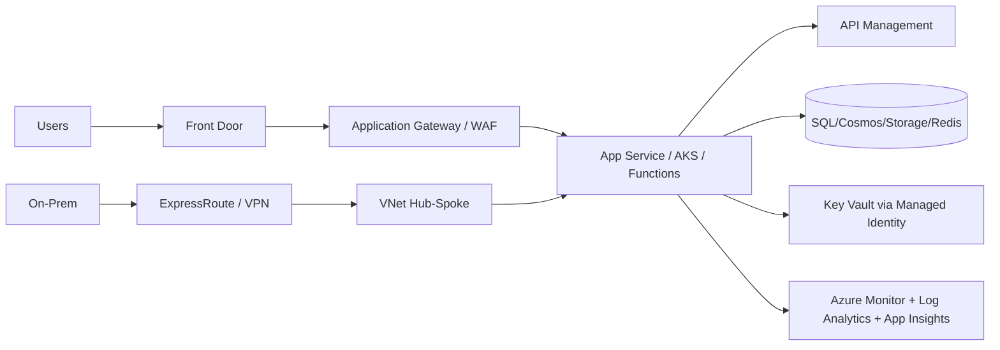

# Azure Infrastructure and Platform Master Handbook

## Overview
This page is a complete Azure infrastructure and platform interview reference covering networking, compute, storage, identity, governance, observability, DR, cost, and delivery controls.

## Why this topic matters
Senior architect interviews assess whether you can design enterprise Azure platforms end-to-end with security, reliability, scalability, and governance built in.

## Core concepts
- Network foundation and connectivity
- Edge and traffic distribution
- Compute and container hosting choices
- Data and storage architecture
- Identity and security controls
- Observability and operations
- DR, backup, and high availability
- Governance, landing zones, and cost optimization
- IaC and CI/CD delivery model

## Detailed explanation of each concept
Azure architecture quality depends on boundary clarity: identity boundaries, network boundaries, data boundaries, and operational ownership boundaries. Every service choice should map to business requirements and non-functional targets (latency, uptime, compliance, cost).

Networking services (VNet, subnets, NSG, UDR, private endpoints, DNS) define trust paths. Traffic services (Front Door, Application Gateway, Traffic Manager, Load Balancer) define how users reach workloads and how failover behaves. Compute services (App Service, Functions, AKS, Container Apps, VMSS) should be selected by workload semantics and team operating model.

Governance and delivery controls are equally critical. Management groups, subscriptions, policies, RBAC, monitoring, IaC, and CI/CD enforce consistency and safe evolution at scale.

## Evaluation (How to assess architecture quality)
- Security boundary integrity and least-privilege coverage
- Availability and failover readiness (tested)
- Performance and scaling behavior under load
- Cost efficiency with measurable controls
- Governance compliance and policy coverage
- Operability (monitoring, alerting, runbooks, ownership)

## Architecture / flow diagram


**Flow explanation:**  
Traffic enters through global and regional edge controls, workloads run on fit-for-purpose compute, data and secrets stay protected by identity and private networking, and observability provides operational control across hybrid and cloud paths.

## Real-world example
A multi-region enterprise platform uses hub-spoke networking, private endpoints for data services, Front Door + WAF for global ingress, AKS for microservices, App Service for legacy APIs, APIM for governance, Redis for hot caching, Azure Monitor for centralized telemetry, and Terraform + Azure DevOps for controlled deployments.

## Best practices
- Design from identity and network boundaries first
- Choose services by workload behavior, not familiarity
- Keep public exposure minimal and private access default
- Implement policy-as-code and IaC from day one
- Test failover and rollback, don’t just document them
- Monitor quality, performance, cost, and security together

## Common mistakes / misconceptions
- Flat network with weak segmentation
- One compute platform for all workloads
- No retrieval-time authorization for data access
- Manual infra changes outside IaC process
- DR plans without drill evidence
- Cost controls added too late

## Industry relevance
These topics are foundational for Azure Architect, Cloud Architect, and Senior Solution Architect roles in enterprises, regulated industries, and large modernization programs.

## Interview discussion points
- Why this service over alternatives?
- How does design behave during failure?
- How are security/compliance controls enforced?
- How is cost managed at scale?
- How does the platform evolve safely?

## Links to dependent / related topics
- [Governance Hierarchy](./governance_hierarchy.md)
- [Security, IAM, Networking](../security/security_iam_networking.md)
- [Compute Architecture Decisions](../compute/compute_architecture.md)
- [APIM, Messaging, Eventing](../integration/apim_messaging_eventing.md)
- [Terraform](./terraform.md)
- [CI/CD in Azure DevOps](./cicd_azure_devops.md)

## Interview Questions (50)
1. How do you design Azure VNet architecture for enterprise platforms?
2. How do you decide subnet boundaries?
3. NSG vs Azure Firewall: when to use which?
4. What are UDR design best practices?
5. VNet peering vs hub-spoke: how do you choose?
6. VPN Gateway vs ExpressRoute trade-offs?
7. When should private endpoint be mandatory?
8. Why is private DNS critical with private endpoints?
9. Load Balancer vs Application Gateway vs Front Door?
10. Traffic Manager vs Front Door: when to use each?
11. How do you choose App Service vs Functions?
12. When should Durable Functions be used?
13. AKS vs Container Apps decision criteria?
14. How do you design APIM in enterprise architecture?
15. Storage account design for multi-workload platforms?
16. Blob vs Files usage boundaries?
17. How do storage tiers reduce cost safely?
18. SAS vs RBAC access strategy for storage?
19. Managed Identity design best practices?
20. Key Vault architecture and access model?
21. Entra ID role in workload and user auth?
22. RBAC scope strategy across subscriptions/resource groups?
23. How to apply Azure Policy at scale?
24. Monitor + Log Analytics + App Insights: how do they fit together?
25. Service Bus vs Event Grid vs Event Hubs decision model?
26. Azure SQL vs Cosmos DB trade-offs?
27. Redis use cases and anti-patterns?
28. Availability Zones vs Availability Sets?
29. VM Scale Sets architecture patterns?
30. How do you design DR strategy in Azure?
31. Backup vs Site Recovery: how to decide?
32. How do you implement cost optimization governance?
33. What is an Azure landing zone and why it matters?
34. Subscription management strategy for enterprises?
35. Management Groups design principles?
36. Resource Group design and lifecycle boundaries?
37. ARM vs Bicep vs Terraform choice framework?
38. CI/CD in Azure DevOps for cloud platform workloads?
39. Zero Trust implementation on Azure?
40. Hybrid connectivity architecture best practices?
41. High availability architecture checklist?
42. Scalability architecture checklist?
43. Security architecture layering in Azure?
44. Multi-region architecture key decisions?
45. Which design patterns are most useful in Azure systems?
46. How do you govern platform changes safely?
47. How do you prove architecture quality to leadership?
48. What are common Azure architecture anti-patterns?
49. What would your first-90-day Azure platform roadmap look like?
50. How do you conclude an Azure architecture interview strongly?

## Answers for important questions (Summary + Crisp + Deep)

### Q1. How do you design Azure VNet architecture for enterprise platforms?
**Question summary:** Tests network foundation thinking for security and scale.
**Crisp answer (7-8 lines):** Start with trust boundaries and workload domains. Use hub-spoke for centralized controls at scale. Segment subnets by tier and risk profile. Keep ingress/egress policy explicit with firewall/UDR. Use private endpoints for data services. Integrate private DNS design early. Build for multi-subscription governance from day one.
**Deep explanation (~40 lines):** VNet design should map to organizational and security boundaries, not just IP planning. Hub-spoke helps centralize shared services (firewall, DNS, monitoring, identity integration), while spokes isolate domain workloads. Subnet separation limits lateral movement. Private connectivity and route policy determine secure east-west and north-south flow control. Good designs include growth headroom, DR routing strategy, and governance alignment.
**Answer summary:** Design VNet around trust, segmentation, and controlled connectivity with hub-spoke scalability.
**Simple diagram:**  
```text
Hub (shared controls) -> Spoke A/B/C (isolated workloads)
```
**Trusted reference links:**  
- https://learn.microsoft.com/en-us/azure/architecture/networking/architecture/hub-spoke

### Q2. How do you decide subnet boundaries?
**Question summary:** Evaluates segmentation and blast-radius decisions.
**Crisp answer (7-8 lines):** Split by workload tier, trust level, and traffic pattern. Separate internet-facing from internal-only services. Isolate data and management planes strictly. Leave growth headroom in address planning. Apply NSG/route policies per subnet role. Avoid over-fragmentation without governance value. Document subnet ownership and lifecycle.
**Deep explanation (~40 lines):** Subnets are policy boundaries. If boundaries are too broad, controls are weak; if too granular, operations become brittle. Align subnet strategy to threat model, compliance needs, and deployment ownership.
**Answer summary:** Use subnet boundaries as policy and risk boundaries, not just IP containers.
**Simple diagram:**  
```text
Edge subnet | App subnet | Data subnet | Mgmt subnet
```
**Trusted reference links:**  
- https://learn.microsoft.com/en-us/azure/virtual-network/subnet-overview

### Q3. NSG vs Azure Firewall: when to use which?
**Question summary:** Tests layered network security reasoning.
**Crisp answer (7-8 lines):** NSG is subnet/NIC traffic filtering at L3/L4. Azure Firewall centralizes advanced ingress/egress controls. Use NSG for local segmentation baseline. Use Firewall for centralized policy, threat intel, and egress governance. They are complementary, not substitutes. Place both in defense-in-depth. Match control depth to risk.
**Deep explanation (~40 lines):** NSGs provide distributed basic control while Firewall provides centralized policy and richer inspection capabilities. Enterprise designs combine both for layered protection and operational governance.
**Answer summary:** NSG for local segmentation; Firewall for centralized advanced control.
**Simple diagram:**  
```text
NSG (local filter) + Firewall (central control)
```
**Trusted reference links:**  
- https://learn.microsoft.com/en-us/azure/firewall/overview

### Q4. What are UDR design best practices?
**Question summary:** Routing governance quality.
**Crisp answer (7-8 lines):** Use UDR to enforce intended traffic paths. Route internet-bound traffic through controlled egress. Avoid accidental asymmetric routing. Document route intent and ownership. Validate failover behavior when routes change. Keep route tables simple and auditable. Monitor route drift continuously.
**Deep explanation (~40 lines):** UDRs control trust paths. Misconfigured routes can break connectivity or bypass security controls. Good practice includes deterministic routing, failure testing, and change governance.
**Answer summary:** Use UDRs for explicit, auditable, and security-aligned traffic steering.
**Simple diagram:**  
```text
Subnet -> UDR -> Firewall -> Destination
```
**Trusted reference links:**  
- https://learn.microsoft.com/en-us/azure/virtual-network/virtual-networks-udr-overview

### Q5. VNet peering vs hub-spoke: how do you choose?
**Question summary:** Connectivity topology decision.
**Crisp answer (7-8 lines):** Use peering for direct low-latency VNet connectivity. Use hub-spoke when centralized controls are needed. Small environments may use simple peering meshes. Enterprise scale favors hub-spoke governance. Avoid uncontrolled mesh growth. Choose based on scale, policy centralization, and operations maturity. Plan for future growth.
**Deep explanation (~40 lines):** Topology should optimize governance and manageability, not only connectivity speed. Hub-spoke supports central firewalls, DNS, and shared services better at scale.
**Answer summary:** Peering is connectivity primitive; hub-spoke is scalable governance topology.
**Simple diagram:**  
```text
Direct peering vs centralized hub-spoke
```
**Trusted reference links:**  
- https://learn.microsoft.com/en-us/azure/virtual-network/virtual-network-peering-overview

### Q6. VPN Gateway vs ExpressRoute trade-offs?
**Question summary:** Hybrid connectivity architecture.
**Crisp answer (7-8 lines):** VPN uses encrypted internet paths, faster to adopt. ExpressRoute uses private dedicated circuits with predictable performance. VPN is cost-effective for moderate needs. ExpressRoute suits high-throughput, low-latency, strict compliance scenarios. Many enterprises use both for redundancy tiers. Evaluate cost, SLA, latency, and governance. Design failover explicitly.
**Deep explanation (~40 lines):** Hybrid path choice depends on business criticality and regulatory posture. ExpressRoute improves determinism but has higher complexity/cost. VPN is flexible but internet-dependent.
**Answer summary:** Choose by criticality and compliance: VPN for flexibility, ExpressRoute for deterministic private connectivity.
**Simple diagram:**  
```text
On-prem -> VPN/ExpressRoute -> Azure
```
**Trusted reference links:**  
- https://learn.microsoft.com/en-us/azure/expressroute/expressroute-introduction

### Q7. When should private endpoint be mandatory?
**Question summary:** Data exposure control.
**Crisp answer (7-8 lines):** Mandatory for sensitive and regulated data services. Use when public access is unacceptable by policy. Required for high-risk production workloads. Pair with private DNS and network policy controls. Disable public network access after validation. Track exceptions with risk approvals. Treat as default for critical systems.
**Deep explanation (~40 lines):** Private endpoints reduce internet exposure and improve compliance posture. They require DNS and routing readiness but are essential for strict threat models.
**Answer summary:** Use private endpoints as default for sensitive production data paths.
**Simple diagram:**  
```text
App subnet -> Private Endpoint -> PaaS service
```
**Trusted reference links:**  
- https://learn.microsoft.com/en-us/azure/private-link/private-endpoint-overview

### Q8. Why is private DNS critical with private endpoints?
**Question summary:** Connectivity correctness.
**Crisp answer (7-8 lines):** Private endpoints require private name resolution to route correctly. Without private DNS, traffic may resolve to public endpoints. That breaks security intent and causes intermittent failures. DNS links should match VNet scopes. Validate resolution in every environment. Monitor DNS drift and stale records. Treat DNS as part of security design.
**Deep explanation (~40 lines):** Private connectivity depends on correct DNS mapping. Misconfigured DNS is a common root cause of failed private endpoint adoption.
**Answer summary:** Private DNS is mandatory to make private endpoints secure and functional.
**Simple diagram:**  
```text
Name lookup -> private DNS -> private IP endpoint
```
**Trusted reference links:**  
- https://learn.microsoft.com/en-us/azure/private-link/private-endpoint-dns

### Q9. Load Balancer vs Application Gateway vs Front Door?
**Question summary:** Edge and traffic service selection.
**Crisp answer (7-8 lines):** Load Balancer is regional L4 balancing. Application Gateway is regional L7 with WAF and HTTP routing. Front Door is global edge entry with acceleration and WAF. Use LB for non-HTTP/internal scenarios. Use App Gateway for app-layer regional routing. Use Front Door for global user entry and cross-region routing. Combine when architecture needs layered control.
**Deep explanation (~40 lines):** These services solve different layers/scopes. Selecting wrong one causes feature gaps or unnecessary complexity.
**Answer summary:** Choose by layer and scope: LB (L4 regional), App Gateway (L7 regional), Front Door (global edge).
**Simple diagram:**  
```text
Global edge (Front Door) -> Regional L7 (AppGW) -> L4/internal (LB)
```
**Trusted reference links:**  
- https://learn.microsoft.com/en-us/azure/architecture/guide/technology-choices/load-balancing-overview

### Q10. Traffic Manager vs Front Door: when to use each?
**Question summary:** Global routing comparison.
**Crisp answer (7-8 lines):** Traffic Manager is DNS-based global routing. Front Door is application-layer global edge service with WAF/caching/acceleration. Use Traffic Manager for protocol-agnostic endpoint routing. Use Front Door for modern HTTP(S) global entry. Front Door offers richer edge features. Traffic Manager can complement for certain scenarios. Choose based on protocol and edge capability needs.
**Deep explanation (~40 lines):** DNS-based versus proxy-based global routing has different control, latency, and feature implications.
**Answer summary:** Traffic Manager for DNS-level routing; Front Door for full HTTP edge control.
**Simple diagram:**  
```text
DNS routing (TM) vs edge proxy routing (FD)
```
**Trusted reference links:**  
- https://learn.microsoft.com/en-us/azure/traffic-manager/traffic-manager-overview

### Q11. How do you choose App Service vs Functions?
**Question summary:** Compute fit decision.
**Crisp answer (7-8 lines):** App Service for rich synchronous web/API hosting. Functions for event-driven triggered units of work. Choose by API surface complexity and workload pattern. Use App Service for large route-heavy services. Use Functions for async, scheduled, or integration tasks. Combine both in many enterprise systems. Optimize each for its role.
**Deep explanation (~40 lines):** Compute choice should reflect workload semantics and operating model.
**Answer summary:** App Service and Functions are complementary; select by workload behavior.
**Simple diagram:**  
```text
Rich API -> App Service
Triggered workflow -> Functions
```
**Trusted reference links:**  
- https://learn.microsoft.com/en-us/azure/architecture/guide/technology-choices/compute-decision-tree

### Q12. When should Durable Functions be used?
**Question summary:** Stateful orchestration fit.
**Crisp answer (7-8 lines):** Use Durable Functions for long-running, multi-step orchestration. It supports checkpointing and resume. It handles waits, retries, and fan-out/fan-in patterns. Use for approvals, document pipelines, and complex async flows. Avoid for simple one-step triggers. Keep activities idempotent. Monitor orchestration state and failures.
**Deep explanation (~40 lines):** Durable Functions is valuable when workflow state and recovery are first-class requirements.
**Answer summary:** Use Durable Functions for orchestrated stateful workflows, not simple event handlers.
**Simple diagram:**  
```text
Orchestrator -> Activities -> checkpoints/resume
```
**Trusted reference links:**  
- https://learn.microsoft.com/en-us/azure/azure-functions/durable/durable-functions-overview

### Q13. AKS vs Container Apps decision criteria?
**Question summary:** Container platform trade-off.
**Crisp answer (7-8 lines):** AKS provides maximum orchestration control and complexity. Container Apps offers simpler serverless containers with less ops overhead. Use AKS for complex multi-service platforms and custom networking/policy needs. Use Container Apps for faster delivery of moderate complexity services. Choose based on team ops maturity. Evaluate scale, governance, and platform control requirements.
**Deep explanation (~40 lines):** Platform selection should balance control needs with operational burden.
**Answer summary:** AKS for advanced control; Container Apps for simplified managed container operations.
**Simple diagram:**  
```text
High control -> AKS
Lower ops overhead -> Container Apps
```
**Trusted reference links:**  
- https://learn.microsoft.com/en-us/azure/container-apps/compare-options

### Q14. How do you design APIM in enterprise architecture?
**Question summary:** API governance architecture.
**Crisp answer (7-8 lines):** Place APIM as centralized gateway policy layer. Enforce auth, throttling, transformation, and versioning policies. Segment API products by consumer type. Use analytics and tracing for operational visibility. Integrate with private networking and WAF where needed. Apply lifecycle governance for deprecation/migration. Keep backend services focused on domain logic.
**Deep explanation (~40 lines):** APIM provides consistent control plane across heterogeneous backend APIs.
**Answer summary:** APIM standardizes security, lifecycle, and operational governance for enterprise APIs.
**Simple diagram:**  
```text
Consumers -> APIM policies -> backend APIs
```
**Trusted reference links:**  
- https://learn.microsoft.com/en-us/azure/api-management/api-management-key-concepts

### Q15. Storage account design for multi-workload platforms?
**Question summary:** Storage governance and performance.
**Crisp answer (7-8 lines):** Segment storage by workload criticality and access patterns. Avoid over-consolidating unrelated workloads in one account. Apply private access, encryption, and lifecycle policies. Use naming/tagging for ownership and cost tracking. Choose redundancy options by RTO/RPO needs. Monitor throughput and request patterns. Plan for growth and isolation.
**Deep explanation (~40 lines):** Storage design should balance governance, security, and performance characteristics.
**Answer summary:** Design storage accounts by workload boundary, risk class, and lifecycle behavior.
**Simple diagram:**  
```text
Workload A account | Workload B account (policy/isolation)
```
**Trusted reference links:**  
- https://learn.microsoft.com/en-us/azure/storage/common/storage-account-overview

### Q16. Blob vs Files usage boundaries?
**Question summary:** Storage service fit.
**Crisp answer (7-8 lines):** Blob for object/unstructured cloud-native storage. Files for SMB/NFS shared file scenarios. Blob suits data lake, archival, media, and event processing. Files suits lift-and-shift shared filesystem use cases. Choose by access protocol and app dependency. Consider performance and cost profile. Avoid forcing legacy file semantics into blob where not required.
**Deep explanation (~40 lines):** Proper service choice avoids unnecessary complexity and compatibility issues.
**Answer summary:** Blob for object workloads; Files for shared filesystem workloads.
**Simple diagram:**  
```text
Object access -> Blob
SMB/NFS share -> Azure Files
```
**Trusted reference links:**  
- https://learn.microsoft.com/en-us/azure/storage/common/storage-introduction

### Q17. How do storage tiers reduce cost safely?
**Question summary:** Cost optimization with data lifecycle.
**Crisp answer (7-8 lines):** Align tiers to actual access frequency. Use lifecycle policies to auto-move old data. Keep high-use data in hot tiers. Move infrequent data to cool/cold/archive. Account for retrieval and rehydration costs. Monitor access pattern drift and adjust. Avoid over-archiving data needed for rapid access.
**Deep explanation (~40 lines):** Tiering improves cost only when informed by realistic usage telemetry.
**Answer summary:** Storage tiering reduces cost when lifecycle automation matches data access behavior.
**Simple diagram:**  
```text
Age/access pattern -> tier transition policy
```
**Trusted reference links:**  
- https://learn.microsoft.com/en-us/azure/storage/blobs/lifecycle-management-overview

### Q18. SAS vs RBAC access strategy for storage?
**Question summary:** Access control model selection.
**Crisp answer (7-8 lines):** Prefer identity + RBAC for service and user authorization. Use SAS for scoped temporary delegated access. Keep SAS short-lived and minimal permissions. Avoid long-lived account SAS in user-facing flows. Log issuance and usage. Revoke/rotate when abuse suspected. Combine RBAC governance with controlled SAS delegation.
**Deep explanation (~40 lines):** SAS is powerful but risky if over-scoped; RBAC provides stronger governance baseline.
**Answer summary:** Use RBAC as default; use tightly scoped short-lived SAS for delegation.
**Simple diagram:**  
```text
RBAC baseline -> optional short SAS delegation
```
**Trusted reference links:**  
- https://learn.microsoft.com/en-us/azure/storage/common/storage-sas-overview

### Q19. Managed Identity design best practices?
**Question summary:** Secretless workload access.
**Crisp answer (7-8 lines):** Use managed identity for Azure resource access. Scope permissions minimally by workload role. Prefer separate identities per service domain. Avoid over-privileged shared identities. Audit identity usage and anomalies. Rotate role assignments through governance process. Remove static credentials from code/pipelines.
**Deep explanation (~40 lines):** Managed identity reduces credential sprawl but authorization discipline remains critical.
**Answer summary:** Use managed identities with least privilege, separation, and monitoring.
**Simple diagram:**  
```text
Workload identity -> RBAC-scoped resource access
```
**Trusted reference links:**  
- https://learn.microsoft.com/en-us/entra/identity/managed-identities-azure-resources/overview

### Q20. Key Vault architecture and access model?
**Question summary:** Secret governance.
**Crisp answer (7-8 lines):** Centralize secrets/keys/certs in Key Vault. Access through managed identity or federated workload identity. Apply least-privilege access policies/RBAC. Enable auditing and alerting on secret operations. Use network restrictions/private endpoints where needed. Automate secret rotation and expiry checks. Keep break-glass process governed.
**Deep explanation (~40 lines):** Key Vault is control plane for secret lifecycle and compliance evidence.
**Answer summary:** Use Key Vault as centralized, audited, identity-governed secret platform.
**Simple diagram:**  
```text
App identity -> Key Vault -> secret use
```
**Trusted reference links:**  
- https://learn.microsoft.com/en-us/azure/key-vault/general/overview

### Q21. Entra ID role in workload and user auth?
**Question summary:** Identity architecture integration.
**Crisp answer (7-8 lines):** Entra ID authenticates users and workloads. It issues tokens consumed by apps/APIs. It enables conditional access and governance controls. It supports enterprise federation and lifecycle management. It underpins managed identity trust model. Combine with RBAC for authorization. Monitor sign-in and risk signals.
**Deep explanation (~40 lines):** Entra is the identity backbone for zero-trust Azure architectures.
**Answer summary:** Entra provides authentication and identity governance for users and workloads.
**Simple diagram:**  
```text
Identity -> Entra token -> app/API/resource access
```
**Trusted reference links:**  
- https://learn.microsoft.com/en-us/entra/fundamentals/whatis

### Q22. RBAC scope strategy across subscriptions/resource groups?
**Question summary:** Authorization boundary design.
**Crisp answer (7-8 lines):** Assign roles at lowest practical scope. Use group-based assignments, not direct user grants. Separate platform and app responsibilities. Avoid broad contributor roles in production. Review privileged assignments regularly. Use PIM for just-in-time elevation. Keep scope model aligned with subscription/resource group boundaries.
**Deep explanation (~40 lines):** Scope design directly affects blast radius and governance manageability.
**Answer summary:** Implement least-privilege RBAC with scoped, group-based, reviewed assignments.
**Simple diagram:**  
```text
Mgmt group -> subscription -> resource group -> resource scope
```
**Trusted reference links:**  
- https://learn.microsoft.com/en-us/azure/role-based-access-control/overview

### Q23. How to apply Azure Policy at scale?
**Question summary:** Governance automation.
**Crisp answer (7-8 lines):** Use initiatives for baseline control sets. Assign at management group level for inheritance. Use deny for critical controls and audit for visibility. Add remediation workflows where appropriate. Manage exemptions with expiry and justification. Integrate policy checks into CI/CD. Track compliance drift dashboards.
**Deep explanation (~40 lines):** Policy-as-code provides consistent governance across large estates and reduces manual control gaps.
**Answer summary:** Apply policy centrally with initiatives, remediation, exemption governance, and CI integration.
**Simple diagram:**  
```text
Policy initiative -> inherited enforcement -> compliance monitoring
```
**Trusted reference links:**  
- https://learn.microsoft.com/en-us/azure/governance/policy/overview

### Q24. Monitor + Log Analytics + App Insights: how do they fit together?
**Question summary:** Observability stack clarity.
**Crisp answer (7-8 lines):** Azure Monitor is umbrella telemetry platform. Log Analytics stores/query logs centrally. App Insights provides application traces, dependency metrics, and failures. Combine them for end-to-end observability. Build alerts and dashboards from unified signals. Correlate by operation IDs. Use them for SLO and incident workflows.
**Deep explanation (~40 lines):** Clear telemetry architecture improves debugging speed and operational decision quality.
**Answer summary:** Use Monitor for platform, Log Analytics for central logs, App Insights for app-level tracing.
**Simple diagram:**  
```text
App/Infra telemetry -> Log Analytics/App Insights -> alerts/dashboards
```
**Trusted reference links:**  
- https://learn.microsoft.com/en-us/azure/azure-monitor/overview

### Q25. Service Bus vs Event Grid vs Event Hubs decision model?
**Question summary:** Eventing architecture fit.
**Crisp answer (7-8 lines):** Service Bus for durable business messaging/workflows. Event Grid for event notification and routing. Event Hubs for high-throughput telemetry streaming. Use delivery guarantees and ordering needs as primary criteria. Separate command semantics from event semantics. Avoid replacing one with another blindly. Pick by workload behavior and operations needs.
**Deep explanation (~40 lines):** Correct messaging service choice reduces complexity and improves reliability.
**Answer summary:** Match service choice to command, notification, or stream-ingestion semantics.
**Simple diagram:**  
```text
Command -> Service Bus
Notification -> Event Grid
Stream -> Event Hubs
```
**Trusted reference links:**  
- https://learn.microsoft.com/en-us/azure/architecture/guide/technology-choices/messaging

### Q26. Azure SQL vs Cosmos DB trade-offs?
**Question summary:** Data platform decision.
**Crisp answer (7-8 lines):** Azure SQL fits relational OLTP and strong schema needs. Cosmos DB fits globally distributed low-latency NoSQL workloads. SQL offers mature relational querying and transactions. Cosmos offers flexible schema and multi-model APIs. Choose by consistency, scale, and data model. Evaluate cost and operational complexity. Avoid one-size-fits-all database choices.
**Deep explanation (~40 lines):** Database choice should be workload-specific and NFR-driven.
**Answer summary:** SQL for relational consistency-heavy workloads; Cosmos for globally distributed NoSQL patterns.
**Simple diagram:**  
```text
Relational -> SQL
Global NoSQL -> Cosmos
```
**Trusted reference links:**  
- https://learn.microsoft.com/en-us/azure/architecture/data-guide/technology-choices/data-store-overview

### Q27. Redis use cases and anti-patterns?
**Question summary:** Caching architecture maturity.
**Crisp answer (7-8 lines):** Use Redis for caching, sessions, and short-lived state. It improves read latency and offloads databases. Use TTL and invalidation policies deliberately. Avoid treating Redis as permanent source of truth. Avoid unbounded key growth and no-namespace key design. Monitor hit/miss and eviction rates. Secure Redis with network/auth controls.
**Deep explanation (~40 lines):** Redis helps performance but requires clear lifecycle and fallback design.
**Answer summary:** Use Redis for fast transient workloads with disciplined key, TTL, and security governance.
**Simple diagram:**  
```text
API -> Redis cache -> DB fallback
```
**Trusted reference links:**  
- https://learn.microsoft.com/en-us/azure/azure-cache-for-redis/cache-overview

### Q28. Availability Zones vs Availability Sets?
**Question summary:** HA primitive selection.
**Crisp answer (7-8 lines):** Availability Zones provide datacenter-level fault isolation within region. Availability Sets distribute VMs across fault/update domains in one datacenter scope. Zones give stronger resiliency for zonal outages. Availability Sets help legacy VM HA scenarios. Choose by workload criticality and service support. Test failover assumptions. Align with SLA targets.
**Deep explanation (~40 lines):** Zone-aware design usually offers stronger resilience for modern workloads.
**Answer summary:** Prefer zones for stronger isolation; use availability sets for applicable VM patterns.
**Simple diagram:**  
```text
Zones: DC-level separation
Sets: host/update domain separation
```
**Trusted reference links:**  
- https://learn.microsoft.com/en-us/azure/reliability/availability-zones-overview

### Q29. VM Scale Sets architecture patterns?
**Question summary:** Elastic VM workload design.
**Crisp answer (7-8 lines):** Use VMSS for horizontally scalable VM workloads. Keep immutable image strategy for consistency. Combine with Load Balancer/Application Gateway. Use autoscale rules from CPU/custom metrics. Separate stateful dependencies externally. Bake health checks and rollout strategy. Monitor scale and instance health continuously.
**Deep explanation (~40 lines):** VMSS is useful when VM-level control is needed with elastic scaling.
**Answer summary:** VMSS provides elastic compute with consistent VM config and autoscaling.
**Simple diagram:**  
```text
Traffic -> LB -> VMSS instances
```
**Trusted reference links:**  
- https://learn.microsoft.com/en-us/azure/virtual-machine-scale-sets/overview

### Q30. How do you design DR strategy in Azure?
**Question summary:** Resilience planning depth.
**Crisp answer (7-8 lines):** Define RTO/RPO by business workflow. Choose region strategy and replication model. Protect compute, data, identity, and network dependencies together. Keep failover runbooks and ownership explicit. Validate through regular drills. Track recovery metrics and gaps. Improve plan iteratively.
**Deep explanation (~40 lines):** DR is operational capability proven by tests, not architecture diagrams.
**Answer summary:** Build RTO/RPO-driven, tested, end-to-end DR strategy.
**Simple diagram:**  
```text
Primary region -> replicated secondary -> drill failover/failback
```
**Trusted reference links:**  
- https://learn.microsoft.com/en-us/azure/well-architected/reliability/disaster-recovery

### Q31. Backup vs Site Recovery: how to decide?
**Question summary:** Protection strategy distinction.
**Crisp answer (7-8 lines):** Backup protects data and point-in-time restore needs. Site Recovery focuses on workload/business continuity failover. Use backup for accidental deletion/corruption recovery. Use ASR for regional outage continuity. Many systems require both. Decide by recovery objectives and failure scenarios. Test restore/failover regularly.
**Deep explanation (~40 lines):** Backup and DR solve different risk classes and should be designed together where needed.
**Answer summary:** Backup for data restore; Site Recovery for workload failover continuity.
**Simple diagram:**  
```text
Backup: restore data
ASR: fail over running workload
```
**Trusted reference links:**  
- https://learn.microsoft.com/en-us/azure/site-recovery/site-recovery-overview

### Q32. How do you implement cost optimization governance?
**Question summary:** FinOps architecture maturity.
**Crisp answer (7-8 lines):** Use tagging and ownership for all resources. Track unit economics and budget alerts. Right-size compute and storage tiers continuously. Remove idle resources through policy and automation. Use reservations/savings plans where stable usage exists. Review cost anomalies weekly. Tie optimization backlog to business impact.
**Deep explanation (~40 lines):** Cost governance should be continuous and policy-backed, not quarterly cleanup only.
**Answer summary:** Implement continuous FinOps with visibility, accountability, and automated controls.
**Simple diagram:**  
```text
Usage data -> cost insights -> optimization actions
```
**Trusted reference links:**  
- https://learn.microsoft.com/en-us/azure/cost-management-billing/

### Q33. What is an Azure landing zone and why it matters?
**Question summary:** Platform foundation question.
**Crisp answer (7-8 lines):** Landing zone is the standardized cloud foundation for enterprise workloads. It includes identity, governance, network, security, and operations baselines. It accelerates safe workload onboarding. It reduces configuration drift. It provides repeatable architecture patterns. It is essential for scale and compliance. It should be treated as product, not project.
**Deep explanation (~40 lines):** Landing zones prevent each team from reinventing foundational controls and improve governance consistency.
**Answer summary:** Landing zones provide scalable, governed, reusable cloud foundation for enterprise adoption.
**Simple diagram:**  
```text
Foundation controls -> workload onboarding -> consistent operations
```
**Trusted reference links:**  
- https://learn.microsoft.com/en-us/azure/cloud-adoption-framework/ready/landing-zone/

### Q34. Subscription management strategy for enterprises?
**Question summary:** Scope and ownership planning.
**Crisp answer (7-8 lines):** Split subscriptions by environment, domain, and ownership boundaries. Keep production isolated from non-production. Map cost accountability by subscription. Apply policy and RBAC inheritance via management groups. Avoid giant shared subscriptions. Review boundaries as organization evolves. Document subscription operating model.
**Deep explanation (~40 lines):** Subscription strategy affects security scope, governance, and financial management.
**Answer summary:** Design subscriptions for isolation, accountability, and policy scalability.
**Simple diagram:**  
```text
Mgmt groups -> prod/nonprod/domain subscriptions
```
**Trusted reference links:**  
- https://learn.microsoft.com/en-us/azure/cloud-adoption-framework/ready/enterprise-scale/management-group-and-subscription-organization

### Q35. Management Groups design principles?
**Question summary:** Governance hierarchy architecture.
**Crisp answer (7-8 lines):** Keep hierarchy aligned to governance needs, not org chart only. Apply shared policies at higher levels. Limit depth to manageable complexity. Separate platform and landing-zone branches where useful. Use clear naming and ownership rules. Control exemptions through governance workflow. Review hierarchy after major org changes.
**Deep explanation (~40 lines):** Good management group design simplifies policy inheritance and RBAC governance.
**Answer summary:** Build concise, governance-driven management group hierarchy for policy and access control at scale.
**Simple diagram:**  
```text
Tenant root -> platform/landing branches -> subscriptions
```
**Trusted reference links:**  
- https://learn.microsoft.com/en-us/azure/governance/management-groups/overview

### Q36. Resource Group design and lifecycle boundaries?
**Question summary:** Operational grouping logic.
**Crisp answer (7-8 lines):** Group resources with shared lifecycle and ownership. Avoid mixing unrelated lifecycles in one RG. Use RG as access and policy scope where practical. Keep naming standards consistent. Apply tags for environment and owner metadata. Plan deletion/retention impact before grouping. Document RG conventions.
**Deep explanation (~40 lines):** RG strategy affects deployment, access, and cleanup safety.
**Answer summary:** Use Resource Groups as lifecycle and ownership boundaries, not arbitrary containers.
**Simple diagram:**  
```text
App lifecycle boundary -> one resource group
```
**Trusted reference links:**  
- https://learn.microsoft.com/en-us/azure/azure-resource-manager/management/overview

### Q37. ARM vs Bicep vs Terraform choice framework?
**Question summary:** IaC strategy decision.
**Crisp answer (7-8 lines):** ARM is native JSON template foundation. Bicep is higher-level DSL for ARM with better readability. Terraform is multi-cloud IaC with broad ecosystem. Choose by cloud strategy, team skills, and governance needs. Bicep is strong for Azure-first environments. Terraform is strong for cross-cloud standardization. Keep one primary standard per platform domain.
**Deep explanation (~40 lines):** IaC choice should reduce operational entropy and maximize consistency.
**Answer summary:** Pick IaC tooling by strategy fit, then standardize usage and governance.
**Simple diagram:**  
```text
Azure-first -> Bicep/ARM
Multi-cloud -> Terraform
```
**Trusted reference links:**  
- https://learn.microsoft.com/en-us/azure/azure-resource-manager/bicep/overview  
- https://developer.hashicorp.com/terraform/docs

### Q38. CI/CD in Azure DevOps for cloud platform workloads?
**Question summary:** Delivery pipeline architecture.
**Crisp answer (7-8 lines):** Build multi-stage pipelines with build/test/scan/deploy gates. Include IaC validation and policy checks. Use environment approvals for production. Support canary/blue-green rollout where needed. Tag deployments with version metadata. Automate rollback triggers on key SLO breaches. Keep audit trails for compliance.
**Deep explanation (~40 lines):** Pipeline discipline enables safe velocity and controlled change at scale.
**Answer summary:** Use gated, auditable, rollback-ready Azure DevOps pipelines for platform delivery.
**Simple diagram:**  
```text
CI -> security/IaC gates -> staged CD -> monitored rollout
```
**Trusted reference links:**  
- https://learn.microsoft.com/en-us/azure/devops/pipelines/

### Q39. Zero Trust implementation on Azure?
**Question summary:** Security architecture maturity.
**Crisp answer (7-8 lines):** Verify explicitly for every access request. Enforce MFA/conditional access for user identity. Use least privilege RBAC and PIM for admin controls. Use managed identity for workloads. Segment networks and prefer private data access. Continuously monitor and respond to anomalies. Assume breach and design containment.
**Deep explanation (~40 lines):** Zero Trust is operating model with continuous policy enforcement, not single product deployment.
**Answer summary:** Implement identity-first, least-privilege, segmented, continuously monitored Azure security.
**Simple diagram:**  
```text
Verify -> authorize least privilege -> monitor -> adapt
```
**Trusted reference links:**  
- https://learn.microsoft.com/en-us/security/zero-trust/azure-infrastructure-overview

### Q40. Hybrid connectivity architecture best practices?
**Question summary:** On-prem to cloud integration design.
**Crisp answer (7-8 lines):** Choose VPN/ExpressRoute by workload criticality. Segment hybrid routes by trust and domain. Enforce identity and policy controls across boundaries. Monitor latency and packet loss for path health. Plan failover between connectivity modes if required. Keep routing and DNS governance explicit. Test hybrid incident runbooks.
**Deep explanation (~40 lines):** Hybrid failures often come from route/DNS/policy inconsistency; design should be explicit and tested.
**Answer summary:** Build hybrid with controlled paths, strong governance, and tested failover behavior.
**Simple diagram:**  
```text
On-prem -> secure hybrid path -> Azure segmented workloads
```
**Trusted reference links:**  
- https://learn.microsoft.com/en-us/azure/architecture/reference-architectures/hybrid-networking/

### Q41. High availability architecture checklist?
**Question summary:** HA design completeness.
**Crisp answer (7-8 lines):** Remove single points of failure across layers. Use redundancy across zones/regions as required. Implement health probes and automatic failover. Keep data replication strategy aligned to consistency needs. Validate backup and restore readiness. Define ownership and runbooks for incidents. Test HA behavior regularly.
**Deep explanation (~40 lines):** HA is architecture plus operations; no checklist is complete without drills and observability.
**Answer summary:** HA requires layered redundancy, health-driven failover, and practiced operations.
**Simple diagram:**  
```text
Redundant components + health checks + failover automation
```
**Trusted reference links:**  
- https://learn.microsoft.com/en-us/azure/well-architected/reliability/

### Q42. Scalability architecture checklist?
**Question summary:** Scale readiness planning.
**Crisp answer (7-8 lines):** Identify bottlenecks in compute, data, and messaging paths. Use horizontal scaling where possible. Decouple long tasks with queues. Add caching for read-heavy workloads. Use autoscaling with guarded thresholds. Plan capacity with peak and failure scenarios. Monitor p95/p99 and backlog metrics.
**Deep explanation (~40 lines):** Scalability depends on workload decomposition and flow control, not just adding more instances.
**Answer summary:** Scale by decoupling, autoscaling, caching, and bottleneck-aware optimization.
**Simple diagram:**  
```text
Load increase -> scale + queue + cache -> stable SLO
```
**Trusted reference links:**  
- https://learn.microsoft.com/en-us/azure/well-architected/performance-efficiency/

### Q43. Security architecture layering in Azure?
**Question summary:** Defense-in-depth design.
**Crisp answer (7-8 lines):** Layer controls across identity, network, application, data, and operations. Enforce least privilege and just-in-time admin. Use private connectivity and segmented network policies. Protect secrets with Key Vault and managed identities. Add monitoring and incident response workflows. Test controls with adversarial scenarios. Keep governance and evidence centralized.
**Deep explanation (~40 lines):** Security architecture should assume control failure and provide compensating layers.
**Answer summary:** Build Azure security as layered, policy-driven, continuously monitored architecture.
**Simple diagram:**  
```text
Identity -> Network -> App -> Data -> Ops controls
```
**Trusted reference links:**  
- https://learn.microsoft.com/en-us/azure/architecture/framework/security/

### Q44. Multi-region architecture key decisions?
**Question summary:** Global design trade-offs.
**Crisp answer (7-8 lines):** Choose active-active or active-passive by business objectives. Define traffic routing and failover policy. Plan data consistency and replication strategy. Enforce regional compliance/residency constraints. Keep config/policy parity across regions. Test failover and failback with measurable objectives. Monitor regional performance and cost.
**Deep explanation (~40 lines):** Multi-region adds resilience but increases complexity in data, operations, and governance.
**Answer summary:** Make explicit decisions on topology, data consistency, and failover governance.
**Simple diagram:**  
```text
Global entry -> Region A/B workloads -> failover control
```
**Trusted reference links:**  
- https://learn.microsoft.com/en-us/azure/architecture/guide/design-principles/design-for-resiliency

### Q45. Which design patterns are most useful in Azure systems?
**Question summary:** Pattern literacy for cloud reliability.
**Crisp answer (7-8 lines):** Retry with backoff for transient faults. Circuit breaker for unstable dependencies. Bulkhead for isolation under stress. Queue-based load leveling for burst smoothing. Idempotent consumer for duplicate-safe messaging. Strangler pattern for incremental modernization. Choose pattern by failure mode, not trend.
**Deep explanation (~40 lines):** Patterns provide reusable resilience and evolution strategies when mapped correctly to system behavior.
**Answer summary:** Use proven cloud patterns intentionally based on concrete failure and evolution needs.
**Simple diagram:**  
```text
Failure mode -> pattern choice -> controlled behavior
```
**Trusted reference links:**  
- https://learn.microsoft.com/en-us/azure/architecture/patterns/

### Q46. How do you govern platform changes safely?
**Question summary:** Change governance and control.
**Crisp answer (7-8 lines):** Use IaC and pipeline-based promotion only. Enforce policy and security gates in CI/CD. Use canary/blue-green for risky changes. Define rollback triggers and runbooks. Tag releases for telemetry correlation. Review high-impact changes in architecture governance forum. Keep post-release verification windows.
**Deep explanation (~40 lines):** Safe change requires technical controls plus governance process discipline.
**Answer summary:** Govern changes through automated gates, progressive rollout, and explicit rollback/ownership.
**Simple diagram:**  
```text
Change -> gated pipeline -> progressive deploy -> verify/rollback
```
**Trusted reference links:**  
- https://learn.microsoft.com/en-us/azure/well-architected/operational-excellence/release-engineering

### Q47. How do you prove architecture quality to leadership?
**Question summary:** Executive evidence communication.
**Crisp answer (7-8 lines):** Present measurable KPIs mapped to business outcomes. Show reliability, security, cost, and delivery trends. Include incident reduction and recovery improvements. Demonstrate policy compliance and audit evidence. Highlight remaining risks with mitigation plans. Provide roadmap with milestones and owners. Keep message decision-oriented.
**Deep explanation (~40 lines):** Leadership trust depends on evidence and predictability, not architecture diagrams alone.
**Answer summary:** Prove quality through metrics, risk transparency, and outcome-focused roadmap communication.
**Simple diagram:**  
```text
Architecture controls -> KPI outcomes -> leadership decisions
```
**Trusted reference links:**  
- https://learn.microsoft.com/en-us/azure/well-architected/framework

### Q48. What are common Azure architecture anti-patterns?
**Question summary:** Failure pattern awareness.
**Crisp answer (7-8 lines):** Flat network without segmentation. Overprivileged access and no PIM. Public exposure of sensitive services. One compute platform forced for all workloads. No policy-as-code governance. DR plan without drill evidence. Manual infra drift outside IaC. No cost ownership tags.
**Deep explanation (~40 lines):** Anti-patterns usually emerge when speed outruns governance and design discipline.
**Answer summary:** Avoid insecure, non-governed, one-size-fits-all architecture patterns.
**Simple diagram:**  
```text
Anti-patterns -> incidents, cost waste, compliance risk
```
**Trusted reference links:**  
- https://learn.microsoft.com/en-us/azure/architecture/framework/

### Q49. What would your first-90-day Azure platform roadmap look like?
**Question summary:** Practical execution planning.
**Crisp answer (7-8 lines):** First 30 days: assess current state and top risks. Next 30 days: define target architecture and quick wins. Final 30 days: implement priority controls and operating cadence. Align stakeholders and ownership early. Set KPIs for reliability, security, and cost. Build change and incident runbooks. Report progress transparently.
**Deep explanation (~40 lines):** Early roadmap should balance discovery, stabilization, and scalable execution foundations.
**Answer summary:** Structure first 90 days into assess-align-execute with measurable platform outcomes.
**Simple diagram:**  
```text
0-30 assess -> 31-60 design -> 61-90 execute
```
**Trusted reference links:**  
- https://learn.microsoft.com/en-us/azure/cloud-adoption-framework/

### Q50. How do you conclude an Azure architecture interview strongly?
**Question summary:** Final answer synthesis technique.
**Crisp answer (7-8 lines):** Reconnect design to business goals and NFRs. Summarize key service choices and trade-offs. Highlight security, reliability, and cost controls. Mention rollout and rollback strategy briefly. Call out risks and mitigations explicitly. State measurable success criteria. End with concise confident closure.
**Deep explanation (~40 lines):** Strong closure demonstrates synthesis, ownership, and production readiness mindset expected from senior architects.
**Answer summary:** Finish with outcome mapping, risk clarity, and operational execution confidence.
**Simple diagram:**  
```text
Goal -> Design -> Controls -> Operations -> Outcomes
```
**Trusted reference links:**  
- https://learn.microsoft.com/en-us/azure/architecture/framework/
