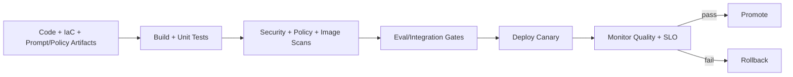

# CI/CD in Azure DevOps for Azure and GenAI Platforms

## Overview
This page covers enterprise CI/CD architecture in Azure DevOps for cloud and GenAI systems, including quality gates, security checks, rollout patterns, and rollback operations.

## Why this topic matters
Senior interviews assess whether you can ship safely at speed. CI/CD maturity is often a key signal of architecture ownership and production readiness.

## Core concepts
- Multi-stage pipeline design
- Build, test, security, and compliance gates
- Artifact and version governance
- Environment promotion strategy
- Canary/blue-green rollout
- Rollback and incident response integration
- Observability-linked release decisions

## Detailed explanation of each concept
CI/CD should validate code and behavior artifacts before production. For GenAI systems, this includes prompts, route policies, retrieval configs, and safety controls in addition to application code. Azure DevOps pipelines should enforce policy-as-code, security scanning, and environment approvals.

Safe release patterns require canary or blue-green strategies with explicit rollback triggers. Post-release health checks should include quality and safety telemetry, not only infra uptime.

## Evaluation (How to assess architecture quality)
- Deployment frequency and lead time
- Change failure rate and rollback speed
- Gate pass/fail trends
- Production incident rate after releases
- Quality/safety regressions caught pre-release

## Architecture / flow diagram


**Flow explanation:**  
Pipeline validates all release artifacts, deploys progressively, and uses live quality and reliability signals for promotion or rollback.

## Real-world example
A platform pipeline runs code tests, IaC policy checks, image scans, and GenAI eval gates. It deploys 10% canary to production, monitors latency/safety/quality, then either promotes or auto-rolls back.

## Best practices
- Keep pipelines as code with versioned templates
- Gate releases on security + quality + reliability
- Use immutable artifacts and release metadata
- Enforce environment-specific approvals and identities
- Automate rollback with defined thresholds
- Link telemetry and incident workflows to releases

## Common mistakes / misconceptions
- Deploying directly to production without staged confidence
- Treating CI/CD as build-only pipeline
- No policy/security checks in release path
- Manual rollback procedures without automation
- No release annotation in observability dashboards

## Industry relevance
CI/CD architecture is a mandatory capability for modern Azure platforms and AI-enabled products where change velocity is high.

## Interview discussion points
- How to design safe and fast pipelines
- What gates are non-negotiable
- Canary vs blue-green strategy
- How to link deployment with quality metrics
- How to reduce change failure rate

## Links to dependent / related topics
- [Terraform](./terraform.md)
- [Azure Topic Master](./azure_topic_master.md)
- [LLMOps, Observability, and Evaluation](../data-ai/llmops_observability_evaluation_langsmith_arize.md)
- [Python FastAPI Async Backend for GenAI](../data-ai/python_fastapi_async_backend_for_genai.md)

## Interview Questions (50)
1. How do you design multi-stage Azure DevOps pipelines?
2. What stages are essential in CI/CD for cloud platforms?
3. How do you separate CI and CD responsibilities?
4. What should run in CI vs pre-deploy gates?
5. How do you version and track build artifacts?
6. How do you include IaC artifacts in release flow?
7. How do you include prompt/policy artifacts in release flow?
8. How do you design environment promotion strategy?
9. How do you structure dev/test/stage/prod pipelines?
10. How do you enforce approvals for production?
11. How do you secure pipeline identities?
12. How do you implement least privilege in release pipelines?
13. How do you prevent secrets leakage in Azure DevOps?
14. How do you add SAST/DAST/dependency scans in CI?
15. How do you add image scanning in CI/CD?
16. How do you enforce policy-as-code gates before deployment?
17. How do you implement quality gates for API releases?
18. How do you implement quality gates for GenAI releases?
19. How do you run integration tests in pipeline safely?
20. How do you run performance tests in release gating?
21. How do you run canary deployment in Azure?
22. How do you run blue-green deployment in Azure?
23. Canary vs blue-green: decision criteria?
24. How do you define release health metrics?
25. How do you set rollback triggers objectively?
26. How do you automate rollback in Azure DevOps?
27. How do you avoid rollback flapping and instability?
28. How do you correlate releases with incidents?
29. How do you build post-deployment verification checks?
30. How do you include security validation post-deploy?
31. How do you design release dashboards for engineering teams?
32. How do you design release dashboards for leadership?
33. How do you design pipeline templates at enterprise scale?
34. How do you manage shared vs team-specific pipelines?
35. How do you enforce branch strategy for safe releases?
36. How do you handle database/schema migrations in CI/CD?
37. How do you handle backward compatibility in rollout?
38. How do you design release strategy for async worker systems?
39. How do you design release strategy for API + worker + queue combo?
40. How do you handle emergency hotfix releases safely?
41. How do you audit CI/CD changes for compliance?
42. How do you measure CI/CD maturity KPIs?
43. How do you reduce change failure rate?
44. How do you reduce lead time without compromising safety?
45. What anti-patterns are common in Azure DevOps CI/CD?
46. How do you build first-90-day CI/CD hardening roadmap?
47. How do you align platform, product, and security teams in release governance?
48. How do you present CI/CD ROI to leadership?
49. How do you design DR and failover in release operations?
50. How do you conclude CI/CD interview answers strongly?

## Answers for important questions (Summary + Crisp + Deep)

### Q1. How do you design multi-stage Azure DevOps pipelines?
**Question summary:** Tests release architecture fundamentals and governance maturity.
**Crisp answer (7-8 lines):** Define separate stages for build, validate, security, deploy, and verify. Keep each stage with explicit pass/fail criteria. Use immutable artifacts between stages. Run environment-specific approvals for higher-risk stages. Include rollback-ready metadata in release payload. Add telemetry annotations for traceability. Keep templates reusable across teams.
**Deep explanation (~40 lines):** Multi-stage pipelines reduce risk by building confidence gradually. Artifact immutability prevents drift between environments. Staged gates enforce quality, security, and compliance before production exposure. Reusable templates improve consistency and speed across teams.
**Answer summary:** Multi-stage pipelines provide controlled, auditable, progressive delivery.
**Simple diagram:**  
```text
Build -> Validate -> Secure -> Deploy -> Verify
```
**Trusted reference links:**  
- https://learn.microsoft.com/en-us/azure/devops/pipelines/

### Q2. What stages are essential in CI/CD for cloud platforms?
**Question summary:** Baseline stage architecture.
**Crisp answer (7-8 lines):** Build and unit test. Security and dependency scanning. IaC/policy validation. Integration and quality checks. Staged deployment with approval gates. Post-deploy verification and observability checks. Rollback decision stage for failures.
**Deep explanation (~40 lines):** Essential stages should map directly to major failure risks: code defects, security issues, policy violations, integration breaks, and runtime regressions.
**Answer summary:** Essential stages cover quality, security, governance, deployment, and runtime verification.
**Simple diagram:**  
```text
CI checks -> CD rollout -> post-deploy health gates
```
**Trusted reference links:**  
- https://learn.microsoft.com/en-us/azure/architecture/framework/devops/ci-cd

### Q3. How do you separate CI and CD responsibilities?
**Question summary:** Pipeline boundary clarity.
**Crisp answer (7-8 lines):** CI validates and packages artifacts. CD promotes validated artifacts across environments. CI should not mutate production infrastructure. CD should not rebuild artifacts. Keep artifact immutability between CI and CD. Enforce independent controls and approvals in CD. Trace artifact lineage end-to-end.
**Deep explanation (~40 lines):** Separation improves auditability and reduces accidental production risk from build-stage variability.
**Answer summary:** CI builds confidence in artifact quality; CD controls environment promotion safely.
**Simple diagram:**  
```text
CI: build/test/package -> CD: deploy/promote/verify
```
**Trusted reference links:**  
- https://learn.microsoft.com/en-us/azure/devops/pipelines/get-started/what-is-azure-pipelines

### Q4. What should run in CI vs pre-deploy gates?
**Question summary:** Gate placement design.
**Crisp answer (7-8 lines):** CI should run fast deterministic checks: lint, unit tests, SAST, dependency scans. Pre-deploy gates should run environment-sensitive checks: IaC policy, integration tests, quality baselines, approvals. Keep expensive tests near deployment where needed. Fail fast in CI to save pipeline cost. Keep gate ownership explicit.
**Deep explanation (~40 lines):** Good gate placement balances feedback speed and risk reduction.
**Answer summary:** Run cheap broad checks in CI, risk-specific context checks before deploy.
**Simple diagram:**  
```text
CI fast gates -> pre-deploy deep gates
```
**Trusted reference links:**  
- https://learn.microsoft.com/en-us/azure/well-architected/operational-excellence/release-engineering

### Q5. How do you version and track build artifacts?
**Question summary:** Artifact governance.
**Crisp answer (7-8 lines):** Use immutable version tags tied to commit SHA. Store artifacts in trusted registry/feed. Include metadata for build time, branch, and pipeline run. Sign artifacts when required. Promote same artifact across environments. Never rebuild for production stage. Keep provenance traceable for audits.
**Deep explanation (~40 lines):** Immutable artifact promotion ensures consistency and simplifies incident rollback.
**Answer summary:** Use immutable, signed, traceable artifacts across all deployment stages.
**Simple diagram:**  
```text
Commit -> build artifact vX -> promote unchanged
```
**Trusted reference links:**  
- https://learn.microsoft.com/en-us/azure/devops/artifacts/

### Q6. How do you include IaC artifacts in release flow?
**Question summary:** Infra and app release integration.
**Crisp answer (7-8 lines):** Treat IaC code as first-class release artifact. Run terraform/bicep validation and policy checks in pipeline. Publish plan outputs for approval. Apply infra changes in staged environments. Correlate infra release IDs with app release IDs. Rollback infra via version-controlled code. Audit all applies.
**Deep explanation (~40 lines):** Infra changes can break runtime if unmanaged; integrated flow keeps environment and app evolution aligned.
**Answer summary:** Integrate IaC into the same governed release lifecycle as application code.
**Simple diagram:**  
```text
App artifact + IaC artifact -> coordinated promotion
```
**Trusted reference links:**  
- https://learn.microsoft.com/en-us/azure/devops/pipelines/ecosystems/terraform

### Q7. How do you include prompt/policy artifacts in release flow?
**Question summary:** GenAI-specific release governance.
**Crisp answer (7-8 lines):** Store prompts/policies in source control. Validate syntax and policy logic in CI. Run eval regression on artifact changes. Bundle versions with app release metadata. Deploy with feature flags for safe activation. Correlate telemetry with artifact versions. Keep rollback to previous artifacts.
**Deep explanation (~40 lines):** Non-code AI artifacts can change behavior significantly and must be governed like code.
**Answer summary:** Version, test, deploy, and monitor AI artifacts with full release discipline.
**Simple diagram:**  
```text
Prompt/policy change -> eval gate -> controlled rollout
```
**Trusted reference links:**  
- https://learn.microsoft.com/en-us/azure/architecture/framework/operational-excellence/

### Q8. How do you design environment promotion strategy?
**Question summary:** Release confidence model.
**Crisp answer (7-8 lines):** Promote through dev, test, staging, then production. Use same immutable artifact each step. Enforce stronger gates closer to production. Require human approvals for high-risk changes. Track promotion health metrics. Stop promotion on threshold breach. Document promotion criteria.
**Deep explanation (~40 lines):** Environment promotion builds confidence and reduces production blast radius.
**Answer summary:** Use staged immutable promotion with risk-based controls and clear go/no-go rules.
**Simple diagram:**  
```text
Dev -> Test -> Stage -> Prod
```
**Trusted reference links:**  
- https://learn.microsoft.com/en-us/azure/architecture/framework/devops/ci-cd

### Q9. How do you structure dev/test/stage/prod pipelines?
**Question summary:** Pipeline topology.
**Crisp answer (7-8 lines):** Use reusable templates with environment parameters. Keep environment-specific secrets and approvals isolated. Apply different gate depth by environment risk. Maintain parity in deployment steps to reduce surprises. Separate service connections per environment. Track pipeline metrics per stage. Keep ownership clear.
**Deep explanation (~40 lines):** Template-driven structure ensures consistency while preserving environment-specific controls.
**Answer summary:** Use templated pipelines with isolated identities and environment-tailored gates.
**Simple diagram:**  
```text
Template pipeline -> env-specific parameters/approvals
```
**Trusted reference links:**  
- https://learn.microsoft.com/en-us/azure/devops/pipelines/process/templates

### Q10. How do you enforce approvals for production?
**Question summary:** Governance and control.
**Crisp answer (7-8 lines):** Require role-based approvers for prod stages. Enforce separation of duties. Include security/compliance approval for high-risk changes. Time-limit approvals to avoid stale releases. Record approval evidence automatically. Use emergency override only with audit controls. Review approval effectiveness regularly.
**Deep explanation (~40 lines):** Approval workflows should be risk-based and auditable, not procedural overhead.
**Answer summary:** Implement controlled, auditable, role-based production approvals.
**Simple diagram:**  
```text
Prod gate -> approver checks -> deploy
```
**Trusted reference links:**  
- https://learn.microsoft.com/en-us/azure/devops/pipelines/release/approvals/

### Q11. How do you secure pipeline identities?
**Question summary:** Identity hardening.
**Crisp answer (7-8 lines):** Use dedicated service identities per pipeline/environment. Scope permissions minimally. Prefer federated/workload identity over static credentials. Rotate and review permissions periodically. Restrict privileged tasks to protected stages. Audit identity usage events. Remove unused service connections quickly.
**Deep explanation (~40 lines):** Pipeline identities are high-value targets and need strict least-privilege governance.
**Answer summary:** Secure CI/CD identities with scoped permissions and credentialless auth patterns.
**Simple diagram:**  
```text
Pipeline identity -> least-privilege resource access
```
**Trusted reference links:**  
- https://learn.microsoft.com/en-us/azure/devops/pipelines/security/overview

### Q12. How do you implement least privilege in release pipelines?
**Question summary:** Access governance in delivery.
**Crisp answer (7-8 lines):** Scope deployment rights by environment and resource set. Use separate identities for read vs deploy actions. Keep production write access only in protected stages. Block broad subscription owner roles in routine pipelines. Use just-in-time elevation for exceptional tasks. Log all privileged operations. Review access monthly.
**Deep explanation (~40 lines):** Least privilege reduces impact of pipeline compromise and misconfiguration.
**Answer summary:** Apply scoped, stage-specific permissions and audited privileged actions.
**Simple diagram:**  
```text
Stage -> scoped identity -> limited rights
```
**Trusted reference links:**  
- https://learn.microsoft.com/en-us/azure/role-based-access-control/overview

### Q13. How do you prevent secrets leakage in Azure DevOps?
**Question summary:** Secret hygiene.
**Crisp answer (7-8 lines):** Store secrets in secure variable groups/Key Vault integration. Mask secrets in logs automatically. Avoid echoing secret values in scripts. Restrict who can read/update secrets. Rotate secrets regularly. Scan repos and pipelines for accidental secret exposure. Audit secret access events.
**Deep explanation (~40 lines):** Secret leakage often occurs through logs and scripts; process controls are essential.
**Answer summary:** Use secure storage, masking, least privilege, and scanning to prevent secret leakage.
**Simple diagram:**  
```text
Secret vault -> pipeline runtime -> masked usage
```
**Trusted reference links:**  
- https://learn.microsoft.com/en-us/azure/devops/pipelines/release/azure-key-vault

### Q14. How do you add SAST/DAST/dependency scans in CI?
**Question summary:** Security gate integration.
**Crisp answer (7-8 lines):** Add static code scanning after build. Add dependency vulnerability scanning on lockfiles/images. Run DAST in controlled test environments. Define severity thresholds for fail/pass. Publish scan results with owner assignments. Track remediation SLA. Re-scan after fixes.
**Deep explanation (~40 lines):** Integrated scanning reduces security debt and blocks high-risk releases early.
**Answer summary:** Embed SAST/DAST/dependency scanning with enforceable severity gates.
**Simple diagram:**  
```text
Code -> SAST/deps scan -> DAST -> gate decision
```
**Trusted reference links:**  
- https://learn.microsoft.com/en-us/azure/devops/repos/security/

### Q15. How do you add image scanning in CI/CD?
**Question summary:** Container security in pipeline.
**Crisp answer (7-8 lines):** Scan images after build and before deploy. Fail pipeline on critical CVEs. Keep approved base image allowlist. Re-scan periodically for newly disclosed vulnerabilities. Track scan results by image digest. Require remediation PR before promotion. Enforce signed images where possible.
**Deep explanation (~40 lines):** Image scanning is continuous control, not one-time release checkbox.
**Answer summary:** Integrate digest-based image scanning gates across build and deploy stages.
**Simple diagram:**  
```text
Image build -> scan -> promote/block
```
**Trusted reference links:**  
- https://kubernetes.io/docs/concepts/security/supply-chain-security/

### Q16. How do you enforce policy-as-code gates before deployment?
**Question summary:** Governance automation.
**Crisp answer (7-8 lines):** Evaluate policy rules against IaC plans and configs. Block non-compliant changes automatically. Keep policy rules versioned and reviewed. Support controlled exceptions with expiry. Report policy failures by team/domain. Include policy trend reporting in governance cadence. Revalidate policy coverage regularly.
**Deep explanation (~40 lines):** Policy gates scale governance without manual bottlenecks and prevent risky changes reaching prod.
**Answer summary:** Use automated policy checks as mandatory pre-deploy gates.
**Simple diagram:**  
```text
Plan/config -> policy engine -> pass/fail
```
**Trusted reference links:**  
- https://learn.microsoft.com/en-us/azure/governance/policy/overview

### Q17. How do you implement quality gates for API releases?
**Question summary:** API release safety.
**Crisp answer (7-8 lines):** Run unit/integration/contract tests. Validate backward compatibility and error contract consistency. Add performance smoke checks. Verify auth and security rules. Gate deployment on SLO-relevant thresholds. Compare with baseline telemetry. Block promotion if critical metrics regress.
**Deep explanation (~40 lines):** API gates should prevent behavior and performance regressions before customer exposure.
**Answer summary:** Use contract, security, and performance gates with baseline comparison for API releases.
**Simple diagram:**  
```text
API checks -> baseline compare -> release gate
```
**Trusted reference links:**  
- https://learn.microsoft.com/en-us/azure/architecture/best-practices/api-design

### Q18. How do you implement quality gates for GenAI releases?
**Question summary:** AI behavior gate design.
**Crisp answer (7-8 lines):** Run offline eval suites for core intents. Include safety and grounding checks. Compare quality metrics with current production baseline. Validate latency and token cost budgets. Enforce fail criteria for high-risk regressions. Canary deploy with live monitoring after pass. Roll back on quality/safety drift.
**Deep explanation (~40 lines):** GenAI gates must assess behavior, not only service uptime.
**Answer summary:** Apply behavior-aware eval and safety gates before and after deployment.
**Simple diagram:**  
```text
Offline eval + safety -> canary -> online quality gate
```
**Trusted reference links:**  
- https://learn.microsoft.com/en-us/azure/ai-foundry/concepts/evaluation

### Q19. How do you run integration tests in pipeline safely?
**Question summary:** End-to-end validation.
**Crisp answer (7-8 lines):** Use isolated test environment with controlled data. Run key cross-service workflows and failure paths. Validate auth, messaging, and persistence integration. Keep test runtime bounded for pipeline efficiency. Clean environment post-test. Publish trace artifacts for failures. Block release on critical integration failures.
**Deep explanation (~40 lines):** Integration tests catch boundary failures that unit tests miss.
**Answer summary:** Execute isolated, workflow-focused integration tests with deterministic teardown.
**Simple diagram:**  
```text
Ephemeral env -> integration suite -> teardown
```
**Trusted reference links:**  
- https://learn.microsoft.com/en-us/azure/architecture/framework/operational-excellence/

### Q20. How do you run performance tests in release gating?
**Question summary:** SLO protection.
**Crisp answer (7-8 lines):** Run targeted load tests on critical endpoints/workflows. Use representative payload and traffic patterns. Measure p95/p99 latency and error behavior. Compare against release thresholds. Include dependency and queue impact checks. Gate promotion on significant regressions. Store trend history for planning.
**Deep explanation (~40 lines):** Performance gates prevent hidden latency regressions from reaching production.
**Answer summary:** Use realistic load-based gates tied to SLO thresholds.
**Simple diagram:**  
```text
Load test -> percentile metrics -> gate decision
```
**Trusted reference links:**  
- https://learn.microsoft.com/en-us/azure/well-architected/performance-efficiency/testing

### Q21. How do you run canary deployment in Azure?
**Question summary:** Progressive release execution.
**Crisp answer (7-8 lines):** Route small traffic percentage to new version. Monitor quality, latency, and error metrics. Keep comparison against stable baseline route. Expand traffic gradually by thresholds. Trigger rollback on breach. Annotate dashboards with release metadata. Complete promotion only after confidence window.
**Deep explanation (~40 lines):** Canary allows controlled risk exposure for uncertain behavior changes.
**Answer summary:** Execute gradual traffic shifts with objective health thresholds and rollback automation.
**Simple diagram:**  
```text
5% -> 20% -> 50% -> 100%
```
**Trusted reference links:**  
- https://learn.microsoft.com/en-us/azure/architecture/patterns/canary-release

### Q22. How do you run blue-green deployment in Azure?
**Question summary:** Parallel environment release.
**Crisp answer (7-8 lines):** Maintain blue (current) and green (new) environments. Validate green health before traffic switch. Perform cutover via routing switch. Keep blue intact for rapid rollback. Monitor post-switch stability closely. Decommission blue after confidence period. Use for changes needing quick full switch.
**Deep explanation (~40 lines):** Blue-green minimizes downtime and simplifies rollback at cost of temporary duplication.
**Answer summary:** Use parallel stacks and controlled switch for low-downtime, fast-revert releases.
**Simple diagram:**  
```text
Blue + Green -> switch traffic -> monitor
```
**Trusted reference links:**  
- https://learn.microsoft.com/en-us/azure/architecture/framework/devops/ci-cd

### Q23. Canary vs blue-green: decision criteria?
**Question summary:** Pattern selection.
**Crisp answer (7-8 lines):** Use canary when behavior risk is uncertain and gradual validation is needed. Use blue-green when quick full swap and fast rollback are priorities. Canary needs strong observability and traffic control. Blue-green needs extra capacity. Choose by risk profile, cost tolerance, and rollout urgency. Document rationale for consistency.
**Deep explanation (~40 lines):** Different release patterns optimize different risk and operational constraints.
**Answer summary:** Canary for gradual confidence; blue-green for fast switch rollback simplicity.
**Simple diagram:**  
```text
Risk uncertain -> canary
Need fast cutover -> blue-green
```
**Trusted reference links:**  
- https://learn.microsoft.com/en-us/azure/architecture/patterns/

### Q24. How do you define release health metrics?
**Question summary:** Promotion signal design.
**Crisp answer (7-8 lines):** Include latency, error rate, saturation, and availability. Add quality/safety metrics for AI workloads. Include cost and fallback activation trends. Segment by route and tenant where needed. Define thresholds and observation windows clearly. Automate metric checks in pipeline. Keep metrics aligned to user outcomes.
**Deep explanation (~40 lines):** Health metrics should reflect both technical and business impact.
**Answer summary:** Define multi-dimensional release health metrics tied to SLOs and user value.
**Simple diagram:**  
```text
Perf + quality + safety + cost -> release health score
```
**Trusted reference links:**  
- https://learn.microsoft.com/en-us/azure/azure-monitor/overview

### Q25. How do you set rollback triggers objectively?
**Question summary:** Automated rollback control.
**Crisp answer (7-8 lines):** Use threshold-based triggers for key metrics. Define severe and warning breach levels. Apply short rolling windows and anti-flap logic. Include quality/safety triggers for AI releases. Automate rollback for severe breaches. Notify owners with context on trigger cause. Validate restoration after rollback.
**Deep explanation (~40 lines):** Objective triggers reduce hesitation and shorten incident duration.
**Answer summary:** Use pre-defined measurable rollback thresholds with anti-flap protections.
**Simple diagram:**  
```text
Metric breach -> rollback trigger -> recover
```
**Trusted reference links:**  
- https://learn.microsoft.com/en-us/azure/well-architected/reliability/testing

### Q26. How do you automate rollback in Azure DevOps?
**Question summary:** Recovery pipeline design.
**Crisp answer (7-8 lines):** Keep previous stable artifact and config references ready. Create rollback stage template in pipeline. Trigger rollback automatically from monitoring alerts or gate failures. Revert traffic and artifact versions together. Run post-rollback smoke checks. Lock new deployments until triage complete. Capture rollback event metadata.
**Deep explanation (~40 lines):** Rollback automation must be prebuilt and tested, not improvised during incidents.
**Answer summary:** Implement templated rollback stages with automated trigger and validation steps.
**Simple diagram:**  
```text
Failure alert -> rollback stage -> validation
```
**Trusted reference links:**  
- https://learn.microsoft.com/en-us/azure/devops/pipelines/release/deploy-using-approvals

### Q27. How do you avoid rollback flapping and instability?
**Question summary:** Control stability.
**Crisp answer (7-8 lines):** Use hysteresis and minimum observation windows. Add cooldown period after rollback. Prevent immediate re-promotion of same artifact. Require explicit review before reattempt. Monitor oscillation metrics by service. Keep fallback route stable during incident. Update thresholds from postmortems.
**Deep explanation (~40 lines):** Flapping increases outage duration and operational confusion.
**Answer summary:** Stabilize with cooldowns, hysteresis, and governed re-promotion rules.
**Simple diagram:**  
```text
Rollback -> cooldown -> controlled re-evaluation
```
**Trusted reference links:**  
- https://learn.microsoft.com/en-us/azure/architecture/patterns/circuit-breaker

### Q28. How do you correlate releases with incidents?
**Question summary:** Causality analysis.
**Crisp answer (7-8 lines):** Tag telemetry with release/version IDs. Add deployment annotations in dashboards. Correlate incident start with release windows. Compare changed routes/services with impact scope. Use traces and logs for causal evidence. Maintain incident timeline with release events. Feed findings into release risk model.
**Deep explanation (~40 lines):** Correlation reduces mean-time-to-root-cause and improves future release safety.
**Answer summary:** Version-tagged telemetry and release annotations enable faster incident attribution.
**Simple diagram:**  
```text
Release metadata + incident timeline -> causality
```
**Trusted reference links:**  
- https://learn.microsoft.com/en-us/azure/architecture/framework/operational-excellence/

### Q29. How do you build post-deployment verification checks?
**Question summary:** Runtime validation.
**Crisp answer (7-8 lines):** Run smoke workflows immediately post-release. Validate critical API paths and auth flows. Check queue processing and background jobs. Verify error rate and latency against baseline. Confirm observability and alert pipelines are healthy. Validate policy controls remain active. Gate full promotion on verification success.
**Deep explanation (~40 lines):** Post-deploy checks catch issues before full user impact.
**Answer summary:** Use automated critical-path verification before broad promotion.
**Simple diagram:**  
```text
Deploy -> smoke/health checks -> promote or rollback
```
**Trusted reference links:**  
- https://learn.microsoft.com/en-us/azure/architecture/framework/operational-excellence/monitoring

### Q30. How do you include security validation post-deploy?
**Question summary:** Runtime security assurance.
**Crisp answer (7-8 lines):** Validate authn/authz behaviors in deployed environment. Check network exposure and policy compliance. Verify secret access paths and key rotation status. Run targeted DAST/security probes on critical endpoints. Confirm security alerts pipeline functioning. Block promotion on critical security regressions. Document findings.
**Deep explanation (~40 lines):** Security posture can drift during deployment; post-deploy validation closes that gap.
**Answer summary:** Add post-deploy security checks to ensure controls remain effective after release.
**Simple diagram:**  
```text
Post-deploy -> security probes/policy checks -> pass/fail
```
**Trusted reference links:**  
- https://learn.microsoft.com/en-us/azure/well-architected/security/

### Q31. How do you design release dashboards for engineering teams?
**Question summary:** Operational visibility for practitioners.
**Crisp answer (7-8 lines):** Show deployment status by stage and environment. Include latency/error/fallback metrics per version. Add queue and worker health for async systems. Show rollback events and trigger reasons. Include links to traces/logs quickly. Provide drift and policy gate trends. Keep drill-down by service and route.
**Deep explanation (~40 lines):** Engineering dashboards should accelerate triage and rollback decisions.
**Answer summary:** Build version-centric dashboards that combine release state with runtime behavior.
**Simple diagram:**  
```text
Version view -> service metrics -> drill-down diagnostics
```
**Trusted reference links:**  
- https://learn.microsoft.com/en-us/azure/azure-monitor/visualize/workbooks-overview

### Q32. How do you design release dashboards for leadership?
**Question summary:** Executive observability.
**Crisp answer (7-8 lines):** Focus on deployment success rate, incident impact, rollback time, and trend direction. Include quality/safety outcome shifts for AI services. Show risk and residual issues clearly. Present change velocity vs stability balance. Keep concise decision-oriented views. Update with governance cadence.
**Deep explanation (~40 lines):** Leadership dashboards should support prioritization and investment decisions, not operational noise.
**Answer summary:** Present outcome-focused release KPIs with risk transparency for leadership.
**Simple diagram:**  
```text
Velocity + Stability + Risk -> leadership decisions
```
**Trusted reference links:**  
- https://learn.microsoft.com/en-us/azure/well-architected/framework

### Q33. How do you design pipeline templates at enterprise scale?
**Question summary:** Standardization strategy.
**Crisp answer (7-8 lines):** Build centrally governed reusable templates. Parameterize service-specific variations safely. Keep mandatory security/policy steps non-optional. Version templates and deprecate gradually. Test template updates in pilot services first. Document usage and ownership clearly. Track adoption and exception rates.
**Deep explanation (~40 lines):** Templates improve consistency and reduce per-team pipeline drift.
**Answer summary:** Use versioned governed templates with safe parameterization and mandatory controls.
**Simple diagram:**  
```text
Central template library -> team pipelines
```
**Trusted reference links:**  
- https://learn.microsoft.com/en-us/azure/devops/pipelines/process/templates

### Q34. How do you manage shared vs team-specific pipelines?
**Question summary:** Governance vs autonomy.
**Crisp answer (7-8 lines):** Keep shared baseline templates for mandatory controls. Allow team overlays for domain-specific tests. Define clear extension points and guardrails. Block removal of required security gates. Review customizations periodically. Use ownership model for template maintenance. Track deviation impact.
**Deep explanation (~40 lines):** Balanced model provides consistency without blocking team velocity.
**Answer summary:** Combine shared mandatory baselines with controlled team-specific extensions.
**Simple diagram:**  
```text
Mandatory baseline + team overlays
```
**Trusted reference links:**  
- https://learn.microsoft.com/en-us/azure/architecture/framework/devops/

### Q35. How do you enforce branch strategy for safe releases?
**Question summary:** Source control governance.
**Crisp answer (7-8 lines):** Protect main/release branches with PR requirements. Require checks and approvals before merge. Enforce signed commits if policy requires. Limit direct pushes to protected branches. Use release branches/tags for production traceability. Require hotfix merge-back discipline. Audit branch policy exceptions.
**Deep explanation (~40 lines):** Branch governance prevents unreviewed changes entering release path.
**Answer summary:** Enforce protected branch and PR policy controls for release integrity.
**Simple diagram:**  
```text
Feature -> PR checks -> protected main/release
```
**Trusted reference links:**  
- https://learn.microsoft.com/en-us/azure/devops/repos/git/branch-policies

### Q36. How do you handle database/schema migrations in CI/CD?
**Question summary:** Data change safety.
**Crisp answer (7-8 lines):** Use backward-compatible schema-first migrations. Deploy readers before writers for additive changes. Include migration tests in staging. Keep rollback/forward-fix strategy defined. Monitor migration runtime and lock impact. Gate deployment if migration risk high. Document migration runbooks.
**Deep explanation (~40 lines):** Schema changes are high-risk and require compatibility planning across rollout windows.
**Answer summary:** Apply compatibility-first migrations with staged validation and rollback planning.
**Simple diagram:**  
```text
Schema add -> app update -> old path retire
```
**Trusted reference links:**  
- https://learn.microsoft.com/en-us/azure/architecture/framework/operational-excellence/

### Q37. How do you handle backward compatibility in rollout?
**Question summary:** Consumer safety.
**Crisp answer (7-8 lines):** Prefer additive API and event changes. Keep old and new contracts during migration. Track consumer adoption by telemetry. Provide migration guides and timelines. Retire deprecated contracts only after readiness criteria. Test mixed-version interoperability. Keep rollback to prior contract path.
**Deep explanation (~40 lines):** Compatibility reduces downstream disruption during continuous delivery.
**Answer summary:** Use additive evolution and telemetry-driven deprecation for safe rollouts.
**Simple diagram:**  
```text
v1+v2 coexist -> migration -> v1 retire
```
**Trusted reference links:**  
- https://learn.microsoft.com/en-us/azure/architecture/best-practices/api-design

### Q38. How do you design release strategy for async worker systems?
**Question summary:** Queue/worker deployment safety.
**Crisp answer (7-8 lines):** Keep message contracts backward compatible. Roll workers gradually with canary queues if needed. Monitor queue lag, error rate, and DLQ spikes. Drain/stop old workers carefully to avoid in-flight loss. Validate idempotency across versions. Include fallback worker route. Use rapid rollback path.
**Deep explanation (~40 lines):** Async systems need extra care for in-flight workloads and contract compatibility.
**Answer summary:** Roll worker changes gradually with queue health and contract compatibility controls.
**Simple diagram:**  
```text
Old/new workers -> monitored queue processing -> cutover
```
**Trusted reference links:**  
- https://learn.microsoft.com/en-us/azure/architecture/patterns/competing-consumers

### Q39. How do you design release strategy for API + worker + queue combo?
**Question summary:** Multi-component coordinated rollout.
**Crisp answer (7-8 lines):** Sequence by compatibility: queue contracts, worker consumers, then API producers where needed. Keep dual-compatible window. Monitor end-to-end journey metrics. Roll traffic gradually across components. Use feature flags for behavior toggles. Maintain rollback matrix per component. Verify business outcomes before full promotion.
**Deep explanation (~40 lines):** Coordinated release prevents cross-component version mismatch failures.
**Answer summary:** Use compatibility-aware staged rollout across API, queue, and workers.
**Simple diagram:**  
```text
Contract-safe order -> worker rollout -> API rollout
```
**Trusted reference links:**  
- https://learn.microsoft.com/en-us/azure/architecture/framework/operational-excellence/

### Q40. How do you handle emergency hotfix releases safely?
**Question summary:** Urgent change governance.
**Crisp answer (7-8 lines):** Use predefined hotfix pipeline with reduced but critical checks. Keep strict approval and audit requirements. Limit scope to targeted fix only. Deploy to limited blast radius first if possible. Monitor closely post-deploy. Merge hotfix back into mainline promptly. Run full regression afterward.
**Deep explanation (~40 lines):** Hotfix speed should not eliminate governance; minimum safety controls remain mandatory.
**Answer summary:** Use controlled hotfix path with essential gates, auditability, and rapid stabilization.
**Simple diagram:**  
```text
Hotfix branch -> critical gates -> controlled deploy -> merge-back
```
**Trusted reference links:**  
- https://learn.microsoft.com/en-us/azure/devops/repos/git/branching-guidance

### Q41. How do you audit CI/CD changes for compliance?
**Question summary:** Evidence and controls.
**Crisp answer (7-8 lines):** Log pipeline definitions, approvals, and release events. Keep immutable build and deploy metadata. Track who changed pipeline/gates and when. Store scan and policy reports per release. Retain audit artifacts by compliance policy. Review exceptions and emergency overrides. Provide periodic compliance reports.
**Deep explanation (~40 lines):** Compliance needs full evidence chain from code change to deployment outcome.
**Answer summary:** Maintain immutable CI/CD evidence across definitions, approvals, scans, and deployments.
**Simple diagram:**  
```text
Pipeline change + release logs -> audit evidence store
```
**Trusted reference links:**  
- https://learn.microsoft.com/en-us/azure/devops/organizations/audit/

### Q42. How do you measure CI/CD maturity KPIs?
**Question summary:** Performance measurement framework.
**Crisp answer (7-8 lines):** Track lead time, deployment frequency, change failure rate, and MTTR. Add gate pass rates and rollback frequency. Include security policy violation trends. Measure automation coverage across services. Segment by team/domain for targeted coaching. Review KPI trends monthly. Tie improvement goals to roadmap.
**Deep explanation (~40 lines):** Balanced KPI sets show both speed and safety outcomes.
**Answer summary:** Use DORA + security/governance KPIs to measure CI/CD maturity holistically.
**Simple diagram:**  
```text
Velocity + Stability + Security KPIs
```
**Trusted reference links:**  
- https://learn.microsoft.com/en-us/azure/architecture/framework/devops/

### Q43. How do you reduce change failure rate?
**Question summary:** Reliability improvement.
**Crisp answer (7-8 lines):** Strengthen pre-release test quality and policy gates. Use smaller incremental releases. Expand canary coverage and post-deploy checks. Improve observability and rollback speed. Analyze postmortems and fix systemic causes. Standardize pipeline templates. Train teams on release discipline.
**Deep explanation (~40 lines):** Lower failure rate comes from better feedback loops and safer release granularity.
**Answer summary:** Reduce failures with stronger gates, smaller changes, and post-incident learning loops.
**Simple diagram:**  
```text
Smaller safer releases + stronger gates -> fewer failures
```
**Trusted reference links:**  
- https://learn.microsoft.com/en-us/azure/well-architected/operational-excellence/

### Q44. How do you reduce lead time without compromising safety?
**Question summary:** Speed vs control balance.
**Crisp answer (7-8 lines):** Automate repetitive checks and approvals where possible. Shift-left tests and policy scans. Use reusable pipeline templates. Parallelize independent test stages. Keep release size small and frequent. Remove low-value manual steps. Monitor safety KPIs while optimizing speed.
**Deep explanation (~40 lines):** Lead time improves when controls are automated, not removed.
**Answer summary:** Increase speed through automation and pipeline design, while preserving critical gates.
**Simple diagram:**  
```text
Automation + parallelism + small batches -> lower lead time
```
**Trusted reference links:**  
- https://learn.microsoft.com/en-us/azure/architecture/framework/devops/

### Q45. What anti-patterns are common in Azure DevOps CI/CD?
**Question summary:** Pitfall identification.
**Crisp answer (7-8 lines):** Single-stage deploy-to-prod pipelines. No policy/security scanning gates. Rebuilding artifacts per environment. Shared overprivileged service accounts. Manual rollback with no tests. No release telemetry annotations. Ignoring post-deploy verification.
**Deep explanation (~40 lines):** Anti-patterns usually emerge when velocity is prioritized without governance design.
**Answer summary:** Avoid simplistic, ungoverned pipelines that lack safe release and rollback controls.
**Simple diagram:**  
```text
Weak pipeline design -> high incident/change failure rates
```
**Trusted reference links:**  
- https://learn.microsoft.com/en-us/azure/architecture/framework/

### Q46. How do you build first-90-day CI/CD hardening roadmap?
**Question summary:** Execution planning.
**Crisp answer (7-8 lines):** Month 1: assess current pipelines and risks. Month 2: implement critical gates, identity hardening, and artifact governance. Month 3: add canary/rollback automation and observability integration. Define owners and KPIs for each milestone. Track progress weekly. Run drills and refine runbooks.
**Deep explanation (~40 lines):** Hardening roadmap should prioritize high-risk gaps first while preserving delivery continuity.
**Answer summary:** Use phased hardening plan with measurable controls and ownership.
**Simple diagram:**  
```text
Assess -> harden -> automate + validate
```
**Trusted reference links:**  
- https://learn.microsoft.com/en-us/azure/cloud-adoption-framework/

### Q47. How do you align platform, product, and security teams in release governance?
**Question summary:** Cross-functional operating model.
**Crisp answer (7-8 lines):** Define RACI for pipeline ownership and approvals. Platform owns shared templates and controls. Product owns service behavior and quality outcomes. Security owns policy and compliance guardrails. Jointly manage incident response and postmortems. Keep governance cadence with clear decisions. Resolve exceptions through formal workflow.
**Deep explanation (~40 lines):** Cross-team clarity reduces delays and conflict during high-risk releases.
**Answer summary:** Use explicit RACI and governance cadence across platform, product, and security teams.
**Simple diagram:**  
```text
Platform | Product | Security -> shared release governance
```
**Trusted reference links:**  
- https://learn.microsoft.com/en-us/azure/architecture/framework/

### Q48. How do you present CI/CD ROI to leadership?
**Question summary:** Business value narrative.
**Crisp answer (7-8 lines):** Show faster lead time and safer release outcomes. Quantify fewer incidents and lower rollback impact. Demonstrate compliance and audit readiness gains. Show engineering productivity and reduced manual effort. Tie results to customer reliability and trust. Present phased investment with milestone outcomes. Track KPI trend improvements.
**Deep explanation (~40 lines):** Leadership ROI should connect delivery improvements with business resilience and risk reduction.
**Answer summary:** Present CI/CD as measurable improvement in speed, stability, and compliance confidence.
**Simple diagram:**  
```text
CI/CD investment -> velocity + stability + compliance gains
```
**Trusted reference links:**  
- https://learn.microsoft.com/en-us/azure/well-architected/framework

### Q49. How do you design DR and failover in release operations?
**Question summary:** Release resilience planning.
**Crisp answer (7-8 lines):** Keep region-aware deployment and rollback runbooks. Verify artifact and config parity across failover regions. Test failover releases in drills regularly. Ensure pipeline can target secondary region safely. Validate identity/secrets/policy parity in failover path. Measure RTO/RPO and release readiness metrics. Improve from drill findings.
**Deep explanation (~40 lines):** Release operations must remain functional during regional incidents.
**Answer summary:** Build and test region-aware release and rollback capabilities for DR readiness.
**Simple diagram:**  
```text
Primary release path <-> secondary failover release path
```
**Trusted reference links:**  
- https://learn.microsoft.com/en-us/azure/well-architected/reliability/

### Q50. How do you conclude CI/CD interview answers strongly?
**Question summary:** Final synthesis and communication.
**Crisp answer (7-8 lines):** Reconnect pipeline design to business and SLO goals. Summarize stages, gates, and rollout strategy. Highlight security and rollback readiness clearly. Mention observability-linked release decisions. State ownership and governance cadence. Provide measurable success KPIs. End with concise confidence and trade-off clarity.
**Deep explanation (~40 lines):** Strong closure demonstrates both technical control and operational leadership expected from senior architects.
**Answer summary:** Conclude with safe-speed delivery model, governance controls, and measurable outcomes.
**Simple diagram:**  
```text
Pipeline controls -> safe releases -> business outcomes
```
**Trusted reference links:**  
- https://learn.microsoft.com/en-us/azure/architecture/framework/
