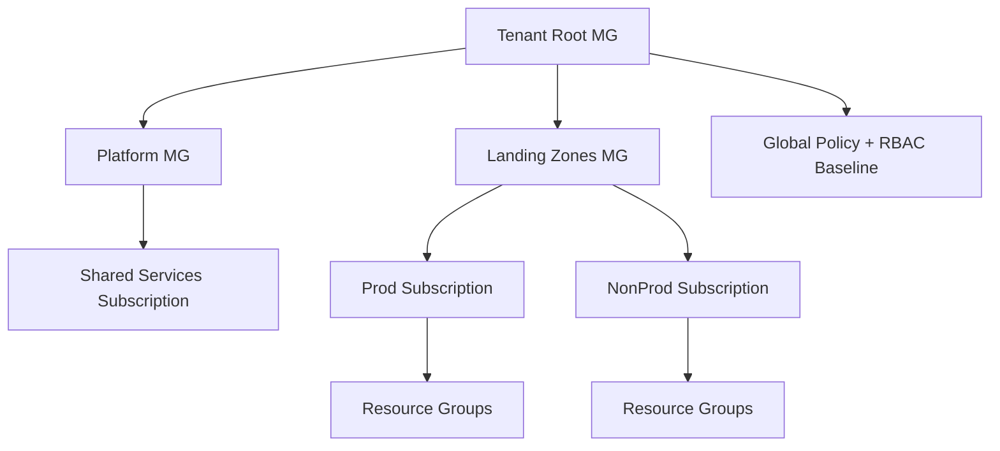

# Azure Governance Hierarchy

## Overview

Azure governance hierarchy defines how enterprise controls are applied from management groups to subscriptions to resource groups. This is the backbone for secure, scalable, and auditable cloud operations.
It is not just an org chart; it is the mechanism that determines policy inheritance, access boundaries, compliance enforcement, and cost accountability for every workload.
In large Azure estates, governance hierarchy becomes the control architecture that keeps growth predictable. Without it, teams create inconsistent deployments, security posture drifts across environments, and audit readiness becomes reactive instead of designed. A strong hierarchy provides repeatable placement rules for workloads and clear boundaries for policy, identity, networking, and financial governance.

This topic also underpins platform engineering maturity. If hierarchy is well designed, platform teams can offer fast self-service onboarding with safe defaults. If hierarchy is weak, every new workload becomes a custom governance exercise.

## Why this topic matters

- Every enterprise Azure architecture decision depends on governance boundaries.
- Interviewers use this topic to test architect maturity beyond service knowledge.
- Governance quality determines whether cloud growth stays controlled or turns into policy drift and shadow IT.
- It directly affects how quickly teams can onboard subscriptions without compromising security.
- It defines the enforceable boundary for policy, identity, and cost controls.
- It determines audit reliability because inherited controls are easier to verify than manual controls.

For senior architect interviews, this topic is a high-signal area because it demonstrates whether you can run a cloud as an operating system, not just deploy resources. Strong answers explain how governance hierarchy enables both control and speed, and how to evolve it safely over time.

## Core concepts

- Management groups
- Subscriptions
- Resource groups
- Azure Policy
- RBAC
- Tagging and cost governance
- Landing zones

These concepts are interdependent. Management groups define inheritance paths, subscriptions define isolation boundaries, policies define allowed state, RBAC defines authorized actors, and landing zones provide standardized implementation of all of the above. Tagging and cost governance attach business accountability to technical resources.

## Detailed explanation of each concept

### Management Groups
- **Definition:** Hierarchical containers for organizing subscriptions.
- **Need:** Centralized policy and RBAC inheritance at scale.
- **How it works:** Policies and roles applied at parent scopes cascade to children.
- **Best use:** Organize by platform, business unit, and environment.
Management groups should be designed for governance durability, not short-term org charts. A good hierarchy minimizes future rework and reduces policy conflict. They are also the best place to separate global controls from domain-specific controls.

### Subscriptions
- **Definition:** Billing, quota, and operational boundaries.
- **Need:** Isolate blast radius, enforce ownership, separate production.
- **How it works:** Workloads are deployed under subscription scopes that inherit governance controls.
Subscriptions are often the most practical unit of accountability in enterprise Azure. They provide clearer ownership, cleaner cost reporting, and safer incident containment. Overloading single subscriptions with many unrelated workloads usually weakens governance and increases operational coupling.

### Resource Groups
- **Definition:** Lifecycle boundary for related Azure resources.
- **Need:** Simplify deployment, access, and cleanup for workloads.
- **How it works:** Resources with common lifecycle and owner are grouped together.
Resource groups should support workload lifecycle clarity. They are excellent for organizing app, data, and integration components that evolve together. However, they are not a substitute for subscription-level isolation in high-risk or regulated environments.

### Azure Policy
- **Definition:** Policy-as-code guardrails.
- **Need:** Enforce security/compliance controls consistently.
- **How it works:** Policies evaluate resource configurations and can audit, deny, or remediate.
Policy should be treated as a lifecycle discipline. Controls should move from audit to enforce mode based on readiness evidence. Overly aggressive deny-first patterns can slow delivery, while audit-only forever creates weak governance.

### RBAC
- **Definition:** Role-based access control for least privilege.
- **Need:** Prevent privilege sprawl and meet audit requirements.
- **How it works:** Roles assigned at scope with inheritance and explicit exceptions.
RBAC design should prioritize group-based assignment, scoped privileges, and recertification cadence. Identity hygiene is a governance multiplier; weak RBAC can nullify strong policy baselines.

### Tagging and Cost Governance
- **Definition:** Metadata and spend control model.
- **Need:** Cost ownership, showback/chargeback, compliance classification.
- **How it works:** Required tags + budgets + alerts + periodic optimization reviews.
Tagging is only effective when enforced and operationalized. Required fields must align with reporting and accountability structures. Cost governance should combine visibility, policy limits, and optimization actions.

### Landing Zones
- **Definition:** Standardized enterprise cloud foundation.
- **Need:** Fast, repeatable, compliant onboarding for workloads.
- **How it works:** Predefined identity, network, governance, security, and operations baselines.
Landing zones are implementation vehicles for governance hierarchy. They convert abstract control requirements into deployable patterns, reducing configuration variance and accelerating secure adoption.

## Evaluation (How to assess governance design quality)

Evaluate with governance KPIs:
- Policy compliance percentage by scope
- Exception count and exception aging
- Subscription onboarding lead time
- Cost visibility coverage by mandatory tags
- Access review completion and privileged role drift

A high-quality design keeps governance strong while maintaining delivery throughput.

Additional maturity checks:
- **Policy rollout safety:** percentage of controls that moved from audit to enforce without critical release disruption.
- **Exception debt:** number of expired or repeatedly renewed exceptions.
- **Operational friction:** time-to-onboard new governed subscription.
- **Recovery posture:** proportion of critical subscriptions with validated governance-aligned DR controls.
- **Executive visibility:** availability of trend-based governance dashboards with accountable owners.

A mature governance design is one where compliance improves while delivery speed remains stable or improves.

## Architecture / flow diagram



**Flow explanation:**  
The diagram shows inheritance from tenant root to workload scopes. Platform-level controls are centralized, while workload subscriptions inherit required controls and retain bounded autonomy. Resource groups are then used for lifecycle ownership inside those governed subscriptions.
This pattern reduces control duplication and prevents inconsistent policy sprawl. Root and platform scopes hold non-negotiable controls (identity, logging, region restrictions), while workload scopes apply selective refinements. The result is layered governance where central standards coexist with workload-level flexibility.

In practice, this flow should be integrated with subscription vending automation so that every new subscription starts compliant by default.

## Real-world example

A global retail enterprise runs 120 subscriptions. Platform team applies core policies at root and platform management groups (encryption, logging, region restrictions, mandatory tags). Business units onboard workloads through subscription vending aligned to landing zone archetypes, reducing audit findings and onboarding time.
Because subscription onboarding was standardized, teams moved from ad-hoc manual setup to policy-driven automation. This reduced security exceptions, improved audit preparedness, and enabled better showback reporting per business unit.
In the next phase, the platform team introduced exception expiry governance and monthly KPI review. This reduced long-lived exception debt and improved confidence in production release controls. Over two quarters, non-compliant deployment attempts dropped while onboarding lead time improved because teams adopted policy-compliant templates.

## Best practices

- Keep management group hierarchy simple and purpose-driven.
- Separate production and non-production by subscription.
- Enforce mandatory tags from day one.
- Use policy assignments at highest valid scope; exceptions only with expiry.
- Periodically review governance drift.
- Maintain architecture decision records for policy and hierarchy changes.
- Use staged policy rollout (audit -> remediation -> enforce) to reduce release friction.
- Standardize subscription vending to avoid manual onboarding variance.
- Review privileged role assignments quarterly and remove stale access.
- Treat governance metrics as operating KPIs, not compliance artifacts.

## Common mistakes / misconceptions

- Treating subscriptions as optional boundaries.
- Creating too many policy exceptions without review.
- Mixing unrelated workloads in one resource group.
- Applying RBAC directly to individuals instead of groups.
- Building hierarchy around temporary org charts instead of long-lived governance domains.
- Assuming landing zones are only networking templates.
- Using deny policies broadly without readiness validation.
- Ignoring policy drift in brownfield subscriptions after initial rollout.
- Treating tag strategy as optional reporting hygiene instead of accountability control.

## Industry relevance

Critical for regulated industries (finance, healthcare, public sector), multi-team platform engineering, and cloud modernization programs.
It is also a core capability for enterprises operating shared platforms, sovereign workloads, or multiregion operations under strict compliance expectations.
For consulting and product organizations, governance hierarchy is often the deciding factor between scalable cloud adoption and fragmented cloud debt. It affects audit outcomes, security incident blast radius, cloud spend transparency, and platform team efficiency.

In leadership interviews, this topic demonstrates whether you can design control models that survive organizational growth, mergers, and regulatory change.

## Interview discussion points

- Governance without delivery bottlenecks
- Policy-driven guardrails
- Subscription democratization
- Auditability vs agility trade-off
- Brownfield remediation strategies
- Executive reporting and measurable governance outcomes

## Question Answer Format (Use for each question)

For every governance question, answer using:
1. **Question summary** (2-3 lines)
2. **Crisp answer** (7-8 lines)
3. **Deep explanation** (~40 lines)
4. **Simple diagram or flow**
5. **Related topic link(s)**

## Links to dependent / related topics

- [Security, IAM, Networking](../security/security_iam_networking.md)
- [APIM, Messaging, Eventing](../integration/apim_messaging_eventing.md)
- [System Design HLD/LLD](../system-design/system_design_hld_lld.md)

## Interview Questions (50)

### Top 5 most asked industry questions
1. How do you design management group hierarchy for 100+ subscriptions?
2. What is your policy strategy to balance governance and team autonomy?
3. When do you split subscriptions vs keep shared?
4. How do you implement least privilege with RBAC at scale?
5. How do you handle governance exceptions in audits?

### Scenario-based questions
6. A business unit needs new subscriptions in 48 hours. How do you onboard safely?
7. Teams are bypassing tagging policy. What is your remediation model?
8. Compliance requires data residency by region. How do you enforce?
9. Costs spike in non-prod subscriptions. What controls do you apply?
10. Two business units need conflicting policies. How do you resolve hierarchy design?
11. Existing brownfield subscriptions have inconsistent policy baseline. Migration approach?
12. Policy deny blocks critical release. How do you build emergency break-glass?
13. M&A brings another tenant. How do you align governance model?
14. Shared services subscription becomes bottleneck. What redesign steps?
15. How do you build governance dashboard for executives?

### Tricky questions
16. Can RBAC replace Azure Policy?
17. Why not put all workloads in one subscription?
18. Is landing zone only a networking concept?
19. Should all policy assignments be at tenant root?
20. Are tags enough for cost governance?
21. Can a resource group be used for environment isolation?
22. Is deny policy always better than audit?
23. Why avoid direct user role assignment?
24. How do you prevent shadow IT in Azure?
25. What are limits of Azure Policy you must plan for?

### Cross-topic/interlinked questions
26. How does governance hierarchy affect private endpoint strategy?
27. How does RBAC model impact APIM operations?
28. How do policy controls influence AKS cluster design?
29. How do governance tags support FinOps reporting?
30. How do landing zones support AI workload segregation?
31. How does subscription model affect DR strategy?
32. How do policy controls interact with CI/CD?
33. How do governance controls impact RAG data access?
34. How does identity architecture shape governance model?
35. How do platform guardrails support system design consistency?

### Additional deep-dive questions
36. Explain deny, audit, modify, and deployIfNotExists policy effects.
37. How do you version and test policies before rollout?
38. What is your policy exception lifecycle process?
39. How do you design naming conventions to support automation?
40. How do you run monthly governance review board?
41. What KPIs show governance maturity?
42. How do you prevent role explosion in RBAC?
43. How do you segment platform and application responsibilities?
44. How do you design chargeback models per subscription?
45. How do you keep landing zone implementation updated safely?
46. How do you validate governance in brownfield environments?
47. How do you build least-privilege access for DevOps pipelines?
48. How do you handle cross-subscription shared identity services?
49. How do you govern non-standard PaaS deployments?
50. How do you present governance strategy in an architecture review?

## Answers for important questions (Summary + Crisp + Deep)

### Q1. How do you design management group hierarchy for 100+ subscriptions?

**Question summary:**  
Interviewers are checking whether you can create a scalable governance structure that supports policy inheritance, operational clarity, and business autonomy at enterprise scale.

**Crisp answer (7-8 lines):**  
Start with a simple, durable hierarchy: root, platform, and landing-zone branches.  
Group by governance domains, not temporary org structures.  
Separate production and non-production management paths clearly.  
Apply baseline policy and RBAC at highest safe scope.  
Use dedicated branches for regulated or sovereign workloads.  
Keep exception paths controlled and time-bound.  
Align subscription vending to this hierarchy from day one.  
Review hierarchy quarterly to prevent governance drift.

**Deep explanation (~40 lines):**  
Management group hierarchy should be designed as a long-term governance framework, not as a mirror of current reporting lines. Org structures change frequently, but governance boundaries should remain stable to avoid repeated policy refactoring.

A practical pattern starts with tenant root, then splits into platform and landing-zone branches. Platform branches host shared services and control-plane workloads. Landing-zone branches host application subscriptions separated by business domain and environment type.

Regulated workloads should have dedicated branches to simplify control inheritance and audit traceability. This avoids policy collisions with less restricted domains.

Inheritance strategy matters. Assign broad mandatory controls at top scopes and use narrowly scoped overrides only where justified. Overuse of lower-scope exceptions leads to unmanageable governance sprawl.

Subscription vending should align to management group placement automatically. If onboarding is manual, policy consistency will degrade over time.

Governance maturity also requires lifecycle reviews. As workloads evolve, outdated branches and customizations should be consolidated to keep the hierarchy understandable and enforceable.

In interviews, strong answers show that hierarchy design balances central governance with delivery autonomy, while keeping operational complexity low.

**Answer summary:**  
Design hierarchy around stable governance domains with clear inheritance, environment separation, and controlled exceptions. Scale comes from automation and disciplined lifecycle review.

**Simple diagram:**  
```text
Tenant Root
  -> Platform MG
  -> Landing Zones MG
       -> Business Unit MG
            -> Prod Subscriptions
            -> NonProd Subscriptions
```

**Trusted reference links:**  
- https://learn.microsoft.com/en-us/azure/cloud-adoption-framework/ready/landing-zone/  
- https://learn.microsoft.com/en-us/azure/cloud-adoption-framework/ready/landing-zone/design-principles

### Q31. How does subscription model affect DR strategy?

**Question summary:**  
Interviewers test whether you connect governance boundaries to resilience design. They expect DR planning tied to subscription topology and operational ownership.

**Crisp answer (7-8 lines):**  
Subscription boundaries shape DR ownership and blast radius.  
Critical workloads should have isolated subscriptions for failover control.  
Separate prod and recovery environments for clean governance.  
Align DR policies with subscription-level compliance requirements.  
Use shared services carefully with clear dependency mapping.  
Test failover runbooks within each subscription domain.  
Track RTO/RPO by workload tier and subscription scope.  
Good subscription design improves DR execution reliability.

**Deep explanation (~40 lines):**  
DR architecture is not only technical replication; it is also governance and ownership structure. Subscription boundaries define who can execute failover operations, where controls are enforced, and how incidents are isolated.

When mission-critical and non-critical workloads share subscriptions, recovery operations become harder to prioritize and govern. Segmented subscriptions improve operational clarity and reduce unintended cross-workload impact during incidents.

Compliance requirements for backup, retention, and region usage may differ by workload class, which also argues for subscription separation. Shared platform dependencies should be explicitly mapped so DR plans account for upstream service availability.

Regular failover drills should be executed per subscription domain with role-based responsibility and measurable recovery targets.

In interviews, highlight that subscription design is a resilience enabler, not just an accounting decision.

**Answer summary:**  
Subscription model directly impacts DR governance, ownership, and execution speed. Well-segmented subscriptions make failover safer and more auditable.

**Simple diagram:**  
```text
Workload Tier -> Subscription Boundary -> DR Controls + Runbooks -> Measured RTO/RPO
```

**Trusted reference links:**  
- https://learn.microsoft.com/en-us/azure/well-architected/reliability/

### Q32. How do policy controls interact with CI/CD?

**Question summary:**  
This checks shift-left governance integration. Interviewers expect policy-aware pipelines that prevent non-compliant deployments early.

**Crisp answer (7-8 lines):**  
Integrate policy validation into CI/CD before deployment.  
Fail builds early on non-compliant infrastructure definitions.  
Use policy checks in both plan and apply stages.  
Align templates with policy baselines to reduce friction.  
Use exemptions only through governed workflow.  
Publish policy-compliant reference modules for teams.  
Track pipeline policy failure trends for improvement.  
CI/CD plus policy creates preventive governance.

**Deep explanation (~40 lines):**  
Policy enforcement at runtime alone can create release interruptions. CI/CD integration shifts governance left by detecting violations before deployment attempts. This improves developer experience and reduces emergency exceptions.

Pipeline stages should include policy checks for infrastructure code, region restrictions, tagging, security posture, and logging requirements. Reference templates and modules should encode compliant defaults to reduce repeated violations.

Exception handling must remain governed; bypass flags in pipelines without approval controls are a governance risk.

Operationally, analyze policy failure patterns to improve templates, training, and control clarity. In interviews, emphasize that CI/CD integration turns policy from blocker into design-time quality gate.

**Answer summary:**  
Policy and CI/CD should work together through pre-deployment validation, compliant templates, and governed exception workflows for proactive control.

**Simple diagram:**  
```text
Code Commit -> Policy Validation -> Deployment Gate -> Apply -> Runtime Policy Compliance
```

**Trusted reference links:**  
- https://learn.microsoft.com/en-us/azure/governance/policy/concepts/policy-for-devops

### Q33. How do governance controls impact RAG data access?

**Question summary:**  
Interviewers test cross-domain architecture between governance and AI systems. They expect retrieval controls aligned with enterprise policy and identity boundaries.

**Crisp answer (7-8 lines):**  
Governance controls define what RAG can retrieve and expose.  
Identity and policy scopes must flow into retrieval filters.  
Data classification tags drive access boundaries per query.  
Subscription and tenant boundaries affect index segregation.  
Policy exceptions can become AI leakage risks if unmanaged.  
Audit logs must include retrieval and authorization evidence.  
RAG security is governance-dependent, not model-dependent.  
Strong governance enables trustworthy enterprise AI responses.

**Deep explanation (~40 lines):**  
RAG systems inherit governance strengths and weaknesses from the platform. If data classification, identity scope, and policy inheritance are weak, retrieval-time authorization becomes unreliable and exposure risk increases.

Governance metadata such as tags and sensitivity labels should be available in retrieval indexes to enforce context filtering accurately. Subscription and management group boundaries can also be used to isolate AI data planes by risk class.

Exception governance is critical. Temporary policy bypasses in source systems can unintentionally widen AI data exposure. That is why AI architecture teams must stay connected to governance review processes.

In interviews, emphasize that secure RAG is a platform governance outcome, not just prompt engineering.

**Answer summary:**  
Governance controls directly shape RAG data access by enforcing identity, classification, and boundary-aware retrieval policies with audit traceability.

**Simple diagram:**  
```text
Governance Metadata + Identity Claims -> Retrieval Filter -> Authorized Chunks -> Grounded Response
```

**Trusted reference links:**  
- https://learn.microsoft.com/en-us/azure/cloud-adoption-framework/ready/landing-zone/design-area/governance

### Q34. How does identity architecture shape governance model?

**Question summary:**  
This checks whether you treat identity as foundational governance plane. Interviewers expect alignment between IAM design and policy enforcement model.

**Crisp answer (7-8 lines):**  
Identity architecture defines governance enforceability at scale.  
Group-based RBAC and role boundaries support policy consistency.  
Privileged access model controls high-impact governance operations.  
Tenant and domain claims shape scope-level access decisions.  
Service identities must follow least-privilege principles.  
Identity lifecycle quality affects governance drift directly.  
Auditability depends on clear identity-to-action lineage.  
Strong governance starts with strong identity foundations.

**Deep explanation (~40 lines):**  
Governance frameworks rely on trusted identity context. Without clear group structures, role boundaries, and privileged access controls, policy enforcement becomes inconsistent and exceptions multiply.

Identity architecture should distinguish human and workload identities, define escalation paths, and ensure lifecycle events (join, move, leave) are reflected quickly in access controls.

Privileged access governance, including just-in-time elevation and approval workflows, reduces standing risk in governance administration tasks.

In interviews, show that identity is not a separate concern; it is the control plane that makes governance practical.

**Answer summary:**  
Identity architecture enables governance by providing authoritative access context, privilege boundaries, and auditable action lineage across the cloud estate.

**Simple diagram:**  
```text
Identity Model -> RBAC/Privilege Controls -> Governance Enforcement -> Audit Lineage
```

**Trusted reference links:**  
- https://learn.microsoft.com/en-us/azure/active-directory/fundamentals/  
- https://learn.microsoft.com/en-us/azure/role-based-access-control/overview

### Q35. How do platform guardrails support system design consistency?

**Question summary:**  
Interviewers test architectural scalability across teams. They expect reusable guardrails that reduce design variance without blocking innovation.

**Crisp answer (7-8 lines):**  
Guardrails standardize non-negotiable architecture decisions.  
They ensure security, logging, and compliance consistency.  
System design starts from approved baseline patterns.  
Teams innovate within controlled boundary conditions.  
Reference templates reduce rework and design drift.  
Guardrails improve review speed and decision quality.  
Exceptions are governed, not ad-hoc.  
Consistency at scale comes from reusable controls.

**Deep explanation (~40 lines):**  
Platform guardrails encode architectural standards into enforceable controls and templates. This reduces repeated design debates and accelerates system design reviews by establishing trusted defaults.

Consistency is especially important in multi-team environments where independent decisions can otherwise produce security and operational fragmentation.

Guardrails should focus on non-negotiables while leaving room for domain-specific flexibility. This balance avoids both chaos and over-centralization.

In interviews, emphasize that guardrails improve architecture quality, onboarding speed, and long-term maintainability.

**Answer summary:**  
Platform guardrails create design consistency by codifying core controls and reusable patterns, enabling fast and compliant architecture execution.

**Simple diagram:**  
```text
Guardrails + Templates -> Team Designs -> Consistent Deployments -> Faster Reviews
```

**Trusted reference links:**  
- https://learn.microsoft.com/en-us/azure/cloud-adoption-framework/ready/landing-zone/design-principles

### Q36. Explain deny, audit, modify, and deployIfNotExists policy effects.

**Question summary:**  
This checks deep policy mechanics understanding. Interviewers expect practical usage patterns and trade-offs across policy effects.

**Crisp answer (7-8 lines):**  
Audit reports non-compliance without blocking deployment.  
Deny blocks non-compliant resource operations immediately.  
Modify can amend request properties during deployment flow.  
DeployIfNotExists can auto-deploy missing dependent controls.  
Choose effect by control criticality and rollout maturity.  
Start with audit where impact is uncertain.  
Move to deny when operational confidence is established.  
Use modify/deploy effects with testing and caution.

**Deep explanation (~40 lines):**  
Policy effects support different governance maturity stages. Audit is ideal for visibility and phased onboarding. Deny is strongest enforcement but can disrupt if introduced without readiness.

Modify and DeployIfNotExists are remediation-oriented effects that can automate compliance but require careful testing to avoid unintended side effects in production workflows.

Effective strategy often combines effects over time: observe with audit, remediate with modify/deploy, then enforce with deny where appropriate.

In interviews, connect policy effects to change management and risk tolerance.

**Answer summary:**  
Policy effects are tools for staged governance: observe, remediate, and enforce based on control risk and rollout maturity.

**Simple diagram:**  
```text
Audit -> Modify/DeployIfNotExists -> Deny (maturity progression)
```

**Trusted reference links:**  
- https://learn.microsoft.com/en-us/azure/governance/policy/concepts/effect-basics

### Q37. How do you version and test policies before rollout?

**Question summary:**  
Interviewers evaluate policy engineering discipline. They expect version control, test environments, and staged deployment strategy.

**Crisp answer (7-8 lines):**  
Store policy definitions in source control with version tags.  
Use test environments for policy validation first.  
Run impact checks in audit mode before enforcement.  
Automate policy tests in CI/CD where possible.  
Document change intent and expected blast radius.  
Promote policies gradually across scopes and environments.  
Monitor post-rollout compliance and incident impact.  
Maintain rollback path for policy regressions.

**Deep explanation (~40 lines):**  
Policy changes should follow software delivery discipline. Definitions, assignments, and parameter sets must be versioned and reviewable. Test policy behavior in non-production scopes to detect false positives early.

Audit mode is useful for blast-radius estimation before deny enforcement. Include policy validation in CI/CD to catch syntax and logic issues prior to assignment.

Roll out in controlled waves: test, pilot, broader non-prod, then production. Capture outcomes and rollback if disruption exceeds acceptable thresholds.

In interviews, emphasize controlled policy lifecycle as a governance reliability capability.

**Answer summary:**  
Version and test policies through source control, staged environments, CI/CD validation, and phased rollout with rollback readiness.

**Simple diagram:**  
```text
Policy Code -> Test Scope -> Audit Pilot -> Phased Promotion -> Production Enforcement
```

**Trusted reference links:**  
- https://learn.microsoft.com/en-us/azure/governance/policy/concepts/policy-as-code

### Q38. What is your policy exception lifecycle process?

**Question summary:**  
This tests governance process rigor. Interviewers expect clear lifecycle from request to closure with measurable oversight.

**Crisp answer (7-8 lines):**  
Capture exception request with business justification and risk.  
Assign accountable owner and approval authority.  
Set compensating controls where needed.  
Approve with strict expiry and review milestone dates.  
Track exception status and aging centrally.  
Require remediation plan before extension requests.  
Close only with evidence of compliance restoration.  
Report lifecycle metrics to governance board.

**Deep explanation (~40 lines):**  
Exception lifecycle should be treated as managed risk debt. Requests must include impact rationale, affected scope, and planned remediation. Approval should require both technical and business sign-off based on risk.

Every exception should be time-bound and monitored. Extensions should be rare and justified by measurable remediation progress.

Central tracking helps identify patterns such as repeated control failures or organizational bottlenecks. This insight should feed governance improvement plans.

In interviews, show that exception lifecycle is a control system, not an administrative formality.

**Answer summary:**  
Policy exception lifecycle manages risk through accountable approvals, expiries, remediation tracking, and evidence-based closure.

**Simple diagram:**  
```text
Request -> Risk Review -> Time-Bound Approval -> Monitoring -> Remediation -> Closure
```

**Trusted reference links:**  
- https://learn.microsoft.com/en-us/azure/cloud-adoption-framework/ready/considerations/landing-zone-governance

### Q39. How do you design naming conventions to support automation?

**Question summary:**  
Interviewers check operational design quality. They expect naming standards that enable policy, searchability, and lifecycle automation.

**Crisp answer (7-8 lines):**  
Use naming patterns that encode scope, environment, and ownership.  
Keep format consistent across subscriptions and resource types.  
Align names with automation parsing and policy checks.  
Include app/domain and region where useful.  
Avoid human-only abbreviations and ambiguous terms.  
Version naming standards with controlled updates.  
Validate naming in CI/CD and policy assignments.  
Good naming reduces governance and ops friction.

**Deep explanation (~40 lines):**  
Naming convention is a practical automation dependency. Consistent names improve resource discovery, incident response, cost reporting, and policy targeting. They should be simple enough for teams and strict enough for machine validation.

Include high-value dimensions such as workload, environment, region, and ownership where this improves operational clarity. Balance expressiveness with platform limits and readability.

Automate validation to avoid drift. In interviews, emphasize naming as a governance primitive for scale operations.

**Answer summary:**  
Design naming conventions as machine-validated standards that improve automation, governance visibility, and operational consistency.

**Simple diagram:**  
```text
Naming Standard -> CI/CD Validation -> Consistent Resource IDs -> Better Automation
```

**Trusted reference links:**  
- https://learn.microsoft.com/en-us/azure/cloud-adoption-framework/ready/azure-best-practices/resource-naming

### Q40. How do you run monthly governance review board?

**Question summary:**  
This evaluates governance operating model leadership. Interviewers expect structured cadence, actionable metrics, and decision tracking.

**Crisp answer (7-8 lines):**  
Run board with defined agenda and decision ownership.  
Review policy compliance trends and exception debt first.  
Highlight high-risk violations and overdue remediations.  
Track privileged access and cost governance signals.  
Approve policy changes and exception renewals formally.  
Capture decisions with owners and target dates.  
Publish summary with follow-up action status.  
Use board output to drive measurable governance improvement.

**Deep explanation (~40 lines):**  
Governance board should function as decision and accountability forum, not status meeting. Use a standardized dashboard and prioritized risk list to keep focus on material issues.

Attendance should include platform, security, compliance, and key business stakeholders. Decisions should be recorded with owner, due date, and expected outcome.

Recurring agenda can include policy drift, exceptions, incidents, cost posture, and control roadmap changes. Follow-up tracking ensures decisions translate into action.

In interviews, show that governance is sustained by operating cadence and accountable execution.

**Answer summary:**  
Monthly governance boards drive continuous control improvement through risk-focused review, formal decisions, and tracked remediation ownership.

**Simple diagram:**  
```text
Metrics + Risks -> Governance Board Decisions -> Owned Actions -> Next-Cycle Validation
```

**Trusted reference links:**  
- https://learn.microsoft.com/en-us/azure/cloud-adoption-framework/

### Q41. What KPIs show governance maturity?

**Question summary:**  
Interviewers test whether you can measure governance outcomes objectively. They expect KPIs that reflect risk reduction, not only activity volume.

**Crisp answer (7-8 lines):**  
Use KPIs that connect controls to measurable outcomes.  
Track policy compliance trend by scope and workload tier.  
Measure exception count, aging, and closure performance.  
Track privileged access exposure and recertification completion.  
Include cost attribution coverage and drift indicators.  
Monitor onboarding lead time under governance controls.  
Correlate incidents with governance gap categories.  
Maturity is sustained improvement across these indicators.

**Deep explanation (~40 lines):**  
Governance maturity is not proven by policy count or meeting frequency. It is proven by control effectiveness and operational predictability. Start with core indicators: compliance trend, exception debt, privileged access hygiene, and drift recurrence.

Use segmented metrics by business unit and criticality tier so weak areas are visible. Add timeliness metrics such as remediation cycle time and onboarding lead time to ensure governance is enabling rather than blocking delivery.

Risk-linked KPIs are essential. Map incidents and audit findings back to control gaps to evaluate whether governance improvements are reducing business exposure over time.

In interviews, emphasize that mature KPI sets are balanced: security, compliance, cost, and delivery performance.

**Answer summary:**  
Governance maturity KPIs should show whether controls are effective, exceptions are reducing, privileged access is controlled, and delivery remains predictable.

**Simple diagram:**  
```text
Control Metrics + Risk Metrics + Delivery Metrics -> Governance Maturity Scorecard
```

**Trusted reference links:**  
- https://learn.microsoft.com/en-us/azure/cloud-adoption-framework/ready/considerations/landing-zone-governance

### Q42. How do you prevent role explosion in RBAC?

**Question summary:**  
This checks IAM architecture scalability. Interviewers expect role model simplification with reusable group patterns and lifecycle governance.

**Crisp answer (7-8 lines):**  
Design a limited role catalog tied to real job functions.  
Use group-based assignments with scope-aware role reuse.  
Avoid creating custom roles for one-off requests.  
Use approval workflow for new role pattern creation.  
Review role usage and retire unused roles regularly.  
Prefer built-in roles when they meet needs safely.  
Use JIT elevation instead of permanent broad roles.  
Role governance prevents complexity and access drift.

**Deep explanation (~40 lines):**  
Role explosion usually happens when organizations react to every exception with a new custom role. This creates fragmentation and weakens auditability. Build a role taxonomy early with clear mapping to functions and scopes.

Custom roles should be rare and governed. Require evidence that built-in roles are insufficient and include periodic review for continued necessity.

Group-based assignment enables reuse and reduces identity-level sprawl. Combine with JIT access for uncommon privileged tasks to avoid adding broad standing roles.

Operationally, monitor role count growth, assignment redundancy, and unused-role inventory. In interviews, emphasize prevention through role architecture and change governance.

**Answer summary:**  
Prevent role explosion by standardizing role taxonomy, minimizing custom roles, enforcing group-based assignment, and governing role lifecycle continuously.

**Simple diagram:**  
```text
Job Functions -> Standard Role Catalog -> Group Assignments -> Periodic Role Rationalization
```

**Trusted reference links:**  
- https://learn.microsoft.com/en-us/azure/role-based-access-control/best-practices

### Q43. How do you segment platform and application responsibilities?

**Question summary:**  
Interviewers assess operating model clarity. They expect a clear split between central platform controls and application team autonomy.

**Crisp answer (7-8 lines):**  
Define platform team as control-plane and guardrail owner.  
Define app teams as workload design and delivery owners.  
Platform owns landing zones, policy baseline, identity standards.  
App teams own service architecture inside approved boundaries.  
Use shared responsibility matrix with explicit handoffs.  
Automate interfaces through self-service platform products.  
Review boundary exceptions in governance forums.  
Clear ownership reduces friction and risk.

**Deep explanation (~40 lines):**  
Unclear responsibility boundaries cause either central bottlenecks or governance bypass. Platform teams should own reusable foundations: subscription vending, baseline policy, identity controls, networking standards, and observability scaffolding.

Application teams should own workload-specific architecture, release cadence, and business outcomes within those platform guardrails. Document this model in a responsibility matrix and enforce through tooling.

Self-service platform interfaces reduce dependency on manual ticket workflows. Boundary disputes should be reviewed with governance leadership to avoid ad-hoc deviations.

In interviews, show that ownership clarity is a scalability requirement, not organizational preference.

**Answer summary:**  
Segment responsibilities through explicit shared ownership model: platform controls the foundation, application teams control workload delivery inside governed boundaries.

**Simple diagram:**  
```text
Platform Team (Guardrails) -> Self-Service Interfaces -> App Teams (Workload Delivery)
```

**Trusted reference links:**  
- https://learn.microsoft.com/en-us/azure/cloud-adoption-framework/

### Q44. How do you design chargeback models per subscription?

**Question summary:**  
This tests FinOps architecture alignment. Interviewers expect cost accountability design tied to governance metadata and organizational ownership.

**Crisp answer (7-8 lines):**  
Map subscriptions and tags to business ownership model first.  
Define chargeback rules by cost center, product, and environment.  
Ensure mandatory tagging for accurate attribution.  
Separate shared platform costs with allocation logic.  
Publish monthly showback/chargeback reports with variance analysis.  
Use chargeback outputs for optimization accountability.  
Resolve disputed costs through transparent traceability.  
Keep model simple, fair, and auditable.

**Deep explanation (~40 lines):**  
Chargeback is effective only when ownership metadata is reliable. Subscription boundaries and mandatory tags should map cleanly to business units and products. Shared costs (network hubs, observability platforms) need documented allocation formulas.

Start with showback to build trust and data quality, then move to chargeback where financial accountability is mature. Include variance explanations and optimization actions so reports drive decisions.

Dispute handling should be formal and data-driven. In interviews, highlight that chargeback is governance + finance + engineering collaboration.

**Answer summary:**  
Design chargeback with clear ownership mapping, reliable metadata, transparent shared-cost allocation, and actionable reporting.

**Simple diagram:**  
```text
Subscription + Tag Data -> Cost Allocation Rules -> Showback/Chargeback Reports -> Optimization Actions
```

**Trusted reference links:**  
- https://learn.microsoft.com/en-us/azure/cost-management-billing/costs/  
- https://learn.microsoft.com/en-us/azure/well-architected/cost-optimization/

### Q45. How do you keep landing zone implementation updated safely?

**Question summary:**  
Interviewers test platform lifecycle management. They expect controlled update strategy that avoids breaking existing workloads.

**Crisp answer (7-8 lines):**  
Treat landing zone updates as governed change programs.  
Track upstream baseline changes and impact continuously.  
Test updates in non-prod reference environments first.  
Roll out in waves with rollback checkpoints.  
Communicate changes and remediation steps to workload teams.  
Use automation for repeatable update deployment.  
Monitor post-update compliance and incident signals.  
Keep documentation and decision logs current.

**Deep explanation (~40 lines):**  
Landing zone components evolve with cloud services, security baselines, and organizational requirements. Without update discipline, environments drift and become harder to secure. Establish an update pipeline that evaluates baseline deltas, tests compatibility, and plans phased adoption.

Non-production validation is mandatory for policy and platform changes. Production rollout should be staged by risk and dependency mapping. Include rollback plans and business communication for affected teams.

Governance board oversight helps prioritize updates and manage exceptions. In interviews, position landing zone updates as continuous platform maintenance, not periodic ad-hoc projects.

**Answer summary:**  
Keep landing zones current through controlled change lifecycle: assess, test, phase rollout, monitor, and document.

**Simple diagram:**  
```text
Baseline Change Detection -> Test -> Phased Rollout -> Validation -> Documentation Update
```

**Trusted reference links:**  
- https://learn.microsoft.com/en-us/azure/cloud-adoption-framework/ready/landing-zone/tailoring-alz

### Q46. How do you validate governance in brownfield environments?

**Question summary:**  
This tests practical governance assurance where legacy deployments already exist. Interviewers expect assessment-plus-remediation approach.

**Crisp answer (7-8 lines):**  
Run brownfield assessment against target governance baseline.  
Identify control gaps by severity and business impact.  
Use audit policies and posture scans for evidence.  
Prioritize high-risk fixes before broad standardization.  
Automate remediation for repeatable control gaps.  
Track exceptions and closure progress transparently.  
Reassess periodically to confirm sustained alignment.  
Validation is continuous, not one-time certification.

**Deep explanation (~40 lines):**  
Brownfield validation begins with objective comparison of current state versus target landing zone baseline. Gather evidence using policy compliance reports, access reviews, and configuration scans. Segment findings by risk and operational complexity.

Focus first on controls that reduce immediate exposure, such as public access restrictions and logging coverage. Use automation for broad, low-risk remediation classes to accelerate convergence.

Create governance debt tracking for unresolved issues, with owners and due dates. Repeat validation after each remediation wave to confirm effectiveness.

In interviews, emphasize progressive hardening with measurable control parity.

**Answer summary:**  
Validate brownfield governance through baseline gap analysis, risk-prioritized remediation, automated fixes, and repeated verification cycles.

**Simple diagram:**  
```text
Baseline Comparison -> Risk Prioritization -> Remediation Waves -> Revalidation
```

**Trusted reference links:**  
- https://learn.microsoft.com/en-us/azure/cloud-adoption-framework/ready/landing-zone/design-area/governance

### Q47. How do you build least-privilege access for DevOps pipelines?

**Question summary:**  
Interviewers evaluate CI/CD security architecture. They expect scoped workload identities and controlled deployment permissions.

**Crisp answer (7-8 lines):**  
Use workload identities instead of shared static credentials.  
Scope pipeline permissions to required resources only.  
Separate roles by environment and deployment stage.  
Use just-in-time elevation for rare privileged actions.  
Store secrets in managed vaults with rotation policy.  
Audit pipeline access and deployment actions continuously.  
Revoke stale permissions through periodic recertification.  
Pipeline security should match production security standards.

**Deep explanation (~40 lines):**  
Pipelines are high-value control paths and should be treated as privileged actors. Use identity federation or managed identity patterns to avoid static long-lived credentials. Assign minimal roles per pipeline function and environment.

Avoid broad contributor roles across all subscriptions. Deployment identities should be scoped by stage and target resources. Elevated actions should require explicit approval and time-bounded permissions.

Track pipeline identity usage and detect anomalies. Access recertification should include service identities as rigorously as human accounts.

In interviews, explain pipeline least privilege as an essential part of governance-by-code.

**Answer summary:**  
Secure DevOps pipelines through scoped workload identities, environment-specific permissions, managed secrets, and continuous access governance.

**Simple diagram:**  
```text
Pipeline Identity -> Scoped RBAC -> Target Resources -> Audited Deployment Actions
```

**Trusted reference links:**  
- https://learn.microsoft.com/en-us/azure/devops/pipelines/security/overview

### Q48. How do you handle cross-subscription shared identity services?

**Question summary:**  
This tests architecture for shared services with governance separation. Interviewers expect controlled trust and dependency management.

**Crisp answer (7-8 lines):**  
Centralize shared identity services with clear ownership boundaries.  
Use scoped access grants from consumer subscriptions.  
Document dependency and failure impact across domains.  
Apply least privilege for service-to-service integrations.  
Enforce monitoring and SLA for shared identity platform.  
Plan failover and continuity for identity-critical services.  
Govern changes through cross-team review process.  
Shared identity needs both reliability and strict control.

**Deep explanation (~40 lines):**  
Cross-subscription identity dependencies can create hidden operational risk if ownership and access are unclear. Shared identity services should be centralized in dedicated platform subscriptions with defined SLOs and support model.

Consumer subscriptions should receive only required trust bindings and scoped access grants. Over-broad trust configuration can widen blast radius.

Dependency mapping is critical for incident response and DR planning. Changes to shared identity services should follow cross-team governance review because impact spans many workloads.

In interviews, show that shared identity architecture must balance reuse efficiency with strict governance discipline.

**Answer summary:**  
Handle cross-subscription identity sharing through dedicated ownership, scoped trust, dependency transparency, and governed change lifecycle.

**Simple diagram:**  
```text
Shared Identity Subscription -> Scoped Trust/Access -> Consumer Subscriptions
```

**Trusted reference links:**  
- https://learn.microsoft.com/en-us/azure/active-directory/

### Q49. How do you govern non-standard PaaS deployments?

**Question summary:**  
Interviewers test exception governance for uncommon platform use cases. They expect controlled flexibility without weakening baseline controls.

**Crisp answer (7-8 lines):**  
Classify non-standard deployments as governed exception patterns.  
Require architecture review before approval.  
Define minimum mandatory controls that still apply.  
Document risk, mitigation, and owner accountability.  
Use time-bound approvals with periodic revalidation.  
Monitor these deployments with enhanced visibility.  
Capture lessons to improve standard patterns later.  
Flexibility should remain policy-aware and auditable.

**Deep explanation (~40 lines):**  
Non-standard PaaS needs are inevitable, especially in innovative teams or special regulatory cases. Governance should not block these cases by default, but should channel them through structured review and risk acceptance.

Define baseline controls that cannot be waived (identity, logging, encryption, least privilege). Allow controlled deviations in secondary controls with explicit compensations.

Track non-standard patterns and evaluate whether recurring needs should become standard platform offerings. This prevents permanent exception debt.

In interviews, emphasize adaptive governance: controlled flexibility with traceability.

**Answer summary:**  
Govern non-standard PaaS through formal review, mandatory baseline controls, time-bound approvals, and conversion of recurring exceptions into new standards.

**Simple diagram:**  
```text
Non-Standard Request -> Architecture Review -> Conditional Approval -> Enhanced Monitoring -> Revalidation
```

**Trusted reference links:**  
- https://learn.microsoft.com/en-us/azure/cloud-adoption-framework/

### Q50. How do you present governance strategy in an architecture review?

**Question summary:**  
This tests communication and leadership. Interviewers expect structured strategy framing with trade-offs, controls, and measurable outcomes.

**Crisp answer (7-8 lines):**  
Start with business goals and risk context clearly.  
Present governance principles and target-state hierarchy.  
Show policy, RBAC, and cost control implementation model.  
Explain trade-offs and exception governance approach.  
Map controls to compliance and operational outcomes.  
Include KPI framework and improvement roadmap.  
Define ownership model across platform and app teams.  
End with decisions required and next-step actions.

**Deep explanation (~40 lines):**  
Architecture reviews are decision forums, so governance presentation should be concise, evidence-based, and outcome-oriented. Begin by stating business drivers and risk profile, then present governance strategy as enabler of scalable delivery.

Use a clear structure: target hierarchy, control planes, automation model, exception lifecycle, and KPI measurements. Highlight trade-offs explicitly, such as control strictness versus team autonomy.

Include implementation roadmap and ownership matrix so strategy is actionable. Close with specific decisions needed from stakeholders and expected impact.

In interviews, demonstrate that governance communication is as important as governance design.

**Answer summary:**  
Present governance strategy through a decision-ready narrative: business context, control design, trade-offs, metrics, ownership, and implementation roadmap.

**Simple diagram:**  
```text
Business Goals -> Governance Design -> Control Implementation -> Metrics + Ownership -> Decision & Roadmap
```

**Trusted reference links:**  
- https://learn.microsoft.com/en-us/azure/cloud-adoption-framework/  
- https://learn.microsoft.com/en-us/azure/cloud-adoption-framework/ready/landing-zone/

### Q2. What is your policy strategy to balance governance and team autonomy?

**Question summary:**  
This question tests whether you can enforce non-negotiable controls without becoming a delivery bottleneck for product teams.

**Crisp answer (7-8 lines):**  
Define non-negotiables as policy-driven guardrails at higher scopes.  
Use audit-first rollout, then enforce deny for mature controls.  
Give teams self-service deployment inside approved boundaries.  
Use policy exemptions only with owner, reason, and expiry.  
Publish standard templates for common workload patterns.  
Track policy compliance and exception aging as core KPIs.  
Review controls with platform and product stakeholders regularly.  
Autonomy works when guardrails are clear and automated.

**Deep explanation (~40 lines):**  
Balanced policy strategy requires clarity on what is mandatory versus flexible. Mandatory controls typically include identity requirements, logging, encryption, region restrictions, and baseline tagging. Flexible controls can be left to workload teams within defined boundaries.

Policy rollout should be staged. Start in audit mode to measure blast radius and identify false positives. Move to deny mode only when controls are tested and remediation patterns are ready.

Self-service is essential for delivery speed. Platform teams should provide reusable templates and policy-compliant deployment paths so teams can ship without waiting for manual approvals.

Exemption governance is a critical control. Every exemption should include business justification, owner accountability, and expiration date. Permanent exceptions should be avoided.

Operationally, policy outcomes must be visible. Compliance dashboards, exception aging reports, and recurring governance reviews keep the system healthy.

In interviews, emphasize this principle: automation enforces consistency, and clear boundaries preserve team velocity.

**Answer summary:**  
Balance comes from automated non-negotiable guardrails plus self-service delivery paths, with strong exemption governance and measurable policy health.

**Simple diagram:**  
```text
Policy Baseline -> Self-Service Deployment -> Compliance Check -> Exceptions (time-bound) -> Governance Review
```

**Trusted reference links:**  
- https://learn.microsoft.com/en-us/azure/cloud-adoption-framework/ready/landing-zone/design-area/governance  
- https://learn.microsoft.com/en-us/azure/cloud-adoption-framework/ready/considerations/landing-zone-governance

### Q3. When do you split subscriptions vs keep shared?

**Question summary:**  
Interviewers want to see whether you understand subscription boundaries as governance, risk, and cost controls—not just billing units.

**Crisp answer (7-8 lines):**  
Split subscriptions by ownership, risk, and compliance boundaries.  
Separate production from non-production by default.  
Use dedicated subscriptions for high-criticality workloads.  
Split when cost visibility or quota isolation is required.  
Keep shared only for true shared platform services.  
Avoid unnecessary fragmentation that increases ops overhead.  
Document decision criteria and revisit periodically.  
Use subscription strategy to reduce blast radius.

**Deep explanation (~40 lines):**  
Subscription design should start from control objectives. If workloads have different compliance obligations, operational ownership, or risk profiles, they should usually be separated. This improves governance clarity and incident containment.

Production and non-production separation is fundamental because policy strength, change cadence, and access controls differ materially. Shared subscriptions are appropriate for platform utilities like central logging, identity integration, or image repositories.

Splitting also helps cost accountability and quota management. In large enterprises, per-subscription visibility makes chargeback and optimization more practical.

However, over-splitting creates management burden. Too many subscriptions without automation increases operational toil and governance noise. The goal is controlled isolation, not arbitrary fragmentation.

In interviews, explain that subscription boundaries are architecture controls for security, operations, and finance.

**Answer summary:**  
Split subscriptions when ownership, risk, compliance, or cost controls differ. Keep shared only for genuine shared services and avoid unnecessary sprawl.

**Simple diagram:**  
```text
Criteria Check -> Compliance? Ownership? Criticality? Cost Isolation?
Yes -> Separate Subscription
No  -> Shared Subscription (if justified)
```

**Trusted reference links:**  
- https://learn.microsoft.com/en-us/azure/cloud-adoption-framework/ready/landing-zone/design-principles

### Q4. How do you implement least privilege with RBAC at scale?

**Question summary:**  
This evaluates your ability to operationalize access control across many teams, environments, and automation pipelines.

**Crisp answer (7-8 lines):**  
Use group-based RBAC, not direct individual assignments.  
Apply roles at smallest practical scope for each duty.  
Separate platform, security, and app-team permissions.  
Use PIM/JIT for privileged elevation paths.  
Review access periodically and remove stale grants quickly.  
Grant pipeline/service identities only required actions.  
Audit role drift and privileged access usage continuously.  
Least privilege must be enforced as an operating process.

**Deep explanation (~40 lines):**  
Least privilege at scale requires role architecture, lifecycle governance, and monitoring. Start by defining role patterns by function: platform operations, security operations, application delivery, and read-only audit access.

Assignments should be group-based so onboarding/offboarding is controlled through identity groups rather than manual role edits. Scope assignments to management group, subscription, or resource group based on actual responsibility.

Privileged actions should be time-bound and approval-driven where possible. Standing broad privileges are high-risk and usually unnecessary.

Service principals and managed identities should follow the same discipline. Over-permissioned automation identities are a common breach path.

Periodic access recertification is essential. Track unused privileges and role drift, then remediate proactively.

In interviews, emphasize that least privilege is not a one-time setup; it is a governed operating model.

**Answer summary:**  
Implement least privilege using scoped, group-based RBAC, JIT privilege elevation, and continuous access recertification across users and service identities.

**Simple diagram:**  
```text
Role Design -> Group Assignment -> Scoped Access -> JIT Elevation -> Periodic Recertification
```

**Trusted reference links:**  
- https://learn.microsoft.com/en-us/azure/role-based-access-control/overview

### Q5. How do you handle governance exceptions in audits?

**Question summary:**  
Interviewers assess governance discipline and audit readiness. They expect controlled exception workflows, not informal bypasses.

**Crisp answer (7-8 lines):**  
Treat every exception as temporary and risk-owned.  
Require formal request with business and technical justification.  
Record owner, control gap, mitigation, and expiry date.  
Approve via defined governance forum, not ad-hoc chats.  
Track exception aging and trigger expiry enforcement.  
Report exception trends in audit and leadership reviews.  
Close exceptions with remediation evidence.  
No perpetual exception without explicit risk acceptance.

**Deep explanation (~40 lines):**  
Exceptions are sometimes necessary, but unmanaged exceptions destroy governance credibility. Build a formal exception lifecycle with intake, review, approval, monitoring, and closure steps. Every approved exception should be traceable to a control objective and business necessity.

Risk ownership must be explicit. Without an accountable owner and expiration date, exceptions become hidden permanent bypasses. Compensating controls should be documented where direct compliance cannot be immediate.

Operational reporting is important. Aging exceptions, repeated exception categories, and overdue closures should be visible to governance and audit stakeholders.

At closure, require remediation evidence and policy alignment validation. If remediation is delayed, re-approval should be mandatory.

In interviews, explain exception handling as risk governance, not process overhead.

**Answer summary:**  
Handle exceptions through formal, time-bound, risk-owned workflows with full traceability, leadership visibility, and mandatory closure evidence.

**Simple diagram:**  
```text
Exception Request -> Governance Review -> Time-Bound Approval -> Monitoring -> Remediation Evidence -> Closure
```

**Trusted reference links:**  
- https://learn.microsoft.com/en-us/azure/cloud-adoption-framework/ready/considerations/landing-zone-governance

### Q6. A business unit needs new subscriptions in 48 hours. How do you onboard safely?

**Question summary:**  
This scenario tests whether you can deliver fast without bypassing governance. Interviewers expect automation-first onboarding with pre-approved controls.

**Crisp answer (7-8 lines):**  
Use automated subscription vending with predefined landing-zone archetypes.  
Place new subscriptions in correct management group scope.  
Apply baseline policy, RBAC, networking, and logging automatically.  
Validate mandatory tags and cost ownership on creation.  
Use standard blueprint templates for workload onboarding.  
Run post-provision compliance checks before handoff.  
Escalate only unresolved policy violations.  
Speed comes from automation, not control bypass.

**Deep explanation (~40 lines):**  
Rapid onboarding should rely on platform automation, not manual shortcuts. Build subscription vending workflows that include management group placement, policy inheritance, role assignment, and default monitoring/security setup. This ensures new environments are compliant from the first hour.

Use archetype templates based on workload type and risk profile. For example, online customer-facing apps may require stricter network baselines than internal analytical workloads.

Post-provision checks should validate policy compliance, tag completeness, and access boundaries. If issues are found, remediation should be automated where possible.

This approach supports both speed and control. In interviews, position it as "governed acceleration."

**Answer summary:**  
Onboard quickly through automated, archetype-based subscription vending that applies guardrails by default and validates compliance before handoff.

**Simple diagram:**  
```text
Request -> Subscription Vending -> Baseline Controls Applied -> Compliance Validation -> Team Handoff
```

**Trusted reference links:**  
- https://learn.microsoft.com/en-us/azure/cloud-adoption-framework/ready/landing-zone/

### Q7. Teams are bypassing tagging policy. What is your remediation model?

**Question summary:**  
Interviewers test policy enforcement maturity. They want to see corrective strategy combining prevention, remediation, and accountability.

**Crisp answer (7-8 lines):**  
First identify bypass pattern and affected scopes quickly.  
Move critical tags to enforceable policy mode where feasible.  
Use append/modify remediation for compliant defaults.  
Block non-compliant deployments after stabilization period.  
Map tag ownership to team and cost center governance.  
Report non-compliance trends with accountable action owners.  
Train teams on why tags drive cost and compliance outcomes.  
Sustain with recurring governance reviews and automation.

**Deep explanation (~40 lines):**  
Tagging failures usually indicate weak policy mode, unclear ownership, or poor developer workflow integration. Start with root-cause segmentation: missing tags, incorrect values, or deliberate bypass attempts.

For high-priority tags, use policy effects that enforce or auto-correct values. If immediate deny causes release risk, stage with audit and remediation before full enforcement.

Ownership is essential. Tags tied to cost centers, applications, and environments must have clear stewards. Reporting should show team-level compliance and remediation status.

Integrate tagging checks into CI/CD so issues are caught earlier than deployment time. In interviews, show balanced remediation: automate, enforce, and educate.

**Answer summary:**  
Remediate tagging bypass through staged policy enforcement, auto-remediation, clear ownership, and CI/CD integration to prevent recurrence.

**Simple diagram:**  
```text
Detect Tag Gaps -> Policy Remediation -> Enforce -> Team Accountability -> Ongoing Compliance Reporting
```

**Trusted reference links:**  
- https://learn.microsoft.com/en-us/azure/cloud-adoption-framework/ready/considerations/landing-zone-governance

### Q8. Compliance requires data residency by region. How do you enforce?

**Question summary:**  
This scenario tests policy-driven regional governance. Interviewers expect technical enforcement and operational verification.

**Crisp answer (7-8 lines):**  
Define approved regions per compliance domain first.  
Enforce region restrictions with Azure Policy controls.  
Separate compliant workloads in dedicated management branches.  
Validate deployment pipelines against regional allowlists.  
Use exception workflow for rare, justified deviations only.  
Monitor drift with continuous compliance dashboards.  
Align backup/DR plans to residency obligations.  
Document evidence for audits and regulators.

**Deep explanation (~40 lines):**  
Regional compliance starts with legal interpretation and workload classification. Once approved regions are defined, policy should restrict resource deployment outside those boundaries. This must apply to both manual and automated provisioning paths.

Workload segregation can simplify enforcement. Grouping residency-sensitive workloads under dedicated governance scopes reduces accidental policy conflicts.

Pipeline controls should validate region settings before deployment. Runtime monitoring should detect any drift immediately.

Also account for replication and backup patterns so residency is preserved across operational processes. In interviews, strong answers include both preventive control and audit evidence strategy.

**Answer summary:**  
Enforce residency through policy-restricted regions, scoped workload segregation, pipeline validation, and continuous drift monitoring with audit-ready evidence.

**Simple diagram:**  
```text
Compliance Region Policy -> Deployment Validation -> Runtime Drift Monitoring -> Audit Evidence
```

**Trusted reference links:**  
- https://learn.microsoft.com/en-us/azure/cloud-adoption-framework/ready/landing-zone/design-area/governance

### Q9. Costs spike in non-prod subscriptions. What controls do you apply?

**Question summary:**  
Interviewers assess FinOps governance in architecture roles. They expect preventive and operational controls, not one-time cleanup.

**Crisp answer (7-8 lines):**  
Start with cost visibility by app, owner, and environment tags.  
Set budgets and alerts specific to non-prod subscriptions.  
Enforce SKU and region policies for non-prod resource limits.  
Use auto-shutdown and schedule policies for idle resources.  
Review top cost drivers weekly with accountable owners.  
Apply rightsizing and reservation strategy where justified.  
Block non-approved premium SKUs in non-prod by policy.  
Track cost trend and corrective action closure.

**Deep explanation (~40 lines):**  
Non-prod cost spikes usually come from uncontrolled scale settings, premium SKUs, and idle resources. First, ensure cost attribution is reliable via tagging and subscription boundaries.

Preventive controls include policy restrictions for high-cost SKUs and enforced schedules for environments that do not need 24x7 runtime. Budgets and alerts should trigger before overspend becomes material.

Operationally, run weekly cost reviews with owner accountability. FinOps is effective only when technical and business owners share decisions.

In interviews, highlight that cost control is governance plus engineering discipline, not just monthly reporting.

**Answer summary:**  
Control non-prod cost spikes with visibility, policy constraints, scheduling automation, and owner-driven FinOps review loops.

**Simple diagram:**  
```text
Tag-Based Cost View -> Budget Alerts -> Policy Controls -> Automation (Shutdown/Resize) -> Weekly FinOps Review
```

**Trusted reference links:**  
- https://learn.microsoft.com/en-us/azure/cost-management-billing/cost-management-billing-overview  
- https://learn.microsoft.com/en-us/azure/well-architected/cost-optimization/

### Q10. Two business units need conflicting policies. How do you resolve hierarchy design?

**Question summary:**  
This tests governance conflict resolution at scale. Interviewers want a structured method to avoid policy collisions while preserving shared standards.

**Crisp answer (7-8 lines):**  
Separate shared baseline policies from domain-specific overlays.  
Keep global controls at higher scopes for consistency.  
Create BU-specific management branches for divergent requirements.  
Use policy layering with minimal overlap and clear precedence.  
Avoid copy-paste policy sprawl across branches.  
Document rationale and ownership for each divergence.  
Review conflicts through architecture governance board.  
Optimize for clarity, maintainability, and auditability.

**Deep explanation (~40 lines):**  
Policy conflicts are common in large enterprises with mixed regulatory and operational needs. Resolve them by distinguishing universal controls from domain-specific requirements. Universal controls should remain centralized to prevent fragmentation.

Business-unit specific needs should be handled through scoped policy overlays in dedicated branches. This allows divergence without undermining platform consistency.

Policy precedence and inheritance paths must be explicit. Ambiguous layering causes unpredictable behavior and audit complexity. Keep customizations minimal and documented.

Governance boards should adjudicate conflicts with traceable decisions and periodic reevaluation. In interviews, highlight this as an architecture governance pattern, not an ad-hoc workaround.

**Answer summary:**  
Resolve conflicting policy needs with layered governance: centralized baseline plus scoped BU overlays, governed through explicit precedence and review.

**Simple diagram:**  
```text
Global Baseline Policy (Root) -> BU Branch Policy Overlay -> Subscription Controls
```

**Trusted reference links:**  
- https://learn.microsoft.com/en-us/azure/cloud-adoption-framework/ready/landing-zone/tailoring-alz

### Q11. Existing brownfield subscriptions have inconsistent policy baseline. Migration approach?

**Question summary:**  
This tests brownfield governance modernization. Interviewers expect phased remediation that reduces risk while converging to a standard baseline.

**Crisp answer (7-8 lines):**  
Start with baseline assessment and policy drift inventory.  
Classify gaps by severity, workload criticality, and remediation effort.  
Apply audit-mode policies first to measure impact safely.  
Fix high-risk controls early with staged enforcement.  
Use remediation automation for tags, diagnostics, and configs.  
Track exception backlog with owner and expiry controls.  
Migrate subscriptions into target hierarchy in controlled waves.  
Validate compliance after each wave before expanding rollout.

**Deep explanation (~40 lines):**  
Brownfield environments usually contain years of inconsistent practices, so direct hard enforcement can break production workloads. Begin with discovery and gap mapping across identity, network, logging, tagging, and security controls. Build a prioritized remediation plan by risk and business impact.

Policy onboarding should start in audit mode to reveal violations without disruption. Use this period to estimate remediation complexity and communicate changes to workload teams. High-risk gaps such as public exposure and missing logging should be addressed early.

Automation is key for scale. Use policy remediation effects and scripted fixes for common controls. For workload-specific constraints, use time-bound exceptions with clear owners and closure plans.

Move subscriptions into target management groups in waves, not all at once. After each wave, validate policy health and incident impact before proceeding.

In interviews, emphasize controlled convergence: risk-first prioritization, staged enforcement, automation, and measurable outcomes.

**Answer summary:**  
Migrate brownfield subscriptions by auditing drift, prioritizing risk, automating remediation, and enforcing controls in phased waves with validation gates.

**Simple diagram:**  
```text
Discovery -> Audit Policy -> Remediation Waves -> Enforce Controls -> Validate -> Next Wave
```

**Trusted reference links:**  
- https://learn.microsoft.com/en-us/azure/cloud-adoption-framework/ready/landing-zone/design-area/governance

### Q12. Policy deny blocks critical release. How do you build emergency break-glass?

**Question summary:**  
Interviewers test governance resilience. They expect controlled emergency paths that preserve auditability and avoid permanent bypass.

**Crisp answer (7-8 lines):**  
Design break-glass as controlled exception, not blanket bypass.  
Require incident justification and approver chain.  
Grant minimal temporary scope with strict expiry.  
Log all actions and resources affected during override.  
Apply compensating controls where possible.  
Run post-incident review and enforce remediation closure.  
Revoke elevated access immediately after resolution.  
Track break-glass frequency as governance health signal.

**Deep explanation (~40 lines):**  
Emergency bypass is necessary in rare cases, but poorly designed break-glass becomes permanent governance debt. Create a formal process with pre-approved roles, limited scope, and automatic expiry.

Break-glass should never disable all policy controls globally. Scope it to specific subscriptions/resources and require documented reason codes. Log every action for forensic and audit analysis.

After incident resolution, run mandatory review to determine root cause and whether policy tuning is required. Frequent break-glass use indicates baseline governance or release process weaknesses.

In interviews, explain break-glass as a safety valve with strong accountability.

**Answer summary:**  
Implement emergency break-glass with strict scope, time-bound access, full logging, and mandatory post-incident remediation to prevent governance erosion.

**Simple diagram:**  
```text
Incident -> Approved Break-Glass -> Temporary Scoped Override -> Resolve -> Revoke -> Postmortem
```

**Trusted reference links:**  
- https://learn.microsoft.com/en-us/azure/role-based-access-control/pim-integration

### Q13. M&A brings another tenant. How do you align governance model?

**Question summary:**  
This assesses multi-tenant integration strategy. Interviewers expect governance harmonization with staged control alignment and risk reduction.

**Crisp answer (7-8 lines):**  
Start with joint governance assessment across both tenants.  
Map policy, RBAC, identity, and hierarchy differences.  
Define target-state model and integration wave plan.  
Align baseline controls before workload migration.  
Use coexistence controls during transition period.  
Prioritize high-risk and regulated workloads first.  
Track drift and integration risks in governance board.  
Converge gradually with measurable control parity.

**Deep explanation (~40 lines):**  
Post-M&A environments often have conflicting governance standards, identity models, and policy baselines. Begin with comparative assessment to identify critical deltas and incompatible controls.

Create a target operating model and phased migration roadmap. During coexistence, maintain clear trust boundaries and avoid rushed consolidation that can introduce security or compliance gaps.

Align core controls first: identity assurance, logging, region restrictions, tagging, and privileged access governance. Then migrate workloads in waves based on business criticality and risk profile.

Governance board oversight is essential to resolve policy conflicts and track integration health.

**Answer summary:**  
Align M&A tenants through staged governance convergence: assess deltas, unify baseline controls, migrate in waves, and govern with continuous risk visibility.

**Simple diagram:**  
```text
Tenant A + Tenant B Assessment -> Target Governance Model -> Coexistence Controls -> Migration Waves -> Unified Operations
```

**Trusted reference links:**  
- https://learn.microsoft.com/en-us/azure/cloud-adoption-framework/

### Q14. Shared services subscription becomes bottleneck. What redesign steps?

**Question summary:**  
Interviewers test platform scaling maturity. They expect redesign that preserves governance while removing centralized delivery friction.

**Crisp answer (7-8 lines):**  
Identify bottleneck type: process, capacity, or ownership.  
Split shared services by function and criticality.  
Delegate controlled ownership to domain platform teams.  
Automate provisioning through standardized self-service paths.  
Keep centralized guardrails via policy and RBAC inheritance.  
Define service SLOs and escalation pathways.  
Track lead-time and incident impact after redesign.  
Scale platform without losing governance consistency.

**Deep explanation (~40 lines):**  
Shared services subscriptions often become bottlenecks when too many teams depend on manual approvals or single-owner operations. Diagnose whether delay is caused by architecture coupling, team capacity, or governance process overhead.

Redesign can include splitting services into dedicated subscriptions (identity, network, observability, integration utilities) and delegating operational ownership with clear guardrails. This reduces change contention while preserving control.

Self-service platform APIs and templates reduce dependency on central ticket workflows. Governance should stay centralized through management group policies and role boundaries.

Define SLOs for platform services so teams have predictable expectations. Measure redesign success through onboarding lead time and incident trend.

**Answer summary:**  
Remove shared-service bottlenecks by function-based decomposition, delegated ownership, automation, and retained centralized governance controls.

**Simple diagram:**  
```text
Central Shared Services -> Function Split + Delegated Ownership -> Self-Service Provisioning -> Faster Delivery
```

**Trusted reference links:**  
- https://learn.microsoft.com/en-us/azure/cloud-adoption-framework/ready/landing-zone/

### Q15. How do you build governance dashboard for executives?

**Question summary:**  
This checks executive reporting capability. Interviewers expect concise, risk-focused governance KPIs linked to business impact.

**Crisp answer (7-8 lines):**  
Use dashboard metrics tied to risk, compliance, and cost outcomes.  
Show policy compliance trend, not static snapshots only.  
Track exception volume, aging, and overdue remediation items.  
Include privileged access and drift indicators.  
Highlight non-prod and prod cost governance posture.  
Segment by business unit and critical workload tiers.  
Provide action-oriented views with accountable owners.  
Keep executive dashboard decision-focused and concise.

**Deep explanation (~40 lines):**  
Executive dashboards should translate technical governance state into risk and performance language. Use a small set of high-value indicators: compliance percentage trend, exception debt, privileged access exposure, and cost governance health.

Trend views matter more than point-in-time values because leadership needs trajectory and intervention signals. Include segmentation by business unit to drive accountability.

Pair every metric with owner and target state. Dashboards should support action, not passive reporting. Add drill-down capability for architecture and security teams while keeping executive view concise.

In interviews, show that governance dashboards are management tools, not monitoring vanity.

**Answer summary:**  
Build governance dashboards around trend-based risk and control metrics, with owner accountability and business-segment visibility for executive decision-making.

**Simple diagram:**  
```text
Governance Data -> KPI Aggregation -> Executive Risk View -> Owner Actions -> Trend Improvement
```

**Trusted reference links:**  
- https://learn.microsoft.com/en-us/azure/cloud-adoption-framework/ready/considerations/landing-zone-governance

### Q16. Can RBAC replace Azure Policy?

**Question summary:**  
Interviewers test conceptual clarity between access control and configuration governance. They expect complementary, not interchangeable, explanation.

**Crisp answer (7-8 lines):**  
RBAC and Azure Policy solve different governance problems.  
RBAC controls who can perform actions.  
Policy controls what configurations are allowed.  
RBAC alone cannot enforce resource compliance state.  
Policy alone cannot assign user privileges securely.  
Use both together for complete governance coverage.  
Design with least privilege plus policy guardrails.  
Treat them as layered controls, not alternatives.

**Deep explanation (~40 lines):**  
RBAC is authorization for identities and service principals. It determines permitted operations at a given scope. Azure Policy is configuration governance that evaluates and enforces resource state.

If you rely only on RBAC, users with permitted roles can still create non-compliant resources. If you rely only on policy, you still lack identity privilege control and separation of duties.

A mature governance model combines both: RBAC for least privilege and policy for compliant deployment states. In interviews, this distinction is a common depth check.

**Answer summary:**  
RBAC cannot replace Policy because they govern different dimensions. Use RBAC for identity permissions and Policy for resource compliance enforcement.

**Simple diagram:**  
```text
RBAC -> Who Can Act
Policy -> What Can Be Deployed
Together -> Secure + Compliant Governance
```

**Trusted reference links:**  
- https://learn.microsoft.com/en-us/azure/role-based-access-control/overview  
- https://learn.microsoft.com/en-us/azure/governance/policy/overview

### Q17. Why not put all workloads in one subscription?

**Question summary:**  
This checks boundary design judgment. Interviewers expect risk, ownership, quota, and cost reasons for subscription segmentation.

**Crisp answer (7-8 lines):**  
One subscription creates large blast radius and weak isolation.  
It mixes ownership, cost, and compliance responsibilities.  
Quota and operational limits can affect unrelated workloads.  
Incident impact expands across all applications.  
Cost attribution becomes noisy and hard to govern.  
Policy exceptions become complex and conflict-prone.  
Use subscription boundaries for controlled isolation.  
Segment by risk, ownership, and lifecycle needs.

**Deep explanation (~40 lines):**  
A single-subscription strategy may appear simpler initially, but it scales poorly. Different workloads have different compliance needs, access patterns, and operational criticality. Without boundaries, control conflicts increase and accountability weakens.

Quota contention is another risk. Resource consumption from one workload can impact others unexpectedly. Incident containment also becomes harder when everything shares one control plane.

Cost governance and chargeback lose precision in mixed environments. Subscription segmentation provides cleaner financial and operational accountability.

In interviews, explain segmentation as deliberate architecture control, not bureaucracy.

**Answer summary:**  
Do not centralize all workloads into one subscription because it increases blast radius, weakens governance clarity, and complicates cost and compliance control.

**Simple diagram:**  
```text
Single Subscription -> Shared Risk + Shared Quotas + Shared Cost Noise
Segmented Subscriptions -> Isolated Control + Clear Ownership
```

**Trusted reference links:**  
- https://learn.microsoft.com/en-us/azure/cloud-adoption-framework/ready/landing-zone/design-principles

### Q18. Is landing zone only a networking concept?

**Question summary:**  
Interviewers test whether you understand landing zones as full platform architecture. They expect multi-design-area explanation.

**Crisp answer (7-8 lines):**  
Landing zone is not just networking.  
It includes identity, governance, security, management, and automation.  
Networking is one design area, not the whole model.  
Landing zones standardize subscription onboarding at scale.  
They apply policies, RBAC, logging, and cost controls consistently.  
They enable fast but governed workload delivery.  
Strong landing zones reduce drift and shadow IT.  
Think of it as enterprise cloud foundation.

**Deep explanation (~40 lines):**  
Landing zones are enterprise-ready platform blueprints that combine multiple architecture design areas. Networking is important, but identity architecture, governance policies, operational monitoring, security controls, and deployment automation are equally central.

The purpose is repeatable onboarding with consistent controls across subscriptions. Without this foundation, cloud growth becomes fragmented and hard to govern.

In interviews, strong answers reference landing zones as operating model plus architecture baseline, not a VNet template.

**Answer summary:**  
Landing zones are full platform foundations spanning governance, identity, security, operations, and automation—not only networking topology.

**Simple diagram:**  
```text
Landing Zone = Identity + Governance + Security + Network + Management + Automation
```

**Trusted reference links:**  
- https://learn.microsoft.com/en-us/azure/cloud-adoption-framework/ready/landing-zone/

### Q19. Should all policy assignments be at tenant root?

**Question summary:**  
This checks policy scope strategy. Interviewers expect balance between centralized control and scoped flexibility.

**Crisp answer (7-8 lines):**  
Not all policies belong at tenant root scope.  
Root should host true global baseline controls only.  
Domain-specific controls should be scoped lower.  
Over-centralization increases conflict and exception debt.  
Choose highest appropriate scope per control intent.  
Keep inheritance predictable and documented clearly.  
Validate policy impact before broad scope rollout.  
Use scoped layering to preserve agility.

**Deep explanation (~40 lines):**  
Tenant-root policy assignments provide strong consistency but can become blunt instruments if overused. Global controls like mandatory diagnostics or region restrictions may belong at root, while domain-specific controls should be scoped to relevant management groups.

Applying every policy at root creates unnecessary conflicts and exceptions, especially in diverse workload landscapes. A layered scope strategy improves maintainability and reduces policy noise.

In interviews, show that scope selection should be driven by control applicability and operational impact.

**Answer summary:**  
Assign policies at the highest scope that makes sense for that control, not automatically at root, to avoid conflict and preserve manageable governance.

**Simple diagram:**  
```text
Root Scope -> Global Baseline
MG Scope   -> Domain Controls
Sub Scope  -> Special Cases
```

**Trusted reference links:**  
- https://learn.microsoft.com/en-us/azure/governance/policy/overview

### Q20. Are tags enough for cost governance?

**Question summary:**  
Interviewers test FinOps maturity. They expect broader governance model beyond tagging.

**Crisp answer (7-8 lines):**  
Tags are necessary but not sufficient for cost governance.  
They enable attribution and reporting, not direct optimization.  
Add budgets, alerts, and policy constraints for prevention.  
Use rightsizing and scheduling for runtime control.  
Establish owner accountability and review cadence.  
Track unit economics and cost per workload outcome.  
Handle untagged resources with enforcement and remediation.  
Cost governance is process + policy + engineering.

**Deep explanation (~40 lines):**  
Tags provide foundational metadata for showback and chargeback, but they do not reduce spend by themselves. Effective cost governance requires controls across planning, runtime behavior, and accountability.

Preventive measures include budget alerts, SKU policies, and environment scheduling controls. Corrective measures include rightsizing, reservation strategy, and waste cleanup workflows.

Operational cadence matters. Regular reviews with engineering and business owners are required to convert visibility into decisions. In interviews, emphasize that tags are input to governance, not the complete solution.

**Answer summary:**  
Tags are foundational for attribution, but cost governance also needs budgets, policy controls, optimization actions, and accountable operating rhythm.

**Simple diagram:**  
```text
Tags -> Cost Visibility -> Budgets/Policies -> Optimization Actions -> FinOps Review
```

**Trusted reference links:**  
- https://learn.microsoft.com/en-us/azure/cost-management-billing/cost-management-billing-overview

### Q21. Can a resource group be used for environment isolation?

**Question summary:**  
Interviewers test boundary design depth. They expect you to distinguish lifecycle grouping from strong security and governance isolation boundaries.

**Crisp answer (7-8 lines):**  
Resource groups provide logical lifecycle grouping, not full isolation.  
They are useful for deployment and ownership boundaries.  
They do not replace subscription-level governance separation.  
Production and non-production should usually be split by subscription.  
Use resource groups inside subscriptions for workload structure.  
Apply RBAC and policy carefully at correct scopes.  
Choose boundary strength by risk and compliance need.  
RGs help organization, subscriptions provide stronger isolation.

**Deep explanation (~40 lines):**  
Resource groups are useful for organizing resources that share lifecycle, deployment cadence, and ownership. They make operational tasks easier, such as deleting related resources together and applying scoped RBAC for team-level management. However, they are not equivalent to subscription-level boundaries for governance and risk isolation.

Environment isolation should align with blast radius, compliance controls, and operational independence. For most enterprise workloads, separating production and non-production at subscription level reduces risk and simplifies audit posture. Resource groups remain valuable within each subscription for domain organization.

If teams rely only on resource groups for isolation, governance controls often become fragile. Shared subscription quotas, shared policy conflicts, and broad operational access can increase incident impact.

In interviews, a strong answer is: use resource groups for structure, subscriptions for isolation.

**Answer summary:**  
Resource groups are lifecycle and organization boundaries, not complete environment isolation controls. Use subscriptions for stronger separation and RGs for internal structure.

**Simple diagram:**  
```text
Subscription (Prod) -> Resource Groups (App, Data, Shared)
Subscription (NonProd) -> Resource Groups (Dev, Test, Stage)
```

**Trusted reference links:**  
- https://learn.microsoft.com/en-us/azure/azure-resource-manager/management/manage-resource-groups-portal

### Q22. Is deny policy always better than audit?

**Question summary:**  
This checks policy rollout maturity. Interviewers expect staged enforcement strategy rather than absolute deny-first behavior.

**Crisp answer (7-8 lines):**  
Deny is not always better as a first step.  
Audit helps understand impact before strict enforcement.  
Use deny for high-risk controls once validated.  
Stage rollout to avoid breaking critical releases.  
Combine audit insights with remediation plans.  
Promote policies to deny after confidence improves.  
Keep emergency exception path controlled and time-bound.  
Best strategy depends on control criticality and readiness.

**Deep explanation (~40 lines):**  
Audit and deny serve different governance phases. Audit mode provides visibility into current violations and helps teams estimate remediation effort without operational disruption. Deny mode enforces hard controls but can block deployments if introduced prematurely.

For high-risk controls such as public exposure restrictions, deny may be appropriate earlier with careful communication. For broad controls like mandatory tagging or diagnostics, staged rollout from audit to remediation to deny is often more sustainable.

A mature approach uses data from audit phase to identify false positives, improve templates, and educate teams. Then deny can be introduced with lower friction and fewer emergency exceptions.

In interviews, emphasize control effectiveness and delivery stability, not policy absolutism.

**Answer summary:**  
Deny is strongest enforcement but audit-first rollout is often safer. Use staged policy maturity based on risk and organizational readiness.

**Simple diagram:**  
```text
Audit -> Remediation -> Controlled Deny -> Ongoing Compliance Monitoring
```

**Trusted reference links:**  
- https://learn.microsoft.com/en-us/azure/governance/policy/concepts/effect-basics

### Q23. Why avoid direct user role assignment?

**Question summary:**  
Interviewers test identity governance discipline. They expect group-based RBAC model for scalability and auditability.

**Crisp answer (7-8 lines):**  
Direct assignments do not scale and increase governance drift.  
They create hidden privilege sprawl and audit complexity.  
Group-based assignment centralizes access lifecycle control.  
Onboarding and offboarding become consistent and safer.  
Periodic recertification becomes easier with role groups.  
Least-privilege patterns are cleaner with standardized groups.  
Emergency elevation can be managed through PIM workflows.  
Use direct assignment only for rare, controlled exceptions.

**Deep explanation (~40 lines):**  
Direct user-to-role assignment may work in small environments, but it breaks down at enterprise scale. Over time, individual grants accumulate, ownership gets unclear, and stale privileges remain active after role changes.

Group-based RBAC provides repeatable governance. Access is managed through identity groups aligned to function and scope. This simplifies onboarding/offboarding and supports periodic access recertification.

Audit and incident response are also easier because role lineage is clearer. When combined with privileged identity management for elevated tasks, this approach reduces standing risk.

In interviews, frame group-based assignment as operational control maturity.

**Answer summary:**  
Avoid direct user role assignment because it creates privilege sprawl and audit friction. Group-based RBAC is safer, scalable, and operationally maintainable.

**Simple diagram:**  
```text
User -> Security Group -> RBAC Role Assignment -> Scoped Access
```

**Trusted reference links:**  
- https://learn.microsoft.com/en-us/azure/role-based-access-control/best-practices

### Q24. How do you prevent shadow IT in Azure?

**Question summary:**  
This tests platform governance and adoption strategy. Interviewers expect both control mechanisms and positive self-service alternatives.

**Crisp answer (7-8 lines):**  
Prevent shadow IT by combining guardrails with easy self-service.  
Standardize landing zones and subscription vending workflows.  
Enforce policy and identity controls at root governance scopes.  
Provide approved templates for common workload patterns.  
Monitor unmanaged subscriptions and unusual creation behavior.  
Engage teams early with platform enablement and support.  
Make compliant paths faster than unmanaged alternatives.  
Track shadow IT signals and remediate quickly.

**Deep explanation (~40 lines):**  
Shadow IT emerges when official platform paths are slow, unclear, or misaligned with team needs. Strong governance alone does not solve this; teams need reliable, fast, and compliant onboarding options.

Use landing-zone-aligned subscription vending to provide governed environments quickly. Enforce baseline policy and identity controls centrally so unmanaged deployment paths are limited.

Visibility is critical. Track tenant and subscription creation patterns, policy non-compliance clusters, and unmanaged resource hotspots. Pair monitoring with engagement, not only enforcement.

Platform enablement programs reduce bypass behavior by helping teams understand approved patterns and trade-offs.

In interviews, emphasize that preventing shadow IT is governance plus developer experience strategy.

**Answer summary:**  
Prevent shadow IT by making governed self-service fast and reliable, while monitoring and enforcing tenant-level controls across the environment.

**Simple diagram:**  
```text
Team Demand -> Governed Self-Service Path -> Fast Compliant Delivery -> Reduced Shadow IT
```

**Trusted reference links:**  
- https://learn.microsoft.com/en-us/azure/cloud-adoption-framework/ready/landing-zone/design-principles

### Q25. What are limits of Azure Policy you must plan for?

**Question summary:**  
Interviewers check whether you understand practical constraints of policy-as-code and how to design around them.

**Crisp answer (7-8 lines):**  
Azure Policy is powerful but not universal control logic.  
Some checks are better handled in CI/CD or custom controls.  
Policy effects and scope behavior have operational limits.  
Over-complex policy sets can hurt manageability and clarity.  
Not all remediation can be safely automated.  
Policy latency and evaluation timing must be understood.  
Use policy with complementary governance mechanisms.  
Design for maintainability, not policy overreach.

**Deep explanation (~40 lines):**  
Azure Policy is excellent for declarative governance at scale, but it is not a full replacement for release engineering, application logic validation, or dynamic runtime detection. Some controls are better enforced in deployment pipelines or operational monitoring systems.

Complex policy estates can become difficult to maintain and reason about. Overlapping assignments, too many exceptions, and aggressive effects without staging can reduce governance effectiveness.

Remediation policies should be used carefully. Automated changes on live workloads can cause unexpected side effects if not tested.

In interviews, show that policy should be part of layered governance architecture, not the only mechanism.

**Answer summary:**  
Plan for Azure Policy limits by combining it with CI/CD validation, operational controls, and maintainable policy design patterns.

**Simple diagram:**  
```text
Governance = Azure Policy + CI/CD Controls + Operational Monitoring + Access Governance
```

**Trusted reference links:**  
- https://learn.microsoft.com/en-us/azure/governance/policy/overview

### Q26. How does governance hierarchy affect private endpoint strategy?

**Question summary:**  
This tests cross-topic architecture thinking between governance and network security controls.

**Crisp answer (7-8 lines):**  
Hierarchy determines where private endpoint policies are enforced.  
Global restrictions can be set at higher management scopes.  
Environment-specific network controls can be scoped lower.  
Subscription placement affects connectivity and DNS governance.  
Standardized policy inheritance reduces endpoint misconfiguration risk.  
Exception paths should be scoped and time-bound.  
Shared networking services need clear ownership boundaries.  
Governance and network design must be planned together.

**Deep explanation (~40 lines):**  
Private endpoint strategy is strongly influenced by management group and subscription structure. If network and data policies are assigned inconsistently, private endpoint deployments can become fragmented and hard to troubleshoot.

Use higher-level governance scopes to enforce baseline controls such as disabling public access for sensitive services. Then apply domain-specific refinements at lower scopes where needed.

Subscription boundaries also affect DNS, routing, and shared service design. Governance hierarchy should align with network architecture to avoid policy conflicts and operational ambiguity.

In interviews, emphasize that security controls are most effective when hierarchy and network patterns are co-designed.

**Answer summary:**  
Governance hierarchy controls where private endpoint guardrails apply, so subscription placement and policy inheritance must align with network architecture.

**Simple diagram:**  
```text
MG Policy (No Public Access) -> Subscription Network Design -> Private Endpoints + DNS Controls
```

**Trusted reference links:**  
- https://learn.microsoft.com/en-us/azure/private-link/private-endpoint-overview

### Q27. How does RBAC model impact APIM operations?

**Question summary:**  
Interviewers test integration between identity governance and API platform operations.

**Crisp answer (7-8 lines):**  
RBAC defines who can publish, secure, and manage APIs.  
Separate admin, operator, and consumer roles clearly.  
Restrict policy editing to trusted platform owners.  
Scope access by environment to protect production stability.  
Use group-based assignment for lifecycle consistency.  
Audit APIM changes with role and identity traceability.  
Apply JIT elevation for high-impact operations.  
RBAC quality directly impacts API governance reliability.

**Deep explanation (~40 lines):**  
APIM is a central control point, so weak RBAC can create broad security and availability risk. Define role boundaries: platform admins, API publishers, read-only observers, and consumer support roles.

Production policy and backend connectivity changes should be tightly controlled. Separate development and production scopes to reduce accidental impact.

Operational governance should include change logging and periodic recertification of APIM-related privileged roles.

In interviews, connect RBAC design to API lifecycle safety and compliance traceability.

**Answer summary:**  
RBAC model shapes APIM security and operational stability by controlling who can change gateway policy, APIs, and production behavior.

**Simple diagram:**  
```text
Identity Groups -> Scoped APIM Roles -> Controlled API Lifecycle Operations
```

**Trusted reference links:**  
- https://learn.microsoft.com/en-us/azure/api-management/api-management-role-based-access-control

### Q28. How do policy controls influence AKS cluster design?

**Question summary:**  
This checks platform-level governance integration with Kubernetes architecture decisions.

**Crisp answer (7-8 lines):**  
Policy controls define allowed AKS configurations and guardrails.  
They influence node types, networking, and security posture defaults.  
Enforce baseline logging, identity, and image security requirements.  
Restrict risky public exposure and unsupported SKU usage.  
Apply environment-specific policy layering carefully.  
Validate policy compatibility before cluster rollout.  
Use exceptions only when justified and time-bound.  
Governed AKS design reduces cluster drift over time.

**Deep explanation (~40 lines):**  
AKS flexibility can create inconsistency without governance controls. Policy should enforce baseline cluster security, diagnostics, identity integration, and network exposure constraints.

Cluster architecture decisions—private cluster, node pool profiles, allowed regions, and add-on configurations—should align with policy from the design phase, not post-deployment remediation.

Policy impact testing is essential because strict controls can conflict with platform upgrades or deployment workflows if introduced abruptly.

In interviews, show that AKS design should be governance-aware from initial blueprint.

**Answer summary:**  
Policy controls shape AKS security and operability by enforcing consistent cluster standards and preventing configuration drift at scale.

**Simple diagram:**  
```text
Governance Policies -> AKS Design Constraints -> Cluster Deployment -> Continuous Compliance
```

**Trusted reference links:**  
- https://learn.microsoft.com/en-us/azure/aks/policy-reference

### Q29. How do governance tags support FinOps reporting?

**Question summary:**  
Interviewers assess whether you can connect governance metadata to financial decision-making.

**Crisp answer (7-8 lines):**  
Tags provide cost attribution dimensions for FinOps views.  
Use mandatory tags for app, owner, environment, and cost center.  
Validate tag quality through policy and remediation rules.  
Build reports by BU, product, and lifecycle stage.  
Use tagged insights for rightsizing and budget actions.  
Track untagged spend as governance debt metric.  
Align tag taxonomy with finance and engineering stakeholders.  
Tag governance turns raw cost data into accountable decisions.

**Deep explanation (~40 lines):**  
FinOps requires cost data aligned to business ownership, and tags are the metadata bridge that enables this alignment. Without enforced tag quality, cost reports become incomplete or misleading.

Define a small, stable taxonomy and enforce it via policy. Then build dashboards that map spend to products, environments, and accountable teams.

Tag data should drive action, not just visibility. Use it to identify cost anomalies, prioritize optimization, and track savings outcomes.

In interviews, show that tag strategy is a governance-finance collaboration.

**Answer summary:**  
Governance tags make cloud spend actionable by enabling accurate ownership mapping, reporting segmentation, and FinOps optimization workflows.

**Simple diagram:**  
```text
Tagged Resources -> Cost Data Aggregation -> Ownership Reports -> FinOps Actions
```

**Trusted reference links:**  
- https://learn.microsoft.com/en-us/azure/cost-management-billing/costs/enable-tag-inheritance

### Q30. How do landing zones support AI workload segregation?

**Question summary:**  
This tests AI governance integration with cloud platform foundations. Interviewers expect workload segregation by risk and control profile.

**Crisp answer (7-8 lines):**  
Landing zones provide governed boundaries for AI workloads.  
Segregate AI workloads by data sensitivity and risk tier.  
Apply policy, identity, and network controls per AI domain.  
Use dedicated subscriptions for high-risk AI use cases.  
Standardize logging and monitoring for model governance.  
Enforce private access and secure data paths by default.  
Enable scalable onboarding through AI-specific archetypes.  
Segregation improves security, compliance, and operations clarity.

**Deep explanation (~40 lines):**  
AI workloads often mix sensitive data, high compute demand, and evolving governance controls. Landing zones provide the structure to isolate these workloads while preserving enterprise standards.

Segregation should reflect risk classes: internal experimentation, regulated AI services, and customer-facing AI capabilities may need different controls and operating models.

Platform teams can create AI-specific archetypes with predefined policy, networking, identity, and observability baselines. This improves consistency and reduces onboarding errors.

In interviews, connect AI segregation to trust, compliance, and operational predictability.

**Answer summary:**  
Landing zones support AI segregation by providing standardized, risk-aware governance boundaries for secure and scalable AI deployment.

**Simple diagram:**  
```text
Landing Zone Archetypes -> AI Risk Tiers -> Scoped Subscriptions -> Controlled AI Operations
```

**Trusted reference links:**  
- https://learn.microsoft.com/en-us/azure/cloud-adoption-framework/ready/landing-zone/  
- https://learn.microsoft.com/en-us/azure/cloud-adoption-framework/ready/landing-zone/design-principles
