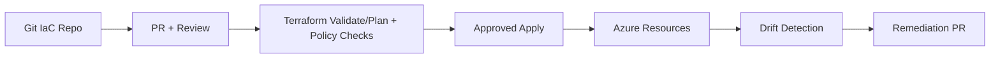

# Terraform for Azure Architect Interviews

## Overview
This page provides enterprise Terraform architecture guidance for Azure platforms, including module strategy, state security, policy controls, delivery pipelines, and operational governance.

## Why this topic matters
Terraform is central for repeatable cloud delivery and compliance at scale. Senior interviews assess whether you can design safe IaC operating models, not just write resources.

## Core concepts
- Terraform state and backend strategy
- Module boundaries and reuse
- Environment isolation and promotion
- Policy checks and security gates
- Drift detection and remediation
- Rollback and incident response

## Detailed explanation of each concept
Terraform should be treated like product code with versioning, testing, and release controls. State must be secured and isolated by blast radius. Modules should align to platform domains (network, identity, compute, observability) with stable interfaces.

Enterprise IaC needs policy-as-code gates, drift monitoring, and controlled rollout strategy. Change risk is reduced through staged plans, approvals, and clear rollback patterns.

## Evaluation (How to assess architecture quality)
- Terraform plan/apply failure rate
- Drift frequency and remediation time
- Policy violation rate before deploy
- Environment parity score
- Mean rollback time after failed infra change

## Architecture / flow diagram


**Flow explanation:**  
IaC changes are reviewed, validated, policy-checked, and applied through controlled pipelines. Drift detection feeds back into remediation PRs.

## Real-world example
A fintech platform uses Terraform modules for hub-spoke networking, AKS, Key Vault, and monitoring. State is kept in secured remote backend with locking. PR checks enforce tagging, encryption, and private access policy before apply.

## Best practices
- Keep Terraform in dedicated repo/folder ownership model
- Enforce remote locked backend and encrypted state
- Version modules and providers explicitly
- Use policy checks in CI before apply
- Separate state by environment and risk domain
- Schedule drift scans and governed remediation

## Common mistakes / misconceptions
- Manual portal edits outside IaC
- One giant root module for everything
- Shared state for unrelated environments
- No policy guardrails in pipeline
- No rollback strategy for failed apply

## Industry relevance
Terraform is a core expectation for cloud platform and architect roles, especially in enterprises requiring auditable, repeatable infrastructure changes.

## Interview discussion points
- Bicep vs Terraform trade-offs
- State security and locking design
- Module strategy at enterprise scale
- Drift control operating model
- Safe change and rollback patterns

## Links to dependent / related topics
- [Azure Topic Master](./azure_topic_master.md)
- [CI/CD in Azure DevOps](./cicd_azure_devops.md)
- [Security, IAM, Networking](../security/security_iam_networking.md)

## Interview Questions (50)
1. Why Terraform for Azure enterprise platforms?
2. ARM/Bicep vs Terraform: how to choose?
3. How do you design Terraform module boundaries?
4. What should be in root module vs reusable modules?
5. How do you version Terraform modules safely?
6. How do you pin provider versions and why?
7. How do you secure Terraform state?
8. How do you choose remote backend strategy?
9. How do you handle state locking and concurrency?
10. How do you separate state by environment?
11. How do you separate state by blast radius?
12. How do you manage secrets in Terraform workflows?
13. How do you prevent sensitive outputs leakage?
14. How do you implement policy-as-code for Terraform?
15. How do you gate plan/apply with security controls?
16. How do you enforce tagging and naming standards?
17. How do you enforce private networking policies in IaC?
18. How do you design Terraform CI pipeline?
19. How do you design Terraform CD promotion flow?
20. How do you review Terraform changes effectively?
21. How do you estimate change risk from plan output?
22. How do you test Terraform modules before production?
23. How do you run integration tests for IaC?
24. How do you handle breaking module changes?
25. How do you do blue-green style infra changes?
26. How do you rollback failed Terraform deployments?
27. What is drift and why does it matter?
28. How do you detect drift continuously?
29. How do you remediate drift safely?
30. How do you stop manual changes outside IaC?
31. How do you manage multi-subscription deployments?
32. How do you manage multi-region IaC strategy?
33. How do you manage identity and RBAC in Terraform?
34. How do you model Key Vault and secret access in Terraform?
35. How do you provision networking foundations via Terraform?
36. How do you provision AKS securely via Terraform?
37. How do you integrate Terraform with Azure DevOps?
38. How do you design approvals for prod apply?
39. How do you audit Terraform changes for compliance?
40. How do you map Terraform ownership across teams?
41. How do you optimize Terraform execution time at scale?
42. How do you handle Terraform state migration?
43. How do you design ephemeral environments with Terraform?
44. How do you handle cost controls in Terraform workflows?
45. What anti-patterns are common in Terraform programs?
46. How do you build first-90-day Terraform governance roadmap?
47. How do you present Terraform ROI to leadership?
48. How do you decide Terraform Cloud vs self-managed backend?
49. How do you align Terraform with Zero Trust architecture?
50. How do you conclude Terraform interview answers strongly?

## Answers for important questions (Summary + Crisp + Deep)

### Q1. Why Terraform for Azure enterprise platforms?
**Question summary:** Tests strategic IaC reasoning and governance maturity.
**Crisp answer (7-8 lines):** Terraform provides repeatable, declarative infrastructure provisioning. It improves consistency across environments. It supports modular reuse and policy enforcement. It enables auditability through Git history and plan outputs. It reduces manual drift and configuration errors. It integrates with CI/CD and approval workflows. It is strong for enterprise-scale change governance.
**Deep explanation (~40 lines):** Terraform turns infrastructure into controlled software lifecycle. Enterprises benefit from deterministic provisioning, peer review, and traceability. It also enables environment parity and faster recovery from misconfiguration. Combined with policy checks and secure state management, Terraform becomes foundational for cloud platform governance.
**Answer summary:** Terraform enables repeatable, auditable, governed Azure platform delivery.
**Simple diagram:**  
```text
IaC code -> plan/review -> apply -> consistent infrastructure
```
**Trusted reference links:**  
- https://developer.hashicorp.com/terraform/docs

### Q2. ARM/Bicep vs Terraform: how to choose?
**Question summary:** Tool-selection trade-off.
**Crisp answer (7-8 lines):** Choose Bicep/ARM for Azure-native depth and alignment. Choose Terraform for multi-cloud or unified IaC standardization. Evaluate team skills and existing ecosystem. Consider policy tooling and module maturity. Keep one primary standard per domain. Avoid dual-tool sprawl without clear boundary. Decide by strategy, not preference.
**Deep explanation (~40 lines):** Tool choice should minimize operating complexity and maximize governance consistency. Bicep is excellent Azure-native DSL; Terraform excels in cross-cloud standardization and ecosystem breadth.
**Answer summary:** Choose based on cloud strategy, governance model, and team capability.
**Simple diagram:**  
```text
Azure-first -> Bicep
Multi-cloud standard -> Terraform
```
**Trusted reference links:**  
- https://learn.microsoft.com/en-us/azure/azure-resource-manager/bicep/overview

### Q3. How do you design Terraform module boundaries?
**Question summary:** Architecture modularity and reuse.
**Crisp answer (7-8 lines):** Define modules by stable platform domains. Keep interfaces minimal and explicit. Avoid exposing internal implementation details. Separate network, identity, compute, and observability modules. Keep module responsibilities single-purpose. Version modules independently. Document inputs/outputs clearly.
**Deep explanation (~40 lines):** Good boundaries reduce coupling and make upgrades safer. Overly broad modules become hard to test and evolve.
**Answer summary:** Design small domain-focused modules with stable contracts.
**Simple diagram:**  
```text
Root stack -> network | identity | compute modules
```
**Trusted reference links:**  
- https://developer.hashicorp.com/terraform/language/modules

### Q4. What should be in root module vs reusable modules?
**Question summary:** Composition strategy.
**Crisp answer (7-8 lines):** Root module should orchestrate environment composition only. Reusable modules should hold implementation logic. Keep root with environment-specific wiring and variables. Avoid business logic in root files. Keep reusable modules generic and parameterized. Limit cross-module coupling. Use clear outputs for composition.
**Deep explanation (~40 lines):** Root modules are assembly layers; reusable modules are building blocks. This separation improves testability and portability.
**Answer summary:** Root composes; reusable modules implement.
**Simple diagram:**  
```text
Root: compose modules
Module: implement resources
```
**Trusted reference links:**  
- https://developer.hashicorp.com/terraform/language

### Q5. How do you version Terraform modules safely?
**Question summary:** Change governance.
**Crisp answer (7-8 lines):** Use semantic versioning for modules. Publish changelogs with breaking changes flagged. Pin module versions in root stacks. Test upgrades in lower environments first. Use staged promotion across environments. Keep rollback path to prior version. Track adoption status by environment.
**Deep explanation (~40 lines):** Module version control reduces accidental breakage and supports controlled modernization.
**Answer summary:** Use semver, pinned versions, staged upgrades, and rollback-ready practices.
**Simple diagram:**  
```text
Module v1 -> v2 test -> staged rollout -> promote
```
**Trusted reference links:**  
- https://developer.hashicorp.com/terraform/language/modules/sources

### Q6. How do you pin provider versions and why?
**Question summary:** Reproducibility and stability.
**Crisp answer (7-8 lines):** Pin provider versions to avoid unexpected behavior changes. Lock dependency graph for deterministic plans. Upgrade providers intentionally through test pipeline. Document provider upgrade impact. Keep version constraints explicit in code. Avoid floating latest in production stacks. Track provider deprecations proactively.
**Deep explanation (~40 lines):** Unpinned providers cause hidden drift and sudden failures. Controlled upgrades improve reliability.
**Answer summary:** Pin providers for deterministic behavior and controlled upgrades.
**Simple diagram:**  
```text
Pinned provider -> predictable plan/apply
```
**Trusted reference links:**  
- https://developer.hashicorp.com/terraform/language/providers/requirements

### Q7. How do you secure Terraform state?
**Question summary:** Critical security and governance.
**Crisp answer (7-8 lines):** Use encrypted remote backend with strict IAM controls. Enable locking to prevent concurrent corruption. Separate state by environment/risk domain. Restrict read access due to sensitive metadata. Enable backend logging and auditing. Use backup/versioning for recovery. Avoid local state in shared workflows.
**Deep explanation (~40 lines):** State can contain sensitive references and is operationally critical. Security and resilience of state backend are non-negotiable.
**Answer summary:** Protect state with encryption, locking, access controls, and backups.
**Simple diagram:**  
```text
Terraform -> secure remote state backend (locked/encrypted)
```
**Trusted reference links:**  
- https://developer.hashicorp.com/terraform/language/state

### Q8. How do you choose remote backend strategy?
**Question summary:** Backend architecture decision.
**Crisp answer (7-8 lines):** Choose backend by security, locking, auditability, and ops simplicity. Ensure encryption and RBAC integration. Support team concurrency safely. Prefer managed backend where governance needs are strong. Plan backup and disaster recovery for state. Validate latency and reliability for pipeline usage. Keep backend standardized across teams.
**Deep explanation (~40 lines):** Backend choice shapes operational risk and team velocity. Standardization improves supportability.
**Answer summary:** Select backend for secure locking, auditability, and operational reliability.
**Simple diagram:**  
```text
Team IaC workflows -> managed secure backend
```
**Trusted reference links:**  
- https://developer.hashicorp.com/terraform/language/settings/backends

### Q9. How do you handle state locking and concurrency?
**Question summary:** Collaboration safety.
**Crisp answer (7-8 lines):** Use backend locking features by default. Restrict direct manual apply outside pipeline. Keep pipeline serial execution per state scope. Use smaller state scopes to reduce contention. Avoid force-unlock unless investigation completed. Monitor lock contention trends. Define team runbook for stuck locks.
**Deep explanation (~40 lines):** Lock discipline prevents race conditions and state corruption.
**Answer summary:** Enforce locking and scoped state design to avoid concurrent apply conflicts.
**Simple diagram:**  
```text
State lock -> single writer -> consistent state
```
**Trusted reference links:**  
- https://developer.hashicorp.com/terraform/language/state/locking

### Q10. How do you separate state by environment?
**Question summary:** Blast-radius control.
**Crisp answer (7-8 lines):** Keep dedicated state per environment (dev/test/prod). Use isolated backend paths or workspaces carefully. Prevent accidental cross-env apply. Use separate identities and approvals for prod. Keep variable files environment-specific and reviewed. Tag state ownership clearly. Audit environment boundaries regularly.
**Deep explanation (~40 lines):** State separation reduces accidental impact and supports independent lifecycles.
**Answer summary:** Isolate environment state and permissions to protect production boundaries.
**Simple diagram:**  
```text
dev.tfstate | test.tfstate | prod.tfstate
```
**Trusted reference links:**  
- https://developer.hashicorp.com/terraform/cli/workspaces

### Q11. How do you separate state by blast radius?
**Question summary:** Failure containment design.
**Crisp answer (7-8 lines):** Split state by domain and change cadence. Keep core networking separate from app workloads. Isolate high-risk resources in dedicated state. Reduce dependency fan-out across state files. Use data sources/interfaces across boundaries carefully. Document ownership per state domain. Align state scopes to incident containment goals.
**Deep explanation (~40 lines):** Smaller blast-radius state scopes improve rollback and reduce impact of mistakes.
**Answer summary:** Partition state by risk and ownership to contain change failures.
**Simple diagram:**  
```text
network state | platform state | app state
```
**Trusted reference links:**  
- https://developer.hashicorp.com/terraform/language/state

### Q12. How do you manage secrets in Terraform workflows?
**Question summary:** Secret handling in IaC lifecycle.
**Crisp answer (7-8 lines):** Avoid storing raw secrets in code and variables. Use secret managers and reference patterns. Mark sensitive variables/outputs appropriately. Restrict pipeline secret exposure scopes. Rotate secrets outside Terraform where possible. Redact secrets from logs. Audit secret usage and access paths.
**Deep explanation (~40 lines):** Terraform is not a secret vault. Secret hygiene requires external lifecycle controls.
**Answer summary:** Reference secrets securely; don’t embed them in Terraform artifacts.
**Simple diagram:**  
```text
Terraform -> secret reference -> secret manager
```
**Trusted reference links:**  
- https://developer.hashicorp.com/terraform/language/manage-sensitive-data

### Q13. How do you prevent sensitive outputs leakage?
**Question summary:** Output governance.
**Crisp answer (7-8 lines):** Mark outputs as sensitive. Minimize outputs to only required values. Avoid printing secrets in pipeline logs. Restrict output retrieval access in backend. Use secure channels for operational handoff. Review output definitions in code reviews. Remove obsolete sensitive outputs promptly.
**Deep explanation (~40 lines):** Output leaks often happen through convenience fields left in code.
**Answer summary:** Use sensitive outputs sparingly and protect their exposure paths strictly.
**Simple diagram:**  
```text
Sensitive output -> masked/log-suppressed handling
```
**Trusted reference links:**  
- https://developer.hashicorp.com/terraform/language/values/outputs

### Q14. How do you implement policy-as-code for Terraform?
**Question summary:** Governance automation.
**Crisp answer (7-8 lines):** Run policy checks on plans before apply. Enforce encryption, tagging, private access, and naming rules. Block non-compliant changes automatically. Keep policy rules versioned and reviewed. Support controlled exceptions with expiry. Report policy trends to governance boards. Continuously refine policy coverage.
**Deep explanation (~40 lines):** Policy-as-code scales governance and prevents manual review bottlenecks.
**Answer summary:** Enforce infrastructure standards automatically through plan-time policy gates.
**Simple diagram:**  
```text
terraform plan -> policy engine -> pass/fail
```
**Trusted reference links:**  
- https://learn.microsoft.com/en-us/azure/governance/policy/overview

### Q15. How do you gate plan/apply with security controls?
**Question summary:** Secure release process.
**Crisp answer (7-8 lines):** Separate plan and apply stages. Require approvals for privileged environments. Run security and policy scans before apply. Restrict apply permissions to controlled pipeline identities. Log all plan/apply operations. Auto-block critical findings. Keep emergency break-glass governed and audited.
**Deep explanation (~40 lines):** Controlled gating prevents high-impact infrastructure mistakes and policy violations.
**Answer summary:** Use staged plan/apply with approvals and security-policy enforcement.
**Simple diagram:**  
```text
Plan -> security gates -> approval -> apply
```
**Trusted reference links:**  
- https://learn.microsoft.com/en-us/azure/devops/pipelines/security/overview

### Q16. How do you enforce tagging and naming standards?
**Question summary:** Operational governance hygiene.
**Crisp answer (7-8 lines):** Build standards into modules and policy checks. Validate required tags in CI. Enforce naming conventions through variables and regex checks. Deny non-compliant resources via policy. Track compliance dashboards by subscription/team. Remediate missing tags with automation where possible. Keep standards documented and versioned.
**Deep explanation (~40 lines):** Tagging/naming consistency is essential for cost, operations, and security governance.
**Answer summary:** Automate and enforce tagging/naming in code and policy layers.
**Simple diagram:**  
```text
IaC standards + policy checks -> compliant resource metadata
```
**Trusted reference links:**  
- https://learn.microsoft.com/en-us/azure/azure-resource-manager/management/tag-resources

### Q17. How do you enforce private networking policies in IaC?
**Question summary:** Secure network-by-default.
**Crisp answer (7-8 lines):** Encode private endpoint and public-access-deny defaults in modules. Require explicit exception flags with approvals. Validate NSG/UDR controls in policy checks. Use private DNS module dependencies consistently. Block internet-exposed sensitive resources in CI policy. Audit exceptions and expiry. Test connectivity and failover paths.
**Deep explanation (~40 lines):** Private-first defaults prevent accidental public exposure and enforce consistent security posture.
**Answer summary:** Bake private-by-default rules into modules and policy gates.
**Simple diagram:**  
```text
Module defaults -> private networking enforced
```
**Trusted reference links:**  
- https://learn.microsoft.com/en-us/azure/private-link/private-endpoint-overview

### Q18. How do you design Terraform CI pipeline?
**Question summary:** Build and validation flow.
**Crisp answer (7-8 lines):** Run fmt/validate/static checks first. Initialize backend and providers deterministically. Generate plan artifact for review. Execute policy/security scans on plan. Publish plan and compliance reports. Fail on critical violations. Keep pipeline logs traceable and auditable.
**Deep explanation (~40 lines):** CI should provide fast, trustworthy feedback before any infrastructure mutation.
**Answer summary:** CI validates syntax, plan impact, and compliance before deployment stages.
**Simple diagram:**  
```text
fmt/validate -> plan -> policy scan -> artifact publish
```
**Trusted reference links:**  
- https://developer.hashicorp.com/terraform/cli/commands/plan

### Q19. How do you design Terraform CD promotion flow?
**Question summary:** Safe apply orchestration.
**Crisp answer (7-8 lines):** Promote changes dev -> test -> prod with explicit approvals. Reuse same plan intent where possible. Re-run policy checks per environment context. Apply with restricted identities and audit logs. Validate post-apply health checks. Auto-stop promotion on failures. Maintain rollback runbook.
**Deep explanation (~40 lines):** CD flow should balance speed and risk by staged confidence building.
**Answer summary:** Use staged, approved, validated apply progression across environments.
**Simple diagram:**  
```text
Dev apply -> Test apply -> Prod approved apply
```
**Trusted reference links:**  
- https://learn.microsoft.com/en-us/azure/architecture/framework/devops/ci-cd

### Q20. How do you review Terraform changes effectively?
**Question summary:** PR and plan review discipline.
**Crisp answer (7-8 lines):** Review both code diff and plan output. Check blast radius and dependency impact. Validate policy and security implications explicitly. Ensure tags/naming/ownership are correct. Confirm module and provider versions are pinned. Ask for rollback plan on high-impact changes. Require domain-owner approval where needed.
**Deep explanation (~40 lines):** Effective review focuses on behavior change, not only syntax.
**Answer summary:** Review Terraform by expected infra impact, governance compliance, and rollback readiness.
**Simple diagram:**  
```text
PR code + plan diff -> impact review -> approval
```
**Trusted reference links:**  
- https://developer.hashicorp.com/terraform/tutorials/automation/automate-terraform

### Q21. How do you estimate change risk from plan output?
**Question summary:** Risk scoring from IaC diff.
**Crisp answer (7-8 lines):** Classify actions: create/update/destroy. Weight destructive changes highest risk. Identify critical service and network/identity changes. Count dependency fan-out and downtime potential. Require extra approvals for high-risk plans. Stage rollout where possible. Document risk score in change record.
**Deep explanation (~40 lines):** Plan-based risk scoring improves governance consistency and reduces surprise outages.
**Answer summary:** Use structured risk scoring on plan actions before apply.
**Simple diagram:**  
```text
Plan actions -> risk score -> control level
```
**Trusted reference links:**  
- https://developer.hashicorp.com/terraform/cli/commands/show

### Q22. How do you test Terraform modules before production?
**Question summary:** Module quality assurance.
**Crisp answer (7-8 lines):** Run static checks and validate syntax. Execute module in isolated test environment. Assert key outputs and resource properties. Test policy compliance and expected failures. Include destroy and re-apply scenarios. Verify upgrade compatibility from previous versions. Automate tests in CI pipeline.
**Deep explanation (~40 lines):** Module tests reduce production surprises and increase reuse confidence.
**Answer summary:** Use automated functional and compliance tests in isolated environments before prod use.
**Simple diagram:**  
```text
Module test env -> apply/assert/destroy cycles
```
**Trusted reference links:**  
- https://developer.hashicorp.com/terraform/language/modules/develop

### Q23. How do you run integration tests for IaC?
**Question summary:** End-to-end environment validation.
**Crisp answer (7-8 lines):** Provision ephemeral integration stack from code. Run connectivity and policy assertions across resources. Validate identity, network, and monitoring integration. Execute negative tests for blocked scenarios. Capture test artifacts for audit. Destroy ephemeral resources after tests. Track integration test reliability.
**Deep explanation (~40 lines):** Integration testing validates cross-resource behavior that unit checks cannot catch.
**Answer summary:** Use ephemeral full-stack tests to verify real infrastructure behavior.
**Simple diagram:**  
```text
Ephemeral stack -> integration checks -> teardown
```
**Trusted reference links:**  
- https://learn.microsoft.com/en-us/azure/architecture/framework/operational-excellence/

### Q24. How do you handle breaking module changes?
**Question summary:** Module lifecycle governance.
**Crisp answer (7-8 lines):** Mark breaking changes with major version bump. Provide migration guide and examples. Test migration path in non-prod first. Support temporary compatibility flags when feasible. Communicate deprecation timelines early. Track consuming stacks and upgrade progress. Remove legacy paths after migration completion.
**Deep explanation (~40 lines):** Breaking changes need planned consumer migration to avoid broad outages.
**Answer summary:** Use major versioning and explicit migration playbooks for breaking module evolution.
**Simple diagram:**  
```text
v1 -> migration guide -> v2 adoption
```
**Trusted reference links:**  
- https://semver.org/

### Q25. How do you do blue-green style infra changes?
**Question summary:** Safer infra mutation pattern.
**Crisp answer (7-8 lines):** Provision parallel target infrastructure. Validate health and policy compliance. Shift traffic/dependency gradually or by cutover switch. Keep previous environment intact for rollback. Monitor post-cutover stability. Decommission old stack only after confidence window. Use this for high-risk infra transformations.
**Deep explanation (~40 lines):** Blue-green infra reduces downtime risk but requires temporary extra capacity.
**Answer summary:** Use parallel environment cutover for high-risk infra changes with quick rollback option.
**Simple diagram:**  
```text
Blue env + Green env -> switch -> monitor -> retire old
```
**Trusted reference links:**  
- https://learn.microsoft.com/en-us/azure/architecture/framework/devops/ci-cd

### Q26. How do you rollback failed Terraform deployments?
**Question summary:** Recovery strategy.
**Crisp answer (7-8 lines):** Stop further applies immediately. Restore known-good code version. Re-plan to assess rollback impact. Apply rollback in controlled stage. Validate service health and policy posture post-rollback. Preserve incident evidence and timeline. Update runbook with lessons learned.
**Deep explanation (~40 lines):** Fast rollback requires version discipline and pre-defined recovery playbooks.
**Answer summary:** Rollback by reverting IaC version with controlled apply and validation.
**Simple diagram:**  
```text
Failure -> revert code -> rollback apply -> verify
```
**Trusted reference links:**  
- https://learn.microsoft.com/en-us/azure/well-architected/reliability/testing

### Q27. What is drift and why does it matter?
**Question summary:** IaC consistency concept.
**Crisp answer (7-8 lines):** Drift is divergence between declared IaC and actual environment state. It breaks predictability and governance assumptions. It can hide security gaps or misconfigurations. It increases incident risk and troubleshooting effort. It undermines audit confidence. Detecting and correcting drift is core IaC operations. Preventing manual changes reduces drift.
**Deep explanation (~40 lines):** Drift erodes reliability and compliance over time if unmanaged.
**Answer summary:** Drift matters because it breaks the contract between code and infrastructure reality.
**Simple diagram:**  
```text
Desired state != actual state -> drift risk
```
**Trusted reference links:**  
- https://developer.hashicorp.com/terraform/tutorials/state/resource-drift

### Q28. How do you detect drift continuously?
**Question summary:** Operational detection model.
**Crisp answer (7-8 lines):** Run scheduled plan checks against production states. Compare plan output for unexpected deltas. Alert on critical resource drift quickly. Tag drift by owner/domain. Correlate with recent manual activity. Track drift trend and remediation time. Include drift score in governance reviews.
**Deep explanation (~40 lines):** Continuous drift detection turns IaC from static process into active operational control.
**Answer summary:** Use scheduled plan-based drift scans with alerting and ownership routing.
**Simple diagram:**  
```text
Scheduled plan -> drift diff -> alert/remediate
```
**Trusted reference links:**  
- https://developer.hashicorp.com/terraform/cli/commands/plan

### Q29. How do you remediate drift safely?
**Question summary:** Controlled correction flow.
**Crisp answer (7-8 lines):** Analyze drift cause before forcing apply. Decide whether to codify current state or revert to desired state. Use PR workflow for remediation changes. Run policy and impact checks before apply. Remediate in lower environments first for risky changes. Verify post-remediation parity. Document root cause and prevention.
**Deep explanation (~40 lines):** Not all drift should be blindly overwritten; some reflects intentional emergency changes needing codification.
**Answer summary:** Remediate drift through governed PR-based decisions, not blind overwrite.
**Simple diagram:**  
```text
Drift found -> classify -> codify or revert -> apply
```
**Trusted reference links:**  
- https://learn.microsoft.com/en-us/azure/architecture/framework/operational-excellence/

### Q30. How do you stop manual changes outside IaC?
**Question summary:** Governance enforcement.
**Crisp answer (7-8 lines):** Limit direct portal permissions for production resources. Enforce change policy through pipelines and approvals. Use policy controls to deny unauthorized patterns. Monitor activity logs for out-of-band changes. Escalate and remediate violations quickly. Educate teams on IaC process benefits. Keep break-glass process tightly controlled.
**Deep explanation (~40 lines):** Manual changes are common drift source; governance and education both are required.
**Answer summary:** Reduce manual drift via access restrictions, policy enforcement, and monitored change discipline.
**Simple diagram:**  
```text
Pipeline-only change path + restricted direct access
```
**Trusted reference links:**  
- https://learn.microsoft.com/en-us/azure/azure-resource-manager/management/activity-log

### Q31. How do you manage multi-subscription deployments?
**Question summary:** Enterprise scope orchestration.
**Crisp answer (7-8 lines):** Organize deployments by management group and subscription strategy. Use provider aliases and scoped identities per subscription. Keep state partitioned by subscription domain. Reuse modules with environment/subscription-specific variables. Enforce policy baseline consistently across subscriptions. Track deployment status centrally. Avoid cross-subscription coupling where unnecessary.
**Deep explanation (~40 lines):** Multi-subscription orchestration needs explicit identity, state, and policy boundaries.
**Answer summary:** Use scoped identities, aliased providers, and partitioned state for multi-subscription delivery.
**Simple diagram:**  
```text
Mgmt group -> subscription A/B -> scoped Terraform apply
```
**Trusted reference links:**  
- https://learn.microsoft.com/en-us/azure/cloud-adoption-framework/

### Q32. How do you manage multi-region IaC strategy?
**Question summary:** Regional consistency and resiliency.
**Crisp answer (7-8 lines):** Parameterize region-specific settings cleanly. Keep shared baseline modules with region overlays. Enforce policy and naming parity across regions. Validate failover dependencies in IaC outputs. Use staged rollout per region. Track drift and version skew across regions. Test regional recovery regularly.
**Deep explanation (~40 lines):** Multi-region IaC should balance consistency with region-specific constraints.
**Answer summary:** Use shared modules + region overlays with parity checks and staged promotion.
**Simple diagram:**  
```text
Global module baseline + Region A/B overlays
```
**Trusted reference links:**  
- https://learn.microsoft.com/en-us/azure/architecture/guide/design-principles/design-for-resiliency

### Q33. How do you manage identity and RBAC in Terraform?
**Question summary:** Access governance automation.
**Crisp answer (7-8 lines):** Model roles and assignments as code. Use group-based assignments where possible. Scope roles minimally by resource boundary. Separate platform/admin roles from app roles. Track role changes in PR history. Enforce approval for privileged role changes. Review RBAC drift regularly.
**Deep explanation (~40 lines):** IaC-managed RBAC improves auditability and reduces ad hoc privilege creep.
**Answer summary:** Manage RBAC as code with least-privilege scopes and governed approvals.
**Simple diagram:**  
```text
RBAC code -> reviewed apply -> audited access changes
```
**Trusted reference links:**  
- https://learn.microsoft.com/en-us/azure/role-based-access-control/overview

### Q34. How do you model Key Vault and secret access in Terraform?
**Question summary:** Secret governance in IaC.
**Crisp answer (7-8 lines):** Provision vault and access policies/RBAC declaratively. Keep secret values outside Terraform where possible. Assign workload identities with scoped secret permissions. Enforce network restrictions for vault access. Tag and monitor vault usage. Rotate access policies through PR reviews. Validate least privilege continuously.
**Deep explanation (~40 lines):** Terraform should define secret governance structure, not expose secret content broadly.
**Answer summary:** Use Terraform to codify secure vault boundaries and identity-based access controls.
**Simple diagram:**  
```text
Terraform -> Key Vault + identity permissions
```
**Trusted reference links:**  
- https://learn.microsoft.com/en-us/azure/key-vault/general/overview

### Q35. How do you provision networking foundations via Terraform?
**Question summary:** Network baseline automation.
**Crisp answer (7-8 lines):** Build reusable modules for VNet, subnets, NSGs, UDRs, and peering. Encode private endpoint and DNS patterns. Keep address plans parameterized and validated. Separate hub and spoke provisioning concerns. Include diagnostics/flow logs by default. Enforce policy checks for public exposure. Test connectivity post-apply.
**Deep explanation (~40 lines):** Networking IaC should create secure, repeatable foundational topologies with clear ownership.
**Answer summary:** Use modular validated Terraform networking stacks with secure defaults.
**Simple diagram:**  
```text
network module -> hub/spoke resources -> policy-checked apply
```
**Trusted reference links:**  
- https://learn.microsoft.com/en-us/azure/virtual-network/quick-create-terraform

### Q36. How do you provision AKS securely via Terraform?
**Question summary:** Kubernetes platform baseline.
**Crisp answer (7-8 lines):** Use private cluster and workload identity defaults. Separate system/user node pools. Enable monitoring and policy controls. Integrate Key Vault and network restrictions. Configure autoscaling and PDBs thoughtfully. Restrict RBAC and admin access paths. Validate security baseline in CI checks.
**Deep explanation (~40 lines):** AKS IaC should encode secure-by-default platform posture and operational controls.
**Answer summary:** Provision AKS with private, identity-first, monitored, policy-governed Terraform modules.
**Simple diagram:**  
```text
Terraform -> secure AKS baseline -> workloads
```
**Trusted reference links:**  
- https://learn.microsoft.com/en-us/azure/aks/learn/quick-kubernetes-deploy-terraform

### Q37. How do you integrate Terraform with Azure DevOps?
**Question summary:** Pipeline integration design.
**Crisp answer (7-8 lines):** Run validate/plan in PR pipelines. Publish plan artifact for approval. Execute apply in protected stage with scoped identity. Store state backend credentials securely. Add policy/security gates before apply. Tag build and deployment metadata for audit. Keep rollback workflow documented.
**Deep explanation (~40 lines):** CI/CD integration enforces governance and reduces manual apply risk.
**Answer summary:** Integrate Terraform into DevOps pipelines with gated plan/apply and secure identities.
**Simple diagram:**  
```text
PR -> plan -> approval -> apply stage
```
**Trusted reference links:**  
- https://learn.microsoft.com/en-us/azure/devops/pipelines/

### Q38. How do you design approvals for prod apply?
**Question summary:** Change governance controls.
**Crisp answer (7-8 lines):** Require role-based approvers for production stages. Include security/compliance review for high-risk plans. Use objective risk labels from plan diffs. Keep approval evidence in pipeline records. Enforce separation of duties where required. Time-limit approvals to avoid stale applies. Escalate urgent exceptions with governance process.
**Deep explanation (~40 lines):** Approval design should be risk-proportionate and auditable, not pure bureaucracy.
**Answer summary:** Implement risk-based, role-controlled, auditable prod apply approvals.
**Simple diagram:**  
```text
Risk-tagged plan -> approver gate -> prod apply
```
**Trusted reference links:**  
- https://learn.microsoft.com/en-us/azure/architecture/framework/security/governance

### Q39. How do you audit Terraform changes for compliance?
**Question summary:** Evidence and traceability.
**Crisp answer (7-8 lines):** Keep PR history, plan artifacts, apply logs, and policy reports. Tag all releases with change IDs. Store audit artifacts centrally with retention policy. Correlate changes to incidents and outcomes. Run periodic compliance checks against policy baseline. Track exceptions with expiry and approval. Report compliance trends.
**Deep explanation (~40 lines):** Compliance requires evidence chain from intent to applied infrastructure.
**Answer summary:** Maintain end-to-end change evidence across PR, plan, apply, and policy results.
**Simple diagram:**  
```text
PR + plan + apply + policy logs -> compliance evidence store
```
**Trusted reference links:**  
- https://learn.microsoft.com/en-us/azure/governance/policy/overview

### Q40. How do you map Terraform ownership across teams?
**Question summary:** Operating model clarity.
**Crisp answer (7-8 lines):** Define platform-owned and app-owned module boundaries. Assign clear owners per state domain. Use CODEOWNERS for review enforcement. Separate on-call responsibility for infra incidents. Keep shared module governance board for standards. Track ownership metadata in repos and tags. Review boundaries quarterly.
**Deep explanation (~40 lines):** Ownership clarity reduces response delays and conflicting changes.
**Answer summary:** Use explicit domain ownership for modules, state, reviews, and incident response.
**Simple diagram:**  
```text
Platform team modules | App team modules | shared governance
```
**Trusted reference links:**  
- https://learn.microsoft.com/en-us/azure/architecture/framework/

### Q41. How do you optimize Terraform execution time at scale?
**Question summary:** Pipeline efficiency.
**Crisp answer (7-8 lines):** Reduce state scope size for faster plans. Cache providers/plugins in pipeline. Run independent domains in parallel safely. Avoid unnecessary refresh where policy permits. Tune module dependencies to reduce serialization. Use targeted plans cautiously for diagnostics only. Measure pipeline bottlenecks and improve iteratively.
**Deep explanation (~40 lines):** Faster pipelines improve delivery velocity while preserving governance rigor.
**Answer summary:** Optimize by state partitioning, caching, parallelism, and dependency cleanup.
**Simple diagram:**  
```text
Smaller states + cached providers + parallel domains -> faster pipeline
```
**Trusted reference links:**  
- https://developer.hashicorp.com/terraform/cli

### Q42. How do you handle Terraform state migration?
**Question summary:** State lifecycle and safety.
**Crisp answer (7-8 lines):** Plan migration with backup and rollback path first. Freeze concurrent applies during migration. Use supported state mv/import commands carefully. Validate post-migration plan is clean. Re-enable pipeline applies after verification. Document migration steps and outcomes. Test migration in non-prod first.
**Deep explanation (~40 lines):** State migration is high risk and must be tightly controlled.
**Answer summary:** Perform state migration with backups, freeze windows, validation, and staged testing.
**Simple diagram:**  
```text
Backup state -> migrate -> validate -> resume applies
```
**Trusted reference links:**  
- https://developer.hashicorp.com/terraform/cli/commands/state

### Q43. How do you design ephemeral environments with Terraform?
**Question summary:** Temporary env strategy.
**Crisp answer (7-8 lines):** Use parameterized environment identifiers and isolated state. Automate create/destroy lifecycle in pipeline. Apply strict quota and TTL controls. Mask production-like sensitive data in ephemeral setups. Keep cost guardrails and cleanup jobs. Reuse baseline modules for parity. Track environment lifecycle events.
**Deep explanation (~40 lines):** Ephemeral environments improve testing speed but need strict lifecycle control to avoid cost/security waste.
**Answer summary:** Build short-lived isolated Terraform environments with automated cleanup and governance.
**Simple diagram:**  
```text
PR trigger -> ephemeral env create -> test -> auto destroy
```
**Trusted reference links:**  
- https://learn.microsoft.com/en-us/azure/architecture/framework/devops/shift-left

### Q44. How do you handle cost controls in Terraform workflows?
**Question summary:** FinOps in IaC.
**Crisp answer (7-8 lines):** Enforce mandatory cost tags in modules/policy. Use budget alerts and quota checks by environment. Block oversized SKUs through policy where needed. Run cost estimate checks pre-apply for major changes. Track spend deltas per release. Prioritize optimization backlog from telemetry. Review cost trends in governance cadence.
**Deep explanation (~40 lines):** Cost-aware IaC prevents accidental overspend during rapid platform evolution.
**Answer summary:** Encode cost controls in tags, policies, limits, and pre-apply checks.
**Simple diagram:**  
```text
Plan -> cost/policy checks -> approve or reject
```
**Trusted reference links:**  
- https://learn.microsoft.com/en-us/azure/cost-management-billing/

### Q45. What anti-patterns are common in Terraform programs?
**Question summary:** Failure patterns.
**Crisp answer (7-8 lines):** Monolithic state for entire platform. Unpinned providers/modules. Manual hotfixes outside IaC. No policy/security gates in pipeline. Secrets in code or outputs. No drift detection process. No rollback runbooks.
**Deep explanation (~40 lines):** Anti-patterns typically appear when adoption scales faster than governance.
**Answer summary:** Avoid monolithic, unversioned, ungoverned Terraform practices.
**Simple diagram:**  
```text
Weak IaC governance -> drift + incidents + slow recovery
```
**Trusted reference links:**  
- https://learn.microsoft.com/en-us/azure/architecture/framework/operational-excellence/

### Q46. How do you build first-90-day Terraform governance roadmap?
**Question summary:** Practical implementation planning.
**Crisp answer (7-8 lines):** First month: baseline inventory, state strategy, risk assessment. Second month: module standards, policy gates, CI pipeline rollout. Third month: drift monitoring, rollback drills, ownership model hardening. Define KPIs and owners for each phase. Publish standards and onboarding playbook. Review outcomes and adjust roadmap.
**Deep explanation (~40 lines):** Roadmap should combine technical controls and operating model maturity.
**Answer summary:** Use phased governance rollout with measurable controls and ownership.
**Simple diagram:**  
```text
Assess -> standardize -> operationalize
```
**Trusted reference links:**  
- https://learn.microsoft.com/en-us/azure/cloud-adoption-framework/

### Q47. How do you present Terraform ROI to leadership?
**Question summary:** Business outcome communication.
**Crisp answer (7-8 lines):** Show reduced deployment errors and faster recovery times. Quantify environment provisioning speed gains. Highlight compliance evidence and audit simplification. Show lower drift and incident frequency. Link outcomes to delivery predictability and risk reduction. Present cost of manual ops avoided. Recommend phased investment milestones.
**Deep explanation (~40 lines):** ROI should connect operational metrics to business confidence and speed.
**Answer summary:** Present Terraform as risk-reduction and delivery-efficiency investment with measurable outcomes.
**Simple diagram:**  
```text
Terraform adoption -> fewer incidents + faster delivery + better compliance
```
**Trusted reference links:**  
- https://learn.microsoft.com/en-us/azure/well-architected/framework

### Q48. How do you decide Terraform Cloud vs self-managed backend?
**Question summary:** Platform tooling choice.
**Crisp answer (7-8 lines):** Compare governance, security, and ops overhead needs. Managed offerings reduce operational burden. Self-managed gives more customization and control. Evaluate compliance and connectivity constraints. Assess cost, team capability, and integration needs. Pilot high-risk assumptions. Choose based on total lifecycle fit.
**Deep explanation (~40 lines):** Tooling choice should align with operating model maturity and regulatory posture.
**Answer summary:** Select backend model by governance fit, operational capacity, and compliance needs.
**Simple diagram:**  
```text
Requirements -> managed vs self-hosted decision
```
**Trusted reference links:**  
- https://developer.hashicorp.com/terraform/cloud-docs

### Q49. How do you align Terraform with Zero Trust architecture?
**Question summary:** Security model alignment.
**Crisp answer (7-8 lines):** Encode least-privilege access in modules and RBAC. Enforce private networking defaults. Require identity-based secret access patterns. Apply deny-by-default policy checks. Audit all changes and exceptions. Remove standing privileged pipeline access. Continuously validate security posture through drift and policy scans.
**Deep explanation (~40 lines):** Terraform can operationalize zero-trust controls consistently across environments.
**Answer summary:** Use Terraform to codify and enforce zero-trust infrastructure controls.
**Simple diagram:**  
```text
Zero-trust policies -> IaC modules -> enforced secure baseline
```
**Trusted reference links:**  
- https://learn.microsoft.com/en-us/security/zero-trust/

### Q50. How do you conclude Terraform interview answers strongly?
**Question summary:** Final synthesis technique.
**Crisp answer (7-8 lines):** Reconnect Terraform design to business risk and delivery goals. Summarize state, module, and policy architecture clearly. Highlight safe change and rollback model. Mention drift monitoring and compliance evidence. Explain ownership and operating cadence. State measurable KPIs for success. End with concise confident recommendation.
**Deep explanation (~40 lines):** Strong closure demonstrates governance mindset and production execution readiness.
**Answer summary:** Conclude with controlled change, security, operability, and measurable outcomes.
**Simple diagram:**  
```text
IaC strategy -> safe delivery -> governed operations -> outcomes
```
**Trusted reference links:**  
- https://learn.microsoft.com/en-us/azure/architecture/framework/
