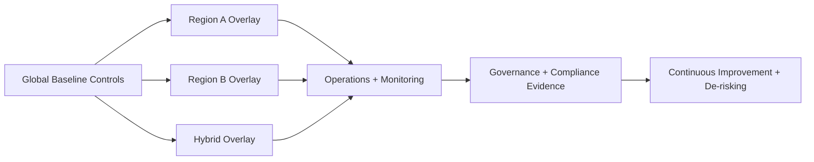

# Advanced Compliance, Multi-Region Enterprise Patterns, and Complex Hybrid Scenarios

## Overview
This page covers architect-level strategy for highly regulated, globally distributed, and hybrid enterprise environments. It focuses on advanced compliance controls, multi-region architecture patterns, and transition-state governance for complex hybrid systems.

## Why this topic matters
Senior architect interviews often differentiate candidates by their ability to design beyond single-region cloud-native scenarios. Enterprises need architects who can balance compliance, resilience, regional constraints, and modernization velocity under operational pressure.

## Core concepts
- Advanced compliance control architecture
- Multi-region baseline and regional overlay patterns
- Data residency and sovereignty-driven architecture
- Complex hybrid transition models
- Cross-region resilience, failover, and governance
- Operational and cost governance in globally distributed systems

## Detailed explanation of each concept
Advanced enterprise architecture requires controls that are both technically effective and evidentially auditable. Compliance constraints should be encoded into policy, identity, network, and data controls with clear ownership. Multi-region design should use a global baseline with controlled regional variation to preserve consistency while meeting local legal and operational requirements.

Hybrid scenarios should be treated as time-bounded transition architectures with explicit target-state convergence plans. Resilience patterns must include region-level failover behavior, cross-region dependency awareness, and tested runbooks. Governance must unify risk, compliance, cost, and delivery metrics to prevent fragmentation across regions and environments.

## Evaluation (How to assess architecture quality)
- Compliance control coverage and evidence completeness
- Regional architecture parity and drift rate
- Cross-region failover success and recovery timing
- Hybrid dependency retirement progress
- Policy exception aging across regions/environments
- Cost variance by region and control model
- Incident rate linked to cross-region/hybrid complexity

## Architecture / flow diagram


**Flow explanation:**  
A global baseline enforces consistency while regional and hybrid overlays address local constraints. Operations and governance provide evidence-driven control and continuous architecture refinement.

## Real-world example
A multinational financial platform runs workloads across multiple regions with strict data residency constraints and temporary hybrid dependencies for legacy core-banking integration. They enforce global identity/security baselines, regional policy overlays, and monthly governance reviews tracking exception aging, failover drill outcomes, and modernization progress. Controlled hybrid retirement roadmap reduces risk over time.

## Best practices
- Encode compliance controls as policy and automation, not manual process only
- Use global baseline plus regional overlay governance model
- Keep hybrid transition explicitly time-bounded with retirement milestones
- Test cross-region failover including identity and data dependencies
- Track exception aging and regional drift as top governance KPIs
- Integrate cost-risk trade-off reviews into global architecture cadence

## Common mistakes / misconceptions
- Treating compliance as documentation instead of control execution
- Assuming region replication equals region readiness
- Allowing hybrid “temporary” patterns to become permanent
- Applying identical controls everywhere without legal-context adaptation
- Ignoring cross-region operational ownership and escalation complexity

## Industry relevance
These topics are critical for architect roles in regulated enterprises, global SaaS platforms, and modernization programs involving legacy/hybrid constraints.

## Interview discussion points
- How to design for compliance evidence, not only compliance intent
- How to manage parity and divergence across regions
- How to modernize hybrid dependencies without service disruption
- How to measure and reduce architecture complexity over time
- How to balance resilience, compliance, and cost in global architecture

## Links to dependent / related topics
- [Cloud Architecture Overview](./README.md)
- [Governance Hierarchy](../azure/governance_hierarchy.md)
- [Enterprise Azure Foundation](./enterprise_azure_foundation_landing_zone.md)
- [Migration Strategies](../migration-architecture/migration_strategies_azure_migrate.md)
- [Reliability Operations](../reliability-operations/ha_dr_sli_slo_incident_capacity.md)
- [Governance Execution](../governance/documentation_blueprinting_delivery_governance.md)

## Interview Questions (50)
1. What makes compliance architecture “advanced” in enterprise systems?
2. How do you translate regulatory controls into technical architecture controls?
3. How do you design control evidence pipelines for audits?
4. How do you maintain segregation of duties at scale?
5. How do you govern privileged access in regulated environments?
6. How do you design policy-as-code for compliance consistency?
7. How do you handle compensating controls safely?
8. How do you govern exception workflows in compliance-heavy programs?
9. What is data sovereignty and how does it affect architecture?
10. How do data residency constraints change multi-region design?
11. How do you define global baseline vs regional overlay controls?
12. How do you avoid regional governance drift?
13. How do you design region-specific identity boundaries?
14. How do you design cross-region network trust boundaries?
15. How do you design cross-region key and secret governance?
16. How do you choose active-active vs active-passive multi-region strategies?
17. How do you design failover governance across regions?
18. How do you test multi-region failover readiness comprehensively?
19. How do you design cross-region data replication under compliance constraints?
20. How do you handle cross-region consistency vs latency trade-offs?
21. What are common multi-region anti-patterns?
22. How do you design observability for globally distributed systems?
23. How do you design region-aware incident response models?
24. How do you structure regional ownership and escalation?
25. What is a complex hybrid scenario in enterprise architecture?
26. How do you define hybrid transition-state architecture?
27. How do you manage identity federation in hybrid environments?
28. How do you design secure connectivity for hybrid patterns?
29. How do you handle legacy protocol and dependency constraints?
30. How do you prevent hybrid architecture sprawl?
31. How do you phase retirement of hybrid dependencies?
32. How do you govern architecture decisions in long hybrid transitions?
33. How do you align migration waves with compliance controls?
34. How do you enforce consistent controls across cloud and on-prem domains?
35. How do you design cost governance in multi-region and hybrid systems?
36. How do you perform cost-risk trade-off analysis for global architectures?
37. How do you handle vendor and jurisdictional constraints in design?
38. How do you define architecture KPIs for complex global programs?
39. How do you present compliance and resilience posture to leadership?
40. How do you design architecture review cadence for multi-region programs?
41. How do you handle emergency changes under strict compliance?
42. How do you ensure auditability of cross-region/hybrid decisions?
43. How do you reduce operational complexity in global systems over time?
44. How do you design platform standards for regional autonomy?
45. How do you balance standardization with local legal constraints?
46. How do you assess architecture maturity in regulated global programs?
47. How do you handle cross-border incident communication requirements?
48. How do you validate go-live readiness for multi-region/hybrid deployments?
49. How do you measure long-term success of complex enterprise architecture?
50. How do you conclude advanced compliance/multi-region/hybrid interview answers strongly?

## Answers for important questions (Summary + Crisp + Deep)

### Q1. What makes compliance architecture “advanced” in enterprise systems?
**Question summary:** Differentiates baseline security from audit-ready compliance architecture.  
**Crisp answer (7-8 lines):** Advanced compliance architecture goes beyond control intent to control proof. It includes policy automation, evidence traceability, ownership accountability, and exception governance. Controls are mapped from regulation to implementation and continuously validated. Architecture supports audits without emergency evidence collection.  
**Deep explanation:** Compliance maturity is advanced when controls are designed as continuously operating systems rather than periodic audit exercises. This means each requirement is mapped to preventive, detective, and corrective controls with clear owner and measurable signals. Automation is critical to reduce manual inconsistency and improve scale across teams and regions. Architects should design evidence pipelines that preserve who changed what, why, when, and under which approval conditions. Strong answers highlight that advanced compliance architecture reduces both regulatory risk and operational friction by making assurance part of normal delivery flow.  
**Answer summary:**  
- Advanced compliance architecture is evidence-first, not documentation-first.  
- It combines control mapping, automation, accountability, and exception governance.  
- Continuous validation reduces audit stress and strengthens operational reliability.  
**Simple diagram:**  
```text
Regulation -> control mapping -> automated enforcement -> auditable evidence
```
**Trusted reference links:**  
- https://learn.microsoft.com/en-us/azure/compliance/

### Q2. How do you translate regulatory controls into technical architecture controls?
**Question summary:** Requirement-to-control mapping process.  
**Crisp answer (7-8 lines):** Start by decomposing regulatory clauses into control objectives. Map objectives to architecture controls across identity, network, data, logging, and operations. Assign owner, enforcement mechanism, and evidence source per control. Validate with legal/compliance and engineering stakeholders.  
**Deep explanation:** Regulatory text is often high-level and ambiguous, so architects must convert it into concrete control objectives before implementation design begins. Each objective should map to technical enforcement points and operational processes, such as policy checks, encryption rules, access governance, and audit logging. Strong mapping includes measurable evidence outputs and exception handling paths. Collaboration with legal and compliance partners is essential to ensure interpretation fidelity while maintaining technical feasibility. This approach prevents “checkbox controls” that exist in policy but not in runtime behavior.  
**Answer summary:**  
- Break regulation into control objectives before selecting technology controls.  
- Map each objective to enforceable implementation points and evidence outputs.  
- Validate mappings cross-functionally to ensure legal fidelity and technical practicality.  
**Simple diagram:**  
```text
Regulatory clause -> control objective -> technical/operational control
```
**Trusted reference links:**  
- https://learn.microsoft.com/en-us/azure/architecture/framework/security/governance

### Q3. How do you design control evidence pipelines for audits?
**Question summary:** Automated evidence architecture for compliance assurance.  
**Crisp answer (7-8 lines):** Capture control events from policy engines, IAM, CI/CD, and runtime telemetry into immutable evidence stores. Tag with control IDs and owners. Retain per compliance policy. Build evidence retrieval workflows for audits. Validate completeness continuously.  
**Deep explanation:** Evidence pipelines should be designed as production systems with integrity, retention, and queryability controls. Architects should avoid ad hoc evidence collection during audits, which is error-prone and expensive. Evidence events should be normalized to common control taxonomy and linked to decision records, deployment artifacts, and runtime logs. Automated completeness checks can detect control blind spots before audits occur. This design improves transparency for both auditors and internal risk governance.  
**Answer summary:**  
- Build automated evidence ingestion from design-time and runtime control systems.  
- Normalize by control taxonomy and retain with integrity protections.  
- Continuously validate evidence completeness to avoid audit-time surprises.  
**Simple diagram:**  
```text
Control events -> evidence pipeline -> auditable evidence store
```
**Trusted reference links:**  
- https://learn.microsoft.com/en-us/azure/devops/organizations/audit/

### Q4. How do you maintain segregation of duties at scale?
**Question summary:** SoD architecture and operating controls.  
**Crisp answer (7-8 lines):** Separate development, approval, and production access responsibilities. Use role-based access and just-in-time elevation. Enforce approval workflows in CI/CD. Audit privileged actions. Review SoD exceptions periodically with expiry.  
**Deep explanation:** Segregation of duties should be embedded into identity and delivery architecture so no single role can design, approve, and deploy sensitive changes unilaterally. At scale, manual SoD enforcement is brittle, so policy-driven role boundaries and automated approval gates are required. Architects should include emergency-access controls and evidence trails for all privileged operations. Effective SoD governance balances control rigor with practical delivery needs through risk-tiered workflows.  
**Answer summary:**  
- Enforce SoD through identity, pipeline, and approval architecture controls.  
- Use JIT privileges and audit trails to reduce standing-risk exposure.  
- Govern exceptions with visibility, expiry, and regular reassessment.  
**Simple diagram:**  
```text
Dev role != Approver role != Prod deploy role
```
**Trusted reference links:**  
- https://learn.microsoft.com/en-us/azure/role-based-access-control/overview

### Q5. How do you govern privileged access in regulated environments?
**Question summary:** Privileged access governance strategy.  
**Crisp answer (7-8 lines):** Use least privilege, PIM/JIT elevation, approval workflows, and continuous audit. Limit standing admin rights. Segregate break-glass controls. Monitor privileged activity anomalies. Enforce periodic access reviews.  
**Deep explanation:** Regulated environments require privileged access controls that are provable, least-privilege, and time-bound. Architects should design privileged operations with approval, justification, and expiration metadata captured automatically. Break-glass pathways must be isolated, tightly monitored, and tested to ensure emergency usability without routine misuse. Privileged access governance should be integrated with incident and audit workflows for full accountability.  
**Answer summary:**  
- Reduce standing privilege and enforce just-in-time access for sensitive actions.  
- Capture approval and usage evidence for every privileged elevation event.  
- Separate and monitor emergency access channels with strict governance.  
**Simple diagram:**  
```text
Request privilege -> approve JIT -> audit usage -> revoke
```
**Trusted reference links:**  
- https://learn.microsoft.com/en-us/entra/id-governance/privileged-identity-management/

### Q6. How do you design policy-as-code for compliance consistency?
**Question summary:** Policy automation architecture for repeatable controls.  
**Crisp answer (7-8 lines):** Encode compliance rules as versioned policy artifacts. Validate policies in CI before deployment. Apply policies across environments/regions with tiered scopes. Monitor policy drift and violation trends. Manage policy exceptions with expiry and owner.  
**Deep explanation:** Policy-as-code turns governance intent into executable controls that scale across teams and regions. Architects should treat policies like product code with versioning, testing, promotion, and rollback pathways. Consistency depends on reusable policy bundles and clear scope hierarchy (global baseline + local overlays). Violation telemetry and exception lifecycle management are essential to sustain control effectiveness.  
**Answer summary:**  
- Policy-as-code operationalizes compliance as executable, repeatable controls.  
- Treat policies with software lifecycle rigor (version/test/promote/rollback).  
- Combine baseline enforcement with governed exception and drift visibility.  
**Simple diagram:**  
```text
Policy code -> CI validation -> enforcement -> compliance telemetry
```
**Trusted reference links:**  
- https://learn.microsoft.com/en-us/azure/governance/policy/overview

### Q7. How do you handle compensating controls safely?
**Question summary:** Compensating control governance under constraint.  
**Crisp answer (7-8 lines):** Use compensating controls only when primary controls are temporarily infeasible. Document risk rationale, owner, expiry, and mitigation. Validate equivalent risk reduction and monitor continuously. Remove compensating controls once primary control is restored.  
**Deep explanation:** Compensating controls are high-risk governance tools because they can become permanent if not managed rigorously. Architects should require explicit risk acceptance and measurable equivalence criteria before approval. Control effectiveness must be monitored continuously to ensure residual risk remains within accepted boundaries. Clear retirement triggers are necessary to prevent governance debt accumulation.  
**Answer summary:**  
- Compensating controls should be temporary, risk-accepted, and equivalent by design intent.  
- Require explicit ownership, expiry, and continuous effectiveness monitoring.  
- Enforce retirement once primary controls become feasible again.  
**Simple diagram:**  
```text
Primary control gap -> approved compensating control -> timed retirement
```
**Trusted reference links:**  
- https://learn.microsoft.com/en-us/azure/architecture/framework/security/governance

### Q8. How do you govern exception workflows in compliance-heavy programs?
**Question summary:** Exception governance lifecycle in regulated environments.  
**Crisp answer (7-8 lines):** Create formal exception process with severity scoring, owner, mitigation, expiry, and review cadence. Track exception inventory centrally. Escalate aged/high-risk exceptions. Link exceptions to control evidence and remediation backlog.  
**Deep explanation:** In compliance-heavy programs, unmanaged exceptions are often the largest hidden risk source. Exception workflow should be transparent, auditable, and integrated with delivery planning so mitigation work is prioritized. Architects should classify exceptions by impact and exploitability, then apply risk-based review intervals. Aging dashboards and closure KPIs prevent normalization of temporary risk acceptance.  
**Answer summary:**  
- Formalize exceptions as governed risk artifacts, not informal approvals.  
- Track inventory, aging, and remediation status with central visibility.  
- Integrate exception closure into delivery roadmap to prevent risk persistence.  
**Simple diagram:**  
```text
Exception intake -> risk review -> mitigation/expiry -> closure
```
**Trusted reference links:**  
- https://learn.microsoft.com/en-us/azure/governance/

### Q9. What is data sovereignty and how does it affect architecture?
**Question summary:** Sovereignty impact on data and platform design.  
**Crisp answer (7-8 lines):** Data sovereignty means data must be governed by laws of its jurisdiction. It affects data placement, processing, access, replication, and support operations. Architecture must enforce regional boundaries and lawful transfer controls. Sovereignty influences service selection and region strategy.  
**Deep explanation:** Data sovereignty constraints require architects to design explicit data-locality models that account for storage location, processing path, support access, and cross-border transfer controls. These constraints can alter replication design, failover strategy, and even product features by region. Governance should include legal interpretation workflows and control evidence for transfer decisions. Strong answers show how sovereignty is integrated early into architecture rather than patched through late-stage restrictions.  
**Answer summary:**  
- Sovereignty governs where data is stored, processed, and accessed legally.  
- It reshapes replication, failover, and support-operating model decisions.  
- Architecture must encode regional boundaries and transfer-control evidence.  
**Simple diagram:**  
```text
Jurisdiction rules -> data locality and transfer architecture
```
**Trusted reference links:**  
- https://learn.microsoft.com/en-us/azure/compliance/offerings/offering-data-residency

### Q10. How do data residency constraints change multi-region design?
**Question summary:** Residency-driven adaptation of multi-region architecture.  
**Crisp answer (7-8 lines):** Residency constraints require regional data isolation, controlled replication, and jurisdiction-aware failover plans. Some datasets cannot cross borders. Shared services may need regional instances. Identity and support access must honor locality rules.  
**Deep explanation:** Multi-region architecture must classify data by residency category and apply region-specific control boundaries. Failover strategy may differ by dataset depending on legal transfer permissions. Architects should separate globally sharable metadata from region-locked sensitive data and design operational procedures accordingly. This often increases complexity but is necessary for compliance and business continuity in regulated global operations.  
**Answer summary:**  
- Residency constraints require data-class-specific regional isolation strategies.  
- Failover and shared-service models must reflect legal transfer boundaries.  
- Operational and identity access paths must align with locality obligations.  
**Simple diagram:**  
```text
Region-locked data + controlled cross-region metadata patterns
```
**Trusted reference links:**  
- https://learn.microsoft.com/en-us/azure/architecture/guide/multitenant/approaches/storage-data

### Q11. How do you define global baseline vs regional overlay controls?
**Question summary:** Baseline-overlay governance pattern definition.  
**Crisp answer (7-8 lines):** Global baseline includes mandatory controls common to all regions. Regional overlays add legally or operationally required variations. Baseline remains immutable without central governance approval. Overlays are controlled and documented with traceability.  
**Deep explanation:** Baseline-overlay governance balances consistency and contextual adaptation. The baseline should cover universal controls such as identity security, logging, encryption standards, and core policy rules. Overlays handle region-specific legal requirements, service constraints, and business obligations. Architects should define change authority for both layers and ensure overlays do not silently weaken baseline protections.  
**Answer summary:**  
- Global baseline ensures consistency; overlays provide controlled local adaptation.  
- Keep baseline governance strict and overlay changes traceable and reviewed.  
- Ensure overlays extend or tailor controls without undermining core protections.  
**Simple diagram:**  
```text
Global baseline + Region overlay A/B/C
```
**Trusted reference links:**  
- https://learn.microsoft.com/en-us/azure/cloud-adoption-framework/ready/landing-zone/

### Q12. How do you avoid regional governance drift?
**Question summary:** Drift prevention strategy across regions.  
**Crisp answer (7-8 lines):** Use policy-as-code, periodic parity checks, centralized exception tracking, and region-level conformance dashboards. Run scheduled reviews of control and configuration differences. Resolve undocumented divergence quickly.  
**Deep explanation:** Governance drift occurs when local teams make changes that diverge from approved baseline/overlay models without visibility. Prevention requires automated control checks, structured review cadence, and accountability for unresolved deviations. Architects should distinguish approved regional adaptations from accidental drift and enforce rapid remediation for the latter. Drift metrics should be leadership-visible to maintain governance integrity at scale.  
**Answer summary:**  
- Detect drift continuously with policy automation and parity telemetry.  
- Separate approved adaptation from unauthorized divergence explicitly.  
- Enforce timely remediation and ownership for undocumented drift.  
**Simple diagram:**  
```text
Regional config scan -> drift detection -> remediation workflow
```
**Trusted reference links:**  
- https://learn.microsoft.com/en-us/azure/governance/policy/

### Q13. How do you design region-specific identity boundaries?
**Question summary:** Identity boundary design in multi-region governance.  
**Crisp answer (7-8 lines):** Define identity scope by region and data sensitivity requirements. Apply least privilege with region-aware role assignments. Separate privileged operations by jurisdiction where required. Keep central governance visibility with local enforcement.  
**Deep explanation:** Region-specific identity boundaries reduce legal and operational risk by constraining who can access what and from where. Architects should model access paths for platform, operations, and support roles under locality constraints. Central identity governance should still provide audit consistency and policy oversight, while local boundaries enforce jurisdictional obligations. This model supports both compliance and operational manageability.  
**Answer summary:**  
- Use region-aware RBAC boundaries to align access with legal constraints.  
- Maintain global audit visibility while enforcing local identity controls.  
- Separate privileged operations by jurisdiction for high-risk datasets/services.  
**Simple diagram:**  
```text
Global identity governance -> regional access boundaries
```
**Trusted reference links:**  
- https://learn.microsoft.com/en-us/azure/role-based-access-control/overview

### Q14. How do you design cross-region network trust boundaries?
**Question summary:** Cross-region network segmentation and trust governance.  
**Crisp answer (7-8 lines):** Segment traffic by trust level and data sensitivity. Use explicit allowed paths and deny-by-default posture. Isolate inter-region management/control traffic from data traffic. Enforce inspection and logging at trust boundaries. Validate routes regularly.  
**Deep explanation:** Cross-region trust boundaries should minimize lateral movement and unauthorized data transfer by constraining communication paths to approved channels only. Architects should define boundary policy by workload class, identity trust model, and regulatory requirement. Logging and inspection at trust boundaries provide evidence and incident response visibility. Regular route/audit validation is necessary because network complexity and drift increase over time.  
**Answer summary:**  
- Define explicit trust zones and enforce deny-by-default inter-region connectivity.  
- Separate control-plane and data-plane paths with boundary-specific controls.  
- Maintain boundary integrity through continuous validation and logging evidence.  
**Simple diagram:**  
```text
Region A zone -> controlled trust boundary -> Region B zone
```
**Trusted reference links:**  
- https://learn.microsoft.com/en-us/azure/architecture/framework/security/design-network-segmentation

### Q15. How do you design cross-region key and secret governance?
**Question summary:** Key/secret governance architecture across regions.  
**Crisp answer (7-8 lines):** Define regional key residency policy and rotation standards. Separate key hierarchies by sensitivity and jurisdiction. Control replication and backup per legal constraints. Audit key access and lifecycle events centrally. Test recovery and rotation procedures regularly.  
**Deep explanation:** Key and secret governance in multi-region systems must balance resilience and sovereignty. Some regions may require local key custody and restrict cross-border key operations. Architects should design hierarchical key management with clear ownership, rotation cadence, and access policy boundaries. Recovery testing is critical because key unavailability can become systemic outage cause.  
**Answer summary:**  
- Align key residency and lifecycle policy to jurisdiction and sensitivity requirements.  
- Enforce audited, least-privilege access to key and secret operations.  
- Validate rotation/recovery behavior regularly to avoid hidden resilience risk.  
**Simple diagram:**  
```text
Regional key vault policy -> controlled access -> audited lifecycle
```
**Trusted reference links:**  
- https://learn.microsoft.com/en-us/azure/key-vault/general/overview

### Q16. How do you choose active-active vs active-passive multi-region strategies?
**Question summary:** Multi-region resilience pattern decision model.  
**Crisp answer (7-8 lines):** Active-active improves continuity and load distribution but increases consistency and operational complexity. Active-passive is simpler and often cheaper but has longer failover windows. Choose by RTO/RPO, consistency tolerance, compliance constraints, and team maturity.  
**Deep explanation:** Pattern choice should be based on business continuity objectives and operational capability, not architecture preference. Active-active requires robust consistency handling, regional parity governance, and mature observability. Active-passive may satisfy many regulated workloads if failover automation and testing are strong. Architects should include jurisdictional constraints and data residency rules in strategy decision, as they may limit active-active feasibility for certain datasets.  
**Answer summary:**  
- Active-active favors continuity but increases control and consistency complexity.  
- Active-passive simplifies governance with potentially slower recovery.  
- Decision must combine continuity targets, legal constraints, and team capability.  
**Simple diagram:**  
```text
Active-active (fast/complex) | Active-passive (simpler/slower)
```
**Trusted reference links:**  
- https://learn.microsoft.com/en-us/azure/architecture/guide/design-principles/reliability

### Q17. How do you design failover governance across regions?
**Question summary:** Governance model for controlled regional failover decisions.  
**Crisp answer (7-8 lines):** Define failover authority, trigger criteria, communication paths, and rollback/failback policy in advance. Include legal/compliance constraints and data policy checks in failover decisions. Rehearse governance decisions in drills. Keep evidence and timeline logs.  
**Deep explanation:** Failover governance should be explicit because region-level incidents are high-impact and time-sensitive. Technical readiness is insufficient without clear decision rights and communication protocols across engineering, operations, legal, and business stakeholders. Architects should define objective trigger thresholds and pre-approved action paths to reduce hesitation and inconsistency during incidents. Governance rehearsal is as important as technical failover testing.  
**Answer summary:**  
- Failover decisions need predefined authority, triggers, and communication rules.  
- Include compliance/data-policy checks in failover decision workflow.  
- Rehearse governance pathways to improve response speed and consistency.  
**Simple diagram:**  
```text
Failover trigger -> governance authority -> controlled execution
```
**Trusted reference links:**  
- https://learn.microsoft.com/en-us/azure/well-architected/reliability/

### Q18. How do you test multi-region failover readiness comprehensively?
**Question summary:** Comprehensive failover validation model.  
**Crisp answer (7-8 lines):** Test compute, data, identity, network, and operational procedures together. Measure RTO/RPO outcomes and customer-impact metrics. Include communication and decision workflow tests. Validate failback strategy. Track remediation closure after drills.  
**Deep explanation:** Comprehensive failover testing should simulate realistic regional outage conditions and validate end-to-end behavior, not isolated component failover. Architects should ensure drills include identity dependencies, DNS/routing behavior, secret/key availability, and external integration impact. Operational readiness—command roles, escalation, messaging—must be exercised alongside technical controls. Drill outcomes should drive prioritized remediation with owner accountability.  
**Answer summary:**  
- Validate technical and operational failover behavior as one integrated system.  
- Measure outcomes with continuity and customer-impact metrics, not binary pass/fail.  
- Use drill findings to drive remediation and improve future readiness posture.  
**Simple diagram:**  
```text
Regional outage simulation -> failover execution -> measured outcomes
```
**Trusted reference links:**  
- https://learn.microsoft.com/en-us/azure/reliability/reliability-overview

### Q19. How do you design cross-region data replication under compliance constraints?
**Question summary:** Compliance-aware replication architecture.  
**Crisp answer (7-8 lines):** Classify datasets by residency and transfer rules. Replicate only legally eligible data across regions. Use encryption and access policy controls on replication paths. Keep replication audit logs and reconciliation checks. Define fallback for non-replicable data classes.  
**Deep explanation:** Compliance-aware replication requires data-class-specific policy rather than blanket replication defaults. Architects should define allowable replication matrix by jurisdiction, data sensitivity, and business continuity requirements. Replication controls must include transport security, key governance, and evidence retention. For data that cannot be replicated cross-border, alternative continuity strategies should be designed and tested explicitly.  
**Answer summary:**  
- Replication policy must be driven by dataset legal classification and risk profile.  
- Enforce secure and auditable replication paths with governance controls.  
- Provide continuity alternatives for region-locked datasets.  
**Simple diagram:**  
```text
Data class policy -> replication allowed/blocked -> continuity plan
```
**Trusted reference links:**  
- https://learn.microsoft.com/en-us/azure/compliance/offerings/offering-data-residency

### Q20. How do you handle cross-region consistency vs latency trade-offs?
**Question summary:** Consistency-latency decision in global systems.  
**Crisp answer (7-8 lines):** Choose consistency model by business impact of stale state. Strong consistency increases latency and coordination cost. Eventual consistency improves responsiveness and resilience but needs compensating controls. Apply model per domain capability, not globally.  
**Deep explanation:** Cross-region systems amplify consistency-latency trade-offs because network distance and failure modes increase coordination cost. Architects should segment workloads by correctness sensitivity and apply stronger guarantees where business risk is high (e.g., financial state), while allowing controlled eventual behavior where temporary divergence is acceptable. Compensating controls and clear user semantics are required when relaxing consistency. This capability-level approach balances user experience and correctness at scale.  
**Answer summary:**  
- Treat consistency-latency choice as domain-specific business risk decision.  
- Use strong consistency only where stale-state consequences are unacceptable.  
- For relaxed consistency, design compensating controls and clear behavior semantics.  
**Simple diagram:**  
```text
Correctness risk high -> stronger consistency | latency priority -> eventual
```
**Trusted reference links:**  
- https://learn.microsoft.com/en-us/azure/cosmos-db/consistency-levels

### Q21. What are common multi-region anti-patterns?
**Question summary:** Anti-pattern recognition in global architecture.  
**Crisp answer (7-8 lines):** Common anti-patterns include assumed parity without validation, region drift, untested failover, shared hidden dependencies, and ignoring legal locality constraints. Another anti-pattern is over-centralized control causing regional bottlenecks.  
**Deep explanation:** Multi-region anti-patterns usually emerge from incomplete governance and optimistic assumptions. Teams may replicate infrastructure but forget operational and policy parity, resulting in failover surprises. Hidden central dependencies (identity, DNS, shared pipelines) can create single points of global failure. Architects should identify these anti-patterns proactively with parity scans, dependency mapping, and drill outcomes.  
**Answer summary:**  
- Multi-region failures often come from parity assumptions and hidden central dependencies.  
- Untested failover and unmanaged drift are top recurring anti-patterns.  
- Early detection requires governance telemetry, dependency visibility, and drills.  
**Simple diagram:**  
```text
Unmanaged drift + hidden shared deps -> global fragility
```
**Trusted reference links:**  
- https://learn.microsoft.com/en-us/azure/architecture/reference-architectures/

### Q22. How do you design observability for globally distributed systems?
**Question summary:** Global observability architecture strategy.  
**Crisp answer (7-8 lines):** Standardize telemetry schema globally with regional context tags. Collect logs/metrics/traces centrally with local retention constraints. Build region-level and global dashboards. Track parity, latency, failover, and policy violations. Correlate cross-region incidents quickly.  
**Deep explanation:** Global observability should provide both local operational visibility and centralized strategic oversight. Architects should enforce consistent telemetry taxonomy so cross-region comparisons and incident correlation are reliable. Data residency constraints may require federated storage patterns, but query and governance models should still preserve global insight. Strong observability design includes region-aware SLO views and drift/exception trend monitoring.  
**Answer summary:**  
- Use globally consistent telemetry models with regional context and constraints.  
- Provide both local and global observability views for operational and strategic needs.  
- Correlation-ready telemetry is essential for fast cross-region incident diagnosis.  
**Simple diagram:**  
```text
Regional telemetry -> federated/global observability views
```
**Trusted reference links:**  
- https://learn.microsoft.com/en-us/azure/azure-monitor/overview

### Q23. How do you design region-aware incident response models?
**Question summary:** Incident response model adapted for distributed regions.  
**Crisp answer (7-8 lines):** Define region-level responders with global command coordination. Map severity and escalation by region impact. Standardize incident playbooks while allowing local legal/operational adaptations. Ensure follow-the-sun support transitions. Maintain unified timeline records.  
**Deep explanation:** Region-aware incident response should balance local execution speed with global consistency and governance. Architects should define clear coordination model for incidents affecting one region versus cross-region propagation events. Time-zone handoff procedures and communication protocols are critical in global operations. Local legal constraints (e.g., breach reporting requirements) must be integrated into response playbooks.  
**Answer summary:**  
- Use local responder execution with centralized command governance alignment.  
- Include follow-the-sun operations and region-specific legal requirements.  
- Maintain unified incident records for cross-region learning and auditability.  
**Simple diagram:**  
```text
Regional response teams -> global command coordination
```
**Trusted reference links:**  
- https://learn.microsoft.com/en-us/azure/architecture/framework/operational-excellence/

### Q24. How do you structure regional ownership and escalation?
**Question summary:** Ownership/escalation design for global operations.  
**Crisp answer (7-8 lines):** Define RACI by region and shared global components. Assign escalation paths for local, cross-region, and global incidents. Keep ownership maps updated with organizational changes. Test escalation paths in drills.  
**Deep explanation:** Ownership clarity in multi-region systems prevents delay and conflict during high-severity incidents. Architects should separate regional domain ownership from global platform ownership while defining explicit interaction points. Escalation should include authority boundaries and backup contacts across time zones. Ownership drift should be reviewed regularly as teams and systems evolve.  
**Answer summary:**  
- Explicit region/global ownership boundaries reduce response ambiguity.  
- Escalation models should be scenario-based and regularly tested.  
- Maintain ownership maps as living artifacts aligned to org and architecture changes.  
**Simple diagram:**  
```text
Region owner -> cross-region escalation -> global owner
```
**Trusted reference links:**  
- https://learn.microsoft.com/en-us/azure/cloud-adoption-framework/organize/

### Q25. What is a complex hybrid scenario in enterprise architecture?
**Question summary:** Defines complex hybrid scenario characteristics.  
**Crisp answer (7-8 lines):** Complex hybrid scenarios involve critical dependencies across on-prem and cloud, mixed protocols, identity federation, latency-sensitive integrations, and compliance constraints. They include temporary and legacy-bound coexistence with high operational risk.  
**Deep explanation:** A complex hybrid scenario is not merely “some systems on-prem and some in cloud”; it includes intertwined operational, legal, and technical dependencies that cannot be decoupled immediately. These scenarios often involve legacy protocols, limited modernization windows, vendor constraints, and critical data flows crossing environment boundaries. Architects should treat hybrid complexity as managed transition risk and design explicit convergence roadmap to target-state simplicity.  
**Answer summary:**  
- Complex hybrid means deeply coupled cross-environment dependencies with high risk.  
- It includes legal, operational, and protocol constraints beyond simple connectivity.  
- Treat it as transition architecture with planned simplification, not permanent endpoint.  
**Simple diagram:**  
```text
On-prem legacy + cloud services + constrained integration dependencies
```
**Trusted reference links:**  
- https://learn.microsoft.com/en-us/azure/architecture/hybrid/

### Q26. How do you define hybrid transition-state architecture?
**Question summary:** Transition-state definition framework in hybrid programs.  
**Crisp answer (7-8 lines):** Define temporary architecture boundaries, dependency maps, control parity model, and retirement milestones. Document what is transitional vs target-state. Assign ownership and timelines for each bridge pattern. Include risk controls and rollback paths.  
**Deep explanation:** Transition-state architecture should explicitly model coexistence mechanisms required to keep business continuity while modernization progresses. Without this explicit definition, temporary solutions become long-term fragility. Architects should define success criteria and sunset conditions for each hybrid bridge, including identity, data sync, and connectivity constructs. Governance cadence should track transition debt and enforce retirement roadmap progress.  
**Answer summary:**  
- Make transition architecture explicit with boundaries, ownership, and retirement criteria.  
- Distinguish temporary bridging patterns from target-state design clearly.  
- Govern transition debt proactively to avoid permanent hybrid complexity.  
**Simple diagram:**  
```text
Current hybrid -> defined transition state -> target architecture
```
**Trusted reference links:**  
- https://learn.microsoft.com/en-us/azure/cloud-adoption-framework/migrate/

### Q27. How do you manage identity federation in hybrid environments?
**Question summary:** Hybrid identity federation design strategy.  
**Crisp answer (7-8 lines):** Use centralized identity governance with federated trust boundaries. Enforce least privilege and conditional access across environments. Standardize identity lifecycle and review controls. Protect federation endpoints and monitor anomalies continuously.  
**Deep explanation:** Identity federation in hybrid systems should provide consistent access governance while respecting environment-specific constraints and legacy integrations. Architects should reduce duplicate identity stores and avoid unmanaged trust relationships that weaken security posture. Federation design must include resilience, monitoring, and break-glass pathways for outage scenarios. Access reviews and policy parity are critical to prevent privilege drift during transition.  
**Answer summary:**  
- Federation should unify access governance while preserving boundary controls.  
- Minimize identity sprawl and monitor trust relationships continuously.  
- Apply parity access reviews to prevent hybrid privilege drift.  
**Simple diagram:**  
```text
Central identity governance -> federated on-prem/cloud trust
```
**Trusted reference links:**  
- https://learn.microsoft.com/en-us/entra/identity/hybrid/

### Q28. How do you design secure connectivity for hybrid patterns?
**Question summary:** Secure hybrid connectivity architecture model.  
**Crisp answer (7-8 lines):** Use private connectivity patterns with segmentation, inspection, and explicit route controls. Separate management and data paths where possible. Enforce least-privilege network access and monitor traffic anomalies. Validate failover connectivity regularly.  
**Deep explanation:** Hybrid connectivity design should minimize exposed pathways and ensure all critical traffic traverses controlled trust boundaries. Architects should combine connectivity choice (ExpressRoute/VPN), segmentation policy, and inspection strategy based on data sensitivity and latency needs. Route governance and DNS controls are often overlooked and can undermine security assumptions. Regular connectivity drills and telemetry-based validation maintain confidence in hybrid path reliability.  
**Answer summary:**  
- Secure hybrid connectivity requires segmented, inspected, and policy-controlled paths.  
- Route and DNS governance are essential for preserving trust boundaries.  
- Validate normal and failover connectivity behavior through recurring tests.  
**Simple diagram:**  
```text
On-prem -> secure transit -> cloud zones with inspection controls
```
**Trusted reference links:**  
- https://learn.microsoft.com/en-us/azure/architecture/reference-architectures/hybrid-networking/

### Q29. How do you handle legacy protocol and dependency constraints?
**Question summary:** Legacy compatibility strategy in modernization programs.  
**Crisp answer (7-8 lines):** Isolate legacy protocols behind adapter/facade layers. Avoid propagating legacy constraints into new domains. Define sunset roadmap and interface modernization milestones. Monitor adapter complexity and failure rates.  
**Deep explanation:** Legacy protocol constraints are common blockers in hybrid transitions. Architects should prevent legacy characteristics from contaminating modern architecture by isolating them behind bounded translation layers. This allows new services to evolve with cleaner contracts while preserving compatibility short term. Governance should include explicit retirement criteria and complexity metrics to avoid indefinite adapter growth.  
**Answer summary:**  
- Isolate legacy dependencies behind controlled translation boundaries.  
- Keep modern domains free from direct legacy-protocol coupling.  
- Track and retire compatibility adapters with explicit modernization milestones.  
**Simple diagram:**  
```text
Legacy protocol -> adapter facade -> modern service contract
```
**Trusted reference links:**  
- https://learn.microsoft.com/en-us/azure/architecture/patterns/strangler-fig

### Q30. How do you prevent hybrid architecture sprawl?
**Question summary:** Hybrid complexity containment strategy.  
**Crisp answer (7-8 lines):** Define approved hybrid patterns and ban ad hoc point-to-point integrations. Track transition dependencies centrally. Enforce architecture review for new hybrid links. Time-box temporary bridges with owner accountability. Measure hybrid complexity KPIs.  
**Deep explanation:** Hybrid sprawl happens when teams create tactical integrations under delivery pressure without central visibility. Over time this creates brittle dependency webs, inconsistent security controls, and high change risk. Architects should establish pattern catalogs, review gates, and dependency maps to constrain integration growth. Complexity KPIs and sunset governance help maintain modernization momentum toward simplified target state.  
**Answer summary:**  
- Control hybrid link creation through approved patterns and review gates.  
- Maintain centralized dependency visibility and complexity measurement.  
- Enforce sunset ownership for temporary hybrid constructs to avoid sprawl.  
**Simple diagram:**  
```text
Governed hybrid pattern catalog -> controlled integration growth
```
**Trusted reference links:**  
- https://learn.microsoft.com/en-us/azure/architecture/hybrid/

### Q31. How do you phase retirement of hybrid dependencies?
**Question summary:** Hybrid dependency retirement sequencing model.  
**Crisp answer (7-8 lines):** Prioritize dependencies by risk, business impact, and modernization readiness. Retire low-risk/high-maintenance links first. Use staged cutovers with rollback plans. Validate parity before decommissioning legacy paths. Track retirement KPI by wave.  
**Deep explanation:** Retirement phasing should reduce risk while accelerating simplification. Architects should classify dependencies by criticality, complexity, and migration blockers, then sequence retirement in manageable waves. Each retirement should include compatibility validation, operational readiness checks, and rollback controls. Transparent retirement metrics help leadership see modernization progress and residual risk profile.  
**Answer summary:**  
- Sequence retirement by risk and value to maximize simplification safely.  
- Validate behavior parity and rollback readiness before each decommission step.  
- Use retirement KPIs to govern transition progress and debt reduction.  
**Simple diagram:**  
```text
Dependency inventory -> phased retirement waves -> reduced hybrid surface
```
**Trusted reference links:**  
- https://learn.microsoft.com/en-us/azure/cloud-adoption-framework/migrate/

### Q32. How do you govern architecture decisions in long hybrid transitions?
**Question summary:** Decision governance model for long-running transitions.  
**Crisp answer (7-8 lines):** Use ADR lifecycle with revisit triggers, risk updates, and transition debt tracking. Revalidate assumptions quarterly or after major incidents/changes. Link decisions to retirement milestones. Keep exception aging visible.  
**Deep explanation:** Long hybrid transitions are vulnerable to decision drift because assumptions change while temporary controls accumulate. Architects should implement governance cadence that revisits key decisions based on evidence rather than schedule alone. Decision records should include sunset criteria and ownership to prevent “frozen temporary state.” This governance discipline preserves modernization direction and reduces strategic ambiguity.  
**Answer summary:**  
- Long transitions require recurring decision revalidation with evidence triggers.  
- Tie decisions to debt-reduction milestones and exception governance visibility.  
- Prevent temporary-state permanence through explicit sunset and ownership controls.  
**Simple diagram:**  
```text
ADR -> periodic review -> update/retire decision
```
**Trusted reference links:**  
- https://learn.microsoft.com/en-us/azure/architecture/framework/

### Q33. How do you align migration waves with compliance controls?
**Question summary:** Compliance-integrated wave planning strategy.  
**Crisp answer (7-8 lines):** Include compliance readiness as wave entry/exit criteria. Map controls to each wave and validate evidence before cutover. Sequence high-regulatory workloads after control maturity is proven. Track exceptions by wave with closure plans.  
**Deep explanation:** Migration waves should be designed with compliance control readiness in mind, not only technical migration feasibility. Architects should ensure control mapping, evidence generation, and approval pathways are established before regulated workloads move. Early pilot waves can validate control operation at low risk, improving confidence for higher-criticality waves. This approach reduces compliance incident risk during transformation.  
**Answer summary:**  
- Treat compliance readiness as mandatory wave gating criteria.  
- Prove controls/evidence in earlier waves before moving high-risk workloads.  
- Track and close wave-level exceptions to sustain compliance integrity.  
**Simple diagram:**  
```text
Wave plan + compliance gates -> controlled migration progression
```
**Trusted reference links:**  
- https://learn.microsoft.com/en-us/azure/cloud-adoption-framework/migrate/

### Q34. How do you enforce consistent controls across cloud and on-prem domains?
**Question summary:** Control parity enforcement across heterogeneous environments.  
**Crisp answer (7-8 lines):** Define common control baseline and map equivalent technical implementations per environment. Standardize evidence outputs. Use federated policy checks and periodic parity audits. Escalate unresolved control gaps quickly.  
**Deep explanation:** Control consistency in hybrid estates requires functional equivalence, not identical tooling. Architects should map each baseline control to environment-specific implementations while preserving intent and evidence standards. Federated policy engines and centralized review dashboards improve visibility and accountability. Parity audits should focus on material risk differences and remediation progress.  
**Answer summary:**  
- Enforce control intent parity, even when implementation differs by environment.  
- Standardize evidence to compare control effectiveness across domains.  
- Use parity audits and escalation to close high-risk control gaps quickly.  
**Simple diagram:**  
```text
Baseline control -> cloud implementation + on-prem equivalent
```
**Trusted reference links:**  
- https://learn.microsoft.com/en-us/azure/governance/

### Q35. How do you design cost governance in multi-region and hybrid systems?
**Question summary:** Cost governance architecture for complex global estates.  
**Crisp answer (7-8 lines):** Use region/domain-level cost attribution, policy guardrails, and architecture-driven budget models. Track duplicated transition costs explicitly. Tie spend to reliability/compliance obligations. Review variance and optimization opportunities monthly.  
**Deep explanation:** Multi-region and hybrid systems carry unique cost risks: duplicated controls, temporary coexistence overhead, cross-region data transfer, and operational complexity costs. Architects should design transparent attribution models so business and technical teams understand what drives spend. Cost governance should distinguish strategic transition investments from unmanaged waste. Linking cost reviews to reliability and compliance outcomes prevents shortsighted optimization.  
**Answer summary:**  
- Make transition and regional cost drivers visible with clear attribution models.  
- Govern spend with policy guardrails tied to architecture and risk objectives.  
- Review variance continuously and separate strategic investment from avoidable waste.  
**Simple diagram:**  
```text
Region/hybrid cost drivers -> governed budget and optimization loop
```
**Trusted reference links:**  
- https://learn.microsoft.com/en-us/azure/cost-management-billing/

### Q36. How do you perform cost-risk trade-off analysis for global architectures?
**Question summary:** Global cost-risk decision methodology.  
**Crisp answer (7-8 lines):** Evaluate options on cost, resilience, compliance exposure, and operational complexity. Model downside scenarios and incident cost implications. Quantify residual risk with ownership. Document accepted trade-offs and review triggers.  
**Deep explanation:** Global architecture trade-offs should account for hidden risk costs from reduced resilience or weaker controls, not just infrastructure spend. Architects should use scenario-based evaluation to compare options under failure, regulatory change, and growth conditions. Trade-off decisions should be transparent and revisitable as assumptions evolve. This method improves strategic quality and stakeholder trust.  
**Answer summary:**  
- Include resilience/compliance downside costs in financial option comparisons.  
- Use scenario modeling to reveal risk-adjusted economics.  
- Document accepted trade-offs with ownership and revisit criteria.  
**Simple diagram:**  
```text
Option costs + risk scenarios -> decision with residual risk
```
**Trusted reference links:**  
- https://learn.microsoft.com/en-us/azure/well-architected/cost-optimization/

### Q37. How do you handle vendor and jurisdictional constraints in design?
**Question summary:** Handling vendor and legal constraints in architecture choices.  
**Crisp answer (7-8 lines):** Identify jurisdictional and vendor constraints early in decision process. Validate service availability, legal terms, data boundaries, and exit risk. Use architecture patterns that preserve optionality where possible. Capture constraints in ADRs and contracts.  
**Deep explanation:** Vendor and jurisdictional constraints can invalidate otherwise strong technical designs. Architects should integrate legal and procurement checks into architecture planning rather than post-design review. Design optionality, such as abstraction boundaries and data portability controls, reduces lock-in risk under changing legal or commercial terms. Constraint transparency in decision records improves long-term governance quality.  
**Answer summary:**  
- Surface legal/vendor constraints early to avoid late architecture rework.  
- Design optionality to manage lock-in and jurisdictional change risk.  
- Record constraints and assumptions explicitly in decision governance artifacts.  
**Simple diagram:**  
```text
Constraints intake -> architecture option filter -> governed decision
```
**Trusted reference links:**  
- https://learn.microsoft.com/en-us/azure/architecture/framework/security/governance

### Q38. How do you define architecture KPIs for complex global programs?
**Question summary:** KPI framework for global complexity governance.  
**Crisp answer (7-8 lines):** Define KPIs across reliability, compliance, cost, drift, exception closure, and modernization progress. Segment KPIs by region/domain. Use trend analysis and thresholds for escalation. Tie KPIs to owner actions and roadmap decisions.  
**Deep explanation:** KPI design should reflect the core risks of global programs: control inconsistency, operational fragility, cost inefficiency, and stalled modernization. Architects should avoid vanity metrics and focus on indicators that drive concrete governance action. Regional segmentation reveals localized weaknesses masked by global averages. KPI governance should include ownership, target ranges, and remediation playbooks.  
**Answer summary:**  
- Build KPI sets across technical, governance, and transformation dimensions.  
- Segment by region/domain to expose hidden localized risk patterns.  
- Connect KPI trends to owner actions and strategic roadmap adjustments.  
**Simple diagram:**  
```text
Global KPI framework -> regional views -> targeted remediation
```
**Trusted reference links:**  
- https://learn.microsoft.com/en-us/azure/well-architected/framework

### Q39. How do you present compliance and resilience posture to leadership?
**Question summary:** Executive reporting for risk posture in complex environments.  
**Crisp answer (7-8 lines):** Present trend-based view of control effectiveness, failover readiness, key exceptions, and business impact. Highlight top risks and mitigation status. Use concise dashboards with decision asks. Avoid technical overload.  
**Deep explanation:** Leadership posture reporting should enable decisions, not provide operational noise. Architects should convert technical metrics into business-risk language, showing exposure direction, mitigation progress, and confidence level. Reports should include explicit decisions required from leadership and consequences of inaction. This strengthens strategic alignment and resource prioritization for risk reduction.  
**Answer summary:**  
- Translate technical posture into clear business-risk narrative and trend signals.  
- Highlight critical exceptions and mitigation trajectory with ownership clarity.  
- Provide concrete decision asks to convert reporting into action.  
**Simple diagram:**  
```text
Risk telemetry -> leadership posture summary -> decisions
```
**Trusted reference links:**  
- https://learn.microsoft.com/en-us/azure/architecture/framework/

### Q40. How do you design architecture review cadence for multi-region programs?
**Question summary:** Review cadence model for globally distributed architecture control.  
**Crisp answer (7-8 lines):** Use layered cadence: frequent regional reviews and periodic global governance reviews. Trigger ad hoc reviews for incidents and major change events. Standardize review templates and decision logging. Track action closure across cycles.  
**Deep explanation:** Review cadence should balance local responsiveness and global consistency. Regional reviews address immediate control and delivery issues, while global reviews ensure baseline alignment, cross-region learning, and strategic risk management. Architects should include event-driven reviews for high-severity incidents or significant architecture shifts. Decision and action traceability across cycles is essential to prevent repeated unresolved issues.  
**Answer summary:**  
- Combine regional operational cadence with global strategic governance reviews.  
- Add event-driven reviews for incidents and major architecture changes.  
- Ensure decision/action closure tracking across all review layers.  
**Simple diagram:**  
```text
Regional reviews -> global review -> action closure loop
```
**Trusted reference links:**  
- https://learn.microsoft.com/en-us/azure/architecture/framework/operational-excellence/

### Q41. How do you handle emergency changes under strict compliance?
**Question summary:** Emergency change control in regulated programs.  
**Crisp answer (7-8 lines):** Use predefined emergency path preserving critical controls and evidence capture. Require explicit temporary risk acceptance and post-change review. Restrict scope to urgent fixes. Track emergency-change usage and close follow-up actions promptly.  
**Deep explanation:** Emergency change handling should accelerate response while maintaining minimum compliance safeguards. Architects should define which controls are mandatory even in emergency mode (approval authority, audit trail, rollback readiness). Any bypassed controls must be recorded with remediation timelines and governance review. This prevents emergency mode from becoming a governance loophole.  
**Answer summary:**  
- Emergency paths should be fast but still control-critical and auditable.  
- Record bypassed controls with explicit remediation and review obligations.  
- Monitor emergency-path frequency to detect process misuse or systemic issues.  
**Simple diagram:**  
```text
Emergency change -> controlled expedited path -> post-change governance
```
**Trusted reference links:**  
- https://learn.microsoft.com/en-us/azure/devops/

### Q42. How do you ensure auditability of cross-region/hybrid decisions?
**Question summary:** Auditability strategy for distributed decision landscapes.  
**Crisp answer (7-8 lines):** Standardize decision IDs, evidence mapping, and retention policy across regions/environments. Link ADRs to deployments, exceptions, and runtime controls. Maintain immutable logs and periodic completeness checks.  
**Deep explanation:** Cross-region and hybrid programs increase audit complexity because decisions and controls are distributed across domains. Architects should implement a unified evidence taxonomy and identifier scheme so auditors can trace decisions to implementation outcomes regardless of region/platform. Completeness checks and retention governance are necessary to prevent fragmented evidence sets. This approach improves compliance confidence and incident forensics.  
**Answer summary:**  
- Use unified evidence taxonomy and IDs across regions and hybrid domains.  
- Link decisions to implementation and runtime control artifacts end to end.  
- Validate evidence completeness and retention regularly to sustain audit readiness.  
**Simple diagram:**  
```text
Decision IDs -> regional/hybrid evidence graph -> audit retrieval
```
**Trusted reference links:**  
- https://learn.microsoft.com/en-us/azure/compliance/

### Q43. How do you reduce operational complexity in global systems over time?
**Question summary:** Complexity-reduction strategy for long-running global estates.  
**Crisp answer (7-8 lines):** Track complexity drivers (exceptions, custom overlays, dependencies) and prioritize simplification roadmap. Standardize proven patterns. Retire low-value customizations and temporary bridges. Consolidate observability and runbook models. Measure complexity reduction outcomes.  
**Deep explanation:** Global systems naturally accumulate complexity as regions and requirements grow. Architects should treat complexity as managed debt with explicit metrics and retirement plans. Simplification actions may include reducing overlay variants, consolidating integration pathways, and decommissioning obsolete hybrid constructs. Continuous complexity reduction improves reliability, onboarding, and cost efficiency.  
**Answer summary:**  
- Treat complexity as measurable architecture debt requiring active governance.  
- Standardize and retire custom variants that add low value and high risk.  
- Use simplification KPIs to sustain long-term global operability improvements.  
**Simple diagram:**  
```text
Complexity inventory -> simplification backlog -> reduced operational load
```
**Trusted reference links:**  
- https://learn.microsoft.com/en-us/azure/architecture/framework/operational-excellence/

### Q44. How do you design platform standards for regional autonomy?
**Question summary:** Balancing platform consistency with regional execution flexibility.  
**Crisp answer (7-8 lines):** Define mandatory global standards and configurable regional extension points. Provide reusable templates and policy bundles. Require conformance evidence with exception path. Enable regional teams to innovate within bounded controls.  
**Deep explanation:** Regional autonomy is essential for responsiveness to local business and legal needs, but it must operate within shared enterprise control frameworks. Architects should publish platform standards as consumable artifacts with clear required vs optional sections. Governance should measure adoption and exception health while supporting region-specific implementation innovations. This balance sustains velocity and control at global scale.  
**Answer summary:**  
- Separate non-negotiable standards from approved regional extension points.  
- Use templates and policy bundles to make compliant autonomy practical.  
- Monitor conformance and exceptions to keep autonomy-control balance healthy.  
**Simple diagram:**  
```text
Global standards + regional extension points = controlled autonomy
```
**Trusted reference links:**  
- https://learn.microsoft.com/en-us/azure/cloud-adoption-framework/ready/enterprise-scale/

### Q45. How do you balance standardization with local legal constraints?
**Question summary:** Standardization-localization governance trade-off.  
**Crisp answer (7-8 lines):** Keep core controls standardized globally, then apply legal overlays for local constraints. Avoid region-by-region reinvention. Use legal-approved control patterns and reusable compliance modules. Document divergence with rationale and expiry where temporary.  
**Deep explanation:** Balancing standardization and legal localization requires control architecture that separates universal policy intent from jurisdiction-specific execution details. Architects should avoid full customization per region because it increases drift and operational burden. Instead, use modular overlays approved by legal/compliance and enforced through policy tooling. This preserves consistency while meeting local obligations efficiently.  
**Answer summary:**  
- Standardize core controls and localize only where legally required.  
- Use modular legal overlays instead of ad hoc region-specific redesigns.  
- Document and govern divergence to prevent long-term fragmentation.  
**Simple diagram:**  
```text
Global core controls + legal overlays -> compliant consistency
```
**Trusted reference links:**  
- https://learn.microsoft.com/en-us/azure/compliance/

### Q46. How do you assess architecture maturity in regulated global programs?
**Question summary:** Maturity assessment model for regulated global architecture.  
**Crisp answer (7-8 lines):** Assess across control automation, evidence quality, drift rate, incident resilience, exception governance, and modernization progress. Use maturity stages with measurable criteria. Benchmark periodically and set targeted improvement plans.  
**Deep explanation:** Maturity assessment should evaluate both technical controls and governance behavior under real operational stress. Early maturity focuses on visibility and baseline control coverage; advanced maturity includes automation, predictive risk indicators, and low drift with rapid remediation. Architects should avoid one-time assessments and instead use recurring benchmark cycles tied to roadmap improvements. This creates sustained progress in regulated environments.  
**Answer summary:**  
- Measure maturity across control quality, governance behavior, and resilience outcomes.  
- Use staged benchmark model with objective criteria and recurring reviews.  
- Tie maturity gaps to prioritized, owner-driven improvement roadmap actions.  
**Simple diagram:**  
```text
Maturity baseline -> benchmark cycles -> targeted uplift
```
**Trusted reference links:**  
- https://learn.microsoft.com/en-us/azure/well-architected/framework

### Q47. How do you handle cross-border incident communication requirements?
**Question summary:** Cross-border communication governance in incidents.  
**Crisp answer (7-8 lines):** Define jurisdiction-aware communication templates, approval paths, and notification timelines. Align legal/compliance and incident command roles. Segment internal vs external disclosures by region. Keep evidence trail of communications. Rehearse cross-border scenarios.  
**Deep explanation:** Cross-border incidents may trigger different legal notification requirements and stakeholder expectations by jurisdiction. Architects should ensure incident communication governance includes legal review integration and region-specific disclosure workflows. Timing and content controls are critical to avoid compliance breaches during high-pressure response. Practiced, role-based communication pathways improve both legal safety and stakeholder trust.  
**Answer summary:**  
- Build region-aware incident communication controls with legal integration.  
- Differentiate internal/external disclosures and timeline obligations by jurisdiction.  
- Rehearse and audit communication workflows to ensure compliant execution.  
**Simple diagram:**  
```text
Incident -> regional legal path -> approved communications
```
**Trusted reference links:**  
- https://learn.microsoft.com/en-us/azure/architecture/framework/security/

### Q48. How do you validate go-live readiness for multi-region/hybrid deployments?
**Question summary:** Readiness validation for complex global rollouts.  
**Crisp answer (7-8 lines):** Validate regional conformance, cross-region failover behavior, hybrid dependency controls, compliance evidence, and support ownership before launch. Use objective gates and rehearsal outcomes. Approve go-live only with explicit residual risk acceptance.  
**Deep explanation:** Multi-region/hybrid go-live readiness requires integrated validation across architecture, operations, and governance dimensions. Teams should prove not only functional behavior but also policy parity, failover execution, incident communication, and legal evidence readiness. Architects should enforce tiered go-live gates with clear decision authority and remediation requirements for open risks. This reduces launch-time uncertainty in complex deployments.  
**Answer summary:**  
- Readiness must prove technical, operational, and compliance integrity together.  
- Use rehearsals and objective evidence as mandatory gate criteria.  
- Launch decisions should include transparent residual-risk ownership and controls.  
**Simple diagram:**  
```text
Readiness evidence set -> go-live gate -> approve/hold
```
**Trusted reference links:**  
- https://learn.microsoft.com/en-us/azure/well-architected/operational-excellence/

### Q49. How do you measure long-term success of complex enterprise architecture?
**Question summary:** Long-term outcome metrics for global/hybrid architecture.  
**Crisp answer (7-8 lines):** Measure reliability trends, compliance posture, cost efficiency, exception debt reduction, and modernization progress. Track business continuity outcomes and incident recurrence. Compare against baseline and target-state roadmap milestones. Use quarterly governance recalibration.  
**Deep explanation:** Long-term success should reflect sustained reduction of risk and complexity while preserving business agility. Architects should monitor whether hybrid transition debt is shrinking, whether regional drift is controlled, and whether resilience outcomes improve across incidents and drills. Cost and compliance should be tracked with equal rigor to avoid optimization in one dimension that harms another. Quarterly recalibration ensures architecture strategy remains aligned to evolving constraints.  
**Answer summary:**  
- Long-term success combines resilience, compliance, cost, and complexity-reduction outcomes.  
- Trend-based measurement against baseline/roadmap milestones is essential.  
- Use recurring governance recalibration to keep strategy aligned to changing realities.  
**Simple diagram:**  
```text
Quarterly outcomes -> strategy recalibration -> sustained improvement
```
**Trusted reference links:**  
- https://learn.microsoft.com/en-us/azure/architecture/framework/

### Q50. How do you conclude advanced compliance/multi-region/hybrid interview answers strongly?
**Question summary:** Final synthesis method for complex architecture interviews.  
**Crisp answer (7-8 lines):** Close with business objective, constraint set, selected architecture model, and control strategy. Summarize trade-offs across compliance, resilience, complexity, and cost. Highlight governance cadence and measurable outcomes. Keep concise, confident, and decision-oriented.  
**Deep explanation:** Strong conclusions should demonstrate that you can integrate technical depth with governance and business execution clarity. Interviewers expect architects to articulate not only “what pattern” but “why this pattern under these constraints” and “how risk remains controlled over time.” A clear closing structure is objective -> constraints -> architecture choice -> control/governance model -> measurable success. This shows strategic maturity expected from senior enterprise architects.  
**Answer summary:**  
- Conclude with objective-constrained rationale and explicit control strategy.  
- Show trade-off ownership across resilience, compliance, complexity, and cost.  
- End with measurable outcomes and governance loop to prove execution maturity.  
**Simple diagram:**  
```text
Objective + constraints -> architecture -> controls -> outcomes
```
**Trusted reference links:**  
- https://learn.microsoft.com/en-us/azure/architecture/framework/
