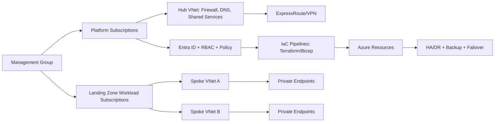

# Enterprise Azure Foundation: Landing Zone, Connectivity, Governance, and Resilience

## Overview
This page is the high-priority enterprise architecture foundation for senior interviews. It combines Azure Landing Zone design, hub-spoke connectivity, private access patterns, security controls, governance, IaC operating model, migration readiness, HA/DR, and business-value framing using TCO and OLA.

## Why this topic matters
Most architect interviews test whether you can design a cloud platform that is secure, scalable, governable, and migration-ready before individual workloads go live. A strong answer should show how platform decisions reduce enterprise risk while enabling delivery speed.

## Core concepts
- Azure Landing Zone and subscription operating model
- Hub-spoke network topology and segmentation strategy
- ExpressRoute, VPN, peering, and private endpoint connectivity choices
- Azure Firewall and NVA integration patterns
- Entra ID, RBAC, Azure Policy, and governance layering
- Terraform + Bicep coexistence model
- Migration strategy and Azure Migrate usage model
- HA/DR architecture and RTO/RPO-driven design
- TCO and OLA conversation model for stakeholders

## Detailed explanation of each concept
Landing zones define guardrails first, workloads second. They standardize identity boundaries, network topology, policy baseline, logging, and cost controls so teams can deploy safely without reinventing controls per project. Hub-spoke helps centralize shared services and security inspection while preserving domain isolation in spokes. Connectivity selection should be requirement-driven: ExpressRoute for predictable private enterprise connectivity, VPN for faster setup or backup path, peering for low-latency network extension, and private endpoints for data-plane isolation from public exposure.

Firewall and NVA integration must avoid asymmetric routing and must be explicit about traffic ownership. Entra ID with RBAC and policy must enforce least privilege and compliant defaults through code, not only process. Terraform and Bicep can coexist by boundary: platform teams standardize one primary model while allowing constrained secondary use where it reduces risk. Migration architecture must classify workloads by 6Rs/7Rs and run wave-based execution with dependency-aware cutover and rollback. HA/DR design should be driven by business RTO/RPO and tested runbooks. TCO and OLA discussions should tie architecture choices to measurable business outcomes, not only technical elegance.

## Evaluation (How to assess architecture quality)
- Landing zone policy compliance rate
- Percentage of private traffic vs public exposure
- RBAC least-privilege exception count and aging
- Drift and out-of-band change rate in IaC
- Migration wave success rate and rollback frequency
- RTO/RPO achievement in DR tests
- Cost variance against architecture baseline

## Architecture / flow diagram


**Flow explanation:**  
Governance and landing zone controls are established first. Connectivity and security are centralized in the hub, with workload isolation in spokes. Deployments are controlled through IaC pipelines, and resilience is validated through HA/DR testing.

## Real-world example
A regulated enterprise creates a landing zone with management group hierarchy, platform subscriptions, and workload subscriptions by business domain. Hub-spoke topology routes egress through Azure Firewall and selected NVA chains. Databases and storage are exposed only through private endpoints. RBAC and Azure Policy are enforced via IaC pipelines. Migration is executed in waves using Azure Migrate assessments, with rollback plans and DR tests per wave. Cost and OLA are reviewed monthly with platform, security, and business stakeholders.

## Best practices
- Build landing zone guardrails before workload migration
- Keep identity, network, and policy controls as code
- Use private endpoint-first strategy for data services
- Align connectivity design with latency, compliance, and cost needs
- Define migration waves by dependency and business criticality
- Tie HA/DR objectives to explicit RTO/RPO contracts
- Track TCO against reference architecture assumptions

## Common mistakes / misconceptions
- Treating landing zone as a one-time setup instead of operating model
- Mixing platform and workload responsibilities without boundaries
- Overusing public endpoints due to short-term convenience
- Using RBAC manually without policy-backed guardrails
- Assuming DR exists because backup exists
- Doing big-bang migration without dependency mapping

## Industry relevance
These topics are mandatory in enterprise architect interviews because they reflect real platform ownership: governance, migration modernization, secure connectivity, and measurable operational resilience.

## Interview discussion points
- How to choose ExpressRoute vs VPN vs private endpoint pattern combinations
- How to balance centralized platform controls and team autonomy
- How to justify replatform vs refactor in migration economics
- How to prove DR readiness with evidence
- How to explain TCO/OLA without oversimplifying architecture trade-offs

## Links to dependent / related topics
- [Cloud Architecture Overview](./README.md)
- [Azure Topic Master](../azure/azure_topic_master.md)
- [Governance Hierarchy](../azure/governance_hierarchy.md)
- [Terraform for Azure](../azure/terraform.md)
- [CI/CD in Azure DevOps](../azure/cicd_azure_devops.md)
- [Security, IAM, Networking](../security/security_iam_networking.md)
- [Migration Architecture Master](../migration-architecture/migration_architecture_master.md)

## Interview Questions (50)
1. What is an Azure Landing Zone and why is it foundational?
2. What core components must every landing zone include?
3. How do management groups and subscriptions map to enterprise structure?
4. How do you decide between centralized and federated landing zone governance?
5. Why is hub-spoke a common enterprise topology on Azure?
6. When should you choose virtual WAN over hub-spoke?
7. How do you design subnet segmentation in hub and spokes?
8. How do NSG, UDR, Firewall, and NVA responsibilities differ?
9. ExpressRoute vs VPN: how do you decide?
10. How should ExpressRoute and VPN coexist for resilience?
11. What is VNet peering and what are key constraints?
12. When to use private endpoints vs service endpoints?
13. How do you design private DNS for private endpoints at scale?
14. How do you integrate Azure Firewall with third-party NVAs safely?
15. What causes asymmetric routing and how do you prevent it?
16. How do you design egress control for regulated workloads?
17. How do you enforce ingress control patterns consistently?
18. How do you design Entra ID tenant and identity boundaries?
19. How do you implement least privilege with RBAC at scale?
20. How do PIM and break-glass accounts fit enterprise governance?
21. How do you enforce Azure Policy without blocking delivery?
22. Terraform vs Bicep: what is the enterprise operating model?
23. How do you avoid IaC tool sprawl across teams?
24. How do you structure landing zone repos and module ownership?
25. How do you map migration strategies (6Rs/7Rs) for application portfolios?
26. How do you use Azure Migrate assessments in architecture decisions?
27. How do you prioritize migration waves?
28. How do you handle dependent systems during migration waves?
29. What is the right cutover strategy for low-downtime migration?
30. What is your rollback strategy if migration fails?
31. How do you design HA within a region for critical applications?
32. How do you design DR across regions for tier-1 systems?
33. How do you choose active-active vs active-passive patterns?
34. How do you define and negotiate RTO/RPO with business teams?
35. How do backups differ from DR in architecture discussions?
36. How do you validate DR readiness beyond documentation?
37. How do you design observability for landing zone operations?
38. What metrics indicate platform governance health?
39. How do you run operational readiness reviews before go-live?
40. How do you govern costs at platform and workload levels?
41. What is TCO and how do you present it credibly?
42. What is OLA and why does it matter for architecture?
43. How do you align architecture decisions with TCO and OLA constraints?
44. How do you run stakeholder workshops for platform blueprinting?
45. What should be included in architecture blueprints and runbooks?
46. How do you manage delivery governance for multi-team programs?
47. How do you discuss advanced compliance expectations with auditors?
48. How do you handle complex hybrid scenarios in enterprise architectures?
49. How do you design multi-region enterprise patterns with governance consistency?
50. How do you conclude a platform architecture answer in interviews?

## Answers for important questions (Summary + Crisp + Deep)

### Q1. What is an Azure Landing Zone and why is it foundational?
**Question summary:** Landing zone defines the secure, governable platform baseline before workloads.
**Crisp answer (7-8 lines):** Azure Landing Zone is an enterprise-ready cloud foundation model. It includes identity, networking, governance, security, operations, and cost guardrails. It standardizes how subscriptions and workloads are onboarded. It reduces inconsistent architecture decisions across teams. It accelerates migration and delivery with reusable controls. It improves compliance posture by design. It is foundational because it prevents platform chaos at scale.
**Deep explanation:** A landing zone is not just a template deployment, it is an operating model that combines technical controls and organizational boundaries. In interviews, strong answers explain that landing zone decisions determine long-term risk profile and delivery speed. If teams start workload-by-workload without this foundation, identity sprawl, networking inconsistency, and policy drift appear quickly. A mature landing zone includes management group hierarchy, subscription model, identity governance, security baseline, connectivity patterns, logging, and cost controls. It should define who owns platform services versus workload services. It should also include onboarding standards, exception process, and lifecycle governance for changes. The best architecture framing is that landing zone is the “contract” between central platform governance and product team autonomy. This contract reduces rework during migrations and cloud-native modernization.
**Answer summary:** Landing zone is the enterprise cloud control plane that enables safe scale.
**Simple diagram:**  
```text
Landing Zone = Governance + Identity + Network + Security + Ops + Cost
```
**Trusted reference links:**  
- https://learn.microsoft.com/en-us/azure/cloud-adoption-framework/ready/landing-zone/

### Q2. What core components must every landing zone include?
**Question summary:** Tests whether you know mandatory platform building blocks.
**Crisp answer (7-8 lines):** Every landing zone needs identity and access controls, network topology, governance policy, security baseline, operations monitoring, and cost controls. It also needs subscription strategy and workload onboarding standards. IaC automation should be mandatory. Logging and audit traceability must be built-in. DR expectations and backup baseline should be defined. Ownership boundaries must be explicit.
**Deep explanation:** The minimum viable landing zone is defined by controls that prevent systemic failure modes. Identity controls prevent privilege creep. Network architecture prevents accidental exposure and unmanaged east-west traffic. Policy and governance enforce standards such as tagging, private networking, and encryption. Security baseline ensures detection and response are not afterthoughts. Operations baseline gives observability and change evidence across all subscriptions. Cost controls prevent silent budget failure during scale-out. Subscription and management group design creates clear blast-radius and ownership segmentation. IaC ensures repeatability, and onboarding playbooks ensure new teams can enter safely without bespoke exceptions.
**Answer summary:** Landing zone components must cover identity, network, governance, security, operations, cost, and automation.
**Simple diagram:**  
```text
Identity | Network | Policy | Security | Ops | Cost | IaC
```
**Trusted reference links:**  
- https://learn.microsoft.com/en-us/azure/cloud-adoption-framework/ready/landing-zone/design-principles

### Q3. How do management groups and subscriptions map to enterprise structure?
**Question summary:** Focuses on governance and operating boundaries.
**Crisp answer (7-8 lines):** Management groups model policy hierarchy and governance inheritance. Subscriptions model billing, quota, and blast-radius boundaries. Enterprises usually separate platform, production, non-production, and sandbox concerns. Business domains can map to subscription groups for accountability. Avoid over-fragmentation that increases operational overhead. Keep structure aligned to ownership and compliance needs. Design for predictable onboarding.
**Deep explanation:** Good hierarchy design is organizational architecture as much as technical architecture. Overly flat structures weaken policy inheritance; overly deep structures complicate governance and clarity. Subscription boundaries should isolate risk, spending, and operational accountability. Platform subscriptions often host shared services like connectivity, DNS, and central monitoring. Workload subscriptions should reflect lifecycle and ownership boundaries. In interviews, highlight that hierarchy should support policy rollout, incident containment, and reporting transparency. Also mention that restructuring later is costly, so initial taxonomy should anticipate growth and acquisition scenarios.
**Answer summary:** Use management groups for governance inheritance and subscriptions for risk/accountability isolation.
**Simple diagram:**  
```text
Mgmt Groups -> Subscriptions -> Resource Groups
```
**Trusted reference links:**  
- https://learn.microsoft.com/en-us/azure/governance/management-groups/overview

### Q4. How do you decide between centralized and federated landing zone governance?
**Question summary:** Trade-off between control and team autonomy.
**Crisp answer (7-8 lines):** Centralized governance gives consistency and stronger compliance control. Federated governance improves team agility and domain ownership. Most enterprises use a hybrid model. Central platform sets mandatory guardrails and shared services. Domain teams own workload architecture within policy boundaries. Exceptions are governed with review and expiry. Decision depends on regulatory pressure, team maturity, and change velocity.
**Deep explanation:** Pure centralization can become a delivery bottleneck; pure federation can create policy drift. A practical model defines mandatory controls that cannot be bypassed, such as identity, logging, encryption, and approved connectivity patterns. Above that baseline, teams get self-service patterns with guardrails. The architecture leader’s job is to minimize policy friction through automation and reusable blueprints. Governance effectiveness depends on clear ownership, escalation paths, and metrics for exception trends. Strong interview answers show that governance is an operating model, not a static org chart.
**Answer summary:** Hybrid governance works best: central guardrails with federated workload ownership.
**Simple diagram:**  
```text
Central mandatory controls + Team-level implementation autonomy
```
**Trusted reference links:**  
- https://learn.microsoft.com/en-us/azure/cloud-adoption-framework/ready/enterprise-scale/operating-model

### Q5. Why is hub-spoke a common enterprise topology on Azure?
**Question summary:** Tests network architecture fundamentals.
**Crisp answer (7-8 lines):** Hub-spoke centralizes shared services such as firewall, DNS, and connectivity gateways. It isolates workload domains in spokes. It simplifies governance and security inspection points. It scales onboarding through repeatable spoke patterns. It supports hybrid connectivity to on-prem through central hub attachments. It reduces duplicated networking components. It provides controlled east-west and north-south traffic design.
**Deep explanation:** Hub-spoke works because enterprises need both control and separation. Shared services in hub reduce operational duplication and improve policy consistency. Spokes allow business domains to evolve independently with bounded blast radius. The topology also enables centralized observability and traffic inspection. In interviews, discuss caveats: overly centralized hubs can become bottlenecks if not designed with throughput and resilience in mind. Mention route table and DNS strategy because these are common failure points in real deployments.
**Answer summary:** Hub-spoke balances centralized control with domain-level isolation and scale.
**Simple diagram:**  
```text
Hub(shared services) <-> Spokes(workload domains)
```
**Trusted reference links:**  
- https://learn.microsoft.com/en-us/azure/architecture/reference-architectures/hybrid-networking/hub-spoke

### Q6. When should you choose virtual WAN over hub-spoke?
**Question summary:** Pattern selection for large-scale connectivity.
**Crisp answer (7-8 lines):** Choose Virtual WAN when you need global transit networking and simplified branch connectivity at scale. Choose classic hub-spoke for tighter customization and simpler regional topology. vWAN is strong for many sites and distributed edge requirements. Hub-spoke is often better for controlled custom routing with fewer regions/sites. Decision should include operations complexity and cost. Evaluate security stack integration needs. Validate future growth patterns.
**Deep explanation:** The decision is less about feature checklist and more about operating model. Virtual WAN can reduce operational overhead in highly distributed enterprises. However, teams with deep custom network controls may prefer self-managed hubs for flexibility. Architecture discussions should cover route governance, security inspection insertion, and troubleshooting model. Choosing the wrong pattern can cause either unnecessary complexity or constrained scale.
**Answer summary:** Use vWAN for global-scale transit simplicity; hub-spoke for custom control and focused scope.
**Simple diagram:**  
```text
Many regions/sites -> vWAN | Custom regional control -> Hub-Spoke
```
**Trusted reference links:**  
- https://learn.microsoft.com/en-us/azure/virtual-wan/virtual-wan-about

### Q7. How do NSG, UDR, Firewall, and NVA responsibilities differ?
**Question summary:** Clarifies layered network controls.
**Crisp answer (7-8 lines):** NSGs enforce subnet/NIC-level traffic allow/deny rules. UDR controls routing path decisions. Azure Firewall provides centralized stateful inspection and policy management. NVAs provide advanced or vendor-specific network services. NSG is micro-segmentation control, firewall is central policy control, UDR is traffic steering control. Together they provide defense-in-depth. Design ownership and order clearly.
**Deep explanation:** Many outages come from unclear control boundaries. NSGs should not be used as a full replacement for centralized policy controls. UDRs determine where traffic goes, and misconfigured routes can bypass inspection unintentionally. Azure Firewall or NVAs enforce centralized inspection, egress restrictions, and application-level controls depending on requirements. Mature designs assign explicit ownership and maintain tested change workflows to avoid route/security conflicts.
**Answer summary:** NSG filters locally, UDR routes traffic, Firewall/NVA inspect centrally.
**Simple diagram:**  
```text
NSG(filter) + UDR(route) + Firewall/NVA(inspect)
```
**Trusted reference links:**  
- https://learn.microsoft.com/en-us/azure/firewall/overview

### Q8. ExpressRoute vs VPN: how do you decide?
**Question summary:** Connectivity trade-off decision.
**Crisp answer (7-8 lines):** Use ExpressRoute for private, predictable, high-throughput enterprise connectivity with strong SLA expectations. Use VPN for faster setup, lower cost entry, and backup connectivity. Decide based on latency stability, bandwidth demand, compliance requirements, and branch footprint. Many enterprises use both. Include operational complexity and provider dependencies in decision. Validate failover behavior in drills. Avoid single-connection assumptions.
**Deep explanation:** Connectivity decisions should be tied to workload criticality and data sensitivity. ExpressRoute improves predictability and private pathing but adds procurement and operational coordination complexity. VPN is flexible and faster to establish but may not meet stringent performance guarantees for all workloads. In interviews, strong answers mention dual-path resilience and route preference design. Also discuss monitoring for packet loss, latency, and failover switching behavior.
**Answer summary:** ExpressRoute for predictable private enterprise scale; VPN for flexibility and backup.
**Simple diagram:**  
```text
Primary: ExpressRoute | Backup/branch: VPN
```
**Trusted reference links:**  
- https://learn.microsoft.com/en-us/azure/expressroute/expressroute-introduction

### Q9. How do you enforce Azure Policy without blocking delivery?
**Question summary:** Governance vs speed balance.
**Crisp answer (7-8 lines):** Start with audit mode to expose violations. Move critical controls to deny after remediation runway. Use policy initiatives by environment and risk. Provide approved templates that already comply. Add exception workflow with expiry. Integrate policy checks in CI before deployment. Report policy trends to teams continuously.
**Deep explanation:** Policy adoption fails when enforcement is introduced without developer enablement. Architects should combine policy controls with paved-road templates and pre-deploy validation. The goal is to shift compliance left, not to create last-minute release failures. Exception processes should be time-bound and transparent so temporary risk does not become permanent debt. This approach improves both governance maturity and team trust.
**Answer summary:** Enforce policy progressively with pre-deploy checks and template-based enablement.
**Simple diagram:**  
```text
Audit -> Remediate -> Deny (for critical controls)
```
**Trusted reference links:**  
- https://learn.microsoft.com/en-us/azure/governance/policy/overview

### Q10. Terraform vs Bicep: what is the enterprise operating model?
**Question summary:** IaC strategy for scale and consistency.
**Crisp answer (7-8 lines):** Choose one primary IaC standard per platform domain to reduce fragmentation. Use Terraform where multi-cloud standardization is required. Use Bicep where Azure-native depth and ARM integration are primary. Allow secondary tool usage only by defined boundary and governance rules. Keep policy checks and module standards tool-agnostic. Track drift and compliance across both. Prioritize operational consistency over tool preference.
**Deep explanation:** The worst model is uncontrolled dual-tool usage where teams reinvent modules and controls independently. A better model defines strategic defaults, module ownership, and quality gates. If both tools exist, define which domains and teams own each, and ensure equivalent governance checks. Architecture leaders should optimize for maintainability and onboarding simplicity, not ideological tool purity.
**Answer summary:** Standardize primary IaC, allow controlled coexistence, enforce common governance.
**Simple diagram:**  
```text
Primary IaC standard + controlled secondary usage + shared policy gates
```
**Trusted reference links:**  
- https://learn.microsoft.com/en-us/azure/azure-resource-manager/bicep/overview

### Q11. How do you map migration strategies (6Rs/7Rs) for application portfolios?
**Question summary:** Portfolio-level migration decision model.
**Crisp answer (7-8 lines):** Classify apps by business criticality, technical debt, dependencies, compliance, and modernization value. Rehost for speed, replatform for moderate optimization, refactor for strategic cloud-native gains. Repurchase when SaaS offers better value. Retire unused systems, retain constrained workloads temporarily. Use a decision matrix with objective criteria. Revisit choices per migration wave.
**Deep explanation:** A good 6R/7R strategy is not static; it should evolve as business priorities and platform readiness evolve. Architects should avoid defaulting all systems to rehost because it often delays modernization debt. Similarly, forcing refactor for every system can stall timelines and increase risk. Portfolio governance should align migration path to measurable business outcome and risk appetite. Mention dependency mapping and transition architecture in interviews for stronger credibility.
**Answer summary:** Use criteria-driven 6R/7R mapping per application and review per wave.
**Simple diagram:**  
```text
Assess -> classify (6R/7R) -> wave plan -> execute/review
```
**Trusted reference links:**  
- https://learn.microsoft.com/en-us/azure/cloud-adoption-framework/migrate/

### Q12. How do you use Azure Migrate assessments in architecture decisions?
**Question summary:** Tool-to-architecture linkage.
**Crisp answer (7-8 lines):** Azure Migrate provides inventory, dependency insights, readiness signals, and sizing guidance. Use it to validate migration feasibility and target landing choices. Combine tool output with business constraints and compliance requirements. Do not treat assessment output as final architecture truth. Use assessments to sequence waves and estimate effort. Reassess after remediation changes. Keep decision traceability in architecture records.
**Deep explanation:** Azure Migrate is decision support, not decision replacement. It helps reduce blind spots in dependency and sizing assumptions. But architecture choices still require business context, security constraints, and operating model readiness. Strong architects use assessment outputs as one evidence source in a broader decision framework. This improves confidence in migration plan quality and stakeholder trust.
**Answer summary:** Use Azure Migrate as evidence input for migration architecture and wave planning.
**Simple diagram:**  
```text
Assessment data + business constraints -> migration architecture decisions
```
**Trusted reference links:**  
- https://learn.microsoft.com/en-us/azure/migrate/migrate-services-overview

### Q13. How do you design DR across regions for tier-1 systems?
**Question summary:** Enterprise resilience architecture.
**Crisp answer (7-8 lines):** Start with business RTO/RPO targets and failure scenarios. Select active-active or active-passive by workload and cost tolerance. Ensure data replication model matches consistency needs. Automate failover runbooks and test regularly. Include identity, DNS, and network failover dependencies. Track DR readiness evidence continuously. Design for controlled failback.
**Deep explanation:** Regional DR design must include application, data, identity, and operations as a single system. Teams often design compute failover but miss dependency services such as DNS, secret stores, and messaging failover behavior. Interview answers should include testing cadence and evidence, because untested DR is theoretical DR. Mention both technical and organizational readiness for stronger architect framing.
**Answer summary:** DR is a tested multi-layer architecture driven by RTO/RPO and dependency failover design.
**Simple diagram:**  
```text
Primary region <-> Secondary region with tested failover/failback
```
**Trusted reference links:**  
- https://learn.microsoft.com/en-us/azure/reliability/reliability-overview

### Q14. What is TCO and how do you present it credibly?
**Question summary:** Business architecture communication.
**Crisp answer (7-8 lines):** TCO is full lifecycle cost, not only cloud bill comparison. Include migration effort, operations, licensing, resilience, security, and support model impacts. Compare current-state and target-state with explicit assumptions. Show sensitivity analysis for demand growth and resilience options. Tie architecture choices to cost drivers. Present uncertainty transparently. Update model post-migration with actuals.
**Deep explanation:** Credible TCO discussions avoid simplistic “cloud is cheaper” claims. Architects should show what changes in people, process, tooling, reliability posture, and delivery speed. Include both direct and indirect cost dimensions, including risk-reduction value where measurable. In interviews, strong framing is to show TCO as decision support for architecture options, not as one static number.
**Answer summary:** Present TCO as assumption-driven lifecycle economics tied to architecture choices.
**Simple diagram:**  
```text
Current cost baseline vs Target architecture lifecycle cost
```
**Trusted reference links:**  
- https://learn.microsoft.com/en-us/azure/cost-management-billing/

### Q15. What is OLA and why does it matter for architecture?
**Question summary:** Operational contracts behind SLA delivery.
**Crisp answer (7-8 lines):** OLA defines internal team commitments needed to deliver external SLAs. It clarifies responsibilities across platform, security, network, app, and support teams. It sets response, escalation, and recovery expectations. Without OLA, SLA targets often fail operationally. Architecture should be designed to match OLA capabilities. OLA maturity affects incident outcomes directly. It is critical in enterprise operating models.
**Deep explanation:** Many architectures fail not by design intent but by operational misalignment between teams. OLA translates architecture into executable internal commitments. If recovery, approvals, and ownership are unclear, even strong technical patterns underperform during incidents. Senior architects should explicitly include OLA assumptions while proposing HA/DR and support models. This signals production-readiness thinking in interviews.
**Answer summary:** OLA is the internal operational contract that makes architecture deliverable.
**Simple diagram:**  
```text
Architecture design + Team OLAs -> Reliable SLA outcomes
```
**Trusted reference links:**  
- https://learn.microsoft.com/en-us/azure/well-architected/framework

### Q16. How do you run operational readiness reviews before go-live?
**Question summary:** Pre-production risk control.
**Crisp answer (7-8 lines):** Validate runbooks, monitoring, alerting, access controls, backup/DR, and on-call ownership. Confirm SLOs and escalation paths. Run game-day or incident simulations. Verify cost guardrails and capacity assumptions. Ensure policy compliance and exception documentation. Confirm rollback capability. Go-live only after objective readiness criteria pass.
**Deep explanation:** Readiness reviews reduce first-month incidents and support chaos. They should be evidence-based, not checklist theater. Architects should define objective pass/fail gates and required artifacts from each owning team. Include a clear decision authority for risk acceptance. This is a strong differentiator in architect interviews.
**Answer summary:** Operational readiness is evidence-based validation of production operability before release.
**Simple diagram:**  
```text
Readiness evidence -> Go/No-Go decision
```
**Trusted reference links:**  
- https://learn.microsoft.com/en-us/azure/well-architected/operational-excellence/

### Q17. How do you discuss advanced compliance expectations with auditors?
**Question summary:** Compliance communication for architecture leadership.
**Crisp answer (7-8 lines):** Map control objectives to technical and process controls. Show policy enforcement evidence and exception governance. Demonstrate traceability from design to operation. Provide access, logging, encryption, and change control records. Explain compensating controls where needed. Show periodic review cadence. Keep narrative evidence-based and non-defensive.
**Deep explanation:** Auditors evaluate consistency and evidence quality as much as architecture. A mature discussion shows governance model, control ownership, and monitoring process. Architects should avoid purely tool-centric answers and instead demonstrate end-to-end control operation. This includes how exceptions are approved, tracked, and retired.
**Answer summary:** Compliance discussions require control mapping, evidence chain, and governance transparency.
**Simple diagram:**  
```text
Control objective -> Policy/Process/Tech control -> Evidence
```
**Trusted reference links:**  
- https://learn.microsoft.com/en-us/azure/compliance/

### Q18. How do you handle complex hybrid scenarios in enterprise architectures?
**Question summary:** Hybrid design strategy under real constraints.
**Crisp answer (7-8 lines):** Start with dependency and latency mapping across on-prem and cloud. Define secure connectivity and identity federation model first. Segment workloads by modernization readiness. Use phased migration with coexistence patterns. Standardize observability and incident model across environments. Design for temporary complexity with clear target state. Retire bridging patterns when no longer needed.
**Deep explanation:** Hybrid complexity usually persists longer than planned. Architects should control this by defining explicit transition architecture and retirement criteria. Security model consistency is essential across environments. Operational fragmentation is another major risk; centralized monitoring and shared incident governance reduce this. Interview answers should show realistic transition planning instead of idealized end-state only.
**Answer summary:** Hybrid success requires transition architecture, consistent controls, and planned simplification.
**Simple diagram:**  
```text
On-prem + Azure coexistence -> phased modernization -> target state
```
**Trusted reference links:**  
- https://learn.microsoft.com/en-us/azure/architecture/hybrid/

### Q19. How do you design multi-region enterprise patterns with governance consistency?
**Question summary:** Scale and compliance across regions.
**Crisp answer (7-8 lines):** Use global governance baseline with regional overlays. Keep policy parity and approved variance rules. Standardize identity and logging architecture across regions. Parameterize IaC for region-specific constraints. Validate DR and failover dependencies region-wise. Track configuration drift between regions. Use architecture review cadence for parity.
**Deep explanation:** Multi-region design fails when regions diverge operationally. Governance consistency requires common baseline with controlled deviations. Architects should define what is globally mandatory versus locally adaptable. This model supports compliance while respecting regional constraints such as residency or service availability.
**Answer summary:** Multi-region patterns need baseline parity, controlled variance, and continuous drift governance.
**Simple diagram:**  
```text
Global baseline + Regional overlays + Drift governance
```
**Trusted reference links:**  
- https://learn.microsoft.com/en-us/azure/architecture/guide/design-principles/geographical-distribution

### Q20. How do you conclude a platform architecture answer in interviews?
**Question summary:** Communication and synthesis quality.
**Crisp answer (7-8 lines):** Close with business objective, architecture choice, and why it fits constraints. Summarize security, reliability, cost, and delivery implications. State major trade-offs and mitigation plans. Mention migration or rollout path if applicable. Confirm measurable success criteria. Keep final message concise and decision-oriented. Show ownership mindset.
**Deep explanation:** Strong conclusions show that you can move from technical detail to executive clarity. Interviewers assess whether you can make decisions under constraints and defend them with measurable reasoning. A good ending frames architecture as an operating model with governance and lifecycle, not just component selection.
**Answer summary:** End with decision clarity, trade-offs, controls, and measurable outcomes.
**Simple diagram:**  
```text
Goal -> Architecture -> Trade-offs -> Controls -> Outcomes
```
**Trusted reference links:**  
- https://learn.microsoft.com/en-us/azure/architecture/framework/

### Q21. How should ExpressRoute and VPN coexist for resilience?
**Question summary:**  
Design dual connectivity where ExpressRoute is primary and VPN is validated failover path.
**Crisp answer (7-8 lines):** Keep clear route preference and failover policy. Monitor both circuits continuously. Test failover periodically, not only during outages. Separate control-plane and runbook ownership. Validate application behavior during path changes. Document expected convergence time. Avoid assumptions that backup path is always healthy.
**Deep explanation:** Coexistence is only effective if operationally exercised. Many enterprises configure backup links but never validate them under realistic conditions. Route priorities, BGP behavior, and DNS assumptions should be tested during controlled drills. Architects should include observability and incident response ownership in the design. This turns “backup connectivity” into real resilience.
**Answer summary:** Dual connectivity must be tested and operationalized to be meaningful.
**Simple diagram:**  
```text
Primary ER -> Failover VPN (tested)
```
**Trusted reference links:**  
- https://learn.microsoft.com/en-us/azure/vpn-gateway/vpn-gateway-about-vpngateways

### Q22. What is VNet peering and what are key constraints?
**Question summary:**  
Peering links VNets privately, but route/inspection design must be deliberate.
**Crisp answer (7-8 lines):** Peering provides low-latency private connectivity between VNets. It does not automatically enforce centralized inspection. You must design route tables and security controls explicitly. Transitivity is not implicit in standard peering models. Governance should define who can peer and why. Monitor peering sprawl and route impact.
**Deep explanation:** Peering is simple to enable but easy to misuse at scale. Uncontrolled peering can create hidden east-west pathways that bypass policy intent. Mature architecture applies naming, approval, and route validation standards. Interview answers should mention transitivity limitations and centralized inspection strategy because these are common practical pitfalls.
**Answer summary:** Peering is powerful but must be governed with explicit route/security controls.
**Simple diagram:**  
```text
VNet A <-> VNet B (private, explicit routing/security needed)
```
**Trusted reference links:**  
- https://learn.microsoft.com/en-us/azure/virtual-network/virtual-network-peering-overview

### Q23. When to use private endpoints vs service endpoints?
**Question summary:**  
Compares two Azure private access patterns.
**Crisp answer (7-8 lines):** Use private endpoints for strongest data-plane isolation via private IP in your VNet. Use service endpoints for simpler VNet-bound access where private endpoint complexity is unnecessary. Private endpoints support tighter zero-trust posture. Service endpoints may be simpler operationally for some scenarios. Decide by security requirements, DNS complexity, and operational model. Prefer private endpoints for sensitive workloads.
**Deep explanation:** The core difference is exposure and control granularity. Private endpoints pull service access into your private network boundary and support stricter governance. They introduce DNS and lifecycle complexity that must be managed well. Service endpoints improve network restriction but still expose service over public endpoint semantics. In interviews, emphasize requirement-driven selection and standardized patterns.
**Answer summary:** Private endpoints for stronger isolation; service endpoints for simpler constrained scenarios.
**Simple diagram:**  
```text
VNet -> Private Endpoint -> PaaS (private IP path)
```
**Trusted reference links:**  
- https://learn.microsoft.com/en-us/azure/private-link/private-endpoint-overview

### Q24. How do you design private DNS for private endpoints at scale?
**Question summary:**  
DNS architecture is critical to make private endpoints reliable.
**Crisp answer (7-8 lines):** Standardize private DNS zones and linking strategy by domain and environment. Centralize governance of zone ownership. Automate zone-link and record lifecycle in IaC. Validate name resolution paths from all workload networks. Design for hybrid DNS forwarding where required. Monitor DNS failures as production incidents. Avoid ad hoc DNS entries.
**Deep explanation:** Private endpoint designs fail frequently due to DNS inconsistency. Large enterprises need clear ownership model for zones, forwarding rules, and hybrid name resolution. Without this, teams see intermittent connectivity and hard-to-diagnose failures. Architects should define DNS as a first-class part of connectivity design, not as an implementation detail.
**Answer summary:** Private endpoint success depends on disciplined private DNS architecture and ownership.
**Simple diagram:**  
```text
Spoke VNet -> Private DNS zone -> Private Endpoint resolution
```
**Trusted reference links:**  
- https://learn.microsoft.com/en-us/azure/dns/private-dns-overview

### Q25. How do you integrate Azure Firewall with third-party NVAs safely?
**Question summary:**  
Focuses on layered inspection architecture without routing instability.
**Crisp answer (7-8 lines):** Define clear traffic classes and inspection order. Prevent asymmetric routes through explicit UDR strategy. Keep policy ownership split by control domain. Test failover behavior for both layers. Avoid double-NAT surprises through design validation. Monitor latency and throughput impact. Keep architecture simple where compliance allows.
**Deep explanation:** Dual inspection architecture can satisfy advanced requirements but increases complexity rapidly. The key is deterministic routing and clear policy ownership. Without these, troubleshooting becomes slow and outages increase. Architects should justify dual-stack security only when needed by compliance or specific capabilities, and should include operational readiness evidence.
**Answer summary:** Azure Firewall + NVA is viable when routing, ownership, and operations are rigorously controlled.
**Simple diagram:**  
```text
Traffic -> Azure Firewall -> NVA -> Destination (or defined alternative path)
```
**Trusted reference links:**  
- https://learn.microsoft.com/en-us/azure/architecture/example-scenario/gateway/firewall-application-gateway

### Q26. How do you design egress control for regulated workloads?
**Question summary:**  
Egress architecture prevents uncontrolled outbound risk.
**Crisp answer (7-8 lines):** Centralize egress through approved inspection points. Use allowlist-based outbound policy where possible. Block direct internet egress from sensitive workloads. Route logs to central SIEM for audit. Enforce egress controls via policy and IaC. Use private access patterns for managed services. Test exception process with expiry.
**Deep explanation:** Regulated workloads require auditable outbound communication controls. Unmanaged egress can violate compliance and increase breach blast radius. A strong design combines routing controls, firewall policy, identity-aware access, and logging evidence. Interview answers should mention controlled exception handling because business teams often need temporary outbound access.
**Answer summary:** Regulated egress requires centralized, auditable, least-privilege outbound pathways.
**Simple diagram:**  
```text
Workload -> Central egress controls -> Approved destinations
```
**Trusted reference links:**  
- https://learn.microsoft.com/en-us/azure/architecture/framework/security/design-network-segmentation

### Q27. How do you implement least privilege with RBAC at scale?
**Question summary:**  
RBAC strategy for large organizations.
**Crisp answer (7-8 lines):** Use group-based role assignments, not user-level direct grants. Scope permissions at smallest practical boundary. Separate platform admin and workload operator duties. Use PIM for just-in-time elevation. Review dormant privileged assignments regularly. Track exceptions and aging. Automate assignment through IaC and identity workflows.
**Deep explanation:** Large-scale RBAC fails when convenience overrides governance. Group-based patterns improve maintainability and auditability. PIM reduces standing privilege risk. Architects should also include access review cadence and emergency-access governance. This demonstrates real production governance maturity.
**Answer summary:** Scalable least privilege needs group-based RBAC, scoped roles, PIM, and review discipline.
**Simple diagram:**  
```text
Identity Group -> Scoped Role -> Resource Boundary
```
**Trusted reference links:**  
- https://learn.microsoft.com/en-us/azure/role-based-access-control/best-practices

### Q28. How do PIM and break-glass accounts fit enterprise governance?
**Question summary:**  
Privileged access and emergency controls.
**Crisp answer (7-8 lines):** PIM provides just-in-time privileged elevation with approval and audit trails. Break-glass accounts provide emergency access when normal identity systems fail. Keep break-glass accounts tightly controlled and monitored. Test emergency access process periodically. Exclude break-glass from normal operations. Rotate credentials and protect with strong controls.
**Deep explanation:** PIM is for controlled daily governance; break-glass is for rare high-severity scenarios. Both are required in mature enterprise governance but serve different risk models. Architects should emphasize process discipline and periodic drills so emergency paths remain usable yet secure. This balance is often examined in senior interviews.
**Answer summary:** PIM governs routine privileged access; break-glass protects resilience in identity emergencies.
**Simple diagram:**  
```text
Normal privilege -> PIM | Emergency privilege -> Break-glass
```
**Trusted reference links:**  
- https://learn.microsoft.com/en-us/entra/id-governance/privileged-identity-management/

### Q29. How do you prioritize migration waves?
**Question summary:**  
Wave planning strategy for risk-controlled execution.
**Crisp answer (7-8 lines):** Rank workloads by criticality, dependency complexity, business timeline, and migration readiness. Start with low-risk pilots to validate platform and process. Group tightly coupled systems in coordinated waves. Avoid migrating high-risk dependencies early without proven patterns. Include rollback criteria for every wave. Measure wave outcomes and adjust strategy.
**Deep explanation:** Wave design should optimize learning rate while controlling production risk. Pilot waves validate connectivity, identity, observability, and runbook assumptions. Later waves can accelerate once patterns are stable. A rigid wave plan without feedback loops is a common failure pattern. Strong architects keep governance checkpoints between waves.
**Answer summary:** Prioritize waves by risk/readiness/dependency and evolve based on measured outcomes.
**Simple diagram:**  
```text
Pilot wave -> Medium complexity waves -> Critical waves
```
**Trusted reference links:**  
- https://learn.microsoft.com/en-us/azure/cloud-adoption-framework/migrate/plan-migration

### Q30. What is your rollback strategy if migration fails?
**Question summary:**  
Rollback readiness for production cutovers.
**Crisp answer (7-8 lines):** Define rollback trigger thresholds before cutover. Keep source environment healthy until stabilization window closes. Preserve data sync and reconciliation path. Automate rollback execution where possible. Validate service integrity post-rollback. Record incident learnings and remediate root causes. Never rely on ad hoc rollback decisions.
**Deep explanation:** Rollback is a design-time requirement, not a project afterthought. The rollback path should include application routing, data consistency controls, and communication process. Architects should show clear go/no-go gates and ownership during cutover windows. In interviews, this demonstrates operational realism and risk management maturity.
**Answer summary:** Reliable migration requires pre-defined, tested, criteria-driven rollback architecture.
**Simple diagram:**  
```text
Cutover -> Monitor -> Threshold breach -> Rollback path
```
**Trusted reference links:**  
- https://learn.microsoft.com/en-us/azure/cloud-adoption-framework/migrate/azure-best-practices/contoso-migration-considerations

### Q31. How do you design HA within a region for critical applications?
**Question summary:**  
Intra-region resilience strategy.
**Crisp answer (7-8 lines):** Use zone-aware architecture and redundant instances across failure domains. Keep state services configured for local high availability. Design for graceful degradation under partial failures. Include retry/timeouts/circuit breakers in app behavior. Validate capacity during failover mode. Monitor and test failure-domain scenarios. Avoid single-instance dependencies.
**Deep explanation:** HA design is about continuing service despite localized faults. Zone redundancy and workload elasticity are core controls. Application-level resilience patterns are equally important because infrastructure redundancy alone does not prevent cascading failures. Architects should explain both platform and software controls together.
**Answer summary:** Regional HA combines zone redundancy, resilient application behavior, and failover capacity validation.
**Simple diagram:**  
```text
Zone A + Zone B + Zone C with resilient app routing
```
**Trusted reference links:**  
- https://learn.microsoft.com/en-us/azure/reliability/availability-zones-overview

### Q32. How do you choose active-active vs active-passive patterns?
**Question summary:**  
Resilience pattern trade-off decision.
**Crisp answer (7-8 lines):** Active-active improves failover speed and load distribution but increases complexity and cost. Active-passive is simpler and often cheaper but may increase recovery time. Choose based on business criticality, latency constraints, data consistency model, and operating maturity. Validate runbooks for either pattern. Consider team capability and incident readiness.
**Deep explanation:** Pattern choice should be business-driven, not trend-driven. Active-active introduces consistency and routing complexity, especially for stateful systems. Active-passive can meet many enterprise needs if recovery windows are acceptable and runbooks are robust. Interviewers expect explicit trade-off framing.
**Answer summary:** Choose by RTO/RPO, complexity tolerance, and operational maturity.
**Simple diagram:**  
```text
Active-Active (fast, complex) | Active-Passive (simpler, slower recover)
```
**Trusted reference links:**  
- https://learn.microsoft.com/en-us/azure/architecture/guide/design-principles/reliability

### Q33. How do backups differ from DR in architecture discussions?
**Question summary:**  
Clarifies commonly confused resilience concepts.
**Crisp answer (7-8 lines):** Backup protects data recovery from corruption/deletion. DR restores service continuity after major disruption. Backup alone does not guarantee application recovery objectives. DR includes failover architecture, runbooks, and dependency recovery. Both are required for tiered resilience strategy. Test both independently. Map each to RPO/RTO expectations.
**Deep explanation:** Teams often assume backup equals resilience, which is incomplete for service continuity. DR includes orchestration of application, network, identity, and operational processes. Backup strategy remains essential for point-in-time data restoration and legal retention. Strong interview answers separate these scopes clearly and tie each to business impact.
**Answer summary:** Backup restores data; DR restores service continuity.
**Simple diagram:**  
```text
Backup = Data recovery | DR = Service recovery
```
**Trusted reference links:**  
- https://learn.microsoft.com/en-us/azure/backup/backup-overview

### Q34. How do you validate DR readiness beyond documentation?
**Question summary:**  
Operational proof of resilience.
**Crisp answer (7-8 lines):** Run periodic failover drills with realistic scenarios. Measure actual RTO/RPO against targets. Validate data integrity and critical business workflows post-failover. Include cross-team incident communication in test scope. Capture evidence and remediation actions. Track readiness score trends. Update architecture and runbooks from findings.
**Deep explanation:** Documentation without testing gives false confidence. Real readiness comes from repeatedly exercising people, process, and technology together. Architects should emphasize closed-loop improvement where each drill drives concrete remediation and design updates. This demonstrates practical ownership in interviews.
**Answer summary:** DR readiness is proven through regular evidence-based failover exercises.
**Simple diagram:**  
```text
DR drill -> metrics -> gaps -> remediation -> retest
```
**Trusted reference links:**  
- https://learn.microsoft.com/en-us/azure/site-recovery/site-recovery-overview

### Q35. How do you design observability for landing zone operations?
**Question summary:**  
Platform observability baseline.
**Crisp answer (7-8 lines):** Collect platform logs, metrics, and activity traces centrally. Correlate identity, network, policy, and deployment events. Define alerts for control-plane and data-plane risks. Tag telemetry by subscription, workload, and owner. Retain audit logs per compliance needs. Build governance dashboards for trend visibility. Connect alerts to incident workflows.
**Deep explanation:** Landing zone observability is about governance and platform reliability, not just app monitoring. Without centralized visibility, policy drift and security anomalies can persist undetected. Architects should discuss telemetry taxonomy and ownership because governance dashboards are only useful when actionable by teams.
**Answer summary:** Centralized, ownership-tagged observability is essential for platform governance.
**Simple diagram:**  
```text
Platform signals -> central analytics -> alerts + governance dashboards
```
**Trusted reference links:**  
- https://learn.microsoft.com/en-us/azure/azure-monitor/overview

### Q36. What metrics indicate platform governance health?
**Question summary:**  
Governance effectiveness measurement.
**Crisp answer (7-8 lines):** Track policy compliance rates and exception aging. Monitor privileged access exceptions and review completion. Measure drift and out-of-band changes. Track percentage of resources meeting tagging and security baseline. Monitor private endpoint adoption vs public exposure. Track incident rates tied to governance failures. Review trend direction monthly.
**Deep explanation:** Governance should be measured by operational outcomes, not policy count. Healthy platforms show declining exception aging, reduced drift, and improved compliance trend quality. Metrics should support targeted improvement actions by domain and owner. In interviews, this indicates leadership maturity beyond design diagrams.
**Answer summary:** Governance health comes from trendable, owner-mapped, risk-focused metrics.
**Simple diagram:**  
```text
Compliance + Exceptions + Drift + Exposure trends
```
**Trusted reference links:**  
- https://learn.microsoft.com/en-us/azure/governance/

### Q37. How do you govern costs at platform and workload levels?
**Question summary:**  
FinOps and architecture integration.
**Crisp answer (7-8 lines):** Enforce mandatory tagging and ownership metadata. Set budgets and alerts at management group and subscription levels. Use policy to restrict high-cost SKUs where appropriate. Review cost trends by workload and environment. Tie optimization actions to architecture roadmap. Include reserved capacity and scaling strategy analysis. Keep monthly governance cadence.
**Deep explanation:** Cost governance is strongest when embedded in architecture lifecycle. Platform-level controls provide guardrails; workload-level accountability drives optimization behavior. Architects should show how cost decisions interact with resilience and performance goals, avoiding simplistic cost-cutting that harms reliability.
**Answer summary:** Effective cost governance combines platform guardrails with workload accountability and ongoing optimization.
**Simple diagram:**  
```text
Platform cost guardrails + Workload ownership = sustainable optimization
```
**Trusted reference links:**  
- https://learn.microsoft.com/en-us/azure/cost-management-billing/costs/cost-management-best-practices

### Q38. How do you run stakeholder workshops for platform blueprinting?
**Question summary:**  
Cross-functional architecture alignment process.
**Crisp answer (7-8 lines):** Start with business goals, risk profile, and constraints. Map capabilities, dependencies, and target-state outcomes. Align on decision principles and non-negotiable controls. Capture trade-offs and unresolved risks explicitly. Define ownership and action backlog. Validate blueprint assumptions with pilot execution. Keep decision records.
**Deep explanation:** Workshops should produce decisions, not only discussion artifacts. A strong architecture facilitator balances technical rigor and stakeholder language. Capturing assumptions and constraints early prevents misalignment during delivery. Interview answers should emphasize governance follow-through after workshop outputs.
**Answer summary:** Effective workshops align goals, constraints, decisions, ownership, and execution roadmap.
**Simple diagram:**  
```text
Goals -> Constraints -> Decisions -> Blueprint -> Delivery backlog
```
**Trusted reference links:**  
- https://learn.microsoft.com/en-us/azure/architecture/framework/

### Q39. What should be included in architecture blueprints and runbooks?
**Question summary:**  
Blueprinting completeness standards.
**Crisp answer (7-8 lines):** Include target architecture, control boundaries, integration contracts, NFRs, and deployment model. Add failure modes, incident response flows, and DR procedures. Document ownership matrix and escalation paths. Include compliance controls and evidence expectations. Define operational metrics and acceptance criteria. Keep versioned change history. Link to IaC and policy artifacts.
**Deep explanation:** Blueprints without operational details become presentation documents, not execution guides. Runbooks should encode who does what under stress with objective triggers. Architects should tie blueprint components to lifecycle operations and audit evidence. This makes design actionable in production.
**Answer summary:** Blueprints must connect architecture intent to operational execution and governance evidence.
**Simple diagram:**  
```text
Design + Controls + Operations + Ownership + Evidence
```
**Trusted reference links:**  
- https://learn.microsoft.com/en-us/azure/well-architected/operational-excellence/

### Q40. How do you manage delivery governance for multi-team programs?
**Question summary:**  
Program-level architecture governance.
**Crisp answer (7-8 lines):** Define governance forums by decision type and cadence. Use architecture decision records and stage-gate evidence. Track risks, exceptions, and dependencies centrally. Assign clear accountability per domain. Keep governance lightweight but non-optional. Tie release readiness to control evidence. Escalate cross-team blockers quickly.
**Deep explanation:** Delivery governance should reduce ambiguity, not add bureaucracy. Multi-team programs need structured decision flow to avoid conflicting architecture choices. Architects should demonstrate how governance artifacts link to delivery outcomes and risk reduction. This shows ability to lead at enterprise scale.
**Answer summary:** Multi-team governance needs clear forums, evidence gates, and accountable decision ownership.
**Simple diagram:**  
```text
Teams -> Governance cadence -> Decisions -> Delivery control
```
**Trusted reference links:**  
- https://learn.microsoft.com/en-us/azure/cloud-adoption-framework/

### Q41. How do you align architecture decisions with TCO and OLA constraints?
**Question summary:**  
Balancing technical and business-operational commitments.
**Crisp answer (7-8 lines):** Map each architecture option to cost model and support model implications. Evaluate operational staffing and process readiness, not only infra spend. Prioritize options that meet business SLOs within acceptable lifecycle cost. Document assumptions and confidence levels. Revisit choices after pilot evidence. Use governance forums for trade-off approval.
**Deep explanation:** Decisions should consider the full system of cost and operability. A technically optimal design can fail if internal teams cannot support it within OLA boundaries. Conversely, a low-cost option may increase incident cost and business disruption. Architects should show explicit trade-off transparency and governance alignment.
**Answer summary:** Good architecture aligns economic model (TCO) with operational capability (OLA).
**Simple diagram:**  
```text
Architecture options -> TCO impact + OLA fit -> Decision
```
**Trusted reference links:**  
- https://learn.microsoft.com/en-us/azure/well-architected/cost-optimization/

### Q42. How do you handle complex hybrid scenarios in enterprise architectures?
**Question summary:**  
Hybrid modernization with controlled risk.
**Crisp answer (7-8 lines):** Define target-state and transition-state architectures separately. Use secure connectivity and identity federation as first milestones. Isolate high-risk dependencies and modernize incrementally. Standardize observability and governance across environments. Use wave-based migration with rollback at each step. Retire temporary integration bridges intentionally. Keep leadership updated with risk burn-down.
**Deep explanation:** Complex hybrid scenarios fail when transition architecture is vague. Architects should design coexistence intentionally with clear retirement path. Hybrid security and operational parity are crucial to avoid fragmented controls. Strong answers explain how to reduce transition complexity over time through explicit milestones.
**Answer summary:** Hybrid success depends on transition architecture clarity and progressive simplification.
**Simple diagram:**  
```text
Current hybrid -> controlled transition -> simplified target state
```
**Trusted reference links:**  
- https://learn.microsoft.com/en-us/azure/architecture/hybrid/

### Q43. How do you design multi-region enterprise patterns with governance consistency?
**Question summary:**  
Global expansion with consistent controls.
**Crisp answer (7-8 lines):** Set global mandatory controls and region-specific overlays. Keep identity and policy baselines consistent globally. Parameterize network and deployment patterns for regional variance. Define compliance-by-region rule catalog. Track parity drift with regular audits. Validate failover and data residency controls continuously. Govern exceptions with expiry.
**Deep explanation:** Multi-region architecture should scale governance, not fragment it. A layered control model supports both global consistency and regional constraints. Architects should describe how they manage drift and enforce parity in automation pipelines. This signals practical global platform leadership.
**Answer summary:** Global baseline + controlled regional variance is the sustainable multi-region model.
**Simple diagram:**  
```text
Global baseline -> Regional overlays -> Continuous parity checks
```
**Trusted reference links:**  
- https://learn.microsoft.com/en-us/azure/architecture/reference-architectures/

### Q44. How do you explain Azure Firewall + NVA integration trade-offs?
**Question summary:**  
Security depth versus operational simplicity.
**Crisp answer (7-8 lines):** Dual-layer security can satisfy advanced control requirements and vendor mandates. It also increases routing complexity, troubleshooting effort, and latency risk. Use only when control objectives justify complexity. Define clear ownership boundaries and runbooks. Validate throughput and failover behavior. Avoid layering for its own sake.
**Deep explanation:** Security architecture should optimize risk reduction per unit complexity. Layering controls without clarity creates fragile networks and operational overhead. Architects should frame this decision through compliance requirements, observability maturity, and operational capability. This balanced view is valued in senior interviews.
**Answer summary:** Use Firewall + NVA only with clear control need and robust operational design.
**Simple diagram:**  
```text
Higher control depth <-> Higher operational complexity
```
**Trusted reference links:**  
- https://learn.microsoft.com/en-us/azure/firewall/secure-firewall

### Q45. How do you position Azure Migrate in stakeholder communication?
**Question summary:**  
Communicating realistic value of migration tooling.
**Crisp answer (7-8 lines):** Present Azure Migrate as evidence accelerator for inventory, readiness, and dependency insights. Clarify that architecture decisions still require business and compliance context. Use reports to prioritize waves and estimate effort. Share confidence level and data quality caveats. Pair tool outputs with architect review. Keep decisions traceable.
**Deep explanation:** Stakeholders often overestimate tooling certainty. Architects should communicate that discovery tooling reduces blind spots but does not replace design judgment. Confidence improves when tool evidence, business context, and pilot learnings are combined. This improves trust and avoids unrealistic migration promises.
**Answer summary:** Azure Migrate is a decision-support input, not an automatic architecture decision engine.
**Simple diagram:**  
```text
Tool insights + Architecture judgment + Business context
```
**Trusted reference links:**  
- https://learn.microsoft.com/en-us/azure/migrate/

### Q46. How do you present migration strategy to executives?
**Question summary:**  
Executive communication for modernization roadmap.
**Crisp answer (7-8 lines):** Present business outcomes first, then migration path. Show 6R/7R distribution and rationale by value/risk. Explain wave plan, investment profile, and key dependencies. Include risk mitigation and rollback approach. Provide measurable milestones and KPIs. Show decision gates and governance cadence.
**Deep explanation:** Executives need confidence in outcome predictability, not technical detail overload. Architects should present migration as staged business change with controlled risk and measurable progress. Clear dependency and rollback narrative reduces resistance from business owners.
**Answer summary:** Executive framing should be outcome-led, wave-based, and risk-transparent.
**Simple diagram:**  
```text
Business goals -> 6R/7R plan -> Waves -> Outcomes
```
**Trusted reference links:**  
- https://learn.microsoft.com/en-us/azure/cloud-adoption-framework/migrate/

### Q47. How do you reduce risk in wave-based migration programs?
**Question summary:**  
Program risk control mechanisms.
**Crisp answer (7-8 lines):** Use pilot waves to validate architecture and operations. Gate each wave with readiness evidence. Keep rollback rehearsed and resourced. Limit concurrent critical changes. Track dependency health and defect trends. Update playbooks between waves. Keep governance decisions data-driven.
**Deep explanation:** Risk reduction depends on controlled learning loops. Wave programs should not repeat the same mistakes across batches. Architects should build feedback from incidents and readiness checks into the next wave design. This improves delivery confidence over time.
**Answer summary:** Reduce migration risk through gated waves, rehearsed rollback, and iterative learning.
**Simple diagram:**  
```text
Wave -> Learn -> Improve -> Next wave
```
**Trusted reference links:**  
- https://learn.microsoft.com/en-us/azure/cloud-adoption-framework/migrate/

### Q48. How do you align landing zone design with future M&A or expansion?
**Question summary:**  
Designing for enterprise growth and organizational change.
**Crisp answer (7-8 lines):** Use scalable hierarchy and policy model that can absorb new business units. Standardize onboarding patterns and identity integration process. Keep connectivity architecture modular by region/domain. Define baseline controls and integration playbooks. Avoid hardcoded assumptions tied to current org shape. Plan for delegated governance.
**Deep explanation:** Enterprise environments evolve through mergers, divestitures, and regional expansion. Landing zone designs that assume static structures become bottlenecks and require expensive rework. Architects should include future-onboarding capabilities as first-class design objectives. This is a strong senior-level differentiator.
**Answer summary:** Future-ready landing zones prioritize scalable hierarchy, modular controls, and delegated onboarding.
**Simple diagram:**  
```text
Scalable governance model -> Faster integration of new entities
```
**Trusted reference links:**  
- https://learn.microsoft.com/en-us/azure/cloud-adoption-framework/ready/enterprise-scale/

### Q49. How do you tie platform design to operational readiness?
**Question summary:**  
Connecting architecture and day-2 operations.
**Crisp answer (7-8 lines):** Include runbooks, ownership, monitoring, and incident workflows in architecture definition. Validate support model against expected failure scenarios. Define readiness gates before production onboarding. Keep architecture review linked to operational KPIs. Treat platform controls as products with lifecycle management. Continuously improve from incidents.
**Deep explanation:** Day-2 operations are where architecture quality is proven. A design that cannot be operated reliably under stress is incomplete. Senior architects must bridge build-time and run-time governance. This includes explicit ownership and measurable readiness evidence.
**Answer summary:** Platform architecture must be operationally executable, measurable, and continuously improved.
**Simple diagram:**  
```text
Design -> Operate -> Measure -> Improve
```
**Trusted reference links:**  
- https://learn.microsoft.com/en-us/azure/well-architected/operational-excellence/

### Q50. What is the strongest way to answer end-to-end platform questions?
**Question summary:**  
Interview synthesis pattern for senior architect rounds.
**Crisp answer (7-8 lines):** Start with business objectives and constraints. Define platform baseline: landing zone, identity, network, governance. Explain migration and modernization path with risk controls. Cover resilience with HA/DR and operational readiness. Quantify cost and support implications via TCO/OLA. End with trade-offs, mitigations, and measurable success indicators.
**Deep explanation:** Strong senior answers combine architecture depth with execution realism. Interviewers look for decision quality under constraints and the ability to lead multi-team outcomes. The most effective structure is objective -> architecture -> operating model -> risk management -> measurable outcomes. This shows both strategic and implementation maturity.
**Answer summary:** Use business-led, control-aware, measurable architecture storytelling.
**Simple diagram:**  
```text
Objectives -> Platform design -> Migration/Operations -> Outcomes
```
**Trusted reference links:**  
- https://learn.microsoft.com/en-us/azure/architecture/framework/
