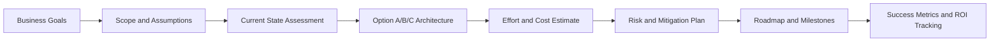

# RFP Response, Solution Architecture, Estimation, and ROI

## Overview

This page provides an interview-ready architecture approach for presales and leadership discussions: responding to RFPs, creating options, estimating effort, comparing build vs buy, showing ROI, and managing assumptions and risks.

## Why this topic matters

Senior architects are expected to connect technical decisions to business outcomes. Interviewers test whether you can convert unclear demand into a delivery-ready plan with realistic effort, cost, and risk transparency.

## Core concepts

- Business problem framing
- Scope and assumptions control
- Current-state assessment
- Target-state architecture options
- Delivery roadmap and phased execution
- Effort estimation model (team, timeline, cost)
- Risk register and mitigation model
- Success metrics and value realization

## Detailed explanation of each concept

### 1) Understand business problem

Define value drivers first: cost reduction, cycle time, risk reduction, revenue uplift, or compliance assurance. Translate into measurable outcomes and constraints.

### 2) Define scope and assumptions

Document in-scope capabilities, out-of-scope boundaries, dependency assumptions, and decision deadlines. This avoids hidden scope growth and protects estimate quality.

### 3) Assess current state

Evaluate architecture baseline, operational bottlenecks, security gaps, and delivery maturity. Separate facts from assumptions and identify data-quality limits.

### 4) Propose target architecture

Present 2-3 options (conservative, balanced, aggressive) with trade-offs in cost, risk, timeline, and scalability. Include governance and security controls in each option.

### 5) Define delivery roadmap

Build a 6-12 month phased roadmap with quick wins, platform foundations, and scale-out phases. Include gates for architecture review and production readiness.

### 6) Estimate team, cost, timeline

Use bottom-up estimation (epics/work packages) plus reference-class adjustments. Provide a range estimate (P50/P80) and confidence level, not a single fixed number.

### 7) Identify risks and mitigations

Track risks by probability, impact, owner, trigger, and mitigation. Include architecture, security, vendor, change-management, and dependency risks.

### 8) Define success metrics

Define leading and lagging indicators: deployment frequency, lead time, defect escape rate, SLA attainment, user adoption, and cost-per-transaction.

## Evaluation (how to assess design quality)

Good solutioning is:

- Business-aligned: clear KPI linkage
- Feasible: realistic constraints and delivery capacity
- Governable: explicit architecture and security controls
- Defensible: transparent assumptions and estimate logic
- Adaptable: phased roadmap with review gates

## Architecture / flow diagram + flow explanation

Flow explanation: each step should be evidence-backed and traceable. Architecture options are evaluated against business outcomes, then converted into estimates and risk-managed roadmap commitments.

## Real-world example

A manufacturing client requests an RFP for AI-enabled service operations. The architecture team proposes three options: incremental modernization, platform-first rebuild, and hybrid transition. They choose the hybrid path based on ROI over 18 months, lower change risk, and faster first-value release in quarter one.

## Best practices

- Use option-based proposals, not a single architecture recommendation.
- Make assumptions explicit and time-bound.
- Present estimate ranges with confidence and drivers.
- Quantify ROI with both cost and productivity metrics.
- Keep a live risk register from proposal through delivery.

## Common mistakes / misconceptions

- Giving a fixed estimate before scope clarity.
- Ignoring organizational readiness and change-management effort.
- Presenting architecture without operational and governance implications.
- Overstating ROI without baseline measurement.
- Treating risk as a one-time proposal artifact.

## Industry relevance

These practices are central for principal/senior architect roles in consulting, enterprise platform teams, and pre-sales architecture leadership.

## Interview discussion points

- How do you respond to an RFP under incomplete requirements?
- How do you structure architecture options for leadership decisions?
- How do you estimate effort and communicate uncertainty?
- How do you compare build vs buy in an enterprise context?
- How do you show ROI and track benefits post go-live?

## Related/dependent links

- `03-QUESTION_BANK/behavioral_and_leadership.md`
- `docs/governance/documentation_blueprinting_delivery_governance.md`
- `docs/migration-architecture/migration_strategies_azure_migrate.md`
- `docs/governance/azure_governance_policy_and_cost_controls.md`
