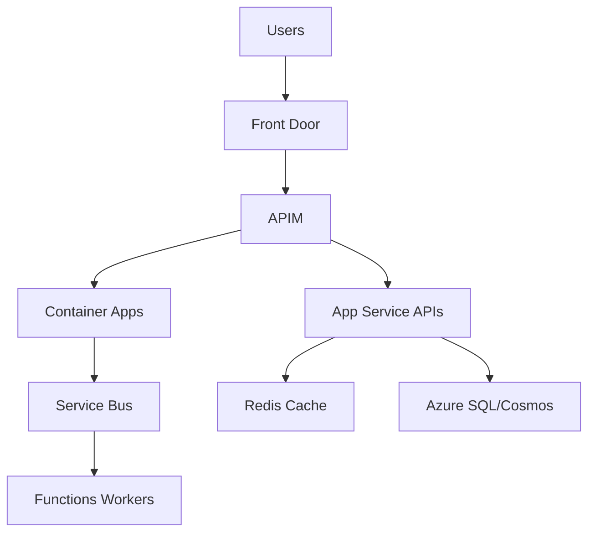

# Compute Architecture Decisions

## Overview
Compute architecture is the execution foundation of cloud systems. The service choice you make here directly affects delivery speed, runtime reliability, team operating effort, and long-term cloud cost. This page explains compute options as architecture decisions, not as isolated services. It focuses on practical decision-making between App Service, AKS, Azure Functions, and Container Apps across enterprise constraints such as compliance, latency, scale volatility, and team maturity.

## Why this topic matters
Senior interviews use compute questions to assess architectural judgment under constraints. You are expected to explain why one option is safer, cheaper, faster, or more governable in a real organization. A strong answer links business requirements to operational consequences. A weak answer only lists features.

This topic also matters because compute is tightly coupled with networking, identity, observability, and integration patterns. Wrong compute choices create downstream issues: unstable releases, expensive scaling, security gaps, and operational overload.

## Core concepts
- App Service
- AKS
- Azure Functions
- Container Apps
- Scaling models
- Reliability patterns

## Detailed explanation of each concept

### App Service
Managed PaaS for web/API workloads. Fast delivery, low operational overhead, standard enterprise hosting.

### AKS
Kubernetes platform for advanced orchestration, custom networking, and deep control. High flexibility and high operational complexity.

### Azure Functions
Event-driven serverless execution for bursty short-lived tasks with consumption economics.

### Container Apps
Container hosting with simpler operations than AKS; good for modern microservices without full Kubernetes burden.

### Scaling
Define autoscaling triggers based on CPU/memory/queue depth/request rates and workload behavior.

### Reliability
Design for retries, circuit breaking, health probes, and graceful degradation.

## Evaluation (How to assess if your compute design is good)

Evaluate compute architecture with measurable indicators:
- **Reliability metrics:** SLO attainment, error rate, restart/failure frequency.
- **Performance metrics:** p95/p99 latency under normal and peak loads.
- **Elasticity metrics:** scale-out time, scale stability, queue drain behavior.
- **Operational metrics:** deployment frequency, mean time to recovery, toil levels.
- **Cost metrics:** cost per request/job and peak-vs-idle efficiency.

A design is strong when these metrics improve together without introducing governance or security regressions.

## Architecture / flow diagram



**Flow explanation:**  
Traffic enters through edge routing, then centralized API governance. Workloads are split by execution style: synchronous APIs on App Service/Container Apps and asynchronous workers via queue-triggered Functions. Cache and durable stores are externalized so instances remain stateless and scalable. This pattern reduces blast radius and supports independent scaling of request path and background processing path.

## Real-world example
A multi-country ecommerce platform started with App Service for storefront and checkout APIs to accelerate release timelines. As product domains grew, teams introduced Container Apps for independently deployable services. Order post-processing and notifications were moved to queue-triggered Functions to decouple user-facing latency from backend workloads.

The team initially considered AKS for all services but delayed it because platform capacity was limited. By deferring AKS and using managed options first, they improved deployment frequency and lowered incident load while preserving a migration path for future advanced orchestration needs.

## Best practices
- Prefer managed PaaS by default.
- Choose AKS only with clear control requirements.
- Define autoscale policy from measured baselines.
- Externalize state and sessions.
- Align compute choices to team operating model, not only technical preference.
- Define rollback and release safety patterns before production launch.

## Common mistakes / misconceptions
- Defaulting all workloads to AKS.
- Ignoring cold start behavior for Functions.
- Coupling apps to local state.
- No scaling/latency test before go-live.
- Optimizing for future scale before proving current workload behavior.
- Treating compute decisions as permanent instead of evolvable architecture stages.

## Industry relevance
Compute architecture is a board-level cost and reliability driver in SaaS, fintech, retail, and healthcare platforms. Organizations with mature compute strategy typically deliver faster, recover from incidents quicker, and maintain better cloud unit economics. In architecture interviews, this topic often differentiates platform thinkers from service-level implementers.

## Interview discussion points
- Control vs complexity
- Cost vs performance
- Team capability vs platform ambition
- Progressive modernization from VM/monolith hosting to managed cloud-native patterns
- Evidence-based scaling and reliability decisions

## Question Answer Format (Use for each question)

For every compute question, answer using:
1. **Question summary** (2-3 lines)
2. **Crisp answer** (7-8 lines)
3. **Deep explanation** (~40 lines)
4. **Simple diagram or flow**
5. **Related topic link(s)**

## Links to dependent / related topics
- [APIM, Messaging, Eventing](../integration/apim_messaging_eventing.md)
- [Security, IAM, Networking](../security/security_iam_networking.md)
- [System Design HLD/LLD](../system-design/system_design_hld_lld.md)

## Interview Questions (50)
1. How do you choose App Service vs AKS vs Container Apps vs Functions?
2. When is AKS justified despite operational overhead?
3. What workloads are poor fit for Functions?
4. How do you scale APIs for unpredictable traffic?
5. How do you select compute based on NFRs?
6. Design compute for seasonal spikes with low idle cost.
7. What anti-patterns indicate wrong compute choice?
8. How does queue depth-driven autoscaling work?
9. How do you externalize state safely?
10. How do you design health probes and readiness checks?
11. How do you manage zero-downtime deployments?
12. How do you decide between horizontal and vertical scaling?
13. How do you protect p99 latency under load?
14. How do you combine compute choices in one architecture?
15. How does private networking influence compute service choice?
16. What are App Service scaling limits to account for?
17. How do you optimize cold start behavior?
18. How do you secure container images and runtime?
19. How does compute choice affect observability strategy?
20. How does compute choice affect DR strategy?
21. What trade-offs exist between managed PaaS and Kubernetes?
22. How do you choose hosting for .NET APIs?
23. How do you choose hosting for Python async services?
24. How do you ensure idempotency in serverless workers?
25. How do you handle long-running jobs in serverless architecture?
26. How does compute choice impact CI/CD complexity?
27. How do you estimate compute cost before go-live?
28. How do you model failure domains in compute architecture?
29. How do you isolate noisy neighbors?
30. How do you design for multi-region active-passive?
31. How do you enforce security baselines across compute services?
32. How do you pick between App Service and Container Apps for APIs?
33. How do you handle background processing in App Service architectures?
34. How do you choose container registry strategy?
35. How do you make scaling decisions evidence-based?
36. How do you avoid vendor lock-in discussions in interviews?
37. How do you balance release speed and reliability?
38. How do you select runtime patching strategy?
39. How do you test autoscaling before production?
40. How do you tune connection pooling for high throughput?
41. How do you design cache strategy with compute architecture?
42. How do you decide when to replatform to AKS?
43. How do you explain compute decisions to business stakeholders?
44. How do you phase migration from VMs to PaaS?
45. How do you handle compliance workloads with managed PaaS?
46. How do you monitor saturation and bottlenecks?
47. How do you set SLO-driven scale policies?
48. How do you design canary/blue-green releases?
49. How do you reduce operational toil in compute platforms?
50. How do you present compute trade-off matrix in interview?

## Answers for important questions (Summary + Crisp + Deep)

### Q1. How do you choose App Service vs AKS vs Container Apps vs Functions?

**Question summary:**  
Interviewers are testing architectural decision quality under real constraints. They want to see service choice based on workload profile, team maturity, and operational model.

**Crisp answer (7-8 lines):**  
Start with workload behavior, not tool preference.  
Use App Service for standard web/API with low ops overhead.  
Use Container Apps for containerized services with simpler operations.  
Use Functions for event-driven, bursty, short-running workloads.  
Use AKS when advanced orchestration and platform control are required.  
Match choice to team operational capability and compliance needs.  
Validate with NFR targets for latency, reliability, and cost.  
Choose simplest platform that safely meets requirements.

**Deep explanation (~40 lines):**  
Compute selection should begin from workload traits: request pattern, statefulness, integration style, scaling volatility, and release cadence. Then map these traits to platform responsibilities your team can realistically operate.

App Service is strong for predictable API workloads where speed and managed operations matter. Container Apps offers container flexibility without full Kubernetes overhead, useful for modern service decomposition with moderate complexity. Functions fit asynchronous and burst-driven workloads when execution boundaries are clear and cold-start tolerance is acceptable.

AKS is powerful but operationally demanding. It is justified when you need deep orchestration control, service mesh patterns, advanced scheduling, or custom networking that managed PaaS options cannot deliver safely.

Compliance and security constraints can shift choices. For example, strict network controls or workload portability requirements may justify higher-complexity platforms.

In interviews, show trade-off reasoning and avoid "AKS for everything" bias. Senior answers emphasize operability and lifecycle cost, not just feature depth.

**Answer summary:**  
Choose compute by workload behavior and operating model maturity. Prefer lowest-complexity platform that meets NFR and compliance requirements with sustainable operations.

**Simple diagram:**  
```text
Workload Traits + Team Maturity + NFRs -> Platform Decision (App Service / Container Apps / Functions / AKS)
```

**Trusted reference links:**  
- https://learn.microsoft.com/en-us/azure/architecture/guide/technology-choices/compute-decision-tree

### Q2. When is AKS justified despite operational overhead?

**Question summary:**  
This checks whether you know when higher platform complexity is worth the cost. Interviewers expect clear justification criteria.

**Crisp answer (7-8 lines):**  
AKS is justified when control needs exceed managed PaaS limits.  
Use it for complex microservice orchestration and custom runtime controls.  
It fits workloads needing advanced networking and policy enforcement.  
It is suitable when platform team can operate Kubernetes reliably.  
Use it when service mesh and multi-container patterns are required.  
Avoid AKS if requirements are mostly standard web/API hosting.  
Justify with measurable benefits over managed alternatives.  
Adopt only with strong SRE and platform engineering readiness.

**Deep explanation (~40 lines):**  
AKS should be chosen for capability-driven reasons, not prestige. Good reasons include advanced workload scheduling, custom ingress/security controls, sidecar-heavy architectures, and platform-level extensibility requirements.

Another valid reason is organizational strategy around standardizing container operations across diverse workloads where PaaS abstractions are too limiting.

Operational readiness is non-negotiable. Without strong observability, patching discipline, incident response, and cluster lifecycle management, AKS can increase risk more than value.

Compare AKS against Container Apps or App Service with concrete metrics: control benefits, deployment flexibility, latency implications, and supportability costs.

In interviews, a mature answer shows both why AKS can be right and why it can be wrong.

**Answer summary:**  
AKS is justified when advanced orchestration and control are essential and the organization has proven ability to run Kubernetes at production quality.

**Simple diagram:**  
```text
Need Advanced Control? + Platform Maturity? -> Yes -> AKS
Else -> Managed PaaS Option
```

**Trusted reference links:**  
- https://learn.microsoft.com/en-us/azure/aks/intro-kubernetes

### Q3. What workloads are poor fit for Functions?

**Question summary:**  
Interviewers test realistic serverless judgment. They want to know where function-based execution creates operational or performance risk.

**Crisp answer (7-8 lines):**  
Functions are weak fit for long-running stateful processing.  
They can struggle with strict low-latency requirements under cold start.  
Heavy sustained compute can become cost-inefficient.  
Complex in-memory state workflows are difficult to manage safely.  
Tight coupling to persistent connections can be problematic.  
Use alternatives for predictable high-throughput always-on services.  
Keep Functions focused on event-driven bounded tasks.  
Choose by execution profile, not by convenience.

**Deep explanation (~40 lines):**  
Functions excel in event-driven burst patterns, but they are less ideal for workloads that require continuous warm state, low jitter latency, or long-running synchronous computation. Cold-start variability can affect user-facing SLAs in latency-sensitive APIs.

Stateful workflows with complex transaction coordination can become fragile if forced into stateless function models without careful orchestration layers.

For sustained high-volume processing, cost and performance profile may favor containerized or dedicated compute options with stable baseline throughput.

Integration patterns matter too. Persistent connections, complex session handling, or strict transaction affinity can be awkward in pure serverless architecture.

In interviews, emphasize workload fit rather than blanket pro/anti serverless positions.

**Answer summary:**  
Functions are poor fit for long-running, stateful, and strict low-latency workloads. They are best for event-driven, bounded, asynchronous execution units.

**Simple diagram:**  
```text
Event-Driven + Short-Lived -> Functions
Long-Running/Stateful/Low-Jitter -> App Service / Container Apps / AKS
```

**Trusted reference links:**  
- https://learn.microsoft.com/en-us/azure/azure-functions/functions-overview

### Q4. How do you scale APIs for unpredictable traffic?

**Question summary:**  
This tests architecture resilience under load volatility. Interviewers expect layered scaling strategy, not autoscale-only answers.

**Crisp answer (7-8 lines):**  
Use multi-layer scaling across edge, app, and async backends.  
Apply autoscale rules from real traffic and queue signals.  
Externalize state to allow horizontal scaling safely.  
Use caching to protect hot read paths.  
Offload expensive tasks asynchronously via queues/events.  
Apply rate limiting and backpressure at gateway layer.  
Test scaling behavior with realistic burst simulations.  
Monitor p95/p99 and tune continuously.

**Deep explanation (~40 lines):**  
Unpredictable traffic requires a scaling architecture, not only bigger instances. Start at edge with global routing and caching where possible. At API tier, keep services stateless and horizontally scalable.

Autoscale triggers should include queue depth and request saturation signals, not just CPU. Async offload patterns decouple user latency from downstream heavy operations.

Gateway throttling and backpressure policies protect system stability during extreme spikes. Without controlled degradation, overload can cascade to core services.

Load testing should include burst profiles, dependency slowness, and recovery behavior. In interviews, strong answers combine scaling with resilience and cost control.

**Answer summary:**  
Scale unpredictable APIs with layered elasticity, stateless design, async offloading, and protective traffic controls validated through burst testing.

**Simple diagram:**  
```text
Traffic Spike -> Edge/Gateway Controls -> Scalable API Tier -> Async Queue Offload -> Worker Scale
```

**Trusted reference links:**  
- https://learn.microsoft.com/en-us/azure/well-architected/performance-efficiency/

### Q5. How do you select compute based on NFRs?

**Question summary:**  
Interviewers test whether your compute decisions are requirement-driven. They expect explicit mapping between NFR targets and platform traits.

**Crisp answer (7-8 lines):**  
Translate NFRs into measurable platform selection criteria first.  
Map latency and throughput targets to scaling behavior needs.  
Map availability goals to resilience and failover capabilities.  
Map security/compliance to networking and identity constraints.  
Map operability to team skill and tooling maturity.  
Map cost targets to runtime profile and utilization patterns.  
Compare candidate platforms with this NFR matrix.  
Choose option that best balances all NFR dimensions.

**Deep explanation (~40 lines):**  
NFR-led compute selection starts with explicit service-level targets: latency percentiles, throughput ceilings, uptime requirements, RTO/RPO, compliance obligations, and cost budgets. These become architecture filters before any platform preference.

Each compute option should be evaluated against these filters. For example, strict low-latency interactive paths may avoid cold-start-prone models. High compliance workloads may require stronger network and isolation capabilities.

Team capability is part of NFR reality. A platform that meets technical targets but exceeds operational maturity can fail in production.

Use a weighted decision matrix and validate assumptions through prototype or benchmark evidence. In interviews, this structured approach signals architect-level rigor.

**Answer summary:**  
Select compute by mapping measurable NFRs to platform capabilities and operational readiness, then choose the best balanced fit.

**Simple diagram:**  
```text
NFR Matrix (Latency/Availability/Security/Cost/Ops) -> Platform Comparison -> Decision
```

**Trusted reference links:**  
- https://learn.microsoft.com/en-us/azure/well-architected/

### Q6. Design compute for seasonal spikes with low idle cost.

**Question summary:**  
Interviewers test elasticity architecture for bursty business demand. They expect cost-aware scaling that protects user experience during peaks.

**Crisp answer (7-8 lines):**  
Use baseline-light architecture with aggressive horizontal elasticity.  
Keep core APIs on managed compute with autoscale policies.  
Offload burst work to queue-driven async workers.  
Use caching and CDN at edge to absorb repeat traffic.  
Scale by queue depth and request saturation signals.  
Apply schedule-based rightsizing for known demand windows.  
Protect downstream systems with throttling and backpressure.  
Design for high peak throughput with low idle footprint.

**Deep explanation (~40 lines):**  
Seasonal workloads require two-mode architecture: economical idle mode and resilient peak mode. Start by identifying which components must remain always-on and which can scale from near-zero to high capacity during bursts.

Managed API tiers should autoscale based on real demand signals, not static thresholds. Background workloads should be decoupled through queues so user-facing latency is insulated from peak processing load.

Caching strategy is crucial. Edge caching and application-level caching reduce repeated compute pressure during predictable demand surges. For known peak periods, pre-warming and temporary capacity reservations can reduce scale lag.

Protect dependencies with rate limits and backpressure to avoid cascading failures when demand exceeds backend processing speed.

In interviews, emphasize that low idle cost and peak reliability are achieved through decoupling, elasticity, and controlled degradation strategy.

**Answer summary:**  
Design seasonal compute with elastic scaling, async offloading, and demand-aware controls so peak traffic is handled reliably without paying high year-round idle cost.

**Simple diagram:**  
```text
Peak Traffic -> Edge Cache/CDN -> Autoscaled API Tier -> Queue -> Autoscaled Workers -> Data Stores
```

**Trusted reference links:**  
- https://learn.microsoft.com/en-us/azure/well-architected/performance-efficiency/

### Q7. What anti-patterns indicate wrong compute choice?

**Question summary:**  
This tests architectural diagnosis skills. Interviewers want to hear symptoms that show platform misfit before major outages or cost blowups.

**Crisp answer (7-8 lines):**  
Frequent scaling failures under expected load are key signals.  
High ops toil for routine deployments indicates platform mismatch.  
Persistent latency jitter may show wrong runtime model choice.  
Over-complex platform for simple workloads is a cost anti-pattern.  
Security controls hard to enforce suggest wrong compute abstraction.  
Frequent workarounds in pipelines indicate poor platform fit.  
If incidents repeat due to platform limitations, re-evaluate choice.  
Compute should reduce complexity, not create it.

**Deep explanation (~40 lines):**  
Wrong compute choice appears as recurring operational friction. Teams spend more time managing platform quirks than delivering features. Symptoms include frequent manual scaling interventions, unstable release behavior, or inability to meet baseline SLOs.

Another anti-pattern is architectural overreach, such as using AKS for simple CRUD APIs where managed PaaS would be safer and cheaper. The opposite also occurs: forcing complex distributed workloads into platforms that lack required control.

Security and compliance friction is a strong signal. If required controls are hard to implement or consistently bypassed, platform alignment should be revisited.

Persistent cost inefficiency is another indicator, especially when simpler alternatives can meet requirements with lower operational burden.

In interviews, explain anti-patterns as measurable signals tied to reliability, security, cost, and team productivity.

**Answer summary:**  
Anti-patterns include repeated reliability issues, high operational toil, forced workarounds, and persistent cost/security friction caused by platform-workload mismatch.

**Simple diagram:**  
```text
Repeated Incidents + High Toil + Cost Drift + Workarounds -> Compute Misfit Signal -> Replatform Assessment
```

**Trusted reference links:**  
- https://learn.microsoft.com/en-us/azure/well-architected/

### Q8. How does queue depth-driven autoscaling work?

**Question summary:**  
Interviewers assess practical scaling mechanics for async systems. They expect control-loop thinking, not generic autoscale statements.

**Crisp answer (7-8 lines):**  
Queue depth reflects pending workload pressure directly.  
Scale workers out when backlog exceeds defined thresholds.  
Use drain-rate targets to align scale with SLA goals.  
Combine queue depth with processing latency for accuracy.  
Add cooldown and max limits to avoid scaling thrash.  
Scale in gradually when backlog remains low.  
Monitor dead-letter and retry patterns with autoscale events.  
Tune thresholds from real production traffic behavior.

**Deep explanation (~40 lines):**  
Queue depth-driven scaling is effective because it measures actual workload waiting to be processed. Unlike CPU-only scaling, it captures demand even when workers are idle due to throttled dependencies or blocked downstream services.

Define target drain time as business requirement (for example, clear backlog in N minutes). Then derive worker count and thresholds from observed processing rates.

Use anti-thrashing controls: cooldown windows, minimum/maximum worker boundaries, and safe scale-in policies. Include error and dead-letter signals so scaling does not amplify failing workloads.

Autoscale behavior should be validated under burst simulations and dependency slowdowns. In interviews, connect queue depth scaling to SLO-backed processing guarantees.

**Answer summary:**  
Queue-depth autoscaling aligns worker capacity to real pending demand and SLA drain targets, improving async reliability and cost efficiency.

**Simple diagram:**  
```text
Queue Backlog -> Autoscale Controller -> Worker Count Adjustment -> Backlog Drain
```

**Trusted reference links:**  
- https://learn.microsoft.com/en-us/azure/architecture/patterns/queue-based-load-leveling

### Q9. How do you externalize state safely?

**Question summary:**  
This tests cloud-native scalability fundamentals. Interviewers expect stateless compute design with controlled state persistence and consistency boundaries.

**Crisp answer (7-8 lines):**  
Keep runtime services stateless whenever possible.  
Move session and workflow state to managed data stores.  
Use Redis for short-lived state and caching patterns.  
Use relational or NoSQL stores for durable domain state.  
Protect state stores with identity and network controls.  
Define consistency and transaction boundaries explicitly.  
Avoid local disk/state dependencies in compute instances.  
Stateless services scale and recover more reliably.

**Deep explanation (~40 lines):**  
Externalizing state removes scaling and failover constraints tied to individual instances. Stateless service instances can be replaced or scaled without data loss when state is persisted in managed stores.

Choose state stores by durability and access pattern. Ephemeral session state can use cache systems, while business-critical state should use durable databases with backup and consistency controls.

Security is part of safe externalization: private connectivity, managed identity auth, encryption, and access scoping must be enforced. Also model state consistency explicitly to avoid hidden race conditions under scale.

In interviews, show that state externalization is both scaling enabler and resilience requirement.

**Answer summary:**  
Externalize state by keeping compute stateless and persisting session/domain data in secure managed stores with explicit consistency design.

**Simple diagram:**  
```text
Stateless App Instances -> External State Stores (Cache + DB) -> Horizontal Scale + Fast Recovery
```

**Trusted reference links:**  
- https://learn.microsoft.com/en-us/azure/architecture/patterns/cache-aside

### Q10. How do you design health probes and readiness checks?

**Question summary:**  
Interviewers test runtime reliability design. They expect probe strategy that prevents bad instances from serving traffic and improves recovery behavior.

**Crisp answer (7-8 lines):**  
Use separate liveness and readiness checks with clear purpose.  
Liveness detects stuck processes and triggers restart actions.  
Readiness ensures instance can safely receive traffic.  
Include dependency-aware checks with timeout boundaries.  
Avoid expensive probe logic that creates self-inflicted load.  
Tune failure thresholds to avoid false-positive flapping.  
Integrate probe states with load balancer routing.  
Validate probe behavior under startup and failure scenarios.

**Deep explanation (~40 lines):**  
Probe design affects availability directly. Liveness checks should verify process health without depending on fragile external dependencies. Readiness checks should confirm that the instance is initialized and capable of handling requests correctly.

Dependency checks must be selective. If every transient downstream issue marks all instances unhealthy, availability collapses. Use bounded checks and graceful degradation logic.

Probe intervals and thresholds should be tuned to startup time and normal variability. Poor settings cause restart storms or delayed recovery.

In interviews, show that probes are part of traffic safety architecture, not simple ping endpoints.

**Answer summary:**  
Design liveness and readiness probes with distinct intent, dependency-aware logic, and tuned thresholds to ensure safe traffic routing and fast recovery.

**Simple diagram:**  
```text
Instance -> Liveness Check (restart control) + Readiness Check (traffic eligibility) -> Load Balancer Routing
```

**Trusted reference links:**  
- https://learn.microsoft.com/en-us/azure/well-architected/reliability/

### Q31. How do you enforce security baselines across compute services?

**Question summary:**  
Interviewers test whether security consistency is architecture-driven, not team-by-team optional. They expect baseline enforcement across mixed compute types.

**Crisp answer (7-8 lines):**  
Define common compute security baseline once, enforce everywhere.  
Use policy controls for identity, logging, and network defaults.  
Mandate managed identity and secretless access patterns.  
Enforce private connectivity for sensitive dependencies.  
Standardize image/runtime hardening and patch cadence.  
Integrate baseline checks into CI/CD deployment gates.  
Track baseline drift and remediation SLA continuously.  
Security consistency requires automation plus governance.

**Deep explanation (~40 lines):**  
Security baseline enforcement must span all compute models—App Service, Functions, Container Apps, and AKS—so teams do not create inconsistent risk profiles. Baseline controls should include authentication model, network exposure policy, logging requirements, encryption posture, and runtime hardening.

Policy-as-code should enforce non-negotiable controls at platform scopes. CI/CD should validate application-level controls before deployment reaches runtime environments.

Managed identity adoption and secret management controls are central. Hardcoded credentials and broad role assignments are common regressions in fast-moving teams.

Drift detection should be continuous, with clear remediation ownership and SLA. In interviews, emphasize that secure compute at scale is a product of standardization and automation.

**Answer summary:**  
Enforce compute security baselines through policy, pipeline gates, identity standards, and continuous drift remediation across all runtime platforms.

**Simple diagram:**  
```text
Security Baseline -> Policy + CI/CD Gates -> Runtime Enforcement -> Drift Monitoring -> Remediation
```

**Trusted reference links:**  
- https://learn.microsoft.com/en-us/azure/architecture/guide/security/

### Q32. How do you pick between App Service and Container Apps for APIs?

**Question summary:**  
This checks practical platform selection for common API workloads. Interviewers expect nuanced trade-off decisions, not default preferences.

**Crisp answer (7-8 lines):**  
Use App Service for standard enterprise APIs needing fast delivery.  
Use Container Apps when container packaging and sidecar patterns matter.  
App Service minimizes ops complexity for common API stacks.  
Container Apps offers more runtime flexibility with moderate ops overhead.  
Assess networking, scaling, and release model requirements.  
Match choice to team capability and support model.  
Evaluate cost under expected traffic patterns.  
Select platform that best fits operational reality.

**Deep explanation (~40 lines):**  
App Service is typically best for straightforward API workloads where managed runtime, integrated scaling, and low ops burden are priorities. Container Apps is attractive when APIs are delivered as containers, need fine runtime dependency control, or benefit from container-native scale behavior.

Decision factors include deployment model, environment consistency, security controls, startup behavior, and debugging workflows. App Service often speeds onboarding; Container Apps can improve portability and composability.

Cost and support model matter. The better platform is the one teams can operate reliably under real business pressure.

In interviews, show decision matrix thinking rather than blanket recommendation.

**Answer summary:**  
Choose App Service for simplicity and speed; choose Container Apps for container-native flexibility with manageable operational complexity.

**Simple diagram:**  
```text
API Requirements -> Simplicity Priority? -> App Service : Container Flexibility Needed? -> Container Apps
```

**Trusted reference links:**  
- https://learn.microsoft.com/en-us/azure/app-service/overview  
- https://learn.microsoft.com/en-us/azure/container-apps/overview

### Q33. How do you handle background processing in App Service architectures?

**Question summary:**  
Interviewers test async architecture quality for API-first systems. They expect reliable decoupling patterns rather than inline heavy processing.

**Crisp answer (7-8 lines):**  
Keep API request path lightweight and user-responsive.  
Offload heavy work to queues and background workers.  
Use durable messaging with retry and dead-letter handling.  
Make workers idempotent for duplicate-safe processing.  
Track job status via async orchestration patterns.  
Scale worker tier independently from API tier.  
Add observability with correlation IDs end to end.  
Background design should protect API latency SLOs.

**Deep explanation (~40 lines):**  
Inline processing in API threads increases latency and failure coupling. Decoupling through queue-based background processing improves reliability and responsiveness, especially under peak traffic.

Architecture should define command submission pattern, job status retrieval pattern, and retry/compensation strategy. Workers should be independently scalable and idempotent.

Dead-letter queues and replay tooling are essential for operational recovery. Include end-to-end tracing to debug async workflows quickly.

In interviews, frame background processing as latency protection and resilience pattern.

**Answer summary:**  
Handle background processing by decoupling API calls from heavy tasks via durable messaging, idempotent workers, and independent scaling.

**Simple diagram:**  
```text
API Request -> Queue -> Background Worker -> Result Store/Notification
```

**Trusted reference links:**  
- https://learn.microsoft.com/en-us/azure/architecture/patterns/queue-based-load-leveling

### Q34. How do you choose container registry strategy?

**Question summary:**  
This tests supply chain and platform architecture planning. Interviewers expect registry strategy tied to security, scale, and environment isolation.

**Crisp answer (7-8 lines):**  
Select registry model based on security and ownership boundaries.  
Use private registry with environment and role-based access controls.  
Decide shared vs segmented registries by risk profile.  
Enable image scanning, signing, and retention policies.  
Align replication with multi-region recovery needs.  
Integrate registry controls into CI/CD promotion flow.  
Audit pull/push events for traceability.  
Registry strategy is part of platform security architecture.

**Deep explanation (~40 lines):**  
Container registry is a core control point in software supply chain. Strategy should define tenancy model, access boundaries, artifact retention, and promotion workflow.

Shared registries simplify central governance but can widen blast radius if controls are weak. Segmented registries improve isolation for sensitive domains.

Security controls include vulnerability scanning, signature verification, immutability policies, and least-privilege access. Multi-region replication may be required for resilience.

In interviews, show that registry design is not just storage—it is deployment trust architecture.

**Answer summary:**  
Choose registry strategy by balancing isolation, governance simplicity, supply-chain security, and operational resilience requirements.

**Simple diagram:**  
```text
Build -> Scan/Sign -> Registry -> Promotion Gates -> Runtime Pull
```

**Trusted reference links:**  
- https://learn.microsoft.com/en-us/azure/container-registry/container-registry-intro

### Q35. How do you make scaling decisions evidence-based?

**Question summary:**  
Interviewers assess data-driven architecture behavior. They expect scaling policy built from measured system behavior, not assumptions.

**Crisp answer (7-8 lines):**  
Baseline workload with production-like telemetry first.  
Define scaling triggers tied to SLO-relevant indicators.  
Use load tests to validate trigger thresholds safely.  
Track false-scale and missed-scale events over time.  
Correlate scaling behavior with latency and error outcomes.  
Adjust policies iteratively with change control discipline.  
Document assumptions and threshold rationale explicitly.  
Evidence-based scaling reduces cost and incident risk.

**Deep explanation (~40 lines):**  
Scaling should be informed by observed traffic patterns, dependency behavior, and business SLOs. Identify leading indicators for saturation—queue depth, request concurrency, latency growth, and error rates.

Run load profiles that match expected and extreme scenarios. Use outcomes to tune trigger points, cooldowns, and max/min capacity settings.

Operational feedback loops are critical. Track over-scaling waste and under-scaling incidents, then adjust safely with canary policy rollout.

In interviews, emphasize scaling as continuous optimization under governance controls.

**Answer summary:**  
Make scaling decisions using telemetry, controlled load testing, and iterative policy tuning linked to SLO outcomes and cost signals.

**Simple diagram:**  
```text
Telemetry + Load Tests -> Scaling Policy -> Runtime Outcomes -> Policy Refinement
```

**Trusted reference links:**  
- https://learn.microsoft.com/en-us/azure/well-architected/performance-efficiency/

### Q36. How do you avoid vendor lock-in discussions in interviews?

**Question summary:**  
This tests communication maturity and architecture pragmatism. Interviewers expect balanced response, not ideological anti-cloud arguments.

**Crisp answer (7-8 lines):**  
Acknowledge lock-in as trade-off, not binary problem.  
Explain where managed services provide strategic value.  
Identify portability boundaries for critical business logic.  
Use open standards where they add practical resilience.  
Document exit strategy for high-risk dependencies.  
Prioritize business outcomes over theoretical portability.  
Avoid over-engineering for unlikely migration scenarios.  
Show risk-aware, pragmatic decision framework.

**Deep explanation (~40 lines):**  
Every cloud architecture has some dependency profile. The goal is not zero lock-in; the goal is informed lock-in where business value outweighs migration cost risk.

Classify dependencies by strategic sensitivity. For low-risk capabilities, managed services can accelerate delivery significantly. For high-risk core domains, preserve portability where feasible through architecture boundaries and data design.

Include exit considerations in architecture decisions without sacrificing current delivery value. In interviews, this balanced framing demonstrates senior-level pragmatism.

**Answer summary:**  
Handle lock-in concerns with pragmatic trade-off analysis: accept useful dependencies, protect critical boundaries, and maintain realistic exit options.

**Simple diagram:**  
```text
Dependency Value vs Migration Risk -> Managed Choice / Portability Guardrail
```

**Trusted reference links:**  
- https://learn.microsoft.com/en-us/azure/well-architected/

### Q37. How do you balance release speed and reliability?

**Question summary:**  
Interviewers test delivery governance maturity. They expect controlled acceleration patterns, not speed-at-all-costs mindset.

**Crisp answer (7-8 lines):**  
Use progressive delivery with reliability gates in pipeline.  
Automate tests and policy checks before promotion.  
Use canary/blue-green to reduce release blast radius.  
Tie release decisions to SLO and error budget signals.  
Require rollback readiness for every high-risk release.  
Separate urgent fixes from standard release flow controls.  
Track change failure rate and recovery time metrics.  
Speed and reliability improve together with disciplined automation.

**Deep explanation (~40 lines):**  
Release speed and reliability are not opposing goals when delivery systems are well designed. Progressive release patterns, automated quality gates, and observability-driven promotion criteria allow faster safe change.

Error budgets and change-failure metrics create objective guardrails for release cadence decisions. Teams can accelerate when reliability is healthy and tighten controls when risk rises.

Operational readiness (runbooks, rollback automation, ownership clarity) is essential for maintaining confidence at high deployment frequency.

In interviews, emphasize system-level release governance over hero-driven deployment culture.

**Answer summary:**  
Balance speed and reliability through automated quality gates, progressive rollout, SLO-aware release policy, and robust rollback preparedness.

**Simple diagram:**  
```text
Code -> Automated Gates -> Progressive Rollout -> SLO Check -> Promote/Rollback
```

**Trusted reference links:**  
- https://learn.microsoft.com/en-us/azure/well-architected/operational-excellence/

### Q38. How do you select runtime patching strategy?

**Question summary:**  
This tests platform maintenance planning. Interviewers expect risk-based patching approach aligned to availability and compliance needs.

**Crisp answer (7-8 lines):**  
Classify workloads by criticality and patch urgency requirements.  
Prefer managed platform patching where suitable.  
For container runtimes, patch through image rebuild pipelines.  
Use staged rollout with canary validation before broad patching.  
Track patch compliance and vulnerability age metrics.  
Plan maintenance windows for stateful sensitive workloads.  
Automate rollback path for patch regressions.  
Patching must balance security and service continuity.

**Deep explanation (~40 lines):**  
Runtime patching strategy should start with vulnerability severity and workload criticality matrix. Managed platforms reduce patching burden, but application-level dependencies still require controlled update pipelines.

Containerized environments should patch via immutable image rebuild rather than in-place mutation. Validate patched artifacts through functional and performance checks before promotion.

Patch governance should include compliance reporting, exception handling, and escalation for overdue high-risk vulnerabilities.

In interviews, show patching as continuous reliability-security lifecycle.

**Answer summary:**  
Select patching strategy using risk-tiered cadence, immutable updates where possible, staged rollout, and measurable compliance tracking.

**Simple diagram:**  
```text
Vulnerability Intake -> Patch Build/Test -> Canary Deploy -> Broad Rollout -> Compliance Tracking
```

**Trusted reference links:**  
- https://learn.microsoft.com/en-us/azure/security/fundamentals/patch-management

### Q39. How do you test autoscaling before production?

**Question summary:**  
Interviewers test pre-production reliability engineering. They expect realistic validation of scaling triggers and stability.

**Crisp answer (7-8 lines):**  
Run controlled load tests with realistic traffic patterns.  
Validate trigger thresholds, cooldowns, and max/min settings.  
Test dependency slowness and failure scenarios under scale.  
Measure scale-out delay and recovery behavior explicitly.  
Check for oscillation or thrashing under variable load.  
Verify SLO impact during and after scaling events.  
Record findings and refine scaling policies iteratively.  
Promote only after stable scaling behavior is proven.

**Deep explanation (~40 lines):**  
Autoscaling validation should simulate both expected demand and stress conditions. Include burst events, sustained load, and dependency degradation scenarios to evaluate controller behavior thoroughly.

Measure response time from trigger activation to capacity availability. Validate that scaling improves SLO outcomes without creating instability or runaway costs.

Observe scale-in behavior carefully; aggressive scale-in can cause repeated churn and latency spikes. Use tuning cycles with evidence capture before production promotion.

In interviews, emphasize autoscaling as tested control loop, not configuration checkbox.

**Answer summary:**  
Test autoscaling through realistic load scenarios, stage-level metrics, and stability checks to ensure scaling improves reliability before go-live.

**Simple diagram:**  
```text
Load Scenarios -> Autoscale Response Metrics -> Stability Analysis -> Policy Tuning -> Production
```

**Trusted reference links:**  
- https://learn.microsoft.com/en-us/azure/architecture/best-practices/auto-scaling

### Q40. How do you tune connection pooling for high throughput?

**Question summary:**  
This tests runtime efficiency and dependency management. Interviewers expect practical handling of connection limits and contention behavior.

**Crisp answer (7-8 lines):**  
Size pools based on concurrency and dependency limits.  
Reuse connections to avoid setup overhead under load.  
Set timeouts and max connections with workload evidence.  
Monitor saturation, wait time, and timeout failures.  
Align pool settings with autoscaling behavior.  
Protect downstream systems from connection storms.  
Tune per service path, not one global default.  
Connection pooling is critical for stable throughput.

**Deep explanation (~40 lines):**  
Connection pooling directly affects throughput, latency, and dependency stability. Overly small pools create queueing delays; overly large pools can overwhelm databases or external services.

Tune with production-like concurrency data and dependency capacity constraints. Include timeout and retry behavior to prevent cascading failures during contention.

Scaling events can multiply connection demand rapidly, so pool strategy should account for total fleet behavior, not per-instance settings alone.

In interviews, demonstrate that connection tuning is a system-wide capacity control.

**Answer summary:**  
Tune connection pooling using concurrency evidence, dependency limits, and scaling-aware safeguards to maintain high throughput and stable downstream behavior.

**Simple diagram:**  
```text
Request Concurrency -> Connection Pool -> Dependency Capacity -> Throughput/Latency Outcome
```

**Trusted reference links:**  
- https://learn.microsoft.com/en-us/azure/architecture/best-practices/performance-efficiency

### Q41. How do you design cache strategy with compute architecture?

**Question summary:**  
Interviewers test whether you treat cache as architectural layer, not afterthought. They expect workload-specific caching patterns aligned with consistency and cost.

**Crisp answer (7-8 lines):**  
Design cache by access pattern, freshness needs, and failure impact.  
Use edge cache for static and repeatable response paths.  
Use application cache for hot read data with TTL policies.  
Define invalidation strategy with source-of-truth ownership.  
Avoid caching sensitive or authorization-variant data unsafely.  
Measure hit rate, stale rate, and latency improvement.  
Plan fallback behavior when cache is unavailable.  
Cache should improve speed without compromising correctness.

**Deep explanation (~40 lines):**  
Cache strategy should be tied to compute placement and request path economics. High-throughput APIs benefit from reducing repeated backend calls, but cache correctness must be engineered deliberately.

Choose cache tiers by data type: CDN for static content, distributed in-memory cache for dynamic shared reads, and local short-lived cache for low-risk hot paths. Define TTL and invalidation based on freshness tolerance and business impact.

Consistency strategy is critical. Write-through, cache-aside, and explicit invalidation patterns should be selected per workload behavior. Sensitive or user-specific data requires scoped keys and strict access controls.

In interviews, emphasize that caching is a reliability and cost tool when combined with robust invalidation and observability.

**Answer summary:**  
Design cache as a first-class architecture layer with explicit freshness, invalidation, and failure handling to improve performance safely.

**Simple diagram:**  
```text
Request -> Cache Layer (edge/app) -> Hit/Miss -> Source of Truth -> Cache Update
```

**Trusted reference links:**  
- https://learn.microsoft.com/en-us/azure/architecture/patterns/cache-aside

### Q42. How do you decide when to replatform to AKS?

**Question summary:**  
This tests platform evolution judgment. Interviewers expect criteria for moving from managed services to Kubernetes only when justified.

**Crisp answer (7-8 lines):**  
Replatform to AKS only when clear capability gaps persist.  
Confirm managed options cannot meet control or orchestration needs.  
Validate organizational readiness for Kubernetes operations.  
Estimate full migration and ongoing platform cost.  
Pilot with one domain before broad migration commitment.  
Define measurable success criteria for replatform decision.  
Keep rollback and coexistence strategy during transition.  
Migrate for business value, not platform trend.

**Deep explanation (~40 lines):**  
Replatforming should follow evidence of sustained constraints in existing platforms: advanced networking requirements, sidecar patterns, custom scheduling, multi-service operational consistency, or policy control depth not feasible otherwise.

Assess readiness across tooling, skills, on-call maturity, and security operations. AKS introduces substantial lifecycle responsibilities, so migration should not be attempted without platform support capability.

Use pilot migration to validate assumptions and hidden complexity. Compare outcomes against clear goals such as reliability, deployment control, or cost efficiency.

In interviews, show disciplined decision-making and avoid "AKS as default destination."

**Answer summary:**  
Replatform to AKS when capability needs and operational readiness are both proven, with pilot validation and clear success metrics.

**Simple diagram:**  
```text
Capability Gap Evidence + Ops Readiness -> AKS Pilot -> Success Criteria -> Scale Migration
```

**Trusted reference links:**  
- https://learn.microsoft.com/en-us/azure/aks/intro-kubernetes

### Q43. How do you explain compute decisions to business stakeholders?

**Question summary:**  
Interviewers test communication across technical and business audiences. They expect value/risk framing, not service-level jargon.

**Crisp answer (7-8 lines):**  
Translate compute choices into business outcomes and risks.  
Explain impact on time-to-market, reliability, and cost.  
Use trade-off comparisons with clear non-technical language.  
Highlight delivery and operational implications transparently.  
Show risk mitigation and fallback plans for each option.  
Use data from benchmarks and incidents to support decision.  
Provide recommendation with decision timeline and owners.  
Stakeholder trust comes from clarity and evidence.

**Deep explanation (~40 lines):**  
Business stakeholders care about delivery speed, service stability, cost exposure, and compliance risk. Frame compute decisions around these dimensions rather than platform feature lists.

Present options side by side with impact statements and decision consequences. Include what changes for teams, expected operating cost, and risk profile under each option.

Use concise visuals and evidence from tests or operational history. Decision confidence increases when architecture rationale is traceable and measurable.

In interviews, demonstrate that senior architects align technology decisions with business accountability.

**Answer summary:**  
Explain compute choices through outcome-focused trade-offs with clear risk, cost, and delivery implications backed by evidence.

**Simple diagram:**  
```text
Compute Option -> Business Impact (Speed/Reliability/Cost/Risk) -> Decision
```

**Trusted reference links:**  
- https://learn.microsoft.com/en-us/azure/well-architected/

### Q44. How do you phase migration from VMs to PaaS?

**Question summary:**  
This tests modernization strategy. Interviewers expect incremental migration with risk control and measurable value per phase.

**Crisp answer (7-8 lines):**  
Start with app portfolio assessment and dependency mapping.  
Prioritize low-risk, high-value candidates for early migration.  
Use strangler or side-by-side patterns for transition safety.  
Externalize state and decouple integrations progressively.  
Validate performance, security, and cost after each wave.  
Retire legacy components only after stability confirmation.  
Capture migration playbook improvements iteratively.  
Phase migration to reduce disruption and accelerate learning.

**Deep explanation (~40 lines):**  
VM-to-PaaS migration should be organized as a wave-based modernization program. Begin with inventory and classify workloads by complexity, business criticality, and cloud readiness.

Early waves should target services where PaaS benefits are immediate and migration risk is manageable. Use coexistence strategies to avoid all-at-once cutovers.

Technical priorities include state externalization, identity modernization, and integration decoupling. After each wave, measure operational outcomes and update migration standards.

In interviews, show migration as controlled transformation rather than lift-and-shift relabeling.

**Answer summary:**  
Phase VM-to-PaaS migration with readiness-based waves, coexistence patterns, and continuous validation to reduce risk and improve modernization velocity.

**Simple diagram:**  
```text
Portfolio Assessment -> Wave Plan -> Coexistence Migration -> Validation -> Legacy Retirement
```

**Trusted reference links:**  
- https://learn.microsoft.com/en-us/azure/cloud-adoption-framework/

### Q45. How do you handle compliance workloads with managed PaaS?

**Question summary:**  
Interviewers test whether you can satisfy strict controls while using managed services. They expect architecture and governance integration.

**Crisp answer (7-8 lines):**  
Map compliance controls to managed service capabilities first.  
Use private networking and identity-first access patterns.  
Enforce logging, retention, and audit evidence requirements.  
Restrict regions and SKUs per policy and regulation scope.  
Apply encryption and key governance consistently.  
Use risk-tiered validation and human approval where needed.  
Document shared responsibility boundaries clearly.  
Managed PaaS can be compliant with correct control design.

**Deep explanation (~40 lines):**  
Compliance workloads on managed PaaS require explicit control mapping. Understand where provider controls end and customer responsibilities begin. Then enforce missing controls through policy, architecture patterns, and operations.

Use private endpoints, strict RBAC, logging baselines, and key management standards. Validate data residency and retention posture per regulation.

Evidence generation is essential: access logs, policy compliance reports, and operational audit trails must be available and reviewable.

In interviews, show confidence that managed services are viable for compliance when governance is rigorously engineered.

**Answer summary:**  
Compliance on managed PaaS is achieved by control mapping, secure architecture defaults, and auditable operations across shared responsibility boundaries.

**Simple diagram:**  
```text
Regulation Controls -> PaaS Capability Mapping -> Policy/Architecture Enforcement -> Audit Evidence
```

**Trusted reference links:**  
- https://learn.microsoft.com/en-us/azure/compliance/

### Q46. How do you monitor saturation and bottlenecks?

**Question summary:**  
Interviewers evaluate operational diagnosis maturity. They expect proactive bottleneck detection across compute and dependencies.

**Crisp answer (7-8 lines):**  
Define saturation indicators for each critical service tier.  
Track CPU, memory, queue lag, connection wait, and latency.  
Correlate application and infrastructure telemetry with traces.  
Set threshold alerts before user impact occurs.  
Use dependency-level dashboards for bottleneck localization.  
Run periodic capacity reviews using real traffic patterns.  
Capture top recurring bottleneck classes and fixes.  
Saturation monitoring should drive scaling and redesign actions.

**Deep explanation (~40 lines):**  
Saturation detection requires tier-specific observability, not a single utilization metric. Compute bottlenecks often surface first in queue growth, latency creep, and connection contention before hard failures occur.

Map each critical request path to telemetry sources and establish early-warning thresholds. Correlation between traces and infrastructure metrics helps isolate root causes quickly.

Capacity reviews should be routine and feed planning decisions. Repeated bottlenecks signal architectural limits, not just scaling gaps.

In interviews, emphasize proactive detection and action loops over reactive alert handling.

**Answer summary:**  
Monitor saturation through path-level telemetry, early threshold alerts, and dependency-aware diagnosis to trigger timely scaling or design changes.

**Simple diagram:**  
```text
Telemetry (App + Infra + Queue) -> Saturation Signals -> Bottleneck Diagnosis -> Action
```

**Trusted reference links:**  
- https://learn.microsoft.com/en-us/azure/azure-monitor/overview

### Q47. How do you set SLO-driven scale policies?

**Question summary:**  
This tests reliability engineering alignment between scaling and user-facing objectives. Interviewers expect SLO-first control logic.

**Crisp answer (7-8 lines):**  
Start from user-impact SLO targets, not infrastructure defaults.  
Map SLOs to leading saturation indicators and trigger thresholds.  
Set scale-out before SLO breach, not after outage symptoms.  
Tune scale-in with stability and cost guardrails.  
Validate policy under realistic load and dependency stress.  
Track SLO burn rate against scaling behavior.  
Refine thresholds through operational feedback loops.  
Scale policy should protect SLOs predictably.

**Deep explanation (~40 lines):**  
SLO-driven scaling begins with clear service-level objectives and error budgets. Determine which metrics best predict SLO degradation—latency, queue delay, error rate, or concurrency saturation.

Configure proactive scale-out triggers with sufficient lead time. Scale-in should prioritize stability to avoid oscillation and performance jitter.

Test policies under stress conditions and validate that scaling actions materially protect SLO targets. Use burn-rate analysis to adjust thresholds and capacity ranges.

In interviews, show that scaling is reliability control, not only cost response.

**Answer summary:**  
Set scale policies from SLO protection goals using predictive indicators, validated thresholds, and ongoing reliability-feedback tuning.

**Simple diagram:**  
```text
SLO Target -> Trigger Metrics -> Scale Policy -> Runtime SLO Outcome -> Policy Tuning
```

**Trusted reference links:**  
- https://learn.microsoft.com/en-us/azure/well-architected/reliability/

### Q48. How do you design canary/blue-green releases?

**Question summary:**  
Interviewers test release risk control architecture. They expect clear strategy selection and promotion/rollback discipline.

**Crisp answer (7-8 lines):**  
Choose canary for gradual risk exposure and learning.  
Choose blue-green for deterministic cutover and quick rollback.  
Define health and business metrics as promotion gates.  
Keep schema/API compatibility during coexistence window.  
Automate traffic shift and rollback actions where possible.  
Use targeted cohorts for early canary confidence building.  
Document runbook steps and ownership clearly.  
Release pattern should match workload risk profile.

**Deep explanation (~40 lines):**  
Canary and blue-green are both safe-release patterns with different operational trade-offs. Canary excels when incremental telemetry-guided rollout is needed. Blue-green simplifies rollback and change isolation but may need duplicate environment capacity.

Promotion decisions should be metric-driven: latency, errors, saturation, and key business indicators. Compatibility handling is essential to prevent partial rollout failure.

Automation reduces human error during traffic shifts. Include clear manual override procedures for incident response.

In interviews, show pattern selection based on risk, cost, and system characteristics.

**Answer summary:**  
Design canary/blue-green releases with metric gates, compatibility-safe transitions, and automated rollback to reduce deployment risk.

**Simple diagram:**  
```text
New Version -> Canary/Blue-Green Path -> Metrics Gate -> Promote or Rollback
```

**Trusted reference links:**  
- https://learn.microsoft.com/en-us/azure/architecture/patterns/canary-release

### Q49. How do you reduce operational toil in compute platforms?

**Question summary:**  
Interviewers assess platform engineering efficiency mindset. They expect automation and standardization to reduce repetitive manual work.

**Crisp answer (7-8 lines):**  
Identify high-frequency manual tasks and automate first.  
Standardize platform templates and runbooks across teams.  
Implement self-service operations with policy guardrails.  
Reduce alert noise through SLO-aligned alerting design.  
Use auto-remediation for common safe failure classes.  
Track toil metrics and time recovered from automation.  
Continuously simplify workflows and ownership boundaries.  
Toil reduction improves reliability and team velocity.

**Deep explanation (~40 lines):**  
Operational toil is repeated manual effort that does not create lasting value. Start by quantifying toil sources: repetitive incident handling, manual scaling actions, and inconsistent deployment steps.

Automation should target high-volume, low-risk tasks first. Combine with template standardization and self-service interfaces to reduce central team dependence.

Alert quality is another major toil driver. SLO-aligned alerts and meaningful runbooks reduce unnecessary wake-ups and context switching.

In interviews, position toil reduction as reliability and productivity strategy, not convenience optimization.

**Answer summary:**  
Reduce toil through automation, standardization, self-service controls, and high-signal operations practices that free teams for higher-value engineering work.

**Simple diagram:**  
```text
Toil Inventory -> Automation + Standardization -> Lower Manual Load -> Higher Reliability/Velocity
```

**Trusted reference links:**  
- https://learn.microsoft.com/en-us/azure/well-architected/operational-excellence/

### Q50. How do you present compute trade-off matrix in interview?

**Question summary:**  
This tests executive-level communication of technical choices. Interviewers expect structured, concise, and evidence-backed comparison.

**Crisp answer (7-8 lines):**  
Build matrix around NFR, cost, control, and ops complexity.  
Compare each compute option against same criteria.  
State assumptions and workload context explicitly.  
Highlight top risks and mitigation per option.  
Recommend best-fit option with rationale, not feature list.  
Include fallback option if assumptions change.  
Keep matrix simple enough for quick decision-making.  
Strong matrix shows clarity, trade-offs, and ownership.

**Deep explanation (~40 lines):**  
A compute trade-off matrix should make decisions easier, not create complexity. Start with 4-6 evaluation dimensions that matter most for the scenario: performance, resilience, security/compliance fit, operational burden, and cost profile.

Score options consistently and explain scoring assumptions transparently. Include key risks and mitigation strategy for each option so decision-makers understand consequences.

End with a recommendation and what could change that recommendation in future. This demonstrates adaptable architecture thinking.

In interviews, this structure signals senior-level decision communication.

**Answer summary:**  
Present compute trade-offs through a consistent criteria matrix with explicit assumptions, risk visibility, and a clear recommendation.

**Simple diagram:**  
```text
Criteria Matrix (NFR + Cost + Ops + Risk) -> Option Scores -> Recommendation + Fallback
```

**Trusted reference links:**  
- https://learn.microsoft.com/en-us/azure/well-architected/

### Q21. What trade-offs exist between managed PaaS and Kubernetes?

**Question summary:**  
This tests platform strategy maturity. Interviewers want clear reasoning on control versus operational burden.

**Crisp answer (7-8 lines):**  
Managed PaaS gives faster delivery and lower operations overhead.  
Kubernetes gives deeper runtime and orchestration control.  
PaaS is ideal for standard web/API and predictable patterns.  
Kubernetes fits advanced multi-service platform requirements.  
PaaS limits flexibility but improves consistency and speed.  
Kubernetes expands flexibility but increases engineering cost.  
Choose based on workload complexity and team maturity.  
Default to simplest option that meets requirements.

**Deep explanation (~40 lines):**  
The core trade-off is control versus complexity. Managed PaaS abstracts infrastructure operations so teams can focus on business features. Kubernetes exposes deep orchestration capability, but demands stronger platform engineering, observability, and incident response maturity.

PaaS reduces patching burden, deployment complexity, and support toil for common workload types. It also shortens onboarding for new teams. Kubernetes is valuable when workloads need advanced traffic patterns, sidecars, custom scheduling, or unified container platform governance.

Cost should include labor and reliability risk, not just service pricing. Many organizations underestimate long-term support overhead of self-managed orchestration stacks.

In interviews, strong answers frame decision as capability fit plus operating model sustainability.

**Answer summary:**  
Managed PaaS favors speed and simplicity; Kubernetes favors control and extensibility. The right choice depends on workload demands and operational capability.

**Simple diagram:**  
```text
Need Standard Patterns -> Managed PaaS
Need Advanced Orchestration Control -> Kubernetes
```

**Trusted reference links:**  
- https://learn.microsoft.com/en-us/azure/architecture/guide/technology-choices/compute-decision-tree

### Q22. How do you choose hosting for .NET APIs?

**Question summary:**  
Interviewers test practical platform mapping for common enterprise stacks. They expect criteria-based hosting decisions.

**Crisp answer (7-8 lines):**  
Start with API traffic profile and operational requirements.  
Use App Service for most standard .NET API workloads.  
Use Container Apps when container portability is needed.  
Use AKS for advanced mesh/networking/orchestration scenarios.  
Validate latency, scaling, and deployment constraints early.  
Align hosting with security and compliance controls.  
Avoid over-platforming simple APIs.  
Optimize for maintainability and release velocity.

**Deep explanation (~40 lines):**  
.NET APIs are often best served by managed hosting unless workload-specific constraints justify higher complexity. App Service provides strong baseline for enterprise APIs with integrated scaling and operational simplicity.

Container Apps become attractive when teams need containerized delivery and moderate control without full Kubernetes management. AKS should be reserved for advanced platform-level requirements.

Assess dependency profile, scaling pattern, and security model before finalizing. Also evaluate team familiarity with runtime and troubleshooting model.

In interviews, show evidence-based hosting selection instead of tool preference.

**Answer summary:**  
Choose .NET API hosting by balancing workload complexity, control requirements, and operations maturity; default to managed hosting where practical.

**Simple diagram:**  
```text
.NET API Requirements -> App Service / Container Apps / AKS Decision
```

**Trusted reference links:**  
- https://learn.microsoft.com/en-us/azure/app-service/quickstart-dotnetcore

### Q23. How do you choose hosting for Python async services?

**Question summary:**  
This checks language-runtime-aware hosting decisions. Interviewers expect consideration of concurrency profile and deployment model.

**Crisp answer (7-8 lines):**  
Model Python async workload by concurrency and latency targets first.  
Use App Service for straightforward web API patterns.  
Use Container Apps for async microservices with container workflows.  
Use Functions for event-driven async tasks with burst behavior.  
Use AKS only for advanced orchestration requirements.  
Validate worker model and dependency startup cost.  
Tune runtime settings to avoid event-loop bottlenecks.  
Pick hosting that matches workload shape and ops capacity.

**Deep explanation (~40 lines):**  
Python async services vary widely: API-first services, queue workers, and event processors each have different hosting needs. For predictable API use cases, managed PaaS is often sufficient and operationally efficient.

Container Apps are useful for async services needing container packaging and controlled runtime dependencies. Functions are strong for trigger-driven workloads but require cold-start and execution-boundary awareness.

Performance validation should include concurrency limits, event-loop behavior, and dependency initialization costs. In interviews, tie hosting to runtime behavior and reliability outcomes.

**Answer summary:**  
Choose Python async hosting based on concurrency profile, event patterns, and operational model; avoid over-complex platforms unless justified.

**Simple diagram:**  
```text
Python Async Workload -> API / Worker / Event Pattern -> Hosting Choice
```

**Trusted reference links:**  
- https://learn.microsoft.com/en-us/azure/developer/python/

### Q24. How do you ensure idempotency in serverless workers?

**Question summary:**  
Interviewers test reliability design for at-least-once processing models. They expect duplicate-safe processing architecture.

**Crisp answer (7-8 lines):**  
Design workers assuming duplicate message delivery can occur.  
Use business idempotency keys for each operation.  
Persist processed keys with bounded retention window.  
Make writes conditional or conflict-aware at data layer.  
Handle retries with safe replay behavior.  
Separate side effects from core transaction commit.  
Monitor duplicate-detection and replay outcomes.  
Idempotency is mandatory for reliable serverless flows.

**Deep explanation (~40 lines):**  
Serverless event systems frequently use at-least-once delivery, which means duplicates are normal. Idempotency ensures repeated processing does not create inconsistent business outcomes.

Use deterministic operation keys derived from business context and store execution records in a durable dedupe store. Database operations should be conditional to prevent duplicate inserts or side effects.

Retry behavior should be bounded and designed with replay-safe semantics. Side effects (emails, external calls) often need outbox or compensation logic.

In interviews, emphasize idempotency as core correctness requirement, not optional optimization.

**Answer summary:**  
Ensure idempotency by combining operation keys, dedupe persistence, conditional writes, and replay-safe side-effect handling.

**Simple diagram:**  
```text
Event -> Idempotency Key Check -> Process Once -> Record Key -> Safe Retry Handling
```

**Trusted reference links:**  
- https://learn.microsoft.com/en-us/azure/architecture/patterns/idempotent-messaging

### Q25. How do you handle long-running jobs in serverless architecture?

**Question summary:**  
This tests orchestration strategy for workflows exceeding short execution windows. Interviewers expect durable coordination patterns.

**Crisp answer (7-8 lines):**  
Break long jobs into orchestrated smaller steps.  
Use durable workflow patterns with checkpointing.  
Persist progress state externally for recovery.  
Use queue/event chaining for scalable step execution.  
Handle retries and compensation per workflow stage.  
Set timeout and cancellation policies explicitly.  
Track workflow latency and failure stage metrics.  
Long-running work needs orchestration, not single invocation.

**Deep explanation (~40 lines):**  
Long-running workloads should not rely on single short-lived serverless executions. Instead, decompose into stage-based workflow where each step is independently retriable and stateful progress is persisted.

Durable orchestration frameworks help coordinate state transitions, retries, and fan-out/fan-in patterns. This improves resilience and visibility across extended processes.

Failure handling should include compensation for partially completed side effects. Monitoring should expose per-stage delay and failure signatures.

In interviews, show that long-running serverless design is workflow architecture, not function duration tuning.

**Answer summary:**  
Handle long-running serverless jobs through durable orchestration, checkpointed state, staged retries, and explicit compensation logic.

**Simple diagram:**  
```text
Trigger -> Orchestrator -> Step Functions/Workers -> Persisted State -> Completion/Compensation
```

**Trusted reference links:**  
- https://learn.microsoft.com/en-us/azure/azure-functions/durable/durable-functions-overview

### Q26. How does compute choice impact CI/CD complexity?

**Question summary:**  
Interviewers test delivery pipeline architecture thinking. They expect platform-aware CI/CD design implications.

**Crisp answer (7-8 lines):**  
Compute platform dictates deployment artifacts and pipeline stages.  
Managed PaaS usually simplifies deployment workflows.  
Container platforms require image, registry, and policy steps.  
Kubernetes adds manifest, rollout, and cluster config complexity.  
Serverless adds trigger and runtime config validation needs.  
More control often means more pipeline governance overhead.  
Choose platform with delivery model your teams can sustain.  
CI/CD complexity is part of total compute cost.

**Deep explanation (~40 lines):**  
Each compute option changes release pipeline architecture. App Service workflows are typically simpler with fewer moving parts. Containerized options require artifact registry, image scanning, and deployment manifest management.

Kubernetes introduces additional layers: cluster config drift control, rollout strategy, admission policies, and environment parity management. Serverless pipelines require trigger binding validation and versioned event contract checks.

Pipeline complexity should be evaluated as operational risk and maintenance cost. In interviews, connect compute decisions to release reliability and team throughput.

**Answer summary:**  
Compute choice directly changes CI/CD complexity; platform control flexibility must be weighed against delivery reliability and operational overhead.

**Simple diagram:**  
```text
Compute Choice -> Artifact + Deployment Pattern -> CI/CD Complexity Profile
```

**Trusted reference links:**  
- https://learn.microsoft.com/en-us/azure/devops/pipelines/

### Q27. How do you estimate compute cost before go-live?

**Question summary:**  
This tests pre-production cost engineering discipline. Interviewers expect forecast methodology tied to workload assumptions.

**Crisp answer (7-8 lines):**  
Start with traffic, concurrency, and execution profile assumptions.  
Model baseline and peak demand separately.  
Map workload profile to platform pricing dimensions.  
Include dependency and data transfer costs in forecast.  
Run load tests to validate sizing assumptions.  
Create scenario ranges for optimistic and worst-case demand.  
Set budget guardrails before production launch.  
Reconcile forecast with real usage quickly post-launch.

**Deep explanation (~40 lines):**  
Cost estimation should be scenario-based, not single-point prediction. Define expected request rates, execution duration, scaling behavior, and peak multipliers. Then map these to pricing levers for chosen compute options.

Include indirect costs such as API gateway, logging, storage, and network egress. Validate assumptions through pre-production load tests and pilot traffic where possible.

Use confidence ranges and define budget alerts tied to forecast thresholds. Post-launch reconciliation is necessary to refine model quickly.

In interviews, emphasize that cost estimation is an iterative control loop.

**Answer summary:**  
Estimate compute cost with demand scenarios, platform pricing mapping, dependency inclusion, and early post-launch reconciliation to improve forecast accuracy.

**Simple diagram:**  
```text
Demand Assumptions -> Cost Model -> Load Validation -> Budget Guards -> Post-Launch Recalibration
```

**Trusted reference links:**  
- https://learn.microsoft.com/en-us/azure/cost-management-billing/

### Q28. How do you model failure domains in compute architecture?

**Question summary:**  
Interviewers assess resilience engineering depth. They expect explicit isolation boundaries and blast-radius-aware design.

**Crisp answer (7-8 lines):**  
Identify independent failure boundaries across layers first.  
Separate compute tiers by criticality and dependency profile.  
Use zone/region patterns to reduce correlated failure risk.  
Isolate noisy workloads with bulkheads and quota limits.  
Map dependency chains and single points of failure.  
Design fallback paths for each high-risk domain.  
Validate model using chaos and failure drills.  
Failure-domain design is core to reliability.

**Deep explanation (~40 lines):**  
Failure domain modeling starts with topology and dependency mapping. Determine what can fail independently: instance, service tier, zone, region, or control-plane component. Then design containment boundaries to minimize cascading impact.

Separate critical and non-critical workloads so overload or failure in one domain does not affect all services. Use resource isolation, quotas, and traffic policies as additional containment controls.

Model dependency criticality and ensure fallback behavior exists where feasible. Validate assumptions through controlled failure testing.

In interviews, show that failure domains are designed deliberately, not discovered during incidents.

**Answer summary:**  
Model failure domains by mapping independent risk boundaries and designing isolation, fallback, and validation controls to limit cascade impact.

**Simple diagram:**  
```text
Compute Domains + Dependency Map -> Isolation Controls -> Fallback Paths -> Drill Validation
```

**Trusted reference links:**  
- https://learn.microsoft.com/en-us/azure/well-architected/reliability/design-failure-mode-analysis

### Q29. How do you isolate noisy neighbors?

**Question summary:**  
This tests performance isolation strategy in shared environments. Interviewers expect architectural controls for contention management.

**Crisp answer (7-8 lines):**  
Use workload isolation by tier, quota, and resource pools.  
Separate critical paths from non-critical compute consumers.  
Apply per-tenant/per-workload throttling at entry points.  
Use bulkheads and dedicated worker pools for hot workloads.  
Monitor saturation and contention indicators continuously.  
Scale or re-home heavy workloads proactively.  
Enforce SLO-aware priority policies under contention.  
Isolation prevents one workload from degrading all others.

**Deep explanation (~40 lines):**  
Noisy neighbor effects emerge when shared compute resources are saturated by high-demand workloads. Start by identifying contention vectors: CPU, connection pools, queue consumers, and downstream service limits.

Apply architectural bulkheads, separate plans/pools, and traffic shaping to isolate impact. High-value workloads may require dedicated capacity or stricter priority controls.

Observability is essential: measure queue lag, latency spikes, and throttle events by workload class. Use this data to rebalance placement and scaling.

In interviews, emphasize proactive contention management rather than reactive firefighting.

**Answer summary:**  
Isolate noisy neighbors through resource segmentation, throttling, bulkheads, and SLO-aware prioritization backed by contention telemetry.

**Simple diagram:**  
```text
Shared Traffic -> Workload Classification -> Dedicated Pools/Bulkheads -> Stable Critical Path
```

**Trusted reference links:**  
- https://learn.microsoft.com/en-us/azure/architecture/patterns/bulkhead

### Q30. How do you design for multi-region active-passive?

**Question summary:**  
Interviewers test practical DR architecture. They expect controlled failover design balancing cost and readiness.

**Crisp answer (7-8 lines):**  
Use primary region for active traffic and secondary for standby.  
Replicate critical state with validated recovery semantics.  
Keep deployment artifacts and configuration parity across regions.  
Automate health-based failover routing decisions.  
Define RTO/RPO per service tier and test regularly.  
Run passive-region readiness checks continuously.  
Plan fallback communication and recovery operations clearly.  
Active-passive works when failover is tested, not assumed.

**Deep explanation (~40 lines):**  
Active-passive architecture is cost-efficient for many enterprise workloads, but success depends on operational readiness. Secondary region must be deployable, secure, and data-consistent enough to meet business recovery targets.

State replication strategy should match data criticality and acceptable loss windows. Configuration drift between regions is a common hidden failure risk; use infrastructure-as-code parity checks.

Traffic failover should be automated where possible but governed with clear manual override paths. Regular drills validate true readiness.

In interviews, explain active-passive as operational discipline plus architecture pattern.

**Answer summary:**  
Design active-passive with replicated state, configuration parity, tested failover automation, and clearly owned recovery operations.

**Simple diagram:**  
```text
Primary Region (Active) -> Replication -> Secondary Region (Passive) -> Health Triggered Failover
```

**Trusted reference links:**  
- https://learn.microsoft.com/en-us/azure/well-architected/reliability/

### Q11. How do you manage zero-downtime deployments?

**Question summary:**  
Interviewers test release safety design. They expect deployment patterns that preserve availability while enabling frequent delivery.

**Crisp answer (7-8 lines):**  
Use progressive deployment patterns with controlled traffic shifts.  
Blue-green or canary reduces blast radius during release.  
Gate promotion with health, latency, and error checks.  
Keep backward-compatible contracts during transition windows.  
Automate rollback on threshold breach events.  
Coordinate schema changes with compatibility strategy.  
Separate deployment success from business readiness checks.  
Zero downtime requires release engineering plus runtime safety.

**Deep explanation (~40 lines):**  
Zero-downtime delivery starts with deployment topology. Blue-green is strong for deterministic cutover and rollback, while canary is better for risk-controlled incremental exposure. Either approach requires reliable health telemetry and clear promotion criteria.

Compatibility discipline is crucial. API, event, and schema changes should support coexistence between old and new versions during rollout windows. Without this, traffic shifting can fail despite healthy infrastructure.

Rollback design should be automatic where possible, based on measurable SLO breaches. Manual rollback is slower and riskier during peak load events.

In interviews, emphasize that zero-downtime is a system property built across app design, deployment process, and observability.

**Answer summary:**  
Manage zero-downtime deployments through progressive release patterns, compatibility-safe changes, metric-gated promotion, and fast rollback automation.

**Simple diagram:**  
```text
Deploy New Version -> Canary/Blue-Green Traffic Shift -> Health Gates -> Promote or Rollback
```

**Trusted reference links:**  
- https://learn.microsoft.com/en-us/azure/architecture/patterns/blue-green-deployment

### Q12. How do you decide between horizontal and vertical scaling?

**Question summary:**  
This tests compute scaling strategy depth. Interviewers expect trade-off reasoning around elasticity, resilience, and workload behavior.

**Crisp answer (7-8 lines):**  
Prefer horizontal scaling for elastic cloud-native workloads.  
Use vertical scaling for short-term headroom or constrained workloads.  
Horizontal scaling improves resilience through instance distribution.  
Vertical scaling can hit platform and downtime limits quickly.  
Statefulness and licensing may influence scaling choice.  
Use performance profiling to find true bottlenecks first.  
Combine both approaches when workload profile requires it.  
Scale strategy should align to SLO and cost targets.

**Deep explanation (~40 lines):**  
Horizontal scaling is generally preferred in cloud systems because it supports elasticity and fault tolerance. Adding instances spreads load and reduces single-instance dependency. Vertical scaling is simpler initially but can encounter hard limits and may require disruptive changes.

Certain workloads with state coupling or licensing constraints may require controlled vertical tuning before horizontal redesign is feasible. The decision should be evidence-based using load tests and profiling data.

A hybrid approach is common: modest vertical tuning for baseline performance and horizontal autoscaling for demand spikes.

In interviews, strong answers link scaling mode to resilience, cost curve, and operability.

**Answer summary:**  
Choose horizontal scaling for elasticity and resilience, vertical scaling for bounded tuning needs, and combine both based on measured workload behavior.

**Simple diagram:**  
```text
Load Growth -> Profile Bottleneck -> Vertical Tune (short-term) + Horizontal Scale (long-term)
```

**Trusted reference links:**  
- https://learn.microsoft.com/en-us/azure/well-architected/performance-efficiency/

### Q13. How do you protect p99 latency under load?

**Question summary:**  
Interviewers assess tail-latency engineering maturity. They expect proactive design for worst-case user experience, not average latency focus.

**Crisp answer (7-8 lines):**  
Design for tail latency with backpressure and bounded queues.  
Use caching and precomputation for hot, expensive paths.  
Apply timeout, retry, and circuit-breaker policies carefully.  
Keep synchronous request chains short and dependency-aware.  
Use bulkheads to isolate noisy workloads.  
Monitor p95/p99 separately by endpoint and tenant class.  
Scale before saturation and shed non-critical load gracefully.  
Tail latency is controlled through architecture and policy.

**Deep explanation (~40 lines):**  
p99 latency is sensitive to queueing, dependency contention, and outlier workloads. Start by identifying critical request paths and minimizing synchronous dependency depth. Long request chains amplify tail behavior.

Introduce bounded queues and backpressure to avoid overload collapse. Use caching strategically for repeated expensive computations. Bulkhead patterns isolate resource pools so one noisy flow does not degrade all traffic.

Retry policies must be bounded and jittered; unbounded retries can worsen tail latency under stress. Timeouts should reflect realistic dependency budgets.

In interviews, explain that tail-latency protection combines architecture decomposition, traffic policy, and continuous endpoint-level telemetry.

**Answer summary:**  
Protect p99 latency by controlling queueing, dependency depth, and overload behavior with resilient traffic and isolation patterns.

**Simple diagram:**  
```text
Request Path -> Short Sync Chain + Cache + Bulkhead + Backpressure -> Stable p99
```

**Trusted reference links:**  
- https://learn.microsoft.com/en-us/azure/architecture/patterns/bulkhead

### Q14. How do you combine compute choices in one architecture?

**Question summary:**  
This tests pragmatic hybrid compute design. Interviewers expect workload decomposition across services by execution style and control needs.

**Crisp answer (7-8 lines):**  
Decompose workload by interaction and processing characteristics.  
Use App Service/Container Apps for synchronous APIs.  
Use Functions for event-driven background tasks.  
Use AKS only where advanced orchestration is required.  
Connect tiers through messaging for loose coupling.  
Share identity, observability, and policy standards across tiers.  
Avoid arbitrary service mixing without clear role boundaries.  
Hybrid compute should reduce risk and improve efficiency.

**Deep explanation (~40 lines):**  
Most enterprise systems benefit from mixed compute models. Not every component has the same runtime needs. User-facing APIs may prioritize managed stability, while async processing can leverage serverless elasticity.

Define service roles clearly: request path, async processing, analytics, and platform utilities. Connect them through resilient integration patterns to avoid tight coupling.

Common controls should be uniform across compute types: identity, secrets, logging, and policy enforcement. Operational fragmentation is a risk if standards differ by platform.

In interviews, show that compute diversity is intentional architecture, not accidental complexity.

**Answer summary:**  
Combine compute options by workload role and runtime characteristics, unified by common governance and observability standards.

**Simple diagram:**  
```text
Client -> API Tier (App Service/Container Apps) -> Queue -> Worker Tier (Functions/AKS as needed)
```

**Trusted reference links:**  
- https://learn.microsoft.com/en-us/azure/architecture/guide/technology-choices/compute-decision-tree

### Q15. How does private networking influence compute service choice?

**Question summary:**  
Interviewers test security-driven compute decisions. They expect service selection informed by network isolation and compliance constraints.

**Crisp answer (7-8 lines):**  
Private networking requirements can narrow compute options quickly.  
Choose services that support required private endpoint patterns.  
Validate ingress, egress, and DNS behavior before selection.  
Account for network complexity and operational ownership.  
Ensure service-to-service paths avoid unintended public exposure.  
Include compliance and residency controls in design criteria.  
Test network failure and fallback behavior early.  
Security posture should shape compute architecture decisions.

**Deep explanation (~40 lines):**  
Network isolation requirements often determine feasible compute patterns. Some services provide simpler private integration, while others need advanced configuration and operational maturity. Evaluate networking capability as first-class criterion in compute selection.

Consider ingress control, outbound dependency access, DNS resolution, and shared network architecture impact. Compliance-driven workloads may require stronger private connectivity guarantees.

Operational implications matter: private networking increases configuration complexity and troubleshooting burden. Ensure teams can support this model reliably.

In interviews, link private networking needs to both security outcomes and platform operability.

**Answer summary:**  
Private networking constraints should directly influence compute choice by prioritizing services that meet isolation and compliance goals with manageable operational complexity.

**Simple diagram:**  
```text
Compute Service -> Private Network Integration -> Data/Service Access Paths -> Compliance Outcome
```

**Trusted reference links:**  
- https://learn.microsoft.com/en-us/azure/architecture/guide/networking/private-link-hub-spoke-network

### Q16. What are App Service scaling limits to account for?

**Question summary:**  
Interviewers check practical platform awareness. They expect understanding of quota, dependency, and architecture constraints around scaling.

**Crisp answer (7-8 lines):**  
App Service scaling is strong but not unlimited.  
Plan for plan-tier limits and instance quota constraints.  
Watch dependency bottlenecks that block effective scaling.  
Stateful/session-bound designs can reduce horizontal benefit.  
Warm-up and cold routing behavior affect burst response.  
Monitor connection pool and downstream saturation under scale.  
Use load tests to find real effective scaling ceiling.  
Scale limits are often architecture-dependent, not service-only.

**Deep explanation (~40 lines):**  
App Service can scale well for many workloads, but effective scale depends on application architecture and dependent systems. Plan-tier limits and subscription quotas define hard boundaries.

Even when instance count grows, downstream database, cache, or API dependencies may become bottlenecks. Session affinity or local state usage can also reduce scaling efficiency.

Burst readiness requires understanding startup/warm-up characteristics and traffic routing behavior. Load testing should include dependency stress to find practical ceilings.

In interviews, explain scale limits as full-system behavior, not isolated service capacity.

**Answer summary:**  
Account for App Service scaling limits through quota awareness, stateless design, dependency capacity planning, and realistic load testing.

**Simple diagram:**  
```text
App Service Scale-Out -> Dependency Constraints Check -> Effective Throughput Ceiling
```

**Trusted reference links:**  
- https://learn.microsoft.com/en-us/azure/app-service/manage-scale-up

### Q17. How do you optimize cold start behavior?

**Question summary:**  
This tests latency optimization in elastic/serverless systems. Interviewers expect practical mitigation across architecture and runtime configuration.

**Crisp answer (7-8 lines):**  
Reduce cold starts by minimizing startup path complexity.  
Keep runtime dependencies lean and initialization bounded.  
Use pre-warm strategies where platform supports them.  
Separate latency-critical paths from burst worker paths.  
Cache frequently used configuration and connection metadata.  
Monitor cold-start impact by endpoint and trigger type.  
Tune hosting plan and scaling settings for workload profile.  
Design user flows to tolerate occasional warm-up delays.

**Deep explanation (~40 lines):**  
Cold start latency is influenced by runtime initialization cost, dependency loading, network setup, and platform scaling behavior. Optimize startup path by reducing heavy initialization logic and deferring non-critical components.

For latency-sensitive experiences, isolate real-time APIs from functions likely to cold-start frequently. Use pre-warm mechanisms, suitable plan choices, and trigger-specific tuning where available.

Observe cold-start metrics by workload class and time-of-day to detect patterns. If cold-start impact remains unacceptable, consider alternative compute hosting for those paths.

In interviews, show balance: optimize aggressively where needed, but avoid over-engineering low-impact flows.

**Answer summary:**  
Optimize cold starts through lean startup design, pre-warm strategies, workload separation, and measured tuning based on observed latency impact.

**Simple diagram:**  
```text
Startup Path Optimization + Pre-Warm + Workload Separation -> Reduced Cold Start Impact
```

**Trusted reference links:**  
- https://learn.microsoft.com/en-us/azure/azure-functions/functions-scale

### Q18. How do you secure container images and runtime?

**Question summary:**  
Interviewers test supply-chain and runtime security maturity for containerized compute.

**Crisp answer (7-8 lines):**  
Secure images from build pipeline to runtime enforcement.  
Use trusted base images and vulnerability scanning in CI.  
Sign and verify images before deployment promotion.  
Restrict registry access with least-privilege identities.  
Enforce runtime policies for privilege and network behavior.  
Patch images regularly with controlled rollout strategy.  
Monitor runtime anomalies and container drift signals.  
Treat container security as continuous lifecycle practice.

**Deep explanation (~40 lines):**  
Container security begins in build stage. Standardize base images, scan dependencies, and block known critical vulnerabilities before deployment. Artifact integrity controls such as signing improve trust in promotion pipelines.

Registry governance is essential. Limit push/pull permissions and isolate environments. Runtime controls should prevent privileged execution patterns, enforce network boundaries, and detect suspicious process behavior.

Patch cadence and upgrade discipline are key to reducing exposure windows. Security telemetry should integrate with incident response workflows.

In interviews, emphasize container security as end-to-end supply chain plus runtime enforcement.

**Answer summary:**  
Secure containers through hardened build pipelines, controlled registries, runtime policy enforcement, and continuous vulnerability management.

**Simple diagram:**  
```text
Build Scan -> Image Sign -> Registry Controls -> Runtime Policy Enforcement -> Security Monitoring
```

**Trusted reference links:**  
- https://learn.microsoft.com/en-us/azure/security/fundamentals/container-security

### Q19. How does compute choice affect observability strategy?

**Question summary:**  
This tests operational design integration. Interviewers expect observability architecture tailored to runtime model and failure modes.

**Crisp answer (7-8 lines):**  
Different compute models produce different telemetry patterns.  
Serverless needs event correlation across short-lived executions.  
Container platforms need infrastructure and service-level metrics.  
Managed PaaS emphasizes app and dependency tracing.  
Unify logs, metrics, and traces with shared correlation IDs.  
Set SLO-aligned alerting by workload criticality.  
Track compute-specific failure signatures and saturation points.  
Observability must match runtime behavior and ownership model.

**Deep explanation (~40 lines):**  
Observability design should follow compute architecture. Functions generate high-volume short execution traces and need strong correlation and sampling strategy. Container environments require node, pod, and application telemetry layers.

Managed PaaS simplifies some infrastructure visibility but still requires deep application tracing and dependency monitoring. Mixed compute architectures must standardize telemetry schemas and correlation propagation.

Alerting should be SLO-driven and ownership-aware to avoid noisy escalation. In interviews, show that observability is platform-specific and business-aligned.

**Answer summary:**  
Compute choice shapes telemetry patterns, monitoring depth, and alert strategy; observability architecture must be adapted to runtime model and SLO ownership.

**Simple diagram:**  
```text
Compute Model -> Telemetry Strategy -> Unified Correlation -> SLO Alerts + Incident Response
```

**Trusted reference links:**  
- https://learn.microsoft.com/en-us/azure/well-architected/operational-excellence/

### Q20. How does compute choice affect DR strategy?

**Question summary:**  
Interviewers test resilience trade-offs between compute options. They expect DR planning tied to runtime dependencies and recovery mechanics.

**Crisp answer (7-8 lines):**  
Compute model changes failover complexity and recovery speed.  
Managed PaaS can simplify DR operations in many scenarios.  
Container platforms may require deeper cluster-level DR planning.  
Serverless requires dependency and trigger-path recovery validation.  
State externalization is critical for compute-agnostic recovery.  
Define RTO/RPO per workload and map to compute behavior.  
Run DR drills for each compute tier regularly.  
Choose compute with recovery operability in mind.

**Deep explanation (~40 lines):**  
DR design must account for runtime state, deployment topology, and dependency chains. Managed services may reduce operational recovery burden, but data and integration layers still drive end-to-end recovery success.

Containerized platforms can offer flexibility but require stronger orchestration recovery readiness, including configuration and secret continuity. Serverless patterns require validating trigger rehydration and event replay behavior.

Regardless of compute choice, stateless app design and externalized state improve recovery reliability. In interviews, show that DR is full-stack and compute-aware.

**Answer summary:**  
Compute choices influence DR complexity, tooling, and recovery speed; resilient architecture aligns runtime model with tested RTO/RPO outcomes.

**Simple diagram:**  
```text
Compute Tier + Data Tier + Integration Tier -> DR Plan -> Drill Validation -> RTO/RPO Confidence
```

**Trusted reference links:**  
- https://learn.microsoft.com/en-us/azure/well-architected/reliability/
