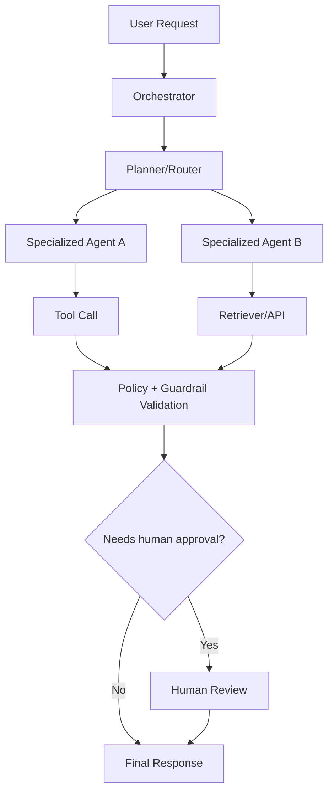

# Agent Frameworks: AutoGen, crewAI, OpenAI Agents SDK

## Overview

This page covers enterprise architecture decisions for three agent frameworks that are commonly discussed in interviews but were not explicitly covered in this repository: AutoGen, crewAI, and OpenAI Agents SDK.

## Why this topic matters

In senior architecture interviews, framework selection is less about syntax and more about control model, observability, safety, operational overhead, and team productivity. You need to explain why one orchestration model is better for a given enterprise use case.

## Core concepts

- Agent role model and specialization
- Tool-calling and handoff control
- Stateful vs conversational orchestration
- Safety and guardrail injection points
- Traceability, debugging, and auditability
- Scalability, latency, and cost behavior

## Detailed explanation of each concept

### AutoGen

AutoGen is strong for multi-agent conversational patterns where different agents collaborate through iterative dialog. It is useful when you want role-based decomposition and emergent problem solving, but you must constrain loops and add explicit stop conditions to avoid unpredictable costs and latency.

### crewAI

crewAI provides role-based crews, tasks, and flow-like coordination. It is effective for business workflows where responsibilities can be clearly assigned (researcher, reviewer, writer, validator). It improves readability for business stakeholders but still requires strict task contracts, retries, and governance wrappers for production.

### OpenAI Agents SDK

OpenAI Agents SDK is suited for tool-calling workflows with explicit handoffs, guardrails, and tracing. It is often the shortest path to production when your stack is already OpenAI/Azure OpenAI centered and you need standardized instrumentation and policy controls around agent steps.

### Selection criteria

- Choose AutoGen when collaborative multi-agent conversation itself is a core design need.
- Choose crewAI when role/task decomposition and workflow clarity are top priorities.
- Choose OpenAI Agents SDK when tool-calling reliability, guardrails, and tracing are first-class requirements.

## Evaluation (how to assess design quality)

Assess framework choice across:

- Reliability: timeout handling, retries, deterministic stop conditions
- Security: tool allowlist, secret handling, data boundary enforcement
- Cost: token burn per task, loop amplification risk, model routing controls
- Operability: tracing depth, replay ability, debugging speed
- Governance: approval checkpoints, audit trails, policy testability

## Architecture / flow diagram + flow explanation

Flow explanation: the orchestrator should remain deterministic, agent outputs should pass policy validation before user delivery, and risky actions should include a human approval gate.

## Real-world example

A financial-services assistant uses crewAI for role-based pipeline execution (analyst, compliance checker, report drafter). The organization adds OpenAI Agents SDK-style tracing and guardrails around tool calls. For exceptional cases requiring debate-style reasoning, AutoGen-style collaborative agents are used in a bounded sandbox with strict time and token budgets.

## Best practices

- Start with a single orchestrator and add more agents only when metrics justify it.
- Enforce tool schemas and output contracts at every step.
- Add cost guardrails (max turns, max tokens, max retries) before go-live.
- Log every handoff with correlation IDs and policy decision outcomes.
- Keep framework-specific code behind an internal orchestration abstraction.

## Common mistakes / misconceptions

- Assuming multi-agent always beats single-agent.
- Letting framework defaults define safety policies.
- Ignoring loop amplification and token runaway scenarios.
- Coupling business logic directly to one framework API.
- Measuring only response quality and ignoring latency/cost stability.

## Industry relevance

Most enterprise teams now evaluate multiple agent frameworks. Architects who can explain control trade-offs, not just features, stand out in interviews and real solution reviews.

## Interview discussion points

- How do you choose AutoGen vs crewAI vs OpenAI Agents SDK for a regulated domain?
- What control points are mandatory before any tool execution?
- How do you implement handoffs with minimal failure blast radius?
- How do you evaluate multi-agent ROI versus operational complexity?
- How do you keep framework portability over 12-18 months?

## Related/dependent links

- `docs/data-ai/agentic_ai_langchain_langgraph.md`
- `docs/data-ai/guardrails_security_privacy_responsible_ai.md`
- `docs/data-ai/llmops_observability_evaluation_langsmith_arize.md`
