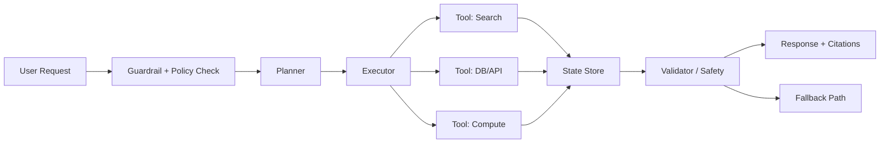
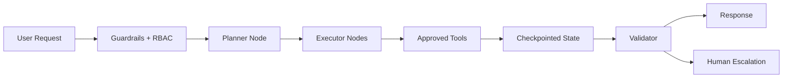

# Agentic AI Architecture (LangChain + LangGraph)

## Overview
Agentic AI architecture designs LLM systems that can plan, decide, invoke tools, and adapt over multi-step workflows instead of returning one-shot responses. This page focuses on enterprise-safe agent design with LangChain and LangGraph.

## Why this topic matters
Senior architect interviews increasingly test whether you can design production-grade agent systems with reliability, governance, observability, and security controls. Interviewers expect trade-off reasoning between simple RAG pipelines and stateful agent workflows.

## Core concepts
- Agentic AI vs classic RAG
- LangChain components and chains
- LangGraph stateful graph orchestration
- Planner/executor/supervisor patterns
- Tool calling and policy-controlled tool access
- Retry/fallback/error semantics
- Multi-agent collaboration models
- Structured outputs and guardrails

## Detailed explanation of each concept
Agentic systems separate reasoning, planning, and execution so the model can iteratively call tools, evaluate intermediate outputs, and converge toward a goal. LangChain is useful for linear or moderately branched orchestration and reusable components. LangGraph extends this for explicit state machines and graph-based control flows where checkpointing, resumability, and deterministic transitions are critical.

Enterprise architecture needs policy at every boundary: identity, tool authorization, data access scope, output control, and audit traces. State handling must account for retries, replay safety, and idempotent tool actions. Multi-agent designs help modularize responsibilities but increase orchestration complexity and failure surface.

## Evaluation (How to assess architecture quality)
- Task success rate for multi-step objectives
- Tool-call accuracy and unauthorized call rejection
- Recovery rate after step failure
- Hallucination rate under tool-enabled mode
- Cost-per-task and latency distribution (p50/p95/p99)
- Trace completeness and policy/audit coverage

## Architecture / flow diagram


**Flow explanation:**  
Request enters policy and intent validation, then planner decomposes tasks. Executor invokes approved tools with scoped permissions. State persists intermediate outputs for retries/replay. Validator applies grounding/safety checks before final response or fallback.

## Real-world example
An enterprise support assistant handles policy, pricing, and ticket operations. It uses a planner to classify intent, calls product KB retrieval and CRM tools, validates tool outputs against policy rules, and returns structured response with citations and confidence score. Sensitive operations require supervisor approval node before final action.

## Best practices
- Keep explicit graph states for non-trivial workflows
- Enforce allowlist tool routing by role and intent
- Separate planning model from execution model when cost-sensitive
- Use structured output schemas with strict validation
- Add deterministic fallbacks for tool/model outages
- Capture full step traces for debugging and audit

## Common mistakes / misconceptions
- Treating agent loops as unbounded free-form reasoning
- Allowing tools without scoped authorization checks
- No state checkpointing for long-running tasks
- No retry budget and no fallback contract
- Assuming multi-agent is always better than single-agent

## Industry relevance
Agentic architectures are being adopted in support automation, internal copilots, operations assistants, analyst workflows, and regulated process augmentation where auditable decision paths are mandatory.

## Interview discussion points
- LangChain vs LangGraph decision criteria
- Planner/executor/supervisor split
- Tool governance and blast-radius control
- Replay safety and deterministic recovery
- Cost-latency-quality optimization for agent loops

## Links to dependent / related topics
- [RAG, Azure OpenAI, AI Search](./rag_openai_ai_search.md)
- [Security, IAM, Networking](../security/security_iam_networking.md)
- [System Design HLD/LLD](../system-design/system_design_hld_lld.md)
- [APIM, Messaging, Eventing](../integration/apim_messaging_eventing.md)

## Enhanced Answering Playbook (Crisp + Deep + Summary + Example)

Use this playbook while reading each question answer in this file:

- **Crisp answer:** Give a 30-60 second interview response with direct decision language.
- **Deep explanation:** Explain architecture flow, failure modes, trade-offs, and operating model.
- **Answer summary:** Close with 3 strong points (decision, risk, mitigation).
- **Practical example:** Map the concept to one real enterprise workflow.
- **Diagram thinking:** Explain request path, control points, and fallback behavior.

### Worked Example 1: Agentic flow for policy assistant
**Crisp answer:** Use LangGraph when workflow has retries, approval gates, and resumable state. Use LangChain components inside graph nodes for reusable prompt/retrieval/tool logic.

**Deep explanation:**  
In a policy assistant, user intent first passes through guardrails and role checks. A planner node decomposes work into steps such as retrieve policy, compare clauses, and generate recommendation. Executor nodes call tools with strict schemas and scoped permissions. Each node writes checkpointed state so failures can replay safely without duplicate side effects. A validator node checks citation integrity, policy constraints, and response confidence before returning output. If a step fails, graph policy routes to retry, alternate tool, or human escalation. This architecture improves reliability and auditability compared to a free-form agent loop, at the cost of more orchestration complexity and state management overhead.

**Answer summary:**  
- Use explicit state graphs for control and replay safety.  
- Enforce tool policies before action to reduce blast radius.  
- Add deterministic fallback paths for resilient enterprise behavior.

**Practical example:** A banking copilot routes loan-policy questions through retrieval + validator, but routes account-modification actions through supervisor approval.



### Worked Example 2: Choosing non-agent vs agent
**Crisp answer:** If task path is fixed and deterministic, use non-agent RAG pipeline. If task path is adaptive with conditional tool calls, use agentic orchestration.

**Deep explanation:**  
Architecturally, non-agent pipelines have lower latency, lower cost variance, and simpler testing. They are ideal for FAQ, policy lookup, and template-driven outputs. Agentic workflows are justified when the system must reason across multiple actions, perform dynamic branching, and recover from partial failures. The decision should be based on task entropy, risk profile, and operational overhead, not on trend adoption. In interviews, highlight both benefit and cost: agents increase flexibility, but require stronger governance, observability, and failure control.

## Interview Questions (50)
1. What is Agentic AI and how is it different from standard RAG?
2. When should you choose a non-agent pipeline over an agent?
3. What problems does LangChain solve?
4. What problems does LangGraph solve beyond LangChain?
5. When to choose LangChain vs LangGraph in enterprise systems?
6. How do you model state in agent workflows?
7. How do you design planner-executor architecture?
8. What is supervisor pattern in agent systems?
9. How do you control tool calling safely?
10. How do you prevent tool misuse and data overreach?
11. How do you design retries in agent execution steps?
12. How do you define fallback strategy for agent failures?
13. How do you avoid infinite loops in agent reasoning?
14. How do you handle partial step failure?
15. How do you make tool operations idempotent?
16. How do you evaluate single-agent vs multi-agent choice?
17. How do multi-agent systems fail in production?
18. How do you coordinate agent-to-agent communication?
19. How do you do memory management in agentic flows?
20. How do you prevent memory poisoning?
21. How do you enforce structured outputs?
22. How do you validate structured output correctness?
23. How do you add policy guardrails in graph nodes?
24. How do you implement human-in-the-loop approval?
25. How do you secure sensitive tool actions?
26. How do you design traceability for each agent step?
27. How do you monitor token cost in agent loops?
28. How do you optimize latency in multi-step agents?
29. How do you design model routing inside agents?
30. How do you choose planner model vs executor model?
31. How do you benchmark agent quality?
32. What metrics matter for agent reliability?
33. How do you test agent graphs before production?
34. How do you create replay-safe test harnesses?
35. How do you debug hallucinated tool decisions?
36. How do you design agentic retrieval integration?
37. How do you prevent prompt injection in tool-enabled agents?
38. How do you handle tenant isolation in shared agents?
39. How do you design RBAC for tools and data access?
40. How do you design audit logging for compliance?
41. How do you apply Responsible AI controls in agents?
42. How do you manage prompt/version drift in production?
43. How do you design rollback for graph changes?
44. How do you do canary release for agent workflows?
45. How do you support long-running tasks asynchronously?
46. How do you combine API layer and worker layer for agents?
47. How do you present agentic architecture to leadership?
48. What are common anti-patterns in LangGraph design?
49. How do you decide buy vs build for agent orchestration?
50. How do you conclude an enterprise agent design interview answer?

## Answers for important questions (Summary + Crisp + Deep)

### Q1. What is Agentic AI and how is it different from standard RAG?
**Question summary:** Interviewers test if you can distinguish retrieval augmentation from autonomous multi-step orchestration.
**Crisp answer (7-8 lines):** 
t and generates one response. Agentic AI adds planning, tool use, and iterative execution. RAG is often linear; agent flows are stateful and dynamic. Agent systems can branch, retry, and recover. They can call APIs, databases, and actions, not just retrieve text. Agentic design needs stronger governance and observability. Use RAG for narrow Q&A; use agents for multi-step goals.
**Deep explanation (~60-70 lines):** For `What is Agentic AI and how is it different from standard RAG?`, start by identifying where this decision sits in your agent workflow control flow and what failure it prevents. A strong architecture answer should describe the request path end-to-end, not just define terms: ingress, authorization, orchestration, dependency calls, validation, and fallback. In this flow, deterministic steps must be explicit and testable, such as tool allowlist checks, schema validation, retry budget, stop conditions, approval gates. These are deterministic because policy and safety outcomes cannot depend on model creativity. Probabilistic steps are acceptable where approximation is useful, such as planning step decomposition and language reasoning between steps, but they still need guardrails and confidence thresholds. The key trade-off is control versus flexibility: stricter deterministic control improves safety and auditability, while probabilistic reasoning improves adaptability but increases variance in output quality. Design decisions should therefore include boundaries: which component can decide, which component must verify, and which component can block or escalate. Also explain operational behavior under stress: dependency timeout, partial failure, malformed tool output, stale context, and degraded external APIs. For each failure mode, define one mitigation path (retry with budget, route fallback, safe response, or human approval) so the system degrades safely instead of failing unpredictably. Security must be integrated into this answer: identity propagation, least-privilege access, and data boundary enforcement should happen before generation, not after. Finally, show how you will measure success in production with metrics like task completion, tool-call success, fallback rate, policy violation rate, cost/task, and mention rollout safety with canary + rollback criteria. This turns the answer from a definition into an operating architecture decision with clear risk, mitigation, and measurable outcomes.
**Answer summary:**
- **Decision:** Use the control pattern that best fits `What is Agentic AI and how is it different from standard RAG?` for this workload.
- **Risk:** Unbounded autonomy, weak state control, or weak authorization will create reliability and compliance regressions.
- **Mitigation:** Add explicit contracts, policy gates, and tested fallback/recovery paths before production rollout.
**Practical example:** In a healthcare claims assistant, the team addresses 'What is Agentic AI and how is it different from standard RAG?' by enforcing role-scoped access, validating each critical step through policy checks, and releasing changes with canary monitoring so quality and compliance remain stable under production traffic.
**Simple diagram:**  
```text
RAG: Query -> Retrieve -> Generate
Agentic: Query -> Plan -> Tool Calls/State -> Validate -> Respond
```
**Trusted reference links:**  
- https://python.langchain.com/docs/introduction/  
- https://langchain-ai.github.io/langgraph/

### Q2. When should you choose a non-agent pipeline over an agent?
**Question summary:** Tests architectural restraint and cost-aware design.
**Crisp answer (7-8 lines):** Choose non-agent when workflow is predictable and linear. Use it for fixed Q&A, FAQ, and deterministic transformations. It reduces cost, latency, and failure complexity. It is easier to test and secure. Agent loops are unnecessary for simple intent classes. Prefer explicit business logic over open-ended reasoning. Add agents only when adaptive tool sequencing is required.
**Deep explanation (~60-70 lines):** For `When should you choose a non-agent pipeline over an agent?`, start by identifying where this decision sits in your agent workflow control flow and what failure it prevents. A strong architecture answer should describe the request path end-to-end, not just define terms: ingress, authorization, orchestration, dependency calls, validation, and fallback. In this flow, deterministic steps must be explicit and testable, such as tool allowlist checks, schema validation, retry budget, stop conditions, approval gates. These are deterministic because policy and safety outcomes cannot depend on model creativity. Probabilistic steps are acceptable where approximation is useful, such as planning step decomposition and language reasoning between steps, but they still need guardrails and confidence thresholds. The key trade-off is control versus flexibility: stricter deterministic control improves safety and auditability, while probabilistic reasoning improves adaptability but increases variance in output quality. Design decisions should therefore include boundaries: which component can decide, which component must verify, and which component can block or escalate. Also explain operational behavior under stress: dependency timeout, partial failure, malformed tool output, stale context, and degraded external APIs. For each failure mode, define one mitigation path (retry with budget, route fallback, safe response, or human approval) so the system degrades safely instead of failing unpredictably. Security must be integrated into this answer: identity propagation, least-privilege access, and data boundary enforcement should happen before generation, not after. Finally, show how you will measure success in production with metrics like task completion, tool-call success, fallback rate, policy violation rate, cost/task, and mention rollout safety with canary + rollback criteria. This turns the answer from a definition into an operating architecture decision with clear risk, mitigation, and measurable outcomes.
**Answer summary:**
- **Decision:** Use the control pattern that best fits `When should you choose a non-agent pipeline over an agent?` for this workload.
- **Risk:** Unbounded autonomy, weak state control, or weak authorization will create reliability and compliance regressions.
- **Mitigation:** Add explicit contracts, policy gates, and tested fallback/recovery paths before production rollout.
**Practical example:** In a insurance underwriting knowledge bot, the team addresses 'When should you choose a non-agent pipeline over an agent?' by enforcing role-scoped access, validating each critical step through policy checks, and releasing changes with canary monitoring so quality and compliance remain stable under production traffic.
**Simple diagram:**  
```text
Simple Task -> Deterministic Pipeline
Adaptive Task -> Agentic Workflow
```
**Trusted reference links:**  
- https://learn.microsoft.com/en-us/azure/architecture/guide/design-principles/

### Q3. What problems does LangChain solve?
**Question summary:** Evaluates framework-level understanding.
**Crisp answer (7-8 lines):** LangChain provides building blocks for LLM applications. It standardizes prompt templates, model calls, retrieval, and tool integrations. It speeds development of chains and agent interfaces. It helps compose components with reusable abstractions. It supports memory and output parsers. It reduces boilerplate for orchestration. It is effective for fast iteration and modularity.
**Deep explanation (~60-70 lines):** For `What problems does LangChain solve?`, start by identifying where this decision sits in your agent workflow control flow and what failure it prevents. A strong architecture answer should describe the request path end-to-end, not just define terms: ingress, authorization, orchestration, dependency calls, validation, and fallback. In this flow, deterministic steps must be explicit and testable, such as tool allowlist checks, schema validation, retry budget, stop conditions, approval gates. These are deterministic because policy and safety outcomes cannot depend on model creativity. Probabilistic steps are acceptable where approximation is useful, such as planning step decomposition and language reasoning between steps, but they still need guardrails and confidence thresholds. The key trade-off is control versus flexibility: stricter deterministic control improves safety and auditability, while probabilistic reasoning improves adaptability but increases variance in output quality. Design decisions should therefore include boundaries: which component can decide, which component must verify, and which component can block or escalate. Also explain operational behavior under stress: dependency timeout, partial failure, malformed tool output, stale context, and degraded external APIs. For each failure mode, define one mitigation path (retry with budget, route fallback, safe response, or human approval) so the system degrades safely instead of failing unpredictably. Security must be integrated into this answer: identity propagation, least-privilege access, and data boundary enforcement should happen before generation, not after. Finally, show how you will measure success in production with metrics like task completion, tool-call success, fallback rate, policy violation rate, cost/task, and mention rollout safety with canary + rollback criteria. This turns the answer from a definition into an operating architecture decision with clear risk, mitigation, and measurable outcomes.
**Answer summary:**
- **Decision:** Use the control pattern that best fits `What problems does LangChain solve?` for this workload.
- **Risk:** Unbounded autonomy, weak state control, or weak authorization will create reliability and compliance regressions.
- **Mitigation:** Add explicit contracts, policy gates, and tested fallback/recovery paths before production rollout.
**Practical example:** In a enterprise IT support assistant, the team addresses 'What problems does LangChain solve?' by enforcing role-scoped access, validating each critical step through policy checks, and releasing changes with canary monitoring so quality and compliance remain stable under production traffic.
**Simple diagram:**  
```text
Prompt + Model + Retriever + Tool + Parser -> LangChain App
```
**Trusted reference links:**  
- https://python.langchain.com/docs/introduction/

### Q4. What problems does LangGraph solve beyond LangChain?
**Question summary:** Tests stateful orchestration understanding.
**Crisp answer (7-8 lines):** LangGraph enables graph-based stateful workflows. It models explicit nodes, edges, and transitions. It supports checkpointing and resumability. It handles loops and branch logic more safely. It improves control for long-running agent tasks. It provides deterministic orchestration semantics. It is better for production-grade complex agents.
**Deep explanation (~60-70 lines):** For `What problems does LangGraph solve beyond LangChain?`, start by identifying where this decision sits in your agent workflow control flow and what failure it prevents. A strong architecture answer should describe the request path end-to-end, not just define terms: ingress, authorization, orchestration, dependency calls, validation, and fallback. In this flow, deterministic steps must be explicit and testable, such as tool allowlist checks, schema validation, retry budget, stop conditions, approval gates. These are deterministic because policy and safety outcomes cannot depend on model creativity. Probabilistic steps are acceptable where approximation is useful, such as planning step decomposition and language reasoning between steps, but they still need guardrails and confidence thresholds. The key trade-off is control versus flexibility: stricter deterministic control improves safety and auditability, while probabilistic reasoning improves adaptability but increases variance in output quality. Design decisions should therefore include boundaries: which component can decide, which component must verify, and which component can block or escalate. Also explain operational behavior under stress: dependency timeout, partial failure, malformed tool output, stale context, and degraded external APIs. For each failure mode, define one mitigation path (retry with budget, route fallback, safe response, or human approval) so the system degrades safely instead of failing unpredictably. Security must be integrated into this answer: identity propagation, least-privilege access, and data boundary enforcement should happen before generation, not after. Finally, show how you will measure success in production with metrics like task completion, tool-call success, fallback rate, policy violation rate, cost/task, and mention rollout safety with canary + rollback criteria. This turns the answer from a definition into an operating architecture decision with clear risk, mitigation, and measurable outcomes.
**Answer summary:**
- **Decision:** Use the control pattern that best fits `What problems does LangGraph solve beyond LangChain?` for this workload.
- **Risk:** Unbounded autonomy, weak state control, or weak authorization will create reliability and compliance regressions.
- **Mitigation:** Add explicit contracts, policy gates, and tested fallback/recovery paths before production rollout.
**Practical example:** In a procurement contract Q&A assistant, the team addresses 'What problems does LangGraph solve beyond LangChain?' by enforcing role-scoped access, validating each critical step through policy checks, and releasing changes with canary monitoring so quality and compliance remain stable under production traffic.
**Simple diagram:**  
```text
State A -> State B -> State C
   \-> Retry/Fallback -> Resume
```
**Trusted reference links:**  
- https://langchain-ai.github.io/langgraph/

### Q5. When to choose LangChain vs LangGraph in enterprise systems?
**Question summary:** Decision framework question frequently asked.
**Crisp answer (7-8 lines):** Use LangChain for linear or lightly branched flows. Use LangGraph for stateful, retry-heavy, multi-step orchestration. Prefer LangGraph when human approval and resumability are required. Choose LangChain for quick delivery and simpler use cases. Choose based on control needs, not trend. Measure complexity, failure paths, and audit requirements. Hybrid use is common in large systems.
**Deep explanation (~60-70 lines):** For `When to choose LangChain vs LangGraph in enterprise systems?`, start by identifying where this decision sits in your agent workflow control flow and what failure it prevents. A strong architecture answer should describe the request path end-to-end, not just define terms: ingress, authorization, orchestration, dependency calls, validation, and fallback. In this flow, deterministic steps must be explicit and testable, such as tool allowlist checks, schema validation, retry budget, stop conditions, approval gates. These are deterministic because policy and safety outcomes cannot depend on model creativity. Probabilistic steps are acceptable where approximation is useful, such as planning step decomposition and language reasoning between steps, but they still need guardrails and confidence thresholds. The key trade-off is control versus flexibility: stricter deterministic control improves safety and auditability, while probabilistic reasoning improves adaptability but increases variance in output quality. Design decisions should therefore include boundaries: which component can decide, which component must verify, and which component can block or escalate. Also explain operational behavior under stress: dependency timeout, partial failure, malformed tool output, stale context, and degraded external APIs. For each failure mode, define one mitigation path (retry with budget, route fallback, safe response, or human approval) so the system degrades safely instead of failing unpredictably. Security must be integrated into this answer: identity propagation, least-privilege access, and data boundary enforcement should happen before generation, not after. Finally, show how you will measure success in production with metrics like task completion, tool-call success, fallback rate, policy violation rate, cost/task, and mention rollout safety with canary + rollback criteria. This turns the answer from a definition into an operating architecture decision with clear risk, mitigation, and measurable outcomes.
**Answer summary:**
- **Decision:** Use the control pattern that best fits `When to choose LangChain vs LangGraph in enterprise systems?` for this workload.
- **Risk:** Unbounded autonomy, weak state control, or weak authorization will create reliability and compliance regressions.
- **Mitigation:** Add explicit contracts, policy gates, and tested fallback/recovery paths before production rollout.
**Practical example:** In a internal audit/compliance copilot, the team addresses 'When to choose LangChain vs LangGraph in enterprise systems?' by enforcing role-scoped access, validating each critical step through policy checks, and releasing changes with canary monitoring so quality and compliance remain stable under production traffic.
**Simple diagram:**  
```text
Simple Flow -> LangChain
Stateful Graph -> LangGraph
```
**Trusted reference links:**  
- https://python.langchain.com/docs/introduction/  
- https://langchain-ai.github.io/langgraph/

### Q6. How do you model state in agent workflows?
**Question summary:** Tests state design discipline.
### Question Summary

This question tests whether you can design controlled, auditable, and recoverable agent workflows instead of letting the LLM behave like an uncontrolled black box.

---

### Crisp Answer

In agent workflows, I model state as an explicit structured object shared across workflow nodes.

It should store user intent, identity context, current step, retrieved context references, tool outputs, decisions, retry count, risk level, approval status, and errors.

I keep state minimal and avoid storing secrets, full documents, or unnecessary raw prompts.

I separate transient workflow state, persistent checkpoints, long-term memory, and external system state.

Each node reads state, performs one responsibility, and writes only controlled updates back to state.

For long-running workflows, I persist checkpoints at critical transitions so execution can resume after failure.

I also version the state schema to support workflow evolution without breaking old executions.

This makes the agent predictable, auditable, secure, and easier to debug.

---

### Deep Explanation

For agent workflows, state is the structured context that moves from one step to another. It tells the system what the user wants, what has already happened, what tools were called, what results were received, what decision was made, and what should happen next.

I would not model state as one large text blob. I would define a proper schema.

Example:

```text
State = {
  request_id,
  user_id,
  user_intent,
  current_step,
  retrieved_context_refs,
  tool_results,
  decisions,
  risk_level,
  approval_status,
  retry_count,
  errors,
  final_response
}
```

Each workflow node should have a clear responsibility. For example, one node identifies intent, another retrieves context, another calls a tool, another validates the result, another checks whether human approval is required, and another prepares the final response.

The important design principle is that the LLM can suggest or reason, but deterministic controls should update and validate critical state.

For example, authorization, tool allowlist checks, schema validation, retry limits, stop conditions, approval gates, and policy checks should not depend only on model creativity.

I would separate state into four categories:

| State Type | Meaning |
|---|---|
| Transient workflow state | Current step, retry count, temporary tool result, intermediate decision |
| Persistent checkpoint state | Stored state after important transitions for recovery |
| Long-term memory | Reusable user preferences or approved settings |
| External system state | Source-of-truth data like ticket status, leave balance, order status |

The agent state should not become the source of truth for business systems.

For production, I would persist checkpoints at critical transitions:

```text
intent identified
context retrieved
tool call completed
validation completed
approval received
action executed
final response generated
```

This helps with recovery. If the workflow fails after a tool call, it can resume from the last safe checkpoint instead of starting again.

State should also track risk and approval information, especially in agentic AI:

```text
risk_level = high
requires_approval = true
approval_status = pending
approved_by = null
```

This prevents the agent from directly performing sensitive actions such as sending external emails, deleting records, approving payments, or changing production configuration.

I would also keep state minimal. I would avoid storing passwords, API keys, full confidential documents, large raw API responses, or complete prompt history unless there is a compliance requirement.

Instead of storing full documents, I would store document references, chunk IDs, source IDs, and version numbers.

For observability, state should include trace identifiers such as request ID, workflow version, prompt version, model used, token usage, cost estimate, and failure reason.

This helps in debugging, audit, and production monitoring.

Finally, I would version the state schema. Agent workflows evolve over time, and older executions may still be running or stored. Schema versioning avoids breaking old workflows when we add new fields or change structure.

---

### Practical Example

In a customer support triage agent, state may look like this:

```text
State = {
  request_id: "REQ-1001",
  user_id: "user@company.com",
  intent: "refund_request",
  current_step: "validate_policy",
  retrieved_context_refs: ["refund-policy-v3-section-4"],
  tool_results: {
    order_status: "delivered",
    payment_status: "paid"
  },
  risk_level: "medium",
  approval_status: "pending",
  retry_count: 0,
  errors: []
}
```

The agent may retrieve the refund policy, check order status, validate eligibility, prepare a refund recommendation, and then wait for human approval before executing the refund.

---

### Simple Diagram

```text
User Request
   ↓
Initialize State
   ↓
Intent Node
   ↓
Retrieval Node
   ↓
Tool Execution Node
   ↓
Validation Node
   ↓
Approval Gate
   ↓
Action / Final Response
   ↓
Checkpoint + Audit Logs
```

---

### Final Interview Answer

I model state in agent workflows as an explicit structured object that is passed across workflow nodes.
It contains user intent, identity, current step, retrieved context references, tool outputs, decisions, risk level, approval status, retry count, errors, and final response.
I avoid keeping state as a large unstructured text blob because that becomes hard to validate, debug, and audit.
I separate transient workflow state from persistent checkpoints, long-term memory, and external system state.
Each node reads the current state, performs one responsibility, and writes controlled updates.
For long-running workflows, I persist checkpoints at important transitions so the workflow can resume after failure.
I also track risk and approval status in state so high-risk actions require human approval.
Finally, I version the state schema and log state transitions for observability, governance, and rollback.
This makes the agent workflow predictable, secure, auditable, and production-ready.

**Simple diagram:**  
```text
State = {intent, context, tool_results, retry_count, status}
```
**Trusted reference links:**  
- https://langchain-ai.github.io/langgraph/concepts/low_level/

### Q7. How do you design planner-executor architecture?
**Question summary:** Checks decomposition of reasoning and action.
**Crisp answer (7-8 lines):** Planner decomposes goals into ordered steps. Executor performs steps using tools. Planner focuses on strategy; executor on deterministic action. Use clear contract between plan and execution schemas. Add validator to verify each step outcome. Re-plan when step results diverge. Keep planner and executor independently testable.
This question checks whether you can design agentic AI systems with clear separation of planning, execution, validation, and governance.

The interviewer wants to know whether you allow the LLM to directly act, or whether you use controlled orchestration with policy gates and safe execution.

---

### Crisp Answer

I design planner-executor architecture by separating task planning from task execution.

The planner understands the user goal, breaks it into ordered steps, selects required tools, identifies dependencies, and defines success criteria.

The executor performs only approved steps using tools, APIs, databases, retrievers, or workflow systems.

Between planner and executor, I add a policy layer for authorization, tool allowlisting, schema validation, token budget, risk classification, and human approval.

After execution, a verifier checks tool output, business rules, grounding, and completion status.

The workflow state tracks plan, current step, tool results, retry count, risk level, approval status, and errors.

For production, I add checkpoints, bounded retries, max tool-call limits, audit logs, and safe fallback paths.

This keeps the agent flexible but controlled, auditable, and secure.

---

### Deep Explanation

A planner-executor architecture separates thinking about the task from doing the task.

In agentic AI, this is important because we do not want the LLM to freely decide and execute actions without control.

Simple meaning:

```text
Planner = decides what steps are needed
Executor = performs each step using tools/APIs/RAG/models
```

The high-level flow is:

```text
User goal
   ↓
Intent understanding
   ↓
Planner creates step-by-step plan
   ↓
Policy engine validates the plan
   ↓
Executor runs each approved step
   ↓
Verifier checks result
   ↓
Planner replans if needed
   ↓
Final response/action
```

---

### Architecture Diagram

```text
User
 ↓
API / Orchestrator
 ↓
Planner
 ├─ Understand goal
 ├─ Break goal into steps
 ├─ Choose required tools
 └─ Define success criteria
 ↓
Policy / Guardrail Layer
 ├─ Tool allowlist
 ├─ Permission check
 ├─ Risk classification
 └─ Approval requirement
 ↓
Executor
 ├─ RAG retriever
 ├─ APIs
 ├─ Database
 ├─ Workflow system
 └─ External tools
 ↓
Verifier
 ├─ Validate output
 ├─ Check schema
 ├─ Check business rules
 └─ Check evidence
 ↓
Final response
```

---

### What the Planner Does

The planner should not directly execute actions. It should create a controlled plan.

Example plan:

```json
{
  "goal": "Check refund eligibility and create refund request",
  "steps": [
    {
      "step": 1,
      "action": "retrieve_refund_policy",
      "tool": "policy_search",
      "risk": "low"
    },
    {
      "step": 2,
      "action": "get_order_status",
      "tool": "order_api",
      "risk": "low"
    },
    {
      "step": 3,
      "action": "validate_refund_eligibility",
      "tool": "business_rule_engine",
      "risk": "medium"
    },
    {
      "step": 4,
      "action": "create_refund_draft",
      "tool": "refund_api",
      "risk": "medium",
      "requires_approval": true
    }
  ]
}
```

Planner responsibilities:

| Responsibility | Meaning |
|---|---|
| Understand user goal | Identify what the user wants |
| Decompose task | Break the goal into smaller steps |
| Select tools | Decide which tools are needed |
| Define order | Decide what should run first and next |
| Identify dependencies | Understand which step depends on another |
| Define success criteria | Decide how to know the task is complete |
| Mark risk level | Low, medium, or high |
| Decide approval need | Identify if human approval is required |

---

### What the Executor Does

The executor performs the actual work.

It should be deterministic as much as possible.

Executor responsibilities:

| Responsibility | Meaning |
|---|---|
| Call tools/APIs | Execute approved steps |
| Validate input schema | Prevent malformed tool calls |
| Apply user permissions | Ensure user can access the resource |
| Handle retries | Retry with limit |
| Capture outputs | Save tool result in state |
| Return status | Success, failure, or needs approval |
| Log execution | Support audit and debugging |

The executor should not blindly trust the planner.

Before every tool call, it should check:

```text
Is this tool allowed?
Is this user allowed?
Is the input valid?
Is approval required?
Is the request within quota?
Is the action safe?
```

---

### Why Separate Planner and Executor?

| Without Separation | With Planner-Executor |
|---|---|
| LLM directly decides and acts | LLM plans, controlled executor acts |
| Hard to audit | Plan and execution are logged separately |
| Risky tool usage | Tool calls are validated before execution |
| Hard to recover | State and checkpoints can resume workflow |
| Poor governance | Policy layer can approve or block steps |
| Difficult debugging | You know exactly which step failed |

---

### Policy Layer Between Planner and Executor

This is very important for enterprise systems.

```text
Planner output
   ↓
Policy validation
   ↓
Executor
```

Policy checks should include:

```text
Tool allowlist
User authorization
Data access boundary
Risk classification
Cost/token budget
Prompt injection check
Human approval requirement
Rate limit
Business rule validation
```

Example:

```text
Planner says: send refund approval email
Policy says: blocked, user approval required
Executor says: create email draft only
```

---

### Verifier After Executor

The verifier checks whether the execution result is correct.

Verifier checks:

| Check | Example |
|---|---|
| Schema validation | API returned expected fields |
| Business validation | Refund amount is within allowed limit |
| Grounding validation | Answer is supported by retrieved documents |
| Safety validation | No sensitive data leakage |
| Completion check | Goal has been achieved |

Flow:

```text
Executor output
   ↓
Verifier
   ├─ Pass → next step
   ├─ Fail → retry
   ├─ Uncertain → ask user/human
   └─ Block → safe failure
```

---

### Replanning

Sometimes execution fails or new information appears.

Example:

```text
Planner step: get order status
Executor result: order API timeout
```

Possible actions:

```text
Retry once
Use fallback API
Ask user to try later
Escalate to human
```

Replanning should be bounded.

Do not allow infinite loops.

Set limits:

```text
max_plan_steps = 8
max_tool_calls = 5
max_retries_per_step = 1 or 2
max_replans = 1 or 2
```

---

### State Model

Planner-executor architecture needs shared workflow state.

Example:

```json
{
  "request_id": "REQ-123",
  "user_id": "user@company.com",
  "goal": "apply leave",
  "plan": [],
  "current_step": 2,
  "tool_results": {},
  "risk_level": "medium",
  "approval_status": "pending",
  "retry_count": 0,
  "errors": [],
  "final_response": null
}
```

The planner reads state and updates the plan.

The executor reads the approved step and writes tool results.

The verifier reads tool results and updates validation status.

---

### Human Approval

For high-risk actions, add approval gates.

```text
Planner proposes action
   ↓
Policy classifies high risk
   ↓
Executor creates draft only
   ↓
Human approves
   ↓
Executor performs final action
```

Use approval for:

```text
Payments
Data deletion
Production changes
External emails
HR/legal decisions
Access changes
Customer-impacting updates
```

---

### Practical Example: IT Ticket Resolution Agent

User says:

```text
Check why my VPN is not working and create a ticket if needed.
```

Planner creates:

```text
1. Understand issue
2. Search VPN troubleshooting KB
3. Ask user for missing details if required
4. Check known outage system
5. Suggest fix
6. If unresolved, create ticket draft
7. Ask user to confirm
8. Submit ticket
```

Executor performs:

```text
Search KB
Call outage API
Create ticket draft
Submit only after confirmation
```

Verifier checks:

```text
Was KB result relevant?
Did outage API return valid status?
Did ticket contain required fields?
Was user approval captured?
```

---

### Final Interview Answer

I design planner-executor architecture by separating task decomposition from task execution.
The planner understands the user goal, breaks it into ordered steps, selects required tools, identifies dependencies, defines success criteria, and marks risk level. The executor performs only approved steps by calling tools, APIs, retrievers, or databases. Between the planner and executor, I add a policy layer for tool allowlisting, user authorization, schema validation, token budget, risk classification, and human approval. After execution, a verifier checks tool outputs, business rules, grounding, and completion status. The workflow state stores the plan, current step, tool results, retry count, risk level, approval status, and errors. For production, I add checkpoints, bounded retries, max tool-call limits, audit logs, and safe fallback paths. This design keeps agentic AI flexible but controlled, auditable, and secure.
**Simple diagram:**  
```text
Goal -> Planner -> Step Plan -> Executor -> Results -> Validator
```
**Trusted reference links:**  
- https://learn.microsoft.com/en-us/azure/architecture/ai-ml/guide/

### Q8. What is supervisor pattern in agent systems?
````md
# What is Supervisor Pattern in Agent Systems?

## Question Summary

This question tests whether you understand **multi-agent orchestration, governance, routing, and control** in agentic AI systems.

The interviewer wants to know whether you can avoid uncontrolled agent-to-agent collaboration and design a system where one supervisor coordinates specialist agents safely.

---

## Crisp Answer

A supervisor pattern is an agent orchestration pattern where a central supervisor coordinates multiple specialist agents or execution nodes.

The supervisor understands the user request, decides which agent should handle which part, routes tasks, tracks progress, and aggregates results.

Specialist agents do focused work, such as retrieval, coding, policy validation, data analysis, or ticket creation.

The supervisor enforces guardrails such as tool allowlists, authorization, retry limits, stop conditions, and escalation rules.

It prevents uncontrolled agent-to-agent behavior by keeping routing and decision control centralized.

It can also validate sub-agent outputs before moving to the next step or producing the final response.

This pattern is useful for complex enterprise assistants that need multiple skills but still require governance and auditability.

---

## Deep Explanation

The supervisor pattern is used when one agent is not enough to handle all tasks reliably.

Instead of building one large agent that does everything, we create multiple specialist agents and one supervisor.

Simple meaning:

```text
Supervisor = central controller
Specialist agents = focused workers
````

Example:

```text
User request
   ↓
Supervisor Agent
   ├── RAG Agent
   ├── Policy Agent
   ├── Data Agent
   ├── Code Agent
   └── Action Agent
   ↓
Final consolidated answer
```

The supervisor does not necessarily solve the whole problem itself. Its main role is to coordinate.

It decides:

```text
Which agent should handle this task?
What input should be sent to that agent?
Is the agent allowed to use this tool?
Is the output valid?
Should we retry, escalate, or stop?
How should final output be consolidated?
```

For example, in a banking policy copilot, a user may ask:

```text
Can this customer get loan restructuring, and what action should we take?
```

The supervisor may route work like this:

```text
RAG Agent → retrieve loan restructuring policy
Customer Data Agent → fetch customer profile
Risk Agent → assess policy eligibility
Compliance Agent → check regulatory constraints
Action Agent → prepare recommendation draft
Supervisor → validate and consolidate final answer
```

The important point is that the supervisor controls the flow. The specialist agents should not freely call each other or execute risky actions without supervision.

---

## Why Supervisor Pattern Is Needed

Without a supervisor, multiple agents may behave unpredictably.

| Problem Without Supervisor      | How Supervisor Helps                            |
| ------------------------------- | ----------------------------------------------- |
| Agents call tools randomly      | Supervisor controls tool access                 |
| Agents disagree with each other | Supervisor validates and reconciles outputs     |
| Too many unnecessary steps      | Supervisor controls routing and stop conditions |
| No audit trail                  | Supervisor logs plan, routing, and decisions    |
| Risky action execution          | Supervisor applies approval gates               |
| Infinite loops                  | Supervisor enforces max steps and retries       |
| Weak governance                 | Supervisor applies policy centrally             |

---

## Main Responsibilities of Supervisor

| Responsibility       | Explanation                                        |
| -------------------- | -------------------------------------------------- |
| Intent understanding | Understand the user goal                           |
| Task routing         | Decide which specialist agent is needed            |
| Sequencing           | Decide order of execution                          |
| State management     | Track current step, agent outputs, errors, retries |
| Policy enforcement   | Apply tool allowlist, permissions, and risk checks |
| Output validation    | Check sub-agent result before using it             |
| Retry/fallback       | Retry failed agent or route to fallback            |
| Escalation           | Send to human if risk or uncertainty is high       |
| Aggregation          | Combine outputs into final answer                  |
| Audit logging        | Record routing, decisions, tools, and outcomes     |

---

## Architecture Diagram

```text
User
 ↓
API / Orchestrator
 ↓
Supervisor Agent
 ├── Intent classification
 ├── Policy check
 ├── Routing decision
 ├── State tracking
 ├── Retry/fallback control
 └── Output aggregation
      ↓
      ├── Retrieval Agent
      ├── Data Agent
      ├── Policy Agent
      ├── Coding Agent
      ├── Compliance Agent
      └── Action Agent
            ↓
       Validation Layer
            ↓
       Final Response
            ↓
       Audit Logs / Monitoring
```

---

## Enterprise Example

Use case: **IT support enterprise assistant**

User says:

```text
My VPN is not working. Check if there is an outage and create a ticket if needed.
```

Supervisor flow:

```text
1. Understand user intent.
2. Route to Knowledge Agent to search VPN troubleshooting guide.
3. Route to Outage Agent to check outage API.
4. Route to Ticket Agent to prepare ticket draft.
5. Validate ticket fields.
6. Ask user confirmation.
7. Submit ticket only after approval.
8. Return final response.
```

Here, the supervisor controls routing, validation, approval, and final response.

---

## Guardrails in Supervisor Pattern

For production, supervisor should enforce:

```text
Tool allowlist
User authorization
Data access rules
Max tool calls
Max retries
Max agent handoffs
Prompt injection checks
Output schema validation
Human approval for risky actions
Cost/token budget
Audit logging
Fallback and escalation rules
```

This is important because specialist agents may produce wrong, incomplete, or unsafe outputs.

---

## Supervisor vs Planner-Executor

| Pattern                       | Main Purpose                                                                  |
| ----------------------------- | ----------------------------------------------------------------------------- |
| Planner-executor              | Plan steps and execute them                                                   |
| Supervisor pattern            | Coordinate multiple specialist agents or nodes                                |
| Router pattern                | Send request to one best path                                                 |
| Supervisor + planner-executor | Supervisor coordinates agents; each agent may use planner-executor internally |

So supervisor pattern is broader when you have **multiple agents**.

---

## Final Interview Answer

The supervisor pattern is a multi-agent orchestration pattern where a central supervisor coordinates specialist agents or execution nodes.

The supervisor understands the user goal, decides which agent should handle each subtask, routes the request, manages workflow state, validates sub-agent outputs, handles retries and fallback, and aggregates the final response.

Specialist agents focus on specific capabilities such as retrieval, data lookup, compliance validation, coding, or action execution.

In an enterprise system, the supervisor also enforces governance such as tool allowlists, user authorization, data access boundaries, retry limits, stop conditions, cost limits, and human approval for high-risk actions.

This prevents uncontrolled agent-to-agent behavior and gives better auditability, reliability, and security.

For example, in a banking policy copilot, the supervisor may route work to a policy retrieval agent, customer data agent, risk validation agent, and compliance agent, then validate and consolidate the final recommendation before returning it to the user.

```
```
**Simple diagram:**  
```text
Supervisor -> Agent A / Agent B / Agent C -> Consolidated Output
```
**Trusted reference links:**  
- https://langchain-ai.github.io/langgraph/

### Q9. How do you control tool calling safely?
**Question summary:** Tool governance and access safety.
**Crisp answer (7-8 lines):** Use allowlisted tools by intent and role. Enforce parameter schema validation for each call. Apply per-tool authorization checks. Add rate limits and retry budgets per tool. Log every tool invocation with correlation ID. Block high-risk tools behind approval gates. Sanitize tool inputs and outputs.
**Deep explanation (~60-70 lines):** For `How do you control tool calling safely?`, start by identifying where this decision sits in your agent workflow control flow and what failure it prevents. A strong architecture answer should describe the request path end-to-end, not just define terms: ingress, authorization, orchestration, dependency calls, validation, and fallback. In this flow, deterministic steps must be explicit and testable, such as tool allowlist checks, schema validation, retry budget, stop conditions, approval gates. These are deterministic because policy and safety outcomes cannot depend on model creativity. Probabilistic steps are acceptable where approximation is useful, such as planning step decomposition and language reasoning between steps, but they still need guardrails and confidence thresholds. The key trade-off is control versus flexibility: stricter deterministic control improves safety and auditability, while probabilistic reasoning improves adaptability but increases variance in output quality. Design decisions should therefore include boundaries: which component can decide, which component must verify, and which component can block or escalate. Also explain operational behavior under stress: dependency timeout, partial failure, malformed tool output, stale context, and degraded external APIs. For each failure mode, define one mitigation path (retry with budget, route fallback, safe response, or human approval) so the system degrades safely instead of failing unpredictably. Security must be integrated into this answer: identity propagation, least-privilege access, and data boundary enforcement should happen before generation, not after. Finally, show how you will measure success in production with metrics like task completion, tool-call success, fallback rate, policy violation rate, cost/task, and mention rollout safety with canary + rollback criteria. This turns the answer from a definition into an operating architecture decision with clear risk, mitigation, and measurable outcomes.
**Answer summary:**
- **Decision:** Use the control pattern that best fits `How do you control tool calling safely?` for this workload.
- **Risk:** Unbounded autonomy, weak state control, or weak authorization will create reliability and compliance regressions.
- **Mitigation:** Add explicit contracts, policy gates, and tested fallback/recovery paths before production rollout.
**Practical example:** In a healthcare claims assistant, the team addresses 'How do you control tool calling safely?' by enforcing role-scoped access, validating each critical step through policy checks, and releasing changes with canary monitoring so quality and compliance remain stable under production traffic.
**Simple diagram:**  
```text
Agent -> Policy Check -> Tool Schema Validate -> Tool Execute
```
**Trusted reference links:**  
- https://learn.microsoft.com/en-us/azure/well-architected/security/

### Q10. How do you prevent tool misuse and data overreach?
**Question summary:** Security and least-privilege test.
**Crisp answer (7-8 lines):** Scope tool permissions to minimum required operations. Pass user/tenant context to authorization layer. Deny broad query patterns by default. Use row/document-level filters for data tools. Redact sensitive fields before model consumption. Add anomaly detection on unusual tool patterns. Implement emergency kill-switches.
**Deep explanation (~60-70 lines):** For `How do you prevent tool misuse and data overreach?`, start by identifying where this decision sits in your agent workflow control flow and what failure it prevents. A strong architecture answer should describe the request path end-to-end, not just define terms: ingress, authorization, orchestration, dependency calls, validation, and fallback. In this flow, deterministic steps must be explicit and testable, such as tool allowlist checks, schema validation, retry budget, stop conditions, approval gates. These are deterministic because policy and safety outcomes cannot depend on model creativity. Probabilistic steps are acceptable where approximation is useful, such as planning step decomposition and language reasoning between steps, but they still need guardrails and confidence thresholds. The key trade-off is control versus flexibility: stricter deterministic control improves safety and auditability, while probabilistic reasoning improves adaptability but increases variance in output quality. Design decisions should therefore include boundaries: which component can decide, which component must verify, and which component can block or escalate. Also explain operational behavior under stress: dependency timeout, partial failure, malformed tool output, stale context, and degraded external APIs. For each failure mode, define one mitigation path (retry with budget, route fallback, safe response, or human approval) so the system degrades safely instead of failing unpredictably. Security must be integrated into this answer: identity propagation, least-privilege access, and data boundary enforcement should happen before generation, not after. Finally, show how you will measure success in production with metrics like task completion, tool-call success, fallback rate, policy violation rate, cost/task, and mention rollout safety with canary + rollback criteria. This turns the answer from a definition into an operating architecture decision with clear risk, mitigation, and measurable outcomes.
**Answer summary:**
- **Decision:** Use the control pattern that best fits `How do you prevent tool misuse and data overreach?` for this workload.
- **Risk:** Unbounded autonomy, weak state control, or weak authorization will create reliability and compliance regressions.
- **Mitigation:** Add explicit contracts, policy gates, and tested fallback/recovery paths before production rollout.
**Practical example:** In a insurance underwriting knowledge bot, the team addresses 'How do you prevent tool misuse and data overreach?' by enforcing role-scoped access, validating each critical step through policy checks, and releasing changes with canary monitoring so quality and compliance remain stable under production traffic.
**Simple diagram:**  
```text
Tenant Context + Role -> Tool Policy -> Filtered Data Access
```
**Trusted reference links:**  
- https://learn.microsoft.com/en-us/security/zero-trust/

### Q11. How do you design retries in agent execution steps?
**Question summary:** Reliability mechanics question.
**Crisp answer (7-8 lines):** Retry only transient failures with bounded attempts. Use exponential backoff with jitter. Store retry count in workflow state. Avoid retrying validation or permission failures. Add per-step timeout and circuit breaker rules. Route terminal errors to fallback node. Track retry success and amplification risk metrics.
**Deep explanation (~60-70 lines):** For `How do you design retries in agent execution steps?`, start by identifying where this decision sits in your agent workflow control flow and what failure it prevents. A strong architecture answer should describe the request path end-to-end, not just define terms: ingress, authorization, orchestration, dependency calls, validation, and fallback. In this flow, deterministic steps must be explicit and testable, such as tool allowlist checks, schema validation, retry budget, stop conditions, approval gates. These are deterministic because policy and safety outcomes cannot depend on model creativity. Probabilistic steps are acceptable where approximation is useful, such as planning step decomposition and language reasoning between steps, but they still need guardrails and confidence thresholds. The key trade-off is control versus flexibility: stricter deterministic control improves safety and auditability, while probabilistic reasoning improves adaptability but increases variance in output quality. Design decisions should therefore include boundaries: which component can decide, which component must verify, and which component can block or escalate. Also explain operational behavior under stress: dependency timeout, partial failure, malformed tool output, stale context, and degraded external APIs. For each failure mode, define one mitigation path (retry with budget, route fallback, safe response, or human approval) so the system degrades safely instead of failing unpredictably. Security must be integrated into this answer: identity propagation, least-privilege access, and data boundary enforcement should happen before generation, not after. Finally, show how you will measure success in production with metrics like task completion, tool-call success, fallback rate, policy violation rate, cost/task, and mention rollout safety with canary + rollback criteria. This turns the answer from a definition into an operating architecture decision with clear risk, mitigation, and measurable outcomes.
**Answer summary:**
- **Decision:** Use the control pattern that best fits `How do you design retries in agent execution steps?` for this workload.
- **Risk:** Unbounded autonomy, weak state control, or weak authorization will create reliability and compliance regressions.
- **Mitigation:** Add explicit contracts, policy gates, and tested fallback/recovery paths before production rollout.
**Practical example:** In a enterprise IT support assistant, the team addresses 'How do you design retries in agent execution steps?' by enforcing role-scoped access, validating each critical step through policy checks, and releasing changes with canary monitoring so quality and compliance remain stable under production traffic.
**Simple diagram:**  
```text
Step Fail -> Classify -> Retry(backoff) or Fallback
```
**Trusted reference links:**  
- https://learn.microsoft.com/en-us/azure/architecture/patterns/retry

### Q12. How do you define fallback strategy for agent failures?
**Question summary:** Resilience and UX continuity.
**Crisp answer (7-8 lines):** Define fallback levels by failure severity. Use alternate model or simplified pipeline fallback. Return safe partial output when full execution fails. Escalate to human support for high-risk cases. Preserve trace ID and context in fallback path. Communicate confidence and limitations clearly. Test fallbacks in chaos drills.
**Deep explanation (~60-70 lines):** For `How do you define fallback strategy for agent failures?`, start by identifying where this decision sits in your agent workflow control flow and what failure it prevents. A strong architecture answer should describe the request path end-to-end, not just define terms: ingress, authorization, orchestration, dependency calls, validation, and fallback. In this flow, deterministic steps must be explicit and testable, such as tool allowlist checks, schema validation, retry budget, stop conditions, approval gates. These are deterministic because policy and safety outcomes cannot depend on model creativity. Probabilistic steps are acceptable where approximation is useful, such as planning step decomposition and language reasoning between steps, but they still need guardrails and confidence thresholds. The key trade-off is control versus flexibility: stricter deterministic control improves safety and auditability, while probabilistic reasoning improves adaptability but increases variance in output quality. Design decisions should therefore include boundaries: which component can decide, which component must verify, and which component can block or escalate. Also explain operational behavior under stress: dependency timeout, partial failure, malformed tool output, stale context, and degraded external APIs. For each failure mode, define one mitigation path (retry with budget, route fallback, safe response, or human approval) so the system degrades safely instead of failing unpredictably. Security must be integrated into this answer: identity propagation, least-privilege access, and data boundary enforcement should happen before generation, not after. Finally, show how you will measure success in production with metrics like task completion, tool-call success, fallback rate, policy violation rate, cost/task, and mention rollout safety with canary + rollback criteria. This turns the answer from a definition into an operating architecture decision with clear risk, mitigation, and measurable outcomes.
**Answer summary:**
- **Decision:** Use the control pattern that best fits `How do you define fallback strategy for agent failures?` for this workload.
- **Risk:** Unbounded autonomy, weak state control, or weak authorization will create reliability and compliance regressions.
- **Mitigation:** Add explicit contracts, policy gates, and tested fallback/recovery paths before production rollout.
**Practical example:** In a procurement contract Q&A assistant, the team addresses 'How do you define fallback strategy for agent failures?' by enforcing role-scoped access, validating each critical step through policy checks, and releasing changes with canary monitoring so quality and compliance remain stable under production traffic.
**Simple diagram:**  
```text
Primary Path Fail -> Fallback Router -> Alt Model / Safe Response / Human Escalation
```
**Trusted reference links:**  
- https://learn.microsoft.com/en-us/azure/architecture/patterns/

### Q13. How do you avoid infinite loops in agent reasoning?
**Question summary:** Control-loop safety question.
**Crisp answer (7-8 lines):** Enforce max-iteration budget per request. Set termination conditions for success/failure states. Track repeated plan signatures and abort duplicates. Use supervisor checks on loop patterns. Add tool-call budget and token budget limits. Emit loop anomaly alerts. Route exceeded loops to fallback.
**Deep explanation (~60-70 lines):** For `How do you avoid infinite loops in agent reasoning?`, start by identifying where this decision sits in your agent workflow control flow and what failure it prevents. A strong architecture answer should describe the request path end-to-end, not just define terms: ingress, authorization, orchestration, dependency calls, validation, and fallback. In this flow, deterministic steps must be explicit and testable, such as tool allowlist checks, schema validation, retry budget, stop conditions, approval gates. These are deterministic because policy and safety outcomes cannot depend on model creativity. Probabilistic steps are acceptable where approximation is useful, such as planning step decomposition and language reasoning between steps, but they still need guardrails and confidence thresholds. The key trade-off is control versus flexibility: stricter deterministic control improves safety and auditability, while probabilistic reasoning improves adaptability but increases variance in output quality. Design decisions should therefore include boundaries: which component can decide, which component must verify, and which component can block or escalate. Also explain operational behavior under stress: dependency timeout, partial failure, malformed tool output, stale context, and degraded external APIs. For each failure mode, define one mitigation path (retry with budget, route fallback, safe response, or human approval) so the system degrades safely instead of failing unpredictably. Security must be integrated into this answer: identity propagation, least-privilege access, and data boundary enforcement should happen before generation, not after. Finally, show how you will measure success in production with metrics like task completion, tool-call success, fallback rate, policy violation rate, cost/task, and mention rollout safety with canary + rollback criteria. This turns the answer from a definition into an operating architecture decision with clear risk, mitigation, and measurable outcomes.
**Answer summary:**
- **Decision:** Use the control pattern that best fits `How do you avoid infinite loops in agent reasoning?` for this workload.
- **Risk:** Unbounded autonomy, weak state control, or weak authorization will create reliability and compliance regressions.
- **Mitigation:** Add explicit contracts, policy gates, and tested fallback/recovery paths before production rollout.
**Practical example:** In a internal audit/compliance copilot, the team addresses 'How do you avoid infinite loops in agent reasoning?' by enforcing role-scoped access, validating each critical step through policy checks, and releasing changes with canary monitoring so quality and compliance remain stable under production traffic.
**Simple diagram:**  
```text
Loop Counter <= N ? continue : stop/fallback
```
**Trusted reference links:**  
- https://langchain-ai.github.io/langgraph/

### Q14. How do you handle partial step failure?
**Question summary:** Workflow consistency under partial success.
**Crisp answer (7-8 lines):** Persist state after each successful step. Mark failed node with reason and attempt metadata. Retry only failed step where safe. Use compensation for side-effecting steps. Avoid restarting full flow unnecessarily. Surface partial completion status to caller. Keep reconciliation workflow for unresolved states.
**Deep explanation (~60-70 lines):** For `How do you handle partial step failure?`, start by identifying where this decision sits in your agent workflow control flow and what failure it prevents. A strong architecture answer should describe the request path end-to-end, not just define terms: ingress, authorization, orchestration, dependency calls, validation, and fallback. In this flow, deterministic steps must be explicit and testable, such as tool allowlist checks, schema validation, retry budget, stop conditions, approval gates. These are deterministic because policy and safety outcomes cannot depend on model creativity. Probabilistic steps are acceptable where approximation is useful, such as planning step decomposition and language reasoning between steps, but they still need guardrails and confidence thresholds. The key trade-off is control versus flexibility: stricter deterministic control improves safety and auditability, while probabilistic reasoning improves adaptability but increases variance in output quality. Design decisions should therefore include boundaries: which component can decide, which component must verify, and which component can block or escalate. Also explain operational behavior under stress: dependency timeout, partial failure, malformed tool output, stale context, and degraded external APIs. For each failure mode, define one mitigation path (retry with budget, route fallback, safe response, or human approval) so the system degrades safely instead of failing unpredictably. Security must be integrated into this answer: identity propagation, least-privilege access, and data boundary enforcement should happen before generation, not after. Finally, show how you will measure success in production with metrics like task completion, tool-call success, fallback rate, policy violation rate, cost/task, and mention rollout safety with canary + rollback criteria. This turns the answer from a definition into an operating architecture decision with clear risk, mitigation, and measurable outcomes.
**Answer summary:**
- **Decision:** Use the control pattern that best fits `How do you handle partial step failure?` for this workload.
- **Risk:** Unbounded autonomy, weak state control, or weak authorization will create reliability and compliance regressions.
- **Mitigation:** Add explicit contracts, policy gates, and tested fallback/recovery paths before production rollout.
**Practical example:** In a customer support triage assistant, the team addresses 'How do you handle partial step failure?' by enforcing role-scoped access, validating each critical step through policy checks, and releasing changes with canary monitoring so quality and compliance remain stable under production traffic.
**Simple diagram:**  
```text
Step1 OK -> Step2 Fail -> Retry Step2 / Compensate -> Resume
```
**Trusted reference links:**  
- https://learn.microsoft.com/en-us/azure/architecture/reference-architectures/saga/saga

### Q15. How do you make tool operations idempotent?
**Question summary:** Duplicate-safe action design.
**Crisp answer (7-8 lines):** Use operation IDs per tool action. Store execution ledger keyed by operation ID. Check ledger before side effects. Return prior result for duplicate operations. Keep idempotency window aligned to business semantics. Log suppression events for diagnostics. Ensure downstream APIs support idempotency keys when possible.
**Deep explanation (~60-70 lines):** For `How do you make tool operations idempotent?`, start by identifying where this decision sits in your agent workflow control flow and what failure it prevents. A strong architecture answer should describe the request path end-to-end, not just define terms: ingress, authorization, orchestration, dependency calls, validation, and fallback. In this flow, deterministic steps must be explicit and testable, such as tool allowlist checks, schema validation, retry budget, stop conditions, approval gates. These are deterministic because policy and safety outcomes cannot depend on model creativity. Probabilistic steps are acceptable where approximation is useful, such as planning step decomposition and language reasoning between steps, but they still need guardrails and confidence thresholds. The key trade-off is control versus flexibility: stricter deterministic control improves safety and auditability, while probabilistic reasoning improves adaptability but increases variance in output quality. Design decisions should therefore include boundaries: which component can decide, which component must verify, and which component can block or escalate. Also explain operational behavior under stress: dependency timeout, partial failure, malformed tool output, stale context, and degraded external APIs. For each failure mode, define one mitigation path (retry with budget, route fallback, safe response, or human approval) so the system degrades safely instead of failing unpredictably. Security must be integrated into this answer: identity propagation, least-privilege access, and data boundary enforcement should happen before generation, not after. Finally, show how you will measure success in production with metrics like task completion, tool-call success, fallback rate, policy violation rate, cost/task, and mention rollout safety with canary + rollback criteria. This turns the answer from a definition into an operating architecture decision with clear risk, mitigation, and measurable outcomes.
**Answer summary:**
- **Decision:** Use the control pattern that best fits `How do you make tool operations idempotent?` for this workload.
- **Risk:** Unbounded autonomy, weak state control, or weak authorization will create reliability and compliance regressions.
- **Mitigation:** Add explicit contracts, policy gates, and tested fallback/recovery paths before production rollout.
**Practical example:** In a operations incident copilot, the team addresses 'How do you make tool operations idempotent?' by enforcing role-scoped access, validating each critical step through policy checks, and releasing changes with canary monitoring so quality and compliance remain stable under production traffic.
**Simple diagram:**  
```text
Tool Call -> Idempotency Check -> Execute Once -> Record
```
**Trusted reference links:**  
- https://learn.microsoft.com/en-us/azure/architecture/patterns/idempotent-messaging

### Q16. How do you evaluate single-agent vs multi-agent choice?
**Question summary:** Architecture complexity trade-off.
**Crisp answer (7-8 lines):** Start with single-agent for simpler control and cost. Move to multi-agent when domains and tools are clearly separable. Evaluate coordination overhead and failure complexity. Assess latency impact from extra handoffs. Require strong supervisor pattern before scaling agents. Prefer modularity only when it adds measurable value. Reassess with production telemetry.
**Deep explanation (~60-70 lines):** For `How do you evaluate single-agent vs multi-agent choice?`, start by identifying where this decision sits in your agent workflow control flow and what failure it prevents. A strong architecture answer should describe the request path end-to-end, not just define terms: ingress, authorization, orchestration, dependency calls, validation, and fallback. In this flow, deterministic steps must be explicit and testable, such as tool allowlist checks, schema validation, retry budget, stop conditions, approval gates. These are deterministic because policy and safety outcomes cannot depend on model creativity. Probabilistic steps are acceptable where approximation is useful, such as planning step decomposition and language reasoning between steps, but they still need guardrails and confidence thresholds. The key trade-off is control versus flexibility: stricter deterministic control improves safety and auditability, while probabilistic reasoning improves adaptability but increases variance in output quality. Design decisions should therefore include boundaries: which component can decide, which component must verify, and which component can block or escalate. Also explain operational behavior under stress: dependency timeout, partial failure, malformed tool output, stale context, and degraded external APIs. For each failure mode, define one mitigation path (retry with budget, route fallback, safe response, or human approval) so the system degrades safely instead of failing unpredictably. Security must be integrated into this answer: identity propagation, least-privilege access, and data boundary enforcement should happen before generation, not after. Finally, show how you will measure success in production with metrics like task completion, tool-call success, fallback rate, policy violation rate, cost/task, and mention rollout safety with canary + rollback criteria. This turns the answer from a definition into an operating architecture decision with clear risk, mitigation, and measurable outcomes.
**Answer summary:**
- **Decision:** Use the control pattern that best fits `How do you evaluate single-agent vs multi-agent choice?` for this workload.
- **Risk:** Unbounded autonomy, weak state control, or weak authorization will create reliability and compliance regressions.
- **Mitigation:** Add explicit contracts, policy gates, and tested fallback/recovery paths before production rollout.
**Practical example:** In a banking policy copilot, the team addresses 'How do you evaluate single-agent vs multi-agent choice?' by enforcing role-scoped access, validating each critical step through policy checks, and releasing changes with canary monitoring so quality and compliance remain stable under production traffic.
**Simple diagram:**  
```text
Single Agent (simple) vs Multi-Agent + Supervisor (complex)
```
**Trusted reference links:**  
- https://langchain-ai.github.io/langgraph/

### Q17. How do multi-agent systems fail in production?
**Question summary:** Failure-mode awareness test.
**Crisp answer (7-8 lines):** Common failures include routing ambiguity and duplicated work. Agents may produce conflicting outputs. Coordination latency can exceed SLA. Policy drift can allow unauthorized actions. Debugging becomes harder without unified traces. Retry cascades can inflate cost dramatically. Weak supervisor logic causes unstable behavior.
**Deep explanation (~60-70 lines):** For `How do multi-agent systems fail in production?`, start by identifying where this decision sits in your agent workflow control flow and what failure it prevents. A strong architecture answer should describe the request path end-to-end, not just define terms: ingress, authorization, orchestration, dependency calls, validation, and fallback. In this flow, deterministic steps must be explicit and testable, such as tool allowlist checks, schema validation, retry budget, stop conditions, approval gates. These are deterministic because policy and safety outcomes cannot depend on model creativity. Probabilistic steps are acceptable where approximation is useful, such as planning step decomposition and language reasoning between steps, but they still need guardrails and confidence thresholds. The key trade-off is control versus flexibility: stricter deterministic control improves safety and auditability, while probabilistic reasoning improves adaptability but increases variance in output quality. Design decisions should therefore include boundaries: which component can decide, which component must verify, and which component can block or escalate. Also explain operational behavior under stress: dependency timeout, partial failure, malformed tool output, stale context, and degraded external APIs. For each failure mode, define one mitigation path (retry with budget, route fallback, safe response, or human approval) so the system degrades safely instead of failing unpredictably. Security must be integrated into this answer: identity propagation, least-privilege access, and data boundary enforcement should happen before generation, not after. Finally, show how you will measure success in production with metrics like task completion, tool-call success, fallback rate, policy violation rate, cost/task, and mention rollout safety with canary + rollback criteria. This turns the answer from a definition into an operating architecture decision with clear risk, mitigation, and measurable outcomes.
**Answer summary:**
- **Decision:** Use the control pattern that best fits `How do multi-agent systems fail in production?` for this workload.
- **Risk:** Unbounded autonomy, weak state control, or weak authorization will create reliability and compliance regressions.
- **Mitigation:** Add explicit contracts, policy gates, and tested fallback/recovery paths before production rollout.
**Practical example:** In a healthcare claims assistant, the team addresses 'How do multi-agent systems fail in production?' by enforcing role-scoped access, validating each critical step through policy checks, and releasing changes with canary monitoring so quality and compliance remain stable under production traffic.
**Simple diagram:**  
```text
Agent A/B conflict -> Supervisor resolution failure -> Bad output
```
**Trusted reference links:**  
- https://learn.microsoft.com/en-us/azure/well-architected/reliability/

### Q18. How do you coordinate agent-to-agent communication?
**Question summary:** Inter-agent contract design.
**Crisp answer (7-8 lines):** Define strict message schemas between agents. Use supervisor or broker for routing mediation. Include correlation IDs and step context. Set timeout and retry contracts on handoffs. Keep handoff payloads minimal and typed. Validate outputs before forwarding. Track handoff latency/error metrics.
**Deep explanation (~60-70 lines):** For `How do you coordinate agent-to-agent communication?`, start by identifying where this decision sits in your agent workflow control flow and what failure it prevents. A strong architecture answer should describe the request path end-to-end, not just define terms: ingress, authorization, orchestration, dependency calls, validation, and fallback. In this flow, deterministic steps must be explicit and testable, such as tool allowlist checks, schema validation, retry budget, stop conditions, approval gates. These are deterministic because policy and safety outcomes cannot depend on model creativity. Probabilistic steps are acceptable where approximation is useful, such as planning step decomposition and language reasoning between steps, but they still need guardrails and confidence thresholds. The key trade-off is control versus flexibility: stricter deterministic control improves safety and auditability, while probabilistic reasoning improves adaptability but increases variance in output quality. Design decisions should therefore include boundaries: which component can decide, which component must verify, and which component can block or escalate. Also explain operational behavior under stress: dependency timeout, partial failure, malformed tool output, stale context, and degraded external APIs. For each failure mode, define one mitigation path (retry with budget, route fallback, safe response, or human approval) so the system degrades safely instead of failing unpredictably. Security must be integrated into this answer: identity propagation, least-privilege access, and data boundary enforcement should happen before generation, not after. Finally, show how you will measure success in production with metrics like task completion, tool-call success, fallback rate, policy violation rate, cost/task, and mention rollout safety with canary + rollback criteria. This turns the answer from a definition into an operating architecture decision with clear risk, mitigation, and measurable outcomes.
**Answer summary:**
- **Decision:** Use the control pattern that best fits `How do you coordinate agent-to-agent communication?` for this workload.
- **Risk:** Unbounded autonomy, weak state control, or weak authorization will create reliability and compliance regressions.
- **Mitigation:** Add explicit contracts, policy gates, and tested fallback/recovery paths before production rollout.
**Practical example:** In a insurance underwriting knowledge bot, the team addresses 'How do you coordinate agent-to-agent communication?' by enforcing role-scoped access, validating each critical step through policy checks, and releasing changes with canary monitoring so quality and compliance remain stable under production traffic.
**Simple diagram:**  
```text
Agent A -> Supervisor/Broker -> Agent B
```
**Trusted reference links:**  
- https://learn.microsoft.com/en-us/azure/architecture/patterns/publisher-subscriber

### Q19. How do you do memory management in agentic flows?
**Question summary:** Stateful context architecture.
**Crisp answer (7-8 lines):** Split memory into session and persistent layers. Keep short-term task context bounded. Store durable profile memory with explicit schema. Apply relevance filters before memory retrieval. Set retention and expiry policies. Separate operational state from conversational memory. Audit memory reads/writes for compliance.
**Deep explanation (~60-70 lines):** For `How do you do memory management in agentic flows?`, start by identifying where this decision sits in your agent workflow control flow and what failure it prevents. A strong architecture answer should describe the request path end-to-end, not just define terms: ingress, authorization, orchestration, dependency calls, validation, and fallback. In this flow, deterministic steps must be explicit and testable, such as tool allowlist checks, schema validation, retry budget, stop conditions, approval gates. These are deterministic because policy and safety outcomes cannot depend on model creativity. Probabilistic steps are acceptable where approximation is useful, such as planning step decomposition and language reasoning between steps, but they still need guardrails and confidence thresholds. The key trade-off is control versus flexibility: stricter deterministic control improves safety and auditability, while probabilistic reasoning improves adaptability but increases variance in output quality. Design decisions should therefore include boundaries: which component can decide, which component must verify, and which component can block or escalate. Also explain operational behavior under stress: dependency timeout, partial failure, malformed tool output, stale context, and degraded external APIs. For each failure mode, define one mitigation path (retry with budget, route fallback, safe response, or human approval) so the system degrades safely instead of failing unpredictably. Security must be integrated into this answer: identity propagation, least-privilege access, and data boundary enforcement should happen before generation, not after. Finally, show how you will measure success in production with metrics like task completion, tool-call success, fallback rate, policy violation rate, cost/task, and mention rollout safety with canary + rollback criteria. This turns the answer from a definition into an operating architecture decision with clear risk, mitigation, and measurable outcomes.
**Answer summary:**
- **Decision:** Use the control pattern that best fits `How do you do memory management in agentic flows?` for this workload.
- **Risk:** Unbounded autonomy, weak state control, or weak authorization will create reliability and compliance regressions.
- **Mitigation:** Add explicit contracts, policy gates, and tested fallback/recovery paths before production rollout.
**Practical example:** In a enterprise IT support assistant, the team addresses 'How do you do memory management in agentic flows?' by enforcing role-scoped access, validating each critical step through policy checks, and releasing changes with canary monitoring so quality and compliance remain stable under production traffic.
**Simple diagram:**  
```text
Session Memory + Persistent Memory -> Retrieval Filter -> Agent Context
```
**Trusted reference links:**  
- https://learn.microsoft.com/en-us/azure/ai-foundry/responsible-ai/

### Q20. How do you prevent memory poisoning?
**Question summary:** Long-term integrity protection.
**Crisp answer (7-8 lines):** Validate memory writes before persistence. Tag source trust level for memory entries. Require moderation and policy checks on user-supplied facts. Prefer append-plus-review over blind overwrite. Use decay/expiry for low-confidence memory. Allow user/admin memory correction workflows. Monitor anomalous memory influence patterns.
**Deep explanation (~60-70 lines):** For `How do you prevent memory poisoning?`, start by identifying where this decision sits in your agent workflow control flow and what failure it prevents. A strong architecture answer should describe the request path end-to-end, not just define terms: ingress, authorization, orchestration, dependency calls, validation, and fallback. In this flow, deterministic steps must be explicit and testable, such as tool allowlist checks, schema validation, retry budget, stop conditions, approval gates. These are deterministic because policy and safety outcomes cannot depend on model creativity. Probabilistic steps are acceptable where approximation is useful, such as planning step decomposition and language reasoning between steps, but they still need guardrails and confidence thresholds. The key trade-off is control versus flexibility: stricter deterministic control improves safety and auditability, while probabilistic reasoning improves adaptability but increases variance in output quality. Design decisions should therefore include boundaries: which component can decide, which component must verify, and which component can block or escalate. Also explain operational behavior under stress: dependency timeout, partial failure, malformed tool output, stale context, and degraded external APIs. For each failure mode, define one mitigation path (retry with budget, route fallback, safe response, or human approval) so the system degrades safely instead of failing unpredictably. Security must be integrated into this answer: identity propagation, least-privilege access, and data boundary enforcement should happen before generation, not after. Finally, show how you will measure success in production with metrics like task completion, tool-call success, fallback rate, policy violation rate, cost/task, and mention rollout safety with canary + rollback criteria. This turns the answer from a definition into an operating architecture decision with clear risk, mitigation, and measurable outcomes.
**Answer summary:**
- **Decision:** Use the control pattern that best fits `How do you prevent memory poisoning?` for this workload.
- **Risk:** Unbounded autonomy, weak state control, or weak authorization will create reliability and compliance regressions.
- **Mitigation:** Add explicit contracts, policy gates, and tested fallback/recovery paths before production rollout.
**Practical example:** In a procurement contract Q&A assistant, the team addresses 'How do you prevent memory poisoning?' by enforcing role-scoped access, validating each critical step through policy checks, and releasing changes with canary monitoring so quality and compliance remain stable under production traffic.
**Simple diagram:**  
```text
New Memory -> Validate/Moderate -> Persist with Trust Score
```
**Trusted reference links:**  
- https://learn.microsoft.com/en-us/security/ai-red-team/

### Q21. How do you enforce structured outputs?
**Question summary:** Deterministic response control.
**Crisp answer (7-8 lines):** Define JSON schema for required outputs. Use model function-calling or schema-constrained decoding. Reject responses failing validation. Re-prompt with repair instructions for minor violations. Keep strict typing and enum constraints. Version schemas across releases. Log schema violations for prompt/model tuning.
**Deep explanation (~60-70 lines):** For `How do you enforce structured outputs?`, start by identifying where this decision sits in your agent workflow control flow and what failure it prevents. A strong architecture answer should describe the request path end-to-end, not just define terms: ingress, authorization, orchestration, dependency calls, validation, and fallback. In this flow, deterministic steps must be explicit and testable, such as tool allowlist checks, schema validation, retry budget, stop conditions, approval gates. These are deterministic because policy and safety outcomes cannot depend on model creativity. Probabilistic steps are acceptable where approximation is useful, such as planning step decomposition and language reasoning between steps, but they still need guardrails and confidence thresholds. The key trade-off is control versus flexibility: stricter deterministic control improves safety and auditability, while probabilistic reasoning improves adaptability but increases variance in output quality. Design decisions should therefore include boundaries: which component can decide, which component must verify, and which component can block or escalate. Also explain operational behavior under stress: dependency timeout, partial failure, malformed tool output, stale context, and degraded external APIs. For each failure mode, define one mitigation path (retry with budget, route fallback, safe response, or human approval) so the system degrades safely instead of failing unpredictably. Security must be integrated into this answer: identity propagation, least-privilege access, and data boundary enforcement should happen before generation, not after. Finally, show how you will measure success in production with metrics like task completion, tool-call success, fallback rate, policy violation rate, cost/task, and mention rollout safety with canary + rollback criteria. This turns the answer from a definition into an operating architecture decision with clear risk, mitigation, and measurable outcomes.
**Answer summary:**
- **Decision:** Use the control pattern that best fits `How do you enforce structured outputs?` for this workload.
- **Risk:** Unbounded autonomy, weak state control, or weak authorization will create reliability and compliance regressions.
- **Mitigation:** Add explicit contracts, policy gates, and tested fallback/recovery paths before production rollout.
**Practical example:** In a internal audit/compliance copilot, the team addresses 'How do you enforce structured outputs?' by enforcing role-scoped access, validating each critical step through policy checks, and releasing changes with canary monitoring so quality and compliance remain stable under production traffic.
**Simple diagram:**  
```text
Model Output -> Schema Validator -> Accept / Repair / Reject
```
**Trusted reference links:**  
- https://learn.microsoft.com/en-us/azure/ai-services/openai/how-to/function-calling

### Q22. How do you validate structured output correctness?
**Question summary:** Quality gate design.
**Crisp answer (7-8 lines):** Validate syntax, schema, and semantic rules separately. Check required fields and value ranges. Run business-rule validators on critical fields. Reject unsafe or policy-violating content. Capture validation errors with trace context. Use automated correction pass only when safe. Escalate high-risk failures to manual review.
**Deep explanation (~60-70 lines):** For `How do you validate structured output correctness?`, start by identifying where this decision sits in your agent workflow control flow and what failure it prevents. A strong architecture answer should describe the request path end-to-end, not just define terms: ingress, authorization, orchestration, dependency calls, validation, and fallback. In this flow, deterministic steps must be explicit and testable, such as tool allowlist checks, schema validation, retry budget, stop conditions, approval gates. These are deterministic because policy and safety outcomes cannot depend on model creativity. Probabilistic steps are acceptable where approximation is useful, such as planning step decomposition and language reasoning between steps, but they still need guardrails and confidence thresholds. The key trade-off is control versus flexibility: stricter deterministic control improves safety and auditability, while probabilistic reasoning improves adaptability but increases variance in output quality. Design decisions should therefore include boundaries: which component can decide, which component must verify, and which component can block or escalate. Also explain operational behavior under stress: dependency timeout, partial failure, malformed tool output, stale context, and degraded external APIs. For each failure mode, define one mitigation path (retry with budget, route fallback, safe response, or human approval) so the system degrades safely instead of failing unpredictably. Security must be integrated into this answer: identity propagation, least-privilege access, and data boundary enforcement should happen before generation, not after. Finally, show how you will measure success in production with metrics like task completion, tool-call success, fallback rate, policy violation rate, cost/task, and mention rollout safety with canary + rollback criteria. This turns the answer from a definition into an operating architecture decision with clear risk, mitigation, and measurable outcomes.
**Answer summary:**
- **Decision:** Use the control pattern that best fits `How do you validate structured output correctness?` for this workload.
- **Risk:** Unbounded autonomy, weak state control, or weak authorization will create reliability and compliance regressions.
- **Mitigation:** Add explicit contracts, policy gates, and tested fallback/recovery paths before production rollout.
**Practical example:** In a customer support triage assistant, the team addresses 'How do you validate structured output correctness?' by enforcing role-scoped access, validating each critical step through policy checks, and releasing changes with canary monitoring so quality and compliance remain stable under production traffic.
**Simple diagram:**  
```text
Syntax Check -> Schema Check -> Business Rule Check -> Execute
```
**Trusted reference links:**  
- https://learn.microsoft.com/en-us/azure/well-architected/operational-excellence/

### Q23. How do you add policy guardrails in graph nodes?
**Question summary:** Node-level safety architecture.
**Crisp answer (7-8 lines):** Add pre-node policy checks for access and intent. Add post-node checks for output safety and data leakage. Keep reusable policy middleware for all nodes. Pass policy decisions in state for audit. Fail closed on critical policy violations. Version guardrail rules with change history. Test policy paths with adversarial prompts.
**Deep explanation (~60-70 lines):** For `How do you add policy guardrails in graph nodes?`, start by identifying where this decision sits in your agent workflow control flow and what failure it prevents. A strong architecture answer should describe the request path end-to-end, not just define terms: ingress, authorization, orchestration, dependency calls, validation, and fallback. In this flow, deterministic steps must be explicit and testable, such as tool allowlist checks, schema validation, retry budget, stop conditions, approval gates. These are deterministic because policy and safety outcomes cannot depend on model creativity. Probabilistic steps are acceptable where approximation is useful, such as planning step decomposition and language reasoning between steps, but they still need guardrails and confidence thresholds. The key trade-off is control versus flexibility: stricter deterministic control improves safety and auditability, while probabilistic reasoning improves adaptability but increases variance in output quality. Design decisions should therefore include boundaries: which component can decide, which component must verify, and which component can block or escalate. Also explain operational behavior under stress: dependency timeout, partial failure, malformed tool output, stale context, and degraded external APIs. For each failure mode, define one mitigation path (retry with budget, route fallback, safe response, or human approval) so the system degrades safely instead of failing unpredictably. Security must be integrated into this answer: identity propagation, least-privilege access, and data boundary enforcement should happen before generation, not after. Finally, show how you will measure success in production with metrics like task completion, tool-call success, fallback rate, policy violation rate, cost/task, and mention rollout safety with canary + rollback criteria. This turns the answer from a definition into an operating architecture decision with clear risk, mitigation, and measurable outcomes.
**Answer summary:**
- **Decision:** Use the control pattern that best fits `How do you add policy guardrails in graph nodes?` for this workload.
- **Risk:** Unbounded autonomy, weak state control, or weak authorization will create reliability and compliance regressions.
- **Mitigation:** Add explicit contracts, policy gates, and tested fallback/recovery paths before production rollout.
**Practical example:** In a operations incident copilot, the team addresses 'How do you add policy guardrails in graph nodes?' by enforcing role-scoped access, validating each critical step through policy checks, and releasing changes with canary monitoring so quality and compliance remain stable under production traffic.
**Simple diagram:**  
```text
Node Entry Policy -> Node Execute -> Node Exit Policy
```
**Trusted reference links:**  
- https://learn.microsoft.com/en-us/security/zero-trust/

### Q24. How do you implement human-in-the-loop approval?
**Question summary:** Governance for high-risk actions.
**Crisp answer (7-8 lines):** Route sensitive actions to approval node before execution. Present structured context and risk score to reviewer. Pause state with resumable checkpoint. Enforce approver role-based authorization. Record decision and rationale in audit logs. Add SLA timeout and escalation for pending approvals. Resume workflow deterministically after decision.
**Deep explanation (~60-70 lines):** For `How do you implement human-in-the-loop approval?`, start by identifying where this decision sits in your agent workflow control flow and what failure it prevents. A strong architecture answer should describe the request path end-to-end, not just define terms: ingress, authorization, orchestration, dependency calls, validation, and fallback. In this flow, deterministic steps must be explicit and testable, such as tool allowlist checks, schema validation, retry budget, stop conditions, approval gates. These are deterministic because policy and safety outcomes cannot depend on model creativity. Probabilistic steps are acceptable where approximation is useful, such as planning step decomposition and language reasoning between steps, but they still need guardrails and confidence thresholds. The key trade-off is control versus flexibility: stricter deterministic control improves safety and auditability, while probabilistic reasoning improves adaptability but increases variance in output quality. Design decisions should therefore include boundaries: which component can decide, which component must verify, and which component can block or escalate. Also explain operational behavior under stress: dependency timeout, partial failure, malformed tool output, stale context, and degraded external APIs. For each failure mode, define one mitigation path (retry with budget, route fallback, safe response, or human approval) so the system degrades safely instead of failing unpredictably. Security must be integrated into this answer: identity propagation, least-privilege access, and data boundary enforcement should happen before generation, not after. Finally, show how you will measure success in production with metrics like task completion, tool-call success, fallback rate, policy violation rate, cost/task, and mention rollout safety with canary + rollback criteria. This turns the answer from a definition into an operating architecture decision with clear risk, mitigation, and measurable outcomes.
**Answer summary:**
- **Decision:** Use the control pattern that best fits `How do you implement human-in-the-loop approval?` for this workload.
- **Risk:** Unbounded autonomy, weak state control, or weak authorization will create reliability and compliance regressions.
- **Mitigation:** Add explicit contracts, policy gates, and tested fallback/recovery paths before production rollout.
**Practical example:** In a banking policy copilot, the team addresses 'How do you implement human-in-the-loop approval?' by enforcing role-scoped access, validating each critical step through policy checks, and releasing changes with canary monitoring so quality and compliance remain stable under production traffic.
**Simple diagram:**  
```text
Proposed Action -> Approval Node -> Approve/Reject -> Continue
```
**Trusted reference links:**  
- https://learn.microsoft.com/en-us/azure/architecture/framework/security/

### Q25. How do you secure sensitive tool actions?
**Question summary:** Action-level zero-trust.
**Crisp answer (7-8 lines):** Require explicit action scopes per tool endpoint. Enforce step-up authentication for critical operations. Use just-in-time tokens with short TTL. Validate actor, tenant, and purpose before execution. Mask sensitive output fields in model context. Record immutable audit entries for every action. Add break-glass disable controls.
**Deep explanation (~60-70 lines):** For `How do you secure sensitive tool actions?`, start by identifying where this decision sits in your agent workflow control flow and what failure it prevents. A strong architecture answer should describe the request path end-to-end, not just define terms: ingress, authorization, orchestration, dependency calls, validation, and fallback. In this flow, deterministic steps must be explicit and testable, such as tool allowlist checks, schema validation, retry budget, stop conditions, approval gates. These are deterministic because policy and safety outcomes cannot depend on model creativity. Probabilistic steps are acceptable where approximation is useful, such as planning step decomposition and language reasoning between steps, but they still need guardrails and confidence thresholds. The key trade-off is control versus flexibility: stricter deterministic control improves safety and auditability, while probabilistic reasoning improves adaptability but increases variance in output quality. Design decisions should therefore include boundaries: which component can decide, which component must verify, and which component can block or escalate. Also explain operational behavior under stress: dependency timeout, partial failure, malformed tool output, stale context, and degraded external APIs. For each failure mode, define one mitigation path (retry with budget, route fallback, safe response, or human approval) so the system degrades safely instead of failing unpredictably. Security must be integrated into this answer: identity propagation, least-privilege access, and data boundary enforcement should happen before generation, not after. Finally, show how you will measure success in production with metrics like task completion, tool-call success, fallback rate, policy violation rate, cost/task, and mention rollout safety with canary + rollback criteria. This turns the answer from a definition into an operating architecture decision with clear risk, mitigation, and measurable outcomes.
**Answer summary:**
- **Decision:** Use the control pattern that best fits `How do you secure sensitive tool actions?` for this workload.
- **Risk:** Unbounded autonomy, weak state control, or weak authorization will create reliability and compliance regressions.
- **Mitigation:** Add explicit contracts, policy gates, and tested fallback/recovery paths before production rollout.
**Practical example:** In a healthcare claims assistant, the team addresses 'How do you secure sensitive tool actions?' by enforcing role-scoped access, validating each critical step through policy checks, and releasing changes with canary monitoring so quality and compliance remain stable under production traffic.
**Simple diagram:**  
```text
Action Request -> Scope/Auth Check -> Execute -> Audit
```
**Trusted reference links:**  
- https://learn.microsoft.com/en-us/azure/well-architected/security/

### Q26. How do you design traceability for each agent step?
**Question summary:** Debug and audit capability.
**Crisp answer (7-8 lines):** Propagate correlation ID from request ingress. Emit span per node and tool call. Log state transitions with timestamps and outcomes. Capture model metadata, token counts, and latency. Store policy decisions in trace context. Link user-visible response to full execution trace. Retain traces by compliance tier.
**Deep explanation (~60-70 lines):** For `How do you design traceability for each agent step?`, start by identifying where this decision sits in your agent workflow control flow and what failure it prevents. A strong architecture answer should describe the request path end-to-end, not just define terms: ingress, authorization, orchestration, dependency calls, validation, and fallback. In this flow, deterministic steps must be explicit and testable, such as tool allowlist checks, schema validation, retry budget, stop conditions, approval gates. These are deterministic because policy and safety outcomes cannot depend on model creativity. Probabilistic steps are acceptable where approximation is useful, such as planning step decomposition and language reasoning between steps, but they still need guardrails and confidence thresholds. The key trade-off is control versus flexibility: stricter deterministic control improves safety and auditability, while probabilistic reasoning improves adaptability but increases variance in output quality. Design decisions should therefore include boundaries: which component can decide, which component must verify, and which component can block or escalate. Also explain operational behavior under stress: dependency timeout, partial failure, malformed tool output, stale context, and degraded external APIs. For each failure mode, define one mitigation path (retry with budget, route fallback, safe response, or human approval) so the system degrades safely instead of failing unpredictably. Security must be integrated into this answer: identity propagation, least-privilege access, and data boundary enforcement should happen before generation, not after. Finally, show how you will measure success in production with metrics like task completion, tool-call success, fallback rate, policy violation rate, cost/task, and mention rollout safety with canary + rollback criteria. This turns the answer from a definition into an operating architecture decision with clear risk, mitigation, and measurable outcomes.
**Answer summary:**
- **Decision:** Use the control pattern that best fits `How do you design traceability for each agent step?` for this workload.
- **Risk:** Unbounded autonomy, weak state control, or weak authorization will create reliability and compliance regressions.
- **Mitigation:** Add explicit contracts, policy gates, and tested fallback/recovery paths before production rollout.
**Practical example:** In a insurance underwriting knowledge bot, the team addresses 'How do you design traceability for each agent step?' by enforcing role-scoped access, validating each critical step through policy checks, and releasing changes with canary monitoring so quality and compliance remain stable under production traffic.
**Simple diagram:**  
```text
Request ID -> Node Spans -> Tool Spans -> Final Response Trace
```
**Trusted reference links:**  
- https://learn.microsoft.com/en-us/azure/azure-monitor/app/distributed-trace-data

### Q27. How do you monitor token cost in agent loops?
**Question summary:** Cost governance focus.
**Crisp answer (7-8 lines):** Track tokens per node, tool context, and final response. Set per-request token budgets and hard caps. Alert on abnormal token growth by intent class. Compare cost-per-successful-task over time. Use prompt/context compaction in high-cost nodes. Route low-risk steps to cheaper models. Include cost metrics in release gates.
**Deep explanation (~60-70 lines):** For `How do you monitor token cost in agent loops?`, start by identifying where this decision sits in your agent workflow control flow and what failure it prevents. A strong architecture answer should describe the request path end-to-end, not just define terms: ingress, authorization, orchestration, dependency calls, validation, and fallback. In this flow, deterministic steps must be explicit and testable, such as tool allowlist checks, schema validation, retry budget, stop conditions, approval gates. These are deterministic because policy and safety outcomes cannot depend on model creativity. Probabilistic steps are acceptable where approximation is useful, such as planning step decomposition and language reasoning between steps, but they still need guardrails and confidence thresholds. The key trade-off is control versus flexibility: stricter deterministic control improves safety and auditability, while probabilistic reasoning improves adaptability but increases variance in output quality. Design decisions should therefore include boundaries: which component can decide, which component must verify, and which component can block or escalate. Also explain operational behavior under stress: dependency timeout, partial failure, malformed tool output, stale context, and degraded external APIs. For each failure mode, define one mitigation path (retry with budget, route fallback, safe response, or human approval) so the system degrades safely instead of failing unpredictably. Security must be integrated into this answer: identity propagation, least-privilege access, and data boundary enforcement should happen before generation, not after. Finally, show how you will measure success in production with metrics like task completion, tool-call success, fallback rate, policy violation rate, cost/task, and mention rollout safety with canary + rollback criteria. This turns the answer from a definition into an operating architecture decision with clear risk, mitigation, and measurable outcomes.
**Answer summary:**
- **Decision:** Use the control pattern that best fits `How do you monitor token cost in agent loops?` for this workload.
- **Risk:** Unbounded autonomy, weak state control, or weak authorization will create reliability and compliance regressions.
- **Mitigation:** Add explicit contracts, policy gates, and tested fallback/recovery paths before production rollout.
**Practical example:** In a enterprise IT support assistant, the team addresses 'How do you monitor token cost in agent loops?' by enforcing role-scoped access, validating each critical step through policy checks, and releasing changes with canary monitoring so quality and compliance remain stable under production traffic.
**Simple diagram:**  
```text
Node Token Usage -> Budget Check -> Continue or Degrade
```
**Trusted reference links:**  
- https://learn.microsoft.com/en-us/azure/ai-services/openai/concepts/pricing

### Q28. How do you optimize latency in multi-step agents?
**Question summary:** Performance optimization under orchestration overhead.
**Crisp answer (7-8 lines):** Minimize unnecessary planning iterations. Parallelize independent tool calls safely. Cache stable retrieval/tool results. Reduce context size per step. Use smaller fast model for utility nodes. Add timeout budgets per node and global SLA cap. Precompute frequent decisions when possible.
**Deep explanation (~60-70 lines):** For `How do you optimize latency in multi-step agents?`, start by identifying where this decision sits in your agent workflow control flow and what failure it prevents. A strong architecture answer should describe the request path end-to-end, not just define terms: ingress, authorization, orchestration, dependency calls, validation, and fallback. In this flow, deterministic steps must be explicit and testable, such as tool allowlist checks, schema validation, retry budget, stop conditions, approval gates. These are deterministic because policy and safety outcomes cannot depend on model creativity. Probabilistic steps are acceptable where approximation is useful, such as planning step decomposition and language reasoning between steps, but they still need guardrails and confidence thresholds. The key trade-off is control versus flexibility: stricter deterministic control improves safety and auditability, while probabilistic reasoning improves adaptability but increases variance in output quality. Design decisions should therefore include boundaries: which component can decide, which component must verify, and which component can block or escalate. Also explain operational behavior under stress: dependency timeout, partial failure, malformed tool output, stale context, and degraded external APIs. For each failure mode, define one mitigation path (retry with budget, route fallback, safe response, or human approval) so the system degrades safely instead of failing unpredictably. Security must be integrated into this answer: identity propagation, least-privilege access, and data boundary enforcement should happen before generation, not after. Finally, show how you will measure success in production with metrics like task completion, tool-call success, fallback rate, policy violation rate, cost/task, and mention rollout safety with canary + rollback criteria. This turns the answer from a definition into an operating architecture decision with clear risk, mitigation, and measurable outcomes.
**Answer summary:**
- **Decision:** Use the control pattern that best fits `How do you optimize latency in multi-step agents?` for this workload.
- **Risk:** Unbounded autonomy, weak state control, or weak authorization will create reliability and compliance regressions.
- **Mitigation:** Add explicit contracts, policy gates, and tested fallback/recovery paths before production rollout.
**Practical example:** In a procurement contract Q&A assistant, the team addresses 'How do you optimize latency in multi-step agents?' by enforcing role-scoped access, validating each critical step through policy checks, and releasing changes with canary monitoring so quality and compliance remain stable under production traffic.
**Simple diagram:**  
```text
Plan -> Parallel Tool Calls -> Merge -> Respond
```
**Trusted reference links:**  
- https://learn.microsoft.com/en-us/azure/well-architected/performance-efficiency/

### Q29. How do you design model routing inside agents?
**Question summary:** Dynamic model-selection architecture.
**Crisp answer (7-8 lines):** Define routing policy by task type and risk level. Use small model for classification and extraction. Use larger model for complex reasoning nodes. Route sensitive tasks to compliance-approved model only. Add health-based fallback routing. Track quality and cost per route. Version routing logic and evaluate continuously.
**Deep explanation (~60-70 lines):** For `How do you design model routing inside agents?`, start by identifying where this decision sits in your agent workflow control flow and what failure it prevents. A strong architecture answer should describe the request path end-to-end, not just define terms: ingress, authorization, orchestration, dependency calls, validation, and fallback. In this flow, deterministic steps must be explicit and testable, such as tool allowlist checks, schema validation, retry budget, stop conditions, approval gates. These are deterministic because policy and safety outcomes cannot depend on model creativity. Probabilistic steps are acceptable where approximation is useful, such as planning step decomposition and language reasoning between steps, but they still need guardrails and confidence thresholds. The key trade-off is control versus flexibility: stricter deterministic control improves safety and auditability, while probabilistic reasoning improves adaptability but increases variance in output quality. Design decisions should therefore include boundaries: which component can decide, which component must verify, and which component can block or escalate. Also explain operational behavior under stress: dependency timeout, partial failure, malformed tool output, stale context, and degraded external APIs. For each failure mode, define one mitigation path (retry with budget, route fallback, safe response, or human approval) so the system degrades safely instead of failing unpredictably. Security must be integrated into this answer: identity propagation, least-privilege access, and data boundary enforcement should happen before generation, not after. Finally, show how you will measure success in production with metrics like task completion, tool-call success, fallback rate, policy violation rate, cost/task, and mention rollout safety with canary + rollback criteria. This turns the answer from a definition into an operating architecture decision with clear risk, mitigation, and measurable outcomes.
**Answer summary:**
- **Decision:** Use the control pattern that best fits `How do you design model routing inside agents?` for this workload.
- **Risk:** Unbounded autonomy, weak state control, or weak authorization will create reliability and compliance regressions.
- **Mitigation:** Add explicit contracts, policy gates, and tested fallback/recovery paths before production rollout.
**Practical example:** In a internal audit/compliance copilot, the team addresses 'How do you design model routing inside agents?' by enforcing role-scoped access, validating each critical step through policy checks, and releasing changes with canary monitoring so quality and compliance remain stable under production traffic.
**Simple diagram:**  
```text
Task Classifier -> Route A(small) / Route B(large) / Route C(compliance)
```
**Trusted reference links:**  
- https://learn.microsoft.com/en-us/azure/architecture/ai-ml/guide/

### Q30. How do you choose planner model vs executor model?
**Question summary:** Node-level model specialization.
**Crisp answer (7-8 lines):** Use higher-reasoning model for planner node. Use lower-cost deterministic model for executor summaries where possible. Validate planner output quality on difficult scenarios. Keep planner prompts concise and structured. Benchmark task success vs cost for model pairings. Add fallback planner for outages. Revisit pairings as workloads evolve.
**Deep explanation (~60-70 lines):** For `How do you choose planner model vs executor model?`, start by identifying where this decision sits in your agent workflow control flow and what failure it prevents. A strong architecture answer should describe the request path end-to-end, not just define terms: ingress, authorization, orchestration, dependency calls, validation, and fallback. In this flow, deterministic steps must be explicit and testable, such as tool allowlist checks, schema validation, retry budget, stop conditions, approval gates. These are deterministic because policy and safety outcomes cannot depend on model creativity. Probabilistic steps are acceptable where approximation is useful, such as planning step decomposition and language reasoning between steps, but they still need guardrails and confidence thresholds. The key trade-off is control versus flexibility: stricter deterministic control improves safety and auditability, while probabilistic reasoning improves adaptability but increases variance in output quality. Design decisions should therefore include boundaries: which component can decide, which component must verify, and which component can block or escalate. Also explain operational behavior under stress: dependency timeout, partial failure, malformed tool output, stale context, and degraded external APIs. For each failure mode, define one mitigation path (retry with budget, route fallback, safe response, or human approval) so the system degrades safely instead of failing unpredictably. Security must be integrated into this answer: identity propagation, least-privilege access, and data boundary enforcement should happen before generation, not after. Finally, show how you will measure success in production with metrics like task completion, tool-call success, fallback rate, policy violation rate, cost/task, and mention rollout safety with canary + rollback criteria. This turns the answer from a definition into an operating architecture decision with clear risk, mitigation, and measurable outcomes.
**Answer summary:**
- **Decision:** Use the control pattern that best fits `How do you choose planner model vs executor model?` for this workload.
- **Risk:** Unbounded autonomy, weak state control, or weak authorization will create reliability and compliance regressions.
- **Mitigation:** Add explicit contracts, policy gates, and tested fallback/recovery paths before production rollout.
**Practical example:** In a customer support triage assistant, the team addresses 'How do you choose planner model vs executor model?' by enforcing role-scoped access, validating each critical step through policy checks, and releasing changes with canary monitoring so quality and compliance remain stable under production traffic.
**Simple diagram:**  
```text
Planner(Large) -> Executor(Small/Fast) -> Validator
```
**Trusted reference links:**  
- https://learn.microsoft.com/en-us/azure/ai-services/openai/

### Q31. How do you benchmark agent quality?
**Question summary:** Evaluation framework question.
**Crisp answer (7-8 lines):** Build scenario-based eval sets by intent class. Measure task completion and correctness, not fluency alone. Score tool-call appropriateness and policy compliance. Include adversarial and edge-case prompts. Track regression across prompt/model/graph versions. Use human review for high-risk workflows. Keep benchmark tied to business KPIs.
**Deep explanation (~60-70 lines):** For `How do you benchmark agent quality?`, start by identifying where this decision sits in your agent workflow control flow and what failure it prevents. A strong architecture answer should describe the request path end-to-end, not just define terms: ingress, authorization, orchestration, dependency calls, validation, and fallback. In this flow, deterministic steps must be explicit and testable, such as tool allowlist checks, schema validation, retry budget, stop conditions, approval gates. These are deterministic because policy and safety outcomes cannot depend on model creativity. Probabilistic steps are acceptable where approximation is useful, such as planning step decomposition and language reasoning between steps, but they still need guardrails and confidence thresholds. The key trade-off is control versus flexibility: stricter deterministic control improves safety and auditability, while probabilistic reasoning improves adaptability but increases variance in output quality. Design decisions should therefore include boundaries: which component can decide, which component must verify, and which component can block or escalate. Also explain operational behavior under stress: dependency timeout, partial failure, malformed tool output, stale context, and degraded external APIs. For each failure mode, define one mitigation path (retry with budget, route fallback, safe response, or human approval) so the system degrades safely instead of failing unpredictably. Security must be integrated into this answer: identity propagation, least-privilege access, and data boundary enforcement should happen before generation, not after. Finally, show how you will measure success in production with metrics like task completion, tool-call success, fallback rate, policy violation rate, cost/task, and mention rollout safety with canary + rollback criteria. This turns the answer from a definition into an operating architecture decision with clear risk, mitigation, and measurable outcomes.
**Answer summary:**
- **Decision:** Use the control pattern that best fits `How do you benchmark agent quality?` for this workload.
- **Risk:** Unbounded autonomy, weak state control, or weak authorization will create reliability and compliance regressions.
- **Mitigation:** Add explicit contracts, policy gates, and tested fallback/recovery paths before production rollout.
**Practical example:** In a operations incident copilot, the team addresses 'How do you benchmark agent quality?' by enforcing role-scoped access, validating each critical step through policy checks, and releasing changes with canary monitoring so quality and compliance remain stable under production traffic.
**Simple diagram:**  
```text
Eval Dataset -> Agent Run -> Scorecard -> Regression Report
```
**Trusted reference links:**  
- https://learn.microsoft.com/en-us/azure/ai-foundry/concepts/evaluation

### Q32. What metrics matter for agent reliability?
**Question summary:** Operational KPIs for production.
**Crisp answer (7-8 lines):** Task success rate and failure-class distribution. Step retry rate and fallback activation rate. Tool timeout and dependency error rates. Loop-abort and budget-exceeded counts. p95/p99 end-to-end latency. Policy violation rejection rate. Recovery success after transient incidents.
**Deep explanation (~60-70 lines):** For `What metrics matter for agent reliability?`, start by identifying where this decision sits in your agent workflow control flow and what failure it prevents. A strong architecture answer should describe the request path end-to-end, not just define terms: ingress, authorization, orchestration, dependency calls, validation, and fallback. In this flow, deterministic steps must be explicit and testable, such as tool allowlist checks, schema validation, retry budget, stop conditions, approval gates. These are deterministic because policy and safety outcomes cannot depend on model creativity. Probabilistic steps are acceptable where approximation is useful, such as planning step decomposition and language reasoning between steps, but they still need guardrails and confidence thresholds. The key trade-off is control versus flexibility: stricter deterministic control improves safety and auditability, while probabilistic reasoning improves adaptability but increases variance in output quality. Design decisions should therefore include boundaries: which component can decide, which component must verify, and which component can block or escalate. Also explain operational behavior under stress: dependency timeout, partial failure, malformed tool output, stale context, and degraded external APIs. For each failure mode, define one mitigation path (retry with budget, route fallback, safe response, or human approval) so the system degrades safely instead of failing unpredictably. Security must be integrated into this answer: identity propagation, least-privilege access, and data boundary enforcement should happen before generation, not after. Finally, show how you will measure success in production with metrics like task completion, tool-call success, fallback rate, policy violation rate, cost/task, and mention rollout safety with canary + rollback criteria. This turns the answer from a definition into an operating architecture decision with clear risk, mitigation, and measurable outcomes.
**Answer summary:**
- **Decision:** Use the control pattern that best fits `What metrics matter for agent reliability?` for this workload.
- **Risk:** Unbounded autonomy, weak state control, or weak authorization will create reliability and compliance regressions.
- **Mitigation:** Add explicit contracts, policy gates, and tested fallback/recovery paths before production rollout.
**Practical example:** In a banking policy copilot, the team addresses 'What metrics matter for agent reliability?' by enforcing role-scoped access, validating each critical step through policy checks, and releasing changes with canary monitoring so quality and compliance remain stable under production traffic.
**Simple diagram:**  
```text
Outcome Metrics + Execution Metrics + Policy Metrics -> Reliability View
```
**Trusted reference links:**  
- https://learn.microsoft.com/en-us/azure/well-architected/reliability/

### Q33. How do you test agent graphs before production?
**Question summary:** Pre-prod validation strategy.
**Crisp answer (7-8 lines):** Unit test each node with fixed fixtures. Contract test tool interfaces and schemas. Simulate failures per node transition. Run end-to-end scenario tests with golden outcomes. Add adversarial prompt tests for safety. Validate trace completeness and audit fields. Gate release on regression thresholds.
**Deep explanation (~60-70 lines):** For `How do you test agent graphs before production?`, start by identifying where this decision sits in your agent workflow control flow and what failure it prevents. A strong architecture answer should describe the request path end-to-end, not just define terms: ingress, authorization, orchestration, dependency calls, validation, and fallback. In this flow, deterministic steps must be explicit and testable, such as tool allowlist checks, schema validation, retry budget, stop conditions, approval gates. These are deterministic because policy and safety outcomes cannot depend on model creativity. Probabilistic steps are acceptable where approximation is useful, such as planning step decomposition and language reasoning between steps, but they still need guardrails and confidence thresholds. The key trade-off is control versus flexibility: stricter deterministic control improves safety and auditability, while probabilistic reasoning improves adaptability but increases variance in output quality. Design decisions should therefore include boundaries: which component can decide, which component must verify, and which component can block or escalate. Also explain operational behavior under stress: dependency timeout, partial failure, malformed tool output, stale context, and degraded external APIs. For each failure mode, define one mitigation path (retry with budget, route fallback, safe response, or human approval) so the system degrades safely instead of failing unpredictably. Security must be integrated into this answer: identity propagation, least-privilege access, and data boundary enforcement should happen before generation, not after. Finally, show how you will measure success in production with metrics like task completion, tool-call success, fallback rate, policy violation rate, cost/task, and mention rollout safety with canary + rollback criteria. This turns the answer from a definition into an operating architecture decision with clear risk, mitigation, and measurable outcomes.
**Answer summary:**
- **Decision:** Use the control pattern that best fits `How do you test agent graphs before production?` for this workload.
- **Risk:** Unbounded autonomy, weak state control, or weak authorization will create reliability and compliance regressions.
- **Mitigation:** Add explicit contracts, policy gates, and tested fallback/recovery paths before production rollout.
**Practical example:** In a healthcare claims assistant, the team addresses 'How do you test agent graphs before production?' by enforcing role-scoped access, validating each critical step through policy checks, and releasing changes with canary monitoring so quality and compliance remain stable under production traffic.
**Simple diagram:**  
```text
Node Tests -> Transition Tests -> E2E Scenarios -> Release Gate
```
**Trusted reference links:**  
- https://learn.microsoft.com/en-us/azure/well-architected/operational-excellence/

### Q34. How do you create replay-safe test harnesses?
**Question summary:** Deterministic debugging and verification.
**Crisp answer (7-8 lines):** Persist input, state snapshots, and tool responses. Mock non-deterministic dependencies for reproducibility. Version prompts/models with each replay artifact. Support step-by-step deterministic re-execution. Mask sensitive data in replay logs. Record expected vs actual divergence. Automate replay regression in CI.
**Deep explanation (~60-70 lines):** For `How do you create replay-safe test harnesses?`, start by identifying where this decision sits in your agent workflow control flow and what failure it prevents. A strong architecture answer should describe the request path end-to-end, not just define terms: ingress, authorization, orchestration, dependency calls, validation, and fallback. In this flow, deterministic steps must be explicit and testable, such as tool allowlist checks, schema validation, retry budget, stop conditions, approval gates. These are deterministic because policy and safety outcomes cannot depend on model creativity. Probabilistic steps are acceptable where approximation is useful, such as planning step decomposition and language reasoning between steps, but they still need guardrails and confidence thresholds. The key trade-off is control versus flexibility: stricter deterministic control improves safety and auditability, while probabilistic reasoning improves adaptability but increases variance in output quality. Design decisions should therefore include boundaries: which component can decide, which component must verify, and which component can block or escalate. Also explain operational behavior under stress: dependency timeout, partial failure, malformed tool output, stale context, and degraded external APIs. For each failure mode, define one mitigation path (retry with budget, route fallback, safe response, or human approval) so the system degrades safely instead of failing unpredictably. Security must be integrated into this answer: identity propagation, least-privilege access, and data boundary enforcement should happen before generation, not after. Finally, show how you will measure success in production with metrics like task completion, tool-call success, fallback rate, policy violation rate, cost/task, and mention rollout safety with canary + rollback criteria. This turns the answer from a definition into an operating architecture decision with clear risk, mitigation, and measurable outcomes.
**Answer summary:**
- **Decision:** Use the control pattern that best fits `How do you create replay-safe test harnesses?` for this workload.
- **Risk:** Unbounded autonomy, weak state control, or weak authorization will create reliability and compliance regressions.
- **Mitigation:** Add explicit contracts, policy gates, and tested fallback/recovery paths before production rollout.
**Practical example:** In a insurance underwriting knowledge bot, the team addresses 'How do you create replay-safe test harnesses?' by enforcing role-scoped access, validating each critical step through policy checks, and releasing changes with canary monitoring so quality and compliance remain stable under production traffic.
**Simple diagram:**  
```text
Captured Trace -> Deterministic Replay -> Diff Analysis
```
**Trusted reference links:**  
- https://learn.microsoft.com/en-us/azure/architecture/framework/operational-excellence/

### Q35. How do you debug hallucinated tool decisions?
**Question summary:** Root-cause analysis of wrong actions.
**Crisp answer (7-8 lines):** Inspect planner prompt and tool selection rationale. Verify tool descriptions and constraints clarity. Check retrieval/context quality feeding the decision. Compare against policy and validation checkpoints. Reproduce with trace replay and fixed seed settings where possible. Add stricter tool gating and schema constraints. Tune prompts and routing based on failure class.
**Deep explanation (~60-70 lines):** For `How do you debug hallucinated tool decisions?`, start by identifying where this decision sits in your agent workflow control flow and what failure it prevents. A strong architecture answer should describe the request path end-to-end, not just define terms: ingress, authorization, orchestration, dependency calls, validation, and fallback. In this flow, deterministic steps must be explicit and testable, such as tool allowlist checks, schema validation, retry budget, stop conditions, approval gates. These are deterministic because policy and safety outcomes cannot depend on model creativity. Probabilistic steps are acceptable where approximation is useful, such as planning step decomposition and language reasoning between steps, but they still need guardrails and confidence thresholds. The key trade-off is control versus flexibility: stricter deterministic control improves safety and auditability, while probabilistic reasoning improves adaptability but increases variance in output quality. Design decisions should therefore include boundaries: which component can decide, which component must verify, and which component can block or escalate. Also explain operational behavior under stress: dependency timeout, partial failure, malformed tool output, stale context, and degraded external APIs. For each failure mode, define one mitigation path (retry with budget, route fallback, safe response, or human approval) so the system degrades safely instead of failing unpredictably. Security must be integrated into this answer: identity propagation, least-privilege access, and data boundary enforcement should happen before generation, not after. Finally, show how you will measure success in production with metrics like task completion, tool-call success, fallback rate, policy violation rate, cost/task, and mention rollout safety with canary + rollback criteria. This turns the answer from a definition into an operating architecture decision with clear risk, mitigation, and measurable outcomes.
**Answer summary:**
- **Decision:** Use the control pattern that best fits `How do you debug hallucinated tool decisions?` for this workload.
- **Risk:** Unbounded autonomy, weak state control, or weak authorization will create reliability and compliance regressions.
- **Mitigation:** Add explicit contracts, policy gates, and tested fallback/recovery paths before production rollout.
**Practical example:** In a enterprise IT support assistant, the team addresses 'How do you debug hallucinated tool decisions?' by enforcing role-scoped access, validating each critical step through policy checks, and releasing changes with canary monitoring so quality and compliance remain stable under production traffic.
**Simple diagram:**  
```text
Bad Tool Decision -> Trace Replay -> Root Cause -> Guardrail Fix
```
**Trusted reference links:**  
- https://learn.microsoft.com/en-us/azure/ai-foundry/responsible-ai/

### Q36. How do you design agentic retrieval integration?
**Question summary:** Agent + RAG architecture integration.
**Crisp answer (7-8 lines):** Keep retrieval as governed tool, not unrestricted text dump. Use query rewriting node before retrieval when needed. Apply metadata and access filters before result return. Add reranking for precision improvement. Feed citations with retrieved chunks into response node. Validate grounding confidence before final answer. Fallback when retrieval confidence is low.
**Deep explanation (~60-70 lines):** For `How do you design agentic retrieval integration?`, start by identifying where this decision sits in your agent workflow control flow and what failure it prevents. A strong architecture answer should describe the request path end-to-end, not just define terms: ingress, authorization, orchestration, dependency calls, validation, and fallback. In this flow, deterministic steps must be explicit and testable, such as tool allowlist checks, schema validation, retry budget, stop conditions, approval gates. These are deterministic because policy and safety outcomes cannot depend on model creativity. Probabilistic steps are acceptable where approximation is useful, such as planning step decomposition and language reasoning between steps, but they still need guardrails and confidence thresholds. The key trade-off is control versus flexibility: stricter deterministic control improves safety and auditability, while probabilistic reasoning improves adaptability but increases variance in output quality. Design decisions should therefore include boundaries: which component can decide, which component must verify, and which component can block or escalate. Also explain operational behavior under stress: dependency timeout, partial failure, malformed tool output, stale context, and degraded external APIs. For each failure mode, define one mitigation path (retry with budget, route fallback, safe response, or human approval) so the system degrades safely instead of failing unpredictably. Security must be integrated into this answer: identity propagation, least-privilege access, and data boundary enforcement should happen before generation, not after. Finally, show how you will measure success in production with metrics like task completion, tool-call success, fallback rate, policy violation rate, cost/task, and mention rollout safety with canary + rollback criteria. This turns the answer from a definition into an operating architecture decision with clear risk, mitigation, and measurable outcomes.
**Answer summary:**
- **Decision:** Use the control pattern that best fits `How do you design agentic retrieval integration?` for this workload.
- **Risk:** Unbounded autonomy, weak state control, or weak authorization will create reliability and compliance regressions.
- **Mitigation:** Add explicit contracts, policy gates, and tested fallback/recovery paths before production rollout.
**Practical example:** In a procurement contract Q&A assistant, the team addresses 'How do you design agentic retrieval integration?' by enforcing role-scoped access, validating each critical step through policy checks, and releasing changes with canary monitoring so quality and compliance remain stable under production traffic.
**Simple diagram:**  
```text
Agent -> Query Rewrite -> Retrieval -> Rerank -> Grounded Response
```
**Trusted reference links:**  
- https://learn.microsoft.com/en-us/azure/architecture/ai-ml/guide/rag/

### Q37. How do you prevent prompt injection in tool-enabled agents?
**Question summary:** Critical enterprise security scenario.
**Crisp answer (7-8 lines):** Separate system instructions from untrusted content. Never treat retrieved/user text as executable directives. Use prompt injection detectors and policy rules. Require explicit allowlisted tool intents. Block dangerous tool calls on untrusted trigger patterns. Validate outputs before action execution. Keep human approval for high-impact operations.
**Deep explanation (~60-70 lines):** For `How do you prevent prompt injection in tool-enabled agents?`, start by identifying where this decision sits in your agent workflow control flow and what failure it prevents. A strong architecture answer should describe the request path end-to-end, not just define terms: ingress, authorization, orchestration, dependency calls, validation, and fallback. In this flow, deterministic steps must be explicit and testable, such as tool allowlist checks, schema validation, retry budget, stop conditions, approval gates. These are deterministic because policy and safety outcomes cannot depend on model creativity. Probabilistic steps are acceptable where approximation is useful, such as planning step decomposition and language reasoning between steps, but they still need guardrails and confidence thresholds. The key trade-off is control versus flexibility: stricter deterministic control improves safety and auditability, while probabilistic reasoning improves adaptability but increases variance in output quality. Design decisions should therefore include boundaries: which component can decide, which component must verify, and which component can block or escalate. Also explain operational behavior under stress: dependency timeout, partial failure, malformed tool output, stale context, and degraded external APIs. For each failure mode, define one mitigation path (retry with budget, route fallback, safe response, or human approval) so the system degrades safely instead of failing unpredictably. Security must be integrated into this answer: identity propagation, least-privilege access, and data boundary enforcement should happen before generation, not after. Finally, show how you will measure success in production with metrics like task completion, tool-call success, fallback rate, policy violation rate, cost/task, and mention rollout safety with canary + rollback criteria. This turns the answer from a definition into an operating architecture decision with clear risk, mitigation, and measurable outcomes.
**Answer summary:**
- **Decision:** Use the control pattern that best fits `How do you prevent prompt injection in tool-enabled agents?` for this workload.
- **Risk:** Unbounded autonomy, weak state control, or weak authorization will create reliability and compliance regressions.
- **Mitigation:** Add explicit contracts, policy gates, and tested fallback/recovery paths before production rollout.
**Practical example:** In a internal audit/compliance copilot, the team addresses 'How do you prevent prompt injection in tool-enabled agents?' by enforcing role-scoped access, validating each critical step through policy checks, and releasing changes with canary monitoring so quality and compliance remain stable under production traffic.
**Simple diagram:**  
```text
Untrusted Input -> Injection Check -> Policy Gate -> Safe Tool Scope
```
**Trusted reference links:**  
- https://learn.microsoft.com/en-us/azure/ai-foundry/responsible-ai/prompt-shields

### Q38. How do you handle tenant isolation in shared agents?
**Question summary:** Multi-tenant safety and compliance.
**Crisp answer (7-8 lines):** Propagate tenant context in every node and tool call. Enforce tenant-filtered retrieval and memory access. Use separate indexes/partitions for sensitive tiers. Isolate secrets and credentials by tenant boundary. Apply per-tenant quotas and anomaly monitoring. Prevent cross-tenant traces in logs and dashboards. Validate isolation in test suites.
**Deep explanation (~60-70 lines):** For `How do you handle tenant isolation in shared agents?`, start by identifying where this decision sits in your agent workflow control flow and what failure it prevents. A strong architecture answer should describe the request path end-to-end, not just define terms: ingress, authorization, orchestration, dependency calls, validation, and fallback. In this flow, deterministic steps must be explicit and testable, such as tool allowlist checks, schema validation, retry budget, stop conditions, approval gates. These are deterministic because policy and safety outcomes cannot depend on model creativity. Probabilistic steps are acceptable where approximation is useful, such as planning step decomposition and language reasoning between steps, but they still need guardrails and confidence thresholds. The key trade-off is control versus flexibility: stricter deterministic control improves safety and auditability, while probabilistic reasoning improves adaptability but increases variance in output quality. Design decisions should therefore include boundaries: which component can decide, which component must verify, and which component can block or escalate. Also explain operational behavior under stress: dependency timeout, partial failure, malformed tool output, stale context, and degraded external APIs. For each failure mode, define one mitigation path (retry with budget, route fallback, safe response, or human approval) so the system degrades safely instead of failing unpredictably. Security must be integrated into this answer: identity propagation, least-privilege access, and data boundary enforcement should happen before generation, not after. Finally, show how you will measure success in production with metrics like task completion, tool-call success, fallback rate, policy violation rate, cost/task, and mention rollout safety with canary + rollback criteria. This turns the answer from a definition into an operating architecture decision with clear risk, mitigation, and measurable outcomes.
**Answer summary:**
- **Decision:** Use the control pattern that best fits `How do you handle tenant isolation in shared agents?` for this workload.
- **Risk:** Unbounded autonomy, weak state control, or weak authorization will create reliability and compliance regressions.
- **Mitigation:** Add explicit contracts, policy gates, and tested fallback/recovery paths before production rollout.
**Practical example:** In a customer support triage assistant, the team addresses 'How do you handle tenant isolation in shared agents?' by enforcing role-scoped access, validating each critical step through policy checks, and releasing changes with canary monitoring so quality and compliance remain stable under production traffic.
**Simple diagram:**  
```text
Tenant A Context -> A-only Tools/Data
Tenant B Context -> B-only Tools/Data
```
**Trusted reference links:**  
- https://learn.microsoft.com/en-us/azure/architecture/guide/multitenant/

### Q39. How do you design RBAC for tools and data access?
**Question summary:** Authorization architecture for agents.
**Crisp answer (7-8 lines):** Map roles to explicit tool capabilities. Define action scopes per role and dataset. Enforce RBAC before tool execution. Add ABAC context (tenant, sensitivity, purpose) for finer control. Keep deny-by-default policy baseline. Audit role grants and action use regularly. Avoid embedding authorization logic in prompts only.
**Deep explanation (~60-70 lines):** For `How do you design RBAC for tools and data access?`, start by identifying where this decision sits in your agent workflow control flow and what failure it prevents. A strong architecture answer should describe the request path end-to-end, not just define terms: ingress, authorization, orchestration, dependency calls, validation, and fallback. In this flow, deterministic steps must be explicit and testable, such as tool allowlist checks, schema validation, retry budget, stop conditions, approval gates. These are deterministic because policy and safety outcomes cannot depend on model creativity. Probabilistic steps are acceptable where approximation is useful, such as planning step decomposition and language reasoning between steps, but they still need guardrails and confidence thresholds. The key trade-off is control versus flexibility: stricter deterministic control improves safety and auditability, while probabilistic reasoning improves adaptability but increases variance in output quality. Design decisions should therefore include boundaries: which component can decide, which component must verify, and which component can block or escalate. Also explain operational behavior under stress: dependency timeout, partial failure, malformed tool output, stale context, and degraded external APIs. For each failure mode, define one mitigation path (retry with budget, route fallback, safe response, or human approval) so the system degrades safely instead of failing unpredictably. Security must be integrated into this answer: identity propagation, least-privilege access, and data boundary enforcement should happen before generation, not after. Finally, show how you will measure success in production with metrics like task completion, tool-call success, fallback rate, policy violation rate, cost/task, and mention rollout safety with canary + rollback criteria. This turns the answer from a definition into an operating architecture decision with clear risk, mitigation, and measurable outcomes.
**Answer summary:**
- **Decision:** Use the control pattern that best fits `How do you design RBAC for tools and data access?` for this workload.
- **Risk:** Unbounded autonomy, weak state control, or weak authorization will create reliability and compliance regressions.
- **Mitigation:** Add explicit contracts, policy gates, and tested fallback/recovery paths before production rollout.
**Practical example:** In a operations incident copilot, the team addresses 'How do you design RBAC for tools and data access?' by enforcing role-scoped access, validating each critical step through policy checks, and releasing changes with canary monitoring so quality and compliance remain stable under production traffic.
**Simple diagram:**  
```text
Role + Context -> Policy Engine -> Allowed Tools/Data
```
**Trusted reference links:**  
- https://learn.microsoft.com/en-us/azure/role-based-access-control/overview

### Q40. How do you design audit logging for compliance?
**Question summary:** Evidence-grade observability.
**Crisp answer (7-8 lines):** Log every node transition and tool action. Capture who/what/when/why for each sensitive decision. Store correlation IDs linking user request to final output. Record policy checks and approvals. Keep tamper-evident storage for regulated domains. Mask sensitive payloads in audit views. Retain logs per legal policy.
**Deep explanation (~60-70 lines):** For `How do you design audit logging for compliance?`, start by identifying where this decision sits in your agent workflow control flow and what failure it prevents. A strong architecture answer should describe the request path end-to-end, not just define terms: ingress, authorization, orchestration, dependency calls, validation, and fallback. In this flow, deterministic steps must be explicit and testable, such as tool allowlist checks, schema validation, retry budget, stop conditions, approval gates. These are deterministic because policy and safety outcomes cannot depend on model creativity. Probabilistic steps are acceptable where approximation is useful, such as planning step decomposition and language reasoning between steps, but they still need guardrails and confidence thresholds. The key trade-off is control versus flexibility: stricter deterministic control improves safety and auditability, while probabilistic reasoning improves adaptability but increases variance in output quality. Design decisions should therefore include boundaries: which component can decide, which component must verify, and which component can block or escalate. Also explain operational behavior under stress: dependency timeout, partial failure, malformed tool output, stale context, and degraded external APIs. For each failure mode, define one mitigation path (retry with budget, route fallback, safe response, or human approval) so the system degrades safely instead of failing unpredictably. Security must be integrated into this answer: identity propagation, least-privilege access, and data boundary enforcement should happen before generation, not after. Finally, show how you will measure success in production with metrics like task completion, tool-call success, fallback rate, policy violation rate, cost/task, and mention rollout safety with canary + rollback criteria. This turns the answer from a definition into an operating architecture decision with clear risk, mitigation, and measurable outcomes.
**Answer summary:**
- **Decision:** Use the control pattern that best fits `How do you design audit logging for compliance?` for this workload.
- **Risk:** Unbounded autonomy, weak state control, or weak authorization will create reliability and compliance regressions.
- **Mitigation:** Add explicit contracts, policy gates, and tested fallback/recovery paths before production rollout.
**Practical example:** In a banking policy copilot, the team addresses 'How do you design audit logging for compliance?' by enforcing role-scoped access, validating each critical step through policy checks, and releasing changes with canary monitoring so quality and compliance remain stable under production traffic.
**Simple diagram:**  
```text
Request -> Steps/Policy/Actions -> Immutable Audit Store
```
**Trusted reference links:**  
- https://learn.microsoft.com/en-us/azure/architecture/framework/security/monitoring-and-threat-detection

### Q41. How do you apply Responsible AI controls in agents?
**Question summary:** Safety and ethics governance.
**Crisp answer (7-8 lines):** Define use-case risk classification upfront. Add input/output safety filters and abuse detection. Enforce grounding requirements for factual responses. Apply human oversight for high-impact decisions. Measure fairness, harm, and policy-violation metrics. Provide user transparency and escalation paths. Review controls continuously with governance board.
**Deep explanation (~60-70 lines):** For `How do you apply Responsible AI controls in agents?`, start by identifying where this decision sits in your agent workflow control flow and what failure it prevents. A strong architecture answer should describe the request path end-to-end, not just define terms: ingress, authorization, orchestration, dependency calls, validation, and fallback. In this flow, deterministic steps must be explicit and testable, such as tool allowlist checks, schema validation, retry budget, stop conditions, approval gates. These are deterministic because policy and safety outcomes cannot depend on model creativity. Probabilistic steps are acceptable where approximation is useful, such as planning step decomposition and language reasoning between steps, but they still need guardrails and confidence thresholds. The key trade-off is control versus flexibility: stricter deterministic control improves safety and auditability, while probabilistic reasoning improves adaptability but increases variance in output quality. Design decisions should therefore include boundaries: which component can decide, which component must verify, and which component can block or escalate. Also explain operational behavior under stress: dependency timeout, partial failure, malformed tool output, stale context, and degraded external APIs. For each failure mode, define one mitigation path (retry with budget, route fallback, safe response, or human approval) so the system degrades safely instead of failing unpredictably. Security must be integrated into this answer: identity propagation, least-privilege access, and data boundary enforcement should happen before generation, not after. Finally, show how you will measure success in production with metrics like task completion, tool-call success, fallback rate, policy violation rate, cost/task, and mention rollout safety with canary + rollback criteria. This turns the answer from a definition into an operating architecture decision with clear risk, mitigation, and measurable outcomes.
**Answer summary:**
- **Decision:** Use the control pattern that best fits `How do you apply Responsible AI controls in agents?` for this workload.
- **Risk:** Unbounded autonomy, weak state control, or weak authorization will create reliability and compliance regressions.
- **Mitigation:** Add explicit contracts, policy gates, and tested fallback/recovery paths before production rollout.
**Practical example:** In a healthcare claims assistant, the team addresses 'How do you apply Responsible AI controls in agents?' by enforcing role-scoped access, validating each critical step through policy checks, and releasing changes with canary monitoring so quality and compliance remain stable under production traffic.
**Simple diagram:**  
```text
Risk Classify -> Runtime Safety Controls -> Monitoring -> Governance Review
```
**Trusted reference links:**  
- https://learn.microsoft.com/en-us/azure/ai-foundry/responsible-ai/

### Q42. How do you manage prompt/version drift in production?
**Question summary:** Change governance for agent behavior.
**Crisp answer (7-8 lines):** Version prompts, models, and graph definitions together. Track drift metrics on quality and policy compliance. Run regression suites before promotion. Use canary rollout for behavior changes. Keep rollback artifacts ready. Record change rationale in ADR/release notes. Monitor post-release with tight alerting windows.
**Deep explanation (~60-70 lines):** For `How do you manage prompt/version drift in production?`, start by identifying where this decision sits in your agent workflow control flow and what failure it prevents. A strong architecture answer should describe the request path end-to-end, not just define terms: ingress, authorization, orchestration, dependency calls, validation, and fallback. In this flow, deterministic steps must be explicit and testable, such as tool allowlist checks, schema validation, retry budget, stop conditions, approval gates. These are deterministic because policy and safety outcomes cannot depend on model creativity. Probabilistic steps are acceptable where approximation is useful, such as planning step decomposition and language reasoning between steps, but they still need guardrails and confidence thresholds. The key trade-off is control versus flexibility: stricter deterministic control improves safety and auditability, while probabilistic reasoning improves adaptability but increases variance in output quality. Design decisions should therefore include boundaries: which component can decide, which component must verify, and which component can block or escalate. Also explain operational behavior under stress: dependency timeout, partial failure, malformed tool output, stale context, and degraded external APIs. For each failure mode, define one mitigation path (retry with budget, route fallback, safe response, or human approval) so the system degrades safely instead of failing unpredictably. Security must be integrated into this answer: identity propagation, least-privilege access, and data boundary enforcement should happen before generation, not after. Finally, show how you will measure success in production with metrics like task completion, tool-call success, fallback rate, policy violation rate, cost/task, and mention rollout safety with canary + rollback criteria. This turns the answer from a definition into an operating architecture decision with clear risk, mitigation, and measurable outcomes.
**Answer summary:**
- **Decision:** Use the control pattern that best fits `How do you manage prompt/version drift in production?` for this workload.
- **Risk:** Unbounded autonomy, weak state control, or weak authorization will create reliability and compliance regressions.
- **Mitigation:** Add explicit contracts, policy gates, and tested fallback/recovery paths before production rollout.
**Practical example:** In a insurance underwriting knowledge bot, the team addresses 'How do you manage prompt/version drift in production?' by enforcing role-scoped access, validating each critical step through policy checks, and releasing changes with canary monitoring so quality and compliance remain stable under production traffic.
**Simple diagram:**  
```text
Versioned Change -> Regression -> Canary -> Full Rollout/Rollback
```
**Trusted reference links:**  
- https://learn.microsoft.com/en-us/azure/well-architected/operational-excellence/release-engineering

### Q43. How do you design rollback for graph changes?
**Question summary:** Safe release management.
**Crisp answer (7-8 lines):** Keep graph definitions immutable per version. Deploy new graph alongside prior stable version. Route small traffic slice first. Trigger rollback on quality/safety/SLA breach thresholds. Preserve state migration compatibility between versions. Maintain rollback playbook and ownership. Verify post-rollback integrity and backlog.
**Deep explanation (~60-70 lines):** For `How do you design rollback for graph changes?`, start by identifying where this decision sits in your agent workflow control flow and what failure it prevents. A strong architecture answer should describe the request path end-to-end, not just define terms: ingress, authorization, orchestration, dependency calls, validation, and fallback. In this flow, deterministic steps must be explicit and testable, such as tool allowlist checks, schema validation, retry budget, stop conditions, approval gates. These are deterministic because policy and safety outcomes cannot depend on model creativity. Probabilistic steps are acceptable where approximation is useful, such as planning step decomposition and language reasoning between steps, but they still need guardrails and confidence thresholds. The key trade-off is control versus flexibility: stricter deterministic control improves safety and auditability, while probabilistic reasoning improves adaptability but increases variance in output quality. Design decisions should therefore include boundaries: which component can decide, which component must verify, and which component can block or escalate. Also explain operational behavior under stress: dependency timeout, partial failure, malformed tool output, stale context, and degraded external APIs. For each failure mode, define one mitigation path (retry with budget, route fallback, safe response, or human approval) so the system degrades safely instead of failing unpredictably. Security must be integrated into this answer: identity propagation, least-privilege access, and data boundary enforcement should happen before generation, not after. Finally, show how you will measure success in production with metrics like task completion, tool-call success, fallback rate, policy violation rate, cost/task, and mention rollout safety with canary + rollback criteria. This turns the answer from a definition into an operating architecture decision with clear risk, mitigation, and measurable outcomes.
**Answer summary:**
- **Decision:** Use the control pattern that best fits `How do you design rollback for graph changes?` for this workload.
- **Risk:** Unbounded autonomy, weak state control, or weak authorization will create reliability and compliance regressions.
- **Mitigation:** Add explicit contracts, policy gates, and tested fallback/recovery paths before production rollout.
**Practical example:** In a enterprise IT support assistant, the team addresses 'How do you design rollback for graph changes?' by enforcing role-scoped access, validating each critical step through policy checks, and releasing changes with canary monitoring so quality and compliance remain stable under production traffic.
**Simple diagram:**  
```text
v1 Stable + v2 Canary -> Metrics -> Promote or Rollback
```
**Trusted reference links:**  
- https://learn.microsoft.com/en-us/azure/well-architected/reliability/testing

### Q44. How do you do canary release for agent workflows?
**Question summary:** Progressive delivery for AI orchestration.
**Crisp answer (7-8 lines):** Start with low-risk intent cohorts. Route small percentage to new workflow version. Compare success, safety, latency, and cost metrics against baseline. Increase traffic gradually by confidence thresholds. Include automated kill switch for regressions. Keep user-impact communication plan ready. Finalize only after stable burn-in period.
**Deep explanation (~60-70 lines):** For `How do you do canary release for agent workflows?`, start by identifying where this decision sits in your agent workflow control flow and what failure it prevents. A strong architecture answer should describe the request path end-to-end, not just define terms: ingress, authorization, orchestration, dependency calls, validation, and fallback. In this flow, deterministic steps must be explicit and testable, such as tool allowlist checks, schema validation, retry budget, stop conditions, approval gates. These are deterministic because policy and safety outcomes cannot depend on model creativity. Probabilistic steps are acceptable where approximation is useful, such as planning step decomposition and language reasoning between steps, but they still need guardrails and confidence thresholds. The key trade-off is control versus flexibility: stricter deterministic control improves safety and auditability, while probabilistic reasoning improves adaptability but increases variance in output quality. Design decisions should therefore include boundaries: which component can decide, which component must verify, and which component can block or escalate. Also explain operational behavior under stress: dependency timeout, partial failure, malformed tool output, stale context, and degraded external APIs. For each failure mode, define one mitigation path (retry with budget, route fallback, safe response, or human approval) so the system degrades safely instead of failing unpredictably. Security must be integrated into this answer: identity propagation, least-privilege access, and data boundary enforcement should happen before generation, not after. Finally, show how you will measure success in production with metrics like task completion, tool-call success, fallback rate, policy violation rate, cost/task, and mention rollout safety with canary + rollback criteria. This turns the answer from a definition into an operating architecture decision with clear risk, mitigation, and measurable outcomes.
**Answer summary:**
- **Decision:** Use the control pattern that best fits `How do you do canary release for agent workflows?` for this workload.
- **Risk:** Unbounded autonomy, weak state control, or weak authorization will create reliability and compliance regressions.
- **Mitigation:** Add explicit contracts, policy gates, and tested fallback/recovery paths before production rollout.
**Practical example:** In a procurement contract Q&A assistant, the team addresses 'How do you do canary release for agent workflows?' by enforcing role-scoped access, validating each critical step through policy checks, and releasing changes with canary monitoring so quality and compliance remain stable under production traffic.
**Simple diagram:**  
```text
5% -> 20% -> 50% -> 100% (gated by quality/safety metrics)
```
**Trusted reference links:**  
- https://learn.microsoft.com/en-us/azure/architecture/patterns/canary-release

### Q45. How do you support long-running tasks asynchronously?
**Question summary:** Scalability and UX reliability.
**Crisp answer (7-8 lines):** Accept request quickly and enqueue orchestration job. Persist workflow state with job ID. Process graph in worker layer asynchronously. Provide status endpoint or callback channel. Use checkpointing for resume after failure. Enforce timeout and retry budgets. Notify completion with structured result and trace ID.
**Deep explanation (~60-70 lines):** For `How do you support long-running tasks asynchronously?`, start by identifying where this decision sits in your agent workflow control flow and what failure it prevents. A strong architecture answer should describe the request path end-to-end, not just define terms: ingress, authorization, orchestration, dependency calls, validation, and fallback. In this flow, deterministic steps must be explicit and testable, such as tool allowlist checks, schema validation, retry budget, stop conditions, approval gates. These are deterministic because policy and safety outcomes cannot depend on model creativity. Probabilistic steps are acceptable where approximation is useful, such as planning step decomposition and language reasoning between steps, but they still need guardrails and confidence thresholds. The key trade-off is control versus flexibility: stricter deterministic control improves safety and auditability, while probabilistic reasoning improves adaptability but increases variance in output quality. Design decisions should therefore include boundaries: which component can decide, which component must verify, and which component can block or escalate. Also explain operational behavior under stress: dependency timeout, partial failure, malformed tool output, stale context, and degraded external APIs. For each failure mode, define one mitigation path (retry with budget, route fallback, safe response, or human approval) so the system degrades safely instead of failing unpredictably. Security must be integrated into this answer: identity propagation, least-privilege access, and data boundary enforcement should happen before generation, not after. Finally, show how you will measure success in production with metrics like task completion, tool-call success, fallback rate, policy violation rate, cost/task, and mention rollout safety with canary + rollback criteria. This turns the answer from a definition into an operating architecture decision with clear risk, mitigation, and measurable outcomes.
**Answer summary:**
- **Decision:** Use the control pattern that best fits `How do you support long-running tasks asynchronously?` for this workload.
- **Risk:** Unbounded autonomy, weak state control, or weak authorization will create reliability and compliance regressions.
- **Mitigation:** Add explicit contracts, policy gates, and tested fallback/recovery paths before production rollout.
**Practical example:** In a internal audit/compliance copilot, the team addresses 'How do you support long-running tasks asynchronously?' by enforcing role-scoped access, validating each critical step through policy checks, and releasing changes with canary monitoring so quality and compliance remain stable under production traffic.
**Simple diagram:**  
```text
API -> Queue -> Worker(Graph) -> State Store -> Status/Callback
```
**Trusted reference links:**  
- https://learn.microsoft.com/en-us/azure/architecture/patterns/queue-based-load-leveling

### Q46. How do you combine API layer and worker layer for agents?
**Question summary:** Backend architecture design.
**Crisp answer (7-8 lines):** Keep API layer for auth, validation, and request intake. Push heavy agent execution to workers. Use queue for decoupling and burst handling. Share workflow state store across layers. Return immediate ack with tracking ID. Expose polling/webhook for completion. Scale API and workers independently.
**Deep explanation (~60-70 lines):** For `How do you combine API layer and worker layer for agents?`, start by identifying where this decision sits in your agent workflow control flow and what failure it prevents. A strong architecture answer should describe the request path end-to-end, not just define terms: ingress, authorization, orchestration, dependency calls, validation, and fallback. In this flow, deterministic steps must be explicit and testable, such as tool allowlist checks, schema validation, retry budget, stop conditions, approval gates. These are deterministic because policy and safety outcomes cannot depend on model creativity. Probabilistic steps are acceptable where approximation is useful, such as planning step decomposition and language reasoning between steps, but they still need guardrails and confidence thresholds. The key trade-off is control versus flexibility: stricter deterministic control improves safety and auditability, while probabilistic reasoning improves adaptability but increases variance in output quality. Design decisions should therefore include boundaries: which component can decide, which component must verify, and which component can block or escalate. Also explain operational behavior under stress: dependency timeout, partial failure, malformed tool output, stale context, and degraded external APIs. For each failure mode, define one mitigation path (retry with budget, route fallback, safe response, or human approval) so the system degrades safely instead of failing unpredictably. Security must be integrated into this answer: identity propagation, least-privilege access, and data boundary enforcement should happen before generation, not after. Finally, show how you will measure success in production with metrics like task completion, tool-call success, fallback rate, policy violation rate, cost/task, and mention rollout safety with canary + rollback criteria. This turns the answer from a definition into an operating architecture decision with clear risk, mitigation, and measurable outcomes.
**Answer summary:**
- **Decision:** Use the control pattern that best fits `How do you combine API layer and worker layer for agents?` for this workload.
- **Risk:** Unbounded autonomy, weak state control, or weak authorization will create reliability and compliance regressions.
- **Mitigation:** Add explicit contracts, policy gates, and tested fallback/recovery paths before production rollout.
**Practical example:** In a customer support triage assistant, the team addresses 'How do you combine API layer and worker layer for agents?' by enforcing role-scoped access, validating each critical step through policy checks, and releasing changes with canary monitoring so quality and compliance remain stable under production traffic.
**Simple diagram:**  
```text
Client -> API Gateway -> Queue -> Agent Worker -> State/Result
```
**Trusted reference links:**  
- https://learn.microsoft.com/en-us/azure/architecture/patterns/competing-consumers

### Q47. How do you present agentic architecture to leadership?
**Question summary:** Executive communication capability.
**Crisp answer (7-8 lines):** Start with business outcomes and productivity gains. Explain risk controls and compliance posture clearly. Show cost model and expected ROI range. Present phased rollout with measurable milestones. Highlight fallback/human override strategy. Quantify residual risks and mitigation plan. Request explicit decisions on scope and guardrails.
**Deep explanation (~60-70 lines):** For `How do you present agentic architecture to leadership?`, start by identifying where this decision sits in your agent workflow control flow and what failure it prevents. A strong architecture answer should describe the request path end-to-end, not just define terms: ingress, authorization, orchestration, dependency calls, validation, and fallback. In this flow, deterministic steps must be explicit and testable, such as tool allowlist checks, schema validation, retry budget, stop conditions, approval gates. These are deterministic because policy and safety outcomes cannot depend on model creativity. Probabilistic steps are acceptable where approximation is useful, such as planning step decomposition and language reasoning between steps, but they still need guardrails and confidence thresholds. The key trade-off is control versus flexibility: stricter deterministic control improves safety and auditability, while probabilistic reasoning improves adaptability but increases variance in output quality. Design decisions should therefore include boundaries: which component can decide, which component must verify, and which component can block or escalate. Also explain operational behavior under stress: dependency timeout, partial failure, malformed tool output, stale context, and degraded external APIs. For each failure mode, define one mitigation path (retry with budget, route fallback, safe response, or human approval) so the system degrades safely instead of failing unpredictably. Security must be integrated into this answer: identity propagation, least-privilege access, and data boundary enforcement should happen before generation, not after. Finally, show how you will measure success in production with metrics like task completion, tool-call success, fallback rate, policy violation rate, cost/task, and mention rollout safety with canary + rollback criteria. This turns the answer from a definition into an operating architecture decision with clear risk, mitigation, and measurable outcomes.
**Answer summary:**
- **Decision:** Use the control pattern that best fits `How do you present agentic architecture to leadership?` for this workload.
- **Risk:** Unbounded autonomy, weak state control, or weak authorization will create reliability and compliance regressions.
- **Mitigation:** Add explicit contracts, policy gates, and tested fallback/recovery paths before production rollout.
**Practical example:** In a operations incident copilot, the team addresses 'How do you present agentic architecture to leadership?' by enforcing role-scoped access, validating each critical step through policy checks, and releasing changes with canary monitoring so quality and compliance remain stable under production traffic.
**Simple diagram:**  
```text
Value Case + Risk Controls + Rollout Plan -> Leadership Decision
```
**Trusted reference links:**  
- https://learn.microsoft.com/en-us/azure/well-architected/framework

### Q48. What are common anti-patterns in LangGraph design?
**Question summary:** Design pitfalls awareness.
**Crisp answer (7-8 lines):** Hidden state mutations across nodes. Unbounded loops without stop criteria. Tool calls without policy gate. Overloaded nodes doing multiple responsibilities. No checkpointing for long-running flows. Weak schema contracts between nodes. Missing fallback and compensation paths.
**Deep explanation (~60-70 lines):** For `What are common anti-patterns in LangGraph design?`, start by identifying where this decision sits in your agent workflow control flow and what failure it prevents. A strong architecture answer should describe the request path end-to-end, not just define terms: ingress, authorization, orchestration, dependency calls, validation, and fallback. In this flow, deterministic steps must be explicit and testable, such as tool allowlist checks, schema validation, retry budget, stop conditions, approval gates. These are deterministic because policy and safety outcomes cannot depend on model creativity. Probabilistic steps are acceptable where approximation is useful, such as planning step decomposition and language reasoning between steps, but they still need guardrails and confidence thresholds. The key trade-off is control versus flexibility: stricter deterministic control improves safety and auditability, while probabilistic reasoning improves adaptability but increases variance in output quality. Design decisions should therefore include boundaries: which component can decide, which component must verify, and which component can block or escalate. Also explain operational behavior under stress: dependency timeout, partial failure, malformed tool output, stale context, and degraded external APIs. For each failure mode, define one mitigation path (retry with budget, route fallback, safe response, or human approval) so the system degrades safely instead of failing unpredictably. Security must be integrated into this answer: identity propagation, least-privilege access, and data boundary enforcement should happen before generation, not after. Finally, show how you will measure success in production with metrics like task completion, tool-call success, fallback rate, policy violation rate, cost/task, and mention rollout safety with canary + rollback criteria. This turns the answer from a definition into an operating architecture decision with clear risk, mitigation, and measurable outcomes.
**Answer summary:**
- **Decision:** Use the control pattern that best fits `What are common anti-patterns in LangGraph design?` for this workload.
- **Risk:** Unbounded autonomy, weak state control, or weak authorization will create reliability and compliance regressions.
- **Mitigation:** Add explicit contracts, policy gates, and tested fallback/recovery paths before production rollout.
**Practical example:** In a banking policy copilot, the team addresses 'What are common anti-patterns in LangGraph design?' by enforcing role-scoped access, validating each critical step through policy checks, and releasing changes with canary monitoring so quality and compliance remain stable under production traffic.
**Simple diagram:**  
```text
Bad Graph: Opaque Node + Loop + No Guards -> Failures
```
**Trusted reference links:**  
- https://langchain-ai.github.io/langgraph/

### Q49. How do you decide buy vs build for agent orchestration?
**Question summary:** Platform strategy and economics.
**Crisp answer (7-8 lines):** Evaluate differentiation value vs commodity needs. Compare time-to-market and internal skill readiness. Assess compliance and data residency constraints. Estimate TCO including operations and observability. Consider lock-in and migration cost. Pilot high-risk assumptions before final commitment. Revisit decision with scale and maturity.
**Deep explanation (~60-70 lines):** For `How do you decide buy vs build for agent orchestration?`, start by identifying where this decision sits in your agent workflow control flow and what failure it prevents. A strong architecture answer should describe the request path end-to-end, not just define terms: ingress, authorization, orchestration, dependency calls, validation, and fallback. In this flow, deterministic steps must be explicit and testable, such as tool allowlist checks, schema validation, retry budget, stop conditions, approval gates. These are deterministic because policy and safety outcomes cannot depend on model creativity. Probabilistic steps are acceptable where approximation is useful, such as planning step decomposition and language reasoning between steps, but they still need guardrails and confidence thresholds. The key trade-off is control versus flexibility: stricter deterministic control improves safety and auditability, while probabilistic reasoning improves adaptability but increases variance in output quality. Design decisions should therefore include boundaries: which component can decide, which component must verify, and which component can block or escalate. Also explain operational behavior under stress: dependency timeout, partial failure, malformed tool output, stale context, and degraded external APIs. For each failure mode, define one mitigation path (retry with budget, route fallback, safe response, or human approval) so the system degrades safely instead of failing unpredictably. Security must be integrated into this answer: identity propagation, least-privilege access, and data boundary enforcement should happen before generation, not after. Finally, show how you will measure success in production with metrics like task completion, tool-call success, fallback rate, policy violation rate, cost/task, and mention rollout safety with canary + rollback criteria. This turns the answer from a definition into an operating architecture decision with clear risk, mitigation, and measurable outcomes.
**Answer summary:**
- **Decision:** Use the control pattern that best fits `How do you decide buy vs build for agent orchestration?` for this workload.
- **Risk:** Unbounded autonomy, weak state control, or weak authorization will create reliability and compliance regressions.
- **Mitigation:** Add explicit contracts, policy gates, and tested fallback/recovery paths before production rollout.
**Practical example:** In a healthcare claims assistant, the team addresses 'How do you decide buy vs build for agent orchestration?' by enforcing role-scoped access, validating each critical step through policy checks, and releasing changes with canary monitoring so quality and compliance remain stable under production traffic.
**Simple diagram:**  
```text
Criteria Scorecard -> Buy / Build / Hybrid Decision
```
**Trusted reference links:**  
- https://learn.microsoft.com/en-us/azure/architecture/guide/technology-choices/

### Q50. How do you conclude an enterprise agent design interview answer?
**Question summary:** Strong architectural closure strategy.
**Crisp answer (7-8 lines):** Re-map design to business objective and NFRs. Summarize orchestration pattern and state model. Highlight security/guardrail controls explicitly. Mention fallback, retry, and observability readiness. Call out cost and rollout strategy briefly. State key risks and mitigation steps. End with measurable success criteria.
**Deep explanation (~60-70 lines):** For `How do you conclude an enterprise agent design interview answer?`, start by identifying where this decision sits in your agent workflow control flow and what failure it prevents. A strong architecture answer should describe the request path end-to-end, not just define terms: ingress, authorization, orchestration, dependency calls, validation, and fallback. In this flow, deterministic steps must be explicit and testable, such as tool allowlist checks, schema validation, retry budget, stop conditions, approval gates. These are deterministic because policy and safety outcomes cannot depend on model creativity. Probabilistic steps are acceptable where approximation is useful, such as planning step decomposition and language reasoning between steps, but they still need guardrails and confidence thresholds. The key trade-off is control versus flexibility: stricter deterministic control improves safety and auditability, while probabilistic reasoning improves adaptability but increases variance in output quality. Design decisions should therefore include boundaries: which component can decide, which component must verify, and which component can block or escalate. Also explain operational behavior under stress: dependency timeout, partial failure, malformed tool output, stale context, and degraded external APIs. For each failure mode, define one mitigation path (retry with budget, route fallback, safe response, or human approval) so the system degrades safely instead of failing unpredictably. Security must be integrated into this answer: identity propagation, least-privilege access, and data boundary enforcement should happen before generation, not after. Finally, show how you will measure success in production with metrics like task completion, tool-call success, fallback rate, policy violation rate, cost/task, and mention rollout safety with canary + rollback criteria. This turns the answer from a definition into an operating architecture decision with clear risk, mitigation, and measurable outcomes.
**Answer summary:**
- **Decision:** Use the control pattern that best fits `How do you conclude an enterprise agent design interview answer?` for this workload.
- **Risk:** Unbounded autonomy, weak state control, or weak authorization will create reliability and compliance regressions.
- **Mitigation:** Add explicit contracts, policy gates, and tested fallback/recovery paths before production rollout.
**Practical example:** In a insurance underwriting knowledge bot, the team addresses 'How do you conclude an enterprise agent design interview answer?' by enforcing role-scoped access, validating each critical step through policy checks, and releasing changes with canary monitoring so quality and compliance remain stable under production traffic.
**Simple diagram:**  
```text
Goal -> Architecture -> Controls -> Operations -> Outcomes
```
**Trusted reference links:**  
- https://learn.microsoft.com/en-us/azure/architecture/framework/
