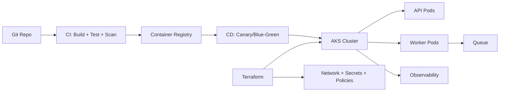
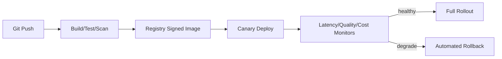

# GenAI Deployment: Docker, Kubernetes, Terraform, and CI/CD

## Overview
This topic covers production deployment architecture for GenAI systems: containerization, orchestration, infrastructure-as-code, and safe delivery pipelines.

## Why this topic matters
Interviewers expect senior architects to go beyond model and prompt design and explain how GenAI systems are deployed, scaled, secured, and released safely in enterprise environments.

## Core concepts
- Docker image strategy for AI services
- Kubernetes workload patterns
- AKS deployment architecture
- Worker autoscaling for async AI jobs
- Secrets/config management
- Terraform IaC foundations
- CI/CD with safety and quality gates
- Progressive delivery and rollback

## Detailed explanation of each concept
GenAI workloads include API ingress, retrieval services, background workers, model routing gateways, and observability components. Containerization standardizes runtime behavior. Kubernetes enables scaling and isolation across mixed workload profiles. Terraform provides repeatable environment provisioning and policy consistency.

CI/CD for GenAI must validate code and AI behavior artifacts (prompts, route policies, guardrails) together. Safe rollout uses canary/blue-green strategies with rollback triggers tied to quality, safety, latency, and cost.

## Evaluation (How to assess architecture quality)
- Deployment lead time and failure rate
- Rollback recovery time
- Runtime scaling efficiency (CPU/memory/queue lag)
- Security posture of images/secrets/network policies
- IaC drift and environment parity
- Release quality gates pass/fail trends

## Architecture / flow diagram


**Flow explanation:**  
Code and AI artifacts are validated in CI, images are scanned and stored, and CD deploys progressively to AKS. Terraform manages infra consistency. API and worker pods scale independently with queue-driven controls.

## Real-world example
A GenAI support platform deploys FastAPI ingress and async worker pods to AKS. Terraform provisions VNet, Key Vault, private endpoints, and cluster policy controls. CI pipeline runs security scans and eval gates; CD performs 10% canary before full promotion.

## Best practices
- Use minimal base images and pinned dependencies
- Separate API and worker deployments for independent scaling
- Keep secrets out of images and manifests
- Enforce IaC review and drift detection
- Gate release on quality + safety + performance checks
- Practice rollback drills regularly

## Common mistakes / misconceptions
- Single monolithic pod for all GenAI functions
- No image scanning or dependency governance
- Manual infra changes outside Terraform
- No queue-driven autoscaling for long tasks
- No rollout safety strategy for prompt/model changes

## Industry relevance
Mandatory for enterprise AI platforms where reliability, compliance, and delivery speed must coexist under high change velocity.

## Interview discussion points
- AKS architecture for mixed API/worker AI workloads
- Terraform module design for environment parity
- CI/CD gates for AI artifact changes
- Secure secrets/config deployment patterns
- Progressive rollout and rollback for GenAI releases

## Links to dependent / related topics
- [Python FastAPI Async Backend for GenAI](./python_fastapi_async_backend_for_genai.md)
- [LLMOps, Observability, and Evaluation](./llmops_observability_evaluation_langsmith_arize.md)
- [Compute Architecture Decisions](../compute/compute_architecture.md)
- [Security, IAM, Networking](../security/security_iam_networking.md)

## Interview Questions (50)
1. Why containerize GenAI services with Docker?
2. How do you design Docker images for AI backends?
3. What base image strategy is best for security and size?
4. How do you manage Python dependencies in container builds?
5. How do you secure container images for production?
6. How do you handle secrets in containerized GenAI apps?
7. Why use Kubernetes for GenAI workloads?
8. How do you separate API pods and worker pods?
9. How do you scale GenAI API pods?
10. How do you scale GenAI worker pods by queue depth?
11. How do readiness/liveness probes differ for AI workloads?
12. How do you design resource limits/requests for AI pods?
13. How do you prevent noisy-neighbor issues in AKS?
14. How do you handle long-running jobs in Kubernetes?
15. What deployment patterns work for model-serving services?
16. How do you design ingress for secure AI APIs?
17. How do you implement private networking in AKS for AI?
18. How do you use Key Vault with AKS workloads?
19. How do you enforce managed identity in Kubernetes workloads?
20. How do you handle config maps vs secrets safely?
21. How do you design multi-environment AKS architecture?
22. How do you design multi-region deployment for GenAI?
23. What is Terraform and why use it for AI platforms?
24. How do you structure Terraform modules for GenAI infra?
25. How do you manage Terraform state securely?
26. How do you prevent IaC drift in enterprise setups?
27. How do you design CI pipeline for GenAI apps?
28. What test gates should run before container build promotion?
29. How do you add security scanning to CI?
30. How do you add image scanning to release pipeline?
31. How do you include prompt/policy artifacts in CI/CD?
32. How do you run canary deployments for GenAI services?
33. Blue-green vs canary: when to use which?
34. How do you define rollback triggers in CD?
35. How do you rollback fast after bad AI release?
36. How do you handle schema changes in rolling deployments?
37. How do you manage backward compatibility in API rollout?
38. How do you design job queue migration during deployments?
39. How do you monitor deployment health post-release?
40. How do you connect deployment metrics to LLM quality metrics?
41. How do you manage cost in Kubernetes AI deployments?
42. How do you optimize node pool strategy for mixed workloads?
43. How do you design GPU vs CPU scheduling strategy?
44. How do you secure software supply chain for AI delivery?
45. How do you run disaster recovery drills for deployed AI platform?
46. What anti-patterns exist in GenAI platform deployment?
47. How do you define platform ownership across Dev, Ops, Security?
48. How do you present deployment trade-offs to leadership?
49. How do you build first-90-day deployment hardening roadmap?
50. How do you conclude deployment architecture interview answers strongly?

## Enhanced Answering Playbook (Crisp + Deep + Summary + Example)

Use this playbook for every answer in this deployment topic:

- **Crisp answer:** Start with direct architectural decision in interview-ready language.
- **Deep explanation:** Expand on controls, failure modes, and operational trade-offs.
- **Answer summary:** Close with three takeaways: decision, risk, mitigation.
- **Practical example:** Tie design to one realistic platform rollout.
- **Diagram thinking:** Explain build path, deploy path, and rollback path.

### Worked Example: Safe canary release for GenAI API
**Crisp answer:** Use canary rollout with explicit rollback thresholds on latency, error rate, safety violations, and cost-per-request.

**Deep explanation:**  
In enterprise deployment, CI first validates code, policy files, and prompt artifacts. Container images are scanned and signed before promotion. CD deploys a small traffic slice to new version while observing API p95 latency, queue lag, moderation failure rate, and token cost variance. If any KPI crosses threshold, automation triggers rollback and incident tagging. Terraform remains source of truth for infra so rollback does not create drift. This approach balances delivery speed with control and auditability.

**Answer summary:**  
- Progressive release limits blast radius.  
- Measurable rollback triggers prevent delayed decisions.  
- IaC consistency keeps recovery repeatable across environments.



## Answers for important questions (Summary + Crisp + Deep)

### Q1. Why containerize GenAI services with Docker?
**Question summary:** Tests deployment standardization reasoning.
**Crisp answer (7-8 lines):** Docker standardizes runtime across environments. It packages code, dependencies, and system libraries together. It reduces “works on my machine” issues. It simplifies CI/CD promotion across stages. It improves reproducibility and rollback. It enables orchestration in Kubernetes. It is foundational for scalable GenAI platform operations.
**Deep explanation (~60-70 lines):** A strong answer to 'Why containerize GenAI services with Docker?' should be framed through release engineering and platform reliability. Begin with the target business outcome and constraints (risk class, compliance scope, response-time target, and cost envelope), because these constraints determine acceptable design choices. Then describe the production path end-to-end: ingress validation, identity and policy checks, orchestration decisions, dependency execution, and output validation before user delivery. Explain why certain steps must remain deterministic (policy decisions, schema checks, authorization gates) while others can remain probabilistic (model reasoning), and how this boundary protects reliability. Discuss failure patterns specific to this domain: degraded dependencies, low-quality retrieval, policy conflicts, model unpredictability, and operational drift. Map each failure to containment controls such as bounded retries, fallback tiers, circuit-breakers, safe-abstain responses, or human approval gates. Add explicit trade-offs interviewers expect: faster response versus tighter governance, lower unit cost versus stronger quality, and centralized control versus team delivery speed. Cover security and privacy implications with concrete control points: least privilege, tenant-aware boundaries, sensitive-data minimization, and auditable traces for every high-risk path. Include measurable KPIs that prove architecture health: task success rate, groundedness or policy pass rate, p95 latency, fallback frequency, and cost per successful outcome. Close with change-safety practices: versioned artifacts, canary rollout, rollback triggers, and feedback loops that convert incidents into better tests and standards. This style demonstrates senior architect maturity because it connects design rationale, operational resilience, and business accountability in one coherent narrative.
**Answer summary:**
- **Decision:** Select the pattern that best satisfies `Why containerize GenAI services with Docker?` under your business and compliance constraints.
- **Risk:** Weak control boundaries and unclear ownership create quality, security, and reliability regressions at scale.
- **Mitigation:** Enforce policy gates, measurable SLO/SLA triggers, and tested fallback/recovery playbooks before full rollout.
**Practical example:** In a healthcare claims assistant, the team addresses 'Why containerize GenAI services with Docker?' by enforcing role-scoped access, validating each critical step through policy checks, and releasing changes with canary monitoring so quality and compliance remain stable under production traffic.
**Simple diagram:**  
```text
Code + Dependencies + Runtime -> Docker Image -> Consistent Execution
```
**Trusted reference links:**  
- https://docs.docker.com/get-started/

### Q2. How do you design Docker images for AI backends?
**Question summary:** Image engineering best practices.
**Crisp answer (7-8 lines):** Use multi-stage builds to reduce image size. Pin dependency versions for reproducibility. Keep base images minimal and patched. Separate build-time and runtime artifacts. Run as non-root user. Include healthcheck commands where useful. Avoid embedding secrets in image layers.
**Deep explanation (~60-70 lines):** A strong answer to 'How do you design Docker images for AI backends?' should be framed through release engineering and platform reliability. Begin with the target business outcome and constraints (risk class, compliance scope, response-time target, and cost envelope), because these constraints determine acceptable design choices. Then describe the production path end-to-end: ingress validation, identity and policy checks, orchestration decisions, dependency execution, and output validation before user delivery. Explain why certain steps must remain deterministic (policy decisions, schema checks, authorization gates) while others can remain probabilistic (model reasoning), and how this boundary protects reliability. Discuss failure patterns specific to this domain: degraded dependencies, low-quality retrieval, policy conflicts, model unpredictability, and operational drift. Map each failure to containment controls such as bounded retries, fallback tiers, circuit-breakers, safe-abstain responses, or human approval gates. Add explicit trade-offs interviewers expect: faster response versus tighter governance, lower unit cost versus stronger quality, and centralized control versus team delivery speed. Cover security and privacy implications with concrete control points: least privilege, tenant-aware boundaries, sensitive-data minimization, and auditable traces for every high-risk path. Include measurable KPIs that prove architecture health: task success rate, groundedness or policy pass rate, p95 latency, fallback frequency, and cost per successful outcome. Close with change-safety practices: versioned artifacts, canary rollout, rollback triggers, and feedback loops that convert incidents into better tests and standards. This style demonstrates senior architect maturity because it connects design rationale, operational resilience, and business accountability in one coherent narrative.
**Answer summary:**
- **Decision:** Select the pattern that best satisfies `How do you design Docker images for AI backends?` under your business and compliance constraints.
- **Risk:** Weak control boundaries and unclear ownership create quality, security, and reliability regressions at scale.
- **Mitigation:** Enforce policy gates, measurable SLO/SLA triggers, and tested fallback/recovery playbooks before full rollout.
**Practical example:** In a insurance underwriting knowledge bot, the team addresses 'How do you design Docker images for AI backends?' by enforcing role-scoped access, validating each critical step through policy checks, and releasing changes with canary monitoring so quality and compliance remain stable under production traffic.
**Simple diagram:**  
```text
Builder Stage -> Runtime Stage (minimal)
```
**Trusted reference links:**  
- https://docs.docker.com/build/building/multi-stage/

### Q3. What base image strategy is best for security and size?
**Question summary:** Security-performance trade-off.
**Crisp answer (7-8 lines):** Prefer minimal official base images with strong maintenance. Use distro variants that match runtime needs only. Avoid unnecessary packages and shells in production image. Track CVEs and update base image regularly. Pin digest for reproducible builds. Validate compatibility with required AI libraries. Balance minimalism and runtime stability.
**Deep explanation (~60-70 lines):** A strong answer to 'What base image strategy is best for security and size?' should be framed through security architecture and policy enforcement. Begin with the target business outcome and constraints (risk class, compliance scope, response-time target, and cost envelope), because these constraints determine acceptable design choices. Then describe the production path end-to-end: ingress validation, identity and policy checks, orchestration decisions, dependency execution, and output validation before user delivery. Explain why certain steps must remain deterministic (policy decisions, schema checks, authorization gates) while others can remain probabilistic (model reasoning), and how this boundary protects reliability. Discuss failure patterns specific to this domain: degraded dependencies, low-quality retrieval, policy conflicts, model unpredictability, and operational drift. Map each failure to containment controls such as bounded retries, fallback tiers, circuit-breakers, safe-abstain responses, or human approval gates. Add explicit trade-offs interviewers expect: faster response versus tighter governance, lower unit cost versus stronger quality, and centralized control versus team delivery speed. Cover security and privacy implications with concrete control points: least privilege, tenant-aware boundaries, sensitive-data minimization, and auditable traces for every high-risk path. Include measurable KPIs that prove architecture health: task success rate, groundedness or policy pass rate, p95 latency, fallback frequency, and cost per successful outcome. Close with change-safety practices: versioned artifacts, canary rollout, rollback triggers, and feedback loops that convert incidents into better tests and standards. This style demonstrates senior architect maturity because it connects design rationale, operational resilience, and business accountability in one coherent narrative.
**Answer summary:**
- **Decision:** Select the pattern that best satisfies `What base image strategy is best for security and size?` under your business and compliance constraints.
- **Risk:** Weak control boundaries and unclear ownership create quality, security, and reliability regressions at scale.
- **Mitigation:** Enforce policy gates, measurable SLO/SLA triggers, and tested fallback/recovery playbooks before full rollout.
**Practical example:** In a enterprise IT support assistant, the team addresses 'What base image strategy is best for security and size?' by enforcing role-scoped access, validating each critical step through policy checks, and releasing changes with canary monitoring so quality and compliance remain stable under production traffic.
**Simple diagram:**  
```text
Minimal Maintained Base -> Lower Surface + Better Patchability
```
**Trusted reference links:**  
- https://docs.docker.com/develop/dev-best-practices/

### Q4. How do you manage Python dependencies in container builds?
**Question summary:** Dependency reproducibility.
**Crisp answer (7-8 lines):** Use locked dependency files with explicit versions. Build wheels in separate stage where possible. Avoid dynamic latest installs in production builds. Cache dependency layers for faster CI. Scan dependencies for vulnerabilities. Keep runtime-only dependencies in final image. Rebuild regularly for security patch updates.
**Deep explanation (~60-70 lines):** A strong answer to 'How do you manage Python dependencies in container builds?' should be framed through enterprise architecture decision quality. Begin with the target business outcome and constraints (risk class, compliance scope, response-time target, and cost envelope), because these constraints determine acceptable design choices. Then describe the production path end-to-end: ingress validation, identity and policy checks, orchestration decisions, dependency execution, and output validation before user delivery. Explain why certain steps must remain deterministic (policy decisions, schema checks, authorization gates) while others can remain probabilistic (model reasoning), and how this boundary protects reliability. Discuss failure patterns specific to this domain: degraded dependencies, low-quality retrieval, policy conflicts, model unpredictability, and operational drift. Map each failure to containment controls such as bounded retries, fallback tiers, circuit-breakers, safe-abstain responses, or human approval gates. Add explicit trade-offs interviewers expect: faster response versus tighter governance, lower unit cost versus stronger quality, and centralized control versus team delivery speed. Cover security and privacy implications with concrete control points: least privilege, tenant-aware boundaries, sensitive-data minimization, and auditable traces for every high-risk path. Include measurable KPIs that prove architecture health: task success rate, groundedness or policy pass rate, p95 latency, fallback frequency, and cost per successful outcome. Close with change-safety practices: versioned artifacts, canary rollout, rollback triggers, and feedback loops that convert incidents into better tests and standards. This style demonstrates senior architect maturity because it connects design rationale, operational resilience, and business accountability in one coherent narrative.
**Answer summary:**
- **Decision:** Select the pattern that best satisfies `How do you manage Python dependencies in container builds?` under your business and compliance constraints.
- **Risk:** Weak control boundaries and unclear ownership create quality, security, and reliability regressions at scale.
- **Mitigation:** Enforce policy gates, measurable SLO/SLA triggers, and tested fallback/recovery playbooks before full rollout.
**Practical example:** In a procurement contract Q&A assistant, the team addresses 'How do you manage Python dependencies in container builds?' by enforcing role-scoped access, validating each critical step through policy checks, and releasing changes with canary monitoring so quality and compliance remain stable under production traffic.
**Simple diagram:**  
```text
requirements lock -> Build layer -> Scan -> Runtime image
```
**Trusted reference links:**  
- https://pip.pypa.io/en/stable/topics/repeatable-installs/

### Q5. How do you secure container images for production?
**Question summary:** Image security controls.
**Crisp answer (7-8 lines):** Scan images in CI and before deploy. Enforce severity thresholds for blocking releases. Remove unused binaries and package managers from runtime. Run as non-root and read-only FS when possible. Sign images and verify provenance. Patch base and dependencies continuously. Monitor runtime anomalies post-deployment.
**Deep explanation (~60-70 lines):** A strong answer to 'How do you secure container images for production?' should be framed through enterprise architecture decision quality. Begin with the target business outcome and constraints (risk class, compliance scope, response-time target, and cost envelope), because these constraints determine acceptable design choices. Then describe the production path end-to-end: ingress validation, identity and policy checks, orchestration decisions, dependency execution, and output validation before user delivery. Explain why certain steps must remain deterministic (policy decisions, schema checks, authorization gates) while others can remain probabilistic (model reasoning), and how this boundary protects reliability. Discuss failure patterns specific to this domain: degraded dependencies, low-quality retrieval, policy conflicts, model unpredictability, and operational drift. Map each failure to containment controls such as bounded retries, fallback tiers, circuit-breakers, safe-abstain responses, or human approval gates. Add explicit trade-offs interviewers expect: faster response versus tighter governance, lower unit cost versus stronger quality, and centralized control versus team delivery speed. Cover security and privacy implications with concrete control points: least privilege, tenant-aware boundaries, sensitive-data minimization, and auditable traces for every high-risk path. Include measurable KPIs that prove architecture health: task success rate, groundedness or policy pass rate, p95 latency, fallback frequency, and cost per successful outcome. Close with change-safety practices: versioned artifacts, canary rollout, rollback triggers, and feedback loops that convert incidents into better tests and standards. This style demonstrates senior architect maturity because it connects design rationale, operational resilience, and business accountability in one coherent narrative.
**Answer summary:**
- **Decision:** Select the pattern that best satisfies `How do you secure container images for production?` under your business and compliance constraints.
- **Risk:** Weak control boundaries and unclear ownership create quality, security, and reliability regressions at scale.
- **Mitigation:** Enforce policy gates, measurable SLO/SLA triggers, and tested fallback/recovery playbooks before full rollout.
**Practical example:** In a internal audit/compliance copilot, the team addresses 'How do you secure container images for production?' by enforcing role-scoped access, validating each critical step through policy checks, and releasing changes with canary monitoring so quality and compliance remain stable under production traffic.
**Simple diagram:**  
```text
Build -> Scan -> Sign -> Deploy -> Runtime Monitor
```
**Trusted reference links:**  
- https://kubernetes.io/docs/concepts/security/

### Q6. How do you handle secrets in containerized GenAI apps?
**Question summary:** Secret hygiene.
**Crisp answer (7-8 lines):** Never bake secrets into images. Inject at runtime from secret manager. Use workload identity for secret retrieval. Limit secret scope by environment and service. Rotate secrets with automation. Audit secret access continuously. Redact secrets in logs and crash dumps.
**Deep explanation (~60-70 lines):** A strong answer to 'How do you handle secrets in containerized GenAI apps?' should be framed through enterprise architecture decision quality. Begin with the target business outcome and constraints (risk class, compliance scope, response-time target, and cost envelope), because these constraints determine acceptable design choices. Then describe the production path end-to-end: ingress validation, identity and policy checks, orchestration decisions, dependency execution, and output validation before user delivery. Explain why certain steps must remain deterministic (policy decisions, schema checks, authorization gates) while others can remain probabilistic (model reasoning), and how this boundary protects reliability. Discuss failure patterns specific to this domain: degraded dependencies, low-quality retrieval, policy conflicts, model unpredictability, and operational drift. Map each failure to containment controls such as bounded retries, fallback tiers, circuit-breakers, safe-abstain responses, or human approval gates. Add explicit trade-offs interviewers expect: faster response versus tighter governance, lower unit cost versus stronger quality, and centralized control versus team delivery speed. Cover security and privacy implications with concrete control points: least privilege, tenant-aware boundaries, sensitive-data minimization, and auditable traces for every high-risk path. Include measurable KPIs that prove architecture health: task success rate, groundedness or policy pass rate, p95 latency, fallback frequency, and cost per successful outcome. Close with change-safety practices: versioned artifacts, canary rollout, rollback triggers, and feedback loops that convert incidents into better tests and standards. This style demonstrates senior architect maturity because it connects design rationale, operational resilience, and business accountability in one coherent narrative.
**Answer summary:**
- **Decision:** Select the pattern that best satisfies `How do you handle secrets in containerized GenAI apps?` under your business and compliance constraints.
- **Risk:** Weak control boundaries and unclear ownership create quality, security, and reliability regressions at scale.
- **Mitigation:** Enforce policy gates, measurable SLO/SLA triggers, and tested fallback/recovery playbooks before full rollout.
**Practical example:** In a customer support triage assistant, the team addresses 'How do you handle secrets in containerized GenAI apps?' by enforcing role-scoped access, validating each critical step through policy checks, and releasing changes with canary monitoring so quality and compliance remain stable under production traffic.
**Simple diagram:**  
```text
Pod Identity -> Secret Manager -> Runtime Secret Injection
```
**Trusted reference links:**  
- https://learn.microsoft.com/en-us/azure/key-vault/general/basic-concepts

### Q7. Why use Kubernetes for GenAI workloads?
**Question summary:** Orchestration justification.
**Crisp answer (7-8 lines):** Kubernetes provides scheduling, autoscaling, and resilience controls. It supports mixed workload types (API, workers, batch). It enables rolling updates and rollback patterns. It improves resource utilization via packing and limits. It supports policy and network isolation controls. It integrates with observability stacks. It is strong for enterprise multi-service AI platforms.
**Deep explanation (~60-70 lines):** A strong answer to 'Why use Kubernetes for GenAI workloads?' should be framed through release engineering and platform reliability. Begin with the target business outcome and constraints (risk class, compliance scope, response-time target, and cost envelope), because these constraints determine acceptable design choices. Then describe the production path end-to-end: ingress validation, identity and policy checks, orchestration decisions, dependency execution, and output validation before user delivery. Explain why certain steps must remain deterministic (policy decisions, schema checks, authorization gates) while others can remain probabilistic (model reasoning), and how this boundary protects reliability. Discuss failure patterns specific to this domain: degraded dependencies, low-quality retrieval, policy conflicts, model unpredictability, and operational drift. Map each failure to containment controls such as bounded retries, fallback tiers, circuit-breakers, safe-abstain responses, or human approval gates. Add explicit trade-offs interviewers expect: faster response versus tighter governance, lower unit cost versus stronger quality, and centralized control versus team delivery speed. Cover security and privacy implications with concrete control points: least privilege, tenant-aware boundaries, sensitive-data minimization, and auditable traces for every high-risk path. Include measurable KPIs that prove architecture health: task success rate, groundedness or policy pass rate, p95 latency, fallback frequency, and cost per successful outcome. Close with change-safety practices: versioned artifacts, canary rollout, rollback triggers, and feedback loops that convert incidents into better tests and standards. This style demonstrates senior architect maturity because it connects design rationale, operational resilience, and business accountability in one coherent narrative.
**Answer summary:**
- **Decision:** Select the pattern that best satisfies `Why use Kubernetes for GenAI workloads?` under your business and compliance constraints.
- **Risk:** Weak control boundaries and unclear ownership create quality, security, and reliability regressions at scale.
- **Mitigation:** Enforce policy gates, measurable SLO/SLA triggers, and tested fallback/recovery playbooks before full rollout.
**Practical example:** In a operations incident copilot, the team addresses 'Why use Kubernetes for GenAI workloads?' by enforcing role-scoped access, validating each critical step through policy checks, and releasing changes with canary monitoring so quality and compliance remain stable under production traffic.
**Simple diagram:**  
```text
K8s Control Plane -> API Pods + Worker Pods + Policies
```
**Trusted reference links:**  
- https://kubernetes.io/docs/concepts/overview/

### Q8. How do you separate API pods and worker pods?
**Question summary:** Workload isolation architecture.
**Crisp answer (7-8 lines):** Deploy API and worker as separate workloads. Assign independent autoscaling policies. Keep API optimized for low-latency ingress. Keep workers optimized for async job throughput. Isolate resource limits and failure domains. Use queue as decoupling boundary. Monitor both planes with separate SLOs.
**Deep explanation (~60-70 lines):** A strong answer to 'How do you separate API pods and worker pods?' should be framed through backend resilience and async orchestration. Begin with the target business outcome and constraints (risk class, compliance scope, response-time target, and cost envelope), because these constraints determine acceptable design choices. Then describe the production path end-to-end: ingress validation, identity and policy checks, orchestration decisions, dependency execution, and output validation before user delivery. Explain why certain steps must remain deterministic (policy decisions, schema checks, authorization gates) while others can remain probabilistic (model reasoning), and how this boundary protects reliability. Discuss failure patterns specific to this domain: degraded dependencies, low-quality retrieval, policy conflicts, model unpredictability, and operational drift. Map each failure to containment controls such as bounded retries, fallback tiers, circuit-breakers, safe-abstain responses, or human approval gates. Add explicit trade-offs interviewers expect: faster response versus tighter governance, lower unit cost versus stronger quality, and centralized control versus team delivery speed. Cover security and privacy implications with concrete control points: least privilege, tenant-aware boundaries, sensitive-data minimization, and auditable traces for every high-risk path. Include measurable KPIs that prove architecture health: task success rate, groundedness or policy pass rate, p95 latency, fallback frequency, and cost per successful outcome. Close with change-safety practices: versioned artifacts, canary rollout, rollback triggers, and feedback loops that convert incidents into better tests and standards. This style demonstrates senior architect maturity because it connects design rationale, operational resilience, and business accountability in one coherent narrative.
**Answer summary:**
- **Decision:** Select the pattern that best satisfies `How do you separate API pods and worker pods?` under your business and compliance constraints.
- **Risk:** Weak control boundaries and unclear ownership create quality, security, and reliability regressions at scale.
- **Mitigation:** Enforce policy gates, measurable SLO/SLA triggers, and tested fallback/recovery playbooks before full rollout.
**Practical example:** In a banking policy copilot, the team addresses 'How do you separate API pods and worker pods?' by enforcing role-scoped access, validating each critical step through policy checks, and releasing changes with canary monitoring so quality and compliance remain stable under production traffic.
**Simple diagram:**  
```text
Ingress API Deployment | Worker Deployment <- Queue
```
**Trusted reference links:**  
- https://learn.microsoft.com/en-us/azure/architecture/patterns/queue-based-load-leveling

### Q9. How do you scale GenAI API pods?
**Question summary:** HPA strategy.
**Crisp answer (7-8 lines):** Use HPA based on CPU, memory, and request metrics. Add custom metrics like p95 latency and in-flight requests. Set min/max replicas by SLO and cost goals. Use pre-warmed replicas for known peak windows. Apply pod disruption budgets for stability. Monitor scaling lag and request drops. Tune autoscaler with production telemetry.
**Deep explanation (~60-70 lines):** A strong answer to 'How do you scale GenAI API pods?' should be framed through enterprise architecture decision quality. Begin with the target business outcome and constraints (risk class, compliance scope, response-time target, and cost envelope), because these constraints determine acceptable design choices. Then describe the production path end-to-end: ingress validation, identity and policy checks, orchestration decisions, dependency execution, and output validation before user delivery. Explain why certain steps must remain deterministic (policy decisions, schema checks, authorization gates) while others can remain probabilistic (model reasoning), and how this boundary protects reliability. Discuss failure patterns specific to this domain: degraded dependencies, low-quality retrieval, policy conflicts, model unpredictability, and operational drift. Map each failure to containment controls such as bounded retries, fallback tiers, circuit-breakers, safe-abstain responses, or human approval gates. Add explicit trade-offs interviewers expect: faster response versus tighter governance, lower unit cost versus stronger quality, and centralized control versus team delivery speed. Cover security and privacy implications with concrete control points: least privilege, tenant-aware boundaries, sensitive-data minimization, and auditable traces for every high-risk path. Include measurable KPIs that prove architecture health: task success rate, groundedness or policy pass rate, p95 latency, fallback frequency, and cost per successful outcome. Close with change-safety practices: versioned artifacts, canary rollout, rollback triggers, and feedback loops that convert incidents into better tests and standards. This style demonstrates senior architect maturity because it connects design rationale, operational resilience, and business accountability in one coherent narrative.
**Answer summary:**
- **Decision:** Select the pattern that best satisfies `How do you scale GenAI API pods?` under your business and compliance constraints.
- **Risk:** Weak control boundaries and unclear ownership create quality, security, and reliability regressions at scale.
- **Mitigation:** Enforce policy gates, measurable SLO/SLA triggers, and tested fallback/recovery playbooks before full rollout.
**Practical example:** In a healthcare claims assistant, the team addresses 'How do you scale GenAI API pods?' by enforcing role-scoped access, validating each critical step through policy checks, and releasing changes with canary monitoring so quality and compliance remain stable under production traffic.
**Simple diagram:**  
```text
Traffic/Latency Metrics -> HPA -> Replica Adjustment
```
**Trusted reference links:**  
- https://kubernetes.io/docs/tasks/run-application/horizontal-pod-autoscale/

### Q10. How do you scale GenAI worker pods by queue depth?
**Question summary:** Async throughput scaling.
**Crisp answer (7-8 lines):** Use queue length and queue age as primary signals. Scale workers based on backlog and processing rate. Set upper bounds to protect downstream dependencies. Separate heavy/light job queues when needed. Include cooldown windows to reduce thrashing. Track lag recovery time as KPI. Tune thresholds per workload class.
**Deep explanation (~60-70 lines):** A strong answer to 'How do you scale GenAI worker pods by queue depth?' should be framed through backend resilience and async orchestration. Begin with the target business outcome and constraints (risk class, compliance scope, response-time target, and cost envelope), because these constraints determine acceptable design choices. Then describe the production path end-to-end: ingress validation, identity and policy checks, orchestration decisions, dependency execution, and output validation before user delivery. Explain why certain steps must remain deterministic (policy decisions, schema checks, authorization gates) while others can remain probabilistic (model reasoning), and how this boundary protects reliability. Discuss failure patterns specific to this domain: degraded dependencies, low-quality retrieval, policy conflicts, model unpredictability, and operational drift. Map each failure to containment controls such as bounded retries, fallback tiers, circuit-breakers, safe-abstain responses, or human approval gates. Add explicit trade-offs interviewers expect: faster response versus tighter governance, lower unit cost versus stronger quality, and centralized control versus team delivery speed. Cover security and privacy implications with concrete control points: least privilege, tenant-aware boundaries, sensitive-data minimization, and auditable traces for every high-risk path. Include measurable KPIs that prove architecture health: task success rate, groundedness or policy pass rate, p95 latency, fallback frequency, and cost per successful outcome. Close with change-safety practices: versioned artifacts, canary rollout, rollback triggers, and feedback loops that convert incidents into better tests and standards. This style demonstrates senior architect maturity because it connects design rationale, operational resilience, and business accountability in one coherent narrative.
**Answer summary:**
- **Decision:** Select the pattern that best satisfies `How do you scale GenAI worker pods by queue depth?` under your business and compliance constraints.
- **Risk:** Weak control boundaries and unclear ownership create quality, security, and reliability regressions at scale.
- **Mitigation:** Enforce policy gates, measurable SLO/SLA triggers, and tested fallback/recovery playbooks before full rollout.
**Practical example:** In a insurance underwriting knowledge bot, the team addresses 'How do you scale GenAI worker pods by queue depth?' by enforcing role-scoped access, validating each critical step through policy checks, and releasing changes with canary monitoring so quality and compliance remain stable under production traffic.
**Simple diagram:**  
```text
Queue Lag -> Worker Autoscaler -> Throughput Stabilization
```
**Trusted reference links:**  
- https://keda.sh/docs/

### Q11. How do readiness/liveness probes differ for AI workloads?
**Question summary:** Probe semantics.
**Crisp answer (7-8 lines):** Liveness checks if process should be restarted. Readiness checks if pod can accept traffic/jobs. AI readiness may include model cache warm status. Worker readiness may include queue connectivity. Keep probes lightweight and fast. Avoid deep expensive checks in probes. Alert on probe flapping patterns.
**Deep explanation (~60-70 lines):** A strong answer to 'How do readiness/liveness probes differ for AI workloads?' should be framed through enterprise architecture decision quality. Begin with the target business outcome and constraints (risk class, compliance scope, response-time target, and cost envelope), because these constraints determine acceptable design choices. Then describe the production path end-to-end: ingress validation, identity and policy checks, orchestration decisions, dependency execution, and output validation before user delivery. Explain why certain steps must remain deterministic (policy decisions, schema checks, authorization gates) while others can remain probabilistic (model reasoning), and how this boundary protects reliability. Discuss failure patterns specific to this domain: degraded dependencies, low-quality retrieval, policy conflicts, model unpredictability, and operational drift. Map each failure to containment controls such as bounded retries, fallback tiers, circuit-breakers, safe-abstain responses, or human approval gates. Add explicit trade-offs interviewers expect: faster response versus tighter governance, lower unit cost versus stronger quality, and centralized control versus team delivery speed. Cover security and privacy implications with concrete control points: least privilege, tenant-aware boundaries, sensitive-data minimization, and auditable traces for every high-risk path. Include measurable KPIs that prove architecture health: task success rate, groundedness or policy pass rate, p95 latency, fallback frequency, and cost per successful outcome. Close with change-safety practices: versioned artifacts, canary rollout, rollback triggers, and feedback loops that convert incidents into better tests and standards. This style demonstrates senior architect maturity because it connects design rationale, operational resilience, and business accountability in one coherent narrative.
**Answer summary:**
- **Decision:** Select the pattern that best satisfies `How do readiness/liveness probes differ for AI workloads?` under your business and compliance constraints.
- **Risk:** Weak control boundaries and unclear ownership create quality, security, and reliability regressions at scale.
- **Mitigation:** Enforce policy gates, measurable SLO/SLA triggers, and tested fallback/recovery playbooks before full rollout.
**Practical example:** In a enterprise IT support assistant, the team addresses 'How do readiness/liveness probes differ for AI workloads?' by enforcing role-scoped access, validating each critical step through policy checks, and releasing changes with canary monitoring so quality and compliance remain stable under production traffic.
**Simple diagram:**  
```text
Liveness: alive? | Readiness: ready for work?
```
**Trusted reference links:**  
- https://kubernetes.io/docs/tasks/configure-pod-container/configure-liveness-readiness-startup-probes/

### Q12. How do you design resource limits/requests for AI pods?
**Question summary:** Scheduling and stability.
**Crisp answer (7-8 lines):** Profile workload CPU/memory under realistic load first. Set requests for stable scheduling baseline. Set limits to prevent noisy-neighbor starvation. Separate profile for API and worker pods. Use vertical tuning from observed OOM/throttle events. Avoid extreme overcommit on critical services. Revisit values after major model/prompt changes.
**Deep explanation (~60-70 lines):** A strong answer to 'How do you design resource limits/requests for AI pods?' should be framed through enterprise architecture decision quality. Begin with the target business outcome and constraints (risk class, compliance scope, response-time target, and cost envelope), because these constraints determine acceptable design choices. Then describe the production path end-to-end: ingress validation, identity and policy checks, orchestration decisions, dependency execution, and output validation before user delivery. Explain why certain steps must remain deterministic (policy decisions, schema checks, authorization gates) while others can remain probabilistic (model reasoning), and how this boundary protects reliability. Discuss failure patterns specific to this domain: degraded dependencies, low-quality retrieval, policy conflicts, model unpredictability, and operational drift. Map each failure to containment controls such as bounded retries, fallback tiers, circuit-breakers, safe-abstain responses, or human approval gates. Add explicit trade-offs interviewers expect: faster response versus tighter governance, lower unit cost versus stronger quality, and centralized control versus team delivery speed. Cover security and privacy implications with concrete control points: least privilege, tenant-aware boundaries, sensitive-data minimization, and auditable traces for every high-risk path. Include measurable KPIs that prove architecture health: task success rate, groundedness or policy pass rate, p95 latency, fallback frequency, and cost per successful outcome. Close with change-safety practices: versioned artifacts, canary rollout, rollback triggers, and feedback loops that convert incidents into better tests and standards. This style demonstrates senior architect maturity because it connects design rationale, operational resilience, and business accountability in one coherent narrative.
**Answer summary:**
- **Decision:** Select the pattern that best satisfies `How do you design resource limits/requests for AI pods?` under your business and compliance constraints.
- **Risk:** Weak control boundaries and unclear ownership create quality, security, and reliability regressions at scale.
- **Mitigation:** Enforce policy gates, measurable SLO/SLA triggers, and tested fallback/recovery playbooks before full rollout.
**Practical example:** In a procurement contract Q&A assistant, the team addresses 'How do you design resource limits/requests for AI pods?' by enforcing role-scoped access, validating each critical step through policy checks, and releasing changes with canary monitoring so quality and compliance remain stable under production traffic.
**Simple diagram:**  
```text
Load Profile -> Requests/Limits -> Stable Scheduling
```
**Trusted reference links:**  
- https://kubernetes.io/docs/concepts/configuration/manage-resources-containers/

### Q13. How do you prevent noisy-neighbor issues in AKS?
**Question summary:** Multi-workload isolation.
**Crisp answer (7-8 lines):** Use namespaces, quotas, and limit ranges. Separate node pools by workload type and priority. Enforce resource requests/limits strictly. Use pod anti-affinity for critical services. Apply priority classes and disruption budgets. Monitor saturation by namespace/team. Rebalance workloads proactively.
**Deep explanation (~60-70 lines):** A strong answer to 'How do you prevent noisy-neighbor issues in AKS?' should be framed through release engineering and platform reliability. Begin with the target business outcome and constraints (risk class, compliance scope, response-time target, and cost envelope), because these constraints determine acceptable design choices. Then describe the production path end-to-end: ingress validation, identity and policy checks, orchestration decisions, dependency execution, and output validation before user delivery. Explain why certain steps must remain deterministic (policy decisions, schema checks, authorization gates) while others can remain probabilistic (model reasoning), and how this boundary protects reliability. Discuss failure patterns specific to this domain: degraded dependencies, low-quality retrieval, policy conflicts, model unpredictability, and operational drift. Map each failure to containment controls such as bounded retries, fallback tiers, circuit-breakers, safe-abstain responses, or human approval gates. Add explicit trade-offs interviewers expect: faster response versus tighter governance, lower unit cost versus stronger quality, and centralized control versus team delivery speed. Cover security and privacy implications with concrete control points: least privilege, tenant-aware boundaries, sensitive-data minimization, and auditable traces for every high-risk path. Include measurable KPIs that prove architecture health: task success rate, groundedness or policy pass rate, p95 latency, fallback frequency, and cost per successful outcome. Close with change-safety practices: versioned artifacts, canary rollout, rollback triggers, and feedback loops that convert incidents into better tests and standards. This style demonstrates senior architect maturity because it connects design rationale, operational resilience, and business accountability in one coherent narrative.
**Answer summary:**
- **Decision:** Select the pattern that best satisfies `How do you prevent noisy-neighbor issues in AKS?` under your business and compliance constraints.
- **Risk:** Weak control boundaries and unclear ownership create quality, security, and reliability regressions at scale.
- **Mitigation:** Enforce policy gates, measurable SLO/SLA triggers, and tested fallback/recovery playbooks before full rollout.
**Practical example:** In a internal audit/compliance copilot, the team addresses 'How do you prevent noisy-neighbor issues in AKS?' by enforcing role-scoped access, validating each critical step through policy checks, and releasing changes with canary monitoring so quality and compliance remain stable under production traffic.
**Simple diagram:**  
```text
Shared Cluster -> Quotas + Node Pool Segmentation -> Isolation
```
**Trusted reference links:**  
- https://learn.microsoft.com/en-us/azure/aks/concepts-clusters-workloads

### Q14. How do you handle long-running jobs in Kubernetes?
**Question summary:** Async execution pattern.
**Crisp answer (7-8 lines):** Use queue-driven workers or Kubernetes Jobs/CronJobs by use case. Keep job state externalized for retry/resume. Apply idempotency for repeated execution safety. Use timeout and retry policies with DLQ path. Separate high-priority and bulk job queues. Track job success, age, and failure class metrics. Provide status APIs to clients.
**Deep explanation (~60-70 lines):** A strong answer to 'How do you handle long-running jobs in Kubernetes?' should be framed through release engineering and platform reliability. Begin with the target business outcome and constraints (risk class, compliance scope, response-time target, and cost envelope), because these constraints determine acceptable design choices. Then describe the production path end-to-end: ingress validation, identity and policy checks, orchestration decisions, dependency execution, and output validation before user delivery. Explain why certain steps must remain deterministic (policy decisions, schema checks, authorization gates) while others can remain probabilistic (model reasoning), and how this boundary protects reliability. Discuss failure patterns specific to this domain: degraded dependencies, low-quality retrieval, policy conflicts, model unpredictability, and operational drift. Map each failure to containment controls such as bounded retries, fallback tiers, circuit-breakers, safe-abstain responses, or human approval gates. Add explicit trade-offs interviewers expect: faster response versus tighter governance, lower unit cost versus stronger quality, and centralized control versus team delivery speed. Cover security and privacy implications with concrete control points: least privilege, tenant-aware boundaries, sensitive-data minimization, and auditable traces for every high-risk path. Include measurable KPIs that prove architecture health: task success rate, groundedness or policy pass rate, p95 latency, fallback frequency, and cost per successful outcome. Close with change-safety practices: versioned artifacts, canary rollout, rollback triggers, and feedback loops that convert incidents into better tests and standards. This style demonstrates senior architect maturity because it connects design rationale, operational resilience, and business accountability in one coherent narrative.
**Answer summary:**
- **Decision:** Select the pattern that best satisfies `How do you handle long-running jobs in Kubernetes?` under your business and compliance constraints.
- **Risk:** Weak control boundaries and unclear ownership create quality, security, and reliability regressions at scale.
- **Mitigation:** Enforce policy gates, measurable SLO/SLA triggers, and tested fallback/recovery playbooks before full rollout.
**Practical example:** In a customer support triage assistant, the team addresses 'How do you handle long-running jobs in Kubernetes?' by enforcing role-scoped access, validating each critical step through policy checks, and releasing changes with canary monitoring so quality and compliance remain stable under production traffic.
**Simple diagram:**  
```text
Queue/Job -> Worker -> State Store -> Status
```
**Trusted reference links:**  
- https://kubernetes.io/docs/concepts/workloads/controllers/job/

### Q15. What deployment patterns work for model-serving services?
**Question summary:** Serving topology choices.
**Crisp answer (7-8 lines):** Use stateless API deployment for inference proxy routes. Use sidecar/model server only when latency critical and model local. Use worker-serving split for heavy preprocessing/postprocessing. Keep rollout strategy per model route. Add warm-up hooks for model endpoints. Separate high-risk routes for safer rollout. Monitor route-specific quality and latency.
**Deep explanation (~60-70 lines):** A strong answer to 'What deployment patterns work for model-serving services?' should be framed through release engineering and platform reliability. Begin with the target business outcome and constraints (risk class, compliance scope, response-time target, and cost envelope), because these constraints determine acceptable design choices. Then describe the production path end-to-end: ingress validation, identity and policy checks, orchestration decisions, dependency execution, and output validation before user delivery. Explain why certain steps must remain deterministic (policy decisions, schema checks, authorization gates) while others can remain probabilistic (model reasoning), and how this boundary protects reliability. Discuss failure patterns specific to this domain: degraded dependencies, low-quality retrieval, policy conflicts, model unpredictability, and operational drift. Map each failure to containment controls such as bounded retries, fallback tiers, circuit-breakers, safe-abstain responses, or human approval gates. Add explicit trade-offs interviewers expect: faster response versus tighter governance, lower unit cost versus stronger quality, and centralized control versus team delivery speed. Cover security and privacy implications with concrete control points: least privilege, tenant-aware boundaries, sensitive-data minimization, and auditable traces for every high-risk path. Include measurable KPIs that prove architecture health: task success rate, groundedness or policy pass rate, p95 latency, fallback frequency, and cost per successful outcome. Close with change-safety practices: versioned artifacts, canary rollout, rollback triggers, and feedback loops that convert incidents into better tests and standards. This style demonstrates senior architect maturity because it connects design rationale, operational resilience, and business accountability in one coherent narrative.
**Answer summary:**
- **Decision:** Select the pattern that best satisfies `What deployment patterns work for model-serving services?` under your business and compliance constraints.
- **Risk:** Weak control boundaries and unclear ownership create quality, security, and reliability regressions at scale.
- **Mitigation:** Enforce policy gates, measurable SLO/SLA triggers, and tested fallback/recovery playbooks before full rollout.
**Practical example:** In a operations incident copilot, the team addresses 'What deployment patterns work for model-serving services?' by enforcing role-scoped access, validating each critical step through policy checks, and releasing changes with canary monitoring so quality and compliance remain stable under production traffic.
**Simple diagram:**  
```text
Ingress API -> Model Route Proxy -> Model Endpoint(s)
```
**Trusted reference links:**  
- https://learn.microsoft.com/en-us/azure/architecture/ai-ml/guide/

### Q16. How do you design ingress for secure AI APIs?
**Question summary:** Edge security architecture.
**Crisp answer (7-8 lines):** Put gateway/WAF in front of cluster ingress. Enforce authN/authZ before API entry. Apply rate limits and payload limits at edge. Use TLS termination with strong cipher policies. Restrict allowed origins and headers appropriately. Log and monitor edge anomalies. Segment public and private endpoints clearly.
**Deep explanation (~60-70 lines):** A strong answer to 'How do you design ingress for secure AI APIs?' should be framed through enterprise architecture decision quality. Begin with the target business outcome and constraints (risk class, compliance scope, response-time target, and cost envelope), because these constraints determine acceptable design choices. Then describe the production path end-to-end: ingress validation, identity and policy checks, orchestration decisions, dependency execution, and output validation before user delivery. Explain why certain steps must remain deterministic (policy decisions, schema checks, authorization gates) while others can remain probabilistic (model reasoning), and how this boundary protects reliability. Discuss failure patterns specific to this domain: degraded dependencies, low-quality retrieval, policy conflicts, model unpredictability, and operational drift. Map each failure to containment controls such as bounded retries, fallback tiers, circuit-breakers, safe-abstain responses, or human approval gates. Add explicit trade-offs interviewers expect: faster response versus tighter governance, lower unit cost versus stronger quality, and centralized control versus team delivery speed. Cover security and privacy implications with concrete control points: least privilege, tenant-aware boundaries, sensitive-data minimization, and auditable traces for every high-risk path. Include measurable KPIs that prove architecture health: task success rate, groundedness or policy pass rate, p95 latency, fallback frequency, and cost per successful outcome. Close with change-safety practices: versioned artifacts, canary rollout, rollback triggers, and feedback loops that convert incidents into better tests and standards. This style demonstrates senior architect maturity because it connects design rationale, operational resilience, and business accountability in one coherent narrative.
**Answer summary:**
- **Decision:** Select the pattern that best satisfies `How do you design ingress for secure AI APIs?` under your business and compliance constraints.
- **Risk:** Weak control boundaries and unclear ownership create quality, security, and reliability regressions at scale.
- **Mitigation:** Enforce policy gates, measurable SLO/SLA triggers, and tested fallback/recovery playbooks before full rollout.
**Practical example:** In a banking policy copilot, the team addresses 'How do you design ingress for secure AI APIs?' by enforcing role-scoped access, validating each critical step through policy checks, and releasing changes with canary monitoring so quality and compliance remain stable under production traffic.
**Simple diagram:**  
```text
Client -> WAF/Gateway -> Ingress -> API Pods
```
**Trusted reference links:**  
- https://learn.microsoft.com/en-us/azure/web-application-firewall/overview

### Q17. How do you implement private networking in AKS for AI?
**Question summary:** Network isolation design.
**Crisp answer (7-8 lines):** Use private cluster and private endpoints where possible. Restrict outbound via firewall and egress rules. Keep data services on private links. Use network policies to limit pod-to-pod traffic. Segregate sensitive workloads by subnet/node pool. Monitor network flow logs for anomalies. Test failover with private routing paths.
**Deep explanation (~60-70 lines):** A strong answer to 'How do you implement private networking in AKS for AI?' should be framed through release engineering and platform reliability. Begin with the target business outcome and constraints (risk class, compliance scope, response-time target, and cost envelope), because these constraints determine acceptable design choices. Then describe the production path end-to-end: ingress validation, identity and policy checks, orchestration decisions, dependency execution, and output validation before user delivery. Explain why certain steps must remain deterministic (policy decisions, schema checks, authorization gates) while others can remain probabilistic (model reasoning), and how this boundary protects reliability. Discuss failure patterns specific to this domain: degraded dependencies, low-quality retrieval, policy conflicts, model unpredictability, and operational drift. Map each failure to containment controls such as bounded retries, fallback tiers, circuit-breakers, safe-abstain responses, or human approval gates. Add explicit trade-offs interviewers expect: faster response versus tighter governance, lower unit cost versus stronger quality, and centralized control versus team delivery speed. Cover security and privacy implications with concrete control points: least privilege, tenant-aware boundaries, sensitive-data minimization, and auditable traces for every high-risk path. Include measurable KPIs that prove architecture health: task success rate, groundedness or policy pass rate, p95 latency, fallback frequency, and cost per successful outcome. Close with change-safety practices: versioned artifacts, canary rollout, rollback triggers, and feedback loops that convert incidents into better tests and standards. This style demonstrates senior architect maturity because it connects design rationale, operational resilience, and business accountability in one coherent narrative.
**Answer summary:**
- **Decision:** Select the pattern that best satisfies `How do you implement private networking in AKS for AI?` under your business and compliance constraints.
- **Risk:** Weak control boundaries and unclear ownership create quality, security, and reliability regressions at scale.
- **Mitigation:** Enforce policy gates, measurable SLO/SLA triggers, and tested fallback/recovery playbooks before full rollout.
**Practical example:** In a healthcare claims assistant, the team addresses 'How do you implement private networking in AKS for AI?' by enforcing role-scoped access, validating each critical step through policy checks, and releasing changes with canary monitoring so quality and compliance remain stable under production traffic.
**Simple diagram:**  
```text
Private AKS -> Private Endpoints -> Data/AI Services
```
**Trusted reference links:**  
- https://learn.microsoft.com/en-us/azure/aks/private-clusters

### Q18. How do you use Key Vault with AKS workloads?
**Question summary:** Secret retrieval integration.
**Crisp answer (7-8 lines):** Use workload identity to access Key Vault. Mount or inject secrets at runtime only. Avoid static Kubernetes secrets when possible for sensitive values. Rotate secrets centrally in Key Vault. Restrict vault access by pod identity scope. Audit secret retrieval calls. Handle secret refresh in long-running pods.
**Deep explanation (~60-70 lines):** A strong answer to 'How do you use Key Vault with AKS workloads?' should be framed through release engineering and platform reliability. Begin with the target business outcome and constraints (risk class, compliance scope, response-time target, and cost envelope), because these constraints determine acceptable design choices. Then describe the production path end-to-end: ingress validation, identity and policy checks, orchestration decisions, dependency execution, and output validation before user delivery. Explain why certain steps must remain deterministic (policy decisions, schema checks, authorization gates) while others can remain probabilistic (model reasoning), and how this boundary protects reliability. Discuss failure patterns specific to this domain: degraded dependencies, low-quality retrieval, policy conflicts, model unpredictability, and operational drift. Map each failure to containment controls such as bounded retries, fallback tiers, circuit-breakers, safe-abstain responses, or human approval gates. Add explicit trade-offs interviewers expect: faster response versus tighter governance, lower unit cost versus stronger quality, and centralized control versus team delivery speed. Cover security and privacy implications with concrete control points: least privilege, tenant-aware boundaries, sensitive-data minimization, and auditable traces for every high-risk path. Include measurable KPIs that prove architecture health: task success rate, groundedness or policy pass rate, p95 latency, fallback frequency, and cost per successful outcome. Close with change-safety practices: versioned artifacts, canary rollout, rollback triggers, and feedback loops that convert incidents into better tests and standards. This style demonstrates senior architect maturity because it connects design rationale, operational resilience, and business accountability in one coherent narrative.
**Answer summary:**
- **Decision:** Select the pattern that best satisfies `How do you use Key Vault with AKS workloads?` under your business and compliance constraints.
- **Risk:** Weak control boundaries and unclear ownership create quality, security, and reliability regressions at scale.
- **Mitigation:** Enforce policy gates, measurable SLO/SLA triggers, and tested fallback/recovery playbooks before full rollout.
**Practical example:** In a insurance underwriting knowledge bot, the team addresses 'How do you use Key Vault with AKS workloads?' by enforcing role-scoped access, validating each critical step through policy checks, and releasing changes with canary monitoring so quality and compliance remain stable under production traffic.
**Simple diagram:**  
```text
Pod Identity -> Key Vault -> Runtime Secret
```
**Trusted reference links:**  
- https://learn.microsoft.com/en-us/azure/aks/csi-secrets-store-driver

### Q19. How do you enforce managed identity in Kubernetes workloads?
**Question summary:** Identity-first workload security.
**Crisp answer (7-8 lines):** Enable workload identity integration in cluster. Bind service accounts to managed identities. Remove static cloud credentials from pods. Scope identity permissions minimally per workload. Audit identity usage and anomalies. Separate identities for API and worker components. Rotate role assignments through governance process.
**Deep explanation (~60-70 lines):** A strong answer to 'How do you enforce managed identity in Kubernetes workloads?' should be framed through release engineering and platform reliability. Begin with the target business outcome and constraints (risk class, compliance scope, response-time target, and cost envelope), because these constraints determine acceptable design choices. Then describe the production path end-to-end: ingress validation, identity and policy checks, orchestration decisions, dependency execution, and output validation before user delivery. Explain why certain steps must remain deterministic (policy decisions, schema checks, authorization gates) while others can remain probabilistic (model reasoning), and how this boundary protects reliability. Discuss failure patterns specific to this domain: degraded dependencies, low-quality retrieval, policy conflicts, model unpredictability, and operational drift. Map each failure to containment controls such as bounded retries, fallback tiers, circuit-breakers, safe-abstain responses, or human approval gates. Add explicit trade-offs interviewers expect: faster response versus tighter governance, lower unit cost versus stronger quality, and centralized control versus team delivery speed. Cover security and privacy implications with concrete control points: least privilege, tenant-aware boundaries, sensitive-data minimization, and auditable traces for every high-risk path. Include measurable KPIs that prove architecture health: task success rate, groundedness or policy pass rate, p95 latency, fallback frequency, and cost per successful outcome. Close with change-safety practices: versioned artifacts, canary rollout, rollback triggers, and feedback loops that convert incidents into better tests and standards. This style demonstrates senior architect maturity because it connects design rationale, operational resilience, and business accountability in one coherent narrative.
**Answer summary:**
- **Decision:** Select the pattern that best satisfies `How do you enforce managed identity in Kubernetes workloads?` under your business and compliance constraints.
- **Risk:** Weak control boundaries and unclear ownership create quality, security, and reliability regressions at scale.
- **Mitigation:** Enforce policy gates, measurable SLO/SLA triggers, and tested fallback/recovery playbooks before full rollout.
**Practical example:** In a enterprise IT support assistant, the team addresses 'How do you enforce managed identity in Kubernetes workloads?' by enforcing role-scoped access, validating each critical step through policy checks, and releasing changes with canary monitoring so quality and compliance remain stable under production traffic.
**Simple diagram:**  
```text
K8s ServiceAccount -> Managed Identity -> Cloud Resource Access
```
**Trusted reference links:**  
- https://learn.microsoft.com/en-us/azure/aks/workload-identity-overview

### Q20. How do you handle config maps vs secrets safely?
**Question summary:** Config hygiene.
**Crisp answer (7-8 lines):** Store non-sensitive config in ConfigMaps. Store sensitive values in secret manager integrations. Never place secrets in plain ConfigMaps. Version configuration and validate changes before rollout. Scope config access by namespace/workload. Reload configs safely with rollout strategy. Audit config/secret change events.
**Deep explanation (~60-70 lines):** A strong answer to 'How do you handle config maps vs secrets safely?' should be framed through enterprise architecture decision quality. Begin with the target business outcome and constraints (risk class, compliance scope, response-time target, and cost envelope), because these constraints determine acceptable design choices. Then describe the production path end-to-end: ingress validation, identity and policy checks, orchestration decisions, dependency execution, and output validation before user delivery. Explain why certain steps must remain deterministic (policy decisions, schema checks, authorization gates) while others can remain probabilistic (model reasoning), and how this boundary protects reliability. Discuss failure patterns specific to this domain: degraded dependencies, low-quality retrieval, policy conflicts, model unpredictability, and operational drift. Map each failure to containment controls such as bounded retries, fallback tiers, circuit-breakers, safe-abstain responses, or human approval gates. Add explicit trade-offs interviewers expect: faster response versus tighter governance, lower unit cost versus stronger quality, and centralized control versus team delivery speed. Cover security and privacy implications with concrete control points: least privilege, tenant-aware boundaries, sensitive-data minimization, and auditable traces for every high-risk path. Include measurable KPIs that prove architecture health: task success rate, groundedness or policy pass rate, p95 latency, fallback frequency, and cost per successful outcome. Close with change-safety practices: versioned artifacts, canary rollout, rollback triggers, and feedback loops that convert incidents into better tests and standards. This style demonstrates senior architect maturity because it connects design rationale, operational resilience, and business accountability in one coherent narrative.
**Answer summary:**
- **Decision:** Select the pattern that best satisfies `How do you handle config maps vs secrets safely?` under your business and compliance constraints.
- **Risk:** Weak control boundaries and unclear ownership create quality, security, and reliability regressions at scale.
- **Mitigation:** Enforce policy gates, measurable SLO/SLA triggers, and tested fallback/recovery playbooks before full rollout.
**Practical example:** In a procurement contract Q&A assistant, the team addresses 'How do you handle config maps vs secrets safely?' by enforcing role-scoped access, validating each critical step through policy checks, and releasing changes with canary monitoring so quality and compliance remain stable under production traffic.
**Simple diagram:**  
```text
ConfigMap (non-sensitive) | Secret Store (sensitive)
```
**Trusted reference links:**  
- https://kubernetes.io/docs/concepts/configuration/configmap/

### Q21. How do you design multi-environment AKS architecture?
**Question summary:** Env segregation strategy.
**Crisp answer (7-8 lines):** Separate dev/test/prod clusters or strong namespace boundaries by risk level. Use distinct identities, secrets, and quotas per environment. Keep IaC-driven parity across environments. Restrict production access strictly. Mirror key observability and policy controls in lower envs. Validate promotion workflow between environments. Prevent cross-env secret reuse.
**Deep explanation (~60-70 lines):** A strong answer to 'How do you design multi-environment AKS architecture?' should be framed through release engineering and platform reliability. Begin with the target business outcome and constraints (risk class, compliance scope, response-time target, and cost envelope), because these constraints determine acceptable design choices. Then describe the production path end-to-end: ingress validation, identity and policy checks, orchestration decisions, dependency execution, and output validation before user delivery. Explain why certain steps must remain deterministic (policy decisions, schema checks, authorization gates) while others can remain probabilistic (model reasoning), and how this boundary protects reliability. Discuss failure patterns specific to this domain: degraded dependencies, low-quality retrieval, policy conflicts, model unpredictability, and operational drift. Map each failure to containment controls such as bounded retries, fallback tiers, circuit-breakers, safe-abstain responses, or human approval gates. Add explicit trade-offs interviewers expect: faster response versus tighter governance, lower unit cost versus stronger quality, and centralized control versus team delivery speed. Cover security and privacy implications with concrete control points: least privilege, tenant-aware boundaries, sensitive-data minimization, and auditable traces for every high-risk path. Include measurable KPIs that prove architecture health: task success rate, groundedness or policy pass rate, p95 latency, fallback frequency, and cost per successful outcome. Close with change-safety practices: versioned artifacts, canary rollout, rollback triggers, and feedback loops that convert incidents into better tests and standards. This style demonstrates senior architect maturity because it connects design rationale, operational resilience, and business accountability in one coherent narrative.
**Answer summary:**
- **Decision:** Select the pattern that best satisfies `How do you design multi-environment AKS architecture?` under your business and compliance constraints.
- **Risk:** Weak control boundaries and unclear ownership create quality, security, and reliability regressions at scale.
- **Mitigation:** Enforce policy gates, measurable SLO/SLA triggers, and tested fallback/recovery playbooks before full rollout.
**Practical example:** In a internal audit/compliance copilot, the team addresses 'How do you design multi-environment AKS architecture?' by enforcing role-scoped access, validating each critical step through policy checks, and releasing changes with canary monitoring so quality and compliance remain stable under production traffic.
**Simple diagram:**  
```text
Dev -> Test -> Prod (separate identities/policies)
```
**Trusted reference links:**  
- https://learn.microsoft.com/en-us/azure/cloud-adoption-framework/

### Q22. How do you design multi-region deployment for GenAI?
**Question summary:** Availability and compliance.
**Crisp answer (7-8 lines):** Deploy replicated API/worker stacks per region. Use global traffic management for routing/failover. Replicate required state with consistency strategy. Keep policies and configs region-consistent. Respect data residency constraints explicitly. Drill failover regularly. Measure regional latency and recovery objectives.
**Deep explanation (~60-70 lines):** A strong answer to 'How do you design multi-region deployment for GenAI?' should be framed through release engineering and platform reliability. Begin with the target business outcome and constraints (risk class, compliance scope, response-time target, and cost envelope), because these constraints determine acceptable design choices. Then describe the production path end-to-end: ingress validation, identity and policy checks, orchestration decisions, dependency execution, and output validation before user delivery. Explain why certain steps must remain deterministic (policy decisions, schema checks, authorization gates) while others can remain probabilistic (model reasoning), and how this boundary protects reliability. Discuss failure patterns specific to this domain: degraded dependencies, low-quality retrieval, policy conflicts, model unpredictability, and operational drift. Map each failure to containment controls such as bounded retries, fallback tiers, circuit-breakers, safe-abstain responses, or human approval gates. Add explicit trade-offs interviewers expect: faster response versus tighter governance, lower unit cost versus stronger quality, and centralized control versus team delivery speed. Cover security and privacy implications with concrete control points: least privilege, tenant-aware boundaries, sensitive-data minimization, and auditable traces for every high-risk path. Include measurable KPIs that prove architecture health: task success rate, groundedness or policy pass rate, p95 latency, fallback frequency, and cost per successful outcome. Close with change-safety practices: versioned artifacts, canary rollout, rollback triggers, and feedback loops that convert incidents into better tests and standards. This style demonstrates senior architect maturity because it connects design rationale, operational resilience, and business accountability in one coherent narrative.
**Answer summary:**
- **Decision:** Select the pattern that best satisfies `How do you design multi-region deployment for GenAI?` under your business and compliance constraints.
- **Risk:** Weak control boundaries and unclear ownership create quality, security, and reliability regressions at scale.
- **Mitigation:** Enforce policy gates, measurable SLO/SLA triggers, and tested fallback/recovery playbooks before full rollout.
**Practical example:** In a customer support triage assistant, the team addresses 'How do you design multi-region deployment for GenAI?' by enforcing role-scoped access, validating each critical step through policy checks, and releasing changes with canary monitoring so quality and compliance remain stable under production traffic.
**Simple diagram:**  
```text
Global Router -> Region A/B AKS Stacks
```
**Trusted reference links:**  
- https://learn.microsoft.com/en-us/azure/architecture/guide/design-principles/design-for-resiliency

### Q23. What is Terraform and why use it for AI platforms?
**Question summary:** IaC rationale.
**Crisp answer (7-8 lines):** Terraform defines infrastructure as declarative code. It ensures repeatable environment provisioning. It improves consistency and auditability. It reduces manual configuration drift. It supports modular reusable platform patterns. It integrates with CI for policy checks. It is foundational for enterprise-scale infrastructure governance.
**Deep explanation (~60-70 lines):** A strong answer to 'What is Terraform and why use it for AI platforms?' should be framed through release engineering and platform reliability. Begin with the target business outcome and constraints (risk class, compliance scope, response-time target, and cost envelope), because these constraints determine acceptable design choices. Then describe the production path end-to-end: ingress validation, identity and policy checks, orchestration decisions, dependency execution, and output validation before user delivery. Explain why certain steps must remain deterministic (policy decisions, schema checks, authorization gates) while others can remain probabilistic (model reasoning), and how this boundary protects reliability. Discuss failure patterns specific to this domain: degraded dependencies, low-quality retrieval, policy conflicts, model unpredictability, and operational drift. Map each failure to containment controls such as bounded retries, fallback tiers, circuit-breakers, safe-abstain responses, or human approval gates. Add explicit trade-offs interviewers expect: faster response versus tighter governance, lower unit cost versus stronger quality, and centralized control versus team delivery speed. Cover security and privacy implications with concrete control points: least privilege, tenant-aware boundaries, sensitive-data minimization, and auditable traces for every high-risk path. Include measurable KPIs that prove architecture health: task success rate, groundedness or policy pass rate, p95 latency, fallback frequency, and cost per successful outcome. Close with change-safety practices: versioned artifacts, canary rollout, rollback triggers, and feedback loops that convert incidents into better tests and standards. This style demonstrates senior architect maturity because it connects design rationale, operational resilience, and business accountability in one coherent narrative.
**Answer summary:**
- **Decision:** Select the pattern that best satisfies `What is Terraform and why use it for AI platforms?` under your business and compliance constraints.
- **Risk:** Weak control boundaries and unclear ownership create quality, security, and reliability regressions at scale.
- **Mitigation:** Enforce policy gates, measurable SLO/SLA triggers, and tested fallback/recovery playbooks before full rollout.
**Practical example:** In a operations incident copilot, the team addresses 'What is Terraform and why use it for AI platforms?' by enforcing role-scoped access, validating each critical step through policy checks, and releasing changes with canary monitoring so quality and compliance remain stable under production traffic.
**Simple diagram:**  
```text
Terraform Code -> Plan/Apply -> Consistent Infra
```
**Trusted reference links:**  
- https://developer.hashicorp.com/terraform/docs

### Q24. How do you structure Terraform modules for GenAI infra?
**Question summary:** IaC architecture design.
**Crisp answer (7-8 lines):** Create modules for network, AKS, identity, secrets, observability, and messaging. Keep module interfaces minimal and explicit. Use environment-specific variable sets. Version modules with release tags. Enforce policy checks on plans. Avoid giant monolithic root modules. Document dependencies and outputs clearly.
**Deep explanation (~60-70 lines):** A strong answer to 'How do you structure Terraform modules for GenAI infra?' should be framed through release engineering and platform reliability. Begin with the target business outcome and constraints (risk class, compliance scope, response-time target, and cost envelope), because these constraints determine acceptable design choices. Then describe the production path end-to-end: ingress validation, identity and policy checks, orchestration decisions, dependency execution, and output validation before user delivery. Explain why certain steps must remain deterministic (policy decisions, schema checks, authorization gates) while others can remain probabilistic (model reasoning), and how this boundary protects reliability. Discuss failure patterns specific to this domain: degraded dependencies, low-quality retrieval, policy conflicts, model unpredictability, and operational drift. Map each failure to containment controls such as bounded retries, fallback tiers, circuit-breakers, safe-abstain responses, or human approval gates. Add explicit trade-offs interviewers expect: faster response versus tighter governance, lower unit cost versus stronger quality, and centralized control versus team delivery speed. Cover security and privacy implications with concrete control points: least privilege, tenant-aware boundaries, sensitive-data minimization, and auditable traces for every high-risk path. Include measurable KPIs that prove architecture health: task success rate, groundedness or policy pass rate, p95 latency, fallback frequency, and cost per successful outcome. Close with change-safety practices: versioned artifacts, canary rollout, rollback triggers, and feedback loops that convert incidents into better tests and standards. This style demonstrates senior architect maturity because it connects design rationale, operational resilience, and business accountability in one coherent narrative.
**Answer summary:**
- **Decision:** Select the pattern that best satisfies `How do you structure Terraform modules for GenAI infra?` under your business and compliance constraints.
- **Risk:** Weak control boundaries and unclear ownership create quality, security, and reliability regressions at scale.
- **Mitigation:** Enforce policy gates, measurable SLO/SLA triggers, and tested fallback/recovery playbooks before full rollout.
**Practical example:** In a banking policy copilot, the team addresses 'How do you structure Terraform modules for GenAI infra?' by enforcing role-scoped access, validating each critical step through policy checks, and releasing changes with canary monitoring so quality and compliance remain stable under production traffic.
**Simple diagram:**  
```text
Root Stack -> Network | AKS | Identity | Secrets | Observability Modules
```
**Trusted reference links:**  
- https://developer.hashicorp.com/terraform/language/modules

### Q25. How do you manage Terraform state securely?
**Question summary:** State security and reliability.
**Crisp answer (7-8 lines):** Store state in secure remote backend with locking. Encrypt state at rest and in transit. Restrict backend access by least privilege. Separate state files by environment and domain. Enable versioning/backup for recovery. Avoid storing secrets in state when possible. Audit state access events.
**Deep explanation (~60-70 lines):** A strong answer to 'How do you manage Terraform state securely?' should be framed through release engineering and platform reliability. Begin with the target business outcome and constraints (risk class, compliance scope, response-time target, and cost envelope), because these constraints determine acceptable design choices. Then describe the production path end-to-end: ingress validation, identity and policy checks, orchestration decisions, dependency execution, and output validation before user delivery. Explain why certain steps must remain deterministic (policy decisions, schema checks, authorization gates) while others can remain probabilistic (model reasoning), and how this boundary protects reliability. Discuss failure patterns specific to this domain: degraded dependencies, low-quality retrieval, policy conflicts, model unpredictability, and operational drift. Map each failure to containment controls such as bounded retries, fallback tiers, circuit-breakers, safe-abstain responses, or human approval gates. Add explicit trade-offs interviewers expect: faster response versus tighter governance, lower unit cost versus stronger quality, and centralized control versus team delivery speed. Cover security and privacy implications with concrete control points: least privilege, tenant-aware boundaries, sensitive-data minimization, and auditable traces for every high-risk path. Include measurable KPIs that prove architecture health: task success rate, groundedness or policy pass rate, p95 latency, fallback frequency, and cost per successful outcome. Close with change-safety practices: versioned artifacts, canary rollout, rollback triggers, and feedback loops that convert incidents into better tests and standards. This style demonstrates senior architect maturity because it connects design rationale, operational resilience, and business accountability in one coherent narrative.
**Answer summary:**
- **Decision:** Select the pattern that best satisfies `How do you manage Terraform state securely?` under your business and compliance constraints.
- **Risk:** Weak control boundaries and unclear ownership create quality, security, and reliability regressions at scale.
- **Mitigation:** Enforce policy gates, measurable SLO/SLA triggers, and tested fallback/recovery playbooks before full rollout.
**Practical example:** In a healthcare claims assistant, the team addresses 'How do you manage Terraform state securely?' by enforcing role-scoped access, validating each critical step through policy checks, and releasing changes with canary monitoring so quality and compliance remain stable under production traffic.
**Simple diagram:**  
```text
Terraform -> Secure Remote State Backend (locked/encrypted)
```
**Trusted reference links:**  
- https://developer.hashicorp.com/terraform/language/state

### Q26. How do you prevent IaC drift in enterprise setups?
**Question summary:** Configuration governance.
**Crisp answer (7-8 lines):** Enforce all infra changes through Terraform pipelines. Detect drift with scheduled plan checks. Block manual console edits with governance policy where possible. Alert on detected drift quickly. Reconcile drift via controlled IaC updates. Track drift incidents by team/domain. Educate teams on GitOps workflow.
**Deep explanation (~60-70 lines):** A strong answer to 'How do you prevent IaC drift in enterprise setups?' should be framed through LLMOps observability and evaluation governance. Begin with the target business outcome and constraints (risk class, compliance scope, response-time target, and cost envelope), because these constraints determine acceptable design choices. Then describe the production path end-to-end: ingress validation, identity and policy checks, orchestration decisions, dependency execution, and output validation before user delivery. Explain why certain steps must remain deterministic (policy decisions, schema checks, authorization gates) while others can remain probabilistic (model reasoning), and how this boundary protects reliability. Discuss failure patterns specific to this domain: degraded dependencies, low-quality retrieval, policy conflicts, model unpredictability, and operational drift. Map each failure to containment controls such as bounded retries, fallback tiers, circuit-breakers, safe-abstain responses, or human approval gates. Add explicit trade-offs interviewers expect: faster response versus tighter governance, lower unit cost versus stronger quality, and centralized control versus team delivery speed. Cover security and privacy implications with concrete control points: least privilege, tenant-aware boundaries, sensitive-data minimization, and auditable traces for every high-risk path. Include measurable KPIs that prove architecture health: task success rate, groundedness or policy pass rate, p95 latency, fallback frequency, and cost per successful outcome. Close with change-safety practices: versioned artifacts, canary rollout, rollback triggers, and feedback loops that convert incidents into better tests and standards. This style demonstrates senior architect maturity because it connects design rationale, operational resilience, and business accountability in one coherent narrative.
**Answer summary:**
- **Decision:** Select the pattern that best satisfies `How do you prevent IaC drift in enterprise setups?` under your business and compliance constraints.
- **Risk:** Weak control boundaries and unclear ownership create quality, security, and reliability regressions at scale.
- **Mitigation:** Enforce policy gates, measurable SLO/SLA triggers, and tested fallback/recovery playbooks before full rollout.
**Practical example:** In a insurance underwriting knowledge bot, the team addresses 'How do you prevent IaC drift in enterprise setups?' by enforcing role-scoped access, validating each critical step through policy checks, and releasing changes with canary monitoring so quality and compliance remain stable under production traffic.
**Simple diagram:**  
```text
Scheduled Plan -> Drift Detection -> Reconcile via Code
```
**Trusted reference links:**  
- https://learn.microsoft.com/en-us/azure/governance/policy/overview

### Q27. How do you design CI pipeline for GenAI apps?
**Question summary:** Build/test pipeline architecture.
**Crisp answer (7-8 lines):** Run lint, unit, integration, and contract tests first. Include prompt/policy artifact validation. Build and scan container images. Run selective offline eval suites for AI behavior. Produce versioned release metadata. Publish signed artifacts to registry. Fail pipeline on critical security/quality thresholds.
**Deep explanation (~60-70 lines):** A strong answer to 'How do you design CI pipeline for GenAI apps?' should be framed through enterprise architecture decision quality. Begin with the target business outcome and constraints (risk class, compliance scope, response-time target, and cost envelope), because these constraints determine acceptable design choices. Then describe the production path end-to-end: ingress validation, identity and policy checks, orchestration decisions, dependency execution, and output validation before user delivery. Explain why certain steps must remain deterministic (policy decisions, schema checks, authorization gates) while others can remain probabilistic (model reasoning), and how this boundary protects reliability. Discuss failure patterns specific to this domain: degraded dependencies, low-quality retrieval, policy conflicts, model unpredictability, and operational drift. Map each failure to containment controls such as bounded retries, fallback tiers, circuit-breakers, safe-abstain responses, or human approval gates. Add explicit trade-offs interviewers expect: faster response versus tighter governance, lower unit cost versus stronger quality, and centralized control versus team delivery speed. Cover security and privacy implications with concrete control points: least privilege, tenant-aware boundaries, sensitive-data minimization, and auditable traces for every high-risk path. Include measurable KPIs that prove architecture health: task success rate, groundedness or policy pass rate, p95 latency, fallback frequency, and cost per successful outcome. Close with change-safety practices: versioned artifacts, canary rollout, rollback triggers, and feedback loops that convert incidents into better tests and standards. This style demonstrates senior architect maturity because it connects design rationale, operational resilience, and business accountability in one coherent narrative.
**Answer summary:**
- **Decision:** Select the pattern that best satisfies `How do you design CI pipeline for GenAI apps?` under your business and compliance constraints.
- **Risk:** Weak control boundaries and unclear ownership create quality, security, and reliability regressions at scale.
- **Mitigation:** Enforce policy gates, measurable SLO/SLA triggers, and tested fallback/recovery playbooks before full rollout.
**Practical example:** In a enterprise IT support assistant, the team addresses 'How do you design CI pipeline for GenAI apps?' by enforcing role-scoped access, validating each critical step through policy checks, and releasing changes with canary monitoring so quality and compliance remain stable under production traffic.
**Simple diagram:**  
```text
Commit -> Tests -> Scans -> Build -> Eval -> Publish
```
**Trusted reference links:**  
- https://learn.microsoft.com/en-us/azure/devops/pipelines/

### Q28. What test gates should run before container build promotion?
**Question summary:** Release quality criteria.
**Crisp answer (7-8 lines):** Functional tests for API and worker paths. Security tests for auth and policy boundaries. Dependency and image vulnerability scans. AI eval gates for critical intents and safety checks. Performance smoke tests for latency budgets. Schema/contract compatibility checks. Rollback readiness validation.
**Deep explanation (~60-70 lines):** A strong answer to 'What test gates should run before container build promotion?' should be framed through enterprise architecture decision quality. Begin with the target business outcome and constraints (risk class, compliance scope, response-time target, and cost envelope), because these constraints determine acceptable design choices. Then describe the production path end-to-end: ingress validation, identity and policy checks, orchestration decisions, dependency execution, and output validation before user delivery. Explain why certain steps must remain deterministic (policy decisions, schema checks, authorization gates) while others can remain probabilistic (model reasoning), and how this boundary protects reliability. Discuss failure patterns specific to this domain: degraded dependencies, low-quality retrieval, policy conflicts, model unpredictability, and operational drift. Map each failure to containment controls such as bounded retries, fallback tiers, circuit-breakers, safe-abstain responses, or human approval gates. Add explicit trade-offs interviewers expect: faster response versus tighter governance, lower unit cost versus stronger quality, and centralized control versus team delivery speed. Cover security and privacy implications with concrete control points: least privilege, tenant-aware boundaries, sensitive-data minimization, and auditable traces for every high-risk path. Include measurable KPIs that prove architecture health: task success rate, groundedness or policy pass rate, p95 latency, fallback frequency, and cost per successful outcome. Close with change-safety practices: versioned artifacts, canary rollout, rollback triggers, and feedback loops that convert incidents into better tests and standards. This style demonstrates senior architect maturity because it connects design rationale, operational resilience, and business accountability in one coherent narrative.
**Answer summary:**
- **Decision:** Select the pattern that best satisfies `What test gates should run before container build promotion?` under your business and compliance constraints.
- **Risk:** Weak control boundaries and unclear ownership create quality, security, and reliability regressions at scale.
- **Mitigation:** Enforce policy gates, measurable SLO/SLA triggers, and tested fallback/recovery playbooks before full rollout.
**Practical example:** In a procurement contract Q&A assistant, the team addresses 'What test gates should run before container build promotion?' by enforcing role-scoped access, validating each critical step through policy checks, and releasing changes with canary monitoring so quality and compliance remain stable under production traffic.
**Simple diagram:**  
```text
Gate Set -> Pass -> Promote
```
**Trusted reference links:**  
- https://learn.microsoft.com/en-us/azure/well-architected/operational-excellence/release-engineering

### Q29. How do you add security scanning to CI?
**Question summary:** DevSecOps integration.
**Crisp answer (7-8 lines):** Add SAST and dependency scanning stages early. Scan IaC for policy violations. Enforce severity thresholds for pipeline blocking. Include secret scanning on commits and PRs. Track vulnerability SLA and remediation ownership. Generate security reports per release. Re-scan after fixes.
**Deep explanation (~60-70 lines):** A strong answer to 'How do you add security scanning to CI?' should be framed through security architecture and policy enforcement. Begin with the target business outcome and constraints (risk class, compliance scope, response-time target, and cost envelope), because these constraints determine acceptable design choices. Then describe the production path end-to-end: ingress validation, identity and policy checks, orchestration decisions, dependency execution, and output validation before user delivery. Explain why certain steps must remain deterministic (policy decisions, schema checks, authorization gates) while others can remain probabilistic (model reasoning), and how this boundary protects reliability. Discuss failure patterns specific to this domain: degraded dependencies, low-quality retrieval, policy conflicts, model unpredictability, and operational drift. Map each failure to containment controls such as bounded retries, fallback tiers, circuit-breakers, safe-abstain responses, or human approval gates. Add explicit trade-offs interviewers expect: faster response versus tighter governance, lower unit cost versus stronger quality, and centralized control versus team delivery speed. Cover security and privacy implications with concrete control points: least privilege, tenant-aware boundaries, sensitive-data minimization, and auditable traces for every high-risk path. Include measurable KPIs that prove architecture health: task success rate, groundedness or policy pass rate, p95 latency, fallback frequency, and cost per successful outcome. Close with change-safety practices: versioned artifacts, canary rollout, rollback triggers, and feedback loops that convert incidents into better tests and standards. This style demonstrates senior architect maturity because it connects design rationale, operational resilience, and business accountability in one coherent narrative.
**Answer summary:**
- **Decision:** Select the pattern that best satisfies `How do you add security scanning to CI?` under your business and compliance constraints.
- **Risk:** Weak control boundaries and unclear ownership create quality, security, and reliability regressions at scale.
- **Mitigation:** Enforce policy gates, measurable SLO/SLA triggers, and tested fallback/recovery playbooks before full rollout.
**Practical example:** In a internal audit/compliance copilot, the team addresses 'How do you add security scanning to CI?' by enforcing role-scoped access, validating each critical step through policy checks, and releasing changes with canary monitoring so quality and compliance remain stable under production traffic.
**Simple diagram:**  
```text
Code/IaC/Deps -> Security Scans -> Block or Proceed
```
**Trusted reference links:**  
- https://learn.microsoft.com/en-us/azure/devops/repos/security/secret-scanning

### Q30. How do you add image scanning to release pipeline?
**Question summary:** Container security gate.
**Crisp answer (7-8 lines):** Scan built images before registry push and before deploy. Block critical vulnerabilities automatically. Maintain approved base image allowlist. Re-scan images periodically after new CVEs. Keep scan artifacts tied to image digest. Enforce signed-image policy in cluster admission. Track vulnerability burn-down trend.
**Deep explanation (~60-70 lines):** A strong answer to 'How do you add image scanning to release pipeline?' should be framed through enterprise architecture decision quality. Begin with the target business outcome and constraints (risk class, compliance scope, response-time target, and cost envelope), because these constraints determine acceptable design choices. Then describe the production path end-to-end: ingress validation, identity and policy checks, orchestration decisions, dependency execution, and output validation before user delivery. Explain why certain steps must remain deterministic (policy decisions, schema checks, authorization gates) while others can remain probabilistic (model reasoning), and how this boundary protects reliability. Discuss failure patterns specific to this domain: degraded dependencies, low-quality retrieval, policy conflicts, model unpredictability, and operational drift. Map each failure to containment controls such as bounded retries, fallback tiers, circuit-breakers, safe-abstain responses, or human approval gates. Add explicit trade-offs interviewers expect: faster response versus tighter governance, lower unit cost versus stronger quality, and centralized control versus team delivery speed. Cover security and privacy implications with concrete control points: least privilege, tenant-aware boundaries, sensitive-data minimization, and auditable traces for every high-risk path. Include measurable KPIs that prove architecture health: task success rate, groundedness or policy pass rate, p95 latency, fallback frequency, and cost per successful outcome. Close with change-safety practices: versioned artifacts, canary rollout, rollback triggers, and feedback loops that convert incidents into better tests and standards. This style demonstrates senior architect maturity because it connects design rationale, operational resilience, and business accountability in one coherent narrative.
**Answer summary:**
- **Decision:** Select the pattern that best satisfies `How do you add image scanning to release pipeline?` under your business and compliance constraints.
- **Risk:** Weak control boundaries and unclear ownership create quality, security, and reliability regressions at scale.
- **Mitigation:** Enforce policy gates, measurable SLO/SLA triggers, and tested fallback/recovery playbooks before full rollout.
**Practical example:** In a customer support triage assistant, the team addresses 'How do you add image scanning to release pipeline?' by enforcing role-scoped access, validating each critical step through policy checks, and releasing changes with canary monitoring so quality and compliance remain stable under production traffic.
**Simple diagram:**  
```text
Image Digest -> Scan -> Sign -> Deploy
```
**Trusted reference links:**  
- https://kubernetes.io/docs/concepts/security/supply-chain-security/

### Q31. How do you include prompt/policy artifacts in CI/CD?
**Question summary:** Non-code artifact governance.
**Crisp answer (7-8 lines):** Store prompts/policies in version control. Validate syntax and policy rules in CI. Run regression evals against artifact changes. Package artifact versions in release manifest. Deploy artifacts with feature flags for safe activation. Tie telemetry to artifact versions. Keep rollback references.
**Deep explanation (~60-70 lines):** A strong answer to 'How do you include prompt/policy artifacts in CI/CD?' should be framed through enterprise architecture decision quality. Begin with the target business outcome and constraints (risk class, compliance scope, response-time target, and cost envelope), because these constraints determine acceptable design choices. Then describe the production path end-to-end: ingress validation, identity and policy checks, orchestration decisions, dependency execution, and output validation before user delivery. Explain why certain steps must remain deterministic (policy decisions, schema checks, authorization gates) while others can remain probabilistic (model reasoning), and how this boundary protects reliability. Discuss failure patterns specific to this domain: degraded dependencies, low-quality retrieval, policy conflicts, model unpredictability, and operational drift. Map each failure to containment controls such as bounded retries, fallback tiers, circuit-breakers, safe-abstain responses, or human approval gates. Add explicit trade-offs interviewers expect: faster response versus tighter governance, lower unit cost versus stronger quality, and centralized control versus team delivery speed. Cover security and privacy implications with concrete control points: least privilege, tenant-aware boundaries, sensitive-data minimization, and auditable traces for every high-risk path. Include measurable KPIs that prove architecture health: task success rate, groundedness or policy pass rate, p95 latency, fallback frequency, and cost per successful outcome. Close with change-safety practices: versioned artifacts, canary rollout, rollback triggers, and feedback loops that convert incidents into better tests and standards. This style demonstrates senior architect maturity because it connects design rationale, operational resilience, and business accountability in one coherent narrative.
**Answer summary:**
- **Decision:** Select the pattern that best satisfies `How do you include prompt/policy artifacts in CI/CD?` under your business and compliance constraints.
- **Risk:** Weak control boundaries and unclear ownership create quality, security, and reliability regressions at scale.
- **Mitigation:** Enforce policy gates, measurable SLO/SLA triggers, and tested fallback/recovery playbooks before full rollout.
**Practical example:** In a operations incident copilot, the team addresses 'How do you include prompt/policy artifacts in CI/CD?' by enforcing role-scoped access, validating each critical step through policy checks, and releasing changes with canary monitoring so quality and compliance remain stable under production traffic.
**Simple diagram:**  
```text
Prompt/Policy Commit -> CI Validation -> Versioned Deploy
```
**Trusted reference links:**  
- https://learn.microsoft.com/en-us/azure/architecture/framework/operational-excellence/

### Q32. How do you run canary deployments for GenAI services?
**Question summary:** Progressive delivery.
**Crisp answer (7-8 lines):** Route small traffic percentage to new version first. Compare quality/safety/latency/cost metrics to baseline. Expand gradually with threshold gates. Keep automatic rollback on breaches. Segment canary by low-risk intents initially. Maintain clear observability by version label. Document promotion decisions.
**Deep explanation (~60-70 lines):** A strong answer to 'How do you run canary deployments for GenAI services?' should be framed through release engineering and platform reliability. Begin with the target business outcome and constraints (risk class, compliance scope, response-time target, and cost envelope), because these constraints determine acceptable design choices. Then describe the production path end-to-end: ingress validation, identity and policy checks, orchestration decisions, dependency execution, and output validation before user delivery. Explain why certain steps must remain deterministic (policy decisions, schema checks, authorization gates) while others can remain probabilistic (model reasoning), and how this boundary protects reliability. Discuss failure patterns specific to this domain: degraded dependencies, low-quality retrieval, policy conflicts, model unpredictability, and operational drift. Map each failure to containment controls such as bounded retries, fallback tiers, circuit-breakers, safe-abstain responses, or human approval gates. Add explicit trade-offs interviewers expect: faster response versus tighter governance, lower unit cost versus stronger quality, and centralized control versus team delivery speed. Cover security and privacy implications with concrete control points: least privilege, tenant-aware boundaries, sensitive-data minimization, and auditable traces for every high-risk path. Include measurable KPIs that prove architecture health: task success rate, groundedness or policy pass rate, p95 latency, fallback frequency, and cost per successful outcome. Close with change-safety practices: versioned artifacts, canary rollout, rollback triggers, and feedback loops that convert incidents into better tests and standards. This style demonstrates senior architect maturity because it connects design rationale, operational resilience, and business accountability in one coherent narrative.
**Answer summary:**
- **Decision:** Select the pattern that best satisfies `How do you run canary deployments for GenAI services?` under your business and compliance constraints.
- **Risk:** Weak control boundaries and unclear ownership create quality, security, and reliability regressions at scale.
- **Mitigation:** Enforce policy gates, measurable SLO/SLA triggers, and tested fallback/recovery playbooks before full rollout.
**Practical example:** In a banking policy copilot, the team addresses 'How do you run canary deployments for GenAI services?' by enforcing role-scoped access, validating each critical step through policy checks, and releasing changes with canary monitoring so quality and compliance remain stable under production traffic.
**Simple diagram:**  
```text
5% -> 20% -> 50% -> 100% if healthy
```
**Trusted reference links:**  
- https://learn.microsoft.com/en-us/azure/architecture/patterns/canary-release

### Q33. Blue-green vs canary: when to use which?
**Question summary:** Release pattern choice.
**Crisp answer (7-8 lines):** Use blue-green for rapid switch and easy rollback when parity is high. Use canary when behavior risk is uncertain and needs gradual validation. Blue-green needs duplicated capacity. Canary provides richer progressive confidence. For GenAI behavior changes, canary is often preferred. For infra-only upgrades, blue-green may be faster. Choose by risk and cost.
**Deep explanation (~60-70 lines):** A strong answer to 'Blue-green vs canary: when to use which?' should be framed through release engineering and platform reliability. Begin with the target business outcome and constraints (risk class, compliance scope, response-time target, and cost envelope), because these constraints determine acceptable design choices. Then describe the production path end-to-end: ingress validation, identity and policy checks, orchestration decisions, dependency execution, and output validation before user delivery. Explain why certain steps must remain deterministic (policy decisions, schema checks, authorization gates) while others can remain probabilistic (model reasoning), and how this boundary protects reliability. Discuss failure patterns specific to this domain: degraded dependencies, low-quality retrieval, policy conflicts, model unpredictability, and operational drift. Map each failure to containment controls such as bounded retries, fallback tiers, circuit-breakers, safe-abstain responses, or human approval gates. Add explicit trade-offs interviewers expect: faster response versus tighter governance, lower unit cost versus stronger quality, and centralized control versus team delivery speed. Cover security and privacy implications with concrete control points: least privilege, tenant-aware boundaries, sensitive-data minimization, and auditable traces for every high-risk path. Include measurable KPIs that prove architecture health: task success rate, groundedness or policy pass rate, p95 latency, fallback frequency, and cost per successful outcome. Close with change-safety practices: versioned artifacts, canary rollout, rollback triggers, and feedback loops that convert incidents into better tests and standards. This style demonstrates senior architect maturity because it connects design rationale, operational resilience, and business accountability in one coherent narrative.
**Answer summary:**
- **Decision:** Select the pattern that best satisfies `Blue-green vs canary: when to use which?` under your business and compliance constraints.
- **Risk:** Weak control boundaries and unclear ownership create quality, security, and reliability regressions at scale.
- **Mitigation:** Enforce policy gates, measurable SLO/SLA triggers, and tested fallback/recovery playbooks before full rollout.
**Practical example:** In a healthcare claims assistant, the team addresses 'Blue-green vs canary: when to use which?' by enforcing role-scoped access, validating each critical step through policy checks, and releasing changes with canary monitoring so quality and compliance remain stable under production traffic.
**Simple diagram:**  
```text
Blue-Green: full switch
Canary: phased traffic shift
```
**Trusted reference links:**  
- https://learn.microsoft.com/en-us/azure/architecture/framework/devops/ci-cd

### Q34. How do you define rollback triggers in CD?
**Question summary:** Automated safety thresholds.
**Crisp answer (7-8 lines):** Set clear thresholds for error rate, latency, safety violations, and quality drop. Evaluate over short rolling windows with anti-flap logic. Trigger rollback automatically for severe breaches. Notify owners with context-rich alerts. Validate recovery after rollback. Freeze further promotions until triage complete. Update thresholds from postmortems.
**Deep explanation (~60-70 lines):** A strong answer to 'How do you define rollback triggers in CD?' should be framed through release engineering and platform reliability. Begin with the target business outcome and constraints (risk class, compliance scope, response-time target, and cost envelope), because these constraints determine acceptable design choices. Then describe the production path end-to-end: ingress validation, identity and policy checks, orchestration decisions, dependency execution, and output validation before user delivery. Explain why certain steps must remain deterministic (policy decisions, schema checks, authorization gates) while others can remain probabilistic (model reasoning), and how this boundary protects reliability. Discuss failure patterns specific to this domain: degraded dependencies, low-quality retrieval, policy conflicts, model unpredictability, and operational drift. Map each failure to containment controls such as bounded retries, fallback tiers, circuit-breakers, safe-abstain responses, or human approval gates. Add explicit trade-offs interviewers expect: faster response versus tighter governance, lower unit cost versus stronger quality, and centralized control versus team delivery speed. Cover security and privacy implications with concrete control points: least privilege, tenant-aware boundaries, sensitive-data minimization, and auditable traces for every high-risk path. Include measurable KPIs that prove architecture health: task success rate, groundedness or policy pass rate, p95 latency, fallback frequency, and cost per successful outcome. Close with change-safety practices: versioned artifacts, canary rollout, rollback triggers, and feedback loops that convert incidents into better tests and standards. This style demonstrates senior architect maturity because it connects design rationale, operational resilience, and business accountability in one coherent narrative.
**Answer summary:**
- **Decision:** Select the pattern that best satisfies `How do you define rollback triggers in CD?` under your business and compliance constraints.
- **Risk:** Weak control boundaries and unclear ownership create quality, security, and reliability regressions at scale.
- **Mitigation:** Enforce policy gates, measurable SLO/SLA triggers, and tested fallback/recovery playbooks before full rollout.
**Practical example:** In a insurance underwriting knowledge bot, the team addresses 'How do you define rollback triggers in CD?' by enforcing role-scoped access, validating each critical step through policy checks, and releasing changes with canary monitoring so quality and compliance remain stable under production traffic.
**Simple diagram:**  
```text
Metric Breach -> Auto Rollback -> Recovery Validation
```
**Trusted reference links:**  
- https://learn.microsoft.com/en-us/azure/well-architected/reliability/testing

### Q35. How do you rollback fast after bad AI release?
**Question summary:** Recovery execution.
**Crisp answer (7-8 lines):** Keep previous stable release image and artifact bundle ready. Use deployment strategy supporting quick traffic reversion. Roll back prompts/routes/policies with code version together. Validate key health and quality metrics post-rollback. Communicate incident status quickly. Capture forensic evidence for root cause. Improve runbook from lessons.
**Deep explanation (~60-70 lines):** A strong answer to 'How do you rollback fast after bad AI release?' should be framed through release engineering and platform reliability. Begin with the target business outcome and constraints (risk class, compliance scope, response-time target, and cost envelope), because these constraints determine acceptable design choices. Then describe the production path end-to-end: ingress validation, identity and policy checks, orchestration decisions, dependency execution, and output validation before user delivery. Explain why certain steps must remain deterministic (policy decisions, schema checks, authorization gates) while others can remain probabilistic (model reasoning), and how this boundary protects reliability. Discuss failure patterns specific to this domain: degraded dependencies, low-quality retrieval, policy conflicts, model unpredictability, and operational drift. Map each failure to containment controls such as bounded retries, fallback tiers, circuit-breakers, safe-abstain responses, or human approval gates. Add explicit trade-offs interviewers expect: faster response versus tighter governance, lower unit cost versus stronger quality, and centralized control versus team delivery speed. Cover security and privacy implications with concrete control points: least privilege, tenant-aware boundaries, sensitive-data minimization, and auditable traces for every high-risk path. Include measurable KPIs that prove architecture health: task success rate, groundedness or policy pass rate, p95 latency, fallback frequency, and cost per successful outcome. Close with change-safety practices: versioned artifacts, canary rollout, rollback triggers, and feedback loops that convert incidents into better tests and standards. This style demonstrates senior architect maturity because it connects design rationale, operational resilience, and business accountability in one coherent narrative.
**Answer summary:**
- **Decision:** Select the pattern that best satisfies `How do you rollback fast after bad AI release?` under your business and compliance constraints.
- **Risk:** Weak control boundaries and unclear ownership create quality, security, and reliability regressions at scale.
- **Mitigation:** Enforce policy gates, measurable SLO/SLA triggers, and tested fallback/recovery playbooks before full rollout.
**Practical example:** In a enterprise IT support assistant, the team addresses 'How do you rollback fast after bad AI release?' by enforcing role-scoped access, validating each critical step through policy checks, and releasing changes with canary monitoring so quality and compliance remain stable under production traffic.
**Simple diagram:**  
```text
Release vN issue -> Revert to vN-1 bundle
```
**Trusted reference links:**  
- https://learn.microsoft.com/en-us/azure/architecture/framework/resiliency/

### Q36. How do you handle schema changes in rolling deployments?
**Question summary:** Compatibility during rollout.
**Crisp answer (7-8 lines):** Use backward-compatible schema evolution first. Deploy readers before writers for additive changes. Keep dual-read/write adapters during transition. Validate mixed-version behavior in staging. Use feature flags for schema-dependent logic. Monitor serialization and contract errors. Remove compatibility shims after full migration.
**Deep explanation (~60-70 lines):** A strong answer to 'How do you handle schema changes in rolling deployments?' should be framed through release engineering and platform reliability. Begin with the target business outcome and constraints (risk class, compliance scope, response-time target, and cost envelope), because these constraints determine acceptable design choices. Then describe the production path end-to-end: ingress validation, identity and policy checks, orchestration decisions, dependency execution, and output validation before user delivery. Explain why certain steps must remain deterministic (policy decisions, schema checks, authorization gates) while others can remain probabilistic (model reasoning), and how this boundary protects reliability. Discuss failure patterns specific to this domain: degraded dependencies, low-quality retrieval, policy conflicts, model unpredictability, and operational drift. Map each failure to containment controls such as bounded retries, fallback tiers, circuit-breakers, safe-abstain responses, or human approval gates. Add explicit trade-offs interviewers expect: faster response versus tighter governance, lower unit cost versus stronger quality, and centralized control versus team delivery speed. Cover security and privacy implications with concrete control points: least privilege, tenant-aware boundaries, sensitive-data minimization, and auditable traces for every high-risk path. Include measurable KPIs that prove architecture health: task success rate, groundedness or policy pass rate, p95 latency, fallback frequency, and cost per successful outcome. Close with change-safety practices: versioned artifacts, canary rollout, rollback triggers, and feedback loops that convert incidents into better tests and standards. This style demonstrates senior architect maturity because it connects design rationale, operational resilience, and business accountability in one coherent narrative.
**Answer summary:**
- **Decision:** Select the pattern that best satisfies `How do you handle schema changes in rolling deployments?` under your business and compliance constraints.
- **Risk:** Weak control boundaries and unclear ownership create quality, security, and reliability regressions at scale.
- **Mitigation:** Enforce policy gates, measurable SLO/SLA triggers, and tested fallback/recovery playbooks before full rollout.
**Practical example:** In a procurement contract Q&A assistant, the team addresses 'How do you handle schema changes in rolling deployments?' by enforcing role-scoped access, validating each critical step through policy checks, and releasing changes with canary monitoring so quality and compliance remain stable under production traffic.
**Simple diagram:**  
```text
Reader Upgrade -> Writer Upgrade -> Cleanup
```
**Trusted reference links:**  
- https://learn.microsoft.com/en-us/azure/architecture/framework/operational-excellence/

### Q37. How do you manage backward compatibility in API rollout?
**Question summary:** Consumer stability.
**Crisp answer (7-8 lines):** Version APIs with explicit deprecation policy. Prefer additive non-breaking changes. Keep old and new versions during migration window. Monitor client version adoption telemetry. Provide migration guidance and test environments. Enforce retirement only after readiness criteria. Communicate timelines clearly.
**Deep explanation (~60-70 lines):** A strong answer to 'How do you manage backward compatibility in API rollout?' should be framed through enterprise architecture decision quality. Begin with the target business outcome and constraints (risk class, compliance scope, response-time target, and cost envelope), because these constraints determine acceptable design choices. Then describe the production path end-to-end: ingress validation, identity and policy checks, orchestration decisions, dependency execution, and output validation before user delivery. Explain why certain steps must remain deterministic (policy decisions, schema checks, authorization gates) while others can remain probabilistic (model reasoning), and how this boundary protects reliability. Discuss failure patterns specific to this domain: degraded dependencies, low-quality retrieval, policy conflicts, model unpredictability, and operational drift. Map each failure to containment controls such as bounded retries, fallback tiers, circuit-breakers, safe-abstain responses, or human approval gates. Add explicit trade-offs interviewers expect: faster response versus tighter governance, lower unit cost versus stronger quality, and centralized control versus team delivery speed. Cover security and privacy implications with concrete control points: least privilege, tenant-aware boundaries, sensitive-data minimization, and auditable traces for every high-risk path. Include measurable KPIs that prove architecture health: task success rate, groundedness or policy pass rate, p95 latency, fallback frequency, and cost per successful outcome. Close with change-safety practices: versioned artifacts, canary rollout, rollback triggers, and feedback loops that convert incidents into better tests and standards. This style demonstrates senior architect maturity because it connects design rationale, operational resilience, and business accountability in one coherent narrative.
**Answer summary:**
- **Decision:** Select the pattern that best satisfies `How do you manage backward compatibility in API rollout?` under your business and compliance constraints.
- **Risk:** Weak control boundaries and unclear ownership create quality, security, and reliability regressions at scale.
- **Mitigation:** Enforce policy gates, measurable SLO/SLA triggers, and tested fallback/recovery playbooks before full rollout.
**Practical example:** In a internal audit/compliance copilot, the team addresses 'How do you manage backward compatibility in API rollout?' by enforcing role-scoped access, validating each critical step through policy checks, and releasing changes with canary monitoring so quality and compliance remain stable under production traffic.
**Simple diagram:**  
```text
v1 + v2 coexist -> migration -> v1 retire
```
**Trusted reference links:**  
- https://learn.microsoft.com/en-us/azure/architecture/best-practices/api-design

### Q38. How do you design job queue migration during deployments?
**Question summary:** Queue continuity strategy.
**Crisp answer (7-8 lines):** Keep message contracts backward compatible. Drain or dual-consume queues during transition. Use versioned routing keys for breaking changes. Monitor DLQ and processing latency during migration. Avoid abrupt worker shutdown with in-flight jobs. Validate idempotency across versions. Cut over gradually with rollback path.
**Deep explanation (~60-70 lines):** A strong answer to 'How do you design job queue migration during deployments?' should be framed through release engineering and platform reliability. Begin with the target business outcome and constraints (risk class, compliance scope, response-time target, and cost envelope), because these constraints determine acceptable design choices. Then describe the production path end-to-end: ingress validation, identity and policy checks, orchestration decisions, dependency execution, and output validation before user delivery. Explain why certain steps must remain deterministic (policy decisions, schema checks, authorization gates) while others can remain probabilistic (model reasoning), and how this boundary protects reliability. Discuss failure patterns specific to this domain: degraded dependencies, low-quality retrieval, policy conflicts, model unpredictability, and operational drift. Map each failure to containment controls such as bounded retries, fallback tiers, circuit-breakers, safe-abstain responses, or human approval gates. Add explicit trade-offs interviewers expect: faster response versus tighter governance, lower unit cost versus stronger quality, and centralized control versus team delivery speed. Cover security and privacy implications with concrete control points: least privilege, tenant-aware boundaries, sensitive-data minimization, and auditable traces for every high-risk path. Include measurable KPIs that prove architecture health: task success rate, groundedness or policy pass rate, p95 latency, fallback frequency, and cost per successful outcome. Close with change-safety practices: versioned artifacts, canary rollout, rollback triggers, and feedback loops that convert incidents into better tests and standards. This style demonstrates senior architect maturity because it connects design rationale, operational resilience, and business accountability in one coherent narrative.
**Answer summary:**
- **Decision:** Select the pattern that best satisfies `How do you design job queue migration during deployments?` under your business and compliance constraints.
- **Risk:** Weak control boundaries and unclear ownership create quality, security, and reliability regressions at scale.
- **Mitigation:** Enforce policy gates, measurable SLO/SLA triggers, and tested fallback/recovery playbooks before full rollout.
**Practical example:** In a customer support triage assistant, the team addresses 'How do you design job queue migration during deployments?' by enforcing role-scoped access, validating each critical step through policy checks, and releasing changes with canary monitoring so quality and compliance remain stable under production traffic.
**Simple diagram:**  
```text
Old Worker + New Worker -> Versioned Queue Flow -> Cutover
```
**Trusted reference links:**  
- https://www.rabbitmq.com/docs/queues

### Q39. How do you monitor deployment health post-release?
**Question summary:** Post-deploy validation.
**Crisp answer (7-8 lines):** Track golden signals: latency, errors, saturation, and availability. Add AI-specific quality and safety metrics. Compare new version vs baseline route. Monitor queue lag and worker success after rollout. Alert on rollback triggers promptly. Keep observation window before full promotion. Log release annotations in dashboards.
**Deep explanation (~60-70 lines):** A strong answer to 'How do you monitor deployment health post-release?' should be framed through release engineering and platform reliability. Begin with the target business outcome and constraints (risk class, compliance scope, response-time target, and cost envelope), because these constraints determine acceptable design choices. Then describe the production path end-to-end: ingress validation, identity and policy checks, orchestration decisions, dependency execution, and output validation before user delivery. Explain why certain steps must remain deterministic (policy decisions, schema checks, authorization gates) while others can remain probabilistic (model reasoning), and how this boundary protects reliability. Discuss failure patterns specific to this domain: degraded dependencies, low-quality retrieval, policy conflicts, model unpredictability, and operational drift. Map each failure to containment controls such as bounded retries, fallback tiers, circuit-breakers, safe-abstain responses, or human approval gates. Add explicit trade-offs interviewers expect: faster response versus tighter governance, lower unit cost versus stronger quality, and centralized control versus team delivery speed. Cover security and privacy implications with concrete control points: least privilege, tenant-aware boundaries, sensitive-data minimization, and auditable traces for every high-risk path. Include measurable KPIs that prove architecture health: task success rate, groundedness or policy pass rate, p95 latency, fallback frequency, and cost per successful outcome. Close with change-safety practices: versioned artifacts, canary rollout, rollback triggers, and feedback loops that convert incidents into better tests and standards. This style demonstrates senior architect maturity because it connects design rationale, operational resilience, and business accountability in one coherent narrative.
**Answer summary:**
- **Decision:** Select the pattern that best satisfies `How do you monitor deployment health post-release?` under your business and compliance constraints.
- **Risk:** Weak control boundaries and unclear ownership create quality, security, and reliability regressions at scale.
- **Mitigation:** Enforce policy gates, measurable SLO/SLA triggers, and tested fallback/recovery playbooks before full rollout.
**Practical example:** In a operations incident copilot, the team addresses 'How do you monitor deployment health post-release?' by enforcing role-scoped access, validating each critical step through policy checks, and releasing changes with canary monitoring so quality and compliance remain stable under production traffic.
**Simple diagram:**  
```text
Release -> Health + Quality Dashboards -> Promote/Rollback
```
**Trusted reference links:**  
- https://learn.microsoft.com/en-us/azure/architecture/framework/operational-excellence/monitoring

### Q40. How do you connect deployment metrics to LLM quality metrics?
**Question summary:** Cross-domain observability.
**Crisp answer (7-8 lines):** Tag all telemetry with deployment version and artifact versions. Correlate infra changes with quality drift timelines. Build dashboards joining latency, error, and quality deltas. Use release annotations for causal analysis. Trigger focused investigation when quality drops without infra issues. Feed findings into release policy updates. Keep route-level attribution.
**Deep explanation (~60-70 lines):** A strong answer to 'How do you connect deployment metrics to LLM quality metrics?' should be framed through release engineering and platform reliability. Begin with the target business outcome and constraints (risk class, compliance scope, response-time target, and cost envelope), because these constraints determine acceptable design choices. Then describe the production path end-to-end: ingress validation, identity and policy checks, orchestration decisions, dependency execution, and output validation before user delivery. Explain why certain steps must remain deterministic (policy decisions, schema checks, authorization gates) while others can remain probabilistic (model reasoning), and how this boundary protects reliability. Discuss failure patterns specific to this domain: degraded dependencies, low-quality retrieval, policy conflicts, model unpredictability, and operational drift. Map each failure to containment controls such as bounded retries, fallback tiers, circuit-breakers, safe-abstain responses, or human approval gates. Add explicit trade-offs interviewers expect: faster response versus tighter governance, lower unit cost versus stronger quality, and centralized control versus team delivery speed. Cover security and privacy implications with concrete control points: least privilege, tenant-aware boundaries, sensitive-data minimization, and auditable traces for every high-risk path. Include measurable KPIs that prove architecture health: task success rate, groundedness or policy pass rate, p95 latency, fallback frequency, and cost per successful outcome. Close with change-safety practices: versioned artifacts, canary rollout, rollback triggers, and feedback loops that convert incidents into better tests and standards. This style demonstrates senior architect maturity because it connects design rationale, operational resilience, and business accountability in one coherent narrative.
**Answer summary:**
- **Decision:** Select the pattern that best satisfies `How do you connect deployment metrics to LLM quality metrics?` under your business and compliance constraints.
- **Risk:** Weak control boundaries and unclear ownership create quality, security, and reliability regressions at scale.
- **Mitigation:** Enforce policy gates, measurable SLO/SLA triggers, and tested fallback/recovery playbooks before full rollout.
**Practical example:** In a banking policy copilot, the team addresses 'How do you connect deployment metrics to LLM quality metrics?' by enforcing role-scoped access, validating each critical step through policy checks, and releasing changes with canary monitoring so quality and compliance remain stable under production traffic.
**Simple diagram:**  
```text
Version Tag -> Infra Metrics + Quality Metrics -> Correlation
```
**Trusted reference links:**  
- https://learn.microsoft.com/en-us/azure/azure-monitor/overview

### Q41. How do you manage cost in Kubernetes AI deployments?
**Question summary:** Cost optimization at platform layer.
**Crisp answer (7-8 lines):** Right-size requests/limits and node pools. Use autoscaling with safe min/max bounds. Separate expensive workloads into dedicated pools. Schedule non-critical batch jobs off-peak where possible. Use spot/preemptible capacity carefully for tolerant workloads. Monitor cost per service and per tenant. Tune continuously based on usage patterns.
**Deep explanation (~60-70 lines):** A strong answer to 'How do you manage cost in Kubernetes AI deployments?' should be framed through release engineering and platform reliability. Begin with the target business outcome and constraints (risk class, compliance scope, response-time target, and cost envelope), because these constraints determine acceptable design choices. Then describe the production path end-to-end: ingress validation, identity and policy checks, orchestration decisions, dependency execution, and output validation before user delivery. Explain why certain steps must remain deterministic (policy decisions, schema checks, authorization gates) while others can remain probabilistic (model reasoning), and how this boundary protects reliability. Discuss failure patterns specific to this domain: degraded dependencies, low-quality retrieval, policy conflicts, model unpredictability, and operational drift. Map each failure to containment controls such as bounded retries, fallback tiers, circuit-breakers, safe-abstain responses, or human approval gates. Add explicit trade-offs interviewers expect: faster response versus tighter governance, lower unit cost versus stronger quality, and centralized control versus team delivery speed. Cover security and privacy implications with concrete control points: least privilege, tenant-aware boundaries, sensitive-data minimization, and auditable traces for every high-risk path. Include measurable KPIs that prove architecture health: task success rate, groundedness or policy pass rate, p95 latency, fallback frequency, and cost per successful outcome. Close with change-safety practices: versioned artifacts, canary rollout, rollback triggers, and feedback loops that convert incidents into better tests and standards. This style demonstrates senior architect maturity because it connects design rationale, operational resilience, and business accountability in one coherent narrative.
**Answer summary:**
- **Decision:** Select the pattern that best satisfies `How do you manage cost in Kubernetes AI deployments?` under your business and compliance constraints.
- **Risk:** Weak control boundaries and unclear ownership create quality, security, and reliability regressions at scale.
- **Mitigation:** Enforce policy gates, measurable SLO/SLA triggers, and tested fallback/recovery playbooks before full rollout.
**Practical example:** In a healthcare claims assistant, the team addresses 'How do you manage cost in Kubernetes AI deployments?' by enforcing role-scoped access, validating each critical step through policy checks, and releasing changes with canary monitoring so quality and compliance remain stable under production traffic.
**Simple diagram:**  
```text
Workload Profiles -> Node Pool Strategy -> Cost Efficiency
```
**Trusted reference links:**  
- https://learn.microsoft.com/en-us/azure/aks/operator-best-practices-cost

### Q42. How do you optimize node pool strategy for mixed workloads?
**Question summary:** Capacity and isolation planning.
**Crisp answer (7-8 lines):** Create separate pools for API, workers, and specialized workloads. Use taints/tolerations and affinity rules for placement control. Match VM types to workload resource patterns. Keep baseline capacity in critical pools. Scale pools independently by demand. Monitor utilization and rebalance periodically. Keep emergency headroom for failover.
**Deep explanation (~60-70 lines):** A strong answer to 'How do you optimize node pool strategy for mixed workloads?' should be framed through enterprise architecture decision quality. Begin with the target business outcome and constraints (risk class, compliance scope, response-time target, and cost envelope), because these constraints determine acceptable design choices. Then describe the production path end-to-end: ingress validation, identity and policy checks, orchestration decisions, dependency execution, and output validation before user delivery. Explain why certain steps must remain deterministic (policy decisions, schema checks, authorization gates) while others can remain probabilistic (model reasoning), and how this boundary protects reliability. Discuss failure patterns specific to this domain: degraded dependencies, low-quality retrieval, policy conflicts, model unpredictability, and operational drift. Map each failure to containment controls such as bounded retries, fallback tiers, circuit-breakers, safe-abstain responses, or human approval gates. Add explicit trade-offs interviewers expect: faster response versus tighter governance, lower unit cost versus stronger quality, and centralized control versus team delivery speed. Cover security and privacy implications with concrete control points: least privilege, tenant-aware boundaries, sensitive-data minimization, and auditable traces for every high-risk path. Include measurable KPIs that prove architecture health: task success rate, groundedness or policy pass rate, p95 latency, fallback frequency, and cost per successful outcome. Close with change-safety practices: versioned artifacts, canary rollout, rollback triggers, and feedback loops that convert incidents into better tests and standards. This style demonstrates senior architect maturity because it connects design rationale, operational resilience, and business accountability in one coherent narrative.
**Answer summary:**
- **Decision:** Select the pattern that best satisfies `How do you optimize node pool strategy for mixed workloads?` under your business and compliance constraints.
- **Risk:** Weak control boundaries and unclear ownership create quality, security, and reliability regressions at scale.
- **Mitigation:** Enforce policy gates, measurable SLO/SLA triggers, and tested fallback/recovery playbooks before full rollout.
**Practical example:** In a insurance underwriting knowledge bot, the team addresses 'How do you optimize node pool strategy for mixed workloads?' by enforcing role-scoped access, validating each critical step through policy checks, and releasing changes with canary monitoring so quality and compliance remain stable under production traffic.
**Simple diagram:**  
```text
API Pool | Worker Pool | Specialized Pool
```
**Trusted reference links:**  
- https://learn.microsoft.com/en-us/azure/aks/use-system-pools

### Q43. How do you design GPU vs CPU scheduling strategy?
**Question summary:** Resource specialization.
**Crisp answer (7-8 lines):** Route GPU-intensive inference to GPU node pools only. Keep CPU pools for API and light preprocessing. Use node selectors and tolerations for strict placement. Reserve GPU for tasks that justify cost/performance. Monitor GPU utilization and queue times. Avoid idle GPU waste with workload batching where possible. Keep fallback CPU path when feasible.
**Deep explanation (~60-70 lines):** A strong answer to 'How do you design GPU vs CPU scheduling strategy?' should be framed through enterprise architecture decision quality. Begin with the target business outcome and constraints (risk class, compliance scope, response-time target, and cost envelope), because these constraints determine acceptable design choices. Then describe the production path end-to-end: ingress validation, identity and policy checks, orchestration decisions, dependency execution, and output validation before user delivery. Explain why certain steps must remain deterministic (policy decisions, schema checks, authorization gates) while others can remain probabilistic (model reasoning), and how this boundary protects reliability. Discuss failure patterns specific to this domain: degraded dependencies, low-quality retrieval, policy conflicts, model unpredictability, and operational drift. Map each failure to containment controls such as bounded retries, fallback tiers, circuit-breakers, safe-abstain responses, or human approval gates. Add explicit trade-offs interviewers expect: faster response versus tighter governance, lower unit cost versus stronger quality, and centralized control versus team delivery speed. Cover security and privacy implications with concrete control points: least privilege, tenant-aware boundaries, sensitive-data minimization, and auditable traces for every high-risk path. Include measurable KPIs that prove architecture health: task success rate, groundedness or policy pass rate, p95 latency, fallback frequency, and cost per successful outcome. Close with change-safety practices: versioned artifacts, canary rollout, rollback triggers, and feedback loops that convert incidents into better tests and standards. This style demonstrates senior architect maturity because it connects design rationale, operational resilience, and business accountability in one coherent narrative.
**Answer summary:**
- **Decision:** Select the pattern that best satisfies `How do you design GPU vs CPU scheduling strategy?` under your business and compliance constraints.
- **Risk:** Weak control boundaries and unclear ownership create quality, security, and reliability regressions at scale.
- **Mitigation:** Enforce policy gates, measurable SLO/SLA triggers, and tested fallback/recovery playbooks before full rollout.
**Practical example:** In a enterprise IT support assistant, the team addresses 'How do you design GPU vs CPU scheduling strategy?' by enforcing role-scoped access, validating each critical step through policy checks, and releasing changes with canary monitoring so quality and compliance remain stable under production traffic.
**Simple diagram:**  
```text
GPU Tasks -> GPU Pool | Standard Tasks -> CPU Pool
```
**Trusted reference links:**  
- https://learn.microsoft.com/en-us/azure/aks/gpu-cluster

### Q44. How do you secure software supply chain for AI delivery?
**Question summary:** Supply-chain risk controls.
**Crisp answer (7-8 lines):** Enforce signed commits and artifact provenance checks. Scan dependencies and images continuously. Use trusted registries and base image allowlists. Generate SBOMs for releases. Verify signatures at deployment admission. Restrict build pipeline permissions. Audit third-party package usage regularly.
**Deep explanation (~60-70 lines):** A strong answer to 'How do you secure software supply chain for AI delivery?' should be framed through enterprise architecture decision quality. Begin with the target business outcome and constraints (risk class, compliance scope, response-time target, and cost envelope), because these constraints determine acceptable design choices. Then describe the production path end-to-end: ingress validation, identity and policy checks, orchestration decisions, dependency execution, and output validation before user delivery. Explain why certain steps must remain deterministic (policy decisions, schema checks, authorization gates) while others can remain probabilistic (model reasoning), and how this boundary protects reliability. Discuss failure patterns specific to this domain: degraded dependencies, low-quality retrieval, policy conflicts, model unpredictability, and operational drift. Map each failure to containment controls such as bounded retries, fallback tiers, circuit-breakers, safe-abstain responses, or human approval gates. Add explicit trade-offs interviewers expect: faster response versus tighter governance, lower unit cost versus stronger quality, and centralized control versus team delivery speed. Cover security and privacy implications with concrete control points: least privilege, tenant-aware boundaries, sensitive-data minimization, and auditable traces for every high-risk path. Include measurable KPIs that prove architecture health: task success rate, groundedness or policy pass rate, p95 latency, fallback frequency, and cost per successful outcome. Close with change-safety practices: versioned artifacts, canary rollout, rollback triggers, and feedback loops that convert incidents into better tests and standards. This style demonstrates senior architect maturity because it connects design rationale, operational resilience, and business accountability in one coherent narrative.
**Answer summary:**
- **Decision:** Select the pattern that best satisfies `How do you secure software supply chain for AI delivery?` under your business and compliance constraints.
- **Risk:** Weak control boundaries and unclear ownership create quality, security, and reliability regressions at scale.
- **Mitigation:** Enforce policy gates, measurable SLO/SLA triggers, and tested fallback/recovery playbooks before full rollout.
**Practical example:** In a procurement contract Q&A assistant, the team addresses 'How do you secure software supply chain for AI delivery?' by enforcing role-scoped access, validating each critical step through policy checks, and releasing changes with canary monitoring so quality and compliance remain stable under production traffic.
**Simple diagram:**  
```text
Source -> Build -> Scan/SBOM -> Sign -> Verify -> Deploy
```
**Trusted reference links:**  
- https://kubernetes.io/docs/concepts/security/supply-chain-security/

### Q45. How do you run disaster recovery drills for deployed AI platform?
**Question summary:** Operational resilience proof.
**Crisp answer (7-8 lines):** Simulate regional and dependency outages regularly. Validate failover for API, workers, and queues. Measure RTO/RPO and quality degradation impact. Confirm policy/security parity in failover region. Test rollback from failed failover attempts. Capture gaps and update runbooks. Repeat drills until targets are reliable.
**Deep explanation (~60-70 lines):** A strong answer to 'How do you run disaster recovery drills for deployed AI platform?' should be framed through release engineering and platform reliability. Begin with the target business outcome and constraints (risk class, compliance scope, response-time target, and cost envelope), because these constraints determine acceptable design choices. Then describe the production path end-to-end: ingress validation, identity and policy checks, orchestration decisions, dependency execution, and output validation before user delivery. Explain why certain steps must remain deterministic (policy decisions, schema checks, authorization gates) while others can remain probabilistic (model reasoning), and how this boundary protects reliability. Discuss failure patterns specific to this domain: degraded dependencies, low-quality retrieval, policy conflicts, model unpredictability, and operational drift. Map each failure to containment controls such as bounded retries, fallback tiers, circuit-breakers, safe-abstain responses, or human approval gates. Add explicit trade-offs interviewers expect: faster response versus tighter governance, lower unit cost versus stronger quality, and centralized control versus team delivery speed. Cover security and privacy implications with concrete control points: least privilege, tenant-aware boundaries, sensitive-data minimization, and auditable traces for every high-risk path. Include measurable KPIs that prove architecture health: task success rate, groundedness or policy pass rate, p95 latency, fallback frequency, and cost per successful outcome. Close with change-safety practices: versioned artifacts, canary rollout, rollback triggers, and feedback loops that convert incidents into better tests and standards. This style demonstrates senior architect maturity because it connects design rationale, operational resilience, and business accountability in one coherent narrative.
**Answer summary:**
- **Decision:** Select the pattern that best satisfies `How do you run disaster recovery drills for deployed AI platform?` under your business and compliance constraints.
- **Risk:** Weak control boundaries and unclear ownership create quality, security, and reliability regressions at scale.
- **Mitigation:** Enforce policy gates, measurable SLO/SLA triggers, and tested fallback/recovery playbooks before full rollout.
**Practical example:** In a internal audit/compliance copilot, the team addresses 'How do you run disaster recovery drills for deployed AI platform?' by enforcing role-scoped access, validating each critical step through policy checks, and releasing changes with canary monitoring so quality and compliance remain stable under production traffic.
**Simple diagram:**  
```text
Fault Injection -> Failover -> Recover -> Lessons Applied
```
**Trusted reference links:**  
- https://learn.microsoft.com/en-us/azure/well-architected/reliability/testing

### Q46. What anti-patterns exist in GenAI platform deployment?
**Question summary:** Failure pattern identification.
**Crisp answer (7-8 lines):** Monolithic deployment for API+workers+batch in one service. No IaC, manual infra drift. No security/image scanning gates. No queue-backed async for long jobs. No canary/rollback controls for AI artifact changes. No version tags linking telemetry to releases. No DR practice.
**Deep explanation (~60-70 lines):** A strong answer to 'What anti-patterns exist in GenAI platform deployment?' should be framed through release engineering and platform reliability. Begin with the target business outcome and constraints (risk class, compliance scope, response-time target, and cost envelope), because these constraints determine acceptable design choices. Then describe the production path end-to-end: ingress validation, identity and policy checks, orchestration decisions, dependency execution, and output validation before user delivery. Explain why certain steps must remain deterministic (policy decisions, schema checks, authorization gates) while others can remain probabilistic (model reasoning), and how this boundary protects reliability. Discuss failure patterns specific to this domain: degraded dependencies, low-quality retrieval, policy conflicts, model unpredictability, and operational drift. Map each failure to containment controls such as bounded retries, fallback tiers, circuit-breakers, safe-abstain responses, or human approval gates. Add explicit trade-offs interviewers expect: faster response versus tighter governance, lower unit cost versus stronger quality, and centralized control versus team delivery speed. Cover security and privacy implications with concrete control points: least privilege, tenant-aware boundaries, sensitive-data minimization, and auditable traces for every high-risk path. Include measurable KPIs that prove architecture health: task success rate, groundedness or policy pass rate, p95 latency, fallback frequency, and cost per successful outcome. Close with change-safety practices: versioned artifacts, canary rollout, rollback triggers, and feedback loops that convert incidents into better tests and standards. This style demonstrates senior architect maturity because it connects design rationale, operational resilience, and business accountability in one coherent narrative.
**Answer summary:**
- **Decision:** Select the pattern that best satisfies `What anti-patterns exist in GenAI platform deployment?` under your business and compliance constraints.
- **Risk:** Weak control boundaries and unclear ownership create quality, security, and reliability regressions at scale.
- **Mitigation:** Enforce policy gates, measurable SLO/SLA triggers, and tested fallback/recovery playbooks before full rollout.
**Practical example:** In a customer support triage assistant, the team addresses 'What anti-patterns exist in GenAI platform deployment?' by enforcing role-scoped access, validating each critical step through policy checks, and releasing changes with canary monitoring so quality and compliance remain stable under production traffic.
**Simple diagram:**  
```text
Prototype Deployment -> Scale -> Reliability/Security Failures
```
**Trusted reference links:**  
- https://learn.microsoft.com/en-us/azure/architecture/framework/

### Q47. How do you define platform ownership across Dev, Ops, Security?
**Question summary:** Operating model clarity.
**Crisp answer (7-8 lines):** Define RACI for build, deploy, policy, and incident workflows. Dev owns service logic and test quality. Ops owns runtime reliability and SLO operations. Security owns guardrails and policy compliance. Shared ownership for release risk decisions. Keep escalation and on-call paths explicit. Review ownership after incidents.
**Deep explanation (~60-70 lines):** A strong answer to 'How do you define platform ownership across Dev, Ops, Security?' should be framed through security architecture and policy enforcement. Begin with the target business outcome and constraints (risk class, compliance scope, response-time target, and cost envelope), because these constraints determine acceptable design choices. Then describe the production path end-to-end: ingress validation, identity and policy checks, orchestration decisions, dependency execution, and output validation before user delivery. Explain why certain steps must remain deterministic (policy decisions, schema checks, authorization gates) while others can remain probabilistic (model reasoning), and how this boundary protects reliability. Discuss failure patterns specific to this domain: degraded dependencies, low-quality retrieval, policy conflicts, model unpredictability, and operational drift. Map each failure to containment controls such as bounded retries, fallback tiers, circuit-breakers, safe-abstain responses, or human approval gates. Add explicit trade-offs interviewers expect: faster response versus tighter governance, lower unit cost versus stronger quality, and centralized control versus team delivery speed. Cover security and privacy implications with concrete control points: least privilege, tenant-aware boundaries, sensitive-data minimization, and auditable traces for every high-risk path. Include measurable KPIs that prove architecture health: task success rate, groundedness or policy pass rate, p95 latency, fallback frequency, and cost per successful outcome. Close with change-safety practices: versioned artifacts, canary rollout, rollback triggers, and feedback loops that convert incidents into better tests and standards. This style demonstrates senior architect maturity because it connects design rationale, operational resilience, and business accountability in one coherent narrative.
**Answer summary:**
- **Decision:** Select the pattern that best satisfies `How do you define platform ownership across Dev, Ops, Security?` under your business and compliance constraints.
- **Risk:** Weak control boundaries and unclear ownership create quality, security, and reliability regressions at scale.
- **Mitigation:** Enforce policy gates, measurable SLO/SLA triggers, and tested fallback/recovery playbooks before full rollout.
**Practical example:** In a operations incident copilot, the team addresses 'How do you define platform ownership across Dev, Ops, Security?' by enforcing role-scoped access, validating each critical step through policy checks, and releasing changes with canary monitoring so quality and compliance remain stable under production traffic.
**Simple diagram:**  
```text
Dev | Ops | Security -> Platform RACI
```
**Trusted reference links:**  
- https://learn.microsoft.com/en-us/azure/architecture/framework/operational-excellence/

### Q48. How do you present deployment trade-offs to leadership?
**Question summary:** Executive communication.
**Crisp answer (7-8 lines):** Present options by reliability, speed, cost, and risk. Quantify impact of deployment pattern choices. Explain compliance implications clearly. Recommend phased path with measurable milestones. Include rollback readiness and residual risk. Request explicit decisions on cost vs reliability posture. Track outcomes post-decision.
**Deep explanation (~60-70 lines):** A strong answer to 'How do you present deployment trade-offs to leadership?' should be framed through release engineering and platform reliability. Begin with the target business outcome and constraints (risk class, compliance scope, response-time target, and cost envelope), because these constraints determine acceptable design choices. Then describe the production path end-to-end: ingress validation, identity and policy checks, orchestration decisions, dependency execution, and output validation before user delivery. Explain why certain steps must remain deterministic (policy decisions, schema checks, authorization gates) while others can remain probabilistic (model reasoning), and how this boundary protects reliability. Discuss failure patterns specific to this domain: degraded dependencies, low-quality retrieval, policy conflicts, model unpredictability, and operational drift. Map each failure to containment controls such as bounded retries, fallback tiers, circuit-breakers, safe-abstain responses, or human approval gates. Add explicit trade-offs interviewers expect: faster response versus tighter governance, lower unit cost versus stronger quality, and centralized control versus team delivery speed. Cover security and privacy implications with concrete control points: least privilege, tenant-aware boundaries, sensitive-data minimization, and auditable traces for every high-risk path. Include measurable KPIs that prove architecture health: task success rate, groundedness or policy pass rate, p95 latency, fallback frequency, and cost per successful outcome. Close with change-safety practices: versioned artifacts, canary rollout, rollback triggers, and feedback loops that convert incidents into better tests and standards. This style demonstrates senior architect maturity because it connects design rationale, operational resilience, and business accountability in one coherent narrative.
**Answer summary:**
- **Decision:** Select the pattern that best satisfies `How do you present deployment trade-offs to leadership?` under your business and compliance constraints.
- **Risk:** Weak control boundaries and unclear ownership create quality, security, and reliability regressions at scale.
- **Mitigation:** Enforce policy gates, measurable SLO/SLA triggers, and tested fallback/recovery playbooks before full rollout.
**Practical example:** In a banking policy copilot, the team addresses 'How do you present deployment trade-offs to leadership?' by enforcing role-scoped access, validating each critical step through policy checks, and releasing changes with canary monitoring so quality and compliance remain stable under production traffic.
**Simple diagram:**  
```text
Option Matrix -> Leadership Decision -> KPI Tracking
```
**Trusted reference links:**  
- https://learn.microsoft.com/en-us/azure/well-architected/framework

### Q49. How do you build first-90-day deployment hardening roadmap?
**Question summary:** Execution planning.
**Crisp answer (7-8 lines):** First 30 days: baseline risks, observability, and security posture. Next 30 days: implement high-impact hardening controls and rollout safety gates. Final 30 days: run failover drills, optimize scaling/cost, and finalize governance cadence. Assign owners and KPIs at each stage. Report progress weekly. Adjust roadmap from findings.
**Deep explanation (~60-70 lines):** A strong answer to 'How do you build first-90-day deployment hardening roadmap?' should be framed through release engineering and platform reliability. Begin with the target business outcome and constraints (risk class, compliance scope, response-time target, and cost envelope), because these constraints determine acceptable design choices. Then describe the production path end-to-end: ingress validation, identity and policy checks, orchestration decisions, dependency execution, and output validation before user delivery. Explain why certain steps must remain deterministic (policy decisions, schema checks, authorization gates) while others can remain probabilistic (model reasoning), and how this boundary protects reliability. Discuss failure patterns specific to this domain: degraded dependencies, low-quality retrieval, policy conflicts, model unpredictability, and operational drift. Map each failure to containment controls such as bounded retries, fallback tiers, circuit-breakers, safe-abstain responses, or human approval gates. Add explicit trade-offs interviewers expect: faster response versus tighter governance, lower unit cost versus stronger quality, and centralized control versus team delivery speed. Cover security and privacy implications with concrete control points: least privilege, tenant-aware boundaries, sensitive-data minimization, and auditable traces for every high-risk path. Include measurable KPIs that prove architecture health: task success rate, groundedness or policy pass rate, p95 latency, fallback frequency, and cost per successful outcome. Close with change-safety practices: versioned artifacts, canary rollout, rollback triggers, and feedback loops that convert incidents into better tests and standards. This style demonstrates senior architect maturity because it connects design rationale, operational resilience, and business accountability in one coherent narrative.
**Answer summary:**
- **Decision:** Select the pattern that best satisfies `How do you build first-90-day deployment hardening roadmap?` under your business and compliance constraints.
- **Risk:** Weak control boundaries and unclear ownership create quality, security, and reliability regressions at scale.
- **Mitigation:** Enforce policy gates, measurable SLO/SLA triggers, and tested fallback/recovery playbooks before full rollout.
**Practical example:** In a healthcare claims assistant, the team addresses 'How do you build first-90-day deployment hardening roadmap?' by enforcing role-scoped access, validating each critical step through policy checks, and releasing changes with canary monitoring so quality and compliance remain stable under production traffic.
**Simple diagram:**  
```text
0-30 Assess -> 31-60 Harden -> 61-90 Validate/Optimize
```
**Trusted reference links:**  
- https://learn.microsoft.com/en-us/azure/cloud-adoption-framework/

### Q50. How do you conclude deployment architecture interview answers strongly?
**Question summary:** Strong interview closure strategy.
**Crisp answer (7-8 lines):** Reconnect deployment design to business SLO and risk goals. Summarize container, orchestration, IaC, and CI/CD strategy. Highlight security and rollback readiness explicitly. Mention scaling, cost, and observability controls. Include DR and governance operating model. State phased rollout confidence with metrics. End with measurable success criteria.
**Deep explanation (~60-70 lines):** A strong answer to 'How do you conclude deployment architecture interview answers strongly?' should be framed through release engineering and platform reliability. Begin with the target business outcome and constraints (risk class, compliance scope, response-time target, and cost envelope), because these constraints determine acceptable design choices. Then describe the production path end-to-end: ingress validation, identity and policy checks, orchestration decisions, dependency execution, and output validation before user delivery. Explain why certain steps must remain deterministic (policy decisions, schema checks, authorization gates) while others can remain probabilistic (model reasoning), and how this boundary protects reliability. Discuss failure patterns specific to this domain: degraded dependencies, low-quality retrieval, policy conflicts, model unpredictability, and operational drift. Map each failure to containment controls such as bounded retries, fallback tiers, circuit-breakers, safe-abstain responses, or human approval gates. Add explicit trade-offs interviewers expect: faster response versus tighter governance, lower unit cost versus stronger quality, and centralized control versus team delivery speed. Cover security and privacy implications with concrete control points: least privilege, tenant-aware boundaries, sensitive-data minimization, and auditable traces for every high-risk path. Include measurable KPIs that prove architecture health: task success rate, groundedness or policy pass rate, p95 latency, fallback frequency, and cost per successful outcome. Close with change-safety practices: versioned artifacts, canary rollout, rollback triggers, and feedback loops that convert incidents into better tests and standards. This style demonstrates senior architect maturity because it connects design rationale, operational resilience, and business accountability in one coherent narrative.
**Answer summary:**
- **Decision:** Select the pattern that best satisfies `How do you conclude deployment architecture interview answers strongly?` under your business and compliance constraints.
- **Risk:** Weak control boundaries and unclear ownership create quality, security, and reliability regressions at scale.
- **Mitigation:** Enforce policy gates, measurable SLO/SLA triggers, and tested fallback/recovery playbooks before full rollout.
**Practical example:** In a insurance underwriting knowledge bot, the team addresses 'How do you conclude deployment architecture interview answers strongly?' by enforcing role-scoped access, validating each critical step through policy checks, and releasing changes with canary monitoring so quality and compliance remain stable under production traffic.
**Simple diagram:**  
```text
SLO Goals -> Deployment Strategy -> Safe Operations -> Business Outcomes
```
**Trusted reference links:**  
- https://learn.microsoft.com/en-us/azure/architecture/framework/
