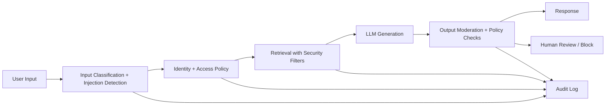
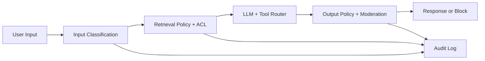

# Guardrails, Security, Privacy, and Responsible AI for GenAI

## Overview
This topic defines enterprise controls for safe GenAI systems: data protection, prompt-injection defense, access control, output safety, tenant isolation, and Responsible AI governance.

## Why this topic matters
In architect interviews, security depth separates prototype thinking from production thinking. Organizations can accept lower model creativity, but they cannot accept policy violations, unauthorized data exposure, or unsafe outputs.

## Core concepts
- Threat modeling for GenAI systems
- Prompt injection and jailbreak defense
- Retrieval-time authorization
- PII detection, masking, and redaction
- Output moderation and policy enforcement
- Tenant isolation and data boundary controls
- Audit logging and compliance evidence
- Responsible AI lifecycle governance

## Detailed explanation of each concept
Guardrails must be layered across input, retrieval, generation, and output. Security should not rely on one filter. Identity and authorization must be enforced before retrieval so unauthorized content never reaches prompts. Prompt injection defense requires input classification, instruction hierarchy, tool policy controls, and action approval gates.

Privacy controls include data minimization, PII redaction, encryption, and retention policies. Responsible AI extends beyond toxicity filtering: it includes risk classification, monitoring, explainability, human oversight, and continuous governance.

## Evaluation (How to assess architecture quality)
- Unauthorized retrieval incidents (target zero)
- Prompt injection containment success rate
- PII leakage rate in prompts/outputs/logs
- Safety violation and moderation bypass rates
- Audit completeness and traceability score
- Mean time to detect and contain policy incidents

## Architecture / flow diagram


**Flow explanation:**  
Input is classified and screened first. Access policy gates retrieval. Generation runs only on authorized context. Output is moderated and policy-checked before release. Every decision point is logged for audit and incident response.

## Real-world example
A financial assistant answers policy and account process questions. It enforces role-based retrieval, redacts account identifiers before generation, blocks money-movement intent from chatbot channel, and routes high-risk outputs for manual review. Compliance reports are generated from unified audit traces.

## Best practices
- Enforce deny-by-default retrieval policy
- Apply input and output guardrails independently
- Keep high-risk tool actions behind approval workflows
- Use immutable audit trails with correlation IDs
- Test adversarial prompts in pre-production
- Review risk controls quarterly with governance board

## Common mistakes / misconceptions
- Relying only on output moderation
- Treating private network as full security model
- Logging raw prompts with sensitive data
- No tenant-aware filtering in retrieval
- No incident runbook for model abuse scenarios

## Industry relevance
Critical for regulated and large-scale sectors: banking, healthcare, insurance, telecom, and government digital systems where policy, privacy, and explainability are mandatory.

## Interview discussion points
- How to stop unauthorized data exposure in RAG
- Defense-in-depth for prompt injection
- Responsible AI controls beyond content filtering
- Policy gates for tool actions
- Auditability and compliance evidence strategy

## Links to dependent / related topics
- [Security, IAM, Networking](../security/security_iam_networking.md)
- [RAG Retrieval Engineering Architecture](./rag_retrieval_engineering_architecture.md)
- [LLM Selection, Routing, and Fallback Architecture](./llm_selection_routing_fallback_architecture.md)
- [System Design HLD/LLD](../system-design/system_design_hld_lld.md)

## Interview Questions (50)
1. How do you secure an enterprise GenAI assistant end to end?
2. What are the top threat categories in GenAI systems?
3. How do you design defense-in-depth for LLM applications?
4. How do you prevent unauthorized data exposure in RAG?
5. What is retrieval-time authorization and why is it critical?
6. How do you implement role-based access in GenAI workflows?
7. How do you enforce tenant isolation in shared assistants?
8. How do you detect and mitigate prompt injection attacks?
9. How do you defend against jailbreak attempts?
10. How do you separate trusted instructions from untrusted content?
11. How do you secure tool calling in agentic systems?
12. How do you block dangerous or out-of-scope tool actions?
13. How do you implement human approval for high-risk actions?
14. How do you design policy engines for GenAI controls?
15. How do you enforce least privilege for model/tool access?
16. How do you protect secrets and credentials in GenAI backends?
17. How do you secure model API keys across environments?
18. How do you implement PII masking/redaction in prompts?
19. How do you prevent PII leakage in responses?
20. How do you avoid sensitive data leakage in logs and traces?
21. How do you design encryption strategy for GenAI data paths?
22. How do you handle data retention and deletion policies?
23. How do you manage consent and purpose limitations?
24. How do you design output moderation architecture?
25. How do you tune moderation without overblocking useful responses?
26. How do you handle harmful content generation attempts?
27. How do you design abstain/refuse behaviors safely?
28. How do you reduce hallucination risk from safety perspective?
29. How do you enforce citation requirements for sensitive answers?
30. How do you design confidence thresholds for high-risk domains?
31. How do you design audit logging for compliance evidence?
32. What should be logged for GenAI incident forensics?
33. How do you build real-time policy violation monitoring?
34. How do you design incident response for AI abuse events?
35. How do you run red-team testing for LLM applications?
36. How do you test guardrail effectiveness before production?
37. How do you do canary releases for guardrail policy changes?
38. How do you rollback a bad guardrail rule quickly?
39. How do you handle cross-region/cross-provider policy consistency?
40. How do you apply Responsible AI risk classification?
41. How do you operationalize fairness and harm monitoring?
42. How do you design human oversight in Responsible AI workflows?
43. How do you explain AI decisions and limitations to users?
44. How do you define governance roles for GenAI controls?
45. How do you measure guardrail quality and policy adherence?
46. What are common anti-patterns in GenAI security design?
47. How do you present GenAI security trade-offs to leadership?
48. How do you align guardrails with delivery speed and agility?
49. How do you create quarterly security maturity roadmap for GenAI?
50. How do you conclude a guardrails/security interview answer strongly?

## Enhanced Answering Playbook (Crisp + Deep + Summary + Example)

Use this playbook for each security and guardrail answer:

- **Crisp answer:** State the control boundary and why it matters.
- **Deep explanation:** Cover attack path, control layering, and governance ownership.
- **Answer summary:** End with decision, residual risk, and mitigation.
- **Practical example:** Show one regulated-domain use case.
- **Diagram thinking:** Trace input-to-output control checkpoints.

### Worked Example: Prompt injection defense-in-depth
**Crisp answer:** Treat prompt injection as an input and execution security problem, not only a moderation problem.

**Deep explanation:**  
Start with input classification to detect manipulation patterns and suspicious intent. Enforce instruction hierarchy so untrusted retrieved content cannot override system policy. Tool calls pass through policy engine for action-level authorization and parameter validation. Retrieval uses tenant and role filters before context assembly to prevent unauthorized data exposure. Output moderation and schema validation stop unsafe responses from leaving the system. All stages emit audit traces for forensics and compliance evidence.

**Answer summary:**  
- Security controls must span input, retrieval, action, and output.  
- Authorization before retrieval is mandatory in enterprise RAG.  
- Auditability is required for compliance and incident response.



## Answers for important questions (Summary + Crisp + Deep)

### Q1. How do you secure an enterprise GenAI assistant end to end?
**Question summary:** Tests whether you can design layered controls beyond a simple content filter.
**Crisp answer (7-8 lines):** Start with identity and access controls at ingress. Enforce retrieval-time authorization with tenant/role filters. Apply prompt injection detection and tool policy gates. Use output moderation and policy validation before response release. Redact sensitive data in prompts, outputs, and logs. Keep immutable audit trails for every decision step. Add incident response and red-team validation loops.
**Deep explanation (~60-70 lines):** For `How do you secure an enterprise GenAI assistant end to end?`, start by identifying where this decision sits in your guardrailed GenAI platform control flow and what failure it prevents. A strong architecture answer should describe the request path end-to-end, not just define terms: ingress, authorization, orchestration, dependency calls, validation, and fallback. In this flow, deterministic steps must be explicit and testable, such as identity enforcement, retrieval authorization, redaction policy, output moderation gates. These are deterministic because policy and safety outcomes cannot depend on model creativity. Probabilistic steps are acceptable where approximation is useful, such as risk scoring around ambiguous prompts and explanatory answer drafting, but they still need guardrails and confidence thresholds. The key trade-off is control versus flexibility: stricter deterministic control improves safety and auditability, while probabilistic reasoning improves adaptability but increases variance in output quality. Design decisions should therefore include boundaries: which component can decide, which component must verify, and which component can block or escalate. Also explain operational behavior under stress: dependency timeout, partial failure, malformed tool output, stale context, and degraded external APIs. For each failure mode, define one mitigation path (retry with budget, route fallback, safe response, or human approval) so the system degrades safely instead of failing unpredictably. Security must be integrated into this answer: identity propagation, least-privilege access, and data boundary enforcement should happen before generation, not after. Finally, show how you will measure success in production with metrics like policy-pass rate, leakage incidents, moderation bypass rate, MTTR, user trust score, and mention rollout safety with canary + rollback criteria. This turns the answer from a definition into an operating architecture decision with clear risk, mitigation, and measurable outcomes.
**Answer summary:**
- **Decision:** Select the pattern that best satisfies `How do you secure an enterprise GenAI assistant end to end?` under your business and compliance constraints.
- **Risk:** Weak control boundaries and unclear ownership create quality, security, and reliability regressions at scale.
- **Mitigation:** Enforce policy gates, measurable SLO/SLA triggers, and tested fallback/recovery playbooks before full rollout.
**Practical example:** In a healthcare claims assistant, the team addresses 'How do you secure an enterprise GenAI assistant end to end?' by enforcing role-scoped access, validating each critical step through policy checks, and releasing changes with canary monitoring so quality and compliance remain stable under production traffic.
**Simple diagram:**  
```text
Input Guardrails -> Access Filters -> Model/Tool Controls -> Output Policy -> Audit
```
**Trusted reference links:**  
- https://learn.microsoft.com/en-us/security/zero-trust/  
- https://learn.microsoft.com/en-us/azure/ai-foundry/responsible-ai/

### Q2. What are the top threat categories in GenAI systems?
**Question summary:** Threat-modeling maturity check.
**Crisp answer (7-8 lines):** Prompt injection and jailbreak attempts are primary threats. Unauthorized retrieval and data leakage are high-risk issues. Tool misuse can trigger harmful external actions. PII exposure can occur in prompts, outputs, and logs. Model abuse can create unsafe or policy-violating content. Supply chain risks exist in prompts/models/config changes. Operational blind spots delay detection and containment.
**Deep explanation (~60-70 lines):** For `What are the top threat categories in GenAI systems?`, start by identifying where this decision sits in your guardrailed GenAI platform control flow and what failure it prevents. A strong architecture answer should describe the request path end-to-end, not just define terms: ingress, authorization, orchestration, dependency calls, validation, and fallback. In this flow, deterministic steps must be explicit and testable, such as identity enforcement, retrieval authorization, redaction policy, output moderation gates. These are deterministic because policy and safety outcomes cannot depend on model creativity. Probabilistic steps are acceptable where approximation is useful, such as risk scoring around ambiguous prompts and explanatory answer drafting, but they still need guardrails and confidence thresholds. The key trade-off is control versus flexibility: stricter deterministic control improves safety and auditability, while probabilistic reasoning improves adaptability but increases variance in output quality. Design decisions should therefore include boundaries: which component can decide, which component must verify, and which component can block or escalate. Also explain operational behavior under stress: dependency timeout, partial failure, malformed tool output, stale context, and degraded external APIs. For each failure mode, define one mitigation path (retry with budget, route fallback, safe response, or human approval) so the system degrades safely instead of failing unpredictably. Security must be integrated into this answer: identity propagation, least-privilege access, and data boundary enforcement should happen before generation, not after. Finally, show how you will measure success in production with metrics like policy-pass rate, leakage incidents, moderation bypass rate, MTTR, user trust score, and mention rollout safety with canary + rollback criteria. This turns the answer from a definition into an operating architecture decision with clear risk, mitigation, and measurable outcomes.
**Answer summary:**
- **Decision:** Select the pattern that best satisfies `What are the top threat categories in GenAI systems?` under your business and compliance constraints.
- **Risk:** Weak control boundaries and unclear ownership create quality, security, and reliability regressions at scale.
- **Mitigation:** Enforce policy gates, measurable SLO/SLA triggers, and tested fallback/recovery playbooks before full rollout.
**Practical example:** In a insurance underwriting knowledge bot, the team addresses 'What are the top threat categories in GenAI systems?' by enforcing role-scoped access, validating each critical step through policy checks, and releasing changes with canary monitoring so quality and compliance remain stable under production traffic.
**Simple diagram:**  
```text
Input Threats + Data Threats + Action Threats + Ops Threats
```
**Trusted reference links:**  
- https://learn.microsoft.com/en-us/security/ai-red-team/

### Q3. How do you design defense-in-depth for LLM applications?
**Question summary:** Architecture layering question.
**Crisp answer (7-8 lines):** Use independent controls at input, retrieval, model, and output stages. Enforce identity and policy before retrieval. Apply injection detection and tool allowlists. Validate outputs with moderation and business rules. Add monitoring and alerts for policy anomalies. Keep fallback and human escalation paths. Test controls continuously with adversarial scenarios.
**Deep explanation (~60-70 lines):** For `How do you design defense-in-depth for LLM applications?`, start by identifying where this decision sits in your guardrailed GenAI platform control flow and what failure it prevents. A strong architecture answer should describe the request path end-to-end, not just define terms: ingress, authorization, orchestration, dependency calls, validation, and fallback. In this flow, deterministic steps must be explicit and testable, such as identity enforcement, retrieval authorization, redaction policy, output moderation gates. These are deterministic because policy and safety outcomes cannot depend on model creativity. Probabilistic steps are acceptable where approximation is useful, such as risk scoring around ambiguous prompts and explanatory answer drafting, but they still need guardrails and confidence thresholds. The key trade-off is control versus flexibility: stricter deterministic control improves safety and auditability, while probabilistic reasoning improves adaptability but increases variance in output quality. Design decisions should therefore include boundaries: which component can decide, which component must verify, and which component can block or escalate. Also explain operational behavior under stress: dependency timeout, partial failure, malformed tool output, stale context, and degraded external APIs. For each failure mode, define one mitigation path (retry with budget, route fallback, safe response, or human approval) so the system degrades safely instead of failing unpredictably. Security must be integrated into this answer: identity propagation, least-privilege access, and data boundary enforcement should happen before generation, not after. Finally, show how you will measure success in production with metrics like policy-pass rate, leakage incidents, moderation bypass rate, MTTR, user trust score, and mention rollout safety with canary + rollback criteria. This turns the answer from a definition into an operating architecture decision with clear risk, mitigation, and measurable outcomes.
**Answer summary:**
- **Decision:** Select the pattern that best satisfies `How do you design defense-in-depth for LLM applications?` under your business and compliance constraints.
- **Risk:** Weak control boundaries and unclear ownership create quality, security, and reliability regressions at scale.
- **Mitigation:** Enforce policy gates, measurable SLO/SLA triggers, and tested fallback/recovery playbooks before full rollout.
**Practical example:** In a enterprise IT support assistant, the team addresses 'How do you design defense-in-depth for LLM applications?' by enforcing role-scoped access, validating each critical step through policy checks, and releasing changes with canary monitoring so quality and compliance remain stable under production traffic.
**Simple diagram:**  
```text
Layer 1 Input -> Layer 2 Retrieval -> Layer 3 Runtime -> Layer 4 Output
```
**Trusted reference links:**  
- https://learn.microsoft.com/en-us/azure/well-architected/security/

### Q4. How do you prevent unauthorized data exposure in RAG?
**Question summary:** Critical enterprise RAG security issue.
**Crisp answer (7-8 lines):** Enforce authorization before retrieval. Apply tenant and role filters in search queries. Never depend on post-response masking only. Partition sensitive indexes when needed. Propagate user context through entire retrieval path. Audit retrieval hits by identity and policy rule. Fail closed when context or policy is missing.
**Deep explanation (~60-70 lines):** For `How do you prevent unauthorized data exposure in RAG?`, start by identifying where this decision sits in your guardrailed GenAI platform control flow and what failure it prevents. A strong architecture answer should describe the request path end-to-end, not just define terms: ingress, authorization, orchestration, dependency calls, validation, and fallback. In this flow, deterministic steps must be explicit and testable, such as identity enforcement, retrieval authorization, redaction policy, output moderation gates. These are deterministic because policy and safety outcomes cannot depend on model creativity. Probabilistic steps are acceptable where approximation is useful, such as risk scoring around ambiguous prompts and explanatory answer drafting, but they still need guardrails and confidence thresholds. The key trade-off is control versus flexibility: stricter deterministic control improves safety and auditability, while probabilistic reasoning improves adaptability but increases variance in output quality. Design decisions should therefore include boundaries: which component can decide, which component must verify, and which component can block or escalate. Also explain operational behavior under stress: dependency timeout, partial failure, malformed tool output, stale context, and degraded external APIs. For each failure mode, define one mitigation path (retry with budget, route fallback, safe response, or human approval) so the system degrades safely instead of failing unpredictably. Security must be integrated into this answer: identity propagation, least-privilege access, and data boundary enforcement should happen before generation, not after. Finally, show how you will measure success in production with metrics like policy-pass rate, leakage incidents, moderation bypass rate, MTTR, user trust score, and mention rollout safety with canary + rollback criteria. This turns the answer from a definition into an operating architecture decision with clear risk, mitigation, and measurable outcomes.
**Answer summary:**
- **Decision:** Select the pattern that best satisfies `How do you prevent unauthorized data exposure in RAG?` under your business and compliance constraints.
- **Risk:** Weak control boundaries and unclear ownership create quality, security, and reliability regressions at scale.
- **Mitigation:** Enforce policy gates, measurable SLO/SLA triggers, and tested fallback/recovery playbooks before full rollout.
**Practical example:** In a procurement contract Q&A assistant, the team addresses 'How do you prevent unauthorized data exposure in RAG?' by enforcing role-scoped access, validating each critical step through policy checks, and releasing changes with canary monitoring so quality and compliance remain stable under production traffic.
**Simple diagram:**  
```text
Identity Context -> Policy Filter -> Retrieval -> Authorized Context Only
```
**Trusted reference links:**  
- https://learn.microsoft.com/en-us/azure/search/search-security-trimming-for-azure-search

### Q5. What is retrieval-time authorization and why is it critical?
**Question summary:** Distinguishes secure vs insecure RAG approaches.
**Crisp answer (7-8 lines):** Retrieval-time authorization applies access checks before context retrieval. It ensures only authorized chunks are fetched. It prevents unauthorized data from entering prompts. It reduces leakage risk significantly. It supports compliance and audit defensibility. It aligns with zero-trust data principles. It should be enforced as a default control.
**Deep explanation (~60-70 lines):** For `What is retrieval-time authorization and why is it critical?`, start by identifying where this decision sits in your guardrailed GenAI platform control flow and what failure it prevents. A strong architecture answer should describe the request path end-to-end, not just define terms: ingress, authorization, orchestration, dependency calls, validation, and fallback. In this flow, deterministic steps must be explicit and testable, such as identity enforcement, retrieval authorization, redaction policy, output moderation gates. These are deterministic because policy and safety outcomes cannot depend on model creativity. Probabilistic steps are acceptable where approximation is useful, such as risk scoring around ambiguous prompts and explanatory answer drafting, but they still need guardrails and confidence thresholds. The key trade-off is control versus flexibility: stricter deterministic control improves safety and auditability, while probabilistic reasoning improves adaptability but increases variance in output quality. Design decisions should therefore include boundaries: which component can decide, which component must verify, and which component can block or escalate. Also explain operational behavior under stress: dependency timeout, partial failure, malformed tool output, stale context, and degraded external APIs. For each failure mode, define one mitigation path (retry with budget, route fallback, safe response, or human approval) so the system degrades safely instead of failing unpredictably. Security must be integrated into this answer: identity propagation, least-privilege access, and data boundary enforcement should happen before generation, not after. Finally, show how you will measure success in production with metrics like policy-pass rate, leakage incidents, moderation bypass rate, MTTR, user trust score, and mention rollout safety with canary + rollback criteria. This turns the answer from a definition into an operating architecture decision with clear risk, mitigation, and measurable outcomes.
**Answer summary:**
- **Decision:** Select the pattern that best satisfies `What is retrieval-time authorization and why is it critical?` under your business and compliance constraints.
- **Risk:** Weak control boundaries and unclear ownership create quality, security, and reliability regressions at scale.
- **Mitigation:** Enforce policy gates, measurable SLO/SLA triggers, and tested fallback/recovery playbooks before full rollout.
**Practical example:** In a internal audit/compliance copilot, the team addresses 'What is retrieval-time authorization and why is it critical?' by enforcing role-scoped access, validating each critical step through policy checks, and releasing changes with canary monitoring so quality and compliance remain stable under production traffic.
**Simple diagram:**  
```text
AuthZ Check -> Retrieve -> Generate
```
**Trusted reference links:**  
- https://learn.microsoft.com/en-us/security/zero-trust/

### Q6. How do you implement role-based access in GenAI workflows?
**Question summary:** Identity and authorization integration.
**Crisp answer (7-8 lines):** Map user roles to data and tool scopes. Enforce role checks in retrieval and action layers. Use deny-by-default route policies. Attach role claims to every request context. Validate role changes in near real-time. Audit role-to-action mapping regularly. Keep high-risk roles on approval workflows.
**Deep explanation (~60-70 lines):** For `How do you implement role-based access in GenAI workflows?`, start by identifying where this decision sits in your guardrailed GenAI platform control flow and what failure it prevents. A strong architecture answer should describe the request path end-to-end, not just define terms: ingress, authorization, orchestration, dependency calls, validation, and fallback. In this flow, deterministic steps must be explicit and testable, such as identity enforcement, retrieval authorization, redaction policy, output moderation gates. These are deterministic because policy and safety outcomes cannot depend on model creativity. Probabilistic steps are acceptable where approximation is useful, such as risk scoring around ambiguous prompts and explanatory answer drafting, but they still need guardrails and confidence thresholds. The key trade-off is control versus flexibility: stricter deterministic control improves safety and auditability, while probabilistic reasoning improves adaptability but increases variance in output quality. Design decisions should therefore include boundaries: which component can decide, which component must verify, and which component can block or escalate. Also explain operational behavior under stress: dependency timeout, partial failure, malformed tool output, stale context, and degraded external APIs. For each failure mode, define one mitigation path (retry with budget, route fallback, safe response, or human approval) so the system degrades safely instead of failing unpredictably. Security must be integrated into this answer: identity propagation, least-privilege access, and data boundary enforcement should happen before generation, not after. Finally, show how you will measure success in production with metrics like policy-pass rate, leakage incidents, moderation bypass rate, MTTR, user trust score, and mention rollout safety with canary + rollback criteria. This turns the answer from a definition into an operating architecture decision with clear risk, mitigation, and measurable outcomes.
**Answer summary:**
- **Decision:** Select the pattern that best satisfies `How do you implement role-based access in GenAI workflows?` under your business and compliance constraints.
- **Risk:** Weak control boundaries and unclear ownership create quality, security, and reliability regressions at scale.
- **Mitigation:** Enforce policy gates, measurable SLO/SLA triggers, and tested fallback/recovery playbooks before full rollout.
**Practical example:** In a customer support triage assistant, the team addresses 'How do you implement role-based access in GenAI workflows?' by enforcing role-scoped access, validating each critical step through policy checks, and releasing changes with canary monitoring so quality and compliance remain stable under production traffic.
**Simple diagram:**  
```text
Role Claims -> Policy Engine -> Allowed Data/Tools
```
**Trusted reference links:**  
- https://learn.microsoft.com/en-us/azure/role-based-access-control/overview

### Q7. How do you enforce tenant isolation in shared assistants?
**Question summary:** Multi-tenant safety architecture.
**Crisp answer (7-8 lines):** Include tenant context in every request and retrieval call. Enforce tenant filters as mandatory query clauses. Separate storage/indexes for high-sensitivity tenants. Isolate credentials and secrets by tenant tier. Prevent cross-tenant logs and traces. Validate with adversarial isolation tests. Monitor and alert on boundary violations.
**Deep explanation (~60-70 lines):** For `How do you enforce tenant isolation in shared assistants?`, start by identifying where this decision sits in your guardrailed GenAI platform control flow and what failure it prevents. A strong architecture answer should describe the request path end-to-end, not just define terms: ingress, authorization, orchestration, dependency calls, validation, and fallback. In this flow, deterministic steps must be explicit and testable, such as identity enforcement, retrieval authorization, redaction policy, output moderation gates. These are deterministic because policy and safety outcomes cannot depend on model creativity. Probabilistic steps are acceptable where approximation is useful, such as risk scoring around ambiguous prompts and explanatory answer drafting, but they still need guardrails and confidence thresholds. The key trade-off is control versus flexibility: stricter deterministic control improves safety and auditability, while probabilistic reasoning improves adaptability but increases variance in output quality. Design decisions should therefore include boundaries: which component can decide, which component must verify, and which component can block or escalate. Also explain operational behavior under stress: dependency timeout, partial failure, malformed tool output, stale context, and degraded external APIs. For each failure mode, define one mitigation path (retry with budget, route fallback, safe response, or human approval) so the system degrades safely instead of failing unpredictably. Security must be integrated into this answer: identity propagation, least-privilege access, and data boundary enforcement should happen before generation, not after. Finally, show how you will measure success in production with metrics like policy-pass rate, leakage incidents, moderation bypass rate, MTTR, user trust score, and mention rollout safety with canary + rollback criteria. This turns the answer from a definition into an operating architecture decision with clear risk, mitigation, and measurable outcomes.
**Answer summary:**
- **Decision:** Select the pattern that best satisfies `How do you enforce tenant isolation in shared assistants?` under your business and compliance constraints.
- **Risk:** Weak control boundaries and unclear ownership create quality, security, and reliability regressions at scale.
- **Mitigation:** Enforce policy gates, measurable SLO/SLA triggers, and tested fallback/recovery playbooks before full rollout.
**Practical example:** In a operations incident copilot, the team addresses 'How do you enforce tenant isolation in shared assistants?' by enforcing role-scoped access, validating each critical step through policy checks, and releasing changes with canary monitoring so quality and compliance remain stable under production traffic.
**Simple diagram:**  
```text
Tenant A -> A-only data/tools
Tenant B -> B-only data/tools
```
**Trusted reference links:**  
- https://learn.microsoft.com/en-us/azure/architecture/guide/multitenant/

### Q8. How do you detect and mitigate prompt injection attacks?
**Question summary:** Prompt-layer threat defense.
**Crisp answer (7-8 lines):** Classify untrusted input before model execution. Detect injection patterns and suspicious directives. Keep system instructions isolated from user content. Block tool calls triggered by untrusted instructions. Require policy approval for sensitive actions. Log and score attempted injection events. Continuously update detection rules from incidents.
**Deep explanation (~60-70 lines):** For `How do you detect and mitigate prompt injection attacks?`, start by identifying where this decision sits in your guardrailed GenAI platform control flow and what failure it prevents. A strong architecture answer should describe the request path end-to-end, not just define terms: ingress, authorization, orchestration, dependency calls, validation, and fallback. In this flow, deterministic steps must be explicit and testable, such as identity enforcement, retrieval authorization, redaction policy, output moderation gates. These are deterministic because policy and safety outcomes cannot depend on model creativity. Probabilistic steps are acceptable where approximation is useful, such as risk scoring around ambiguous prompts and explanatory answer drafting, but they still need guardrails and confidence thresholds. The key trade-off is control versus flexibility: stricter deterministic control improves safety and auditability, while probabilistic reasoning improves adaptability but increases variance in output quality. Design decisions should therefore include boundaries: which component can decide, which component must verify, and which component can block or escalate. Also explain operational behavior under stress: dependency timeout, partial failure, malformed tool output, stale context, and degraded external APIs. For each failure mode, define one mitigation path (retry with budget, route fallback, safe response, or human approval) so the system degrades safely instead of failing unpredictably. Security must be integrated into this answer: identity propagation, least-privilege access, and data boundary enforcement should happen before generation, not after. Finally, show how you will measure success in production with metrics like policy-pass rate, leakage incidents, moderation bypass rate, MTTR, user trust score, and mention rollout safety with canary + rollback criteria. This turns the answer from a definition into an operating architecture decision with clear risk, mitigation, and measurable outcomes.
**Answer summary:**
- **Decision:** Select the pattern that best satisfies `How do you detect and mitigate prompt injection attacks?` under your business and compliance constraints.
- **Risk:** Weak control boundaries and unclear ownership create quality, security, and reliability regressions at scale.
- **Mitigation:** Enforce policy gates, measurable SLO/SLA triggers, and tested fallback/recovery playbooks before full rollout.
**Practical example:** In a banking policy copilot, the team addresses 'How do you detect and mitigate prompt injection attacks?' by enforcing role-scoped access, validating each critical step through policy checks, and releasing changes with canary monitoring so quality and compliance remain stable under production traffic.
**Simple diagram:**  
```text
Untrusted Prompt -> Injection Check -> Policy Gate -> Safe Execution
```
**Trusted reference links:**  
- https://learn.microsoft.com/en-us/azure/ai-foundry/responsible-ai/prompt-shields

### Q9. How do you defend against jailbreak attempts?
**Question summary:** Safety bypass prevention.
**Crisp answer (7-8 lines):** Use layered safety filters on input and output. Apply strict instruction hierarchy and refusal policies. Detect jailbreak signatures and adversarial patterns. Limit model actions with tool allowlists and permissions. Add response validators for policy compliance. Route high-risk requests to safe refusal mode. Track jailbreak success rate as KPI.
**Deep explanation (~60-70 lines):** For `How do you defend against jailbreak attempts?`, start by identifying where this decision sits in your guardrailed GenAI platform control flow and what failure it prevents. A strong architecture answer should describe the request path end-to-end, not just define terms: ingress, authorization, orchestration, dependency calls, validation, and fallback. In this flow, deterministic steps must be explicit and testable, such as identity enforcement, retrieval authorization, redaction policy, output moderation gates. These are deterministic because policy and safety outcomes cannot depend on model creativity. Probabilistic steps are acceptable where approximation is useful, such as risk scoring around ambiguous prompts and explanatory answer drafting, but they still need guardrails and confidence thresholds. The key trade-off is control versus flexibility: stricter deterministic control improves safety and auditability, while probabilistic reasoning improves adaptability but increases variance in output quality. Design decisions should therefore include boundaries: which component can decide, which component must verify, and which component can block or escalate. Also explain operational behavior under stress: dependency timeout, partial failure, malformed tool output, stale context, and degraded external APIs. For each failure mode, define one mitigation path (retry with budget, route fallback, safe response, or human approval) so the system degrades safely instead of failing unpredictably. Security must be integrated into this answer: identity propagation, least-privilege access, and data boundary enforcement should happen before generation, not after. Finally, show how you will measure success in production with metrics like policy-pass rate, leakage incidents, moderation bypass rate, MTTR, user trust score, and mention rollout safety with canary + rollback criteria. This turns the answer from a definition into an operating architecture decision with clear risk, mitigation, and measurable outcomes.
**Answer summary:**
- **Decision:** Select the pattern that best satisfies `How do you defend against jailbreak attempts?` under your business and compliance constraints.
- **Risk:** Weak control boundaries and unclear ownership create quality, security, and reliability regressions at scale.
- **Mitigation:** Enforce policy gates, measurable SLO/SLA triggers, and tested fallback/recovery playbooks before full rollout.
**Practical example:** In a healthcare claims assistant, the team addresses 'How do you defend against jailbreak attempts?' by enforcing role-scoped access, validating each critical step through policy checks, and releasing changes with canary monitoring so quality and compliance remain stable under production traffic.
**Simple diagram:**  
```text
Jailbreak Attempt -> Input Filter -> Runtime Constraints -> Output Filter
```
**Trusted reference links:**  
- https://learn.microsoft.com/en-us/security/ai-red-team/

### Q10. How do you separate trusted instructions from untrusted content?
**Question summary:** Instruction hierarchy design.
**Crisp answer (7-8 lines):** Keep system/policy instructions outside user-controlled text. Label retrieved content as untrusted context explicitly. Avoid concatenating raw external text into instruction sections. Use templated prompt boundaries and metadata tags. Validate model outputs against trusted policy rules. Never allow context text to redefine guardrails. Audit prompt construction artifacts.
**Deep explanation (~60-70 lines):** For `How do you separate trusted instructions from untrusted content?`, start by identifying where this decision sits in your guardrailed GenAI platform control flow and what failure it prevents. A strong architecture answer should describe the request path end-to-end, not just define terms: ingress, authorization, orchestration, dependency calls, validation, and fallback. In this flow, deterministic steps must be explicit and testable, such as identity enforcement, retrieval authorization, redaction policy, output moderation gates. These are deterministic because policy and safety outcomes cannot depend on model creativity. Probabilistic steps are acceptable where approximation is useful, such as risk scoring around ambiguous prompts and explanatory answer drafting, but they still need guardrails and confidence thresholds. The key trade-off is control versus flexibility: stricter deterministic control improves safety and auditability, while probabilistic reasoning improves adaptability but increases variance in output quality. Design decisions should therefore include boundaries: which component can decide, which component must verify, and which component can block or escalate. Also explain operational behavior under stress: dependency timeout, partial failure, malformed tool output, stale context, and degraded external APIs. For each failure mode, define one mitigation path (retry with budget, route fallback, safe response, or human approval) so the system degrades safely instead of failing unpredictably. Security must be integrated into this answer: identity propagation, least-privilege access, and data boundary enforcement should happen before generation, not after. Finally, show how you will measure success in production with metrics like policy-pass rate, leakage incidents, moderation bypass rate, MTTR, user trust score, and mention rollout safety with canary + rollback criteria. This turns the answer from a definition into an operating architecture decision with clear risk, mitigation, and measurable outcomes.
**Answer summary:**
- **Decision:** Select the pattern that best satisfies `How do you separate trusted instructions from untrusted content?` under your business and compliance constraints.
- **Risk:** Weak control boundaries and unclear ownership create quality, security, and reliability regressions at scale.
- **Mitigation:** Enforce policy gates, measurable SLO/SLA triggers, and tested fallback/recovery playbooks before full rollout.
**Practical example:** In a insurance underwriting knowledge bot, the team addresses 'How do you separate trusted instructions from untrusted content?' by enforcing role-scoped access, validating each critical step through policy checks, and releasing changes with canary monitoring so quality and compliance remain stable under production traffic.
**Simple diagram:**  
```text
Trusted Policy Block || Untrusted User/Docs Block
```
**Trusted reference links:**  
- https://learn.microsoft.com/en-us/azure/ai-foundry/responsible-ai/

### Q11. How do you secure tool calling in agentic systems?
**Question summary:** Action security control.
**Crisp answer (7-8 lines):** Register tools with explicit allowed intents and scopes. Validate all parameters against strict schemas. Require authorization before tool execution. Block side-effect tools for low-trust contexts. Add rate limits and retry budgets per tool. Log every invocation with identity and decision context. Keep emergency disable switch for risky tools.
**Deep explanation (~60-70 lines):** For `How do you secure tool calling in agentic systems?`, start by identifying where this decision sits in your guardrailed GenAI platform control flow and what failure it prevents. A strong architecture answer should describe the request path end-to-end, not just define terms: ingress, authorization, orchestration, dependency calls, validation, and fallback. In this flow, deterministic steps must be explicit and testable, such as identity enforcement, retrieval authorization, redaction policy, output moderation gates. These are deterministic because policy and safety outcomes cannot depend on model creativity. Probabilistic steps are acceptable where approximation is useful, such as risk scoring around ambiguous prompts and explanatory answer drafting, but they still need guardrails and confidence thresholds. The key trade-off is control versus flexibility: stricter deterministic control improves safety and auditability, while probabilistic reasoning improves adaptability but increases variance in output quality. Design decisions should therefore include boundaries: which component can decide, which component must verify, and which component can block or escalate. Also explain operational behavior under stress: dependency timeout, partial failure, malformed tool output, stale context, and degraded external APIs. For each failure mode, define one mitigation path (retry with budget, route fallback, safe response, or human approval) so the system degrades safely instead of failing unpredictably. Security must be integrated into this answer: identity propagation, least-privilege access, and data boundary enforcement should happen before generation, not after. Finally, show how you will measure success in production with metrics like policy-pass rate, leakage incidents, moderation bypass rate, MTTR, user trust score, and mention rollout safety with canary + rollback criteria. This turns the answer from a definition into an operating architecture decision with clear risk, mitigation, and measurable outcomes.
**Answer summary:**
- **Decision:** Select the pattern that best satisfies `How do you secure tool calling in agentic systems?` under your business and compliance constraints.
- **Risk:** Weak control boundaries and unclear ownership create quality, security, and reliability regressions at scale.
- **Mitigation:** Enforce policy gates, measurable SLO/SLA triggers, and tested fallback/recovery playbooks before full rollout.
**Practical example:** In a enterprise IT support assistant, the team addresses 'How do you secure tool calling in agentic systems?' by enforcing role-scoped access, validating each critical step through policy checks, and releasing changes with canary monitoring so quality and compliance remain stable under production traffic.
**Simple diagram:**  
```text
Tool Request -> AuthZ + Schema Check -> Execute/Block
```
**Trusted reference links:**  
- https://learn.microsoft.com/en-us/azure/well-architected/security/

### Q12. How do you block dangerous or out-of-scope tool actions?
**Question summary:** Runtime containment strategy.
**Crisp answer (7-8 lines):** Define policy deny rules by intent and risk class. Require explicit allow conditions for high-impact operations. Detect action-context mismatch before execution. Use dry-run validation for uncertain actions. Route risky operations to human approval node. Return safe refusal with explanation. Log blocked attempts for threat intelligence.
**Deep explanation (~60-70 lines):** For `How do you block dangerous or out-of-scope tool actions?`, start by identifying where this decision sits in your guardrailed GenAI platform control flow and what failure it prevents. A strong architecture answer should describe the request path end-to-end, not just define terms: ingress, authorization, orchestration, dependency calls, validation, and fallback. In this flow, deterministic steps must be explicit and testable, such as identity enforcement, retrieval authorization, redaction policy, output moderation gates. These are deterministic because policy and safety outcomes cannot depend on model creativity. Probabilistic steps are acceptable where approximation is useful, such as risk scoring around ambiguous prompts and explanatory answer drafting, but they still need guardrails and confidence thresholds. The key trade-off is control versus flexibility: stricter deterministic control improves safety and auditability, while probabilistic reasoning improves adaptability but increases variance in output quality. Design decisions should therefore include boundaries: which component can decide, which component must verify, and which component can block or escalate. Also explain operational behavior under stress: dependency timeout, partial failure, malformed tool output, stale context, and degraded external APIs. For each failure mode, define one mitigation path (retry with budget, route fallback, safe response, or human approval) so the system degrades safely instead of failing unpredictably. Security must be integrated into this answer: identity propagation, least-privilege access, and data boundary enforcement should happen before generation, not after. Finally, show how you will measure success in production with metrics like policy-pass rate, leakage incidents, moderation bypass rate, MTTR, user trust score, and mention rollout safety with canary + rollback criteria. This turns the answer from a definition into an operating architecture decision with clear risk, mitigation, and measurable outcomes.
**Answer summary:**
- **Decision:** Select the pattern that best satisfies `How do you block dangerous or out-of-scope tool actions?` under your business and compliance constraints.
- **Risk:** Weak control boundaries and unclear ownership create quality, security, and reliability regressions at scale.
- **Mitigation:** Enforce policy gates, measurable SLO/SLA triggers, and tested fallback/recovery playbooks before full rollout.
**Practical example:** In a procurement contract Q&A assistant, the team addresses 'How do you block dangerous or out-of-scope tool actions?' by enforcing role-scoped access, validating each critical step through policy checks, and releasing changes with canary monitoring so quality and compliance remain stable under production traffic.
**Simple diagram:**  
```text
Action Intent -> Policy Check -> Block or Approve Path
```
**Trusted reference links:**  
- https://learn.microsoft.com/en-us/security/zero-trust/

### Q13. How do you implement human approval for high-risk actions?
**Question summary:** HITL governance control.
**Crisp answer (7-8 lines):** Pause workflow at approval checkpoint. Present structured context and risk signals to reviewer. Restrict approver roles and enforce MFA. Set timeout and escalation paths. Record rationale and decision artifacts. Resume workflow deterministically after decision. Audit full approval lifecycle.
**Deep explanation (~60-70 lines):** For `How do you implement human approval for high-risk actions?`, start by identifying where this decision sits in your guardrailed GenAI platform control flow and what failure it prevents. A strong architecture answer should describe the request path end-to-end, not just define terms: ingress, authorization, orchestration, dependency calls, validation, and fallback. In this flow, deterministic steps must be explicit and testable, such as identity enforcement, retrieval authorization, redaction policy, output moderation gates. These are deterministic because policy and safety outcomes cannot depend on model creativity. Probabilistic steps are acceptable where approximation is useful, such as risk scoring around ambiguous prompts and explanatory answer drafting, but they still need guardrails and confidence thresholds. The key trade-off is control versus flexibility: stricter deterministic control improves safety and auditability, while probabilistic reasoning improves adaptability but increases variance in output quality. Design decisions should therefore include boundaries: which component can decide, which component must verify, and which component can block or escalate. Also explain operational behavior under stress: dependency timeout, partial failure, malformed tool output, stale context, and degraded external APIs. For each failure mode, define one mitigation path (retry with budget, route fallback, safe response, or human approval) so the system degrades safely instead of failing unpredictably. Security must be integrated into this answer: identity propagation, least-privilege access, and data boundary enforcement should happen before generation, not after. Finally, show how you will measure success in production with metrics like policy-pass rate, leakage incidents, moderation bypass rate, MTTR, user trust score, and mention rollout safety with canary + rollback criteria. This turns the answer from a definition into an operating architecture decision with clear risk, mitigation, and measurable outcomes.
**Answer summary:**
- **Decision:** Select the pattern that best satisfies `How do you implement human approval for high-risk actions?` under your business and compliance constraints.
- **Risk:** Weak control boundaries and unclear ownership create quality, security, and reliability regressions at scale.
- **Mitigation:** Enforce policy gates, measurable SLO/SLA triggers, and tested fallback/recovery playbooks before full rollout.
**Practical example:** In a internal audit/compliance copilot, the team addresses 'How do you implement human approval for high-risk actions?' by enforcing role-scoped access, validating each critical step through policy checks, and releasing changes with canary monitoring so quality and compliance remain stable under production traffic.
**Simple diagram:**  
```text
Proposed Action -> Approval Queue -> Approve/Reject -> Continue
```
**Trusted reference links:**  
- https://learn.microsoft.com/en-us/azure/architecture/framework/security/

### Q14. How do you design policy engines for GenAI controls?
**Question summary:** Centralized governance architecture.
**Crisp answer (7-8 lines):** Externalize policy decisions into dedicated service. Evaluate identity, intent, data class, and action type. Return allow/deny/approve-required outcomes. Version policy rules and keep change history. Support explainable policy decision logs. Integrate with retrieval and tool layers. Test policy regressions in CI.
**Deep explanation (~60-70 lines):** For `How do you design policy engines for GenAI controls?`, start by identifying where this decision sits in your guardrailed GenAI platform control flow and what failure it prevents. A strong architecture answer should describe the request path end-to-end, not just define terms: ingress, authorization, orchestration, dependency calls, validation, and fallback. In this flow, deterministic steps must be explicit and testable, such as identity enforcement, retrieval authorization, redaction policy, output moderation gates. These are deterministic because policy and safety outcomes cannot depend on model creativity. Probabilistic steps are acceptable where approximation is useful, such as risk scoring around ambiguous prompts and explanatory answer drafting, but they still need guardrails and confidence thresholds. The key trade-off is control versus flexibility: stricter deterministic control improves safety and auditability, while probabilistic reasoning improves adaptability but increases variance in output quality. Design decisions should therefore include boundaries: which component can decide, which component must verify, and which component can block or escalate. Also explain operational behavior under stress: dependency timeout, partial failure, malformed tool output, stale context, and degraded external APIs. For each failure mode, define one mitigation path (retry with budget, route fallback, safe response, or human approval) so the system degrades safely instead of failing unpredictably. Security must be integrated into this answer: identity propagation, least-privilege access, and data boundary enforcement should happen before generation, not after. Finally, show how you will measure success in production with metrics like policy-pass rate, leakage incidents, moderation bypass rate, MTTR, user trust score, and mention rollout safety with canary + rollback criteria. This turns the answer from a definition into an operating architecture decision with clear risk, mitigation, and measurable outcomes.
**Answer summary:**
- **Decision:** Select the pattern that best satisfies `How do you design policy engines for GenAI controls?` under your business and compliance constraints.
- **Risk:** Weak control boundaries and unclear ownership create quality, security, and reliability regressions at scale.
- **Mitigation:** Enforce policy gates, measurable SLO/SLA triggers, and tested fallback/recovery playbooks before full rollout.
**Practical example:** In a customer support triage assistant, the team addresses 'How do you design policy engines for GenAI controls?' by enforcing role-scoped access, validating each critical step through policy checks, and releasing changes with canary monitoring so quality and compliance remain stable under production traffic.
**Simple diagram:**  
```text
Request Context -> Policy Engine -> Decision
```
**Trusted reference links:**  
- https://learn.microsoft.com/en-us/azure/governance/policy/overview

### Q15. How do you enforce least privilege for model/tool access?
**Question summary:** Access minimization control.
**Crisp answer (7-8 lines):** Grant minimum scopes needed for each workflow role. Separate read-only and action-capable routes. Restrict tool availability by intent and trust tier. Use short-lived credentials and scoped tokens. Review permissions periodically with owners. Remove stale grants quickly. Monitor over-privileged access patterns.
**Deep explanation (~60-70 lines):** For `How do you enforce least privilege for model/tool access?`, start by identifying where this decision sits in your guardrailed GenAI platform control flow and what failure it prevents. A strong architecture answer should describe the request path end-to-end, not just define terms: ingress, authorization, orchestration, dependency calls, validation, and fallback. In this flow, deterministic steps must be explicit and testable, such as identity enforcement, retrieval authorization, redaction policy, output moderation gates. These are deterministic because policy and safety outcomes cannot depend on model creativity. Probabilistic steps are acceptable where approximation is useful, such as risk scoring around ambiguous prompts and explanatory answer drafting, but they still need guardrails and confidence thresholds. The key trade-off is control versus flexibility: stricter deterministic control improves safety and auditability, while probabilistic reasoning improves adaptability but increases variance in output quality. Design decisions should therefore include boundaries: which component can decide, which component must verify, and which component can block or escalate. Also explain operational behavior under stress: dependency timeout, partial failure, malformed tool output, stale context, and degraded external APIs. For each failure mode, define one mitigation path (retry with budget, route fallback, safe response, or human approval) so the system degrades safely instead of failing unpredictably. Security must be integrated into this answer: identity propagation, least-privilege access, and data boundary enforcement should happen before generation, not after. Finally, show how you will measure success in production with metrics like policy-pass rate, leakage incidents, moderation bypass rate, MTTR, user trust score, and mention rollout safety with canary + rollback criteria. This turns the answer from a definition into an operating architecture decision with clear risk, mitigation, and measurable outcomes.
**Answer summary:**
- **Decision:** Select the pattern that best satisfies `How do you enforce least privilege for model/tool access?` under your business and compliance constraints.
- **Risk:** Weak control boundaries and unclear ownership create quality, security, and reliability regressions at scale.
- **Mitigation:** Enforce policy gates, measurable SLO/SLA triggers, and tested fallback/recovery playbooks before full rollout.
**Practical example:** In a operations incident copilot, the team addresses 'How do you enforce least privilege for model/tool access?' by enforcing role-scoped access, validating each critical step through policy checks, and releasing changes with canary monitoring so quality and compliance remain stable under production traffic.
**Simple diagram:**  
```text
Role -> Minimal Scopes -> Allowed Capabilities
```
**Trusted reference links:**  
- https://learn.microsoft.com/en-us/azure/role-based-access-control/overview

### Q16. How do you protect secrets and credentials in GenAI backends?
**Question summary:** Secret management fundamentals.
**Crisp answer (7-8 lines):** Keep secrets in centralized vault only. Use managed identity for runtime retrieval. Avoid static secrets in code and pipelines. Rotate secrets automatically with policy. Separate secrets by environment and service. Audit secret access continuously. Alert on unusual secret-read patterns.
**Deep explanation (~60-70 lines):** For `How do you protect secrets and credentials in GenAI backends?`, start by identifying where this decision sits in your guardrailed GenAI platform control flow and what failure it prevents. A strong architecture answer should describe the request path end-to-end, not just define terms: ingress, authorization, orchestration, dependency calls, validation, and fallback. In this flow, deterministic steps must be explicit and testable, such as identity enforcement, retrieval authorization, redaction policy, output moderation gates. These are deterministic because policy and safety outcomes cannot depend on model creativity. Probabilistic steps are acceptable where approximation is useful, such as risk scoring around ambiguous prompts and explanatory answer drafting, but they still need guardrails and confidence thresholds. The key trade-off is control versus flexibility: stricter deterministic control improves safety and auditability, while probabilistic reasoning improves adaptability but increases variance in output quality. Design decisions should therefore include boundaries: which component can decide, which component must verify, and which component can block or escalate. Also explain operational behavior under stress: dependency timeout, partial failure, malformed tool output, stale context, and degraded external APIs. For each failure mode, define one mitigation path (retry with budget, route fallback, safe response, or human approval) so the system degrades safely instead of failing unpredictably. Security must be integrated into this answer: identity propagation, least-privilege access, and data boundary enforcement should happen before generation, not after. Finally, show how you will measure success in production with metrics like policy-pass rate, leakage incidents, moderation bypass rate, MTTR, user trust score, and mention rollout safety with canary + rollback criteria. This turns the answer from a definition into an operating architecture decision with clear risk, mitigation, and measurable outcomes.
**Answer summary:**
- **Decision:** Select the pattern that best satisfies `How do you protect secrets and credentials in GenAI backends?` under your business and compliance constraints.
- **Risk:** Weak control boundaries and unclear ownership create quality, security, and reliability regressions at scale.
- **Mitigation:** Enforce policy gates, measurable SLO/SLA triggers, and tested fallback/recovery playbooks before full rollout.
**Practical example:** In a banking policy copilot, the team addresses 'How do you protect secrets and credentials in GenAI backends?' by enforcing role-scoped access, validating each critical step through policy checks, and releasing changes with canary monitoring so quality and compliance remain stable under production traffic.
**Simple diagram:**  
```text
Workload Identity -> Secret Vault -> Provider Credentials
```
**Trusted reference links:**  
- https://learn.microsoft.com/en-us/azure/security/fundamentals/secrets-best-practices

### Q17. How do you secure model API keys across environments?
**Question summary:** Environment isolation and credential hygiene.
**Crisp answer (7-8 lines):** Use unique keys per environment and route. Never reuse production keys in lower environments. Restrict network and IP usage where supported. Rotate on schedule and after incidents. Enforce least-privilege access to key retrieval. Monitor key usage anomalies by environment. Automate revocation and replacement workflows.
**Deep explanation (~60-70 lines):** For `How do you secure model API keys across environments?`, start by identifying where this decision sits in your guardrailed GenAI platform control flow and what failure it prevents. A strong architecture answer should describe the request path end-to-end, not just define terms: ingress, authorization, orchestration, dependency calls, validation, and fallback. In this flow, deterministic steps must be explicit and testable, such as identity enforcement, retrieval authorization, redaction policy, output moderation gates. These are deterministic because policy and safety outcomes cannot depend on model creativity. Probabilistic steps are acceptable where approximation is useful, such as risk scoring around ambiguous prompts and explanatory answer drafting, but they still need guardrails and confidence thresholds. The key trade-off is control versus flexibility: stricter deterministic control improves safety and auditability, while probabilistic reasoning improves adaptability but increases variance in output quality. Design decisions should therefore include boundaries: which component can decide, which component must verify, and which component can block or escalate. Also explain operational behavior under stress: dependency timeout, partial failure, malformed tool output, stale context, and degraded external APIs. For each failure mode, define one mitigation path (retry with budget, route fallback, safe response, or human approval) so the system degrades safely instead of failing unpredictably. Security must be integrated into this answer: identity propagation, least-privilege access, and data boundary enforcement should happen before generation, not after. Finally, show how you will measure success in production with metrics like policy-pass rate, leakage incidents, moderation bypass rate, MTTR, user trust score, and mention rollout safety with canary + rollback criteria. This turns the answer from a definition into an operating architecture decision with clear risk, mitigation, and measurable outcomes.
**Answer summary:**
- **Decision:** Select the pattern that best satisfies `How do you secure model API keys across environments?` under your business and compliance constraints.
- **Risk:** Weak control boundaries and unclear ownership create quality, security, and reliability regressions at scale.
- **Mitigation:** Enforce policy gates, measurable SLO/SLA triggers, and tested fallback/recovery playbooks before full rollout.
**Practical example:** In a healthcare claims assistant, the team addresses 'How do you secure model API keys across environments?' by enforcing role-scoped access, validating each critical step through policy checks, and releasing changes with canary monitoring so quality and compliance remain stable under production traffic.
**Simple diagram:**  
```text
Dev Key | Test Key | Prod Key -> Separate Vault Policies
```
**Trusted reference links:**  
- https://learn.microsoft.com/en-us/azure/key-vault/general/basic-concepts

### Q18. How do you implement PII masking/redaction in prompts?
**Question summary:** Input privacy protection.
**Crisp answer (7-8 lines):** Detect PII before model invocation. Mask or tokenize sensitive fields based on policy. Preserve utility with reversible tokens only where authorized. Keep raw PII out of prompt templates by default. Route sensitive requests through stricter controls. Validate masking quality on sampled traffic. Log redaction decisions without raw values.
**Deep explanation (~60-70 lines):** For `How do you implement PII masking/redaction in prompts?`, start by identifying where this decision sits in your guardrailed GenAI platform control flow and what failure it prevents. A strong architecture answer should describe the request path end-to-end, not just define terms: ingress, authorization, orchestration, dependency calls, validation, and fallback. In this flow, deterministic steps must be explicit and testable, such as identity enforcement, retrieval authorization, redaction policy, output moderation gates. These are deterministic because policy and safety outcomes cannot depend on model creativity. Probabilistic steps are acceptable where approximation is useful, such as risk scoring around ambiguous prompts and explanatory answer drafting, but they still need guardrails and confidence thresholds. The key trade-off is control versus flexibility: stricter deterministic control improves safety and auditability, while probabilistic reasoning improves adaptability but increases variance in output quality. Design decisions should therefore include boundaries: which component can decide, which component must verify, and which component can block or escalate. Also explain operational behavior under stress: dependency timeout, partial failure, malformed tool output, stale context, and degraded external APIs. For each failure mode, define one mitigation path (retry with budget, route fallback, safe response, or human approval) so the system degrades safely instead of failing unpredictably. Security must be integrated into this answer: identity propagation, least-privilege access, and data boundary enforcement should happen before generation, not after. Finally, show how you will measure success in production with metrics like policy-pass rate, leakage incidents, moderation bypass rate, MTTR, user trust score, and mention rollout safety with canary + rollback criteria. This turns the answer from a definition into an operating architecture decision with clear risk, mitigation, and measurable outcomes.
**Answer summary:**
- **Decision:** Select the pattern that best satisfies `How do you implement PII masking/redaction in prompts?` under your business and compliance constraints.
- **Risk:** Weak control boundaries and unclear ownership create quality, security, and reliability regressions at scale.
- **Mitigation:** Enforce policy gates, measurable SLO/SLA triggers, and tested fallback/recovery playbooks before full rollout.
**Practical example:** In a insurance underwriting knowledge bot, the team addresses 'How do you implement PII masking/redaction in prompts?' by enforcing role-scoped access, validating each critical step through policy checks, and releasing changes with canary monitoring so quality and compliance remain stable under production traffic.
**Simple diagram:**  
```text
Raw Input -> PII Detector -> Redacted Prompt -> Model
```
**Trusted reference links:**  
- https://learn.microsoft.com/en-us/azure/ai-services/language-service/personally-identifiable-information/overview

### Q19. How do you prevent PII leakage in responses?
**Question summary:** Output privacy control.
**Crisp answer (7-8 lines):** Run response through PII detection before release. Mask or block disallowed sensitive outputs. Enforce role-based reveal policies for approved cases. Add citation checks to avoid fabricated personal data. Use refusal mode when confidence is low. Track leakage incidents and false positives. Continuously tune output filters.
**Deep explanation (~60-70 lines):** For `How do you prevent PII leakage in responses?`, start by identifying where this decision sits in your guardrailed GenAI platform control flow and what failure it prevents. A strong architecture answer should describe the request path end-to-end, not just define terms: ingress, authorization, orchestration, dependency calls, validation, and fallback. In this flow, deterministic steps must be explicit and testable, such as identity enforcement, retrieval authorization, redaction policy, output moderation gates. These are deterministic because policy and safety outcomes cannot depend on model creativity. Probabilistic steps are acceptable where approximation is useful, such as risk scoring around ambiguous prompts and explanatory answer drafting, but they still need guardrails and confidence thresholds. The key trade-off is control versus flexibility: stricter deterministic control improves safety and auditability, while probabilistic reasoning improves adaptability but increases variance in output quality. Design decisions should therefore include boundaries: which component can decide, which component must verify, and which component can block or escalate. Also explain operational behavior under stress: dependency timeout, partial failure, malformed tool output, stale context, and degraded external APIs. For each failure mode, define one mitigation path (retry with budget, route fallback, safe response, or human approval) so the system degrades safely instead of failing unpredictably. Security must be integrated into this answer: identity propagation, least-privilege access, and data boundary enforcement should happen before generation, not after. Finally, show how you will measure success in production with metrics like policy-pass rate, leakage incidents, moderation bypass rate, MTTR, user trust score, and mention rollout safety with canary + rollback criteria. This turns the answer from a definition into an operating architecture decision with clear risk, mitigation, and measurable outcomes.
**Answer summary:**
- **Decision:** Select the pattern that best satisfies `How do you prevent PII leakage in responses?` under your business and compliance constraints.
- **Risk:** Weak control boundaries and unclear ownership create quality, security, and reliability regressions at scale.
- **Mitigation:** Enforce policy gates, measurable SLO/SLA triggers, and tested fallback/recovery playbooks before full rollout.
**Practical example:** In a enterprise IT support assistant, the team addresses 'How do you prevent PII leakage in responses?' by enforcing role-scoped access, validating each critical step through policy checks, and releasing changes with canary monitoring so quality and compliance remain stable under production traffic.
**Simple diagram:**  
```text
Model Output -> PII/Policy Check -> Release/Mask/Block
```
**Trusted reference links:**  
- https://learn.microsoft.com/en-us/azure/ai-foundry/responsible-ai/

### Q20. How do you avoid sensitive data leakage in logs and traces?
**Question summary:** Observability privacy risk.
**Crisp answer (7-8 lines):** Mask sensitive fields before logging. Avoid full raw prompt/response logs by default. Use structured logs with redacted placeholders. Restrict log access by least privilege. Encrypt log storage and enforce retention limits. Audit log query patterns. Create secure debug mode with approval controls.
**Deep explanation (~60-70 lines):** For `How do you avoid sensitive data leakage in logs and traces?`, start by identifying where this decision sits in your guardrailed GenAI platform control flow and what failure it prevents. A strong architecture answer should describe the request path end-to-end, not just define terms: ingress, authorization, orchestration, dependency calls, validation, and fallback. In this flow, deterministic steps must be explicit and testable, such as identity enforcement, retrieval authorization, redaction policy, output moderation gates. These are deterministic because policy and safety outcomes cannot depend on model creativity. Probabilistic steps are acceptable where approximation is useful, such as risk scoring around ambiguous prompts and explanatory answer drafting, but they still need guardrails and confidence thresholds. The key trade-off is control versus flexibility: stricter deterministic control improves safety and auditability, while probabilistic reasoning improves adaptability but increases variance in output quality. Design decisions should therefore include boundaries: which component can decide, which component must verify, and which component can block or escalate. Also explain operational behavior under stress: dependency timeout, partial failure, malformed tool output, stale context, and degraded external APIs. For each failure mode, define one mitigation path (retry with budget, route fallback, safe response, or human approval) so the system degrades safely instead of failing unpredictably. Security must be integrated into this answer: identity propagation, least-privilege access, and data boundary enforcement should happen before generation, not after. Finally, show how you will measure success in production with metrics like policy-pass rate, leakage incidents, moderation bypass rate, MTTR, user trust score, and mention rollout safety with canary + rollback criteria. This turns the answer from a definition into an operating architecture decision with clear risk, mitigation, and measurable outcomes.
**Answer summary:**
- **Decision:** Select the pattern that best satisfies `How do you avoid sensitive data leakage in logs and traces?` under your business and compliance constraints.
- **Risk:** Weak control boundaries and unclear ownership create quality, security, and reliability regressions at scale.
- **Mitigation:** Enforce policy gates, measurable SLO/SLA triggers, and tested fallback/recovery playbooks before full rollout.
**Practical example:** In a procurement contract Q&A assistant, the team addresses 'How do you avoid sensitive data leakage in logs and traces?' by enforcing role-scoped access, validating each critical step through policy checks, and releasing changes with canary monitoring so quality and compliance remain stable under production traffic.
**Simple diagram:**  
```text
Telemetry Pipeline -> Redaction -> Secure Log Store
```
**Trusted reference links:**  
- https://learn.microsoft.com/en-us/azure/architecture/framework/security/data-protection

### Q21. How do you design encryption strategy for GenAI data paths?
**Question summary:** Data protection baseline.
**Crisp answer (7-8 lines):** Encrypt in transit with TLS everywhere. Encrypt at rest for indexes, memory stores, and logs. Use key management with rotation and access controls. Separate keys by environment and sensitivity class. Enforce encryption policy via automation. Validate cipher/protocol compliance periodically. Audit key usage and anomalies.
**Deep explanation (~60-70 lines):** For `How do you design encryption strategy for GenAI data paths?`, start by identifying where this decision sits in your guardrailed GenAI platform control flow and what failure it prevents. A strong architecture answer should describe the request path end-to-end, not just define terms: ingress, authorization, orchestration, dependency calls, validation, and fallback. In this flow, deterministic steps must be explicit and testable, such as identity enforcement, retrieval authorization, redaction policy, output moderation gates. These are deterministic because policy and safety outcomes cannot depend on model creativity. Probabilistic steps are acceptable where approximation is useful, such as risk scoring around ambiguous prompts and explanatory answer drafting, but they still need guardrails and confidence thresholds. The key trade-off is control versus flexibility: stricter deterministic control improves safety and auditability, while probabilistic reasoning improves adaptability but increases variance in output quality. Design decisions should therefore include boundaries: which component can decide, which component must verify, and which component can block or escalate. Also explain operational behavior under stress: dependency timeout, partial failure, malformed tool output, stale context, and degraded external APIs. For each failure mode, define one mitigation path (retry with budget, route fallback, safe response, or human approval) so the system degrades safely instead of failing unpredictably. Security must be integrated into this answer: identity propagation, least-privilege access, and data boundary enforcement should happen before generation, not after. Finally, show how you will measure success in production with metrics like policy-pass rate, leakage incidents, moderation bypass rate, MTTR, user trust score, and mention rollout safety with canary + rollback criteria. This turns the answer from a definition into an operating architecture decision with clear risk, mitigation, and measurable outcomes.
**Answer summary:**
- **Decision:** Select the pattern that best satisfies `How do you design encryption strategy for GenAI data paths?` under your business and compliance constraints.
- **Risk:** Weak control boundaries and unclear ownership create quality, security, and reliability regressions at scale.
- **Mitigation:** Enforce policy gates, measurable SLO/SLA triggers, and tested fallback/recovery playbooks before full rollout.
**Practical example:** In a internal audit/compliance copilot, the team addresses 'How do you design encryption strategy for GenAI data paths?' by enforcing role-scoped access, validating each critical step through policy checks, and releasing changes with canary monitoring so quality and compliance remain stable under production traffic.
**Simple diagram:**  
```text
TLS Transit + Encrypted Storage + Governed Keys
```
**Trusted reference links:**  
- https://learn.microsoft.com/en-us/azure/security/fundamentals/encryption-overview

### Q22. How do you handle data retention and deletion policies?
**Question summary:** Lifecycle governance.
**Crisp answer (7-8 lines):** Classify data by retention obligations. Set retention windows per data class and system. Automate expiry/deletion workflows. Track deletion completion and exceptions. Support legal hold where required. Ensure backups follow retention policy too. Audit retention compliance regularly.
**Deep explanation (~60-70 lines):** For `How do you handle data retention and deletion policies?`, start by identifying where this decision sits in your guardrailed GenAI platform control flow and what failure it prevents. A strong architecture answer should describe the request path end-to-end, not just define terms: ingress, authorization, orchestration, dependency calls, validation, and fallback. In this flow, deterministic steps must be explicit and testable, such as identity enforcement, retrieval authorization, redaction policy, output moderation gates. These are deterministic because policy and safety outcomes cannot depend on model creativity. Probabilistic steps are acceptable where approximation is useful, such as risk scoring around ambiguous prompts and explanatory answer drafting, but they still need guardrails and confidence thresholds. The key trade-off is control versus flexibility: stricter deterministic control improves safety and auditability, while probabilistic reasoning improves adaptability but increases variance in output quality. Design decisions should therefore include boundaries: which component can decide, which component must verify, and which component can block or escalate. Also explain operational behavior under stress: dependency timeout, partial failure, malformed tool output, stale context, and degraded external APIs. For each failure mode, define one mitigation path (retry with budget, route fallback, safe response, or human approval) so the system degrades safely instead of failing unpredictably. Security must be integrated into this answer: identity propagation, least-privilege access, and data boundary enforcement should happen before generation, not after. Finally, show how you will measure success in production with metrics like policy-pass rate, leakage incidents, moderation bypass rate, MTTR, user trust score, and mention rollout safety with canary + rollback criteria. This turns the answer from a definition into an operating architecture decision with clear risk, mitigation, and measurable outcomes.
**Answer summary:**
- **Decision:** Select the pattern that best satisfies `How do you handle data retention and deletion policies?` under your business and compliance constraints.
- **Risk:** Weak control boundaries and unclear ownership create quality, security, and reliability regressions at scale.
- **Mitigation:** Enforce policy gates, measurable SLO/SLA triggers, and tested fallback/recovery playbooks before full rollout.
**Practical example:** In a customer support triage assistant, the team addresses 'How do you handle data retention and deletion policies?' by enforcing role-scoped access, validating each critical step through policy checks, and releasing changes with canary monitoring so quality and compliance remain stable under production traffic.
**Simple diagram:**  
```text
Data Class -> Retention Policy -> Expiry/Delete Workflow
```
**Trusted reference links:**  
- https://learn.microsoft.com/en-us/azure/compliance/

### Q23. How do you manage consent and purpose limitations?
**Question summary:** Privacy compliance architecture.
**Crisp answer (7-8 lines):** Capture consent and usage purpose metadata at collection. Enforce purpose checks before retrieval and processing. Block secondary use without updated consent. Tag datasets with allowed use categories. Provide user controls for revocation where applicable. Log purpose-based access decisions. Review purpose policies with legal/compliance teams.
**Deep explanation (~60-70 lines):** For `How do you manage consent and purpose limitations?`, start by identifying where this decision sits in your guardrailed GenAI platform control flow and what failure it prevents. A strong architecture answer should describe the request path end-to-end, not just define terms: ingress, authorization, orchestration, dependency calls, validation, and fallback. In this flow, deterministic steps must be explicit and testable, such as identity enforcement, retrieval authorization, redaction policy, output moderation gates. These are deterministic because policy and safety outcomes cannot depend on model creativity. Probabilistic steps are acceptable where approximation is useful, such as risk scoring around ambiguous prompts and explanatory answer drafting, but they still need guardrails and confidence thresholds. The key trade-off is control versus flexibility: stricter deterministic control improves safety and auditability, while probabilistic reasoning improves adaptability but increases variance in output quality. Design decisions should therefore include boundaries: which component can decide, which component must verify, and which component can block or escalate. Also explain operational behavior under stress: dependency timeout, partial failure, malformed tool output, stale context, and degraded external APIs. For each failure mode, define one mitigation path (retry with budget, route fallback, safe response, or human approval) so the system degrades safely instead of failing unpredictably. Security must be integrated into this answer: identity propagation, least-privilege access, and data boundary enforcement should happen before generation, not after. Finally, show how you will measure success in production with metrics like policy-pass rate, leakage incidents, moderation bypass rate, MTTR, user trust score, and mention rollout safety with canary + rollback criteria. This turns the answer from a definition into an operating architecture decision with clear risk, mitigation, and measurable outcomes.
**Answer summary:**
- **Decision:** Select the pattern that best satisfies `How do you manage consent and purpose limitations?` under your business and compliance constraints.
- **Risk:** Weak control boundaries and unclear ownership create quality, security, and reliability regressions at scale.
- **Mitigation:** Enforce policy gates, measurable SLO/SLA triggers, and tested fallback/recovery playbooks before full rollout.
**Practical example:** In a operations incident copilot, the team addresses 'How do you manage consent and purpose limitations?' by enforcing role-scoped access, validating each critical step through policy checks, and releasing changes with canary monitoring so quality and compliance remain stable under production traffic.
**Simple diagram:**  
```text
Consent/Purpose Tag -> Policy Check -> Process or Deny
```
**Trusted reference links:**  
- https://learn.microsoft.com/en-us/azure/architecture/framework/security/governance

### Q24. How do you design output moderation architecture?
**Question summary:** Safety enforcement design.
**Crisp answer (7-8 lines):** Run moderation on generated output before release. Use category thresholds by domain risk class. Add business-rule validators beyond toxicity filters. Include block, mask, and human-review actions. Keep moderation decisions explainable and logged. Tune thresholds with false-positive/negative analysis. Separate moderation policy by channel and audience.
**Deep explanation (~60-70 lines):** For `How do you design output moderation architecture?`, start by identifying where this decision sits in your guardrailed GenAI platform control flow and what failure it prevents. A strong architecture answer should describe the request path end-to-end, not just define terms: ingress, authorization, orchestration, dependency calls, validation, and fallback. In this flow, deterministic steps must be explicit and testable, such as identity enforcement, retrieval authorization, redaction policy, output moderation gates. These are deterministic because policy and safety outcomes cannot depend on model creativity. Probabilistic steps are acceptable where approximation is useful, such as risk scoring around ambiguous prompts and explanatory answer drafting, but they still need guardrails and confidence thresholds. The key trade-off is control versus flexibility: stricter deterministic control improves safety and auditability, while probabilistic reasoning improves adaptability but increases variance in output quality. Design decisions should therefore include boundaries: which component can decide, which component must verify, and which component can block or escalate. Also explain operational behavior under stress: dependency timeout, partial failure, malformed tool output, stale context, and degraded external APIs. For each failure mode, define one mitigation path (retry with budget, route fallback, safe response, or human approval) so the system degrades safely instead of failing unpredictably. Security must be integrated into this answer: identity propagation, least-privilege access, and data boundary enforcement should happen before generation, not after. Finally, show how you will measure success in production with metrics like policy-pass rate, leakage incidents, moderation bypass rate, MTTR, user trust score, and mention rollout safety with canary + rollback criteria. This turns the answer from a definition into an operating architecture decision with clear risk, mitigation, and measurable outcomes.
**Answer summary:**
- **Decision:** Select the pattern that best satisfies `How do you design output moderation architecture?` under your business and compliance constraints.
- **Risk:** Weak control boundaries and unclear ownership create quality, security, and reliability regressions at scale.
- **Mitigation:** Enforce policy gates, measurable SLO/SLA triggers, and tested fallback/recovery playbooks before full rollout.
**Practical example:** In a banking policy copilot, the team addresses 'How do you design output moderation architecture?' by enforcing role-scoped access, validating each critical step through policy checks, and releasing changes with canary monitoring so quality and compliance remain stable under production traffic.
**Simple diagram:**  
```text
Output -> Safety Classifier + Policy Rules -> Release/Block/Review
```
**Trusted reference links:**  
- https://learn.microsoft.com/en-us/azure/ai-services/content-safety/overview

### Q25. How do you tune moderation without overblocking useful responses?
**Question summary:** Precision vs safety balance.
**Crisp answer (7-8 lines):** Calibrate thresholds by domain and user role. Analyze false positives with human review samples. Use contextual business rules to refine decisions. Apply stricter policies only for high-risk intents. Keep fallback response quality high when blocked. Track user friction and safety incidents together. Iterate with controlled experiments.
**Deep explanation (~60-70 lines):** For `How do you tune moderation without overblocking useful responses?`, start by identifying where this decision sits in your guardrailed GenAI platform control flow and what failure it prevents. A strong architecture answer should describe the request path end-to-end, not just define terms: ingress, authorization, orchestration, dependency calls, validation, and fallback. In this flow, deterministic steps must be explicit and testable, such as identity enforcement, retrieval authorization, redaction policy, output moderation gates. These are deterministic because policy and safety outcomes cannot depend on model creativity. Probabilistic steps are acceptable where approximation is useful, such as risk scoring around ambiguous prompts and explanatory answer drafting, but they still need guardrails and confidence thresholds. The key trade-off is control versus flexibility: stricter deterministic control improves safety and auditability, while probabilistic reasoning improves adaptability but increases variance in output quality. Design decisions should therefore include boundaries: which component can decide, which component must verify, and which component can block or escalate. Also explain operational behavior under stress: dependency timeout, partial failure, malformed tool output, stale context, and degraded external APIs. For each failure mode, define one mitigation path (retry with budget, route fallback, safe response, or human approval) so the system degrades safely instead of failing unpredictably. Security must be integrated into this answer: identity propagation, least-privilege access, and data boundary enforcement should happen before generation, not after. Finally, show how you will measure success in production with metrics like policy-pass rate, leakage incidents, moderation bypass rate, MTTR, user trust score, and mention rollout safety with canary + rollback criteria. This turns the answer from a definition into an operating architecture decision with clear risk, mitigation, and measurable outcomes.
**Answer summary:**
- **Decision:** Select the pattern that best satisfies `How do you tune moderation without overblocking useful responses?` under your business and compliance constraints.
- **Risk:** Weak control boundaries and unclear ownership create quality, security, and reliability regressions at scale.
- **Mitigation:** Enforce policy gates, measurable SLO/SLA triggers, and tested fallback/recovery playbooks before full rollout.
**Practical example:** In a healthcare claims assistant, the team addresses 'How do you tune moderation without overblocking useful responses?' by enforcing role-scoped access, validating each critical step through policy checks, and releasing changes with canary monitoring so quality and compliance remain stable under production traffic.
**Simple diagram:**  
```text
Moderation Thresholds -> FP/FN Analysis -> Policy Tuning
```
**Trusted reference links:**  
- https://learn.microsoft.com/en-us/azure/ai-services/content-safety/quickstart-text

### Q26. How do you handle harmful content generation attempts?
**Question summary:** Abuse handling.
**Crisp answer (7-8 lines):** Detect harmful intent at input stage. Refuse unsafe requests consistently. Avoid providing actionable harmful details. Offer safe alternative guidance where appropriate. Log attempts with abuse taxonomy tags. Trigger escalation for repeated malicious behavior. Continuously update abuse signatures and policies.
**Deep explanation (~60-70 lines):** For `How do you handle harmful content generation attempts?`, start by identifying where this decision sits in your guardrailed GenAI platform control flow and what failure it prevents. A strong architecture answer should describe the request path end-to-end, not just define terms: ingress, authorization, orchestration, dependency calls, validation, and fallback. In this flow, deterministic steps must be explicit and testable, such as identity enforcement, retrieval authorization, redaction policy, output moderation gates. These are deterministic because policy and safety outcomes cannot depend on model creativity. Probabilistic steps are acceptable where approximation is useful, such as risk scoring around ambiguous prompts and explanatory answer drafting, but they still need guardrails and confidence thresholds. The key trade-off is control versus flexibility: stricter deterministic control improves safety and auditability, while probabilistic reasoning improves adaptability but increases variance in output quality. Design decisions should therefore include boundaries: which component can decide, which component must verify, and which component can block or escalate. Also explain operational behavior under stress: dependency timeout, partial failure, malformed tool output, stale context, and degraded external APIs. For each failure mode, define one mitigation path (retry with budget, route fallback, safe response, or human approval) so the system degrades safely instead of failing unpredictably. Security must be integrated into this answer: identity propagation, least-privilege access, and data boundary enforcement should happen before generation, not after. Finally, show how you will measure success in production with metrics like policy-pass rate, leakage incidents, moderation bypass rate, MTTR, user trust score, and mention rollout safety with canary + rollback criteria. This turns the answer from a definition into an operating architecture decision with clear risk, mitigation, and measurable outcomes.
**Answer summary:**
- **Decision:** Select the pattern that best satisfies `How do you handle harmful content generation attempts?` under your business and compliance constraints.
- **Risk:** Weak control boundaries and unclear ownership create quality, security, and reliability regressions at scale.
- **Mitigation:** Enforce policy gates, measurable SLO/SLA triggers, and tested fallback/recovery playbooks before full rollout.
**Practical example:** In a insurance underwriting knowledge bot, the team addresses 'How do you handle harmful content generation attempts?' by enforcing role-scoped access, validating each critical step through policy checks, and releasing changes with canary monitoring so quality and compliance remain stable under production traffic.
**Simple diagram:**  
```text
Harmful Intent -> Refuse/Redirect -> Abuse Log -> Escalate
```
**Trusted reference links:**  
- https://learn.microsoft.com/en-us/azure/ai-foundry/responsible-ai/

### Q27. How do you design abstain/refuse behaviors safely?
**Question summary:** Safe response strategy.
**Crisp answer (7-8 lines):** Define explicit abstain triggers by confidence and policy. Use clear refusal templates with helpful alternatives. Avoid fabricated confidence statements. Preserve user trust with transparency. Log abstain reasons for tuning. Route unresolved high-risk cases to human channel. Keep refusal logic deterministic.
**Deep explanation (~60-70 lines):** For `How do you design abstain/refuse behaviors safely?`, start by identifying where this decision sits in your guardrailed GenAI platform control flow and what failure it prevents. A strong architecture answer should describe the request path end-to-end, not just define terms: ingress, authorization, orchestration, dependency calls, validation, and fallback. In this flow, deterministic steps must be explicit and testable, such as identity enforcement, retrieval authorization, redaction policy, output moderation gates. These are deterministic because policy and safety outcomes cannot depend on model creativity. Probabilistic steps are acceptable where approximation is useful, such as risk scoring around ambiguous prompts and explanatory answer drafting, but they still need guardrails and confidence thresholds. The key trade-off is control versus flexibility: stricter deterministic control improves safety and auditability, while probabilistic reasoning improves adaptability but increases variance in output quality. Design decisions should therefore include boundaries: which component can decide, which component must verify, and which component can block or escalate. Also explain operational behavior under stress: dependency timeout, partial failure, malformed tool output, stale context, and degraded external APIs. For each failure mode, define one mitigation path (retry with budget, route fallback, safe response, or human approval) so the system degrades safely instead of failing unpredictably. Security must be integrated into this answer: identity propagation, least-privilege access, and data boundary enforcement should happen before generation, not after. Finally, show how you will measure success in production with metrics like policy-pass rate, leakage incidents, moderation bypass rate, MTTR, user trust score, and mention rollout safety with canary + rollback criteria. This turns the answer from a definition into an operating architecture decision with clear risk, mitigation, and measurable outcomes.
**Answer summary:**
- **Decision:** Select the pattern that best satisfies `How do you design abstain/refuse behaviors safely?` under your business and compliance constraints.
- **Risk:** Weak control boundaries and unclear ownership create quality, security, and reliability regressions at scale.
- **Mitigation:** Enforce policy gates, measurable SLO/SLA triggers, and tested fallback/recovery playbooks before full rollout.
**Practical example:** In a enterprise IT support assistant, the team addresses 'How do you design abstain/refuse behaviors safely?' by enforcing role-scoped access, validating each critical step through policy checks, and releasing changes with canary monitoring so quality and compliance remain stable under production traffic.
**Simple diagram:**  
```text
Low Confidence/Policy Risk -> Abstain -> Safe Guidance
```
**Trusted reference links:**  
- https://learn.microsoft.com/en-us/azure/architecture/ai-ml/guide/rag/

### Q28. How do you reduce hallucination risk from safety perspective?
**Question summary:** Safety-driven accuracy control.
**Crisp answer (7-8 lines):** Require grounded retrieval for factual responses. Enforce citation requirements on sensitive outputs. Use confidence checks and abstain on weak evidence. Validate claims against retrieved context. Limit open-ended generation in regulated flows. Track hallucination incidents by intent class. Improve retrieval and prompt constraints iteratively.
**Deep explanation (~60-70 lines):** For `How do you reduce hallucination risk from safety perspective?`, start by identifying where this decision sits in your guardrailed GenAI platform control flow and what failure it prevents. A strong architecture answer should describe the request path end-to-end, not just define terms: ingress, authorization, orchestration, dependency calls, validation, and fallback. In this flow, deterministic steps must be explicit and testable, such as identity enforcement, retrieval authorization, redaction policy, output moderation gates. These are deterministic because policy and safety outcomes cannot depend on model creativity. Probabilistic steps are acceptable where approximation is useful, such as risk scoring around ambiguous prompts and explanatory answer drafting, but they still need guardrails and confidence thresholds. The key trade-off is control versus flexibility: stricter deterministic control improves safety and auditability, while probabilistic reasoning improves adaptability but increases variance in output quality. Design decisions should therefore include boundaries: which component can decide, which component must verify, and which component can block or escalate. Also explain operational behavior under stress: dependency timeout, partial failure, malformed tool output, stale context, and degraded external APIs. For each failure mode, define one mitigation path (retry with budget, route fallback, safe response, or human approval) so the system degrades safely instead of failing unpredictably. Security must be integrated into this answer: identity propagation, least-privilege access, and data boundary enforcement should happen before generation, not after. Finally, show how you will measure success in production with metrics like policy-pass rate, leakage incidents, moderation bypass rate, MTTR, user trust score, and mention rollout safety with canary + rollback criteria. This turns the answer from a definition into an operating architecture decision with clear risk, mitigation, and measurable outcomes.
**Answer summary:**
- **Decision:** Select the pattern that best satisfies `How do you reduce hallucination risk from safety perspective?` under your business and compliance constraints.
- **Risk:** Weak control boundaries and unclear ownership create quality, security, and reliability regressions at scale.
- **Mitigation:** Enforce policy gates, measurable SLO/SLA triggers, and tested fallback/recovery playbooks before full rollout.
**Practical example:** In a procurement contract Q&A assistant, the team addresses 'How do you reduce hallucination risk from safety perspective?' by enforcing role-scoped access, validating each critical step through policy checks, and releasing changes with canary monitoring so quality and compliance remain stable under production traffic.
**Simple diagram:**  
```text
Retrieved Evidence -> Claim Validation -> Respond/Abstain
```
**Trusted reference links:**  
- https://learn.microsoft.com/en-us/azure/ai-foundry/concepts/evaluation

### Q29. How do you enforce citation requirements for sensitive answers?
**Question summary:** Explainability and compliance.
**Crisp answer (7-8 lines):** Mark sensitive intents requiring mandatory citations. Reject outputs without supporting sources. Validate citation-to-claim alignment. Include source metadata and timestamps. Block unverifiable claims in regulated domains. Log citation failures for retriever tuning. Expose citation status in monitoring dashboards.
**Deep explanation (~60-70 lines):** For `How do you enforce citation requirements for sensitive answers?`, start by identifying where this decision sits in your guardrailed GenAI platform control flow and what failure it prevents. A strong architecture answer should describe the request path end-to-end, not just define terms: ingress, authorization, orchestration, dependency calls, validation, and fallback. In this flow, deterministic steps must be explicit and testable, such as identity enforcement, retrieval authorization, redaction policy, output moderation gates. These are deterministic because policy and safety outcomes cannot depend on model creativity. Probabilistic steps are acceptable where approximation is useful, such as risk scoring around ambiguous prompts and explanatory answer drafting, but they still need guardrails and confidence thresholds. The key trade-off is control versus flexibility: stricter deterministic control improves safety and auditability, while probabilistic reasoning improves adaptability but increases variance in output quality. Design decisions should therefore include boundaries: which component can decide, which component must verify, and which component can block or escalate. Also explain operational behavior under stress: dependency timeout, partial failure, malformed tool output, stale context, and degraded external APIs. For each failure mode, define one mitigation path (retry with budget, route fallback, safe response, or human approval) so the system degrades safely instead of failing unpredictably. Security must be integrated into this answer: identity propagation, least-privilege access, and data boundary enforcement should happen before generation, not after. Finally, show how you will measure success in production with metrics like policy-pass rate, leakage incidents, moderation bypass rate, MTTR, user trust score, and mention rollout safety with canary + rollback criteria. This turns the answer from a definition into an operating architecture decision with clear risk, mitigation, and measurable outcomes.
**Answer summary:**
- **Decision:** Select the pattern that best satisfies `How do you enforce citation requirements for sensitive answers?` under your business and compliance constraints.
- **Risk:** Weak control boundaries and unclear ownership create quality, security, and reliability regressions at scale.
- **Mitigation:** Enforce policy gates, measurable SLO/SLA triggers, and tested fallback/recovery playbooks before full rollout.
**Practical example:** In a internal audit/compliance copilot, the team addresses 'How do you enforce citation requirements for sensitive answers?' by enforcing role-scoped access, validating each critical step through policy checks, and releasing changes with canary monitoring so quality and compliance remain stable under production traffic.
**Simple diagram:**  
```text
Sensitive Intent -> Citation Required -> Validate -> Release/Block
```
**Trusted reference links:**  
- https://learn.microsoft.com/en-us/azure/search/search-get-started-rag

### Q30. How do you design confidence thresholds for high-risk domains?
**Question summary:** Risk-aware response gating.
**Crisp answer (7-8 lines):** Set stricter confidence thresholds for regulated intents. Use multi-signal confidence (retrieval + policy + model). Require escalation when below threshold. Calibrate thresholds with domain experts. Track threshold impact on safety and usability. Re-tune after incident findings. Keep threshold changes versioned and approved.
**Deep explanation (~60-70 lines):** For `How do you design confidence thresholds for high-risk domains?`, start by identifying where this decision sits in your guardrailed GenAI platform control flow and what failure it prevents. A strong architecture answer should describe the request path end-to-end, not just define terms: ingress, authorization, orchestration, dependency calls, validation, and fallback. In this flow, deterministic steps must be explicit and testable, such as identity enforcement, retrieval authorization, redaction policy, output moderation gates. These are deterministic because policy and safety outcomes cannot depend on model creativity. Probabilistic steps are acceptable where approximation is useful, such as risk scoring around ambiguous prompts and explanatory answer drafting, but they still need guardrails and confidence thresholds. The key trade-off is control versus flexibility: stricter deterministic control improves safety and auditability, while probabilistic reasoning improves adaptability but increases variance in output quality. Design decisions should therefore include boundaries: which component can decide, which component must verify, and which component can block or escalate. Also explain operational behavior under stress: dependency timeout, partial failure, malformed tool output, stale context, and degraded external APIs. For each failure mode, define one mitigation path (retry with budget, route fallback, safe response, or human approval) so the system degrades safely instead of failing unpredictably. Security must be integrated into this answer: identity propagation, least-privilege access, and data boundary enforcement should happen before generation, not after. Finally, show how you will measure success in production with metrics like policy-pass rate, leakage incidents, moderation bypass rate, MTTR, user trust score, and mention rollout safety with canary + rollback criteria. This turns the answer from a definition into an operating architecture decision with clear risk, mitigation, and measurable outcomes.
**Answer summary:**
- **Decision:** Select the pattern that best satisfies `How do you design confidence thresholds for high-risk domains?` under your business and compliance constraints.
- **Risk:** Weak control boundaries and unclear ownership create quality, security, and reliability regressions at scale.
- **Mitigation:** Enforce policy gates, measurable SLO/SLA triggers, and tested fallback/recovery playbooks before full rollout.
**Practical example:** In a customer support triage assistant, the team addresses 'How do you design confidence thresholds for high-risk domains?' by enforcing role-scoped access, validating each critical step through policy checks, and releasing changes with canary monitoring so quality and compliance remain stable under production traffic.
**Simple diagram:**  
```text
Confidence Score -> Threshold Check -> Respond or Escalate
```
**Trusted reference links:**  
- https://learn.microsoft.com/en-us/azure/well-architected/security/

### Q31. How do you design audit logging for compliance evidence?
**Question summary:** Evidence architecture.
**Crisp answer (7-8 lines):** Log identity, request context, policy decisions, retrieval sources, and output actions. Keep immutable, tamper-evident storage for critical domains. Correlate all events with trace IDs. Apply retention and access controls by regulation. Ensure logs are queryable for audits. Validate completeness with periodic checks. Mask sensitive values in log payloads.
**Deep explanation (~60-70 lines):** For `How do you design audit logging for compliance evidence?`, start by identifying where this decision sits in your guardrailed GenAI platform control flow and what failure it prevents. A strong architecture answer should describe the request path end-to-end, not just define terms: ingress, authorization, orchestration, dependency calls, validation, and fallback. In this flow, deterministic steps must be explicit and testable, such as identity enforcement, retrieval authorization, redaction policy, output moderation gates. These are deterministic because policy and safety outcomes cannot depend on model creativity. Probabilistic steps are acceptable where approximation is useful, such as risk scoring around ambiguous prompts and explanatory answer drafting, but they still need guardrails and confidence thresholds. The key trade-off is control versus flexibility: stricter deterministic control improves safety and auditability, while probabilistic reasoning improves adaptability but increases variance in output quality. Design decisions should therefore include boundaries: which component can decide, which component must verify, and which component can block or escalate. Also explain operational behavior under stress: dependency timeout, partial failure, malformed tool output, stale context, and degraded external APIs. For each failure mode, define one mitigation path (retry with budget, route fallback, safe response, or human approval) so the system degrades safely instead of failing unpredictably. Security must be integrated into this answer: identity propagation, least-privilege access, and data boundary enforcement should happen before generation, not after. Finally, show how you will measure success in production with metrics like policy-pass rate, leakage incidents, moderation bypass rate, MTTR, user trust score, and mention rollout safety with canary + rollback criteria. This turns the answer from a definition into an operating architecture decision with clear risk, mitigation, and measurable outcomes.
**Answer summary:**
- **Decision:** Select the pattern that best satisfies `How do you design audit logging for compliance evidence?` under your business and compliance constraints.
- **Risk:** Weak control boundaries and unclear ownership create quality, security, and reliability regressions at scale.
- **Mitigation:** Enforce policy gates, measurable SLO/SLA triggers, and tested fallback/recovery playbooks before full rollout.
**Practical example:** In a operations incident copilot, the team addresses 'How do you design audit logging for compliance evidence?' by enforcing role-scoped access, validating each critical step through policy checks, and releasing changes with canary monitoring so quality and compliance remain stable under production traffic.
**Simple diagram:**  
```text
Request Trace -> Policy + Retrieval + Output Logs -> Audit Store
```
**Trusted reference links:**  
- https://learn.microsoft.com/en-us/azure/architecture/framework/security/monitoring-and-threat-detection

### Q32. What should be logged for GenAI incident forensics?
**Question summary:** Incident investigation readiness.
**Crisp answer (7-8 lines):** Log request metadata, user/tenant context, policy decisions, retrieval IDs, model route, and output classification. Capture timestamps, latency, and error details per stage. Preserve fallback and escalation events. Track moderation and block decisions. Include config/version hashes. Keep chain of custody controls for forensic integrity. Avoid raw sensitive content where prohibited.
**Deep explanation (~60-70 lines):** For `What should be logged for GenAI incident forensics?`, start by identifying where this decision sits in your guardrailed GenAI platform control flow and what failure it prevents. A strong architecture answer should describe the request path end-to-end, not just define terms: ingress, authorization, orchestration, dependency calls, validation, and fallback. In this flow, deterministic steps must be explicit and testable, such as identity enforcement, retrieval authorization, redaction policy, output moderation gates. These are deterministic because policy and safety outcomes cannot depend on model creativity. Probabilistic steps are acceptable where approximation is useful, such as risk scoring around ambiguous prompts and explanatory answer drafting, but they still need guardrails and confidence thresholds. The key trade-off is control versus flexibility: stricter deterministic control improves safety and auditability, while probabilistic reasoning improves adaptability but increases variance in output quality. Design decisions should therefore include boundaries: which component can decide, which component must verify, and which component can block or escalate. Also explain operational behavior under stress: dependency timeout, partial failure, malformed tool output, stale context, and degraded external APIs. For each failure mode, define one mitigation path (retry with budget, route fallback, safe response, or human approval) so the system degrades safely instead of failing unpredictably. Security must be integrated into this answer: identity propagation, least-privilege access, and data boundary enforcement should happen before generation, not after. Finally, show how you will measure success in production with metrics like policy-pass rate, leakage incidents, moderation bypass rate, MTTR, user trust score, and mention rollout safety with canary + rollback criteria. This turns the answer from a definition into an operating architecture decision with clear risk, mitigation, and measurable outcomes.
**Answer summary:**
- **Decision:** Select the pattern that best satisfies `What should be logged for GenAI incident forensics?` under your business and compliance constraints.
- **Risk:** Weak control boundaries and unclear ownership create quality, security, and reliability regressions at scale.
- **Mitigation:** Enforce policy gates, measurable SLO/SLA triggers, and tested fallback/recovery playbooks before full rollout.
**Practical example:** In a banking policy copilot, the team addresses 'What should be logged for GenAI incident forensics?' by enforcing role-scoped access, validating each critical step through policy checks, and releasing changes with canary monitoring so quality and compliance remain stable under production traffic.
**Simple diagram:**  
```text
Stage Events + Versions + Decisions -> Forensic Timeline
```
**Trusted reference links:**  
- https://learn.microsoft.com/en-us/azure/azure-monitor/overview

### Q33. How do you build real-time policy violation monitoring?
**Question summary:** Detection architecture.
**Crisp answer (7-8 lines):** Emit policy decision events in real time. Define alert rules by violation severity. Correlate repeated violations by user/tenant/session. Trigger automated containment for high-confidence abuse. Route incidents to SOC/on-call workflows. Maintain dashboards for trend and coverage. Tune alert noise with feedback loops.
**Deep explanation (~60-70 lines):** For `How do you build real-time policy violation monitoring?`, start by identifying where this decision sits in your guardrailed GenAI platform control flow and what failure it prevents. A strong architecture answer should describe the request path end-to-end, not just define terms: ingress, authorization, orchestration, dependency calls, validation, and fallback. In this flow, deterministic steps must be explicit and testable, such as identity enforcement, retrieval authorization, redaction policy, output moderation gates. These are deterministic because policy and safety outcomes cannot depend on model creativity. Probabilistic steps are acceptable where approximation is useful, such as risk scoring around ambiguous prompts and explanatory answer drafting, but they still need guardrails and confidence thresholds. The key trade-off is control versus flexibility: stricter deterministic control improves safety and auditability, while probabilistic reasoning improves adaptability but increases variance in output quality. Design decisions should therefore include boundaries: which component can decide, which component must verify, and which component can block or escalate. Also explain operational behavior under stress: dependency timeout, partial failure, malformed tool output, stale context, and degraded external APIs. For each failure mode, define one mitigation path (retry with budget, route fallback, safe response, or human approval) so the system degrades safely instead of failing unpredictably. Security must be integrated into this answer: identity propagation, least-privilege access, and data boundary enforcement should happen before generation, not after. Finally, show how you will measure success in production with metrics like policy-pass rate, leakage incidents, moderation bypass rate, MTTR, user trust score, and mention rollout safety with canary + rollback criteria. This turns the answer from a definition into an operating architecture decision with clear risk, mitigation, and measurable outcomes.
**Answer summary:**
- **Decision:** Select the pattern that best satisfies `How do you build real-time policy violation monitoring?` under your business and compliance constraints.
- **Risk:** Weak control boundaries and unclear ownership create quality, security, and reliability regressions at scale.
- **Mitigation:** Enforce policy gates, measurable SLO/SLA triggers, and tested fallback/recovery playbooks before full rollout.
**Practical example:** In a healthcare claims assistant, the team addresses 'How do you build real-time policy violation monitoring?' by enforcing role-scoped access, validating each critical step through policy checks, and releasing changes with canary monitoring so quality and compliance remain stable under production traffic.
**Simple diagram:**  
```text
Policy Events -> Stream Analytics -> Alerts -> Containment
```
**Trusted reference links:**  
- https://learn.microsoft.com/en-us/azure/sentinel/overview

### Q34. How do you design incident response for AI abuse events?
**Question summary:** Abuse response process.
**Crisp answer (7-8 lines):** Define abuse categories and severity levels. Create runbooks for containment and communication. Automate temporary blocks for repeated malicious patterns. Preserve forensic evidence and timeline. Notify compliance/legal for regulated impact cases. Recover with hardened policies and retesting. Perform postmortem and control improvements.
**Deep explanation (~60-70 lines):** For `How do you design incident response for AI abuse events?`, start by identifying where this decision sits in your guardrailed GenAI platform control flow and what failure it prevents. A strong architecture answer should describe the request path end-to-end, not just define terms: ingress, authorization, orchestration, dependency calls, validation, and fallback. In this flow, deterministic steps must be explicit and testable, such as identity enforcement, retrieval authorization, redaction policy, output moderation gates. These are deterministic because policy and safety outcomes cannot depend on model creativity. Probabilistic steps are acceptable where approximation is useful, such as risk scoring around ambiguous prompts and explanatory answer drafting, but they still need guardrails and confidence thresholds. The key trade-off is control versus flexibility: stricter deterministic control improves safety and auditability, while probabilistic reasoning improves adaptability but increases variance in output quality. Design decisions should therefore include boundaries: which component can decide, which component must verify, and which component can block or escalate. Also explain operational behavior under stress: dependency timeout, partial failure, malformed tool output, stale context, and degraded external APIs. For each failure mode, define one mitigation path (retry with budget, route fallback, safe response, or human approval) so the system degrades safely instead of failing unpredictably. Security must be integrated into this answer: identity propagation, least-privilege access, and data boundary enforcement should happen before generation, not after. Finally, show how you will measure success in production with metrics like policy-pass rate, leakage incidents, moderation bypass rate, MTTR, user trust score, and mention rollout safety with canary + rollback criteria. This turns the answer from a definition into an operating architecture decision with clear risk, mitigation, and measurable outcomes.
**Answer summary:**
- **Decision:** Select the pattern that best satisfies `How do you design incident response for AI abuse events?` under your business and compliance constraints.
- **Risk:** Weak control boundaries and unclear ownership create quality, security, and reliability regressions at scale.
- **Mitigation:** Enforce policy gates, measurable SLO/SLA triggers, and tested fallback/recovery playbooks before full rollout.
**Practical example:** In a insurance underwriting knowledge bot, the team addresses 'How do you design incident response for AI abuse events?' by enforcing role-scoped access, validating each critical step through policy checks, and releasing changes with canary monitoring so quality and compliance remain stable under production traffic.
**Simple diagram:**  
```text
Abuse Detect -> Contain -> Investigate -> Recover -> Improve
```
**Trusted reference links:**  
- https://learn.microsoft.com/en-us/azure/architecture/framework/resiliency/incident-response

### Q35. How do you run red-team testing for LLM applications?
**Question summary:** Proactive adversarial testing.
**Crisp answer (7-8 lines):** Define attack scenarios across injection, jailbreak, and data leakage. Build adversarial prompt suites by risk class. Test retrieval and tool boundaries explicitly. Measure bypass rates and severity impact. Prioritize fixes by exploitability and business risk. Re-test after control updates. Include periodic scheduled red-team cycles.
**Deep explanation (~60-70 lines):** For `How do you run red-team testing for LLM applications?`, start by identifying where this decision sits in your guardrailed GenAI platform control flow and what failure it prevents. A strong architecture answer should describe the request path end-to-end, not just define terms: ingress, authorization, orchestration, dependency calls, validation, and fallback. In this flow, deterministic steps must be explicit and testable, such as identity enforcement, retrieval authorization, redaction policy, output moderation gates. These are deterministic because policy and safety outcomes cannot depend on model creativity. Probabilistic steps are acceptable where approximation is useful, such as risk scoring around ambiguous prompts and explanatory answer drafting, but they still need guardrails and confidence thresholds. The key trade-off is control versus flexibility: stricter deterministic control improves safety and auditability, while probabilistic reasoning improves adaptability but increases variance in output quality. Design decisions should therefore include boundaries: which component can decide, which component must verify, and which component can block or escalate. Also explain operational behavior under stress: dependency timeout, partial failure, malformed tool output, stale context, and degraded external APIs. For each failure mode, define one mitigation path (retry with budget, route fallback, safe response, or human approval) so the system degrades safely instead of failing unpredictably. Security must be integrated into this answer: identity propagation, least-privilege access, and data boundary enforcement should happen before generation, not after. Finally, show how you will measure success in production with metrics like policy-pass rate, leakage incidents, moderation bypass rate, MTTR, user trust score, and mention rollout safety with canary + rollback criteria. This turns the answer from a definition into an operating architecture decision with clear risk, mitigation, and measurable outcomes.
**Answer summary:**
- **Decision:** Select the pattern that best satisfies `How do you run red-team testing for LLM applications?` under your business and compliance constraints.
- **Risk:** Weak control boundaries and unclear ownership create quality, security, and reliability regressions at scale.
- **Mitigation:** Enforce policy gates, measurable SLO/SLA triggers, and tested fallback/recovery playbooks before full rollout.
**Practical example:** In a enterprise IT support assistant, the team addresses 'How do you run red-team testing for LLM applications?' by enforcing role-scoped access, validating each critical step through policy checks, and releasing changes with canary monitoring so quality and compliance remain stable under production traffic.
**Simple diagram:**  
```text
Attack Suite -> Execute -> Bypass Metrics -> Fix -> Re-test
```
**Trusted reference links:**  
- https://learn.microsoft.com/en-us/security/ai-red-team/

### Q36. How do you test guardrail effectiveness before production?
**Question summary:** Pre-prod safety validation.
**Crisp answer (7-8 lines):** Build guardrail test dataset with benign and adversarial cases. Validate block/allow decisions against expected outcomes. Measure false positives and false negatives. Include policy edge cases and multilingual inputs. Simulate tool misuse attempts. Gate release on safety thresholds. Version test datasets and results.
**Deep explanation (~60-70 lines):** For `How do you test guardrail effectiveness before production?`, start by identifying where this decision sits in your guardrailed GenAI platform control flow and what failure it prevents. A strong architecture answer should describe the request path end-to-end, not just define terms: ingress, authorization, orchestration, dependency calls, validation, and fallback. In this flow, deterministic steps must be explicit and testable, such as identity enforcement, retrieval authorization, redaction policy, output moderation gates. These are deterministic because policy and safety outcomes cannot depend on model creativity. Probabilistic steps are acceptable where approximation is useful, such as risk scoring around ambiguous prompts and explanatory answer drafting, but they still need guardrails and confidence thresholds. The key trade-off is control versus flexibility: stricter deterministic control improves safety and auditability, while probabilistic reasoning improves adaptability but increases variance in output quality. Design decisions should therefore include boundaries: which component can decide, which component must verify, and which component can block or escalate. Also explain operational behavior under stress: dependency timeout, partial failure, malformed tool output, stale context, and degraded external APIs. For each failure mode, define one mitigation path (retry with budget, route fallback, safe response, or human approval) so the system degrades safely instead of failing unpredictably. Security must be integrated into this answer: identity propagation, least-privilege access, and data boundary enforcement should happen before generation, not after. Finally, show how you will measure success in production with metrics like policy-pass rate, leakage incidents, moderation bypass rate, MTTR, user trust score, and mention rollout safety with canary + rollback criteria. This turns the answer from a definition into an operating architecture decision with clear risk, mitigation, and measurable outcomes.
**Answer summary:**
- **Decision:** Select the pattern that best satisfies `How do you test guardrail effectiveness before production?` under your business and compliance constraints.
- **Risk:** Weak control boundaries and unclear ownership create quality, security, and reliability regressions at scale.
- **Mitigation:** Enforce policy gates, measurable SLO/SLA triggers, and tested fallback/recovery playbooks before full rollout.
**Practical example:** In a procurement contract Q&A assistant, the team addresses 'How do you test guardrail effectiveness before production?' by enforcing role-scoped access, validating each critical step through policy checks, and releasing changes with canary monitoring so quality and compliance remain stable under production traffic.
**Simple diagram:**  
```text
Guardrail Test Suite -> Decision Metrics -> Release Gate
```
**Trusted reference links:**  
- https://learn.microsoft.com/en-us/azure/ai-foundry/concepts/evaluation

### Q37. How do you do canary releases for guardrail policy changes?
**Question summary:** Safe policy rollout.
**Crisp answer (7-8 lines):** Deploy new policy to limited low-risk traffic first. Compare safety and usability metrics versus baseline. Monitor false-block and miss rates closely. Keep rapid rollback switch ready. Expand gradually by confidence thresholds. Document canary outcomes and approvals. Continue post-rollout monitoring window.
**Deep explanation (~60-70 lines):** For `How do you do canary releases for guardrail policy changes?`, start by identifying where this decision sits in your guardrailed GenAI platform control flow and what failure it prevents. A strong architecture answer should describe the request path end-to-end, not just define terms: ingress, authorization, orchestration, dependency calls, validation, and fallback. In this flow, deterministic steps must be explicit and testable, such as identity enforcement, retrieval authorization, redaction policy, output moderation gates. These are deterministic because policy and safety outcomes cannot depend on model creativity. Probabilistic steps are acceptable where approximation is useful, such as risk scoring around ambiguous prompts and explanatory answer drafting, but they still need guardrails and confidence thresholds. The key trade-off is control versus flexibility: stricter deterministic control improves safety and auditability, while probabilistic reasoning improves adaptability but increases variance in output quality. Design decisions should therefore include boundaries: which component can decide, which component must verify, and which component can block or escalate. Also explain operational behavior under stress: dependency timeout, partial failure, malformed tool output, stale context, and degraded external APIs. For each failure mode, define one mitigation path (retry with budget, route fallback, safe response, or human approval) so the system degrades safely instead of failing unpredictably. Security must be integrated into this answer: identity propagation, least-privilege access, and data boundary enforcement should happen before generation, not after. Finally, show how you will measure success in production with metrics like policy-pass rate, leakage incidents, moderation bypass rate, MTTR, user trust score, and mention rollout safety with canary + rollback criteria. This turns the answer from a definition into an operating architecture decision with clear risk, mitigation, and measurable outcomes.
**Answer summary:**
- **Decision:** Select the pattern that best satisfies `How do you do canary releases for guardrail policy changes?` under your business and compliance constraints.
- **Risk:** Weak control boundaries and unclear ownership create quality, security, and reliability regressions at scale.
- **Mitigation:** Enforce policy gates, measurable SLO/SLA triggers, and tested fallback/recovery playbooks before full rollout.
**Practical example:** In a internal audit/compliance copilot, the team addresses 'How do you do canary releases for guardrail policy changes?' by enforcing role-scoped access, validating each critical step through policy checks, and releasing changes with canary monitoring so quality and compliance remain stable under production traffic.
**Simple diagram:**  
```text
Policy Canary -> Metrics Compare -> Expand/Rollback
```
**Trusted reference links:**  
- https://learn.microsoft.com/en-us/azure/architecture/patterns/canary-release

### Q38. How do you rollback a bad guardrail rule quickly?
**Question summary:** Policy rollback readiness.
**Crisp answer (7-8 lines):** Keep immutable policy versions and one-click rollback. Trigger rollback on predefined safety/usability breach thresholds. Preserve incident traces for root-cause analysis. Validate restored behavior with smoke tests. Freeze further policy edits until stabilization. Communicate impact and recovery status. Update runbooks from lessons learned.
**Deep explanation (~60-70 lines):** For `How do you rollback a bad guardrail rule quickly?`, start by identifying where this decision sits in your guardrailed GenAI platform control flow and what failure it prevents. A strong architecture answer should describe the request path end-to-end, not just define terms: ingress, authorization, orchestration, dependency calls, validation, and fallback. In this flow, deterministic steps must be explicit and testable, such as identity enforcement, retrieval authorization, redaction policy, output moderation gates. These are deterministic because policy and safety outcomes cannot depend on model creativity. Probabilistic steps are acceptable where approximation is useful, such as risk scoring around ambiguous prompts and explanatory answer drafting, but they still need guardrails and confidence thresholds. The key trade-off is control versus flexibility: stricter deterministic control improves safety and auditability, while probabilistic reasoning improves adaptability but increases variance in output quality. Design decisions should therefore include boundaries: which component can decide, which component must verify, and which component can block or escalate. Also explain operational behavior under stress: dependency timeout, partial failure, malformed tool output, stale context, and degraded external APIs. For each failure mode, define one mitigation path (retry with budget, route fallback, safe response, or human approval) so the system degrades safely instead of failing unpredictably. Security must be integrated into this answer: identity propagation, least-privilege access, and data boundary enforcement should happen before generation, not after. Finally, show how you will measure success in production with metrics like policy-pass rate, leakage incidents, moderation bypass rate, MTTR, user trust score, and mention rollout safety with canary + rollback criteria. This turns the answer from a definition into an operating architecture decision with clear risk, mitigation, and measurable outcomes.
**Answer summary:**
- **Decision:** Select the pattern that best satisfies `How do you rollback a bad guardrail rule quickly?` under your business and compliance constraints.
- **Risk:** Weak control boundaries and unclear ownership create quality, security, and reliability regressions at scale.
- **Mitigation:** Enforce policy gates, measurable SLO/SLA triggers, and tested fallback/recovery playbooks before full rollout.
**Practical example:** In a customer support triage assistant, the team addresses 'How do you rollback a bad guardrail rule quickly?' by enforcing role-scoped access, validating each critical step through policy checks, and releasing changes with canary monitoring so quality and compliance remain stable under production traffic.
**Simple diagram:**  
```text
Policy v2 issue -> Revert to v1 -> Verify -> Stabilize
```
**Trusted reference links:**  
- https://learn.microsoft.com/en-us/azure/well-architected/reliability/testing

### Q39. How do you handle cross-region/cross-provider policy consistency?
**Question summary:** Distributed governance consistency.
**Crisp answer (7-8 lines):** Use centralized policy source-of-truth with signed versions. Deploy policies to all regions/providers through automated pipeline. Validate checksum/version parity continuously. Block traffic to nodes with stale policy versions. Include region/provider exception governance with approvals. Test failover with policy parity checks. Audit consistency drift regularly.
**Deep explanation (~60-70 lines):** For `How do you handle cross-region/cross-provider policy consistency?`, start by identifying where this decision sits in your guardrailed GenAI platform control flow and what failure it prevents. A strong architecture answer should describe the request path end-to-end, not just define terms: ingress, authorization, orchestration, dependency calls, validation, and fallback. In this flow, deterministic steps must be explicit and testable, such as identity enforcement, retrieval authorization, redaction policy, output moderation gates. These are deterministic because policy and safety outcomes cannot depend on model creativity. Probabilistic steps are acceptable where approximation is useful, such as risk scoring around ambiguous prompts and explanatory answer drafting, but they still need guardrails and confidence thresholds. The key trade-off is control versus flexibility: stricter deterministic control improves safety and auditability, while probabilistic reasoning improves adaptability but increases variance in output quality. Design decisions should therefore include boundaries: which component can decide, which component must verify, and which component can block or escalate. Also explain operational behavior under stress: dependency timeout, partial failure, malformed tool output, stale context, and degraded external APIs. For each failure mode, define one mitigation path (retry with budget, route fallback, safe response, or human approval) so the system degrades safely instead of failing unpredictably. Security must be integrated into this answer: identity propagation, least-privilege access, and data boundary enforcement should happen before generation, not after. Finally, show how you will measure success in production with metrics like policy-pass rate, leakage incidents, moderation bypass rate, MTTR, user trust score, and mention rollout safety with canary + rollback criteria. This turns the answer from a definition into an operating architecture decision with clear risk, mitigation, and measurable outcomes.
**Answer summary:**
- **Decision:** Select the pattern that best satisfies `How do you handle cross-region/cross-provider policy consistency?` under your business and compliance constraints.
- **Risk:** Weak control boundaries and unclear ownership create quality, security, and reliability regressions at scale.
- **Mitigation:** Enforce policy gates, measurable SLO/SLA triggers, and tested fallback/recovery playbooks before full rollout.
**Practical example:** In a operations incident copilot, the team addresses 'How do you handle cross-region/cross-provider policy consistency?' by enforcing role-scoped access, validating each critical step through policy checks, and releasing changes with canary monitoring so quality and compliance remain stable under production traffic.
**Simple diagram:**  
```text
Policy Registry -> Multi-Region/Provider Sync -> Parity Monitor
```
**Trusted reference links:**  
- https://learn.microsoft.com/en-us/azure/architecture/framework/security/governance

### Q40. How do you apply Responsible AI risk classification?
**Question summary:** Governance framework implementation.
**Crisp answer (7-8 lines):** Classify use cases by impact, autonomy, and harm potential. Assign control levels per risk class. Require stricter validation and oversight for high-risk classes. Define prohibited scenarios explicitly. Track risk-class metrics over time. Review classification at major feature changes. Keep governance approval records.
**Deep explanation (~60-70 lines):** For `How do you apply Responsible AI risk classification?`, start by identifying where this decision sits in your guardrailed GenAI platform control flow and what failure it prevents. A strong architecture answer should describe the request path end-to-end, not just define terms: ingress, authorization, orchestration, dependency calls, validation, and fallback. In this flow, deterministic steps must be explicit and testable, such as identity enforcement, retrieval authorization, redaction policy, output moderation gates. These are deterministic because policy and safety outcomes cannot depend on model creativity. Probabilistic steps are acceptable where approximation is useful, such as risk scoring around ambiguous prompts and explanatory answer drafting, but they still need guardrails and confidence thresholds. The key trade-off is control versus flexibility: stricter deterministic control improves safety and auditability, while probabilistic reasoning improves adaptability but increases variance in output quality. Design decisions should therefore include boundaries: which component can decide, which component must verify, and which component can block or escalate. Also explain operational behavior under stress: dependency timeout, partial failure, malformed tool output, stale context, and degraded external APIs. For each failure mode, define one mitigation path (retry with budget, route fallback, safe response, or human approval) so the system degrades safely instead of failing unpredictably. Security must be integrated into this answer: identity propagation, least-privilege access, and data boundary enforcement should happen before generation, not after. Finally, show how you will measure success in production with metrics like policy-pass rate, leakage incidents, moderation bypass rate, MTTR, user trust score, and mention rollout safety with canary + rollback criteria. This turns the answer from a definition into an operating architecture decision with clear risk, mitigation, and measurable outcomes.
**Answer summary:**
- **Decision:** Select the pattern that best satisfies `How do you apply Responsible AI risk classification?` under your business and compliance constraints.
- **Risk:** Weak control boundaries and unclear ownership create quality, security, and reliability regressions at scale.
- **Mitigation:** Enforce policy gates, measurable SLO/SLA triggers, and tested fallback/recovery playbooks before full rollout.
**Practical example:** In a banking policy copilot, the team addresses 'How do you apply Responsible AI risk classification?' by enforcing role-scoped access, validating each critical step through policy checks, and releasing changes with canary monitoring so quality and compliance remain stable under production traffic.
**Simple diagram:**  
```text
Use Case -> Risk Tier -> Control Set
```
**Trusted reference links:**  
- https://learn.microsoft.com/en-us/azure/ai-foundry/responsible-ai/

### Q41. How do you operationalize fairness and harm monitoring?
**Question summary:** Responsible AI operations.
**Crisp answer (7-8 lines):** Define fairness/harm indicators relevant to domain. Collect representative evaluation slices by user segment. Monitor disparity and harm signals over time. Investigate drift and bias spikes quickly. Add mitigation actions into release cycles. Keep human review for sensitive outcomes. Report metrics in governance cadence.
**Deep explanation (~60-70 lines):** For `How do you operationalize fairness and harm monitoring?`, start by identifying where this decision sits in your guardrailed GenAI platform control flow and what failure it prevents. A strong architecture answer should describe the request path end-to-end, not just define terms: ingress, authorization, orchestration, dependency calls, validation, and fallback. In this flow, deterministic steps must be explicit and testable, such as identity enforcement, retrieval authorization, redaction policy, output moderation gates. These are deterministic because policy and safety outcomes cannot depend on model creativity. Probabilistic steps are acceptable where approximation is useful, such as risk scoring around ambiguous prompts and explanatory answer drafting, but they still need guardrails and confidence thresholds. The key trade-off is control versus flexibility: stricter deterministic control improves safety and auditability, while probabilistic reasoning improves adaptability but increases variance in output quality. Design decisions should therefore include boundaries: which component can decide, which component must verify, and which component can block or escalate. Also explain operational behavior under stress: dependency timeout, partial failure, malformed tool output, stale context, and degraded external APIs. For each failure mode, define one mitigation path (retry with budget, route fallback, safe response, or human approval) so the system degrades safely instead of failing unpredictably. Security must be integrated into this answer: identity propagation, least-privilege access, and data boundary enforcement should happen before generation, not after. Finally, show how you will measure success in production with metrics like policy-pass rate, leakage incidents, moderation bypass rate, MTTR, user trust score, and mention rollout safety with canary + rollback criteria. This turns the answer from a definition into an operating architecture decision with clear risk, mitigation, and measurable outcomes.
**Answer summary:**
- **Decision:** Select the pattern that best satisfies `How do you operationalize fairness and harm monitoring?` under your business and compliance constraints.
- **Risk:** Weak control boundaries and unclear ownership create quality, security, and reliability regressions at scale.
- **Mitigation:** Enforce policy gates, measurable SLO/SLA triggers, and tested fallback/recovery playbooks before full rollout.
**Practical example:** In a healthcare claims assistant, the team addresses 'How do you operationalize fairness and harm monitoring?' by enforcing role-scoped access, validating each critical step through policy checks, and releasing changes with canary monitoring so quality and compliance remain stable under production traffic.
**Simple diagram:**  
```text
Segmented Metrics -> Bias/Harm Detection -> Mitigation Loop
```
**Trusted reference links:**  
- https://learn.microsoft.com/en-us/azure/machine-learning/concept-responsible-ai-dashboard

### Q42. How do you design human oversight in Responsible AI workflows?
**Question summary:** Oversight control model.
**Crisp answer (7-8 lines):** Identify decision points requiring human judgment. Route high-impact outputs to reviewers with context. Define reviewer roles, SLAs, and escalation paths. Capture reviewer decisions and rationale. Use feedback to improve policies and prompts. Track oversight workload and quality metrics. Prevent bypass of mandatory review gates.
**Deep explanation (~60-70 lines):** For `How do you design human oversight in Responsible AI workflows?`, start by identifying where this decision sits in your guardrailed GenAI platform control flow and what failure it prevents. A strong architecture answer should describe the request path end-to-end, not just define terms: ingress, authorization, orchestration, dependency calls, validation, and fallback. In this flow, deterministic steps must be explicit and testable, such as identity enforcement, retrieval authorization, redaction policy, output moderation gates. These are deterministic because policy and safety outcomes cannot depend on model creativity. Probabilistic steps are acceptable where approximation is useful, such as risk scoring around ambiguous prompts and explanatory answer drafting, but they still need guardrails and confidence thresholds. The key trade-off is control versus flexibility: stricter deterministic control improves safety and auditability, while probabilistic reasoning improves adaptability but increases variance in output quality. Design decisions should therefore include boundaries: which component can decide, which component must verify, and which component can block or escalate. Also explain operational behavior under stress: dependency timeout, partial failure, malformed tool output, stale context, and degraded external APIs. For each failure mode, define one mitigation path (retry with budget, route fallback, safe response, or human approval) so the system degrades safely instead of failing unpredictably. Security must be integrated into this answer: identity propagation, least-privilege access, and data boundary enforcement should happen before generation, not after. Finally, show how you will measure success in production with metrics like policy-pass rate, leakage incidents, moderation bypass rate, MTTR, user trust score, and mention rollout safety with canary + rollback criteria. This turns the answer from a definition into an operating architecture decision with clear risk, mitigation, and measurable outcomes.
**Answer summary:**
- **Decision:** Select the pattern that best satisfies `How do you design human oversight in Responsible AI workflows?` under your business and compliance constraints.
- **Risk:** Weak control boundaries and unclear ownership create quality, security, and reliability regressions at scale.
- **Mitigation:** Enforce policy gates, measurable SLO/SLA triggers, and tested fallback/recovery playbooks before full rollout.
**Practical example:** In a insurance underwriting knowledge bot, the team addresses 'How do you design human oversight in Responsible AI workflows?' by enforcing role-scoped access, validating each critical step through policy checks, and releasing changes with canary monitoring so quality and compliance remain stable under production traffic.
**Simple diagram:**  
```text
High-risk Output -> Human Review -> Approve/Reject -> Feedback
```
**Trusted reference links:**  
- https://learn.microsoft.com/en-us/azure/ai-foundry/responsible-ai/

### Q43. How do you explain AI decisions and limitations to users?
**Question summary:** Transparency and trust.
**Crisp answer (7-8 lines):** Provide citations and confidence qualifiers where applicable. Explain when answer is policy-limited or uncertain. Disclose that outputs can be imperfect. Offer escalation paths to human support. Avoid false certainty language. Keep explanations clear and concise. Update user messaging from observed confusion patterns.
**Deep explanation (~60-70 lines):** For `How do you explain AI decisions and limitations to users?`, start by identifying where this decision sits in your guardrailed GenAI platform control flow and what failure it prevents. A strong architecture answer should describe the request path end-to-end, not just define terms: ingress, authorization, orchestration, dependency calls, validation, and fallback. In this flow, deterministic steps must be explicit and testable, such as identity enforcement, retrieval authorization, redaction policy, output moderation gates. These are deterministic because policy and safety outcomes cannot depend on model creativity. Probabilistic steps are acceptable where approximation is useful, such as risk scoring around ambiguous prompts and explanatory answer drafting, but they still need guardrails and confidence thresholds. The key trade-off is control versus flexibility: stricter deterministic control improves safety and auditability, while probabilistic reasoning improves adaptability but increases variance in output quality. Design decisions should therefore include boundaries: which component can decide, which component must verify, and which component can block or escalate. Also explain operational behavior under stress: dependency timeout, partial failure, malformed tool output, stale context, and degraded external APIs. For each failure mode, define one mitigation path (retry with budget, route fallback, safe response, or human approval) so the system degrades safely instead of failing unpredictably. Security must be integrated into this answer: identity propagation, least-privilege access, and data boundary enforcement should happen before generation, not after. Finally, show how you will measure success in production with metrics like policy-pass rate, leakage incidents, moderation bypass rate, MTTR, user trust score, and mention rollout safety with canary + rollback criteria. This turns the answer from a definition into an operating architecture decision with clear risk, mitigation, and measurable outcomes.
**Answer summary:**
- **Decision:** Select the pattern that best satisfies `How do you explain AI decisions and limitations to users?` under your business and compliance constraints.
- **Risk:** Weak control boundaries and unclear ownership create quality, security, and reliability regressions at scale.
- **Mitigation:** Enforce policy gates, measurable SLO/SLA triggers, and tested fallback/recovery playbooks before full rollout.
**Practical example:** In a enterprise IT support assistant, the team addresses 'How do you explain AI decisions and limitations to users?' by enforcing role-scoped access, validating each critical step through policy checks, and releasing changes with canary monitoring so quality and compliance remain stable under production traffic.
**Simple diagram:**  
```text
Answer + Citation + Limitation Notice + Escalation Option
```
**Trusted reference links:**  
- https://learn.microsoft.com/en-us/azure/ai-foundry/responsible-ai/

### Q44. How do you define governance roles for GenAI controls?
**Question summary:** Operating model clarity.
**Crisp answer (7-8 lines):** Define product, security, data, and compliance ownership explicitly. Assign policy authoring and approval responsibilities. Clarify incident command roles and escalation chain. Set cadence for risk and control reviews. Keep RACI for model, prompt, and guardrail changes. Include audit responsibilities per role. Review role boundaries quarterly.
**Deep explanation (~60-70 lines):** For `How do you define governance roles for GenAI controls?`, start by identifying where this decision sits in your guardrailed GenAI platform control flow and what failure it prevents. A strong architecture answer should describe the request path end-to-end, not just define terms: ingress, authorization, orchestration, dependency calls, validation, and fallback. In this flow, deterministic steps must be explicit and testable, such as identity enforcement, retrieval authorization, redaction policy, output moderation gates. These are deterministic because policy and safety outcomes cannot depend on model creativity. Probabilistic steps are acceptable where approximation is useful, such as risk scoring around ambiguous prompts and explanatory answer drafting, but they still need guardrails and confidence thresholds. The key trade-off is control versus flexibility: stricter deterministic control improves safety and auditability, while probabilistic reasoning improves adaptability but increases variance in output quality. Design decisions should therefore include boundaries: which component can decide, which component must verify, and which component can block or escalate. Also explain operational behavior under stress: dependency timeout, partial failure, malformed tool output, stale context, and degraded external APIs. For each failure mode, define one mitigation path (retry with budget, route fallback, safe response, or human approval) so the system degrades safely instead of failing unpredictably. Security must be integrated into this answer: identity propagation, least-privilege access, and data boundary enforcement should happen before generation, not after. Finally, show how you will measure success in production with metrics like policy-pass rate, leakage incidents, moderation bypass rate, MTTR, user trust score, and mention rollout safety with canary + rollback criteria. This turns the answer from a definition into an operating architecture decision with clear risk, mitigation, and measurable outcomes.
**Answer summary:**
- **Decision:** Select the pattern that best satisfies `How do you define governance roles for GenAI controls?` under your business and compliance constraints.
- **Risk:** Weak control boundaries and unclear ownership create quality, security, and reliability regressions at scale.
- **Mitigation:** Enforce policy gates, measurable SLO/SLA triggers, and tested fallback/recovery playbooks before full rollout.
**Practical example:** In a procurement contract Q&A assistant, the team addresses 'How do you define governance roles for GenAI controls?' by enforcing role-scoped access, validating each critical step through policy checks, and releasing changes with canary monitoring so quality and compliance remain stable under production traffic.
**Simple diagram:**  
```text
RACI: Product | Security | Compliance | Operations
```
**Trusted reference links:**  
- https://learn.microsoft.com/en-us/azure/architecture/framework/security/governance

### Q45. How do you measure guardrail quality and policy adherence?
**Question summary:** Guardrail KPI design.
**Crisp answer (7-8 lines):** Track block accuracy, miss rate, and false positives. Monitor policy violation trends by intent and tenant. Measure time-to-contain violations. Track moderation bypass incidents. Include user friction and task completion impact. Review KPI drift after policy releases. Tie remediation backlog to KPI severity.
**Deep explanation (~60-70 lines):** For `How do you measure guardrail quality and policy adherence?`, start by identifying where this decision sits in your guardrailed GenAI platform control flow and what failure it prevents. A strong architecture answer should describe the request path end-to-end, not just define terms: ingress, authorization, orchestration, dependency calls, validation, and fallback. In this flow, deterministic steps must be explicit and testable, such as identity enforcement, retrieval authorization, redaction policy, output moderation gates. These are deterministic because policy and safety outcomes cannot depend on model creativity. Probabilistic steps are acceptable where approximation is useful, such as risk scoring around ambiguous prompts and explanatory answer drafting, but they still need guardrails and confidence thresholds. The key trade-off is control versus flexibility: stricter deterministic control improves safety and auditability, while probabilistic reasoning improves adaptability but increases variance in output quality. Design decisions should therefore include boundaries: which component can decide, which component must verify, and which component can block or escalate. Also explain operational behavior under stress: dependency timeout, partial failure, malformed tool output, stale context, and degraded external APIs. For each failure mode, define one mitigation path (retry with budget, route fallback, safe response, or human approval) so the system degrades safely instead of failing unpredictably. Security must be integrated into this answer: identity propagation, least-privilege access, and data boundary enforcement should happen before generation, not after. Finally, show how you will measure success in production with metrics like policy-pass rate, leakage incidents, moderation bypass rate, MTTR, user trust score, and mention rollout safety with canary + rollback criteria. This turns the answer from a definition into an operating architecture decision with clear risk, mitigation, and measurable outcomes.
**Answer summary:**
- **Decision:** Select the pattern that best satisfies `How do you measure guardrail quality and policy adherence?` under your business and compliance constraints.
- **Risk:** Weak control boundaries and unclear ownership create quality, security, and reliability regressions at scale.
- **Mitigation:** Enforce policy gates, measurable SLO/SLA triggers, and tested fallback/recovery playbooks before full rollout.
**Practical example:** In a internal audit/compliance copilot, the team addresses 'How do you measure guardrail quality and policy adherence?' by enforcing role-scoped access, validating each critical step through policy checks, and releasing changes with canary monitoring so quality and compliance remain stable under production traffic.
**Simple diagram:**  
```text
Safety KPIs + Usability KPIs -> Policy Quality Dashboard
```
**Trusted reference links:**  
- https://learn.microsoft.com/en-us/azure/ai-services/content-safety/overview

### Q46. What are common anti-patterns in GenAI security design?
**Question summary:** Failure pattern awareness.
**Crisp answer (7-8 lines):** Relying only on output moderation. No retrieval authorization filters. Logging raw sensitive prompts and outputs. Overprivileged tool access without policy checks. Missing incident response playbooks. No red-team or adversarial testing. No rollback path for guardrail changes.
**Deep explanation (~60-70 lines):** For `What are common anti-patterns in GenAI security design?`, start by identifying where this decision sits in your guardrailed GenAI platform control flow and what failure it prevents. A strong architecture answer should describe the request path end-to-end, not just define terms: ingress, authorization, orchestration, dependency calls, validation, and fallback. In this flow, deterministic steps must be explicit and testable, such as identity enforcement, retrieval authorization, redaction policy, output moderation gates. These are deterministic because policy and safety outcomes cannot depend on model creativity. Probabilistic steps are acceptable where approximation is useful, such as risk scoring around ambiguous prompts and explanatory answer drafting, but they still need guardrails and confidence thresholds. The key trade-off is control versus flexibility: stricter deterministic control improves safety and auditability, while probabilistic reasoning improves adaptability but increases variance in output quality. Design decisions should therefore include boundaries: which component can decide, which component must verify, and which component can block or escalate. Also explain operational behavior under stress: dependency timeout, partial failure, malformed tool output, stale context, and degraded external APIs. For each failure mode, define one mitigation path (retry with budget, route fallback, safe response, or human approval) so the system degrades safely instead of failing unpredictably. Security must be integrated into this answer: identity propagation, least-privilege access, and data boundary enforcement should happen before generation, not after. Finally, show how you will measure success in production with metrics like policy-pass rate, leakage incidents, moderation bypass rate, MTTR, user trust score, and mention rollout safety with canary + rollback criteria. This turns the answer from a definition into an operating architecture decision with clear risk, mitigation, and measurable outcomes.
**Answer summary:**
- **Decision:** Select the pattern that best satisfies `What are common anti-patterns in GenAI security design?` under your business and compliance constraints.
- **Risk:** Weak control boundaries and unclear ownership create quality, security, and reliability regressions at scale.
- **Mitigation:** Enforce policy gates, measurable SLO/SLA triggers, and tested fallback/recovery playbooks before full rollout.
**Practical example:** In a customer support triage assistant, the team addresses 'What are common anti-patterns in GenAI security design?' by enforcing role-scoped access, validating each critical step through policy checks, and releasing changes with canary monitoring so quality and compliance remain stable under production traffic.
**Simple diagram:**  
```text
Prototype Controls Only -> Exposure and Compliance Risk
```
**Trusted reference links:**  
- https://learn.microsoft.com/en-us/security/zero-trust/

### Q47. How do you present GenAI security trade-offs to leadership?
**Question summary:** Executive decision communication.
**Crisp answer (7-8 lines):** Translate controls into risk reduction and business impact. Show options with cost, latency, and compliance effects. Quantify residual risks clearly. Recommend phased rollout with measurable controls. Include incident readiness and audit posture. Ask for explicit risk acceptance where needed. Track post-decision outcomes.
**Deep explanation (~60-70 lines):** For `How do you present GenAI security trade-offs to leadership?`, start by identifying where this decision sits in your guardrailed GenAI platform control flow and what failure it prevents. A strong architecture answer should describe the request path end-to-end, not just define terms: ingress, authorization, orchestration, dependency calls, validation, and fallback. In this flow, deterministic steps must be explicit and testable, such as identity enforcement, retrieval authorization, redaction policy, output moderation gates. These are deterministic because policy and safety outcomes cannot depend on model creativity. Probabilistic steps are acceptable where approximation is useful, such as risk scoring around ambiguous prompts and explanatory answer drafting, but they still need guardrails and confidence thresholds. The key trade-off is control versus flexibility: stricter deterministic control improves safety and auditability, while probabilistic reasoning improves adaptability but increases variance in output quality. Design decisions should therefore include boundaries: which component can decide, which component must verify, and which component can block or escalate. Also explain operational behavior under stress: dependency timeout, partial failure, malformed tool output, stale context, and degraded external APIs. For each failure mode, define one mitigation path (retry with budget, route fallback, safe response, or human approval) so the system degrades safely instead of failing unpredictably. Security must be integrated into this answer: identity propagation, least-privilege access, and data boundary enforcement should happen before generation, not after. Finally, show how you will measure success in production with metrics like policy-pass rate, leakage incidents, moderation bypass rate, MTTR, user trust score, and mention rollout safety with canary + rollback criteria. This turns the answer from a definition into an operating architecture decision with clear risk, mitigation, and measurable outcomes.
**Answer summary:**
- **Decision:** Select the pattern that best satisfies `How do you present GenAI security trade-offs to leadership?` under your business and compliance constraints.
- **Risk:** Weak control boundaries and unclear ownership create quality, security, and reliability regressions at scale.
- **Mitigation:** Enforce policy gates, measurable SLO/SLA triggers, and tested fallback/recovery playbooks before full rollout.
**Practical example:** In a operations incident copilot, the team addresses 'How do you present GenAI security trade-offs to leadership?' by enforcing role-scoped access, validating each critical step through policy checks, and releasing changes with canary monitoring so quality and compliance remain stable under production traffic.
**Simple diagram:**  
```text
Control Options -> Risk/Cost Matrix -> Leadership Decision
```
**Trusted reference links:**  
- https://learn.microsoft.com/en-us/azure/well-architected/security/principles

### Q48. How do you align guardrails with delivery speed and agility?
**Question summary:** Security vs velocity balance.
**Crisp answer (7-8 lines):** Automate guardrails in CI/CD and runtime policy engines. Provide secure default templates for teams. Use risk-tiered review depth, not one-size-fits-all gates. Keep fast exception workflow with expiry. Measure both release lead time and safety KPIs. Remove low-value manual controls. Continuously improve developer experience.
**Deep explanation (~60-70 lines):** For `How do you align guardrails with delivery speed and agility?`, start by identifying where this decision sits in your guardrailed GenAI platform control flow and what failure it prevents. A strong architecture answer should describe the request path end-to-end, not just define terms: ingress, authorization, orchestration, dependency calls, validation, and fallback. In this flow, deterministic steps must be explicit and testable, such as identity enforcement, retrieval authorization, redaction policy, output moderation gates. These are deterministic because policy and safety outcomes cannot depend on model creativity. Probabilistic steps are acceptable where approximation is useful, such as risk scoring around ambiguous prompts and explanatory answer drafting, but they still need guardrails and confidence thresholds. The key trade-off is control versus flexibility: stricter deterministic control improves safety and auditability, while probabilistic reasoning improves adaptability but increases variance in output quality. Design decisions should therefore include boundaries: which component can decide, which component must verify, and which component can block or escalate. Also explain operational behavior under stress: dependency timeout, partial failure, malformed tool output, stale context, and degraded external APIs. For each failure mode, define one mitigation path (retry with budget, route fallback, safe response, or human approval) so the system degrades safely instead of failing unpredictably. Security must be integrated into this answer: identity propagation, least-privilege access, and data boundary enforcement should happen before generation, not after. Finally, show how you will measure success in production with metrics like policy-pass rate, leakage incidents, moderation bypass rate, MTTR, user trust score, and mention rollout safety with canary + rollback criteria. This turns the answer from a definition into an operating architecture decision with clear risk, mitigation, and measurable outcomes.
**Answer summary:**
- **Decision:** Select the pattern that best satisfies `How do you align guardrails with delivery speed and agility?` under your business and compliance constraints.
- **Risk:** Weak control boundaries and unclear ownership create quality, security, and reliability regressions at scale.
- **Mitigation:** Enforce policy gates, measurable SLO/SLA triggers, and tested fallback/recovery playbooks before full rollout.
**Practical example:** In a banking policy copilot, the team addresses 'How do you align guardrails with delivery speed and agility?' by enforcing role-scoped access, validating each critical step through policy checks, and releasing changes with canary monitoring so quality and compliance remain stable under production traffic.
**Simple diagram:**  
```text
Secure Defaults + Automated Gates -> Fast Compliant Delivery
```
**Trusted reference links:**  
- https://learn.microsoft.com/en-us/azure/cloud-adoption-framework/ready/landing-zone/design-area/security

### Q49. How do you create quarterly security maturity roadmap for GenAI?
**Question summary:** Continuous improvement planning.
**Crisp answer (7-8 lines):** Baseline current control maturity and incident trends. Prioritize top risk gaps by business impact. Define quarterly control objectives and owners. Add measurable KPIs for each initiative. Run red-team and drill exercises each quarter. Review progress in governance forum. Update standards from lessons learned.
**Deep explanation (~60-70 lines):** For `How do you create quarterly security maturity roadmap for GenAI?`, start by identifying where this decision sits in your guardrailed GenAI platform control flow and what failure it prevents. A strong architecture answer should describe the request path end-to-end, not just define terms: ingress, authorization, orchestration, dependency calls, validation, and fallback. In this flow, deterministic steps must be explicit and testable, such as identity enforcement, retrieval authorization, redaction policy, output moderation gates. These are deterministic because policy and safety outcomes cannot depend on model creativity. Probabilistic steps are acceptable where approximation is useful, such as risk scoring around ambiguous prompts and explanatory answer drafting, but they still need guardrails and confidence thresholds. The key trade-off is control versus flexibility: stricter deterministic control improves safety and auditability, while probabilistic reasoning improves adaptability but increases variance in output quality. Design decisions should therefore include boundaries: which component can decide, which component must verify, and which component can block or escalate. Also explain operational behavior under stress: dependency timeout, partial failure, malformed tool output, stale context, and degraded external APIs. For each failure mode, define one mitigation path (retry with budget, route fallback, safe response, or human approval) so the system degrades safely instead of failing unpredictably. Security must be integrated into this answer: identity propagation, least-privilege access, and data boundary enforcement should happen before generation, not after. Finally, show how you will measure success in production with metrics like policy-pass rate, leakage incidents, moderation bypass rate, MTTR, user trust score, and mention rollout safety with canary + rollback criteria. This turns the answer from a definition into an operating architecture decision with clear risk, mitigation, and measurable outcomes.
**Answer summary:**
- **Decision:** Select the pattern that best satisfies `How do you create quarterly security maturity roadmap for GenAI?` under your business and compliance constraints.
- **Risk:** Weak control boundaries and unclear ownership create quality, security, and reliability regressions at scale.
- **Mitigation:** Enforce policy gates, measurable SLO/SLA triggers, and tested fallback/recovery playbooks before full rollout.
**Practical example:** In a healthcare claims assistant, the team addresses 'How do you create quarterly security maturity roadmap for GenAI?' by enforcing role-scoped access, validating each critical step through policy checks, and releasing changes with canary monitoring so quality and compliance remain stable under production traffic.
**Simple diagram:**  
```text
Assess -> Prioritize -> Implement -> Validate -> Standardize
```
**Trusted reference links:**  
- https://learn.microsoft.com/en-us/azure/advisor/advisor-security-recommendations

### Q50. How do you conclude a guardrails/security interview answer strongly?
**Question summary:** Final synthesis under interview pressure.
**Crisp answer (7-8 lines):** Reconnect controls to business risk and compliance needs. Summarize layered guardrail architecture clearly. Highlight retrieval authorization and tool policy controls. Mention privacy controls for prompts, outputs, and logs. Include monitoring, incident response, and audit readiness. State trade-offs and phased rollout plan. End with measurable safety outcomes.
**Deep explanation (~60-70 lines):** For `How do you conclude a guardrails/security interview answer strongly?`, start by identifying where this decision sits in your guardrailed GenAI platform control flow and what failure it prevents. A strong architecture answer should describe the request path end-to-end, not just define terms: ingress, authorization, orchestration, dependency calls, validation, and fallback. In this flow, deterministic steps must be explicit and testable, such as identity enforcement, retrieval authorization, redaction policy, output moderation gates. These are deterministic because policy and safety outcomes cannot depend on model creativity. Probabilistic steps are acceptable where approximation is useful, such as risk scoring around ambiguous prompts and explanatory answer drafting, but they still need guardrails and confidence thresholds. The key trade-off is control versus flexibility: stricter deterministic control improves safety and auditability, while probabilistic reasoning improves adaptability but increases variance in output quality. Design decisions should therefore include boundaries: which component can decide, which component must verify, and which component can block or escalate. Also explain operational behavior under stress: dependency timeout, partial failure, malformed tool output, stale context, and degraded external APIs. For each failure mode, define one mitigation path (retry with budget, route fallback, safe response, or human approval) so the system degrades safely instead of failing unpredictably. Security must be integrated into this answer: identity propagation, least-privilege access, and data boundary enforcement should happen before generation, not after. Finally, show how you will measure success in production with metrics like policy-pass rate, leakage incidents, moderation bypass rate, MTTR, user trust score, and mention rollout safety with canary + rollback criteria. This turns the answer from a definition into an operating architecture decision with clear risk, mitigation, and measurable outcomes.
**Answer summary:**
- **Decision:** Select the pattern that best satisfies `How do you conclude a guardrails/security interview answer strongly?` under your business and compliance constraints.
- **Risk:** Weak control boundaries and unclear ownership create quality, security, and reliability regressions at scale.
- **Mitigation:** Enforce policy gates, measurable SLO/SLA triggers, and tested fallback/recovery playbooks before full rollout.
**Practical example:** In a insurance underwriting knowledge bot, the team addresses 'How do you conclude a guardrails/security interview answer strongly?' by enforcing role-scoped access, validating each critical step through policy checks, and releasing changes with canary monitoring so quality and compliance remain stable under production traffic.
**Simple diagram:**  
```text
Risk -> Layered Controls -> Operations -> Audit -> Outcomes
```
**Trusted reference links:**  
- https://learn.microsoft.com/en-us/azure/architecture/framework/security/
