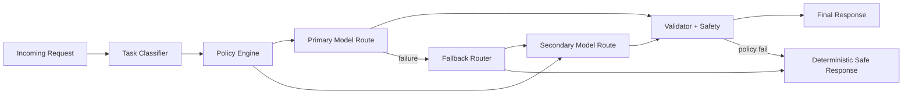
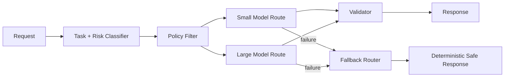

# LLM Selection, Routing, and Fallback Architecture

## Overview
This topic covers how to select enterprise LLMs, route requests across models, and design fallback paths for reliability, compliance, and cost control.

## Why this topic matters
Production GenAI systems fail when model choice is ad hoc. Architect interviews test whether you can make model decisions with measurable criteria and operate safely under outages, latency spikes, and policy constraints.

## Core concepts
- Model selection framework
- Latency-quality-cost trade-offs
- Routing policies by task class
- Fallback strategy (model/provider/pipeline)
- Multi-provider design (Azure OpenAI, Bedrock, self-hosted)
- Token/concurrency throughput planning
- Governance and compliance constraints

## Detailed explanation of each concept
LLM selection is not only benchmark ranking. Enterprise architecture must include compliance, data residency, safety features, cost predictability, throughput limits, and operational support. Routing determines which model handles each request class, while fallback ensures graceful degradation under failures.

Effective architectures use tiered model strategy: smaller models for classification/extraction, larger models for complex reasoning. Routing is policy-based, observability-driven, and versioned. Fallback can be horizontal (same model in another region), vertical (smaller model), or functional (safe deterministic response).

## Evaluation (How to assess architecture quality)
- Task success rate by model route
- Cost per successful request
- p95/p99 latency by workload class
- Fallback activation and recovery success rates
- Safety/policy violation rates
- Availability under provider incident scenarios

## Architecture / flow diagram


**Flow explanation:**  
Request is classified and policy-checked before model routing. Primary route executes first; failures or policy violations trigger fallback routes. Validator ensures structural and safety compliance before final response.

## Real-world example
A banking assistant uses a small model for intent classification and document field extraction, a larger model for exception reasoning, and a deterministic policy response when confidence is low. During regional outage, traffic shifts to secondary provider with reduced feature mode.

## Best practices
- Define model selection criteria before implementation
- Separate routing policy from prompt logic
- Design fallback tiers with explicit triggers
- Instrument route-level quality, latency, and cost
- Test provider outage playbooks regularly
- Use canary release for routing policy changes

## Common mistakes / misconceptions
- Choosing model by popularity only
- No fallback strategy until incident occurs
- One-model-for-all workloads
- Ignoring data residency/compliance in routing
- No route-level observability or cost attribution

## Industry relevance
Model routing and fallback are core in customer support copilots, enterprise assistants, regulated Q&A platforms, and AI-enabled transaction workflows.

## Interview discussion points
- Azure OpenAI vs Bedrock vs self-hosted trade-offs
- Dynamic model routing architecture
- Fallback decision trees and safe degradation
- Cost and concurrency management at scale
- Compliance-aware model governance

## Links to dependent / related topics
- [RAG Retrieval Engineering Architecture](./rag_retrieval_engineering_architecture.md)
- [Agentic AI Architecture](./agentic_ai_langchain_langgraph.md)
- [Security, IAM, Networking](../security/security_iam_networking.md)
- [System Design HLD/LLD](../system-design/system_design_hld_lld.md)

## Interview Questions (50)
1. How do you choose an LLM for enterprise production use?
2. What criteria matter most in model selection?
3. How do you compare latency vs quality vs cost?
4. When should you use a small model over a large model?
5. When should you use a large model despite higher cost?
6. How do you evaluate model fit for a specific use case?
7. How do you design a model selection scorecard?
8. What is model routing and why is it needed?
9. How do you route by task type safely?
10. How do you route by risk/compliance class?
11. How do you route by latency SLO tier?
12. How do you route by cost budgets?
13. How do you implement confidence-based routing?
14. How do you design fallback architecture for model failures?
15. Model fallback vs pipeline fallback: what is difference?
16. How do you define fallback trigger conditions?
17. How do you avoid fallback loops and instability?
18. How do you do cross-region fallback?
19. How do you do cross-provider fallback?
20. How do you design safe degraded response mode?
21. How do you compare Azure OpenAI vs AWS Bedrock?
22. When does on-prem/self-hosted LLM make sense?
23. How do you handle data residency in routing?
24. How do you enforce privacy constraints across providers?
25. How do you design throughput and concurrency capacity?
26. How do tokens per request affect architecture sizing?
27. How do you control token cost spikes?
28. How do you monitor route-level quality drift?
29. How do you monitor route-level latency drift?
30. How do you monitor route-level cost drift?
31. How do you test routing policies before release?
32. How do you canary model/routing changes?
33. How do you rollback a bad routing policy quickly?
34. How do you version prompts and model policies together?
35. How do you design A/B tests for model routes?
36. How do you detect hallucination differences across models?
37. How do you enforce structured outputs across models?
38. How do you manage model feature mismatch across providers?
39. How do you build vendor lock-in mitigation strategy?
40. How do you secure API keys/secrets across model vendors?
41. How do you choose embedding model separate from generation model?
42. How do you route retrieval queries vs generation queries?
43. How do you optimize for high-volume low-risk workloads?
44. How do you optimize for low-volume high-risk workloads?
45. How do you present model trade-offs to leadership?
46. What are common anti-patterns in model routing?
47. How do you design incident response for model outages?
48. How do you prove fallback readiness in DR drills?
49. How do you design buy vs build decision for model platform?
50. How do you conclude an LLM selection/routing interview answer strongly?

## Enhanced Answering Playbook (Crisp + Deep + Summary + Example)

Use this playbook for model-routing interview answers:

- **Crisp answer:** Give route decision criteria in one clear statement.
- **Deep explanation:** Explain policy constraints, SLOs, and fallback tiers.
- **Answer summary:** Conclude with quality, reliability, and cost implications.
- **Practical example:** Show model split by task/risk class.
- **Diagram thinking:** Show primary route and degradation path.

### Worked Example: Risk-aware model routing
**Crisp answer:** Route low-risk high-volume tasks to smaller models and high-risk complex tasks to stronger models with strict fallback policy.

**Deep explanation:**  
The router first classifies request type and risk level, then checks compliance constraints like data residency and provider eligibility. For extraction and classification, small models reduce latency and cost. For complex reasoning with high business impact, larger models are selected with stricter validation. If primary route fails or breaches SLO, fallback moves to secondary provider or deterministic safe response mode. Route telemetry tracks success rate, p95 latency, and cost per successful completion.

**Answer summary:**  
- Routing should be policy-driven, not provider-driven.  
- Fallback paths must be predefined and tested.  
- Route-level observability is essential for optimization.



## Answers for important questions (Summary + Crisp + Deep)

### Q1. How do you choose an LLM for enterprise production use?
**Question summary:** Tests practical model selection beyond benchmark headlines.
**Crisp answer (7-8 lines):** Start with business use case and risk class. Evaluate quality on domain-specific tasks, not generic demos. Check latency and throughput against SLOs. Compare token economics under expected traffic. Validate compliance, privacy, and residency constraints. Confirm safety controls and auditability features. Select model with best end-to-end business fit.
**Deep explanation (~60-70 lines):** For `How do you choose an LLM for enterprise production use?`, start by identifying where this decision sits in your model-routing architecture control flow and what failure it prevents. A strong architecture answer should describe the request path end-to-end, not just define terms: ingress, authorization, orchestration, dependency calls, validation, and fallback. In this flow, deterministic steps must be explicit and testable, such as route policy, budget limits, timeout thresholds, fallback triggers. These are deterministic because policy and safety outcomes cannot depend on model creativity. Probabilistic steps are acceptable where approximation is useful, such as task complexity classification and quality estimation, but they still need guardrails and confidence thresholds. The key trade-off is control versus flexibility: stricter deterministic control improves safety and auditability, while probabilistic reasoning improves adaptability but increases variance in output quality. Design decisions should therefore include boundaries: which component can decide, which component must verify, and which component can block or escalate. Also explain operational behavior under stress: dependency timeout, partial failure, malformed tool output, stale context, and degraded external APIs. For each failure mode, define one mitigation path (retry with budget, route fallback, safe response, or human approval) so the system degrades safely instead of failing unpredictably. Security must be integrated into this answer: identity propagation, least-privilege access, and data boundary enforcement should happen before generation, not after. Finally, show how you will measure success in production with metrics like route success, p95 latency by route, fallback activations, cost/success, and mention rollout safety with canary + rollback criteria. This turns the answer from a definition into an operating architecture decision with clear risk, mitigation, and measurable outcomes.
**Answer summary:**
- **Decision:** Select the pattern that best satisfies `How do you choose an LLM for enterprise production use?` under your business and compliance constraints.
- **Risk:** Weak control boundaries and unclear ownership create quality, security, and reliability regressions at scale.
- **Mitigation:** Enforce policy gates, measurable SLO/SLA triggers, and tested fallback/recovery playbooks before full rollout.
**Practical example:** In a healthcare claims assistant, the team addresses 'How do you choose an LLM for enterprise production use?' by enforcing role-scoped access, validating each critical step through policy checks, and releasing changes with canary monitoring so quality and compliance remain stable under production traffic.
**Simple diagram:**  
```text
Use Case + Constraints -> Model Evaluation -> Production Selection
```
**Trusted reference links:**  
- https://learn.microsoft.com/en-us/azure/ai-services/openai/overview

### Q2. What criteria matter most in model selection?
**Question summary:** Prioritization framework question.
**Crisp answer (7-8 lines):** Quality for target task is first. Safety and compliance are non-negotiable. Latency and throughput must meet product SLOs. Cost must fit unit economics at scale. Operational reliability and support model matter. Integration features affect build speed. Final decision should be scorecard-based.
**Deep explanation (~60-70 lines):** For `What criteria matter most in model selection?`, start by identifying where this decision sits in your model-routing architecture control flow and what failure it prevents. A strong architecture answer should describe the request path end-to-end, not just define terms: ingress, authorization, orchestration, dependency calls, validation, and fallback. In this flow, deterministic steps must be explicit and testable, such as route policy, budget limits, timeout thresholds, fallback triggers. These are deterministic because policy and safety outcomes cannot depend on model creativity. Probabilistic steps are acceptable where approximation is useful, such as task complexity classification and quality estimation, but they still need guardrails and confidence thresholds. The key trade-off is control versus flexibility: stricter deterministic control improves safety and auditability, while probabilistic reasoning improves adaptability but increases variance in output quality. Design decisions should therefore include boundaries: which component can decide, which component must verify, and which component can block or escalate. Also explain operational behavior under stress: dependency timeout, partial failure, malformed tool output, stale context, and degraded external APIs. For each failure mode, define one mitigation path (retry with budget, route fallback, safe response, or human approval) so the system degrades safely instead of failing unpredictably. Security must be integrated into this answer: identity propagation, least-privilege access, and data boundary enforcement should happen before generation, not after. Finally, show how you will measure success in production with metrics like route success, p95 latency by route, fallback activations, cost/success, and mention rollout safety with canary + rollback criteria. This turns the answer from a definition into an operating architecture decision with clear risk, mitigation, and measurable outcomes.
**Answer summary:**
- **Decision:** Select the pattern that best satisfies `What criteria matter most in model selection?` under your business and compliance constraints.
- **Risk:** Weak control boundaries and unclear ownership create quality, security, and reliability regressions at scale.
- **Mitigation:** Enforce policy gates, measurable SLO/SLA triggers, and tested fallback/recovery playbooks before full rollout.
**Practical example:** In a insurance underwriting knowledge bot, the team addresses 'What criteria matter most in model selection?' by enforcing role-scoped access, validating each critical step through policy checks, and releasing changes with canary monitoring so quality and compliance remain stable under production traffic.
**Simple diagram:**  
```text
Quality + Safety + Latency + Cost + Governance -> Weighted Score
```
**Trusted reference links:**  
- https://learn.microsoft.com/en-us/azure/well-architected/

### Q3. How do you compare latency vs quality vs cost?
**Question summary:** Core trade-off discussion.
**Crisp answer (7-8 lines):** Build a benchmark matrix with real workload prompts. Measure quality accuracy and groundedness. Measure p95 latency under realistic concurrency. Measure cost per successful outcome. Plot Pareto options across three dimensions. Choose route strategy, not one universal winner. Re-tune as traffic and requirements evolve.
**Deep explanation (~60-70 lines):** For `How do you compare latency vs quality vs cost?`, start by identifying where this decision sits in your model-routing architecture control flow and what failure it prevents. A strong architecture answer should describe the request path end-to-end, not just define terms: ingress, authorization, orchestration, dependency calls, validation, and fallback. In this flow, deterministic steps must be explicit and testable, such as route policy, budget limits, timeout thresholds, fallback triggers. These are deterministic because policy and safety outcomes cannot depend on model creativity. Probabilistic steps are acceptable where approximation is useful, such as task complexity classification and quality estimation, but they still need guardrails and confidence thresholds. The key trade-off is control versus flexibility: stricter deterministic control improves safety and auditability, while probabilistic reasoning improves adaptability but increases variance in output quality. Design decisions should therefore include boundaries: which component can decide, which component must verify, and which component can block or escalate. Also explain operational behavior under stress: dependency timeout, partial failure, malformed tool output, stale context, and degraded external APIs. For each failure mode, define one mitigation path (retry with budget, route fallback, safe response, or human approval) so the system degrades safely instead of failing unpredictably. Security must be integrated into this answer: identity propagation, least-privilege access, and data boundary enforcement should happen before generation, not after. Finally, show how you will measure success in production with metrics like route success, p95 latency by route, fallback activations, cost/success, and mention rollout safety with canary + rollback criteria. This turns the answer from a definition into an operating architecture decision with clear risk, mitigation, and measurable outcomes.
**Answer summary:**
- **Decision:** Select the pattern that best satisfies `How do you compare latency vs quality vs cost?` under your business and compliance constraints.
- **Risk:** Weak control boundaries and unclear ownership create quality, security, and reliability regressions at scale.
- **Mitigation:** Enforce policy gates, measurable SLO/SLA triggers, and tested fallback/recovery playbooks before full rollout.
**Practical example:** In a enterprise IT support assistant, the team addresses 'How do you compare latency vs quality vs cost?' by enforcing role-scoped access, validating each critical step through policy checks, and releasing changes with canary monitoring so quality and compliance remain stable under production traffic.
**Simple diagram:**  
```text
Quality-Latency-Cost Pareto -> Route Policy
```
**Trusted reference links:**  
- https://learn.microsoft.com/en-us/azure/architecture/ai-ml/guide/

### Q4. When should you use a small model over a large model?
**Question summary:** Cost-performance routing decision.
**Crisp answer (7-8 lines):** Use small models for classification, extraction, and templated tasks. Prefer when latency and cost sensitivity are high. Use for high-volume low-risk requests. Keep prompts constrained and outputs structured. Validate quality thresholds before rollout. Add escalation path to larger model on ambiguity. Monitor drift continuously.
**Deep explanation (~60-70 lines):** For `When should you use a small model over a large model?`, start by identifying where this decision sits in your model-routing architecture control flow and what failure it prevents. A strong architecture answer should describe the request path end-to-end, not just define terms: ingress, authorization, orchestration, dependency calls, validation, and fallback. In this flow, deterministic steps must be explicit and testable, such as route policy, budget limits, timeout thresholds, fallback triggers. These are deterministic because policy and safety outcomes cannot depend on model creativity. Probabilistic steps are acceptable where approximation is useful, such as task complexity classification and quality estimation, but they still need guardrails and confidence thresholds. The key trade-off is control versus flexibility: stricter deterministic control improves safety and auditability, while probabilistic reasoning improves adaptability but increases variance in output quality. Design decisions should therefore include boundaries: which component can decide, which component must verify, and which component can block or escalate. Also explain operational behavior under stress: dependency timeout, partial failure, malformed tool output, stale context, and degraded external APIs. For each failure mode, define one mitigation path (retry with budget, route fallback, safe response, or human approval) so the system degrades safely instead of failing unpredictably. Security must be integrated into this answer: identity propagation, least-privilege access, and data boundary enforcement should happen before generation, not after. Finally, show how you will measure success in production with metrics like route success, p95 latency by route, fallback activations, cost/success, and mention rollout safety with canary + rollback criteria. This turns the answer from a definition into an operating architecture decision with clear risk, mitigation, and measurable outcomes.
**Answer summary:**
- **Decision:** Select the pattern that best satisfies `When should you use a small model over a large model?` under your business and compliance constraints.
- **Risk:** Weak control boundaries and unclear ownership create quality, security, and reliability regressions at scale.
- **Mitigation:** Enforce policy gates, measurable SLO/SLA triggers, and tested fallback/recovery playbooks before full rollout.
**Practical example:** In a procurement contract Q&A assistant, the team addresses 'When should you use a small model over a large model?' by enforcing role-scoped access, validating each critical step through policy checks, and releasing changes with canary monitoring so quality and compliance remain stable under production traffic.
**Simple diagram:**  
```text
Low-risk/Structured Task -> Small Model -> Optional Escalation
```
**Trusted reference links:**  
- https://learn.microsoft.com/en-us/azure/ai-services/openai/concepts/models

### Q5. When should you use a large model despite higher cost?
**Question summary:** High-complexity routing logic.
**Crisp answer (7-8 lines):** Use large models for complex reasoning and ambiguity resolution. Prefer for high-stakes low-error-tolerance workflows. Use when multi-step synthesis quality is critical. Apply for exception handling paths not default traffic. Control costs with targeted routing and token budgeting. Keep fallback options for availability. Validate measurable uplift over smaller models.
**Deep explanation (~60-70 lines):** For `When should you use a large model despite higher cost?`, start by identifying where this decision sits in your model-routing architecture control flow and what failure it prevents. A strong architecture answer should describe the request path end-to-end, not just define terms: ingress, authorization, orchestration, dependency calls, validation, and fallback. In this flow, deterministic steps must be explicit and testable, such as route policy, budget limits, timeout thresholds, fallback triggers. These are deterministic because policy and safety outcomes cannot depend on model creativity. Probabilistic steps are acceptable where approximation is useful, such as task complexity classification and quality estimation, but they still need guardrails and confidence thresholds. The key trade-off is control versus flexibility: stricter deterministic control improves safety and auditability, while probabilistic reasoning improves adaptability but increases variance in output quality. Design decisions should therefore include boundaries: which component can decide, which component must verify, and which component can block or escalate. Also explain operational behavior under stress: dependency timeout, partial failure, malformed tool output, stale context, and degraded external APIs. For each failure mode, define one mitigation path (retry with budget, route fallback, safe response, or human approval) so the system degrades safely instead of failing unpredictably. Security must be integrated into this answer: identity propagation, least-privilege access, and data boundary enforcement should happen before generation, not after. Finally, show how you will measure success in production with metrics like route success, p95 latency by route, fallback activations, cost/success, and mention rollout safety with canary + rollback criteria. This turns the answer from a definition into an operating architecture decision with clear risk, mitigation, and measurable outcomes.
**Answer summary:**
- **Decision:** Select the pattern that best satisfies `When should you use a large model despite higher cost?` under your business and compliance constraints.
- **Risk:** Weak control boundaries and unclear ownership create quality, security, and reliability regressions at scale.
- **Mitigation:** Enforce policy gates, measurable SLO/SLA triggers, and tested fallback/recovery playbooks before full rollout.
**Practical example:** In a internal audit/compliance copilot, the team addresses 'When should you use a large model despite higher cost?' by enforcing role-scoped access, validating each critical step through policy checks, and releasing changes with canary monitoring so quality and compliance remain stable under production traffic.
**Simple diagram:**  
```text
High-complexity/High-risk Task -> Large Model Route
```
**Trusted reference links:**  
- https://learn.microsoft.com/en-us/azure/ai-services/openai/concepts/models

### Q6. How do you evaluate model fit for a specific use case?
**Question summary:** Applied evaluation strategy.
**Crisp answer (7-8 lines):** Define task taxonomy and acceptance criteria. Build representative evaluation datasets. Test quality, latency, and safety by task class. Include adversarial and edge-case scenarios. Measure cost at expected scale. Validate failure behavior and fallback effectiveness. Select model route bundle, not isolated model.
**Deep explanation (~60-70 lines):** For `How do you evaluate model fit for a specific use case?`, start by identifying where this decision sits in your model-routing architecture control flow and what failure it prevents. A strong architecture answer should describe the request path end-to-end, not just define terms: ingress, authorization, orchestration, dependency calls, validation, and fallback. In this flow, deterministic steps must be explicit and testable, such as route policy, budget limits, timeout thresholds, fallback triggers. These are deterministic because policy and safety outcomes cannot depend on model creativity. Probabilistic steps are acceptable where approximation is useful, such as task complexity classification and quality estimation, but they still need guardrails and confidence thresholds. The key trade-off is control versus flexibility: stricter deterministic control improves safety and auditability, while probabilistic reasoning improves adaptability but increases variance in output quality. Design decisions should therefore include boundaries: which component can decide, which component must verify, and which component can block or escalate. Also explain operational behavior under stress: dependency timeout, partial failure, malformed tool output, stale context, and degraded external APIs. For each failure mode, define one mitigation path (retry with budget, route fallback, safe response, or human approval) so the system degrades safely instead of failing unpredictably. Security must be integrated into this answer: identity propagation, least-privilege access, and data boundary enforcement should happen before generation, not after. Finally, show how you will measure success in production with metrics like route success, p95 latency by route, fallback activations, cost/success, and mention rollout safety with canary + rollback criteria. This turns the answer from a definition into an operating architecture decision with clear risk, mitigation, and measurable outcomes.
**Answer summary:**
- **Decision:** Select the pattern that best satisfies `How do you evaluate model fit for a specific use case?` under your business and compliance constraints.
- **Risk:** Weak control boundaries and unclear ownership create quality, security, and reliability regressions at scale.
- **Mitigation:** Enforce policy gates, measurable SLO/SLA triggers, and tested fallback/recovery playbooks before full rollout.
**Practical example:** In a customer support triage assistant, the team addresses 'How do you evaluate model fit for a specific use case?' by enforcing role-scoped access, validating each critical step through policy checks, and releasing changes with canary monitoring so quality and compliance remain stable under production traffic.
**Simple diagram:**  
```text
Use-case Dataset -> Multi-metric Eval -> Route Decision
```
**Trusted reference links:**  
- https://learn.microsoft.com/en-us/azure/ai-foundry/concepts/evaluation

### Q7. How do you design a model selection scorecard?
**Question summary:** Governance-friendly decision artifact.
**Crisp answer (7-8 lines):** Define weighted criteria by business priorities. Include quality, latency, cost, compliance, and reliability. Add integration and operability factors. Score each candidate on measured evidence. Document assumptions and known risks. Include sensitivity analysis for traffic growth. Use scorecard as living artifact.
**Deep explanation (~60-70 lines):** For `How do you design a model selection scorecard?`, start by identifying where this decision sits in your model-routing architecture control flow and what failure it prevents. A strong architecture answer should describe the request path end-to-end, not just define terms: ingress, authorization, orchestration, dependency calls, validation, and fallback. In this flow, deterministic steps must be explicit and testable, such as route policy, budget limits, timeout thresholds, fallback triggers. These are deterministic because policy and safety outcomes cannot depend on model creativity. Probabilistic steps are acceptable where approximation is useful, such as task complexity classification and quality estimation, but they still need guardrails and confidence thresholds. The key trade-off is control versus flexibility: stricter deterministic control improves safety and auditability, while probabilistic reasoning improves adaptability but increases variance in output quality. Design decisions should therefore include boundaries: which component can decide, which component must verify, and which component can block or escalate. Also explain operational behavior under stress: dependency timeout, partial failure, malformed tool output, stale context, and degraded external APIs. For each failure mode, define one mitigation path (retry with budget, route fallback, safe response, or human approval) so the system degrades safely instead of failing unpredictably. Security must be integrated into this answer: identity propagation, least-privilege access, and data boundary enforcement should happen before generation, not after. Finally, show how you will measure success in production with metrics like route success, p95 latency by route, fallback activations, cost/success, and mention rollout safety with canary + rollback criteria. This turns the answer from a definition into an operating architecture decision with clear risk, mitigation, and measurable outcomes.
**Answer summary:**
- **Decision:** Select the pattern that best satisfies `How do you design a model selection scorecard?` under your business and compliance constraints.
- **Risk:** Weak control boundaries and unclear ownership create quality, security, and reliability regressions at scale.
- **Mitigation:** Enforce policy gates, measurable SLO/SLA triggers, and tested fallback/recovery playbooks before full rollout.
**Practical example:** In a operations incident copilot, the team addresses 'How do you design a model selection scorecard?' by enforcing role-scoped access, validating each critical step through policy checks, and releasing changes with canary monitoring so quality and compliance remain stable under production traffic.
**Simple diagram:**  
```text
Criteria Weights + Candidate Scores -> Ranked Options
```
**Trusted reference links:**  
- https://learn.microsoft.com/en-us/azure/architecture/framework/

### Q8. What is model routing and why is it needed?
**Question summary:** Fundamental architecture concept.
**Crisp answer (7-8 lines):** Model routing sends requests to different models by policy. It optimizes quality, latency, and cost simultaneously. It supports risk-based handling and compliance needs. It reduces dependence on one model/provider. It enables fallback and resilience patterns. It improves economics for mixed workload portfolios. It is essential in production-scale GenAI.
**Deep explanation (~60-70 lines):** For `What is model routing and why is it needed?`, start by identifying where this decision sits in your model-routing architecture control flow and what failure it prevents. A strong architecture answer should describe the request path end-to-end, not just define terms: ingress, authorization, orchestration, dependency calls, validation, and fallback. In this flow, deterministic steps must be explicit and testable, such as route policy, budget limits, timeout thresholds, fallback triggers. These are deterministic because policy and safety outcomes cannot depend on model creativity. Probabilistic steps are acceptable where approximation is useful, such as task complexity classification and quality estimation, but they still need guardrails and confidence thresholds. The key trade-off is control versus flexibility: stricter deterministic control improves safety and auditability, while probabilistic reasoning improves adaptability but increases variance in output quality. Design decisions should therefore include boundaries: which component can decide, which component must verify, and which component can block or escalate. Also explain operational behavior under stress: dependency timeout, partial failure, malformed tool output, stale context, and degraded external APIs. For each failure mode, define one mitigation path (retry with budget, route fallback, safe response, or human approval) so the system degrades safely instead of failing unpredictably. Security must be integrated into this answer: identity propagation, least-privilege access, and data boundary enforcement should happen before generation, not after. Finally, show how you will measure success in production with metrics like route success, p95 latency by route, fallback activations, cost/success, and mention rollout safety with canary + rollback criteria. This turns the answer from a definition into an operating architecture decision with clear risk, mitigation, and measurable outcomes.
**Answer summary:**
- **Decision:** Select the pattern that best satisfies `What is model routing and why is it needed?` under your business and compliance constraints.
- **Risk:** Weak control boundaries and unclear ownership create quality, security, and reliability regressions at scale.
- **Mitigation:** Enforce policy gates, measurable SLO/SLA triggers, and tested fallback/recovery playbooks before full rollout.
**Practical example:** In a banking policy copilot, the team addresses 'What is model routing and why is it needed?' by enforcing role-scoped access, validating each critical step through policy checks, and releasing changes with canary monitoring so quality and compliance remain stable under production traffic.
**Simple diagram:**  
```text
Request -> Router -> Model A/B/C based on policy
```
**Trusted reference links:**  
- https://learn.microsoft.com/en-us/azure/architecture/ai-ml/guide/

### Q9. How do you route by task type safely?
**Question summary:** Task-aware policy design.
**Crisp answer (7-8 lines):** Classify request intent first with lightweight model/rules. Map task classes to approved model routes. Validate classification confidence before routing. Use conservative default for uncertain classifications. Enforce policy constraints before model invocation. Log route decisions for audit and tuning. Periodically retrain/recalibrate classifier.
**Deep explanation (~60-70 lines):** For `How do you route by task type safely?`, start by identifying where this decision sits in your model-routing architecture control flow and what failure it prevents. A strong architecture answer should describe the request path end-to-end, not just define terms: ingress, authorization, orchestration, dependency calls, validation, and fallback. In this flow, deterministic steps must be explicit and testable, such as route policy, budget limits, timeout thresholds, fallback triggers. These are deterministic because policy and safety outcomes cannot depend on model creativity. Probabilistic steps are acceptable where approximation is useful, such as task complexity classification and quality estimation, but they still need guardrails and confidence thresholds. The key trade-off is control versus flexibility: stricter deterministic control improves safety and auditability, while probabilistic reasoning improves adaptability but increases variance in output quality. Design decisions should therefore include boundaries: which component can decide, which component must verify, and which component can block or escalate. Also explain operational behavior under stress: dependency timeout, partial failure, malformed tool output, stale context, and degraded external APIs. For each failure mode, define one mitigation path (retry with budget, route fallback, safe response, or human approval) so the system degrades safely instead of failing unpredictably. Security must be integrated into this answer: identity propagation, least-privilege access, and data boundary enforcement should happen before generation, not after. Finally, show how you will measure success in production with metrics like route success, p95 latency by route, fallback activations, cost/success, and mention rollout safety with canary + rollback criteria. This turns the answer from a definition into an operating architecture decision with clear risk, mitigation, and measurable outcomes.
**Answer summary:**
- **Decision:** Select the pattern that best satisfies `How do you route by task type safely?` under your business and compliance constraints.
- **Risk:** Weak control boundaries and unclear ownership create quality, security, and reliability regressions at scale.
- **Mitigation:** Enforce policy gates, measurable SLO/SLA triggers, and tested fallback/recovery playbooks before full rollout.
**Practical example:** In a healthcare claims assistant, the team addresses 'How do you route by task type safely?' by enforcing role-scoped access, validating each critical step through policy checks, and releasing changes with canary monitoring so quality and compliance remain stable under production traffic.
**Simple diagram:**  
```text
Intent Classifier -> Policy Map -> Model Route
```
**Trusted reference links:**  
- https://learn.microsoft.com/en-us/azure/ai-foundry/

### Q10. How do you route by risk/compliance class?
**Question summary:** Regulated architecture question.
**Crisp answer (7-8 lines):** Tag requests by data sensitivity and action risk. Route regulated traffic only to compliant model endpoints. Enforce residency and encryption constraints at route layer. Require stricter safety checks for high-risk responses. Block unsupported providers for sensitive classes. Audit every high-risk route decision. Fail closed on missing risk tags.
**Deep explanation (~60-70 lines):** For `How do you route by risk/compliance class?`, start by identifying where this decision sits in your model-routing architecture control flow and what failure it prevents. A strong architecture answer should describe the request path end-to-end, not just define terms: ingress, authorization, orchestration, dependency calls, validation, and fallback. In this flow, deterministic steps must be explicit and testable, such as route policy, budget limits, timeout thresholds, fallback triggers. These are deterministic because policy and safety outcomes cannot depend on model creativity. Probabilistic steps are acceptable where approximation is useful, such as task complexity classification and quality estimation, but they still need guardrails and confidence thresholds. The key trade-off is control versus flexibility: stricter deterministic control improves safety and auditability, while probabilistic reasoning improves adaptability but increases variance in output quality. Design decisions should therefore include boundaries: which component can decide, which component must verify, and which component can block or escalate. Also explain operational behavior under stress: dependency timeout, partial failure, malformed tool output, stale context, and degraded external APIs. For each failure mode, define one mitigation path (retry with budget, route fallback, safe response, or human approval) so the system degrades safely instead of failing unpredictably. Security must be integrated into this answer: identity propagation, least-privilege access, and data boundary enforcement should happen before generation, not after. Finally, show how you will measure success in production with metrics like route success, p95 latency by route, fallback activations, cost/success, and mention rollout safety with canary + rollback criteria. This turns the answer from a definition into an operating architecture decision with clear risk, mitigation, and measurable outcomes.
**Answer summary:**
- **Decision:** Select the pattern that best satisfies `How do you route by risk/compliance class?` under your business and compliance constraints.
- **Risk:** Weak control boundaries and unclear ownership create quality, security, and reliability regressions at scale.
- **Mitigation:** Enforce policy gates, measurable SLO/SLA triggers, and tested fallback/recovery playbooks before full rollout.
**Practical example:** In a insurance underwriting knowledge bot, the team addresses 'How do you route by risk/compliance class?' by enforcing role-scoped access, validating each critical step through policy checks, and releasing changes with canary monitoring so quality and compliance remain stable under production traffic.
**Simple diagram:**  
```text
Risk Tag -> Compliance Policy -> Allowed Model Endpoints
```
**Trusted reference links:**  
- https://learn.microsoft.com/en-us/azure/compliance/

### Q11. How do you route by latency SLO tier?
**Question summary:** Performance-governed routing.
**Crisp answer (7-8 lines):** Define latency tiers per product capability. Route strict-SLO traffic to fast model paths. Use larger models only where latency budget allows. Apply timeout ceilings per route. Degrade to concise response mode under pressure. Monitor p95/p99 by tier. Rebalance route policy with telemetry.
**Deep explanation (~60-70 lines):** For `How do you route by latency SLO tier?`, start by identifying where this decision sits in your model-routing architecture control flow and what failure it prevents. A strong architecture answer should describe the request path end-to-end, not just define terms: ingress, authorization, orchestration, dependency calls, validation, and fallback. In this flow, deterministic steps must be explicit and testable, such as route policy, budget limits, timeout thresholds, fallback triggers. These are deterministic because policy and safety outcomes cannot depend on model creativity. Probabilistic steps are acceptable where approximation is useful, such as task complexity classification and quality estimation, but they still need guardrails and confidence thresholds. The key trade-off is control versus flexibility: stricter deterministic control improves safety and auditability, while probabilistic reasoning improves adaptability but increases variance in output quality. Design decisions should therefore include boundaries: which component can decide, which component must verify, and which component can block or escalate. Also explain operational behavior under stress: dependency timeout, partial failure, malformed tool output, stale context, and degraded external APIs. For each failure mode, define one mitigation path (retry with budget, route fallback, safe response, or human approval) so the system degrades safely instead of failing unpredictably. Security must be integrated into this answer: identity propagation, least-privilege access, and data boundary enforcement should happen before generation, not after. Finally, show how you will measure success in production with metrics like route success, p95 latency by route, fallback activations, cost/success, and mention rollout safety with canary + rollback criteria. This turns the answer from a definition into an operating architecture decision with clear risk, mitigation, and measurable outcomes.
**Answer summary:**
- **Decision:** Select the pattern that best satisfies `How do you route by latency SLO tier?` under your business and compliance constraints.
- **Risk:** Weak control boundaries and unclear ownership create quality, security, and reliability regressions at scale.
- **Mitigation:** Enforce policy gates, measurable SLO/SLA triggers, and tested fallback/recovery playbooks before full rollout.
**Practical example:** In a enterprise IT support assistant, the team addresses 'How do you route by latency SLO tier?' by enforcing role-scoped access, validating each critical step through policy checks, and releasing changes with canary monitoring so quality and compliance remain stable under production traffic.
**Simple diagram:**  
```text
SLO Tier -> Fast Route / Rich Route
```
**Trusted reference links:**  
- https://learn.microsoft.com/en-us/azure/well-architected/performance-efficiency/

### Q12. How do you route by cost budgets?
**Question summary:** Cost governance architecture.
**Crisp answer (7-8 lines):** Set budget envelopes by product and tenant tier. Associate each route with expected token cost. Prefer lower-cost models for routine tasks. Escalate to expensive models only on low confidence/high impact. Enforce hard cost caps and graceful degradation. Alert on abnormal route cost spikes. Review route economics regularly.
**Deep explanation (~60-70 lines):** For `How do you route by cost budgets?`, start by identifying where this decision sits in your model-routing architecture control flow and what failure it prevents. A strong architecture answer should describe the request path end-to-end, not just define terms: ingress, authorization, orchestration, dependency calls, validation, and fallback. In this flow, deterministic steps must be explicit and testable, such as route policy, budget limits, timeout thresholds, fallback triggers. These are deterministic because policy and safety outcomes cannot depend on model creativity. Probabilistic steps are acceptable where approximation is useful, such as task complexity classification and quality estimation, but they still need guardrails and confidence thresholds. The key trade-off is control versus flexibility: stricter deterministic control improves safety and auditability, while probabilistic reasoning improves adaptability but increases variance in output quality. Design decisions should therefore include boundaries: which component can decide, which component must verify, and which component can block or escalate. Also explain operational behavior under stress: dependency timeout, partial failure, malformed tool output, stale context, and degraded external APIs. For each failure mode, define one mitigation path (retry with budget, route fallback, safe response, or human approval) so the system degrades safely instead of failing unpredictably. Security must be integrated into this answer: identity propagation, least-privilege access, and data boundary enforcement should happen before generation, not after. Finally, show how you will measure success in production with metrics like route success, p95 latency by route, fallback activations, cost/success, and mention rollout safety with canary + rollback criteria. This turns the answer from a definition into an operating architecture decision with clear risk, mitigation, and measurable outcomes.
**Answer summary:**
- **Decision:** Select the pattern that best satisfies `How do you route by cost budgets?` under your business and compliance constraints.
- **Risk:** Weak control boundaries and unclear ownership create quality, security, and reliability regressions at scale.
- **Mitigation:** Enforce policy gates, measurable SLO/SLA triggers, and tested fallback/recovery playbooks before full rollout.
**Practical example:** In a procurement contract Q&A assistant, the team addresses 'How do you route by cost budgets?' by enforcing role-scoped access, validating each critical step through policy checks, and releasing changes with canary monitoring so quality and compliance remain stable under production traffic.
**Simple diagram:**  
```text
Budget Policy -> Route Selection -> Cost Monitor -> Adjust
```
**Trusted reference links:**  
- https://learn.microsoft.com/en-us/azure/well-architected/cost-optimization/

### Q13. How do you implement confidence-based routing?
**Question summary:** Dynamic quality control.
**Crisp answer (7-8 lines):** Generate confidence signals from classifier and response validators. Keep low-confidence outputs from cheap route from finalization. Escalate uncertain cases to higher-capability model. Use calibrated thresholds by task class. Avoid over-escalation with budget-aware guardrails. Track false-positive and false-negative escalation rates. Tune thresholds continuously.
**Deep explanation (~60-70 lines):** For `How do you implement confidence-based routing?`, start by identifying where this decision sits in your model-routing architecture control flow and what failure it prevents. A strong architecture answer should describe the request path end-to-end, not just define terms: ingress, authorization, orchestration, dependency calls, validation, and fallback. In this flow, deterministic steps must be explicit and testable, such as route policy, budget limits, timeout thresholds, fallback triggers. These are deterministic because policy and safety outcomes cannot depend on model creativity. Probabilistic steps are acceptable where approximation is useful, such as task complexity classification and quality estimation, but they still need guardrails and confidence thresholds. The key trade-off is control versus flexibility: stricter deterministic control improves safety and auditability, while probabilistic reasoning improves adaptability but increases variance in output quality. Design decisions should therefore include boundaries: which component can decide, which component must verify, and which component can block or escalate. Also explain operational behavior under stress: dependency timeout, partial failure, malformed tool output, stale context, and degraded external APIs. For each failure mode, define one mitigation path (retry with budget, route fallback, safe response, or human approval) so the system degrades safely instead of failing unpredictably. Security must be integrated into this answer: identity propagation, least-privilege access, and data boundary enforcement should happen before generation, not after. Finally, show how you will measure success in production with metrics like route success, p95 latency by route, fallback activations, cost/success, and mention rollout safety with canary + rollback criteria. This turns the answer from a definition into an operating architecture decision with clear risk, mitigation, and measurable outcomes.
**Answer summary:**
- **Decision:** Select the pattern that best satisfies `How do you implement confidence-based routing?` under your business and compliance constraints.
- **Risk:** Weak control boundaries and unclear ownership create quality, security, and reliability regressions at scale.
- **Mitigation:** Enforce policy gates, measurable SLO/SLA triggers, and tested fallback/recovery playbooks before full rollout.
**Practical example:** In a internal audit/compliance copilot, the team addresses 'How do you implement confidence-based routing?' by enforcing role-scoped access, validating each critical step through policy checks, and releasing changes with canary monitoring so quality and compliance remain stable under production traffic.
**Simple diagram:**  
```text
Low-cost Model -> Confidence Check -> Escalate or Finalize
```
**Trusted reference links:**  
- https://learn.microsoft.com/en-us/azure/ai-foundry/concepts/evaluation

### Q14. How do you design fallback architecture for model failures?
**Question summary:** Reliability and continuity.
**Crisp answer (7-8 lines):** Define fallback tiers before incidents happen. Start with same-model alternate region/provider. Then fallback to smaller compatible model. Then fallback to deterministic safe response. Trigger by timeout, error rate, or policy failure thresholds. Preserve trace IDs across fallback hops. Test fallback paths in drills.
**Deep explanation (~60-70 lines):** For `How do you design fallback architecture for model failures?`, start by identifying where this decision sits in your model-routing architecture control flow and what failure it prevents. A strong architecture answer should describe the request path end-to-end, not just define terms: ingress, authorization, orchestration, dependency calls, validation, and fallback. In this flow, deterministic steps must be explicit and testable, such as route policy, budget limits, timeout thresholds, fallback triggers. These are deterministic because policy and safety outcomes cannot depend on model creativity. Probabilistic steps are acceptable where approximation is useful, such as task complexity classification and quality estimation, but they still need guardrails and confidence thresholds. The key trade-off is control versus flexibility: stricter deterministic control improves safety and auditability, while probabilistic reasoning improves adaptability but increases variance in output quality. Design decisions should therefore include boundaries: which component can decide, which component must verify, and which component can block or escalate. Also explain operational behavior under stress: dependency timeout, partial failure, malformed tool output, stale context, and degraded external APIs. For each failure mode, define one mitigation path (retry with budget, route fallback, safe response, or human approval) so the system degrades safely instead of failing unpredictably. Security must be integrated into this answer: identity propagation, least-privilege access, and data boundary enforcement should happen before generation, not after. Finally, show how you will measure success in production with metrics like route success, p95 latency by route, fallback activations, cost/success, and mention rollout safety with canary + rollback criteria. This turns the answer from a definition into an operating architecture decision with clear risk, mitigation, and measurable outcomes.
**Answer summary:**
- **Decision:** Select the pattern that best satisfies `How do you design fallback architecture for model failures?` under your business and compliance constraints.
- **Risk:** Weak control boundaries and unclear ownership create quality, security, and reliability regressions at scale.
- **Mitigation:** Enforce policy gates, measurable SLO/SLA triggers, and tested fallback/recovery playbooks before full rollout.
**Practical example:** In a customer support triage assistant, the team addresses 'How do you design fallback architecture for model failures?' by enforcing role-scoped access, validating each critical step through policy checks, and releasing changes with canary monitoring so quality and compliance remain stable under production traffic.
**Simple diagram:**  
```text
Primary Fail -> Secondary Model -> Deterministic Safe Mode
```
**Trusted reference links:**  
- https://learn.microsoft.com/en-us/azure/well-architected/reliability/

### Q15. Model fallback vs pipeline fallback: what is difference?
**Question summary:** Clarifies fallback granularity.
**Crisp answer (7-8 lines):** Model fallback swaps model while keeping same workflow. Pipeline fallback changes workflow behavior itself. Model fallback handles provider/model outages. Pipeline fallback handles broader dependency or policy failures. Model fallback keeps feature parity where possible. Pipeline fallback may reduce capabilities intentionally. Both should be designed together.
**Deep explanation (~60-70 lines):** For `Model fallback vs pipeline fallback: what is difference?`, start by identifying where this decision sits in your model-routing architecture control flow and what failure it prevents. A strong architecture answer should describe the request path end-to-end, not just define terms: ingress, authorization, orchestration, dependency calls, validation, and fallback. In this flow, deterministic steps must be explicit and testable, such as route policy, budget limits, timeout thresholds, fallback triggers. These are deterministic because policy and safety outcomes cannot depend on model creativity. Probabilistic steps are acceptable where approximation is useful, such as task complexity classification and quality estimation, but they still need guardrails and confidence thresholds. The key trade-off is control versus flexibility: stricter deterministic control improves safety and auditability, while probabilistic reasoning improves adaptability but increases variance in output quality. Design decisions should therefore include boundaries: which component can decide, which component must verify, and which component can block or escalate. Also explain operational behavior under stress: dependency timeout, partial failure, malformed tool output, stale context, and degraded external APIs. For each failure mode, define one mitigation path (retry with budget, route fallback, safe response, or human approval) so the system degrades safely instead of failing unpredictably. Security must be integrated into this answer: identity propagation, least-privilege access, and data boundary enforcement should happen before generation, not after. Finally, show how you will measure success in production with metrics like route success, p95 latency by route, fallback activations, cost/success, and mention rollout safety with canary + rollback criteria. This turns the answer from a definition into an operating architecture decision with clear risk, mitigation, and measurable outcomes.
**Answer summary:**
- **Decision:** Select the pattern that best satisfies `Model fallback vs pipeline fallback: what is difference?` under your business and compliance constraints.
- **Risk:** Weak control boundaries and unclear ownership create quality, security, and reliability regressions at scale.
- **Mitigation:** Enforce policy gates, measurable SLO/SLA triggers, and tested fallback/recovery playbooks before full rollout.
**Practical example:** In a operations incident copilot, the team addresses 'Model fallback vs pipeline fallback: what is difference?' by enforcing role-scoped access, validating each critical step through policy checks, and releasing changes with canary monitoring so quality and compliance remain stable under production traffic.
**Simple diagram:**  
```text
Model Fallback: A -> B
Pipeline Fallback: Full Flow -> Safe Minimal Flow
```
**Trusted reference links:**  
- https://learn.microsoft.com/en-us/azure/architecture/patterns/

### Q16. How do you define fallback trigger conditions?
**Question summary:** Incident automation thresholds.
**Crisp answer (7-8 lines):** Use measurable triggers: timeout, 5xx rate, safety violation, or quota exhaustion. Define thresholds per route tier. Require short evaluation window plus hysteresis to avoid flapping. Combine health signals with policy context. Trigger automatically for severe failures. Keep manual override controls for operations. Log all trigger events.
**Deep explanation (~60-70 lines):** For `How do you define fallback trigger conditions?`, start by identifying where this decision sits in your model-routing architecture control flow and what failure it prevents. A strong architecture answer should describe the request path end-to-end, not just define terms: ingress, authorization, orchestration, dependency calls, validation, and fallback. In this flow, deterministic steps must be explicit and testable, such as route policy, budget limits, timeout thresholds, fallback triggers. These are deterministic because policy and safety outcomes cannot depend on model creativity. Probabilistic steps are acceptable where approximation is useful, such as task complexity classification and quality estimation, but they still need guardrails and confidence thresholds. The key trade-off is control versus flexibility: stricter deterministic control improves safety and auditability, while probabilistic reasoning improves adaptability but increases variance in output quality. Design decisions should therefore include boundaries: which component can decide, which component must verify, and which component can block or escalate. Also explain operational behavior under stress: dependency timeout, partial failure, malformed tool output, stale context, and degraded external APIs. For each failure mode, define one mitigation path (retry with budget, route fallback, safe response, or human approval) so the system degrades safely instead of failing unpredictably. Security must be integrated into this answer: identity propagation, least-privilege access, and data boundary enforcement should happen before generation, not after. Finally, show how you will measure success in production with metrics like route success, p95 latency by route, fallback activations, cost/success, and mention rollout safety with canary + rollback criteria. This turns the answer from a definition into an operating architecture decision with clear risk, mitigation, and measurable outcomes.
**Answer summary:**
- **Decision:** Select the pattern that best satisfies `How do you define fallback trigger conditions?` under your business and compliance constraints.
- **Risk:** Weak control boundaries and unclear ownership create quality, security, and reliability regressions at scale.
- **Mitigation:** Enforce policy gates, measurable SLO/SLA triggers, and tested fallback/recovery playbooks before full rollout.
**Practical example:** In a banking policy copilot, the team addresses 'How do you define fallback trigger conditions?' by enforcing role-scoped access, validating each critical step through policy checks, and releasing changes with canary monitoring so quality and compliance remain stable under production traffic.
**Simple diagram:**  
```text
Health Metrics -> Threshold Engine -> Fallback Trigger
```
**Trusted reference links:**  
- https://learn.microsoft.com/en-us/azure/well-architected/reliability/testing

### Q17. How do you avoid fallback loops and instability?
**Question summary:** Control-plane stability.
**Crisp answer (7-8 lines):** Limit fallback depth and attempts per request. Use circuit breakers on unhealthy routes. Apply cooldown windows before retrying failed routes. Keep monotonic downgrade path during incidents. Block immediate bounce-back switching. Track route oscillation metrics. Require healthy burn-in before restoration.
**Deep explanation (~60-70 lines):** For `How do you avoid fallback loops and instability?`, start by identifying where this decision sits in your model-routing architecture control flow and what failure it prevents. A strong architecture answer should describe the request path end-to-end, not just define terms: ingress, authorization, orchestration, dependency calls, validation, and fallback. In this flow, deterministic steps must be explicit and testable, such as route policy, budget limits, timeout thresholds, fallback triggers. These are deterministic because policy and safety outcomes cannot depend on model creativity. Probabilistic steps are acceptable where approximation is useful, such as task complexity classification and quality estimation, but they still need guardrails and confidence thresholds. The key trade-off is control versus flexibility: stricter deterministic control improves safety and auditability, while probabilistic reasoning improves adaptability but increases variance in output quality. Design decisions should therefore include boundaries: which component can decide, which component must verify, and which component can block or escalate. Also explain operational behavior under stress: dependency timeout, partial failure, malformed tool output, stale context, and degraded external APIs. For each failure mode, define one mitigation path (retry with budget, route fallback, safe response, or human approval) so the system degrades safely instead of failing unpredictably. Security must be integrated into this answer: identity propagation, least-privilege access, and data boundary enforcement should happen before generation, not after. Finally, show how you will measure success in production with metrics like route success, p95 latency by route, fallback activations, cost/success, and mention rollout safety with canary + rollback criteria. This turns the answer from a definition into an operating architecture decision with clear risk, mitigation, and measurable outcomes.
**Answer summary:**
- **Decision:** Select the pattern that best satisfies `How do you avoid fallback loops and instability?` under your business and compliance constraints.
- **Risk:** Weak control boundaries and unclear ownership create quality, security, and reliability regressions at scale.
- **Mitigation:** Enforce policy gates, measurable SLO/SLA triggers, and tested fallback/recovery playbooks before full rollout.
**Practical example:** In a healthcare claims assistant, the team addresses 'How do you avoid fallback loops and instability?' by enforcing role-scoped access, validating each critical step through policy checks, and releasing changes with canary monitoring so quality and compliance remain stable under production traffic.
**Simple diagram:**  
```text
Fail -> Downgrade Route -> Cooldown -> Controlled Recovery
```
**Trusted reference links:**  
- https://learn.microsoft.com/en-us/azure/architecture/patterns/circuit-breaker

### Q18. How do you do cross-region fallback?
**Question summary:** Availability architecture.
**Crisp answer (7-8 lines):** Deploy compatible model endpoints in multiple regions. Use global routing with health probes. Keep prompt and policy versions synchronized. Respect residency constraints during failover. Replicate secrets/config safely. Test failover and failback regularly. Monitor regional latency and error differentials.
**Deep explanation (~60-70 lines):** For `How do you do cross-region fallback?`, start by identifying where this decision sits in your model-routing architecture control flow and what failure it prevents. A strong architecture answer should describe the request path end-to-end, not just define terms: ingress, authorization, orchestration, dependency calls, validation, and fallback. In this flow, deterministic steps must be explicit and testable, such as route policy, budget limits, timeout thresholds, fallback triggers. These are deterministic because policy and safety outcomes cannot depend on model creativity. Probabilistic steps are acceptable where approximation is useful, such as task complexity classification and quality estimation, but they still need guardrails and confidence thresholds. The key trade-off is control versus flexibility: stricter deterministic control improves safety and auditability, while probabilistic reasoning improves adaptability but increases variance in output quality. Design decisions should therefore include boundaries: which component can decide, which component must verify, and which component can block or escalate. Also explain operational behavior under stress: dependency timeout, partial failure, malformed tool output, stale context, and degraded external APIs. For each failure mode, define one mitigation path (retry with budget, route fallback, safe response, or human approval) so the system degrades safely instead of failing unpredictably. Security must be integrated into this answer: identity propagation, least-privilege access, and data boundary enforcement should happen before generation, not after. Finally, show how you will measure success in production with metrics like route success, p95 latency by route, fallback activations, cost/success, and mention rollout safety with canary + rollback criteria. This turns the answer from a definition into an operating architecture decision with clear risk, mitigation, and measurable outcomes.
**Answer summary:**
- **Decision:** Select the pattern that best satisfies `How do you do cross-region fallback?` under your business and compliance constraints.
- **Risk:** Weak control boundaries and unclear ownership create quality, security, and reliability regressions at scale.
- **Mitigation:** Enforce policy gates, measurable SLO/SLA triggers, and tested fallback/recovery playbooks before full rollout.
**Practical example:** In a insurance underwriting knowledge bot, the team addresses 'How do you do cross-region fallback?' by enforcing role-scoped access, validating each critical step through policy checks, and releasing changes with canary monitoring so quality and compliance remain stable under production traffic.
**Simple diagram:**  
```text
Region A Primary -> Region B Failover
```
**Trusted reference links:**  
- https://learn.microsoft.com/en-us/azure/architecture/guide/design-principles/design-for-resiliency

### Q19. How do you do cross-provider fallback?
**Question summary:** Vendor resilience strategy.
**Crisp answer (7-8 lines):** Abstract provider interface behind internal gateway. Normalize prompt/output contracts across providers. Maintain provider-specific safety wrappers. Pre-validate fallback quality and feature compatibility. Route on provider health and policy constraints. Keep secrets and quotas isolated per provider. Test outage scenarios periodically.
**Deep explanation (~60-70 lines):** For `How do you do cross-provider fallback?`, start by identifying where this decision sits in your model-routing architecture control flow and what failure it prevents. A strong architecture answer should describe the request path end-to-end, not just define terms: ingress, authorization, orchestration, dependency calls, validation, and fallback. In this flow, deterministic steps must be explicit and testable, such as route policy, budget limits, timeout thresholds, fallback triggers. These are deterministic because policy and safety outcomes cannot depend on model creativity. Probabilistic steps are acceptable where approximation is useful, such as task complexity classification and quality estimation, but they still need guardrails and confidence thresholds. The key trade-off is control versus flexibility: stricter deterministic control improves safety and auditability, while probabilistic reasoning improves adaptability but increases variance in output quality. Design decisions should therefore include boundaries: which component can decide, which component must verify, and which component can block or escalate. Also explain operational behavior under stress: dependency timeout, partial failure, malformed tool output, stale context, and degraded external APIs. For each failure mode, define one mitigation path (retry with budget, route fallback, safe response, or human approval) so the system degrades safely instead of failing unpredictably. Security must be integrated into this answer: identity propagation, least-privilege access, and data boundary enforcement should happen before generation, not after. Finally, show how you will measure success in production with metrics like route success, p95 latency by route, fallback activations, cost/success, and mention rollout safety with canary + rollback criteria. This turns the answer from a definition into an operating architecture decision with clear risk, mitigation, and measurable outcomes.
**Answer summary:**
- **Decision:** Select the pattern that best satisfies `How do you do cross-provider fallback?` under your business and compliance constraints.
- **Risk:** Weak control boundaries and unclear ownership create quality, security, and reliability regressions at scale.
- **Mitigation:** Enforce policy gates, measurable SLO/SLA triggers, and tested fallback/recovery playbooks before full rollout.
**Practical example:** In a enterprise IT support assistant, the team addresses 'How do you do cross-provider fallback?' by enforcing role-scoped access, validating each critical step through policy checks, and releasing changes with canary monitoring so quality and compliance remain stable under production traffic.
**Simple diagram:**  
```text
AI Gateway -> Provider A / Provider B
```
**Trusted reference links:**  
- https://learn.microsoft.com/en-us/azure/architecture/framework/resiliency/

### Q20. How do you design safe degraded response mode?
**Question summary:** User trust during outages.
**Crisp answer (7-8 lines):** Define minimal safe response templates by intent type. Prefer transparent “limited mode” messaging. Return grounded static guidance where possible. Block high-risk actions in degraded mode. Include escalation to human support. Keep response latency low and deterministic. Log degraded-mode activation for incident review.
**Deep explanation (~60-70 lines):** For `How do you design safe degraded response mode?`, start by identifying where this decision sits in your model-routing architecture control flow and what failure it prevents. A strong architecture answer should describe the request path end-to-end, not just define terms: ingress, authorization, orchestration, dependency calls, validation, and fallback. In this flow, deterministic steps must be explicit and testable, such as route policy, budget limits, timeout thresholds, fallback triggers. These are deterministic because policy and safety outcomes cannot depend on model creativity. Probabilistic steps are acceptable where approximation is useful, such as task complexity classification and quality estimation, but they still need guardrails and confidence thresholds. The key trade-off is control versus flexibility: stricter deterministic control improves safety and auditability, while probabilistic reasoning improves adaptability but increases variance in output quality. Design decisions should therefore include boundaries: which component can decide, which component must verify, and which component can block or escalate. Also explain operational behavior under stress: dependency timeout, partial failure, malformed tool output, stale context, and degraded external APIs. For each failure mode, define one mitigation path (retry with budget, route fallback, safe response, or human approval) so the system degrades safely instead of failing unpredictably. Security must be integrated into this answer: identity propagation, least-privilege access, and data boundary enforcement should happen before generation, not after. Finally, show how you will measure success in production with metrics like route success, p95 latency by route, fallback activations, cost/success, and mention rollout safety with canary + rollback criteria. This turns the answer from a definition into an operating architecture decision with clear risk, mitigation, and measurable outcomes.
**Answer summary:**
- **Decision:** Select the pattern that best satisfies `How do you design safe degraded response mode?` under your business and compliance constraints.
- **Risk:** Weak control boundaries and unclear ownership create quality, security, and reliability regressions at scale.
- **Mitigation:** Enforce policy gates, measurable SLO/SLA triggers, and tested fallback/recovery playbooks before full rollout.
**Practical example:** In a procurement contract Q&A assistant, the team addresses 'How do you design safe degraded response mode?' by enforcing role-scoped access, validating each critical step through policy checks, and releasing changes with canary monitoring so quality and compliance remain stable under production traffic.
**Simple diagram:**  
```text
Severe Failure -> Safe Mode Policy -> Deterministic Response
```
**Trusted reference links:**  
- https://learn.microsoft.com/en-us/azure/ai-foundry/responsible-ai/

### Q21. How do you compare Azure OpenAI vs AWS Bedrock?
**Question summary:** Platform comparison question.
**Crisp answer (7-8 lines):** Compare by ecosystem fit and governance needs first. Azure OpenAI aligns strongly with Azure identity/network controls. Bedrock provides multi-model catalog in AWS ecosystem. Evaluate regional availability and compliance controls per requirement. Compare latency/cost on your workload, not assumptions. Assess operational tooling and team skill fit. Decide by platform strategy and measured outcomes.
**Deep explanation (~60-70 lines):** For `How do you compare Azure OpenAI vs AWS Bedrock?`, start by identifying where this decision sits in your model-routing architecture control flow and what failure it prevents. A strong architecture answer should describe the request path end-to-end, not just define terms: ingress, authorization, orchestration, dependency calls, validation, and fallback. In this flow, deterministic steps must be explicit and testable, such as route policy, budget limits, timeout thresholds, fallback triggers. These are deterministic because policy and safety outcomes cannot depend on model creativity. Probabilistic steps are acceptable where approximation is useful, such as task complexity classification and quality estimation, but they still need guardrails and confidence thresholds. The key trade-off is control versus flexibility: stricter deterministic control improves safety and auditability, while probabilistic reasoning improves adaptability but increases variance in output quality. Design decisions should therefore include boundaries: which component can decide, which component must verify, and which component can block or escalate. Also explain operational behavior under stress: dependency timeout, partial failure, malformed tool output, stale context, and degraded external APIs. For each failure mode, define one mitigation path (retry with budget, route fallback, safe response, or human approval) so the system degrades safely instead of failing unpredictably. Security must be integrated into this answer: identity propagation, least-privilege access, and data boundary enforcement should happen before generation, not after. Finally, show how you will measure success in production with metrics like route success, p95 latency by route, fallback activations, cost/success, and mention rollout safety with canary + rollback criteria. This turns the answer from a definition into an operating architecture decision with clear risk, mitigation, and measurable outcomes.
**Answer summary:**
- **Decision:** Select the pattern that best satisfies `How do you compare Azure OpenAI vs AWS Bedrock?` under your business and compliance constraints.
- **Risk:** Weak control boundaries and unclear ownership create quality, security, and reliability regressions at scale.
- **Mitigation:** Enforce policy gates, measurable SLO/SLA triggers, and tested fallback/recovery playbooks before full rollout.
**Practical example:** In a internal audit/compliance copilot, the team addresses 'How do you compare Azure OpenAI vs AWS Bedrock?' by enforcing role-scoped access, validating each critical step through policy checks, and releasing changes with canary monitoring so quality and compliance remain stable under production traffic.
**Simple diagram:**  
```text
Org Cloud Context + Workload Benchmarks -> Platform Decision
```
**Trusted reference links:**  
- https://learn.microsoft.com/en-us/azure/ai-services/openai/overview  
- https://docs.aws.amazon.com/bedrock/

### Q22. When does on-prem/self-hosted LLM make sense?
**Question summary:** Hosting strategy trade-off.
**Crisp answer (7-8 lines):** Consider on-prem when strict residency or isolation mandates apply. Use when predictable high volume may justify fixed infra economics. Ensure strong MLOps capability exists internally. Expect higher operational burden and upgrade complexity. Validate model quality meets business needs. Plan capacity and GPU availability carefully. Use hybrid patterns when full on-prem is unnecessary.
**Deep explanation (~60-70 lines):** For `When does on-prem/self-hosted LLM make sense?`, start by identifying where this decision sits in your model-routing architecture control flow and what failure it prevents. A strong architecture answer should describe the request path end-to-end, not just define terms: ingress, authorization, orchestration, dependency calls, validation, and fallback. In this flow, deterministic steps must be explicit and testable, such as route policy, budget limits, timeout thresholds, fallback triggers. These are deterministic because policy and safety outcomes cannot depend on model creativity. Probabilistic steps are acceptable where approximation is useful, such as task complexity classification and quality estimation, but they still need guardrails and confidence thresholds. The key trade-off is control versus flexibility: stricter deterministic control improves safety and auditability, while probabilistic reasoning improves adaptability but increases variance in output quality. Design decisions should therefore include boundaries: which component can decide, which component must verify, and which component can block or escalate. Also explain operational behavior under stress: dependency timeout, partial failure, malformed tool output, stale context, and degraded external APIs. For each failure mode, define one mitigation path (retry with budget, route fallback, safe response, or human approval) so the system degrades safely instead of failing unpredictably. Security must be integrated into this answer: identity propagation, least-privilege access, and data boundary enforcement should happen before generation, not after. Finally, show how you will measure success in production with metrics like route success, p95 latency by route, fallback activations, cost/success, and mention rollout safety with canary + rollback criteria. This turns the answer from a definition into an operating architecture decision with clear risk, mitigation, and measurable outcomes.
**Answer summary:**
- **Decision:** Select the pattern that best satisfies `When does on-prem/self-hosted LLM make sense?` under your business and compliance constraints.
- **Risk:** Weak control boundaries and unclear ownership create quality, security, and reliability regressions at scale.
- **Mitigation:** Enforce policy gates, measurable SLO/SLA triggers, and tested fallback/recovery playbooks before full rollout.
**Practical example:** In a customer support triage assistant, the team addresses 'When does on-prem/self-hosted LLM make sense?' by enforcing role-scoped access, validating each critical step through policy checks, and releasing changes with canary monitoring so quality and compliance remain stable under production traffic.
**Simple diagram:**  
```text
Compliance/Control Need + Ops Capability -> On-prem/Hybrid Choice
```
**Trusted reference links:**  
- https://learn.microsoft.com/en-us/azure/architecture/guide/technology-choices/

### Q23. How do you handle data residency in routing?
**Question summary:** Compliance-aware traffic routing.
**Crisp answer (7-8 lines):** Tag requests with residency jurisdiction. Route only to approved regional endpoints. Block cross-border fallback unless policy allows. Keep per-region model and storage alignment. Audit route decisions by residency class. Include residency checks in CI policy tests. Fail closed on uncertain residency metadata.
**Deep explanation (~60-70 lines):** For `How do you handle data residency in routing?`, start by identifying where this decision sits in your model-routing architecture control flow and what failure it prevents. A strong architecture answer should describe the request path end-to-end, not just define terms: ingress, authorization, orchestration, dependency calls, validation, and fallback. In this flow, deterministic steps must be explicit and testable, such as route policy, budget limits, timeout thresholds, fallback triggers. These are deterministic because policy and safety outcomes cannot depend on model creativity. Probabilistic steps are acceptable where approximation is useful, such as task complexity classification and quality estimation, but they still need guardrails and confidence thresholds. The key trade-off is control versus flexibility: stricter deterministic control improves safety and auditability, while probabilistic reasoning improves adaptability but increases variance in output quality. Design decisions should therefore include boundaries: which component can decide, which component must verify, and which component can block or escalate. Also explain operational behavior under stress: dependency timeout, partial failure, malformed tool output, stale context, and degraded external APIs. For each failure mode, define one mitigation path (retry with budget, route fallback, safe response, or human approval) so the system degrades safely instead of failing unpredictably. Security must be integrated into this answer: identity propagation, least-privilege access, and data boundary enforcement should happen before generation, not after. Finally, show how you will measure success in production with metrics like route success, p95 latency by route, fallback activations, cost/success, and mention rollout safety with canary + rollback criteria. This turns the answer from a definition into an operating architecture decision with clear risk, mitigation, and measurable outcomes.
**Answer summary:**
- **Decision:** Select the pattern that best satisfies `How do you handle data residency in routing?` under your business and compliance constraints.
- **Risk:** Weak control boundaries and unclear ownership create quality, security, and reliability regressions at scale.
- **Mitigation:** Enforce policy gates, measurable SLO/SLA triggers, and tested fallback/recovery playbooks before full rollout.
**Practical example:** In a operations incident copilot, the team addresses 'How do you handle data residency in routing?' by enforcing role-scoped access, validating each critical step through policy checks, and releasing changes with canary monitoring so quality and compliance remain stable under production traffic.
**Simple diagram:**  
```text
Residency Tag -> Region Policy -> Allowed Endpoint
```
**Trusted reference links:**  
- https://learn.microsoft.com/en-us/azure/compliance/offerings/offering-data-residency

### Q24. How do you enforce privacy constraints across providers?
**Question summary:** Multi-provider privacy governance.
**Crisp answer (7-8 lines):** Classify sensitive data before routing. Mask/redact PII for non-approved paths. Use provider allowlist by data class. Enforce encryption and private network connectivity where available. Keep provider-specific data handling policies documented. Audit request payload handling regularly. Disable provider routes for restricted classes.
**Deep explanation (~60-70 lines):** For `How do you enforce privacy constraints across providers?`, start by identifying where this decision sits in your model-routing architecture control flow and what failure it prevents. A strong architecture answer should describe the request path end-to-end, not just define terms: ingress, authorization, orchestration, dependency calls, validation, and fallback. In this flow, deterministic steps must be explicit and testable, such as route policy, budget limits, timeout thresholds, fallback triggers. These are deterministic because policy and safety outcomes cannot depend on model creativity. Probabilistic steps are acceptable where approximation is useful, such as task complexity classification and quality estimation, but they still need guardrails and confidence thresholds. The key trade-off is control versus flexibility: stricter deterministic control improves safety and auditability, while probabilistic reasoning improves adaptability but increases variance in output quality. Design decisions should therefore include boundaries: which component can decide, which component must verify, and which component can block or escalate. Also explain operational behavior under stress: dependency timeout, partial failure, malformed tool output, stale context, and degraded external APIs. For each failure mode, define one mitigation path (retry with budget, route fallback, safe response, or human approval) so the system degrades safely instead of failing unpredictably. Security must be integrated into this answer: identity propagation, least-privilege access, and data boundary enforcement should happen before generation, not after. Finally, show how you will measure success in production with metrics like route success, p95 latency by route, fallback activations, cost/success, and mention rollout safety with canary + rollback criteria. This turns the answer from a definition into an operating architecture decision with clear risk, mitigation, and measurable outcomes.
**Answer summary:**
- **Decision:** Select the pattern that best satisfies `How do you enforce privacy constraints across providers?` under your business and compliance constraints.
- **Risk:** Weak control boundaries and unclear ownership create quality, security, and reliability regressions at scale.
- **Mitigation:** Enforce policy gates, measurable SLO/SLA triggers, and tested fallback/recovery playbooks before full rollout.
**Practical example:** In a banking policy copilot, the team addresses 'How do you enforce privacy constraints across providers?' by enforcing role-scoped access, validating each critical step through policy checks, and releasing changes with canary monitoring so quality and compliance remain stable under production traffic.
**Simple diagram:**  
```text
Data Classify -> Privacy Policy -> Provider Eligibility
```
**Trusted reference links:**  
- https://learn.microsoft.com/en-us/azure/security/fundamentals/data-encryption-best-practices

### Q25. How do you design throughput and concurrency capacity?
**Question summary:** Scale engineering.
**Crisp answer (7-8 lines):** Estimate QPS by intent class and peak envelopes. Model tokens/sec demand per route. Map demand to provider quota and concurrency limits. Add queue buffering for bursts. Reserve headroom for failover scenarios. Monitor saturation and throttling signals. Re-plan capacity monthly with real telemetry.
**Deep explanation (~60-70 lines):** For `How do you design throughput and concurrency capacity?`, start by identifying where this decision sits in your model-routing architecture control flow and what failure it prevents. A strong architecture answer should describe the request path end-to-end, not just define terms: ingress, authorization, orchestration, dependency calls, validation, and fallback. In this flow, deterministic steps must be explicit and testable, such as route policy, budget limits, timeout thresholds, fallback triggers. These are deterministic because policy and safety outcomes cannot depend on model creativity. Probabilistic steps are acceptable where approximation is useful, such as task complexity classification and quality estimation, but they still need guardrails and confidence thresholds. The key trade-off is control versus flexibility: stricter deterministic control improves safety and auditability, while probabilistic reasoning improves adaptability but increases variance in output quality. Design decisions should therefore include boundaries: which component can decide, which component must verify, and which component can block or escalate. Also explain operational behavior under stress: dependency timeout, partial failure, malformed tool output, stale context, and degraded external APIs. For each failure mode, define one mitigation path (retry with budget, route fallback, safe response, or human approval) so the system degrades safely instead of failing unpredictably. Security must be integrated into this answer: identity propagation, least-privilege access, and data boundary enforcement should happen before generation, not after. Finally, show how you will measure success in production with metrics like route success, p95 latency by route, fallback activations, cost/success, and mention rollout safety with canary + rollback criteria. This turns the answer from a definition into an operating architecture decision with clear risk, mitigation, and measurable outcomes.
**Answer summary:**
- **Decision:** Select the pattern that best satisfies `How do you design throughput and concurrency capacity?` under your business and compliance constraints.
- **Risk:** Weak control boundaries and unclear ownership create quality, security, and reliability regressions at scale.
- **Mitigation:** Enforce policy gates, measurable SLO/SLA triggers, and tested fallback/recovery playbooks before full rollout.
**Practical example:** In a healthcare claims assistant, the team addresses 'How do you design throughput and concurrency capacity?' by enforcing role-scoped access, validating each critical step through policy checks, and releasing changes with canary monitoring so quality and compliance remain stable under production traffic.
**Simple diagram:**  
```text
Traffic Forecast -> Token Throughput Model -> Route Capacity Plan
```
**Trusted reference links:**  
- https://learn.microsoft.com/en-us/azure/well-architected/performance-efficiency/capacity-planning

### Q26. How do tokens per request affect architecture sizing?
**Question summary:** Cost/performance coupling.
**Crisp answer (7-8 lines):** Tokens drive both latency and cost. Large prompts reduce effective throughput. Route high-token tasks to specialized paths. Optimize prompt/context packing aggressively. Enforce max token budgets by tier. Monitor token distributions not just averages. Use cache and summarization for heavy contexts.
**Deep explanation (~60-70 lines):** For `How do tokens per request affect architecture sizing?`, start by identifying where this decision sits in your model-routing architecture control flow and what failure it prevents. A strong architecture answer should describe the request path end-to-end, not just define terms: ingress, authorization, orchestration, dependency calls, validation, and fallback. In this flow, deterministic steps must be explicit and testable, such as route policy, budget limits, timeout thresholds, fallback triggers. These are deterministic because policy and safety outcomes cannot depend on model creativity. Probabilistic steps are acceptable where approximation is useful, such as task complexity classification and quality estimation, but they still need guardrails and confidence thresholds. The key trade-off is control versus flexibility: stricter deterministic control improves safety and auditability, while probabilistic reasoning improves adaptability but increases variance in output quality. Design decisions should therefore include boundaries: which component can decide, which component must verify, and which component can block or escalate. Also explain operational behavior under stress: dependency timeout, partial failure, malformed tool output, stale context, and degraded external APIs. For each failure mode, define one mitigation path (retry with budget, route fallback, safe response, or human approval) so the system degrades safely instead of failing unpredictably. Security must be integrated into this answer: identity propagation, least-privilege access, and data boundary enforcement should happen before generation, not after. Finally, show how you will measure success in production with metrics like route success, p95 latency by route, fallback activations, cost/success, and mention rollout safety with canary + rollback criteria. This turns the answer from a definition into an operating architecture decision with clear risk, mitigation, and measurable outcomes.
**Answer summary:**
- **Decision:** Select the pattern that best satisfies `How do tokens per request affect architecture sizing?` under your business and compliance constraints.
- **Risk:** Weak control boundaries and unclear ownership create quality, security, and reliability regressions at scale.
- **Mitigation:** Enforce policy gates, measurable SLO/SLA triggers, and tested fallback/recovery playbooks before full rollout.
**Practical example:** In a insurance underwriting knowledge bot, the team addresses 'How do tokens per request affect architecture sizing?' by enforcing role-scoped access, validating each critical step through policy checks, and releasing changes with canary monitoring so quality and compliance remain stable under production traffic.
**Simple diagram:**  
```text
Token Size -> Latency/Cost/Throughput Impact
```
**Trusted reference links:**  
- https://learn.microsoft.com/en-us/azure/ai-services/openai/concepts/models

### Q27. How do you control token cost spikes?
**Question summary:** Cost protection mechanisms.
**Crisp answer (7-8 lines):** Set route-level token budgets and hard caps. Use adaptive truncation and summarization. Block runaway loops with iteration limits. Route expensive tasks only on business need. Alert on abnormal token-per-request growth. Apply per-tenant quotas. Review spike root causes post-incident.
**Deep explanation (~60-70 lines):** For `How do you control token cost spikes?`, start by identifying where this decision sits in your model-routing architecture control flow and what failure it prevents. A strong architecture answer should describe the request path end-to-end, not just define terms: ingress, authorization, orchestration, dependency calls, validation, and fallback. In this flow, deterministic steps must be explicit and testable, such as route policy, budget limits, timeout thresholds, fallback triggers. These are deterministic because policy and safety outcomes cannot depend on model creativity. Probabilistic steps are acceptable where approximation is useful, such as task complexity classification and quality estimation, but they still need guardrails and confidence thresholds. The key trade-off is control versus flexibility: stricter deterministic control improves safety and auditability, while probabilistic reasoning improves adaptability but increases variance in output quality. Design decisions should therefore include boundaries: which component can decide, which component must verify, and which component can block or escalate. Also explain operational behavior under stress: dependency timeout, partial failure, malformed tool output, stale context, and degraded external APIs. For each failure mode, define one mitigation path (retry with budget, route fallback, safe response, or human approval) so the system degrades safely instead of failing unpredictably. Security must be integrated into this answer: identity propagation, least-privilege access, and data boundary enforcement should happen before generation, not after. Finally, show how you will measure success in production with metrics like route success, p95 latency by route, fallback activations, cost/success, and mention rollout safety with canary + rollback criteria. This turns the answer from a definition into an operating architecture decision with clear risk, mitigation, and measurable outcomes.
**Answer summary:**
- **Decision:** Select the pattern that best satisfies `How do you control token cost spikes?` under your business and compliance constraints.
- **Risk:** Weak control boundaries and unclear ownership create quality, security, and reliability regressions at scale.
- **Mitigation:** Enforce policy gates, measurable SLO/SLA triggers, and tested fallback/recovery playbooks before full rollout.
**Practical example:** In a enterprise IT support assistant, the team addresses 'How do you control token cost spikes?' by enforcing role-scoped access, validating each critical step through policy checks, and releasing changes with canary monitoring so quality and compliance remain stable under production traffic.
**Simple diagram:**  
```text
Token Monitor -> Budget Breach -> Cap/Degrade/Alert
```
**Trusted reference links:**  
- https://learn.microsoft.com/en-us/azure/well-architected/cost-optimization/

### Q28. How do you monitor route-level quality drift?
**Question summary:** Route-specific quality governance.
**Crisp answer (7-8 lines):** Track quality metrics per route and task class. Compare against baseline windows. Monitor escalation and correction rates. Use sampled human review for high-risk outputs. Correlate drift with model/prompt/routing changes. Alert on sustained deviation thresholds. Trigger route rollback if necessary.
**Deep explanation (~60-70 lines):** For `How do you monitor route-level quality drift?`, start by identifying where this decision sits in your model-routing architecture control flow and what failure it prevents. A strong architecture answer should describe the request path end-to-end, not just define terms: ingress, authorization, orchestration, dependency calls, validation, and fallback. In this flow, deterministic steps must be explicit and testable, such as route policy, budget limits, timeout thresholds, fallback triggers. These are deterministic because policy and safety outcomes cannot depend on model creativity. Probabilistic steps are acceptable where approximation is useful, such as task complexity classification and quality estimation, but they still need guardrails and confidence thresholds. The key trade-off is control versus flexibility: stricter deterministic control improves safety and auditability, while probabilistic reasoning improves adaptability but increases variance in output quality. Design decisions should therefore include boundaries: which component can decide, which component must verify, and which component can block or escalate. Also explain operational behavior under stress: dependency timeout, partial failure, malformed tool output, stale context, and degraded external APIs. For each failure mode, define one mitigation path (retry with budget, route fallback, safe response, or human approval) so the system degrades safely instead of failing unpredictably. Security must be integrated into this answer: identity propagation, least-privilege access, and data boundary enforcement should happen before generation, not after. Finally, show how you will measure success in production with metrics like route success, p95 latency by route, fallback activations, cost/success, and mention rollout safety with canary + rollback criteria. This turns the answer from a definition into an operating architecture decision with clear risk, mitigation, and measurable outcomes.
**Answer summary:**
- **Decision:** Select the pattern that best satisfies `How do you monitor route-level quality drift?` under your business and compliance constraints.
- **Risk:** Weak control boundaries and unclear ownership create quality, security, and reliability regressions at scale.
- **Mitigation:** Enforce policy gates, measurable SLO/SLA triggers, and tested fallback/recovery playbooks before full rollout.
**Practical example:** In a procurement contract Q&A assistant, the team addresses 'How do you monitor route-level quality drift?' by enforcing role-scoped access, validating each critical step through policy checks, and releasing changes with canary monitoring so quality and compliance remain stable under production traffic.
**Simple diagram:**  
```text
Route Metrics -> Baseline Comparison -> Drift Alert -> Action
```
**Trusted reference links:**  
- https://learn.microsoft.com/en-us/azure/ai-foundry/concepts/evaluation

### Q29. How do you monitor route-level latency drift?
**Question summary:** Performance reliability.
**Crisp answer (7-8 lines):** Track p50/p95/p99 by route and intent. Separate model latency from network and validation overhead. Compare against SLO budgets continuously. Alert on sustained p95 regression. Correlate with provider health and token size shifts. Auto-throttle or reroute on severe degradation. Review drift trends weekly.
**Deep explanation (~60-70 lines):** For `How do you monitor route-level latency drift?`, start by identifying where this decision sits in your model-routing architecture control flow and what failure it prevents. A strong architecture answer should describe the request path end-to-end, not just define terms: ingress, authorization, orchestration, dependency calls, validation, and fallback. In this flow, deterministic steps must be explicit and testable, such as route policy, budget limits, timeout thresholds, fallback triggers. These are deterministic because policy and safety outcomes cannot depend on model creativity. Probabilistic steps are acceptable where approximation is useful, such as task complexity classification and quality estimation, but they still need guardrails and confidence thresholds. The key trade-off is control versus flexibility: stricter deterministic control improves safety and auditability, while probabilistic reasoning improves adaptability but increases variance in output quality. Design decisions should therefore include boundaries: which component can decide, which component must verify, and which component can block or escalate. Also explain operational behavior under stress: dependency timeout, partial failure, malformed tool output, stale context, and degraded external APIs. For each failure mode, define one mitigation path (retry with budget, route fallback, safe response, or human approval) so the system degrades safely instead of failing unpredictably. Security must be integrated into this answer: identity propagation, least-privilege access, and data boundary enforcement should happen before generation, not after. Finally, show how you will measure success in production with metrics like route success, p95 latency by route, fallback activations, cost/success, and mention rollout safety with canary + rollback criteria. This turns the answer from a definition into an operating architecture decision with clear risk, mitigation, and measurable outcomes.
**Answer summary:**
- **Decision:** Select the pattern that best satisfies `How do you monitor route-level latency drift?` under your business and compliance constraints.
- **Risk:** Weak control boundaries and unclear ownership create quality, security, and reliability regressions at scale.
- **Mitigation:** Enforce policy gates, measurable SLO/SLA triggers, and tested fallback/recovery playbooks before full rollout.
**Practical example:** In a internal audit/compliance copilot, the team addresses 'How do you monitor route-level latency drift?' by enforcing role-scoped access, validating each critical step through policy checks, and releasing changes with canary monitoring so quality and compliance remain stable under production traffic.
**Simple diagram:**  
```text
Route Latency Percentiles -> SLO Check -> Reroute/Throttle
```
**Trusted reference links:**  
- https://learn.microsoft.com/en-us/azure/azure-monitor/overview

### Q30. How do you monitor route-level cost drift?
**Question summary:** Unit economics control.
**Crisp answer (7-8 lines):** Attribute spend to route, task class, and tenant. Track cost-per-successful-task trendlines. Detect sudden token or route mix changes. Alert on budget burn acceleration. Tie cost dashboards to deployment changes. Enforce spend guardrails in runtime policy. Run monthly optimization reviews.
**Deep explanation (~60-70 lines):** For `How do you monitor route-level cost drift?`, start by identifying where this decision sits in your model-routing architecture control flow and what failure it prevents. A strong architecture answer should describe the request path end-to-end, not just define terms: ingress, authorization, orchestration, dependency calls, validation, and fallback. In this flow, deterministic steps must be explicit and testable, such as route policy, budget limits, timeout thresholds, fallback triggers. These are deterministic because policy and safety outcomes cannot depend on model creativity. Probabilistic steps are acceptable where approximation is useful, such as task complexity classification and quality estimation, but they still need guardrails and confidence thresholds. The key trade-off is control versus flexibility: stricter deterministic control improves safety and auditability, while probabilistic reasoning improves adaptability but increases variance in output quality. Design decisions should therefore include boundaries: which component can decide, which component must verify, and which component can block or escalate. Also explain operational behavior under stress: dependency timeout, partial failure, malformed tool output, stale context, and degraded external APIs. For each failure mode, define one mitigation path (retry with budget, route fallback, safe response, or human approval) so the system degrades safely instead of failing unpredictably. Security must be integrated into this answer: identity propagation, least-privilege access, and data boundary enforcement should happen before generation, not after. Finally, show how you will measure success in production with metrics like route success, p95 latency by route, fallback activations, cost/success, and mention rollout safety with canary + rollback criteria. This turns the answer from a definition into an operating architecture decision with clear risk, mitigation, and measurable outcomes.
**Answer summary:**
- **Decision:** Select the pattern that best satisfies `How do you monitor route-level cost drift?` under your business and compliance constraints.
- **Risk:** Weak control boundaries and unclear ownership create quality, security, and reliability regressions at scale.
- **Mitigation:** Enforce policy gates, measurable SLO/SLA triggers, and tested fallback/recovery playbooks before full rollout.
**Practical example:** In a customer support triage assistant, the team addresses 'How do you monitor route-level cost drift?' by enforcing role-scoped access, validating each critical step through policy checks, and releasing changes with canary monitoring so quality and compliance remain stable under production traffic.
**Simple diagram:**  
```text
Spend Attribution -> Drift Detection -> Policy Adjustments
```
**Trusted reference links:**  
- https://learn.microsoft.com/en-us/azure/cost-management-billing/costs/

### Q31. How do you test routing policies before release?
**Question summary:** Pre-release risk reduction.
**Crisp answer (7-8 lines):** Run policy simulation on replay traffic samples. Validate route decisions against expected mappings. Test edge cases and unknown intents. Include compliance and residency rules in tests. Measure projected quality/cost/latency deltas. Fail build on policy violations. Archive test artifacts for audit.
**Deep explanation (~60-70 lines):** For `How do you test routing policies before release?`, start by identifying where this decision sits in your model-routing architecture control flow and what failure it prevents. A strong architecture answer should describe the request path end-to-end, not just define terms: ingress, authorization, orchestration, dependency calls, validation, and fallback. In this flow, deterministic steps must be explicit and testable, such as route policy, budget limits, timeout thresholds, fallback triggers. These are deterministic because policy and safety outcomes cannot depend on model creativity. Probabilistic steps are acceptable where approximation is useful, such as task complexity classification and quality estimation, but they still need guardrails and confidence thresholds. The key trade-off is control versus flexibility: stricter deterministic control improves safety and auditability, while probabilistic reasoning improves adaptability but increases variance in output quality. Design decisions should therefore include boundaries: which component can decide, which component must verify, and which component can block or escalate. Also explain operational behavior under stress: dependency timeout, partial failure, malformed tool output, stale context, and degraded external APIs. For each failure mode, define one mitigation path (retry with budget, route fallback, safe response, or human approval) so the system degrades safely instead of failing unpredictably. Security must be integrated into this answer: identity propagation, least-privilege access, and data boundary enforcement should happen before generation, not after. Finally, show how you will measure success in production with metrics like route success, p95 latency by route, fallback activations, cost/success, and mention rollout safety with canary + rollback criteria. This turns the answer from a definition into an operating architecture decision with clear risk, mitigation, and measurable outcomes.
**Answer summary:**
- **Decision:** Select the pattern that best satisfies `How do you test routing policies before release?` under your business and compliance constraints.
- **Risk:** Weak control boundaries and unclear ownership create quality, security, and reliability regressions at scale.
- **Mitigation:** Enforce policy gates, measurable SLO/SLA triggers, and tested fallback/recovery playbooks before full rollout.
**Practical example:** In a operations incident copilot, the team addresses 'How do you test routing policies before release?' by enforcing role-scoped access, validating each critical step through policy checks, and releasing changes with canary monitoring so quality and compliance remain stable under production traffic.
**Simple diagram:**  
```text
Replay Traffic -> Policy Simulator -> Pass/Fail Gate
```
**Trusted reference links:**  
- https://learn.microsoft.com/en-us/azure/well-architected/operational-excellence/

### Q32. How do you canary model/routing changes?
**Question summary:** Progressive release strategy.
**Crisp answer (7-8 lines):** Deploy change to small low-risk traffic slice. Compare route metrics to baseline in near real-time. Expand only if quality/safety/SLO thresholds hold. Keep automatic rollback triggers active. Segment canary by intent and tenant sensitivity. Document findings before full promotion. Maintain fallback readiness throughout.
**Deep explanation (~60-70 lines):** For `How do you canary model/routing changes?`, start by identifying where this decision sits in your model-routing architecture control flow and what failure it prevents. A strong architecture answer should describe the request path end-to-end, not just define terms: ingress, authorization, orchestration, dependency calls, validation, and fallback. In this flow, deterministic steps must be explicit and testable, such as route policy, budget limits, timeout thresholds, fallback triggers. These are deterministic because policy and safety outcomes cannot depend on model creativity. Probabilistic steps are acceptable where approximation is useful, such as task complexity classification and quality estimation, but they still need guardrails and confidence thresholds. The key trade-off is control versus flexibility: stricter deterministic control improves safety and auditability, while probabilistic reasoning improves adaptability but increases variance in output quality. Design decisions should therefore include boundaries: which component can decide, which component must verify, and which component can block or escalate. Also explain operational behavior under stress: dependency timeout, partial failure, malformed tool output, stale context, and degraded external APIs. For each failure mode, define one mitigation path (retry with budget, route fallback, safe response, or human approval) so the system degrades safely instead of failing unpredictably. Security must be integrated into this answer: identity propagation, least-privilege access, and data boundary enforcement should happen before generation, not after. Finally, show how you will measure success in production with metrics like route success, p95 latency by route, fallback activations, cost/success, and mention rollout safety with canary + rollback criteria. This turns the answer from a definition into an operating architecture decision with clear risk, mitigation, and measurable outcomes.
**Answer summary:**
- **Decision:** Select the pattern that best satisfies `How do you canary model/routing changes?` under your business and compliance constraints.
- **Risk:** Weak control boundaries and unclear ownership create quality, security, and reliability regressions at scale.
- **Mitigation:** Enforce policy gates, measurable SLO/SLA triggers, and tested fallback/recovery playbooks before full rollout.
**Practical example:** In a banking policy copilot, the team addresses 'How do you canary model/routing changes?' by enforcing role-scoped access, validating each critical step through policy checks, and releasing changes with canary monitoring so quality and compliance remain stable under production traffic.
**Simple diagram:**  
```text
Canary Slice -> Compare -> Expand or Rollback
```
**Trusted reference links:**  
- https://learn.microsoft.com/en-us/azure/architecture/patterns/canary-release

### Q33. How do you rollback a bad routing policy quickly?
**Question summary:** Incident recovery control.
**Crisp answer (7-8 lines):** Keep previous policy version immutable and deployable. Use feature-flag or config switch for immediate reversion. Automate rollback on breach thresholds. Preserve current traces for post-incident analysis. Validate recovery metrics after rollback. Freeze further changes until root cause closure. Update runbook from incident learnings.
**Deep explanation (~60-70 lines):** For `How do you rollback a bad routing policy quickly?`, start by identifying where this decision sits in your model-routing architecture control flow and what failure it prevents. A strong architecture answer should describe the request path end-to-end, not just define terms: ingress, authorization, orchestration, dependency calls, validation, and fallback. In this flow, deterministic steps must be explicit and testable, such as route policy, budget limits, timeout thresholds, fallback triggers. These are deterministic because policy and safety outcomes cannot depend on model creativity. Probabilistic steps are acceptable where approximation is useful, such as task complexity classification and quality estimation, but they still need guardrails and confidence thresholds. The key trade-off is control versus flexibility: stricter deterministic control improves safety and auditability, while probabilistic reasoning improves adaptability but increases variance in output quality. Design decisions should therefore include boundaries: which component can decide, which component must verify, and which component can block or escalate. Also explain operational behavior under stress: dependency timeout, partial failure, malformed tool output, stale context, and degraded external APIs. For each failure mode, define one mitigation path (retry with budget, route fallback, safe response, or human approval) so the system degrades safely instead of failing unpredictably. Security must be integrated into this answer: identity propagation, least-privilege access, and data boundary enforcement should happen before generation, not after. Finally, show how you will measure success in production with metrics like route success, p95 latency by route, fallback activations, cost/success, and mention rollout safety with canary + rollback criteria. This turns the answer from a definition into an operating architecture decision with clear risk, mitigation, and measurable outcomes.
**Answer summary:**
- **Decision:** Select the pattern that best satisfies `How do you rollback a bad routing policy quickly?` under your business and compliance constraints.
- **Risk:** Weak control boundaries and unclear ownership create quality, security, and reliability regressions at scale.
- **Mitigation:** Enforce policy gates, measurable SLO/SLA triggers, and tested fallback/recovery playbooks before full rollout.
**Practical example:** In a healthcare claims assistant, the team addresses 'How do you rollback a bad routing policy quickly?' by enforcing role-scoped access, validating each critical step through policy checks, and releasing changes with canary monitoring so quality and compliance remain stable under production traffic.
**Simple diagram:**  
```text
Policy v2 issue -> Switch to v1 -> Stabilize -> Analyze
```
**Trusted reference links:**  
- https://learn.microsoft.com/en-us/azure/well-architected/reliability/testing

### Q34. How do you version prompts and model policies together?
**Question summary:** Configuration governance.
**Crisp answer (7-8 lines):** Bundle prompts, route rules, and model versions into release artifact. Tag with semantic version and change notes. Validate compatibility matrix before deployment. Keep immutable history and rollback references. Gate promotion through regression results. Link production traces to artifact version. Avoid ad hoc runtime edits.
**Deep explanation (~60-70 lines):** For `How do you version prompts and model policies together?`, start by identifying where this decision sits in your model-routing architecture control flow and what failure it prevents. A strong architecture answer should describe the request path end-to-end, not just define terms: ingress, authorization, orchestration, dependency calls, validation, and fallback. In this flow, deterministic steps must be explicit and testable, such as route policy, budget limits, timeout thresholds, fallback triggers. These are deterministic because policy and safety outcomes cannot depend on model creativity. Probabilistic steps are acceptable where approximation is useful, such as task complexity classification and quality estimation, but they still need guardrails and confidence thresholds. The key trade-off is control versus flexibility: stricter deterministic control improves safety and auditability, while probabilistic reasoning improves adaptability but increases variance in output quality. Design decisions should therefore include boundaries: which component can decide, which component must verify, and which component can block or escalate. Also explain operational behavior under stress: dependency timeout, partial failure, malformed tool output, stale context, and degraded external APIs. For each failure mode, define one mitigation path (retry with budget, route fallback, safe response, or human approval) so the system degrades safely instead of failing unpredictably. Security must be integrated into this answer: identity propagation, least-privilege access, and data boundary enforcement should happen before generation, not after. Finally, show how you will measure success in production with metrics like route success, p95 latency by route, fallback activations, cost/success, and mention rollout safety with canary + rollback criteria. This turns the answer from a definition into an operating architecture decision with clear risk, mitigation, and measurable outcomes.
**Answer summary:**
- **Decision:** Select the pattern that best satisfies `How do you version prompts and model policies together?` under your business and compliance constraints.
- **Risk:** Weak control boundaries and unclear ownership create quality, security, and reliability regressions at scale.
- **Mitigation:** Enforce policy gates, measurable SLO/SLA triggers, and tested fallback/recovery playbooks before full rollout.
**Practical example:** In a insurance underwriting knowledge bot, the team addresses 'How do you version prompts and model policies together?' by enforcing role-scoped access, validating each critical step through policy checks, and releasing changes with canary monitoring so quality and compliance remain stable under production traffic.
**Simple diagram:**  
```text
Release Bundle = Prompt + Route Policy + Model Map
```
**Trusted reference links:**  
- https://learn.microsoft.com/en-us/azure/architecture/framework/operational-excellence/

### Q35. How do you design A/B tests for model routes?
**Question summary:** Experimentation architecture.
**Crisp answer (7-8 lines):** Define hypothesis and primary success metrics first. Split traffic randomly with guardrails by risk tier. Keep control and treatment prompts comparable. Measure quality, latency, cost, and safety outcomes. Use sufficient sample size and duration. Stop early on safety regressions. Decide rollout based on pre-defined criteria.
**Deep explanation (~60-70 lines):** For `How do you design A/B tests for model routes?`, start by identifying where this decision sits in your model-routing architecture control flow and what failure it prevents. A strong architecture answer should describe the request path end-to-end, not just define terms: ingress, authorization, orchestration, dependency calls, validation, and fallback. In this flow, deterministic steps must be explicit and testable, such as route policy, budget limits, timeout thresholds, fallback triggers. These are deterministic because policy and safety outcomes cannot depend on model creativity. Probabilistic steps are acceptable where approximation is useful, such as task complexity classification and quality estimation, but they still need guardrails and confidence thresholds. The key trade-off is control versus flexibility: stricter deterministic control improves safety and auditability, while probabilistic reasoning improves adaptability but increases variance in output quality. Design decisions should therefore include boundaries: which component can decide, which component must verify, and which component can block or escalate. Also explain operational behavior under stress: dependency timeout, partial failure, malformed tool output, stale context, and degraded external APIs. For each failure mode, define one mitigation path (retry with budget, route fallback, safe response, or human approval) so the system degrades safely instead of failing unpredictably. Security must be integrated into this answer: identity propagation, least-privilege access, and data boundary enforcement should happen before generation, not after. Finally, show how you will measure success in production with metrics like route success, p95 latency by route, fallback activations, cost/success, and mention rollout safety with canary + rollback criteria. This turns the answer from a definition into an operating architecture decision with clear risk, mitigation, and measurable outcomes.
**Answer summary:**
- **Decision:** Select the pattern that best satisfies `How do you design A/B tests for model routes?` under your business and compliance constraints.
- **Risk:** Weak control boundaries and unclear ownership create quality, security, and reliability regressions at scale.
- **Mitigation:** Enforce policy gates, measurable SLO/SLA triggers, and tested fallback/recovery playbooks before full rollout.
**Practical example:** In a enterprise IT support assistant, the team addresses 'How do you design A/B tests for model routes?' by enforcing role-scoped access, validating each critical step through policy checks, and releasing changes with canary monitoring so quality and compliance remain stable under production traffic.
**Simple diagram:**  
```text
Traffic Split -> Route A vs B -> Metric Comparison -> Decision
```
**Trusted reference links:**  
- https://learn.microsoft.com/en-us/azure/architecture/framework/operational-excellence/

### Q36. How do you detect hallucination differences across models?
**Question summary:** Comparative risk monitoring.
**Crisp answer (7-8 lines):** Use shared evaluation dataset across model routes. Score groundedness and unsupported claim rate per route. Analyze by intent and difficulty class. Sample live outputs for human validation. Compare citation support metrics. Alert on significant route divergence. Use results to adjust routing policy.
**Deep explanation (~60-70 lines):** For `How do you detect hallucination differences across models?`, start by identifying where this decision sits in your model-routing architecture control flow and what failure it prevents. A strong architecture answer should describe the request path end-to-end, not just define terms: ingress, authorization, orchestration, dependency calls, validation, and fallback. In this flow, deterministic steps must be explicit and testable, such as route policy, budget limits, timeout thresholds, fallback triggers. These are deterministic because policy and safety outcomes cannot depend on model creativity. Probabilistic steps are acceptable where approximation is useful, such as task complexity classification and quality estimation, but they still need guardrails and confidence thresholds. The key trade-off is control versus flexibility: stricter deterministic control improves safety and auditability, while probabilistic reasoning improves adaptability but increases variance in output quality. Design decisions should therefore include boundaries: which component can decide, which component must verify, and which component can block or escalate. Also explain operational behavior under stress: dependency timeout, partial failure, malformed tool output, stale context, and degraded external APIs. For each failure mode, define one mitigation path (retry with budget, route fallback, safe response, or human approval) so the system degrades safely instead of failing unpredictably. Security must be integrated into this answer: identity propagation, least-privilege access, and data boundary enforcement should happen before generation, not after. Finally, show how you will measure success in production with metrics like route success, p95 latency by route, fallback activations, cost/success, and mention rollout safety with canary + rollback criteria. This turns the answer from a definition into an operating architecture decision with clear risk, mitigation, and measurable outcomes.
**Answer summary:**
- **Decision:** Select the pattern that best satisfies `How do you detect hallucination differences across models?` under your business and compliance constraints.
- **Risk:** Weak control boundaries and unclear ownership create quality, security, and reliability regressions at scale.
- **Mitigation:** Enforce policy gates, measurable SLO/SLA triggers, and tested fallback/recovery playbooks before full rollout.
**Practical example:** In a procurement contract Q&A assistant, the team addresses 'How do you detect hallucination differences across models?' by enforcing role-scoped access, validating each critical step through policy checks, and releasing changes with canary monitoring so quality and compliance remain stable under production traffic.
**Simple diagram:**  
```text
Route Outputs -> Groundedness Scoring -> Drift/Delta Analysis
```
**Trusted reference links:**  
- https://learn.microsoft.com/en-us/azure/ai-foundry/concepts/evaluation

### Q37. How do you enforce structured outputs across models?
**Question summary:** Cross-model consistency.
**Crisp answer (7-8 lines):** Define canonical output schema independent of provider. Use model-specific adapters for function-calling differences. Validate output schema before downstream use. Auto-repair minor violations where safe. Reject and fallback on severe schema failures. Track schema-fail rates by model route. Keep schema evolution versioned.
**Deep explanation (~60-70 lines):** For `How do you enforce structured outputs across models?`, start by identifying where this decision sits in your model-routing architecture control flow and what failure it prevents. A strong architecture answer should describe the request path end-to-end, not just define terms: ingress, authorization, orchestration, dependency calls, validation, and fallback. In this flow, deterministic steps must be explicit and testable, such as route policy, budget limits, timeout thresholds, fallback triggers. These are deterministic because policy and safety outcomes cannot depend on model creativity. Probabilistic steps are acceptable where approximation is useful, such as task complexity classification and quality estimation, but they still need guardrails and confidence thresholds. The key trade-off is control versus flexibility: stricter deterministic control improves safety and auditability, while probabilistic reasoning improves adaptability but increases variance in output quality. Design decisions should therefore include boundaries: which component can decide, which component must verify, and which component can block or escalate. Also explain operational behavior under stress: dependency timeout, partial failure, malformed tool output, stale context, and degraded external APIs. For each failure mode, define one mitigation path (retry with budget, route fallback, safe response, or human approval) so the system degrades safely instead of failing unpredictably. Security must be integrated into this answer: identity propagation, least-privilege access, and data boundary enforcement should happen before generation, not after. Finally, show how you will measure success in production with metrics like route success, p95 latency by route, fallback activations, cost/success, and mention rollout safety with canary + rollback criteria. This turns the answer from a definition into an operating architecture decision with clear risk, mitigation, and measurable outcomes.
**Answer summary:**
- **Decision:** Select the pattern that best satisfies `How do you enforce structured outputs across models?` under your business and compliance constraints.
- **Risk:** Weak control boundaries and unclear ownership create quality, security, and reliability regressions at scale.
- **Mitigation:** Enforce policy gates, measurable SLO/SLA triggers, and tested fallback/recovery playbooks before full rollout.
**Practical example:** In a internal audit/compliance copilot, the team addresses 'How do you enforce structured outputs across models?' by enforcing role-scoped access, validating each critical step through policy checks, and releasing changes with canary monitoring so quality and compliance remain stable under production traffic.
**Simple diagram:**  
```text
Model Output -> Adapter -> Canonical Schema Validator
```
**Trusted reference links:**  
- https://learn.microsoft.com/en-us/azure/ai-services/openai/how-to/function-calling

### Q38. How do you manage model feature mismatch across providers?
**Question summary:** Interoperability design issue.
**Crisp answer (7-8 lines):** Define lowest common denominator contract first. Add optional capability flags per provider. Keep provider-specific enhancements isolated. Route tasks needing advanced features only to supporting providers. Avoid silent behavior changes on fallback. Validate parity tests for critical intents. Document known limitations transparently.
**Deep explanation (~60-70 lines):** For `How do you manage model feature mismatch across providers?`, start by identifying where this decision sits in your model-routing architecture control flow and what failure it prevents. A strong architecture answer should describe the request path end-to-end, not just define terms: ingress, authorization, orchestration, dependency calls, validation, and fallback. In this flow, deterministic steps must be explicit and testable, such as route policy, budget limits, timeout thresholds, fallback triggers. These are deterministic because policy and safety outcomes cannot depend on model creativity. Probabilistic steps are acceptable where approximation is useful, such as task complexity classification and quality estimation, but they still need guardrails and confidence thresholds. The key trade-off is control versus flexibility: stricter deterministic control improves safety and auditability, while probabilistic reasoning improves adaptability but increases variance in output quality. Design decisions should therefore include boundaries: which component can decide, which component must verify, and which component can block or escalate. Also explain operational behavior under stress: dependency timeout, partial failure, malformed tool output, stale context, and degraded external APIs. For each failure mode, define one mitigation path (retry with budget, route fallback, safe response, or human approval) so the system degrades safely instead of failing unpredictably. Security must be integrated into this answer: identity propagation, least-privilege access, and data boundary enforcement should happen before generation, not after. Finally, show how you will measure success in production with metrics like route success, p95 latency by route, fallback activations, cost/success, and mention rollout safety with canary + rollback criteria. This turns the answer from a definition into an operating architecture decision with clear risk, mitigation, and measurable outcomes.
**Answer summary:**
- **Decision:** Select the pattern that best satisfies `How do you manage model feature mismatch across providers?` under your business and compliance constraints.
- **Risk:** Weak control boundaries and unclear ownership create quality, security, and reliability regressions at scale.
- **Mitigation:** Enforce policy gates, measurable SLO/SLA triggers, and tested fallback/recovery playbooks before full rollout.
**Practical example:** In a customer support triage assistant, the team addresses 'How do you manage model feature mismatch across providers?' by enforcing role-scoped access, validating each critical step through policy checks, and releasing changes with canary monitoring so quality and compliance remain stable under production traffic.
**Simple diagram:**  
```text
Capability Matrix -> Route Eligibility -> Stable App Contract
```
**Trusted reference links:**  
- https://learn.microsoft.com/en-us/azure/architecture/guide/technology-choices/

### Q39. How do you build vendor lock-in mitigation strategy?
**Question summary:** Long-term platform risk.
**Crisp answer (7-8 lines):** Use internal abstraction for model invocation and telemetry. Keep prompts and schemas provider-agnostic where possible. Maintain secondary provider readiness for critical paths. Regularly benchmark alternates to avoid stale assumptions. Isolate provider-specific code in adapters. Track migration effort in architecture roadmap. Avoid proprietary coupling in core business logic.
**Deep explanation (~60-70 lines):** For `How do you build vendor lock-in mitigation strategy?`, start by identifying where this decision sits in your model-routing architecture control flow and what failure it prevents. A strong architecture answer should describe the request path end-to-end, not just define terms: ingress, authorization, orchestration, dependency calls, validation, and fallback. In this flow, deterministic steps must be explicit and testable, such as route policy, budget limits, timeout thresholds, fallback triggers. These are deterministic because policy and safety outcomes cannot depend on model creativity. Probabilistic steps are acceptable where approximation is useful, such as task complexity classification and quality estimation, but they still need guardrails and confidence thresholds. The key trade-off is control versus flexibility: stricter deterministic control improves safety and auditability, while probabilistic reasoning improves adaptability but increases variance in output quality. Design decisions should therefore include boundaries: which component can decide, which component must verify, and which component can block or escalate. Also explain operational behavior under stress: dependency timeout, partial failure, malformed tool output, stale context, and degraded external APIs. For each failure mode, define one mitigation path (retry with budget, route fallback, safe response, or human approval) so the system degrades safely instead of failing unpredictably. Security must be integrated into this answer: identity propagation, least-privilege access, and data boundary enforcement should happen before generation, not after. Finally, show how you will measure success in production with metrics like route success, p95 latency by route, fallback activations, cost/success, and mention rollout safety with canary + rollback criteria. This turns the answer from a definition into an operating architecture decision with clear risk, mitigation, and measurable outcomes.
**Answer summary:**
- **Decision:** Select the pattern that best satisfies `How do you build vendor lock-in mitigation strategy?` under your business and compliance constraints.
- **Risk:** Weak control boundaries and unclear ownership create quality, security, and reliability regressions at scale.
- **Mitigation:** Enforce policy gates, measurable SLO/SLA triggers, and tested fallback/recovery playbooks before full rollout.
**Practical example:** In a operations incident copilot, the team addresses 'How do you build vendor lock-in mitigation strategy?' by enforcing role-scoped access, validating each critical step through policy checks, and releasing changes with canary monitoring so quality and compliance remain stable under production traffic.
**Simple diagram:**  
```text
App Core -> Internal AI Gateway -> Provider Adapters
```
**Trusted reference links:**  
- https://learn.microsoft.com/en-us/azure/architecture/framework/resiliency/

### Q40. How do you secure API keys/secrets across model vendors?
**Question summary:** Credential governance.
**Crisp answer (7-8 lines):** Store keys in centralized secret manager only. Use managed identity to fetch secrets at runtime. Rotate keys regularly and automate rotation checks. Scope keys by environment and provider route. Restrict egress/network paths to approved endpoints. Audit key usage and anomalies. Avoid embedding keys in code/pipelines.
**Deep explanation (~60-70 lines):** For `How do you secure API keys/secrets across model vendors?`, start by identifying where this decision sits in your model-routing architecture control flow and what failure it prevents. A strong architecture answer should describe the request path end-to-end, not just define terms: ingress, authorization, orchestration, dependency calls, validation, and fallback. In this flow, deterministic steps must be explicit and testable, such as route policy, budget limits, timeout thresholds, fallback triggers. These are deterministic because policy and safety outcomes cannot depend on model creativity. Probabilistic steps are acceptable where approximation is useful, such as task complexity classification and quality estimation, but they still need guardrails and confidence thresholds. The key trade-off is control versus flexibility: stricter deterministic control improves safety and auditability, while probabilistic reasoning improves adaptability but increases variance in output quality. Design decisions should therefore include boundaries: which component can decide, which component must verify, and which component can block or escalate. Also explain operational behavior under stress: dependency timeout, partial failure, malformed tool output, stale context, and degraded external APIs. For each failure mode, define one mitigation path (retry with budget, route fallback, safe response, or human approval) so the system degrades safely instead of failing unpredictably. Security must be integrated into this answer: identity propagation, least-privilege access, and data boundary enforcement should happen before generation, not after. Finally, show how you will measure success in production with metrics like route success, p95 latency by route, fallback activations, cost/success, and mention rollout safety with canary + rollback criteria. This turns the answer from a definition into an operating architecture decision with clear risk, mitigation, and measurable outcomes.
**Answer summary:**
- **Decision:** Select the pattern that best satisfies `How do you secure API keys/secrets across model vendors?` under your business and compliance constraints.
- **Risk:** Weak control boundaries and unclear ownership create quality, security, and reliability regressions at scale.
- **Mitigation:** Enforce policy gates, measurable SLO/SLA triggers, and tested fallback/recovery playbooks before full rollout.
**Practical example:** In a banking policy copilot, the team addresses 'How do you secure API keys/secrets across model vendors?' by enforcing role-scoped access, validating each critical step through policy checks, and releasing changes with canary monitoring so quality and compliance remain stable under production traffic.
**Simple diagram:**  
```text
App Identity -> Key Vault/Secret Manager -> Provider Call
```
**Trusted reference links:**  
- https://learn.microsoft.com/en-us/azure/security/fundamentals/secrets-best-practices

### Q41. How do you choose embedding model separate from generation model?
**Question summary:** Dual-model architecture understanding.
**Crisp answer (7-8 lines):** Treat retrieval and generation as separate optimization problems. Benchmark embeddings on recall/precision tasks. Benchmark generation model on reasoning and output quality. Do not assume same provider/model family is always best for both. Validate compatibility in multilingual and domain-specific data. Tune independently with shared governance controls. Reassess periodically.
**Deep explanation (~60-70 lines):** For `How do you choose embedding model separate from generation model?`, start by identifying where this decision sits in your model-routing architecture control flow and what failure it prevents. A strong architecture answer should describe the request path end-to-end, not just define terms: ingress, authorization, orchestration, dependency calls, validation, and fallback. In this flow, deterministic steps must be explicit and testable, such as route policy, budget limits, timeout thresholds, fallback triggers. These are deterministic because policy and safety outcomes cannot depend on model creativity. Probabilistic steps are acceptable where approximation is useful, such as task complexity classification and quality estimation, but they still need guardrails and confidence thresholds. The key trade-off is control versus flexibility: stricter deterministic control improves safety and auditability, while probabilistic reasoning improves adaptability but increases variance in output quality. Design decisions should therefore include boundaries: which component can decide, which component must verify, and which component can block or escalate. Also explain operational behavior under stress: dependency timeout, partial failure, malformed tool output, stale context, and degraded external APIs. For each failure mode, define one mitigation path (retry with budget, route fallback, safe response, or human approval) so the system degrades safely instead of failing unpredictably. Security must be integrated into this answer: identity propagation, least-privilege access, and data boundary enforcement should happen before generation, not after. Finally, show how you will measure success in production with metrics like route success, p95 latency by route, fallback activations, cost/success, and mention rollout safety with canary + rollback criteria. This turns the answer from a definition into an operating architecture decision with clear risk, mitigation, and measurable outcomes.
**Answer summary:**
- **Decision:** Select the pattern that best satisfies `How do you choose embedding model separate from generation model?` under your business and compliance constraints.
- **Risk:** Weak control boundaries and unclear ownership create quality, security, and reliability regressions at scale.
- **Mitigation:** Enforce policy gates, measurable SLO/SLA triggers, and tested fallback/recovery playbooks before full rollout.
**Practical example:** In a healthcare claims assistant, the team addresses 'How do you choose embedding model separate from generation model?' by enforcing role-scoped access, validating each critical step through policy checks, and releasing changes with canary monitoring so quality and compliance remain stable under production traffic.
**Simple diagram:**  
```text
Retrieval Model Choice != Generation Model Choice
```
**Trusted reference links:**  
- https://learn.microsoft.com/en-us/azure/ai-services/openai/concepts/embeddings

### Q42. How do you route retrieval queries vs generation queries?
**Question summary:** Multi-stage route design.
**Crisp answer (7-8 lines):** Route retrieval to embedding/vector infrastructure first. Use lightweight model for query rewrite/classification where needed. Route generation to model selected by complexity and risk. Keep retrieval and generation telemetry separate. Enforce security filters before generation context assembly. Tune each stage independently. Correlate both stages with single trace ID.
**Deep explanation (~60-70 lines):** For `How do you route retrieval queries vs generation queries?`, start by identifying where this decision sits in your model-routing architecture control flow and what failure it prevents. A strong architecture answer should describe the request path end-to-end, not just define terms: ingress, authorization, orchestration, dependency calls, validation, and fallback. In this flow, deterministic steps must be explicit and testable, such as route policy, budget limits, timeout thresholds, fallback triggers. These are deterministic because policy and safety outcomes cannot depend on model creativity. Probabilistic steps are acceptable where approximation is useful, such as task complexity classification and quality estimation, but they still need guardrails and confidence thresholds. The key trade-off is control versus flexibility: stricter deterministic control improves safety and auditability, while probabilistic reasoning improves adaptability but increases variance in output quality. Design decisions should therefore include boundaries: which component can decide, which component must verify, and which component can block or escalate. Also explain operational behavior under stress: dependency timeout, partial failure, malformed tool output, stale context, and degraded external APIs. For each failure mode, define one mitigation path (retry with budget, route fallback, safe response, or human approval) so the system degrades safely instead of failing unpredictably. Security must be integrated into this answer: identity propagation, least-privilege access, and data boundary enforcement should happen before generation, not after. Finally, show how you will measure success in production with metrics like route success, p95 latency by route, fallback activations, cost/success, and mention rollout safety with canary + rollback criteria. This turns the answer from a definition into an operating architecture decision with clear risk, mitigation, and measurable outcomes.
**Answer summary:**
- **Decision:** Select the pattern that best satisfies `How do you route retrieval queries vs generation queries?` under your business and compliance constraints.
- **Risk:** Weak control boundaries and unclear ownership create quality, security, and reliability regressions at scale.
- **Mitigation:** Enforce policy gates, measurable SLO/SLA triggers, and tested fallback/recovery playbooks before full rollout.
**Practical example:** In a insurance underwriting knowledge bot, the team addresses 'How do you route retrieval queries vs generation queries?' by enforcing role-scoped access, validating each critical step through policy checks, and releasing changes with canary monitoring so quality and compliance remain stable under production traffic.
**Simple diagram:**  
```text
Query -> Retrieval Route -> Context -> Generation Route
```
**Trusted reference links:**  
- https://learn.microsoft.com/en-us/azure/architecture/ai-ml/guide/rag/

### Q43. How do you optimize for high-volume low-risk workloads?
**Question summary:** Efficiency-first route strategy.
**Crisp answer (7-8 lines):** Use fast small models and constrained prompts. Enable caching and deterministic templates where possible. Keep strict token budgets and low latency targets. Use high-throughput deployment tiers. Escalate only low-confidence outliers. Monitor quality guardrails to avoid silent degradation. Optimize unit economics continuously.
**Deep explanation (~60-70 lines):** For `How do you optimize for high-volume low-risk workloads?`, start by identifying where this decision sits in your model-routing architecture control flow and what failure it prevents. A strong architecture answer should describe the request path end-to-end, not just define terms: ingress, authorization, orchestration, dependency calls, validation, and fallback. In this flow, deterministic steps must be explicit and testable, such as route policy, budget limits, timeout thresholds, fallback triggers. These are deterministic because policy and safety outcomes cannot depend on model creativity. Probabilistic steps are acceptable where approximation is useful, such as task complexity classification and quality estimation, but they still need guardrails and confidence thresholds. The key trade-off is control versus flexibility: stricter deterministic control improves safety and auditability, while probabilistic reasoning improves adaptability but increases variance in output quality. Design decisions should therefore include boundaries: which component can decide, which component must verify, and which component can block or escalate. Also explain operational behavior under stress: dependency timeout, partial failure, malformed tool output, stale context, and degraded external APIs. For each failure mode, define one mitigation path (retry with budget, route fallback, safe response, or human approval) so the system degrades safely instead of failing unpredictably. Security must be integrated into this answer: identity propagation, least-privilege access, and data boundary enforcement should happen before generation, not after. Finally, show how you will measure success in production with metrics like route success, p95 latency by route, fallback activations, cost/success, and mention rollout safety with canary + rollback criteria. This turns the answer from a definition into an operating architecture decision with clear risk, mitigation, and measurable outcomes.
**Answer summary:**
- **Decision:** Select the pattern that best satisfies `How do you optimize for high-volume low-risk workloads?` under your business and compliance constraints.
- **Risk:** Weak control boundaries and unclear ownership create quality, security, and reliability regressions at scale.
- **Mitigation:** Enforce policy gates, measurable SLO/SLA triggers, and tested fallback/recovery playbooks before full rollout.
**Practical example:** In a enterprise IT support assistant, the team addresses 'How do you optimize for high-volume low-risk workloads?' by enforcing role-scoped access, validating each critical step through policy checks, and releasing changes with canary monitoring so quality and compliance remain stable under production traffic.
**Simple diagram:**  
```text
High-volume Requests -> Fast Route -> Outlier Escalation
```
**Trusted reference links:**  
- https://learn.microsoft.com/en-us/azure/well-architected/cost-optimization/

### Q44. How do you optimize for low-volume high-risk workloads?
**Question summary:** Risk-first route strategy.
**Crisp answer (7-8 lines):** Route to higher-quality models with stricter validation. Add retrieval grounding and policy checks. Include human review for critical outputs. Use conservative confidence thresholds and abstain paths. Preserve full audit traces and rationale. Accept higher latency/cost for correctness. Review incidents and edge cases frequently.
**Deep explanation (~60-70 lines):** For `How do you optimize for low-volume high-risk workloads?`, start by identifying where this decision sits in your model-routing architecture control flow and what failure it prevents. A strong architecture answer should describe the request path end-to-end, not just define terms: ingress, authorization, orchestration, dependency calls, validation, and fallback. In this flow, deterministic steps must be explicit and testable, such as route policy, budget limits, timeout thresholds, fallback triggers. These are deterministic because policy and safety outcomes cannot depend on model creativity. Probabilistic steps are acceptable where approximation is useful, such as task complexity classification and quality estimation, but they still need guardrails and confidence thresholds. The key trade-off is control versus flexibility: stricter deterministic control improves safety and auditability, while probabilistic reasoning improves adaptability but increases variance in output quality. Design decisions should therefore include boundaries: which component can decide, which component must verify, and which component can block or escalate. Also explain operational behavior under stress: dependency timeout, partial failure, malformed tool output, stale context, and degraded external APIs. For each failure mode, define one mitigation path (retry with budget, route fallback, safe response, or human approval) so the system degrades safely instead of failing unpredictably. Security must be integrated into this answer: identity propagation, least-privilege access, and data boundary enforcement should happen before generation, not after. Finally, show how you will measure success in production with metrics like route success, p95 latency by route, fallback activations, cost/success, and mention rollout safety with canary + rollback criteria. This turns the answer from a definition into an operating architecture decision with clear risk, mitigation, and measurable outcomes.
**Answer summary:**
- **Decision:** Select the pattern that best satisfies `How do you optimize for low-volume high-risk workloads?` under your business and compliance constraints.
- **Risk:** Weak control boundaries and unclear ownership create quality, security, and reliability regressions at scale.
- **Mitigation:** Enforce policy gates, measurable SLO/SLA triggers, and tested fallback/recovery playbooks before full rollout.
**Practical example:** In a procurement contract Q&A assistant, the team addresses 'How do you optimize for low-volume high-risk workloads?' by enforcing role-scoped access, validating each critical step through policy checks, and releasing changes with canary monitoring so quality and compliance remain stable under production traffic.
**Simple diagram:**  
```text
High-risk Request -> High-quality Route + Validation + HITL
```
**Trusted reference links:**  
- https://learn.microsoft.com/en-us/azure/ai-foundry/responsible-ai/

### Q45. How do you present model trade-offs to leadership?
**Question summary:** Decision communication.
**Crisp answer (7-8 lines):** Present options in business terms: quality impact, cost, risk, timeline. Show route strategy rather than one-model recommendation only. Quantify expected ROI and residual risk. Include compliance implications explicitly. Provide phased rollout and fallback readiness. Ask for decision on target operating posture. Track post-decision KPIs.
**Deep explanation (~60-70 lines):** For `How do you present model trade-offs to leadership?`, start by identifying where this decision sits in your model-routing architecture control flow and what failure it prevents. A strong architecture answer should describe the request path end-to-end, not just define terms: ingress, authorization, orchestration, dependency calls, validation, and fallback. In this flow, deterministic steps must be explicit and testable, such as route policy, budget limits, timeout thresholds, fallback triggers. These are deterministic because policy and safety outcomes cannot depend on model creativity. Probabilistic steps are acceptable where approximation is useful, such as task complexity classification and quality estimation, but they still need guardrails and confidence thresholds. The key trade-off is control versus flexibility: stricter deterministic control improves safety and auditability, while probabilistic reasoning improves adaptability but increases variance in output quality. Design decisions should therefore include boundaries: which component can decide, which component must verify, and which component can block or escalate. Also explain operational behavior under stress: dependency timeout, partial failure, malformed tool output, stale context, and degraded external APIs. For each failure mode, define one mitigation path (retry with budget, route fallback, safe response, or human approval) so the system degrades safely instead of failing unpredictably. Security must be integrated into this answer: identity propagation, least-privilege access, and data boundary enforcement should happen before generation, not after. Finally, show how you will measure success in production with metrics like route success, p95 latency by route, fallback activations, cost/success, and mention rollout safety with canary + rollback criteria. This turns the answer from a definition into an operating architecture decision with clear risk, mitigation, and measurable outcomes.
**Answer summary:**
- **Decision:** Select the pattern that best satisfies `How do you present model trade-offs to leadership?` under your business and compliance constraints.
- **Risk:** Weak control boundaries and unclear ownership create quality, security, and reliability regressions at scale.
- **Mitigation:** Enforce policy gates, measurable SLO/SLA triggers, and tested fallback/recovery playbooks before full rollout.
**Practical example:** In a internal audit/compliance copilot, the team addresses 'How do you present model trade-offs to leadership?' by enforcing role-scoped access, validating each critical step through policy checks, and releasing changes with canary monitoring so quality and compliance remain stable under production traffic.
**Simple diagram:**  
```text
Option Matrix -> Leadership Choice -> KPI Tracking
```
**Trusted reference links:**  
- https://learn.microsoft.com/en-us/azure/well-architected/framework

### Q46. What are common anti-patterns in model routing?
**Question summary:** Pitfall awareness.
**Crisp answer (7-8 lines):** One-model-for-all traffic regardless of task fit. No fallback until outage occurs. Routing by hardcoded heuristics without telemetry. Ignoring compliance in route decisions. No cost attribution by route. Frequent untested policy changes in production. Missing rollback controls.
**Deep explanation (~60-70 lines):** For `What are common anti-patterns in model routing?`, start by identifying where this decision sits in your model-routing architecture control flow and what failure it prevents. A strong architecture answer should describe the request path end-to-end, not just define terms: ingress, authorization, orchestration, dependency calls, validation, and fallback. In this flow, deterministic steps must be explicit and testable, such as route policy, budget limits, timeout thresholds, fallback triggers. These are deterministic because policy and safety outcomes cannot depend on model creativity. Probabilistic steps are acceptable where approximation is useful, such as task complexity classification and quality estimation, but they still need guardrails and confidence thresholds. The key trade-off is control versus flexibility: stricter deterministic control improves safety and auditability, while probabilistic reasoning improves adaptability but increases variance in output quality. Design decisions should therefore include boundaries: which component can decide, which component must verify, and which component can block or escalate. Also explain operational behavior under stress: dependency timeout, partial failure, malformed tool output, stale context, and degraded external APIs. For each failure mode, define one mitigation path (retry with budget, route fallback, safe response, or human approval) so the system degrades safely instead of failing unpredictably. Security must be integrated into this answer: identity propagation, least-privilege access, and data boundary enforcement should happen before generation, not after. Finally, show how you will measure success in production with metrics like route success, p95 latency by route, fallback activations, cost/success, and mention rollout safety with canary + rollback criteria. This turns the answer from a definition into an operating architecture decision with clear risk, mitigation, and measurable outcomes.
**Answer summary:**
- **Decision:** Select the pattern that best satisfies `What are common anti-patterns in model routing?` under your business and compliance constraints.
- **Risk:** Weak control boundaries and unclear ownership create quality, security, and reliability regressions at scale.
- **Mitigation:** Enforce policy gates, measurable SLO/SLA triggers, and tested fallback/recovery playbooks before full rollout.
**Practical example:** In a customer support triage assistant, the team addresses 'What are common anti-patterns in model routing?' by enforcing role-scoped access, validating each critical step through policy checks, and releasing changes with canary monitoring so quality and compliance remain stable under production traffic.
**Simple diagram:**  
```text
Weak Routing Governance -> Quality/Cost/Reliability Failures
```
**Trusted reference links:**  
- https://learn.microsoft.com/en-us/azure/architecture/framework/

### Q47. How do you design incident response for model outages?
**Question summary:** Operational readiness.
**Crisp answer (7-8 lines):** Define outage detection signals and runbooks. Trigger fallback automatically by severity thresholds. Communicate degraded mode status clearly. Preserve trace and impact metrics for incident review. Protect high-risk workflows with safe-mode blocks. Restore traffic gradually after health verification. Conduct postmortem and route policy updates.
**Deep explanation (~60-70 lines):** For `How do you design incident response for model outages?`, start by identifying where this decision sits in your model-routing architecture control flow and what failure it prevents. A strong architecture answer should describe the request path end-to-end, not just define terms: ingress, authorization, orchestration, dependency calls, validation, and fallback. In this flow, deterministic steps must be explicit and testable, such as route policy, budget limits, timeout thresholds, fallback triggers. These are deterministic because policy and safety outcomes cannot depend on model creativity. Probabilistic steps are acceptable where approximation is useful, such as task complexity classification and quality estimation, but they still need guardrails and confidence thresholds. The key trade-off is control versus flexibility: stricter deterministic control improves safety and auditability, while probabilistic reasoning improves adaptability but increases variance in output quality. Design decisions should therefore include boundaries: which component can decide, which component must verify, and which component can block or escalate. Also explain operational behavior under stress: dependency timeout, partial failure, malformed tool output, stale context, and degraded external APIs. For each failure mode, define one mitigation path (retry with budget, route fallback, safe response, or human approval) so the system degrades safely instead of failing unpredictably. Security must be integrated into this answer: identity propagation, least-privilege access, and data boundary enforcement should happen before generation, not after. Finally, show how you will measure success in production with metrics like route success, p95 latency by route, fallback activations, cost/success, and mention rollout safety with canary + rollback criteria. This turns the answer from a definition into an operating architecture decision with clear risk, mitigation, and measurable outcomes.
**Answer summary:**
- **Decision:** Select the pattern that best satisfies `How do you design incident response for model outages?` under your business and compliance constraints.
- **Risk:** Weak control boundaries and unclear ownership create quality, security, and reliability regressions at scale.
- **Mitigation:** Enforce policy gates, measurable SLO/SLA triggers, and tested fallback/recovery playbooks before full rollout.
**Practical example:** In a operations incident copilot, the team addresses 'How do you design incident response for model outages?' by enforcing role-scoped access, validating each critical step through policy checks, and releasing changes with canary monitoring so quality and compliance remain stable under production traffic.
**Simple diagram:**  
```text
Outage Detect -> Auto Fallback -> Comms -> Recovery -> Postmortem
```
**Trusted reference links:**  
- https://learn.microsoft.com/en-us/azure/well-architected/reliability/testing

### Q48. How do you prove fallback readiness in DR drills?
**Question summary:** Resilience validation.
**Crisp answer (7-8 lines):** Schedule controlled failover simulations regularly. Measure fallback activation time and success rates. Validate output quality in degraded routes. Verify policy/security controls remain intact during failover. Check cost/latency impact under failover load. Document gaps and corrective actions. Repeat until targets are met consistently.
**Deep explanation (~60-70 lines):** For `How do you prove fallback readiness in DR drills?`, start by identifying where this decision sits in your model-routing architecture control flow and what failure it prevents. A strong architecture answer should describe the request path end-to-end, not just define terms: ingress, authorization, orchestration, dependency calls, validation, and fallback. In this flow, deterministic steps must be explicit and testable, such as route policy, budget limits, timeout thresholds, fallback triggers. These are deterministic because policy and safety outcomes cannot depend on model creativity. Probabilistic steps are acceptable where approximation is useful, such as task complexity classification and quality estimation, but they still need guardrails and confidence thresholds. The key trade-off is control versus flexibility: stricter deterministic control improves safety and auditability, while probabilistic reasoning improves adaptability but increases variance in output quality. Design decisions should therefore include boundaries: which component can decide, which component must verify, and which component can block or escalate. Also explain operational behavior under stress: dependency timeout, partial failure, malformed tool output, stale context, and degraded external APIs. For each failure mode, define one mitigation path (retry with budget, route fallback, safe response, or human approval) so the system degrades safely instead of failing unpredictably. Security must be integrated into this answer: identity propagation, least-privilege access, and data boundary enforcement should happen before generation, not after. Finally, show how you will measure success in production with metrics like route success, p95 latency by route, fallback activations, cost/success, and mention rollout safety with canary + rollback criteria. This turns the answer from a definition into an operating architecture decision with clear risk, mitigation, and measurable outcomes.
**Answer summary:**
- **Decision:** Select the pattern that best satisfies `How do you prove fallback readiness in DR drills?` under your business and compliance constraints.
- **Risk:** Weak control boundaries and unclear ownership create quality, security, and reliability regressions at scale.
- **Mitigation:** Enforce policy gates, measurable SLO/SLA triggers, and tested fallback/recovery playbooks before full rollout.
**Practical example:** In a banking policy copilot, the team addresses 'How do you prove fallback readiness in DR drills?' by enforcing role-scoped access, validating each critical step through policy checks, and releasing changes with canary monitoring so quality and compliance remain stable under production traffic.
**Simple diagram:**  
```text
Simulated Failure -> Fallback Drill -> Metrics -> Remediation
```
**Trusted reference links:**  
- https://learn.microsoft.com/en-us/azure/well-architected/reliability/

### Q49. How do you design buy vs build decision for model platform?
**Question summary:** Strategic platform decision.
**Crisp answer (7-8 lines):** Assess differentiation value first. Compare managed platform speed vs custom control. Model TCO including operations and compliance overhead. Evaluate team skills and delivery timeline. Include lock-in and portability costs. Pilot highest-risk assumptions. Decide with staged roadmap and re-evaluation checkpoints.
**Deep explanation (~60-70 lines):** For `How do you design buy vs build decision for model platform?`, start by identifying where this decision sits in your model-routing architecture control flow and what failure it prevents. A strong architecture answer should describe the request path end-to-end, not just define terms: ingress, authorization, orchestration, dependency calls, validation, and fallback. In this flow, deterministic steps must be explicit and testable, such as route policy, budget limits, timeout thresholds, fallback triggers. These are deterministic because policy and safety outcomes cannot depend on model creativity. Probabilistic steps are acceptable where approximation is useful, such as task complexity classification and quality estimation, but they still need guardrails and confidence thresholds. The key trade-off is control versus flexibility: stricter deterministic control improves safety and auditability, while probabilistic reasoning improves adaptability but increases variance in output quality. Design decisions should therefore include boundaries: which component can decide, which component must verify, and which component can block or escalate. Also explain operational behavior under stress: dependency timeout, partial failure, malformed tool output, stale context, and degraded external APIs. For each failure mode, define one mitigation path (retry with budget, route fallback, safe response, or human approval) so the system degrades safely instead of failing unpredictably. Security must be integrated into this answer: identity propagation, least-privilege access, and data boundary enforcement should happen before generation, not after. Finally, show how you will measure success in production with metrics like route success, p95 latency by route, fallback activations, cost/success, and mention rollout safety with canary + rollback criteria. This turns the answer from a definition into an operating architecture decision with clear risk, mitigation, and measurable outcomes.
**Answer summary:**
- **Decision:** Select the pattern that best satisfies `How do you design buy vs build decision for model platform?` under your business and compliance constraints.
- **Risk:** Weak control boundaries and unclear ownership create quality, security, and reliability regressions at scale.
- **Mitigation:** Enforce policy gates, measurable SLO/SLA triggers, and tested fallback/recovery playbooks before full rollout.
**Practical example:** In a healthcare claims assistant, the team addresses 'How do you design buy vs build decision for model platform?' by enforcing role-scoped access, validating each critical step through policy checks, and releasing changes with canary monitoring so quality and compliance remain stable under production traffic.
**Simple diagram:**  
```text
Strategy + TCO + Capability -> Buy / Build / Hybrid
```
**Trusted reference links:**  
- https://learn.microsoft.com/en-us/azure/architecture/guide/technology-choices/

### Q50. How do you conclude an LLM selection/routing interview answer strongly?
**Question summary:** Final synthesis in interviews.
**Crisp answer (7-8 lines):** Reconnect design to business goals and risk class. Summarize model scorecard and route strategy clearly. Highlight fallback and outage resilience plan. Mention compliance, privacy, and governance controls. Show latency and cost management approach. State rollout and monitoring plan. End with measurable success criteria.
**Deep explanation (~60-70 lines):** For `How do you conclude an LLM selection/routing interview answer strongly?`, start by identifying where this decision sits in your model-routing architecture control flow and what failure it prevents. A strong architecture answer should describe the request path end-to-end, not just define terms: ingress, authorization, orchestration, dependency calls, validation, and fallback. In this flow, deterministic steps must be explicit and testable, such as route policy, budget limits, timeout thresholds, fallback triggers. These are deterministic because policy and safety outcomes cannot depend on model creativity. Probabilistic steps are acceptable where approximation is useful, such as task complexity classification and quality estimation, but they still need guardrails and confidence thresholds. The key trade-off is control versus flexibility: stricter deterministic control improves safety and auditability, while probabilistic reasoning improves adaptability but increases variance in output quality. Design decisions should therefore include boundaries: which component can decide, which component must verify, and which component can block or escalate. Also explain operational behavior under stress: dependency timeout, partial failure, malformed tool output, stale context, and degraded external APIs. For each failure mode, define one mitigation path (retry with budget, route fallback, safe response, or human approval) so the system degrades safely instead of failing unpredictably. Security must be integrated into this answer: identity propagation, least-privilege access, and data boundary enforcement should happen before generation, not after. Finally, show how you will measure success in production with metrics like route success, p95 latency by route, fallback activations, cost/success, and mention rollout safety with canary + rollback criteria. This turns the answer from a definition into an operating architecture decision with clear risk, mitigation, and measurable outcomes.
**Answer summary:**
- **Decision:** Select the pattern that best satisfies `How do you conclude an LLM selection/routing interview answer strongly?` under your business and compliance constraints.
- **Risk:** Weak control boundaries and unclear ownership create quality, security, and reliability regressions at scale.
- **Mitigation:** Enforce policy gates, measurable SLO/SLA triggers, and tested fallback/recovery playbooks before full rollout.
**Practical example:** In a insurance underwriting knowledge bot, the team addresses 'How do you conclude an LLM selection/routing interview answer strongly?' by enforcing role-scoped access, validating each critical step through policy checks, and releasing changes with canary monitoring so quality and compliance remain stable under production traffic.
**Simple diagram:**  
```text
Goals -> Selection -> Routing -> Fallback -> Monitoring -> Outcomes
```
**Trusted reference links:**  
- https://learn.microsoft.com/en-us/azure/architecture/framework/
