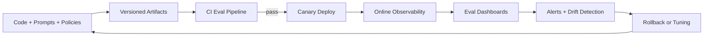
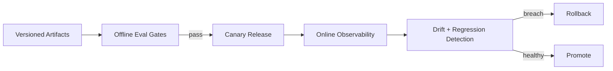

# LLMOps, Observability, and Evaluation (LangSmith + Arize)

## Overview
This topic covers operating GenAI systems in production: versioning, evaluation pipelines, tracing, quality monitoring, drift detection, rollback strategy, and continuous improvement loops.

## Why this topic matters
Architect interviews increasingly focus on production reliability, not demo performance. Teams fail when they cannot observe, evaluate, and safely change LLM systems over time.

## Core concepts
- LLMOps lifecycle and release governance
- Prompt/model/retriever/graph versioning
- Offline and online evaluation pipelines
- Observability and tracing strategy
- LangSmith for chain/agent trace analysis
- Arize-style quality and drift monitoring
- Rollback and incident response
- Feedback-driven continuous tuning

## Detailed explanation of each concept
LLMOps treats AI behavior artifacts as production assets: prompts, models, retrievers, policies, and graph logic. Every change must be versioned, tested, and monitored. Observability must connect user request to retrieval, model route, tool calls, and final output with correlation IDs.

Evaluation should mix offline benchmark suites and online operational metrics. Drift can happen in prompts, model behavior, retrieval data quality, and traffic patterns. Safe rollout requires canary and rollback controls with explicit thresholds. LangSmith-style tracing helps debug chain-level behavior; Arize-style telemetry helps detect quality and drift trends.

## Evaluation (How to assess architecture quality)
- Regression catch rate before production
- Online quality drift detection lead time
- Trace completeness across pipeline stages
- Rollback time after detected degradation
- Cost and latency variance by release
- Incident frequency and MTTR

## Architecture / flow diagram


**Flow explanation:**  
Artifacts are versioned and evaluated pre-release. Canary rollout is observed in production with trace and quality dashboards. Drift alerts trigger rollback or targeted tuning, closing the improvement loop.

## Real-world example
A policy assistant updates reranker and prompt templates monthly. Every release runs offline eval suites, then 5% canary traffic. LangSmith traces reveal a new tool-loop failure pattern; Arize dashboards show rising hallucination for one intent class. Team rolls back route config in 7 minutes and ships tuned fix next day.

## Best practices
- Version all behavior-affecting artifacts
- Define release gates with measurable thresholds
- Track quality, safety, latency, and cost together
- Use trace sampling + full traces for high-risk intents
- Practice rollback drills for AI pipeline incidents
- Feed user feedback into eval datasets quickly

## Common mistakes / misconceptions
- Tracking only latency and uptime
- No prompt/version traceability
- No offline evaluation for every release
- No route-level quality attribution
- Delayed rollback because thresholds were undefined

## Industry relevance
LLMOps is required for any enterprise AI platform that must remain safe, cost-effective, auditable, and adaptable under changing data, users, and model ecosystems.

## Interview discussion points
- What to version in LLM systems
- How LangSmith traces help debugging
- How Arize-style monitoring helps drift detection
- Offline vs online evaluation strategy
- Safe release and rollback patterns for GenAI

## Links to dependent / related topics
- [RAG Retrieval Engineering Architecture](./rag_retrieval_engineering_architecture.md)
- [LLM Selection, Routing, and Fallback Architecture](./llm_selection_routing_fallback_architecture.md)
- [Guardrails, Security, Privacy, and Responsible AI](./guardrails_security_privacy_responsible_ai.md)
- [Python FastAPI Async Backend for GenAI](./python_fastapi_async_backend_for_genai.md)

## Interview Questions (50)
1. What is LLMOps and how is it different from classic MLOps?
2. Why does GenAI need special operational controls?
3. What artifacts must be versioned in LLM systems?
4. How do you version prompts safely?
5. How do you version retriever and index changes?
6. How do you version chain/graph logic?
7. How do you design an LLM release pipeline?
8. What are mandatory pre-release evaluation gates?
9. How do you build offline eval datasets?
10. How do you avoid eval dataset bias?
11. Which offline metrics matter most for GenAI?
12. Which online metrics matter most for GenAI?
13. How do you combine offline and online evaluation?
14. How do you design canary rollout for LLM changes?
15. How do you define rollback triggers for GenAI releases?
16. How do you rollback prompt/model/retriever changes quickly?
17. What is LangSmith used for in production?
18. What traces should you collect in chain/agent systems?
19. How do traces help debug retrieval failures?
20. How do traces help debug tool-calling errors?
21. How do you design trace schema for cross-service correlation?
22. How do you control trace storage cost?
23. What is Arize-style monitoring useful for?
24. How do you detect quality drift in production?
25. How do you detect hallucination drift?
26. How do you detect retrieval drift?
27. How do you detect prompt drift after deployment?
28. How do you detect model behavior drift?
29. How do you build alerting for LLM quality issues?
30. How do you avoid noisy alerts in GenAI monitoring?
31. How do you tie incidents to release versions?
32. How do you run incident response for LLM regressions?
33. How do you create feedback loops from user signals?
34. How do you convert feedback into evaluation assets?
35. How do you prioritize tuning backlog from telemetry?
36. How do you run A/B tests for prompts and routes?
37. How do you measure token cost per quality gain?
38. How do you monitor latency decomposition by stage?
39. How do you attribute failures to model vs retrieval vs policy?
40. How do you design governance dashboards for leadership?
41. How do you prove Responsible AI controls are effective?
42. How do you validate safety regressions before release?
43. How do you manage multi-provider observability consistency?
44. How do you design SLIs/SLOs for GenAI systems?
45. How do you define error budgets for AI quality?
46. What are anti-patterns in LLMOps implementation?
47. How do you design quarterly LLMOps maturity roadmap?
48. How do you staff ownership model for LLMOps?
49. How do you present LLMOps ROI to leadership?
50. How do you conclude an LLMOps interview answer strongly?

## Enhanced Answering Playbook (Crisp + Deep + Summary + Example)

Use this playbook for each LLMOps answer:

- **Crisp answer:** State the release or monitoring control clearly.
- **Deep explanation:** Describe evaluation loop, telemetry, and rollback logic.
- **Answer summary:** End with quality, safety, and operations impact.
- **Practical example:** Use one canary-plus-rollback scenario.
- **Diagram thinking:** Show closed-loop improvement cycle.

### Worked Example: Release with eval gates and rollback
**Crisp answer:** Version prompt/model/retriever artifacts together and gate deployment with offline eval plus online canary thresholds.

**Deep explanation:**  
Before release, run offline test suites across grounding, citation quality, safety, and latency. Attach artifact versions to every evaluation report so regressions are traceable. Deploy to canary traffic slice and monitor task success, hallucination trend, p95 latency, and cost variance. If metrics degrade beyond threshold, rollback immediately and open tuning action with trace evidence. This creates a continuous improvement loop instead of reactive firefighting.

**Answer summary:**  
- Versioning without evaluation is incomplete governance.  
- Canary monitoring must include quality, not only uptime.  
- Fast rollback protects users and preserves trust.



## Answers for important questions (Summary + Crisp + Deep)

### Q1. What is LLMOps and how is it different from classic MLOps?
**Question summary:** Tests conceptual maturity in AI operations architecture.
**Crisp answer (7-8 lines):** LLMOps extends MLOps for generative systems and prompt-driven behavior. It manages prompts, retrieval, policies, and chains—not just model binaries. It requires trace-level observability for non-deterministic outputs. Evaluation includes grounding, safety, and citation quality. Release processes must version behavior artifacts. Drift sources include prompts, context, and traffic semantics. LLMOps is behavior operations, not only model deployment.
**Deep explanation (~60-70 lines):** For `What is LLMOps and how is it different from classic MLOps?`, start by identifying where this decision sits in your LLMOps lifecycle control flow and what failure it prevents. A strong architecture answer should describe the request path end-to-end, not just define terms: ingress, authorization, orchestration, dependency calls, validation, and fallback. In this flow, deterministic steps must be explicit and testable, such as release gates, rollback thresholds, version pinning, alert rules. These are deterministic because policy and safety outcomes cannot depend on model creativity. Probabilistic steps are acceptable where approximation is useful, such as quality drift interpretation and tuning hypotheses, but they still need guardrails and confidence thresholds. The key trade-off is control versus flexibility: stricter deterministic control improves safety and auditability, while probabilistic reasoning improves adaptability but increases variance in output quality. Design decisions should therefore include boundaries: which component can decide, which component must verify, and which component can block or escalate. Also explain operational behavior under stress: dependency timeout, partial failure, malformed tool output, stale context, and degraded external APIs. For each failure mode, define one mitigation path (retry with budget, route fallback, safe response, or human approval) so the system degrades safely instead of failing unpredictably. Security must be integrated into this answer: identity propagation, least-privilege access, and data boundary enforcement should happen before generation, not after. Finally, show how you will measure success in production with metrics like regression catch rate, rollback time, drift detection lead time, release stability, and mention rollout safety with canary + rollback criteria. This turns the answer from a definition into an operating architecture decision with clear risk, mitigation, and measurable outcomes.
**Answer summary:**
- **Decision:** Select the pattern that best satisfies `What is LLMOps and how is it different from classic MLOps?` under your business and compliance constraints.
- **Risk:** Weak control boundaries and unclear ownership create quality, security, and reliability regressions at scale.
- **Mitigation:** Enforce policy gates, measurable SLO/SLA triggers, and tested fallback/recovery playbooks before full rollout.
**Practical example:** In a healthcare claims assistant, the team addresses 'What is LLMOps and how is it different from classic MLOps?' by enforcing role-scoped access, validating each critical step through policy checks, and releasing changes with canary monitoring so quality and compliance remain stable under production traffic.
**Simple diagram:**  
```text
MLOps: model lifecycle
LLMOps: model + prompt + retrieval + policy + trace lifecycle
```
**Trusted reference links:**  
- https://learn.microsoft.com/en-us/azure/ai-foundry/  
- https://www.langchain.com/langsmith

### Q2. Why does GenAI need special operational controls?
**Question summary:** Explains why standard app ops is insufficient.
**Crisp answer (7-8 lines):** GenAI outputs are non-deterministic and context-sensitive. Small prompt changes can shift behavior significantly. Retrieval and data freshness directly affect quality. Safety and compliance failures can occur without infra outages. Token cost can spike unexpectedly. Traditional uptime metrics miss quality regressions. Specialized controls detect and contain these risks.
**Deep explanation (~60-70 lines):** For `Why does GenAI need special operational controls?`, start by identifying where this decision sits in your LLMOps lifecycle control flow and what failure it prevents. A strong architecture answer should describe the request path end-to-end, not just define terms: ingress, authorization, orchestration, dependency calls, validation, and fallback. In this flow, deterministic steps must be explicit and testable, such as release gates, rollback thresholds, version pinning, alert rules. These are deterministic because policy and safety outcomes cannot depend on model creativity. Probabilistic steps are acceptable where approximation is useful, such as quality drift interpretation and tuning hypotheses, but they still need guardrails and confidence thresholds. The key trade-off is control versus flexibility: stricter deterministic control improves safety and auditability, while probabilistic reasoning improves adaptability but increases variance in output quality. Design decisions should therefore include boundaries: which component can decide, which component must verify, and which component can block or escalate. Also explain operational behavior under stress: dependency timeout, partial failure, malformed tool output, stale context, and degraded external APIs. For each failure mode, define one mitigation path (retry with budget, route fallback, safe response, or human approval) so the system degrades safely instead of failing unpredictably. Security must be integrated into this answer: identity propagation, least-privilege access, and data boundary enforcement should happen before generation, not after. Finally, show how you will measure success in production with metrics like regression catch rate, rollback time, drift detection lead time, release stability, and mention rollout safety with canary + rollback criteria. This turns the answer from a definition into an operating architecture decision with clear risk, mitigation, and measurable outcomes.
**Answer summary:**
- **Decision:** Select the pattern that best satisfies `Why does GenAI need special operational controls?` under your business and compliance constraints.
- **Risk:** Weak control boundaries and unclear ownership create quality, security, and reliability regressions at scale.
- **Mitigation:** Enforce policy gates, measurable SLO/SLA triggers, and tested fallback/recovery playbooks before full rollout.
**Practical example:** In a insurance underwriting knowledge bot, the team addresses 'Why does GenAI need special operational controls?' by enforcing role-scoped access, validating each critical step through policy checks, and releasing changes with canary monitoring so quality and compliance remain stable under production traffic.
**Simple diagram:**  
```text
Infra Healthy != AI Quality Healthy
```
**Trusted reference links:**  
- https://learn.microsoft.com/en-us/azure/well-architected/

### Q3. What artifacts must be versioned in LLM systems?
**Question summary:** Governance baseline question.
**Crisp answer (7-8 lines):** Version prompts, model IDs, route policies, retriever configs, index schema, and guardrail rules. Version chain/graph definitions and tool contracts. Include eval dataset versions and threshold configs. Tie all artifacts to release ID. Keep immutable history and rollback references. Capture change rationale. Avoid untracked runtime edits.
**Deep explanation (~60-70 lines):** For `What artifacts must be versioned in LLM systems?`, start by identifying where this decision sits in your LLMOps lifecycle control flow and what failure it prevents. A strong architecture answer should describe the request path end-to-end, not just define terms: ingress, authorization, orchestration, dependency calls, validation, and fallback. In this flow, deterministic steps must be explicit and testable, such as release gates, rollback thresholds, version pinning, alert rules. These are deterministic because policy and safety outcomes cannot depend on model creativity. Probabilistic steps are acceptable where approximation is useful, such as quality drift interpretation and tuning hypotheses, but they still need guardrails and confidence thresholds. The key trade-off is control versus flexibility: stricter deterministic control improves safety and auditability, while probabilistic reasoning improves adaptability but increases variance in output quality. Design decisions should therefore include boundaries: which component can decide, which component must verify, and which component can block or escalate. Also explain operational behavior under stress: dependency timeout, partial failure, malformed tool output, stale context, and degraded external APIs. For each failure mode, define one mitigation path (retry with budget, route fallback, safe response, or human approval) so the system degrades safely instead of failing unpredictably. Security must be integrated into this answer: identity propagation, least-privilege access, and data boundary enforcement should happen before generation, not after. Finally, show how you will measure success in production with metrics like regression catch rate, rollback time, drift detection lead time, release stability, and mention rollout safety with canary + rollback criteria. This turns the answer from a definition into an operating architecture decision with clear risk, mitigation, and measurable outcomes.
**Answer summary:**
- **Decision:** Select the pattern that best satisfies `What artifacts must be versioned in LLM systems?` under your business and compliance constraints.
- **Risk:** Weak control boundaries and unclear ownership create quality, security, and reliability regressions at scale.
- **Mitigation:** Enforce policy gates, measurable SLO/SLA triggers, and tested fallback/recovery playbooks before full rollout.
**Practical example:** In a enterprise IT support assistant, the team addresses 'What artifacts must be versioned in LLM systems?' by enforcing role-scoped access, validating each critical step through policy checks, and releasing changes with canary monitoring so quality and compliance remain stable under production traffic.
**Simple diagram:**  
```text
Release Bundle = code + prompt + model map + retrieval + policy + eval config
```
**Trusted reference links:**  
- https://learn.microsoft.com/en-us/azure/architecture/framework/operational-excellence/

### Q4. How do you version prompts safely?
**Question summary:** Prompt governance in production.
**Crisp answer (7-8 lines):** Store prompts as code artifacts in repo. Use semantic versions and changelogs. Link prompt version to deployment and traces. Validate with regression suite before promotion. Use canary rollout for high-impact prompt updates. Keep instant rollback to prior prompt version. Restrict direct production prompt edits.
**Deep explanation (~60-70 lines):** For `How do you version prompts safely?`, start by identifying where this decision sits in your LLMOps lifecycle control flow and what failure it prevents. A strong architecture answer should describe the request path end-to-end, not just define terms: ingress, authorization, orchestration, dependency calls, validation, and fallback. In this flow, deterministic steps must be explicit and testable, such as release gates, rollback thresholds, version pinning, alert rules. These are deterministic because policy and safety outcomes cannot depend on model creativity. Probabilistic steps are acceptable where approximation is useful, such as quality drift interpretation and tuning hypotheses, but they still need guardrails and confidence thresholds. The key trade-off is control versus flexibility: stricter deterministic control improves safety and auditability, while probabilistic reasoning improves adaptability but increases variance in output quality. Design decisions should therefore include boundaries: which component can decide, which component must verify, and which component can block or escalate. Also explain operational behavior under stress: dependency timeout, partial failure, malformed tool output, stale context, and degraded external APIs. For each failure mode, define one mitigation path (retry with budget, route fallback, safe response, or human approval) so the system degrades safely instead of failing unpredictably. Security must be integrated into this answer: identity propagation, least-privilege access, and data boundary enforcement should happen before generation, not after. Finally, show how you will measure success in production with metrics like regression catch rate, rollback time, drift detection lead time, release stability, and mention rollout safety with canary + rollback criteria. This turns the answer from a definition into an operating architecture decision with clear risk, mitigation, and measurable outcomes.
**Answer summary:**
- **Decision:** Select the pattern that best satisfies `How do you version prompts safely?` under your business and compliance constraints.
- **Risk:** Weak control boundaries and unclear ownership create quality, security, and reliability regressions at scale.
- **Mitigation:** Enforce policy gates, measurable SLO/SLA triggers, and tested fallback/recovery playbooks before full rollout.
**Practical example:** In a procurement contract Q&A assistant, the team addresses 'How do you version prompts safely?' by enforcing role-scoped access, validating each critical step through policy checks, and releasing changes with canary monitoring so quality and compliance remain stable under production traffic.
**Simple diagram:**  
```text
Prompt vN -> Eval -> Canary -> Promote/Rollback
```
**Trusted reference links:**  
- https://www.langchain.com/langsmith

### Q5. How do you version retriever and index changes?
**Question summary:** Retrieval change management.
**Crisp answer (7-8 lines):** Version index schema, embedding model, and retrieval params together. Track reindex timestamp and source corpus snapshot. Keep alias-based switching for rollback. Validate recall/precision regressions before full rollout. Canary retrieval changes by low-risk intents first. Audit access filter behavior with each change. Record compatibility notes.
**Deep explanation (~60-70 lines):** For `How do you version retriever and index changes?`, start by identifying where this decision sits in your LLMOps lifecycle control flow and what failure it prevents. A strong architecture answer should describe the request path end-to-end, not just define terms: ingress, authorization, orchestration, dependency calls, validation, and fallback. In this flow, deterministic steps must be explicit and testable, such as release gates, rollback thresholds, version pinning, alert rules. These are deterministic because policy and safety outcomes cannot depend on model creativity. Probabilistic steps are acceptable where approximation is useful, such as quality drift interpretation and tuning hypotheses, but they still need guardrails and confidence thresholds. The key trade-off is control versus flexibility: stricter deterministic control improves safety and auditability, while probabilistic reasoning improves adaptability but increases variance in output quality. Design decisions should therefore include boundaries: which component can decide, which component must verify, and which component can block or escalate. Also explain operational behavior under stress: dependency timeout, partial failure, malformed tool output, stale context, and degraded external APIs. For each failure mode, define one mitigation path (retry with budget, route fallback, safe response, or human approval) so the system degrades safely instead of failing unpredictably. Security must be integrated into this answer: identity propagation, least-privilege access, and data boundary enforcement should happen before generation, not after. Finally, show how you will measure success in production with metrics like regression catch rate, rollback time, drift detection lead time, release stability, and mention rollout safety with canary + rollback criteria. This turns the answer from a definition into an operating architecture decision with clear risk, mitigation, and measurable outcomes.
**Answer summary:**
- **Decision:** Select the pattern that best satisfies `How do you version retriever and index changes?` under your business and compliance constraints.
- **Risk:** Weak control boundaries and unclear ownership create quality, security, and reliability regressions at scale.
- **Mitigation:** Enforce policy gates, measurable SLO/SLA triggers, and tested fallback/recovery playbooks before full rollout.
**Practical example:** In a internal audit/compliance copilot, the team addresses 'How do you version retriever and index changes?' by enforcing role-scoped access, validating each critical step through policy checks, and releasing changes with canary monitoring so quality and compliance remain stable under production traffic.
**Simple diagram:**  
```text
Retriever Bundle vN -> Eval -> Alias Switch -> Monitor
```
**Trusted reference links:**  
- https://learn.microsoft.com/en-us/azure/search/vector-search-overview

### Q6. How do you version chain/graph logic?
**Question summary:** Agent orchestration governance.
**Crisp answer (7-8 lines):** Treat chain/graph definitions as immutable release artifacts. Version node logic, transitions, and policy hooks. Keep compatibility strategy for in-flight states. Run replay tests before promotion. Rollout via canary traffic split. Maintain downgrade path to previous stable graph. Capture execution deltas in release notes.
**Deep explanation (~60-70 lines):** For `How do you version chain/graph logic?`, start by identifying where this decision sits in your LLMOps lifecycle control flow and what failure it prevents. A strong architecture answer should describe the request path end-to-end, not just define terms: ingress, authorization, orchestration, dependency calls, validation, and fallback. In this flow, deterministic steps must be explicit and testable, such as release gates, rollback thresholds, version pinning, alert rules. These are deterministic because policy and safety outcomes cannot depend on model creativity. Probabilistic steps are acceptable where approximation is useful, such as quality drift interpretation and tuning hypotheses, but they still need guardrails and confidence thresholds. The key trade-off is control versus flexibility: stricter deterministic control improves safety and auditability, while probabilistic reasoning improves adaptability but increases variance in output quality. Design decisions should therefore include boundaries: which component can decide, which component must verify, and which component can block or escalate. Also explain operational behavior under stress: dependency timeout, partial failure, malformed tool output, stale context, and degraded external APIs. For each failure mode, define one mitigation path (retry with budget, route fallback, safe response, or human approval) so the system degrades safely instead of failing unpredictably. Security must be integrated into this answer: identity propagation, least-privilege access, and data boundary enforcement should happen before generation, not after. Finally, show how you will measure success in production with metrics like regression catch rate, rollback time, drift detection lead time, release stability, and mention rollout safety with canary + rollback criteria. This turns the answer from a definition into an operating architecture decision with clear risk, mitigation, and measurable outcomes.
**Answer summary:**
- **Decision:** Select the pattern that best satisfies `How do you version chain/graph logic?` under your business and compliance constraints.
- **Risk:** Weak control boundaries and unclear ownership create quality, security, and reliability regressions at scale.
- **Mitigation:** Enforce policy gates, measurable SLO/SLA triggers, and tested fallback/recovery playbooks before full rollout.
**Practical example:** In a customer support triage assistant, the team addresses 'How do you version chain/graph logic?' by enforcing role-scoped access, validating each critical step through policy checks, and releasing changes with canary monitoring so quality and compliance remain stable under production traffic.
**Simple diagram:**  
```text
Graph v1 <-> Graph v2 (canary + rollback)
```
**Trusted reference links:**  
- https://langchain-ai.github.io/langgraph/

### Q7. How do you design an LLM release pipeline?
**Question summary:** End-to-end release architecture.
**Crisp answer (7-8 lines):** Build pipeline for code and AI artifacts together. Run lint/unit/integration plus eval gates. Include safety and policy regression tests. Package versioned release bundle with metadata. Deploy canary with route-level telemetry. Auto-rollback on threshold breaches. Require post-deploy validation before full rollout.
**Deep explanation (~60-70 lines):** For `How do you design an LLM release pipeline?`, start by identifying where this decision sits in your LLMOps lifecycle control flow and what failure it prevents. A strong architecture answer should describe the request path end-to-end, not just define terms: ingress, authorization, orchestration, dependency calls, validation, and fallback. In this flow, deterministic steps must be explicit and testable, such as release gates, rollback thresholds, version pinning, alert rules. These are deterministic because policy and safety outcomes cannot depend on model creativity. Probabilistic steps are acceptable where approximation is useful, such as quality drift interpretation and tuning hypotheses, but they still need guardrails and confidence thresholds. The key trade-off is control versus flexibility: stricter deterministic control improves safety and auditability, while probabilistic reasoning improves adaptability but increases variance in output quality. Design decisions should therefore include boundaries: which component can decide, which component must verify, and which component can block or escalate. Also explain operational behavior under stress: dependency timeout, partial failure, malformed tool output, stale context, and degraded external APIs. For each failure mode, define one mitigation path (retry with budget, route fallback, safe response, or human approval) so the system degrades safely instead of failing unpredictably. Security must be integrated into this answer: identity propagation, least-privilege access, and data boundary enforcement should happen before generation, not after. Finally, show how you will measure success in production with metrics like regression catch rate, rollback time, drift detection lead time, release stability, and mention rollout safety with canary + rollback criteria. This turns the answer from a definition into an operating architecture decision with clear risk, mitigation, and measurable outcomes.
**Answer summary:**
- **Decision:** Select the pattern that best satisfies `How do you design an LLM release pipeline?` under your business and compliance constraints.
- **Risk:** Weak control boundaries and unclear ownership create quality, security, and reliability regressions at scale.
- **Mitigation:** Enforce policy gates, measurable SLO/SLA triggers, and tested fallback/recovery playbooks before full rollout.
**Practical example:** In a operations incident copilot, the team addresses 'How do you design an LLM release pipeline?' by enforcing role-scoped access, validating each critical step through policy checks, and releasing changes with canary monitoring so quality and compliance remain stable under production traffic.
**Simple diagram:**  
```text
Build -> Eval Gates -> Canary -> Promote/Rollback
```
**Trusted reference links:**  
- https://learn.microsoft.com/en-us/azure/devops/pipelines/

### Q8. What are mandatory pre-release evaluation gates?
**Question summary:** Release quality baseline.
**Crisp answer (7-8 lines):** Task accuracy/grounding thresholds. Safety and policy violation limits. Latency and cost budget checks. Retrieval quality metrics for RAG flows. Structured output validation pass rates. Regression comparisons against prior stable release. Critical intent scenario pass requirement.
**Deep explanation (~60-70 lines):** For `What are mandatory pre-release evaluation gates?`, start by identifying where this decision sits in your LLMOps lifecycle control flow and what failure it prevents. A strong architecture answer should describe the request path end-to-end, not just define terms: ingress, authorization, orchestration, dependency calls, validation, and fallback. In this flow, deterministic steps must be explicit and testable, such as release gates, rollback thresholds, version pinning, alert rules. These are deterministic because policy and safety outcomes cannot depend on model creativity. Probabilistic steps are acceptable where approximation is useful, such as quality drift interpretation and tuning hypotheses, but they still need guardrails and confidence thresholds. The key trade-off is control versus flexibility: stricter deterministic control improves safety and auditability, while probabilistic reasoning improves adaptability but increases variance in output quality. Design decisions should therefore include boundaries: which component can decide, which component must verify, and which component can block or escalate. Also explain operational behavior under stress: dependency timeout, partial failure, malformed tool output, stale context, and degraded external APIs. For each failure mode, define one mitigation path (retry with budget, route fallback, safe response, or human approval) so the system degrades safely instead of failing unpredictably. Security must be integrated into this answer: identity propagation, least-privilege access, and data boundary enforcement should happen before generation, not after. Finally, show how you will measure success in production with metrics like regression catch rate, rollback time, drift detection lead time, release stability, and mention rollout safety with canary + rollback criteria. This turns the answer from a definition into an operating architecture decision with clear risk, mitigation, and measurable outcomes.
**Answer summary:**
- **Decision:** Select the pattern that best satisfies `What are mandatory pre-release evaluation gates?` under your business and compliance constraints.
- **Risk:** Weak control boundaries and unclear ownership create quality, security, and reliability regressions at scale.
- **Mitigation:** Enforce policy gates, measurable SLO/SLA triggers, and tested fallback/recovery playbooks before full rollout.
**Practical example:** In a banking policy copilot, the team addresses 'What are mandatory pre-release evaluation gates?' by enforcing role-scoped access, validating each critical step through policy checks, and releasing changes with canary monitoring so quality and compliance remain stable under production traffic.
**Simple diagram:**  
```text
Eval Scorecard -> Pass/Fail Release
```
**Trusted reference links:**  
- https://learn.microsoft.com/en-us/azure/ai-foundry/concepts/evaluation

### Q9. How do you build offline eval datasets?
**Question summary:** Dataset construction strategy.
**Crisp answer (7-8 lines):** Collect representative real queries by intent class. Label expected outputs and evidence references. Include edge cases and adversarial prompts. Balance domains, user roles, and complexity levels. Version datasets and annotation guidelines. Review label consistency with SMEs. Refresh datasets with new failure patterns.
**Deep explanation (~60-70 lines):** For `How do you build offline eval datasets?`, start by identifying where this decision sits in your LLMOps lifecycle control flow and what failure it prevents. A strong architecture answer should describe the request path end-to-end, not just define terms: ingress, authorization, orchestration, dependency calls, validation, and fallback. In this flow, deterministic steps must be explicit and testable, such as release gates, rollback thresholds, version pinning, alert rules. These are deterministic because policy and safety outcomes cannot depend on model creativity. Probabilistic steps are acceptable where approximation is useful, such as quality drift interpretation and tuning hypotheses, but they still need guardrails and confidence thresholds. The key trade-off is control versus flexibility: stricter deterministic control improves safety and auditability, while probabilistic reasoning improves adaptability but increases variance in output quality. Design decisions should therefore include boundaries: which component can decide, which component must verify, and which component can block or escalate. Also explain operational behavior under stress: dependency timeout, partial failure, malformed tool output, stale context, and degraded external APIs. For each failure mode, define one mitigation path (retry with budget, route fallback, safe response, or human approval) so the system degrades safely instead of failing unpredictably. Security must be integrated into this answer: identity propagation, least-privilege access, and data boundary enforcement should happen before generation, not after. Finally, show how you will measure success in production with metrics like regression catch rate, rollback time, drift detection lead time, release stability, and mention rollout safety with canary + rollback criteria. This turns the answer from a definition into an operating architecture decision with clear risk, mitigation, and measurable outcomes.
**Answer summary:**
- **Decision:** Select the pattern that best satisfies `How do you build offline eval datasets?` under your business and compliance constraints.
- **Risk:** Weak control boundaries and unclear ownership create quality, security, and reliability regressions at scale.
- **Mitigation:** Enforce policy gates, measurable SLO/SLA triggers, and tested fallback/recovery playbooks before full rollout.
**Practical example:** In a healthcare claims assistant, the team addresses 'How do you build offline eval datasets?' by enforcing role-scoped access, validating each critical step through policy checks, and releasing changes with canary monitoring so quality and compliance remain stable under production traffic.
**Simple diagram:**  
```text
Real Queries -> Labeling -> Versioned Eval Set
```
**Trusted reference links:**  
- https://learn.microsoft.com/en-us/azure/ai-foundry/concepts/evaluation

### Q10. How do you avoid eval dataset bias?
**Question summary:** Evaluation reliability.
**Crisp answer (7-8 lines):** Sample across user segments and intent diversity. Avoid over-representing easy scenarios. Include hard negatives and adversarial cases. Audit dataset composition regularly. Compare offline and online performance gaps. Rotate holdout sets to prevent overfitting. Involve domain experts in coverage review.
**Deep explanation (~60-70 lines):** For `How do you avoid eval dataset bias?`, start by identifying where this decision sits in your LLMOps lifecycle control flow and what failure it prevents. A strong architecture answer should describe the request path end-to-end, not just define terms: ingress, authorization, orchestration, dependency calls, validation, and fallback. In this flow, deterministic steps must be explicit and testable, such as release gates, rollback thresholds, version pinning, alert rules. These are deterministic because policy and safety outcomes cannot depend on model creativity. Probabilistic steps are acceptable where approximation is useful, such as quality drift interpretation and tuning hypotheses, but they still need guardrails and confidence thresholds. The key trade-off is control versus flexibility: stricter deterministic control improves safety and auditability, while probabilistic reasoning improves adaptability but increases variance in output quality. Design decisions should therefore include boundaries: which component can decide, which component must verify, and which component can block or escalate. Also explain operational behavior under stress: dependency timeout, partial failure, malformed tool output, stale context, and degraded external APIs. For each failure mode, define one mitigation path (retry with budget, route fallback, safe response, or human approval) so the system degrades safely instead of failing unpredictably. Security must be integrated into this answer: identity propagation, least-privilege access, and data boundary enforcement should happen before generation, not after. Finally, show how you will measure success in production with metrics like regression catch rate, rollback time, drift detection lead time, release stability, and mention rollout safety with canary + rollback criteria. This turns the answer from a definition into an operating architecture decision with clear risk, mitigation, and measurable outcomes.
**Answer summary:**
- **Decision:** Select the pattern that best satisfies `How do you avoid eval dataset bias?` under your business and compliance constraints.
- **Risk:** Weak control boundaries and unclear ownership create quality, security, and reliability regressions at scale.
- **Mitigation:** Enforce policy gates, measurable SLO/SLA triggers, and tested fallback/recovery playbooks before full rollout.
**Practical example:** In a insurance underwriting knowledge bot, the team addresses 'How do you avoid eval dataset bias?' by enforcing role-scoped access, validating each critical step through policy checks, and releasing changes with canary monitoring so quality and compliance remain stable under production traffic.
**Simple diagram:**  
```text
Coverage Audit -> Dataset Rebalance -> Reliable Eval
```
**Trusted reference links:**  
- https://learn.microsoft.com/en-us/azure/machine-learning/concept-responsible-ai-dashboard

### Q11. Which offline metrics matter most for GenAI?
**Question summary:** Metric framework.
**Crisp answer (7-8 lines):** Task success and correctness metrics. Groundedness and citation support quality. Safety policy violation rates. Structured output schema pass rate. Retrieval recall/precision for RAG flows. Cost and latency simulation estimates. Regression delta versus baseline release.
**Deep explanation (~60-70 lines):** For `Which offline metrics matter most for GenAI?`, start by identifying where this decision sits in your LLMOps lifecycle control flow and what failure it prevents. A strong architecture answer should describe the request path end-to-end, not just define terms: ingress, authorization, orchestration, dependency calls, validation, and fallback. In this flow, deterministic steps must be explicit and testable, such as release gates, rollback thresholds, version pinning, alert rules. These are deterministic because policy and safety outcomes cannot depend on model creativity. Probabilistic steps are acceptable where approximation is useful, such as quality drift interpretation and tuning hypotheses, but they still need guardrails and confidence thresholds. The key trade-off is control versus flexibility: stricter deterministic control improves safety and auditability, while probabilistic reasoning improves adaptability but increases variance in output quality. Design decisions should therefore include boundaries: which component can decide, which component must verify, and which component can block or escalate. Also explain operational behavior under stress: dependency timeout, partial failure, malformed tool output, stale context, and degraded external APIs. For each failure mode, define one mitigation path (retry with budget, route fallback, safe response, or human approval) so the system degrades safely instead of failing unpredictably. Security must be integrated into this answer: identity propagation, least-privilege access, and data boundary enforcement should happen before generation, not after. Finally, show how you will measure success in production with metrics like regression catch rate, rollback time, drift detection lead time, release stability, and mention rollout safety with canary + rollback criteria. This turns the answer from a definition into an operating architecture decision with clear risk, mitigation, and measurable outcomes.
**Answer summary:**
- **Decision:** Select the pattern that best satisfies `Which offline metrics matter most for GenAI?` under your business and compliance constraints.
- **Risk:** Weak control boundaries and unclear ownership create quality, security, and reliability regressions at scale.
- **Mitigation:** Enforce policy gates, measurable SLO/SLA triggers, and tested fallback/recovery playbooks before full rollout.
**Practical example:** In a enterprise IT support assistant, the team addresses 'Which offline metrics matter most for GenAI?' by enforcing role-scoped access, validating each critical step through policy checks, and releasing changes with canary monitoring so quality and compliance remain stable under production traffic.
**Simple diagram:**  
```text
Offline Metrics -> Quality + Safety + Retrieval + Regression
```
**Trusted reference links:**  
- https://learn.microsoft.com/en-us/azure/ai-foundry/concepts/evaluation

### Q12. Which online metrics matter most for GenAI?
**Question summary:** Runtime quality monitoring.
**Crisp answer (7-8 lines):** User resolution/success rate. Latency p95/p99 and failure rates. Fallback activation and escalation rates. Safety/policy violations in live traffic. Token cost per successful task. Retrieval miss and citation failure rates. Feedback sentiment and correction frequency.
**Deep explanation (~60-70 lines):** For `Which online metrics matter most for GenAI?`, start by identifying where this decision sits in your LLMOps lifecycle control flow and what failure it prevents. A strong architecture answer should describe the request path end-to-end, not just define terms: ingress, authorization, orchestration, dependency calls, validation, and fallback. In this flow, deterministic steps must be explicit and testable, such as release gates, rollback thresholds, version pinning, alert rules. These are deterministic because policy and safety outcomes cannot depend on model creativity. Probabilistic steps are acceptable where approximation is useful, such as quality drift interpretation and tuning hypotheses, but they still need guardrails and confidence thresholds. The key trade-off is control versus flexibility: stricter deterministic control improves safety and auditability, while probabilistic reasoning improves adaptability but increases variance in output quality. Design decisions should therefore include boundaries: which component can decide, which component must verify, and which component can block or escalate. Also explain operational behavior under stress: dependency timeout, partial failure, malformed tool output, stale context, and degraded external APIs. For each failure mode, define one mitigation path (retry with budget, route fallback, safe response, or human approval) so the system degrades safely instead of failing unpredictably. Security must be integrated into this answer: identity propagation, least-privilege access, and data boundary enforcement should happen before generation, not after. Finally, show how you will measure success in production with metrics like regression catch rate, rollback time, drift detection lead time, release stability, and mention rollout safety with canary + rollback criteria. This turns the answer from a definition into an operating architecture decision with clear risk, mitigation, and measurable outcomes.
**Answer summary:**
- **Decision:** Select the pattern that best satisfies `Which online metrics matter most for GenAI?` under your business and compliance constraints.
- **Risk:** Weak control boundaries and unclear ownership create quality, security, and reliability regressions at scale.
- **Mitigation:** Enforce policy gates, measurable SLO/SLA triggers, and tested fallback/recovery playbooks before full rollout.
**Practical example:** In a procurement contract Q&A assistant, the team addresses 'Which online metrics matter most for GenAI?' by enforcing role-scoped access, validating each critical step through policy checks, and releasing changes with canary monitoring so quality and compliance remain stable under production traffic.
**Simple diagram:**  
```text
Live Traffic -> Outcome + Reliability + Safety + Cost Dashboard
```
**Trusted reference links:**  
- https://learn.microsoft.com/en-us/azure/azure-monitor/overview

### Q13. How do you combine offline and online evaluation?
**Question summary:** Closed-loop quality system.
**Crisp answer (7-8 lines):** Use offline eval as release gate baseline. Use online telemetry to detect drift and user-impact issues. Feed online failures back into offline datasets. Re-run regressions before each change. Compare predicted vs observed quality trends. Prioritize tuning by business impact. Keep unified quality scorecard.
**Deep explanation (~60-70 lines):** For `How do you combine offline and online evaluation?`, start by identifying where this decision sits in your LLMOps lifecycle control flow and what failure it prevents. A strong architecture answer should describe the request path end-to-end, not just define terms: ingress, authorization, orchestration, dependency calls, validation, and fallback. In this flow, deterministic steps must be explicit and testable, such as release gates, rollback thresholds, version pinning, alert rules. These are deterministic because policy and safety outcomes cannot depend on model creativity. Probabilistic steps are acceptable where approximation is useful, such as quality drift interpretation and tuning hypotheses, but they still need guardrails and confidence thresholds. The key trade-off is control versus flexibility: stricter deterministic control improves safety and auditability, while probabilistic reasoning improves adaptability but increases variance in output quality. Design decisions should therefore include boundaries: which component can decide, which component must verify, and which component can block or escalate. Also explain operational behavior under stress: dependency timeout, partial failure, malformed tool output, stale context, and degraded external APIs. For each failure mode, define one mitigation path (retry with budget, route fallback, safe response, or human approval) so the system degrades safely instead of failing unpredictably. Security must be integrated into this answer: identity propagation, least-privilege access, and data boundary enforcement should happen before generation, not after. Finally, show how you will measure success in production with metrics like regression catch rate, rollback time, drift detection lead time, release stability, and mention rollout safety with canary + rollback criteria. This turns the answer from a definition into an operating architecture decision with clear risk, mitigation, and measurable outcomes.
**Answer summary:**
- **Decision:** Select the pattern that best satisfies `How do you combine offline and online evaluation?` under your business and compliance constraints.
- **Risk:** Weak control boundaries and unclear ownership create quality, security, and reliability regressions at scale.
- **Mitigation:** Enforce policy gates, measurable SLO/SLA triggers, and tested fallback/recovery playbooks before full rollout.
**Practical example:** In a internal audit/compliance copilot, the team addresses 'How do you combine offline and online evaluation?' by enforcing role-scoped access, validating each critical step through policy checks, and releasing changes with canary monitoring so quality and compliance remain stable under production traffic.
**Simple diagram:**  
```text
Offline Gate -> Production -> Feedback -> Offline Update
```
**Trusted reference links:**  
- https://learn.microsoft.com/en-us/azure/architecture/framework/operational-excellence/

### Q14. How do you design canary rollout for LLM changes?
**Question summary:** Safe progressive release.
**Crisp answer (7-8 lines):** Route small low-risk traffic slice first. Compare quality/safety/cost/latency to control route. Use predefined promotion and rollback thresholds. Expand gradually by confidence windows. Keep manual override for major anomalies. Record canary decision artifacts. Continue post-promotion monitoring.
**Deep explanation (~60-70 lines):** For `How do you design canary rollout for LLM changes?`, start by identifying where this decision sits in your LLMOps lifecycle control flow and what failure it prevents. A strong architecture answer should describe the request path end-to-end, not just define terms: ingress, authorization, orchestration, dependency calls, validation, and fallback. In this flow, deterministic steps must be explicit and testable, such as release gates, rollback thresholds, version pinning, alert rules. These are deterministic because policy and safety outcomes cannot depend on model creativity. Probabilistic steps are acceptable where approximation is useful, such as quality drift interpretation and tuning hypotheses, but they still need guardrails and confidence thresholds. The key trade-off is control versus flexibility: stricter deterministic control improves safety and auditability, while probabilistic reasoning improves adaptability but increases variance in output quality. Design decisions should therefore include boundaries: which component can decide, which component must verify, and which component can block or escalate. Also explain operational behavior under stress: dependency timeout, partial failure, malformed tool output, stale context, and degraded external APIs. For each failure mode, define one mitigation path (retry with budget, route fallback, safe response, or human approval) so the system degrades safely instead of failing unpredictably. Security must be integrated into this answer: identity propagation, least-privilege access, and data boundary enforcement should happen before generation, not after. Finally, show how you will measure success in production with metrics like regression catch rate, rollback time, drift detection lead time, release stability, and mention rollout safety with canary + rollback criteria. This turns the answer from a definition into an operating architecture decision with clear risk, mitigation, and measurable outcomes.
**Answer summary:**
- **Decision:** Select the pattern that best satisfies `How do you design canary rollout for LLM changes?` under your business and compliance constraints.
- **Risk:** Weak control boundaries and unclear ownership create quality, security, and reliability regressions at scale.
- **Mitigation:** Enforce policy gates, measurable SLO/SLA triggers, and tested fallback/recovery playbooks before full rollout.
**Practical example:** In a customer support triage assistant, the team addresses 'How do you design canary rollout for LLM changes?' by enforcing role-scoped access, validating each critical step through policy checks, and releasing changes with canary monitoring so quality and compliance remain stable under production traffic.
**Simple diagram:**  
```text
5% -> 20% -> 50% -> 100% (threshold-gated)
```
**Trusted reference links:**  
- https://learn.microsoft.com/en-us/azure/architecture/patterns/canary-release

### Q15. How do you define rollback triggers for GenAI releases?
**Question summary:** Incident containment readiness.
**Crisp answer (7-8 lines):** Define thresholds for quality drop, safety incidents, latency spikes, and cost surge. Include route-specific and global triggers. Require short rolling windows to detect fast regressions. Add anti-flap hysteresis to avoid oscillation. Trigger automated rollback for severe breaches. Notify on-call with context. Validate recovery post-rollback.
**Deep explanation (~60-70 lines):** For `How do you define rollback triggers for GenAI releases?`, start by identifying where this decision sits in your LLMOps lifecycle control flow and what failure it prevents. A strong architecture answer should describe the request path end-to-end, not just define terms: ingress, authorization, orchestration, dependency calls, validation, and fallback. In this flow, deterministic steps must be explicit and testable, such as release gates, rollback thresholds, version pinning, alert rules. These are deterministic because policy and safety outcomes cannot depend on model creativity. Probabilistic steps are acceptable where approximation is useful, such as quality drift interpretation and tuning hypotheses, but they still need guardrails and confidence thresholds. The key trade-off is control versus flexibility: stricter deterministic control improves safety and auditability, while probabilistic reasoning improves adaptability but increases variance in output quality. Design decisions should therefore include boundaries: which component can decide, which component must verify, and which component can block or escalate. Also explain operational behavior under stress: dependency timeout, partial failure, malformed tool output, stale context, and degraded external APIs. For each failure mode, define one mitigation path (retry with budget, route fallback, safe response, or human approval) so the system degrades safely instead of failing unpredictably. Security must be integrated into this answer: identity propagation, least-privilege access, and data boundary enforcement should happen before generation, not after. Finally, show how you will measure success in production with metrics like regression catch rate, rollback time, drift detection lead time, release stability, and mention rollout safety with canary + rollback criteria. This turns the answer from a definition into an operating architecture decision with clear risk, mitigation, and measurable outcomes.
**Answer summary:**
- **Decision:** Select the pattern that best satisfies `How do you define rollback triggers for GenAI releases?` under your business and compliance constraints.
- **Risk:** Weak control boundaries and unclear ownership create quality, security, and reliability regressions at scale.
- **Mitigation:** Enforce policy gates, measurable SLO/SLA triggers, and tested fallback/recovery playbooks before full rollout.
**Practical example:** In a operations incident copilot, the team addresses 'How do you define rollback triggers for GenAI releases?' by enforcing role-scoped access, validating each critical step through policy checks, and releasing changes with canary monitoring so quality and compliance remain stable under production traffic.
**Simple diagram:**  
```text
Threshold Breach -> Auto Rollback -> Recovery Check
```
**Trusted reference links:**  
- https://learn.microsoft.com/en-us/azure/well-architected/reliability/testing

### Q16. How do you rollback prompt/model/retriever changes quickly?
**Question summary:** Multi-artifact rollback strategy.
**Crisp answer (7-8 lines):** Keep immutable previous release bundles ready. Use config/alias switches for instant route reversal. Roll back all coupled artifacts together. Preserve trace context for forensic analysis. Freeze new promotions during stabilization. Run smoke checks after rollback. Document root cause and preventive action.
**Deep explanation (~60-70 lines):** For `How do you rollback prompt/model/retriever changes quickly?`, start by identifying where this decision sits in your LLMOps lifecycle control flow and what failure it prevents. A strong architecture answer should describe the request path end-to-end, not just define terms: ingress, authorization, orchestration, dependency calls, validation, and fallback. In this flow, deterministic steps must be explicit and testable, such as release gates, rollback thresholds, version pinning, alert rules. These are deterministic because policy and safety outcomes cannot depend on model creativity. Probabilistic steps are acceptable where approximation is useful, such as quality drift interpretation and tuning hypotheses, but they still need guardrails and confidence thresholds. The key trade-off is control versus flexibility: stricter deterministic control improves safety and auditability, while probabilistic reasoning improves adaptability but increases variance in output quality. Design decisions should therefore include boundaries: which component can decide, which component must verify, and which component can block or escalate. Also explain operational behavior under stress: dependency timeout, partial failure, malformed tool output, stale context, and degraded external APIs. For each failure mode, define one mitigation path (retry with budget, route fallback, safe response, or human approval) so the system degrades safely instead of failing unpredictably. Security must be integrated into this answer: identity propagation, least-privilege access, and data boundary enforcement should happen before generation, not after. Finally, show how you will measure success in production with metrics like regression catch rate, rollback time, drift detection lead time, release stability, and mention rollout safety with canary + rollback criteria. This turns the answer from a definition into an operating architecture decision with clear risk, mitigation, and measurable outcomes.
**Answer summary:**
- **Decision:** Select the pattern that best satisfies `How do you rollback prompt/model/retriever changes quickly?` under your business and compliance constraints.
- **Risk:** Weak control boundaries and unclear ownership create quality, security, and reliability regressions at scale.
- **Mitigation:** Enforce policy gates, measurable SLO/SLA triggers, and tested fallback/recovery playbooks before full rollout.
**Practical example:** In a banking policy copilot, the team addresses 'How do you rollback prompt/model/retriever changes quickly?' by enforcing role-scoped access, validating each critical step through policy checks, and releasing changes with canary monitoring so quality and compliance remain stable under production traffic.
**Simple diagram:**  
```text
Release vN issue -> Switch to vN-1 bundle
```
**Trusted reference links:**  
- https://learn.microsoft.com/en-us/azure/architecture/framework/resiliency/

### Q17. What is LangSmith used for in production?
**Question summary:** Tool-specific observability understanding.
**Crisp answer (7-8 lines):** LangSmith provides trace visibility for chains and agents. It helps inspect prompt, retrieval, tool, and output steps. It supports debugging of failure paths and regressions. It enables eval dataset runs and experiment comparison. It helps detect where quality drops occur in pipelines. It improves developer feedback loops. It supports release confidence through trace evidence.
**Deep explanation (~60-70 lines):** For `What is LangSmith used for in production?`, start by identifying where this decision sits in your LLMOps lifecycle control flow and what failure it prevents. A strong architecture answer should describe the request path end-to-end, not just define terms: ingress, authorization, orchestration, dependency calls, validation, and fallback. In this flow, deterministic steps must be explicit and testable, such as release gates, rollback thresholds, version pinning, alert rules. These are deterministic because policy and safety outcomes cannot depend on model creativity. Probabilistic steps are acceptable where approximation is useful, such as quality drift interpretation and tuning hypotheses, but they still need guardrails and confidence thresholds. The key trade-off is control versus flexibility: stricter deterministic control improves safety and auditability, while probabilistic reasoning improves adaptability but increases variance in output quality. Design decisions should therefore include boundaries: which component can decide, which component must verify, and which component can block or escalate. Also explain operational behavior under stress: dependency timeout, partial failure, malformed tool output, stale context, and degraded external APIs. For each failure mode, define one mitigation path (retry with budget, route fallback, safe response, or human approval) so the system degrades safely instead of failing unpredictably. Security must be integrated into this answer: identity propagation, least-privilege access, and data boundary enforcement should happen before generation, not after. Finally, show how you will measure success in production with metrics like regression catch rate, rollback time, drift detection lead time, release stability, and mention rollout safety with canary + rollback criteria. This turns the answer from a definition into an operating architecture decision with clear risk, mitigation, and measurable outcomes.
**Answer summary:**
- **Decision:** Select the pattern that best satisfies `What is LangSmith used for in production?` under your business and compliance constraints.
- **Risk:** Weak control boundaries and unclear ownership create quality, security, and reliability regressions at scale.
- **Mitigation:** Enforce policy gates, measurable SLO/SLA triggers, and tested fallback/recovery playbooks before full rollout.
**Practical example:** In a healthcare claims assistant, the team addresses 'What is LangSmith used for in production?' by enforcing role-scoped access, validating each critical step through policy checks, and releasing changes with canary monitoring so quality and compliance remain stable under production traffic.
**Simple diagram:**  
```text
LLM Pipeline -> LangSmith Traces -> Debug + Eval Insights
```
**Trusted reference links:**  
- https://www.langchain.com/langsmith

### Q18. What traces should you collect in chain/agent systems?
**Question summary:** Trace schema design.
**Crisp answer (7-8 lines):** Collect request ID, user/tenant context, route decision, prompt version, model ID, retrieval IDs, tool calls, policy checks, and output status. Include latency and token metrics per step. Capture fallback/escalation events. Mask sensitive values before storage. Keep parent-child span relationships. Store version hashes for reproducibility.
**Deep explanation (~60-70 lines):** For `What traces should you collect in chain/agent systems?`, start by identifying where this decision sits in your LLMOps lifecycle control flow and what failure it prevents. A strong architecture answer should describe the request path end-to-end, not just define terms: ingress, authorization, orchestration, dependency calls, validation, and fallback. In this flow, deterministic steps must be explicit and testable, such as release gates, rollback thresholds, version pinning, alert rules. These are deterministic because policy and safety outcomes cannot depend on model creativity. Probabilistic steps are acceptable where approximation is useful, such as quality drift interpretation and tuning hypotheses, but they still need guardrails and confidence thresholds. The key trade-off is control versus flexibility: stricter deterministic control improves safety and auditability, while probabilistic reasoning improves adaptability but increases variance in output quality. Design decisions should therefore include boundaries: which component can decide, which component must verify, and which component can block or escalate. Also explain operational behavior under stress: dependency timeout, partial failure, malformed tool output, stale context, and degraded external APIs. For each failure mode, define one mitigation path (retry with budget, route fallback, safe response, or human approval) so the system degrades safely instead of failing unpredictably. Security must be integrated into this answer: identity propagation, least-privilege access, and data boundary enforcement should happen before generation, not after. Finally, show how you will measure success in production with metrics like regression catch rate, rollback time, drift detection lead time, release stability, and mention rollout safety with canary + rollback criteria. This turns the answer from a definition into an operating architecture decision with clear risk, mitigation, and measurable outcomes.
**Answer summary:**
- **Decision:** Select the pattern that best satisfies `What traces should you collect in chain/agent systems?` under your business and compliance constraints.
- **Risk:** Weak control boundaries and unclear ownership create quality, security, and reliability regressions at scale.
- **Mitigation:** Enforce policy gates, measurable SLO/SLA triggers, and tested fallback/recovery playbooks before full rollout.
**Practical example:** In a insurance underwriting knowledge bot, the team addresses 'What traces should you collect in chain/agent systems?' by enforcing role-scoped access, validating each critical step through policy checks, and releasing changes with canary monitoring so quality and compliance remain stable under production traffic.
**Simple diagram:**  
```text
Request -> Route -> Retrieval -> Model -> Tool -> Output (correlated spans)
```
**Trusted reference links:**  
- https://opentelemetry.io/docs/

### Q19. How do traces help debug retrieval failures?
**Question summary:** RAG debugging workflow.
**Crisp answer (7-8 lines):** Traces reveal query rewrite, filters, candidates, reranker outputs, and final context. You can see where relevant evidence was dropped. They separate retrieval issues from generation issues. They expose stale index or metadata mismatch patterns. They enable replay with same artifact versions. They speed targeted fixes. They reduce guesswork.
**Deep explanation (~60-70 lines):** For `How do traces help debug retrieval failures?`, start by identifying where this decision sits in your LLMOps lifecycle control flow and what failure it prevents. A strong architecture answer should describe the request path end-to-end, not just define terms: ingress, authorization, orchestration, dependency calls, validation, and fallback. In this flow, deterministic steps must be explicit and testable, such as release gates, rollback thresholds, version pinning, alert rules. These are deterministic because policy and safety outcomes cannot depend on model creativity. Probabilistic steps are acceptable where approximation is useful, such as quality drift interpretation and tuning hypotheses, but they still need guardrails and confidence thresholds. The key trade-off is control versus flexibility: stricter deterministic control improves safety and auditability, while probabilistic reasoning improves adaptability but increases variance in output quality. Design decisions should therefore include boundaries: which component can decide, which component must verify, and which component can block or escalate. Also explain operational behavior under stress: dependency timeout, partial failure, malformed tool output, stale context, and degraded external APIs. For each failure mode, define one mitigation path (retry with budget, route fallback, safe response, or human approval) so the system degrades safely instead of failing unpredictably. Security must be integrated into this answer: identity propagation, least-privilege access, and data boundary enforcement should happen before generation, not after. Finally, show how you will measure success in production with metrics like regression catch rate, rollback time, drift detection lead time, release stability, and mention rollout safety with canary + rollback criteria. This turns the answer from a definition into an operating architecture decision with clear risk, mitigation, and measurable outcomes.
**Answer summary:**
- **Decision:** Select the pattern that best satisfies `How do traces help debug retrieval failures?` under your business and compliance constraints.
- **Risk:** Weak control boundaries and unclear ownership create quality, security, and reliability regressions at scale.
- **Mitigation:** Enforce policy gates, measurable SLO/SLA triggers, and tested fallback/recovery playbooks before full rollout.
**Practical example:** In a enterprise IT support assistant, the team addresses 'How do traces help debug retrieval failures?' by enforcing role-scoped access, validating each critical step through policy checks, and releasing changes with canary monitoring so quality and compliance remain stable under production traffic.
**Simple diagram:**  
```text
Trace Replay -> Retrieval Stage Diff -> Root Cause
```
**Trusted reference links:**  
- https://learn.microsoft.com/en-us/azure/architecture/ai-ml/guide/rag/

### Q20. How do traces help debug tool-calling errors?
**Question summary:** Agent action diagnostics.
**Crisp answer (7-8 lines):** Traces show tool selection rationale, parameters, policy checks, and tool responses. They reveal invalid schema usage and permission failures. They show retry/fallback decisions after errors. They link user request to side effects. They help classify model vs tool vs policy root causes. They support safer replay tests. They improve incident triage speed.
**Deep explanation (~60-70 lines):** For `How do traces help debug tool-calling errors?`, start by identifying where this decision sits in your LLMOps lifecycle control flow and what failure it prevents. A strong architecture answer should describe the request path end-to-end, not just define terms: ingress, authorization, orchestration, dependency calls, validation, and fallback. In this flow, deterministic steps must be explicit and testable, such as release gates, rollback thresholds, version pinning, alert rules. These are deterministic because policy and safety outcomes cannot depend on model creativity. Probabilistic steps are acceptable where approximation is useful, such as quality drift interpretation and tuning hypotheses, but they still need guardrails and confidence thresholds. The key trade-off is control versus flexibility: stricter deterministic control improves safety and auditability, while probabilistic reasoning improves adaptability but increases variance in output quality. Design decisions should therefore include boundaries: which component can decide, which component must verify, and which component can block or escalate. Also explain operational behavior under stress: dependency timeout, partial failure, malformed tool output, stale context, and degraded external APIs. For each failure mode, define one mitigation path (retry with budget, route fallback, safe response, or human approval) so the system degrades safely instead of failing unpredictably. Security must be integrated into this answer: identity propagation, least-privilege access, and data boundary enforcement should happen before generation, not after. Finally, show how you will measure success in production with metrics like regression catch rate, rollback time, drift detection lead time, release stability, and mention rollout safety with canary + rollback criteria. This turns the answer from a definition into an operating architecture decision with clear risk, mitigation, and measurable outcomes.
**Answer summary:**
- **Decision:** Select the pattern that best satisfies `How do traces help debug tool-calling errors?` under your business and compliance constraints.
- **Risk:** Weak control boundaries and unclear ownership create quality, security, and reliability regressions at scale.
- **Mitigation:** Enforce policy gates, measurable SLO/SLA triggers, and tested fallback/recovery playbooks before full rollout.
**Practical example:** In a procurement contract Q&A assistant, the team addresses 'How do traces help debug tool-calling errors?' by enforcing role-scoped access, validating each critical step through policy checks, and releasing changes with canary monitoring so quality and compliance remain stable under production traffic.
**Simple diagram:**  
```text
Tool Call Span -> Params -> Policy -> Response/Error
```
**Trusted reference links:**  
- https://langchain-ai.github.io/langgraph/

### Q21. How do you design trace schema for cross-service correlation?
**Question summary:** Distributed observability design.
**Crisp answer (7-8 lines):** Generate correlation ID at ingress and propagate everywhere. Use consistent span attributes across API, worker, retrieval, model, and policy services. Include release/version tags. Preserve parent-child relationships across queue boundaries. Use structured logging aligned to trace IDs. Validate propagation in integration tests. Alert on broken trace continuity.
**Deep explanation (~60-70 lines):** For `How do you design trace schema for cross-service correlation?`, start by identifying where this decision sits in your LLMOps lifecycle control flow and what failure it prevents. A strong architecture answer should describe the request path end-to-end, not just define terms: ingress, authorization, orchestration, dependency calls, validation, and fallback. In this flow, deterministic steps must be explicit and testable, such as release gates, rollback thresholds, version pinning, alert rules. These are deterministic because policy and safety outcomes cannot depend on model creativity. Probabilistic steps are acceptable where approximation is useful, such as quality drift interpretation and tuning hypotheses, but they still need guardrails and confidence thresholds. The key trade-off is control versus flexibility: stricter deterministic control improves safety and auditability, while probabilistic reasoning improves adaptability but increases variance in output quality. Design decisions should therefore include boundaries: which component can decide, which component must verify, and which component can block or escalate. Also explain operational behavior under stress: dependency timeout, partial failure, malformed tool output, stale context, and degraded external APIs. For each failure mode, define one mitigation path (retry with budget, route fallback, safe response, or human approval) so the system degrades safely instead of failing unpredictably. Security must be integrated into this answer: identity propagation, least-privilege access, and data boundary enforcement should happen before generation, not after. Finally, show how you will measure success in production with metrics like regression catch rate, rollback time, drift detection lead time, release stability, and mention rollout safety with canary + rollback criteria. This turns the answer from a definition into an operating architecture decision with clear risk, mitigation, and measurable outcomes.
**Answer summary:**
- **Decision:** Select the pattern that best satisfies `How do you design trace schema for cross-service correlation?` under your business and compliance constraints.
- **Risk:** Weak control boundaries and unclear ownership create quality, security, and reliability regressions at scale.
- **Mitigation:** Enforce policy gates, measurable SLO/SLA triggers, and tested fallback/recovery playbooks before full rollout.
**Practical example:** In a internal audit/compliance copilot, the team addresses 'How do you design trace schema for cross-service correlation?' by enforcing role-scoped access, validating each critical step through policy checks, and releasing changes with canary monitoring so quality and compliance remain stable under production traffic.
**Simple diagram:**  
```text
Ingress ID -> API -> Queue -> Worker -> Services (same trace lineage)
```
**Trusted reference links:**  
- https://opentelemetry.io/docs/languages/python/

### Q22. How do you control trace storage cost?
**Question summary:** Observability cost governance.
**Crisp answer (7-8 lines):** Use tiered sampling strategy by risk class. Keep full traces for high-risk intents and errors. Sample routine successful traffic at lower rate. Apply retention policies by compliance tier. Store summarized metrics separately from raw traces. Compress and archive historical data. Review observability spend monthly.
**Deep explanation (~60-70 lines):** For `How do you control trace storage cost?`, start by identifying where this decision sits in your LLMOps lifecycle control flow and what failure it prevents. A strong architecture answer should describe the request path end-to-end, not just define terms: ingress, authorization, orchestration, dependency calls, validation, and fallback. In this flow, deterministic steps must be explicit and testable, such as release gates, rollback thresholds, version pinning, alert rules. These are deterministic because policy and safety outcomes cannot depend on model creativity. Probabilistic steps are acceptable where approximation is useful, such as quality drift interpretation and tuning hypotheses, but they still need guardrails and confidence thresholds. The key trade-off is control versus flexibility: stricter deterministic control improves safety and auditability, while probabilistic reasoning improves adaptability but increases variance in output quality. Design decisions should therefore include boundaries: which component can decide, which component must verify, and which component can block or escalate. Also explain operational behavior under stress: dependency timeout, partial failure, malformed tool output, stale context, and degraded external APIs. For each failure mode, define one mitigation path (retry with budget, route fallback, safe response, or human approval) so the system degrades safely instead of failing unpredictably. Security must be integrated into this answer: identity propagation, least-privilege access, and data boundary enforcement should happen before generation, not after. Finally, show how you will measure success in production with metrics like regression catch rate, rollback time, drift detection lead time, release stability, and mention rollout safety with canary + rollback criteria. This turns the answer from a definition into an operating architecture decision with clear risk, mitigation, and measurable outcomes.
**Answer summary:**
- **Decision:** Select the pattern that best satisfies `How do you control trace storage cost?` under your business and compliance constraints.
- **Risk:** Weak control boundaries and unclear ownership create quality, security, and reliability regressions at scale.
- **Mitigation:** Enforce policy gates, measurable SLO/SLA triggers, and tested fallback/recovery playbooks before full rollout.
**Practical example:** In a customer support triage assistant, the team addresses 'How do you control trace storage cost?' by enforcing role-scoped access, validating each critical step through policy checks, and releasing changes with canary monitoring so quality and compliance remain stable under production traffic.
**Simple diagram:**  
```text
High-risk: full traces | Low-risk: sampled traces
```
**Trusted reference links:**  
- https://learn.microsoft.com/en-us/azure/azure-monitor/logs/data-retention-archive

### Q23. What is Arize-style monitoring useful for?
**Question summary:** Model/app quality monitoring purpose.
**Crisp answer (7-8 lines):** It helps monitor quality trends and drift in production AI systems. It supports model and prompt performance tracking over time. It highlights data/input distribution changes. It enables segmentation by intent, tenant, or workflow. It helps detect hallucination and relevance regressions earlier. It provides dashboards for operational decision-making. It supports continuous improvement cycles.
**Deep explanation (~60-70 lines):** For `What is Arize-style monitoring useful for?`, start by identifying where this decision sits in your LLMOps lifecycle control flow and what failure it prevents. A strong architecture answer should describe the request path end-to-end, not just define terms: ingress, authorization, orchestration, dependency calls, validation, and fallback. In this flow, deterministic steps must be explicit and testable, such as release gates, rollback thresholds, version pinning, alert rules. These are deterministic because policy and safety outcomes cannot depend on model creativity. Probabilistic steps are acceptable where approximation is useful, such as quality drift interpretation and tuning hypotheses, but they still need guardrails and confidence thresholds. The key trade-off is control versus flexibility: stricter deterministic control improves safety and auditability, while probabilistic reasoning improves adaptability but increases variance in output quality. Design decisions should therefore include boundaries: which component can decide, which component must verify, and which component can block or escalate. Also explain operational behavior under stress: dependency timeout, partial failure, malformed tool output, stale context, and degraded external APIs. For each failure mode, define one mitigation path (retry with budget, route fallback, safe response, or human approval) so the system degrades safely instead of failing unpredictably. Security must be integrated into this answer: identity propagation, least-privilege access, and data boundary enforcement should happen before generation, not after. Finally, show how you will measure success in production with metrics like regression catch rate, rollback time, drift detection lead time, release stability, and mention rollout safety with canary + rollback criteria. This turns the answer from a definition into an operating architecture decision with clear risk, mitigation, and measurable outcomes.
**Answer summary:**
- **Decision:** Select the pattern that best satisfies `What is Arize-style monitoring useful for?` under your business and compliance constraints.
- **Risk:** Weak control boundaries and unclear ownership create quality, security, and reliability regressions at scale.
- **Mitigation:** Enforce policy gates, measurable SLO/SLA triggers, and tested fallback/recovery playbooks before full rollout.
**Practical example:** In a operations incident copilot, the team addresses 'What is Arize-style monitoring useful for?' by enforcing role-scoped access, validating each critical step through policy checks, and releasing changes with canary monitoring so quality and compliance remain stable under production traffic.
**Simple diagram:**  
```text
Production Signals -> Drift/Quality Dashboards -> Action
```
**Trusted reference links:**  
- https://arize.com/

### Q24. How do you detect quality drift in production?
**Question summary:** Drift detection strategy.
**Crisp answer (7-8 lines):** Track baseline quality metrics by route and intent. Compare rolling windows for statistically meaningful change. Segment by tenant, language, and data source. Correlate drift with releases and traffic shifts. Trigger investigation on sustained degradations. Use sampled human review for validation. Feed confirmed drift cases into retraining/tuning backlog.
**Deep explanation (~60-70 lines):** For `How do you detect quality drift in production?`, start by identifying where this decision sits in your LLMOps lifecycle control flow and what failure it prevents. A strong architecture answer should describe the request path end-to-end, not just define terms: ingress, authorization, orchestration, dependency calls, validation, and fallback. In this flow, deterministic steps must be explicit and testable, such as release gates, rollback thresholds, version pinning, alert rules. These are deterministic because policy and safety outcomes cannot depend on model creativity. Probabilistic steps are acceptable where approximation is useful, such as quality drift interpretation and tuning hypotheses, but they still need guardrails and confidence thresholds. The key trade-off is control versus flexibility: stricter deterministic control improves safety and auditability, while probabilistic reasoning improves adaptability but increases variance in output quality. Design decisions should therefore include boundaries: which component can decide, which component must verify, and which component can block or escalate. Also explain operational behavior under stress: dependency timeout, partial failure, malformed tool output, stale context, and degraded external APIs. For each failure mode, define one mitigation path (retry with budget, route fallback, safe response, or human approval) so the system degrades safely instead of failing unpredictably. Security must be integrated into this answer: identity propagation, least-privilege access, and data boundary enforcement should happen before generation, not after. Finally, show how you will measure success in production with metrics like regression catch rate, rollback time, drift detection lead time, release stability, and mention rollout safety with canary + rollback criteria. This turns the answer from a definition into an operating architecture decision with clear risk, mitigation, and measurable outcomes.
**Answer summary:**
- **Decision:** Select the pattern that best satisfies `How do you detect quality drift in production?` under your business and compliance constraints.
- **Risk:** Weak control boundaries and unclear ownership create quality, security, and reliability regressions at scale.
- **Mitigation:** Enforce policy gates, measurable SLO/SLA triggers, and tested fallback/recovery playbooks before full rollout.
**Practical example:** In a banking policy copilot, the team addresses 'How do you detect quality drift in production?' by enforcing role-scoped access, validating each critical step through policy checks, and releasing changes with canary monitoring so quality and compliance remain stable under production traffic.
**Simple diagram:**  
```text
Current Metrics vs Baseline -> Drift Signal -> Triage
```
**Trusted reference links:**  
- https://learn.microsoft.com/en-us/azure/architecture/framework/operational-excellence/

### Q25. How do you detect hallucination drift?
**Question summary:** Safety and quality stability.
**Crisp answer (7-8 lines):** Monitor unsupported-claim rate and citation mismatch trends. Track abstain/refusal rates by intent class. Compare hallucination metrics pre/post releases. Use targeted human audits for high-risk outputs. Analyze retrieval confidence correlation. Alert on threshold breaches. Prioritize fixes by business risk.
**Deep explanation (~60-70 lines):** For `How do you detect hallucination drift?`, start by identifying where this decision sits in your LLMOps lifecycle control flow and what failure it prevents. A strong architecture answer should describe the request path end-to-end, not just define terms: ingress, authorization, orchestration, dependency calls, validation, and fallback. In this flow, deterministic steps must be explicit and testable, such as release gates, rollback thresholds, version pinning, alert rules. These are deterministic because policy and safety outcomes cannot depend on model creativity. Probabilistic steps are acceptable where approximation is useful, such as quality drift interpretation and tuning hypotheses, but they still need guardrails and confidence thresholds. The key trade-off is control versus flexibility: stricter deterministic control improves safety and auditability, while probabilistic reasoning improves adaptability but increases variance in output quality. Design decisions should therefore include boundaries: which component can decide, which component must verify, and which component can block or escalate. Also explain operational behavior under stress: dependency timeout, partial failure, malformed tool output, stale context, and degraded external APIs. For each failure mode, define one mitigation path (retry with budget, route fallback, safe response, or human approval) so the system degrades safely instead of failing unpredictably. Security must be integrated into this answer: identity propagation, least-privilege access, and data boundary enforcement should happen before generation, not after. Finally, show how you will measure success in production with metrics like regression catch rate, rollback time, drift detection lead time, release stability, and mention rollout safety with canary + rollback criteria. This turns the answer from a definition into an operating architecture decision with clear risk, mitigation, and measurable outcomes.
**Answer summary:**
- **Decision:** Select the pattern that best satisfies `How do you detect hallucination drift?` under your business and compliance constraints.
- **Risk:** Weak control boundaries and unclear ownership create quality, security, and reliability regressions at scale.
- **Mitigation:** Enforce policy gates, measurable SLO/SLA triggers, and tested fallback/recovery playbooks before full rollout.
**Practical example:** In a healthcare claims assistant, the team addresses 'How do you detect hallucination drift?' by enforcing role-scoped access, validating each critical step through policy checks, and releasing changes with canary monitoring so quality and compliance remain stable under production traffic.
**Simple diagram:**  
```text
Hallucination KPI Trend -> Alert -> Root Cause Analysis
```
**Trusted reference links:**  
- https://learn.microsoft.com/en-us/azure/ai-foundry/concepts/evaluation

### Q26. How do you detect retrieval drift?
**Question summary:** RAG stability monitoring.
**Crisp answer (7-8 lines):** Track retrieval recall/precision proxies over time. Monitor query-to-citation relevance outcomes. Detect shifts in metadata/filter miss patterns. Correlate with index updates and source changes. Sample replay benchmark queries daily. Alert on class-specific retrieval degradation. Escalate stale index or parser issues quickly.
**Deep explanation (~60-70 lines):** For `How do you detect retrieval drift?`, start by identifying where this decision sits in your LLMOps lifecycle control flow and what failure it prevents. A strong architecture answer should describe the request path end-to-end, not just define terms: ingress, authorization, orchestration, dependency calls, validation, and fallback. In this flow, deterministic steps must be explicit and testable, such as release gates, rollback thresholds, version pinning, alert rules. These are deterministic because policy and safety outcomes cannot depend on model creativity. Probabilistic steps are acceptable where approximation is useful, such as quality drift interpretation and tuning hypotheses, but they still need guardrails and confidence thresholds. The key trade-off is control versus flexibility: stricter deterministic control improves safety and auditability, while probabilistic reasoning improves adaptability but increases variance in output quality. Design decisions should therefore include boundaries: which component can decide, which component must verify, and which component can block or escalate. Also explain operational behavior under stress: dependency timeout, partial failure, malformed tool output, stale context, and degraded external APIs. For each failure mode, define one mitigation path (retry with budget, route fallback, safe response, or human approval) so the system degrades safely instead of failing unpredictably. Security must be integrated into this answer: identity propagation, least-privilege access, and data boundary enforcement should happen before generation, not after. Finally, show how you will measure success in production with metrics like regression catch rate, rollback time, drift detection lead time, release stability, and mention rollout safety with canary + rollback criteria. This turns the answer from a definition into an operating architecture decision with clear risk, mitigation, and measurable outcomes.
**Answer summary:**
- **Decision:** Select the pattern that best satisfies `How do you detect retrieval drift?` under your business and compliance constraints.
- **Risk:** Weak control boundaries and unclear ownership create quality, security, and reliability regressions at scale.
- **Mitigation:** Enforce policy gates, measurable SLO/SLA triggers, and tested fallback/recovery playbooks before full rollout.
**Practical example:** In a insurance underwriting knowledge bot, the team addresses 'How do you detect retrieval drift?' by enforcing role-scoped access, validating each critical step through policy checks, and releasing changes with canary monitoring so quality and compliance remain stable under production traffic.
**Simple diagram:**  
```text
Retrieval Metrics + Index Events -> Drift Alerts
```
**Trusted reference links:**  
- https://learn.microsoft.com/en-us/azure/search/search-monitor-usage

### Q27. How do you detect prompt drift after deployment?
**Question summary:** Prompt-change impact control.
**Crisp answer (7-8 lines):** Track performance deltas by prompt version tag. Compare behavior against previous stable baseline. Monitor safety and format compliance shifts. Replay critical scenarios on new prompt version. Alert on sharp KPI changes by intent class. Keep rollback option active. Restrict unreviewed prompt edits.
**Deep explanation (~60-70 lines):** For `How do you detect prompt drift after deployment?`, start by identifying where this decision sits in your LLMOps lifecycle control flow and what failure it prevents. A strong architecture answer should describe the request path end-to-end, not just define terms: ingress, authorization, orchestration, dependency calls, validation, and fallback. In this flow, deterministic steps must be explicit and testable, such as release gates, rollback thresholds, version pinning, alert rules. These are deterministic because policy and safety outcomes cannot depend on model creativity. Probabilistic steps are acceptable where approximation is useful, such as quality drift interpretation and tuning hypotheses, but they still need guardrails and confidence thresholds. The key trade-off is control versus flexibility: stricter deterministic control improves safety and auditability, while probabilistic reasoning improves adaptability but increases variance in output quality. Design decisions should therefore include boundaries: which component can decide, which component must verify, and which component can block or escalate. Also explain operational behavior under stress: dependency timeout, partial failure, malformed tool output, stale context, and degraded external APIs. For each failure mode, define one mitigation path (retry with budget, route fallback, safe response, or human approval) so the system degrades safely instead of failing unpredictably. Security must be integrated into this answer: identity propagation, least-privilege access, and data boundary enforcement should happen before generation, not after. Finally, show how you will measure success in production with metrics like regression catch rate, rollback time, drift detection lead time, release stability, and mention rollout safety with canary + rollback criteria. This turns the answer from a definition into an operating architecture decision with clear risk, mitigation, and measurable outcomes.
**Answer summary:**
- **Decision:** Select the pattern that best satisfies `How do you detect prompt drift after deployment?` under your business and compliance constraints.
- **Risk:** Weak control boundaries and unclear ownership create quality, security, and reliability regressions at scale.
- **Mitigation:** Enforce policy gates, measurable SLO/SLA triggers, and tested fallback/recovery playbooks before full rollout.
**Practical example:** In a enterprise IT support assistant, the team addresses 'How do you detect prompt drift after deployment?' by enforcing role-scoped access, validating each critical step through policy checks, and releasing changes with canary monitoring so quality and compliance remain stable under production traffic.
**Simple diagram:**  
```text
Prompt vN Metrics vs vN-1 -> Drift Decision
```
**Trusted reference links:**  
- https://www.langchain.com/langsmith

### Q28. How do you detect model behavior drift?
**Question summary:** Model lifecycle monitoring.
**Crisp answer (7-8 lines):** Baseline behavior metrics per model route. Monitor changes in quality, safety, and latency distributions. Segment by task and input profile. Compare against stable control route where possible. Trigger canary freeze on drift signs. Run root-cause with trace/eval evidence. Update routing thresholds accordingly.
**Deep explanation (~60-70 lines):** For `How do you detect model behavior drift?`, start by identifying where this decision sits in your LLMOps lifecycle control flow and what failure it prevents. A strong architecture answer should describe the request path end-to-end, not just define terms: ingress, authorization, orchestration, dependency calls, validation, and fallback. In this flow, deterministic steps must be explicit and testable, such as release gates, rollback thresholds, version pinning, alert rules. These are deterministic because policy and safety outcomes cannot depend on model creativity. Probabilistic steps are acceptable where approximation is useful, such as quality drift interpretation and tuning hypotheses, but they still need guardrails and confidence thresholds. The key trade-off is control versus flexibility: stricter deterministic control improves safety and auditability, while probabilistic reasoning improves adaptability but increases variance in output quality. Design decisions should therefore include boundaries: which component can decide, which component must verify, and which component can block or escalate. Also explain operational behavior under stress: dependency timeout, partial failure, malformed tool output, stale context, and degraded external APIs. For each failure mode, define one mitigation path (retry with budget, route fallback, safe response, or human approval) so the system degrades safely instead of failing unpredictably. Security must be integrated into this answer: identity propagation, least-privilege access, and data boundary enforcement should happen before generation, not after. Finally, show how you will measure success in production with metrics like regression catch rate, rollback time, drift detection lead time, release stability, and mention rollout safety with canary + rollback criteria. This turns the answer from a definition into an operating architecture decision with clear risk, mitigation, and measurable outcomes.
**Answer summary:**
- **Decision:** Select the pattern that best satisfies `How do you detect model behavior drift?` under your business and compliance constraints.
- **Risk:** Weak control boundaries and unclear ownership create quality, security, and reliability regressions at scale.
- **Mitigation:** Enforce policy gates, measurable SLO/SLA triggers, and tested fallback/recovery playbooks before full rollout.
**Practical example:** In a procurement contract Q&A assistant, the team addresses 'How do you detect model behavior drift?' by enforcing role-scoped access, validating each critical step through policy checks, and releasing changes with canary monitoring so quality and compliance remain stable under production traffic.
**Simple diagram:**  
```text
Route Baseline -> Live Route Metrics -> Drift Flag
```
**Trusted reference links:**  
- https://learn.microsoft.com/en-us/azure/ai-services/openai/concepts/models

### Q29. How do you build alerting for LLM quality issues?
**Question summary:** Alert strategy design.
**Crisp answer (7-8 lines):** Define high-signal quality KPIs and thresholds. Use route/intent-specific alerts to reduce noise. Combine absolute and trend-based triggers. Include severity levels and runbook mappings. Correlate quality alerts with release events. Auto-create incident tickets for critical breaches. Review alert effectiveness regularly.
**Deep explanation (~60-70 lines):** For `How do you build alerting for LLM quality issues?`, start by identifying where this decision sits in your LLMOps lifecycle control flow and what failure it prevents. A strong architecture answer should describe the request path end-to-end, not just define terms: ingress, authorization, orchestration, dependency calls, validation, and fallback. In this flow, deterministic steps must be explicit and testable, such as release gates, rollback thresholds, version pinning, alert rules. These are deterministic because policy and safety outcomes cannot depend on model creativity. Probabilistic steps are acceptable where approximation is useful, such as quality drift interpretation and tuning hypotheses, but they still need guardrails and confidence thresholds. The key trade-off is control versus flexibility: stricter deterministic control improves safety and auditability, while probabilistic reasoning improves adaptability but increases variance in output quality. Design decisions should therefore include boundaries: which component can decide, which component must verify, and which component can block or escalate. Also explain operational behavior under stress: dependency timeout, partial failure, malformed tool output, stale context, and degraded external APIs. For each failure mode, define one mitigation path (retry with budget, route fallback, safe response, or human approval) so the system degrades safely instead of failing unpredictably. Security must be integrated into this answer: identity propagation, least-privilege access, and data boundary enforcement should happen before generation, not after. Finally, show how you will measure success in production with metrics like regression catch rate, rollback time, drift detection lead time, release stability, and mention rollout safety with canary + rollback criteria. This turns the answer from a definition into an operating architecture decision with clear risk, mitigation, and measurable outcomes.
**Answer summary:**
- **Decision:** Select the pattern that best satisfies `How do you build alerting for LLM quality issues?` under your business and compliance constraints.
- **Risk:** Weak control boundaries and unclear ownership create quality, security, and reliability regressions at scale.
- **Mitigation:** Enforce policy gates, measurable SLO/SLA triggers, and tested fallback/recovery playbooks before full rollout.
**Practical example:** In a internal audit/compliance copilot, the team addresses 'How do you build alerting for LLM quality issues?' by enforcing role-scoped access, validating each critical step through policy checks, and releasing changes with canary monitoring so quality and compliance remain stable under production traffic.
**Simple diagram:**  
```text
KPI Thresholds -> Alert Engine -> Severity -> Runbook
```
**Trusted reference links:**  
- https://learn.microsoft.com/en-us/azure/azure-monitor/alerts/alerts-overview

### Q30. How do you avoid noisy alerts in GenAI monitoring?
**Question summary:** Alert quality optimization.
**Crisp answer (7-8 lines):** Use multi-signal correlation before paging. Add minimum duration windows for sustained anomalies. Segment alerts by intent and route relevance. Suppress known low-impact fluctuations. Tune thresholds with incident retrospectives. Track alert precision and false-positive rates. Keep dashboards for non-paging insights.
**Deep explanation (~60-70 lines):** For `How do you avoid noisy alerts in GenAI monitoring?`, start by identifying where this decision sits in your LLMOps lifecycle control flow and what failure it prevents. A strong architecture answer should describe the request path end-to-end, not just define terms: ingress, authorization, orchestration, dependency calls, validation, and fallback. In this flow, deterministic steps must be explicit and testable, such as release gates, rollback thresholds, version pinning, alert rules. These are deterministic because policy and safety outcomes cannot depend on model creativity. Probabilistic steps are acceptable where approximation is useful, such as quality drift interpretation and tuning hypotheses, but they still need guardrails and confidence thresholds. The key trade-off is control versus flexibility: stricter deterministic control improves safety and auditability, while probabilistic reasoning improves adaptability but increases variance in output quality. Design decisions should therefore include boundaries: which component can decide, which component must verify, and which component can block or escalate. Also explain operational behavior under stress: dependency timeout, partial failure, malformed tool output, stale context, and degraded external APIs. For each failure mode, define one mitigation path (retry with budget, route fallback, safe response, or human approval) so the system degrades safely instead of failing unpredictably. Security must be integrated into this answer: identity propagation, least-privilege access, and data boundary enforcement should happen before generation, not after. Finally, show how you will measure success in production with metrics like regression catch rate, rollback time, drift detection lead time, release stability, and mention rollout safety with canary + rollback criteria. This turns the answer from a definition into an operating architecture decision with clear risk, mitigation, and measurable outcomes.
**Answer summary:**
- **Decision:** Select the pattern that best satisfies `How do you avoid noisy alerts in GenAI monitoring?` under your business and compliance constraints.
- **Risk:** Weak control boundaries and unclear ownership create quality, security, and reliability regressions at scale.
- **Mitigation:** Enforce policy gates, measurable SLO/SLA triggers, and tested fallback/recovery playbooks before full rollout.
**Practical example:** In a customer support triage assistant, the team addresses 'How do you avoid noisy alerts in GenAI monitoring?' by enforcing role-scoped access, validating each critical step through policy checks, and releasing changes with canary monitoring so quality and compliance remain stable under production traffic.
**Simple diagram:**  
```text
Raw Signals -> Correlation + Duration Filter -> Actionable Alerts
```
**Trusted reference links:**  
- https://learn.microsoft.com/en-us/azure/well-architected/operational-excellence/monitoring

### Q31. How do you tie incidents to release versions?
**Question summary:** Release accountability.
**Crisp answer (7-8 lines):** Tag all telemetry with release bundle version. Record deployment time and scope metadata. Correlate incident onset with release timeline. Compare affected routes to changed artifacts. Use fast rollback if correlation is strong. Preserve evidence in incident report. Update release risk model from findings.
**Deep explanation (~60-70 lines):** For `How do you tie incidents to release versions?`, start by identifying where this decision sits in your LLMOps lifecycle control flow and what failure it prevents. A strong architecture answer should describe the request path end-to-end, not just define terms: ingress, authorization, orchestration, dependency calls, validation, and fallback. In this flow, deterministic steps must be explicit and testable, such as release gates, rollback thresholds, version pinning, alert rules. These are deterministic because policy and safety outcomes cannot depend on model creativity. Probabilistic steps are acceptable where approximation is useful, such as quality drift interpretation and tuning hypotheses, but they still need guardrails and confidence thresholds. The key trade-off is control versus flexibility: stricter deterministic control improves safety and auditability, while probabilistic reasoning improves adaptability but increases variance in output quality. Design decisions should therefore include boundaries: which component can decide, which component must verify, and which component can block or escalate. Also explain operational behavior under stress: dependency timeout, partial failure, malformed tool output, stale context, and degraded external APIs. For each failure mode, define one mitigation path (retry with budget, route fallback, safe response, or human approval) so the system degrades safely instead of failing unpredictably. Security must be integrated into this answer: identity propagation, least-privilege access, and data boundary enforcement should happen before generation, not after. Finally, show how you will measure success in production with metrics like regression catch rate, rollback time, drift detection lead time, release stability, and mention rollout safety with canary + rollback criteria. This turns the answer from a definition into an operating architecture decision with clear risk, mitigation, and measurable outcomes.
**Answer summary:**
- **Decision:** Select the pattern that best satisfies `How do you tie incidents to release versions?` under your business and compliance constraints.
- **Risk:** Weak control boundaries and unclear ownership create quality, security, and reliability regressions at scale.
- **Mitigation:** Enforce policy gates, measurable SLO/SLA triggers, and tested fallback/recovery playbooks before full rollout.
**Practical example:** In a operations incident copilot, the team addresses 'How do you tie incidents to release versions?' by enforcing role-scoped access, validating each critical step through policy checks, and releasing changes with canary monitoring so quality and compliance remain stable under production traffic.
**Simple diagram:**  
```text
Incident Timeline + Release Tags -> Causality Analysis
```
**Trusted reference links:**  
- https://learn.microsoft.com/en-us/azure/architecture/framework/operational-excellence/

### Q32. How do you run incident response for LLM regressions?
**Question summary:** Operational response discipline.
**Crisp answer (7-8 lines):** Detect regression via quality/safety alerts. Triage severity and impacted user segments. Mitigate using route switch or rollback. Communicate status and degraded behavior clearly. Perform root-cause analysis with traces and eval replays. Apply corrective changes with canary. Close with postmortem and prevention actions.
**Deep explanation (~60-70 lines):** For `How do you run incident response for LLM regressions?`, start by identifying where this decision sits in your LLMOps lifecycle control flow and what failure it prevents. A strong architecture answer should describe the request path end-to-end, not just define terms: ingress, authorization, orchestration, dependency calls, validation, and fallback. In this flow, deterministic steps must be explicit and testable, such as release gates, rollback thresholds, version pinning, alert rules. These are deterministic because policy and safety outcomes cannot depend on model creativity. Probabilistic steps are acceptable where approximation is useful, such as quality drift interpretation and tuning hypotheses, but they still need guardrails and confidence thresholds. The key trade-off is control versus flexibility: stricter deterministic control improves safety and auditability, while probabilistic reasoning improves adaptability but increases variance in output quality. Design decisions should therefore include boundaries: which component can decide, which component must verify, and which component can block or escalate. Also explain operational behavior under stress: dependency timeout, partial failure, malformed tool output, stale context, and degraded external APIs. For each failure mode, define one mitigation path (retry with budget, route fallback, safe response, or human approval) so the system degrades safely instead of failing unpredictably. Security must be integrated into this answer: identity propagation, least-privilege access, and data boundary enforcement should happen before generation, not after. Finally, show how you will measure success in production with metrics like regression catch rate, rollback time, drift detection lead time, release stability, and mention rollout safety with canary + rollback criteria. This turns the answer from a definition into an operating architecture decision with clear risk, mitigation, and measurable outcomes.
**Answer summary:**
- **Decision:** Select the pattern that best satisfies `How do you run incident response for LLM regressions?` under your business and compliance constraints.
- **Risk:** Weak control boundaries and unclear ownership create quality, security, and reliability regressions at scale.
- **Mitigation:** Enforce policy gates, measurable SLO/SLA triggers, and tested fallback/recovery playbooks before full rollout.
**Practical example:** In a banking policy copilot, the team addresses 'How do you run incident response for LLM regressions?' by enforcing role-scoped access, validating each critical step through policy checks, and releasing changes with canary monitoring so quality and compliance remain stable under production traffic.
**Simple diagram:**  
```text
Detect -> Mitigate -> Analyze -> Fix -> Prevent
```
**Trusted reference links:**  
- https://learn.microsoft.com/en-us/azure/well-architected/reliability/

### Q33. How do you create feedback loops from user signals?
**Question summary:** Continuous improvement operations.
**Crisp answer (7-8 lines):** Capture structured thumbs-up/down with reason tags. Link feedback to trace and artifact versions. Classify issue type: retrieval, prompt, model, or policy. Prioritize high-impact patterns. Add representative cases into eval datasets. Track fix effectiveness post-release. Close loop with product and ops reviews.
**Deep explanation (~60-70 lines):** For `How do you create feedback loops from user signals?`, start by identifying where this decision sits in your LLMOps lifecycle control flow and what failure it prevents. A strong architecture answer should describe the request path end-to-end, not just define terms: ingress, authorization, orchestration, dependency calls, validation, and fallback. In this flow, deterministic steps must be explicit and testable, such as release gates, rollback thresholds, version pinning, alert rules. These are deterministic because policy and safety outcomes cannot depend on model creativity. Probabilistic steps are acceptable where approximation is useful, such as quality drift interpretation and tuning hypotheses, but they still need guardrails and confidence thresholds. The key trade-off is control versus flexibility: stricter deterministic control improves safety and auditability, while probabilistic reasoning improves adaptability but increases variance in output quality. Design decisions should therefore include boundaries: which component can decide, which component must verify, and which component can block or escalate. Also explain operational behavior under stress: dependency timeout, partial failure, malformed tool output, stale context, and degraded external APIs. For each failure mode, define one mitigation path (retry with budget, route fallback, safe response, or human approval) so the system degrades safely instead of failing unpredictably. Security must be integrated into this answer: identity propagation, least-privilege access, and data boundary enforcement should happen before generation, not after. Finally, show how you will measure success in production with metrics like regression catch rate, rollback time, drift detection lead time, release stability, and mention rollout safety with canary + rollback criteria. This turns the answer from a definition into an operating architecture decision with clear risk, mitigation, and measurable outcomes.
**Answer summary:**
- **Decision:** Select the pattern that best satisfies `How do you create feedback loops from user signals?` under your business and compliance constraints.
- **Risk:** Weak control boundaries and unclear ownership create quality, security, and reliability regressions at scale.
- **Mitigation:** Enforce policy gates, measurable SLO/SLA triggers, and tested fallback/recovery playbooks before full rollout.
**Practical example:** In a healthcare claims assistant, the team addresses 'How do you create feedback loops from user signals?' by enforcing role-scoped access, validating each critical step through policy checks, and releasing changes with canary monitoring so quality and compliance remain stable under production traffic.
**Simple diagram:**  
```text
User Feedback -> Classification -> Eval Update -> Release Fix
```
**Trusted reference links:**  
- https://learn.microsoft.com/en-us/azure/ai-foundry/concepts/evaluation

### Q34. How do you convert feedback into evaluation assets?
**Question summary:** DataOps for eval quality.
**Crisp answer (7-8 lines):** Normalize feedback into labeled scenario records. Attach expected outcome and risk level. De-duplicate repeated reports into canonical cases. Add to intent-class eval suites with weights. Validate labels with domain experts. Version updated eval sets. Re-run regression on each release.
**Deep explanation (~60-70 lines):** For `How do you convert feedback into evaluation assets?`, start by identifying where this decision sits in your LLMOps lifecycle control flow and what failure it prevents. A strong architecture answer should describe the request path end-to-end, not just define terms: ingress, authorization, orchestration, dependency calls, validation, and fallback. In this flow, deterministic steps must be explicit and testable, such as release gates, rollback thresholds, version pinning, alert rules. These are deterministic because policy and safety outcomes cannot depend on model creativity. Probabilistic steps are acceptable where approximation is useful, such as quality drift interpretation and tuning hypotheses, but they still need guardrails and confidence thresholds. The key trade-off is control versus flexibility: stricter deterministic control improves safety and auditability, while probabilistic reasoning improves adaptability but increases variance in output quality. Design decisions should therefore include boundaries: which component can decide, which component must verify, and which component can block or escalate. Also explain operational behavior under stress: dependency timeout, partial failure, malformed tool output, stale context, and degraded external APIs. For each failure mode, define one mitigation path (retry with budget, route fallback, safe response, or human approval) so the system degrades safely instead of failing unpredictably. Security must be integrated into this answer: identity propagation, least-privilege access, and data boundary enforcement should happen before generation, not after. Finally, show how you will measure success in production with metrics like regression catch rate, rollback time, drift detection lead time, release stability, and mention rollout safety with canary + rollback criteria. This turns the answer from a definition into an operating architecture decision with clear risk, mitigation, and measurable outcomes.
**Answer summary:**
- **Decision:** Select the pattern that best satisfies `How do you convert feedback into evaluation assets?` under your business and compliance constraints.
- **Risk:** Weak control boundaries and unclear ownership create quality, security, and reliability regressions at scale.
- **Mitigation:** Enforce policy gates, measurable SLO/SLA triggers, and tested fallback/recovery playbooks before full rollout.
**Practical example:** In a insurance underwriting knowledge bot, the team addresses 'How do you convert feedback into evaluation assets?' by enforcing role-scoped access, validating each critical step through policy checks, and releasing changes with canary monitoring so quality and compliance remain stable under production traffic.
**Simple diagram:**  
```text
Feedback Events -> Curated Cases -> Versioned Eval Suite
```
**Trusted reference links:**  
- https://learn.microsoft.com/en-us/azure/architecture/data-guide/

### Q35. How do you prioritize tuning backlog from telemetry?
**Question summary:** Roadmap prioritization.
**Crisp answer (7-8 lines):** Score issues by business impact, frequency, and risk. Prioritize safety/compliance defects first. Next prioritize high-volume quality regressions. Include cost and latency inefficiencies with measurable ROI. Assign owners and deadlines. Track backlog burn-down in governance cadence. Reprioritize with new telemetry weekly.
**Deep explanation (~60-70 lines):** For `How do you prioritize tuning backlog from telemetry?`, start by identifying where this decision sits in your LLMOps lifecycle control flow and what failure it prevents. A strong architecture answer should describe the request path end-to-end, not just define terms: ingress, authorization, orchestration, dependency calls, validation, and fallback. In this flow, deterministic steps must be explicit and testable, such as release gates, rollback thresholds, version pinning, alert rules. These are deterministic because policy and safety outcomes cannot depend on model creativity. Probabilistic steps are acceptable where approximation is useful, such as quality drift interpretation and tuning hypotheses, but they still need guardrails and confidence thresholds. The key trade-off is control versus flexibility: stricter deterministic control improves safety and auditability, while probabilistic reasoning improves adaptability but increases variance in output quality. Design decisions should therefore include boundaries: which component can decide, which component must verify, and which component can block or escalate. Also explain operational behavior under stress: dependency timeout, partial failure, malformed tool output, stale context, and degraded external APIs. For each failure mode, define one mitigation path (retry with budget, route fallback, safe response, or human approval) so the system degrades safely instead of failing unpredictably. Security must be integrated into this answer: identity propagation, least-privilege access, and data boundary enforcement should happen before generation, not after. Finally, show how you will measure success in production with metrics like regression catch rate, rollback time, drift detection lead time, release stability, and mention rollout safety with canary + rollback criteria. This turns the answer from a definition into an operating architecture decision with clear risk, mitigation, and measurable outcomes.
**Answer summary:**
- **Decision:** Select the pattern that best satisfies `How do you prioritize tuning backlog from telemetry?` under your business and compliance constraints.
- **Risk:** Weak control boundaries and unclear ownership create quality, security, and reliability regressions at scale.
- **Mitigation:** Enforce policy gates, measurable SLO/SLA triggers, and tested fallback/recovery playbooks before full rollout.
**Practical example:** In a enterprise IT support assistant, the team addresses 'How do you prioritize tuning backlog from telemetry?' by enforcing role-scoped access, validating each critical step through policy checks, and releasing changes with canary monitoring so quality and compliance remain stable under production traffic.
**Simple diagram:**  
```text
Telemetry Issues -> Impact Scoring -> Prioritized Backlog
```
**Trusted reference links:**  
- https://learn.microsoft.com/en-us/azure/well-architected/operational-excellence/

### Q36. How do you run A/B tests for prompts and routes?
**Question summary:** Controlled experimentation.
**Crisp answer (7-8 lines):** Define hypothesis and decision thresholds first. Split traffic with risk-aware guardrails. Keep control/treatment comparable except intended change. Measure quality, safety, latency, and cost. Stop early on severe regressions. Ensure sample size adequacy. Promote only if predefined criteria are met.
**Deep explanation (~60-70 lines):** For `How do you run A/B tests for prompts and routes?`, start by identifying where this decision sits in your LLMOps lifecycle control flow and what failure it prevents. A strong architecture answer should describe the request path end-to-end, not just define terms: ingress, authorization, orchestration, dependency calls, validation, and fallback. In this flow, deterministic steps must be explicit and testable, such as release gates, rollback thresholds, version pinning, alert rules. These are deterministic because policy and safety outcomes cannot depend on model creativity. Probabilistic steps are acceptable where approximation is useful, such as quality drift interpretation and tuning hypotheses, but they still need guardrails and confidence thresholds. The key trade-off is control versus flexibility: stricter deterministic control improves safety and auditability, while probabilistic reasoning improves adaptability but increases variance in output quality. Design decisions should therefore include boundaries: which component can decide, which component must verify, and which component can block or escalate. Also explain operational behavior under stress: dependency timeout, partial failure, malformed tool output, stale context, and degraded external APIs. For each failure mode, define one mitigation path (retry with budget, route fallback, safe response, or human approval) so the system degrades safely instead of failing unpredictably. Security must be integrated into this answer: identity propagation, least-privilege access, and data boundary enforcement should happen before generation, not after. Finally, show how you will measure success in production with metrics like regression catch rate, rollback time, drift detection lead time, release stability, and mention rollout safety with canary + rollback criteria. This turns the answer from a definition into an operating architecture decision with clear risk, mitigation, and measurable outcomes.
**Answer summary:**
- **Decision:** Select the pattern that best satisfies `How do you run A/B tests for prompts and routes?` under your business and compliance constraints.
- **Risk:** Weak control boundaries and unclear ownership create quality, security, and reliability regressions at scale.
- **Mitigation:** Enforce policy gates, measurable SLO/SLA triggers, and tested fallback/recovery playbooks before full rollout.
**Practical example:** In a procurement contract Q&A assistant, the team addresses 'How do you run A/B tests for prompts and routes?' by enforcing role-scoped access, validating each critical step through policy checks, and releasing changes with canary monitoring so quality and compliance remain stable under production traffic.
**Simple diagram:**  
```text
Traffic Split -> Control vs Treatment -> Metric Decision
```
**Trusted reference links:**  
- https://learn.microsoft.com/en-us/azure/architecture/framework/operational-excellence/

### Q37. How do you measure token cost per quality gain?
**Question summary:** Economics-aware optimization.
**Crisp answer (7-8 lines):** Track token spend and quality metrics by route/version. Compute marginal quality improvement per marginal token cost. Compare alternatives on normalized cost-per-success metrics. Reject expensive changes with low quality uplift. Segment by intent class. Include latency impact in decision. Use this ratio in release approvals.
**Deep explanation (~60-70 lines):** For `How do you measure token cost per quality gain?`, start by identifying where this decision sits in your LLMOps lifecycle control flow and what failure it prevents. A strong architecture answer should describe the request path end-to-end, not just define terms: ingress, authorization, orchestration, dependency calls, validation, and fallback. In this flow, deterministic steps must be explicit and testable, such as release gates, rollback thresholds, version pinning, alert rules. These are deterministic because policy and safety outcomes cannot depend on model creativity. Probabilistic steps are acceptable where approximation is useful, such as quality drift interpretation and tuning hypotheses, but they still need guardrails and confidence thresholds. The key trade-off is control versus flexibility: stricter deterministic control improves safety and auditability, while probabilistic reasoning improves adaptability but increases variance in output quality. Design decisions should therefore include boundaries: which component can decide, which component must verify, and which component can block or escalate. Also explain operational behavior under stress: dependency timeout, partial failure, malformed tool output, stale context, and degraded external APIs. For each failure mode, define one mitigation path (retry with budget, route fallback, safe response, or human approval) so the system degrades safely instead of failing unpredictably. Security must be integrated into this answer: identity propagation, least-privilege access, and data boundary enforcement should happen before generation, not after. Finally, show how you will measure success in production with metrics like regression catch rate, rollback time, drift detection lead time, release stability, and mention rollout safety with canary + rollback criteria. This turns the answer from a definition into an operating architecture decision with clear risk, mitigation, and measurable outcomes.
**Answer summary:**
- **Decision:** Select the pattern that best satisfies `How do you measure token cost per quality gain?` under your business and compliance constraints.
- **Risk:** Weak control boundaries and unclear ownership create quality, security, and reliability regressions at scale.
- **Mitigation:** Enforce policy gates, measurable SLO/SLA triggers, and tested fallback/recovery playbooks before full rollout.
**Practical example:** In a internal audit/compliance copilot, the team addresses 'How do you measure token cost per quality gain?' by enforcing role-scoped access, validating each critical step through policy checks, and releasing changes with canary monitoring so quality and compliance remain stable under production traffic.
**Simple diagram:**  
```text
ΔQuality / ΔTokenCost -> Efficiency Score
```
**Trusted reference links:**  
- https://learn.microsoft.com/en-us/azure/well-architected/cost-optimization/

### Q38. How do you monitor latency decomposition by stage?
**Question summary:** Bottleneck diagnosis.
**Crisp answer (7-8 lines):** Instrument timings for ingress, retrieval, model, tool, and post-processing stages. Track percentile latencies per stage. Monitor variance and tail amplification sources. Correlate stage latency with token size and queue depth. Alert on stage-level budget breaches. Optimize top contributors first. Re-test after each optimization.
**Deep explanation (~60-70 lines):** For `How do you monitor latency decomposition by stage?`, start by identifying where this decision sits in your LLMOps lifecycle control flow and what failure it prevents. A strong architecture answer should describe the request path end-to-end, not just define terms: ingress, authorization, orchestration, dependency calls, validation, and fallback. In this flow, deterministic steps must be explicit and testable, such as release gates, rollback thresholds, version pinning, alert rules. These are deterministic because policy and safety outcomes cannot depend on model creativity. Probabilistic steps are acceptable where approximation is useful, such as quality drift interpretation and tuning hypotheses, but they still need guardrails and confidence thresholds. The key trade-off is control versus flexibility: stricter deterministic control improves safety and auditability, while probabilistic reasoning improves adaptability but increases variance in output quality. Design decisions should therefore include boundaries: which component can decide, which component must verify, and which component can block or escalate. Also explain operational behavior under stress: dependency timeout, partial failure, malformed tool output, stale context, and degraded external APIs. For each failure mode, define one mitigation path (retry with budget, route fallback, safe response, or human approval) so the system degrades safely instead of failing unpredictably. Security must be integrated into this answer: identity propagation, least-privilege access, and data boundary enforcement should happen before generation, not after. Finally, show how you will measure success in production with metrics like regression catch rate, rollback time, drift detection lead time, release stability, and mention rollout safety with canary + rollback criteria. This turns the answer from a definition into an operating architecture decision with clear risk, mitigation, and measurable outcomes.
**Answer summary:**
- **Decision:** Select the pattern that best satisfies `How do you monitor latency decomposition by stage?` under your business and compliance constraints.
- **Risk:** Weak control boundaries and unclear ownership create quality, security, and reliability regressions at scale.
- **Mitigation:** Enforce policy gates, measurable SLO/SLA triggers, and tested fallback/recovery playbooks before full rollout.
**Practical example:** In a customer support triage assistant, the team addresses 'How do you monitor latency decomposition by stage?' by enforcing role-scoped access, validating each critical step through policy checks, and releasing changes with canary monitoring so quality and compliance remain stable under production traffic.
**Simple diagram:**  
```text
Total Latency = Ingress + Retrieval + Model + Tool + Post
```
**Trusted reference links:**  
- https://learn.microsoft.com/en-us/azure/well-architected/performance-efficiency/

### Q39. How do you attribute failures to model vs retrieval vs policy?
**Question summary:** Root-cause categorization.
**Crisp answer (7-8 lines):** Use trace spans and decision logs at each stage. Define failure taxonomy with clear categories. Correlate errors with stage-specific signals. Run replay tests isolating each stage. Tag incidents with primary and contributing factors. Track category trends over time. Route fixes to correct owning teams.
**Deep explanation (~60-70 lines):** For `How do you attribute failures to model vs retrieval vs policy?`, start by identifying where this decision sits in your LLMOps lifecycle control flow and what failure it prevents. A strong architecture answer should describe the request path end-to-end, not just define terms: ingress, authorization, orchestration, dependency calls, validation, and fallback. In this flow, deterministic steps must be explicit and testable, such as release gates, rollback thresholds, version pinning, alert rules. These are deterministic because policy and safety outcomes cannot depend on model creativity. Probabilistic steps are acceptable where approximation is useful, such as quality drift interpretation and tuning hypotheses, but they still need guardrails and confidence thresholds. The key trade-off is control versus flexibility: stricter deterministic control improves safety and auditability, while probabilistic reasoning improves adaptability but increases variance in output quality. Design decisions should therefore include boundaries: which component can decide, which component must verify, and which component can block or escalate. Also explain operational behavior under stress: dependency timeout, partial failure, malformed tool output, stale context, and degraded external APIs. For each failure mode, define one mitigation path (retry with budget, route fallback, safe response, or human approval) so the system degrades safely instead of failing unpredictably. Security must be integrated into this answer: identity propagation, least-privilege access, and data boundary enforcement should happen before generation, not after. Finally, show how you will measure success in production with metrics like regression catch rate, rollback time, drift detection lead time, release stability, and mention rollout safety with canary + rollback criteria. This turns the answer from a definition into an operating architecture decision with clear risk, mitigation, and measurable outcomes.
**Answer summary:**
- **Decision:** Select the pattern that best satisfies `How do you attribute failures to model vs retrieval vs policy?` under your business and compliance constraints.
- **Risk:** Weak control boundaries and unclear ownership create quality, security, and reliability regressions at scale.
- **Mitigation:** Enforce policy gates, measurable SLO/SLA triggers, and tested fallback/recovery playbooks before full rollout.
**Practical example:** In a operations incident copilot, the team addresses 'How do you attribute failures to model vs retrieval vs policy?' by enforcing role-scoped access, validating each critical step through policy checks, and releasing changes with canary monitoring so quality and compliance remain stable under production traffic.
**Simple diagram:**  
```text
Failure Event -> Stage Attribution -> Owner Assignment
```
**Trusted reference links:**  
- https://learn.microsoft.com/en-us/azure/architecture/framework/operational-excellence/

### Q40. How do you design governance dashboards for leadership?
**Question summary:** Executive observability.
**Crisp answer (7-8 lines):** Show quality, safety, cost, and reliability KPIs in one view. Include trend lines and threshold status. Highlight major incidents and mitigation outcomes. Provide release impact summaries. Show risk posture by business domain. Keep decision-focused metrics, not raw telemetry. Update at governance cadence.
**Deep explanation (~60-70 lines):** For `How do you design governance dashboards for leadership?`, start by identifying where this decision sits in your LLMOps lifecycle control flow and what failure it prevents. A strong architecture answer should describe the request path end-to-end, not just define terms: ingress, authorization, orchestration, dependency calls, validation, and fallback. In this flow, deterministic steps must be explicit and testable, such as release gates, rollback thresholds, version pinning, alert rules. These are deterministic because policy and safety outcomes cannot depend on model creativity. Probabilistic steps are acceptable where approximation is useful, such as quality drift interpretation and tuning hypotheses, but they still need guardrails and confidence thresholds. The key trade-off is control versus flexibility: stricter deterministic control improves safety and auditability, while probabilistic reasoning improves adaptability but increases variance in output quality. Design decisions should therefore include boundaries: which component can decide, which component must verify, and which component can block or escalate. Also explain operational behavior under stress: dependency timeout, partial failure, malformed tool output, stale context, and degraded external APIs. For each failure mode, define one mitigation path (retry with budget, route fallback, safe response, or human approval) so the system degrades safely instead of failing unpredictably. Security must be integrated into this answer: identity propagation, least-privilege access, and data boundary enforcement should happen before generation, not after. Finally, show how you will measure success in production with metrics like regression catch rate, rollback time, drift detection lead time, release stability, and mention rollout safety with canary + rollback criteria. This turns the answer from a definition into an operating architecture decision with clear risk, mitigation, and measurable outcomes.
**Answer summary:**
- **Decision:** Select the pattern that best satisfies `How do you design governance dashboards for leadership?` under your business and compliance constraints.
- **Risk:** Weak control boundaries and unclear ownership create quality, security, and reliability regressions at scale.
- **Mitigation:** Enforce policy gates, measurable SLO/SLA triggers, and tested fallback/recovery playbooks before full rollout.
**Practical example:** In a banking policy copilot, the team addresses 'How do you design governance dashboards for leadership?' by enforcing role-scoped access, validating each critical step through policy checks, and releasing changes with canary monitoring so quality and compliance remain stable under production traffic.
**Simple diagram:**  
```text
Quality + Safety + Cost + Reliability -> Leadership Dashboard
```
**Trusted reference links:**  
- https://learn.microsoft.com/en-us/azure/well-architected/framework

### Q41. How do you prove Responsible AI controls are effective?
**Question summary:** Control effectiveness evidence.
**Crisp answer (7-8 lines):** Define measurable safety and harm KPIs. Run pre/post control effectiveness tests. Track policy violation and escalation trends. Perform periodic red-team validations. Audit high-risk decision samples. Demonstrate reduced incident frequency/severity. Present evidence in governance reviews.
**Deep explanation (~60-70 lines):** For `How do you prove Responsible AI controls are effective?`, start by identifying where this decision sits in your LLMOps lifecycle control flow and what failure it prevents. A strong architecture answer should describe the request path end-to-end, not just define terms: ingress, authorization, orchestration, dependency calls, validation, and fallback. In this flow, deterministic steps must be explicit and testable, such as release gates, rollback thresholds, version pinning, alert rules. These are deterministic because policy and safety outcomes cannot depend on model creativity. Probabilistic steps are acceptable where approximation is useful, such as quality drift interpretation and tuning hypotheses, but they still need guardrails and confidence thresholds. The key trade-off is control versus flexibility: stricter deterministic control improves safety and auditability, while probabilistic reasoning improves adaptability but increases variance in output quality. Design decisions should therefore include boundaries: which component can decide, which component must verify, and which component can block or escalate. Also explain operational behavior under stress: dependency timeout, partial failure, malformed tool output, stale context, and degraded external APIs. For each failure mode, define one mitigation path (retry with budget, route fallback, safe response, or human approval) so the system degrades safely instead of failing unpredictably. Security must be integrated into this answer: identity propagation, least-privilege access, and data boundary enforcement should happen before generation, not after. Finally, show how you will measure success in production with metrics like regression catch rate, rollback time, drift detection lead time, release stability, and mention rollout safety with canary + rollback criteria. This turns the answer from a definition into an operating architecture decision with clear risk, mitigation, and measurable outcomes.
**Answer summary:**
- **Decision:** Select the pattern that best satisfies `How do you prove Responsible AI controls are effective?` under your business and compliance constraints.
- **Risk:** Weak control boundaries and unclear ownership create quality, security, and reliability regressions at scale.
- **Mitigation:** Enforce policy gates, measurable SLO/SLA triggers, and tested fallback/recovery playbooks before full rollout.
**Practical example:** In a healthcare claims assistant, the team addresses 'How do you prove Responsible AI controls are effective?' by enforcing role-scoped access, validating each critical step through policy checks, and releasing changes with canary monitoring so quality and compliance remain stable under production traffic.
**Simple diagram:**  
```text
Controls -> Metrics + Tests -> Evidence of Risk Reduction
```
**Trusted reference links:**  
- https://learn.microsoft.com/en-us/azure/ai-foundry/responsible-ai/

### Q42. How do you validate safety regressions before release?
**Question summary:** Safety gate design.
**Crisp answer (7-8 lines):** Maintain adversarial safety test suites. Compare new release safety metrics to stable baseline. Block release on critical regression thresholds. Include multilingual and edge-case safety cases. Require manual review for borderline failures. Log regression details for remediation. Re-test after fixes.
**Deep explanation (~60-70 lines):** For `How do you validate safety regressions before release?`, start by identifying where this decision sits in your LLMOps lifecycle control flow and what failure it prevents. A strong architecture answer should describe the request path end-to-end, not just define terms: ingress, authorization, orchestration, dependency calls, validation, and fallback. In this flow, deterministic steps must be explicit and testable, such as release gates, rollback thresholds, version pinning, alert rules. These are deterministic because policy and safety outcomes cannot depend on model creativity. Probabilistic steps are acceptable where approximation is useful, such as quality drift interpretation and tuning hypotheses, but they still need guardrails and confidence thresholds. The key trade-off is control versus flexibility: stricter deterministic control improves safety and auditability, while probabilistic reasoning improves adaptability but increases variance in output quality. Design decisions should therefore include boundaries: which component can decide, which component must verify, and which component can block or escalate. Also explain operational behavior under stress: dependency timeout, partial failure, malformed tool output, stale context, and degraded external APIs. For each failure mode, define one mitigation path (retry with budget, route fallback, safe response, or human approval) so the system degrades safely instead of failing unpredictably. Security must be integrated into this answer: identity propagation, least-privilege access, and data boundary enforcement should happen before generation, not after. Finally, show how you will measure success in production with metrics like regression catch rate, rollback time, drift detection lead time, release stability, and mention rollout safety with canary + rollback criteria. This turns the answer from a definition into an operating architecture decision with clear risk, mitigation, and measurable outcomes.
**Answer summary:**
- **Decision:** Select the pattern that best satisfies `How do you validate safety regressions before release?` under your business and compliance constraints.
- **Risk:** Weak control boundaries and unclear ownership create quality, security, and reliability regressions at scale.
- **Mitigation:** Enforce policy gates, measurable SLO/SLA triggers, and tested fallback/recovery playbooks before full rollout.
**Practical example:** In a insurance underwriting knowledge bot, the team addresses 'How do you validate safety regressions before release?' by enforcing role-scoped access, validating each critical step through policy checks, and releasing changes with canary monitoring so quality and compliance remain stable under production traffic.
**Simple diagram:**  
```text
Safety Suite -> Baseline Compare -> Release Block/Pass
```
**Trusted reference links:**  
- https://learn.microsoft.com/en-us/azure/ai-services/content-safety/overview

### Q43. How do you manage multi-provider observability consistency?
**Question summary:** Cross-platform monitoring design.
**Crisp answer (7-8 lines):** Define canonical telemetry schema independent of provider. Use adapters for provider-specific fields. Normalize latency/token/error metrics centrally. Keep provider tags for route attribution. Validate schema completeness continuously. Ensure trace IDs propagate across adapters. Compare providers on equivalent metrics.
**Deep explanation (~60-70 lines):** For `How do you manage multi-provider observability consistency?`, start by identifying where this decision sits in your LLMOps lifecycle control flow and what failure it prevents. A strong architecture answer should describe the request path end-to-end, not just define terms: ingress, authorization, orchestration, dependency calls, validation, and fallback. In this flow, deterministic steps must be explicit and testable, such as release gates, rollback thresholds, version pinning, alert rules. These are deterministic because policy and safety outcomes cannot depend on model creativity. Probabilistic steps are acceptable where approximation is useful, such as quality drift interpretation and tuning hypotheses, but they still need guardrails and confidence thresholds. The key trade-off is control versus flexibility: stricter deterministic control improves safety and auditability, while probabilistic reasoning improves adaptability but increases variance in output quality. Design decisions should therefore include boundaries: which component can decide, which component must verify, and which component can block or escalate. Also explain operational behavior under stress: dependency timeout, partial failure, malformed tool output, stale context, and degraded external APIs. For each failure mode, define one mitigation path (retry with budget, route fallback, safe response, or human approval) so the system degrades safely instead of failing unpredictably. Security must be integrated into this answer: identity propagation, least-privilege access, and data boundary enforcement should happen before generation, not after. Finally, show how you will measure success in production with metrics like regression catch rate, rollback time, drift detection lead time, release stability, and mention rollout safety with canary + rollback criteria. This turns the answer from a definition into an operating architecture decision with clear risk, mitigation, and measurable outcomes.
**Answer summary:**
- **Decision:** Select the pattern that best satisfies `How do you manage multi-provider observability consistency?` under your business and compliance constraints.
- **Risk:** Weak control boundaries and unclear ownership create quality, security, and reliability regressions at scale.
- **Mitigation:** Enforce policy gates, measurable SLO/SLA triggers, and tested fallback/recovery playbooks before full rollout.
**Practical example:** In a enterprise IT support assistant, the team addresses 'How do you manage multi-provider observability consistency?' by enforcing role-scoped access, validating each critical step through policy checks, and releasing changes with canary monitoring so quality and compliance remain stable under production traffic.
**Simple diagram:**  
```text
Provider A/B Telemetry -> Normalization Layer -> Unified Metrics
```
**Trusted reference links:**  
- https://learn.microsoft.com/en-us/azure/architecture/framework/operational-excellence/

### Q44. How do you design SLIs/SLOs for GenAI systems?
**Question summary:** Reliability objectives for AI behavior.
**Crisp answer (7-8 lines):** Define SLIs across availability, latency, quality, and safety. Set SLOs by business criticality and channel type. Include groundedness/citation metrics where relevant. Track error budget burn for both reliability and quality. Use route-level SLOs for targeted control. Review SLOs quarterly. Tie remediation to budget breaches.
**Deep explanation (~60-70 lines):** For `How do you design SLIs/SLOs for GenAI systems?`, start by identifying where this decision sits in your LLMOps lifecycle control flow and what failure it prevents. A strong architecture answer should describe the request path end-to-end, not just define terms: ingress, authorization, orchestration, dependency calls, validation, and fallback. In this flow, deterministic steps must be explicit and testable, such as release gates, rollback thresholds, version pinning, alert rules. These are deterministic because policy and safety outcomes cannot depend on model creativity. Probabilistic steps are acceptable where approximation is useful, such as quality drift interpretation and tuning hypotheses, but they still need guardrails and confidence thresholds. The key trade-off is control versus flexibility: stricter deterministic control improves safety and auditability, while probabilistic reasoning improves adaptability but increases variance in output quality. Design decisions should therefore include boundaries: which component can decide, which component must verify, and which component can block or escalate. Also explain operational behavior under stress: dependency timeout, partial failure, malformed tool output, stale context, and degraded external APIs. For each failure mode, define one mitigation path (retry with budget, route fallback, safe response, or human approval) so the system degrades safely instead of failing unpredictably. Security must be integrated into this answer: identity propagation, least-privilege access, and data boundary enforcement should happen before generation, not after. Finally, show how you will measure success in production with metrics like regression catch rate, rollback time, drift detection lead time, release stability, and mention rollout safety with canary + rollback criteria. This turns the answer from a definition into an operating architecture decision with clear risk, mitigation, and measurable outcomes.
**Answer summary:**
- **Decision:** Select the pattern that best satisfies `How do you design SLIs/SLOs for GenAI systems?` under your business and compliance constraints.
- **Risk:** Weak control boundaries and unclear ownership create quality, security, and reliability regressions at scale.
- **Mitigation:** Enforce policy gates, measurable SLO/SLA triggers, and tested fallback/recovery playbooks before full rollout.
**Practical example:** In a procurement contract Q&A assistant, the team addresses 'How do you design SLIs/SLOs for GenAI systems?' by enforcing role-scoped access, validating each critical step through policy checks, and releasing changes with canary monitoring so quality and compliance remain stable under production traffic.
**Simple diagram:**  
```text
SLIs -> SLO Targets -> Error Budgets -> Actions
```
**Trusted reference links:**  
- https://learn.microsoft.com/en-us/azure/well-architected/reliability/

### Q45. How do you define error budgets for AI quality?
**Question summary:** Quality-governance mechanism.
**Crisp answer (7-8 lines):** Set acceptable failure envelope for key quality metrics. Define burn rates and alert thresholds. Pause risky releases when budget burns too fast. Allocate recovery work to stabilize quality. Separate budgets by risk tier/intent class. Review budgets in governance meetings. Reset with clear policy and documentation.
**Deep explanation (~60-70 lines):** For `How do you define error budgets for AI quality?`, start by identifying where this decision sits in your LLMOps lifecycle control flow and what failure it prevents. A strong architecture answer should describe the request path end-to-end, not just define terms: ingress, authorization, orchestration, dependency calls, validation, and fallback. In this flow, deterministic steps must be explicit and testable, such as release gates, rollback thresholds, version pinning, alert rules. These are deterministic because policy and safety outcomes cannot depend on model creativity. Probabilistic steps are acceptable where approximation is useful, such as quality drift interpretation and tuning hypotheses, but they still need guardrails and confidence thresholds. The key trade-off is control versus flexibility: stricter deterministic control improves safety and auditability, while probabilistic reasoning improves adaptability but increases variance in output quality. Design decisions should therefore include boundaries: which component can decide, which component must verify, and which component can block or escalate. Also explain operational behavior under stress: dependency timeout, partial failure, malformed tool output, stale context, and degraded external APIs. For each failure mode, define one mitigation path (retry with budget, route fallback, safe response, or human approval) so the system degrades safely instead of failing unpredictably. Security must be integrated into this answer: identity propagation, least-privilege access, and data boundary enforcement should happen before generation, not after. Finally, show how you will measure success in production with metrics like regression catch rate, rollback time, drift detection lead time, release stability, and mention rollout safety with canary + rollback criteria. This turns the answer from a definition into an operating architecture decision with clear risk, mitigation, and measurable outcomes.
**Answer summary:**
- **Decision:** Select the pattern that best satisfies `How do you define error budgets for AI quality?` under your business and compliance constraints.
- **Risk:** Weak control boundaries and unclear ownership create quality, security, and reliability regressions at scale.
- **Mitigation:** Enforce policy gates, measurable SLO/SLA triggers, and tested fallback/recovery playbooks before full rollout.
**Practical example:** In a internal audit/compliance copilot, the team addresses 'How do you define error budgets for AI quality?' by enforcing role-scoped access, validating each critical step through policy checks, and releasing changes with canary monitoring so quality and compliance remain stable under production traffic.
**Simple diagram:**  
```text
Quality Budget -> Burn Monitoring -> Release/Remediation Decisions
```
**Trusted reference links:**  
- https://learn.microsoft.com/en-us/azure/architecture/framework/operational-excellence/monitoring

### Q46. What are anti-patterns in LLMOps implementation?
**Question summary:** Common operational failures.
**Crisp answer (7-8 lines):** No version control for prompts/policies. No offline eval gates per release. Monitoring only infra metrics, not quality. No rollback automation. No route-level attribution for failures. Ignoring user feedback signals. Treating incidents as one-off without systemic fixes.
**Deep explanation (~60-70 lines):** For `What are anti-patterns in LLMOps implementation?`, start by identifying where this decision sits in your LLMOps lifecycle control flow and what failure it prevents. A strong architecture answer should describe the request path end-to-end, not just define terms: ingress, authorization, orchestration, dependency calls, validation, and fallback. In this flow, deterministic steps must be explicit and testable, such as release gates, rollback thresholds, version pinning, alert rules. These are deterministic because policy and safety outcomes cannot depend on model creativity. Probabilistic steps are acceptable where approximation is useful, such as quality drift interpretation and tuning hypotheses, but they still need guardrails and confidence thresholds. The key trade-off is control versus flexibility: stricter deterministic control improves safety and auditability, while probabilistic reasoning improves adaptability but increases variance in output quality. Design decisions should therefore include boundaries: which component can decide, which component must verify, and which component can block or escalate. Also explain operational behavior under stress: dependency timeout, partial failure, malformed tool output, stale context, and degraded external APIs. For each failure mode, define one mitigation path (retry with budget, route fallback, safe response, or human approval) so the system degrades safely instead of failing unpredictably. Security must be integrated into this answer: identity propagation, least-privilege access, and data boundary enforcement should happen before generation, not after. Finally, show how you will measure success in production with metrics like regression catch rate, rollback time, drift detection lead time, release stability, and mention rollout safety with canary + rollback criteria. This turns the answer from a definition into an operating architecture decision with clear risk, mitigation, and measurable outcomes.
**Answer summary:**
- **Decision:** Select the pattern that best satisfies `What are anti-patterns in LLMOps implementation?` under your business and compliance constraints.
- **Risk:** Weak control boundaries and unclear ownership create quality, security, and reliability regressions at scale.
- **Mitigation:** Enforce policy gates, measurable SLO/SLA triggers, and tested fallback/recovery playbooks before full rollout.
**Practical example:** In a customer support triage assistant, the team addresses 'What are anti-patterns in LLMOps implementation?' by enforcing role-scoped access, validating each critical step through policy checks, and releasing changes with canary monitoring so quality and compliance remain stable under production traffic.
**Simple diagram:**  
```text
Weak LLMOps -> Regressions + Slow Recovery
```
**Trusted reference links:**  
- https://learn.microsoft.com/en-us/azure/well-architected/operational-excellence/

### Q47. How do you design quarterly LLMOps maturity roadmap?
**Question summary:** Continuous improvement planning.
**Crisp answer (7-8 lines):** Baseline current maturity across release, observability, and response. Prioritize top risk/control gaps. Define quarterly objectives with measurable KPIs. Assign owners and review cadence. Run drills and red-team exercises each quarter. Track KPI improvement and residual risks. Update standards after learnings.
**Deep explanation (~60-70 lines):** For `How do you design quarterly LLMOps maturity roadmap?`, start by identifying where this decision sits in your LLMOps lifecycle control flow and what failure it prevents. A strong architecture answer should describe the request path end-to-end, not just define terms: ingress, authorization, orchestration, dependency calls, validation, and fallback. In this flow, deterministic steps must be explicit and testable, such as release gates, rollback thresholds, version pinning, alert rules. These are deterministic because policy and safety outcomes cannot depend on model creativity. Probabilistic steps are acceptable where approximation is useful, such as quality drift interpretation and tuning hypotheses, but they still need guardrails and confidence thresholds. The key trade-off is control versus flexibility: stricter deterministic control improves safety and auditability, while probabilistic reasoning improves adaptability but increases variance in output quality. Design decisions should therefore include boundaries: which component can decide, which component must verify, and which component can block or escalate. Also explain operational behavior under stress: dependency timeout, partial failure, malformed tool output, stale context, and degraded external APIs. For each failure mode, define one mitigation path (retry with budget, route fallback, safe response, or human approval) so the system degrades safely instead of failing unpredictably. Security must be integrated into this answer: identity propagation, least-privilege access, and data boundary enforcement should happen before generation, not after. Finally, show how you will measure success in production with metrics like regression catch rate, rollback time, drift detection lead time, release stability, and mention rollout safety with canary + rollback criteria. This turns the answer from a definition into an operating architecture decision with clear risk, mitigation, and measurable outcomes.
**Answer summary:**
- **Decision:** Select the pattern that best satisfies `How do you design quarterly LLMOps maturity roadmap?` under your business and compliance constraints.
- **Risk:** Weak control boundaries and unclear ownership create quality, security, and reliability regressions at scale.
- **Mitigation:** Enforce policy gates, measurable SLO/SLA triggers, and tested fallback/recovery playbooks before full rollout.
**Practical example:** In a operations incident copilot, the team addresses 'How do you design quarterly LLMOps maturity roadmap?' by enforcing role-scoped access, validating each critical step through policy checks, and releasing changes with canary monitoring so quality and compliance remain stable under production traffic.
**Simple diagram:**  
```text
Assess -> Prioritize -> Execute -> Measure -> Standardize
```
**Trusted reference links:**  
- https://learn.microsoft.com/en-us/azure/advisor/advisor-security-recommendations

### Q48. How do you staff ownership model for LLMOps?
**Question summary:** Operating model question.
**Crisp answer (7-8 lines):** Define clear ownership for platform, product, security, and data quality. Assign release gate ownership and on-call responsibilities. Create cross-functional incident response paths. Keep RACI for prompts, retrievers, and policy rules. Avoid ambiguous shared ownership. Review ownership model after major incidents. Align incentives to quality and reliability outcomes.
**Deep explanation (~60-70 lines):** For `How do you staff ownership model for LLMOps?`, start by identifying where this decision sits in your LLMOps lifecycle control flow and what failure it prevents. A strong architecture answer should describe the request path end-to-end, not just define terms: ingress, authorization, orchestration, dependency calls, validation, and fallback. In this flow, deterministic steps must be explicit and testable, such as release gates, rollback thresholds, version pinning, alert rules. These are deterministic because policy and safety outcomes cannot depend on model creativity. Probabilistic steps are acceptable where approximation is useful, such as quality drift interpretation and tuning hypotheses, but they still need guardrails and confidence thresholds. The key trade-off is control versus flexibility: stricter deterministic control improves safety and auditability, while probabilistic reasoning improves adaptability but increases variance in output quality. Design decisions should therefore include boundaries: which component can decide, which component must verify, and which component can block or escalate. Also explain operational behavior under stress: dependency timeout, partial failure, malformed tool output, stale context, and degraded external APIs. For each failure mode, define one mitigation path (retry with budget, route fallback, safe response, or human approval) so the system degrades safely instead of failing unpredictably. Security must be integrated into this answer: identity propagation, least-privilege access, and data boundary enforcement should happen before generation, not after. Finally, show how you will measure success in production with metrics like regression catch rate, rollback time, drift detection lead time, release stability, and mention rollout safety with canary + rollback criteria. This turns the answer from a definition into an operating architecture decision with clear risk, mitigation, and measurable outcomes.
**Answer summary:**
- **Decision:** Select the pattern that best satisfies `How do you staff ownership model for LLMOps?` under your business and compliance constraints.
- **Risk:** Weak control boundaries and unclear ownership create quality, security, and reliability regressions at scale.
- **Mitigation:** Enforce policy gates, measurable SLO/SLA triggers, and tested fallback/recovery playbooks before full rollout.
**Practical example:** In a banking policy copilot, the team addresses 'How do you staff ownership model for LLMOps?' by enforcing role-scoped access, validating each critical step through policy checks, and releasing changes with canary monitoring so quality and compliance remain stable under production traffic.
**Simple diagram:**  
```text
Platform | Product | Security | Data -> RACI Model
```
**Trusted reference links:**  
- https://learn.microsoft.com/en-us/azure/architecture/framework/

### Q49. How do you present LLMOps ROI to leadership?
**Question summary:** Business value communication.
**Crisp answer (7-8 lines):** Quantify reduction in regressions and incident impact. Show faster recovery and safer release velocity. Demonstrate cost savings from route and token optimization. Highlight compliance risk reduction evidence. Map metrics to business KPIs and customer trust. Present phased investment vs outcome timeline. Recommend next maturity milestones.
**Deep explanation (~60-70 lines):** For `How do you present LLMOps ROI to leadership?`, start by identifying where this decision sits in your LLMOps lifecycle control flow and what failure it prevents. A strong architecture answer should describe the request path end-to-end, not just define terms: ingress, authorization, orchestration, dependency calls, validation, and fallback. In this flow, deterministic steps must be explicit and testable, such as release gates, rollback thresholds, version pinning, alert rules. These are deterministic because policy and safety outcomes cannot depend on model creativity. Probabilistic steps are acceptable where approximation is useful, such as quality drift interpretation and tuning hypotheses, but they still need guardrails and confidence thresholds. The key trade-off is control versus flexibility: stricter deterministic control improves safety and auditability, while probabilistic reasoning improves adaptability but increases variance in output quality. Design decisions should therefore include boundaries: which component can decide, which component must verify, and which component can block or escalate. Also explain operational behavior under stress: dependency timeout, partial failure, malformed tool output, stale context, and degraded external APIs. For each failure mode, define one mitigation path (retry with budget, route fallback, safe response, or human approval) so the system degrades safely instead of failing unpredictably. Security must be integrated into this answer: identity propagation, least-privilege access, and data boundary enforcement should happen before generation, not after. Finally, show how you will measure success in production with metrics like regression catch rate, rollback time, drift detection lead time, release stability, and mention rollout safety with canary + rollback criteria. This turns the answer from a definition into an operating architecture decision with clear risk, mitigation, and measurable outcomes.
**Answer summary:**
- **Decision:** Select the pattern that best satisfies `How do you present LLMOps ROI to leadership?` under your business and compliance constraints.
- **Risk:** Weak control boundaries and unclear ownership create quality, security, and reliability regressions at scale.
- **Mitigation:** Enforce policy gates, measurable SLO/SLA triggers, and tested fallback/recovery playbooks before full rollout.
**Practical example:** In a healthcare claims assistant, the team addresses 'How do you present LLMOps ROI to leadership?' by enforcing role-scoped access, validating each critical step through policy checks, and releasing changes with canary monitoring so quality and compliance remain stable under production traffic.
**Simple diagram:**  
```text
LLMOps Investment -> Fewer Incidents + Lower Cost + Faster Safe Releases
```
**Trusted reference links:**  
- https://learn.microsoft.com/en-us/azure/well-architected/framework

### Q50. How do you conclude an LLMOps interview answer strongly?
**Question summary:** Final synthesis under interview pressure.
**Crisp answer (7-8 lines):** Reconnect operations design to business reliability goals. Summarize versioning, eval gates, and canary strategy. Highlight traceability and drift monitoring coverage. Mention rollback readiness and incident runbooks. Include quality, safety, latency, and cost governance. State measurable success metrics and ownership model. End with continuous improvement roadmap.
**Deep explanation (~60-70 lines):** For `How do you conclude an LLMOps interview answer strongly?`, start by identifying where this decision sits in your LLMOps lifecycle control flow and what failure it prevents. A strong architecture answer should describe the request path end-to-end, not just define terms: ingress, authorization, orchestration, dependency calls, validation, and fallback. In this flow, deterministic steps must be explicit and testable, such as release gates, rollback thresholds, version pinning, alert rules. These are deterministic because policy and safety outcomes cannot depend on model creativity. Probabilistic steps are acceptable where approximation is useful, such as quality drift interpretation and tuning hypotheses, but they still need guardrails and confidence thresholds. The key trade-off is control versus flexibility: stricter deterministic control improves safety and auditability, while probabilistic reasoning improves adaptability but increases variance in output quality. Design decisions should therefore include boundaries: which component can decide, which component must verify, and which component can block or escalate. Also explain operational behavior under stress: dependency timeout, partial failure, malformed tool output, stale context, and degraded external APIs. For each failure mode, define one mitigation path (retry with budget, route fallback, safe response, or human approval) so the system degrades safely instead of failing unpredictably. Security must be integrated into this answer: identity propagation, least-privilege access, and data boundary enforcement should happen before generation, not after. Finally, show how you will measure success in production with metrics like regression catch rate, rollback time, drift detection lead time, release stability, and mention rollout safety with canary + rollback criteria. This turns the answer from a definition into an operating architecture decision with clear risk, mitigation, and measurable outcomes.
**Answer summary:**
- **Decision:** Select the pattern that best satisfies `How do you conclude an LLMOps interview answer strongly?` under your business and compliance constraints.
- **Risk:** Weak control boundaries and unclear ownership create quality, security, and reliability regressions at scale.
- **Mitigation:** Enforce policy gates, measurable SLO/SLA triggers, and tested fallback/recovery playbooks before full rollout.
**Practical example:** In a insurance underwriting knowledge bot, the team addresses 'How do you conclude an LLMOps interview answer strongly?' by enforcing role-scoped access, validating each critical step through policy checks, and releasing changes with canary monitoring so quality and compliance remain stable under production traffic.
**Simple diagram:**  
```text
Versioning -> Evaluation -> Observability -> Safe Release -> Continuous Improvement
```
**Trusted reference links:**  
- https://learn.microsoft.com/en-us/azure/architecture/framework/
