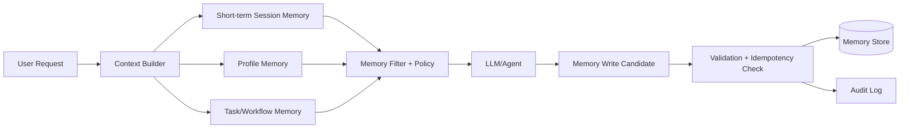

# Memory Strategy, Retention, and Replay Safety for Long-Running Assistants

## Overview
This topic explains how to design memory in enterprise assistants: what to store, what not to store, how long to retain it, and how to keep replay-safe behavior.

## Why this topic matters
Memory improves continuity and personalization, but it also increases risk: privacy leakage, stale context, poisoning, and compliance violations. Architect interviews test whether you can balance usefulness with safety and governance.

## Core concepts
- Short-term vs long-term memory
- Session, profile, and task memory
- Memory retrieval and relevance scoring
- Retention and expiry policies
- Deletion and legal hold handling
- Replay safety and deterministic recovery
- Memory poisoning prevention
- Memory cost and quality governance

## Detailed explanation of each concept
Memory should be purpose-driven. Short-term memory supports active conversation context. Long-term memory stores durable preferences or learned profile details with explicit consent and policy boundaries. Task memory tracks workflow checkpoints for resumability.

Long-running assistants require replay safety: if workflow replays, memory updates should not duplicate or corrupt state. Memory write paths must be idempotent and policy-validated. Retrieval should apply role/tenant constraints and freshness confidence. Memory governance includes TTL, right-to-delete workflows, and audit traceability.

## Evaluation (How to assess architecture quality)
- Memory retrieval relevance rate
- Memory-induced error/hallucination incidents
- Unauthorized memory access incidents (target zero)
- Replay correctness rate after failures
- Retention/deletion compliance success
- Memory storage cost per active user/task

## Architecture / flow diagram


**Flow explanation:**  
Requests use multiple memory layers, filtered by policy and relevance. New memory writes are validated and deduplicated before persistence. All decisions are logged for audit and replay analysis.

## Real-world example
A customer service copilot keeps short-term conversation context for current session, stores long-term preference memory with consent, and tracks task memory for unresolved ticket workflows. Replay-safe task memory allows failed jobs to resume without duplicate customer notifications.

## Best practices
- Separate memory types by purpose and retention policy
- Require explicit write policies for persistent memory
- Use memory confidence scores and freshness checks
- Keep memory retrieval policy-aware by role/tenant
- Implement idempotent memory writes for replay safety
- Audit every high-risk memory read/write action

## Common mistakes / misconceptions
- Storing everything as persistent memory
- No expiry policy for low-value context
- Treating memory as always trustworthy
- Ignoring replay duplication risk
- No deletion pipeline for privacy requests

## Industry relevance
Critical in enterprise assistants for support, operations, healthcare, and financial services where continuity matters but compliance and privacy are strict.

## Interview discussion points
- Memory architecture for long-running assistants
- Retention policy design by data class
- Replay-safe workflow memory updates
- Preventing memory poisoning
- Cost vs utility trade-offs in memory depth

## Links to dependent / related topics
- [Agentic AI Architecture](./agentic_ai_langchain_langgraph.md)
- [Guardrails, Security, Privacy, and Responsible AI](./guardrails_security_privacy_responsible_ai.md)
- [LLMOps, Observability, and Evaluation](./llmops_observability_evaluation_langsmith_arize.md)
- [System Design HLD/LLD](../system-design/system_design_hld_lld.md)

## Interview Questions (50)
1. What is memory in LLM/agent systems?
2. Why is memory architecture important for enterprise assistants?
3. Short-term vs long-term memory: how do you separate?
4. Session memory vs profile memory: what is the difference?
5. What is task memory and when is it needed?
6. How do you decide what should be stored as memory?
7. What should never be stored in assistant memory?
8. How do you design memory schemas?
9. How do you retrieve relevant memory efficiently?
10. How do you avoid irrelevant memory pollution in prompts?
11. How do you set memory confidence and freshness scores?
12. How do you prevent stale memory from harming responses?
13. How do you design retention policies for memory?
14. How do you implement expiry/TTL safely?
15. How do you support right-to-delete requests?
16. How do you handle legal hold exceptions?
17. How do you do tenant isolation for memory stores?
18. How do you enforce RBAC on memory reads/writes?
19. How do you protect PII in memory layers?
20. How do you encrypt memory data at rest and transit?
21. How do you audit memory access for compliance?
22. What is replay safety in long-running assistants?
23. Why do memory writes break during replay?
24. How do you make memory writes idempotent?
25. How do you avoid duplicate side effects on replay?
26. How do you design checkpointed task memory?
27. How do you recover from partial workflow failure safely?
28. How do you detect memory corruption?
29. How do you handle memory poisoning attacks?
30. How do you validate memory writes before persistence?
31. How do you monitor memory quality drift?
32. How do you measure memory usefulness vs noise?
33. How do you run memory A/B tests?
34. How do you control memory storage costs?
35. How do you tier memory storage by value?
36. How do you design summarization memory?
37. How do you decide when not to use memory?
38. How do you support human review for sensitive memory updates?
39. How do you version memory schemas over time?
40. How do you migrate memory data safely between schema versions?
41. How do you design multi-region memory consistency?
42. How do you balance consistency vs availability for memory?
43. How do you test replay safety before production?
44. What metrics matter for replay correctness?
45. What are anti-patterns in memory architecture?
46. How do you explain memory risk trade-offs to leadership?
47. How do you align memory policy with Responsible AI?
48. How do you create quarterly memory governance roadmap?
49. How do you structure ownership across platform/product/security for memory?
50. How do you conclude a memory architecture interview answer strongly?

## Enhanced Answering Playbook (Crisp + Deep + Summary + Example)

Use this playbook for all memory-architecture answers:

- **Crisp answer:** Define memory type and policy boundary quickly.
- **Deep explanation:** Include retention, replay safety, and poisoning risk.
- **Answer summary:** End with utility, compliance, and reliability takeaway.
- **Practical example:** Tie to long-running enterprise assistant flow.
- **Diagram thinking:** Show memory read, validation, and write path.

### Worked Example: Replay-safe task memory
**Crisp answer:** Persist checkpointed task memory with idempotent write keys so workflow replay does not duplicate side effects.

**Deep explanation:**  
Long-running assistants often resume after timeout, crash, or downstream outage. If memory writes are not idempotent, replay can resend notifications or corrupt task state. Use deterministic operation IDs and validation rules before committing memory updates. Separate short-lived session context from durable profile/task memory so retention and deletion policies stay compliant. Add poisoning checks to prevent untrusted content from becoming durable memory.

**Answer summary:**  
- Memory must be purpose-scoped, not a generic dump.  
- Replay safety depends on idempotent writes and checkpoints.  
- Governance needs retention, deletion, and audit controls.


## Answers for important questions (Summary + Crisp + Deep)

### Q1. What is memory in LLM/agent systems?
**Question summary:** Foundational definition interviewers use to test clarity.
**Crisp answer (7-8 lines):** Memory is persisted or session context used across turns or tasks. It helps assistants remember preferences, prior decisions, and workflow progress. It can be short-lived or durable. Good memory improves continuity and user experience. Bad memory can introduce errors and privacy risk. Memory should be policy-bound and purpose-specific. It is an architecture component, not just a model feature.
**Deep explanation (~60-70 lines):** For `What is memory in LLM/agent systems?`, start by identifying where this decision sits in your assistant memory architecture control flow and what failure it prevents. A strong architecture answer should describe the request path end-to-end, not just define terms: ingress, authorization, orchestration, dependency calls, validation, and fallback. In this flow, deterministic steps must be explicit and testable, such as retention policy, idempotent write keys, tenant filters, deletion workflows. These are deterministic because policy and safety outcomes cannot depend on model creativity. Probabilistic steps are acceptable where approximation is useful, such as memory relevance scoring and summarization selection, but they still need guardrails and confidence thresholds. The key trade-off is control versus flexibility: stricter deterministic control improves safety and auditability, while probabilistic reasoning improves adaptability but increases variance in output quality. Design decisions should therefore include boundaries: which component can decide, which component must verify, and which component can block or escalate. Also explain operational behavior under stress: dependency timeout, partial failure, malformed tool output, stale context, and degraded external APIs. For each failure mode, define one mitigation path (retry with budget, route fallback, safe response, or human approval) so the system degrades safely instead of failing unpredictably. Security must be integrated into this answer: identity propagation, least-privilege access, and data boundary enforcement should happen before generation, not after. Finally, show how you will measure success in production with metrics like memory usefulness, replay correctness, stale-memory incidents, storage/user, and mention rollout safety with canary + rollback criteria. This turns the answer from a definition into an operating architecture decision with clear risk, mitigation, and measurable outcomes.
**Answer summary:**
- **Decision:** Select the pattern that best satisfies `What is memory in LLM/agent systems?` under your business and compliance constraints.
- **Risk:** Weak control boundaries and unclear ownership create quality, security, and reliability regressions at scale.
- **Mitigation:** Enforce policy gates, measurable SLO/SLA triggers, and tested fallback/recovery playbooks before full rollout.
**Practical example:** In a healthcare claims assistant, the team addresses 'What is memory in LLM/agent systems?' by enforcing role-scoped access, validating each critical step through policy checks, and releasing changes with canary monitoring so quality and compliance remain stable under production traffic.
**Simple diagram:**  
```text
Interaction -> Memory Read/Write -> Improved Continuity
```
**Trusted reference links:**  
- https://learn.microsoft.com/en-us/azure/ai-foundry/responsible-ai/

### Q2. Why is memory architecture important for enterprise assistants?
**Question summary:** Business and risk framing.
**Crisp answer (7-8 lines):** Memory increases task continuity and personalization. It reduces repeated user input and speeds workflows. It also introduces privacy and security risks. Poor memory can amplify hallucinations. Governance is needed for retention and deletion compliance. Replay-safe memory is required for reliable long tasks. Architecture quality determines trust and operability.
**Deep explanation (~60-70 lines):** For `Why is memory architecture important for enterprise assistants?`, start by identifying where this decision sits in your assistant memory architecture control flow and what failure it prevents. A strong architecture answer should describe the request path end-to-end, not just define terms: ingress, authorization, orchestration, dependency calls, validation, and fallback. In this flow, deterministic steps must be explicit and testable, such as retention policy, idempotent write keys, tenant filters, deletion workflows. These are deterministic because policy and safety outcomes cannot depend on model creativity. Probabilistic steps are acceptable where approximation is useful, such as memory relevance scoring and summarization selection, but they still need guardrails and confidence thresholds. The key trade-off is control versus flexibility: stricter deterministic control improves safety and auditability, while probabilistic reasoning improves adaptability but increases variance in output quality. Design decisions should therefore include boundaries: which component can decide, which component must verify, and which component can block or escalate. Also explain operational behavior under stress: dependency timeout, partial failure, malformed tool output, stale context, and degraded external APIs. For each failure mode, define one mitigation path (retry with budget, route fallback, safe response, or human approval) so the system degrades safely instead of failing unpredictably. Security must be integrated into this answer: identity propagation, least-privilege access, and data boundary enforcement should happen before generation, not after. Finally, show how you will measure success in production with metrics like memory usefulness, replay correctness, stale-memory incidents, storage/user, and mention rollout safety with canary + rollback criteria. This turns the answer from a definition into an operating architecture decision with clear risk, mitigation, and measurable outcomes.
**Answer summary:**
- **Decision:** Select the pattern that best satisfies `Why is memory architecture important for enterprise assistants?` under your business and compliance constraints.
- **Risk:** Weak control boundaries and unclear ownership create quality, security, and reliability regressions at scale.
- **Mitigation:** Enforce policy gates, measurable SLO/SLA triggers, and tested fallback/recovery playbooks before full rollout.
**Practical example:** In a insurance underwriting knowledge bot, the team addresses 'Why is memory architecture important for enterprise assistants?' by enforcing role-scoped access, validating each critical step through policy checks, and releasing changes with canary monitoring so quality and compliance remain stable under production traffic.
**Simple diagram:**  
```text
Memory Value (continuity) <-> Memory Risk (privacy/staleness)
```
**Trusted reference links:**  
- https://learn.microsoft.com/en-us/azure/architecture/framework/security/governance

### Q3. Short-term vs long-term memory: how do you separate?
**Question summary:** Scope and lifecycle design.
**Crisp answer (7-8 lines):** Short-term memory stores active session context only. Long-term memory stores durable preferences or profile facts. Use strict TTL for short-term context. Require consent and policy rules for long-term storage. Keep stores and schemas separate. Apply stronger access controls to long-term memory. Monitor usage and purge low-value entries.
**Deep explanation (~60-70 lines):** For `Short-term vs long-term memory: how do you separate?`, start by identifying where this decision sits in your assistant memory architecture control flow and what failure it prevents. A strong architecture answer should describe the request path end-to-end, not just define terms: ingress, authorization, orchestration, dependency calls, validation, and fallback. In this flow, deterministic steps must be explicit and testable, such as retention policy, idempotent write keys, tenant filters, deletion workflows. These are deterministic because policy and safety outcomes cannot depend on model creativity. Probabilistic steps are acceptable where approximation is useful, such as memory relevance scoring and summarization selection, but they still need guardrails and confidence thresholds. The key trade-off is control versus flexibility: stricter deterministic control improves safety and auditability, while probabilistic reasoning improves adaptability but increases variance in output quality. Design decisions should therefore include boundaries: which component can decide, which component must verify, and which component can block or escalate. Also explain operational behavior under stress: dependency timeout, partial failure, malformed tool output, stale context, and degraded external APIs. For each failure mode, define one mitigation path (retry with budget, route fallback, safe response, or human approval) so the system degrades safely instead of failing unpredictably. Security must be integrated into this answer: identity propagation, least-privilege access, and data boundary enforcement should happen before generation, not after. Finally, show how you will measure success in production with metrics like memory usefulness, replay correctness, stale-memory incidents, storage/user, and mention rollout safety with canary + rollback criteria. This turns the answer from a definition into an operating architecture decision with clear risk, mitigation, and measurable outcomes.
**Answer summary:**
- **Decision:** Select the pattern that best satisfies `Short-term vs long-term memory: how do you separate?` under your business and compliance constraints.
- **Risk:** Weak control boundaries and unclear ownership create quality, security, and reliability regressions at scale.
- **Mitigation:** Enforce policy gates, measurable SLO/SLA triggers, and tested fallback/recovery playbooks before full rollout.
**Practical example:** In a enterprise IT support assistant, the team addresses 'Short-term vs long-term memory: how do you separate?' by enforcing role-scoped access, validating each critical step through policy checks, and releasing changes with canary monitoring so quality and compliance remain stable under production traffic.
**Simple diagram:**  
```text
Session Memory (TTL hours) | Long-term Memory (policy-governed)
```
**Trusted reference links:**  
- https://learn.microsoft.com/en-us/azure/architecture/framework/security/data-protection

### Q4. Session memory vs profile memory: what is the difference?
**Question summary:** Common architecture distinction.
**Crisp answer (7-8 lines):** Session memory is conversation-local and temporary. Profile memory is persistent user preference/context across sessions. Session memory supports immediate coherence. Profile memory supports long-term personalization. Profile memory needs explicit consent and stricter policy gates. Session memory can usually expire aggressively. Treat them as distinct data products.
**Deep explanation (~60-70 lines):** For `Session memory vs profile memory: what is the difference?`, start by identifying where this decision sits in your assistant memory architecture control flow and what failure it prevents. A strong architecture answer should describe the request path end-to-end, not just define terms: ingress, authorization, orchestration, dependency calls, validation, and fallback. In this flow, deterministic steps must be explicit and testable, such as retention policy, idempotent write keys, tenant filters, deletion workflows. These are deterministic because policy and safety outcomes cannot depend on model creativity. Probabilistic steps are acceptable where approximation is useful, such as memory relevance scoring and summarization selection, but they still need guardrails and confidence thresholds. The key trade-off is control versus flexibility: stricter deterministic control improves safety and auditability, while probabilistic reasoning improves adaptability but increases variance in output quality. Design decisions should therefore include boundaries: which component can decide, which component must verify, and which component can block or escalate. Also explain operational behavior under stress: dependency timeout, partial failure, malformed tool output, stale context, and degraded external APIs. For each failure mode, define one mitigation path (retry with budget, route fallback, safe response, or human approval) so the system degrades safely instead of failing unpredictably. Security must be integrated into this answer: identity propagation, least-privilege access, and data boundary enforcement should happen before generation, not after. Finally, show how you will measure success in production with metrics like memory usefulness, replay correctness, stale-memory incidents, storage/user, and mention rollout safety with canary + rollback criteria. This turns the answer from a definition into an operating architecture decision with clear risk, mitigation, and measurable outcomes.
**Answer summary:**
- **Decision:** Select the pattern that best satisfies `Session memory vs profile memory: what is the difference?` under your business and compliance constraints.
- **Risk:** Weak control boundaries and unclear ownership create quality, security, and reliability regressions at scale.
- **Mitigation:** Enforce policy gates, measurable SLO/SLA triggers, and tested fallback/recovery playbooks before full rollout.
**Practical example:** In a procurement contract Q&A assistant, the team addresses 'Session memory vs profile memory: what is the difference?' by enforcing role-scoped access, validating each critical step through policy checks, and releasing changes with canary monitoring so quality and compliance remain stable under production traffic.
**Simple diagram:**  
```text
Session Context -> short TTL
Profile Context -> persistent, policy-controlled
```
**Trusted reference links:**  
- https://learn.microsoft.com/en-us/security/zero-trust/

### Q5. What is task memory and when is it needed?
**Question summary:** Workflow orchestration memory.
**Crisp answer (7-8 lines):** Task memory stores workflow state for multi-step operations. It tracks checkpoints, status, and step outputs. Use it for long-running asynchronous assistants. It supports retry and resume after failure. It should be deterministic and idempotent. Keep task memory separate from user preference memory. Audit updates for high-risk workflows.
**Deep explanation (~60-70 lines):** For `What is task memory and when is it needed?`, start by identifying where this decision sits in your assistant memory architecture control flow and what failure it prevents. A strong architecture answer should describe the request path end-to-end, not just define terms: ingress, authorization, orchestration, dependency calls, validation, and fallback. In this flow, deterministic steps must be explicit and testable, such as retention policy, idempotent write keys, tenant filters, deletion workflows. These are deterministic because policy and safety outcomes cannot depend on model creativity. Probabilistic steps are acceptable where approximation is useful, such as memory relevance scoring and summarization selection, but they still need guardrails and confidence thresholds. The key trade-off is control versus flexibility: stricter deterministic control improves safety and auditability, while probabilistic reasoning improves adaptability but increases variance in output quality. Design decisions should therefore include boundaries: which component can decide, which component must verify, and which component can block or escalate. Also explain operational behavior under stress: dependency timeout, partial failure, malformed tool output, stale context, and degraded external APIs. For each failure mode, define one mitigation path (retry with budget, route fallback, safe response, or human approval) so the system degrades safely instead of failing unpredictably. Security must be integrated into this answer: identity propagation, least-privilege access, and data boundary enforcement should happen before generation, not after. Finally, show how you will measure success in production with metrics like memory usefulness, replay correctness, stale-memory incidents, storage/user, and mention rollout safety with canary + rollback criteria. This turns the answer from a definition into an operating architecture decision with clear risk, mitigation, and measurable outcomes.
**Answer summary:**
- **Decision:** Select the pattern that best satisfies `What is task memory and when is it needed?` under your business and compliance constraints.
- **Risk:** Weak control boundaries and unclear ownership create quality, security, and reliability regressions at scale.
- **Mitigation:** Enforce policy gates, measurable SLO/SLA triggers, and tested fallback/recovery playbooks before full rollout.
**Practical example:** In a internal audit/compliance copilot, the team addresses 'What is task memory and when is it needed?' by enforcing role-scoped access, validating each critical step through policy checks, and releasing changes with canary monitoring so quality and compliance remain stable under production traffic.
**Simple diagram:**  
```text
Task Start -> Checkpoints -> Resume/Complete
```
**Trusted reference links:**  
- https://learn.microsoft.com/en-us/azure/architecture/reference-architectures/saga/saga

### Q6. How do you decide what should be stored as memory?
**Question summary:** Memory write policy design.
**Crisp answer (7-8 lines):** Store only high-value, reusable, policy-allowed facts. Require explicit purpose for each memory class. Score candidate memory by utility and risk. Avoid storing volatile or low-confidence content. Apply consent and role constraints before persistence. Keep defaults conservative. Review memory write rules regularly.
**Deep explanation (~60-70 lines):** For `How do you decide what should be stored as memory?`, start by identifying where this decision sits in your assistant memory architecture control flow and what failure it prevents. A strong architecture answer should describe the request path end-to-end, not just define terms: ingress, authorization, orchestration, dependency calls, validation, and fallback. In this flow, deterministic steps must be explicit and testable, such as retention policy, idempotent write keys, tenant filters, deletion workflows. These are deterministic because policy and safety outcomes cannot depend on model creativity. Probabilistic steps are acceptable where approximation is useful, such as memory relevance scoring and summarization selection, but they still need guardrails and confidence thresholds. The key trade-off is control versus flexibility: stricter deterministic control improves safety and auditability, while probabilistic reasoning improves adaptability but increases variance in output quality. Design decisions should therefore include boundaries: which component can decide, which component must verify, and which component can block or escalate. Also explain operational behavior under stress: dependency timeout, partial failure, malformed tool output, stale context, and degraded external APIs. For each failure mode, define one mitigation path (retry with budget, route fallback, safe response, or human approval) so the system degrades safely instead of failing unpredictably. Security must be integrated into this answer: identity propagation, least-privilege access, and data boundary enforcement should happen before generation, not after. Finally, show how you will measure success in production with metrics like memory usefulness, replay correctness, stale-memory incidents, storage/user, and mention rollout safety with canary + rollback criteria. This turns the answer from a definition into an operating architecture decision with clear risk, mitigation, and measurable outcomes.
**Answer summary:**
- **Decision:** Select the pattern that best satisfies `How do you decide what should be stored as memory?` under your business and compliance constraints.
- **Risk:** Weak control boundaries and unclear ownership create quality, security, and reliability regressions at scale.
- **Mitigation:** Enforce policy gates, measurable SLO/SLA triggers, and tested fallback/recovery playbooks before full rollout.
**Practical example:** In a customer support triage assistant, the team addresses 'How do you decide what should be stored as memory?' by enforcing role-scoped access, validating each critical step through policy checks, and releasing changes with canary monitoring so quality and compliance remain stable under production traffic.
**Simple diagram:**  
```text
Candidate Fact -> Utility/Risk Check -> Store or Drop
```
**Trusted reference links:**  
- https://learn.microsoft.com/en-us/azure/ai-foundry/responsible-ai/

### Q7. What should never be stored in assistant memory?
**Question summary:** Data minimization awareness.
**Crisp answer (7-8 lines):** Avoid storing secrets, credentials, and raw sensitive identifiers. Do not persist unverified harmful user claims. Avoid storing prohibited regulated data without legal basis. Do not store transient low-value noise. Avoid storing raw logs as memory directly. Exclude content violating policy boundaries. Use explicit deny lists in memory pipeline.
**Deep explanation (~60-70 lines):** For `What should never be stored in assistant memory?`, start by identifying where this decision sits in your assistant memory architecture control flow and what failure it prevents. A strong architecture answer should describe the request path end-to-end, not just define terms: ingress, authorization, orchestration, dependency calls, validation, and fallback. In this flow, deterministic steps must be explicit and testable, such as retention policy, idempotent write keys, tenant filters, deletion workflows. These are deterministic because policy and safety outcomes cannot depend on model creativity. Probabilistic steps are acceptable where approximation is useful, such as memory relevance scoring and summarization selection, but they still need guardrails and confidence thresholds. The key trade-off is control versus flexibility: stricter deterministic control improves safety and auditability, while probabilistic reasoning improves adaptability but increases variance in output quality. Design decisions should therefore include boundaries: which component can decide, which component must verify, and which component can block or escalate. Also explain operational behavior under stress: dependency timeout, partial failure, malformed tool output, stale context, and degraded external APIs. For each failure mode, define one mitigation path (retry with budget, route fallback, safe response, or human approval) so the system degrades safely instead of failing unpredictably. Security must be integrated into this answer: identity propagation, least-privilege access, and data boundary enforcement should happen before generation, not after. Finally, show how you will measure success in production with metrics like memory usefulness, replay correctness, stale-memory incidents, storage/user, and mention rollout safety with canary + rollback criteria. This turns the answer from a definition into an operating architecture decision with clear risk, mitigation, and measurable outcomes.
**Answer summary:**
- **Decision:** Select the pattern that best satisfies `What should never be stored in assistant memory?` under your business and compliance constraints.
- **Risk:** Weak control boundaries and unclear ownership create quality, security, and reliability regressions at scale.
- **Mitigation:** Enforce policy gates, measurable SLO/SLA triggers, and tested fallback/recovery playbooks before full rollout.
**Practical example:** In a operations incident copilot, the team addresses 'What should never be stored in assistant memory?' by enforcing role-scoped access, validating each critical step through policy checks, and releasing changes with canary monitoring so quality and compliance remain stable under production traffic.
**Simple diagram:**  
```text
Sensitive/Prohibited Data -> Deny Memory Write
```
**Trusted reference links:**  
- https://learn.microsoft.com/en-us/azure/security/fundamentals/secrets-best-practices

### Q8. How do you design memory schemas?
**Question summary:** Data model quality.
**Crisp answer (7-8 lines):** Define typed fields for subject, fact, confidence, source, and timestamp. Include tenant/user ownership metadata. Add retention and consent attributes. Store provenance for explainability and auditing. Version schemas for evolvability. Keep schema minimal and purpose-specific. Validate schema at write time.
**Deep explanation (~60-70 lines):** For `How do you design memory schemas?`, start by identifying where this decision sits in your assistant memory architecture control flow and what failure it prevents. A strong architecture answer should describe the request path end-to-end, not just define terms: ingress, authorization, orchestration, dependency calls, validation, and fallback. In this flow, deterministic steps must be explicit and testable, such as retention policy, idempotent write keys, tenant filters, deletion workflows. These are deterministic because policy and safety outcomes cannot depend on model creativity. Probabilistic steps are acceptable where approximation is useful, such as memory relevance scoring and summarization selection, but they still need guardrails and confidence thresholds. The key trade-off is control versus flexibility: stricter deterministic control improves safety and auditability, while probabilistic reasoning improves adaptability but increases variance in output quality. Design decisions should therefore include boundaries: which component can decide, which component must verify, and which component can block or escalate. Also explain operational behavior under stress: dependency timeout, partial failure, malformed tool output, stale context, and degraded external APIs. For each failure mode, define one mitigation path (retry with budget, route fallback, safe response, or human approval) so the system degrades safely instead of failing unpredictably. Security must be integrated into this answer: identity propagation, least-privilege access, and data boundary enforcement should happen before generation, not after. Finally, show how you will measure success in production with metrics like memory usefulness, replay correctness, stale-memory incidents, storage/user, and mention rollout safety with canary + rollback criteria. This turns the answer from a definition into an operating architecture decision with clear risk, mitigation, and measurable outcomes.
**Answer summary:**
- **Decision:** Select the pattern that best satisfies `How do you design memory schemas?` under your business and compliance constraints.
- **Risk:** Weak control boundaries and unclear ownership create quality, security, and reliability regressions at scale.
- **Mitigation:** Enforce policy gates, measurable SLO/SLA triggers, and tested fallback/recovery playbooks before full rollout.
**Practical example:** In a banking policy copilot, the team addresses 'How do you design memory schemas?' by enforcing role-scoped access, validating each critical step through policy checks, and releasing changes with canary monitoring so quality and compliance remain stable under production traffic.
**Simple diagram:**  
```text
Memory Record = {subject, fact, confidence, source, owner, ttl}
```
**Trusted reference links:**  
- https://learn.microsoft.com/en-us/azure/architecture/data-guide/

### Q9. How do you retrieve relevant memory efficiently?
**Question summary:** Retrieval strategy question.
**Crisp answer (7-8 lines):** Filter by user/tenant and memory type first. Rank memory by relevance, recency, and confidence. Limit top results to context budget. Use metadata and vector/hybrid retrieval where needed. Exclude expired or low-trust entries. Cache frequent retrieval patterns safely. Monitor retrieval precision over time.
**Deep explanation (~60-70 lines):** For `How do you retrieve relevant memory efficiently?`, start by identifying where this decision sits in your assistant memory architecture control flow and what failure it prevents. A strong architecture answer should describe the request path end-to-end, not just define terms: ingress, authorization, orchestration, dependency calls, validation, and fallback. In this flow, deterministic steps must be explicit and testable, such as retention policy, idempotent write keys, tenant filters, deletion workflows. These are deterministic because policy and safety outcomes cannot depend on model creativity. Probabilistic steps are acceptable where approximation is useful, such as memory relevance scoring and summarization selection, but they still need guardrails and confidence thresholds. The key trade-off is control versus flexibility: stricter deterministic control improves safety and auditability, while probabilistic reasoning improves adaptability but increases variance in output quality. Design decisions should therefore include boundaries: which component can decide, which component must verify, and which component can block or escalate. Also explain operational behavior under stress: dependency timeout, partial failure, malformed tool output, stale context, and degraded external APIs. For each failure mode, define one mitigation path (retry with budget, route fallback, safe response, or human approval) so the system degrades safely instead of failing unpredictably. Security must be integrated into this answer: identity propagation, least-privilege access, and data boundary enforcement should happen before generation, not after. Finally, show how you will measure success in production with metrics like memory usefulness, replay correctness, stale-memory incidents, storage/user, and mention rollout safety with canary + rollback criteria. This turns the answer from a definition into an operating architecture decision with clear risk, mitigation, and measurable outcomes.
**Answer summary:**
- **Decision:** Select the pattern that best satisfies `How do you retrieve relevant memory efficiently?` under your business and compliance constraints.
- **Risk:** Weak control boundaries and unclear ownership create quality, security, and reliability regressions at scale.
- **Mitigation:** Enforce policy gates, measurable SLO/SLA triggers, and tested fallback/recovery playbooks before full rollout.
**Practical example:** In a healthcare claims assistant, the team addresses 'How do you retrieve relevant memory efficiently?' by enforcing role-scoped access, validating each critical step through policy checks, and releasing changes with canary monitoring so quality and compliance remain stable under production traffic.
**Simple diagram:**  
```text
Memory Store -> Filter -> Rank -> Top-k Context
```
**Trusted reference links:**  
- https://learn.microsoft.com/en-us/azure/search/hybrid-search-overview

### Q10. How do you avoid irrelevant memory pollution in prompts?
**Question summary:** Context quality control.
**Crisp answer (7-8 lines):** Apply strict retrieval thresholds and top-k limits. Use relevance and freshness gating. Drop low-confidence or outdated entries. Deduplicate similar memory items. Keep memory categories scoped to intent. Add post-assembly context validator. Track prompt noise impact on output quality.
**Deep explanation (~60-70 lines):** For `How do you avoid irrelevant memory pollution in prompts?`, start by identifying where this decision sits in your assistant memory architecture control flow and what failure it prevents. A strong architecture answer should describe the request path end-to-end, not just define terms: ingress, authorization, orchestration, dependency calls, validation, and fallback. In this flow, deterministic steps must be explicit and testable, such as retention policy, idempotent write keys, tenant filters, deletion workflows. These are deterministic because policy and safety outcomes cannot depend on model creativity. Probabilistic steps are acceptable where approximation is useful, such as memory relevance scoring and summarization selection, but they still need guardrails and confidence thresholds. The key trade-off is control versus flexibility: stricter deterministic control improves safety and auditability, while probabilistic reasoning improves adaptability but increases variance in output quality. Design decisions should therefore include boundaries: which component can decide, which component must verify, and which component can block or escalate. Also explain operational behavior under stress: dependency timeout, partial failure, malformed tool output, stale context, and degraded external APIs. For each failure mode, define one mitigation path (retry with budget, route fallback, safe response, or human approval) so the system degrades safely instead of failing unpredictably. Security must be integrated into this answer: identity propagation, least-privilege access, and data boundary enforcement should happen before generation, not after. Finally, show how you will measure success in production with metrics like memory usefulness, replay correctness, stale-memory incidents, storage/user, and mention rollout safety with canary + rollback criteria. This turns the answer from a definition into an operating architecture decision with clear risk, mitigation, and measurable outcomes.
**Answer summary:**
- **Decision:** Select the pattern that best satisfies `How do you avoid irrelevant memory pollution in prompts?` under your business and compliance constraints.
- **Risk:** Weak control boundaries and unclear ownership create quality, security, and reliability regressions at scale.
- **Mitigation:** Enforce policy gates, measurable SLO/SLA triggers, and tested fallback/recovery playbooks before full rollout.
**Practical example:** In a insurance underwriting knowledge bot, the team addresses 'How do you avoid irrelevant memory pollution in prompts?' by enforcing role-scoped access, validating each critical step through policy checks, and releasing changes with canary monitoring so quality and compliance remain stable under production traffic.
**Simple diagram:**  
```text
Candidate Memory -> Quality Filter -> Prompt Context
```
**Trusted reference links:**  
- https://learn.microsoft.com/en-us/azure/architecture/ai-ml/guide/rag/

### Q11. How do you set memory confidence and freshness scores?
**Question summary:** Quality scoring design.
**Crisp answer (7-8 lines):** Derive confidence from source trust and validation status. Decay confidence over time for stale entries. Track freshness by last-verified timestamp. Combine confidence and freshness in retrieval ranking. Set minimum thresholds by intent risk class. Revalidate high-impact memory periodically. Log confidence score changes.
**Deep explanation (~60-70 lines):** For `How do you set memory confidence and freshness scores?`, start by identifying where this decision sits in your assistant memory architecture control flow and what failure it prevents. A strong architecture answer should describe the request path end-to-end, not just define terms: ingress, authorization, orchestration, dependency calls, validation, and fallback. In this flow, deterministic steps must be explicit and testable, such as retention policy, idempotent write keys, tenant filters, deletion workflows. These are deterministic because policy and safety outcomes cannot depend on model creativity. Probabilistic steps are acceptable where approximation is useful, such as memory relevance scoring and summarization selection, but they still need guardrails and confidence thresholds. The key trade-off is control versus flexibility: stricter deterministic control improves safety and auditability, while probabilistic reasoning improves adaptability but increases variance in output quality. Design decisions should therefore include boundaries: which component can decide, which component must verify, and which component can block or escalate. Also explain operational behavior under stress: dependency timeout, partial failure, malformed tool output, stale context, and degraded external APIs. For each failure mode, define one mitigation path (retry with budget, route fallback, safe response, or human approval) so the system degrades safely instead of failing unpredictably. Security must be integrated into this answer: identity propagation, least-privilege access, and data boundary enforcement should happen before generation, not after. Finally, show how you will measure success in production with metrics like memory usefulness, replay correctness, stale-memory incidents, storage/user, and mention rollout safety with canary + rollback criteria. This turns the answer from a definition into an operating architecture decision with clear risk, mitigation, and measurable outcomes.
**Answer summary:**
- **Decision:** Select the pattern that best satisfies `How do you set memory confidence and freshness scores?` under your business and compliance constraints.
- **Risk:** Weak control boundaries and unclear ownership create quality, security, and reliability regressions at scale.
- **Mitigation:** Enforce policy gates, measurable SLO/SLA triggers, and tested fallback/recovery playbooks before full rollout.
**Practical example:** In a enterprise IT support assistant, the team addresses 'How do you set memory confidence and freshness scores?' by enforcing role-scoped access, validating each critical step through policy checks, and releasing changes with canary monitoring so quality and compliance remain stable under production traffic.
**Simple diagram:**  
```text
Source Trust + Age -> Confidence/Freshness Score
```
**Trusted reference links:**  
- https://learn.microsoft.com/en-us/azure/architecture/framework/operational-excellence/

### Q12. How do you prevent stale memory from harming responses?
**Question summary:** Freshness control.
**Crisp answer (7-8 lines):** Apply TTL and revalidation windows by memory class. Demote old entries in ranking. Trigger refresh for frequently used stale facts. Add source-of-truth checks for critical facts. Mark uncertain memory as advisory only. Use abstain/escalation when memory freshness is low. Track stale-memory incident metrics.
**Deep explanation (~60-70 lines):** For `How do you prevent stale memory from harming responses?`, start by identifying where this decision sits in your assistant memory architecture control flow and what failure it prevents. A strong architecture answer should describe the request path end-to-end, not just define terms: ingress, authorization, orchestration, dependency calls, validation, and fallback. In this flow, deterministic steps must be explicit and testable, such as retention policy, idempotent write keys, tenant filters, deletion workflows. These are deterministic because policy and safety outcomes cannot depend on model creativity. Probabilistic steps are acceptable where approximation is useful, such as memory relevance scoring and summarization selection, but they still need guardrails and confidence thresholds. The key trade-off is control versus flexibility: stricter deterministic control improves safety and auditability, while probabilistic reasoning improves adaptability but increases variance in output quality. Design decisions should therefore include boundaries: which component can decide, which component must verify, and which component can block or escalate. Also explain operational behavior under stress: dependency timeout, partial failure, malformed tool output, stale context, and degraded external APIs. For each failure mode, define one mitigation path (retry with budget, route fallback, safe response, or human approval) so the system degrades safely instead of failing unpredictably. Security must be integrated into this answer: identity propagation, least-privilege access, and data boundary enforcement should happen before generation, not after. Finally, show how you will measure success in production with metrics like memory usefulness, replay correctness, stale-memory incidents, storage/user, and mention rollout safety with canary + rollback criteria. This turns the answer from a definition into an operating architecture decision with clear risk, mitigation, and measurable outcomes.
**Answer summary:**
- **Decision:** Select the pattern that best satisfies `How do you prevent stale memory from harming responses?` under your business and compliance constraints.
- **Risk:** Weak control boundaries and unclear ownership create quality, security, and reliability regressions at scale.
- **Mitigation:** Enforce policy gates, measurable SLO/SLA triggers, and tested fallback/recovery playbooks before full rollout.
**Practical example:** In a procurement contract Q&A assistant, the team addresses 'How do you prevent stale memory from harming responses?' by enforcing role-scoped access, validating each critical step through policy checks, and releasing changes with canary monitoring so quality and compliance remain stable under production traffic.
**Simple diagram:**  
```text
Age Check -> Revalidate/Expire -> Safe Retrieval
```
**Trusted reference links:**  
- https://learn.microsoft.com/en-us/azure/architecture/patterns/cache-aside

### Q13. How do you design retention policies for memory?
**Question summary:** Compliance lifecycle design.
**Crisp answer (7-8 lines):** Classify memory by sensitivity and purpose. Define retention periods per class. Enforce automatic expiration and deletion jobs. Support legal and policy exceptions with audit trails. Keep retention metadata with each entry. Review policy with legal/compliance teams. Measure retention compliance rates.
**Deep explanation (~60-70 lines):** For `How do you design retention policies for memory?`, start by identifying where this decision sits in your assistant memory architecture control flow and what failure it prevents. A strong architecture answer should describe the request path end-to-end, not just define terms: ingress, authorization, orchestration, dependency calls, validation, and fallback. In this flow, deterministic steps must be explicit and testable, such as retention policy, idempotent write keys, tenant filters, deletion workflows. These are deterministic because policy and safety outcomes cannot depend on model creativity. Probabilistic steps are acceptable where approximation is useful, such as memory relevance scoring and summarization selection, but they still need guardrails and confidence thresholds. The key trade-off is control versus flexibility: stricter deterministic control improves safety and auditability, while probabilistic reasoning improves adaptability but increases variance in output quality. Design decisions should therefore include boundaries: which component can decide, which component must verify, and which component can block or escalate. Also explain operational behavior under stress: dependency timeout, partial failure, malformed tool output, stale context, and degraded external APIs. For each failure mode, define one mitigation path (retry with budget, route fallback, safe response, or human approval) so the system degrades safely instead of failing unpredictably. Security must be integrated into this answer: identity propagation, least-privilege access, and data boundary enforcement should happen before generation, not after. Finally, show how you will measure success in production with metrics like memory usefulness, replay correctness, stale-memory incidents, storage/user, and mention rollout safety with canary + rollback criteria. This turns the answer from a definition into an operating architecture decision with clear risk, mitigation, and measurable outcomes.
**Answer summary:**
- **Decision:** Select the pattern that best satisfies `How do you design retention policies for memory?` under your business and compliance constraints.
- **Risk:** Weak control boundaries and unclear ownership create quality, security, and reliability regressions at scale.
- **Mitigation:** Enforce policy gates, measurable SLO/SLA triggers, and tested fallback/recovery playbooks before full rollout.
**Practical example:** In a internal audit/compliance copilot, the team addresses 'How do you design retention policies for memory?' by enforcing role-scoped access, validating each critical step through policy checks, and releasing changes with canary monitoring so quality and compliance remain stable under production traffic.
**Simple diagram:**  
```text
Memory Class -> Retention Rule -> Auto Expiry/Delete
```
**Trusted reference links:**  
- https://learn.microsoft.com/en-us/azure/compliance/

### Q14. How do you implement expiry/TTL safely?
**Question summary:** Operational deletion mechanics.
**Crisp answer (7-8 lines):** Assign TTL at write time by memory category. Use background cleanup jobs with idempotent deletion. Prevent retrieval of expired entries immediately. Keep tombstone/audit metadata for compliance evidence. Handle distributed cache/store TTL consistency. Monitor cleanup lag and failures. Test expiry behavior in staging.
**Deep explanation (~60-70 lines):** For `How do you implement expiry/TTL safely?`, start by identifying where this decision sits in your assistant memory architecture control flow and what failure it prevents. A strong architecture answer should describe the request path end-to-end, not just define terms: ingress, authorization, orchestration, dependency calls, validation, and fallback. In this flow, deterministic steps must be explicit and testable, such as retention policy, idempotent write keys, tenant filters, deletion workflows. These are deterministic because policy and safety outcomes cannot depend on model creativity. Probabilistic steps are acceptable where approximation is useful, such as memory relevance scoring and summarization selection, but they still need guardrails and confidence thresholds. The key trade-off is control versus flexibility: stricter deterministic control improves safety and auditability, while probabilistic reasoning improves adaptability but increases variance in output quality. Design decisions should therefore include boundaries: which component can decide, which component must verify, and which component can block or escalate. Also explain operational behavior under stress: dependency timeout, partial failure, malformed tool output, stale context, and degraded external APIs. For each failure mode, define one mitigation path (retry with budget, route fallback, safe response, or human approval) so the system degrades safely instead of failing unpredictably. Security must be integrated into this answer: identity propagation, least-privilege access, and data boundary enforcement should happen before generation, not after. Finally, show how you will measure success in production with metrics like memory usefulness, replay correctness, stale-memory incidents, storage/user, and mention rollout safety with canary + rollback criteria. This turns the answer from a definition into an operating architecture decision with clear risk, mitigation, and measurable outcomes.
**Answer summary:**
- **Decision:** Select the pattern that best satisfies `How do you implement expiry/TTL safely?` under your business and compliance constraints.
- **Risk:** Weak control boundaries and unclear ownership create quality, security, and reliability regressions at scale.
- **Mitigation:** Enforce policy gates, measurable SLO/SLA triggers, and tested fallback/recovery playbooks before full rollout.
**Practical example:** In a customer support triage assistant, the team addresses 'How do you implement expiry/TTL safely?' by enforcing role-scoped access, validating each critical step through policy checks, and releasing changes with canary monitoring so quality and compliance remain stable under production traffic.
**Simple diagram:**  
```text
Write with TTL -> Read Filter -> Cleanup Worker
```
**Trusted reference links:**  
- https://redis.io/docs/latest/develop/use/keyspace/

### Q15. How do you support right-to-delete requests?
**Question summary:** Privacy rights compliance.
**Crisp answer (7-8 lines):** Create identity-verified deletion workflow. Locate all memory entries by subject IDs and aliases. Delete or anonymize per legal requirements. Propagate deletion to caches and replicas. Record completion evidence and timestamps. Provide user confirmation and audit logs. Monitor SLA for deletion completion.
**Deep explanation (~60-70 lines):** For `How do you support right-to-delete requests?`, start by identifying where this decision sits in your assistant memory architecture control flow and what failure it prevents. A strong architecture answer should describe the request path end-to-end, not just define terms: ingress, authorization, orchestration, dependency calls, validation, and fallback. In this flow, deterministic steps must be explicit and testable, such as retention policy, idempotent write keys, tenant filters, deletion workflows. These are deterministic because policy and safety outcomes cannot depend on model creativity. Probabilistic steps are acceptable where approximation is useful, such as memory relevance scoring and summarization selection, but they still need guardrails and confidence thresholds. The key trade-off is control versus flexibility: stricter deterministic control improves safety and auditability, while probabilistic reasoning improves adaptability but increases variance in output quality. Design decisions should therefore include boundaries: which component can decide, which component must verify, and which component can block or escalate. Also explain operational behavior under stress: dependency timeout, partial failure, malformed tool output, stale context, and degraded external APIs. For each failure mode, define one mitigation path (retry with budget, route fallback, safe response, or human approval) so the system degrades safely instead of failing unpredictably. Security must be integrated into this answer: identity propagation, least-privilege access, and data boundary enforcement should happen before generation, not after. Finally, show how you will measure success in production with metrics like memory usefulness, replay correctness, stale-memory incidents, storage/user, and mention rollout safety with canary + rollback criteria. This turns the answer from a definition into an operating architecture decision with clear risk, mitigation, and measurable outcomes.
**Answer summary:**
- **Decision:** Select the pattern that best satisfies `How do you support right-to-delete requests?` under your business and compliance constraints.
- **Risk:** Weak control boundaries and unclear ownership create quality, security, and reliability regressions at scale.
- **Mitigation:** Enforce policy gates, measurable SLO/SLA triggers, and tested fallback/recovery playbooks before full rollout.
**Practical example:** In a operations incident copilot, the team addresses 'How do you support right-to-delete requests?' by enforcing role-scoped access, validating each critical step through policy checks, and releasing changes with canary monitoring so quality and compliance remain stable under production traffic.
**Simple diagram:**  
```text
Delete Request -> Identity Verify -> Data Locate -> Purge -> Confirm
```
**Trusted reference links:**  
- https://learn.microsoft.com/en-us/azure/architecture/framework/security/governance

### Q16. How do you handle legal hold exceptions?
**Question summary:** Compliance exception handling.
**Crisp answer (7-8 lines):** Tag records under legal hold to suspend deletion. Separate hold logic from normal retention jobs. Restrict legal hold operations to authorized roles. Keep immutable audit for hold apply/release events. Reapply retention logic after hold release. Review holds periodically for validity. Ensure user-facing workflows reflect hold constraints.
**Deep explanation (~60-70 lines):** For `How do you handle legal hold exceptions?`, start by identifying where this decision sits in your assistant memory architecture control flow and what failure it prevents. A strong architecture answer should describe the request path end-to-end, not just define terms: ingress, authorization, orchestration, dependency calls, validation, and fallback. In this flow, deterministic steps must be explicit and testable, such as retention policy, idempotent write keys, tenant filters, deletion workflows. These are deterministic because policy and safety outcomes cannot depend on model creativity. Probabilistic steps are acceptable where approximation is useful, such as memory relevance scoring and summarization selection, but they still need guardrails and confidence thresholds. The key trade-off is control versus flexibility: stricter deterministic control improves safety and auditability, while probabilistic reasoning improves adaptability but increases variance in output quality. Design decisions should therefore include boundaries: which component can decide, which component must verify, and which component can block or escalate. Also explain operational behavior under stress: dependency timeout, partial failure, malformed tool output, stale context, and degraded external APIs. For each failure mode, define one mitigation path (retry with budget, route fallback, safe response, or human approval) so the system degrades safely instead of failing unpredictably. Security must be integrated into this answer: identity propagation, least-privilege access, and data boundary enforcement should happen before generation, not after. Finally, show how you will measure success in production with metrics like memory usefulness, replay correctness, stale-memory incidents, storage/user, and mention rollout safety with canary + rollback criteria. This turns the answer from a definition into an operating architecture decision with clear risk, mitigation, and measurable outcomes.
**Answer summary:**
- **Decision:** Select the pattern that best satisfies `How do you handle legal hold exceptions?` under your business and compliance constraints.
- **Risk:** Weak control boundaries and unclear ownership create quality, security, and reliability regressions at scale.
- **Mitigation:** Enforce policy gates, measurable SLO/SLA triggers, and tested fallback/recovery playbooks before full rollout.
**Practical example:** In a banking policy copilot, the team addresses 'How do you handle legal hold exceptions?' by enforcing role-scoped access, validating each critical step through policy checks, and releasing changes with canary monitoring so quality and compliance remain stable under production traffic.
**Simple diagram:**  
```text
Record -> Legal Hold Tag -> Retention Pause -> Release -> Resume Policy
```
**Trusted reference links:**  
- https://learn.microsoft.com/en-us/azure/compliance/

### Q17. How do you do tenant isolation for memory stores?
**Question summary:** Multi-tenant security.
**Crisp answer (7-8 lines):** Partition memory by tenant identifiers and access policies. Enforce tenant filters as mandatory on all queries. Isolate high-sensitivity tenants physically/logically if needed. Separate encryption keys by tenant tier. Prevent cross-tenant cache contamination. Test with adversarial boundary cases. Alert on any isolation violation.
**Deep explanation (~60-70 lines):** For `How do you do tenant isolation for memory stores?`, start by identifying where this decision sits in your assistant memory architecture control flow and what failure it prevents. A strong architecture answer should describe the request path end-to-end, not just define terms: ingress, authorization, orchestration, dependency calls, validation, and fallback. In this flow, deterministic steps must be explicit and testable, such as retention policy, idempotent write keys, tenant filters, deletion workflows. These are deterministic because policy and safety outcomes cannot depend on model creativity. Probabilistic steps are acceptable where approximation is useful, such as memory relevance scoring and summarization selection, but they still need guardrails and confidence thresholds. The key trade-off is control versus flexibility: stricter deterministic control improves safety and auditability, while probabilistic reasoning improves adaptability but increases variance in output quality. Design decisions should therefore include boundaries: which component can decide, which component must verify, and which component can block or escalate. Also explain operational behavior under stress: dependency timeout, partial failure, malformed tool output, stale context, and degraded external APIs. For each failure mode, define one mitigation path (retry with budget, route fallback, safe response, or human approval) so the system degrades safely instead of failing unpredictably. Security must be integrated into this answer: identity propagation, least-privilege access, and data boundary enforcement should happen before generation, not after. Finally, show how you will measure success in production with metrics like memory usefulness, replay correctness, stale-memory incidents, storage/user, and mention rollout safety with canary + rollback criteria. This turns the answer from a definition into an operating architecture decision with clear risk, mitigation, and measurable outcomes.
**Answer summary:**
- **Decision:** Select the pattern that best satisfies `How do you do tenant isolation for memory stores?` under your business and compliance constraints.
- **Risk:** Weak control boundaries and unclear ownership create quality, security, and reliability regressions at scale.
- **Mitigation:** Enforce policy gates, measurable SLO/SLA triggers, and tested fallback/recovery playbooks before full rollout.
**Practical example:** In a healthcare claims assistant, the team addresses 'How do you do tenant isolation for memory stores?' by enforcing role-scoped access, validating each critical step through policy checks, and releasing changes with canary monitoring so quality and compliance remain stable under production traffic.
**Simple diagram:**  
```text
Tenant Context -> Tenant Partition -> Tenant-safe Memory Retrieval
```
**Trusted reference links:**  
- https://learn.microsoft.com/en-us/azure/architecture/guide/multitenant/

### Q18. How do you enforce RBAC on memory reads/writes?
**Question summary:** Access control enforcement.
**Crisp answer (7-8 lines):** Evaluate role permissions before memory operations. Separate read, write, and admin scopes. Add purpose and intent checks for sensitive memory classes. Deny by default when claims are missing. Log authorization decisions for audits. Review role mappings periodically. Use policy engine, not inline ad hoc checks.
**Deep explanation (~60-70 lines):** For `How do you enforce RBAC on memory reads/writes?`, start by identifying where this decision sits in your assistant memory architecture control flow and what failure it prevents. A strong architecture answer should describe the request path end-to-end, not just define terms: ingress, authorization, orchestration, dependency calls, validation, and fallback. In this flow, deterministic steps must be explicit and testable, such as retention policy, idempotent write keys, tenant filters, deletion workflows. These are deterministic because policy and safety outcomes cannot depend on model creativity. Probabilistic steps are acceptable where approximation is useful, such as memory relevance scoring and summarization selection, but they still need guardrails and confidence thresholds. The key trade-off is control versus flexibility: stricter deterministic control improves safety and auditability, while probabilistic reasoning improves adaptability but increases variance in output quality. Design decisions should therefore include boundaries: which component can decide, which component must verify, and which component can block or escalate. Also explain operational behavior under stress: dependency timeout, partial failure, malformed tool output, stale context, and degraded external APIs. For each failure mode, define one mitigation path (retry with budget, route fallback, safe response, or human approval) so the system degrades safely instead of failing unpredictably. Security must be integrated into this answer: identity propagation, least-privilege access, and data boundary enforcement should happen before generation, not after. Finally, show how you will measure success in production with metrics like memory usefulness, replay correctness, stale-memory incidents, storage/user, and mention rollout safety with canary + rollback criteria. This turns the answer from a definition into an operating architecture decision with clear risk, mitigation, and measurable outcomes.
**Answer summary:**
- **Decision:** Select the pattern that best satisfies `How do you enforce RBAC on memory reads/writes?` under your business and compliance constraints.
- **Risk:** Weak control boundaries and unclear ownership create quality, security, and reliability regressions at scale.
- **Mitigation:** Enforce policy gates, measurable SLO/SLA triggers, and tested fallback/recovery playbooks before full rollout.
**Practical example:** In a insurance underwriting knowledge bot, the team addresses 'How do you enforce RBAC on memory reads/writes?' by enforcing role-scoped access, validating each critical step through policy checks, and releasing changes with canary monitoring so quality and compliance remain stable under production traffic.
**Simple diagram:**  
```text
Claims -> Policy Engine -> Read/Write Allow or Deny
```
**Trusted reference links:**  
- https://learn.microsoft.com/en-us/azure/role-based-access-control/overview

### Q19. How do you protect PII in memory layers?
**Question summary:** Privacy protection.
**Crisp answer (7-8 lines):** Classify and minimize PII before memory persistence. Tokenize or redact sensitive fields where possible. Encrypt and access-control memory stores strictly. Restrict retrieval of PII to authorized roles. Mask PII in logs and analytics. Apply retention minimization for sensitive classes. Audit all PII memory access.
**Deep explanation (~60-70 lines):** For `How do you protect PII in memory layers?`, start by identifying where this decision sits in your assistant memory architecture control flow and what failure it prevents. A strong architecture answer should describe the request path end-to-end, not just define terms: ingress, authorization, orchestration, dependency calls, validation, and fallback. In this flow, deterministic steps must be explicit and testable, such as retention policy, idempotent write keys, tenant filters, deletion workflows. These are deterministic because policy and safety outcomes cannot depend on model creativity. Probabilistic steps are acceptable where approximation is useful, such as memory relevance scoring and summarization selection, but they still need guardrails and confidence thresholds. The key trade-off is control versus flexibility: stricter deterministic control improves safety and auditability, while probabilistic reasoning improves adaptability but increases variance in output quality. Design decisions should therefore include boundaries: which component can decide, which component must verify, and which component can block or escalate. Also explain operational behavior under stress: dependency timeout, partial failure, malformed tool output, stale context, and degraded external APIs. For each failure mode, define one mitigation path (retry with budget, route fallback, safe response, or human approval) so the system degrades safely instead of failing unpredictably. Security must be integrated into this answer: identity propagation, least-privilege access, and data boundary enforcement should happen before generation, not after. Finally, show how you will measure success in production with metrics like memory usefulness, replay correctness, stale-memory incidents, storage/user, and mention rollout safety with canary + rollback criteria. This turns the answer from a definition into an operating architecture decision with clear risk, mitigation, and measurable outcomes.
**Answer summary:**
- **Decision:** Select the pattern that best satisfies `How do you protect PII in memory layers?` under your business and compliance constraints.
- **Risk:** Weak control boundaries and unclear ownership create quality, security, and reliability regressions at scale.
- **Mitigation:** Enforce policy gates, measurable SLO/SLA triggers, and tested fallback/recovery playbooks before full rollout.
**Practical example:** In a enterprise IT support assistant, the team addresses 'How do you protect PII in memory layers?' by enforcing role-scoped access, validating each critical step through policy checks, and releasing changes with canary monitoring so quality and compliance remain stable under production traffic.
**Simple diagram:**  
```text
PII Detect -> Redact/Tokenize -> Controlled Memory Store
```
**Trusted reference links:**  
- https://learn.microsoft.com/en-us/azure/security/fundamentals/data-encryption-best-practices

### Q20. How do you encrypt memory data at rest and transit?
**Question summary:** Data protection baseline.
**Crisp answer (7-8 lines):** Enforce TLS for all memory service communication. Encrypt memory storage and backups at rest. Manage keys through centralized KMS. Rotate keys per policy and incident requirements. Separate keys by environment/tenant tier if needed. Audit key usage and anomalies. Validate encryption posture periodically.
**Deep explanation (~60-70 lines):** For `How do you encrypt memory data at rest and transit?`, start by identifying where this decision sits in your assistant memory architecture control flow and what failure it prevents. A strong architecture answer should describe the request path end-to-end, not just define terms: ingress, authorization, orchestration, dependency calls, validation, and fallback. In this flow, deterministic steps must be explicit and testable, such as retention policy, idempotent write keys, tenant filters, deletion workflows. These are deterministic because policy and safety outcomes cannot depend on model creativity. Probabilistic steps are acceptable where approximation is useful, such as memory relevance scoring and summarization selection, but they still need guardrails and confidence thresholds. The key trade-off is control versus flexibility: stricter deterministic control improves safety and auditability, while probabilistic reasoning improves adaptability but increases variance in output quality. Design decisions should therefore include boundaries: which component can decide, which component must verify, and which component can block or escalate. Also explain operational behavior under stress: dependency timeout, partial failure, malformed tool output, stale context, and degraded external APIs. For each failure mode, define one mitigation path (retry with budget, route fallback, safe response, or human approval) so the system degrades safely instead of failing unpredictably. Security must be integrated into this answer: identity propagation, least-privilege access, and data boundary enforcement should happen before generation, not after. Finally, show how you will measure success in production with metrics like memory usefulness, replay correctness, stale-memory incidents, storage/user, and mention rollout safety with canary + rollback criteria. This turns the answer from a definition into an operating architecture decision with clear risk, mitigation, and measurable outcomes.
**Answer summary:**
- **Decision:** Select the pattern that best satisfies `How do you encrypt memory data at rest and transit?` under your business and compliance constraints.
- **Risk:** Weak control boundaries and unclear ownership create quality, security, and reliability regressions at scale.
- **Mitigation:** Enforce policy gates, measurable SLO/SLA triggers, and tested fallback/recovery playbooks before full rollout.
**Practical example:** In a procurement contract Q&A assistant, the team addresses 'How do you encrypt memory data at rest and transit?' by enforcing role-scoped access, validating each critical step through policy checks, and releasing changes with canary monitoring so quality and compliance remain stable under production traffic.
**Simple diagram:**  
```text
TLS Transit + Encrypted Stores + Managed Keys
```
**Trusted reference links:**  
- https://learn.microsoft.com/en-us/azure/security/fundamentals/encryption-overview

### Q21. How do you audit memory access for compliance?
**Question summary:** Auditability controls.
**Crisp answer (7-8 lines):** Log who accessed what memory and why. Capture read/write action, timestamp, role, and tenant context. Include policy decision IDs and trace IDs. Store logs in tamper-evident system. Restrict audit log access by least privilege. Run periodic audit completeness checks. Alert on suspicious access patterns.
**Deep explanation (~60-70 lines):** For `How do you audit memory access for compliance?`, start by identifying where this decision sits in your assistant memory architecture control flow and what failure it prevents. A strong architecture answer should describe the request path end-to-end, not just define terms: ingress, authorization, orchestration, dependency calls, validation, and fallback. In this flow, deterministic steps must be explicit and testable, such as retention policy, idempotent write keys, tenant filters, deletion workflows. These are deterministic because policy and safety outcomes cannot depend on model creativity. Probabilistic steps are acceptable where approximation is useful, such as memory relevance scoring and summarization selection, but they still need guardrails and confidence thresholds. The key trade-off is control versus flexibility: stricter deterministic control improves safety and auditability, while probabilistic reasoning improves adaptability but increases variance in output quality. Design decisions should therefore include boundaries: which component can decide, which component must verify, and which component can block or escalate. Also explain operational behavior under stress: dependency timeout, partial failure, malformed tool output, stale context, and degraded external APIs. For each failure mode, define one mitigation path (retry with budget, route fallback, safe response, or human approval) so the system degrades safely instead of failing unpredictably. Security must be integrated into this answer: identity propagation, least-privilege access, and data boundary enforcement should happen before generation, not after. Finally, show how you will measure success in production with metrics like memory usefulness, replay correctness, stale-memory incidents, storage/user, and mention rollout safety with canary + rollback criteria. This turns the answer from a definition into an operating architecture decision with clear risk, mitigation, and measurable outcomes.
**Answer summary:**
- **Decision:** Select the pattern that best satisfies `How do you audit memory access for compliance?` under your business and compliance constraints.
- **Risk:** Weak control boundaries and unclear ownership create quality, security, and reliability regressions at scale.
- **Mitigation:** Enforce policy gates, measurable SLO/SLA triggers, and tested fallback/recovery playbooks before full rollout.
**Practical example:** In a internal audit/compliance copilot, the team addresses 'How do you audit memory access for compliance?' by enforcing role-scoped access, validating each critical step through policy checks, and releasing changes with canary monitoring so quality and compliance remain stable under production traffic.
**Simple diagram:**  
```text
Memory Access -> Audit Event -> Immutable Log Store
```
**Trusted reference links:**  
- https://learn.microsoft.com/en-us/azure/architecture/framework/security/monitoring-and-threat-detection

### Q22. What is replay safety in long-running assistants?
**Question summary:** Reliability correctness concept.
**Crisp answer (7-8 lines):** Replay safety means re-executing workflow without corrupting state. Replayed steps should not duplicate side effects. Memory updates must be idempotent. Workflow checkpoints must support deterministic resume. External action calls need dedupe keys. Replay should preserve audit lineage. It is essential for robust async assistants.
**Deep explanation (~60-70 lines):** For `What is replay safety in long-running assistants?`, start by identifying where this decision sits in your assistant memory architecture control flow and what failure it prevents. A strong architecture answer should describe the request path end-to-end, not just define terms: ingress, authorization, orchestration, dependency calls, validation, and fallback. In this flow, deterministic steps must be explicit and testable, such as retention policy, idempotent write keys, tenant filters, deletion workflows. These are deterministic because policy and safety outcomes cannot depend on model creativity. Probabilistic steps are acceptable where approximation is useful, such as memory relevance scoring and summarization selection, but they still need guardrails and confidence thresholds. The key trade-off is control versus flexibility: stricter deterministic control improves safety and auditability, while probabilistic reasoning improves adaptability but increases variance in output quality. Design decisions should therefore include boundaries: which component can decide, which component must verify, and which component can block or escalate. Also explain operational behavior under stress: dependency timeout, partial failure, malformed tool output, stale context, and degraded external APIs. For each failure mode, define one mitigation path (retry with budget, route fallback, safe response, or human approval) so the system degrades safely instead of failing unpredictably. Security must be integrated into this answer: identity propagation, least-privilege access, and data boundary enforcement should happen before generation, not after. Finally, show how you will measure success in production with metrics like memory usefulness, replay correctness, stale-memory incidents, storage/user, and mention rollout safety with canary + rollback criteria. This turns the answer from a definition into an operating architecture decision with clear risk, mitigation, and measurable outcomes.
**Answer summary:**
- **Decision:** Select the pattern that best satisfies `What is replay safety in long-running assistants?` under your business and compliance constraints.
- **Risk:** Weak control boundaries and unclear ownership create quality, security, and reliability regressions at scale.
- **Mitigation:** Enforce policy gates, measurable SLO/SLA triggers, and tested fallback/recovery playbooks before full rollout.
**Practical example:** In a customer support triage assistant, the team addresses 'What is replay safety in long-running assistants?' by enforcing role-scoped access, validating each critical step through policy checks, and releasing changes with canary monitoring so quality and compliance remain stable under production traffic.
**Simple diagram:**  
```text
Failure -> Replay -> Same Correct State (no duplicate side effects)
```
**Trusted reference links:**  
- https://learn.microsoft.com/en-us/azure/architecture/patterns/idempotent-messaging

### Q23. Why do memory writes break during replay?
**Question summary:** Failure mechanism understanding.
**Crisp answer (7-8 lines):** Replayed steps may re-run write operations blindly. Without idempotency, duplicate memory entries appear. Out-of-order replays can overwrite newer state. Missing version checks can create conflicts. Side-effecting writes may trigger repeated downstream actions. Weak checkpointing causes ambiguous state. Poor dedupe logic magnifies corruption risk.
**Deep explanation (~60-70 lines):** For `Why do memory writes break during replay?`, start by identifying where this decision sits in your assistant memory architecture control flow and what failure it prevents. A strong architecture answer should describe the request path end-to-end, not just define terms: ingress, authorization, orchestration, dependency calls, validation, and fallback. In this flow, deterministic steps must be explicit and testable, such as retention policy, idempotent write keys, tenant filters, deletion workflows. These are deterministic because policy and safety outcomes cannot depend on model creativity. Probabilistic steps are acceptable where approximation is useful, such as memory relevance scoring and summarization selection, but they still need guardrails and confidence thresholds. The key trade-off is control versus flexibility: stricter deterministic control improves safety and auditability, while probabilistic reasoning improves adaptability but increases variance in output quality. Design decisions should therefore include boundaries: which component can decide, which component must verify, and which component can block or escalate. Also explain operational behavior under stress: dependency timeout, partial failure, malformed tool output, stale context, and degraded external APIs. For each failure mode, define one mitigation path (retry with budget, route fallback, safe response, or human approval) so the system degrades safely instead of failing unpredictably. Security must be integrated into this answer: identity propagation, least-privilege access, and data boundary enforcement should happen before generation, not after. Finally, show how you will measure success in production with metrics like memory usefulness, replay correctness, stale-memory incidents, storage/user, and mention rollout safety with canary + rollback criteria. This turns the answer from a definition into an operating architecture decision with clear risk, mitigation, and measurable outcomes.
**Answer summary:**
- **Decision:** Select the pattern that best satisfies `Why do memory writes break during replay?` under your business and compliance constraints.
- **Risk:** Weak control boundaries and unclear ownership create quality, security, and reliability regressions at scale.
- **Mitigation:** Enforce policy gates, measurable SLO/SLA triggers, and tested fallback/recovery playbooks before full rollout.
**Practical example:** In a operations incident copilot, the team addresses 'Why do memory writes break during replay?' by enforcing role-scoped access, validating each critical step through policy checks, and releasing changes with canary monitoring so quality and compliance remain stable under production traffic.
**Simple diagram:**  
```text
Replay Step -> Duplicate Write -> Inconsistent Memory
```
**Trusted reference links:**  
- https://learn.microsoft.com/en-us/azure/architecture/reference-architectures/saga/saga

### Q24. How do you make memory writes idempotent?
**Question summary:** Duplicate-safe memory update pattern.
**Crisp answer (7-8 lines):** Use operation IDs for each write intent. Check write ledger before persisting changes. Apply conditional upserts with version guards. Return previous result on duplicate operation IDs. Keep idempotency window by workflow lifecycle. Log duplicate suppressions for diagnostics. Test replay scenarios in CI.
**Deep explanation (~60-70 lines):** For `How do you make memory writes idempotent?`, start by identifying where this decision sits in your assistant memory architecture control flow and what failure it prevents. A strong architecture answer should describe the request path end-to-end, not just define terms: ingress, authorization, orchestration, dependency calls, validation, and fallback. In this flow, deterministic steps must be explicit and testable, such as retention policy, idempotent write keys, tenant filters, deletion workflows. These are deterministic because policy and safety outcomes cannot depend on model creativity. Probabilistic steps are acceptable where approximation is useful, such as memory relevance scoring and summarization selection, but they still need guardrails and confidence thresholds. The key trade-off is control versus flexibility: stricter deterministic control improves safety and auditability, while probabilistic reasoning improves adaptability but increases variance in output quality. Design decisions should therefore include boundaries: which component can decide, which component must verify, and which component can block or escalate. Also explain operational behavior under stress: dependency timeout, partial failure, malformed tool output, stale context, and degraded external APIs. For each failure mode, define one mitigation path (retry with budget, route fallback, safe response, or human approval) so the system degrades safely instead of failing unpredictably. Security must be integrated into this answer: identity propagation, least-privilege access, and data boundary enforcement should happen before generation, not after. Finally, show how you will measure success in production with metrics like memory usefulness, replay correctness, stale-memory incidents, storage/user, and mention rollout safety with canary + rollback criteria. This turns the answer from a definition into an operating architecture decision with clear risk, mitigation, and measurable outcomes.
**Answer summary:**
- **Decision:** Select the pattern that best satisfies `How do you make memory writes idempotent?` under your business and compliance constraints.
- **Risk:** Weak control boundaries and unclear ownership create quality, security, and reliability regressions at scale.
- **Mitigation:** Enforce policy gates, measurable SLO/SLA triggers, and tested fallback/recovery playbooks before full rollout.
**Practical example:** In a banking policy copilot, the team addresses 'How do you make memory writes idempotent?' by enforcing role-scoped access, validating each critical step through policy checks, and releasing changes with canary monitoring so quality and compliance remain stable under production traffic.
**Simple diagram:**  
```text
Write Request + OpID -> Ledger Check -> Write Once
```
**Trusted reference links:**  
- https://learn.microsoft.com/en-us/azure/architecture/patterns/transactional-outbox

### Q25. How do you avoid duplicate side effects on replay?
**Question summary:** Side-effect protection.
**Crisp answer (7-8 lines):** Separate memory update from external action trigger with outbox/ledger. Mark action status atomically with state transition. Check prior completion before re-executing action. Use idempotency keys in downstream APIs. Keep compensation logic for uncertain outcomes. Audit repeated action attempts. Replay only through controlled path.
**Deep explanation (~60-70 lines):** For `How do you avoid duplicate side effects on replay?`, start by identifying where this decision sits in your assistant memory architecture control flow and what failure it prevents. A strong architecture answer should describe the request path end-to-end, not just define terms: ingress, authorization, orchestration, dependency calls, validation, and fallback. In this flow, deterministic steps must be explicit and testable, such as retention policy, idempotent write keys, tenant filters, deletion workflows. These are deterministic because policy and safety outcomes cannot depend on model creativity. Probabilistic steps are acceptable where approximation is useful, such as memory relevance scoring and summarization selection, but they still need guardrails and confidence thresholds. The key trade-off is control versus flexibility: stricter deterministic control improves safety and auditability, while probabilistic reasoning improves adaptability but increases variance in output quality. Design decisions should therefore include boundaries: which component can decide, which component must verify, and which component can block or escalate. Also explain operational behavior under stress: dependency timeout, partial failure, malformed tool output, stale context, and degraded external APIs. For each failure mode, define one mitigation path (retry with budget, route fallback, safe response, or human approval) so the system degrades safely instead of failing unpredictably. Security must be integrated into this answer: identity propagation, least-privilege access, and data boundary enforcement should happen before generation, not after. Finally, show how you will measure success in production with metrics like memory usefulness, replay correctness, stale-memory incidents, storage/user, and mention rollout safety with canary + rollback criteria. This turns the answer from a definition into an operating architecture decision with clear risk, mitigation, and measurable outcomes.
**Answer summary:**
- **Decision:** Select the pattern that best satisfies `How do you avoid duplicate side effects on replay?` under your business and compliance constraints.
- **Risk:** Weak control boundaries and unclear ownership create quality, security, and reliability regressions at scale.
- **Mitigation:** Enforce policy gates, measurable SLO/SLA triggers, and tested fallback/recovery playbooks before full rollout.
**Practical example:** In a healthcare claims assistant, the team addresses 'How do you avoid duplicate side effects on replay?' by enforcing role-scoped access, validating each critical step through policy checks, and releasing changes with canary monitoring so quality and compliance remain stable under production traffic.
**Simple diagram:**  
```text
State Commit + Action Ledger -> Execute Once -> Replay-safe
```
**Trusted reference links:**  
- https://learn.microsoft.com/en-us/azure/architecture/patterns/compensating-transaction

### Q26. How do you design checkpointed task memory?
**Question summary:** Resumability design.
**Crisp answer (7-8 lines):** Persist state after each meaningful workflow step. Include step status, outputs, retry count, and timestamps. Store deterministic resume pointers. Keep checkpoint schema versioned. Avoid oversized checkpoint payloads. Validate checkpoint integrity before resume. Keep audit links for each checkpoint transition.
**Deep explanation (~60-70 lines):** For `How do you design checkpointed task memory?`, start by identifying where this decision sits in your assistant memory architecture control flow and what failure it prevents. A strong architecture answer should describe the request path end-to-end, not just define terms: ingress, authorization, orchestration, dependency calls, validation, and fallback. In this flow, deterministic steps must be explicit and testable, such as retention policy, idempotent write keys, tenant filters, deletion workflows. These are deterministic because policy and safety outcomes cannot depend on model creativity. Probabilistic steps are acceptable where approximation is useful, such as memory relevance scoring and summarization selection, but they still need guardrails and confidence thresholds. The key trade-off is control versus flexibility: stricter deterministic control improves safety and auditability, while probabilistic reasoning improves adaptability but increases variance in output quality. Design decisions should therefore include boundaries: which component can decide, which component must verify, and which component can block or escalate. Also explain operational behavior under stress: dependency timeout, partial failure, malformed tool output, stale context, and degraded external APIs. For each failure mode, define one mitigation path (retry with budget, route fallback, safe response, or human approval) so the system degrades safely instead of failing unpredictably. Security must be integrated into this answer: identity propagation, least-privilege access, and data boundary enforcement should happen before generation, not after. Finally, show how you will measure success in production with metrics like memory usefulness, replay correctness, stale-memory incidents, storage/user, and mention rollout safety with canary + rollback criteria. This turns the answer from a definition into an operating architecture decision with clear risk, mitigation, and measurable outcomes.
**Answer summary:**
- **Decision:** Select the pattern that best satisfies `How do you design checkpointed task memory?` under your business and compliance constraints.
- **Risk:** Weak control boundaries and unclear ownership create quality, security, and reliability regressions at scale.
- **Mitigation:** Enforce policy gates, measurable SLO/SLA triggers, and tested fallback/recovery playbooks before full rollout.
**Practical example:** In a insurance underwriting knowledge bot, the team addresses 'How do you design checkpointed task memory?' by enforcing role-scoped access, validating each critical step through policy checks, and releasing changes with canary monitoring so quality and compliance remain stable under production traffic.
**Simple diagram:**  
```text
Step -> Checkpoint -> Next Step ... -> Resume from last checkpoint
```
**Trusted reference links:**  
- https://learn.microsoft.com/en-us/azure/architecture/patterns/health-endpoint-monitoring

### Q27. How do you recover from partial workflow failure safely?
**Question summary:** Partial failure handling.
**Crisp answer (7-8 lines):** Identify failed step and preserve completed checkpoints. Retry transient failures with bounded policy. Use compensation for irreversible completed actions if needed. Resume from last valid checkpoint only. Revalidate memory consistency before continuation. Escalate unresolved failures to manual triage. Record recovery path in audit trail.
**Deep explanation (~60-70 lines):** For `How do you recover from partial workflow failure safely?`, start by identifying where this decision sits in your assistant memory architecture control flow and what failure it prevents. A strong architecture answer should describe the request path end-to-end, not just define terms: ingress, authorization, orchestration, dependency calls, validation, and fallback. In this flow, deterministic steps must be explicit and testable, such as retention policy, idempotent write keys, tenant filters, deletion workflows. These are deterministic because policy and safety outcomes cannot depend on model creativity. Probabilistic steps are acceptable where approximation is useful, such as memory relevance scoring and summarization selection, but they still need guardrails and confidence thresholds. The key trade-off is control versus flexibility: stricter deterministic control improves safety and auditability, while probabilistic reasoning improves adaptability but increases variance in output quality. Design decisions should therefore include boundaries: which component can decide, which component must verify, and which component can block or escalate. Also explain operational behavior under stress: dependency timeout, partial failure, malformed tool output, stale context, and degraded external APIs. For each failure mode, define one mitigation path (retry with budget, route fallback, safe response, or human approval) so the system degrades safely instead of failing unpredictably. Security must be integrated into this answer: identity propagation, least-privilege access, and data boundary enforcement should happen before generation, not after. Finally, show how you will measure success in production with metrics like memory usefulness, replay correctness, stale-memory incidents, storage/user, and mention rollout safety with canary + rollback criteria. This turns the answer from a definition into an operating architecture decision with clear risk, mitigation, and measurable outcomes.
**Answer summary:**
- **Decision:** Select the pattern that best satisfies `How do you recover from partial workflow failure safely?` under your business and compliance constraints.
- **Risk:** Weak control boundaries and unclear ownership create quality, security, and reliability regressions at scale.
- **Mitigation:** Enforce policy gates, measurable SLO/SLA triggers, and tested fallback/recovery playbooks before full rollout.
**Practical example:** In a enterprise IT support assistant, the team addresses 'How do you recover from partial workflow failure safely?' by enforcing role-scoped access, validating each critical step through policy checks, and releasing changes with canary monitoring so quality and compliance remain stable under production traffic.
**Simple diagram:**  
```text
Failure -> Checkpoint Resume -> Retry/Compensate -> Continue
```
**Trusted reference links:**  
- https://learn.microsoft.com/en-us/azure/architecture/reference-architectures/saga/saga

### Q28. How do you detect memory corruption?
**Question summary:** Data integrity controls.
**Crisp answer (7-8 lines):** Validate schema and constraints on every write/read. Use checksum/hash for critical memory payloads. Monitor anomaly patterns in retrieval outputs. Detect impossible state transitions in task memory. Run periodic consistency scans. Alert on corruption indicators quickly. Keep restore/rebuild procedures ready.
**Deep explanation (~60-70 lines):** For `How do you detect memory corruption?`, start by identifying where this decision sits in your assistant memory architecture control flow and what failure it prevents. A strong architecture answer should describe the request path end-to-end, not just define terms: ingress, authorization, orchestration, dependency calls, validation, and fallback. In this flow, deterministic steps must be explicit and testable, such as retention policy, idempotent write keys, tenant filters, deletion workflows. These are deterministic because policy and safety outcomes cannot depend on model creativity. Probabilistic steps are acceptable where approximation is useful, such as memory relevance scoring and summarization selection, but they still need guardrails and confidence thresholds. The key trade-off is control versus flexibility: stricter deterministic control improves safety and auditability, while probabilistic reasoning improves adaptability but increases variance in output quality. Design decisions should therefore include boundaries: which component can decide, which component must verify, and which component can block or escalate. Also explain operational behavior under stress: dependency timeout, partial failure, malformed tool output, stale context, and degraded external APIs. For each failure mode, define one mitigation path (retry with budget, route fallback, safe response, or human approval) so the system degrades safely instead of failing unpredictably. Security must be integrated into this answer: identity propagation, least-privilege access, and data boundary enforcement should happen before generation, not after. Finally, show how you will measure success in production with metrics like memory usefulness, replay correctness, stale-memory incidents, storage/user, and mention rollout safety with canary + rollback criteria. This turns the answer from a definition into an operating architecture decision with clear risk, mitigation, and measurable outcomes.
**Answer summary:**
- **Decision:** Select the pattern that best satisfies `How do you detect memory corruption?` under your business and compliance constraints.
- **Risk:** Weak control boundaries and unclear ownership create quality, security, and reliability regressions at scale.
- **Mitigation:** Enforce policy gates, measurable SLO/SLA triggers, and tested fallback/recovery playbooks before full rollout.
**Practical example:** In a procurement contract Q&A assistant, the team addresses 'How do you detect memory corruption?' by enforcing role-scoped access, validating each critical step through policy checks, and releasing changes with canary monitoring so quality and compliance remain stable under production traffic.
**Simple diagram:**  
```text
Memory Validation + Consistency Scan -> Corruption Alert
```
**Trusted reference links:**  
- https://learn.microsoft.com/en-us/azure/architecture/framework/resiliency/data-integrity

### Q29. How do you handle memory poisoning attacks?
**Question summary:** Adversarial memory defense.
**Crisp answer (7-8 lines):** Gate memory writes with trust and moderation checks. Tag source confidence and user trust level. Require stronger validation for persistent profile memory. Avoid blind acceptance of user-stated facts. Provide correction and review workflows. Decay or quarantine suspicious memory entries. Monitor poisoning attempt signals.
**Deep explanation (~60-70 lines):** For `How do you handle memory poisoning attacks?`, start by identifying where this decision sits in your assistant memory architecture control flow and what failure it prevents. A strong architecture answer should describe the request path end-to-end, not just define terms: ingress, authorization, orchestration, dependency calls, validation, and fallback. In this flow, deterministic steps must be explicit and testable, such as retention policy, idempotent write keys, tenant filters, deletion workflows. These are deterministic because policy and safety outcomes cannot depend on model creativity. Probabilistic steps are acceptable where approximation is useful, such as memory relevance scoring and summarization selection, but they still need guardrails and confidence thresholds. The key trade-off is control versus flexibility: stricter deterministic control improves safety and auditability, while probabilistic reasoning improves adaptability but increases variance in output quality. Design decisions should therefore include boundaries: which component can decide, which component must verify, and which component can block or escalate. Also explain operational behavior under stress: dependency timeout, partial failure, malformed tool output, stale context, and degraded external APIs. For each failure mode, define one mitigation path (retry with budget, route fallback, safe response, or human approval) so the system degrades safely instead of failing unpredictably. Security must be integrated into this answer: identity propagation, least-privilege access, and data boundary enforcement should happen before generation, not after. Finally, show how you will measure success in production with metrics like memory usefulness, replay correctness, stale-memory incidents, storage/user, and mention rollout safety with canary + rollback criteria. This turns the answer from a definition into an operating architecture decision with clear risk, mitigation, and measurable outcomes.
**Answer summary:**
- **Decision:** Select the pattern that best satisfies `How do you handle memory poisoning attacks?` under your business and compliance constraints.
- **Risk:** Weak control boundaries and unclear ownership create quality, security, and reliability regressions at scale.
- **Mitigation:** Enforce policy gates, measurable SLO/SLA triggers, and tested fallback/recovery playbooks before full rollout.
**Practical example:** In a internal audit/compliance copilot, the team addresses 'How do you handle memory poisoning attacks?' by enforcing role-scoped access, validating each critical step through policy checks, and releasing changes with canary monitoring so quality and compliance remain stable under production traffic.
**Simple diagram:**  
```text
Memory Write Candidate -> Trust Check -> Accept/Quarantine
```
**Trusted reference links:**  
- https://learn.microsoft.com/en-us/security/ai-red-team/

### Q30. How do you validate memory writes before persistence?
**Question summary:** Write pipeline control.
**Crisp answer (7-8 lines):** Validate schema, policy eligibility, and consent state. Check duplication and idempotency constraints. Score confidence and source trust. Run PII and prohibited-content checks. Ensure tenant/user ownership metadata exists. Reject low-confidence high-risk writes. Log validation decisions.
**Deep explanation (~60-70 lines):** For `How do you validate memory writes before persistence?`, start by identifying where this decision sits in your assistant memory architecture control flow and what failure it prevents. A strong architecture answer should describe the request path end-to-end, not just define terms: ingress, authorization, orchestration, dependency calls, validation, and fallback. In this flow, deterministic steps must be explicit and testable, such as retention policy, idempotent write keys, tenant filters, deletion workflows. These are deterministic because policy and safety outcomes cannot depend on model creativity. Probabilistic steps are acceptable where approximation is useful, such as memory relevance scoring and summarization selection, but they still need guardrails and confidence thresholds. The key trade-off is control versus flexibility: stricter deterministic control improves safety and auditability, while probabilistic reasoning improves adaptability but increases variance in output quality. Design decisions should therefore include boundaries: which component can decide, which component must verify, and which component can block or escalate. Also explain operational behavior under stress: dependency timeout, partial failure, malformed tool output, stale context, and degraded external APIs. For each failure mode, define one mitigation path (retry with budget, route fallback, safe response, or human approval) so the system degrades safely instead of failing unpredictably. Security must be integrated into this answer: identity propagation, least-privilege access, and data boundary enforcement should happen before generation, not after. Finally, show how you will measure success in production with metrics like memory usefulness, replay correctness, stale-memory incidents, storage/user, and mention rollout safety with canary + rollback criteria. This turns the answer from a definition into an operating architecture decision with clear risk, mitigation, and measurable outcomes.
**Answer summary:**
- **Decision:** Select the pattern that best satisfies `How do you validate memory writes before persistence?` under your business and compliance constraints.
- **Risk:** Weak control boundaries and unclear ownership create quality, security, and reliability regressions at scale.
- **Mitigation:** Enforce policy gates, measurable SLO/SLA triggers, and tested fallback/recovery playbooks before full rollout.
**Practical example:** In a customer support triage assistant, the team addresses 'How do you validate memory writes before persistence?' by enforcing role-scoped access, validating each critical step through policy checks, and releasing changes with canary monitoring so quality and compliance remain stable under production traffic.
**Simple diagram:**  
```text
Candidate Write -> Schema/Policy/Trust Checks -> Persist/Reject
```
**Trusted reference links:**  
- https://learn.microsoft.com/en-us/azure/ai-foundry/responsible-ai/

### Q31. How do you monitor memory quality drift?
**Question summary:** Ongoing quality governance.
**Crisp answer (7-8 lines):** Track memory retrieval relevance over time. Monitor stale/low-confidence memory usage rates. Measure correction frequency after memory-based responses. Segment drift by intent and tenant. Correlate with schema or policy changes. Alert on sustained degradation. Feed drift cases into tuning backlog.
**Deep explanation (~60-70 lines):** For `How do you monitor memory quality drift?`, start by identifying where this decision sits in your assistant memory architecture control flow and what failure it prevents. A strong architecture answer should describe the request path end-to-end, not just define terms: ingress, authorization, orchestration, dependency calls, validation, and fallback. In this flow, deterministic steps must be explicit and testable, such as retention policy, idempotent write keys, tenant filters, deletion workflows. These are deterministic because policy and safety outcomes cannot depend on model creativity. Probabilistic steps are acceptable where approximation is useful, such as memory relevance scoring and summarization selection, but they still need guardrails and confidence thresholds. The key trade-off is control versus flexibility: stricter deterministic control improves safety and auditability, while probabilistic reasoning improves adaptability but increases variance in output quality. Design decisions should therefore include boundaries: which component can decide, which component must verify, and which component can block or escalate. Also explain operational behavior under stress: dependency timeout, partial failure, malformed tool output, stale context, and degraded external APIs. For each failure mode, define one mitigation path (retry with budget, route fallback, safe response, or human approval) so the system degrades safely instead of failing unpredictably. Security must be integrated into this answer: identity propagation, least-privilege access, and data boundary enforcement should happen before generation, not after. Finally, show how you will measure success in production with metrics like memory usefulness, replay correctness, stale-memory incidents, storage/user, and mention rollout safety with canary + rollback criteria. This turns the answer from a definition into an operating architecture decision with clear risk, mitigation, and measurable outcomes.
**Answer summary:**
- **Decision:** Select the pattern that best satisfies `How do you monitor memory quality drift?` under your business and compliance constraints.
- **Risk:** Weak control boundaries and unclear ownership create quality, security, and reliability regressions at scale.
- **Mitigation:** Enforce policy gates, measurable SLO/SLA triggers, and tested fallback/recovery playbooks before full rollout.
**Practical example:** In a operations incident copilot, the team addresses 'How do you monitor memory quality drift?' by enforcing role-scoped access, validating each critical step through policy checks, and releasing changes with canary monitoring so quality and compliance remain stable under production traffic.
**Simple diagram:**  
```text
Memory KPIs Trend -> Drift Detection -> Tuning
```
**Trusted reference links:**  
- https://learn.microsoft.com/en-us/azure/architecture/framework/operational-excellence/

### Q32. How do you measure memory usefulness vs noise?
**Question summary:** Value assessment.
**Crisp answer (7-8 lines):** Track response improvement when memory is used vs not used. Measure memory hit precision by intent. Monitor user corrections caused by memory usage. Score memory contribution in A/B experiments. Quantify token overhead from memory context. Remove low-value memory classes. Reassess periodically.
**Deep explanation (~60-70 lines):** For `How do you measure memory usefulness vs noise?`, start by identifying where this decision sits in your assistant memory architecture control flow and what failure it prevents. A strong architecture answer should describe the request path end-to-end, not just define terms: ingress, authorization, orchestration, dependency calls, validation, and fallback. In this flow, deterministic steps must be explicit and testable, such as retention policy, idempotent write keys, tenant filters, deletion workflows. These are deterministic because policy and safety outcomes cannot depend on model creativity. Probabilistic steps are acceptable where approximation is useful, such as memory relevance scoring and summarization selection, but they still need guardrails and confidence thresholds. The key trade-off is control versus flexibility: stricter deterministic control improves safety and auditability, while probabilistic reasoning improves adaptability but increases variance in output quality. Design decisions should therefore include boundaries: which component can decide, which component must verify, and which component can block or escalate. Also explain operational behavior under stress: dependency timeout, partial failure, malformed tool output, stale context, and degraded external APIs. For each failure mode, define one mitigation path (retry with budget, route fallback, safe response, or human approval) so the system degrades safely instead of failing unpredictably. Security must be integrated into this answer: identity propagation, least-privilege access, and data boundary enforcement should happen before generation, not after. Finally, show how you will measure success in production with metrics like memory usefulness, replay correctness, stale-memory incidents, storage/user, and mention rollout safety with canary + rollback criteria. This turns the answer from a definition into an operating architecture decision with clear risk, mitigation, and measurable outcomes.
**Answer summary:**
- **Decision:** Select the pattern that best satisfies `How do you measure memory usefulness vs noise?` under your business and compliance constraints.
- **Risk:** Weak control boundaries and unclear ownership create quality, security, and reliability regressions at scale.
- **Mitigation:** Enforce policy gates, measurable SLO/SLA triggers, and tested fallback/recovery playbooks before full rollout.
**Practical example:** In a banking policy copilot, the team addresses 'How do you measure memory usefulness vs noise?' by enforcing role-scoped access, validating each critical step through policy checks, and releasing changes with canary monitoring so quality and compliance remain stable under production traffic.
**Simple diagram:**  
```text
With Memory vs Without Memory -> Utility Delta
```
**Trusted reference links:**  
- https://learn.microsoft.com/en-us/azure/ai-foundry/concepts/evaluation

### Q33. How do you run memory A/B tests?
**Question summary:** Controlled experimentation.
**Crisp answer (7-8 lines):** Split traffic between memory policies or retrieval strategies. Keep intent mix balanced. Measure quality, safety, and latency impact. Track user correction and satisfaction signals. Guard high-risk intents with stricter rollback rules. Run for statistically meaningful duration. Promote only if gains are clear.
**Deep explanation (~60-70 lines):** For `How do you run memory A/B tests?`, start by identifying where this decision sits in your assistant memory architecture control flow and what failure it prevents. A strong architecture answer should describe the request path end-to-end, not just define terms: ingress, authorization, orchestration, dependency calls, validation, and fallback. In this flow, deterministic steps must be explicit and testable, such as retention policy, idempotent write keys, tenant filters, deletion workflows. These are deterministic because policy and safety outcomes cannot depend on model creativity. Probabilistic steps are acceptable where approximation is useful, such as memory relevance scoring and summarization selection, but they still need guardrails and confidence thresholds. The key trade-off is control versus flexibility: stricter deterministic control improves safety and auditability, while probabilistic reasoning improves adaptability but increases variance in output quality. Design decisions should therefore include boundaries: which component can decide, which component must verify, and which component can block or escalate. Also explain operational behavior under stress: dependency timeout, partial failure, malformed tool output, stale context, and degraded external APIs. For each failure mode, define one mitigation path (retry with budget, route fallback, safe response, or human approval) so the system degrades safely instead of failing unpredictably. Security must be integrated into this answer: identity propagation, least-privilege access, and data boundary enforcement should happen before generation, not after. Finally, show how you will measure success in production with metrics like memory usefulness, replay correctness, stale-memory incidents, storage/user, and mention rollout safety with canary + rollback criteria. This turns the answer from a definition into an operating architecture decision with clear risk, mitigation, and measurable outcomes.
**Answer summary:**
- **Decision:** Select the pattern that best satisfies `How do you run memory A/B tests?` under your business and compliance constraints.
- **Risk:** Weak control boundaries and unclear ownership create quality, security, and reliability regressions at scale.
- **Mitigation:** Enforce policy gates, measurable SLO/SLA triggers, and tested fallback/recovery playbooks before full rollout.
**Practical example:** In a healthcare claims assistant, the team addresses 'How do you run memory A/B tests?' by enforcing role-scoped access, validating each critical step through policy checks, and releasing changes with canary monitoring so quality and compliance remain stable under production traffic.
**Simple diagram:**  
```text
Policy A vs Policy B -> Metrics Compare -> Decision
```
**Trusted reference links:**  
- https://learn.microsoft.com/en-us/azure/architecture/framework/operational-excellence/

### Q34. How do you control memory storage costs?
**Question summary:** Cost governance.
**Crisp answer (7-8 lines):** Enforce retention and TTL by memory class. Tier storage by access frequency and value. Deduplicate repeated low-value memory entries. Summarize old memory into compact forms. Archive or purge stale memory aggressively. Track storage cost per active user/tenant. Set budget alerts and optimization reviews.
**Deep explanation (~60-70 lines):** For `How do you control memory storage costs?`, start by identifying where this decision sits in your assistant memory architecture control flow and what failure it prevents. A strong architecture answer should describe the request path end-to-end, not just define terms: ingress, authorization, orchestration, dependency calls, validation, and fallback. In this flow, deterministic steps must be explicit and testable, such as retention policy, idempotent write keys, tenant filters, deletion workflows. These are deterministic because policy and safety outcomes cannot depend on model creativity. Probabilistic steps are acceptable where approximation is useful, such as memory relevance scoring and summarization selection, but they still need guardrails and confidence thresholds. The key trade-off is control versus flexibility: stricter deterministic control improves safety and auditability, while probabilistic reasoning improves adaptability but increases variance in output quality. Design decisions should therefore include boundaries: which component can decide, which component must verify, and which component can block or escalate. Also explain operational behavior under stress: dependency timeout, partial failure, malformed tool output, stale context, and degraded external APIs. For each failure mode, define one mitigation path (retry with budget, route fallback, safe response, or human approval) so the system degrades safely instead of failing unpredictably. Security must be integrated into this answer: identity propagation, least-privilege access, and data boundary enforcement should happen before generation, not after. Finally, show how you will measure success in production with metrics like memory usefulness, replay correctness, stale-memory incidents, storage/user, and mention rollout safety with canary + rollback criteria. This turns the answer from a definition into an operating architecture decision with clear risk, mitigation, and measurable outcomes.
**Answer summary:**
- **Decision:** Select the pattern that best satisfies `How do you control memory storage costs?` under your business and compliance constraints.
- **Risk:** Weak control boundaries and unclear ownership create quality, security, and reliability regressions at scale.
- **Mitigation:** Enforce policy gates, measurable SLO/SLA triggers, and tested fallback/recovery playbooks before full rollout.
**Practical example:** In a insurance underwriting knowledge bot, the team addresses 'How do you control memory storage costs?' by enforcing role-scoped access, validating each critical step through policy checks, and releasing changes with canary monitoring so quality and compliance remain stable under production traffic.
**Simple diagram:**  
```text
High-value Hot Store | Low-value Archive/Purge
```
**Trusted reference links:**  
- https://learn.microsoft.com/en-us/azure/well-architected/cost-optimization/

### Q35. How do you tier memory storage by value?
**Question summary:** Storage architecture optimization.
**Crisp answer (7-8 lines):** Classify memory into hot, warm, and cold tiers. Keep active session/task memory in hot tier. Move infrequent profile history to warm/cold tier. Apply tier-specific retrieval policies. Use promotion rules when old memory becomes active again. Keep encryption and policy controls across all tiers. Monitor tier migration efficiency.
**Deep explanation (~60-70 lines):** For `How do you tier memory storage by value?`, start by identifying where this decision sits in your assistant memory architecture control flow and what failure it prevents. A strong architecture answer should describe the request path end-to-end, not just define terms: ingress, authorization, orchestration, dependency calls, validation, and fallback. In this flow, deterministic steps must be explicit and testable, such as retention policy, idempotent write keys, tenant filters, deletion workflows. These are deterministic because policy and safety outcomes cannot depend on model creativity. Probabilistic steps are acceptable where approximation is useful, such as memory relevance scoring and summarization selection, but they still need guardrails and confidence thresholds. The key trade-off is control versus flexibility: stricter deterministic control improves safety and auditability, while probabilistic reasoning improves adaptability but increases variance in output quality. Design decisions should therefore include boundaries: which component can decide, which component must verify, and which component can block or escalate. Also explain operational behavior under stress: dependency timeout, partial failure, malformed tool output, stale context, and degraded external APIs. For each failure mode, define one mitigation path (retry with budget, route fallback, safe response, or human approval) so the system degrades safely instead of failing unpredictably. Security must be integrated into this answer: identity propagation, least-privilege access, and data boundary enforcement should happen before generation, not after. Finally, show how you will measure success in production with metrics like memory usefulness, replay correctness, stale-memory incidents, storage/user, and mention rollout safety with canary + rollback criteria. This turns the answer from a definition into an operating architecture decision with clear risk, mitigation, and measurable outcomes.
**Answer summary:**
- **Decision:** Select the pattern that best satisfies `How do you tier memory storage by value?` under your business and compliance constraints.
- **Risk:** Weak control boundaries and unclear ownership create quality, security, and reliability regressions at scale.
- **Mitigation:** Enforce policy gates, measurable SLO/SLA triggers, and tested fallback/recovery playbooks before full rollout.
**Practical example:** In a enterprise IT support assistant, the team addresses 'How do you tier memory storage by value?' by enforcing role-scoped access, validating each critical step through policy checks, and releasing changes with canary monitoring so quality and compliance remain stable under production traffic.
**Simple diagram:**  
```text
Hot (active) -> Warm (occasional) -> Cold (archive)
```
**Trusted reference links:**  
- https://learn.microsoft.com/en-us/azure/architecture/best-practices/data-partitioning-strategies

### Q36. How do you design summarization memory?
**Question summary:** Compact long-history representation.
**Crisp answer (7-8 lines):** Summarize long histories into structured key points. Keep source references for traceability. Refresh summaries incrementally with new context. Validate summaries against original facts periodically. Avoid summary drift by bounded update rules. Store confidence and timestamp metadata. Fall back to raw memory for critical decisions.
**Deep explanation (~60-70 lines):** For `How do you design summarization memory?`, start by identifying where this decision sits in your assistant memory architecture control flow and what failure it prevents. A strong architecture answer should describe the request path end-to-end, not just define terms: ingress, authorization, orchestration, dependency calls, validation, and fallback. In this flow, deterministic steps must be explicit and testable, such as retention policy, idempotent write keys, tenant filters, deletion workflows. These are deterministic because policy and safety outcomes cannot depend on model creativity. Probabilistic steps are acceptable where approximation is useful, such as memory relevance scoring and summarization selection, but they still need guardrails and confidence thresholds. The key trade-off is control versus flexibility: stricter deterministic control improves safety and auditability, while probabilistic reasoning improves adaptability but increases variance in output quality. Design decisions should therefore include boundaries: which component can decide, which component must verify, and which component can block or escalate. Also explain operational behavior under stress: dependency timeout, partial failure, malformed tool output, stale context, and degraded external APIs. For each failure mode, define one mitigation path (retry with budget, route fallback, safe response, or human approval) so the system degrades safely instead of failing unpredictably. Security must be integrated into this answer: identity propagation, least-privilege access, and data boundary enforcement should happen before generation, not after. Finally, show how you will measure success in production with metrics like memory usefulness, replay correctness, stale-memory incidents, storage/user, and mention rollout safety with canary + rollback criteria. This turns the answer from a definition into an operating architecture decision with clear risk, mitigation, and measurable outcomes.
**Answer summary:**
- **Decision:** Select the pattern that best satisfies `How do you design summarization memory?` under your business and compliance constraints.
- **Risk:** Weak control boundaries and unclear ownership create quality, security, and reliability regressions at scale.
- **Mitigation:** Enforce policy gates, measurable SLO/SLA triggers, and tested fallback/recovery playbooks before full rollout.
**Practical example:** In a procurement contract Q&A assistant, the team addresses 'How do you design summarization memory?' by enforcing role-scoped access, validating each critical step through policy checks, and releasing changes with canary monitoring so quality and compliance remain stable under production traffic.
**Simple diagram:**  
```text
Long History -> Structured Summary -> Retrieval Context
```
**Trusted reference links:**  
- https://learn.microsoft.com/en-us/azure/ai-services/openai/concepts/models

### Q37. How do you decide when not to use memory?
**Question summary:** Architectural restraint.
**Crisp answer (7-8 lines):** Avoid memory for one-shot or highly deterministic tasks. Avoid where privacy risk outweighs continuity benefit. Avoid storing low-confidence or volatile data. Prefer stateless design for high-risk regulated actions when possible. Use memory only with clear measurable utility. Reassess if memory adds noise or cost without quality gains. Keep default minimal.
**Deep explanation (~60-70 lines):** For `How do you decide when not to use memory?`, start by identifying where this decision sits in your assistant memory architecture control flow and what failure it prevents. A strong architecture answer should describe the request path end-to-end, not just define terms: ingress, authorization, orchestration, dependency calls, validation, and fallback. In this flow, deterministic steps must be explicit and testable, such as retention policy, idempotent write keys, tenant filters, deletion workflows. These are deterministic because policy and safety outcomes cannot depend on model creativity. Probabilistic steps are acceptable where approximation is useful, such as memory relevance scoring and summarization selection, but they still need guardrails and confidence thresholds. The key trade-off is control versus flexibility: stricter deterministic control improves safety and auditability, while probabilistic reasoning improves adaptability but increases variance in output quality. Design decisions should therefore include boundaries: which component can decide, which component must verify, and which component can block or escalate. Also explain operational behavior under stress: dependency timeout, partial failure, malformed tool output, stale context, and degraded external APIs. For each failure mode, define one mitigation path (retry with budget, route fallback, safe response, or human approval) so the system degrades safely instead of failing unpredictably. Security must be integrated into this answer: identity propagation, least-privilege access, and data boundary enforcement should happen before generation, not after. Finally, show how you will measure success in production with metrics like memory usefulness, replay correctness, stale-memory incidents, storage/user, and mention rollout safety with canary + rollback criteria. This turns the answer from a definition into an operating architecture decision with clear risk, mitigation, and measurable outcomes.
**Answer summary:**
- **Decision:** Select the pattern that best satisfies `How do you decide when not to use memory?` under your business and compliance constraints.
- **Risk:** Weak control boundaries and unclear ownership create quality, security, and reliability regressions at scale.
- **Mitigation:** Enforce policy gates, measurable SLO/SLA triggers, and tested fallback/recovery playbooks before full rollout.
**Practical example:** In a internal audit/compliance copilot, the team addresses 'How do you decide when not to use memory?' by enforcing role-scoped access, validating each critical step through policy checks, and releasing changes with canary monitoring so quality and compliance remain stable under production traffic.
**Simple diagram:**  
```text
Low Utility/High Risk -> Stateless Path
```
**Trusted reference links:**  
- https://learn.microsoft.com/en-us/security/zero-trust/

### Q38. How do you support human review for sensitive memory updates?
**Question summary:** Oversight for high-impact memory changes.
**Crisp answer (7-8 lines):** Route sensitive memory write candidates to review queue. Provide source context and risk classification. Restrict reviewers by role and policy. Record approval/rejection with rationale. Apply SLA and escalation paths for pending reviews. Replay safe write after approval only. Audit all review decisions.
**Deep explanation (~60-70 lines):** For `How do you support human review for sensitive memory updates?`, start by identifying where this decision sits in your assistant memory architecture control flow and what failure it prevents. A strong architecture answer should describe the request path end-to-end, not just define terms: ingress, authorization, orchestration, dependency calls, validation, and fallback. In this flow, deterministic steps must be explicit and testable, such as retention policy, idempotent write keys, tenant filters, deletion workflows. These are deterministic because policy and safety outcomes cannot depend on model creativity. Probabilistic steps are acceptable where approximation is useful, such as memory relevance scoring and summarization selection, but they still need guardrails and confidence thresholds. The key trade-off is control versus flexibility: stricter deterministic control improves safety and auditability, while probabilistic reasoning improves adaptability but increases variance in output quality. Design decisions should therefore include boundaries: which component can decide, which component must verify, and which component can block or escalate. Also explain operational behavior under stress: dependency timeout, partial failure, malformed tool output, stale context, and degraded external APIs. For each failure mode, define one mitigation path (retry with budget, route fallback, safe response, or human approval) so the system degrades safely instead of failing unpredictably. Security must be integrated into this answer: identity propagation, least-privilege access, and data boundary enforcement should happen before generation, not after. Finally, show how you will measure success in production with metrics like memory usefulness, replay correctness, stale-memory incidents, storage/user, and mention rollout safety with canary + rollback criteria. This turns the answer from a definition into an operating architecture decision with clear risk, mitigation, and measurable outcomes.
**Answer summary:**
- **Decision:** Select the pattern that best satisfies `How do you support human review for sensitive memory updates?` under your business and compliance constraints.
- **Risk:** Weak control boundaries and unclear ownership create quality, security, and reliability regressions at scale.
- **Mitigation:** Enforce policy gates, measurable SLO/SLA triggers, and tested fallback/recovery playbooks before full rollout.
**Practical example:** In a customer support triage assistant, the team addresses 'How do you support human review for sensitive memory updates?' by enforcing role-scoped access, validating each critical step through policy checks, and releasing changes with canary monitoring so quality and compliance remain stable under production traffic.
**Simple diagram:**  
```text
Sensitive Write -> Review Queue -> Approve/Reject -> Persist
```
**Trusted reference links:**  
- https://learn.microsoft.com/en-us/azure/ai-foundry/responsible-ai/

### Q39. How do you version memory schemas over time?
**Question summary:** Evolvability design.
**Crisp answer (7-8 lines):** Include schema version in each memory record. Use backward-compatible changes where possible. Maintain migration adapters for old versions. Validate read/write compatibility in CI. Keep deprecation windows for old schema consumers. Track version distribution in production. Document schema change rationale.
**Deep explanation (~60-70 lines):** For `How do you version memory schemas over time?`, start by identifying where this decision sits in your assistant memory architecture control flow and what failure it prevents. A strong architecture answer should describe the request path end-to-end, not just define terms: ingress, authorization, orchestration, dependency calls, validation, and fallback. In this flow, deterministic steps must be explicit and testable, such as retention policy, idempotent write keys, tenant filters, deletion workflows. These are deterministic because policy and safety outcomes cannot depend on model creativity. Probabilistic steps are acceptable where approximation is useful, such as memory relevance scoring and summarization selection, but they still need guardrails and confidence thresholds. The key trade-off is control versus flexibility: stricter deterministic control improves safety and auditability, while probabilistic reasoning improves adaptability but increases variance in output quality. Design decisions should therefore include boundaries: which component can decide, which component must verify, and which component can block or escalate. Also explain operational behavior under stress: dependency timeout, partial failure, malformed tool output, stale context, and degraded external APIs. For each failure mode, define one mitigation path (retry with budget, route fallback, safe response, or human approval) so the system degrades safely instead of failing unpredictably. Security must be integrated into this answer: identity propagation, least-privilege access, and data boundary enforcement should happen before generation, not after. Finally, show how you will measure success in production with metrics like memory usefulness, replay correctness, stale-memory incidents, storage/user, and mention rollout safety with canary + rollback criteria. This turns the answer from a definition into an operating architecture decision with clear risk, mitigation, and measurable outcomes.
**Answer summary:**
- **Decision:** Select the pattern that best satisfies `How do you version memory schemas over time?` under your business and compliance constraints.
- **Risk:** Weak control boundaries and unclear ownership create quality, security, and reliability regressions at scale.
- **Mitigation:** Enforce policy gates, measurable SLO/SLA triggers, and tested fallback/recovery playbooks before full rollout.
**Practical example:** In a operations incident copilot, the team addresses 'How do you version memory schemas over time?' by enforcing role-scoped access, validating each critical step through policy checks, and releasing changes with canary monitoring so quality and compliance remain stable under production traffic.
**Simple diagram:**  
```text
Record(v1/v2/v3) -> Compatibility Layer -> Unified Access
```
**Trusted reference links:**  
- https://learn.microsoft.com/en-us/azure/architecture/framework/operational-excellence/

### Q40. How do you migrate memory data safely between schema versions?
**Question summary:** Data migration risk control.
**Crisp answer (7-8 lines):** Use phased migration with dual-read/write where needed. Backfill in controlled batches. Validate migrated records with integrity checks. Keep rollback snapshot before cutover. Monitor error and mismatch rates during migration. Pause migration on anomaly thresholds. Complete cutover after stability validation.
**Deep explanation (~60-70 lines):** For `How do you migrate memory data safely between schema versions?`, start by identifying where this decision sits in your assistant memory architecture control flow and what failure it prevents. A strong architecture answer should describe the request path end-to-end, not just define terms: ingress, authorization, orchestration, dependency calls, validation, and fallback. In this flow, deterministic steps must be explicit and testable, such as retention policy, idempotent write keys, tenant filters, deletion workflows. These are deterministic because policy and safety outcomes cannot depend on model creativity. Probabilistic steps are acceptable where approximation is useful, such as memory relevance scoring and summarization selection, but they still need guardrails and confidence thresholds. The key trade-off is control versus flexibility: stricter deterministic control improves safety and auditability, while probabilistic reasoning improves adaptability but increases variance in output quality. Design decisions should therefore include boundaries: which component can decide, which component must verify, and which component can block or escalate. Also explain operational behavior under stress: dependency timeout, partial failure, malformed tool output, stale context, and degraded external APIs. For each failure mode, define one mitigation path (retry with budget, route fallback, safe response, or human approval) so the system degrades safely instead of failing unpredictably. Security must be integrated into this answer: identity propagation, least-privilege access, and data boundary enforcement should happen before generation, not after. Finally, show how you will measure success in production with metrics like memory usefulness, replay correctness, stale-memory incidents, storage/user, and mention rollout safety with canary + rollback criteria. This turns the answer from a definition into an operating architecture decision with clear risk, mitigation, and measurable outcomes.
**Answer summary:**
- **Decision:** Select the pattern that best satisfies `How do you migrate memory data safely between schema versions?` under your business and compliance constraints.
- **Risk:** Weak control boundaries and unclear ownership create quality, security, and reliability regressions at scale.
- **Mitigation:** Enforce policy gates, measurable SLO/SLA triggers, and tested fallback/recovery playbooks before full rollout.
**Practical example:** In a banking policy copilot, the team addresses 'How do you migrate memory data safely between schema versions?' by enforcing role-scoped access, validating each critical step through policy checks, and releasing changes with canary monitoring so quality and compliance remain stable under production traffic.
**Simple diagram:**  
```text
Old Schema -> Transform -> Validate -> Cutover
```
**Trusted reference links:**  
- https://learn.microsoft.com/en-us/azure/architecture/patterns/strangler-fig

### Q41. How do you design multi-region memory consistency?
**Question summary:** Global architecture trade-off.
**Crisp answer (7-8 lines):** Define consistency needs by memory type. Keep session memory region-local where possible. Replicate profile/task memory with conflict policies. Use write ownership model to reduce conflicts. Include region failover and reconciliation logic. Monitor replication lag and conflict rates. Test regional failover scenarios regularly.
**Deep explanation (~60-70 lines):** For `How do you design multi-region memory consistency?`, start by identifying where this decision sits in your assistant memory architecture control flow and what failure it prevents. A strong architecture answer should describe the request path end-to-end, not just define terms: ingress, authorization, orchestration, dependency calls, validation, and fallback. In this flow, deterministic steps must be explicit and testable, such as retention policy, idempotent write keys, tenant filters, deletion workflows. These are deterministic because policy and safety outcomes cannot depend on model creativity. Probabilistic steps are acceptable where approximation is useful, such as memory relevance scoring and summarization selection, but they still need guardrails and confidence thresholds. The key trade-off is control versus flexibility: stricter deterministic control improves safety and auditability, while probabilistic reasoning improves adaptability but increases variance in output quality. Design decisions should therefore include boundaries: which component can decide, which component must verify, and which component can block or escalate. Also explain operational behavior under stress: dependency timeout, partial failure, malformed tool output, stale context, and degraded external APIs. For each failure mode, define one mitigation path (retry with budget, route fallback, safe response, or human approval) so the system degrades safely instead of failing unpredictably. Security must be integrated into this answer: identity propagation, least-privilege access, and data boundary enforcement should happen before generation, not after. Finally, show how you will measure success in production with metrics like memory usefulness, replay correctness, stale-memory incidents, storage/user, and mention rollout safety with canary + rollback criteria. This turns the answer from a definition into an operating architecture decision with clear risk, mitigation, and measurable outcomes.
**Answer summary:**
- **Decision:** Select the pattern that best satisfies `How do you design multi-region memory consistency?` under your business and compliance constraints.
- **Risk:** Weak control boundaries and unclear ownership create quality, security, and reliability regressions at scale.
- **Mitigation:** Enforce policy gates, measurable SLO/SLA triggers, and tested fallback/recovery playbooks before full rollout.
**Practical example:** In a healthcare claims assistant, the team addresses 'How do you design multi-region memory consistency?' by enforcing role-scoped access, validating each critical step through policy checks, and releasing changes with canary monitoring so quality and compliance remain stable under production traffic.
**Simple diagram:**  
```text
Region A/B Memory -> Replication -> Conflict/Reconcile
```
**Trusted reference links:**  
- https://learn.microsoft.com/en-us/azure/architecture/guide/design-principles/design-for-resiliency

### Q42. How do you balance consistency vs availability for memory?
**Question summary:** Distributed systems decision.
**Crisp answer (7-8 lines):** Use strong consistency for high-risk task states. Use eventual consistency for low-risk profile preferences. Define staleness tolerance by workflow class. Add conflict resolution rules for eventual paths. Surface uncertainty when consistency is not guaranteed. Monitor stale-read impact. Revisit strategy as usage grows.
**Deep explanation (~60-70 lines):** For `How do you balance consistency vs availability for memory?`, start by identifying where this decision sits in your assistant memory architecture control flow and what failure it prevents. A strong architecture answer should describe the request path end-to-end, not just define terms: ingress, authorization, orchestration, dependency calls, validation, and fallback. In this flow, deterministic steps must be explicit and testable, such as retention policy, idempotent write keys, tenant filters, deletion workflows. These are deterministic because policy and safety outcomes cannot depend on model creativity. Probabilistic steps are acceptable where approximation is useful, such as memory relevance scoring and summarization selection, but they still need guardrails and confidence thresholds. The key trade-off is control versus flexibility: stricter deterministic control improves safety and auditability, while probabilistic reasoning improves adaptability but increases variance in output quality. Design decisions should therefore include boundaries: which component can decide, which component must verify, and which component can block or escalate. Also explain operational behavior under stress: dependency timeout, partial failure, malformed tool output, stale context, and degraded external APIs. For each failure mode, define one mitigation path (retry with budget, route fallback, safe response, or human approval) so the system degrades safely instead of failing unpredictably. Security must be integrated into this answer: identity propagation, least-privilege access, and data boundary enforcement should happen before generation, not after. Finally, show how you will measure success in production with metrics like memory usefulness, replay correctness, stale-memory incidents, storage/user, and mention rollout safety with canary + rollback criteria. This turns the answer from a definition into an operating architecture decision with clear risk, mitigation, and measurable outcomes.
**Answer summary:**
- **Decision:** Select the pattern that best satisfies `How do you balance consistency vs availability for memory?` under your business and compliance constraints.
- **Risk:** Weak control boundaries and unclear ownership create quality, security, and reliability regressions at scale.
- **Mitigation:** Enforce policy gates, measurable SLO/SLA triggers, and tested fallback/recovery playbooks before full rollout.
**Practical example:** In a insurance underwriting knowledge bot, the team addresses 'How do you balance consistency vs availability for memory?' by enforcing role-scoped access, validating each critical step through policy checks, and releasing changes with canary monitoring so quality and compliance remain stable under production traffic.
**Simple diagram:**  
```text
High-risk Memory -> Strong
Low-risk Memory -> Eventual
```
**Trusted reference links:**  
- https://learn.microsoft.com/en-us/azure/architecture/patterns/cqrs

### Q43. How do you test replay safety before production?
**Question summary:** Reliability validation strategy.
**Crisp answer (7-8 lines):** Build replay harness with captured workflow traces. Simulate retries, crashes, and restarts at each checkpoint. Verify no duplicate memory writes or side effects. Validate deterministic final state across replays. Include adversarial timing and ordering cases. Gate release on replay correctness thresholds. Archive replay evidence for audits.
**Deep explanation (~60-70 lines):** For `How do you test replay safety before production?`, start by identifying where this decision sits in your assistant memory architecture control flow and what failure it prevents. A strong architecture answer should describe the request path end-to-end, not just define terms: ingress, authorization, orchestration, dependency calls, validation, and fallback. In this flow, deterministic steps must be explicit and testable, such as retention policy, idempotent write keys, tenant filters, deletion workflows. These are deterministic because policy and safety outcomes cannot depend on model creativity. Probabilistic steps are acceptable where approximation is useful, such as memory relevance scoring and summarization selection, but they still need guardrails and confidence thresholds. The key trade-off is control versus flexibility: stricter deterministic control improves safety and auditability, while probabilistic reasoning improves adaptability but increases variance in output quality. Design decisions should therefore include boundaries: which component can decide, which component must verify, and which component can block or escalate. Also explain operational behavior under stress: dependency timeout, partial failure, malformed tool output, stale context, and degraded external APIs. For each failure mode, define one mitigation path (retry with budget, route fallback, safe response, or human approval) so the system degrades safely instead of failing unpredictably. Security must be integrated into this answer: identity propagation, least-privilege access, and data boundary enforcement should happen before generation, not after. Finally, show how you will measure success in production with metrics like memory usefulness, replay correctness, stale-memory incidents, storage/user, and mention rollout safety with canary + rollback criteria. This turns the answer from a definition into an operating architecture decision with clear risk, mitigation, and measurable outcomes.
**Answer summary:**
- **Decision:** Select the pattern that best satisfies `How do you test replay safety before production?` under your business and compliance constraints.
- **Risk:** Weak control boundaries and unclear ownership create quality, security, and reliability regressions at scale.
- **Mitigation:** Enforce policy gates, measurable SLO/SLA triggers, and tested fallback/recovery playbooks before full rollout.
**Practical example:** In a enterprise IT support assistant, the team addresses 'How do you test replay safety before production?' by enforcing role-scoped access, validating each critical step through policy checks, and releasing changes with canary monitoring so quality and compliance remain stable under production traffic.
**Simple diagram:**  
```text
Captured Trace -> Replay Scenarios -> State Equivalence Check
```
**Trusted reference links:**  
- https://learn.microsoft.com/en-us/azure/well-architected/reliability/testing

### Q44. What metrics matter for replay correctness?
**Question summary:** Replay reliability KPIs.
**Crisp answer (7-8 lines):** Duplicate write rate. Duplicate side-effect rate. Replay success and completion rate. State divergence frequency after replay. Recovery time from failed checkpoints. Idempotency rejection/acceptance correctness. Replay-induced incident count.
**Deep explanation (~60-70 lines):** For `What metrics matter for replay correctness?`, start by identifying where this decision sits in your assistant memory architecture control flow and what failure it prevents. A strong architecture answer should describe the request path end-to-end, not just define terms: ingress, authorization, orchestration, dependency calls, validation, and fallback. In this flow, deterministic steps must be explicit and testable, such as retention policy, idempotent write keys, tenant filters, deletion workflows. These are deterministic because policy and safety outcomes cannot depend on model creativity. Probabilistic steps are acceptable where approximation is useful, such as memory relevance scoring and summarization selection, but they still need guardrails and confidence thresholds. The key trade-off is control versus flexibility: stricter deterministic control improves safety and auditability, while probabilistic reasoning improves adaptability but increases variance in output quality. Design decisions should therefore include boundaries: which component can decide, which component must verify, and which component can block or escalate. Also explain operational behavior under stress: dependency timeout, partial failure, malformed tool output, stale context, and degraded external APIs. For each failure mode, define one mitigation path (retry with budget, route fallback, safe response, or human approval) so the system degrades safely instead of failing unpredictably. Security must be integrated into this answer: identity propagation, least-privilege access, and data boundary enforcement should happen before generation, not after. Finally, show how you will measure success in production with metrics like memory usefulness, replay correctness, stale-memory incidents, storage/user, and mention rollout safety with canary + rollback criteria. This turns the answer from a definition into an operating architecture decision with clear risk, mitigation, and measurable outcomes.
**Answer summary:**
- **Decision:** Select the pattern that best satisfies `What metrics matter for replay correctness?` under your business and compliance constraints.
- **Risk:** Weak control boundaries and unclear ownership create quality, security, and reliability regressions at scale.
- **Mitigation:** Enforce policy gates, measurable SLO/SLA triggers, and tested fallback/recovery playbooks before full rollout.
**Practical example:** In a procurement contract Q&A assistant, the team addresses 'What metrics matter for replay correctness?' by enforcing role-scoped access, validating each critical step through policy checks, and releasing changes with canary monitoring so quality and compliance remain stable under production traffic.
**Simple diagram:**  
```text
Replay KPIs -> Reliability Score -> Release Decision
```
**Trusted reference links:**  
- https://learn.microsoft.com/en-us/azure/architecture/patterns/idempotent-messaging

### Q45. What are anti-patterns in memory architecture?
**Question summary:** Common design failures.
**Crisp answer (7-8 lines):** Storing all conversation text indefinitely. No distinction between memory types. No consent/retention controls. No replay idempotency for memory writes. Retrieval without authorization filters. No stale-memory handling. No deletion/audit workflows.
**Deep explanation (~60-70 lines):** For `What are anti-patterns in memory architecture?`, start by identifying where this decision sits in your assistant memory architecture control flow and what failure it prevents. A strong architecture answer should describe the request path end-to-end, not just define terms: ingress, authorization, orchestration, dependency calls, validation, and fallback. In this flow, deterministic steps must be explicit and testable, such as retention policy, idempotent write keys, tenant filters, deletion workflows. These are deterministic because policy and safety outcomes cannot depend on model creativity. Probabilistic steps are acceptable where approximation is useful, such as memory relevance scoring and summarization selection, but they still need guardrails and confidence thresholds. The key trade-off is control versus flexibility: stricter deterministic control improves safety and auditability, while probabilistic reasoning improves adaptability but increases variance in output quality. Design decisions should therefore include boundaries: which component can decide, which component must verify, and which component can block or escalate. Also explain operational behavior under stress: dependency timeout, partial failure, malformed tool output, stale context, and degraded external APIs. For each failure mode, define one mitigation path (retry with budget, route fallback, safe response, or human approval) so the system degrades safely instead of failing unpredictably. Security must be integrated into this answer: identity propagation, least-privilege access, and data boundary enforcement should happen before generation, not after. Finally, show how you will measure success in production with metrics like memory usefulness, replay correctness, stale-memory incidents, storage/user, and mention rollout safety with canary + rollback criteria. This turns the answer from a definition into an operating architecture decision with clear risk, mitigation, and measurable outcomes.
**Answer summary:**
- **Decision:** Select the pattern that best satisfies `What are anti-patterns in memory architecture?` under your business and compliance constraints.
- **Risk:** Weak control boundaries and unclear ownership create quality, security, and reliability regressions at scale.
- **Mitigation:** Enforce policy gates, measurable SLO/SLA triggers, and tested fallback/recovery playbooks before full rollout.
**Practical example:** In a internal audit/compliance copilot, the team addresses 'What are anti-patterns in memory architecture?' by enforcing role-scoped access, validating each critical step through policy checks, and releasing changes with canary monitoring so quality and compliance remain stable under production traffic.
**Simple diagram:**  
```text
Unbounded Memory + No Governance -> Risk/Quality Degradation
```
**Trusted reference links:**  
- https://learn.microsoft.com/en-us/security/zero-trust/

### Q46. How do you explain memory risk trade-offs to leadership?
**Question summary:** Executive communication.
**Crisp answer (7-8 lines):** Present memory value in productivity and user experience terms. Show privacy/security/compliance risks clearly. Quantify cost impact of memory depth and retention choices. Offer policy options with residual risk levels. Recommend phased rollout with monitoring controls. Define decision points requiring risk acceptance. Track post-launch metrics transparently.
**Deep explanation (~60-70 lines):** For `How do you explain memory risk trade-offs to leadership?`, start by identifying where this decision sits in your assistant memory architecture control flow and what failure it prevents. A strong architecture answer should describe the request path end-to-end, not just define terms: ingress, authorization, orchestration, dependency calls, validation, and fallback. In this flow, deterministic steps must be explicit and testable, such as retention policy, idempotent write keys, tenant filters, deletion workflows. These are deterministic because policy and safety outcomes cannot depend on model creativity. Probabilistic steps are acceptable where approximation is useful, such as memory relevance scoring and summarization selection, but they still need guardrails and confidence thresholds. The key trade-off is control versus flexibility: stricter deterministic control improves safety and auditability, while probabilistic reasoning improves adaptability but increases variance in output quality. Design decisions should therefore include boundaries: which component can decide, which component must verify, and which component can block or escalate. Also explain operational behavior under stress: dependency timeout, partial failure, malformed tool output, stale context, and degraded external APIs. For each failure mode, define one mitigation path (retry with budget, route fallback, safe response, or human approval) so the system degrades safely instead of failing unpredictably. Security must be integrated into this answer: identity propagation, least-privilege access, and data boundary enforcement should happen before generation, not after. Finally, show how you will measure success in production with metrics like memory usefulness, replay correctness, stale-memory incidents, storage/user, and mention rollout safety with canary + rollback criteria. This turns the answer from a definition into an operating architecture decision with clear risk, mitigation, and measurable outcomes.
**Answer summary:**
- **Decision:** Select the pattern that best satisfies `How do you explain memory risk trade-offs to leadership?` under your business and compliance constraints.
- **Risk:** Weak control boundaries and unclear ownership create quality, security, and reliability regressions at scale.
- **Mitigation:** Enforce policy gates, measurable SLO/SLA triggers, and tested fallback/recovery playbooks before full rollout.
**Practical example:** In a customer support triage assistant, the team addresses 'How do you explain memory risk trade-offs to leadership?' by enforcing role-scoped access, validating each critical step through policy checks, and releasing changes with canary monitoring so quality and compliance remain stable under production traffic.
**Simple diagram:**  
```text
Memory Depth Option A/B/C -> Value/Risk/Cost Matrix
```
**Trusted reference links:**  
- https://learn.microsoft.com/en-us/azure/well-architected/framework

### Q47. How do you align memory policy with Responsible AI?
**Question summary:** Governance alignment.
**Crisp answer (7-8 lines):** Classify memory use cases by harm risk. Enforce transparency and user control over stored memory. Minimize sensitive data persistence. Provide correction and deletion pathways. Monitor fairness and misuse impacts of memory-driven behavior. Review policy with ethics/compliance forums. Update controls from incidents and feedback.
**Deep explanation (~60-70 lines):** For `How do you align memory policy with Responsible AI?`, start by identifying where this decision sits in your assistant memory architecture control flow and what failure it prevents. A strong architecture answer should describe the request path end-to-end, not just define terms: ingress, authorization, orchestration, dependency calls, validation, and fallback. In this flow, deterministic steps must be explicit and testable, such as retention policy, idempotent write keys, tenant filters, deletion workflows. These are deterministic because policy and safety outcomes cannot depend on model creativity. Probabilistic steps are acceptable where approximation is useful, such as memory relevance scoring and summarization selection, but they still need guardrails and confidence thresholds. The key trade-off is control versus flexibility: stricter deterministic control improves safety and auditability, while probabilistic reasoning improves adaptability but increases variance in output quality. Design decisions should therefore include boundaries: which component can decide, which component must verify, and which component can block or escalate. Also explain operational behavior under stress: dependency timeout, partial failure, malformed tool output, stale context, and degraded external APIs. For each failure mode, define one mitigation path (retry with budget, route fallback, safe response, or human approval) so the system degrades safely instead of failing unpredictably. Security must be integrated into this answer: identity propagation, least-privilege access, and data boundary enforcement should happen before generation, not after. Finally, show how you will measure success in production with metrics like memory usefulness, replay correctness, stale-memory incidents, storage/user, and mention rollout safety with canary + rollback criteria. This turns the answer from a definition into an operating architecture decision with clear risk, mitigation, and measurable outcomes.
**Answer summary:**
- **Decision:** Select the pattern that best satisfies `How do you align memory policy with Responsible AI?` under your business and compliance constraints.
- **Risk:** Weak control boundaries and unclear ownership create quality, security, and reliability regressions at scale.
- **Mitigation:** Enforce policy gates, measurable SLO/SLA triggers, and tested fallback/recovery playbooks before full rollout.
**Practical example:** In a operations incident copilot, the team addresses 'How do you align memory policy with Responsible AI?' by enforcing role-scoped access, validating each critical step through policy checks, and releasing changes with canary monitoring so quality and compliance remain stable under production traffic.
**Simple diagram:**  
```text
Memory Policy -> Responsible AI Controls -> Monitored Outcomes
```
**Trusted reference links:**  
- https://learn.microsoft.com/en-us/azure/ai-foundry/responsible-ai/

### Q48. How do you create quarterly memory governance roadmap?
**Question summary:** Continuous improvement planning.
**Crisp answer (7-8 lines):** Baseline current memory controls and incidents. Prioritize top gaps by risk and business impact. Define quarterly objectives with KPIs. Assign owners across platform/security/product. Run replay and privacy drills regularly. Review progress in governance meetings. Publish updated standards each quarter.
**Deep explanation (~60-70 lines):** For `How do you create quarterly memory governance roadmap?`, start by identifying where this decision sits in your assistant memory architecture control flow and what failure it prevents. A strong architecture answer should describe the request path end-to-end, not just define terms: ingress, authorization, orchestration, dependency calls, validation, and fallback. In this flow, deterministic steps must be explicit and testable, such as retention policy, idempotent write keys, tenant filters, deletion workflows. These are deterministic because policy and safety outcomes cannot depend on model creativity. Probabilistic steps are acceptable where approximation is useful, such as memory relevance scoring and summarization selection, but they still need guardrails and confidence thresholds. The key trade-off is control versus flexibility: stricter deterministic control improves safety and auditability, while probabilistic reasoning improves adaptability but increases variance in output quality. Design decisions should therefore include boundaries: which component can decide, which component must verify, and which component can block or escalate. Also explain operational behavior under stress: dependency timeout, partial failure, malformed tool output, stale context, and degraded external APIs. For each failure mode, define one mitigation path (retry with budget, route fallback, safe response, or human approval) so the system degrades safely instead of failing unpredictably. Security must be integrated into this answer: identity propagation, least-privilege access, and data boundary enforcement should happen before generation, not after. Finally, show how you will measure success in production with metrics like memory usefulness, replay correctness, stale-memory incidents, storage/user, and mention rollout safety with canary + rollback criteria. This turns the answer from a definition into an operating architecture decision with clear risk, mitigation, and measurable outcomes.
**Answer summary:**
- **Decision:** Select the pattern that best satisfies `How do you create quarterly memory governance roadmap?` under your business and compliance constraints.
- **Risk:** Weak control boundaries and unclear ownership create quality, security, and reliability regressions at scale.
- **Mitigation:** Enforce policy gates, measurable SLO/SLA triggers, and tested fallback/recovery playbooks before full rollout.
**Practical example:** In a banking policy copilot, the team addresses 'How do you create quarterly memory governance roadmap?' by enforcing role-scoped access, validating each critical step through policy checks, and releasing changes with canary monitoring so quality and compliance remain stable under production traffic.
**Simple diagram:**  
```text
Assess -> Prioritize -> Execute -> Measure -> Standardize
```
**Trusted reference links:**  
- https://learn.microsoft.com/en-us/azure/architecture/framework/security/governance

### Q49. How do you structure ownership across platform/product/security for memory?
**Question summary:** Operating model design.
**Crisp answer (7-8 lines):** Platform owns memory infrastructure and reliability controls. Product owns memory utility and UX behavior. Security/compliance owns policy and audit standards. Jointly own incident response and roadmap prioritization. Define RACI for schema, retention, and deletion workflows. Keep clear escalation paths. Review ownership effectiveness periodically.
**Deep explanation (~60-70 lines):** For `How do you structure ownership across platform/product/security for memory?`, start by identifying where this decision sits in your assistant memory architecture control flow and what failure it prevents. A strong architecture answer should describe the request path end-to-end, not just define terms: ingress, authorization, orchestration, dependency calls, validation, and fallback. In this flow, deterministic steps must be explicit and testable, such as retention policy, idempotent write keys, tenant filters, deletion workflows. These are deterministic because policy and safety outcomes cannot depend on model creativity. Probabilistic steps are acceptable where approximation is useful, such as memory relevance scoring and summarization selection, but they still need guardrails and confidence thresholds. The key trade-off is control versus flexibility: stricter deterministic control improves safety and auditability, while probabilistic reasoning improves adaptability but increases variance in output quality. Design decisions should therefore include boundaries: which component can decide, which component must verify, and which component can block or escalate. Also explain operational behavior under stress: dependency timeout, partial failure, malformed tool output, stale context, and degraded external APIs. For each failure mode, define one mitigation path (retry with budget, route fallback, safe response, or human approval) so the system degrades safely instead of failing unpredictably. Security must be integrated into this answer: identity propagation, least-privilege access, and data boundary enforcement should happen before generation, not after. Finally, show how you will measure success in production with metrics like memory usefulness, replay correctness, stale-memory incidents, storage/user, and mention rollout safety with canary + rollback criteria. This turns the answer from a definition into an operating architecture decision with clear risk, mitigation, and measurable outcomes.
**Answer summary:**
- **Decision:** Select the pattern that best satisfies `How do you structure ownership across platform/product/security for memory?` under your business and compliance constraints.
- **Risk:** Weak control boundaries and unclear ownership create quality, security, and reliability regressions at scale.
- **Mitigation:** Enforce policy gates, measurable SLO/SLA triggers, and tested fallback/recovery playbooks before full rollout.
**Practical example:** In a healthcare claims assistant, the team addresses 'How do you structure ownership across platform/product/security for memory?' by enforcing role-scoped access, validating each critical step through policy checks, and releasing changes with canary monitoring so quality and compliance remain stable under production traffic.
**Simple diagram:**  
```text
Platform | Product | Security -> Memory Governance RACI
```
**Trusted reference links:**  
- https://learn.microsoft.com/en-us/azure/architecture/framework/

### Q50. How do you conclude a memory architecture interview answer strongly?
**Question summary:** Final synthesis for interview closure.
**Crisp answer (7-8 lines):** Reconnect memory strategy to business continuity goals. Summarize memory type separation and policy controls. Highlight replay safety and idempotent write design. Mention retention, deletion, and audit readiness. Include tenant isolation and privacy protections. State measurable quality and compliance KPIs. End with phased rollout and governance plan.
**Deep explanation (~60-70 lines):** For `How do you conclude a memory architecture interview answer strongly?`, start by identifying where this decision sits in your assistant memory architecture control flow and what failure it prevents. A strong architecture answer should describe the request path end-to-end, not just define terms: ingress, authorization, orchestration, dependency calls, validation, and fallback. In this flow, deterministic steps must be explicit and testable, such as retention policy, idempotent write keys, tenant filters, deletion workflows. These are deterministic because policy and safety outcomes cannot depend on model creativity. Probabilistic steps are acceptable where approximation is useful, such as memory relevance scoring and summarization selection, but they still need guardrails and confidence thresholds. The key trade-off is control versus flexibility: stricter deterministic control improves safety and auditability, while probabilistic reasoning improves adaptability but increases variance in output quality. Design decisions should therefore include boundaries: which component can decide, which component must verify, and which component can block or escalate. Also explain operational behavior under stress: dependency timeout, partial failure, malformed tool output, stale context, and degraded external APIs. For each failure mode, define one mitigation path (retry with budget, route fallback, safe response, or human approval) so the system degrades safely instead of failing unpredictably. Security must be integrated into this answer: identity propagation, least-privilege access, and data boundary enforcement should happen before generation, not after. Finally, show how you will measure success in production with metrics like memory usefulness, replay correctness, stale-memory incidents, storage/user, and mention rollout safety with canary + rollback criteria. This turns the answer from a definition into an operating architecture decision with clear risk, mitigation, and measurable outcomes.
**Answer summary:**
- **Decision:** Select the pattern that best satisfies `How do you conclude a memory architecture interview answer strongly?` under your business and compliance constraints.
- **Risk:** Weak control boundaries and unclear ownership create quality, security, and reliability regressions at scale.
- **Mitigation:** Enforce policy gates, measurable SLO/SLA triggers, and tested fallback/recovery playbooks before full rollout.
**Practical example:** In a insurance underwriting knowledge bot, the team addresses 'How do you conclude a memory architecture interview answer strongly?' by enforcing role-scoped access, validating each critical step through policy checks, and releasing changes with canary monitoring so quality and compliance remain stable under production traffic.
**Simple diagram:**  
```text
Memory Utility -> Policy Controls -> Replay Safety -> Compliance Outcomes
```
**Trusted reference links:**  
- https://learn.microsoft.com/en-us/azure/architecture/framework/security/
