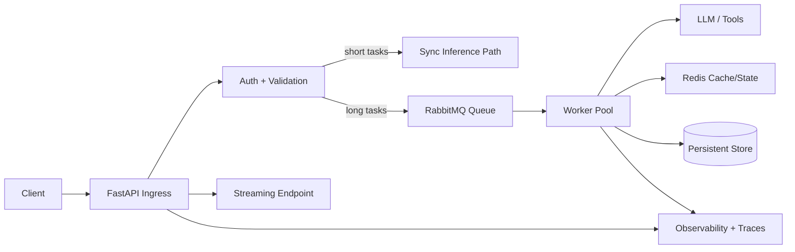
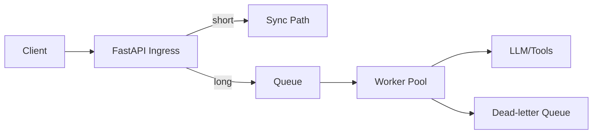

# Python FastAPI Async Backend for GenAI Systems

## Overview
This topic covers production backend architecture for GenAI services using Python, FastAPI, asyncio, Redis, RabbitMQ, and resilience patterns.

## Why this topic matters
Many architect interviews test whether you can build scalable, safe, and observable AI APIs beyond prompt logic. Strong backend design determines reliability, cost, and operational success.

## Core concepts
- FastAPI service architecture
- Async I/O with asyncio
- Request-response vs async job models
- Streaming response patterns
- Background workers with queues
- Redis caching and state patterns
- RabbitMQ messaging semantics
- Timeouts, retries, circuit breakers, idempotency

## Detailed explanation of each concept
GenAI backends should separate ingress API from long-running inference orchestration. FastAPI handles authentication, validation, and orchestration triggers, while workers process heavy LLM tasks asynchronously. Async I/O prevents thread blocking during upstream calls. Queue-worker patterns improve resilience under bursts and external model latency.

Redis supports caching, short-lived state, and rate-limiting primitives. RabbitMQ handles durable asynchronous workflows with retry and dead-letter controls. Reliability requires bounded retries, circuit breakers, timeout budgets, and idempotent execution paths.

## Evaluation (How to assess architecture quality)
- API p95/p99 latency under load
- Queue lag and worker success rate
- Timeout, retry, and fallback efficiency
- Cost per request and token spend alignment
- Error budget and incident frequency
- Security and compliance control coverage

## Architecture / flow diagram


**Flow explanation:**  
FastAPI ingests and validates requests. Quick tasks can run synchronously; long-running tasks are queued for worker processing. Redis supports cache/state, while observability spans API and workers for debugging and SLO tracking.

## Real-world example
An enterprise support assistant exposes FastAPI endpoints for chat and document analysis. Chat uses streaming responses for low latency. Large document summarization is queued to workers, which call LLM and retrieval services. Redis caches embeddings and intent results, while RabbitMQ ensures resilient async execution with DLQ.

## Best practices
- Keep API layer thin and asynchronous
- Offload long tasks to queue-worker architecture
- Use strict timeout budgets at each dependency
- Add idempotency keys for retried operations
- Instrument traces across API and worker boundaries
- Use structured error contracts and fallback behaviors

## Common mistakes / misconceptions
- Running heavy LLM calls directly in request thread always
- Mixing sync blocking calls inside async endpoints
- No queue for long-running tasks
- Unbounded retries without DLQ
- No backpressure or rate-limiting strategy

## Industry relevance
Python async GenAI backends are common in support copilots, workflow assistants, document automation, and AI-enabled internal platforms.

## Interview discussion points
- FastAPI production architecture patterns
- asyncio correctness and blocking pitfalls
- Redis vs RabbitMQ usage boundaries
- Retry/timeout/circuit-breaker trade-offs
- Async API + worker orchestration for GenAI

## Links to dependent / related topics
- [LLM Selection, Routing, and Fallback Architecture](./llm_selection_routing_fallback_architecture.md)
- [Guardrails, Security, Privacy, and Responsible AI](./guardrails_security_privacy_responsible_ai.md)
- [APIM, Messaging, Eventing](../integration/apim_messaging_eventing.md)
- [System Design HLD/LLD](../system-design/system_design_hld_lld.md)

## Interview Questions (50)
1. How do you design a production FastAPI backend for GenAI?
2. Why is async architecture important for LLM backends?
3. What is asyncio and how does it help API scalability?
4. What are common async pitfalls in FastAPI services?
5. How do you separate sync and async workloads in API design?
6. When should you use streaming responses in GenAI APIs?
7. How do you implement streaming safely with FastAPI?
8. REST vs JSON-RPC for GenAI APIs: how to decide?
9. How do you design endpoint contracts for long-running jobs?
10. How do you handle request validation for prompt payloads?
11. How do you enforce authentication/authorization in FastAPI?
12. How do you secure service-to-service calls in Python backends?
13. How do you use Redis in GenAI backend architecture?
14. Cache vs state in Redis: how to separate?
15. How do you design cache keys for LLM/RAG workloads?
16. How do you avoid stale cache causing wrong AI outputs?
17. Why use RabbitMQ in GenAI backend workflows?
18. RabbitMQ queue patterns for AI jobs?
19. How do you design dead-letter handling for failed AI tasks?
20. How do you implement retry policies for model/API failures?
21. How do you prevent retry storms in async workers?
22. How do you apply circuit breaker in Python services?
23. How do you set timeout budgets across dependencies?
24. How do you design idempotency for retried AI requests?
25. How do you implement background jobs in FastAPI correctly?
26. How do you design worker autoscaling strategy?
27. How do you handle backpressure in API + queue systems?
28. How do you design rate limiting for GenAI APIs?
29. How do you do concurrency control per tenant?
30. How do you protect backend from abusive prompt traffic?
31. How do you track token cost from backend layer?
32. How do you design structured error responses for clients?
33. How do you handle partial failures in multi-step AI jobs?
34. How do you implement fallback paths at backend level?
35. How do you design health probes for API and workers?
36. How do you instrument tracing in FastAPI and workers?
37. What logs/metrics matter most for GenAI backend ops?
38. How do you design API observability dashboards?
39. How do you test async correctness and race conditions?
40. How do you performance test GenAI APIs realistically?
41. How do you design CI/CD for FastAPI GenAI services?
42. How do you rollout breaking API changes safely?
43. How do you version prompts/config with backend releases?
44. How do you manage secrets in Python backend environments?
45. How do you design multi-region backend failover?
46. How do you manage connection pooling for upstream calls?
47. How do you design cost-aware request routing in backend?
48. What are anti-patterns in Python GenAI backend design?
49. How do you present backend architecture trade-offs in interviews?
50. How do you conclude a FastAPI GenAI system design answer strongly?

## Enhanced Answering Playbook (Crisp + Deep + Summary + Example)

Use this playbook for backend architecture answers:

- **Crisp answer:** Give direct service-split and resilience decision.
- **Deep explanation:** Explain async flow, backpressure, and failure handling.
- **Answer summary:** Close with scalability, reliability, and cost outcomes.
- **Practical example:** Map to API + queue + worker platform behavior.
- **Diagram thinking:** Show request path and async execution path.

### Worked Example: API-worker split for GenAI jobs
**Crisp answer:** Keep FastAPI as thin control plane and offload long AI tasks to worker queues for stable latency and resilient processing.

**Deep explanation:**  
Synchronous request paths are suitable for short operations like intent classification and quick retrieval responses. Long-running summarization or multi-tool operations should be queued so API latency SLOs remain protected. Workers apply timeout budgets, retries with jitter, and DLQ policies for terminal failures. Redis supports caching and short-lived workflow state, while observability traces link API request ID to worker execution IDs. This architecture scales independently by workload type and prevents head-of-line blocking.

**Answer summary:**  
- Decouple ingress from heavy execution for predictable latency.  
- Queue governance prevents retry storms and overload cascades.  
- Unified tracing makes failures diagnosable across tiers.



## Answers for important questions (Summary + Crisp + Deep)

### Q1. How do you design a production FastAPI backend for GenAI?
**Question summary:** Tests end-to-end backend architecture maturity for AI APIs.
**Crisp answer (7-8 lines):** Keep FastAPI ingress thin for auth, validation, and routing. Separate synchronous and asynchronous workload paths. Use queue-worker model for long-running inference tasks. Apply timeout, retry, and circuit-breaker controls per dependency. Use Redis for caching and short-lived state. Add structured observability across API and workers. Design for idempotency and safe retries from day one.
**Deep explanation (~60-70 lines):** For `How do you design a production FastAPI backend for GenAI?`, start by identifying where this decision sits in your FastAPI + worker backend control flow and what failure it prevents. A strong architecture answer should describe the request path end-to-end, not just define terms: ingress, authorization, orchestration, dependency calls, validation, and fallback. In this flow, deterministic steps must be explicit and testable, such as timeout budgets, idempotency checks, queue retries, DLQ routing. These are deterministic because policy and safety outcomes cannot depend on model creativity. Probabilistic steps are acceptable where approximation is useful, such as intent interpretation and adaptive response composition, but they still need guardrails and confidence thresholds. The key trade-off is control versus flexibility: stricter deterministic control improves safety and auditability, while probabilistic reasoning improves adaptability but increases variance in output quality. Design decisions should therefore include boundaries: which component can decide, which component must verify, and which component can block or escalate. Also explain operational behavior under stress: dependency timeout, partial failure, malformed tool output, stale context, and degraded external APIs. For each failure mode, define one mitigation path (retry with budget, route fallback, safe response, or human approval) so the system degrades safely instead of failing unpredictably. Security must be integrated into this answer: identity propagation, least-privilege access, and data boundary enforcement should happen before generation, not after. Finally, show how you will measure success in production with metrics like API p95, queue lag, retry success, error budget burn, unit cost/request, and mention rollout safety with canary + rollback criteria. This turns the answer from a definition into an operating architecture decision with clear risk, mitigation, and measurable outcomes.
**Answer summary:**
- **Decision:** Select the pattern that best satisfies `How do you design a production FastAPI backend for GenAI?` under your business and compliance constraints.
- **Risk:** Weak control boundaries and unclear ownership create quality, security, and reliability regressions at scale.
- **Mitigation:** Enforce policy gates, measurable SLO/SLA triggers, and tested fallback/recovery playbooks before full rollout.
**Practical example:** In a healthcare claims assistant, the team addresses 'How do you design a production FastAPI backend for GenAI?' by enforcing role-scoped access, validating each critical step through policy checks, and releasing changes with canary monitoring so quality and compliance remain stable under production traffic.
**Simple diagram:**  
```text
Client -> FastAPI -> Queue -> Workers -> LLM/Tools -> Result
```
**Trusted reference links:**  
- https://fastapi.tiangolo.com/  
- https://learn.microsoft.com/en-us/azure/architecture/patterns/queue-based-load-leveling

### Q2. Why is async architecture important for LLM backends?
**Question summary:** Performance and scalability reasoning.
**Crisp answer (7-8 lines):** LLM and retrieval calls are I/O-heavy and latency-variable. Async architecture prevents worker thread blocking. It allows better concurrency with fewer resources. It improves throughput under bursty traffic. It reduces timeout amplification across dependencies. It supports streaming and cancellation patterns better. It is essential for cost-efficient API scaling.
**Deep explanation (~60-70 lines):** For `Why is async architecture important for LLM backends?`, start by identifying where this decision sits in your FastAPI + worker backend control flow and what failure it prevents. A strong architecture answer should describe the request path end-to-end, not just define terms: ingress, authorization, orchestration, dependency calls, validation, and fallback. In this flow, deterministic steps must be explicit and testable, such as timeout budgets, idempotency checks, queue retries, DLQ routing. These are deterministic because policy and safety outcomes cannot depend on model creativity. Probabilistic steps are acceptable where approximation is useful, such as intent interpretation and adaptive response composition, but they still need guardrails and confidence thresholds. The key trade-off is control versus flexibility: stricter deterministic control improves safety and auditability, while probabilistic reasoning improves adaptability but increases variance in output quality. Design decisions should therefore include boundaries: which component can decide, which component must verify, and which component can block or escalate. Also explain operational behavior under stress: dependency timeout, partial failure, malformed tool output, stale context, and degraded external APIs. For each failure mode, define one mitigation path (retry with budget, route fallback, safe response, or human approval) so the system degrades safely instead of failing unpredictably. Security must be integrated into this answer: identity propagation, least-privilege access, and data boundary enforcement should happen before generation, not after. Finally, show how you will measure success in production with metrics like API p95, queue lag, retry success, error budget burn, unit cost/request, and mention rollout safety with canary + rollback criteria. This turns the answer from a definition into an operating architecture decision with clear risk, mitigation, and measurable outcomes.
**Answer summary:**
- **Decision:** Select the pattern that best satisfies `Why is async architecture important for LLM backends?` under your business and compliance constraints.
- **Risk:** Weak control boundaries and unclear ownership create quality, security, and reliability regressions at scale.
- **Mitigation:** Enforce policy gates, measurable SLO/SLA triggers, and tested fallback/recovery playbooks before full rollout.
**Practical example:** In a insurance underwriting knowledge bot, the team addresses 'Why is async architecture important for LLM backends?' by enforcing role-scoped access, validating each critical step through policy checks, and releasing changes with canary monitoring so quality and compliance remain stable under production traffic.
**Simple diagram:**  
```text
Blocking Calls -> Low Concurrency
Async Calls -> Higher Concurrency
```
**Trusted reference links:**  
- https://docs.python.org/3/library/asyncio.html

### Q3. What is asyncio and how does it help API scalability?
**Question summary:** Core Python async fundamentals.
**Crisp answer (7-8 lines):** asyncio is Python’s asynchronous I/O framework using an event loop. It schedules coroutines cooperatively. It enables concurrent waiting on many I/O tasks. It reduces idle thread blocking overhead. It fits network-bound LLM and retrieval workflows. It supports timeout and cancellation controls. It improves scalability when used with non-blocking libraries.
**Deep explanation (~60-70 lines):** For `What is asyncio and how does it help API scalability?`, start by identifying where this decision sits in your FastAPI + worker backend control flow and what failure it prevents. A strong architecture answer should describe the request path end-to-end, not just define terms: ingress, authorization, orchestration, dependency calls, validation, and fallback. In this flow, deterministic steps must be explicit and testable, such as timeout budgets, idempotency checks, queue retries, DLQ routing. These are deterministic because policy and safety outcomes cannot depend on model creativity. Probabilistic steps are acceptable where approximation is useful, such as intent interpretation and adaptive response composition, but they still need guardrails and confidence thresholds. The key trade-off is control versus flexibility: stricter deterministic control improves safety and auditability, while probabilistic reasoning improves adaptability but increases variance in output quality. Design decisions should therefore include boundaries: which component can decide, which component must verify, and which component can block or escalate. Also explain operational behavior under stress: dependency timeout, partial failure, malformed tool output, stale context, and degraded external APIs. For each failure mode, define one mitigation path (retry with budget, route fallback, safe response, or human approval) so the system degrades safely instead of failing unpredictably. Security must be integrated into this answer: identity propagation, least-privilege access, and data boundary enforcement should happen before generation, not after. Finally, show how you will measure success in production with metrics like API p95, queue lag, retry success, error budget burn, unit cost/request, and mention rollout safety with canary + rollback criteria. This turns the answer from a definition into an operating architecture decision with clear risk, mitigation, and measurable outcomes.
**Answer summary:**
- **Decision:** Select the pattern that best satisfies `What is asyncio and how does it help API scalability?` under your business and compliance constraints.
- **Risk:** Weak control boundaries and unclear ownership create quality, security, and reliability regressions at scale.
- **Mitigation:** Enforce policy gates, measurable SLO/SLA triggers, and tested fallback/recovery playbooks before full rollout.
**Practical example:** In a enterprise IT support assistant, the team addresses 'What is asyncio and how does it help API scalability?' by enforcing role-scoped access, validating each critical step through policy checks, and releasing changes with canary monitoring so quality and compliance remain stable under production traffic.
**Simple diagram:**  
```text
Event Loop -> Coroutine A/B/C -> Non-blocking I/O
```
**Trusted reference links:**  
- https://docs.python.org/3/library/asyncio.html

### Q4. What are common async pitfalls in FastAPI services?
**Question summary:** Practical production pitfalls.
**Crisp answer (7-8 lines):** Calling blocking libraries inside async routes. Using synchronous DB/HTTP clients in hot paths. Unbounded task creation causing resource exhaustion. Missing timeout and cancellation handling. Shared mutable state race issues. Ignoring backpressure under queue growth. No load testing for event-loop saturation.
**Deep explanation (~60-70 lines):** For `What are common async pitfalls in FastAPI services?`, start by identifying where this decision sits in your FastAPI + worker backend control flow and what failure it prevents. A strong architecture answer should describe the request path end-to-end, not just define terms: ingress, authorization, orchestration, dependency calls, validation, and fallback. In this flow, deterministic steps must be explicit and testable, such as timeout budgets, idempotency checks, queue retries, DLQ routing. These are deterministic because policy and safety outcomes cannot depend on model creativity. Probabilistic steps are acceptable where approximation is useful, such as intent interpretation and adaptive response composition, but they still need guardrails and confidence thresholds. The key trade-off is control versus flexibility: stricter deterministic control improves safety and auditability, while probabilistic reasoning improves adaptability but increases variance in output quality. Design decisions should therefore include boundaries: which component can decide, which component must verify, and which component can block or escalate. Also explain operational behavior under stress: dependency timeout, partial failure, malformed tool output, stale context, and degraded external APIs. For each failure mode, define one mitigation path (retry with budget, route fallback, safe response, or human approval) so the system degrades safely instead of failing unpredictably. Security must be integrated into this answer: identity propagation, least-privilege access, and data boundary enforcement should happen before generation, not after. Finally, show how you will measure success in production with metrics like API p95, queue lag, retry success, error budget burn, unit cost/request, and mention rollout safety with canary + rollback criteria. This turns the answer from a definition into an operating architecture decision with clear risk, mitigation, and measurable outcomes.
**Answer summary:**
- **Decision:** Select the pattern that best satisfies `What are common async pitfalls in FastAPI services?` under your business and compliance constraints.
- **Risk:** Weak control boundaries and unclear ownership create quality, security, and reliability regressions at scale.
- **Mitigation:** Enforce policy gates, measurable SLO/SLA triggers, and tested fallback/recovery playbooks before full rollout.
**Practical example:** In a procurement contract Q&A assistant, the team addresses 'What are common async pitfalls in FastAPI services?' by enforcing role-scoped access, validating each critical step through policy checks, and releasing changes with canary monitoring so quality and compliance remain stable under production traffic.
**Simple diagram:**  
```text
Async Route + Blocking Call -> Event Loop Stall
```
**Trusted reference links:**  
- https://fastapi.tiangolo.com/async/

### Q5. How do you separate sync and async workloads in API design?
**Question summary:** Workload partitioning strategy.
**Crisp answer (7-8 lines):** Keep low-latency tasks in synchronous request path. Queue long-running or high-variance tasks asynchronously. Return job IDs for deferred processing endpoints. Expose status and callback options for async jobs. Apply different SLOs for sync vs async APIs. Scale API and worker tiers independently. Keep contracts explicit for each mode.
**Deep explanation (~60-70 lines):** For `How do you separate sync and async workloads in API design?`, start by identifying where this decision sits in your FastAPI + worker backend control flow and what failure it prevents. A strong architecture answer should describe the request path end-to-end, not just define terms: ingress, authorization, orchestration, dependency calls, validation, and fallback. In this flow, deterministic steps must be explicit and testable, such as timeout budgets, idempotency checks, queue retries, DLQ routing. These are deterministic because policy and safety outcomes cannot depend on model creativity. Probabilistic steps are acceptable where approximation is useful, such as intent interpretation and adaptive response composition, but they still need guardrails and confidence thresholds. The key trade-off is control versus flexibility: stricter deterministic control improves safety and auditability, while probabilistic reasoning improves adaptability but increases variance in output quality. Design decisions should therefore include boundaries: which component can decide, which component must verify, and which component can block or escalate. Also explain operational behavior under stress: dependency timeout, partial failure, malformed tool output, stale context, and degraded external APIs. For each failure mode, define one mitigation path (retry with budget, route fallback, safe response, or human approval) so the system degrades safely instead of failing unpredictably. Security must be integrated into this answer: identity propagation, least-privilege access, and data boundary enforcement should happen before generation, not after. Finally, show how you will measure success in production with metrics like API p95, queue lag, retry success, error budget burn, unit cost/request, and mention rollout safety with canary + rollback criteria. This turns the answer from a definition into an operating architecture decision with clear risk, mitigation, and measurable outcomes.
**Answer summary:**
- **Decision:** Select the pattern that best satisfies `How do you separate sync and async workloads in API design?` under your business and compliance constraints.
- **Risk:** Weak control boundaries and unclear ownership create quality, security, and reliability regressions at scale.
- **Mitigation:** Enforce policy gates, measurable SLO/SLA triggers, and tested fallback/recovery playbooks before full rollout.
**Practical example:** In a internal audit/compliance copilot, the team addresses 'How do you separate sync and async workloads in API design?' by enforcing role-scoped access, validating each critical step through policy checks, and releasing changes with canary monitoring so quality and compliance remain stable under production traffic.
**Simple diagram:**  
```text
Fast Path -> Immediate Response
Long Path -> Queue -> Job Status
```
**Trusted reference links:**  
- https://learn.microsoft.com/en-us/azure/architecture/patterns/competing-consumers

### Q6. When should you use streaming responses in GenAI APIs?
**Question summary:** UX and latency trade-off.
**Crisp answer (7-8 lines):** Use streaming when perceived latency matters. Useful for chat and long generation responses. It improves user feedback and responsiveness. Avoid streaming for strict transactional outputs needing full validation first. Ensure moderation strategy supports streamed chunks. Handle cancellation and reconnect scenarios. Track stream quality metrics.
**Deep explanation (~60-70 lines):** For `When should you use streaming responses in GenAI APIs?`, start by identifying where this decision sits in your FastAPI + worker backend control flow and what failure it prevents. A strong architecture answer should describe the request path end-to-end, not just define terms: ingress, authorization, orchestration, dependency calls, validation, and fallback. In this flow, deterministic steps must be explicit and testable, such as timeout budgets, idempotency checks, queue retries, DLQ routing. These are deterministic because policy and safety outcomes cannot depend on model creativity. Probabilistic steps are acceptable where approximation is useful, such as intent interpretation and adaptive response composition, but they still need guardrails and confidence thresholds. The key trade-off is control versus flexibility: stricter deterministic control improves safety and auditability, while probabilistic reasoning improves adaptability but increases variance in output quality. Design decisions should therefore include boundaries: which component can decide, which component must verify, and which component can block or escalate. Also explain operational behavior under stress: dependency timeout, partial failure, malformed tool output, stale context, and degraded external APIs. For each failure mode, define one mitigation path (retry with budget, route fallback, safe response, or human approval) so the system degrades safely instead of failing unpredictably. Security must be integrated into this answer: identity propagation, least-privilege access, and data boundary enforcement should happen before generation, not after. Finally, show how you will measure success in production with metrics like API p95, queue lag, retry success, error budget burn, unit cost/request, and mention rollout safety with canary + rollback criteria. This turns the answer from a definition into an operating architecture decision with clear risk, mitigation, and measurable outcomes.
**Answer summary:**
- **Decision:** Select the pattern that best satisfies `When should you use streaming responses in GenAI APIs?` under your business and compliance constraints.
- **Risk:** Weak control boundaries and unclear ownership create quality, security, and reliability regressions at scale.
- **Mitigation:** Enforce policy gates, measurable SLO/SLA triggers, and tested fallback/recovery playbooks before full rollout.
**Practical example:** In a customer support triage assistant, the team addresses 'When should you use streaming responses in GenAI APIs?' by enforcing role-scoped access, validating each critical step through policy checks, and releasing changes with canary monitoring so quality and compliance remain stable under production traffic.
**Simple diagram:**  
```text
Generate Tokens -> Stream Chunks -> Client Render
```
**Trusted reference links:**  
- https://fastapi.tiangolo.com/advanced/custom-response/

### Q7. How do you implement streaming safely with FastAPI?
**Question summary:** Safe streaming architecture.
**Crisp answer (7-8 lines):** Use async generators with bounded chunk sizes. Validate/guard chunks before emission where required. Enforce timeout and cancellation handling. Include heartbeat/keepalive for long streams. Avoid leaking internal errors in stream output. Log stream lifecycle events for diagnostics. Provide fallback to non-stream mode if needed.
**Deep explanation (~60-70 lines):** For `How do you implement streaming safely with FastAPI?`, start by identifying where this decision sits in your FastAPI + worker backend control flow and what failure it prevents. A strong architecture answer should describe the request path end-to-end, not just define terms: ingress, authorization, orchestration, dependency calls, validation, and fallback. In this flow, deterministic steps must be explicit and testable, such as timeout budgets, idempotency checks, queue retries, DLQ routing. These are deterministic because policy and safety outcomes cannot depend on model creativity. Probabilistic steps are acceptable where approximation is useful, such as intent interpretation and adaptive response composition, but they still need guardrails and confidence thresholds. The key trade-off is control versus flexibility: stricter deterministic control improves safety and auditability, while probabilistic reasoning improves adaptability but increases variance in output quality. Design decisions should therefore include boundaries: which component can decide, which component must verify, and which component can block or escalate. Also explain operational behavior under stress: dependency timeout, partial failure, malformed tool output, stale context, and degraded external APIs. For each failure mode, define one mitigation path (retry with budget, route fallback, safe response, or human approval) so the system degrades safely instead of failing unpredictably. Security must be integrated into this answer: identity propagation, least-privilege access, and data boundary enforcement should happen before generation, not after. Finally, show how you will measure success in production with metrics like API p95, queue lag, retry success, error budget burn, unit cost/request, and mention rollout safety with canary + rollback criteria. This turns the answer from a definition into an operating architecture decision with clear risk, mitigation, and measurable outcomes.
**Answer summary:**
- **Decision:** Select the pattern that best satisfies `How do you implement streaming safely with FastAPI?` under your business and compliance constraints.
- **Risk:** Weak control boundaries and unclear ownership create quality, security, and reliability regressions at scale.
- **Mitigation:** Enforce policy gates, measurable SLO/SLA triggers, and tested fallback/recovery playbooks before full rollout.
**Practical example:** In a operations incident copilot, the team addresses 'How do you implement streaming safely with FastAPI?' by enforcing role-scoped access, validating each critical step through policy checks, and releasing changes with canary monitoring so quality and compliance remain stable under production traffic.
**Simple diagram:**  
```text
Async Generator -> Guardrail Check -> Stream to Client
```
**Trusted reference links:**  
- https://fastapi.tiangolo.com/advanced/custom-response/

### Q8. REST vs JSON-RPC for GenAI APIs: how to decide?
**Question summary:** API protocol decision.
**Crisp answer (7-8 lines):** Use REST for resource-oriented and broad ecosystem compatibility. Use JSON-RPC for action-oriented command workflows with strict procedure semantics. REST works well for public/integration APIs. JSON-RPC can simplify internal tool execution contracts. Choose based on client ecosystem and governance standards. Keep consistency across platform. Avoid protocol sprawl without strong reason.
**Deep explanation (~60-70 lines):** For `REST vs JSON-RPC for GenAI APIs: how to decide?`, start by identifying where this decision sits in your FastAPI + worker backend control flow and what failure it prevents. A strong architecture answer should describe the request path end-to-end, not just define terms: ingress, authorization, orchestration, dependency calls, validation, and fallback. In this flow, deterministic steps must be explicit and testable, such as timeout budgets, idempotency checks, queue retries, DLQ routing. These are deterministic because policy and safety outcomes cannot depend on model creativity. Probabilistic steps are acceptable where approximation is useful, such as intent interpretation and adaptive response composition, but they still need guardrails and confidence thresholds. The key trade-off is control versus flexibility: stricter deterministic control improves safety and auditability, while probabilistic reasoning improves adaptability but increases variance in output quality. Design decisions should therefore include boundaries: which component can decide, which component must verify, and which component can block or escalate. Also explain operational behavior under stress: dependency timeout, partial failure, malformed tool output, stale context, and degraded external APIs. For each failure mode, define one mitigation path (retry with budget, route fallback, safe response, or human approval) so the system degrades safely instead of failing unpredictably. Security must be integrated into this answer: identity propagation, least-privilege access, and data boundary enforcement should happen before generation, not after. Finally, show how you will measure success in production with metrics like API p95, queue lag, retry success, error budget burn, unit cost/request, and mention rollout safety with canary + rollback criteria. This turns the answer from a definition into an operating architecture decision with clear risk, mitigation, and measurable outcomes.
**Answer summary:**
- **Decision:** Select the pattern that best satisfies `REST vs JSON-RPC for GenAI APIs: how to decide?` under your business and compliance constraints.
- **Risk:** Weak control boundaries and unclear ownership create quality, security, and reliability regressions at scale.
- **Mitigation:** Enforce policy gates, measurable SLO/SLA triggers, and tested fallback/recovery playbooks before full rollout.
**Practical example:** In a banking policy copilot, the team addresses 'REST vs JSON-RPC for GenAI APIs: how to decide?' by enforcing role-scoped access, validating each critical step through policy checks, and releasing changes with canary monitoring so quality and compliance remain stable under production traffic.
**Simple diagram:**  
```text
REST: /resources
JSON-RPC: method(params)
```
**Trusted reference links:**  
- https://learn.microsoft.com/en-us/azure/architecture/best-practices/api-design

### Q9. How do you design endpoint contracts for long-running jobs?
**Question summary:** Async API contract design.
**Crisp answer (7-8 lines):** Accept request and return 202 with job ID. Provide status endpoint with standardized states. Include estimated progress and failure reason fields. Support webhook callback for completion events. Keep idempotency key for duplicate submit protection. Include result retrieval endpoint with retention policy. Version job contract changes carefully.
**Deep explanation (~60-70 lines):** For `How do you design endpoint contracts for long-running jobs?`, start by identifying where this decision sits in your FastAPI + worker backend control flow and what failure it prevents. A strong architecture answer should describe the request path end-to-end, not just define terms: ingress, authorization, orchestration, dependency calls, validation, and fallback. In this flow, deterministic steps must be explicit and testable, such as timeout budgets, idempotency checks, queue retries, DLQ routing. These are deterministic because policy and safety outcomes cannot depend on model creativity. Probabilistic steps are acceptable where approximation is useful, such as intent interpretation and adaptive response composition, but they still need guardrails and confidence thresholds. The key trade-off is control versus flexibility: stricter deterministic control improves safety and auditability, while probabilistic reasoning improves adaptability but increases variance in output quality. Design decisions should therefore include boundaries: which component can decide, which component must verify, and which component can block or escalate. Also explain operational behavior under stress: dependency timeout, partial failure, malformed tool output, stale context, and degraded external APIs. For each failure mode, define one mitigation path (retry with budget, route fallback, safe response, or human approval) so the system degrades safely instead of failing unpredictably. Security must be integrated into this answer: identity propagation, least-privilege access, and data boundary enforcement should happen before generation, not after. Finally, show how you will measure success in production with metrics like API p95, queue lag, retry success, error budget burn, unit cost/request, and mention rollout safety with canary + rollback criteria. This turns the answer from a definition into an operating architecture decision with clear risk, mitigation, and measurable outcomes.
**Answer summary:**
- **Decision:** Select the pattern that best satisfies `How do you design endpoint contracts for long-running jobs?` under your business and compliance constraints.
- **Risk:** Weak control boundaries and unclear ownership create quality, security, and reliability regressions at scale.
- **Mitigation:** Enforce policy gates, measurable SLO/SLA triggers, and tested fallback/recovery playbooks before full rollout.
**Practical example:** In a healthcare claims assistant, the team addresses 'How do you design endpoint contracts for long-running jobs?' by enforcing role-scoped access, validating each critical step through policy checks, and releasing changes with canary monitoring so quality and compliance remain stable under production traffic.
**Simple diagram:**  
```text
POST /jobs -> 202 + job_id -> GET /jobs/{id}
```
**Trusted reference links:**  
- https://learn.microsoft.com/en-us/azure/architecture/patterns/async-request-reply

### Q10. How do you handle request validation for prompt payloads?
**Question summary:** Input quality and safety.
**Crisp answer (7-8 lines):** Use strict schema models for request payloads. Enforce max lengths and field constraints. Validate allowed intent/task enums. Reject unsafe or malformed payloads early. Apply PII and abuse checks before processing. Normalize input format consistently. Return structured validation errors.
**Deep explanation (~60-70 lines):** For `How do you handle request validation for prompt payloads?`, start by identifying where this decision sits in your FastAPI + worker backend control flow and what failure it prevents. A strong architecture answer should describe the request path end-to-end, not just define terms: ingress, authorization, orchestration, dependency calls, validation, and fallback. In this flow, deterministic steps must be explicit and testable, such as timeout budgets, idempotency checks, queue retries, DLQ routing. These are deterministic because policy and safety outcomes cannot depend on model creativity. Probabilistic steps are acceptable where approximation is useful, such as intent interpretation and adaptive response composition, but they still need guardrails and confidence thresholds. The key trade-off is control versus flexibility: stricter deterministic control improves safety and auditability, while probabilistic reasoning improves adaptability but increases variance in output quality. Design decisions should therefore include boundaries: which component can decide, which component must verify, and which component can block or escalate. Also explain operational behavior under stress: dependency timeout, partial failure, malformed tool output, stale context, and degraded external APIs. For each failure mode, define one mitigation path (retry with budget, route fallback, safe response, or human approval) so the system degrades safely instead of failing unpredictably. Security must be integrated into this answer: identity propagation, least-privilege access, and data boundary enforcement should happen before generation, not after. Finally, show how you will measure success in production with metrics like API p95, queue lag, retry success, error budget burn, unit cost/request, and mention rollout safety with canary + rollback criteria. This turns the answer from a definition into an operating architecture decision with clear risk, mitigation, and measurable outcomes.
**Answer summary:**
- **Decision:** Select the pattern that best satisfies `How do you handle request validation for prompt payloads?` under your business and compliance constraints.
- **Risk:** Weak control boundaries and unclear ownership create quality, security, and reliability regressions at scale.
- **Mitigation:** Enforce policy gates, measurable SLO/SLA triggers, and tested fallback/recovery playbooks before full rollout.
**Practical example:** In a insurance underwriting knowledge bot, the team addresses 'How do you handle request validation for prompt payloads?' by enforcing role-scoped access, validating each critical step through policy checks, and releasing changes with canary monitoring so quality and compliance remain stable under production traffic.
**Simple diagram:**  
```text
Request -> Schema/Policy Validate -> Accept/Reject
```
**Trusted reference links:**  
- https://fastapi.tiangolo.com/tutorial/body/

### Q11. How do you enforce authentication/authorization in FastAPI?
**Question summary:** API security baseline.
**Crisp answer (7-8 lines):** Validate JWT/OAuth tokens at ingress. Map claims to role/tenant policies. Enforce route-level and action-level authorization. Propagate identity context to workers safely. Deny by default when claims are missing. Audit auth decisions with correlation IDs. Rotate signing keys and trust configs.
**Deep explanation (~60-70 lines):** For `How do you enforce authentication/authorization in FastAPI?`, start by identifying where this decision sits in your FastAPI + worker backend control flow and what failure it prevents. A strong architecture answer should describe the request path end-to-end, not just define terms: ingress, authorization, orchestration, dependency calls, validation, and fallback. In this flow, deterministic steps must be explicit and testable, such as timeout budgets, idempotency checks, queue retries, DLQ routing. These are deterministic because policy and safety outcomes cannot depend on model creativity. Probabilistic steps are acceptable where approximation is useful, such as intent interpretation and adaptive response composition, but they still need guardrails and confidence thresholds. The key trade-off is control versus flexibility: stricter deterministic control improves safety and auditability, while probabilistic reasoning improves adaptability but increases variance in output quality. Design decisions should therefore include boundaries: which component can decide, which component must verify, and which component can block or escalate. Also explain operational behavior under stress: dependency timeout, partial failure, malformed tool output, stale context, and degraded external APIs. For each failure mode, define one mitigation path (retry with budget, route fallback, safe response, or human approval) so the system degrades safely instead of failing unpredictably. Security must be integrated into this answer: identity propagation, least-privilege access, and data boundary enforcement should happen before generation, not after. Finally, show how you will measure success in production with metrics like API p95, queue lag, retry success, error budget burn, unit cost/request, and mention rollout safety with canary + rollback criteria. This turns the answer from a definition into an operating architecture decision with clear risk, mitigation, and measurable outcomes.
**Answer summary:**
- **Decision:** Select the pattern that best satisfies `How do you enforce authentication/authorization in FastAPI?` under your business and compliance constraints.
- **Risk:** Weak control boundaries and unclear ownership create quality, security, and reliability regressions at scale.
- **Mitigation:** Enforce policy gates, measurable SLO/SLA triggers, and tested fallback/recovery playbooks before full rollout.
**Practical example:** In a enterprise IT support assistant, the team addresses 'How do you enforce authentication/authorization in FastAPI?' by enforcing role-scoped access, validating each critical step through policy checks, and releasing changes with canary monitoring so quality and compliance remain stable under production traffic.
**Simple diagram:**  
```text
Token Validate -> Claims Policy -> Allowed Route/Action
```
**Trusted reference links:**  
- https://fastapi.tiangolo.com/tutorial/security/

### Q12. How do you secure service-to-service calls in Python backends?
**Question summary:** Internal communication security.
**Crisp answer (7-8 lines):** Use workload identity or mTLS for service auth. Avoid shared static secrets. Scope tokens to least privilege. Use private networking and egress controls. Validate downstream certificates and audience claims. Log service auth failures and anomalies. Rotate credentials automatically.
**Deep explanation (~60-70 lines):** For `How do you secure service-to-service calls in Python backends?`, start by identifying where this decision sits in your FastAPI + worker backend control flow and what failure it prevents. A strong architecture answer should describe the request path end-to-end, not just define terms: ingress, authorization, orchestration, dependency calls, validation, and fallback. In this flow, deterministic steps must be explicit and testable, such as timeout budgets, idempotency checks, queue retries, DLQ routing. These are deterministic because policy and safety outcomes cannot depend on model creativity. Probabilistic steps are acceptable where approximation is useful, such as intent interpretation and adaptive response composition, but they still need guardrails and confidence thresholds. The key trade-off is control versus flexibility: stricter deterministic control improves safety and auditability, while probabilistic reasoning improves adaptability but increases variance in output quality. Design decisions should therefore include boundaries: which component can decide, which component must verify, and which component can block or escalate. Also explain operational behavior under stress: dependency timeout, partial failure, malformed tool output, stale context, and degraded external APIs. For each failure mode, define one mitigation path (retry with budget, route fallback, safe response, or human approval) so the system degrades safely instead of failing unpredictably. Security must be integrated into this answer: identity propagation, least-privilege access, and data boundary enforcement should happen before generation, not after. Finally, show how you will measure success in production with metrics like API p95, queue lag, retry success, error budget burn, unit cost/request, and mention rollout safety with canary + rollback criteria. This turns the answer from a definition into an operating architecture decision with clear risk, mitigation, and measurable outcomes.
**Answer summary:**
- **Decision:** Select the pattern that best satisfies `How do you secure service-to-service calls in Python backends?` under your business and compliance constraints.
- **Risk:** Weak control boundaries and unclear ownership create quality, security, and reliability regressions at scale.
- **Mitigation:** Enforce policy gates, measurable SLO/SLA triggers, and tested fallback/recovery playbooks before full rollout.
**Practical example:** In a procurement contract Q&A assistant, the team addresses 'How do you secure service-to-service calls in Python backends?' by enforcing role-scoped access, validating each critical step through policy checks, and releasing changes with canary monitoring so quality and compliance remain stable under production traffic.
**Simple diagram:**  
```text
Service A Identity -> Service B AuthZ -> Allowed Call
```
**Trusted reference links:**  
- https://learn.microsoft.com/en-us/security/zero-trust/

### Q13. How do you use Redis in GenAI backend architecture?
**Question summary:** Redis role clarity.
**Crisp answer (7-8 lines):** Use Redis for low-latency cache of frequent lookups. Store short-lived session/context state where appropriate. Use it for rate limiting counters and request throttling. Keep TTL-based invalidation policies. Avoid using Redis as permanent system of record. Monitor eviction and memory pressure. Segment keys by tenant and environment.
**Deep explanation (~60-70 lines):** For `How do you use Redis in GenAI backend architecture?`, start by identifying where this decision sits in your FastAPI + worker backend control flow and what failure it prevents. A strong architecture answer should describe the request path end-to-end, not just define terms: ingress, authorization, orchestration, dependency calls, validation, and fallback. In this flow, deterministic steps must be explicit and testable, such as timeout budgets, idempotency checks, queue retries, DLQ routing. These are deterministic because policy and safety outcomes cannot depend on model creativity. Probabilistic steps are acceptable where approximation is useful, such as intent interpretation and adaptive response composition, but they still need guardrails and confidence thresholds. The key trade-off is control versus flexibility: stricter deterministic control improves safety and auditability, while probabilistic reasoning improves adaptability but increases variance in output quality. Design decisions should therefore include boundaries: which component can decide, which component must verify, and which component can block or escalate. Also explain operational behavior under stress: dependency timeout, partial failure, malformed tool output, stale context, and degraded external APIs. For each failure mode, define one mitigation path (retry with budget, route fallback, safe response, or human approval) so the system degrades safely instead of failing unpredictably. Security must be integrated into this answer: identity propagation, least-privilege access, and data boundary enforcement should happen before generation, not after. Finally, show how you will measure success in production with metrics like API p95, queue lag, retry success, error budget burn, unit cost/request, and mention rollout safety with canary + rollback criteria. This turns the answer from a definition into an operating architecture decision with clear risk, mitigation, and measurable outcomes.
**Answer summary:**
- **Decision:** Select the pattern that best satisfies `How do you use Redis in GenAI backend architecture?` under your business and compliance constraints.
- **Risk:** Weak control boundaries and unclear ownership create quality, security, and reliability regressions at scale.
- **Mitigation:** Enforce policy gates, measurable SLO/SLA triggers, and tested fallback/recovery playbooks before full rollout.
**Practical example:** In a internal audit/compliance copilot, the team addresses 'How do you use Redis in GenAI backend architecture?' by enforcing role-scoped access, validating each critical step through policy checks, and releasing changes with canary monitoring so quality and compliance remain stable under production traffic.
**Simple diagram:**  
```text
API/Worker -> Redis (cache/state/counters)
```
**Trusted reference links:**  
- https://redis.io/docs/

### Q14. Cache vs state in Redis: how to separate?
**Question summary:** Data lifecycle design.
**Crisp answer (7-8 lines):** Use separate key namespaces and TTL policies. Cache stores recomputable data for performance. State stores workflow/session context required for continuity. Apply stricter consistency rules for state keys. Keep eviction strategy safer for state data. Monitor hit/miss separately from state durability metrics. Document ownership per key domain.
**Deep explanation (~60-70 lines):** For `Cache vs state in Redis: how to separate?`, start by identifying where this decision sits in your FastAPI + worker backend control flow and what failure it prevents. A strong architecture answer should describe the request path end-to-end, not just define terms: ingress, authorization, orchestration, dependency calls, validation, and fallback. In this flow, deterministic steps must be explicit and testable, such as timeout budgets, idempotency checks, queue retries, DLQ routing. These are deterministic because policy and safety outcomes cannot depend on model creativity. Probabilistic steps are acceptable where approximation is useful, such as intent interpretation and adaptive response composition, but they still need guardrails and confidence thresholds. The key trade-off is control versus flexibility: stricter deterministic control improves safety and auditability, while probabilistic reasoning improves adaptability but increases variance in output quality. Design decisions should therefore include boundaries: which component can decide, which component must verify, and which component can block or escalate. Also explain operational behavior under stress: dependency timeout, partial failure, malformed tool output, stale context, and degraded external APIs. For each failure mode, define one mitigation path (retry with budget, route fallback, safe response, or human approval) so the system degrades safely instead of failing unpredictably. Security must be integrated into this answer: identity propagation, least-privilege access, and data boundary enforcement should happen before generation, not after. Finally, show how you will measure success in production with metrics like API p95, queue lag, retry success, error budget burn, unit cost/request, and mention rollout safety with canary + rollback criteria. This turns the answer from a definition into an operating architecture decision with clear risk, mitigation, and measurable outcomes.
**Answer summary:**
- **Decision:** Select the pattern that best satisfies `Cache vs state in Redis: how to separate?` under your business and compliance constraints.
- **Risk:** Weak control boundaries and unclear ownership create quality, security, and reliability regressions at scale.
- **Mitigation:** Enforce policy gates, measurable SLO/SLA triggers, and tested fallback/recovery playbooks before full rollout.
**Practical example:** In a customer support triage assistant, the team addresses 'Cache vs state in Redis: how to separate?' by enforcing role-scoped access, validating each critical step through policy checks, and releasing changes with canary monitoring so quality and compliance remain stable under production traffic.
**Simple diagram:**  
```text
redis:cache:*  vs  redis:state:*
```
**Trusted reference links:**  
- https://redis.io/docs/latest/develop/use/keyspace/

### Q15. How do you design cache keys for LLM/RAG workloads?
**Question summary:** Cache correctness and reuse.
**Crisp answer (7-8 lines):** Include normalized query hash and context version. Include tenant and role where access affects output. Include model/prompt version to avoid stale mismatch. Use short TTL for dynamic data. Add explicit invalidation on source updates. Avoid over-broad keys that leak results. Track hit quality and stale responses.
**Deep explanation (~60-70 lines):** For `How do you design cache keys for LLM/RAG workloads?`, start by identifying where this decision sits in your FastAPI + worker backend control flow and what failure it prevents. A strong architecture answer should describe the request path end-to-end, not just define terms: ingress, authorization, orchestration, dependency calls, validation, and fallback. In this flow, deterministic steps must be explicit and testable, such as timeout budgets, idempotency checks, queue retries, DLQ routing. These are deterministic because policy and safety outcomes cannot depend on model creativity. Probabilistic steps are acceptable where approximation is useful, such as intent interpretation and adaptive response composition, but they still need guardrails and confidence thresholds. The key trade-off is control versus flexibility: stricter deterministic control improves safety and auditability, while probabilistic reasoning improves adaptability but increases variance in output quality. Design decisions should therefore include boundaries: which component can decide, which component must verify, and which component can block or escalate. Also explain operational behavior under stress: dependency timeout, partial failure, malformed tool output, stale context, and degraded external APIs. For each failure mode, define one mitigation path (retry with budget, route fallback, safe response, or human approval) so the system degrades safely instead of failing unpredictably. Security must be integrated into this answer: identity propagation, least-privilege access, and data boundary enforcement should happen before generation, not after. Finally, show how you will measure success in production with metrics like API p95, queue lag, retry success, error budget burn, unit cost/request, and mention rollout safety with canary + rollback criteria. This turns the answer from a definition into an operating architecture decision with clear risk, mitigation, and measurable outcomes.
**Answer summary:**
- **Decision:** Select the pattern that best satisfies `How do you design cache keys for LLM/RAG workloads?` under your business and compliance constraints.
- **Risk:** Weak control boundaries and unclear ownership create quality, security, and reliability regressions at scale.
- **Mitigation:** Enforce policy gates, measurable SLO/SLA triggers, and tested fallback/recovery playbooks before full rollout.
**Practical example:** In a operations incident copilot, the team addresses 'How do you design cache keys for LLM/RAG workloads?' by enforcing role-scoped access, validating each critical step through policy checks, and releasing changes with canary monitoring so quality and compliance remain stable under production traffic.
**Simple diagram:**  
```text
key = tenant|role|query_hash|model_v|context_v
```
**Trusted reference links:**  
- https://learn.microsoft.com/en-us/azure/architecture/best-practices/caching

### Q16. How do you avoid stale cache causing wrong AI outputs?
**Question summary:** Freshness vs performance.
**Crisp answer (7-8 lines):** Use TTL plus event-driven invalidation. Tie cache entries to source/index version IDs. Invalidate on critical data changes immediately. Prefer shorter TTL for high-risk intents. Add freshness metadata in responses for observability. Fall back to live retrieval on low confidence. Monitor stale-hit incidents and tune.
**Deep explanation (~60-70 lines):** For `How do you avoid stale cache causing wrong AI outputs?`, start by identifying where this decision sits in your FastAPI + worker backend control flow and what failure it prevents. A strong architecture answer should describe the request path end-to-end, not just define terms: ingress, authorization, orchestration, dependency calls, validation, and fallback. In this flow, deterministic steps must be explicit and testable, such as timeout budgets, idempotency checks, queue retries, DLQ routing. These are deterministic because policy and safety outcomes cannot depend on model creativity. Probabilistic steps are acceptable where approximation is useful, such as intent interpretation and adaptive response composition, but they still need guardrails and confidence thresholds. The key trade-off is control versus flexibility: stricter deterministic control improves safety and auditability, while probabilistic reasoning improves adaptability but increases variance in output quality. Design decisions should therefore include boundaries: which component can decide, which component must verify, and which component can block or escalate. Also explain operational behavior under stress: dependency timeout, partial failure, malformed tool output, stale context, and degraded external APIs. For each failure mode, define one mitigation path (retry with budget, route fallback, safe response, or human approval) so the system degrades safely instead of failing unpredictably. Security must be integrated into this answer: identity propagation, least-privilege access, and data boundary enforcement should happen before generation, not after. Finally, show how you will measure success in production with metrics like API p95, queue lag, retry success, error budget burn, unit cost/request, and mention rollout safety with canary + rollback criteria. This turns the answer from a definition into an operating architecture decision with clear risk, mitigation, and measurable outcomes.
**Answer summary:**
- **Decision:** Select the pattern that best satisfies `How do you avoid stale cache causing wrong AI outputs?` under your business and compliance constraints.
- **Risk:** Weak control boundaries and unclear ownership create quality, security, and reliability regressions at scale.
- **Mitigation:** Enforce policy gates, measurable SLO/SLA triggers, and tested fallback/recovery playbooks before full rollout.
**Practical example:** In a banking policy copilot, the team addresses 'How do you avoid stale cache causing wrong AI outputs?' by enforcing role-scoped access, validating each critical step through policy checks, and releasing changes with canary monitoring so quality and compliance remain stable under production traffic.
**Simple diagram:**  
```text
Source Update -> Invalidate Cache -> Fresh Compute
```
**Trusted reference links:**  
- https://learn.microsoft.com/en-us/azure/architecture/patterns/cache-aside

### Q17. Why use RabbitMQ in GenAI backend workflows?
**Question summary:** Messaging technology justification.
**Crisp answer (7-8 lines):** RabbitMQ provides durable async task handling. It decouples API from long-running processing. It supports retries, DLQ, and routing patterns. It handles burst load better than direct synchronous calls. It improves resilience under model latency variance. It enables independent worker scaling. It provides better operational control for background jobs.
**Deep explanation (~60-70 lines):** For `Why use RabbitMQ in GenAI backend workflows?`, start by identifying where this decision sits in your FastAPI + worker backend control flow and what failure it prevents. A strong architecture answer should describe the request path end-to-end, not just define terms: ingress, authorization, orchestration, dependency calls, validation, and fallback. In this flow, deterministic steps must be explicit and testable, such as timeout budgets, idempotency checks, queue retries, DLQ routing. These are deterministic because policy and safety outcomes cannot depend on model creativity. Probabilistic steps are acceptable where approximation is useful, such as intent interpretation and adaptive response composition, but they still need guardrails and confidence thresholds. The key trade-off is control versus flexibility: stricter deterministic control improves safety and auditability, while probabilistic reasoning improves adaptability but increases variance in output quality. Design decisions should therefore include boundaries: which component can decide, which component must verify, and which component can block or escalate. Also explain operational behavior under stress: dependency timeout, partial failure, malformed tool output, stale context, and degraded external APIs. For each failure mode, define one mitigation path (retry with budget, route fallback, safe response, or human approval) so the system degrades safely instead of failing unpredictably. Security must be integrated into this answer: identity propagation, least-privilege access, and data boundary enforcement should happen before generation, not after. Finally, show how you will measure success in production with metrics like API p95, queue lag, retry success, error budget burn, unit cost/request, and mention rollout safety with canary + rollback criteria. This turns the answer from a definition into an operating architecture decision with clear risk, mitigation, and measurable outcomes.
**Answer summary:**
- **Decision:** Select the pattern that best satisfies `Why use RabbitMQ in GenAI backend workflows?` under your business and compliance constraints.
- **Risk:** Weak control boundaries and unclear ownership create quality, security, and reliability regressions at scale.
- **Mitigation:** Enforce policy gates, measurable SLO/SLA triggers, and tested fallback/recovery playbooks before full rollout.
**Practical example:** In a healthcare claims assistant, the team addresses 'Why use RabbitMQ in GenAI backend workflows?' by enforcing role-scoped access, validating each critical step through policy checks, and releasing changes with canary monitoring so quality and compliance remain stable under production traffic.
**Simple diagram:**  
```text
API -> RabbitMQ -> Workers
```
**Trusted reference links:**  
- https://www.rabbitmq.com/docs

### Q18. RabbitMQ queue patterns for AI jobs?
**Question summary:** Pattern-level design.
**Crisp answer (7-8 lines):** Use work queues for general async jobs. Use topic routing for task-type specialization. Use priority queues cautiously for urgent workflows. Use DLQ for failed poison tasks. Use retry exchange with delayed requeue policy. Isolate queues by tenant/risk where needed. Track queue depth and age metrics.
**Deep explanation (~60-70 lines):** For `RabbitMQ queue patterns for AI jobs?`, start by identifying where this decision sits in your FastAPI + worker backend control flow and what failure it prevents. A strong architecture answer should describe the request path end-to-end, not just define terms: ingress, authorization, orchestration, dependency calls, validation, and fallback. In this flow, deterministic steps must be explicit and testable, such as timeout budgets, idempotency checks, queue retries, DLQ routing. These are deterministic because policy and safety outcomes cannot depend on model creativity. Probabilistic steps are acceptable where approximation is useful, such as intent interpretation and adaptive response composition, but they still need guardrails and confidence thresholds. The key trade-off is control versus flexibility: stricter deterministic control improves safety and auditability, while probabilistic reasoning improves adaptability but increases variance in output quality. Design decisions should therefore include boundaries: which component can decide, which component must verify, and which component can block or escalate. Also explain operational behavior under stress: dependency timeout, partial failure, malformed tool output, stale context, and degraded external APIs. For each failure mode, define one mitigation path (retry with budget, route fallback, safe response, or human approval) so the system degrades safely instead of failing unpredictably. Security must be integrated into this answer: identity propagation, least-privilege access, and data boundary enforcement should happen before generation, not after. Finally, show how you will measure success in production with metrics like API p95, queue lag, retry success, error budget burn, unit cost/request, and mention rollout safety with canary + rollback criteria. This turns the answer from a definition into an operating architecture decision with clear risk, mitigation, and measurable outcomes.
**Answer summary:**
- **Decision:** Select the pattern that best satisfies `RabbitMQ queue patterns for AI jobs?` under your business and compliance constraints.
- **Risk:** Weak control boundaries and unclear ownership create quality, security, and reliability regressions at scale.
- **Mitigation:** Enforce policy gates, measurable SLO/SLA triggers, and tested fallback/recovery playbooks before full rollout.
**Practical example:** In a insurance underwriting knowledge bot, the team addresses 'RabbitMQ queue patterns for AI jobs?' by enforcing role-scoped access, validating each critical step through policy checks, and releasing changes with canary monitoring so quality and compliance remain stable under production traffic.
**Simple diagram:**  
```text
Ingress Queue -> Worker Queues -> DLQ/Retry Exchange
```
**Trusted reference links:**  
- https://www.rabbitmq.com/docs/queues

### Q19. How do you design dead-letter handling for failed AI tasks?
**Question summary:** Failure containment architecture.
**Crisp answer (7-8 lines):** Route terminal failures to DLQ with full context metadata. Classify failure causes for triage. Separate transient vs poison failure categories. Build replay tools with idempotency safeguards. Alert on DLQ growth thresholds. Assign clear ownership and SLA for DLQ processing. Track replay success rates.
**Deep explanation (~60-70 lines):** For `How do you design dead-letter handling for failed AI tasks?`, start by identifying where this decision sits in your FastAPI + worker backend control flow and what failure it prevents. A strong architecture answer should describe the request path end-to-end, not just define terms: ingress, authorization, orchestration, dependency calls, validation, and fallback. In this flow, deterministic steps must be explicit and testable, such as timeout budgets, idempotency checks, queue retries, DLQ routing. These are deterministic because policy and safety outcomes cannot depend on model creativity. Probabilistic steps are acceptable where approximation is useful, such as intent interpretation and adaptive response composition, but they still need guardrails and confidence thresholds. The key trade-off is control versus flexibility: stricter deterministic control improves safety and auditability, while probabilistic reasoning improves adaptability but increases variance in output quality. Design decisions should therefore include boundaries: which component can decide, which component must verify, and which component can block or escalate. Also explain operational behavior under stress: dependency timeout, partial failure, malformed tool output, stale context, and degraded external APIs. For each failure mode, define one mitigation path (retry with budget, route fallback, safe response, or human approval) so the system degrades safely instead of failing unpredictably. Security must be integrated into this answer: identity propagation, least-privilege access, and data boundary enforcement should happen before generation, not after. Finally, show how you will measure success in production with metrics like API p95, queue lag, retry success, error budget burn, unit cost/request, and mention rollout safety with canary + rollback criteria. This turns the answer from a definition into an operating architecture decision with clear risk, mitigation, and measurable outcomes.
**Answer summary:**
- **Decision:** Select the pattern that best satisfies `How do you design dead-letter handling for failed AI tasks?` under your business and compliance constraints.
- **Risk:** Weak control boundaries and unclear ownership create quality, security, and reliability regressions at scale.
- **Mitigation:** Enforce policy gates, measurable SLO/SLA triggers, and tested fallback/recovery playbooks before full rollout.
**Practical example:** In a enterprise IT support assistant, the team addresses 'How do you design dead-letter handling for failed AI tasks?' by enforcing role-scoped access, validating each critical step through policy checks, and releasing changes with canary monitoring so quality and compliance remain stable under production traffic.
**Simple diagram:**  
```text
Failed Job -> Retry Limit -> DLQ -> Triage -> Replay
```
**Trusted reference links:**  
- https://learn.microsoft.com/en-us/azure/service-bus-messaging/service-bus-dead-letter-queues

### Q20. How do you implement retry policies for model/API failures?
**Question summary:** Reliability pattern usage.
**Crisp answer (7-8 lines):** Retry only transient failures with bounded attempts. Use exponential backoff with jitter. Avoid retrying auth/policy failures. Track attempt count in job metadata. Apply per-dependency retry budgets. Route exhausted attempts to fallback or DLQ. Measure retry effectiveness and amplification.
**Deep explanation (~60-70 lines):** For `How do you implement retry policies for model/API failures?`, start by identifying where this decision sits in your FastAPI + worker backend control flow and what failure it prevents. A strong architecture answer should describe the request path end-to-end, not just define terms: ingress, authorization, orchestration, dependency calls, validation, and fallback. In this flow, deterministic steps must be explicit and testable, such as timeout budgets, idempotency checks, queue retries, DLQ routing. These are deterministic because policy and safety outcomes cannot depend on model creativity. Probabilistic steps are acceptable where approximation is useful, such as intent interpretation and adaptive response composition, but they still need guardrails and confidence thresholds. The key trade-off is control versus flexibility: stricter deterministic control improves safety and auditability, while probabilistic reasoning improves adaptability but increases variance in output quality. Design decisions should therefore include boundaries: which component can decide, which component must verify, and which component can block or escalate. Also explain operational behavior under stress: dependency timeout, partial failure, malformed tool output, stale context, and degraded external APIs. For each failure mode, define one mitigation path (retry with budget, route fallback, safe response, or human approval) so the system degrades safely instead of failing unpredictably. Security must be integrated into this answer: identity propagation, least-privilege access, and data boundary enforcement should happen before generation, not after. Finally, show how you will measure success in production with metrics like API p95, queue lag, retry success, error budget burn, unit cost/request, and mention rollout safety with canary + rollback criteria. This turns the answer from a definition into an operating architecture decision with clear risk, mitigation, and measurable outcomes.
**Answer summary:**
- **Decision:** Select the pattern that best satisfies `How do you implement retry policies for model/API failures?` under your business and compliance constraints.
- **Risk:** Weak control boundaries and unclear ownership create quality, security, and reliability regressions at scale.
- **Mitigation:** Enforce policy gates, measurable SLO/SLA triggers, and tested fallback/recovery playbooks before full rollout.
**Practical example:** In a procurement contract Q&A assistant, the team addresses 'How do you implement retry policies for model/API failures?' by enforcing role-scoped access, validating each critical step through policy checks, and releasing changes with canary monitoring so quality and compliance remain stable under production traffic.
**Simple diagram:**  
```text
Fail -> Classify -> Retry(backoff) -> Success/Fallback
```
**Trusted reference links:**  
- https://learn.microsoft.com/en-us/azure/architecture/patterns/retry

### Q21. How do you prevent retry storms in async workers?
**Question summary:** Failure amplification control.
**Crisp answer (7-8 lines):** Cap retries and apply jittered backoff. Use circuit breaker on failing dependencies. Add queue-level retry delays. Separate high-failure traffic from normal queues. Pause consumers during severe dependency outages. Alert on retry-rate spikes quickly. Recover gradually with controlled ramp-up.
**Deep explanation (~60-70 lines):** For `How do you prevent retry storms in async workers?`, start by identifying where this decision sits in your FastAPI + worker backend control flow and what failure it prevents. A strong architecture answer should describe the request path end-to-end, not just define terms: ingress, authorization, orchestration, dependency calls, validation, and fallback. In this flow, deterministic steps must be explicit and testable, such as timeout budgets, idempotency checks, queue retries, DLQ routing. These are deterministic because policy and safety outcomes cannot depend on model creativity. Probabilistic steps are acceptable where approximation is useful, such as intent interpretation and adaptive response composition, but they still need guardrails and confidence thresholds. The key trade-off is control versus flexibility: stricter deterministic control improves safety and auditability, while probabilistic reasoning improves adaptability but increases variance in output quality. Design decisions should therefore include boundaries: which component can decide, which component must verify, and which component can block or escalate. Also explain operational behavior under stress: dependency timeout, partial failure, malformed tool output, stale context, and degraded external APIs. For each failure mode, define one mitigation path (retry with budget, route fallback, safe response, or human approval) so the system degrades safely instead of failing unpredictably. Security must be integrated into this answer: identity propagation, least-privilege access, and data boundary enforcement should happen before generation, not after. Finally, show how you will measure success in production with metrics like API p95, queue lag, retry success, error budget burn, unit cost/request, and mention rollout safety with canary + rollback criteria. This turns the answer from a definition into an operating architecture decision with clear risk, mitigation, and measurable outcomes.
**Answer summary:**
- **Decision:** Select the pattern that best satisfies `How do you prevent retry storms in async workers?` under your business and compliance constraints.
- **Risk:** Weak control boundaries and unclear ownership create quality, security, and reliability regressions at scale.
- **Mitigation:** Enforce policy gates, measurable SLO/SLA triggers, and tested fallback/recovery playbooks before full rollout.
**Practical example:** In a internal audit/compliance copilot, the team addresses 'How do you prevent retry storms in async workers?' by enforcing role-scoped access, validating each critical step through policy checks, and releasing changes with canary monitoring so quality and compliance remain stable under production traffic.
**Simple diagram:**  
```text
Dependency Fails -> Breaker + Delayed Retry -> Stabilization
```
**Trusted reference links:**  
- https://learn.microsoft.com/en-us/azure/architecture/patterns/circuit-breaker

### Q22. How do you apply circuit breaker in Python services?
**Question summary:** Dependency protection.
**Crisp answer (7-8 lines):** Wrap external calls with failure-threshold breaker logic. Open breaker on sustained failures/latency spikes. Serve fallback response while breaker is open. Probe dependency with half-open trial requests. Close breaker only after stable recovery. Expose breaker state metrics. Tune thresholds by dependency criticality.
**Deep explanation (~60-70 lines):** For `How do you apply circuit breaker in Python services?`, start by identifying where this decision sits in your FastAPI + worker backend control flow and what failure it prevents. A strong architecture answer should describe the request path end-to-end, not just define terms: ingress, authorization, orchestration, dependency calls, validation, and fallback. In this flow, deterministic steps must be explicit and testable, such as timeout budgets, idempotency checks, queue retries, DLQ routing. These are deterministic because policy and safety outcomes cannot depend on model creativity. Probabilistic steps are acceptable where approximation is useful, such as intent interpretation and adaptive response composition, but they still need guardrails and confidence thresholds. The key trade-off is control versus flexibility: stricter deterministic control improves safety and auditability, while probabilistic reasoning improves adaptability but increases variance in output quality. Design decisions should therefore include boundaries: which component can decide, which component must verify, and which component can block or escalate. Also explain operational behavior under stress: dependency timeout, partial failure, malformed tool output, stale context, and degraded external APIs. For each failure mode, define one mitigation path (retry with budget, route fallback, safe response, or human approval) so the system degrades safely instead of failing unpredictably. Security must be integrated into this answer: identity propagation, least-privilege access, and data boundary enforcement should happen before generation, not after. Finally, show how you will measure success in production with metrics like API p95, queue lag, retry success, error budget burn, unit cost/request, and mention rollout safety with canary + rollback criteria. This turns the answer from a definition into an operating architecture decision with clear risk, mitigation, and measurable outcomes.
**Answer summary:**
- **Decision:** Select the pattern that best satisfies `How do you apply circuit breaker in Python services?` under your business and compliance constraints.
- **Risk:** Weak control boundaries and unclear ownership create quality, security, and reliability regressions at scale.
- **Mitigation:** Enforce policy gates, measurable SLO/SLA triggers, and tested fallback/recovery playbooks before full rollout.
**Practical example:** In a customer support triage assistant, the team addresses 'How do you apply circuit breaker in Python services?' by enforcing role-scoped access, validating each critical step through policy checks, and releasing changes with canary monitoring so quality and compliance remain stable under production traffic.
**Simple diagram:**  
```text
Call -> Failures Spike -> Breaker Open -> Fallback -> Half-open Probe
```
**Trusted reference links:**  
- https://learn.microsoft.com/en-us/azure/architecture/patterns/circuit-breaker

### Q23. How do you set timeout budgets across dependencies?
**Question summary:** Latency governance.
**Crisp answer (7-8 lines):** Start from end-to-end SLO target. Allocate stage-level timeout budgets. Keep model, retrieval, and DB timeouts explicit. Include margin for retries and fallback. Use stricter budgets on interactive endpoints. Abort work beyond useful latency window. Monitor timeout breach patterns by stage.
**Deep explanation (~60-70 lines):** For `How do you set timeout budgets across dependencies?`, start by identifying where this decision sits in your FastAPI + worker backend control flow and what failure it prevents. A strong architecture answer should describe the request path end-to-end, not just define terms: ingress, authorization, orchestration, dependency calls, validation, and fallback. In this flow, deterministic steps must be explicit and testable, such as timeout budgets, idempotency checks, queue retries, DLQ routing. These are deterministic because policy and safety outcomes cannot depend on model creativity. Probabilistic steps are acceptable where approximation is useful, such as intent interpretation and adaptive response composition, but they still need guardrails and confidence thresholds. The key trade-off is control versus flexibility: stricter deterministic control improves safety and auditability, while probabilistic reasoning improves adaptability but increases variance in output quality. Design decisions should therefore include boundaries: which component can decide, which component must verify, and which component can block or escalate. Also explain operational behavior under stress: dependency timeout, partial failure, malformed tool output, stale context, and degraded external APIs. For each failure mode, define one mitigation path (retry with budget, route fallback, safe response, or human approval) so the system degrades safely instead of failing unpredictably. Security must be integrated into this answer: identity propagation, least-privilege access, and data boundary enforcement should happen before generation, not after. Finally, show how you will measure success in production with metrics like API p95, queue lag, retry success, error budget burn, unit cost/request, and mention rollout safety with canary + rollback criteria. This turns the answer from a definition into an operating architecture decision with clear risk, mitigation, and measurable outcomes.
**Answer summary:**
- **Decision:** Select the pattern that best satisfies `How do you set timeout budgets across dependencies?` under your business and compliance constraints.
- **Risk:** Weak control boundaries and unclear ownership create quality, security, and reliability regressions at scale.
- **Mitigation:** Enforce policy gates, measurable SLO/SLA triggers, and tested fallback/recovery playbooks before full rollout.
**Practical example:** In a operations incident copilot, the team addresses 'How do you set timeout budgets across dependencies?' by enforcing role-scoped access, validating each critical step through policy checks, and releasing changes with canary monitoring so quality and compliance remain stable under production traffic.
**Simple diagram:**  
```text
Global SLO -> Stage Budgets -> Timeout Enforcement
```
**Trusted reference links:**  
- https://learn.microsoft.com/en-us/azure/well-architected/performance-efficiency/

### Q24. How do you design idempotency for retried AI requests?
**Question summary:** Duplicate-safe execution.
**Crisp answer (7-8 lines):** Use idempotency keys from client or generated operation IDs. Store execution ledger with status/result. Return previous result for duplicate submissions. Ensure side effects run once only. Include key scope by tenant and operation type. Set retention window aligned to retry horizon. Log duplicate suppressions.
**Deep explanation (~60-70 lines):** For `How do you design idempotency for retried AI requests?`, start by identifying where this decision sits in your FastAPI + worker backend control flow and what failure it prevents. A strong architecture answer should describe the request path end-to-end, not just define terms: ingress, authorization, orchestration, dependency calls, validation, and fallback. In this flow, deterministic steps must be explicit and testable, such as timeout budgets, idempotency checks, queue retries, DLQ routing. These are deterministic because policy and safety outcomes cannot depend on model creativity. Probabilistic steps are acceptable where approximation is useful, such as intent interpretation and adaptive response composition, but they still need guardrails and confidence thresholds. The key trade-off is control versus flexibility: stricter deterministic control improves safety and auditability, while probabilistic reasoning improves adaptability but increases variance in output quality. Design decisions should therefore include boundaries: which component can decide, which component must verify, and which component can block or escalate. Also explain operational behavior under stress: dependency timeout, partial failure, malformed tool output, stale context, and degraded external APIs. For each failure mode, define one mitigation path (retry with budget, route fallback, safe response, or human approval) so the system degrades safely instead of failing unpredictably. Security must be integrated into this answer: identity propagation, least-privilege access, and data boundary enforcement should happen before generation, not after. Finally, show how you will measure success in production with metrics like API p95, queue lag, retry success, error budget burn, unit cost/request, and mention rollout safety with canary + rollback criteria. This turns the answer from a definition into an operating architecture decision with clear risk, mitigation, and measurable outcomes.
**Answer summary:**
- **Decision:** Select the pattern that best satisfies `How do you design idempotency for retried AI requests?` under your business and compliance constraints.
- **Risk:** Weak control boundaries and unclear ownership create quality, security, and reliability regressions at scale.
- **Mitigation:** Enforce policy gates, measurable SLO/SLA triggers, and tested fallback/recovery playbooks before full rollout.
**Practical example:** In a banking policy copilot, the team addresses 'How do you design idempotency for retried AI requests?' by enforcing role-scoped access, validating each critical step through policy checks, and releasing changes with canary monitoring so quality and compliance remain stable under production traffic.
**Simple diagram:**  
```text
Request + Idempotency Key -> Ledger Check -> Execute Once
```
**Trusted reference links:**  
- https://learn.microsoft.com/en-us/azure/architecture/patterns/idempotent-messaging

### Q25. How do you implement background jobs in FastAPI correctly?
**Question summary:** Architecture boundary question.
**Crisp answer (7-8 lines):** Use background jobs for non-interactive long tasks. Queue work to external broker instead of in-process for critical jobs. Return job IDs and status endpoints. Keep worker code separate from API codebase layers. Handle retries and DLQ in worker runtime. Persist job state and results durably. Monitor queue and worker health continuously.
**Deep explanation (~60-70 lines):** For `How do you implement background jobs in FastAPI correctly?`, start by identifying where this decision sits in your FastAPI + worker backend control flow and what failure it prevents. A strong architecture answer should describe the request path end-to-end, not just define terms: ingress, authorization, orchestration, dependency calls, validation, and fallback. In this flow, deterministic steps must be explicit and testable, such as timeout budgets, idempotency checks, queue retries, DLQ routing. These are deterministic because policy and safety outcomes cannot depend on model creativity. Probabilistic steps are acceptable where approximation is useful, such as intent interpretation and adaptive response composition, but they still need guardrails and confidence thresholds. The key trade-off is control versus flexibility: stricter deterministic control improves safety and auditability, while probabilistic reasoning improves adaptability but increases variance in output quality. Design decisions should therefore include boundaries: which component can decide, which component must verify, and which component can block or escalate. Also explain operational behavior under stress: dependency timeout, partial failure, malformed tool output, stale context, and degraded external APIs. For each failure mode, define one mitigation path (retry with budget, route fallback, safe response, or human approval) so the system degrades safely instead of failing unpredictably. Security must be integrated into this answer: identity propagation, least-privilege access, and data boundary enforcement should happen before generation, not after. Finally, show how you will measure success in production with metrics like API p95, queue lag, retry success, error budget burn, unit cost/request, and mention rollout safety with canary + rollback criteria. This turns the answer from a definition into an operating architecture decision with clear risk, mitigation, and measurable outcomes.
**Answer summary:**
- **Decision:** Select the pattern that best satisfies `How do you implement background jobs in FastAPI correctly?` under your business and compliance constraints.
- **Risk:** Weak control boundaries and unclear ownership create quality, security, and reliability regressions at scale.
- **Mitigation:** Enforce policy gates, measurable SLO/SLA triggers, and tested fallback/recovery playbooks before full rollout.
**Practical example:** In a healthcare claims assistant, the team addresses 'How do you implement background jobs in FastAPI correctly?' by enforcing role-scoped access, validating each critical step through policy checks, and releasing changes with canary monitoring so quality and compliance remain stable under production traffic.
**Simple diagram:**  
```text
FastAPI -> Queue -> Worker -> Job Store
```
**Trusted reference links:**  
- https://fastapi.tiangolo.com/tutorial/background-tasks/

### Q26. How do you design worker autoscaling strategy?
**Question summary:** Throughput and cost optimization.
**Crisp answer (7-8 lines):** Scale workers based on queue depth and job age. Add CPU/memory limits per worker profile. Use separate pools for heavy and light jobs. Set max scale to protect downstream dependencies. Include cooldown to prevent oscillation. Monitor success rate during scaling events. Recalibrate scaling thresholds with traffic trends.
**Deep explanation (~60-70 lines):** For `How do you design worker autoscaling strategy?`, start by identifying where this decision sits in your FastAPI + worker backend control flow and what failure it prevents. A strong architecture answer should describe the request path end-to-end, not just define terms: ingress, authorization, orchestration, dependency calls, validation, and fallback. In this flow, deterministic steps must be explicit and testable, such as timeout budgets, idempotency checks, queue retries, DLQ routing. These are deterministic because policy and safety outcomes cannot depend on model creativity. Probabilistic steps are acceptable where approximation is useful, such as intent interpretation and adaptive response composition, but they still need guardrails and confidence thresholds. The key trade-off is control versus flexibility: stricter deterministic control improves safety and auditability, while probabilistic reasoning improves adaptability but increases variance in output quality. Design decisions should therefore include boundaries: which component can decide, which component must verify, and which component can block or escalate. Also explain operational behavior under stress: dependency timeout, partial failure, malformed tool output, stale context, and degraded external APIs. For each failure mode, define one mitigation path (retry with budget, route fallback, safe response, or human approval) so the system degrades safely instead of failing unpredictably. Security must be integrated into this answer: identity propagation, least-privilege access, and data boundary enforcement should happen before generation, not after. Finally, show how you will measure success in production with metrics like API p95, queue lag, retry success, error budget burn, unit cost/request, and mention rollout safety with canary + rollback criteria. This turns the answer from a definition into an operating architecture decision with clear risk, mitigation, and measurable outcomes.
**Answer summary:**
- **Decision:** Select the pattern that best satisfies `How do you design worker autoscaling strategy?` under your business and compliance constraints.
- **Risk:** Weak control boundaries and unclear ownership create quality, security, and reliability regressions at scale.
- **Mitigation:** Enforce policy gates, measurable SLO/SLA triggers, and tested fallback/recovery playbooks before full rollout.
**Practical example:** In a insurance underwriting knowledge bot, the team addresses 'How do you design worker autoscaling strategy?' by enforcing role-scoped access, validating each critical step through policy checks, and releasing changes with canary monitoring so quality and compliance remain stable under production traffic.
**Simple diagram:**  
```text
Queue Lag -> Scale Out/In -> Throughput Stabilization
```
**Trusted reference links:**  
- https://learn.microsoft.com/en-us/azure/architecture/patterns/competing-consumers

### Q27. How do you handle backpressure in API + queue systems?
**Question summary:** Overload control architecture.
**Crisp answer (7-8 lines):** Monitor queue lag and worker saturation continuously. Apply ingress rate limits during overload. Prioritize critical jobs and defer low-priority traffic. Return 429/accepted-deferred responses when needed. Scale workers within safe dependency limits. Pause non-critical producers under sustained pressure. Track backlog recovery time.
**Deep explanation (~60-70 lines):** For `How do you handle backpressure in API + queue systems?`, start by identifying where this decision sits in your FastAPI + worker backend control flow and what failure it prevents. A strong architecture answer should describe the request path end-to-end, not just define terms: ingress, authorization, orchestration, dependency calls, validation, and fallback. In this flow, deterministic steps must be explicit and testable, such as timeout budgets, idempotency checks, queue retries, DLQ routing. These are deterministic because policy and safety outcomes cannot depend on model creativity. Probabilistic steps are acceptable where approximation is useful, such as intent interpretation and adaptive response composition, but they still need guardrails and confidence thresholds. The key trade-off is control versus flexibility: stricter deterministic control improves safety and auditability, while probabilistic reasoning improves adaptability but increases variance in output quality. Design decisions should therefore include boundaries: which component can decide, which component must verify, and which component can block or escalate. Also explain operational behavior under stress: dependency timeout, partial failure, malformed tool output, stale context, and degraded external APIs. For each failure mode, define one mitigation path (retry with budget, route fallback, safe response, or human approval) so the system degrades safely instead of failing unpredictably. Security must be integrated into this answer: identity propagation, least-privilege access, and data boundary enforcement should happen before generation, not after. Finally, show how you will measure success in production with metrics like API p95, queue lag, retry success, error budget burn, unit cost/request, and mention rollout safety with canary + rollback criteria. This turns the answer from a definition into an operating architecture decision with clear risk, mitigation, and measurable outcomes.
**Answer summary:**
- **Decision:** Select the pattern that best satisfies `How do you handle backpressure in API + queue systems?` under your business and compliance constraints.
- **Risk:** Weak control boundaries and unclear ownership create quality, security, and reliability regressions at scale.
- **Mitigation:** Enforce policy gates, measurable SLO/SLA triggers, and tested fallback/recovery playbooks before full rollout.
**Practical example:** In a enterprise IT support assistant, the team addresses 'How do you handle backpressure in API + queue systems?' by enforcing role-scoped access, validating each critical step through policy checks, and releasing changes with canary monitoring so quality and compliance remain stable under production traffic.
**Simple diagram:**  
```text
Overload -> Throttle + Prioritize + Scale -> Recover
```
**Trusted reference links:**  
- https://learn.microsoft.com/en-us/azure/architecture/patterns/queue-based-load-leveling

### Q28. How do you design rate limiting for GenAI APIs?
**Question summary:** Abuse and cost protection.
**Crisp answer (7-8 lines):** Rate limit by API key, user, tenant, and endpoint class. Use sliding window/token bucket strategies. Apply stricter limits on expensive routes. Return clear retry-after guidance. Add burst limits and sustained limits separately. Integrate limits with backend quota and cost policies. Monitor limit-hit patterns for abuse detection.
**Deep explanation (~60-70 lines):** For `How do you design rate limiting for GenAI APIs?`, start by identifying where this decision sits in your FastAPI + worker backend control flow and what failure it prevents. A strong architecture answer should describe the request path end-to-end, not just define terms: ingress, authorization, orchestration, dependency calls, validation, and fallback. In this flow, deterministic steps must be explicit and testable, such as timeout budgets, idempotency checks, queue retries, DLQ routing. These are deterministic because policy and safety outcomes cannot depend on model creativity. Probabilistic steps are acceptable where approximation is useful, such as intent interpretation and adaptive response composition, but they still need guardrails and confidence thresholds. The key trade-off is control versus flexibility: stricter deterministic control improves safety and auditability, while probabilistic reasoning improves adaptability but increases variance in output quality. Design decisions should therefore include boundaries: which component can decide, which component must verify, and which component can block or escalate. Also explain operational behavior under stress: dependency timeout, partial failure, malformed tool output, stale context, and degraded external APIs. For each failure mode, define one mitigation path (retry with budget, route fallback, safe response, or human approval) so the system degrades safely instead of failing unpredictably. Security must be integrated into this answer: identity propagation, least-privilege access, and data boundary enforcement should happen before generation, not after. Finally, show how you will measure success in production with metrics like API p95, queue lag, retry success, error budget burn, unit cost/request, and mention rollout safety with canary + rollback criteria. This turns the answer from a definition into an operating architecture decision with clear risk, mitigation, and measurable outcomes.
**Answer summary:**
- **Decision:** Select the pattern that best satisfies `How do you design rate limiting for GenAI APIs?` under your business and compliance constraints.
- **Risk:** Weak control boundaries and unclear ownership create quality, security, and reliability regressions at scale.
- **Mitigation:** Enforce policy gates, measurable SLO/SLA triggers, and tested fallback/recovery playbooks before full rollout.
**Practical example:** In a procurement contract Q&A assistant, the team addresses 'How do you design rate limiting for GenAI APIs?' by enforcing role-scoped access, validating each critical step through policy checks, and releasing changes with canary monitoring so quality and compliance remain stable under production traffic.
**Simple diagram:**  
```text
Request -> Rate Limit Check -> Allow/Throttle
```
**Trusted reference links:**  
- https://learn.microsoft.com/en-us/azure/architecture/patterns/throttling

### Q29. How do you do concurrency control per tenant?
**Question summary:** Fairness and isolation in shared systems.
**Crisp answer (7-8 lines):** Set tenant-specific concurrency caps by plan/risk tier. Isolate heavy tenants to dedicated queues where needed. Use weighted fair scheduling across tenants. Enforce per-tenant retry and timeout budgets. Monitor tenant saturation and starvation metrics. Auto-throttle abusive tenants. Provide transparent quota observability.
**Deep explanation (~60-70 lines):** For `How do you do concurrency control per tenant?`, start by identifying where this decision sits in your FastAPI + worker backend control flow and what failure it prevents. A strong architecture answer should describe the request path end-to-end, not just define terms: ingress, authorization, orchestration, dependency calls, validation, and fallback. In this flow, deterministic steps must be explicit and testable, such as timeout budgets, idempotency checks, queue retries, DLQ routing. These are deterministic because policy and safety outcomes cannot depend on model creativity. Probabilistic steps are acceptable where approximation is useful, such as intent interpretation and adaptive response composition, but they still need guardrails and confidence thresholds. The key trade-off is control versus flexibility: stricter deterministic control improves safety and auditability, while probabilistic reasoning improves adaptability but increases variance in output quality. Design decisions should therefore include boundaries: which component can decide, which component must verify, and which component can block or escalate. Also explain operational behavior under stress: dependency timeout, partial failure, malformed tool output, stale context, and degraded external APIs. For each failure mode, define one mitigation path (retry with budget, route fallback, safe response, or human approval) so the system degrades safely instead of failing unpredictably. Security must be integrated into this answer: identity propagation, least-privilege access, and data boundary enforcement should happen before generation, not after. Finally, show how you will measure success in production with metrics like API p95, queue lag, retry success, error budget burn, unit cost/request, and mention rollout safety with canary + rollback criteria. This turns the answer from a definition into an operating architecture decision with clear risk, mitigation, and measurable outcomes.
**Answer summary:**
- **Decision:** Select the pattern that best satisfies `How do you do concurrency control per tenant?` under your business and compliance constraints.
- **Risk:** Weak control boundaries and unclear ownership create quality, security, and reliability regressions at scale.
- **Mitigation:** Enforce policy gates, measurable SLO/SLA triggers, and tested fallback/recovery playbooks before full rollout.
**Practical example:** In a internal audit/compliance copilot, the team addresses 'How do you do concurrency control per tenant?' by enforcing role-scoped access, validating each critical step through policy checks, and releasing changes with canary monitoring so quality and compliance remain stable under production traffic.
**Simple diagram:**  
```text
Tenant Quotas -> Scheduler -> Worker Execution
```
**Trusted reference links:**  
- https://learn.microsoft.com/en-us/azure/architecture/guide/multitenant/

### Q30. How do you protect backend from abusive prompt traffic?
**Question summary:** Abuse resilience.
**Crisp answer (7-8 lines):** Use WAF/API gateway controls at ingress. Apply auth, rate limits, and anomaly detection. Classify suspicious prompt patterns early. Block repeated abusive signatures dynamically. Isolate suspicious traffic into low-trust route. Add CAPTCHA/challenge for public endpoints where relevant. Feed abuse telemetry into SOC workflows.
**Deep explanation (~60-70 lines):** For `How do you protect backend from abusive prompt traffic?`, start by identifying where this decision sits in your FastAPI + worker backend control flow and what failure it prevents. A strong architecture answer should describe the request path end-to-end, not just define terms: ingress, authorization, orchestration, dependency calls, validation, and fallback. In this flow, deterministic steps must be explicit and testable, such as timeout budgets, idempotency checks, queue retries, DLQ routing. These are deterministic because policy and safety outcomes cannot depend on model creativity. Probabilistic steps are acceptable where approximation is useful, such as intent interpretation and adaptive response composition, but they still need guardrails and confidence thresholds. The key trade-off is control versus flexibility: stricter deterministic control improves safety and auditability, while probabilistic reasoning improves adaptability but increases variance in output quality. Design decisions should therefore include boundaries: which component can decide, which component must verify, and which component can block or escalate. Also explain operational behavior under stress: dependency timeout, partial failure, malformed tool output, stale context, and degraded external APIs. For each failure mode, define one mitigation path (retry with budget, route fallback, safe response, or human approval) so the system degrades safely instead of failing unpredictably. Security must be integrated into this answer: identity propagation, least-privilege access, and data boundary enforcement should happen before generation, not after. Finally, show how you will measure success in production with metrics like API p95, queue lag, retry success, error budget burn, unit cost/request, and mention rollout safety with canary + rollback criteria. This turns the answer from a definition into an operating architecture decision with clear risk, mitigation, and measurable outcomes.
**Answer summary:**
- **Decision:** Select the pattern that best satisfies `How do you protect backend from abusive prompt traffic?` under your business and compliance constraints.
- **Risk:** Weak control boundaries and unclear ownership create quality, security, and reliability regressions at scale.
- **Mitigation:** Enforce policy gates, measurable SLO/SLA triggers, and tested fallback/recovery playbooks before full rollout.
**Practical example:** In a customer support triage assistant, the team addresses 'How do you protect backend from abusive prompt traffic?' by enforcing role-scoped access, validating each critical step through policy checks, and releasing changes with canary monitoring so quality and compliance remain stable under production traffic.
**Simple diagram:**  
```text
Ingress Guard -> Abuse Detection -> Block/Throttle/Isolate
```
**Trusted reference links:**  
- https://learn.microsoft.com/en-us/azure/web-application-firewall/overview

### Q31. How do you track token cost from backend layer?
**Question summary:** Runtime cost observability.
**Crisp answer (7-8 lines):** Capture input/output token counts per request. Attribute cost by endpoint, tenant, and route. Track cost per successful outcome, not raw calls only. Alert on sudden token-per-request spikes. Tie cost metrics to deployment versions. Expose dashboards for product and engineering. Use metrics to tune prompts and routing.
**Deep explanation (~60-70 lines):** For `How do you track token cost from backend layer?`, start by identifying where this decision sits in your FastAPI + worker backend control flow and what failure it prevents. A strong architecture answer should describe the request path end-to-end, not just define terms: ingress, authorization, orchestration, dependency calls, validation, and fallback. In this flow, deterministic steps must be explicit and testable, such as timeout budgets, idempotency checks, queue retries, DLQ routing. These are deterministic because policy and safety outcomes cannot depend on model creativity. Probabilistic steps are acceptable where approximation is useful, such as intent interpretation and adaptive response composition, but they still need guardrails and confidence thresholds. The key trade-off is control versus flexibility: stricter deterministic control improves safety and auditability, while probabilistic reasoning improves adaptability but increases variance in output quality. Design decisions should therefore include boundaries: which component can decide, which component must verify, and which component can block or escalate. Also explain operational behavior under stress: dependency timeout, partial failure, malformed tool output, stale context, and degraded external APIs. For each failure mode, define one mitigation path (retry with budget, route fallback, safe response, or human approval) so the system degrades safely instead of failing unpredictably. Security must be integrated into this answer: identity propagation, least-privilege access, and data boundary enforcement should happen before generation, not after. Finally, show how you will measure success in production with metrics like API p95, queue lag, retry success, error budget burn, unit cost/request, and mention rollout safety with canary + rollback criteria. This turns the answer from a definition into an operating architecture decision with clear risk, mitigation, and measurable outcomes.
**Answer summary:**
- **Decision:** Select the pattern that best satisfies `How do you track token cost from backend layer?` under your business and compliance constraints.
- **Risk:** Weak control boundaries and unclear ownership create quality, security, and reliability regressions at scale.
- **Mitigation:** Enforce policy gates, measurable SLO/SLA triggers, and tested fallback/recovery playbooks before full rollout.
**Practical example:** In a operations incident copilot, the team addresses 'How do you track token cost from backend layer?' by enforcing role-scoped access, validating each critical step through policy checks, and releasing changes with canary monitoring so quality and compliance remain stable under production traffic.
**Simple diagram:**  
```text
Token Metrics -> Cost Attribution -> Alerts + Optimization
```
**Trusted reference links:**  
- https://learn.microsoft.com/en-us/azure/cost-management-billing/costs/

### Q32. How do you design structured error responses for clients?
**Question summary:** Contract quality and operability.
**Crisp answer (7-8 lines):** Use consistent error schema across endpoints. Include machine-readable code and human message. Add correlation ID and retry guidance fields. Differentiate validation, auth, quota, and dependency errors. Avoid exposing internal stack traces. Version error contract changes. Log full internal details separately.
**Deep explanation (~60-70 lines):** For `How do you design structured error responses for clients?`, start by identifying where this decision sits in your FastAPI + worker backend control flow and what failure it prevents. A strong architecture answer should describe the request path end-to-end, not just define terms: ingress, authorization, orchestration, dependency calls, validation, and fallback. In this flow, deterministic steps must be explicit and testable, such as timeout budgets, idempotency checks, queue retries, DLQ routing. These are deterministic because policy and safety outcomes cannot depend on model creativity. Probabilistic steps are acceptable where approximation is useful, such as intent interpretation and adaptive response composition, but they still need guardrails and confidence thresholds. The key trade-off is control versus flexibility: stricter deterministic control improves safety and auditability, while probabilistic reasoning improves adaptability but increases variance in output quality. Design decisions should therefore include boundaries: which component can decide, which component must verify, and which component can block or escalate. Also explain operational behavior under stress: dependency timeout, partial failure, malformed tool output, stale context, and degraded external APIs. For each failure mode, define one mitigation path (retry with budget, route fallback, safe response, or human approval) so the system degrades safely instead of failing unpredictably. Security must be integrated into this answer: identity propagation, least-privilege access, and data boundary enforcement should happen before generation, not after. Finally, show how you will measure success in production with metrics like API p95, queue lag, retry success, error budget burn, unit cost/request, and mention rollout safety with canary + rollback criteria. This turns the answer from a definition into an operating architecture decision with clear risk, mitigation, and measurable outcomes.
**Answer summary:**
- **Decision:** Select the pattern that best satisfies `How do you design structured error responses for clients?` under your business and compliance constraints.
- **Risk:** Weak control boundaries and unclear ownership create quality, security, and reliability regressions at scale.
- **Mitigation:** Enforce policy gates, measurable SLO/SLA triggers, and tested fallback/recovery playbooks before full rollout.
**Practical example:** In a banking policy copilot, the team addresses 'How do you design structured error responses for clients?' by enforcing role-scoped access, validating each critical step through policy checks, and releasing changes with canary monitoring so quality and compliance remain stable under production traffic.
**Simple diagram:**  
```text
Error -> {code, message, correlation_id, retry_hint}
```
**Trusted reference links:**  
- https://fastapi.tiangolo.com/tutorial/handling-errors/

### Q33. How do you handle partial failures in multi-step AI jobs?
**Question summary:** Workflow resilience.
**Crisp answer (7-8 lines):** Persist state after each completed step. Retry failed steps selectively with idempotency checks. Use compensation for side-effecting operations. Mark job state as partial with clear status semantics. Expose partial progress to clients. Escalate unresolved jobs with triage workflow. Track partial failure patterns for design fixes.
**Deep explanation (~60-70 lines):** For `How do you handle partial failures in multi-step AI jobs?`, start by identifying where this decision sits in your FastAPI + worker backend control flow and what failure it prevents. A strong architecture answer should describe the request path end-to-end, not just define terms: ingress, authorization, orchestration, dependency calls, validation, and fallback. In this flow, deterministic steps must be explicit and testable, such as timeout budgets, idempotency checks, queue retries, DLQ routing. These are deterministic because policy and safety outcomes cannot depend on model creativity. Probabilistic steps are acceptable where approximation is useful, such as intent interpretation and adaptive response composition, but they still need guardrails and confidence thresholds. The key trade-off is control versus flexibility: stricter deterministic control improves safety and auditability, while probabilistic reasoning improves adaptability but increases variance in output quality. Design decisions should therefore include boundaries: which component can decide, which component must verify, and which component can block or escalate. Also explain operational behavior under stress: dependency timeout, partial failure, malformed tool output, stale context, and degraded external APIs. For each failure mode, define one mitigation path (retry with budget, route fallback, safe response, or human approval) so the system degrades safely instead of failing unpredictably. Security must be integrated into this answer: identity propagation, least-privilege access, and data boundary enforcement should happen before generation, not after. Finally, show how you will measure success in production with metrics like API p95, queue lag, retry success, error budget burn, unit cost/request, and mention rollout safety with canary + rollback criteria. This turns the answer from a definition into an operating architecture decision with clear risk, mitigation, and measurable outcomes.
**Answer summary:**
- **Decision:** Select the pattern that best satisfies `How do you handle partial failures in multi-step AI jobs?` under your business and compliance constraints.
- **Risk:** Weak control boundaries and unclear ownership create quality, security, and reliability regressions at scale.
- **Mitigation:** Enforce policy gates, measurable SLO/SLA triggers, and tested fallback/recovery playbooks before full rollout.
**Practical example:** In a healthcare claims assistant, the team addresses 'How do you handle partial failures in multi-step AI jobs?' by enforcing role-scoped access, validating each critical step through policy checks, and releasing changes with canary monitoring so quality and compliance remain stable under production traffic.
**Simple diagram:**  
```text
Step1 OK -> Step2 Fail -> Retry/Compensate -> Resume
```
**Trusted reference links:**  
- https://learn.microsoft.com/en-us/azure/architecture/reference-architectures/saga/saga

### Q34. How do you implement fallback paths at backend level?
**Question summary:** Service continuity design.
**Crisp answer (7-8 lines):** Define fallback hierarchy per endpoint. Switch to alternate model/region on primary failures. Return safe degraded response when all routes fail. Preserve correlation and error context across fallback hops. Avoid infinite fallback loops with bounded attempts. Monitor fallback activation and success metrics. Test fallback behavior in drills.
**Deep explanation (~60-70 lines):** For `How do you implement fallback paths at backend level?`, start by identifying where this decision sits in your FastAPI + worker backend control flow and what failure it prevents. A strong architecture answer should describe the request path end-to-end, not just define terms: ingress, authorization, orchestration, dependency calls, validation, and fallback. In this flow, deterministic steps must be explicit and testable, such as timeout budgets, idempotency checks, queue retries, DLQ routing. These are deterministic because policy and safety outcomes cannot depend on model creativity. Probabilistic steps are acceptable where approximation is useful, such as intent interpretation and adaptive response composition, but they still need guardrails and confidence thresholds. The key trade-off is control versus flexibility: stricter deterministic control improves safety and auditability, while probabilistic reasoning improves adaptability but increases variance in output quality. Design decisions should therefore include boundaries: which component can decide, which component must verify, and which component can block or escalate. Also explain operational behavior under stress: dependency timeout, partial failure, malformed tool output, stale context, and degraded external APIs. For each failure mode, define one mitigation path (retry with budget, route fallback, safe response, or human approval) so the system degrades safely instead of failing unpredictably. Security must be integrated into this answer: identity propagation, least-privilege access, and data boundary enforcement should happen before generation, not after. Finally, show how you will measure success in production with metrics like API p95, queue lag, retry success, error budget burn, unit cost/request, and mention rollout safety with canary + rollback criteria. This turns the answer from a definition into an operating architecture decision with clear risk, mitigation, and measurable outcomes.
**Answer summary:**
- **Decision:** Select the pattern that best satisfies `How do you implement fallback paths at backend level?` under your business and compliance constraints.
- **Risk:** Weak control boundaries and unclear ownership create quality, security, and reliability regressions at scale.
- **Mitigation:** Enforce policy gates, measurable SLO/SLA triggers, and tested fallback/recovery playbooks before full rollout.
**Practical example:** In a insurance underwriting knowledge bot, the team addresses 'How do you implement fallback paths at backend level?' by enforcing role-scoped access, validating each critical step through policy checks, and releasing changes with canary monitoring so quality and compliance remain stable under production traffic.
**Simple diagram:**  
```text
Primary Path Fail -> Secondary Path -> Safe Degraded Response
```
**Trusted reference links:**  
- https://learn.microsoft.com/en-us/azure/well-architected/reliability/

### Q35. How do you design health probes for API and workers?
**Question summary:** Operability baseline.
**Crisp answer (7-8 lines):** Separate liveness and readiness probes. Liveness checks process health only. Readiness checks dependency readiness and queue connectivity. Add worker-specific probes for backlog handling capability. Avoid expensive deep checks in probe endpoints. Surface probe status in dashboards. Alert on probe flapping patterns.
**Deep explanation (~60-70 lines):** For `How do you design health probes for API and workers?`, start by identifying where this decision sits in your FastAPI + worker backend control flow and what failure it prevents. A strong architecture answer should describe the request path end-to-end, not just define terms: ingress, authorization, orchestration, dependency calls, validation, and fallback. In this flow, deterministic steps must be explicit and testable, such as timeout budgets, idempotency checks, queue retries, DLQ routing. These are deterministic because policy and safety outcomes cannot depend on model creativity. Probabilistic steps are acceptable where approximation is useful, such as intent interpretation and adaptive response composition, but they still need guardrails and confidence thresholds. The key trade-off is control versus flexibility: stricter deterministic control improves safety and auditability, while probabilistic reasoning improves adaptability but increases variance in output quality. Design decisions should therefore include boundaries: which component can decide, which component must verify, and which component can block or escalate. Also explain operational behavior under stress: dependency timeout, partial failure, malformed tool output, stale context, and degraded external APIs. For each failure mode, define one mitigation path (retry with budget, route fallback, safe response, or human approval) so the system degrades safely instead of failing unpredictably. Security must be integrated into this answer: identity propagation, least-privilege access, and data boundary enforcement should happen before generation, not after. Finally, show how you will measure success in production with metrics like API p95, queue lag, retry success, error budget burn, unit cost/request, and mention rollout safety with canary + rollback criteria. This turns the answer from a definition into an operating architecture decision with clear risk, mitigation, and measurable outcomes.
**Answer summary:**
- **Decision:** Select the pattern that best satisfies `How do you design health probes for API and workers?` under your business and compliance constraints.
- **Risk:** Weak control boundaries and unclear ownership create quality, security, and reliability regressions at scale.
- **Mitigation:** Enforce policy gates, measurable SLO/SLA triggers, and tested fallback/recovery playbooks before full rollout.
**Practical example:** In a enterprise IT support assistant, the team addresses 'How do you design health probes for API and workers?' by enforcing role-scoped access, validating each critical step through policy checks, and releasing changes with canary monitoring so quality and compliance remain stable under production traffic.
**Simple diagram:**  
```text
Liveness: process up
Readiness: ready for traffic/jobs
```
**Trusted reference links:**  
- https://kubernetes.io/docs/tasks/configure-pod-container/configure-liveness-readiness-startup-probes/

### Q36. How do you instrument tracing in FastAPI and workers?
**Question summary:** End-to-end observability.
**Crisp answer (7-8 lines):** Generate correlation ID at ingress and propagate to queue messages. Create spans for API, retrieval, model calls, and worker stages. Capture route, latency, token, and policy metadata. Preserve trace linkage across async boundaries. Store traces in centralized observability stack. Alert on broken trace continuity. Use traces for replay diagnostics.
**Deep explanation (~60-70 lines):** For `How do you instrument tracing in FastAPI and workers?`, start by identifying where this decision sits in your FastAPI + worker backend control flow and what failure it prevents. A strong architecture answer should describe the request path end-to-end, not just define terms: ingress, authorization, orchestration, dependency calls, validation, and fallback. In this flow, deterministic steps must be explicit and testable, such as timeout budgets, idempotency checks, queue retries, DLQ routing. These are deterministic because policy and safety outcomes cannot depend on model creativity. Probabilistic steps are acceptable where approximation is useful, such as intent interpretation and adaptive response composition, but they still need guardrails and confidence thresholds. The key trade-off is control versus flexibility: stricter deterministic control improves safety and auditability, while probabilistic reasoning improves adaptability but increases variance in output quality. Design decisions should therefore include boundaries: which component can decide, which component must verify, and which component can block or escalate. Also explain operational behavior under stress: dependency timeout, partial failure, malformed tool output, stale context, and degraded external APIs. For each failure mode, define one mitigation path (retry with budget, route fallback, safe response, or human approval) so the system degrades safely instead of failing unpredictably. Security must be integrated into this answer: identity propagation, least-privilege access, and data boundary enforcement should happen before generation, not after. Finally, show how you will measure success in production with metrics like API p95, queue lag, retry success, error budget burn, unit cost/request, and mention rollout safety with canary + rollback criteria. This turns the answer from a definition into an operating architecture decision with clear risk, mitigation, and measurable outcomes.
**Answer summary:**
- **Decision:** Select the pattern that best satisfies `How do you instrument tracing in FastAPI and workers?` under your business and compliance constraints.
- **Risk:** Weak control boundaries and unclear ownership create quality, security, and reliability regressions at scale.
- **Mitigation:** Enforce policy gates, measurable SLO/SLA triggers, and tested fallback/recovery playbooks before full rollout.
**Practical example:** In a procurement contract Q&A assistant, the team addresses 'How do you instrument tracing in FastAPI and workers?' by enforcing role-scoped access, validating each critical step through policy checks, and releasing changes with canary monitoring so quality and compliance remain stable under production traffic.
**Simple diagram:**  
```text
Ingress Trace ID -> Queue Metadata -> Worker Spans -> Unified Trace
```
**Trusted reference links:**  
- https://opentelemetry.io/docs/instrumentation/python/

### Q37. What logs/metrics matter most for GenAI backend ops?
**Question summary:** Operational KPI selection.
**Crisp answer (7-8 lines):** API latency percentiles and error rates. Queue lag, DLQ rate, and worker success. Token usage and cost per request. Timeout/retry/fallback counts by dependency. Policy violation and abuse signal rates. Cache hit/miss and stale-hit metrics. Availability and incident MTTR.
**Deep explanation (~60-70 lines):** For `What logs/metrics matter most for GenAI backend ops?`, start by identifying where this decision sits in your FastAPI + worker backend control flow and what failure it prevents. A strong architecture answer should describe the request path end-to-end, not just define terms: ingress, authorization, orchestration, dependency calls, validation, and fallback. In this flow, deterministic steps must be explicit and testable, such as timeout budgets, idempotency checks, queue retries, DLQ routing. These are deterministic because policy and safety outcomes cannot depend on model creativity. Probabilistic steps are acceptable where approximation is useful, such as intent interpretation and adaptive response composition, but they still need guardrails and confidence thresholds. The key trade-off is control versus flexibility: stricter deterministic control improves safety and auditability, while probabilistic reasoning improves adaptability but increases variance in output quality. Design decisions should therefore include boundaries: which component can decide, which component must verify, and which component can block or escalate. Also explain operational behavior under stress: dependency timeout, partial failure, malformed tool output, stale context, and degraded external APIs. For each failure mode, define one mitigation path (retry with budget, route fallback, safe response, or human approval) so the system degrades safely instead of failing unpredictably. Security must be integrated into this answer: identity propagation, least-privilege access, and data boundary enforcement should happen before generation, not after. Finally, show how you will measure success in production with metrics like API p95, queue lag, retry success, error budget burn, unit cost/request, and mention rollout safety with canary + rollback criteria. This turns the answer from a definition into an operating architecture decision with clear risk, mitigation, and measurable outcomes.
**Answer summary:**
- **Decision:** Select the pattern that best satisfies `What logs/metrics matter most for GenAI backend ops?` under your business and compliance constraints.
- **Risk:** Weak control boundaries and unclear ownership create quality, security, and reliability regressions at scale.
- **Mitigation:** Enforce policy gates, measurable SLO/SLA triggers, and tested fallback/recovery playbooks before full rollout.
**Practical example:** In a internal audit/compliance copilot, the team addresses 'What logs/metrics matter most for GenAI backend ops?' by enforcing role-scoped access, validating each critical step through policy checks, and releasing changes with canary monitoring so quality and compliance remain stable under production traffic.
**Simple diagram:**  
```text
Perf + Reliability + Safety + Cost -> Ops Dashboard
```
**Trusted reference links:**  
- https://learn.microsoft.com/en-us/azure/azure-monitor/overview

### Q38. How do you design API observability dashboards?
**Question summary:** Practical operations visualization.
**Crisp answer (7-8 lines):** Build dashboards by user journey and backend stage. Show SLO panels for latency and error budgets. Add queue health and worker utilization views. Include token cost and route distribution charts. Surface safety/policy alerts prominently. Support drill-down by tenant and endpoint. Keep incident timeline widgets for rapid triage.
**Deep explanation (~60-70 lines):** For `How do you design API observability dashboards?`, start by identifying where this decision sits in your FastAPI + worker backend control flow and what failure it prevents. A strong architecture answer should describe the request path end-to-end, not just define terms: ingress, authorization, orchestration, dependency calls, validation, and fallback. In this flow, deterministic steps must be explicit and testable, such as timeout budgets, idempotency checks, queue retries, DLQ routing. These are deterministic because policy and safety outcomes cannot depend on model creativity. Probabilistic steps are acceptable where approximation is useful, such as intent interpretation and adaptive response composition, but they still need guardrails and confidence thresholds. The key trade-off is control versus flexibility: stricter deterministic control improves safety and auditability, while probabilistic reasoning improves adaptability but increases variance in output quality. Design decisions should therefore include boundaries: which component can decide, which component must verify, and which component can block or escalate. Also explain operational behavior under stress: dependency timeout, partial failure, malformed tool output, stale context, and degraded external APIs. For each failure mode, define one mitigation path (retry with budget, route fallback, safe response, or human approval) so the system degrades safely instead of failing unpredictably. Security must be integrated into this answer: identity propagation, least-privilege access, and data boundary enforcement should happen before generation, not after. Finally, show how you will measure success in production with metrics like API p95, queue lag, retry success, error budget burn, unit cost/request, and mention rollout safety with canary + rollback criteria. This turns the answer from a definition into an operating architecture decision with clear risk, mitigation, and measurable outcomes.
**Answer summary:**
- **Decision:** Select the pattern that best satisfies `How do you design API observability dashboards?` under your business and compliance constraints.
- **Risk:** Weak control boundaries and unclear ownership create quality, security, and reliability regressions at scale.
- **Mitigation:** Enforce policy gates, measurable SLO/SLA triggers, and tested fallback/recovery playbooks before full rollout.
**Practical example:** In a customer support triage assistant, the team addresses 'How do you design API observability dashboards?' by enforcing role-scoped access, validating each critical step through policy checks, and releasing changes with canary monitoring so quality and compliance remain stable under production traffic.
**Simple diagram:**  
```text
Journey View -> Stage Metrics -> Drill-down Panels
```
**Trusted reference links:**  
- https://learn.microsoft.com/en-us/azure/architecture/guide/design-principles/observability

### Q39. How do you test async correctness and race conditions?
**Question summary:** Concurrency quality assurance.
**Crisp answer (7-8 lines):** Write deterministic tests for shared state updates. Use stress/concurrency test harnesses with randomized timing. Simulate cancellation and timeout races. Validate idempotency under duplicate message delivery. Add lock-free design where possible. Use static analysis and runtime assertions for unsafe patterns. Capture flaky test diagnostics with trace replay.
**Deep explanation (~60-70 lines):** For `How do you test async correctness and race conditions?`, start by identifying where this decision sits in your FastAPI + worker backend control flow and what failure it prevents. A strong architecture answer should describe the request path end-to-end, not just define terms: ingress, authorization, orchestration, dependency calls, validation, and fallback. In this flow, deterministic steps must be explicit and testable, such as timeout budgets, idempotency checks, queue retries, DLQ routing. These are deterministic because policy and safety outcomes cannot depend on model creativity. Probabilistic steps are acceptable where approximation is useful, such as intent interpretation and adaptive response composition, but they still need guardrails and confidence thresholds. The key trade-off is control versus flexibility: stricter deterministic control improves safety and auditability, while probabilistic reasoning improves adaptability but increases variance in output quality. Design decisions should therefore include boundaries: which component can decide, which component must verify, and which component can block or escalate. Also explain operational behavior under stress: dependency timeout, partial failure, malformed tool output, stale context, and degraded external APIs. For each failure mode, define one mitigation path (retry with budget, route fallback, safe response, or human approval) so the system degrades safely instead of failing unpredictably. Security must be integrated into this answer: identity propagation, least-privilege access, and data boundary enforcement should happen before generation, not after. Finally, show how you will measure success in production with metrics like API p95, queue lag, retry success, error budget burn, unit cost/request, and mention rollout safety with canary + rollback criteria. This turns the answer from a definition into an operating architecture decision with clear risk, mitigation, and measurable outcomes.
**Answer summary:**
- **Decision:** Select the pattern that best satisfies `How do you test async correctness and race conditions?` under your business and compliance constraints.
- **Risk:** Weak control boundaries and unclear ownership create quality, security, and reliability regressions at scale.
- **Mitigation:** Enforce policy gates, measurable SLO/SLA triggers, and tested fallback/recovery playbooks before full rollout.
**Practical example:** In a operations incident copilot, the team addresses 'How do you test async correctness and race conditions?' by enforcing role-scoped access, validating each critical step through policy checks, and releasing changes with canary monitoring so quality and compliance remain stable under production traffic.
**Simple diagram:**  
```text
Concurrency Test Suite -> Race Detection -> Fix/Retest
```
**Trusted reference links:**  
- https://docs.python.org/3/library/asyncio-task.html

### Q40. How do you performance test GenAI APIs realistically?
**Question summary:** Load test realism.
**Crisp answer (7-8 lines):** Use production-like prompt size and token distributions. Include mixed workload profiles and burst traffic. Test both sync and queued async endpoints. Emulate dependency latency variability and failures. Measure p95/p99, queue lag, and fallback behavior. Include cost metrics during load tests. Validate SLO compliance under failover scenarios.
**Deep explanation (~60-70 lines):** For `How do you performance test GenAI APIs realistically?`, start by identifying where this decision sits in your FastAPI + worker backend control flow and what failure it prevents. A strong architecture answer should describe the request path end-to-end, not just define terms: ingress, authorization, orchestration, dependency calls, validation, and fallback. In this flow, deterministic steps must be explicit and testable, such as timeout budgets, idempotency checks, queue retries, DLQ routing. These are deterministic because policy and safety outcomes cannot depend on model creativity. Probabilistic steps are acceptable where approximation is useful, such as intent interpretation and adaptive response composition, but they still need guardrails and confidence thresholds. The key trade-off is control versus flexibility: stricter deterministic control improves safety and auditability, while probabilistic reasoning improves adaptability but increases variance in output quality. Design decisions should therefore include boundaries: which component can decide, which component must verify, and which component can block or escalate. Also explain operational behavior under stress: dependency timeout, partial failure, malformed tool output, stale context, and degraded external APIs. For each failure mode, define one mitigation path (retry with budget, route fallback, safe response, or human approval) so the system degrades safely instead of failing unpredictably. Security must be integrated into this answer: identity propagation, least-privilege access, and data boundary enforcement should happen before generation, not after. Finally, show how you will measure success in production with metrics like API p95, queue lag, retry success, error budget burn, unit cost/request, and mention rollout safety with canary + rollback criteria. This turns the answer from a definition into an operating architecture decision with clear risk, mitigation, and measurable outcomes.
**Answer summary:**
- **Decision:** Select the pattern that best satisfies `How do you performance test GenAI APIs realistically?` under your business and compliance constraints.
- **Risk:** Weak control boundaries and unclear ownership create quality, security, and reliability regressions at scale.
- **Mitigation:** Enforce policy gates, measurable SLO/SLA triggers, and tested fallback/recovery playbooks before full rollout.
**Practical example:** In a banking policy copilot, the team addresses 'How do you performance test GenAI APIs realistically?' by enforcing role-scoped access, validating each critical step through policy checks, and releasing changes with canary monitoring so quality and compliance remain stable under production traffic.
**Simple diagram:**  
```text
Realistic Traffic Model -> Load Test -> SLO + Cost Validation
```
**Trusted reference links:**  
- https://learn.microsoft.com/en-us/azure/well-architected/performance-efficiency/testing

### Q41. How do you design CI/CD for FastAPI GenAI services?
**Question summary:** Delivery pipeline architecture.
**Crisp answer (7-8 lines):** Include lint, unit, integration, and contract tests. Add async/race and resiliency test stages. Validate prompt/config artifacts and policy rules. Run security scans on dependencies and images. Gate deploy on quality and safety thresholds. Use canary release with rollback automation. Track release impact through observability.
**Deep explanation (~60-70 lines):** For `How do you design CI/CD for FastAPI GenAI services?`, start by identifying where this decision sits in your FastAPI + worker backend control flow and what failure it prevents. A strong architecture answer should describe the request path end-to-end, not just define terms: ingress, authorization, orchestration, dependency calls, validation, and fallback. In this flow, deterministic steps must be explicit and testable, such as timeout budgets, idempotency checks, queue retries, DLQ routing. These are deterministic because policy and safety outcomes cannot depend on model creativity. Probabilistic steps are acceptable where approximation is useful, such as intent interpretation and adaptive response composition, but they still need guardrails and confidence thresholds. The key trade-off is control versus flexibility: stricter deterministic control improves safety and auditability, while probabilistic reasoning improves adaptability but increases variance in output quality. Design decisions should therefore include boundaries: which component can decide, which component must verify, and which component can block or escalate. Also explain operational behavior under stress: dependency timeout, partial failure, malformed tool output, stale context, and degraded external APIs. For each failure mode, define one mitigation path (retry with budget, route fallback, safe response, or human approval) so the system degrades safely instead of failing unpredictably. Security must be integrated into this answer: identity propagation, least-privilege access, and data boundary enforcement should happen before generation, not after. Finally, show how you will measure success in production with metrics like API p95, queue lag, retry success, error budget burn, unit cost/request, and mention rollout safety with canary + rollback criteria. This turns the answer from a definition into an operating architecture decision with clear risk, mitigation, and measurable outcomes.
**Answer summary:**
- **Decision:** Select the pattern that best satisfies `How do you design CI/CD for FastAPI GenAI services?` under your business and compliance constraints.
- **Risk:** Weak control boundaries and unclear ownership create quality, security, and reliability regressions at scale.
- **Mitigation:** Enforce policy gates, measurable SLO/SLA triggers, and tested fallback/recovery playbooks before full rollout.
**Practical example:** In a healthcare claims assistant, the team addresses 'How do you design CI/CD for FastAPI GenAI services?' by enforcing role-scoped access, validating each critical step through policy checks, and releasing changes with canary monitoring so quality and compliance remain stable under production traffic.
**Simple diagram:**  
```text
Build -> Test/Safety Gates -> Canary -> Promote/Rollback
```
**Trusted reference links:**  
- https://learn.microsoft.com/en-us/azure/devops/pipelines/

### Q42. How do you rollout breaking API changes safely?
**Question summary:** API lifecycle governance.
**Crisp answer (7-8 lines):** Version APIs explicitly and publish migration timelines. Keep backward compatibility where possible. Run parallel versions during transition. Track client adoption and error metrics by version. Communicate deprecation milestones early. Provide sandbox testing for clients. Retire old versions only after readiness criteria.
**Deep explanation (~60-70 lines):** For `How do you rollout breaking API changes safely?`, start by identifying where this decision sits in your FastAPI + worker backend control flow and what failure it prevents. A strong architecture answer should describe the request path end-to-end, not just define terms: ingress, authorization, orchestration, dependency calls, validation, and fallback. In this flow, deterministic steps must be explicit and testable, such as timeout budgets, idempotency checks, queue retries, DLQ routing. These are deterministic because policy and safety outcomes cannot depend on model creativity. Probabilistic steps are acceptable where approximation is useful, such as intent interpretation and adaptive response composition, but they still need guardrails and confidence thresholds. The key trade-off is control versus flexibility: stricter deterministic control improves safety and auditability, while probabilistic reasoning improves adaptability but increases variance in output quality. Design decisions should therefore include boundaries: which component can decide, which component must verify, and which component can block or escalate. Also explain operational behavior under stress: dependency timeout, partial failure, malformed tool output, stale context, and degraded external APIs. For each failure mode, define one mitigation path (retry with budget, route fallback, safe response, or human approval) so the system degrades safely instead of failing unpredictably. Security must be integrated into this answer: identity propagation, least-privilege access, and data boundary enforcement should happen before generation, not after. Finally, show how you will measure success in production with metrics like API p95, queue lag, retry success, error budget burn, unit cost/request, and mention rollout safety with canary + rollback criteria. This turns the answer from a definition into an operating architecture decision with clear risk, mitigation, and measurable outcomes.
**Answer summary:**
- **Decision:** Select the pattern that best satisfies `How do you rollout breaking API changes safely?` under your business and compliance constraints.
- **Risk:** Weak control boundaries and unclear ownership create quality, security, and reliability regressions at scale.
- **Mitigation:** Enforce policy gates, measurable SLO/SLA triggers, and tested fallback/recovery playbooks before full rollout.
**Practical example:** In a insurance underwriting knowledge bot, the team addresses 'How do you rollout breaking API changes safely?' by enforcing role-scoped access, validating each critical step through policy checks, and releasing changes with canary monitoring so quality and compliance remain stable under production traffic.
**Simple diagram:**  
```text
v1 + v2 Coexist -> Client Migration -> v1 Retirement
```
**Trusted reference links:**  
- https://learn.microsoft.com/en-us/azure/architecture/best-practices/api-design

### Q43. How do you version prompts/config with backend releases?
**Question summary:** Non-code artifact governance.
**Crisp answer (7-8 lines):** Store prompts and config as versioned artifacts in repo. Bundle versions with backend release metadata. Validate compatibility in staging tests. Use feature flags for controlled activation. Keep rollback snapshot for previous prompt/config set. Track quality drift by artifact version. Document rationale for each change.
**Deep explanation (~60-70 lines):** For `How do you version prompts/config with backend releases?`, start by identifying where this decision sits in your FastAPI + worker backend control flow and what failure it prevents. A strong architecture answer should describe the request path end-to-end, not just define terms: ingress, authorization, orchestration, dependency calls, validation, and fallback. In this flow, deterministic steps must be explicit and testable, such as timeout budgets, idempotency checks, queue retries, DLQ routing. These are deterministic because policy and safety outcomes cannot depend on model creativity. Probabilistic steps are acceptable where approximation is useful, such as intent interpretation and adaptive response composition, but they still need guardrails and confidence thresholds. The key trade-off is control versus flexibility: stricter deterministic control improves safety and auditability, while probabilistic reasoning improves adaptability but increases variance in output quality. Design decisions should therefore include boundaries: which component can decide, which component must verify, and which component can block or escalate. Also explain operational behavior under stress: dependency timeout, partial failure, malformed tool output, stale context, and degraded external APIs. For each failure mode, define one mitigation path (retry with budget, route fallback, safe response, or human approval) so the system degrades safely instead of failing unpredictably. Security must be integrated into this answer: identity propagation, least-privilege access, and data boundary enforcement should happen before generation, not after. Finally, show how you will measure success in production with metrics like API p95, queue lag, retry success, error budget burn, unit cost/request, and mention rollout safety with canary + rollback criteria. This turns the answer from a definition into an operating architecture decision with clear risk, mitigation, and measurable outcomes.
**Answer summary:**
- **Decision:** Select the pattern that best satisfies `How do you version prompts/config with backend releases?` under your business and compliance constraints.
- **Risk:** Weak control boundaries and unclear ownership create quality, security, and reliability regressions at scale.
- **Mitigation:** Enforce policy gates, measurable SLO/SLA triggers, and tested fallback/recovery playbooks before full rollout.
**Practical example:** In a enterprise IT support assistant, the team addresses 'How do you version prompts/config with backend releases?' by enforcing role-scoped access, validating each critical step through policy checks, and releasing changes with canary monitoring so quality and compliance remain stable under production traffic.
**Simple diagram:**  
```text
Code Version + Prompt Version + Config Version -> Release Bundle
```
**Trusted reference links:**  
- https://learn.microsoft.com/en-us/azure/well-architected/operational-excellence/release-engineering

### Q44. How do you manage secrets in Python backend environments?
**Question summary:** Environment security hygiene.
**Crisp answer (7-8 lines):** Centralize secrets in vault service. Inject at runtime via identity-based access. Avoid plaintext env files in production. Use per-environment secret scopes and rotation policies. Restrict secret read permissions by service role. Audit secret access and anomalies. Automate secret lifecycle checks in pipeline.
**Deep explanation (~60-70 lines):** For `How do you manage secrets in Python backend environments?`, start by identifying where this decision sits in your FastAPI + worker backend control flow and what failure it prevents. A strong architecture answer should describe the request path end-to-end, not just define terms: ingress, authorization, orchestration, dependency calls, validation, and fallback. In this flow, deterministic steps must be explicit and testable, such as timeout budgets, idempotency checks, queue retries, DLQ routing. These are deterministic because policy and safety outcomes cannot depend on model creativity. Probabilistic steps are acceptable where approximation is useful, such as intent interpretation and adaptive response composition, but they still need guardrails and confidence thresholds. The key trade-off is control versus flexibility: stricter deterministic control improves safety and auditability, while probabilistic reasoning improves adaptability but increases variance in output quality. Design decisions should therefore include boundaries: which component can decide, which component must verify, and which component can block or escalate. Also explain operational behavior under stress: dependency timeout, partial failure, malformed tool output, stale context, and degraded external APIs. For each failure mode, define one mitigation path (retry with budget, route fallback, safe response, or human approval) so the system degrades safely instead of failing unpredictably. Security must be integrated into this answer: identity propagation, least-privilege access, and data boundary enforcement should happen before generation, not after. Finally, show how you will measure success in production with metrics like API p95, queue lag, retry success, error budget burn, unit cost/request, and mention rollout safety with canary + rollback criteria. This turns the answer from a definition into an operating architecture decision with clear risk, mitigation, and measurable outcomes.
**Answer summary:**
- **Decision:** Select the pattern that best satisfies `How do you manage secrets in Python backend environments?` under your business and compliance constraints.
- **Risk:** Weak control boundaries and unclear ownership create quality, security, and reliability regressions at scale.
- **Mitigation:** Enforce policy gates, measurable SLO/SLA triggers, and tested fallback/recovery playbooks before full rollout.
**Practical example:** In a procurement contract Q&A assistant, the team addresses 'How do you manage secrets in Python backend environments?' by enforcing role-scoped access, validating each critical step through policy checks, and releasing changes with canary monitoring so quality and compliance remain stable under production traffic.
**Simple diagram:**  
```text
Service Identity -> Secret Manager -> Runtime Credentials
```
**Trusted reference links:**  
- https://learn.microsoft.com/en-us/azure/key-vault/general/basic-concepts

### Q45. How do you design multi-region backend failover?
**Question summary:** High availability architecture.
**Crisp answer (7-8 lines):** Deploy API and worker stacks in multiple regions. Use global traffic routing with health probes. Replicate queue/state stores with region strategy. Keep config/policy versions synchronized. Define failover and failback runbooks. Test regional outage drills regularly. Measure RTO/RPO and quality impact.
**Deep explanation (~60-70 lines):** For `How do you design multi-region backend failover?`, start by identifying where this decision sits in your FastAPI + worker backend control flow and what failure it prevents. A strong architecture answer should describe the request path end-to-end, not just define terms: ingress, authorization, orchestration, dependency calls, validation, and fallback. In this flow, deterministic steps must be explicit and testable, such as timeout budgets, idempotency checks, queue retries, DLQ routing. These are deterministic because policy and safety outcomes cannot depend on model creativity. Probabilistic steps are acceptable where approximation is useful, such as intent interpretation and adaptive response composition, but they still need guardrails and confidence thresholds. The key trade-off is control versus flexibility: stricter deterministic control improves safety and auditability, while probabilistic reasoning improves adaptability but increases variance in output quality. Design decisions should therefore include boundaries: which component can decide, which component must verify, and which component can block or escalate. Also explain operational behavior under stress: dependency timeout, partial failure, malformed tool output, stale context, and degraded external APIs. For each failure mode, define one mitigation path (retry with budget, route fallback, safe response, or human approval) so the system degrades safely instead of failing unpredictably. Security must be integrated into this answer: identity propagation, least-privilege access, and data boundary enforcement should happen before generation, not after. Finally, show how you will measure success in production with metrics like API p95, queue lag, retry success, error budget burn, unit cost/request, and mention rollout safety with canary + rollback criteria. This turns the answer from a definition into an operating architecture decision with clear risk, mitigation, and measurable outcomes.
**Answer summary:**
- **Decision:** Select the pattern that best satisfies `How do you design multi-region backend failover?` under your business and compliance constraints.
- **Risk:** Weak control boundaries and unclear ownership create quality, security, and reliability regressions at scale.
- **Mitigation:** Enforce policy gates, measurable SLO/SLA triggers, and tested fallback/recovery playbooks before full rollout.
**Practical example:** In a internal audit/compliance copilot, the team addresses 'How do you design multi-region backend failover?' by enforcing role-scoped access, validating each critical step through policy checks, and releasing changes with canary monitoring so quality and compliance remain stable under production traffic.
**Simple diagram:**  
```text
Global Entry -> Region A/B Backend -> Failover Control
```
**Trusted reference links:**  
- https://learn.microsoft.com/en-us/azure/architecture/guide/design-principles/design-for-resiliency

### Q46. How do you manage connection pooling for upstream calls?
**Question summary:** Performance and stability tuning.
**Crisp answer (7-8 lines):** Reuse async HTTP clients with configured pools. Set max connections per host and total limits. Tune keepalive and idle timeout values. Avoid creating clients per request. Monitor pool saturation and queue wait time. Align pool size with worker concurrency. Use circuit breaker on persistent upstream failures.
**Deep explanation (~60-70 lines):** For `How do you manage connection pooling for upstream calls?`, start by identifying where this decision sits in your FastAPI + worker backend control flow and what failure it prevents. A strong architecture answer should describe the request path end-to-end, not just define terms: ingress, authorization, orchestration, dependency calls, validation, and fallback. In this flow, deterministic steps must be explicit and testable, such as timeout budgets, idempotency checks, queue retries, DLQ routing. These are deterministic because policy and safety outcomes cannot depend on model creativity. Probabilistic steps are acceptable where approximation is useful, such as intent interpretation and adaptive response composition, but they still need guardrails and confidence thresholds. The key trade-off is control versus flexibility: stricter deterministic control improves safety and auditability, while probabilistic reasoning improves adaptability but increases variance in output quality. Design decisions should therefore include boundaries: which component can decide, which component must verify, and which component can block or escalate. Also explain operational behavior under stress: dependency timeout, partial failure, malformed tool output, stale context, and degraded external APIs. For each failure mode, define one mitigation path (retry with budget, route fallback, safe response, or human approval) so the system degrades safely instead of failing unpredictably. Security must be integrated into this answer: identity propagation, least-privilege access, and data boundary enforcement should happen before generation, not after. Finally, show how you will measure success in production with metrics like API p95, queue lag, retry success, error budget burn, unit cost/request, and mention rollout safety with canary + rollback criteria. This turns the answer from a definition into an operating architecture decision with clear risk, mitigation, and measurable outcomes.
**Answer summary:**
- **Decision:** Select the pattern that best satisfies `How do you manage connection pooling for upstream calls?` under your business and compliance constraints.
- **Risk:** Weak control boundaries and unclear ownership create quality, security, and reliability regressions at scale.
- **Mitigation:** Enforce policy gates, measurable SLO/SLA triggers, and tested fallback/recovery playbooks before full rollout.
**Practical example:** In a customer support triage assistant, the team addresses 'How do you manage connection pooling for upstream calls?' by enforcing role-scoped access, validating each critical step through policy checks, and releasing changes with canary monitoring so quality and compliance remain stable under production traffic.
**Simple diagram:**  
```text
Workers -> Shared HTTP Pool -> Upstream APIs
```
**Trusted reference links:**  
- https://www.python-httpx.org/advanced/clients/

### Q47. How do you design cost-aware request routing in backend?
**Question summary:** Runtime economics.
**Crisp answer (7-8 lines):** Classify requests by complexity and risk. Route simple tasks to lower-cost model paths. Escalate only uncertain/high-impact cases. Enforce per-route token budgets and caps. Cache stable responses where safe. Track cost-per-outcome by route. Continuously optimize routing policy with telemetry.
**Deep explanation (~60-70 lines):** For `How do you design cost-aware request routing in backend?`, start by identifying where this decision sits in your FastAPI + worker backend control flow and what failure it prevents. A strong architecture answer should describe the request path end-to-end, not just define terms: ingress, authorization, orchestration, dependency calls, validation, and fallback. In this flow, deterministic steps must be explicit and testable, such as timeout budgets, idempotency checks, queue retries, DLQ routing. These are deterministic because policy and safety outcomes cannot depend on model creativity. Probabilistic steps are acceptable where approximation is useful, such as intent interpretation and adaptive response composition, but they still need guardrails and confidence thresholds. The key trade-off is control versus flexibility: stricter deterministic control improves safety and auditability, while probabilistic reasoning improves adaptability but increases variance in output quality. Design decisions should therefore include boundaries: which component can decide, which component must verify, and which component can block or escalate. Also explain operational behavior under stress: dependency timeout, partial failure, malformed tool output, stale context, and degraded external APIs. For each failure mode, define one mitigation path (retry with budget, route fallback, safe response, or human approval) so the system degrades safely instead of failing unpredictably. Security must be integrated into this answer: identity propagation, least-privilege access, and data boundary enforcement should happen before generation, not after. Finally, show how you will measure success in production with metrics like API p95, queue lag, retry success, error budget burn, unit cost/request, and mention rollout safety with canary + rollback criteria. This turns the answer from a definition into an operating architecture decision with clear risk, mitigation, and measurable outcomes.
**Answer summary:**
- **Decision:** Select the pattern that best satisfies `How do you design cost-aware request routing in backend?` under your business and compliance constraints.
- **Risk:** Weak control boundaries and unclear ownership create quality, security, and reliability regressions at scale.
- **Mitigation:** Enforce policy gates, measurable SLO/SLA triggers, and tested fallback/recovery playbooks before full rollout.
**Practical example:** In a operations incident copilot, the team addresses 'How do you design cost-aware request routing in backend?' by enforcing role-scoped access, validating each critical step through policy checks, and releasing changes with canary monitoring so quality and compliance remain stable under production traffic.
**Simple diagram:**  
```text
Request Class -> Low-cost Route / High-quality Route
```
**Trusted reference links:**  
- https://learn.microsoft.com/en-us/azure/well-architected/cost-optimization/

### Q48. What are anti-patterns in Python GenAI backend design?
**Question summary:** Failure pattern awareness.
**Crisp answer (7-8 lines):** Blocking sync calls inside async endpoints. No queue for long-running jobs. Unbounded retries and no DLQ. No idempotency for duplicate submissions. Missing trace propagation across workers. Overloaded API layer doing heavy inference. No fallback path for dependency failure.
**Deep explanation (~60-70 lines):** For `What are anti-patterns in Python GenAI backend design?`, start by identifying where this decision sits in your FastAPI + worker backend control flow and what failure it prevents. A strong architecture answer should describe the request path end-to-end, not just define terms: ingress, authorization, orchestration, dependency calls, validation, and fallback. In this flow, deterministic steps must be explicit and testable, such as timeout budgets, idempotency checks, queue retries, DLQ routing. These are deterministic because policy and safety outcomes cannot depend on model creativity. Probabilistic steps are acceptable where approximation is useful, such as intent interpretation and adaptive response composition, but they still need guardrails and confidence thresholds. The key trade-off is control versus flexibility: stricter deterministic control improves safety and auditability, while probabilistic reasoning improves adaptability but increases variance in output quality. Design decisions should therefore include boundaries: which component can decide, which component must verify, and which component can block or escalate. Also explain operational behavior under stress: dependency timeout, partial failure, malformed tool output, stale context, and degraded external APIs. For each failure mode, define one mitigation path (retry with budget, route fallback, safe response, or human approval) so the system degrades safely instead of failing unpredictably. Security must be integrated into this answer: identity propagation, least-privilege access, and data boundary enforcement should happen before generation, not after. Finally, show how you will measure success in production with metrics like API p95, queue lag, retry success, error budget burn, unit cost/request, and mention rollout safety with canary + rollback criteria. This turns the answer from a definition into an operating architecture decision with clear risk, mitigation, and measurable outcomes.
**Answer summary:**
- **Decision:** Select the pattern that best satisfies `What are anti-patterns in Python GenAI backend design?` under your business and compliance constraints.
- **Risk:** Weak control boundaries and unclear ownership create quality, security, and reliability regressions at scale.
- **Mitigation:** Enforce policy gates, measurable SLO/SLA triggers, and tested fallback/recovery playbooks before full rollout.
**Practical example:** In a banking policy copilot, the team addresses 'What are anti-patterns in Python GenAI backend design?' by enforcing role-scoped access, validating each critical step through policy checks, and releasing changes with canary monitoring so quality and compliance remain stable under production traffic.
**Simple diagram:**  
```text
Prototype Pattern -> Scale Attempt -> Reliability Failures
```
**Trusted reference links:**  
- https://fastapi.tiangolo.com/async/

### Q49. How do you present backend architecture trade-offs in interviews?
**Question summary:** Communication maturity.
**Crisp answer (7-8 lines):** Start with business and SLO requirements. Explain sync vs async boundary decisions. Show reliability controls and incident readiness. Quantify cost and scaling implications. Mention security and governance controls explicitly. Present phased rollout and risk mitigation. End with measurable success metrics.
**Deep explanation (~60-70 lines):** For `How do you present backend architecture trade-offs in interviews?`, start by identifying where this decision sits in your FastAPI + worker backend control flow and what failure it prevents. A strong architecture answer should describe the request path end-to-end, not just define terms: ingress, authorization, orchestration, dependency calls, validation, and fallback. In this flow, deterministic steps must be explicit and testable, such as timeout budgets, idempotency checks, queue retries, DLQ routing. These are deterministic because policy and safety outcomes cannot depend on model creativity. Probabilistic steps are acceptable where approximation is useful, such as intent interpretation and adaptive response composition, but they still need guardrails and confidence thresholds. The key trade-off is control versus flexibility: stricter deterministic control improves safety and auditability, while probabilistic reasoning improves adaptability but increases variance in output quality. Design decisions should therefore include boundaries: which component can decide, which component must verify, and which component can block or escalate. Also explain operational behavior under stress: dependency timeout, partial failure, malformed tool output, stale context, and degraded external APIs. For each failure mode, define one mitigation path (retry with budget, route fallback, safe response, or human approval) so the system degrades safely instead of failing unpredictably. Security must be integrated into this answer: identity propagation, least-privilege access, and data boundary enforcement should happen before generation, not after. Finally, show how you will measure success in production with metrics like API p95, queue lag, retry success, error budget burn, unit cost/request, and mention rollout safety with canary + rollback criteria. This turns the answer from a definition into an operating architecture decision with clear risk, mitigation, and measurable outcomes.
**Answer summary:**
- **Decision:** Select the pattern that best satisfies `How do you present backend architecture trade-offs in interviews?` under your business and compliance constraints.
- **Risk:** Weak control boundaries and unclear ownership create quality, security, and reliability regressions at scale.
- **Mitigation:** Enforce policy gates, measurable SLO/SLA triggers, and tested fallback/recovery playbooks before full rollout.
**Practical example:** In a healthcare claims assistant, the team addresses 'How do you present backend architecture trade-offs in interviews?' by enforcing role-scoped access, validating each critical step through policy checks, and releasing changes with canary monitoring so quality and compliance remain stable under production traffic.
**Simple diagram:**  
```text
Requirements -> Architecture Choices -> Trade-offs -> Outcomes
```
**Trusted reference links:**  
- https://learn.microsoft.com/en-us/azure/architecture/framework/

### Q50. How do you conclude a FastAPI GenAI system design answer strongly?
**Question summary:** Final synthesis in architecture interviews.
**Crisp answer (7-8 lines):** Reconnect design to user experience and SLO targets. Summarize API-worker separation and async rationale. Highlight reliability controls: timeout, retry, circuit breaker, idempotency. Mention queue durability, DLQ, and fallback paths. Include security, observability, and cost governance. State rollout and testing strategy. End with measurable operational success criteria.
**Deep explanation (~60-70 lines):** For `How do you conclude a FastAPI GenAI system design answer strongly?`, start by identifying where this decision sits in your FastAPI + worker backend control flow and what failure it prevents. A strong architecture answer should describe the request path end-to-end, not just define terms: ingress, authorization, orchestration, dependency calls, validation, and fallback. In this flow, deterministic steps must be explicit and testable, such as timeout budgets, idempotency checks, queue retries, DLQ routing. These are deterministic because policy and safety outcomes cannot depend on model creativity. Probabilistic steps are acceptable where approximation is useful, such as intent interpretation and adaptive response composition, but they still need guardrails and confidence thresholds. The key trade-off is control versus flexibility: stricter deterministic control improves safety and auditability, while probabilistic reasoning improves adaptability but increases variance in output quality. Design decisions should therefore include boundaries: which component can decide, which component must verify, and which component can block or escalate. Also explain operational behavior under stress: dependency timeout, partial failure, malformed tool output, stale context, and degraded external APIs. For each failure mode, define one mitigation path (retry with budget, route fallback, safe response, or human approval) so the system degrades safely instead of failing unpredictably. Security must be integrated into this answer: identity propagation, least-privilege access, and data boundary enforcement should happen before generation, not after. Finally, show how you will measure success in production with metrics like API p95, queue lag, retry success, error budget burn, unit cost/request, and mention rollout safety with canary + rollback criteria. This turns the answer from a definition into an operating architecture decision with clear risk, mitigation, and measurable outcomes.
**Answer summary:**
- **Decision:** Select the pattern that best satisfies `How do you conclude a FastAPI GenAI system design answer strongly?` under your business and compliance constraints.
- **Risk:** Weak control boundaries and unclear ownership create quality, security, and reliability regressions at scale.
- **Mitigation:** Enforce policy gates, measurable SLO/SLA triggers, and tested fallback/recovery playbooks before full rollout.
**Practical example:** In a insurance underwriting knowledge bot, the team addresses 'How do you conclude a FastAPI GenAI system design answer strongly?' by enforcing role-scoped access, validating each critical step through policy checks, and releasing changes with canary monitoring so quality and compliance remain stable under production traffic.
**Simple diagram:**  
```text
SLOs -> Async Backend Design -> Reliability + Security + Ops -> Results
```
**Trusted reference links:**  
- https://learn.microsoft.com/en-us/azure/architecture/framework/
