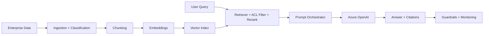
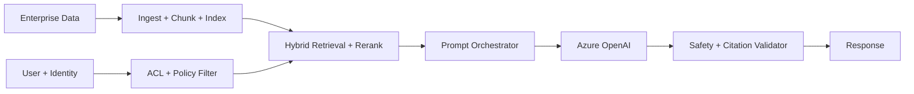

# RAG, Azure OpenAI, and AI Search

## Overview
Enterprise RAG architecture is a production knowledge system that uses approved enterprise content to ground LLM responses with traceable evidence. In mature deployments, RAG is not a single feature; it is a layered architecture that includes content onboarding, metadata governance, retrieval tuning, authorization enforcement, orchestration logic, answer validation, and operational monitoring.

This topic covers the complete architecture lifecycle from offline data preparation to online query-time inference behavior. It also addresses security and compliance controls required for enterprise environments where trust, explainability, and policy enforcement are mandatory.

From an architect perspective, this page helps you answer not only "how to build RAG" but also "how to operate RAG safely at scale over time."

## Why this topic matters
AI/GenAI architect interviews now focus on production-grade RAG controls, not demo chatbots. Interviewers expect you to describe trade-offs between retrieval quality, latency, compliance, and cost. They also expect you to show how identity and governance constraints influence model outputs.

This topic matters because most enterprise failures in GenAI systems happen outside the base model: stale indexes, weak chunking, missing ACL enforcement, poor citation quality, weak monitoring, and uncontrolled change rollout. A senior architect is expected to design defenses for these failure modes.

It is also central to business adoption. Enterprise users trust assistants only when answers are verifiable, permission-aware, and operationally consistent.

## Core concepts
- Azure OpenAI model serving
- AI Search / vector retrieval
- RAG pipeline stages
- Retrieval-time authorization
- Guardrails and safety
- Evaluation and monitoring

## Detailed explanation of each concept

### Azure OpenAI
Azure OpenAI provides managed access to foundation models with enterprise-oriented controls. Architect decisions include model family, latency profile, context window, region availability, failover strategy, token economics, and release governance.

In production systems, Azure OpenAI should be treated as a reasoning/generation layer, not a source-of-truth layer. Correct architecture ensures model outputs are grounded by retrieval evidence and filtered through policy controls before being shown to users.

### AI Search and vector retrieval
Azure AI Search (or equivalent retrieval layer) is the evidence engine of RAG. It supports vector, keyword, and hybrid retrieval patterns. Retrieval quality depends on index design, metadata strategy, query rewriting, filter logic, and reranking configuration.

Architecturally, this layer must balance recall and precision while keeping latency predictable. It also becomes the main control point for access trimming and evidence traceability.

### RAG pipeline
Enterprise RAG pipeline includes both offline and online stages.

Offline stages: ingest -> normalize -> classify -> chunk -> enrich metadata -> embed -> index.  
Online stages: query understanding -> authorized retrieval -> reranking -> prompt assembly -> generation -> validation -> response with citations.

Production architecture adds additional loops: evaluation, feedback ingestion, drift detection, re-indexing, and governance review.

### Retrieval-time authorization
Retrieval-time authorization is a mandatory security boundary. It ensures only permitted chunks enter model context based on user identity, role, tenant, and policy scope.

Without this control, unauthorized data can be processed by the model before output filtering. That creates compliance and audit risk, even when final response appears masked.

### Guardrails
Guardrails include prompt injection defenses, policy filters, toxicity/safety checks, PII protection, output structure validation, and high-risk workflow escalation to human review.

Architecturally, guardrails are not a single component. They are distributed controls across query input, retrieval context, prompt policy, output moderation, and post-response auditing.

### Evaluation
Evaluation is a continuous discipline, not a one-time benchmark. It must cover retrieval quality, answer correctness, citation integrity, security compliance, user trust, latency, and unit economics.

Mature teams run offline test sets, shadow traffic, canary rollout checks, and regression monitoring so model/retrieval changes do not silently degrade production quality.

## Evaluation (How to assess architecture quality)

Use multidimensional evaluation:
- **Retrieval quality:** recall/precision, reranker lift, no-result frequency
- **Generation quality:** groundedness, factuality, citation correctness
- **Security/compliance:** unauthorized retrieval rate, policy violations
- **Operations:** latency by stage, failure rate, index freshness lag
- **Economics:** token cost, retrieval cost, cost per accepted answer

A production-ready architecture improves these metrics together over time with controlled changes and explicit rollback criteria.

Use evaluation at three levels:
- **Design-time:** architecture assumptions, retrieval strategy, threat model
- **Pre-release:** benchmark + red-team + policy compliance checks
- **Runtime:** live telemetry + user feedback + incident trend analysis

Strong evaluation practice can pinpoint root cause of bad answers:
- retrieval miss
- retrieval noise
- prompt construction issue
- model behavior drift
- authorization misconfiguration

## Architecture / flow diagram



**Flow explanation:**  
Offline pipeline prepares enterprise knowledge with chunking, metadata, and indexing. Online pipeline processes user queries, applies access controls, retrieves and reranks evidence, then grounds generation through orchestration. Output is validated and observed through quality and security telemetry loops, enabling continuous tuning.
In practical operation, this flow is implemented as multiple cooperating services. Data ingestion and indexing run asynchronously, while query-time inference must meet strict latency goals. Security trimming must occur before context assembly, and response validation must occur before user display. Monitoring spans all stages so teams can trace exactly why a response was returned and how to improve it.

This architecture also supports change safety: model updates, embedding changes, and index refreshes are rolled out gradually and evaluated against quality and policy gates.

## Real-world example
A corporate knowledge assistant enforces document-level ACL filters at retrieval, logs sources used per response, and blocks high-risk prompts for manual review.
It also maintains incremental re-index pipelines and evidence logging so security teams can audit what was retrieved and why. This turns the assistant into a governed knowledge service instead of a black-box response engine.
In addition, the platform team runs weekly quality reviews using sampled conversations, citation checks, and top failure taxonomy. Business owners validate whether the assistant is improving operational productivity while security owners validate policy adherence and data boundary enforcement.

This kind of operating model is what distinguishes pilot-stage assistants from enterprise-grade AI products.

## Best practices
- Enforce ACL at retrieval, not only UI.
- Preserve source metadata for citation and audit.
- Use hybrid retrieval + reranking for quality.
- Track quality and security metrics in production.
- Maintain index freshness strategy with versioned ingestion and rollback.
- Use benchmark datasets and red-team tests before major model/retrieval changes.
- Design explicit abstention behavior when evidence quality is low.
- Maintain source freshness SLAs and deletion propagation guarantees.
- Track answer usefulness with human feedback loops, not only model scores.
- Separate low-risk and high-risk use cases with different policy templates.

## Common mistakes / misconceptions
- Assuming RAG automatically solves hallucinations.
- No authorization filter before context assembly.
- No deletion/update lifecycle for embeddings.
- Measuring only model accuracy, ignoring security/compliance.
- Treating prompt engineering as substitute for retrieval quality engineering.
- Ignoring conversation-state leakage and retention governance.
- Over-indexing everything without information lifecycle strategy.
- Treating citations as decoration instead of verifiable evidence.
- Rolling out model/index changes without canary and regression tests.
- Failing to define ownership between platform, security, and domain teams.

## Industry relevance
High in regulated and knowledge-heavy industries deploying copilots and internal assistants.
Increasingly critical in enterprise service desks, policy copilots, developer assistants, and analytics copilots where trust, citation, and auditability are mandatory adoption drivers.
Industries with strict legal exposure (healthcare, banking, insurance, public sector) require auditable evidence trails and authorization-safe retrieval. In these environments, architecture quality determines whether AI can be adopted beyond limited pilots.

Even in non-regulated sectors, RAG quality influences employee trust and productivity. Poorly grounded assistants increase rework and reduce adoption, while well-governed assistants become strategic knowledge accelerators.

## Interview discussion points
- Secure RAG controls
- Accuracy-cost-latency trade-offs
- Responsible AI operations
- Retrieval architecture vs model architecture responsibilities
- Governance and evidence requirements in regulated deployments
- Multi-tenant isolation and data boundary enforcement
- Continuous evaluation and rollback strategy for AI changes
- Business adoption metrics vs model quality metrics
- Incident response model for AI answer failures

## Links to dependent / related topics
- [Security, IAM, Networking](../security/security_iam_networking.md)
- [APIM, Messaging, Eventing](../integration/apim_messaging_eventing.md)
- [System Design HLD/LLD](../system-design/system_design_hld_lld.md)

## Question Answer Format (Use for each question)

For every RAG question, answer using:
1. **Question summary** (2-3 lines)
2. **Crisp answer** (7-8 lines)
3. **Deep explanation** (~40 lines)
4. **Simple diagram or flow**
5. **Trusted reference links**

## Interview Questions (50)
1. Explain end-to-end RAG architecture for enterprise assistants.
2. Why is retrieval-time authorization mandatory?
3. How do you choose chunk size and overlap?
4. How do you reduce hallucination in production?
5. What metrics define RAG success?
6. How do you choose model and context window?
7. How do you design multi-tenant RAG isolation?
8. How do you handle document updates and deletion?
9. How do you secure embeddings and vector stores?
10. How do you implement source citations reliably?
11. How do you combine keyword + vector retrieval?
12. How do you design reranking strategy?
13. How do you defend against prompt injection?
14. How do you redact PII before indexing?
15. How do you choose retrieval top-k values?
16. How do you design confidence thresholds?
17. How do you route low-confidence outputs?
18. How do you evaluate grounding quality?
19. How do you control token cost?
20. How do you design failover for RAG pipeline?
21. How does identity architecture affect RAG security?
22. How do you use APIM in GenAI gateway pattern?
23. How do you monitor quality drift?
24. How do you build human-in-the-loop workflows?
25. How do you manage model/version governance?
26. Why is post-filtering insufficient for compliance?
27. How do you design data classification for RAG ingestion?
28. How do you choose vector DB/index strategy?
29. How do you support multilingual retrieval?
30. How do you benchmark retrieval relevance?
31. How do you isolate external vs internal corpora?
32. How do you enforce tenant and role boundaries?
33. How do you log explainability evidence?
34. How do you test adversarial prompts?
35. How do you set SLOs for AI response latency?
36. How do you design caching for repeated queries?
37. How do you scale ingestion pipelines?
38. How do you handle stale embeddings?
39. How do you compare RAG vs fine-tuning?
40. How do you apply guardrails for high-risk use cases?
41. How do you structure AI incident response?
42. How do you design AI architecture for regulated industries?
43. How do you run red-team exercises for RAG?
44. How do you measure business impact of copilots?
45. How do you avoid over-retrieval noise?
46. How do you design retrieval fallback behavior?
47. How do you secure model API keys and access?
48. How do you present AI architecture risk to executives?
49. How do you phase enterprise RAG rollout?
50. How do you decide build vs buy for RAG platforms?

## Enhanced Answering Playbook (Crisp + Deep + Summary + Example)

Use this playbook while studying each RAG answer:

- **Crisp answer:** Give direct architecture decision in interview-ready language.
- **Deep explanation:** Explain pipeline stages, control boundaries, and trade-offs.
- **Answer summary:** Conclude with 3 points: value, risk, mitigation.
- **Practical example:** Anchor answer in one enterprise assistant scenario.
- **Diagram thinking:** Trace offline ingestion and online inference path.

### Worked Example: Enterprise RAG with ACL-safe retrieval
**Crisp answer:** Enforce ACL filtering before prompt assembly, then generate grounded answer with citations and confidence-aware fallback.

**Deep explanation:**  
In enterprise RAG, source documents are ingested, normalized, chunked, embedded, and indexed with metadata such as tenant, role, and document class. At query time, user identity and policy context are evaluated first, and only authorized chunks are retrieved. Hybrid retrieval plus reranking improves evidence quality. Prompt orchestration sends selected context to Azure OpenAI, and output validators check citation presence, policy compliance, and confidence threshold before returning response. Monitoring tracks retrieval quality, latency, and policy incidents for continuous tuning.

**Answer summary:**  
- Retrieval-time authorization is non-negotiable for compliance.  
- Citation-backed generation improves trust and auditability.  
- Continuous evaluation prevents silent quality drift in production.



## Answers for important questions (Summary + Crisp + Deep)

### Q1. Explain end-to-end RAG architecture for enterprise assistants.

**Question summary:**  
Interviewer checks whether you can design the full RAG lifecycle from ingestion to production operations, not only a chatbot demo.

**Crisp answer (7-8 lines):**  
Enterprise RAG starts with trusted data ingestion and classification.  
Then content is chunked and embedded for retrieval indexing.  
At query time, retriever gets relevant chunks using hybrid search.  
Authorization filters run before prompt assembly to enforce data access.  
Prompt orchestrator sends grounded context to Azure OpenAI.  
Response must include citations and confidence signals.  
Guardrails validate output safety and policy compliance.  
Monitoring tracks quality, latency, failures, and cost continuously.

**Deep explanation (~60-70 lines):** For `Explain end-to-end RAG architecture for enterprise assistants.`, start by identifying where this decision sits in your RAG system control flow and what failure it prevents. A strong architecture answer should describe the request path end-to-end, not just define terms: ingress, authorization, orchestration, dependency calls, validation, and fallback. In this flow, deterministic steps must be explicit and testable, such as ACL filtering, metadata policy checks, chunk/rerank thresholds, citation presence checks. These are deterministic because policy and safety outcomes cannot depend on model creativity. Probabilistic steps are acceptable where approximation is useful, such as query rewrite interpretation and final response generation, but they still need guardrails and confidence thresholds. The key trade-off is control versus flexibility: stricter deterministic control improves safety and auditability, while probabilistic reasoning improves adaptability but increases variance in output quality. Design decisions should therefore include boundaries: which component can decide, which component must verify, and which component can block or escalate. Also explain operational behavior under stress: dependency timeout, partial failure, malformed tool output, stale context, and degraded external APIs. For each failure mode, define one mitigation path (retry with budget, route fallback, safe response, or human approval) so the system degrades safely instead of failing unpredictably. Security must be integrated into this answer: identity propagation, least-privilege access, and data boundary enforcement should happen before generation, not after. Finally, show how you will measure success in production with metrics like recall@k, groundedness rate, citation correctness, p95 latency, cost/answer, and mention rollout safety with canary + rollback criteria. This turns the answer from a definition into an operating architecture decision with clear risk, mitigation, and measurable outcomes.
**Answer summary:**
- **Decision:** Select the pattern that best satisfies `Explain end-to-end RAG architecture for enterprise assistants.` under your business and compliance constraints.
- **Risk:** Weak control boundaries and unclear ownership create quality, security, and reliability regressions at scale.
- **Mitigation:** Enforce policy gates, measurable SLO/SLA triggers, and tested fallback/recovery playbooks before full rollout.
**Practical example:** In a healthcare claims assistant, the team addresses 'Explain end-to-end RAG architecture for enterprise assistants.' by enforcing role-scoped access, validating each critical step through policy checks, and releasing changes with canary monitoring so quality and compliance remain stable under production traffic.
**Simple diagram:**  
```text
Enterprise Sources -> Ingestion/Normalization -> Chunking + Metadata -> Embeddings/Index
User Query -> Identity + Policy Checks -> Retrieval + Reranking -> Prompt Orchestration
Prompt + Evidence -> Azure OpenAI -> Validation/Guardrails -> Cited Response
All stages -> Logging, Evaluation, Cost Tracking, Governance, and Refresh Pipelines
```

**Trusted reference links:**  
- https://learn.microsoft.com/en-us/azure/architecture/ai-ml/guide/rag/rag-solution-design-and-evaluation-guide  
- https://learn.microsoft.com/en-us/azure/search/retrieval-augmented-generation-overview  
- https://learn.microsoft.com/en-us/azure/developer/ai/advanced-retrieval-augmented-generation  
- https://learn.microsoft.com/en-us/azure/foundry/concepts/retrieval-augmented-generation

### Q2. Why is retrieval-time authorization mandatory?

**Question summary:**  
Interviewer wants to confirm you understand the main compliance risk in RAG: unauthorized context can be leaked before output filtering.

**Crisp answer (7-8 lines):**  
Authorization must happen before documents enter model context.  
If ACL checks happen only at UI/output stage, it is too late.  
The model may already process sensitive or restricted data internally.  
That creates compliance and legal exposure even if output is masked.  
Retrieval-time filtering enforces least privilege at source level.  
It also improves tenant isolation and auditability.  
This is essential for HIPAA, GDPR, financial, and enterprise controls.  
So secure RAG equals retrieval-filtered RAG, not post-filtered RAG.

**Deep explanation (~60-70 lines):** For `Why is retrieval-time authorization mandatory?`, start by identifying where this decision sits in your RAG system control flow and what failure it prevents. A strong architecture answer should describe the request path end-to-end, not just define terms: ingress, authorization, orchestration, dependency calls, validation, and fallback. In this flow, deterministic steps must be explicit and testable, such as ACL filtering, metadata policy checks, chunk/rerank thresholds, citation presence checks. These are deterministic because policy and safety outcomes cannot depend on model creativity. Probabilistic steps are acceptable where approximation is useful, such as query rewrite interpretation and final response generation, but they still need guardrails and confidence thresholds. The key trade-off is control versus flexibility: stricter deterministic control improves safety and auditability, while probabilistic reasoning improves adaptability but increases variance in output quality. Design decisions should therefore include boundaries: which component can decide, which component must verify, and which component can block or escalate. Also explain operational behavior under stress: dependency timeout, partial failure, malformed tool output, stale context, and degraded external APIs. For each failure mode, define one mitigation path (retry with budget, route fallback, safe response, or human approval) so the system degrades safely instead of failing unpredictably. Security must be integrated into this answer: identity propagation, least-privilege access, and data boundary enforcement should happen before generation, not after. Finally, show how you will measure success in production with metrics like recall@k, groundedness rate, citation correctness, p95 latency, cost/answer, and mention rollout safety with canary + rollback criteria. This turns the answer from a definition into an operating architecture decision with clear risk, mitigation, and measurable outcomes.
**Answer summary:**
- **Decision:** Select the pattern that best satisfies `Why is retrieval-time authorization mandatory?` under your business and compliance constraints.
- **Risk:** Weak control boundaries and unclear ownership create quality, security, and reliability regressions at scale.
- **Mitigation:** Enforce policy gates, measurable SLO/SLA triggers, and tested fallback/recovery playbooks before full rollout.
**Practical example:** In a insurance underwriting knowledge bot, the team addresses 'Why is retrieval-time authorization mandatory?' by enforcing role-scoped access, validating each critical step through policy checks, and releasing changes with canary monitoring so quality and compliance remain stable under production traffic.
**Simple diagram:**  
```text
User Query + Identity -> Retriever -> ACL/Policy Filter -> Authorized Chunks -> Prompt -> LLM -> Response
                          (Unauthorized chunks blocked before context assembly)
```

**Trusted reference links:**  
- https://learn.microsoft.com/en-us/azure/search/retrieval-augmented-generation-overview  
- https://learn.microsoft.com/en-us/azure/architecture/ai-ml/guide/rag/rag-information-retrieval  
- https://learn.microsoft.com/en-us/microsoft-copilot-studio/guidance/retrieval-augmented-generation

### Q3. How do you choose chunk size and overlap?

**Question summary:**  
Interviewer checks whether you can tune retrieval quality practically instead of using random chunk sizes.

**Crisp answer (7-8 lines):**  
Chunking should follow document semantics, not fixed defaults only.  
Large chunks improve context continuity but increase noise and token cost.  
Small chunks improve precision but can lose important context.  
Overlap helps preserve continuity across boundaries.  
I start with domain-specific baseline and evaluate offline.  
Then tune by groundedness, retrieval precision, and latency/cost metrics.  
Different content types need different chunking strategies.  
Final choice is evidence-based through iterative evaluation.

**Deep explanation (~60-70 lines):** For `How do you choose chunk size and overlap?`, start by identifying where this decision sits in your RAG system control flow and what failure it prevents. A strong architecture answer should describe the request path end-to-end, not just define terms: ingress, authorization, orchestration, dependency calls, validation, and fallback. In this flow, deterministic steps must be explicit and testable, such as ACL filtering, metadata policy checks, chunk/rerank thresholds, citation presence checks. These are deterministic because policy and safety outcomes cannot depend on model creativity. Probabilistic steps are acceptable where approximation is useful, such as query rewrite interpretation and final response generation, but they still need guardrails and confidence thresholds. The key trade-off is control versus flexibility: stricter deterministic control improves safety and auditability, while probabilistic reasoning improves adaptability but increases variance in output quality. Design decisions should therefore include boundaries: which component can decide, which component must verify, and which component can block or escalate. Also explain operational behavior under stress: dependency timeout, partial failure, malformed tool output, stale context, and degraded external APIs. For each failure mode, define one mitigation path (retry with budget, route fallback, safe response, or human approval) so the system degrades safely instead of failing unpredictably. Security must be integrated into this answer: identity propagation, least-privilege access, and data boundary enforcement should happen before generation, not after. Finally, show how you will measure success in production with metrics like recall@k, groundedness rate, citation correctness, p95 latency, cost/answer, and mention rollout safety with canary + rollback criteria. This turns the answer from a definition into an operating architecture decision with clear risk, mitigation, and measurable outcomes.
**Answer summary:**
- **Decision:** Select the pattern that best satisfies `How do you choose chunk size and overlap?` under your business and compliance constraints.
- **Risk:** Weak control boundaries and unclear ownership create quality, security, and reliability regressions at scale.
- **Mitigation:** Enforce policy gates, measurable SLO/SLA triggers, and tested fallback/recovery playbooks before full rollout.
**Practical example:** In a enterprise IT support assistant, the team addresses 'How do you choose chunk size and overlap?' by enforcing role-scoped access, validating each critical step through policy checks, and releasing changes with canary monitoring so quality and compliance remain stable under production traffic.
**Simple diagram:**  
```text
Raw Docs -> Semantic Chunking -> Chunk Metadata -> Embeddings/Index -> Retrieval -> Rerank -> Grounded Answer
                 (size + overlap tuned by evaluation metrics)
```

**Trusted reference links:**  
- https://learn.microsoft.com/en-us/azure/developer/ai/advanced-retrieval-augmented-generation  
- https://learn.microsoft.com/en-us/azure/search/retrieval-augmented-generation-overview  
- https://learn.microsoft.com/en-us/azure/architecture/ai-ml/guide/rag/rag-solution-design-and-evaluation-guide

### Q4. How do you reduce hallucination in production?

**Question summary:**  
Interviewer is testing whether you know practical controls to reduce hallucinations in real systems, not just prompt tricks. They expect architecture-level mitigation across retrieval, generation, validation, and operations.

**Crisp answer (7-8 lines):**  
Hallucination reduction starts with high-quality retrieval, not only prompt tuning.  
Use hybrid retrieval plus reranking to improve evidence precision.  
Enforce retrieval-time authorization and metadata filters to remove noisy context.  
Constrain prompts to answer only from retrieved sources with citation rules.  
Add confidence thresholds and abstain when evidence is weak.  
Validate outputs with policy and citation checks before user display.  
Use human review for high-risk workflows and low-confidence outputs.  
Track hallucination metrics continuously and improve through evaluation loops.

**Deep explanation (~60-70 lines):** For `How do you reduce hallucination in production?`, start by identifying where this decision sits in your RAG system control flow and what failure it prevents. A strong architecture answer should describe the request path end-to-end, not just define terms: ingress, authorization, orchestration, dependency calls, validation, and fallback. In this flow, deterministic steps must be explicit and testable, such as ACL filtering, metadata policy checks, chunk/rerank thresholds, citation presence checks. These are deterministic because policy and safety outcomes cannot depend on model creativity. Probabilistic steps are acceptable where approximation is useful, such as query rewrite interpretation and final response generation, but they still need guardrails and confidence thresholds. The key trade-off is control versus flexibility: stricter deterministic control improves safety and auditability, while probabilistic reasoning improves adaptability but increases variance in output quality. Design decisions should therefore include boundaries: which component can decide, which component must verify, and which component can block or escalate. Also explain operational behavior under stress: dependency timeout, partial failure, malformed tool output, stale context, and degraded external APIs. For each failure mode, define one mitigation path (retry with budget, route fallback, safe response, or human approval) so the system degrades safely instead of failing unpredictably. Security must be integrated into this answer: identity propagation, least-privilege access, and data boundary enforcement should happen before generation, not after. Finally, show how you will measure success in production with metrics like recall@k, groundedness rate, citation correctness, p95 latency, cost/answer, and mention rollout safety with canary + rollback criteria. This turns the answer from a definition into an operating architecture decision with clear risk, mitigation, and measurable outcomes.
**Answer summary:**
- **Decision:** Select the pattern that best satisfies `How do you reduce hallucination in production?` under your business and compliance constraints.
- **Risk:** Weak control boundaries and unclear ownership create quality, security, and reliability regressions at scale.
- **Mitigation:** Enforce policy gates, measurable SLO/SLA triggers, and tested fallback/recovery playbooks before full rollout.
**Practical example:** In a procurement contract Q&A assistant, the team addresses 'How do you reduce hallucination in production?' by enforcing role-scoped access, validating each critical step through policy checks, and releasing changes with canary monitoring so quality and compliance remain stable under production traffic.
**Simple diagram:**  
```text
Query -> Hybrid Retrieval + Rerank -> Grounded Prompt -> LLM -> Citation/Policy Validation -> Response or Abstain/Human Review
```

**Trusted reference links:**  
- https://learn.microsoft.com/en-us/azure/architecture/ai-ml/guide/rag/rag-solution-design-and-evaluation-guide  
- https://learn.microsoft.com/en-us/azure/architecture/ai-ml/guide/rag/rag-information-retrieval  
- https://learn.microsoft.com/en-us/azure/search/retrieval-augmented-generation-overview

### Q5. What metrics define RAG success?

**Question summary:**  
Interviewer checks whether you can define measurable success criteria beyond model quality. They want to see a balanced metric framework across quality, security, operations, and cost.

**Crisp answer (7-8 lines):**  
RAG success is multi-dimensional, not one accuracy score.  
Track retrieval quality with recall, precision, and no-result rate.  
Track generation quality with groundedness and citation correctness.  
Track safety with policy violations and unauthorized retrieval attempts.  
Track operations with stage latency, failure rates, and freshness lag.  
Track economics with token cost and cost per accepted answer.  
Track adoption with user satisfaction and task completion impact.  
A good RAG system improves all of these without hidden trade-off failures.

**Deep explanation (~60-70 lines):** For `What metrics define RAG success?`, start by identifying where this decision sits in your RAG system control flow and what failure it prevents. A strong architecture answer should describe the request path end-to-end, not just define terms: ingress, authorization, orchestration, dependency calls, validation, and fallback. In this flow, deterministic steps must be explicit and testable, such as ACL filtering, metadata policy checks, chunk/rerank thresholds, citation presence checks. These are deterministic because policy and safety outcomes cannot depend on model creativity. Probabilistic steps are acceptable where approximation is useful, such as query rewrite interpretation and final response generation, but they still need guardrails and confidence thresholds. The key trade-off is control versus flexibility: stricter deterministic control improves safety and auditability, while probabilistic reasoning improves adaptability but increases variance in output quality. Design decisions should therefore include boundaries: which component can decide, which component must verify, and which component can block or escalate. Also explain operational behavior under stress: dependency timeout, partial failure, malformed tool output, stale context, and degraded external APIs. For each failure mode, define one mitigation path (retry with budget, route fallback, safe response, or human approval) so the system degrades safely instead of failing unpredictably. Security must be integrated into this answer: identity propagation, least-privilege access, and data boundary enforcement should happen before generation, not after. Finally, show how you will measure success in production with metrics like recall@k, groundedness rate, citation correctness, p95 latency, cost/answer, and mention rollout safety with canary + rollback criteria. This turns the answer from a definition into an operating architecture decision with clear risk, mitigation, and measurable outcomes.
**Answer summary:**
- **Decision:** Select the pattern that best satisfies `What metrics define RAG success?` under your business and compliance constraints.
- **Risk:** Weak control boundaries and unclear ownership create quality, security, and reliability regressions at scale.
- **Mitigation:** Enforce policy gates, measurable SLO/SLA triggers, and tested fallback/recovery playbooks before full rollout.
**Practical example:** In a internal audit/compliance copilot, the team addresses 'What metrics define RAG success?' by enforcing role-scoped access, validating each critical step through policy checks, and releasing changes with canary monitoring so quality and compliance remain stable under production traffic.
**Simple diagram:**  
```text
RAG Success = Retrieval Quality + Generation Quality + Security/Compliance + Operations + Cost + Business Adoption
```

**Trusted reference links:**  
- https://learn.microsoft.com/en-us/azure/architecture/ai-ml/guide/rag/rag-solution-design-and-evaluation-guide  
- https://learn.microsoft.com/en-us/azure/search/retrieval-augmented-generation-overview  
- https://learn.microsoft.com/en-us/azure/developer/ai/advanced-retrieval-augmented-generation

### Q6. How do you choose model and context window?

**Question summary:**  
This question checks whether you choose models based on workload constraints rather than hype. Interviewers want to hear trade-offs among quality, latency, safety, and cost.

**Crisp answer (7-8 lines):**  
I choose the model based on the risk, complexity, quality requirement, latency, and cost constraint of the use case.
My default principle is to use the smallest model that consistently meets the required quality and safety threshold.
For simple classification, extraction, summarization, or FAQ-style answers, I prefer smaller/faster models.
For complex reasoning, architecture decisions, multi-step planning, sensitive domains, or high-impact responses, I use a stronger model.
For context window, I do not use the largest window by default. I size the context based on how much trusted evidence the model actually needs.
Oversized context can increase cost, latency, and noise, and may reduce answer quality.
In production, I use routing, evaluation benchmarks, p95 latency, cost-per-answer, groundedness, and user feedback to continuously tune the model and context strategy.

**Deep explanation (~60-70 lines):** For `How do you choose model and context window?`, Model and context window selection is an architectural trade-off, not just a model preference.
The first factor is the use case complexity. If the task is simple, such as intent classification, keyword extraction, short summarization, or basic customer FAQ, a smaller model is usually enough. It gives lower latency and lower cost. But if the task requires reasoning, decision-making, code understanding, architecture trade-offs, legal/compliance sensitivity, or multi-step analysis, I would select a stronger model.
The second factor is risk. For low-risk use cases, a smaller model may be acceptable even if the answer is not perfect. But for high-risk use cases, such as financial advice, security decisions, compliance interpretation, or production incident support, I would use a stronger model with stricter validation and guardrails.
The third factor is latency and cost. A large model may give better quality, but it can increase response time and cost. So I prefer a tiered approach: small model for simple queries, medium model for moderate reasoning, and large model for complex or high-risk queries. This can be implemented through a model router.
The context window decision is separate. A large context window means the model can process more text, but it does not mean the answer will automatically be better. If we put too much irrelevant content into the prompt, the model may get distracted, produce slower responses, and increase cost.
So I choose the context window based on the amount of relevant evidence required. For a simple question, only a few retrieved chunks may be needed. For a complex RAG answer, contract review, architecture review, or codebase analysis, a larger context window may be justified.
In a RAG system, I would control the context by using chunking, metadata filters, ACL checks, hybrid search, reranking, and relevance thresholds. I would send only the most relevant, authorized, and fresh information to the model.
Finally, I would not decide once and forget it. I would validate the model and context strategy using offline benchmarks and production telemetry. Important metrics include answer accuracy, groundedness, citation correctness, p95 latency, token usage, cost per answer, fallback rate, and user satisfaction.
**Answer summary:**
I choose the model based on workload complexity, risk, quality target, latency, and cost. My default principle is to use the smallest model that reliably meets the required quality and safety threshold. Smaller models are good for classification, extraction, short summarization, and simple FAQ use cases. Larger models are better for complex reasoning, architecture decisions, multi-step analysis, code understanding, or high-risk domains.

For context window, I do not choose the largest window by default. I size it based on how much relevant and trusted evidence the model needs. Too much context can increase latency, cost, and noise. In a RAG system, I control context using retrieval filters, chunking, reranking, ACL checks, freshness checks, and relevance thresholds. In production, I validate the choice using benchmarks and telemetry such as groundedness, accuracy, p95 latency, cost per answer, citation correctness, and fallback rate. So model and context selection is not a one-time choice; it is an operating decision continuously tuned using real production data.
**Practical example:** Suppose we are building a customer support assistant.

For simple queries like:

What is my refund status?
How do I reset my password?
What are your support hours?

I would use a smaller model with a small context window, because the answer mainly needs structured data lookup or simple FAQ retrieval.

But for queries like:

My payment failed, refund is pending, and I was charged twice. Can you analyze my case?

I would route it to a stronger model because it needs multi-step reasoning across payment history, refund policy, transaction logs, and customer profile.

For context, I would not send the full customer history. I would send only:

latest transaction records
refund policy
support ticket history
relevant payment status
customer entitlement details

This keeps the context focused, reduces cost and latency, and improves answer quality.
**Simple diagram:**  
```text
Query Classifier -> Model Router (small/medium/large) -> Context Assembly (filtered) -> LLM -> Response
```

**Trusted reference links:**  
- https://learn.microsoft.com/en-us/azure/architecture/ai-ml/guide/rag/rag-solution-design-and-evaluation-guide  
- https://learn.microsoft.com/en-us/azure/foundry/concepts/retrieval-augmented-generation

### Q7. How do you design multi-tenant RAG isolation?

**Question summary:**  
Interviewers are testing tenant boundary design and data leakage prevention. They expect controls across identity, retrieval, storage, and operations.

**Crisp answer (7-8 lines):**  
Design tenant isolation at identity, data, and retrieval layers together.  
Use tenant-scoped auth claims for every query path.  
Apply tenant filters before context reaches the model.  
Isolate indexes or namespaces based on risk and scale model.  
Keep tenant-specific encryption, logging, and audit trails.  
Prevent cross-tenant cache and memory leakage by design.  
Test boundary failures with adversarial and regression suites.  
Monitor and alert on any cross-tenant retrieval anomalies.

**Deep explanation (~60-70 lines):** For `How do you design multi-tenant RAG isolation?`, start by identifying where this decision sits in your RAG system control flow and what failure it prevents. A strong architecture answer should describe the request path end-to-end, not just define terms: ingress, authorization, orchestration, dependency calls, validation, and fallback. In this flow, deterministic steps must be explicit and testable, such as ACL filtering, metadata policy checks, chunk/rerank thresholds, citation presence checks. These are deterministic because policy and safety outcomes cannot depend on model creativity. Probabilistic steps are acceptable where approximation is useful, such as query rewrite interpretation and final response generation, but they still need guardrails and confidence thresholds. The key trade-off is control versus flexibility: stricter deterministic control improves safety and auditability, while probabilistic reasoning improves adaptability but increases variance in output quality. Design decisions should therefore include boundaries: which component can decide, which component must verify, and which component can block or escalate. Also explain operational behavior under stress: dependency timeout, partial failure, malformed tool output, stale context, and degraded external APIs. For each failure mode, define one mitigation path (retry with budget, route fallback, safe response, or human approval) so the system degrades safely instead of failing unpredictably. Security must be integrated into this answer: identity propagation, least-privilege access, and data boundary enforcement should happen before generation, not after. Finally, show how you will measure success in production with metrics like recall@k, groundedness rate, citation correctness, p95 latency, cost/answer, and mention rollout safety with canary + rollback criteria. This turns the answer from a definition into an operating architecture decision with clear risk, mitigation, and measurable outcomes.
**Answer summary:**
- **Decision:** Select the pattern that best satisfies `How do you design multi-tenant RAG isolation?` under your business and compliance constraints.
- **Risk:** Weak control boundaries and unclear ownership create quality, security, and reliability regressions at scale.
- **Mitigation:** Enforce policy gates, measurable SLO/SLA triggers, and tested fallback/recovery playbooks before full rollout.
**Practical example:** In a operations incident copilot, the team addresses 'How do you design multi-tenant RAG isolation?' by enforcing role-scoped access, validating each critical step through policy checks, and releasing changes with canary monitoring so quality and compliance remain stable under production traffic.
**Simple diagram:**  
```text
User -> Auth (Tenant Claim) -> Retriever (Tenant Filter) -> Authorized Tenant Chunks -> Prompt -> LLM -> Tenant-Scoped Logs
```

**Trusted reference links:**  
- https://learn.microsoft.com/en-us/azure/search/retrieval-augmented-generation-overview  
- https://learn.microsoft.com/en-us/azure/architecture/ai-ml/guide/rag/rag-information-retrieval

### Q8. How do you handle document updates and deletion?

**Question summary:**  
This question tests index freshness and compliance lifecycle design. Interviewers want to see how you avoid stale or revoked content in responses.

**Crisp answer (7-8 lines):**  
Treat content lifecycle as a first-class RAG architecture concern.  
Use incremental ingestion to detect updates quickly.  
Re-embed and re-index changed chunks with version tracking.  
Propagate deletions with tombstone and index purge workflows.  
Keep freshness SLAs by source criticality and risk level.  
Prevent stale citations through version-aware retrieval rules.  
Log update/delete events for compliance traceability.  
Validate freshness in production with periodic drift checks.

**Deep explanation (~60-70 lines):** For `How do you handle document updates and deletion?`, start by identifying where this decision sits in your RAG system control flow and what failure it prevents. A strong architecture answer should describe the request path end-to-end, not just define terms: ingress, authorization, orchestration, dependency calls, validation, and fallback. In this flow, deterministic steps must be explicit and testable, such as ACL filtering, metadata policy checks, chunk/rerank thresholds, citation presence checks. These are deterministic because policy and safety outcomes cannot depend on model creativity. Probabilistic steps are acceptable where approximation is useful, such as query rewrite interpretation and final response generation, but they still need guardrails and confidence thresholds. The key trade-off is control versus flexibility: stricter deterministic control improves safety and auditability, while probabilistic reasoning improves adaptability but increases variance in output quality. Design decisions should therefore include boundaries: which component can decide, which component must verify, and which component can block or escalate. Also explain operational behavior under stress: dependency timeout, partial failure, malformed tool output, stale context, and degraded external APIs. For each failure mode, define one mitigation path (retry with budget, route fallback, safe response, or human approval) so the system degrades safely instead of failing unpredictably. Security must be integrated into this answer: identity propagation, least-privilege access, and data boundary enforcement should happen before generation, not after. Finally, show how you will measure success in production with metrics like recall@k, groundedness rate, citation correctness, p95 latency, cost/answer, and mention rollout safety with canary + rollback criteria. This turns the answer from a definition into an operating architecture decision with clear risk, mitigation, and measurable outcomes.
**Answer summary:**
- **Decision:** Select the pattern that best satisfies `How do you handle document updates and deletion?` under your business and compliance constraints.
- **Risk:** Weak control boundaries and unclear ownership create quality, security, and reliability regressions at scale.
- **Mitigation:** Enforce policy gates, measurable SLO/SLA triggers, and tested fallback/recovery playbooks before full rollout.
**Practical example:** In a banking policy copilot, the team addresses 'How do you handle document updates and deletion?' by enforcing role-scoped access, validating each critical step through policy checks, and releasing changes with canary monitoring so quality and compliance remain stable under production traffic.
**Simple diagram:**  
```text
Source Change/Delete -> Ingestion Delta -> Re-chunk/Re-embed -> Index Update/Purge -> Fresh Retrieval
```

**Trusted reference links:**  
- https://learn.microsoft.com/en-us/azure/search/retrieval-augmented-generation-overview  
- https://learn.microsoft.com/en-us/azure/developer/ai/advanced-retrieval-augmented-generation

### Q9. How do you secure embeddings and vector stores?

**Question summary:**  
Interviewers check whether you treat vector data as sensitive enterprise data. They expect controls for access, encryption, and audit, not just database setup.

**Crisp answer (7-8 lines):**  
Embeddings and vector stores must be treated as governed data assets.  
Enforce strict identity-based access and least privilege roles.  
Use encryption in transit and at rest with managed keys.  
Apply private networking and avoid public exposure of retrieval stores.  
Keep tenant and classification metadata for policy-aware filtering.  
Log retrieval access and administrative actions for audits.  
Use PII controls before embedding sensitive content where required.  
Continuously validate access boundaries and anomaly behavior.

**Deep explanation (~60-70 lines):** For `How do you secure embeddings and vector stores?`, start by identifying where this decision sits in your RAG system control flow and what failure it prevents. A strong architecture answer should describe the request path end-to-end, not just define terms: ingress, authorization, orchestration, dependency calls, validation, and fallback. In this flow, deterministic steps must be explicit and testable, such as ACL filtering, metadata policy checks, chunk/rerank thresholds, citation presence checks. These are deterministic because policy and safety outcomes cannot depend on model creativity. Probabilistic steps are acceptable where approximation is useful, such as query rewrite interpretation and final response generation, but they still need guardrails and confidence thresholds. The key trade-off is control versus flexibility: stricter deterministic control improves safety and auditability, while probabilistic reasoning improves adaptability but increases variance in output quality. Design decisions should therefore include boundaries: which component can decide, which component must verify, and which component can block or escalate. Also explain operational behavior under stress: dependency timeout, partial failure, malformed tool output, stale context, and degraded external APIs. For each failure mode, define one mitigation path (retry with budget, route fallback, safe response, or human approval) so the system degrades safely instead of failing unpredictably. Security must be integrated into this answer: identity propagation, least-privilege access, and data boundary enforcement should happen before generation, not after. Finally, show how you will measure success in production with metrics like recall@k, groundedness rate, citation correctness, p95 latency, cost/answer, and mention rollout safety with canary + rollback criteria. This turns the answer from a definition into an operating architecture decision with clear risk, mitigation, and measurable outcomes.
**Answer summary:**
- **Decision:** Select the pattern that best satisfies `How do you secure embeddings and vector stores?` under your business and compliance constraints.
- **Risk:** Weak control boundaries and unclear ownership create quality, security, and reliability regressions at scale.
- **Mitigation:** Enforce policy gates, measurable SLO/SLA triggers, and tested fallback/recovery playbooks before full rollout.
**Practical example:** In a healthcare claims assistant, the team addresses 'How do you secure embeddings and vector stores?' by enforcing role-scoped access, validating each critical step through policy checks, and releasing changes with canary monitoring so quality and compliance remain stable under production traffic.
**Simple diagram:**  
```text
Ingestion -> PII/Policy Checks -> Embeddings -> Vector Store (Private + Encrypted + RBAC) -> Authorized Retrieval
```

**Trusted reference links:**  
- https://learn.microsoft.com/en-us/azure/search/retrieval-augmented-generation-overview  
- https://learn.microsoft.com/en-us/azure/cloud-adoption-framework/ready/landing-zone/design-area/governance

### Q10. How do you implement source citations reliably?

**Question summary:**  
This question tests trust and explainability design. Interviewers want to hear how citation quality is engineered and validated, not just displayed.

**Crisp answer (7-8 lines):**  
Reliable citations start with strong metadata during ingestion.  
Each chunk must keep source ID, location, and version details.  
Prompt policy should require citation-backed responses only.  
Reranking should favor chunks that directly support answer claims.  
Post-processing should validate citation-to-claim alignment.  
Reject or downgrade answers with weak supporting evidence.  
Expose citations clearly to users for verification.  
Track citation correctness metrics in production.

**Deep explanation (~60-70 lines):** For `How do you implement source citations reliably?`, start by identifying where this decision sits in your RAG system control flow and what failure it prevents. A strong architecture answer should describe the request path end-to-end, not just define terms: ingress, authorization, orchestration, dependency calls, validation, and fallback. In this flow, deterministic steps must be explicit and testable, such as ACL filtering, metadata policy checks, chunk/rerank thresholds, citation presence checks. These are deterministic because policy and safety outcomes cannot depend on model creativity. Probabilistic steps are acceptable where approximation is useful, such as query rewrite interpretation and final response generation, but they still need guardrails and confidence thresholds. The key trade-off is control versus flexibility: stricter deterministic control improves safety and auditability, while probabilistic reasoning improves adaptability but increases variance in output quality. Design decisions should therefore include boundaries: which component can decide, which component must verify, and which component can block or escalate. Also explain operational behavior under stress: dependency timeout, partial failure, malformed tool output, stale context, and degraded external APIs. For each failure mode, define one mitigation path (retry with budget, route fallback, safe response, or human approval) so the system degrades safely instead of failing unpredictably. Security must be integrated into this answer: identity propagation, least-privilege access, and data boundary enforcement should happen before generation, not after. Finally, show how you will measure success in production with metrics like recall@k, groundedness rate, citation correctness, p95 latency, cost/answer, and mention rollout safety with canary + rollback criteria. This turns the answer from a definition into an operating architecture decision with clear risk, mitigation, and measurable outcomes.
**Answer summary:**
- **Decision:** Select the pattern that best satisfies `How do you implement source citations reliably?` under your business and compliance constraints.
- **Risk:** Weak control boundaries and unclear ownership create quality, security, and reliability regressions at scale.
- **Mitigation:** Enforce policy gates, measurable SLO/SLA triggers, and tested fallback/recovery playbooks before full rollout.
**Practical example:** In a insurance underwriting knowledge bot, the team addresses 'How do you implement source citations reliably?' by enforcing role-scoped access, validating each critical step through policy checks, and releasing changes with canary monitoring so quality and compliance remain stable under production traffic.
**Simple diagram:**  
```text
Chunk Metadata -> Retrieval + Rerank -> Prompt with Citation Rules -> LLM Output -> Citation Validation -> User Response
```

**Trusted reference links:**  
- https://learn.microsoft.com/en-us/azure/foundry/concepts/retrieval-augmented-generation  
- https://learn.microsoft.com/en-us/azure/architecture/ai-ml/guide/rag/rag-solution-design-and-evaluation-guide

### Q11. How do you combine keyword + vector retrieval?

**Question summary:**  
This checks whether you understand hybrid retrieval as a practical quality strategy. Interviewers want to hear why lexical and semantic signals must work together.

**Crisp answer (7-8 lines):**  
Use hybrid retrieval to balance semantic understanding and exact matching.  
Vector search captures meaning and intent across phrasing variation.  
Keyword search captures exact terms, IDs, and policy references.  
Run both and merge candidates with weighted ranking.  
Apply metadata filters and ACL controls before final scoring.  
Use reranker to improve precision of merged results.  
Tune weights using evaluation datasets, not assumptions.  
Hybrid usually outperforms vector-only in enterprise corpora.

**Deep explanation (~60-70 lines):** For `How do you combine keyword + vector retrieval?`, start by identifying where this decision sits in your RAG system control flow and what failure it prevents. A strong architecture answer should describe the request path end-to-end, not just define terms: ingress, authorization, orchestration, dependency calls, validation, and fallback. In this flow, deterministic steps must be explicit and testable, such as ACL filtering, metadata policy checks, chunk/rerank thresholds, citation presence checks. These are deterministic because policy and safety outcomes cannot depend on model creativity. Probabilistic steps are acceptable where approximation is useful, such as query rewrite interpretation and final response generation, but they still need guardrails and confidence thresholds. The key trade-off is control versus flexibility: stricter deterministic control improves safety and auditability, while probabilistic reasoning improves adaptability but increases variance in output quality. Design decisions should therefore include boundaries: which component can decide, which component must verify, and which component can block or escalate. Also explain operational behavior under stress: dependency timeout, partial failure, malformed tool output, stale context, and degraded external APIs. For each failure mode, define one mitigation path (retry with budget, route fallback, safe response, or human approval) so the system degrades safely instead of failing unpredictably. Security must be integrated into this answer: identity propagation, least-privilege access, and data boundary enforcement should happen before generation, not after. Finally, show how you will measure success in production with metrics like recall@k, groundedness rate, citation correctness, p95 latency, cost/answer, and mention rollout safety with canary + rollback criteria. This turns the answer from a definition into an operating architecture decision with clear risk, mitigation, and measurable outcomes.
**Answer summary:**
- **Decision:** Select the pattern that best satisfies `How do you combine keyword + vector retrieval?` under your business and compliance constraints.
- **Risk:** Weak control boundaries and unclear ownership create quality, security, and reliability regressions at scale.
- **Mitigation:** Enforce policy gates, measurable SLO/SLA triggers, and tested fallback/recovery playbooks before full rollout.
**Practical example:** In a enterprise IT support assistant, the team addresses 'How do you combine keyword + vector retrieval?' by enforcing role-scoped access, validating each critical step through policy checks, and releasing changes with canary monitoring so quality and compliance remain stable under production traffic.
**Simple diagram:**  
```text
Query -> Keyword Search + Vector Search -> Candidate Merge -> Rerank -> Authorized Context
```

**Trusted reference links:**  
- https://learn.microsoft.com/en-us/azure/search/retrieval-augmented-generation-overview  
- https://learn.microsoft.com/en-us/azure/search/search-what-is-azure-search

### Q12. How do you design reranking strategy?

**Question summary:**  
Interviewers test whether you can improve retrieval precision after broad recall. They expect architecture for quality optimization, not only raw retrieval.

**Crisp answer (7-8 lines):**  
Reranking refines retrieval candidates for final context quality.  
Start with high-recall retrieval, then apply semantic reranker.  
Use task-aware features such as query intent and metadata relevance.  
Set reranker thresholds to reject weakly related chunks.  
Tune cut-off depth for latency-quality balance.  
Validate reranker lift using offline and online metrics.  
Keep fallback when reranker service is degraded.  
Treat reranking as a continuous optimization layer.

**Deep explanation (~60-70 lines):** For `How do you design reranking strategy?`, start by identifying where this decision sits in your RAG system control flow and what failure it prevents. A strong architecture answer should describe the request path end-to-end, not just define terms: ingress, authorization, orchestration, dependency calls, validation, and fallback. In this flow, deterministic steps must be explicit and testable, such as ACL filtering, metadata policy checks, chunk/rerank thresholds, citation presence checks. These are deterministic because policy and safety outcomes cannot depend on model creativity. Probabilistic steps are acceptable where approximation is useful, such as query rewrite interpretation and final response generation, but they still need guardrails and confidence thresholds. The key trade-off is control versus flexibility: stricter deterministic control improves safety and auditability, while probabilistic reasoning improves adaptability but increases variance in output quality. Design decisions should therefore include boundaries: which component can decide, which component must verify, and which component can block or escalate. Also explain operational behavior under stress: dependency timeout, partial failure, malformed tool output, stale context, and degraded external APIs. For each failure mode, define one mitigation path (retry with budget, route fallback, safe response, or human approval) so the system degrades safely instead of failing unpredictably. Security must be integrated into this answer: identity propagation, least-privilege access, and data boundary enforcement should happen before generation, not after. Finally, show how you will measure success in production with metrics like recall@k, groundedness rate, citation correctness, p95 latency, cost/answer, and mention rollout safety with canary + rollback criteria. This turns the answer from a definition into an operating architecture decision with clear risk, mitigation, and measurable outcomes.
**Answer summary:**
- **Decision:** Select the pattern that best satisfies `How do you design reranking strategy?` under your business and compliance constraints.
- **Risk:** Weak control boundaries and unclear ownership create quality, security, and reliability regressions at scale.
- **Mitigation:** Enforce policy gates, measurable SLO/SLA triggers, and tested fallback/recovery playbooks before full rollout.
**Practical example:** In a procurement contract Q&A assistant, the team addresses 'How do you design reranking strategy?' by enforcing role-scoped access, validating each critical step through policy checks, and releasing changes with canary monitoring so quality and compliance remain stable under production traffic.
**Simple diagram:**  
```text
Retriever (Top-N) -> Reranker -> Top-K Evidence -> Prompt
```

**Trusted reference links:**  
- https://learn.microsoft.com/en-us/azure/architecture/ai-ml/guide/rag/rag-information-retrieval  
- https://learn.microsoft.com/en-us/azure/search/retrieval-augmented-generation-overview

### Q13. How do you defend against prompt injection?

**Question summary:**  
This question evaluates secure prompt-chain architecture. Interviewers want controls at multiple layers, not only model instructions.

**Crisp answer (7-8 lines):**  
Prompt injection defense requires layered controls.  
Sanitize user input and classify risky intent early.  
Enforce retrieval-time authorization before context assembly.  
Isolate system instructions from user-provided text.  
Use allowlists and policy filters for tool and data access.  
Validate output for policy and exfiltration patterns.  
Log and monitor adversarial attempts continuously.  
Run red-team testing as part of release governance.

**Deep explanation (~60-70 lines):** For `How do you defend against prompt injection?`, start by identifying where this decision sits in your RAG system control flow and what failure it prevents. A strong architecture answer should describe the request path end-to-end, not just define terms: ingress, authorization, orchestration, dependency calls, validation, and fallback. In this flow, deterministic steps must be explicit and testable, such as ACL filtering, metadata policy checks, chunk/rerank thresholds, citation presence checks. These are deterministic because policy and safety outcomes cannot depend on model creativity. Probabilistic steps are acceptable where approximation is useful, such as query rewrite interpretation and final response generation, but they still need guardrails and confidence thresholds. The key trade-off is control versus flexibility: stricter deterministic control improves safety and auditability, while probabilistic reasoning improves adaptability but increases variance in output quality. Design decisions should therefore include boundaries: which component can decide, which component must verify, and which component can block or escalate. Also explain operational behavior under stress: dependency timeout, partial failure, malformed tool output, stale context, and degraded external APIs. For each failure mode, define one mitigation path (retry with budget, route fallback, safe response, or human approval) so the system degrades safely instead of failing unpredictably. Security must be integrated into this answer: identity propagation, least-privilege access, and data boundary enforcement should happen before generation, not after. Finally, show how you will measure success in production with metrics like recall@k, groundedness rate, citation correctness, p95 latency, cost/answer, and mention rollout safety with canary + rollback criteria. This turns the answer from a definition into an operating architecture decision with clear risk, mitigation, and measurable outcomes.
**Answer summary:**
- **Decision:** Select the pattern that best satisfies `How do you defend against prompt injection?` under your business and compliance constraints.
- **Risk:** Weak control boundaries and unclear ownership create quality, security, and reliability regressions at scale.
- **Mitigation:** Enforce policy gates, measurable SLO/SLA triggers, and tested fallback/recovery playbooks before full rollout.
**Practical example:** In a internal audit/compliance copilot, the team addresses 'How do you defend against prompt injection?' by enforcing role-scoped access, validating each critical step through policy checks, and releasing changes with canary monitoring so quality and compliance remain stable under production traffic.
**Simple diagram:**  
```text
User/Doc Input -> Risk Filter -> Secure Retrieval -> Prompt Assembly (trusted/untrusted split) -> LLM -> Output Guardrails
```

**Trusted reference links:**  
- https://learn.microsoft.com/en-us/azure/architecture/ai-ml/guide/rag/rag-solution-design-and-evaluation-guide  
- https://learn.microsoft.com/en-us/azure/ai-services/openai/concepts/content-filter

### Q14. How do you redact PII before indexing?

**Question summary:**  
Interviewers test data protection and compliance-by-design in ingestion pipelines. They expect practical architecture controls before embedding.

**Crisp answer (7-8 lines):**  
Apply PII detection at ingestion before chunking and embedding.  
Use rule-based and model-based detectors for coverage.  
Tag, mask, tokenize, or remove sensitive fields by policy.  
Preserve minimal metadata needed for access and traceability.  
Separate sensitive and non-sensitive corpora when required.  
Log redaction actions for audit and compliance reporting.  
Validate redaction quality with periodic sampling tests.  
Never embed unrestricted raw PII in shared indexes.

**Deep explanation (~60-70 lines):** For `How do you redact PII before indexing?`, start by identifying where this decision sits in your RAG system control flow and what failure it prevents. A strong architecture answer should describe the request path end-to-end, not just define terms: ingress, authorization, orchestration, dependency calls, validation, and fallback. In this flow, deterministic steps must be explicit and testable, such as ACL filtering, metadata policy checks, chunk/rerank thresholds, citation presence checks. These are deterministic because policy and safety outcomes cannot depend on model creativity. Probabilistic steps are acceptable where approximation is useful, such as query rewrite interpretation and final response generation, but they still need guardrails and confidence thresholds. The key trade-off is control versus flexibility: stricter deterministic control improves safety and auditability, while probabilistic reasoning improves adaptability but increases variance in output quality. Design decisions should therefore include boundaries: which component can decide, which component must verify, and which component can block or escalate. Also explain operational behavior under stress: dependency timeout, partial failure, malformed tool output, stale context, and degraded external APIs. For each failure mode, define one mitigation path (retry with budget, route fallback, safe response, or human approval) so the system degrades safely instead of failing unpredictably. Security must be integrated into this answer: identity propagation, least-privilege access, and data boundary enforcement should happen before generation, not after. Finally, show how you will measure success in production with metrics like recall@k, groundedness rate, citation correctness, p95 latency, cost/answer, and mention rollout safety with canary + rollback criteria. This turns the answer from a definition into an operating architecture decision with clear risk, mitigation, and measurable outcomes.
**Answer summary:**
- **Decision:** Select the pattern that best satisfies `How do you redact PII before indexing?` under your business and compliance constraints.
- **Risk:** Weak control boundaries and unclear ownership create quality, security, and reliability regressions at scale.
- **Mitigation:** Enforce policy gates, measurable SLO/SLA triggers, and tested fallback/recovery playbooks before full rollout.
**Practical example:** In a customer support triage assistant, the team addresses 'How do you redact PII before indexing?' by enforcing role-scoped access, validating each critical step through policy checks, and releasing changes with canary monitoring so quality and compliance remain stable under production traffic.
**Simple diagram:**  
```text
Raw Content -> PII Detection -> Redact/Tokenize -> Chunk + Embed -> Governed Index
```

**Trusted reference links:**  
- https://learn.microsoft.com/en-us/azure/ai-services/language-service/personally-identifiable-information/overview  
- https://learn.microsoft.com/en-us/azure/developer/ai/advanced-retrieval-augmented-generation

### Q15. How do you choose retrieval top-k values?

**Question summary:**  
This evaluates retrieval tuning maturity. Interviewers expect a metric-based method balancing answer quality, latency, and token cost.

**Crisp answer (7-8 lines):**  
Top-k controls evidence breadth and noise at query time.  
Low top-k risks missing critical context.  
High top-k increases noise, latency, and token cost.  
Start with domain baseline and evaluate with benchmarks.  
Tune by groundedness, citation quality, and answer success rate.  
Use dynamic top-k for complex versus simple query classes.  
Pair top-k tuning with reranker thresholds.  
Revalidate top-k as corpus and query patterns evolve.

**Deep explanation (~60-70 lines):** For `How do you choose retrieval top-k values?`, start by identifying where this decision sits in your RAG system control flow and what failure it prevents. A strong architecture answer should describe the request path end-to-end, not just define terms: ingress, authorization, orchestration, dependency calls, validation, and fallback. In this flow, deterministic steps must be explicit and testable, such as ACL filtering, metadata policy checks, chunk/rerank thresholds, citation presence checks. These are deterministic because policy and safety outcomes cannot depend on model creativity. Probabilistic steps are acceptable where approximation is useful, such as query rewrite interpretation and final response generation, but they still need guardrails and confidence thresholds. The key trade-off is control versus flexibility: stricter deterministic control improves safety and auditability, while probabilistic reasoning improves adaptability but increases variance in output quality. Design decisions should therefore include boundaries: which component can decide, which component must verify, and which component can block or escalate. Also explain operational behavior under stress: dependency timeout, partial failure, malformed tool output, stale context, and degraded external APIs. For each failure mode, define one mitigation path (retry with budget, route fallback, safe response, or human approval) so the system degrades safely instead of failing unpredictably. Security must be integrated into this answer: identity propagation, least-privilege access, and data boundary enforcement should happen before generation, not after. Finally, show how you will measure success in production with metrics like recall@k, groundedness rate, citation correctness, p95 latency, cost/answer, and mention rollout safety with canary + rollback criteria. This turns the answer from a definition into an operating architecture decision with clear risk, mitigation, and measurable outcomes.
**Answer summary:**
- **Decision:** Select the pattern that best satisfies `How do you choose retrieval top-k values?` under your business and compliance constraints.
- **Risk:** Weak control boundaries and unclear ownership create quality, security, and reliability regressions at scale.
- **Mitigation:** Enforce policy gates, measurable SLO/SLA triggers, and tested fallback/recovery playbooks before full rollout.
**Practical example:** In a operations incident copilot, the team addresses 'How do you choose retrieval top-k values?' by enforcing role-scoped access, validating each critical step through policy checks, and releasing changes with canary monitoring so quality and compliance remain stable under production traffic.
**Simple diagram:**  
```text
Query -> Retrieve Top-K -> Rerank -> Context -> LLM (Top-K tuned by quality/cost metrics)
```

**Trusted reference links:**  
- https://learn.microsoft.com/en-us/azure/architecture/ai-ml/guide/rag/rag-information-retrieval  
- https://learn.microsoft.com/en-us/azure/search/retrieval-augmented-generation-overview

### Q16. How do you design confidence thresholds?

**Question summary:**  
Interviewers want to see how you prevent overconfident wrong answers. They expect threshold policy tied to risk and workflow type.

**Crisp answer (7-8 lines):**  
Confidence thresholds control when to answer, abstain, or escalate.  
Use retrieval and generation signals together, not one score.  
Set stricter thresholds for high-risk business workflows.  
Define fallback responses for low-confidence outcomes.  
Route uncertain cases to human review where needed.  
Calibrate thresholds with offline and live feedback data.  
Track false-confidence incidents and adjust continuously.  
Confidence policy should be explicit and auditable.

**Deep explanation (~60-70 lines):** For `How do you design confidence thresholds?`, start by identifying where this decision sits in your RAG system control flow and what failure it prevents. A strong architecture answer should describe the request path end-to-end, not just define terms: ingress, authorization, orchestration, dependency calls, validation, and fallback. In this flow, deterministic steps must be explicit and testable, such as ACL filtering, metadata policy checks, chunk/rerank thresholds, citation presence checks. These are deterministic because policy and safety outcomes cannot depend on model creativity. Probabilistic steps are acceptable where approximation is useful, such as query rewrite interpretation and final response generation, but they still need guardrails and confidence thresholds. The key trade-off is control versus flexibility: stricter deterministic control improves safety and auditability, while probabilistic reasoning improves adaptability but increases variance in output quality. Design decisions should therefore include boundaries: which component can decide, which component must verify, and which component can block or escalate. Also explain operational behavior under stress: dependency timeout, partial failure, malformed tool output, stale context, and degraded external APIs. For each failure mode, define one mitigation path (retry with budget, route fallback, safe response, or human approval) so the system degrades safely instead of failing unpredictably. Security must be integrated into this answer: identity propagation, least-privilege access, and data boundary enforcement should happen before generation, not after. Finally, show how you will measure success in production with metrics like recall@k, groundedness rate, citation correctness, p95 latency, cost/answer, and mention rollout safety with canary + rollback criteria. This turns the answer from a definition into an operating architecture decision with clear risk, mitigation, and measurable outcomes.
**Answer summary:**
- **Decision:** Select the pattern that best satisfies `How do you design confidence thresholds?` under your business and compliance constraints.
- **Risk:** Weak control boundaries and unclear ownership create quality, security, and reliability regressions at scale.
- **Mitigation:** Enforce policy gates, measurable SLO/SLA triggers, and tested fallback/recovery playbooks before full rollout.
**Practical example:** In a banking policy copilot, the team addresses 'How do you design confidence thresholds?' by enforcing role-scoped access, validating each critical step through policy checks, and releasing changes with canary monitoring so quality and compliance remain stable under production traffic.
**Simple diagram:**  
```text
Retrieval + Rerank Signals + Output Checks -> Confidence Score -> Answer / Abstain / Human Escalation
```

**Trusted reference links:**  
- https://learn.microsoft.com/en-us/azure/architecture/ai-ml/guide/rag/rag-solution-design-and-evaluation-guide

### Q17. How do you route low-confidence outputs?

**Question summary:**  
This tests operational safety design for uncertain answers. Interviewers expect fallback and escalation architecture, not silent failure.

**Crisp answer (7-8 lines):**  
Low-confidence outputs should trigger controlled fallback paths.  
First, return transparent insufficient-evidence response.  
Then offer clarifying questions or narrower query prompts.  
Escalate high-risk cases to human workflow queues.  
Attach retrieved evidence for reviewer context.  
Log all escalations for quality and policy analysis.  
Use outcomes to improve retrieval and threshold tuning.  
Never force confident wording on uncertain results.

**Deep explanation (~60-70 lines):** For `How do you route low-confidence outputs?`, start by identifying where this decision sits in your RAG system control flow and what failure it prevents. A strong architecture answer should describe the request path end-to-end, not just define terms: ingress, authorization, orchestration, dependency calls, validation, and fallback. In this flow, deterministic steps must be explicit and testable, such as ACL filtering, metadata policy checks, chunk/rerank thresholds, citation presence checks. These are deterministic because policy and safety outcomes cannot depend on model creativity. Probabilistic steps are acceptable where approximation is useful, such as query rewrite interpretation and final response generation, but they still need guardrails and confidence thresholds. The key trade-off is control versus flexibility: stricter deterministic control improves safety and auditability, while probabilistic reasoning improves adaptability but increases variance in output quality. Design decisions should therefore include boundaries: which component can decide, which component must verify, and which component can block or escalate. Also explain operational behavior under stress: dependency timeout, partial failure, malformed tool output, stale context, and degraded external APIs. For each failure mode, define one mitigation path (retry with budget, route fallback, safe response, or human approval) so the system degrades safely instead of failing unpredictably. Security must be integrated into this answer: identity propagation, least-privilege access, and data boundary enforcement should happen before generation, not after. Finally, show how you will measure success in production with metrics like recall@k, groundedness rate, citation correctness, p95 latency, cost/answer, and mention rollout safety with canary + rollback criteria. This turns the answer from a definition into an operating architecture decision with clear risk, mitigation, and measurable outcomes.
**Answer summary:**
- **Decision:** Select the pattern that best satisfies `How do you route low-confidence outputs?` under your business and compliance constraints.
- **Risk:** Weak control boundaries and unclear ownership create quality, security, and reliability regressions at scale.
- **Mitigation:** Enforce policy gates, measurable SLO/SLA triggers, and tested fallback/recovery playbooks before full rollout.
**Practical example:** In a healthcare claims assistant, the team addresses 'How do you route low-confidence outputs?' by enforcing role-scoped access, validating each critical step through policy checks, and releasing changes with canary monitoring so quality and compliance remain stable under production traffic.
**Simple diagram:**  
```text
Low Confidence -> Clarify / Retry Retrieval / Human Review -> Final Trusted Response
```

**Trusted reference links:**  
- https://learn.microsoft.com/en-us/microsoft-copilot-studio/guidance/retrieval-augmented-generation  
- https://learn.microsoft.com/en-us/azure/architecture/ai-ml/guide/rag/rag-solution-design-and-evaluation-guide

### Q18. How do you evaluate grounding quality?

**Question summary:**  
Interviewers assess whether you can verify answer-evidence alignment. They expect objective methods, not subjective reading.

**Crisp answer (7-8 lines):**  
Grounding quality measures how well answers are supported by sources.  
Use benchmark sets with expected evidence-backed outcomes.  
Score citation correctness and claim-to-source alignment.  
Track unsupported-claim rate and abstention appropriateness.  
Review failure categories by retrieval vs generation causes.  
Include domain-owner review for high-risk use cases.  
Monitor grounding drift after model/index updates.  
Use grounding gates in release decisions.

**Deep explanation (~60-70 lines):** For `How do you evaluate grounding quality?`, start by identifying where this decision sits in your RAG system control flow and what failure it prevents. A strong architecture answer should describe the request path end-to-end, not just define terms: ingress, authorization, orchestration, dependency calls, validation, and fallback. In this flow, deterministic steps must be explicit and testable, such as ACL filtering, metadata policy checks, chunk/rerank thresholds, citation presence checks. These are deterministic because policy and safety outcomes cannot depend on model creativity. Probabilistic steps are acceptable where approximation is useful, such as query rewrite interpretation and final response generation, but they still need guardrails and confidence thresholds. The key trade-off is control versus flexibility: stricter deterministic control improves safety and auditability, while probabilistic reasoning improves adaptability but increases variance in output quality. Design decisions should therefore include boundaries: which component can decide, which component must verify, and which component can block or escalate. Also explain operational behavior under stress: dependency timeout, partial failure, malformed tool output, stale context, and degraded external APIs. For each failure mode, define one mitigation path (retry with budget, route fallback, safe response, or human approval) so the system degrades safely instead of failing unpredictably. Security must be integrated into this answer: identity propagation, least-privilege access, and data boundary enforcement should happen before generation, not after. Finally, show how you will measure success in production with metrics like recall@k, groundedness rate, citation correctness, p95 latency, cost/answer, and mention rollout safety with canary + rollback criteria. This turns the answer from a definition into an operating architecture decision with clear risk, mitigation, and measurable outcomes.
**Answer summary:**
- **Decision:** Select the pattern that best satisfies `How do you evaluate grounding quality?` under your business and compliance constraints.
- **Risk:** Weak control boundaries and unclear ownership create quality, security, and reliability regressions at scale.
- **Mitigation:** Enforce policy gates, measurable SLO/SLA triggers, and tested fallback/recovery playbooks before full rollout.
**Practical example:** In a insurance underwriting knowledge bot, the team addresses 'How do you evaluate grounding quality?' by enforcing role-scoped access, validating each critical step through policy checks, and releasing changes with canary monitoring so quality and compliance remain stable under production traffic.
**Simple diagram:**  
```text
Answer + Citations -> Support Validation -> Grounding Score -> Release/Rollback Decision
```

**Trusted reference links:**  
- https://learn.microsoft.com/en-us/azure/architecture/ai-ml/guide/rag/rag-solution-design-and-evaluation-guide

### Q19. How do you control token cost?

**Question summary:**  
This tests cost-aware architecture decisions. Interviewers expect cost control levers across retrieval, prompting, routing, and caching.

**Crisp answer (7-8 lines):**  
Token cost control starts with retrieval precision and context discipline.  
Reduce unnecessary context using reranking and compression.  
Route simple queries to smaller, cheaper models.  
Use caching for repeat queries and stable answers.  
Limit verbose system prompts and redundant history windows.  
Set budget guards and usage alerts per tenant/use case.  
Track cost per accepted answer, not only raw token counts.  
Optimize continuously with quality-cost trade-off testing.

**Deep explanation (~60-70 lines):** For `How do you control token cost?`, start by identifying where this decision sits in your RAG system control flow and what failure it prevents. A strong architecture answer should describe the request path end-to-end, not just define terms: ingress, authorization, orchestration, dependency calls, validation, and fallback. In this flow, deterministic steps must be explicit and testable, such as ACL filtering, metadata policy checks, chunk/rerank thresholds, citation presence checks. These are deterministic because policy and safety outcomes cannot depend on model creativity. Probabilistic steps are acceptable where approximation is useful, such as query rewrite interpretation and final response generation, but they still need guardrails and confidence thresholds. The key trade-off is control versus flexibility: stricter deterministic control improves safety and auditability, while probabilistic reasoning improves adaptability but increases variance in output quality. Design decisions should therefore include boundaries: which component can decide, which component must verify, and which component can block or escalate. Also explain operational behavior under stress: dependency timeout, partial failure, malformed tool output, stale context, and degraded external APIs. For each failure mode, define one mitigation path (retry with budget, route fallback, safe response, or human approval) so the system degrades safely instead of failing unpredictably. Security must be integrated into this answer: identity propagation, least-privilege access, and data boundary enforcement should happen before generation, not after. Finally, show how you will measure success in production with metrics like recall@k, groundedness rate, citation correctness, p95 latency, cost/answer, and mention rollout safety with canary + rollback criteria. This turns the answer from a definition into an operating architecture decision with clear risk, mitigation, and measurable outcomes.
**Answer summary:**
- **Decision:** Select the pattern that best satisfies `How do you control token cost?` under your business and compliance constraints.
- **Risk:** Weak control boundaries and unclear ownership create quality, security, and reliability regressions at scale.
- **Mitigation:** Enforce policy gates, measurable SLO/SLA triggers, and tested fallback/recovery playbooks before full rollout.
**Practical example:** In a enterprise IT support assistant, the team addresses 'How do you control token cost?' by enforcing role-scoped access, validating each critical step through policy checks, and releasing changes with canary monitoring so quality and compliance remain stable under production traffic.
**Simple diagram:**  
```text
Query -> Classify -> Retrieve Minimal Evidence -> Model Route -> Response (with cache + budget controls)
```

**Trusted reference links:**  
- https://learn.microsoft.com/en-us/azure/architecture/ai-ml/guide/rag/rag-solution-design-and-evaluation-guide

### Q20. How do you design failover for RAG pipeline?

**Question summary:**  
Interviewers evaluate resilience architecture for AI systems. They want failover planning across ingestion, retrieval, model serving, and dependencies.

**Crisp answer (7-8 lines):**  
Design failover per pipeline stage, not only at app edge.  
Separate control for ingestion, retrieval, and generation paths.  
Use regional redundancy for critical indexes and model endpoints.  
Define degraded modes when reranker or model is unavailable.  
Keep fallback response policy for partial-service scenarios.  
Test failover drills with measurable RTO/RPO targets.  
Monitor stage-level health and auto-route when needed.  
Document runbooks for rapid incident response.

**Deep explanation (~60-70 lines):** For `How do you design failover for RAG pipeline?`, start by identifying where this decision sits in your RAG system control flow and what failure it prevents. A strong architecture answer should describe the request path end-to-end, not just define terms: ingress, authorization, orchestration, dependency calls, validation, and fallback. In this flow, deterministic steps must be explicit and testable, such as ACL filtering, metadata policy checks, chunk/rerank thresholds, citation presence checks. These are deterministic because policy and safety outcomes cannot depend on model creativity. Probabilistic steps are acceptable where approximation is useful, such as query rewrite interpretation and final response generation, but they still need guardrails and confidence thresholds. The key trade-off is control versus flexibility: stricter deterministic control improves safety and auditability, while probabilistic reasoning improves adaptability but increases variance in output quality. Design decisions should therefore include boundaries: which component can decide, which component must verify, and which component can block or escalate. Also explain operational behavior under stress: dependency timeout, partial failure, malformed tool output, stale context, and degraded external APIs. For each failure mode, define one mitigation path (retry with budget, route fallback, safe response, or human approval) so the system degrades safely instead of failing unpredictably. Security must be integrated into this answer: identity propagation, least-privilege access, and data boundary enforcement should happen before generation, not after. Finally, show how you will measure success in production with metrics like recall@k, groundedness rate, citation correctness, p95 latency, cost/answer, and mention rollout safety with canary + rollback criteria. This turns the answer from a definition into an operating architecture decision with clear risk, mitigation, and measurable outcomes.
**Answer summary:**
- **Decision:** Select the pattern that best satisfies `How do you design failover for RAG pipeline?` under your business and compliance constraints.
- **Risk:** Weak control boundaries and unclear ownership create quality, security, and reliability regressions at scale.
- **Mitigation:** Enforce policy gates, measurable SLO/SLA triggers, and tested fallback/recovery playbooks before full rollout.
**Practical example:** In a procurement contract Q&A assistant, the team addresses 'How do you design failover for RAG pipeline?' by enforcing role-scoped access, validating each critical step through policy checks, and releasing changes with canary monitoring so quality and compliance remain stable under production traffic.
**Simple diagram:**  
```text
Primary RAG Path -> Health Check -> Fallback Path (secondary index/model/degraded policy) -> Controlled Response
```

**Trusted reference links:**  
- https://learn.microsoft.com/en-us/azure/well-architected/reliability/  
- https://learn.microsoft.com/en-us/azure/architecture/ai-ml/guide/rag/rag-solution-design-and-evaluation-guide

### Q21. How does identity architecture affect RAG security?

**Question summary:**  
Identity is the enforcement backbone for secure retrieval. Interviewers want to see end-to-end propagation of user claims into retrieval controls.

**Crisp answer (7-8 lines):**  
Identity architecture defines who can retrieve which evidence.  
Auth claims must flow from entry point to retrieval engine.  
Role, tenant, and policy scopes must be enforced pre-context.  
Use least-privilege managed identities for service components.  
Separate user identity from platform service identity paths.  
Apply JIT and privileged-access controls for admins.  
Audit identity decisions for every sensitive response path.  
Without identity integrity, RAG security collapses quickly.

**Deep explanation (~60-70 lines):** For `How does identity architecture affect RAG security?`, start by identifying where this decision sits in your RAG system control flow and what failure it prevents. A strong architecture answer should describe the request path end-to-end, not just define terms: ingress, authorization, orchestration, dependency calls, validation, and fallback. In this flow, deterministic steps must be explicit and testable, such as ACL filtering, metadata policy checks, chunk/rerank thresholds, citation presence checks. These are deterministic because policy and safety outcomes cannot depend on model creativity. Probabilistic steps are acceptable where approximation is useful, such as query rewrite interpretation and final response generation, but they still need guardrails and confidence thresholds. The key trade-off is control versus flexibility: stricter deterministic control improves safety and auditability, while probabilistic reasoning improves adaptability but increases variance in output quality. Design decisions should therefore include boundaries: which component can decide, which component must verify, and which component can block or escalate. Also explain operational behavior under stress: dependency timeout, partial failure, malformed tool output, stale context, and degraded external APIs. For each failure mode, define one mitigation path (retry with budget, route fallback, safe response, or human approval) so the system degrades safely instead of failing unpredictably. Security must be integrated into this answer: identity propagation, least-privilege access, and data boundary enforcement should happen before generation, not after. Finally, show how you will measure success in production with metrics like recall@k, groundedness rate, citation correctness, p95 latency, cost/answer, and mention rollout safety with canary + rollback criteria. This turns the answer from a definition into an operating architecture decision with clear risk, mitigation, and measurable outcomes.
**Answer summary:**
- **Decision:** Select the pattern that best satisfies `How does identity architecture affect RAG security?` under your business and compliance constraints.
- **Risk:** Weak control boundaries and unclear ownership create quality, security, and reliability regressions at scale.
- **Mitigation:** Enforce policy gates, measurable SLO/SLA triggers, and tested fallback/recovery playbooks before full rollout.
**Practical example:** In a internal audit/compliance copilot, the team addresses 'How does identity architecture affect RAG security?' by enforcing role-scoped access, validating each critical step through policy checks, and releasing changes with canary monitoring so quality and compliance remain stable under production traffic.
**Simple diagram:**  
```text
User Auth Claims -> Gateway -> Retriever Policy Check -> Authorized Evidence -> LLM
```

**Trusted reference links:**  
- https://learn.microsoft.com/en-us/azure/active-directory/fundamentals/active-directory-whatis  
- https://learn.microsoft.com/en-us/azure/architecture/guide/security/secure-design-principles

### Q22. How do you use APIM in GenAI gateway pattern?

**Question summary:**  
Interviewers test API governance for AI endpoints. They expect centralized policy, auth, rate limits, and observability around model access.

**Crisp answer (7-8 lines):**  
Use APIM as control plane for GenAI traffic.  
Centralize auth, token validation, and tenant-level throttling.  
Apply quotas and abuse protection for model endpoints.  
Route requests to approved model deployments only.  
Add request/response logging with privacy controls.  
Inject policy headers for tracing and governance context.  
Use APIM revisions for safe policy rollout.  
This creates a secure and manageable AI gateway layer.

**Deep explanation (~60-70 lines):** For `How do you use APIM in GenAI gateway pattern?`, start by identifying where this decision sits in your RAG system control flow and what failure it prevents. A strong architecture answer should describe the request path end-to-end, not just define terms: ingress, authorization, orchestration, dependency calls, validation, and fallback. In this flow, deterministic steps must be explicit and testable, such as ACL filtering, metadata policy checks, chunk/rerank thresholds, citation presence checks. These are deterministic because policy and safety outcomes cannot depend on model creativity. Probabilistic steps are acceptable where approximation is useful, such as query rewrite interpretation and final response generation, but they still need guardrails and confidence thresholds. The key trade-off is control versus flexibility: stricter deterministic control improves safety and auditability, while probabilistic reasoning improves adaptability but increases variance in output quality. Design decisions should therefore include boundaries: which component can decide, which component must verify, and which component can block or escalate. Also explain operational behavior under stress: dependency timeout, partial failure, malformed tool output, stale context, and degraded external APIs. For each failure mode, define one mitigation path (retry with budget, route fallback, safe response, or human approval) so the system degrades safely instead of failing unpredictably. Security must be integrated into this answer: identity propagation, least-privilege access, and data boundary enforcement should happen before generation, not after. Finally, show how you will measure success in production with metrics like recall@k, groundedness rate, citation correctness, p95 latency, cost/answer, and mention rollout safety with canary + rollback criteria. This turns the answer from a definition into an operating architecture decision with clear risk, mitigation, and measurable outcomes.
**Answer summary:**
- **Decision:** Select the pattern that best satisfies `How do you use APIM in GenAI gateway pattern?` under your business and compliance constraints.
- **Risk:** Weak control boundaries and unclear ownership create quality, security, and reliability regressions at scale.
- **Mitigation:** Enforce policy gates, measurable SLO/SLA triggers, and tested fallback/recovery playbooks before full rollout.
**Practical example:** In a customer support triage assistant, the team addresses 'How do you use APIM in GenAI gateway pattern?' by enforcing role-scoped access, validating each critical step through policy checks, and releasing changes with canary monitoring so quality and compliance remain stable under production traffic.
**Simple diagram:**  
```text
Client -> APIM (Auth/Quota/Policy) -> Model Endpoint -> Controlled Response
```

**Trusted reference links:**  
- https://learn.microsoft.com/en-us/azure/api-management/api-management-key-concepts  
- https://learn.microsoft.com/en-us/azure/architecture/ai-ml/guide/rag/rag-solution-design-and-evaluation-guide

### Q23. How do you monitor quality drift?

**Question summary:**  
This tests your operational AI maturity. Interviewers want to hear continuous quality monitoring, not one-time evaluation.

**Crisp answer (7-8 lines):**  
Monitor drift across retrieval, generation, and user outcomes.  
Track grounding, citation precision, and unsupported claim trends.  
Watch retrieval recall and no-result rates by domain.  
Compare current metrics to baseline benchmark windows.  
Alert on threshold breaches and regression patterns.  
Use sampled review pipelines for qualitative validation.  
Correlate drift with content/model/index changes.  
Apply rollback or retune actions quickly.

**Deep explanation (~60-70 lines):** For `How do you monitor quality drift?`, start by identifying where this decision sits in your RAG system control flow and what failure it prevents. A strong architecture answer should describe the request path end-to-end, not just define terms: ingress, authorization, orchestration, dependency calls, validation, and fallback. In this flow, deterministic steps must be explicit and testable, such as ACL filtering, metadata policy checks, chunk/rerank thresholds, citation presence checks. These are deterministic because policy and safety outcomes cannot depend on model creativity. Probabilistic steps are acceptable where approximation is useful, such as query rewrite interpretation and final response generation, but they still need guardrails and confidence thresholds. The key trade-off is control versus flexibility: stricter deterministic control improves safety and auditability, while probabilistic reasoning improves adaptability but increases variance in output quality. Design decisions should therefore include boundaries: which component can decide, which component must verify, and which component can block or escalate. Also explain operational behavior under stress: dependency timeout, partial failure, malformed tool output, stale context, and degraded external APIs. For each failure mode, define one mitigation path (retry with budget, route fallback, safe response, or human approval) so the system degrades safely instead of failing unpredictably. Security must be integrated into this answer: identity propagation, least-privilege access, and data boundary enforcement should happen before generation, not after. Finally, show how you will measure success in production with metrics like recall@k, groundedness rate, citation correctness, p95 latency, cost/answer, and mention rollout safety with canary + rollback criteria. This turns the answer from a definition into an operating architecture decision with clear risk, mitigation, and measurable outcomes.
**Answer summary:**
- **Decision:** Select the pattern that best satisfies `How do you monitor quality drift?` under your business and compliance constraints.
- **Risk:** Weak control boundaries and unclear ownership create quality, security, and reliability regressions at scale.
- **Mitigation:** Enforce policy gates, measurable SLO/SLA triggers, and tested fallback/recovery playbooks before full rollout.
**Practical example:** In a operations incident copilot, the team addresses 'How do you monitor quality drift?' by enforcing role-scoped access, validating each critical step through policy checks, and releasing changes with canary monitoring so quality and compliance remain stable under production traffic.
**Simple diagram:**  
```text
Live Metrics -> Baseline Comparison -> Drift Alert -> Root Cause -> Retune/Rollback
```

**Trusted reference links:**  
- https://learn.microsoft.com/en-us/azure/architecture/ai-ml/guide/rag/rag-solution-design-and-evaluation-guide

### Q24. How do you build human-in-the-loop workflows?

**Question summary:**  
Interviewers assess safety architecture for high-impact decisions. They expect escalation design with reviewer context and feedback loops.

**Crisp answer (7-8 lines):**  
Use HITL for high-risk or low-confidence responses.  
Define escalation triggers by risk and confidence policy.  
Send reviewer packets with query, evidence, and draft output.  
Capture reviewer decisions and rationale for learning loops.  
Set SLA and ownership for review queues.  
Ensure audit logs for every escalated decision.  
Use feedback to improve retrieval and prompts.  
Keep HITL targeted to avoid unnecessary latency.

**Deep explanation (~60-70 lines):** For `How do you build human-in-the-loop workflows?`, start by identifying where this decision sits in your RAG system control flow and what failure it prevents. A strong architecture answer should describe the request path end-to-end, not just define terms: ingress, authorization, orchestration, dependency calls, validation, and fallback. In this flow, deterministic steps must be explicit and testable, such as ACL filtering, metadata policy checks, chunk/rerank thresholds, citation presence checks. These are deterministic because policy and safety outcomes cannot depend on model creativity. Probabilistic steps are acceptable where approximation is useful, such as query rewrite interpretation and final response generation, but they still need guardrails and confidence thresholds. The key trade-off is control versus flexibility: stricter deterministic control improves safety and auditability, while probabilistic reasoning improves adaptability but increases variance in output quality. Design decisions should therefore include boundaries: which component can decide, which component must verify, and which component can block or escalate. Also explain operational behavior under stress: dependency timeout, partial failure, malformed tool output, stale context, and degraded external APIs. For each failure mode, define one mitigation path (retry with budget, route fallback, safe response, or human approval) so the system degrades safely instead of failing unpredictably. Security must be integrated into this answer: identity propagation, least-privilege access, and data boundary enforcement should happen before generation, not after. Finally, show how you will measure success in production with metrics like recall@k, groundedness rate, citation correctness, p95 latency, cost/answer, and mention rollout safety with canary + rollback criteria. This turns the answer from a definition into an operating architecture decision with clear risk, mitigation, and measurable outcomes.
**Answer summary:**
- **Decision:** Select the pattern that best satisfies `How do you build human-in-the-loop workflows?` under your business and compliance constraints.
- **Risk:** Weak control boundaries and unclear ownership create quality, security, and reliability regressions at scale.
- **Mitigation:** Enforce policy gates, measurable SLO/SLA triggers, and tested fallback/recovery playbooks before full rollout.
**Practical example:** In a banking policy copilot, the team addresses 'How do you build human-in-the-loop workflows?' by enforcing role-scoped access, validating each critical step through policy checks, and releasing changes with canary monitoring so quality and compliance remain stable under production traffic.
**Simple diagram:**  
```text
Low Confidence/High Risk -> Review Queue -> Human Decision -> Final Response + Feedback Loop
```

**Trusted reference links:**  
- https://learn.microsoft.com/en-us/microsoft-copilot-studio/guidance/retrieval-augmented-generation

### Q25. How do you manage model/version governance?

**Question summary:**  
This checks release governance for AI changes. Interviewers expect version control, quality gates, and rollback readiness.

**Crisp answer (7-8 lines):**  
Treat model changes as controlled production releases.  
Version models, prompts, retrieval configs, and indexes together.  
Use benchmark gates before rollout approval.  
Deploy via canary or staged traffic strategy.  
Monitor quality, safety, and cost after release.  
Maintain rollback path for every version change.  
Record decisions in architecture/governance logs.  
Align change policy with risk tier of use case.

**Deep explanation (~60-70 lines):** For `How do you manage model/version governance?`, start by identifying where this decision sits in your RAG system control flow and what failure it prevents. A strong architecture answer should describe the request path end-to-end, not just define terms: ingress, authorization, orchestration, dependency calls, validation, and fallback. In this flow, deterministic steps must be explicit and testable, such as ACL filtering, metadata policy checks, chunk/rerank thresholds, citation presence checks. These are deterministic because policy and safety outcomes cannot depend on model creativity. Probabilistic steps are acceptable where approximation is useful, such as query rewrite interpretation and final response generation, but they still need guardrails and confidence thresholds. The key trade-off is control versus flexibility: stricter deterministic control improves safety and auditability, while probabilistic reasoning improves adaptability but increases variance in output quality. Design decisions should therefore include boundaries: which component can decide, which component must verify, and which component can block or escalate. Also explain operational behavior under stress: dependency timeout, partial failure, malformed tool output, stale context, and degraded external APIs. For each failure mode, define one mitigation path (retry with budget, route fallback, safe response, or human approval) so the system degrades safely instead of failing unpredictably. Security must be integrated into this answer: identity propagation, least-privilege access, and data boundary enforcement should happen before generation, not after. Finally, show how you will measure success in production with metrics like recall@k, groundedness rate, citation correctness, p95 latency, cost/answer, and mention rollout safety with canary + rollback criteria. This turns the answer from a definition into an operating architecture decision with clear risk, mitigation, and measurable outcomes.
**Answer summary:**
- **Decision:** Select the pattern that best satisfies `How do you manage model/version governance?` under your business and compliance constraints.
- **Risk:** Weak control boundaries and unclear ownership create quality, security, and reliability regressions at scale.
- **Mitigation:** Enforce policy gates, measurable SLO/SLA triggers, and tested fallback/recovery playbooks before full rollout.
**Practical example:** In a healthcare claims assistant, the team addresses 'How do you manage model/version governance?' by enforcing role-scoped access, validating each critical step through policy checks, and releasing changes with canary monitoring so quality and compliance remain stable under production traffic.
**Simple diagram:**  
```text
Versioned Change -> Benchmark Gate -> Canary Rollout -> Monitor -> Promote or Rollback
```

**Trusted reference links:**  
- https://learn.microsoft.com/en-us/azure/well-architected/operational-excellence/  
- https://learn.microsoft.com/en-us/azure/architecture/ai-ml/guide/rag/rag-solution-design-and-evaluation-guide

### Q26. Why is post-filtering insufficient for compliance?

**Question summary:**  
Interviewers test compliance architecture understanding. They expect distinction between access prevention and output masking.

**Crisp answer (7-8 lines):**  
Post-filtering happens after model has seen the data.  
Compliance requires preventing unauthorized access, not just display masking.  
If sensitive chunks reach context, exposure already occurred.  
Therefore controls must act before prompt assembly.  
Use retrieval-time authorization and policy filters.  
Apply post-filtering only as secondary defense layer.  
Audit both blocked and allowed retrieval paths.  
Prevention-first design is mandatory for regulated environments.

**Deep explanation (~60-70 lines):** For `Why is post-filtering insufficient for compliance?`, start by identifying where this decision sits in your RAG system control flow and what failure it prevents. A strong architecture answer should describe the request path end-to-end, not just define terms: ingress, authorization, orchestration, dependency calls, validation, and fallback. In this flow, deterministic steps must be explicit and testable, such as ACL filtering, metadata policy checks, chunk/rerank thresholds, citation presence checks. These are deterministic because policy and safety outcomes cannot depend on model creativity. Probabilistic steps are acceptable where approximation is useful, such as query rewrite interpretation and final response generation, but they still need guardrails and confidence thresholds. The key trade-off is control versus flexibility: stricter deterministic control improves safety and auditability, while probabilistic reasoning improves adaptability but increases variance in output quality. Design decisions should therefore include boundaries: which component can decide, which component must verify, and which component can block or escalate. Also explain operational behavior under stress: dependency timeout, partial failure, malformed tool output, stale context, and degraded external APIs. For each failure mode, define one mitigation path (retry with budget, route fallback, safe response, or human approval) so the system degrades safely instead of failing unpredictably. Security must be integrated into this answer: identity propagation, least-privilege access, and data boundary enforcement should happen before generation, not after. Finally, show how you will measure success in production with metrics like recall@k, groundedness rate, citation correctness, p95 latency, cost/answer, and mention rollout safety with canary + rollback criteria. This turns the answer from a definition into an operating architecture decision with clear risk, mitigation, and measurable outcomes.
**Answer summary:**
- **Decision:** Select the pattern that best satisfies `Why is post-filtering insufficient for compliance?` under your business and compliance constraints.
- **Risk:** Weak control boundaries and unclear ownership create quality, security, and reliability regressions at scale.
- **Mitigation:** Enforce policy gates, measurable SLO/SLA triggers, and tested fallback/recovery playbooks before full rollout.
**Practical example:** In a insurance underwriting knowledge bot, the team addresses 'Why is post-filtering insufficient for compliance?' by enforcing role-scoped access, validating each critical step through policy checks, and releasing changes with canary monitoring so quality and compliance remain stable under production traffic.
**Simple diagram:**  
```text
Retriever -> Pre-Access Filter (mandatory) -> Prompt -> LLM -> Post-Filter (secondary)
```

**Trusted reference links:**  
- https://learn.microsoft.com/en-us/azure/search/retrieval-augmented-generation-overview

### Q27. How do you design data classification for RAG ingestion?

**Question summary:**  
This tests governance-by-design in data onboarding. Interviewers expect classification-driven policies, not uniform ingestion.

**Crisp answer (7-8 lines):**  
Classify data before embedding and indexing decisions.  
Use sensitivity tiers such as public, internal, confidential, restricted.  
Attach classification metadata to every chunk.  
Map each class to access, retention, and redaction rules.  
Isolate high-risk classes in stricter indexes if needed.  
Apply policy checks in ingestion and retrieval paths.  
Audit classification changes over time.  
Classification must drive architecture, not documentation only.

**Deep explanation (~60-70 lines):** For `How do you design data classification for RAG ingestion?`, start by identifying where this decision sits in your RAG system control flow and what failure it prevents. A strong architecture answer should describe the request path end-to-end, not just define terms: ingress, authorization, orchestration, dependency calls, validation, and fallback. In this flow, deterministic steps must be explicit and testable, such as ACL filtering, metadata policy checks, chunk/rerank thresholds, citation presence checks. These are deterministic because policy and safety outcomes cannot depend on model creativity. Probabilistic steps are acceptable where approximation is useful, such as query rewrite interpretation and final response generation, but they still need guardrails and confidence thresholds. The key trade-off is control versus flexibility: stricter deterministic control improves safety and auditability, while probabilistic reasoning improves adaptability but increases variance in output quality. Design decisions should therefore include boundaries: which component can decide, which component must verify, and which component can block or escalate. Also explain operational behavior under stress: dependency timeout, partial failure, malformed tool output, stale context, and degraded external APIs. For each failure mode, define one mitigation path (retry with budget, route fallback, safe response, or human approval) so the system degrades safely instead of failing unpredictably. Security must be integrated into this answer: identity propagation, least-privilege access, and data boundary enforcement should happen before generation, not after. Finally, show how you will measure success in production with metrics like recall@k, groundedness rate, citation correctness, p95 latency, cost/answer, and mention rollout safety with canary + rollback criteria. This turns the answer from a definition into an operating architecture decision with clear risk, mitigation, and measurable outcomes.
**Answer summary:**
- **Decision:** Select the pattern that best satisfies `How do you design data classification for RAG ingestion?` under your business and compliance constraints.
- **Risk:** Weak control boundaries and unclear ownership create quality, security, and reliability regressions at scale.
- **Mitigation:** Enforce policy gates, measurable SLO/SLA triggers, and tested fallback/recovery playbooks before full rollout.
**Practical example:** In a enterprise IT support assistant, the team addresses 'How do you design data classification for RAG ingestion?' by enforcing role-scoped access, validating each critical step through policy checks, and releasing changes with canary monitoring so quality and compliance remain stable under production traffic.
**Simple diagram:**  
```text
Source Data -> Classification -> Policy Mapping -> Ingestion Controls -> Indexed Chunks with Labels
```

**Trusted reference links:**  
- https://learn.microsoft.com/en-us/azure/cloud-adoption-framework/ready/landing-zone/design-area/governance

### Q28. How do you choose vector DB/index strategy?

**Question summary:**  
Interviewers test infrastructure decision depth. They expect trade-off analysis for scale, filtering, latency, and governance needs.

**Crisp answer (7-8 lines):**  
Choose index strategy based on workload and governance constraints.  
Evaluate recall/latency targets and metadata filter requirements.  
Assess hybrid search support and reranker compatibility.  
Consider tenant isolation and compliance boundaries.  
Plan for update frequency and index maintenance overhead.  
Validate cost and scaling behavior under production load.  
Prefer options with strong observability and operational tooling.  
Select architecture that fits long-term operating model.

**Deep explanation (~60-70 lines):** For `How do you choose vector DB/index strategy?`, start by identifying where this decision sits in your RAG system control flow and what failure it prevents. A strong architecture answer should describe the request path end-to-end, not just define terms: ingress, authorization, orchestration, dependency calls, validation, and fallback. In this flow, deterministic steps must be explicit and testable, such as ACL filtering, metadata policy checks, chunk/rerank thresholds, citation presence checks. These are deterministic because policy and safety outcomes cannot depend on model creativity. Probabilistic steps are acceptable where approximation is useful, such as query rewrite interpretation and final response generation, but they still need guardrails and confidence thresholds. The key trade-off is control versus flexibility: stricter deterministic control improves safety and auditability, while probabilistic reasoning improves adaptability but increases variance in output quality. Design decisions should therefore include boundaries: which component can decide, which component must verify, and which component can block or escalate. Also explain operational behavior under stress: dependency timeout, partial failure, malformed tool output, stale context, and degraded external APIs. For each failure mode, define one mitigation path (retry with budget, route fallback, safe response, or human approval) so the system degrades safely instead of failing unpredictably. Security must be integrated into this answer: identity propagation, least-privilege access, and data boundary enforcement should happen before generation, not after. Finally, show how you will measure success in production with metrics like recall@k, groundedness rate, citation correctness, p95 latency, cost/answer, and mention rollout safety with canary + rollback criteria. This turns the answer from a definition into an operating architecture decision with clear risk, mitigation, and measurable outcomes.
**Answer summary:**
- **Decision:** Select the pattern that best satisfies `How do you choose vector DB/index strategy?` under your business and compliance constraints.
- **Risk:** Weak control boundaries and unclear ownership create quality, security, and reliability regressions at scale.
- **Mitigation:** Enforce policy gates, measurable SLO/SLA triggers, and tested fallback/recovery playbooks before full rollout.
**Practical example:** In a procurement contract Q&A assistant, the team addresses 'How do you choose vector DB/index strategy?' by enforcing role-scoped access, validating each critical step through policy checks, and releasing changes with canary monitoring so quality and compliance remain stable under production traffic.
**Simple diagram:**  
```text
Requirements -> Candidate Index Options -> Benchmark (quality+latency+cost) -> Selected Strategy
```

**Trusted reference links:**  
- https://learn.microsoft.com/en-us/azure/search/search-what-is-azure-search  
- https://learn.microsoft.com/en-us/azure/search/retrieval-augmented-generation-overview

### Q29. How do you support multilingual retrieval?

**Question summary:**  
Interviewers evaluate internationalization architecture. They expect language-aware indexing and retrieval, not just translation after generation.

**Crisp answer (7-8 lines):**  
Design multilingual support in ingestion and retrieval layers.  
Detect language and store it as chunk metadata.  
Use language-appropriate tokenization and embedding strategy.  
Apply language-aware retrieval and reranking policies.  
Support cross-lingual queries where business requires it.  
Validate quality per language, not global average only.  
Handle mixed-language documents with segment-level processing.  
Continuously tune based on regional usage feedback.

**Deep explanation (~60-70 lines):** For `How do you support multilingual retrieval?`, start by identifying where this decision sits in your RAG system control flow and what failure it prevents. A strong architecture answer should describe the request path end-to-end, not just define terms: ingress, authorization, orchestration, dependency calls, validation, and fallback. In this flow, deterministic steps must be explicit and testable, such as ACL filtering, metadata policy checks, chunk/rerank thresholds, citation presence checks. These are deterministic because policy and safety outcomes cannot depend on model creativity. Probabilistic steps are acceptable where approximation is useful, such as query rewrite interpretation and final response generation, but they still need guardrails and confidence thresholds. The key trade-off is control versus flexibility: stricter deterministic control improves safety and auditability, while probabilistic reasoning improves adaptability but increases variance in output quality. Design decisions should therefore include boundaries: which component can decide, which component must verify, and which component can block or escalate. Also explain operational behavior under stress: dependency timeout, partial failure, malformed tool output, stale context, and degraded external APIs. For each failure mode, define one mitigation path (retry with budget, route fallback, safe response, or human approval) so the system degrades safely instead of failing unpredictably. Security must be integrated into this answer: identity propagation, least-privilege access, and data boundary enforcement should happen before generation, not after. Finally, show how you will measure success in production with metrics like recall@k, groundedness rate, citation correctness, p95 latency, cost/answer, and mention rollout safety with canary + rollback criteria. This turns the answer from a definition into an operating architecture decision with clear risk, mitigation, and measurable outcomes.
**Answer summary:**
- **Decision:** Select the pattern that best satisfies `How do you support multilingual retrieval?` under your business and compliance constraints.
- **Risk:** Weak control boundaries and unclear ownership create quality, security, and reliability regressions at scale.
- **Mitigation:** Enforce policy gates, measurable SLO/SLA triggers, and tested fallback/recovery playbooks before full rollout.
**Practical example:** In a internal audit/compliance copilot, the team addresses 'How do you support multilingual retrieval?' by enforcing role-scoped access, validating each critical step through policy checks, and releasing changes with canary monitoring so quality and compliance remain stable under production traffic.
**Simple diagram:**  
```text
Ingestion -> Language Detection -> Language-Tagged Chunks -> Language-Aware Retrieval -> Response
```

**Trusted reference links:**  
- https://learn.microsoft.com/en-us/azure/search/search-language-support

### Q30. How do you benchmark retrieval relevance?

**Question summary:**  
This tests whether you can run objective retrieval evaluation. Interviewers expect benchmark design and repeatable metrics.

**Crisp answer (7-8 lines):**  
Build benchmark sets from real enterprise query patterns.  
Label expected relevant chunks per query.  
Measure recall@k, precision@k, and MRR/nDCG where useful.  
Segment results by domain, language, and risk tier.  
Track reranker lift over baseline retriever.  
Include hard negative and ambiguous query cases.  
Automate benchmark runs for every major change.  
Use benchmark gates before rollout promotion.

**Deep explanation (~60-70 lines):** For `How do you benchmark retrieval relevance?`, start by identifying where this decision sits in your RAG system control flow and what failure it prevents. A strong architecture answer should describe the request path end-to-end, not just define terms: ingress, authorization, orchestration, dependency calls, validation, and fallback. In this flow, deterministic steps must be explicit and testable, such as ACL filtering, metadata policy checks, chunk/rerank thresholds, citation presence checks. These are deterministic because policy and safety outcomes cannot depend on model creativity. Probabilistic steps are acceptable where approximation is useful, such as query rewrite interpretation and final response generation, but they still need guardrails and confidence thresholds. The key trade-off is control versus flexibility: stricter deterministic control improves safety and auditability, while probabilistic reasoning improves adaptability but increases variance in output quality. Design decisions should therefore include boundaries: which component can decide, which component must verify, and which component can block or escalate. Also explain operational behavior under stress: dependency timeout, partial failure, malformed tool output, stale context, and degraded external APIs. For each failure mode, define one mitigation path (retry with budget, route fallback, safe response, or human approval) so the system degrades safely instead of failing unpredictably. Security must be integrated into this answer: identity propagation, least-privilege access, and data boundary enforcement should happen before generation, not after. Finally, show how you will measure success in production with metrics like recall@k, groundedness rate, citation correctness, p95 latency, cost/answer, and mention rollout safety with canary + rollback criteria. This turns the answer from a definition into an operating architecture decision with clear risk, mitigation, and measurable outcomes.
**Answer summary:**
- **Decision:** Select the pattern that best satisfies `How do you benchmark retrieval relevance?` under your business and compliance constraints.
- **Risk:** Weak control boundaries and unclear ownership create quality, security, and reliability regressions at scale.
- **Mitigation:** Enforce policy gates, measurable SLO/SLA triggers, and tested fallback/recovery playbooks before full rollout.
**Practical example:** In a customer support triage assistant, the team addresses 'How do you benchmark retrieval relevance?' by enforcing role-scoped access, validating each critical step through policy checks, and releasing changes with canary monitoring so quality and compliance remain stable under production traffic.
**Simple diagram:**  
```text
Query Set + Labels -> Retrieval Run -> Relevance Metrics -> Compare Baseline -> Release Decision
```

**Trusted reference links:**  
- https://learn.microsoft.com/en-us/azure/architecture/ai-ml/guide/rag/rag-information-retrieval  
- https://learn.microsoft.com/en-us/azure/architecture/ai-ml/guide/rag/rag-solution-design-and-evaluation-guide

### Q31. How do you isolate external vs internal corpora?

**Question summary:**  
This tests trust boundary design in enterprise assistants. Interviewers expect clear segregation between authoritative internal knowledge and external/public content.

**Crisp answer (7-8 lines):**  
Isolate corpora by trust level, ownership, and compliance scope.  
Keep internal and external indexes logically or physically separated.  
Apply stricter retrieval policies for external content usage.  
Tag source provenance and confidence for every retrieved chunk.  
Prefer internal authoritative sources when conflicts occur.  
Expose source type in citations for user transparency.  
Use policy gates before external content enters prompts.  
Continuously audit cross-corpus retrieval behavior.

**Deep explanation (~60-70 lines):** For `How do you isolate external vs internal corpora?`, start by identifying where this decision sits in your RAG system control flow and what failure it prevents. A strong architecture answer should describe the request path end-to-end, not just define terms: ingress, authorization, orchestration, dependency calls, validation, and fallback. In this flow, deterministic steps must be explicit and testable, such as ACL filtering, metadata policy checks, chunk/rerank thresholds, citation presence checks. These are deterministic because policy and safety outcomes cannot depend on model creativity. Probabilistic steps are acceptable where approximation is useful, such as query rewrite interpretation and final response generation, but they still need guardrails and confidence thresholds. The key trade-off is control versus flexibility: stricter deterministic control improves safety and auditability, while probabilistic reasoning improves adaptability but increases variance in output quality. Design decisions should therefore include boundaries: which component can decide, which component must verify, and which component can block or escalate. Also explain operational behavior under stress: dependency timeout, partial failure, malformed tool output, stale context, and degraded external APIs. For each failure mode, define one mitigation path (retry with budget, route fallback, safe response, or human approval) so the system degrades safely instead of failing unpredictably. Security must be integrated into this answer: identity propagation, least-privilege access, and data boundary enforcement should happen before generation, not after. Finally, show how you will measure success in production with metrics like recall@k, groundedness rate, citation correctness, p95 latency, cost/answer, and mention rollout safety with canary + rollback criteria. This turns the answer from a definition into an operating architecture decision with clear risk, mitigation, and measurable outcomes.
**Answer summary:**
- **Decision:** Select the pattern that best satisfies `How do you isolate external vs internal corpora?` under your business and compliance constraints.
- **Risk:** Weak control boundaries and unclear ownership create quality, security, and reliability regressions at scale.
- **Mitigation:** Enforce policy gates, measurable SLO/SLA triggers, and tested fallback/recovery playbooks before full rollout.
**Practical example:** In a operations incident copilot, the team addresses 'How do you isolate external vs internal corpora?' by enforcing role-scoped access, validating each critical step through policy checks, and releasing changes with canary monitoring so quality and compliance remain stable under production traffic.
**Simple diagram:**  
```text
Query -> Internal Retriever + External Retriever -> Policy Merge -> Ranked Evidence -> Response with Source Labels
```

**Trusted reference links:**  
- https://learn.microsoft.com/en-us/azure/search/retrieval-augmented-generation-overview

### Q32. How do you enforce tenant and role boundaries?

**Question summary:**  
Interviewers assess authorization rigor in multi-tenant deployments. They expect boundary enforcement in retrieval and orchestration, not only UI filtering.

**Crisp answer (7-8 lines):**  
Enforce boundaries using tenant and role claims end to end.  
Apply policy checks before retrieval results reach prompt context.  
Use scoped indexes or strict metadata filters by tenant.  
Limit service identities with least-privilege permissions.  
Audit every authorization decision path for sensitive requests.  
Test for cross-tenant and cross-role escalation attempts.  
Block fallback paths that bypass policy evaluation.  
Review boundary rules regularly with security teams.

**Deep explanation (~60-70 lines):** For `How do you enforce tenant and role boundaries?`, start by identifying where this decision sits in your RAG system control flow and what failure it prevents. A strong architecture answer should describe the request path end-to-end, not just define terms: ingress, authorization, orchestration, dependency calls, validation, and fallback. In this flow, deterministic steps must be explicit and testable, such as ACL filtering, metadata policy checks, chunk/rerank thresholds, citation presence checks. These are deterministic because policy and safety outcomes cannot depend on model creativity. Probabilistic steps are acceptable where approximation is useful, such as query rewrite interpretation and final response generation, but they still need guardrails and confidence thresholds. The key trade-off is control versus flexibility: stricter deterministic control improves safety and auditability, while probabilistic reasoning improves adaptability but increases variance in output quality. Design decisions should therefore include boundaries: which component can decide, which component must verify, and which component can block or escalate. Also explain operational behavior under stress: dependency timeout, partial failure, malformed tool output, stale context, and degraded external APIs. For each failure mode, define one mitigation path (retry with budget, route fallback, safe response, or human approval) so the system degrades safely instead of failing unpredictably. Security must be integrated into this answer: identity propagation, least-privilege access, and data boundary enforcement should happen before generation, not after. Finally, show how you will measure success in production with metrics like recall@k, groundedness rate, citation correctness, p95 latency, cost/answer, and mention rollout safety with canary + rollback criteria. This turns the answer from a definition into an operating architecture decision with clear risk, mitigation, and measurable outcomes.
**Answer summary:**
- **Decision:** Select the pattern that best satisfies `How do you enforce tenant and role boundaries?` under your business and compliance constraints.
- **Risk:** Weak control boundaries and unclear ownership create quality, security, and reliability regressions at scale.
- **Mitigation:** Enforce policy gates, measurable SLO/SLA triggers, and tested fallback/recovery playbooks before full rollout.
**Practical example:** In a banking policy copilot, the team addresses 'How do you enforce tenant and role boundaries?' by enforcing role-scoped access, validating each critical step through policy checks, and releasing changes with canary monitoring so quality and compliance remain stable under production traffic.
**Simple diagram:**  
```text
Auth Claims -> Policy Engine -> Scoped Retrieval -> Authorized Context -> Response
```

**Trusted reference links:**  
- https://learn.microsoft.com/en-us/azure/architecture/guide/security/secure-design-principles

### Q33. How do you log explainability evidence?

**Question summary:**  
This checks auditability and root-cause readiness. Interviewers want to see trace logging for why an answer was generated.

**Crisp answer (7-8 lines):**  
Log explainability evidence at each pipeline stage.  
Capture query, rewritten query, retrieved chunks, and ranks.  
Store citation mappings between claims and source passages.  
Record model version, prompt template, and policy decisions.  
Track confidence signals and validation outcomes.  
Protect logs with access controls and retention policies.  
Use logs for incident investigation and quality tuning.  
Make explainability logs searchable and auditable.

**Deep explanation (~60-70 lines):** For `How do you log explainability evidence?`, start by identifying where this decision sits in your RAG system control flow and what failure it prevents. A strong architecture answer should describe the request path end-to-end, not just define terms: ingress, authorization, orchestration, dependency calls, validation, and fallback. In this flow, deterministic steps must be explicit and testable, such as ACL filtering, metadata policy checks, chunk/rerank thresholds, citation presence checks. These are deterministic because policy and safety outcomes cannot depend on model creativity. Probabilistic steps are acceptable where approximation is useful, such as query rewrite interpretation and final response generation, but they still need guardrails and confidence thresholds. The key trade-off is control versus flexibility: stricter deterministic control improves safety and auditability, while probabilistic reasoning improves adaptability but increases variance in output quality. Design decisions should therefore include boundaries: which component can decide, which component must verify, and which component can block or escalate. Also explain operational behavior under stress: dependency timeout, partial failure, malformed tool output, stale context, and degraded external APIs. For each failure mode, define one mitigation path (retry with budget, route fallback, safe response, or human approval) so the system degrades safely instead of failing unpredictably. Security must be integrated into this answer: identity propagation, least-privilege access, and data boundary enforcement should happen before generation, not after. Finally, show how you will measure success in production with metrics like recall@k, groundedness rate, citation correctness, p95 latency, cost/answer, and mention rollout safety with canary + rollback criteria. This turns the answer from a definition into an operating architecture decision with clear risk, mitigation, and measurable outcomes.
**Answer summary:**
- **Decision:** Select the pattern that best satisfies `How do you log explainability evidence?` under your business and compliance constraints.
- **Risk:** Weak control boundaries and unclear ownership create quality, security, and reliability regressions at scale.
- **Mitigation:** Enforce policy gates, measurable SLO/SLA triggers, and tested fallback/recovery playbooks before full rollout.
**Practical example:** In a healthcare claims assistant, the team addresses 'How do you log explainability evidence?' by enforcing role-scoped access, validating each critical step through policy checks, and releasing changes with canary monitoring so quality and compliance remain stable under production traffic.
**Simple diagram:**  
```text
Pipeline Stages -> Structured Evidence Logs -> Audit/Debug Dashboards -> Improvement Actions
```

**Trusted reference links:**  
- https://learn.microsoft.com/en-us/azure/well-architected/operational-excellence/

### Q34. How do you test adversarial prompts?

**Question summary:**  
Interviewers evaluate security testing maturity. They expect repeatable red-team style validation for prompt injection and data exfiltration attempts.

**Crisp answer (7-8 lines):**  
Build adversarial test suites across input and retrieved content paths.  
Include injection, jailbreak, and data exfiltration scenarios.  
Test policy bypass attempts for tools and protected data.  
Measure failure rate and severity by domain.  
Run tests pre-release and on production-like canary flows.  
Track regressions after model and prompt updates.  
Use findings to harden guardrails and retrieval policies.  
Treat adversarial testing as continuous security practice.

**Deep explanation (~60-70 lines):** For `How do you test adversarial prompts?`, start by identifying where this decision sits in your RAG system control flow and what failure it prevents. A strong architecture answer should describe the request path end-to-end, not just define terms: ingress, authorization, orchestration, dependency calls, validation, and fallback. In this flow, deterministic steps must be explicit and testable, such as ACL filtering, metadata policy checks, chunk/rerank thresholds, citation presence checks. These are deterministic because policy and safety outcomes cannot depend on model creativity. Probabilistic steps are acceptable where approximation is useful, such as query rewrite interpretation and final response generation, but they still need guardrails and confidence thresholds. The key trade-off is control versus flexibility: stricter deterministic control improves safety and auditability, while probabilistic reasoning improves adaptability but increases variance in output quality. Design decisions should therefore include boundaries: which component can decide, which component must verify, and which component can block or escalate. Also explain operational behavior under stress: dependency timeout, partial failure, malformed tool output, stale context, and degraded external APIs. For each failure mode, define one mitigation path (retry with budget, route fallback, safe response, or human approval) so the system degrades safely instead of failing unpredictably. Security must be integrated into this answer: identity propagation, least-privilege access, and data boundary enforcement should happen before generation, not after. Finally, show how you will measure success in production with metrics like recall@k, groundedness rate, citation correctness, p95 latency, cost/answer, and mention rollout safety with canary + rollback criteria. This turns the answer from a definition into an operating architecture decision with clear risk, mitigation, and measurable outcomes.
**Answer summary:**
- **Decision:** Select the pattern that best satisfies `How do you test adversarial prompts?` under your business and compliance constraints.
- **Risk:** Weak control boundaries and unclear ownership create quality, security, and reliability regressions at scale.
- **Mitigation:** Enforce policy gates, measurable SLO/SLA triggers, and tested fallback/recovery playbooks before full rollout.
**Practical example:** In a insurance underwriting knowledge bot, the team addresses 'How do you test adversarial prompts?' by enforcing role-scoped access, validating each critical step through policy checks, and releasing changes with canary monitoring so quality and compliance remain stable under production traffic.
**Simple diagram:**  
```text
Adversarial Test Cases -> Guardrail/Retrieval Evaluation -> Pass/Fail Metrics -> Harden Controls
```

**Trusted reference links:**  
- https://learn.microsoft.com/en-us/azure/ai-services/openai/concepts/content-filter

### Q35. How do you set SLOs for AI response latency?

**Question summary:**  
This tests operational ownership for user experience. Interviewers expect stage-level latency targets and trade-off control.

**Crisp answer (7-8 lines):**  
Define latency SLOs by use case criticality and user expectations.  
Set end-to-end and stage-level targets separately.  
Budget latency across retrieval, reranking, and generation.  
Use p95/p99 targets, not only averages.  
Implement degraded modes when budgets are exceeded.  
Monitor SLO burn and alert on sustained breaches.  
Tune model routing and context size to recover latency.  
Review SLOs regularly as workload mix changes.

**Deep explanation (~60-70 lines):** For `How do you set SLOs for AI response latency?`, start by identifying where this decision sits in your RAG system control flow and what failure it prevents. A strong architecture answer should describe the request path end-to-end, not just define terms: ingress, authorization, orchestration, dependency calls, validation, and fallback. In this flow, deterministic steps must be explicit and testable, such as ACL filtering, metadata policy checks, chunk/rerank thresholds, citation presence checks. These are deterministic because policy and safety outcomes cannot depend on model creativity. Probabilistic steps are acceptable where approximation is useful, such as query rewrite interpretation and final response generation, but they still need guardrails and confidence thresholds. The key trade-off is control versus flexibility: stricter deterministic control improves safety and auditability, while probabilistic reasoning improves adaptability but increases variance in output quality. Design decisions should therefore include boundaries: which component can decide, which component must verify, and which component can block or escalate. Also explain operational behavior under stress: dependency timeout, partial failure, malformed tool output, stale context, and degraded external APIs. For each failure mode, define one mitigation path (retry with budget, route fallback, safe response, or human approval) so the system degrades safely instead of failing unpredictably. Security must be integrated into this answer: identity propagation, least-privilege access, and data boundary enforcement should happen before generation, not after. Finally, show how you will measure success in production with metrics like recall@k, groundedness rate, citation correctness, p95 latency, cost/answer, and mention rollout safety with canary + rollback criteria. This turns the answer from a definition into an operating architecture decision with clear risk, mitigation, and measurable outcomes.
**Answer summary:**
- **Decision:** Select the pattern that best satisfies `How do you set SLOs for AI response latency?` under your business and compliance constraints.
- **Risk:** Weak control boundaries and unclear ownership create quality, security, and reliability regressions at scale.
- **Mitigation:** Enforce policy gates, measurable SLO/SLA triggers, and tested fallback/recovery playbooks before full rollout.
**Practical example:** In a enterprise IT support assistant, the team addresses 'How do you set SLOs for AI response latency?' by enforcing role-scoped access, validating each critical step through policy checks, and releasing changes with canary monitoring so quality and compliance remain stable under production traffic.
**Simple diagram:**  
```text
Latency Budget = Retrieval + Rerank + Generation + Validation (tracked by p95/p99)
```

**Trusted reference links:**  
- https://learn.microsoft.com/en-us/azure/well-architected/reliability/

### Q36. How do you design caching for repeated queries?

**Question summary:**  
Interviewers assess performance and cost optimization architecture. They expect cache design with correctness and boundary controls.

**Crisp answer (7-8 lines):**  
Cache only where correctness and policy boundaries are preserved.  
Use tenant-aware cache keys with role-sensitive scopes.  
Separate answer cache from retrieval-result cache strategies.  
Define TTL by data freshness and business risk.  
Invalidate caches on critical document or policy updates.  
Never serve cached responses across unauthorized contexts.  
Track hit rate, stale rate, and cache cost impact.  
Use caching as optimization, not source-of-truth.

**Deep explanation (~60-70 lines):** For `How do you design caching for repeated queries?`, start by identifying where this decision sits in your RAG system control flow and what failure it prevents. A strong architecture answer should describe the request path end-to-end, not just define terms: ingress, authorization, orchestration, dependency calls, validation, and fallback. In this flow, deterministic steps must be explicit and testable, such as ACL filtering, metadata policy checks, chunk/rerank thresholds, citation presence checks. These are deterministic because policy and safety outcomes cannot depend on model creativity. Probabilistic steps are acceptable where approximation is useful, such as query rewrite interpretation and final response generation, but they still need guardrails and confidence thresholds. The key trade-off is control versus flexibility: stricter deterministic control improves safety and auditability, while probabilistic reasoning improves adaptability but increases variance in output quality. Design decisions should therefore include boundaries: which component can decide, which component must verify, and which component can block or escalate. Also explain operational behavior under stress: dependency timeout, partial failure, malformed tool output, stale context, and degraded external APIs. For each failure mode, define one mitigation path (retry with budget, route fallback, safe response, or human approval) so the system degrades safely instead of failing unpredictably. Security must be integrated into this answer: identity propagation, least-privilege access, and data boundary enforcement should happen before generation, not after. Finally, show how you will measure success in production with metrics like recall@k, groundedness rate, citation correctness, p95 latency, cost/answer, and mention rollout safety with canary + rollback criteria. This turns the answer from a definition into an operating architecture decision with clear risk, mitigation, and measurable outcomes.
**Answer summary:**
- **Decision:** Select the pattern that best satisfies `How do you design caching for repeated queries?` under your business and compliance constraints.
- **Risk:** Weak control boundaries and unclear ownership create quality, security, and reliability regressions at scale.
- **Mitigation:** Enforce policy gates, measurable SLO/SLA triggers, and tested fallback/recovery playbooks before full rollout.
**Practical example:** In a procurement contract Q&A assistant, the team addresses 'How do you design caching for repeated queries?' by enforcing role-scoped access, validating each critical step through policy checks, and releasing changes with canary monitoring so quality and compliance remain stable under production traffic.
**Simple diagram:**  
```text
Query -> Cache Check (tenant+role scoped) -> Hit/Bypass -> Retrieval/Generation -> Cache Update
```

**Trusted reference links:**  
- https://learn.microsoft.com/en-us/azure/architecture/best-practices/caching

### Q37. How do you scale ingestion pipelines?

**Question summary:**  
Interviewers evaluate data pipeline architecture under enterprise volume. They expect throughput, reliability, and governance controls.

**Crisp answer (7-8 lines):**  
Scale ingestion with asynchronous, decoupled processing stages.  
Use queue-driven workers for extraction and transformation.  
Parallelize by source, document class, and partition strategy.  
Apply idempotent processing and retry with DLQ handling.  
Track throughput, lag, and failure rates continuously.  
Prioritize critical sources with SLA-aware scheduling.  
Version pipeline logic for safe rollout and rollback.  
Keep governance checks embedded in every stage.

**Deep explanation (~60-70 lines):** For `How do you scale ingestion pipelines?`, start by identifying where this decision sits in your RAG system control flow and what failure it prevents. A strong architecture answer should describe the request path end-to-end, not just define terms: ingress, authorization, orchestration, dependency calls, validation, and fallback. In this flow, deterministic steps must be explicit and testable, such as ACL filtering, metadata policy checks, chunk/rerank thresholds, citation presence checks. These are deterministic because policy and safety outcomes cannot depend on model creativity. Probabilistic steps are acceptable where approximation is useful, such as query rewrite interpretation and final response generation, but they still need guardrails and confidence thresholds. The key trade-off is control versus flexibility: stricter deterministic control improves safety and auditability, while probabilistic reasoning improves adaptability but increases variance in output quality. Design decisions should therefore include boundaries: which component can decide, which component must verify, and which component can block or escalate. Also explain operational behavior under stress: dependency timeout, partial failure, malformed tool output, stale context, and degraded external APIs. For each failure mode, define one mitigation path (retry with budget, route fallback, safe response, or human approval) so the system degrades safely instead of failing unpredictably. Security must be integrated into this answer: identity propagation, least-privilege access, and data boundary enforcement should happen before generation, not after. Finally, show how you will measure success in production with metrics like recall@k, groundedness rate, citation correctness, p95 latency, cost/answer, and mention rollout safety with canary + rollback criteria. This turns the answer from a definition into an operating architecture decision with clear risk, mitigation, and measurable outcomes.
**Answer summary:**
- **Decision:** Select the pattern that best satisfies `How do you scale ingestion pipelines?` under your business and compliance constraints.
- **Risk:** Weak control boundaries and unclear ownership create quality, security, and reliability regressions at scale.
- **Mitigation:** Enforce policy gates, measurable SLO/SLA triggers, and tested fallback/recovery playbooks before full rollout.
**Practical example:** In a internal audit/compliance copilot, the team addresses 'How do you scale ingestion pipelines?' by enforcing role-scoped access, validating each critical step through policy checks, and releasing changes with canary monitoring so quality and compliance remain stable under production traffic.
**Simple diagram:**  
```text
Sources -> Queue -> Extract/Transform Workers -> Embed -> Index -> Monitoring + DLQ Replay
```

**Trusted reference links:**  
- https://learn.microsoft.com/en-us/azure/architecture/data-guide/technology-choices/data-ingestion-overview

### Q38. How do you handle stale embeddings?

**Question summary:**  
This tests lifecycle governance for evolving content. Interviewers expect detection and refresh strategy for outdated vector representations.

**Crisp answer (7-8 lines):**  
Detect stale embeddings through content change and quality signals.  
Track source version metadata alongside vector entries.  
Trigger re-embedding on updates, schema changes, or drift.  
Use incremental refresh to reduce reprocessing cost.  
Purge obsolete vectors and keep tombstone records.  
Measure freshness lag and stale-hit incidents.  
Canary new embedding versions before broad rollout.  
Treat embedding freshness as operational SLO.

**Deep explanation (~60-70 lines):** For `How do you handle stale embeddings?`, start by identifying where this decision sits in your RAG system control flow and what failure it prevents. A strong architecture answer should describe the request path end-to-end, not just define terms: ingress, authorization, orchestration, dependency calls, validation, and fallback. In this flow, deterministic steps must be explicit and testable, such as ACL filtering, metadata policy checks, chunk/rerank thresholds, citation presence checks. These are deterministic because policy and safety outcomes cannot depend on model creativity. Probabilistic steps are acceptable where approximation is useful, such as query rewrite interpretation and final response generation, but they still need guardrails and confidence thresholds. The key trade-off is control versus flexibility: stricter deterministic control improves safety and auditability, while probabilistic reasoning improves adaptability but increases variance in output quality. Design decisions should therefore include boundaries: which component can decide, which component must verify, and which component can block or escalate. Also explain operational behavior under stress: dependency timeout, partial failure, malformed tool output, stale context, and degraded external APIs. For each failure mode, define one mitigation path (retry with budget, route fallback, safe response, or human approval) so the system degrades safely instead of failing unpredictably. Security must be integrated into this answer: identity propagation, least-privilege access, and data boundary enforcement should happen before generation, not after. Finally, show how you will measure success in production with metrics like recall@k, groundedness rate, citation correctness, p95 latency, cost/answer, and mention rollout safety with canary + rollback criteria. This turns the answer from a definition into an operating architecture decision with clear risk, mitigation, and measurable outcomes.
**Answer summary:**
- **Decision:** Select the pattern that best satisfies `How do you handle stale embeddings?` under your business and compliance constraints.
- **Risk:** Weak control boundaries and unclear ownership create quality, security, and reliability regressions at scale.
- **Mitigation:** Enforce policy gates, measurable SLO/SLA triggers, and tested fallback/recovery playbooks before full rollout.
**Practical example:** In a customer support triage assistant, the team addresses 'How do you handle stale embeddings?' by enforcing role-scoped access, validating each critical step through policy checks, and releasing changes with canary monitoring so quality and compliance remain stable under production traffic.
**Simple diagram:**  
```text
Source Change/Model Change -> Re-embedding Trigger -> Updated Vectors -> Index Refresh -> Fresh Retrieval
```

**Trusted reference links:**  
- https://learn.microsoft.com/en-us/azure/developer/ai/advanced-retrieval-augmented-generation

### Q39. How do you compare RAG vs fine-tuning?

**Question summary:**  
Interviewers assess decision-making between two common adaptation strategies. They expect trade-off clarity, not binary preference.

**Crisp answer (7-8 lines):**  
RAG grounds responses on external, updateable knowledge.  
Fine-tuning changes model behavior using training examples.  
Use RAG when knowledge changes frequently and must be cited.  
Use fine-tuning for style, structure, or task behavior control.  
RAG is usually faster to update and more auditable.  
Fine-tuning can improve pattern adherence in stable domains.  
Many enterprise systems combine both approaches.  
Choose based on change frequency, risk, and explainability needs.

**Deep explanation (~60-70 lines):** For `How do you compare RAG vs fine-tuning?`, start by identifying where this decision sits in your RAG system control flow and what failure it prevents. A strong architecture answer should describe the request path end-to-end, not just define terms: ingress, authorization, orchestration, dependency calls, validation, and fallback. In this flow, deterministic steps must be explicit and testable, such as ACL filtering, metadata policy checks, chunk/rerank thresholds, citation presence checks. These are deterministic because policy and safety outcomes cannot depend on model creativity. Probabilistic steps are acceptable where approximation is useful, such as query rewrite interpretation and final response generation, but they still need guardrails and confidence thresholds. The key trade-off is control versus flexibility: stricter deterministic control improves safety and auditability, while probabilistic reasoning improves adaptability but increases variance in output quality. Design decisions should therefore include boundaries: which component can decide, which component must verify, and which component can block or escalate. Also explain operational behavior under stress: dependency timeout, partial failure, malformed tool output, stale context, and degraded external APIs. For each failure mode, define one mitigation path (retry with budget, route fallback, safe response, or human approval) so the system degrades safely instead of failing unpredictably. Security must be integrated into this answer: identity propagation, least-privilege access, and data boundary enforcement should happen before generation, not after. Finally, show how you will measure success in production with metrics like recall@k, groundedness rate, citation correctness, p95 latency, cost/answer, and mention rollout safety with canary + rollback criteria. This turns the answer from a definition into an operating architecture decision with clear risk, mitigation, and measurable outcomes.
**Answer summary:**
- **Decision:** Select the pattern that best satisfies `How do you compare RAG vs fine-tuning?` under your business and compliance constraints.
- **Risk:** Weak control boundaries and unclear ownership create quality, security, and reliability regressions at scale.
- **Mitigation:** Enforce policy gates, measurable SLO/SLA triggers, and tested fallback/recovery playbooks before full rollout.
**Practical example:** In a operations incident copilot, the team addresses 'How do you compare RAG vs fine-tuning?' by enforcing role-scoped access, validating each critical step through policy checks, and releasing changes with canary monitoring so quality and compliance remain stable under production traffic.
**Simple diagram:**  
```text
RAG: External Evidence -> Prompt -> LLM
Fine-tune: Training Data -> Model Update -> Inference
```

**Trusted reference links:**  
- https://learn.microsoft.com/en-us/azure/architecture/ai-ml/guide/rag/rag-solution-design-and-evaluation-guide

### Q40. How do you apply guardrails for high-risk use cases?

**Question summary:**  
This tests responsible AI architecture for regulated workflows. Interviewers expect stricter controls by risk tier.

**Crisp answer (7-8 lines):**  
Apply risk-tiered guardrails by workflow criticality.  
Use stricter retrieval and output controls for high-risk domains.  
Require strong citation and confidence thresholds.  
Block unsafe topics and disallowed action classes.  
Escalate uncertain outputs to human review by default.  
Log all high-risk interactions with enhanced audit detail.  
Run targeted red-team scenarios for risk domains.  
Review guardrail effectiveness in governance forums.

**Deep explanation (~60-70 lines):** For `How do you apply guardrails for high-risk use cases?`, start by identifying where this decision sits in your RAG system control flow and what failure it prevents. A strong architecture answer should describe the request path end-to-end, not just define terms: ingress, authorization, orchestration, dependency calls, validation, and fallback. In this flow, deterministic steps must be explicit and testable, such as ACL filtering, metadata policy checks, chunk/rerank thresholds, citation presence checks. These are deterministic because policy and safety outcomes cannot depend on model creativity. Probabilistic steps are acceptable where approximation is useful, such as query rewrite interpretation and final response generation, but they still need guardrails and confidence thresholds. The key trade-off is control versus flexibility: stricter deterministic control improves safety and auditability, while probabilistic reasoning improves adaptability but increases variance in output quality. Design decisions should therefore include boundaries: which component can decide, which component must verify, and which component can block or escalate. Also explain operational behavior under stress: dependency timeout, partial failure, malformed tool output, stale context, and degraded external APIs. For each failure mode, define one mitigation path (retry with budget, route fallback, safe response, or human approval) so the system degrades safely instead of failing unpredictably. Security must be integrated into this answer: identity propagation, least-privilege access, and data boundary enforcement should happen before generation, not after. Finally, show how you will measure success in production with metrics like recall@k, groundedness rate, citation correctness, p95 latency, cost/answer, and mention rollout safety with canary + rollback criteria. This turns the answer from a definition into an operating architecture decision with clear risk, mitigation, and measurable outcomes.
**Answer summary:**
- **Decision:** Select the pattern that best satisfies `How do you apply guardrails for high-risk use cases?` under your business and compliance constraints.
- **Risk:** Weak control boundaries and unclear ownership create quality, security, and reliability regressions at scale.
- **Mitigation:** Enforce policy gates, measurable SLO/SLA triggers, and tested fallback/recovery playbooks before full rollout.
**Practical example:** In a banking policy copilot, the team addresses 'How do you apply guardrails for high-risk use cases?' by enforcing role-scoped access, validating each critical step through policy checks, and releasing changes with canary monitoring so quality and compliance remain stable under production traffic.
**Simple diagram:**  
```text
Risk Tier -> Guardrail Profile -> Retrieval/Generation Controls -> Human Approval (if required)
```

**Trusted reference links:**  
- https://learn.microsoft.com/en-us/azure/ai-services/openai/concepts/responsible-use  

### Q41. How do you structure AI incident response?

**Question summary:**  
Interviewers test whether you can operationalize AI failures like security and reliability incidents. They expect severity models, ownership, and recovery playbooks.

**Crisp answer (7-8 lines):**  
Treat AI failures as formal production incidents.  
Define severity tiers for leakage, hallucination, outage, and policy breach.  
Create clear owners across platform, security, and domain teams.  
Capture forensic evidence from retrieval and generation logs.  
Use containment actions like model fallback or feature disablement.  
Communicate business impact and user guidance quickly.  
Run post-incident reviews with corrective actions.  
Track recurring patterns and prevention metrics.

**Deep explanation (~60-70 lines):** For `How do you structure AI incident response?`, start by identifying where this decision sits in your RAG system control flow and what failure it prevents. A strong architecture answer should describe the request path end-to-end, not just define terms: ingress, authorization, orchestration, dependency calls, validation, and fallback. In this flow, deterministic steps must be explicit and testable, such as ACL filtering, metadata policy checks, chunk/rerank thresholds, citation presence checks. These are deterministic because policy and safety outcomes cannot depend on model creativity. Probabilistic steps are acceptable where approximation is useful, such as query rewrite interpretation and final response generation, but they still need guardrails and confidence thresholds. The key trade-off is control versus flexibility: stricter deterministic control improves safety and auditability, while probabilistic reasoning improves adaptability but increases variance in output quality. Design decisions should therefore include boundaries: which component can decide, which component must verify, and which component can block or escalate. Also explain operational behavior under stress: dependency timeout, partial failure, malformed tool output, stale context, and degraded external APIs. For each failure mode, define one mitigation path (retry with budget, route fallback, safe response, or human approval) so the system degrades safely instead of failing unpredictably. Security must be integrated into this answer: identity propagation, least-privilege access, and data boundary enforcement should happen before generation, not after. Finally, show how you will measure success in production with metrics like recall@k, groundedness rate, citation correctness, p95 latency, cost/answer, and mention rollout safety with canary + rollback criteria. This turns the answer from a definition into an operating architecture decision with clear risk, mitigation, and measurable outcomes.
**Answer summary:**
- **Decision:** Select the pattern that best satisfies `How do you structure AI incident response?` under your business and compliance constraints.
- **Risk:** Weak control boundaries and unclear ownership create quality, security, and reliability regressions at scale.
- **Mitigation:** Enforce policy gates, measurable SLO/SLA triggers, and tested fallback/recovery playbooks before full rollout.
**Practical example:** In a healthcare claims assistant, the team addresses 'How do you structure AI incident response?' by enforcing role-scoped access, validating each critical step through policy checks, and releasing changes with canary monitoring so quality and compliance remain stable under production traffic.
**Simple diagram:**  
```text
Detection -> Triage -> Containment -> Recovery -> Postmortem -> Preventive Controls
```

**Trusted reference links:**  
- https://learn.microsoft.com/en-us/azure/well-architected/reliability/  
- https://learn.microsoft.com/en-us/azure/well-architected/operational-excellence/

### Q42. How do you design AI architecture for regulated industries?

**Question summary:**  
This tests architecture under strict compliance, audit, and legal controls. Interviewers expect control mapping from regulation to implementation.

**Crisp answer (7-8 lines):**  
Start with regulatory obligations as architecture requirements.  
Map controls to data classification, access, retention, and audit.  
Use retrieval-time authorization and strict provenance tracking.  
Apply private networking, encryption, and key management boundaries.  
Use risk-tiered guardrails with mandatory human review in critical flows.  
Implement full evidence logging and policy traceability.  
Validate controls through regular compliance testing.  
Design for explainability, least privilege, and change governance.

**Deep explanation (~60-70 lines):** For `How do you design AI architecture for regulated industries?`, start by identifying where this decision sits in your RAG system control flow and what failure it prevents. A strong architecture answer should describe the request path end-to-end, not just define terms: ingress, authorization, orchestration, dependency calls, validation, and fallback. In this flow, deterministic steps must be explicit and testable, such as ACL filtering, metadata policy checks, chunk/rerank thresholds, citation presence checks. These are deterministic because policy and safety outcomes cannot depend on model creativity. Probabilistic steps are acceptable where approximation is useful, such as query rewrite interpretation and final response generation, but they still need guardrails and confidence thresholds. The key trade-off is control versus flexibility: stricter deterministic control improves safety and auditability, while probabilistic reasoning improves adaptability but increases variance in output quality. Design decisions should therefore include boundaries: which component can decide, which component must verify, and which component can block or escalate. Also explain operational behavior under stress: dependency timeout, partial failure, malformed tool output, stale context, and degraded external APIs. For each failure mode, define one mitigation path (retry with budget, route fallback, safe response, or human approval) so the system degrades safely instead of failing unpredictably. Security must be integrated into this answer: identity propagation, least-privilege access, and data boundary enforcement should happen before generation, not after. Finally, show how you will measure success in production with metrics like recall@k, groundedness rate, citation correctness, p95 latency, cost/answer, and mention rollout safety with canary + rollback criteria. This turns the answer from a definition into an operating architecture decision with clear risk, mitigation, and measurable outcomes.
**Answer summary:**
- **Decision:** Select the pattern that best satisfies `How do you design AI architecture for regulated industries?` under your business and compliance constraints.
- **Risk:** Weak control boundaries and unclear ownership create quality, security, and reliability regressions at scale.
- **Mitigation:** Enforce policy gates, measurable SLO/SLA triggers, and tested fallback/recovery playbooks before full rollout.
**Practical example:** In a insurance underwriting knowledge bot, the team addresses 'How do you design AI architecture for regulated industries?' by enforcing role-scoped access, validating each critical step through policy checks, and releasing changes with canary monitoring so quality and compliance remain stable under production traffic.
**Simple diagram:**  
```text
Regulatory Controls -> Technical Policy Mapping -> Secure RAG Pipeline -> Audit Evidence -> Compliance Review
```

**Trusted reference links:**  
- https://learn.microsoft.com/en-us/azure/cloud-adoption-framework/  
- https://learn.microsoft.com/en-us/azure/architecture/guide/security/

### Q43. How do you run red-team exercises for RAG?

**Question summary:**  
Interviewers assess proactive risk testing maturity. They want structured adversarial testing with measurable outcomes and remediation loops.

**Crisp answer (7-8 lines):**  
Define red-team scope by threat model and business risk.  
Test prompt injection, exfiltration, policy bypass, and abuse patterns.  
Include both user-input and retrieved-content attack vectors.  
Score findings by impact, exploitability, and detectability.  
Run exercises pre-release and periodically in production-like setups.  
Track remediation ownership and closure timelines.  
Retest after fixes to verify control effectiveness.  
Feed lessons into guardrail and policy updates.

**Deep explanation (~60-70 lines):** For `How do you run red-team exercises for RAG?`, start by identifying where this decision sits in your RAG system control flow and what failure it prevents. A strong architecture answer should describe the request path end-to-end, not just define terms: ingress, authorization, orchestration, dependency calls, validation, and fallback. In this flow, deterministic steps must be explicit and testable, such as ACL filtering, metadata policy checks, chunk/rerank thresholds, citation presence checks. These are deterministic because policy and safety outcomes cannot depend on model creativity. Probabilistic steps are acceptable where approximation is useful, such as query rewrite interpretation and final response generation, but they still need guardrails and confidence thresholds. The key trade-off is control versus flexibility: stricter deterministic control improves safety and auditability, while probabilistic reasoning improves adaptability but increases variance in output quality. Design decisions should therefore include boundaries: which component can decide, which component must verify, and which component can block or escalate. Also explain operational behavior under stress: dependency timeout, partial failure, malformed tool output, stale context, and degraded external APIs. For each failure mode, define one mitigation path (retry with budget, route fallback, safe response, or human approval) so the system degrades safely instead of failing unpredictably. Security must be integrated into this answer: identity propagation, least-privilege access, and data boundary enforcement should happen before generation, not after. Finally, show how you will measure success in production with metrics like recall@k, groundedness rate, citation correctness, p95 latency, cost/answer, and mention rollout safety with canary + rollback criteria. This turns the answer from a definition into an operating architecture decision with clear risk, mitigation, and measurable outcomes.
**Answer summary:**
- **Decision:** Select the pattern that best satisfies `How do you run red-team exercises for RAG?` under your business and compliance constraints.
- **Risk:** Weak control boundaries and unclear ownership create quality, security, and reliability regressions at scale.
- **Mitigation:** Enforce policy gates, measurable SLO/SLA triggers, and tested fallback/recovery playbooks before full rollout.
**Practical example:** In a enterprise IT support assistant, the team addresses 'How do you run red-team exercises for RAG?' by enforcing role-scoped access, validating each critical step through policy checks, and releasing changes with canary monitoring so quality and compliance remain stable under production traffic.
**Simple diagram:**  
```text
Threat Scenarios -> Attack Simulation -> Findings -> Remediation -> Retest -> Governance Update
```

**Trusted reference links:**  
- https://learn.microsoft.com/en-us/security/  
- https://learn.microsoft.com/en-us/azure/ai-services/openai/concepts/responsible-use

### Q44. How do you measure business impact of copilots?

**Question summary:**  
This tests whether you can connect architecture to business outcomes. Interviewers expect measurable productivity and quality impact, not vanity usage stats.

**Crisp answer (7-8 lines):**  
Define impact metrics before rollout by use case.  
Measure task completion time and resolution improvement.  
Track escalation reduction and first-pass success rates.  
Correlate usage with quality and trust metrics.  
Include cost-to-serve and ROI per workflow.  
Segment impact by team, region, and risk tier.  
Validate results against baseline period and controls.  
Use insights to prioritize roadmap investments.

**Deep explanation (~60-70 lines):** For `How do you measure business impact of copilots?`, start by identifying where this decision sits in your RAG system control flow and what failure it prevents. A strong architecture answer should describe the request path end-to-end, not just define terms: ingress, authorization, orchestration, dependency calls, validation, and fallback. In this flow, deterministic steps must be explicit and testable, such as ACL filtering, metadata policy checks, chunk/rerank thresholds, citation presence checks. These are deterministic because policy and safety outcomes cannot depend on model creativity. Probabilistic steps are acceptable where approximation is useful, such as query rewrite interpretation and final response generation, but they still need guardrails and confidence thresholds. The key trade-off is control versus flexibility: stricter deterministic control improves safety and auditability, while probabilistic reasoning improves adaptability but increases variance in output quality. Design decisions should therefore include boundaries: which component can decide, which component must verify, and which component can block or escalate. Also explain operational behavior under stress: dependency timeout, partial failure, malformed tool output, stale context, and degraded external APIs. For each failure mode, define one mitigation path (retry with budget, route fallback, safe response, or human approval) so the system degrades safely instead of failing unpredictably. Security must be integrated into this answer: identity propagation, least-privilege access, and data boundary enforcement should happen before generation, not after. Finally, show how you will measure success in production with metrics like recall@k, groundedness rate, citation correctness, p95 latency, cost/answer, and mention rollout safety with canary + rollback criteria. This turns the answer from a definition into an operating architecture decision with clear risk, mitigation, and measurable outcomes.
**Answer summary:**
- **Decision:** Select the pattern that best satisfies `How do you measure business impact of copilots?` under your business and compliance constraints.
- **Risk:** Weak control boundaries and unclear ownership create quality, security, and reliability regressions at scale.
- **Mitigation:** Enforce policy gates, measurable SLO/SLA triggers, and tested fallback/recovery playbooks before full rollout.
**Practical example:** In a procurement contract Q&A assistant, the team addresses 'How do you measure business impact of copilots?' by enforcing role-scoped access, validating each critical step through policy checks, and releasing changes with canary monitoring so quality and compliance remain stable under production traffic.
**Simple diagram:**  
```text
Use Case Goals -> Baseline Metrics -> Copilot Rollout -> Outcome + Cost Analysis -> ROI Decisions
```

**Trusted reference links:**  
- https://learn.microsoft.com/en-us/azure/well-architected/cost-optimization/

### Q45. How do you avoid over-retrieval noise?

**Question summary:**  
Interviewers want to see context quality control. They expect strategies to reduce irrelevant evidence that harms answer quality and cost.

**Crisp answer (7-8 lines):**  
Control over-retrieval with tighter retrieval and reranking policies.  
Use metadata filters and query-intent scoping first.  
Tune top-k by task complexity and risk.  
Apply reranker thresholds to reject weak evidence.  
Use context compression before prompt assembly.  
Track noise indicators like unsupported citations.  
Adjust retrieval weights with benchmark feedback.  
Optimize for evidence quality, not volume.

**Deep explanation (~60-70 lines):** For `How do you avoid over-retrieval noise?`, start by identifying where this decision sits in your RAG system control flow and what failure it prevents. A strong architecture answer should describe the request path end-to-end, not just define terms: ingress, authorization, orchestration, dependency calls, validation, and fallback. In this flow, deterministic steps must be explicit and testable, such as ACL filtering, metadata policy checks, chunk/rerank thresholds, citation presence checks. These are deterministic because policy and safety outcomes cannot depend on model creativity. Probabilistic steps are acceptable where approximation is useful, such as query rewrite interpretation and final response generation, but they still need guardrails and confidence thresholds. The key trade-off is control versus flexibility: stricter deterministic control improves safety and auditability, while probabilistic reasoning improves adaptability but increases variance in output quality. Design decisions should therefore include boundaries: which component can decide, which component must verify, and which component can block or escalate. Also explain operational behavior under stress: dependency timeout, partial failure, malformed tool output, stale context, and degraded external APIs. For each failure mode, define one mitigation path (retry with budget, route fallback, safe response, or human approval) so the system degrades safely instead of failing unpredictably. Security must be integrated into this answer: identity propagation, least-privilege access, and data boundary enforcement should happen before generation, not after. Finally, show how you will measure success in production with metrics like recall@k, groundedness rate, citation correctness, p95 latency, cost/answer, and mention rollout safety with canary + rollback criteria. This turns the answer from a definition into an operating architecture decision with clear risk, mitigation, and measurable outcomes.
**Answer summary:**
- **Decision:** Select the pattern that best satisfies `How do you avoid over-retrieval noise?` under your business and compliance constraints.
- **Risk:** Weak control boundaries and unclear ownership create quality, security, and reliability regressions at scale.
- **Mitigation:** Enforce policy gates, measurable SLO/SLA triggers, and tested fallback/recovery playbooks before full rollout.
**Practical example:** In a internal audit/compliance copilot, the team addresses 'How do you avoid over-retrieval noise?' by enforcing role-scoped access, validating each critical step through policy checks, and releasing changes with canary monitoring so quality and compliance remain stable under production traffic.
**Simple diagram:**  
```text
Query -> Scoped Retrieval -> Rerank/Filter -> Context Compression -> LLM
```

**Trusted reference links:**  
- https://learn.microsoft.com/en-us/azure/architecture/ai-ml/guide/rag/rag-information-retrieval

### Q46. How do you design retrieval fallback behavior?

**Question summary:**  
This tests resilience and trust behavior when retrieval is weak or unavailable. Interviewers expect predictable degraded modes.

**Crisp answer (7-8 lines):**  
Define fallback modes for weak or failed retrieval paths.  
Use confidence thresholds to trigger fallback decisions.  
First fallback can be clarification or scoped re-query.  
Second fallback is abstention with user guidance.  
For critical workflows, escalate to human review.  
Avoid answering from model memory when policy forbids it.  
Log fallback causes for quality improvement.  
Test fallback behavior in failure drills.

**Deep explanation (~60-70 lines):** For `How do you design retrieval fallback behavior?`, start by identifying where this decision sits in your RAG system control flow and what failure it prevents. A strong architecture answer should describe the request path end-to-end, not just define terms: ingress, authorization, orchestration, dependency calls, validation, and fallback. In this flow, deterministic steps must be explicit and testable, such as ACL filtering, metadata policy checks, chunk/rerank thresholds, citation presence checks. These are deterministic because policy and safety outcomes cannot depend on model creativity. Probabilistic steps are acceptable where approximation is useful, such as query rewrite interpretation and final response generation, but they still need guardrails and confidence thresholds. The key trade-off is control versus flexibility: stricter deterministic control improves safety and auditability, while probabilistic reasoning improves adaptability but increases variance in output quality. Design decisions should therefore include boundaries: which component can decide, which component must verify, and which component can block or escalate. Also explain operational behavior under stress: dependency timeout, partial failure, malformed tool output, stale context, and degraded external APIs. For each failure mode, define one mitigation path (retry with budget, route fallback, safe response, or human approval) so the system degrades safely instead of failing unpredictably. Security must be integrated into this answer: identity propagation, least-privilege access, and data boundary enforcement should happen before generation, not after. Finally, show how you will measure success in production with metrics like recall@k, groundedness rate, citation correctness, p95 latency, cost/answer, and mention rollout safety with canary + rollback criteria. This turns the answer from a definition into an operating architecture decision with clear risk, mitigation, and measurable outcomes.
**Answer summary:**
- **Decision:** Select the pattern that best satisfies `How do you design retrieval fallback behavior?` under your business and compliance constraints.
- **Risk:** Weak control boundaries and unclear ownership create quality, security, and reliability regressions at scale.
- **Mitigation:** Enforce policy gates, measurable SLO/SLA triggers, and tested fallback/recovery playbooks before full rollout.
**Practical example:** In a customer support triage assistant, the team addresses 'How do you design retrieval fallback behavior?' by enforcing role-scoped access, validating each critical step through policy checks, and releasing changes with canary monitoring so quality and compliance remain stable under production traffic.
**Simple diagram:**  
```text
Low Retrieval Confidence -> Re-query -> Clarify -> Abstain/Human Escalation
```

**Trusted reference links:**  
- https://learn.microsoft.com/en-us/azure/well-architected/reliability/

### Q47. How do you secure model API keys and access?

**Question summary:**  
Interviewers evaluate secret and access governance for model endpoints. They expect secretless patterns and strict privilege boundaries.

**Crisp answer (7-8 lines):**  
Prefer managed identity over static API keys where possible.  
Store secrets in Key Vault with RBAC and rotation policy.  
Restrict endpoint access via private networking controls.  
Use scoped credentials per environment and workload.  
Monitor key usage anomalies and failed auth patterns.  
Automate rotation and revoke compromised credentials quickly.  
Avoid exposing keys in client-side or logs.  
Treat model access as critical privileged surface.

**Deep explanation (~60-70 lines):** For `How do you secure model API keys and access?`, start by identifying where this decision sits in your RAG system control flow and what failure it prevents. A strong architecture answer should describe the request path end-to-end, not just define terms: ingress, authorization, orchestration, dependency calls, validation, and fallback. In this flow, deterministic steps must be explicit and testable, such as ACL filtering, metadata policy checks, chunk/rerank thresholds, citation presence checks. These are deterministic because policy and safety outcomes cannot depend on model creativity. Probabilistic steps are acceptable where approximation is useful, such as query rewrite interpretation and final response generation, but they still need guardrails and confidence thresholds. The key trade-off is control versus flexibility: stricter deterministic control improves safety and auditability, while probabilistic reasoning improves adaptability but increases variance in output quality. Design decisions should therefore include boundaries: which component can decide, which component must verify, and which component can block or escalate. Also explain operational behavior under stress: dependency timeout, partial failure, malformed tool output, stale context, and degraded external APIs. For each failure mode, define one mitigation path (retry with budget, route fallback, safe response, or human approval) so the system degrades safely instead of failing unpredictably. Security must be integrated into this answer: identity propagation, least-privilege access, and data boundary enforcement should happen before generation, not after. Finally, show how you will measure success in production with metrics like recall@k, groundedness rate, citation correctness, p95 latency, cost/answer, and mention rollout safety with canary + rollback criteria. This turns the answer from a definition into an operating architecture decision with clear risk, mitigation, and measurable outcomes.
**Answer summary:**
- **Decision:** Select the pattern that best satisfies `How do you secure model API keys and access?` under your business and compliance constraints.
- **Risk:** Weak control boundaries and unclear ownership create quality, security, and reliability regressions at scale.
- **Mitigation:** Enforce policy gates, measurable SLO/SLA triggers, and tested fallback/recovery playbooks before full rollout.
**Practical example:** In a operations incident copilot, the team addresses 'How do you secure model API keys and access?' by enforcing role-scoped access, validating each critical step through policy checks, and releasing changes with canary monitoring so quality and compliance remain stable under production traffic.
**Simple diagram:**  
```text
Service Identity -> Key/Token Retrieval (Key Vault) -> Private Model Endpoint -> Audited Access Logs
```

**Trusted reference links:**  
- https://learn.microsoft.com/en-us/azure/key-vault/general/overview  
- https://learn.microsoft.com/en-us/azure/architecture/guide/security/secrets

### Q48. How do you present AI architecture risk to executives?

**Question summary:**  
This checks executive communication maturity. Interviewers expect business-risk framing with clear mitigations and decision options.

**Crisp answer (7-8 lines):**  
Translate technical risks into business impact language.  
Present top risks by likelihood, impact, and control maturity.  
Use clear categories: compliance, reliability, quality, and cost.  
Show mitigations, residual risk, and ownership per item.  
Provide scenario-based impact examples and response plans.  
Track trend metrics, not one-time snapshots.  
Offer decision options with trade-offs.  
Keep communication concise, evidence-based, and actionable.

**Deep explanation (~60-70 lines):** For `How do you present AI architecture risk to executives?`, start by identifying where this decision sits in your RAG system control flow and what failure it prevents. A strong architecture answer should describe the request path end-to-end, not just define terms: ingress, authorization, orchestration, dependency calls, validation, and fallback. In this flow, deterministic steps must be explicit and testable, such as ACL filtering, metadata policy checks, chunk/rerank thresholds, citation presence checks. These are deterministic because policy and safety outcomes cannot depend on model creativity. Probabilistic steps are acceptable where approximation is useful, such as query rewrite interpretation and final response generation, but they still need guardrails and confidence thresholds. The key trade-off is control versus flexibility: stricter deterministic control improves safety and auditability, while probabilistic reasoning improves adaptability but increases variance in output quality. Design decisions should therefore include boundaries: which component can decide, which component must verify, and which component can block or escalate. Also explain operational behavior under stress: dependency timeout, partial failure, malformed tool output, stale context, and degraded external APIs. For each failure mode, define one mitigation path (retry with budget, route fallback, safe response, or human approval) so the system degrades safely instead of failing unpredictably. Security must be integrated into this answer: identity propagation, least-privilege access, and data boundary enforcement should happen before generation, not after. Finally, show how you will measure success in production with metrics like recall@k, groundedness rate, citation correctness, p95 latency, cost/answer, and mention rollout safety with canary + rollback criteria. This turns the answer from a definition into an operating architecture decision with clear risk, mitigation, and measurable outcomes.
**Answer summary:**
- **Decision:** Select the pattern that best satisfies `How do you present AI architecture risk to executives?` under your business and compliance constraints.
- **Risk:** Weak control boundaries and unclear ownership create quality, security, and reliability regressions at scale.
- **Mitigation:** Enforce policy gates, measurable SLO/SLA triggers, and tested fallback/recovery playbooks before full rollout.
**Practical example:** In a banking policy copilot, the team addresses 'How do you present AI architecture risk to executives?' by enforcing role-scoped access, validating each critical step through policy checks, and releasing changes with canary monitoring so quality and compliance remain stable under production traffic.
**Simple diagram:**  
```text
Technical Risks -> Business Impact Mapping -> Control Status -> Executive Decision Options
```

**Trusted reference links:**  
- https://learn.microsoft.com/en-us/azure/well-architected/operational-excellence/

### Q49. How do you phase enterprise RAG rollout?

**Question summary:**  
Interviewers assess delivery strategy and risk control. They expect phased adoption with measurable gates.

**Crisp answer (7-8 lines):**  
Rollout should be phased by risk and business value.  
Start with low-risk internal knowledge use cases.  
Define entry and exit gates per phase.  
Use pilot cohorts before wider deployment.  
Expand only after quality, safety, and cost targets are met.  
Add governance controls as scope increases.  
Train users and support teams during expansion.  
Use feedback loops to refine each phase.

**Deep explanation (~60-70 lines):** For `How do you phase enterprise RAG rollout?`, start by identifying where this decision sits in your RAG system control flow and what failure it prevents. A strong architecture answer should describe the request path end-to-end, not just define terms: ingress, authorization, orchestration, dependency calls, validation, and fallback. In this flow, deterministic steps must be explicit and testable, such as ACL filtering, metadata policy checks, chunk/rerank thresholds, citation presence checks. These are deterministic because policy and safety outcomes cannot depend on model creativity. Probabilistic steps are acceptable where approximation is useful, such as query rewrite interpretation and final response generation, but they still need guardrails and confidence thresholds. The key trade-off is control versus flexibility: stricter deterministic control improves safety and auditability, while probabilistic reasoning improves adaptability but increases variance in output quality. Design decisions should therefore include boundaries: which component can decide, which component must verify, and which component can block or escalate. Also explain operational behavior under stress: dependency timeout, partial failure, malformed tool output, stale context, and degraded external APIs. For each failure mode, define one mitigation path (retry with budget, route fallback, safe response, or human approval) so the system degrades safely instead of failing unpredictably. Security must be integrated into this answer: identity propagation, least-privilege access, and data boundary enforcement should happen before generation, not after. Finally, show how you will measure success in production with metrics like recall@k, groundedness rate, citation correctness, p95 latency, cost/answer, and mention rollout safety with canary + rollback criteria. This turns the answer from a definition into an operating architecture decision with clear risk, mitigation, and measurable outcomes.
**Answer summary:**
- **Decision:** Select the pattern that best satisfies `How do you phase enterprise RAG rollout?` under your business and compliance constraints.
- **Risk:** Weak control boundaries and unclear ownership create quality, security, and reliability regressions at scale.
- **Mitigation:** Enforce policy gates, measurable SLO/SLA triggers, and tested fallback/recovery playbooks before full rollout.
**Practical example:** In a healthcare claims assistant, the team addresses 'How do you phase enterprise RAG rollout?' by enforcing role-scoped access, validating each critical step through policy checks, and releasing changes with canary monitoring so quality and compliance remain stable under production traffic.
**Simple diagram:**  
```text
Pilot (Low Risk) -> Controlled Expansion -> High-Risk Domains with HITL -> Enterprise Scale
```

**Trusted reference links:**  
- https://learn.microsoft.com/en-us/azure/cloud-adoption-framework/

### Q50. How do you decide build vs buy for RAG platforms?

**Question summary:**  
This tests strategic architecture and operating model judgment. Interviewers expect decision criteria across control, speed, cost, and talent.

**Crisp answer (7-8 lines):**  
Decide build vs buy using capability and risk criteria.  
Buy when speed and standard features meet requirements.  
Build when deep customization or strict control is mandatory.  
Compare total cost of ownership, not license cost alone.  
Assess team skills and long-term maintenance burden.  
Evaluate security, compliance, and integration fit.  
Consider lock-in and exit strategy from day one.  
Choose the option that best supports business outcomes.

**Deep explanation (~60-70 lines):** For `How do you decide build vs buy for RAG platforms?`, start by identifying where this decision sits in your RAG system control flow and what failure it prevents. A strong architecture answer should describe the request path end-to-end, not just define terms: ingress, authorization, orchestration, dependency calls, validation, and fallback. In this flow, deterministic steps must be explicit and testable, such as ACL filtering, metadata policy checks, chunk/rerank thresholds, citation presence checks. These are deterministic because policy and safety outcomes cannot depend on model creativity. Probabilistic steps are acceptable where approximation is useful, such as query rewrite interpretation and final response generation, but they still need guardrails and confidence thresholds. The key trade-off is control versus flexibility: stricter deterministic control improves safety and auditability, while probabilistic reasoning improves adaptability but increases variance in output quality. Design decisions should therefore include boundaries: which component can decide, which component must verify, and which component can block or escalate. Also explain operational behavior under stress: dependency timeout, partial failure, malformed tool output, stale context, and degraded external APIs. For each failure mode, define one mitigation path (retry with budget, route fallback, safe response, or human approval) so the system degrades safely instead of failing unpredictably. Security must be integrated into this answer: identity propagation, least-privilege access, and data boundary enforcement should happen before generation, not after. Finally, show how you will measure success in production with metrics like recall@k, groundedness rate, citation correctness, p95 latency, cost/answer, and mention rollout safety with canary + rollback criteria. This turns the answer from a definition into an operating architecture decision with clear risk, mitigation, and measurable outcomes.
**Answer summary:**
- **Decision:** Select the pattern that best satisfies `How do you decide build vs buy for RAG platforms?` under your business and compliance constraints.
- **Risk:** Weak control boundaries and unclear ownership create quality, security, and reliability regressions at scale.
- **Mitigation:** Enforce policy gates, measurable SLO/SLA triggers, and tested fallback/recovery playbooks before full rollout.
**Practical example:** In a insurance underwriting knowledge bot, the team addresses 'How do you decide build vs buy for RAG platforms?' by enforcing role-scoped access, validating each critical step through policy checks, and releasing changes with canary monitoring so quality and compliance remain stable under production traffic.
**Simple diagram:**  
```text
Requirements + Constraints -> Build/Buy Matrix -> Risk/Cost/Time Trade-off -> Decision + Exit Plan
```

**Trusted reference links:**  
- https://learn.microsoft.com/en-us/azure/well-architected/cost-optimization/  
- https://learn.microsoft.com/en-us/azure/well-architected/operational-excellence/
