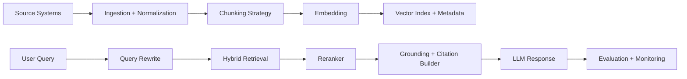
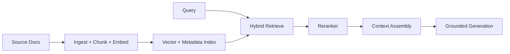

# RAG Retrieval Engineering Architecture

## Overview
This topic focuses on production-grade Retrieval-Augmented Generation (RAG) architecture from ingestion to grounded response quality. It goes deeper into chunking, indexing, retrieval strategy, reranking, evaluation, and freshness operations.

## Why this topic matters
Most enterprise GenAI failures are retrieval failures, not model failures. Interviewers test whether you can improve recall, precision, grounding confidence, and operational reliability under real data constraints.

## Core concepts
- Ingestion and document normalization
- Chunking strategy engineering
- Embedding model selection
- Vector indexing and metadata design
- Hybrid retrieval and query rewriting
- Reranking and top-k tuning
- Grounding and citation strategy
- Evaluation and continuous quality monitoring
- Reindexing and stale data management

## Detailed explanation of each concept
RAG quality depends on retrieval semantics. Ingestion must normalize content, preserve structural signals, and capture metadata needed for access control and filtering. Chunking must align with document semantics and question patterns, not token count alone. Retrieval quality improves when vector search is combined with keyword and metadata constraints. Reranking is often required to improve precision for long or noisy corpora.

Evaluation should include retrieval-specific metrics (recall@k, precision@k, nDCG-like ranking quality, citation correctness) plus end-to-end answer grounding quality. Freshness strategy is mandatory in enterprise environments where content changes frequently; stale indexes create high-confidence wrong answers.

## Evaluation (How to assess architecture quality)
- Retrieval recall and precision by intent class
- Citation correctness and source attribution quality
- Hallucination rate with and without retrieval
- Latency and cost per query
- Freshness lag between source update and index readiness
- Access-control leakage incidents (must be zero)

## Architecture / flow diagram


**Flow explanation:**  
Sources are cleaned and chunked, then embedded with metadata-rich indexing. Queries are rewritten, retrieved via hybrid strategy, reranked, and passed to grounding-aware generation with citations. Evaluation closes the loop.

## Real-world example
A policy-assistant for insurance operations indexes SOP PDFs, underwriting guidelines, and legal circulars. Parent-child chunking preserves section hierarchy, metadata filters enforce business-unit access, hybrid retrieval improves legal keyword recall, reranker improves section precision, and stale-doc alerts trigger reindex pipeline within SLA.

## Best practices
- Preserve document structure (headings/tables) during chunking
- Use metadata as first-class retrieval control
- Combine vector + lexical retrieval for enterprise corpora
- Add reranking before final context assembly
- Tune top-k by task class, not one global default
- Track freshness lag and reindex SLA

## Common mistakes / misconceptions
- Treating chunking as fixed token slicing only
- Ignoring metadata quality and access filters
- Using vector-only retrieval for keyword-critical domains
- No reranker in large noisy corpora
- No retrieval evaluation pipeline before rollout

## Industry relevance
RAG engineering is central in enterprise copilots, support assistants, contract intelligence, policy QA, and internal knowledge systems where correctness and citation trust matter.

## Interview discussion points
- Why bad chunking kills retrieval quality
- Precision vs recall optimization strategy
- Hybrid retrieval architecture design
- Reranker trade-offs (quality vs latency/cost)
- Freshness and reindex operational model

## Links to dependent / related topics
- [Agentic AI Architecture](./agentic_ai_langchain_langgraph.md)
- [RAG, Azure OpenAI, AI Search](./rag_openai_ai_search.md)
- [Security, IAM, Networking](../security/security_iam_networking.md)
- [System Design HLD/LLD](../system-design/system_design_hld_lld.md)

## Interview Questions (50)
1. What is end-to-end RAG flow in enterprise systems?
2. Why does chunking quality dominate RAG performance?
3. Fixed chunking vs semantic chunking: when to use each?
4. What is parent-child retrieval and why use it?
5. How do you design document normalization pipeline?
6. How do you choose embedding models for production RAG?
7. How do you decide chunk size and overlap?
8. How do you handle tables and structured documents in RAG?
9. How do you design metadata schema for retrieval?
10. How do metadata filters improve security and precision?
11. What is hybrid retrieval and when is it required?
12. Vector search vs keyword search trade-offs?
13. How do you design query rewriting safely?
14. What role does reranking play in RAG quality?
15. How do you choose reranker model?
16. How do you tune top-k for different workloads?
17. How do you build context-window optimization strategy?
18. How do you reduce hallucinations in RAG systems?
19. How do citations improve trust and debugging?
20. How do you measure citation correctness?
21. How do you evaluate retrieval recall and precision?
22. Which offline metrics matter for retrieval quality?
23. Which online metrics matter for RAG product quality?
24. How do you create RAG eval dataset?
25. How do you benchmark retrieval by intent classes?
26. How do you handle stale data and reindexing strategy?
27. How do you design incremental indexing pipelines?
28. How do you detect ingestion/index drift?
29. How do you guarantee zero unauthorized retrieval?
30. How do you implement tenant isolation in shared RAG?
31. How do you secure PII in retrieval pipelines?
32. How do you handle multilingual retrieval quality?
33. How do you improve recall without destroying precision?
34. How do you improve precision without losing coverage?
35. How do you debug poor retrieval results quickly?
36. How do you choose vector DB for RAG workloads?
37. How do you design ANN index for scale and latency?
38. How do you manage retrieval latency budgets?
39. How do you control token costs in RAG context assembly?
40. How do you design fallback when retrieval fails?
41. How do you combine RAG with tool calling safely?
42. How do you version prompts, retrievers, and indexes?
43. How do you canary release retrieval changes?
44. How do you rollback bad index deployment?
45. How do you integrate human feedback into retrieval tuning?
46. How do you do domain-specific RAG for legal/finance content?
47. How do you design RAG for long documents and policies?
48. How do you explain RAG trade-offs to leadership?
49. What are common anti-patterns in RAG architecture?
50. How do you conclude a RAG system design interview strongly?

## Enhanced Answering Playbook (Crisp + Deep + Summary + Example)

Use this playbook for retrieval-engineering answers:

- **Crisp answer:** State retrieval decision and expected quality impact.
- **Deep explanation:** Cover chunking/index/rerank trade-offs and failure signals.
- **Answer summary:** End with precision, recall, and governance takeaways.
- **Practical example:** Tie to one enterprise corpus scenario.
- **Diagram thinking:** Show offline ingestion and online retrieval loops.

### Worked Example: Hybrid retrieval with reranking
**Crisp answer:** Combine vector + keyword retrieval, then rerank candidates before context assembly to improve both recall and precision.

**Deep explanation:**  
Vector retrieval captures semantic similarity but may miss exact legal or policy phrases. Keyword retrieval catches explicit terms but can add noisy results. Hybrid retrieval balances both, and reranking refines final evidence set for model context. Metadata filters enforce tenant and role boundaries before prompt assembly. Continuous evaluation on intent-based datasets tracks recall@k, precision@k, and citation correctness so tuning remains measurable.

**Answer summary:**  
- Hybrid retrieval improves robustness across corpus types.  
- Reranking is often the precision multiplier in noisy domains.  
- Retrieval quality must be measured continuously, not assumed.



## Answers for important questions (Summary + Crisp + Deep)

### Q1. What is end-to-end RAG flow in enterprise systems?
**Question summary:** Tests complete architectural understanding from ingestion to grounded answer delivery.
**Crisp answer (7-8 lines):** Enterprise RAG starts with ingestion and normalization. Content is chunked and embedded into searchable indexes. Metadata is attached for filtering and access control. User query is rewritten and retrieved via hybrid strategy. Retrieved chunks are reranked for precision. LLM generates response with citations from selected context. Evaluation and monitoring continuously tune quality.
**Deep explanation (~60-70 lines):** A strong answer to 'What is end-to-end RAG flow in enterprise systems?' should be framed through enterprise architecture decision quality. Begin with the target business outcome and constraints (risk class, compliance scope, response-time target, and cost envelope), because these constraints determine acceptable design choices. Then describe the production path end-to-end: ingress validation, identity and policy checks, orchestration decisions, dependency execution, and output validation before user delivery. Explain why certain steps must remain deterministic (policy decisions, schema checks, authorization gates) while others can remain probabilistic (model reasoning), and how this boundary protects reliability. Discuss failure patterns specific to this domain: degraded dependencies, low-quality retrieval, policy conflicts, model unpredictability, and operational drift. Map each failure to containment controls such as bounded retries, fallback tiers, circuit-breakers, safe-abstain responses, or human approval gates. Add explicit trade-offs interviewers expect: faster response versus tighter governance, lower unit cost versus stronger quality, and centralized control versus team delivery speed. Cover security and privacy implications with concrete control points: least privilege, tenant-aware boundaries, sensitive-data minimization, and auditable traces for every high-risk path. Include measurable KPIs that prove architecture health: task success rate, groundedness or policy pass rate, p95 latency, fallback frequency, and cost per successful outcome. Close with change-safety practices: versioned artifacts, canary rollout, rollback triggers, and feedback loops that convert incidents into better tests and standards. This style demonstrates senior architect maturity because it connects design rationale, operational resilience, and business accountability in one coherent narrative.
**Answer summary:**
- **Decision:** Select the pattern that best satisfies `What is end-to-end RAG flow in enterprise systems?` under your business and compliance constraints.
- **Risk:** Weak control boundaries and unclear ownership create quality, security, and reliability regressions at scale.
- **Mitigation:** Enforce policy gates, measurable SLO/SLA triggers, and tested fallback/recovery playbooks before full rollout.
**Practical example:** In a healthcare claims assistant, the team addresses 'What is end-to-end RAG flow in enterprise systems?' by enforcing role-scoped access, validating each critical step through policy checks, and releasing changes with canary monitoring so quality and compliance remain stable under production traffic.
**Simple diagram:**  
```text
Ingest -> Chunk -> Embed -> Index -> Retrieve -> Rerank -> Generate + Cite
```
**Trusted reference links:**  
- https://learn.microsoft.com/en-us/azure/architecture/ai-ml/guide/rag/

### Q2. Why does chunking quality dominate RAG performance?
**Question summary:** Core retrieval quality question often asked.
**Crisp answer (7-8 lines):** Chunking defines the retrieval unit. Poor chunks split meaning or mix unrelated content. This reduces recall and precision simultaneously. Overlarge chunks waste context window and increase noise. Oversmall chunks lose semantic coherence. Good chunking preserves intent-bearing units. It is the foundation of reliable retrieval.
**Deep explanation (~60-70 lines):** A strong answer to 'Why does chunking quality dominate RAG performance?' should be framed through retrieval quality engineering. Begin with the target business outcome and constraints (risk class, compliance scope, response-time target, and cost envelope), because these constraints determine acceptable design choices. Then describe the production path end-to-end: ingress validation, identity and policy checks, orchestration decisions, dependency execution, and output validation before user delivery. Explain why certain steps must remain deterministic (policy decisions, schema checks, authorization gates) while others can remain probabilistic (model reasoning), and how this boundary protects reliability. Discuss failure patterns specific to this domain: degraded dependencies, low-quality retrieval, policy conflicts, model unpredictability, and operational drift. Map each failure to containment controls such as bounded retries, fallback tiers, circuit-breakers, safe-abstain responses, or human approval gates. Add explicit trade-offs interviewers expect: faster response versus tighter governance, lower unit cost versus stronger quality, and centralized control versus team delivery speed. Cover security and privacy implications with concrete control points: least privilege, tenant-aware boundaries, sensitive-data minimization, and auditable traces for every high-risk path. Include measurable KPIs that prove architecture health: task success rate, groundedness or policy pass rate, p95 latency, fallback frequency, and cost per successful outcome. Close with change-safety practices: versioned artifacts, canary rollout, rollback triggers, and feedback loops that convert incidents into better tests and standards. This style demonstrates senior architect maturity because it connects design rationale, operational resilience, and business accountability in one coherent narrative.
**Answer summary:**
- **Decision:** Select the pattern that best satisfies `Why does chunking quality dominate RAG performance?` under your business and compliance constraints.
- **Risk:** Weak control boundaries and unclear ownership create quality, security, and reliability regressions at scale.
- **Mitigation:** Enforce policy gates, measurable SLO/SLA triggers, and tested fallback/recovery playbooks before full rollout.
**Practical example:** In a insurance underwriting knowledge bot, the team addresses 'Why does chunking quality dominate RAG performance?' by enforcing role-scoped access, validating each critical step through policy checks, and releasing changes with canary monitoring so quality and compliance remain stable under production traffic.
**Simple diagram:**  
```text
Bad Chunks -> Bad Retrieval -> Weak Answers
Good Chunks -> Better Retrieval -> Grounded Answers
```
**Trusted reference links:**  
- https://learn.microsoft.com/en-us/azure/search/vector-search-overview

### Q3. Fixed chunking vs semantic chunking: when to use each?
**Question summary:** Strategy trade-off question.
**Crisp answer (7-8 lines):** Fixed chunking is simple, predictable, and cheap. Semantic chunking preserves logical boundaries and meaning. Use fixed chunking for homogeneous text and fast pipelines. Use semantic chunking for complex docs with sections/tables. Semantic improves quality but adds preprocessing cost. Hybrid strategy often works best in enterprise corpora. Choose based on quality target and pipeline budget.
**Deep explanation (~60-70 lines):** A strong answer to 'Fixed chunking vs semantic chunking: when to use each?' should be framed through retrieval quality engineering. Begin with the target business outcome and constraints (risk class, compliance scope, response-time target, and cost envelope), because these constraints determine acceptable design choices. Then describe the production path end-to-end: ingress validation, identity and policy checks, orchestration decisions, dependency execution, and output validation before user delivery. Explain why certain steps must remain deterministic (policy decisions, schema checks, authorization gates) while others can remain probabilistic (model reasoning), and how this boundary protects reliability. Discuss failure patterns specific to this domain: degraded dependencies, low-quality retrieval, policy conflicts, model unpredictability, and operational drift. Map each failure to containment controls such as bounded retries, fallback tiers, circuit-breakers, safe-abstain responses, or human approval gates. Add explicit trade-offs interviewers expect: faster response versus tighter governance, lower unit cost versus stronger quality, and centralized control versus team delivery speed. Cover security and privacy implications with concrete control points: least privilege, tenant-aware boundaries, sensitive-data minimization, and auditable traces for every high-risk path. Include measurable KPIs that prove architecture health: task success rate, groundedness or policy pass rate, p95 latency, fallback frequency, and cost per successful outcome. Close with change-safety practices: versioned artifacts, canary rollout, rollback triggers, and feedback loops that convert incidents into better tests and standards. This style demonstrates senior architect maturity because it connects design rationale, operational resilience, and business accountability in one coherent narrative.
**Answer summary:**
- **Decision:** Select the pattern that best satisfies `Fixed chunking vs semantic chunking: when to use each?` under your business and compliance constraints.
- **Risk:** Weak control boundaries and unclear ownership create quality, security, and reliability regressions at scale.
- **Mitigation:** Enforce policy gates, measurable SLO/SLA triggers, and tested fallback/recovery playbooks before full rollout.
**Practical example:** In a enterprise IT support assistant, the team addresses 'Fixed chunking vs semantic chunking: when to use each?' by enforcing role-scoped access, validating each critical step through policy checks, and releasing changes with canary monitoring so quality and compliance remain stable under production traffic.
**Simple diagram:**  
```text
Fixed: token windows
Semantic: section-aware chunks
```
**Trusted reference links:**  
- https://learn.microsoft.com/en-us/azure/ai-foundry/concepts/retrieval-augmented-generation

### Q4. What is parent-child retrieval and why use it?
**Question summary:** Advanced retrieval design.
**Crisp answer (7-8 lines):** Parent-child retrieval indexes smaller child chunks for matching. It returns larger parent context for generation. Child improves precise retrieval; parent improves answer completeness. It balances precision and coherence. It works well for policy/legal documents. It reduces context fragmentation. It improves citation traceability to source sections.
**Deep explanation (~60-70 lines):** A strong answer to 'What is parent-child retrieval and why use it?' should be framed through retrieval quality engineering. Begin with the target business outcome and constraints (risk class, compliance scope, response-time target, and cost envelope), because these constraints determine acceptable design choices. Then describe the production path end-to-end: ingress validation, identity and policy checks, orchestration decisions, dependency execution, and output validation before user delivery. Explain why certain steps must remain deterministic (policy decisions, schema checks, authorization gates) while others can remain probabilistic (model reasoning), and how this boundary protects reliability. Discuss failure patterns specific to this domain: degraded dependencies, low-quality retrieval, policy conflicts, model unpredictability, and operational drift. Map each failure to containment controls such as bounded retries, fallback tiers, circuit-breakers, safe-abstain responses, or human approval gates. Add explicit trade-offs interviewers expect: faster response versus tighter governance, lower unit cost versus stronger quality, and centralized control versus team delivery speed. Cover security and privacy implications with concrete control points: least privilege, tenant-aware boundaries, sensitive-data minimization, and auditable traces for every high-risk path. Include measurable KPIs that prove architecture health: task success rate, groundedness or policy pass rate, p95 latency, fallback frequency, and cost per successful outcome. Close with change-safety practices: versioned artifacts, canary rollout, rollback triggers, and feedback loops that convert incidents into better tests and standards. This style demonstrates senior architect maturity because it connects design rationale, operational resilience, and business accountability in one coherent narrative.
**Answer summary:**
- **Decision:** Select the pattern that best satisfies `What is parent-child retrieval and why use it?` under your business and compliance constraints.
- **Risk:** Weak control boundaries and unclear ownership create quality, security, and reliability regressions at scale.
- **Mitigation:** Enforce policy gates, measurable SLO/SLA triggers, and tested fallback/recovery playbooks before full rollout.
**Practical example:** In a procurement contract Q&A assistant, the team addresses 'What is parent-child retrieval and why use it?' by enforcing role-scoped access, validating each critical step through policy checks, and releasing changes with canary monitoring so quality and compliance remain stable under production traffic.
**Simple diagram:**  
```text
Query -> Child Match -> Parent Context -> LLM
```
**Trusted reference links:**  
- https://learn.microsoft.com/en-us/azure/search/search-what-is-azure-search

### Q5. How do you design document normalization pipeline?
**Question summary:** Ingestion robustness test.
**Crisp answer (7-8 lines):** Standardize encodings and remove extraction noise. Preserve headings, tables, and section hierarchy. Normalize whitespace and broken line artifacts. Extract metadata like source, date, owner, classification. Deduplicate near-identical content versions. Store provenance for audit and rollback. Validate normalized output before indexing.
**Deep explanation (~60-70 lines):** A strong answer to 'How do you design document normalization pipeline?' should be framed through enterprise architecture decision quality. Begin with the target business outcome and constraints (risk class, compliance scope, response-time target, and cost envelope), because these constraints determine acceptable design choices. Then describe the production path end-to-end: ingress validation, identity and policy checks, orchestration decisions, dependency execution, and output validation before user delivery. Explain why certain steps must remain deterministic (policy decisions, schema checks, authorization gates) while others can remain probabilistic (model reasoning), and how this boundary protects reliability. Discuss failure patterns specific to this domain: degraded dependencies, low-quality retrieval, policy conflicts, model unpredictability, and operational drift. Map each failure to containment controls such as bounded retries, fallback tiers, circuit-breakers, safe-abstain responses, or human approval gates. Add explicit trade-offs interviewers expect: faster response versus tighter governance, lower unit cost versus stronger quality, and centralized control versus team delivery speed. Cover security and privacy implications with concrete control points: least privilege, tenant-aware boundaries, sensitive-data minimization, and auditable traces for every high-risk path. Include measurable KPIs that prove architecture health: task success rate, groundedness or policy pass rate, p95 latency, fallback frequency, and cost per successful outcome. Close with change-safety practices: versioned artifacts, canary rollout, rollback triggers, and feedback loops that convert incidents into better tests and standards. This style demonstrates senior architect maturity because it connects design rationale, operational resilience, and business accountability in one coherent narrative.
**Answer summary:**
- **Decision:** Select the pattern that best satisfies `How do you design document normalization pipeline?` under your business and compliance constraints.
- **Risk:** Weak control boundaries and unclear ownership create quality, security, and reliability regressions at scale.
- **Mitigation:** Enforce policy gates, measurable SLO/SLA triggers, and tested fallback/recovery playbooks before full rollout.
**Practical example:** In a internal audit/compliance copilot, the team addresses 'How do you design document normalization pipeline?' by enforcing role-scoped access, validating each critical step through policy checks, and releasing changes with canary monitoring so quality and compliance remain stable under production traffic.
**Simple diagram:**  
```text
Raw Docs -> Parse/Clean -> Structure Preserve -> Metadata Attach -> Ready for Chunking
```
**Trusted reference links:**  
- https://learn.microsoft.com/en-us/azure/architecture/data-guide/

### Q6. How do you choose embedding models for production RAG?
**Question summary:** Model selection for retrieval quality/cost.
**Crisp answer (7-8 lines):** Evaluate embedding quality on domain corpus first. Compare recall@k and ranking metrics by use case. Check multilingual support where needed. Measure latency and cost per 1K vectors. Validate dimensionality and storage implications. Ensure compliance/privacy fit. Re-evaluate when corpus or query patterns shift.
**Deep explanation (~60-70 lines):** A strong answer to 'How do you choose embedding models for production RAG?' should be framed through retrieval quality engineering. Begin with the target business outcome and constraints (risk class, compliance scope, response-time target, and cost envelope), because these constraints determine acceptable design choices. Then describe the production path end-to-end: ingress validation, identity and policy checks, orchestration decisions, dependency execution, and output validation before user delivery. Explain why certain steps must remain deterministic (policy decisions, schema checks, authorization gates) while others can remain probabilistic (model reasoning), and how this boundary protects reliability. Discuss failure patterns specific to this domain: degraded dependencies, low-quality retrieval, policy conflicts, model unpredictability, and operational drift. Map each failure to containment controls such as bounded retries, fallback tiers, circuit-breakers, safe-abstain responses, or human approval gates. Add explicit trade-offs interviewers expect: faster response versus tighter governance, lower unit cost versus stronger quality, and centralized control versus team delivery speed. Cover security and privacy implications with concrete control points: least privilege, tenant-aware boundaries, sensitive-data minimization, and auditable traces for every high-risk path. Include measurable KPIs that prove architecture health: task success rate, groundedness or policy pass rate, p95 latency, fallback frequency, and cost per successful outcome. Close with change-safety practices: versioned artifacts, canary rollout, rollback triggers, and feedback loops that convert incidents into better tests and standards. This style demonstrates senior architect maturity because it connects design rationale, operational resilience, and business accountability in one coherent narrative.
**Answer summary:**
- **Decision:** Select the pattern that best satisfies `How do you choose embedding models for production RAG?` under your business and compliance constraints.
- **Risk:** Weak control boundaries and unclear ownership create quality, security, and reliability regressions at scale.
- **Mitigation:** Enforce policy gates, measurable SLO/SLA triggers, and tested fallback/recovery playbooks before full rollout.
**Practical example:** In a customer support triage assistant, the team addresses 'How do you choose embedding models for production RAG?' by enforcing role-scoped access, validating each critical step through policy checks, and releasing changes with canary monitoring so quality and compliance remain stable under production traffic.
**Simple diagram:**  
```text
Candidate Embeddings -> Offline Eval -> Cost/Latency Check -> Select
```
**Trusted reference links:**  
- https://learn.microsoft.com/en-us/azure/ai-services/openai/concepts/embeddings

### Q7. How do you decide chunk size and overlap?
**Question summary:** Practical tuning question.
**Crisp answer (7-8 lines):** Start from question length and expected evidence span. Use smaller chunks for pinpoint factual queries. Use larger chunks for reasoning-heavy responses. Add overlap to avoid boundary loss. Keep overlap minimal to reduce redundancy and cost. Validate with retrieval metrics not intuition. Tune per document class when necessary.
**Deep explanation (~60-70 lines):** A strong answer to 'How do you decide chunk size and overlap?' should be framed through retrieval quality engineering. Begin with the target business outcome and constraints (risk class, compliance scope, response-time target, and cost envelope), because these constraints determine acceptable design choices. Then describe the production path end-to-end: ingress validation, identity and policy checks, orchestration decisions, dependency execution, and output validation before user delivery. Explain why certain steps must remain deterministic (policy decisions, schema checks, authorization gates) while others can remain probabilistic (model reasoning), and how this boundary protects reliability. Discuss failure patterns specific to this domain: degraded dependencies, low-quality retrieval, policy conflicts, model unpredictability, and operational drift. Map each failure to containment controls such as bounded retries, fallback tiers, circuit-breakers, safe-abstain responses, or human approval gates. Add explicit trade-offs interviewers expect: faster response versus tighter governance, lower unit cost versus stronger quality, and centralized control versus team delivery speed. Cover security and privacy implications with concrete control points: least privilege, tenant-aware boundaries, sensitive-data minimization, and auditable traces for every high-risk path. Include measurable KPIs that prove architecture health: task success rate, groundedness or policy pass rate, p95 latency, fallback frequency, and cost per successful outcome. Close with change-safety practices: versioned artifacts, canary rollout, rollback triggers, and feedback loops that convert incidents into better tests and standards. This style demonstrates senior architect maturity because it connects design rationale, operational resilience, and business accountability in one coherent narrative.
**Answer summary:**
- **Decision:** Select the pattern that best satisfies `How do you decide chunk size and overlap?` under your business and compliance constraints.
- **Risk:** Weak control boundaries and unclear ownership create quality, security, and reliability regressions at scale.
- **Mitigation:** Enforce policy gates, measurable SLO/SLA triggers, and tested fallback/recovery playbooks before full rollout.
**Practical example:** In a operations incident copilot, the team addresses 'How do you decide chunk size and overlap?' by enforcing role-scoped access, validating each critical step through policy checks, and releasing changes with canary monitoring so quality and compliance remain stable under production traffic.
**Simple diagram:**  
```text
Chunk Size + Overlap -> Retrieval Metrics -> Iterate
```
**Trusted reference links:**  
- https://learn.microsoft.com/en-us/azure/ai-foundry/concepts/retrieval-augmented-generation

### Q8. How do you handle tables and structured documents in RAG?
**Question summary:** Structured content retrieval challenge.
**Crisp answer (7-8 lines):** Preserve table structure during extraction. Use schema-aware chunking for rows/sections. Store column metadata for filtered retrieval. Avoid flattening that destroys relational meaning. Add specialized parser for PDFs and scanned docs. Validate table fidelity in sample audits. Include table-origin citations in final response.
**Deep explanation (~60-70 lines):** A strong answer to 'How do you handle tables and structured documents in RAG?' should be framed through enterprise architecture decision quality. Begin with the target business outcome and constraints (risk class, compliance scope, response-time target, and cost envelope), because these constraints determine acceptable design choices. Then describe the production path end-to-end: ingress validation, identity and policy checks, orchestration decisions, dependency execution, and output validation before user delivery. Explain why certain steps must remain deterministic (policy decisions, schema checks, authorization gates) while others can remain probabilistic (model reasoning), and how this boundary protects reliability. Discuss failure patterns specific to this domain: degraded dependencies, low-quality retrieval, policy conflicts, model unpredictability, and operational drift. Map each failure to containment controls such as bounded retries, fallback tiers, circuit-breakers, safe-abstain responses, or human approval gates. Add explicit trade-offs interviewers expect: faster response versus tighter governance, lower unit cost versus stronger quality, and centralized control versus team delivery speed. Cover security and privacy implications with concrete control points: least privilege, tenant-aware boundaries, sensitive-data minimization, and auditable traces for every high-risk path. Include measurable KPIs that prove architecture health: task success rate, groundedness or policy pass rate, p95 latency, fallback frequency, and cost per successful outcome. Close with change-safety practices: versioned artifacts, canary rollout, rollback triggers, and feedback loops that convert incidents into better tests and standards. This style demonstrates senior architect maturity because it connects design rationale, operational resilience, and business accountability in one coherent narrative.
**Answer summary:**
- **Decision:** Select the pattern that best satisfies `How do you handle tables and structured documents in RAG?` under your business and compliance constraints.
- **Risk:** Weak control boundaries and unclear ownership create quality, security, and reliability regressions at scale.
- **Mitigation:** Enforce policy gates, measurable SLO/SLA triggers, and tested fallback/recovery playbooks before full rollout.
**Practical example:** In a banking policy copilot, the team addresses 'How do you handle tables and structured documents in RAG?' by enforcing role-scoped access, validating each critical step through policy checks, and releasing changes with canary monitoring so quality and compliance remain stable under production traffic.
**Simple diagram:**  
```text
Table Doc -> Structured Parse -> Schema-aware Chunks -> Retrieval
```
**Trusted reference links:**  
- https://learn.microsoft.com/en-us/azure/ai-services/document-intelligence/

### Q9. How do you design metadata schema for retrieval?
**Question summary:** Precision and governance design.
**Crisp answer (7-8 lines):** Include source, version, timestamp, owner, and sensitivity class. Add tenant and access scope fields for security filtering. Add document type and business domain for ranking hints. Keep metadata normalized and mandatory where critical. Validate metadata completeness in ingestion QA. Version schema changes carefully. Monitor filter hit rates and leakage risk.
**Deep explanation (~60-70 lines):** A strong answer to 'How do you design metadata schema for retrieval?' should be framed through retrieval quality engineering. Begin with the target business outcome and constraints (risk class, compliance scope, response-time target, and cost envelope), because these constraints determine acceptable design choices. Then describe the production path end-to-end: ingress validation, identity and policy checks, orchestration decisions, dependency execution, and output validation before user delivery. Explain why certain steps must remain deterministic (policy decisions, schema checks, authorization gates) while others can remain probabilistic (model reasoning), and how this boundary protects reliability. Discuss failure patterns specific to this domain: degraded dependencies, low-quality retrieval, policy conflicts, model unpredictability, and operational drift. Map each failure to containment controls such as bounded retries, fallback tiers, circuit-breakers, safe-abstain responses, or human approval gates. Add explicit trade-offs interviewers expect: faster response versus tighter governance, lower unit cost versus stronger quality, and centralized control versus team delivery speed. Cover security and privacy implications with concrete control points: least privilege, tenant-aware boundaries, sensitive-data minimization, and auditable traces for every high-risk path. Include measurable KPIs that prove architecture health: task success rate, groundedness or policy pass rate, p95 latency, fallback frequency, and cost per successful outcome. Close with change-safety practices: versioned artifacts, canary rollout, rollback triggers, and feedback loops that convert incidents into better tests and standards. This style demonstrates senior architect maturity because it connects design rationale, operational resilience, and business accountability in one coherent narrative.
**Answer summary:**
- **Decision:** Select the pattern that best satisfies `How do you design metadata schema for retrieval?` under your business and compliance constraints.
- **Risk:** Weak control boundaries and unclear ownership create quality, security, and reliability regressions at scale.
- **Mitigation:** Enforce policy gates, measurable SLO/SLA triggers, and tested fallback/recovery playbooks before full rollout.
**Practical example:** In a healthcare claims assistant, the team addresses 'How do you design metadata schema for retrieval?' by enforcing role-scoped access, validating each critical step through policy checks, and releasing changes with canary monitoring so quality and compliance remain stable under production traffic.
**Simple diagram:**  
```text
Chunk + Metadata -> Filtered Retrieval -> Safer/Better Results
```
**Trusted reference links:**  
- https://learn.microsoft.com/en-us/azure/search/search-filters

### Q10. How do metadata filters improve security and precision?
**Question summary:** Cross-topic retrieval + security.
**Crisp answer (7-8 lines):** Filters narrow search to authorized and relevant subsets. They prevent cross-tenant or cross-domain leakage. They reduce noise before ranking. They improve precision for role-specific queries. They enforce policy at retrieval-time. They also reduce compute and reranking load. They are mandatory in enterprise RAG.
**Deep explanation (~60-70 lines):** A strong answer to 'How do metadata filters improve security and precision?' should be framed through security architecture and policy enforcement. Begin with the target business outcome and constraints (risk class, compliance scope, response-time target, and cost envelope), because these constraints determine acceptable design choices. Then describe the production path end-to-end: ingress validation, identity and policy checks, orchestration decisions, dependency execution, and output validation before user delivery. Explain why certain steps must remain deterministic (policy decisions, schema checks, authorization gates) while others can remain probabilistic (model reasoning), and how this boundary protects reliability. Discuss failure patterns specific to this domain: degraded dependencies, low-quality retrieval, policy conflicts, model unpredictability, and operational drift. Map each failure to containment controls such as bounded retries, fallback tiers, circuit-breakers, safe-abstain responses, or human approval gates. Add explicit trade-offs interviewers expect: faster response versus tighter governance, lower unit cost versus stronger quality, and centralized control versus team delivery speed. Cover security and privacy implications with concrete control points: least privilege, tenant-aware boundaries, sensitive-data minimization, and auditable traces for every high-risk path. Include measurable KPIs that prove architecture health: task success rate, groundedness or policy pass rate, p95 latency, fallback frequency, and cost per successful outcome. Close with change-safety practices: versioned artifacts, canary rollout, rollback triggers, and feedback loops that convert incidents into better tests and standards. This style demonstrates senior architect maturity because it connects design rationale, operational resilience, and business accountability in one coherent narrative.
**Answer summary:**
- **Decision:** Select the pattern that best satisfies `How do metadata filters improve security and precision?` under your business and compliance constraints.
- **Risk:** Weak control boundaries and unclear ownership create quality, security, and reliability regressions at scale.
- **Mitigation:** Enforce policy gates, measurable SLO/SLA triggers, and tested fallback/recovery playbooks before full rollout.
**Practical example:** In a insurance underwriting knowledge bot, the team addresses 'How do metadata filters improve security and precision?' by enforcing role-scoped access, validating each critical step through policy checks, and releasing changes with canary monitoring so quality and compliance remain stable under production traffic.
**Simple diagram:**  
```text
Query -> Auth/Domain Filters -> Candidate Set -> Rank
```
**Trusted reference links:**  
- https://learn.microsoft.com/en-us/azure/search/search-security-trimming-for-azure-search

### Q11. What is hybrid retrieval and when is it required?
**Question summary:** Core enterprise retrieval pattern.
**Crisp answer (7-8 lines):** Hybrid retrieval combines vector similarity with lexical/keyword scoring. It is required when corpus has exact terms, IDs, and semantic language mixed. Vector handles semantic paraphrase. Keyword handles exact legal/product terminology. Fusion improves robustness across query types. It is standard in enterprise QA corpora. Use weighted blending and evaluate.
**Deep explanation (~60-70 lines):** A strong answer to 'What is hybrid retrieval and when is it required?' should be framed through retrieval quality engineering. Begin with the target business outcome and constraints (risk class, compliance scope, response-time target, and cost envelope), because these constraints determine acceptable design choices. Then describe the production path end-to-end: ingress validation, identity and policy checks, orchestration decisions, dependency execution, and output validation before user delivery. Explain why certain steps must remain deterministic (policy decisions, schema checks, authorization gates) while others can remain probabilistic (model reasoning), and how this boundary protects reliability. Discuss failure patterns specific to this domain: degraded dependencies, low-quality retrieval, policy conflicts, model unpredictability, and operational drift. Map each failure to containment controls such as bounded retries, fallback tiers, circuit-breakers, safe-abstain responses, or human approval gates. Add explicit trade-offs interviewers expect: faster response versus tighter governance, lower unit cost versus stronger quality, and centralized control versus team delivery speed. Cover security and privacy implications with concrete control points: least privilege, tenant-aware boundaries, sensitive-data minimization, and auditable traces for every high-risk path. Include measurable KPIs that prove architecture health: task success rate, groundedness or policy pass rate, p95 latency, fallback frequency, and cost per successful outcome. Close with change-safety practices: versioned artifacts, canary rollout, rollback triggers, and feedback loops that convert incidents into better tests and standards. This style demonstrates senior architect maturity because it connects design rationale, operational resilience, and business accountability in one coherent narrative.
**Answer summary:**
- **Decision:** Select the pattern that best satisfies `What is hybrid retrieval and when is it required?` under your business and compliance constraints.
- **Risk:** Weak control boundaries and unclear ownership create quality, security, and reliability regressions at scale.
- **Mitigation:** Enforce policy gates, measurable SLO/SLA triggers, and tested fallback/recovery playbooks before full rollout.
**Practical example:** In a enterprise IT support assistant, the team addresses 'What is hybrid retrieval and when is it required?' by enforcing role-scoped access, validating each critical step through policy checks, and releasing changes with canary monitoring so quality and compliance remain stable under production traffic.
**Simple diagram:**  
```text
Vector Results + Keyword Results -> Fusion -> Ranked Candidates
```
**Trusted reference links:**  
- https://learn.microsoft.com/en-us/azure/search/hybrid-search-overview

### Q12. Vector search vs keyword search trade-offs?
**Question summary:** Retrieval method comparison.
**Crisp answer (7-8 lines):** Vector search captures semantic similarity and paraphrase. Keyword search captures exact terms and identifiers. Vector may miss strict literals. Keyword may miss semantic intent. Vector quality depends on embedding fit. Keyword quality depends on analyzer/tokenization design. Hybrid often outperforms both alone.
**Deep explanation (~60-70 lines):** A strong answer to 'Vector search vs keyword search trade-offs?' should be framed through enterprise architecture decision quality. Begin with the target business outcome and constraints (risk class, compliance scope, response-time target, and cost envelope), because these constraints determine acceptable design choices. Then describe the production path end-to-end: ingress validation, identity and policy checks, orchestration decisions, dependency execution, and output validation before user delivery. Explain why certain steps must remain deterministic (policy decisions, schema checks, authorization gates) while others can remain probabilistic (model reasoning), and how this boundary protects reliability. Discuss failure patterns specific to this domain: degraded dependencies, low-quality retrieval, policy conflicts, model unpredictability, and operational drift. Map each failure to containment controls such as bounded retries, fallback tiers, circuit-breakers, safe-abstain responses, or human approval gates. Add explicit trade-offs interviewers expect: faster response versus tighter governance, lower unit cost versus stronger quality, and centralized control versus team delivery speed. Cover security and privacy implications with concrete control points: least privilege, tenant-aware boundaries, sensitive-data minimization, and auditable traces for every high-risk path. Include measurable KPIs that prove architecture health: task success rate, groundedness or policy pass rate, p95 latency, fallback frequency, and cost per successful outcome. Close with change-safety practices: versioned artifacts, canary rollout, rollback triggers, and feedback loops that convert incidents into better tests and standards. This style demonstrates senior architect maturity because it connects design rationale, operational resilience, and business accountability in one coherent narrative.
**Answer summary:**
- **Decision:** Select the pattern that best satisfies `Vector search vs keyword search trade-offs?` under your business and compliance constraints.
- **Risk:** Weak control boundaries and unclear ownership create quality, security, and reliability regressions at scale.
- **Mitigation:** Enforce policy gates, measurable SLO/SLA triggers, and tested fallback/recovery playbooks before full rollout.
**Practical example:** In a procurement contract Q&A assistant, the team addresses 'Vector search vs keyword search trade-offs?' by enforcing role-scoped access, validating each critical step through policy checks, and releasing changes with canary monitoring so quality and compliance remain stable under production traffic.
**Simple diagram:**  
```text
Semantic Query -> Vector
Exact Query -> Keyword
Mixed Query -> Hybrid
```
**Trusted reference links:**  
- https://learn.microsoft.com/en-us/azure/search/search-what-is-azure-search

### Q13. How do you design query rewriting safely?
**Question summary:** Recall improvement without policy risk.
**Crisp answer (7-8 lines):** Rewrite query to improve retrieval intent clarity. Preserve original meaning and constraints strictly. Keep rewrite bounded and auditable. Avoid adding unauthorized assumptions. Use dual retrieval on original + rewritten forms where needed. Log rewrite deltas for evaluation. Disable rewrite for high-risk intent classes.
**Deep explanation (~60-70 lines):** A strong answer to 'How do you design query rewriting safely?' should be framed through enterprise architecture decision quality. Begin with the target business outcome and constraints (risk class, compliance scope, response-time target, and cost envelope), because these constraints determine acceptable design choices. Then describe the production path end-to-end: ingress validation, identity and policy checks, orchestration decisions, dependency execution, and output validation before user delivery. Explain why certain steps must remain deterministic (policy decisions, schema checks, authorization gates) while others can remain probabilistic (model reasoning), and how this boundary protects reliability. Discuss failure patterns specific to this domain: degraded dependencies, low-quality retrieval, policy conflicts, model unpredictability, and operational drift. Map each failure to containment controls such as bounded retries, fallback tiers, circuit-breakers, safe-abstain responses, or human approval gates. Add explicit trade-offs interviewers expect: faster response versus tighter governance, lower unit cost versus stronger quality, and centralized control versus team delivery speed. Cover security and privacy implications with concrete control points: least privilege, tenant-aware boundaries, sensitive-data minimization, and auditable traces for every high-risk path. Include measurable KPIs that prove architecture health: task success rate, groundedness or policy pass rate, p95 latency, fallback frequency, and cost per successful outcome. Close with change-safety practices: versioned artifacts, canary rollout, rollback triggers, and feedback loops that convert incidents into better tests and standards. This style demonstrates senior architect maturity because it connects design rationale, operational resilience, and business accountability in one coherent narrative.
**Answer summary:**
- **Decision:** Select the pattern that best satisfies `How do you design query rewriting safely?` under your business and compliance constraints.
- **Risk:** Weak control boundaries and unclear ownership create quality, security, and reliability regressions at scale.
- **Mitigation:** Enforce policy gates, measurable SLO/SLA triggers, and tested fallback/recovery playbooks before full rollout.
**Practical example:** In a internal audit/compliance copilot, the team addresses 'How do you design query rewriting safely?' by enforcing role-scoped access, validating each critical step through policy checks, and releasing changes with canary monitoring so quality and compliance remain stable under production traffic.
**Simple diagram:**  
```text
Original Query -> Rewrite -> Retrieval -> Compare/Select
```
**Trusted reference links:**  
- https://learn.microsoft.com/en-us/azure/architecture/ai-ml/guide/rag/

### Q14. What role does reranking play in RAG quality?
**Question summary:** Precision-stage architecture.
**Crisp answer (7-8 lines):** Reranking refines candidate set ordering after initial retrieval. It improves precision at top context slots. It reduces noisy chunks entering prompt. It is valuable in large heterogeneous corpora. It can significantly improve answer grounding. It adds latency/cost, so tune candidate depth. It is often essential for enterprise quality.
**Deep explanation (~60-70 lines):** A strong answer to 'What role does reranking play in RAG quality?' should be framed through retrieval quality engineering. Begin with the target business outcome and constraints (risk class, compliance scope, response-time target, and cost envelope), because these constraints determine acceptable design choices. Then describe the production path end-to-end: ingress validation, identity and policy checks, orchestration decisions, dependency execution, and output validation before user delivery. Explain why certain steps must remain deterministic (policy decisions, schema checks, authorization gates) while others can remain probabilistic (model reasoning), and how this boundary protects reliability. Discuss failure patterns specific to this domain: degraded dependencies, low-quality retrieval, policy conflicts, model unpredictability, and operational drift. Map each failure to containment controls such as bounded retries, fallback tiers, circuit-breakers, safe-abstain responses, or human approval gates. Add explicit trade-offs interviewers expect: faster response versus tighter governance, lower unit cost versus stronger quality, and centralized control versus team delivery speed. Cover security and privacy implications with concrete control points: least privilege, tenant-aware boundaries, sensitive-data minimization, and auditable traces for every high-risk path. Include measurable KPIs that prove architecture health: task success rate, groundedness or policy pass rate, p95 latency, fallback frequency, and cost per successful outcome. Close with change-safety practices: versioned artifacts, canary rollout, rollback triggers, and feedback loops that convert incidents into better tests and standards. This style demonstrates senior architect maturity because it connects design rationale, operational resilience, and business accountability in one coherent narrative.
**Answer summary:**
- **Decision:** Select the pattern that best satisfies `What role does reranking play in RAG quality?` under your business and compliance constraints.
- **Risk:** Weak control boundaries and unclear ownership create quality, security, and reliability regressions at scale.
- **Mitigation:** Enforce policy gates, measurable SLO/SLA triggers, and tested fallback/recovery playbooks before full rollout.
**Practical example:** In a customer support triage assistant, the team addresses 'What role does reranking play in RAG quality?' by enforcing role-scoped access, validating each critical step through policy checks, and releasing changes with canary monitoring so quality and compliance remain stable under production traffic.
**Simple diagram:**  
```text
Retrieve Top-N -> Rerank -> Select Top-M for LLM
```
**Trusted reference links:**  
- https://learn.microsoft.com/en-us/azure/search/semantic-search-overview

### Q15. How do you choose reranker model?
**Question summary:** Quality-latency-cost trade-off.
**Crisp answer (7-8 lines):** Benchmark reranker on domain relevance tasks. Compare precision uplift versus latency cost. Evaluate multilingual/domain support. Size candidate list to reranker budget. Prefer stable inference performance under load. Validate with citation correctness outcomes. Pick model that improves top-context precision materially.
**Deep explanation (~60-70 lines):** A strong answer to 'How do you choose reranker model?' should be framed through retrieval quality engineering. Begin with the target business outcome and constraints (risk class, compliance scope, response-time target, and cost envelope), because these constraints determine acceptable design choices. Then describe the production path end-to-end: ingress validation, identity and policy checks, orchestration decisions, dependency execution, and output validation before user delivery. Explain why certain steps must remain deterministic (policy decisions, schema checks, authorization gates) while others can remain probabilistic (model reasoning), and how this boundary protects reliability. Discuss failure patterns specific to this domain: degraded dependencies, low-quality retrieval, policy conflicts, model unpredictability, and operational drift. Map each failure to containment controls such as bounded retries, fallback tiers, circuit-breakers, safe-abstain responses, or human approval gates. Add explicit trade-offs interviewers expect: faster response versus tighter governance, lower unit cost versus stronger quality, and centralized control versus team delivery speed. Cover security and privacy implications with concrete control points: least privilege, tenant-aware boundaries, sensitive-data minimization, and auditable traces for every high-risk path. Include measurable KPIs that prove architecture health: task success rate, groundedness or policy pass rate, p95 latency, fallback frequency, and cost per successful outcome. Close with change-safety practices: versioned artifacts, canary rollout, rollback triggers, and feedback loops that convert incidents into better tests and standards. This style demonstrates senior architect maturity because it connects design rationale, operational resilience, and business accountability in one coherent narrative.
**Answer summary:**
- **Decision:** Select the pattern that best satisfies `How do you choose reranker model?` under your business and compliance constraints.
- **Risk:** Weak control boundaries and unclear ownership create quality, security, and reliability regressions at scale.
- **Mitigation:** Enforce policy gates, measurable SLO/SLA triggers, and tested fallback/recovery playbooks before full rollout.
**Practical example:** In a operations incident copilot, the team addresses 'How do you choose reranker model?' by enforcing role-scoped access, validating each critical step through policy checks, and releasing changes with canary monitoring so quality and compliance remain stable under production traffic.
**Simple diagram:**  
```text
Reranker Candidates -> Relevance Eval -> Latency/Cost Filter -> Select
```
**Trusted reference links:**  
- https://learn.microsoft.com/en-us/azure/search/semantic-search-overview

### Q16. How do you tune top-k for different workloads?
**Question summary:** Context assembly optimization.
**Crisp answer (7-8 lines):** Start with baseline k for each intent category. Measure recall and answer quality as k changes. Avoid oversized k that adds noise and token cost. Use adaptive k based on query confidence/complexity. Tune separately for FAQ, policy, and analytical intents. Combine with reranker to keep final context sharp. Recalibrate periodically.
**Deep explanation (~60-70 lines):** A strong answer to 'How do you tune top-k for different workloads?' should be framed through enterprise architecture decision quality. Begin with the target business outcome and constraints (risk class, compliance scope, response-time target, and cost envelope), because these constraints determine acceptable design choices. Then describe the production path end-to-end: ingress validation, identity and policy checks, orchestration decisions, dependency execution, and output validation before user delivery. Explain why certain steps must remain deterministic (policy decisions, schema checks, authorization gates) while others can remain probabilistic (model reasoning), and how this boundary protects reliability. Discuss failure patterns specific to this domain: degraded dependencies, low-quality retrieval, policy conflicts, model unpredictability, and operational drift. Map each failure to containment controls such as bounded retries, fallback tiers, circuit-breakers, safe-abstain responses, or human approval gates. Add explicit trade-offs interviewers expect: faster response versus tighter governance, lower unit cost versus stronger quality, and centralized control versus team delivery speed. Cover security and privacy implications with concrete control points: least privilege, tenant-aware boundaries, sensitive-data minimization, and auditable traces for every high-risk path. Include measurable KPIs that prove architecture health: task success rate, groundedness or policy pass rate, p95 latency, fallback frequency, and cost per successful outcome. Close with change-safety practices: versioned artifacts, canary rollout, rollback triggers, and feedback loops that convert incidents into better tests and standards. This style demonstrates senior architect maturity because it connects design rationale, operational resilience, and business accountability in one coherent narrative.
**Answer summary:**
- **Decision:** Select the pattern that best satisfies `How do you tune top-k for different workloads?` under your business and compliance constraints.
- **Risk:** Weak control boundaries and unclear ownership create quality, security, and reliability regressions at scale.
- **Mitigation:** Enforce policy gates, measurable SLO/SLA triggers, and tested fallback/recovery playbooks before full rollout.
**Practical example:** In a banking policy copilot, the team addresses 'How do you tune top-k for different workloads?' by enforcing role-scoped access, validating each critical step through policy checks, and releasing changes with canary monitoring so quality and compliance remain stable under production traffic.
**Simple diagram:**  
```text
Intent Class -> k Policy -> Retrieve -> Evaluate -> Adjust
```
**Trusted reference links:**  
- https://learn.microsoft.com/en-us/azure/architecture/ai-ml/guide/rag/

### Q17. How do you build context-window optimization strategy?
**Question summary:** Token efficiency and grounding quality.
**Crisp answer (7-8 lines):** Reserve token budget for instructions and answer space first. Fill remaining budget with highest-value chunks only. Deduplicate overlapping evidence. Prefer diverse but relevant context sources. Use summaries only when source links are retained. Drop low-confidence chunks aggressively. Monitor answer quality versus token spend.
**Deep explanation (~60-70 lines):** A strong answer to 'How do you build context-window optimization strategy?' should be framed through enterprise architecture decision quality. Begin with the target business outcome and constraints (risk class, compliance scope, response-time target, and cost envelope), because these constraints determine acceptable design choices. Then describe the production path end-to-end: ingress validation, identity and policy checks, orchestration decisions, dependency execution, and output validation before user delivery. Explain why certain steps must remain deterministic (policy decisions, schema checks, authorization gates) while others can remain probabilistic (model reasoning), and how this boundary protects reliability. Discuss failure patterns specific to this domain: degraded dependencies, low-quality retrieval, policy conflicts, model unpredictability, and operational drift. Map each failure to containment controls such as bounded retries, fallback tiers, circuit-breakers, safe-abstain responses, or human approval gates. Add explicit trade-offs interviewers expect: faster response versus tighter governance, lower unit cost versus stronger quality, and centralized control versus team delivery speed. Cover security and privacy implications with concrete control points: least privilege, tenant-aware boundaries, sensitive-data minimization, and auditable traces for every high-risk path. Include measurable KPIs that prove architecture health: task success rate, groundedness or policy pass rate, p95 latency, fallback frequency, and cost per successful outcome. Close with change-safety practices: versioned artifacts, canary rollout, rollback triggers, and feedback loops that convert incidents into better tests and standards. This style demonstrates senior architect maturity because it connects design rationale, operational resilience, and business accountability in one coherent narrative.
**Answer summary:**
- **Decision:** Select the pattern that best satisfies `How do you build context-window optimization strategy?` under your business and compliance constraints.
- **Risk:** Weak control boundaries and unclear ownership create quality, security, and reliability regressions at scale.
- **Mitigation:** Enforce policy gates, measurable SLO/SLA triggers, and tested fallback/recovery playbooks before full rollout.
**Practical example:** In a healthcare claims assistant, the team addresses 'How do you build context-window optimization strategy?' by enforcing role-scoped access, validating each critical step through policy checks, and releasing changes with canary monitoring so quality and compliance remain stable under production traffic.
**Simple diagram:**  
```text
Token Budget -> Ranked Evidence Packing -> Final Prompt Context
```
**Trusted reference links:**  
- https://learn.microsoft.com/en-us/azure/ai-services/openai/concepts/models

### Q18. How do you reduce hallucinations in RAG systems?
**Question summary:** Accuracy and trust question.
**Crisp answer (7-8 lines):** Improve retrieval precision before generation. Require grounded answer policy with citations. Use abstain/insufficient-context behavior when evidence is weak. Add output validation against retrieved facts. Avoid overbroad context windows. Track hallucination incidents by intent class. Continuously tune retrieval and prompt constraints.
**Deep explanation (~60-70 lines):** A strong answer to 'How do you reduce hallucinations in RAG systems?' should be framed through enterprise architecture decision quality. Begin with the target business outcome and constraints (risk class, compliance scope, response-time target, and cost envelope), because these constraints determine acceptable design choices. Then describe the production path end-to-end: ingress validation, identity and policy checks, orchestration decisions, dependency execution, and output validation before user delivery. Explain why certain steps must remain deterministic (policy decisions, schema checks, authorization gates) while others can remain probabilistic (model reasoning), and how this boundary protects reliability. Discuss failure patterns specific to this domain: degraded dependencies, low-quality retrieval, policy conflicts, model unpredictability, and operational drift. Map each failure to containment controls such as bounded retries, fallback tiers, circuit-breakers, safe-abstain responses, or human approval gates. Add explicit trade-offs interviewers expect: faster response versus tighter governance, lower unit cost versus stronger quality, and centralized control versus team delivery speed. Cover security and privacy implications with concrete control points: least privilege, tenant-aware boundaries, sensitive-data minimization, and auditable traces for every high-risk path. Include measurable KPIs that prove architecture health: task success rate, groundedness or policy pass rate, p95 latency, fallback frequency, and cost per successful outcome. Close with change-safety practices: versioned artifacts, canary rollout, rollback triggers, and feedback loops that convert incidents into better tests and standards. This style demonstrates senior architect maturity because it connects design rationale, operational resilience, and business accountability in one coherent narrative.
**Answer summary:**
- **Decision:** Select the pattern that best satisfies `How do you reduce hallucinations in RAG systems?` under your business and compliance constraints.
- **Risk:** Weak control boundaries and unclear ownership create quality, security, and reliability regressions at scale.
- **Mitigation:** Enforce policy gates, measurable SLO/SLA triggers, and tested fallback/recovery playbooks before full rollout.
**Practical example:** In a insurance underwriting knowledge bot, the team addresses 'How do you reduce hallucinations in RAG systems?' by enforcing role-scoped access, validating each critical step through policy checks, and releasing changes with canary monitoring so quality and compliance remain stable under production traffic.
**Simple diagram:**  
```text
High-quality Retrieval + Grounded Prompt + Validation -> Lower Hallucination
```
**Trusted reference links:**  
- https://learn.microsoft.com/en-us/azure/ai-foundry/responsible-ai/

### Q19. How do citations improve trust and debugging?
**Question summary:** Explainability and operations.
**Crisp answer (7-8 lines):** Citations expose evidence behind each claim. They increase user trust and auditability. They help support teams debug wrong answers faster. They reveal retrieval gaps versus generation errors. They support regulated compliance checks. They enable feedback loops on source quality. They should include source metadata and section anchors.
**Deep explanation (~60-70 lines):** A strong answer to 'How do citations improve trust and debugging?' should be framed through retrieval quality engineering. Begin with the target business outcome and constraints (risk class, compliance scope, response-time target, and cost envelope), because these constraints determine acceptable design choices. Then describe the production path end-to-end: ingress validation, identity and policy checks, orchestration decisions, dependency execution, and output validation before user delivery. Explain why certain steps must remain deterministic (policy decisions, schema checks, authorization gates) while others can remain probabilistic (model reasoning), and how this boundary protects reliability. Discuss failure patterns specific to this domain: degraded dependencies, low-quality retrieval, policy conflicts, model unpredictability, and operational drift. Map each failure to containment controls such as bounded retries, fallback tiers, circuit-breakers, safe-abstain responses, or human approval gates. Add explicit trade-offs interviewers expect: faster response versus tighter governance, lower unit cost versus stronger quality, and centralized control versus team delivery speed. Cover security and privacy implications with concrete control points: least privilege, tenant-aware boundaries, sensitive-data minimization, and auditable traces for every high-risk path. Include measurable KPIs that prove architecture health: task success rate, groundedness or policy pass rate, p95 latency, fallback frequency, and cost per successful outcome. Close with change-safety practices: versioned artifacts, canary rollout, rollback triggers, and feedback loops that convert incidents into better tests and standards. This style demonstrates senior architect maturity because it connects design rationale, operational resilience, and business accountability in one coherent narrative.
**Answer summary:**
- **Decision:** Select the pattern that best satisfies `How do citations improve trust and debugging?` under your business and compliance constraints.
- **Risk:** Weak control boundaries and unclear ownership create quality, security, and reliability regressions at scale.
- **Mitigation:** Enforce policy gates, measurable SLO/SLA triggers, and tested fallback/recovery playbooks before full rollout.
**Practical example:** In a enterprise IT support assistant, the team addresses 'How do citations improve trust and debugging?' by enforcing role-scoped access, validating each critical step through policy checks, and releasing changes with canary monitoring so quality and compliance remain stable under production traffic.
**Simple diagram:**  
```text
Answer Claim -> Linked Source Chunk -> Verification
```
**Trusted reference links:**  
- https://learn.microsoft.com/en-us/azure/search/search-get-started-rag

### Q20. How do you measure citation correctness?
**Question summary:** Evidence fidelity measurement.
**Crisp answer (7-8 lines):** Check whether cited chunk truly supports claim text. Score claim-support alignment across sampled outputs. Track unsupported-citation and missing-citation rates. Include human review for high-risk responses. Automate heuristic checks for obvious mismatch patterns. Segment metrics by intent class and domain. Use citation quality gates in releases.
**Deep explanation (~60-70 lines):** A strong answer to 'How do you measure citation correctness?' should be framed through retrieval quality engineering. Begin with the target business outcome and constraints (risk class, compliance scope, response-time target, and cost envelope), because these constraints determine acceptable design choices. Then describe the production path end-to-end: ingress validation, identity and policy checks, orchestration decisions, dependency execution, and output validation before user delivery. Explain why certain steps must remain deterministic (policy decisions, schema checks, authorization gates) while others can remain probabilistic (model reasoning), and how this boundary protects reliability. Discuss failure patterns specific to this domain: degraded dependencies, low-quality retrieval, policy conflicts, model unpredictability, and operational drift. Map each failure to containment controls such as bounded retries, fallback tiers, circuit-breakers, safe-abstain responses, or human approval gates. Add explicit trade-offs interviewers expect: faster response versus tighter governance, lower unit cost versus stronger quality, and centralized control versus team delivery speed. Cover security and privacy implications with concrete control points: least privilege, tenant-aware boundaries, sensitive-data minimization, and auditable traces for every high-risk path. Include measurable KPIs that prove architecture health: task success rate, groundedness or policy pass rate, p95 latency, fallback frequency, and cost per successful outcome. Close with change-safety practices: versioned artifacts, canary rollout, rollback triggers, and feedback loops that convert incidents into better tests and standards. This style demonstrates senior architect maturity because it connects design rationale, operational resilience, and business accountability in one coherent narrative.
**Answer summary:**
- **Decision:** Select the pattern that best satisfies `How do you measure citation correctness?` under your business and compliance constraints.
- **Risk:** Weak control boundaries and unclear ownership create quality, security, and reliability regressions at scale.
- **Mitigation:** Enforce policy gates, measurable SLO/SLA triggers, and tested fallback/recovery playbooks before full rollout.
**Practical example:** In a procurement contract Q&A assistant, the team addresses 'How do you measure citation correctness?' by enforcing role-scoped access, validating each critical step through policy checks, and releasing changes with canary monitoring so quality and compliance remain stable under production traffic.
**Simple diagram:**  
```text
Claim + Citation -> Support Check -> Correct/Incorrect
```
**Trusted reference links:**  
- https://learn.microsoft.com/en-us/azure/ai-foundry/concepts/evaluation

### Q21. How do you evaluate retrieval recall and precision?
**Question summary:** Retrieval science fundamentals.
**Crisp answer (7-8 lines):** Build labeled query-evidence datasets first. Compute recall@k for coverage of relevant evidence. Compute precision@k for relevance purity. Analyze by intent and document type. Track trends after every index/prompt change. Pair metrics with business outcome impact. Use both, never one metric alone.
**Deep explanation (~60-70 lines):** A strong answer to 'How do you evaluate retrieval recall and precision?' should be framed through retrieval quality engineering. Begin with the target business outcome and constraints (risk class, compliance scope, response-time target, and cost envelope), because these constraints determine acceptable design choices. Then describe the production path end-to-end: ingress validation, identity and policy checks, orchestration decisions, dependency execution, and output validation before user delivery. Explain why certain steps must remain deterministic (policy decisions, schema checks, authorization gates) while others can remain probabilistic (model reasoning), and how this boundary protects reliability. Discuss failure patterns specific to this domain: degraded dependencies, low-quality retrieval, policy conflicts, model unpredictability, and operational drift. Map each failure to containment controls such as bounded retries, fallback tiers, circuit-breakers, safe-abstain responses, or human approval gates. Add explicit trade-offs interviewers expect: faster response versus tighter governance, lower unit cost versus stronger quality, and centralized control versus team delivery speed. Cover security and privacy implications with concrete control points: least privilege, tenant-aware boundaries, sensitive-data minimization, and auditable traces for every high-risk path. Include measurable KPIs that prove architecture health: task success rate, groundedness or policy pass rate, p95 latency, fallback frequency, and cost per successful outcome. Close with change-safety practices: versioned artifacts, canary rollout, rollback triggers, and feedback loops that convert incidents into better tests and standards. This style demonstrates senior architect maturity because it connects design rationale, operational resilience, and business accountability in one coherent narrative.
**Answer summary:**
- **Decision:** Select the pattern that best satisfies `How do you evaluate retrieval recall and precision?` under your business and compliance constraints.
- **Risk:** Weak control boundaries and unclear ownership create quality, security, and reliability regressions at scale.
- **Mitigation:** Enforce policy gates, measurable SLO/SLA triggers, and tested fallback/recovery playbooks before full rollout.
**Practical example:** In a internal audit/compliance copilot, the team addresses 'How do you evaluate retrieval recall and precision?' by enforcing role-scoped access, validating each critical step through policy checks, and releasing changes with canary monitoring so quality and compliance remain stable under production traffic.
**Simple diagram:**  
```text
Labeled Queries -> Retrieve Top-k -> Recall/Precision Metrics
```
**Trusted reference links:**  
- https://learn.microsoft.com/en-us/azure/architecture/ai-ml/guide/rag/

### Q22. Which offline metrics matter for retrieval quality?
**Question summary:** Evaluation framework design.
**Crisp answer (7-8 lines):** Recall@k and precision@k are core. MRR and ranking quality metrics can add insight. Citation support accuracy is critical. Coverage by intent/domain should be tracked. False-positive retrieval rate is important in regulated use cases. Drift in these metrics signals retriever regression. Benchmark per release.
**Deep explanation (~60-70 lines):** A strong answer to 'Which offline metrics matter for retrieval quality?' should be framed through retrieval quality engineering. Begin with the target business outcome and constraints (risk class, compliance scope, response-time target, and cost envelope), because these constraints determine acceptable design choices. Then describe the production path end-to-end: ingress validation, identity and policy checks, orchestration decisions, dependency execution, and output validation before user delivery. Explain why certain steps must remain deterministic (policy decisions, schema checks, authorization gates) while others can remain probabilistic (model reasoning), and how this boundary protects reliability. Discuss failure patterns specific to this domain: degraded dependencies, low-quality retrieval, policy conflicts, model unpredictability, and operational drift. Map each failure to containment controls such as bounded retries, fallback tiers, circuit-breakers, safe-abstain responses, or human approval gates. Add explicit trade-offs interviewers expect: faster response versus tighter governance, lower unit cost versus stronger quality, and centralized control versus team delivery speed. Cover security and privacy implications with concrete control points: least privilege, tenant-aware boundaries, sensitive-data minimization, and auditable traces for every high-risk path. Include measurable KPIs that prove architecture health: task success rate, groundedness or policy pass rate, p95 latency, fallback frequency, and cost per successful outcome. Close with change-safety practices: versioned artifacts, canary rollout, rollback triggers, and feedback loops that convert incidents into better tests and standards. This style demonstrates senior architect maturity because it connects design rationale, operational resilience, and business accountability in one coherent narrative.
**Answer summary:**
- **Decision:** Select the pattern that best satisfies `Which offline metrics matter for retrieval quality?` under your business and compliance constraints.
- **Risk:** Weak control boundaries and unclear ownership create quality, security, and reliability regressions at scale.
- **Mitigation:** Enforce policy gates, measurable SLO/SLA triggers, and tested fallback/recovery playbooks before full rollout.
**Practical example:** In a customer support triage assistant, the team addresses 'Which offline metrics matter for retrieval quality?' by enforcing role-scoped access, validating each critical step through policy checks, and releasing changes with canary monitoring so quality and compliance remain stable under production traffic.
**Simple diagram:**  
```text
Offline Eval Suite -> Retrieval Scorecard -> Go/No-go
```
**Trusted reference links:**  
- https://learn.microsoft.com/en-us/azure/ai-foundry/concepts/evaluation

### Q23. Which online metrics matter for RAG product quality?
**Question summary:** Production monitoring priorities.
**Crisp answer (7-8 lines):** Track task success and user resolution rate. Monitor groundedness and citation usage patterns. Measure latency p95/p99 and token cost per query. Track escalation/abstention rates for uncertain cases. Monitor retrieval miss and fallback rates. Capture user feedback quality signals. Alert on sudden metric drift.
**Deep explanation (~60-70 lines):** A strong answer to 'Which online metrics matter for RAG product quality?' should be framed through LLMOps observability and evaluation governance. Begin with the target business outcome and constraints (risk class, compliance scope, response-time target, and cost envelope), because these constraints determine acceptable design choices. Then describe the production path end-to-end: ingress validation, identity and policy checks, orchestration decisions, dependency execution, and output validation before user delivery. Explain why certain steps must remain deterministic (policy decisions, schema checks, authorization gates) while others can remain probabilistic (model reasoning), and how this boundary protects reliability. Discuss failure patterns specific to this domain: degraded dependencies, low-quality retrieval, policy conflicts, model unpredictability, and operational drift. Map each failure to containment controls such as bounded retries, fallback tiers, circuit-breakers, safe-abstain responses, or human approval gates. Add explicit trade-offs interviewers expect: faster response versus tighter governance, lower unit cost versus stronger quality, and centralized control versus team delivery speed. Cover security and privacy implications with concrete control points: least privilege, tenant-aware boundaries, sensitive-data minimization, and auditable traces for every high-risk path. Include measurable KPIs that prove architecture health: task success rate, groundedness or policy pass rate, p95 latency, fallback frequency, and cost per successful outcome. Close with change-safety practices: versioned artifacts, canary rollout, rollback triggers, and feedback loops that convert incidents into better tests and standards. This style demonstrates senior architect maturity because it connects design rationale, operational resilience, and business accountability in one coherent narrative.
**Answer summary:**
- **Decision:** Select the pattern that best satisfies `Which online metrics matter for RAG product quality?` under your business and compliance constraints.
- **Risk:** Weak control boundaries and unclear ownership create quality, security, and reliability regressions at scale.
- **Mitigation:** Enforce policy gates, measurable SLO/SLA triggers, and tested fallback/recovery playbooks before full rollout.
**Practical example:** In a operations incident copilot, the team addresses 'Which online metrics matter for RAG product quality?' by enforcing role-scoped access, validating each critical step through policy checks, and releasing changes with canary monitoring so quality and compliance remain stable under production traffic.
**Simple diagram:**  
```text
Live Traffic -> Quality/Latency/Cost Metrics -> Alerts + Tuning
```
**Trusted reference links:**  
- https://learn.microsoft.com/en-us/azure/azure-monitor/overview

### Q24. How do you create RAG eval dataset?
**Question summary:** Ground-truth data strategy.
**Crisp answer (7-8 lines):** Collect representative queries from real workflows. Label relevant evidence chunks per query. Include edge cases and adversarial prompts. Balance by domain, complexity, and user role. Version dataset and annotation guidelines. Review label consistency with SMEs. Refresh dataset as corpus evolves.
**Deep explanation (~60-70 lines):** A strong answer to 'How do you create RAG eval dataset?' should be framed through enterprise architecture decision quality. Begin with the target business outcome and constraints (risk class, compliance scope, response-time target, and cost envelope), because these constraints determine acceptable design choices. Then describe the production path end-to-end: ingress validation, identity and policy checks, orchestration decisions, dependency execution, and output validation before user delivery. Explain why certain steps must remain deterministic (policy decisions, schema checks, authorization gates) while others can remain probabilistic (model reasoning), and how this boundary protects reliability. Discuss failure patterns specific to this domain: degraded dependencies, low-quality retrieval, policy conflicts, model unpredictability, and operational drift. Map each failure to containment controls such as bounded retries, fallback tiers, circuit-breakers, safe-abstain responses, or human approval gates. Add explicit trade-offs interviewers expect: faster response versus tighter governance, lower unit cost versus stronger quality, and centralized control versus team delivery speed. Cover security and privacy implications with concrete control points: least privilege, tenant-aware boundaries, sensitive-data minimization, and auditable traces for every high-risk path. Include measurable KPIs that prove architecture health: task success rate, groundedness or policy pass rate, p95 latency, fallback frequency, and cost per successful outcome. Close with change-safety practices: versioned artifacts, canary rollout, rollback triggers, and feedback loops that convert incidents into better tests and standards. This style demonstrates senior architect maturity because it connects design rationale, operational resilience, and business accountability in one coherent narrative.
**Answer summary:**
- **Decision:** Select the pattern that best satisfies `How do you create RAG eval dataset?` under your business and compliance constraints.
- **Risk:** Weak control boundaries and unclear ownership create quality, security, and reliability regressions at scale.
- **Mitigation:** Enforce policy gates, measurable SLO/SLA triggers, and tested fallback/recovery playbooks before full rollout.
**Practical example:** In a banking policy copilot, the team addresses 'How do you create RAG eval dataset?' by enforcing role-scoped access, validating each critical step through policy checks, and releasing changes with canary monitoring so quality and compliance remain stable under production traffic.
**Simple diagram:**  
```text
Real Queries -> Label Evidence -> Versioned Eval Set
```
**Trusted reference links:**  
- https://learn.microsoft.com/en-us/azure/ai-foundry/concepts/evaluation

### Q25. How do you benchmark retrieval by intent classes?
**Question summary:** Granular quality diagnostics.
**Crisp answer (7-8 lines):** Define intent taxonomy first. Slice eval metrics by each intent. Compare retrieval failures by class-specific patterns. Tune retriever/chunking per class as needed. Use separate k and reranking policies per class. Track class-weighted business impact. Avoid single global score blind spots.
**Deep explanation (~60-70 lines):** A strong answer to 'How do you benchmark retrieval by intent classes?' should be framed through retrieval quality engineering. Begin with the target business outcome and constraints (risk class, compliance scope, response-time target, and cost envelope), because these constraints determine acceptable design choices. Then describe the production path end-to-end: ingress validation, identity and policy checks, orchestration decisions, dependency execution, and output validation before user delivery. Explain why certain steps must remain deterministic (policy decisions, schema checks, authorization gates) while others can remain probabilistic (model reasoning), and how this boundary protects reliability. Discuss failure patterns specific to this domain: degraded dependencies, low-quality retrieval, policy conflicts, model unpredictability, and operational drift. Map each failure to containment controls such as bounded retries, fallback tiers, circuit-breakers, safe-abstain responses, or human approval gates. Add explicit trade-offs interviewers expect: faster response versus tighter governance, lower unit cost versus stronger quality, and centralized control versus team delivery speed. Cover security and privacy implications with concrete control points: least privilege, tenant-aware boundaries, sensitive-data minimization, and auditable traces for every high-risk path. Include measurable KPIs that prove architecture health: task success rate, groundedness or policy pass rate, p95 latency, fallback frequency, and cost per successful outcome. Close with change-safety practices: versioned artifacts, canary rollout, rollback triggers, and feedback loops that convert incidents into better tests and standards. This style demonstrates senior architect maturity because it connects design rationale, operational resilience, and business accountability in one coherent narrative.
**Answer summary:**
- **Decision:** Select the pattern that best satisfies `How do you benchmark retrieval by intent classes?` under your business and compliance constraints.
- **Risk:** Weak control boundaries and unclear ownership create quality, security, and reliability regressions at scale.
- **Mitigation:** Enforce policy gates, measurable SLO/SLA triggers, and tested fallback/recovery playbooks before full rollout.
**Practical example:** In a healthcare claims assistant, the team addresses 'How do you benchmark retrieval by intent classes?' by enforcing role-scoped access, validating each critical step through policy checks, and releasing changes with canary monitoring so quality and compliance remain stable under production traffic.
**Simple diagram:**  
```text
Intent Taxonomy -> Class Metrics -> Targeted Tuning
```
**Trusted reference links:**  
- https://learn.microsoft.com/en-us/azure/architecture/ai-ml/guide/rag/

### Q26. How do you handle stale data and reindexing strategy?
**Question summary:** Freshness operations question.
**Crisp answer (7-8 lines):** Define freshness SLA by document criticality. Use incremental indexing on content changes. Mark outdated chunks with version and expiry metadata. Rebuild indexes periodically for compaction and quality. Alert on freshness lag breaches. Support urgent reindex path for high-risk updates. Keep rollback snapshot for bad index pushes.
**Deep explanation (~60-70 lines):** A strong answer to 'How do you handle stale data and reindexing strategy?' should be framed through retrieval quality engineering. Begin with the target business outcome and constraints (risk class, compliance scope, response-time target, and cost envelope), because these constraints determine acceptable design choices. Then describe the production path end-to-end: ingress validation, identity and policy checks, orchestration decisions, dependency execution, and output validation before user delivery. Explain why certain steps must remain deterministic (policy decisions, schema checks, authorization gates) while others can remain probabilistic (model reasoning), and how this boundary protects reliability. Discuss failure patterns specific to this domain: degraded dependencies, low-quality retrieval, policy conflicts, model unpredictability, and operational drift. Map each failure to containment controls such as bounded retries, fallback tiers, circuit-breakers, safe-abstain responses, or human approval gates. Add explicit trade-offs interviewers expect: faster response versus tighter governance, lower unit cost versus stronger quality, and centralized control versus team delivery speed. Cover security and privacy implications with concrete control points: least privilege, tenant-aware boundaries, sensitive-data minimization, and auditable traces for every high-risk path. Include measurable KPIs that prove architecture health: task success rate, groundedness or policy pass rate, p95 latency, fallback frequency, and cost per successful outcome. Close with change-safety practices: versioned artifacts, canary rollout, rollback triggers, and feedback loops that convert incidents into better tests and standards. This style demonstrates senior architect maturity because it connects design rationale, operational resilience, and business accountability in one coherent narrative.
**Answer summary:**
- **Decision:** Select the pattern that best satisfies `How do you handle stale data and reindexing strategy?` under your business and compliance constraints.
- **Risk:** Weak control boundaries and unclear ownership create quality, security, and reliability regressions at scale.
- **Mitigation:** Enforce policy gates, measurable SLO/SLA triggers, and tested fallback/recovery playbooks before full rollout.
**Practical example:** In a insurance underwriting knowledge bot, the team addresses 'How do you handle stale data and reindexing strategy?' by enforcing role-scoped access, validating each critical step through policy checks, and releasing changes with canary monitoring so quality and compliance remain stable under production traffic.
**Simple diagram:**  
```text
Source Update -> Incremental Reindex -> Freshness Monitor
```
**Trusted reference links:**  
- https://learn.microsoft.com/en-us/azure/search/search-indexer-overview

### Q27. How do you design incremental indexing pipelines?
**Question summary:** Scalable ingestion engineering.
**Crisp answer (7-8 lines):** Track source change events or CDC feed. Reprocess only changed documents. Re-chunk and re-embed affected content selectively. Maintain idempotent upsert semantics for index entries. Validate metadata integrity on update. Queue retries and DLQ for failed updates. Measure lag and failure rates continuously.
**Deep explanation (~60-70 lines):** A strong answer to 'How do you design incremental indexing pipelines?' should be framed through retrieval quality engineering. Begin with the target business outcome and constraints (risk class, compliance scope, response-time target, and cost envelope), because these constraints determine acceptable design choices. Then describe the production path end-to-end: ingress validation, identity and policy checks, orchestration decisions, dependency execution, and output validation before user delivery. Explain why certain steps must remain deterministic (policy decisions, schema checks, authorization gates) while others can remain probabilistic (model reasoning), and how this boundary protects reliability. Discuss failure patterns specific to this domain: degraded dependencies, low-quality retrieval, policy conflicts, model unpredictability, and operational drift. Map each failure to containment controls such as bounded retries, fallback tiers, circuit-breakers, safe-abstain responses, or human approval gates. Add explicit trade-offs interviewers expect: faster response versus tighter governance, lower unit cost versus stronger quality, and centralized control versus team delivery speed. Cover security and privacy implications with concrete control points: least privilege, tenant-aware boundaries, sensitive-data minimization, and auditable traces for every high-risk path. Include measurable KPIs that prove architecture health: task success rate, groundedness or policy pass rate, p95 latency, fallback frequency, and cost per successful outcome. Close with change-safety practices: versioned artifacts, canary rollout, rollback triggers, and feedback loops that convert incidents into better tests and standards. This style demonstrates senior architect maturity because it connects design rationale, operational resilience, and business accountability in one coherent narrative.
**Answer summary:**
- **Decision:** Select the pattern that best satisfies `How do you design incremental indexing pipelines?` under your business and compliance constraints.
- **Risk:** Weak control boundaries and unclear ownership create quality, security, and reliability regressions at scale.
- **Mitigation:** Enforce policy gates, measurable SLO/SLA triggers, and tested fallback/recovery playbooks before full rollout.
**Practical example:** In a enterprise IT support assistant, the team addresses 'How do you design incremental indexing pipelines?' by enforcing role-scoped access, validating each critical step through policy checks, and releasing changes with canary monitoring so quality and compliance remain stable under production traffic.
**Simple diagram:**  
```text
Change Feed -> Incremental Pipeline -> Index Upsert
```
**Trusted reference links:**  
- https://learn.microsoft.com/en-us/azure/architecture/patterns/event-sourcing

### Q28. How do you detect ingestion/index drift?
**Question summary:** Data quality operations.
**Crisp answer (7-8 lines):** Compare source counts versus indexed chunk counts. Monitor metadata completeness trends. Track embedding distribution shifts over time. Detect sudden retrieval metric degradation. Validate random sample index correctness daily. Alert on pipeline parse error spikes. Maintain drift dashboard by source system.
**Deep explanation (~60-70 lines):** A strong answer to 'How do you detect ingestion/index drift?' should be framed through retrieval quality engineering. Begin with the target business outcome and constraints (risk class, compliance scope, response-time target, and cost envelope), because these constraints determine acceptable design choices. Then describe the production path end-to-end: ingress validation, identity and policy checks, orchestration decisions, dependency execution, and output validation before user delivery. Explain why certain steps must remain deterministic (policy decisions, schema checks, authorization gates) while others can remain probabilistic (model reasoning), and how this boundary protects reliability. Discuss failure patterns specific to this domain: degraded dependencies, low-quality retrieval, policy conflicts, model unpredictability, and operational drift. Map each failure to containment controls such as bounded retries, fallback tiers, circuit-breakers, safe-abstain responses, or human approval gates. Add explicit trade-offs interviewers expect: faster response versus tighter governance, lower unit cost versus stronger quality, and centralized control versus team delivery speed. Cover security and privacy implications with concrete control points: least privilege, tenant-aware boundaries, sensitive-data minimization, and auditable traces for every high-risk path. Include measurable KPIs that prove architecture health: task success rate, groundedness or policy pass rate, p95 latency, fallback frequency, and cost per successful outcome. Close with change-safety practices: versioned artifacts, canary rollout, rollback triggers, and feedback loops that convert incidents into better tests and standards. This style demonstrates senior architect maturity because it connects design rationale, operational resilience, and business accountability in one coherent narrative.
**Answer summary:**
- **Decision:** Select the pattern that best satisfies `How do you detect ingestion/index drift?` under your business and compliance constraints.
- **Risk:** Weak control boundaries and unclear ownership create quality, security, and reliability regressions at scale.
- **Mitigation:** Enforce policy gates, measurable SLO/SLA triggers, and tested fallback/recovery playbooks before full rollout.
**Practical example:** In a procurement contract Q&A assistant, the team addresses 'How do you detect ingestion/index drift?' by enforcing role-scoped access, validating each critical step through policy checks, and releasing changes with canary monitoring so quality and compliance remain stable under production traffic.
**Simple diagram:**  
```text
Source vs Index Checks + Quality Trends -> Drift Alerts
```
**Trusted reference links:**  
- https://learn.microsoft.com/en-us/azure/azure-monitor/essentials/data-platform-metrics

### Q29. How do you guarantee zero unauthorized retrieval?
**Question summary:** Retrieval-time authorization control.
**Crisp answer (7-8 lines):** Enforce auth context in retrieval query path. Apply mandatory security filters before ranking. Never rely on post-generation masking alone. Partition indexes for strict isolation tiers where needed. Validate access claims at every request. Audit retrieval results for policy violations. Fail closed on missing auth context.
**Deep explanation (~60-70 lines):** A strong answer to 'How do you guarantee zero unauthorized retrieval?' should be framed through retrieval quality engineering. Begin with the target business outcome and constraints (risk class, compliance scope, response-time target, and cost envelope), because these constraints determine acceptable design choices. Then describe the production path end-to-end: ingress validation, identity and policy checks, orchestration decisions, dependency execution, and output validation before user delivery. Explain why certain steps must remain deterministic (policy decisions, schema checks, authorization gates) while others can remain probabilistic (model reasoning), and how this boundary protects reliability. Discuss failure patterns specific to this domain: degraded dependencies, low-quality retrieval, policy conflicts, model unpredictability, and operational drift. Map each failure to containment controls such as bounded retries, fallback tiers, circuit-breakers, safe-abstain responses, or human approval gates. Add explicit trade-offs interviewers expect: faster response versus tighter governance, lower unit cost versus stronger quality, and centralized control versus team delivery speed. Cover security and privacy implications with concrete control points: least privilege, tenant-aware boundaries, sensitive-data minimization, and auditable traces for every high-risk path. Include measurable KPIs that prove architecture health: task success rate, groundedness or policy pass rate, p95 latency, fallback frequency, and cost per successful outcome. Close with change-safety practices: versioned artifacts, canary rollout, rollback triggers, and feedback loops that convert incidents into better tests and standards. This style demonstrates senior architect maturity because it connects design rationale, operational resilience, and business accountability in one coherent narrative.
**Answer summary:**
- **Decision:** Select the pattern that best satisfies `How do you guarantee zero unauthorized retrieval?` under your business and compliance constraints.
- **Risk:** Weak control boundaries and unclear ownership create quality, security, and reliability regressions at scale.
- **Mitigation:** Enforce policy gates, measurable SLO/SLA triggers, and tested fallback/recovery playbooks before full rollout.
**Practical example:** In a internal audit/compliance copilot, the team addresses 'How do you guarantee zero unauthorized retrieval?' by enforcing role-scoped access, validating each critical step through policy checks, and releasing changes with canary monitoring so quality and compliance remain stable under production traffic.
**Simple diagram:**  
```text
User Claims -> Security Filter -> Retrieval -> Context Assembly
```
**Trusted reference links:**  
- https://learn.microsoft.com/en-us/azure/search/search-security-trimming-for-azure-search

### Q30. How do you implement tenant isolation in shared RAG?
**Question summary:** Multi-tenant architecture question.
**Crisp answer (7-8 lines):** Include tenant ID in index partitioning and metadata. Enforce tenant filter as non-optional query clause. Isolate sensitive tenants into dedicated indexes when required. Separate keys/credentials per tenant tier. Prevent cross-tenant analytics/log leakage. Test isolation with adversarial queries. Monitor tenant boundary violation signals.
**Deep explanation (~60-70 lines):** A strong answer to 'How do you implement tenant isolation in shared RAG?' should be framed through security architecture and policy enforcement. Begin with the target business outcome and constraints (risk class, compliance scope, response-time target, and cost envelope), because these constraints determine acceptable design choices. Then describe the production path end-to-end: ingress validation, identity and policy checks, orchestration decisions, dependency execution, and output validation before user delivery. Explain why certain steps must remain deterministic (policy decisions, schema checks, authorization gates) while others can remain probabilistic (model reasoning), and how this boundary protects reliability. Discuss failure patterns specific to this domain: degraded dependencies, low-quality retrieval, policy conflicts, model unpredictability, and operational drift. Map each failure to containment controls such as bounded retries, fallback tiers, circuit-breakers, safe-abstain responses, or human approval gates. Add explicit trade-offs interviewers expect: faster response versus tighter governance, lower unit cost versus stronger quality, and centralized control versus team delivery speed. Cover security and privacy implications with concrete control points: least privilege, tenant-aware boundaries, sensitive-data minimization, and auditable traces for every high-risk path. Include measurable KPIs that prove architecture health: task success rate, groundedness or policy pass rate, p95 latency, fallback frequency, and cost per successful outcome. Close with change-safety practices: versioned artifacts, canary rollout, rollback triggers, and feedback loops that convert incidents into better tests and standards. This style demonstrates senior architect maturity because it connects design rationale, operational resilience, and business accountability in one coherent narrative.
**Answer summary:**
- **Decision:** Select the pattern that best satisfies `How do you implement tenant isolation in shared RAG?` under your business and compliance constraints.
- **Risk:** Weak control boundaries and unclear ownership create quality, security, and reliability regressions at scale.
- **Mitigation:** Enforce policy gates, measurable SLO/SLA triggers, and tested fallback/recovery playbooks before full rollout.
**Practical example:** In a customer support triage assistant, the team addresses 'How do you implement tenant isolation in shared RAG?' by enforcing role-scoped access, validating each critical step through policy checks, and releasing changes with canary monitoring so quality and compliance remain stable under production traffic.
**Simple diagram:**  
```text
Tenant Context -> Tenant Partition/Filter -> Tenant-safe Retrieval
```
**Trusted reference links:**  
- https://learn.microsoft.com/en-us/azure/architecture/guide/multitenant/

### Q31. How do you secure PII in retrieval pipelines?
**Question summary:** Privacy-by-design in RAG.
**Crisp answer (7-8 lines):** Classify PII during ingestion stage. Redact or tokenize sensitive fields before indexing where possible. Encrypt data at rest and in transit. Restrict retrieval of sensitive chunks by role. Mask PII in logs and traces. Enforce retention and deletion policies. Audit all sensitive data access.
**Deep explanation (~60-70 lines):** A strong answer to 'How do you secure PII in retrieval pipelines?' should be framed through retrieval quality engineering. Begin with the target business outcome and constraints (risk class, compliance scope, response-time target, and cost envelope), because these constraints determine acceptable design choices. Then describe the production path end-to-end: ingress validation, identity and policy checks, orchestration decisions, dependency execution, and output validation before user delivery. Explain why certain steps must remain deterministic (policy decisions, schema checks, authorization gates) while others can remain probabilistic (model reasoning), and how this boundary protects reliability. Discuss failure patterns specific to this domain: degraded dependencies, low-quality retrieval, policy conflicts, model unpredictability, and operational drift. Map each failure to containment controls such as bounded retries, fallback tiers, circuit-breakers, safe-abstain responses, or human approval gates. Add explicit trade-offs interviewers expect: faster response versus tighter governance, lower unit cost versus stronger quality, and centralized control versus team delivery speed. Cover security and privacy implications with concrete control points: least privilege, tenant-aware boundaries, sensitive-data minimization, and auditable traces for every high-risk path. Include measurable KPIs that prove architecture health: task success rate, groundedness or policy pass rate, p95 latency, fallback frequency, and cost per successful outcome. Close with change-safety practices: versioned artifacts, canary rollout, rollback triggers, and feedback loops that convert incidents into better tests and standards. This style demonstrates senior architect maturity because it connects design rationale, operational resilience, and business accountability in one coherent narrative.
**Answer summary:**
- **Decision:** Select the pattern that best satisfies `How do you secure PII in retrieval pipelines?` under your business and compliance constraints.
- **Risk:** Weak control boundaries and unclear ownership create quality, security, and reliability regressions at scale.
- **Mitigation:** Enforce policy gates, measurable SLO/SLA triggers, and tested fallback/recovery playbooks before full rollout.
**Practical example:** In a operations incident copilot, the team addresses 'How do you secure PII in retrieval pipelines?' by enforcing role-scoped access, validating each critical step through policy checks, and releasing changes with canary monitoring so quality and compliance remain stable under production traffic.
**Simple diagram:**  
```text
PII Detection -> Redact/Tokenize -> Controlled Indexing -> Restricted Retrieval
```
**Trusted reference links:**  
- https://learn.microsoft.com/en-us/azure/security/fundamentals/data-encryption-best-practices

### Q32. How do you handle multilingual retrieval quality?
**Question summary:** Global enterprise requirement.
**Crisp answer (7-8 lines):** Use multilingual embeddings or language-specific indexes. Detect query language before retrieval. Normalize language metadata in documents. Apply language-aware analyzers for lexical search. Evaluate metrics per language separately. Use translation fallback only when necessary. Track language-specific failure patterns.
**Deep explanation (~60-70 lines):** A strong answer to 'How do you handle multilingual retrieval quality?' should be framed through retrieval quality engineering. Begin with the target business outcome and constraints (risk class, compliance scope, response-time target, and cost envelope), because these constraints determine acceptable design choices. Then describe the production path end-to-end: ingress validation, identity and policy checks, orchestration decisions, dependency execution, and output validation before user delivery. Explain why certain steps must remain deterministic (policy decisions, schema checks, authorization gates) while others can remain probabilistic (model reasoning), and how this boundary protects reliability. Discuss failure patterns specific to this domain: degraded dependencies, low-quality retrieval, policy conflicts, model unpredictability, and operational drift. Map each failure to containment controls such as bounded retries, fallback tiers, circuit-breakers, safe-abstain responses, or human approval gates. Add explicit trade-offs interviewers expect: faster response versus tighter governance, lower unit cost versus stronger quality, and centralized control versus team delivery speed. Cover security and privacy implications with concrete control points: least privilege, tenant-aware boundaries, sensitive-data minimization, and auditable traces for every high-risk path. Include measurable KPIs that prove architecture health: task success rate, groundedness or policy pass rate, p95 latency, fallback frequency, and cost per successful outcome. Close with change-safety practices: versioned artifacts, canary rollout, rollback triggers, and feedback loops that convert incidents into better tests and standards. This style demonstrates senior architect maturity because it connects design rationale, operational resilience, and business accountability in one coherent narrative.
**Answer summary:**
- **Decision:** Select the pattern that best satisfies `How do you handle multilingual retrieval quality?` under your business and compliance constraints.
- **Risk:** Weak control boundaries and unclear ownership create quality, security, and reliability regressions at scale.
- **Mitigation:** Enforce policy gates, measurable SLO/SLA triggers, and tested fallback/recovery playbooks before full rollout.
**Practical example:** In a banking policy copilot, the team addresses 'How do you handle multilingual retrieval quality?' by enforcing role-scoped access, validating each critical step through policy checks, and releasing changes with canary monitoring so quality and compliance remain stable under production traffic.
**Simple diagram:**  
```text
Language Detect -> Language-aware Retrieval -> Rerank -> Response
```
**Trusted reference links:**  
- https://learn.microsoft.com/en-us/azure/search/search-language-support

### Q33. How do you improve recall without destroying precision?
**Question summary:** Classic retrieval balancing question.
**Crisp answer (7-8 lines):** Expand candidate set using hybrid retrieval. Use query rewriting for sparse intents carefully. Increase top-k in first stage only. Apply strong reranker to recover precision. Tune filters to avoid over-broad candidate pools. Segment tuning by intent class. Measure net gain through end-to-end metrics.
**Deep explanation (~60-70 lines):** A strong answer to 'How do you improve recall without destroying precision?' should be framed through enterprise architecture decision quality. Begin with the target business outcome and constraints (risk class, compliance scope, response-time target, and cost envelope), because these constraints determine acceptable design choices. Then describe the production path end-to-end: ingress validation, identity and policy checks, orchestration decisions, dependency execution, and output validation before user delivery. Explain why certain steps must remain deterministic (policy decisions, schema checks, authorization gates) while others can remain probabilistic (model reasoning), and how this boundary protects reliability. Discuss failure patterns specific to this domain: degraded dependencies, low-quality retrieval, policy conflicts, model unpredictability, and operational drift. Map each failure to containment controls such as bounded retries, fallback tiers, circuit-breakers, safe-abstain responses, or human approval gates. Add explicit trade-offs interviewers expect: faster response versus tighter governance, lower unit cost versus stronger quality, and centralized control versus team delivery speed. Cover security and privacy implications with concrete control points: least privilege, tenant-aware boundaries, sensitive-data minimization, and auditable traces for every high-risk path. Include measurable KPIs that prove architecture health: task success rate, groundedness or policy pass rate, p95 latency, fallback frequency, and cost per successful outcome. Close with change-safety practices: versioned artifacts, canary rollout, rollback triggers, and feedback loops that convert incidents into better tests and standards. This style demonstrates senior architect maturity because it connects design rationale, operational resilience, and business accountability in one coherent narrative.
**Answer summary:**
- **Decision:** Select the pattern that best satisfies `How do you improve recall without destroying precision?` under your business and compliance constraints.
- **Risk:** Weak control boundaries and unclear ownership create quality, security, and reliability regressions at scale.
- **Mitigation:** Enforce policy gates, measurable SLO/SLA triggers, and tested fallback/recovery playbooks before full rollout.
**Practical example:** In a healthcare claims assistant, the team addresses 'How do you improve recall without destroying precision?' by enforcing role-scoped access, validating each critical step through policy checks, and releasing changes with canary monitoring so quality and compliance remain stable under production traffic.
**Simple diagram:**  
```text
Higher Recall Candidate Set -> Rerank -> Precision Recovery
```
**Trusted reference links:**  
- https://learn.microsoft.com/en-us/azure/search/hybrid-search-overview

### Q34. How do you improve precision without losing coverage?
**Question summary:** Retrieval optimization trade-off.
**Crisp answer (7-8 lines):** Use better metadata filters and domain constraints. Improve chunk coherence and remove noisy duplicates. Add reranker and thresholding on low-relevance chunks. Keep backup candidates for uncertain cases. Use confidence-aware context assembly. Evaluate precision changes against recall impact. Avoid over-aggressive filtering defaults.
**Deep explanation (~60-70 lines):** A strong answer to 'How do you improve precision without losing coverage?' should be framed through enterprise architecture decision quality. Begin with the target business outcome and constraints (risk class, compliance scope, response-time target, and cost envelope), because these constraints determine acceptable design choices. Then describe the production path end-to-end: ingress validation, identity and policy checks, orchestration decisions, dependency execution, and output validation before user delivery. Explain why certain steps must remain deterministic (policy decisions, schema checks, authorization gates) while others can remain probabilistic (model reasoning), and how this boundary protects reliability. Discuss failure patterns specific to this domain: degraded dependencies, low-quality retrieval, policy conflicts, model unpredictability, and operational drift. Map each failure to containment controls such as bounded retries, fallback tiers, circuit-breakers, safe-abstain responses, or human approval gates. Add explicit trade-offs interviewers expect: faster response versus tighter governance, lower unit cost versus stronger quality, and centralized control versus team delivery speed. Cover security and privacy implications with concrete control points: least privilege, tenant-aware boundaries, sensitive-data minimization, and auditable traces for every high-risk path. Include measurable KPIs that prove architecture health: task success rate, groundedness or policy pass rate, p95 latency, fallback frequency, and cost per successful outcome. Close with change-safety practices: versioned artifacts, canary rollout, rollback triggers, and feedback loops that convert incidents into better tests and standards. This style demonstrates senior architect maturity because it connects design rationale, operational resilience, and business accountability in one coherent narrative.
**Answer summary:**
- **Decision:** Select the pattern that best satisfies `How do you improve precision without losing coverage?` under your business and compliance constraints.
- **Risk:** Weak control boundaries and unclear ownership create quality, security, and reliability regressions at scale.
- **Mitigation:** Enforce policy gates, measurable SLO/SLA triggers, and tested fallback/recovery playbooks before full rollout.
**Practical example:** In a insurance underwriting knowledge bot, the team addresses 'How do you improve precision without losing coverage?' by enforcing role-scoped access, validating each critical step through policy checks, and releasing changes with canary monitoring so quality and compliance remain stable under production traffic.
**Simple diagram:**  
```text
Candidate Pool -> Precision Filters/Rerank -> Final Context (+backup)
```
**Trusted reference links:**  
- https://learn.microsoft.com/en-us/azure/search/semantic-search-overview

### Q35. How do you debug poor retrieval results quickly?
**Question summary:** Operational troubleshooting.
**Crisp answer (7-8 lines):** Inspect query, rewrite, filters, and retrieved chunks together. Check metadata completeness and filter mismatch. Verify embedding/index freshness status. Compare vector and keyword candidate sets. Run replay against known-good benchmark cases. Classify failure as ingestion, indexing, retrieval, or ranking issue. Fix highest-frequency failure class first.
**Deep explanation (~60-70 lines):** A strong answer to 'How do you debug poor retrieval results quickly?' should be framed through retrieval quality engineering. Begin with the target business outcome and constraints (risk class, compliance scope, response-time target, and cost envelope), because these constraints determine acceptable design choices. Then describe the production path end-to-end: ingress validation, identity and policy checks, orchestration decisions, dependency execution, and output validation before user delivery. Explain why certain steps must remain deterministic (policy decisions, schema checks, authorization gates) while others can remain probabilistic (model reasoning), and how this boundary protects reliability. Discuss failure patterns specific to this domain: degraded dependencies, low-quality retrieval, policy conflicts, model unpredictability, and operational drift. Map each failure to containment controls such as bounded retries, fallback tiers, circuit-breakers, safe-abstain responses, or human approval gates. Add explicit trade-offs interviewers expect: faster response versus tighter governance, lower unit cost versus stronger quality, and centralized control versus team delivery speed. Cover security and privacy implications with concrete control points: least privilege, tenant-aware boundaries, sensitive-data minimization, and auditable traces for every high-risk path. Include measurable KPIs that prove architecture health: task success rate, groundedness or policy pass rate, p95 latency, fallback frequency, and cost per successful outcome. Close with change-safety practices: versioned artifacts, canary rollout, rollback triggers, and feedback loops that convert incidents into better tests and standards. This style demonstrates senior architect maturity because it connects design rationale, operational resilience, and business accountability in one coherent narrative.
**Answer summary:**
- **Decision:** Select the pattern that best satisfies `How do you debug poor retrieval results quickly?` under your business and compliance constraints.
- **Risk:** Weak control boundaries and unclear ownership create quality, security, and reliability regressions at scale.
- **Mitigation:** Enforce policy gates, measurable SLO/SLA triggers, and tested fallback/recovery playbooks before full rollout.
**Practical example:** In a enterprise IT support assistant, the team addresses 'How do you debug poor retrieval results quickly?' by enforcing role-scoped access, validating each critical step through policy checks, and releasing changes with canary monitoring so quality and compliance remain stable under production traffic.
**Simple diagram:**  
```text
Trace Replay -> Stage-wise Diagnosis -> Targeted Fix
```
**Trusted reference links:**  
- https://learn.microsoft.com/en-us/azure/azure-monitor/app/distributed-trace-data

### Q36. How do you choose vector DB for RAG workloads?
**Question summary:** Platform choice framework.
**Crisp answer (7-8 lines):** Start with latency/SLA and scale requirements. Compare filtering capability and hybrid search support. Evaluate operational complexity and team skill fit. Check multi-tenant isolation options. Assess cost model for index size and query volume. Validate security/compliance controls. Run benchmark on your actual corpus before committing.
**Deep explanation (~60-70 lines):** A strong answer to 'How do you choose vector DB for RAG workloads?' should be framed through enterprise architecture decision quality. Begin with the target business outcome and constraints (risk class, compliance scope, response-time target, and cost envelope), because these constraints determine acceptable design choices. Then describe the production path end-to-end: ingress validation, identity and policy checks, orchestration decisions, dependency execution, and output validation before user delivery. Explain why certain steps must remain deterministic (policy decisions, schema checks, authorization gates) while others can remain probabilistic (model reasoning), and how this boundary protects reliability. Discuss failure patterns specific to this domain: degraded dependencies, low-quality retrieval, policy conflicts, model unpredictability, and operational drift. Map each failure to containment controls such as bounded retries, fallback tiers, circuit-breakers, safe-abstain responses, or human approval gates. Add explicit trade-offs interviewers expect: faster response versus tighter governance, lower unit cost versus stronger quality, and centralized control versus team delivery speed. Cover security and privacy implications with concrete control points: least privilege, tenant-aware boundaries, sensitive-data minimization, and auditable traces for every high-risk path. Include measurable KPIs that prove architecture health: task success rate, groundedness or policy pass rate, p95 latency, fallback frequency, and cost per successful outcome. Close with change-safety practices: versioned artifacts, canary rollout, rollback triggers, and feedback loops that convert incidents into better tests and standards. This style demonstrates senior architect maturity because it connects design rationale, operational resilience, and business accountability in one coherent narrative.
**Answer summary:**
- **Decision:** Select the pattern that best satisfies `How do you choose vector DB for RAG workloads?` under your business and compliance constraints.
- **Risk:** Weak control boundaries and unclear ownership create quality, security, and reliability regressions at scale.
- **Mitigation:** Enforce policy gates, measurable SLO/SLA triggers, and tested fallback/recovery playbooks before full rollout.
**Practical example:** In a procurement contract Q&A assistant, the team addresses 'How do you choose vector DB for RAG workloads?' by enforcing role-scoped access, validating each critical step through policy checks, and releasing changes with canary monitoring so quality and compliance remain stable under production traffic.
**Simple diagram:**  
```text
Requirements -> Benchmarks -> Security/Cost Fit -> Select Platform
```
**Trusted reference links:**  
- https://learn.microsoft.com/en-us/azure/search/vector-search-overview

### Q37. How do you design ANN index for scale and latency?
**Question summary:** Search performance engineering.
**Crisp answer (7-8 lines):** Select ANN algorithm parameters by recall-latency target. Tune index build settings per dimension and corpus size. Maintain separate profiles for hot and cold datasets. Benchmark query latency under realistic concurrency. Monitor recall degradation after compaction/updates. Rebuild when fragmentation affects quality. Keep fallback exact search for critical paths if needed.
**Deep explanation (~60-70 lines):** A strong answer to 'How do you design ANN index for scale and latency?' should be framed through retrieval quality engineering. Begin with the target business outcome and constraints (risk class, compliance scope, response-time target, and cost envelope), because these constraints determine acceptable design choices. Then describe the production path end-to-end: ingress validation, identity and policy checks, orchestration decisions, dependency execution, and output validation before user delivery. Explain why certain steps must remain deterministic (policy decisions, schema checks, authorization gates) while others can remain probabilistic (model reasoning), and how this boundary protects reliability. Discuss failure patterns specific to this domain: degraded dependencies, low-quality retrieval, policy conflicts, model unpredictability, and operational drift. Map each failure to containment controls such as bounded retries, fallback tiers, circuit-breakers, safe-abstain responses, or human approval gates. Add explicit trade-offs interviewers expect: faster response versus tighter governance, lower unit cost versus stronger quality, and centralized control versus team delivery speed. Cover security and privacy implications with concrete control points: least privilege, tenant-aware boundaries, sensitive-data minimization, and auditable traces for every high-risk path. Include measurable KPIs that prove architecture health: task success rate, groundedness or policy pass rate, p95 latency, fallback frequency, and cost per successful outcome. Close with change-safety practices: versioned artifacts, canary rollout, rollback triggers, and feedback loops that convert incidents into better tests and standards. This style demonstrates senior architect maturity because it connects design rationale, operational resilience, and business accountability in one coherent narrative.
**Answer summary:**
- **Decision:** Select the pattern that best satisfies `How do you design ANN index for scale and latency?` under your business and compliance constraints.
- **Risk:** Weak control boundaries and unclear ownership create quality, security, and reliability regressions at scale.
- **Mitigation:** Enforce policy gates, measurable SLO/SLA triggers, and tested fallback/recovery playbooks before full rollout.
**Practical example:** In a internal audit/compliance copilot, the team addresses 'How do you design ANN index for scale and latency?' by enforcing role-scoped access, validating each critical step through policy checks, and releasing changes with canary monitoring so quality and compliance remain stable under production traffic.
**Simple diagram:**  
```text
ANN Params -> Latency/Recall Benchmark -> Tune -> Deploy
```
**Trusted reference links:**  
- https://learn.microsoft.com/en-us/azure/search/vector-search-how-to-create-index

### Q38. How do you manage retrieval latency budgets?
**Question summary:** SLO-aware design.
**Crisp answer (7-8 lines):** Define latency budgets per stage: rewrite, retrieve, rerank, generate. Set hard timeout per stage and global cap. Use caching for repeated queries and stable metadata filters. Parallelize retrieval branches where safe. Degrade gracefully by reducing rerank depth under pressure. Track p95/p99 by intent class. Alert on budget breach trends.
**Deep explanation (~60-70 lines):** A strong answer to 'How do you manage retrieval latency budgets?' should be framed through retrieval quality engineering. Begin with the target business outcome and constraints (risk class, compliance scope, response-time target, and cost envelope), because these constraints determine acceptable design choices. Then describe the production path end-to-end: ingress validation, identity and policy checks, orchestration decisions, dependency execution, and output validation before user delivery. Explain why certain steps must remain deterministic (policy decisions, schema checks, authorization gates) while others can remain probabilistic (model reasoning), and how this boundary protects reliability. Discuss failure patterns specific to this domain: degraded dependencies, low-quality retrieval, policy conflicts, model unpredictability, and operational drift. Map each failure to containment controls such as bounded retries, fallback tiers, circuit-breakers, safe-abstain responses, or human approval gates. Add explicit trade-offs interviewers expect: faster response versus tighter governance, lower unit cost versus stronger quality, and centralized control versus team delivery speed. Cover security and privacy implications with concrete control points: least privilege, tenant-aware boundaries, sensitive-data minimization, and auditable traces for every high-risk path. Include measurable KPIs that prove architecture health: task success rate, groundedness or policy pass rate, p95 latency, fallback frequency, and cost per successful outcome. Close with change-safety practices: versioned artifacts, canary rollout, rollback triggers, and feedback loops that convert incidents into better tests and standards. This style demonstrates senior architect maturity because it connects design rationale, operational resilience, and business accountability in one coherent narrative.
**Answer summary:**
- **Decision:** Select the pattern that best satisfies `How do you manage retrieval latency budgets?` under your business and compliance constraints.
- **Risk:** Weak control boundaries and unclear ownership create quality, security, and reliability regressions at scale.
- **Mitigation:** Enforce policy gates, measurable SLO/SLA triggers, and tested fallback/recovery playbooks before full rollout.
**Practical example:** In a customer support triage assistant, the team addresses 'How do you manage retrieval latency budgets?' by enforcing role-scoped access, validating each critical step through policy checks, and releasing changes with canary monitoring so quality and compliance remain stable under production traffic.
**Simple diagram:**  
```text
Stage Budgets -> Monitor -> Degrade/Scale -> Meet SLA
```
**Trusted reference links:**  
- https://learn.microsoft.com/en-us/azure/well-architected/performance-efficiency/

### Q39. How do you control token costs in RAG context assembly?
**Question summary:** Cost optimization question.
**Crisp answer (7-8 lines):** Limit context to highest-ranked grounded evidence. Deduplicate overlapping chunks aggressively. Use compact citation format when possible. Apply adaptive top-k by query class. Use smaller models for low-complexity responses. Cache final answers for stable FAQs. Track token-per-successful-response metric.
**Deep explanation (~60-70 lines):** A strong answer to 'How do you control token costs in RAG context assembly?' should be framed through enterprise architecture decision quality. Begin with the target business outcome and constraints (risk class, compliance scope, response-time target, and cost envelope), because these constraints determine acceptable design choices. Then describe the production path end-to-end: ingress validation, identity and policy checks, orchestration decisions, dependency execution, and output validation before user delivery. Explain why certain steps must remain deterministic (policy decisions, schema checks, authorization gates) while others can remain probabilistic (model reasoning), and how this boundary protects reliability. Discuss failure patterns specific to this domain: degraded dependencies, low-quality retrieval, policy conflicts, model unpredictability, and operational drift. Map each failure to containment controls such as bounded retries, fallback tiers, circuit-breakers, safe-abstain responses, or human approval gates. Add explicit trade-offs interviewers expect: faster response versus tighter governance, lower unit cost versus stronger quality, and centralized control versus team delivery speed. Cover security and privacy implications with concrete control points: least privilege, tenant-aware boundaries, sensitive-data minimization, and auditable traces for every high-risk path. Include measurable KPIs that prove architecture health: task success rate, groundedness or policy pass rate, p95 latency, fallback frequency, and cost per successful outcome. Close with change-safety practices: versioned artifacts, canary rollout, rollback triggers, and feedback loops that convert incidents into better tests and standards. This style demonstrates senior architect maturity because it connects design rationale, operational resilience, and business accountability in one coherent narrative.
**Answer summary:**
- **Decision:** Select the pattern that best satisfies `How do you control token costs in RAG context assembly?` under your business and compliance constraints.
- **Risk:** Weak control boundaries and unclear ownership create quality, security, and reliability regressions at scale.
- **Mitigation:** Enforce policy gates, measurable SLO/SLA triggers, and tested fallback/recovery playbooks before full rollout.
**Practical example:** In a operations incident copilot, the team addresses 'How do you control token costs in RAG context assembly?' by enforcing role-scoped access, validating each critical step through policy checks, and releasing changes with canary monitoring so quality and compliance remain stable under production traffic.
**Simple diagram:**  
```text
Retrieved Chunks -> Rank/Dedup/Trim -> Token-efficient Prompt
```
**Trusted reference links:**  
- https://learn.microsoft.com/en-us/azure/ai-services/openai/concepts/pricing

### Q40. How do you design fallback when retrieval fails?
**Question summary:** Reliability and UX continuity.
**Crisp answer (7-8 lines):** Detect low-confidence retrieval explicitly. Use alternate retrieval path (keyword-only or broader filter) once. If still weak, return abstain response with guidance. Escalate to human support for high-impact cases. Log failure class for retriever tuning backlog. Preserve trace and query context for replay. Never fabricate confident answers without evidence.
**Deep explanation (~60-70 lines):** A strong answer to 'How do you design fallback when retrieval fails?' should be framed through retrieval quality engineering. Begin with the target business outcome and constraints (risk class, compliance scope, response-time target, and cost envelope), because these constraints determine acceptable design choices. Then describe the production path end-to-end: ingress validation, identity and policy checks, orchestration decisions, dependency execution, and output validation before user delivery. Explain why certain steps must remain deterministic (policy decisions, schema checks, authorization gates) while others can remain probabilistic (model reasoning), and how this boundary protects reliability. Discuss failure patterns specific to this domain: degraded dependencies, low-quality retrieval, policy conflicts, model unpredictability, and operational drift. Map each failure to containment controls such as bounded retries, fallback tiers, circuit-breakers, safe-abstain responses, or human approval gates. Add explicit trade-offs interviewers expect: faster response versus tighter governance, lower unit cost versus stronger quality, and centralized control versus team delivery speed. Cover security and privacy implications with concrete control points: least privilege, tenant-aware boundaries, sensitive-data minimization, and auditable traces for every high-risk path. Include measurable KPIs that prove architecture health: task success rate, groundedness or policy pass rate, p95 latency, fallback frequency, and cost per successful outcome. Close with change-safety practices: versioned artifacts, canary rollout, rollback triggers, and feedback loops that convert incidents into better tests and standards. This style demonstrates senior architect maturity because it connects design rationale, operational resilience, and business accountability in one coherent narrative.
**Answer summary:**
- **Decision:** Select the pattern that best satisfies `How do you design fallback when retrieval fails?` under your business and compliance constraints.
- **Risk:** Weak control boundaries and unclear ownership create quality, security, and reliability regressions at scale.
- **Mitigation:** Enforce policy gates, measurable SLO/SLA triggers, and tested fallback/recovery playbooks before full rollout.
**Practical example:** In a banking policy copilot, the team addresses 'How do you design fallback when retrieval fails?' by enforcing role-scoped access, validating each critical step through policy checks, and releasing changes with canary monitoring so quality and compliance remain stable under production traffic.
**Simple diagram:**  
```text
Low Retrieval Confidence -> Alt Retrieval -> Abstain/Escalate
```
**Trusted reference links:**  
- https://learn.microsoft.com/en-us/azure/ai-foundry/responsible-ai/

### Q41. How do you combine RAG with tool calling safely?
**Question summary:** Agentic-RAG integration safety.
**Crisp answer (7-8 lines):** Keep retrieval and action tools as separate governed stages. Require grounded evidence before action recommendations. Use policy checks before any external side-effect tool call. Restrict tool access by role and tenant. Validate tool outputs before final response. Log every retrieval-to-action lineage. Add HITL for irreversible operations.
**Deep explanation (~60-70 lines):** A strong answer to 'How do you combine RAG with tool calling safely?' should be framed through agent workflow orchestration and tool governance. Begin with the target business outcome and constraints (risk class, compliance scope, response-time target, and cost envelope), because these constraints determine acceptable design choices. Then describe the production path end-to-end: ingress validation, identity and policy checks, orchestration decisions, dependency execution, and output validation before user delivery. Explain why certain steps must remain deterministic (policy decisions, schema checks, authorization gates) while others can remain probabilistic (model reasoning), and how this boundary protects reliability. Discuss failure patterns specific to this domain: degraded dependencies, low-quality retrieval, policy conflicts, model unpredictability, and operational drift. Map each failure to containment controls such as bounded retries, fallback tiers, circuit-breakers, safe-abstain responses, or human approval gates. Add explicit trade-offs interviewers expect: faster response versus tighter governance, lower unit cost versus stronger quality, and centralized control versus team delivery speed. Cover security and privacy implications with concrete control points: least privilege, tenant-aware boundaries, sensitive-data minimization, and auditable traces for every high-risk path. Include measurable KPIs that prove architecture health: task success rate, groundedness or policy pass rate, p95 latency, fallback frequency, and cost per successful outcome. Close with change-safety practices: versioned artifacts, canary rollout, rollback triggers, and feedback loops that convert incidents into better tests and standards. This style demonstrates senior architect maturity because it connects design rationale, operational resilience, and business accountability in one coherent narrative.
**Answer summary:**
- **Decision:** Select the pattern that best satisfies `How do you combine RAG with tool calling safely?` under your business and compliance constraints.
- **Risk:** Weak control boundaries and unclear ownership create quality, security, and reliability regressions at scale.
- **Mitigation:** Enforce policy gates, measurable SLO/SLA triggers, and tested fallback/recovery playbooks before full rollout.
**Practical example:** In a healthcare claims assistant, the team addresses 'How do you combine RAG with tool calling safely?' by enforcing role-scoped access, validating each critical step through policy checks, and releasing changes with canary monitoring so quality and compliance remain stable under production traffic.
**Simple diagram:**  
```text
Retrieve/Ground -> Policy Gate -> Tool Action -> Validate -> Respond
```
**Trusted reference links:**  
- https://learn.microsoft.com/en-us/security/zero-trust/

### Q42. How do you version prompts, retrievers, and indexes?
**Question summary:** Change management for RAG stack.
**Crisp answer (7-8 lines):** Version prompt templates as code artifacts. Version retriever config (k, filters, rewrite rules). Version index schema and embedding model together. Record compatibility matrix across components. Tie version bundle to release ID. Keep rollback bundle ready. Track quality regression by version.
**Deep explanation (~60-70 lines):** A strong answer to 'How do you version prompts, retrievers, and indexes?' should be framed through retrieval quality engineering. Begin with the target business outcome and constraints (risk class, compliance scope, response-time target, and cost envelope), because these constraints determine acceptable design choices. Then describe the production path end-to-end: ingress validation, identity and policy checks, orchestration decisions, dependency execution, and output validation before user delivery. Explain why certain steps must remain deterministic (policy decisions, schema checks, authorization gates) while others can remain probabilistic (model reasoning), and how this boundary protects reliability. Discuss failure patterns specific to this domain: degraded dependencies, low-quality retrieval, policy conflicts, model unpredictability, and operational drift. Map each failure to containment controls such as bounded retries, fallback tiers, circuit-breakers, safe-abstain responses, or human approval gates. Add explicit trade-offs interviewers expect: faster response versus tighter governance, lower unit cost versus stronger quality, and centralized control versus team delivery speed. Cover security and privacy implications with concrete control points: least privilege, tenant-aware boundaries, sensitive-data minimization, and auditable traces for every high-risk path. Include measurable KPIs that prove architecture health: task success rate, groundedness or policy pass rate, p95 latency, fallback frequency, and cost per successful outcome. Close with change-safety practices: versioned artifacts, canary rollout, rollback triggers, and feedback loops that convert incidents into better tests and standards. This style demonstrates senior architect maturity because it connects design rationale, operational resilience, and business accountability in one coherent narrative.
**Answer summary:**
- **Decision:** Select the pattern that best satisfies `How do you version prompts, retrievers, and indexes?` under your business and compliance constraints.
- **Risk:** Weak control boundaries and unclear ownership create quality, security, and reliability regressions at scale.
- **Mitigation:** Enforce policy gates, measurable SLO/SLA triggers, and tested fallback/recovery playbooks before full rollout.
**Practical example:** In a insurance underwriting knowledge bot, the team addresses 'How do you version prompts, retrievers, and indexes?' by enforcing role-scoped access, validating each critical step through policy checks, and releasing changes with canary monitoring so quality and compliance remain stable under production traffic.
**Simple diagram:**  
```text
Release Bundle = Prompt v + Retriever v + Index v
```
**Trusted reference links:**  
- https://learn.microsoft.com/en-us/azure/well-architected/operational-excellence/release-engineering

### Q43. How do you canary release retrieval changes?
**Question summary:** Safe progressive rollout.
**Crisp answer (7-8 lines):** Route small traffic slice to new retrieval config. Compare quality, latency, cost, and safety metrics to baseline. Segment canary by low-risk intents first. Expand gradually only when thresholds hold. Keep instant rollback switch. Record canary analysis in release notes. Include human review for high-risk domains.
**Deep explanation (~60-70 lines):** A strong answer to 'How do you canary release retrieval changes?' should be framed through retrieval quality engineering. Begin with the target business outcome and constraints (risk class, compliance scope, response-time target, and cost envelope), because these constraints determine acceptable design choices. Then describe the production path end-to-end: ingress validation, identity and policy checks, orchestration decisions, dependency execution, and output validation before user delivery. Explain why certain steps must remain deterministic (policy decisions, schema checks, authorization gates) while others can remain probabilistic (model reasoning), and how this boundary protects reliability. Discuss failure patterns specific to this domain: degraded dependencies, low-quality retrieval, policy conflicts, model unpredictability, and operational drift. Map each failure to containment controls such as bounded retries, fallback tiers, circuit-breakers, safe-abstain responses, or human approval gates. Add explicit trade-offs interviewers expect: faster response versus tighter governance, lower unit cost versus stronger quality, and centralized control versus team delivery speed. Cover security and privacy implications with concrete control points: least privilege, tenant-aware boundaries, sensitive-data minimization, and auditable traces for every high-risk path. Include measurable KPIs that prove architecture health: task success rate, groundedness or policy pass rate, p95 latency, fallback frequency, and cost per successful outcome. Close with change-safety practices: versioned artifacts, canary rollout, rollback triggers, and feedback loops that convert incidents into better tests and standards. This style demonstrates senior architect maturity because it connects design rationale, operational resilience, and business accountability in one coherent narrative.
**Answer summary:**
- **Decision:** Select the pattern that best satisfies `How do you canary release retrieval changes?` under your business and compliance constraints.
- **Risk:** Weak control boundaries and unclear ownership create quality, security, and reliability regressions at scale.
- **Mitigation:** Enforce policy gates, measurable SLO/SLA triggers, and tested fallback/recovery playbooks before full rollout.
**Practical example:** In a enterprise IT support assistant, the team addresses 'How do you canary release retrieval changes?' by enforcing role-scoped access, validating each critical step through policy checks, and releasing changes with canary monitoring so quality and compliance remain stable under production traffic.
**Simple diagram:**  
```text
Baseline vs Canary -> Metric Compare -> Expand/Rollback
```
**Trusted reference links:**  
- https://learn.microsoft.com/en-us/azure/architecture/patterns/canary-release

### Q44. How do you rollback bad index deployment?
**Question summary:** Incident recovery in RAG ops.
**Crisp answer (7-8 lines):** Keep prior index snapshot and alias routing strategy. Detect degradation quickly via quality monitors. Switch read alias back to stable index version. Reconcile delta updates post-rollback. Freeze further promotion until root cause is known. Document incident and corrective controls. Re-test before re-release.
**Deep explanation (~60-70 lines):** A strong answer to 'How do you rollback bad index deployment?' should be framed through retrieval quality engineering. Begin with the target business outcome and constraints (risk class, compliance scope, response-time target, and cost envelope), because these constraints determine acceptable design choices. Then describe the production path end-to-end: ingress validation, identity and policy checks, orchestration decisions, dependency execution, and output validation before user delivery. Explain why certain steps must remain deterministic (policy decisions, schema checks, authorization gates) while others can remain probabilistic (model reasoning), and how this boundary protects reliability. Discuss failure patterns specific to this domain: degraded dependencies, low-quality retrieval, policy conflicts, model unpredictability, and operational drift. Map each failure to containment controls such as bounded retries, fallback tiers, circuit-breakers, safe-abstain responses, or human approval gates. Add explicit trade-offs interviewers expect: faster response versus tighter governance, lower unit cost versus stronger quality, and centralized control versus team delivery speed. Cover security and privacy implications with concrete control points: least privilege, tenant-aware boundaries, sensitive-data minimization, and auditable traces for every high-risk path. Include measurable KPIs that prove architecture health: task success rate, groundedness or policy pass rate, p95 latency, fallback frequency, and cost per successful outcome. Close with change-safety practices: versioned artifacts, canary rollout, rollback triggers, and feedback loops that convert incidents into better tests and standards. This style demonstrates senior architect maturity because it connects design rationale, operational resilience, and business accountability in one coherent narrative.
**Answer summary:**
- **Decision:** Select the pattern that best satisfies `How do you rollback bad index deployment?` under your business and compliance constraints.
- **Risk:** Weak control boundaries and unclear ownership create quality, security, and reliability regressions at scale.
- **Mitigation:** Enforce policy gates, measurable SLO/SLA triggers, and tested fallback/recovery playbooks before full rollout.
**Practical example:** In a procurement contract Q&A assistant, the team addresses 'How do you rollback bad index deployment?' by enforcing role-scoped access, validating each critical step through policy checks, and releasing changes with canary monitoring so quality and compliance remain stable under production traffic.
**Simple diagram:**  
```text
Index v2 issue -> Alias switch to v1 -> Stabilize -> Rebuild
```
**Trusted reference links:**  
- https://learn.microsoft.com/en-us/azure/search/search-howto-reindex

### Q45. How do you integrate human feedback into retrieval tuning?
**Question summary:** Continuous improvement loop.
**Crisp answer (7-8 lines):** Capture thumbs-up/down with reason categories. Link feedback to query, retrieved chunks, and answer. Classify feedback by retrieval vs generation fault. Add high-impact cases to eval dataset quickly. Tune chunking, filters, and reranking based on patterns. Track post-fix metric lift. Close loop with periodic review cadence.
**Deep explanation (~60-70 lines):** A strong answer to 'How do you integrate human feedback into retrieval tuning?' should be framed through retrieval quality engineering. Begin with the target business outcome and constraints (risk class, compliance scope, response-time target, and cost envelope), because these constraints determine acceptable design choices. Then describe the production path end-to-end: ingress validation, identity and policy checks, orchestration decisions, dependency execution, and output validation before user delivery. Explain why certain steps must remain deterministic (policy decisions, schema checks, authorization gates) while others can remain probabilistic (model reasoning), and how this boundary protects reliability. Discuss failure patterns specific to this domain: degraded dependencies, low-quality retrieval, policy conflicts, model unpredictability, and operational drift. Map each failure to containment controls such as bounded retries, fallback tiers, circuit-breakers, safe-abstain responses, or human approval gates. Add explicit trade-offs interviewers expect: faster response versus tighter governance, lower unit cost versus stronger quality, and centralized control versus team delivery speed. Cover security and privacy implications with concrete control points: least privilege, tenant-aware boundaries, sensitive-data minimization, and auditable traces for every high-risk path. Include measurable KPIs that prove architecture health: task success rate, groundedness or policy pass rate, p95 latency, fallback frequency, and cost per successful outcome. Close with change-safety practices: versioned artifacts, canary rollout, rollback triggers, and feedback loops that convert incidents into better tests and standards. This style demonstrates senior architect maturity because it connects design rationale, operational resilience, and business accountability in one coherent narrative.
**Answer summary:**
- **Decision:** Select the pattern that best satisfies `How do you integrate human feedback into retrieval tuning?` under your business and compliance constraints.
- **Risk:** Weak control boundaries and unclear ownership create quality, security, and reliability regressions at scale.
- **Mitigation:** Enforce policy gates, measurable SLO/SLA triggers, and tested fallback/recovery playbooks before full rollout.
**Practical example:** In a internal audit/compliance copilot, the team addresses 'How do you integrate human feedback into retrieval tuning?' by enforcing role-scoped access, validating each critical step through policy checks, and releasing changes with canary monitoring so quality and compliance remain stable under production traffic.
**Simple diagram:**  
```text
User Feedback -> Failure Classification -> Dataset Update -> Tuning
```
**Trusted reference links:**  
- https://learn.microsoft.com/en-us/azure/ai-foundry/concepts/evaluation

### Q46. How do you do domain-specific RAG for legal/finance content?
**Question summary:** Regulated-domain adaptation.
**Crisp answer (7-8 lines):** Preserve clause/section structure during chunking. Use domain lexicon and acronym expansion in rewrite step. Apply strict metadata filters by jurisdiction/product. Prefer hybrid retrieval for exact legal terms. Use strong reranking and citation obligations. Add abstain policy for uncertain interpretations. Include expert review loop for critical outputs.
**Deep explanation (~60-70 lines):** A strong answer to 'How do you do domain-specific RAG for legal/finance content?' should be framed through enterprise architecture decision quality. Begin with the target business outcome and constraints (risk class, compliance scope, response-time target, and cost envelope), because these constraints determine acceptable design choices. Then describe the production path end-to-end: ingress validation, identity and policy checks, orchestration decisions, dependency execution, and output validation before user delivery. Explain why certain steps must remain deterministic (policy decisions, schema checks, authorization gates) while others can remain probabilistic (model reasoning), and how this boundary protects reliability. Discuss failure patterns specific to this domain: degraded dependencies, low-quality retrieval, policy conflicts, model unpredictability, and operational drift. Map each failure to containment controls such as bounded retries, fallback tiers, circuit-breakers, safe-abstain responses, or human approval gates. Add explicit trade-offs interviewers expect: faster response versus tighter governance, lower unit cost versus stronger quality, and centralized control versus team delivery speed. Cover security and privacy implications with concrete control points: least privilege, tenant-aware boundaries, sensitive-data minimization, and auditable traces for every high-risk path. Include measurable KPIs that prove architecture health: task success rate, groundedness or policy pass rate, p95 latency, fallback frequency, and cost per successful outcome. Close with change-safety practices: versioned artifacts, canary rollout, rollback triggers, and feedback loops that convert incidents into better tests and standards. This style demonstrates senior architect maturity because it connects design rationale, operational resilience, and business accountability in one coherent narrative.
**Answer summary:**
- **Decision:** Select the pattern that best satisfies `How do you do domain-specific RAG for legal/finance content?` under your business and compliance constraints.
- **Risk:** Weak control boundaries and unclear ownership create quality, security, and reliability regressions at scale.
- **Mitigation:** Enforce policy gates, measurable SLO/SLA triggers, and tested fallback/recovery playbooks before full rollout.
**Practical example:** In a customer support triage assistant, the team addresses 'How do you do domain-specific RAG for legal/finance content?' by enforcing role-scoped access, validating each critical step through policy checks, and releasing changes with canary monitoring so quality and compliance remain stable under production traffic.
**Simple diagram:**  
```text
Domain Docs -> Structured RAG -> Strict Filters + Citations -> Controlled Output
```
**Trusted reference links:**  
- https://learn.microsoft.com/en-us/azure/architecture/guide/security/

### Q47. How do you design RAG for long documents and policies?
**Question summary:** Long-context retrieval strategy.
**Crisp answer (7-8 lines):** Use hierarchical chunking with section anchors. Apply parent-child retrieval for coherence. Retrieve multiple evidence spans then synthesize carefully. Use heading-aware reranking to prioritize relevant policy sections. Keep citation granularity at clause level where possible. Avoid dumping whole documents into prompt. Validate section-level grounding.
**Deep explanation (~60-70 lines):** A strong answer to 'How do you design RAG for long documents and policies?' should be framed through enterprise architecture decision quality. Begin with the target business outcome and constraints (risk class, compliance scope, response-time target, and cost envelope), because these constraints determine acceptable design choices. Then describe the production path end-to-end: ingress validation, identity and policy checks, orchestration decisions, dependency execution, and output validation before user delivery. Explain why certain steps must remain deterministic (policy decisions, schema checks, authorization gates) while others can remain probabilistic (model reasoning), and how this boundary protects reliability. Discuss failure patterns specific to this domain: degraded dependencies, low-quality retrieval, policy conflicts, model unpredictability, and operational drift. Map each failure to containment controls such as bounded retries, fallback tiers, circuit-breakers, safe-abstain responses, or human approval gates. Add explicit trade-offs interviewers expect: faster response versus tighter governance, lower unit cost versus stronger quality, and centralized control versus team delivery speed. Cover security and privacy implications with concrete control points: least privilege, tenant-aware boundaries, sensitive-data minimization, and auditable traces for every high-risk path. Include measurable KPIs that prove architecture health: task success rate, groundedness or policy pass rate, p95 latency, fallback frequency, and cost per successful outcome. Close with change-safety practices: versioned artifacts, canary rollout, rollback triggers, and feedback loops that convert incidents into better tests and standards. This style demonstrates senior architect maturity because it connects design rationale, operational resilience, and business accountability in one coherent narrative.
**Answer summary:**
- **Decision:** Select the pattern that best satisfies `How do you design RAG for long documents and policies?` under your business and compliance constraints.
- **Risk:** Weak control boundaries and unclear ownership create quality, security, and reliability regressions at scale.
- **Mitigation:** Enforce policy gates, measurable SLO/SLA triggers, and tested fallback/recovery playbooks before full rollout.
**Practical example:** In a operations incident copilot, the team addresses 'How do you design RAG for long documents and policies?' by enforcing role-scoped access, validating each critical step through policy checks, and releasing changes with canary monitoring so quality and compliance remain stable under production traffic.
**Simple diagram:**  
```text
Long Doc -> Hierarchical Chunks -> Parent-Child Retrieval -> Grounded Synthesis
```
**Trusted reference links:**  
- https://learn.microsoft.com/en-us/azure/search/vector-search-overview

### Q48. How do you explain RAG trade-offs to leadership?
**Question summary:** Executive communication.
**Crisp answer (7-8 lines):** Frame by business value and risk reduction. Explain quality drivers: data, retrieval, governance. Show cost-latency-quality trade-off options. Present phased rollout and measurable KPIs. Highlight compliance controls and citation auditability. Clarify residual risks and mitigation. Request decision on quality/cost target posture.
**Deep explanation (~60-70 lines):** A strong answer to 'How do you explain RAG trade-offs to leadership?' should be framed through enterprise architecture decision quality. Begin with the target business outcome and constraints (risk class, compliance scope, response-time target, and cost envelope), because these constraints determine acceptable design choices. Then describe the production path end-to-end: ingress validation, identity and policy checks, orchestration decisions, dependency execution, and output validation before user delivery. Explain why certain steps must remain deterministic (policy decisions, schema checks, authorization gates) while others can remain probabilistic (model reasoning), and how this boundary protects reliability. Discuss failure patterns specific to this domain: degraded dependencies, low-quality retrieval, policy conflicts, model unpredictability, and operational drift. Map each failure to containment controls such as bounded retries, fallback tiers, circuit-breakers, safe-abstain responses, or human approval gates. Add explicit trade-offs interviewers expect: faster response versus tighter governance, lower unit cost versus stronger quality, and centralized control versus team delivery speed. Cover security and privacy implications with concrete control points: least privilege, tenant-aware boundaries, sensitive-data minimization, and auditable traces for every high-risk path. Include measurable KPIs that prove architecture health: task success rate, groundedness or policy pass rate, p95 latency, fallback frequency, and cost per successful outcome. Close with change-safety practices: versioned artifacts, canary rollout, rollback triggers, and feedback loops that convert incidents into better tests and standards. This style demonstrates senior architect maturity because it connects design rationale, operational resilience, and business accountability in one coherent narrative.
**Answer summary:**
- **Decision:** Select the pattern that best satisfies `How do you explain RAG trade-offs to leadership?` under your business and compliance constraints.
- **Risk:** Weak control boundaries and unclear ownership create quality, security, and reliability regressions at scale.
- **Mitigation:** Enforce policy gates, measurable SLO/SLA triggers, and tested fallback/recovery playbooks before full rollout.
**Practical example:** In a banking policy copilot, the team addresses 'How do you explain RAG trade-offs to leadership?' by enforcing role-scoped access, validating each critical step through policy checks, and releasing changes with canary monitoring so quality and compliance remain stable under production traffic.
**Simple diagram:**  
```text
Quality vs Cost vs Latency -> Option A/B/C -> Decision
```
**Trusted reference links:**  
- https://learn.microsoft.com/en-us/azure/well-architected/framework

### Q49. What are common anti-patterns in RAG architecture?
**Question summary:** Failure-prevention awareness.
**Crisp answer (7-8 lines):** Vector-only retrieval for keyword-heavy domains. Token-based chunking without semantic boundaries. Missing metadata filters and access controls. No reranker despite noisy corpora. No freshness/reindex governance. No eval dataset or regression pipeline. No abstain behavior for low-confidence retrieval.
**Deep explanation (~60-70 lines):** A strong answer to 'What are common anti-patterns in RAG architecture?' should be framed through enterprise architecture decision quality. Begin with the target business outcome and constraints (risk class, compliance scope, response-time target, and cost envelope), because these constraints determine acceptable design choices. Then describe the production path end-to-end: ingress validation, identity and policy checks, orchestration decisions, dependency execution, and output validation before user delivery. Explain why certain steps must remain deterministic (policy decisions, schema checks, authorization gates) while others can remain probabilistic (model reasoning), and how this boundary protects reliability. Discuss failure patterns specific to this domain: degraded dependencies, low-quality retrieval, policy conflicts, model unpredictability, and operational drift. Map each failure to containment controls such as bounded retries, fallback tiers, circuit-breakers, safe-abstain responses, or human approval gates. Add explicit trade-offs interviewers expect: faster response versus tighter governance, lower unit cost versus stronger quality, and centralized control versus team delivery speed. Cover security and privacy implications with concrete control points: least privilege, tenant-aware boundaries, sensitive-data minimization, and auditable traces for every high-risk path. Include measurable KPIs that prove architecture health: task success rate, groundedness or policy pass rate, p95 latency, fallback frequency, and cost per successful outcome. Close with change-safety practices: versioned artifacts, canary rollout, rollback triggers, and feedback loops that convert incidents into better tests and standards. This style demonstrates senior architect maturity because it connects design rationale, operational resilience, and business accountability in one coherent narrative.
**Answer summary:**
- **Decision:** Select the pattern that best satisfies `What are common anti-patterns in RAG architecture?` under your business and compliance constraints.
- **Risk:** Weak control boundaries and unclear ownership create quality, security, and reliability regressions at scale.
- **Mitigation:** Enforce policy gates, measurable SLO/SLA triggers, and tested fallback/recovery playbooks before full rollout.
**Practical example:** In a healthcare claims assistant, the team addresses 'What are common anti-patterns in RAG architecture?' by enforcing role-scoped access, validating each critical step through policy checks, and releasing changes with canary monitoring so quality and compliance remain stable under production traffic.
**Simple diagram:**  
```text
Weak Pipeline Decisions -> Retrieval Errors -> Trust Erosion
```
**Trusted reference links:**  
- https://learn.microsoft.com/en-us/azure/architecture/ai-ml/guide/rag/

### Q50. How do you conclude a RAG system design interview strongly?
**Question summary:** Final synthesis question.
**Crisp answer (7-8 lines):** Reconnect architecture to business objective and NFRs. Summarize ingestion, retrieval, and grounding strategy clearly. Highlight security filters and tenant isolation controls. Mention evaluation metrics and freshness operations. State fallback/abstain behavior for uncertain answers. Call out cost and latency optimization posture. End with phased rollout and measurable success criteria.
**Deep explanation (~60-70 lines):** A strong answer to 'How do you conclude a RAG system design interview strongly?' should be framed through enterprise architecture decision quality. Begin with the target business outcome and constraints (risk class, compliance scope, response-time target, and cost envelope), because these constraints determine acceptable design choices. Then describe the production path end-to-end: ingress validation, identity and policy checks, orchestration decisions, dependency execution, and output validation before user delivery. Explain why certain steps must remain deterministic (policy decisions, schema checks, authorization gates) while others can remain probabilistic (model reasoning), and how this boundary protects reliability. Discuss failure patterns specific to this domain: degraded dependencies, low-quality retrieval, policy conflicts, model unpredictability, and operational drift. Map each failure to containment controls such as bounded retries, fallback tiers, circuit-breakers, safe-abstain responses, or human approval gates. Add explicit trade-offs interviewers expect: faster response versus tighter governance, lower unit cost versus stronger quality, and centralized control versus team delivery speed. Cover security and privacy implications with concrete control points: least privilege, tenant-aware boundaries, sensitive-data minimization, and auditable traces for every high-risk path. Include measurable KPIs that prove architecture health: task success rate, groundedness or policy pass rate, p95 latency, fallback frequency, and cost per successful outcome. Close with change-safety practices: versioned artifacts, canary rollout, rollback triggers, and feedback loops that convert incidents into better tests and standards. This style demonstrates senior architect maturity because it connects design rationale, operational resilience, and business accountability in one coherent narrative.
**Answer summary:**
- **Decision:** Select the pattern that best satisfies `How do you conclude a RAG system design interview strongly?` under your business and compliance constraints.
- **Risk:** Weak control boundaries and unclear ownership create quality, security, and reliability regressions at scale.
- **Mitigation:** Enforce policy gates, measurable SLO/SLA triggers, and tested fallback/recovery playbooks before full rollout.
**Practical example:** In a insurance underwriting knowledge bot, the team addresses 'How do you conclude a RAG system design interview strongly?' by enforcing role-scoped access, validating each critical step through policy checks, and releasing changes with canary monitoring so quality and compliance remain stable under production traffic.
**Simple diagram:**  
```text
Objective -> Retrieval Design -> Safety/Eval -> Operations -> Outcome
```
**Trusted reference links:**  
- https://learn.microsoft.com/en-us/azure/architecture/framework/
