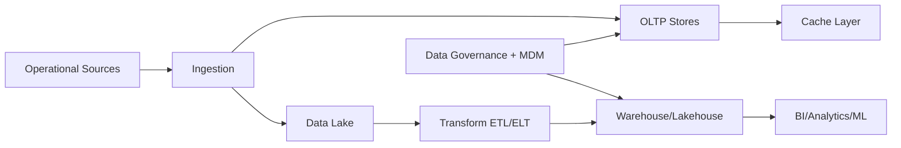

# Enterprise Data Architecture Master

## Overview
This page covers architect-level enterprise data architecture decisions for modern cloud platforms: OLTP vs OLAP, SQL vs NoSQL, partitioning and sharding, caching strategy, lake/warehouse/lakehouse patterns, ETL vs ELT, consistency models, and master data governance.

## Why this topic matters
Data architecture is central to system reliability, scalability, analytics quality, compliance, and cost efficiency. Senior interviews test whether you can choose data patterns based on business behavior, not just tool familiarity.

## Core concepts
- Workload-oriented data architecture (transactional vs analytical)
- Data model and database type selection
- Data distribution (partitioning, sharding, replication)
- Caching and performance acceleration patterns
- Data platform patterns (lake, warehouse, lakehouse)
- Data movement and transformation (ETL/ELT)
- Consistency and correctness trade-offs
- Master data and governance operating model

## Detailed explanation of each concept
Enterprise data architecture should start from access patterns, consistency requirements, and lifecycle constraints rather than from vendor-first decisions. OLTP and OLAP serve different objectives and should be separated unless there is a deliberate hybrid design. SQL and NoSQL choices should align with data shape stability, query behavior, scalability needs, and operational complexity tolerance.

Partitioning and sharding strategies determine performance ceilings and failure behavior at scale, while caching patterns influence latency and cost. Lake, warehouse, and lakehouse architectures should be selected by data-product goals and governance maturity. ETL and ELT decisions depend on transformation ownership, data quality requirements, and platform capabilities. Consistency models should reflect business correctness risk. Master data and governance practices ensure trusted cross-domain data usage.

## Evaluation (How to assess architecture quality)
- p95 query latency and throughput under peak load
- Data correctness incident rate
- Data freshness and pipeline delay SLIs
- Cost per analytics/transaction workload unit
- Data platform availability and recovery posture
- Governance compliance and lineage completeness
- Data product adoption and trust metrics

## Architecture / flow diagram


**Flow explanation:**  
Operational systems feed transactional stores and analytical pipelines through governed ingestion and transformation layers. Governance and master-data controls ensure cross-domain trust and compliance.

## Real-world example
A retail platform keeps customer orders in OLTP databases optimized for transactional consistency. Events feed a lakehouse for near-real-time analytics and forecasting. Hot product and pricing reads are served through cache to reduce database load. Master customer and product records are governed with stewardship workflows and lineage tracking to ensure reporting consistency across regions.

## Best practices
- Separate transactional and analytical workloads by default
- Use workload-driven SQL/NoSQL decisions with measurable criteria
- Design partition keys from real access patterns, not assumptions
- Treat cache invalidation and freshness as explicit architecture design
- Define data quality and lineage controls as non-optional governance
- Align consistency model to business correctness impact

## Common mistakes / misconceptions
- Forcing one database type for all workloads
- Choosing shard keys without growth and skew analysis
- Using cache without ownership of invalidation strategy
- Treating lakehouse as automatic replacement for governance
- Ignoring semantic consistency across data products

## Industry relevance
Data architecture directly influences reliability, compliance, analytics trust, and AI quality, making it a critical topic for architect interviews in cloud and enterprise programs.

## Interview discussion points
- How to choose SQL vs NoSQL under scaling pressure
- How to balance consistency and availability in distributed data
- How to design migration from warehouse-only to lakehouse model
- How to build governed self-service analytics
- How to align data architecture with cost and regulatory constraints

## Links to dependent / related topics
- [Data Architecture Overview](./README.md)
- [System Design HLD/LLD](../system-design/system_design_hld_lld.md)
- [Azure Topic Master](../azure/azure_topic_master.md)
- [Migration Strategies](../migration-architecture/migration_strategies_azure_migrate.md)
- [RAG Retrieval Engineering](../data-ai/rag_retrieval_engineering_architecture.md)

## Interview Questions (50)
1. What is the difference between OLTP and OLAP?
2. Why should OLTP and OLAP usually be separated?
3. When can HTAP or combined patterns be considered?
4. How do you choose SQL vs NoSQL for enterprise systems?
5. What are the core trade-offs between relational and document stores?
6. How do key-value stores fit enterprise architecture?
7. How do wide-column stores fit high-scale scenarios?
8. How do graph databases fit relationship-heavy use cases?
9. How do you choose partition keys effectively?
10. What is sharding and when is it required?
11. Range vs hash partitioning: when to choose each?
12. How do you detect and mitigate partition hot spots?
13. How does replication strategy affect consistency and availability?
14. How do you design read replicas safely?
15. How do you design caching strategy for transactional systems?
16. Cache-aside vs write-through vs write-behind: how to choose?
17. How do you prevent cache stampede and stale reads?
18. How do you define cache invalidation ownership?
19. Data lake vs warehouse: what are the practical differences?
20. What is a lakehouse and when is it appropriate?
21. How do you decide medallion or layered data architecture?
22. ETL vs ELT: what is the key decision model?
23. Batch vs streaming pipelines: how do you choose?
24. How do you design data quality controls in pipelines?
25. How do you design schema evolution without breaking consumers?
26. What are common data consistency models in distributed systems?
27. Strong vs eventual consistency: how do you choose?
28. How do you use compensating controls when consistency is relaxed?
29. How do you design idempotent data processing pipelines?
30. How do you build reliable CDC architectures?
31. How do you design master data management (MDM)?
32. What is data governance and why does it fail in enterprises?
33. How do you operationalize data lineage and cataloging?
34. How do you enforce data access controls across domains?
35. How do you design PII handling and data privacy controls?
36. How do you define data retention and purge strategy?
37. How do you design cost-efficient analytics architecture?
38. How do you optimize query performance at scale?
39. How do you manage data architecture in multi-region environments?
40. How do you design data DR and backup strategy?
41. How do you validate data platform readiness before go-live?
42. How do you align data architecture with AI/ML workloads?
43. How do you handle semantic layer and metric consistency?
44. How do you design domain-oriented data products?
45. How do you govern self-service analytics safely?
46. How do you run stakeholder workshops for data architecture decisions?
47. How do you prioritize data modernization roadmap?
48. How do you measure data architecture success?
49. What are common anti-patterns in enterprise data platforms?
50. How do you conclude data architecture interview answers strongly?

## Answers for important questions (Summary + Crisp + Deep)

### Q1. What is the difference between OLTP and OLAP?
**Question summary:** Distinguishes transactional systems from analytical systems.  
**Crisp answer (7-8 lines):** OLTP handles high-volume, low-latency transactional operations with strict correctness. OLAP handles large-scale analytical queries across historical data. OLTP is write-heavy and row-oriented for operational workflows. OLAP is read-heavy and aggregation-focused for insights and reporting. OLTP prioritizes consistency and concurrency. OLAP prioritizes scan efficiency and analytical flexibility.  
**Deep explanation:** OLTP and OLAP differ in purpose, query shape, and optimization strategy. OLTP systems support operational user journeys such as order placement, payments, and account updates where each transaction must be correct, fast, and isolated. Schema design in OLTP often emphasizes normalization and update integrity. OLAP systems support reporting, forecasting, and trend analysis using larger datasets and complex aggregations that are expensive for transactional engines. They are typically optimized for read throughput, columnar storage, and denormalized access patterns. Senior answers should explain that forcing both workloads into one platform without clear justification usually creates contention, performance instability, and cost inefficiency.  
**Answer summary:**  
- OLTP is optimized for operational correctness and transactional concurrency.  
- OLAP is optimized for historical analysis, aggregation, and decision support.  
- Separating them usually improves stability, performance, and cost control.  
**Simple diagram:**  
```text
OLTP (transactions) -> ingest -> OLAP (analytics)
```
**Trusted reference links:**  
- https://learn.microsoft.com/en-us/azure/architecture/data-guide/relational-data/online-transaction-processing

### Q2. Why should OLTP and OLAP usually be separated?
**Question summary:** Architecture rationale for workload separation.  
**Crisp answer (7-8 lines):** Separation avoids resource contention between transactions and analytical scans. It protects user-facing performance from heavy reporting workloads. It enables platform-specific optimization for each workload type. It improves scaling flexibility and governance boundaries. It reduces incident coupling across operational and analytical domains.  
**Deep explanation:** When OLTP and OLAP share the same underlying resources, analytical queries can consume CPU, I/O, and lock paths needed for critical transactions, resulting in latency spikes and failed business operations. Separation allows each domain to scale independently and apply fit-for-purpose storage, indexing, and compute policies. It also improves governance because retention, privacy masking, and access controls often differ between operational and analytics domains. Architects should note that separation does not mean complete duplication without strategy; synchronization patterns must preserve freshness and correctness for analytical consumers.  
**Answer summary:**  
- Workload separation protects operational reliability from analytical contention.  
- It enables independent scaling and optimization per workload objective.  
- Governance and access control are easier to enforce with clear data domains.  
**Simple diagram:**  
```text
Ops DB (OLTP) || Analytics Platform (OLAP) with governed sync
```
**Trusted reference links:**  
- https://learn.microsoft.com/en-us/azure/architecture/data-guide/big-data/

### Q3. When can HTAP or combined patterns be considered?
**Question summary:** Conditions where transactional and analytical workloads can coexist.  
**Crisp answer (7-8 lines):** Consider combined patterns when latency-to-insight needs are strict and workload scale is manageable. Use when platform supports mixed workloads with isolation controls. Validate that transactional SLOs remain protected. Start with bounded use cases, not full platform consolidation. Continuously monitor contention and cost behavior.  
**Deep explanation:** HTAP can be useful when business decisions depend on near-real-time analytics tightly coupled to transactional flows, such as fraud scoring or dynamic pricing. However, architects should only adopt it when the platform offers strong workload isolation and observability, and when teams are ready to manage complexity. Combined patterns often look attractive early but can become costly and unstable as data volume and query diversity grow. A prudent strategy is to adopt HTAP in narrow domains with explicit exit criteria to separated architectures if operational risk rises.  
**Answer summary:**  
- HTAP is useful for low-latency insight use cases with strong isolation support.  
- It requires careful governance to avoid degrading transactional performance.  
- Start narrowly and keep an option to split workloads as complexity grows.  
**Simple diagram:**  
```text
Transactional flow + real-time analytics on controlled shared platform
```
**Trusted reference links:**  
- https://learn.microsoft.com/en-us/azure/architecture/data-guide/relational-data/online-analytical-processing

### Q4. How do you choose SQL vs NoSQL for enterprise systems?
**Question summary:** Core database selection decision model.  
**Crisp answer (7-8 lines):** Choose SQL when strong relational integrity and complex joins are primary. Choose NoSQL when scale, flexible schema, or low-latency key/document access dominates. Evaluate query patterns, consistency needs, and operational maturity. Avoid ideology-driven standardization. Use polyglot persistence where justified.  
**Deep explanation:** SQL vs NoSQL is not a binary “modern vs legacy” decision; it is a workload-fit decision across correctness, scale behavior, and query complexity. SQL systems excel in transactional integrity, structured schemas, and relational querying. NoSQL systems excel in horizontal scale, schema flexibility, and domain-specific access patterns. Architects should evaluate long-term operability, including backup, observability, governance, and team skill profiles. In many enterprise systems, a polyglot model is optimal: relational core for transactional truth plus NoSQL components for specific high-scale or flexible-data workloads.  
**Answer summary:**  
- Choose storage model based on workload behavior and correctness requirements.  
- SQL and NoSQL are complementary in many enterprise architectures.  
- Govern polyglot persistence explicitly to avoid data sprawl and inconsistency.  
**Simple diagram:**  
```text
Workload criteria -> SQL / NoSQL / Polyglot decision
```
**Trusted reference links:**  
- https://learn.microsoft.com/en-us/azure/architecture/data-guide/

### Q5. What are the core trade-offs between relational and document stores?
**Question summary:** Relational vs document architecture trade-offs.  
**Crisp answer (7-8 lines):** Relational stores provide schema rigor and transactional joins. Document stores provide flexible schema and fast aggregate retrieval for nested entities. Relational design improves consistency governance. Document design improves agility and horizontal scale for certain patterns. Trade-off is control vs flexibility.  
**Deep explanation:** Relational systems enforce structure and integrity constraints that are valuable for mission-critical domains where data correctness and auditability dominate. Document stores reduce impedance mismatch for object-centric applications and support schema evolution with less migration friction. However, flexibility can create governance drift if data contracts are not controlled. Architects should discuss query complexity, update patterns, and consistency expectations before deciding. The strongest answers include mitigation strategy for the chosen model’s weaknesses, such as schema validation in document systems or denormalized read models in relational systems.  
**Answer summary:**  
- Relational favors strict integrity and complex relational querying.  
- Document favors agility and object-centric access patterns at scale.  
- Decision quality improves when governance and query evolution are considered early.  
**Simple diagram:**  
```text
Relational(strict schema) vs Document(flexible schema)
```
**Trusted reference links:**  
- https://learn.microsoft.com/en-us/azure/cosmos-db/nosql/modeling-data

### Q6. How do key-value stores fit enterprise architecture?
**Question summary:** Role of key-value systems in modern platforms.  
**Crisp answer (7-8 lines):** Key-value stores are ideal for fast lookup, session data, feature flags, and ephemeral state. They provide low latency and simple scalability. They are not replacements for relational integrity use cases. Use with clear TTL and consistency expectations. Pair with durable systems for source-of-truth data.  
**Deep explanation:** Key-value platforms are best used where access patterns are simple and predictable, such as retrieving values by identifier with strict latency requirements. They are often critical in performance paths for caching, token/session state, and idempotency tracking. Architects should avoid storing business-critical authoritative records in key-value systems unless consistency and durability controls are explicitly satisfied. Strong design includes expiration policy, replication behavior, and fallback behavior when key-value layers degrade.  
**Answer summary:**  
- Key-value stores are high-speed support layers for specific access patterns.  
- They should complement, not replace, authoritative transactional systems.  
- TTL, durability, and failover behavior must be designed explicitly.  
**Simple diagram:**  
```text
App -> key-value lookup -> fallback/source-of-truth
```
**Trusted reference links:**  
- https://learn.microsoft.com/en-us/azure/azure-cache-for-redis/cache-overview

### Q7. How do wide-column stores fit high-scale scenarios?
**Question summary:** Wide-column applicability for distributed workloads.  
**Crisp answer (7-8 lines):** Wide-column stores fit write-heavy, large-scale workloads with predictable access keys. They support horizontal scale and high throughput. They are useful for telemetry, time-series-like partitions, and sparse data structures. They require careful partition and query design. They are weak for ad hoc relational joins.  
**Deep explanation:** Wide-column models are effective where data can be accessed through known partition and clustering keys with high ingestion rates. They trade relational flexibility for scale and throughput efficiency. Architects should explain that data modeling must be query-first, and schema design should anticipate access paths and growth skew. Governance must include compaction strategy, TTL usage, and partition hot-spot monitoring to avoid unpredictable performance.  
**Answer summary:**  
- Wide-column systems excel for high-ingestion, key-oriented distributed workloads.  
- Modeling must be access-pattern-first with strong partition discipline.  
- Use them where throughput and scale matter more than relational ad hoc querying.  
**Simple diagram:**  
```text
Partition key -> clustered data blocks -> high-scale reads/writes
```
**Trusted reference links:**  
- https://learn.microsoft.com/en-us/azure/cosmos-db/nosql/partitioning-overview

### Q8. How do graph databases fit relationship-heavy use cases?
**Question summary:** Graph model applicability and limits.  
**Crisp answer (7-8 lines):** Graph databases suit deep relationship traversal use cases like fraud networks, recommendations, and knowledge graphs. They model nodes and edges naturally. They simplify multi-hop queries that are complex in relational systems. They are not optimal for all transactional workloads. Use where relationship traversal is core business value.  
**Deep explanation:** Graph databases shine when the primary workload involves discovering and traversing relationships rather than aggregating flat records. In such domains, query expressiveness and traversal performance can outperform relational alternatives. Architects should avoid overgeneralizing graph usage, because operational overhead and tooling ecosystem may not fit all teams. Strong answers include integration strategy: graph as a specialized domain service alongside transactional systems, with clear synchronization and governance boundaries.  
**Answer summary:**  
- Graph databases are best for relationship-centric business logic and analytics.  
- They should be used as specialized components, not universal data platforms.  
- Integration and governance boundaries are key for enterprise adoption.  
**Simple diagram:**  
```text
Nodes <-> Edges <-> Traversal queries
```
**Trusted reference links:**  
- https://learn.microsoft.com/en-us/azure/cosmos-db/gremlin/introduction

### Q9. How do you choose partition keys effectively?
**Question summary:** Partition key strategy for scale and stability.  
**Crisp answer (7-8 lines):** Choose keys that distribute load evenly and align with common query filters. Avoid low-cardinality or time-skewed keys when possible. Validate with expected growth and tenant patterns. Consider write/read balance and hot partition risk. Re-evaluate as workloads evolve.  
**Deep explanation:** Partition-key choice is one of the most consequential scaling decisions in distributed data systems. A poor key creates hot partitions, uneven storage, and unpredictable latency under growth. A strong key strategy is derived from real query and write patterns, tenant distribution, and expected future behavior. Architects should include mitigation options such as synthetic keys or compound partitioning patterns and should monitor skew continuously to detect drift from initial assumptions.  
**Answer summary:**  
- Good partition keys balance distribution and query efficiency simultaneously.  
- Design should anticipate growth patterns and avoid skew-prone dimensions.  
- Continuous skew monitoring is required because workload behavior changes over time.  
**Simple diagram:**  
```text
Request pattern + cardinality -> partition key selection
```
**Trusted reference links:**  
- https://learn.microsoft.com/en-us/azure/cosmos-db/partitioning-overview

### Q10. What is sharding and when is it required?
**Question summary:** Sharding fundamentals and adoption criteria.  
**Crisp answer (7-8 lines):** Sharding splits data across multiple nodes/partitions to scale capacity and throughput. It is required when single-node limits or operational isolation needs are reached. It improves scalability but adds complexity in routing and rebalancing. Use only when justified by measured bottlenecks.  
**Deep explanation:** Sharding is a scaling architecture that distributes both storage and workload across independent shards, enabling horizontal growth beyond single-system limits. It is most valuable when throughput, storage, or tenancy isolation requirements exceed vertical scaling potential. However, sharding introduces operational complexity: shard routing, rebalancing, cross-shard query behavior, and failure handling. Architects should explain trigger criteria for sharding and the governance model for shard lifecycle management to avoid fragmented operational ownership.  
**Answer summary:**  
- Sharding is a horizontal scale strategy for data and workload distribution.  
- It should be triggered by measured capacity/throughput limits, not premature design.  
- Success requires disciplined routing, rebalancing, and operational governance.  
**Simple diagram:**  
```text
Shard router -> shard A/B/C
```
**Trusted reference links:**  
- https://learn.microsoft.com/en-us/azure/architecture/patterns/sharding

### Q11. Range vs hash partitioning: when to choose each?
**Question summary:** Partition strategy trade-off by access pattern.  
**Crisp answer (7-8 lines):** Range partitioning helps range queries and ordered scans. Hash partitioning improves even distribution and avoids hot spots for random keys. Choose range when ordered retrieval is primary. Choose hash when balanced throughput is primary. Consider hybrid patterns if needed.  
**Deep explanation:** Range partitioning aligns well with time-series or ordered access patterns but can produce hot partitions when writes are concentrated in newest ranges. Hash partitioning improves load balancing by spreading writes and reads more evenly, but it may reduce efficiency for ordered queries. Architects should align method choice with dominant access behavior and expected growth skew, and define monitoring for imbalance and re-partitioning triggers.  
**Answer summary:**  
- Use range for ordered query efficiency and hash for distribution balance.  
- Evaluate write skew and query patterns before selecting strategy.  
- Monitor partition health and adjust as workload characteristics change.  
**Simple diagram:**  
```text
Range: key intervals | Hash: key distribution buckets
```
**Trusted reference links:**  
- https://learn.microsoft.com/en-us/azure/architecture/patterns/sharding

### Q12. How do you detect and mitigate partition hot spots?
**Question summary:** Hot partition management for stable performance.  
**Crisp answer (7-8 lines):** Detect via per-partition latency, throttling, and throughput skew metrics. Identify skewed keys and bursty tenants. Mitigate with key redesign, synthetic bucketing, and workload smoothing. Apply cache and queue buffering where appropriate. Rebalance proactively.  
**Deep explanation:** Hot spots emerge when traffic distribution assumptions break, often due to tenant growth concentration, seasonal behavior, or poor key choice. Early detection depends on partition-level telemetry rather than aggregate service metrics. Architects should define remediation playbooks that include key-space expansion, traffic shaping, and phased migration to improved partition schemes. Governance should require post-incident review of partition assumptions to prevent recurrence.  
**Answer summary:**  
- Use partition-level telemetry to identify skew before broad degradation.  
- Mitigate with key redesign, bucketing, and workload-shaping patterns.  
- Treat hot-spot recurrence as architecture debt requiring structural correction.  
**Simple diagram:**  
```text
Skewed partition metrics -> mitigation plan -> rebalanced load
```
**Trusted reference links:**  
- https://learn.microsoft.com/en-us/azure/cosmos-db/nosql/troubleshoot-request-rate-too-large

### Q13. How does replication strategy affect consistency and availability?
**Question summary:** Replication trade-offs in distributed systems.  
**Crisp answer (7-8 lines):** Replication improves availability and read scalability. It can increase consistency complexity across replicas. Synchronous replication improves consistency but may increase write latency. Asynchronous replication improves performance but risks stale reads. Choose by business correctness tolerance and recovery goals.  
**Deep explanation:** Replication design defines how quickly and accurately state converges across nodes or regions. Synchronous replication provides stronger consistency guarantees but couples write latency to replica health and network behavior. Asynchronous replication increases throughput and resilience to transient connectivity issues but introduces stale-read windows and conflict considerations. Architects should tie strategy to business impact of stale data, failover expectations, and operational ability to manage reconciliation.  
**Answer summary:**  
- Replication improves resilience and scale but introduces consistency trade-offs.  
- Sync vs async choice should match business correctness and latency targets.  
- Recovery strategy and conflict governance are required for safe replication design.  
**Simple diagram:**  
```text
Primary write -> replicas (sync/async paths)
```
**Trusted reference links:**  
- https://learn.microsoft.com/en-us/azure/architecture/guide/design-principles/reliability

### Q14. How do you design read replicas safely?
**Question summary:** Read-replica architecture governance.  
**Crisp answer (7-8 lines):** Use replicas for read scaling and query isolation. Route read workloads with staleness awareness. Keep writes on primary unless explicit multi-write model exists. Monitor replica lag and failover behavior. Protect business-critical reads from stale data exposure.  
**Deep explanation:** Read replicas are effective when read demand exceeds primary capacity or when analytics/reporting should not impact transactional writes. Safe design requires explicit consistency policy so clients know when stale reads are acceptable. Architects should define lag thresholds, read routing logic, and fallback behavior when replicas drift or fail. Without this, replica usage can silently introduce correctness issues in critical user flows.  
**Answer summary:**  
- Read replicas improve scale only when consistency expectations are explicit.  
- Lag monitoring and routing policies are critical to correctness protection.  
- Keep write authority clear to avoid split-brain data behavior.  
**Simple diagram:**  
```text
Primary writes -> replicas for read scaling
```
**Trusted reference links:**  
- https://learn.microsoft.com/en-us/azure/azure-sql/database/read-scale-out

### Q15. How do you design caching strategy for transactional systems?
**Question summary:** Caching design for low latency without correctness loss.  
**Crisp answer (7-8 lines):** Cache high-read, low-volatility data with clear ownership rules. Define freshness budgets and invalidation triggers. Keep transactional source-of-truth in durable store. Use cache selectively on critical read paths. Monitor hit ratio and stale-read impact.  
**Deep explanation:** Caching in transactional systems should be treated as a consistency-aware performance layer, not a blind acceleration mechanism. Architects should identify which entities can tolerate temporary staleness and which require read-after-write correctness. Cache design must include TTL policy, invalidation ownership, fallback behavior, and failure handling when cache is unavailable. Strong answers emphasize that cache correctness risk must be measured, not assumed acceptable.  
**Answer summary:**  
- Use caching where latency gain justifies controlled freshness risk.  
- Keep authoritative state in durable transaction systems.  
- Invalidation ownership and correctness monitoring are mandatory design elements.  
**Simple diagram:**  
```text
Read path -> cache -> source-of-truth fallback
```
**Trusted reference links:**  
- https://learn.microsoft.com/en-us/azure/architecture/best-practices/caching

### Q16. Cache-aside vs write-through vs write-behind: how to choose?
**Question summary:** Cache write/read pattern decision model.  
**Crisp answer (7-8 lines):** Cache-aside is simple and common for read-heavy workloads. Write-through keeps cache and store synchronized on write but adds write latency. Write-behind improves write speed but increases durability and ordering risk. Choose by consistency tolerance, latency goals, and failure handling capability.  
**Deep explanation:** Each cache pattern shifts risk and complexity differently. Cache-aside provides flexible control but can produce stale reads if invalidation is weak. Write-through improves consistency between cache and database but can increase write-path dependency. Write-behind decouples write latency from persistence but requires strong guarantees for retry, ordering, and failure recovery. Architects should map pattern choice to business correctness requirements and operational maturity before adopting advanced write modes.  
**Answer summary:**  
- Cache-aside favors simplicity; write-through favors consistency; write-behind favors speed.  
- Pattern choice should reflect correctness risk appetite and operational capability.  
- Failure handling and observability define whether advanced patterns are safe.  
**Simple diagram:**  
```text
Read/write flow pattern -> consistency/latency trade-off
```
**Trusted reference links:**  
- https://learn.microsoft.com/en-us/azure/architecture/patterns/cache-aside

### Q17. How do you prevent cache stampede and stale reads?
**Question summary:** Cache reliability and freshness control.  
**Crisp answer (7-8 lines):** Use request coalescing, jittered TTL, and lock/single-flight patterns. Pre-warm critical keys. Apply stale-while-revalidate where acceptable. Set freshness budget per domain. Monitor stampede indicators and stale-read incidents.  
**Deep explanation:** Cache stampede occurs when many requests simultaneously miss or expire for popular keys, causing backend overload. Prevention requires coordinated refresh behavior, spread-expiry strategy, and fallback controls. Stale-read risk should be governed with explicit domain freshness thresholds and targeted invalidation events for high-sensitivity entities. Architects should include incident playbooks for cache failure and backend protection to avoid cascading outages.  
**Answer summary:**  
- Stampede prevention needs coordinated refresh and expiration randomization.  
- Freshness risk should be domain-specific and explicitly governed.  
- Cache failure handling must protect backend systems from overload.  
**Simple diagram:**  
```text
Hot key expiry -> coordinated refresh -> backend protected
```
**Trusted reference links:**  
- https://learn.microsoft.com/en-us/azure/architecture/best-practices/caching

### Q18. How do you define cache invalidation ownership?
**Question summary:** Ownership model for cache correctness.  
**Crisp answer (7-8 lines):** Assign invalidation responsibility to domain-owning service teams. Define triggers and contracts in API/event design. Avoid shared unmanaged invalidation scripts. Version invalidation rules with release changes. Track stale-data incidents by owner.  
**Deep explanation:** Cache invalidation fails when ownership is ambiguous or distributed without clear contracts. Every cached entity should have explicit invalidation triggers tied to domain events or write operations, with team accountability for correctness outcomes. Architects should encode invalidation behavior in service contracts and CI/CD checks where possible. This reduces silent data drift and improves operational traceability when stale-data incidents occur.  
**Answer summary:**  
- Cache invalidation requires clear domain ownership and contract-level definition.  
- Trigger rules should evolve with service changes and be version-governed.  
- Ownership visibility improves stale-data incident resolution and prevention.  
**Simple diagram:**  
```text
Domain write event -> owned invalidation workflow
```
**Trusted reference links:**  
- https://learn.microsoft.com/en-us/azure/architecture/patterns/event-sourcing

### Q19. Data lake vs warehouse: what are the practical differences?
**Question summary:** Lake and warehouse decision clarity.  
**Crisp answer (7-8 lines):** Data lakes store raw and diverse data at scale with flexible schema-on-read. Warehouses store curated, structured, query-optimized datasets for BI. Lakes maximize ingestion flexibility. Warehouses maximize reporting consistency and performance. Many enterprises use both in layered architecture.  
**Deep explanation:** Lakes and warehouses solve different data lifecycle problems. Lakes are ideal for broad ingestion, exploratory analytics, and multi-format data storage, but they require strong governance to avoid becoming unmanaged “data swamps.” Warehouses provide trusted, modeled data products with stronger semantic consistency for business reporting and performance-critical queries. Architects should explain how curated layers bridge lake flexibility and warehouse reliability in modern enterprise platforms.  
**Answer summary:**  
- Lakes optimize ingestion flexibility; warehouses optimize trusted analytics delivery.  
- Governance maturity determines whether lake-first strategies succeed at scale.  
- Most enterprise architectures combine both with curated transition layers.  
**Simple diagram:**  
```text
Raw data lake -> curated warehouse models -> BI consumption
```
**Trusted reference links:**  
- https://learn.microsoft.com/en-us/azure/architecture/data-guide/relational-data/data-warehousing

### Q20. What is a lakehouse and when is it appropriate?
**Question summary:** Lakehouse positioning in enterprise data platforms.  
**Crisp answer (7-8 lines):** Lakehouse combines lake flexibility with warehouse-like management and performance. It is appropriate when teams need open data formats plus governed analytics. It supports mixed BI/ML workloads on shared data assets. It requires maturity in governance and metadata practices.  
**Deep explanation:** Lakehouse architecture can reduce duplication between raw and analytical stores by applying transaction, schema, and performance optimizations directly on data-lake foundations. It is most useful when organizations need both flexible data onboarding and reliable analytics/ML consumption with shared governance. Architects should caution that lakehouse is not automatically simpler; success depends on metadata discipline, quality controls, and semantic management.  
**Answer summary:**  
- Lakehouse is a convergence model for flexible ingestion and governed analytics.  
- It is strong for mixed BI/ML use cases when metadata governance is mature.  
- Adoption should be capability-driven, not trend-driven.  
**Simple diagram:**  
```text
Lake storage + warehouse controls = lakehouse
```
**Trusted reference links:**  
- https://learn.microsoft.com/en-us/azure/databricks/lakehouse/

### Q21. How do you decide medallion or layered data architecture?
**Question summary:** Layered architecture decision for data quality progression.  
**Crisp answer (7-8 lines):** Use layered models when data quality, lineage, and reuse need progressive refinement. Bronze captures raw ingested data. Silver applies cleansing and conformance. Gold serves business-ready products. Choose based on governance needs and consumer diversity.  
**Deep explanation:** Layered architectures separate concerns across ingestion, transformation, and consumption, which improves traceability and quality management at scale. They are especially valuable when multiple consumer teams require different data maturity levels. Architects should ensure layers are not treated as rigid bureaucracy; design should remain pragmatic with clear ownership and SLA expectations per layer. This approach supports both agility and trust in enterprise analytics ecosystems.  
**Answer summary:**  
- Layered architecture enables progressive quality and governance control.  
- It improves lineage and reuse across varied consumer needs.  
- Keep layers purposeful and owner-driven to avoid unnecessary complexity.  
**Simple diagram:**  
```text
Bronze -> Silver -> Gold
```
**Trusted reference links:**  
- https://learn.microsoft.com/en-us/azure/databricks/lakehouse/medallion

### Q22. ETL vs ELT: what is the key decision model?
**Question summary:** Transformation placement strategy.  
**Crisp answer (7-8 lines):** ETL transforms before load, improving controlled downstream quality. ELT loads first then transforms in target platform, improving flexibility and scalability. Choose based on data volume, governance controls, platform compute capability, and transformation ownership model.  
**Deep explanation:** ETL and ELT differ in where complexity and control are placed. ETL can simplify target environments and enforce upstream quality but may limit agility for exploratory use cases. ELT leverages modern scalable compute in the destination platform and supports iterative transformations, but requires stronger governance to avoid inconsistent downstream semantics. Architects should tie decision to organizational data operating model, not only tool capabilities.  
**Answer summary:**  
- ETL emphasizes pre-load control; ELT emphasizes post-load flexibility and scale.  
- Platform capability and governance maturity determine sustainable choice.  
- Decision should align with ownership model for transformation logic.  
**Simple diagram:**  
```text
ETL: Extract->Transform->Load | ELT: Extract->Load->Transform
```
**Trusted reference links:**  
- https://learn.microsoft.com/en-us/azure/architecture/data-guide/

### Q23. Batch vs streaming pipelines: how do you choose?
**Question summary:** Pipeline mode selection by freshness and complexity.  
**Crisp answer (7-8 lines):** Choose batch for periodic reporting and cost-efficient processing windows. Choose streaming for near-real-time decisions and event-driven outcomes. Evaluate freshness SLA, event volume, latency tolerance, and operational complexity. Hybrid models are common.  
**Deep explanation:** Batch and streaming are complementary patterns with distinct operational trade-offs. Batch pipelines are simpler, often cheaper, and easier to debug for many business reporting needs. Streaming adds responsiveness and supports time-sensitive workflows but requires stronger observability, state handling, and failure recovery controls. Architects should avoid “stream everything” bias and instead map mode selection to explicit business value from freshness.  
**Answer summary:**  
- Batch is best for scheduled analytics; streaming is best for time-sensitive workflows.  
- Freshness requirements should drive mode selection, not technology preference.  
- Hybrid pipelines often provide best balance of agility, cost, and reliability.  
**Simple diagram:**  
```text
Event urgency low -> batch | urgency high -> streaming
```
**Trusted reference links:**  
- https://learn.microsoft.com/en-us/azure/architecture/data-guide/big-data/

### Q24. How do you design data quality controls in pipelines?
**Question summary:** Data quality assurance architecture.  
**Crisp answer (7-8 lines):** Define quality rules for completeness, validity, uniqueness, consistency, and timeliness. Apply checks at ingestion and transformation stages. Quarantine bad records with traceability. Track quality SLIs and ownership by domain. Automate alerts and remediation workflows.  
**Deep explanation:** Data quality must be operationalized as measurable controls, not manual spot checks. Effective pipeline design includes schema validation, rule enforcement, exception routing, and quality score reporting by dataset and domain owner. Architects should ensure quality governance includes escalation and remediation ownership so failures are corrected quickly and root causes are addressed upstream where possible.  
**Answer summary:**  
- Embed quality checks at multiple pipeline stages with explicit rule taxonomy.  
- Route exceptions safely and keep traceability for remediation ownership.  
- Treat quality metrics as first-class operational SLIs with governance cadence.  
**Simple diagram:**  
```text
Ingest -> quality checks -> valid flow / quarantine flow
```
**Trusted reference links:**  
- https://learn.microsoft.com/en-us/azure/architecture/data-guide/

### Q25. How do you design schema evolution without breaking consumers?
**Question summary:** Schema change governance for data products.  
**Crisp answer (7-8 lines):** Use backward-compatible schema changes first. Version contracts and publish deprecation timelines. Validate downstream consumer impact before rollout. Maintain compatibility windows. Enforce schema governance in CI/CD. Monitor consumer adoption before removing old versions.  
**Deep explanation:** Schema evolution is an ecosystem change problem. Breaking changes without controlled rollout can disrupt reports, ML pipelines, and downstream services simultaneously. Architects should define schema compatibility policy, contract testing, and producer-consumer communication governance. Strong implementations include automated checks and staged rollout with observability on consumer break rates.  
**Answer summary:**  
- Prefer backward-compatible evolution with explicit version governance.  
- Validate consumer impact and adoption before deprecating old schemas.  
- Automate contract checks to prevent accidental breaking changes.  
**Simple diagram:**  
```text
Schema v1 + v2 coexist -> consumer migration -> v1 retire
```
**Trusted reference links:**  
- https://learn.microsoft.com/en-us/azure/event-grid/event-schema

### Q26. What are common data consistency models in distributed systems?
**Question summary:** Consistency model taxonomy for architects.  
**Crisp answer (7-8 lines):** Common models include strong consistency, eventual consistency, bounded staleness, and session consistency. Each model trades latency/availability against correctness guarantees. Choose by business risk and user expectation. Consistency should be explicit per domain use case.  
**Deep explanation:** Distributed systems cannot optimize all consistency and availability dimensions simultaneously under partition conditions. Architects should articulate consistency model choice per business capability, not globally across all workloads. Financial settlement flows may require stronger guarantees, while recommendation feeds can tolerate controlled staleness. Strong answers include compensating mechanisms for relaxed consistency and clear communication of behavioral expectations to stakeholders.  
**Answer summary:**  
- Consistency model choice is domain-specific and risk-driven.  
- Stronger consistency often increases latency or availability constraints.  
- Relaxed consistency requires compensating controls for correctness protection.  
**Simple diagram:**  
```text
Consistency strength <-> latency/availability trade-off
```
**Trusted reference links:**  
- https://learn.microsoft.com/en-us/azure/cosmos-db/consistency-levels

### Q27. Strong vs eventual consistency: how do you choose?
**Question summary:** Strong/eventual consistency decision framework.  
**Crisp answer (7-8 lines):** Choose strong consistency for correctness-critical operations where stale reads are unacceptable. Choose eventual consistency for scalable, low-latency scenarios where temporary divergence is tolerable. Evaluate business impact of stale state. Use hybrid model by capability where needed.  
**Deep explanation:** This choice should be based on consequence analysis: what happens if a user sees stale data for seconds or minutes? In high-risk domains such as payments, inventory reservation, or compliance controls, stale reads can cause material harm and require stronger guarantees. In low-risk domains such as activity feeds or recommendations, eventual consistency may provide better performance and resilience. Architects should present this as capability-level policy with explicit fallback and reconciliation design.  
**Answer summary:**  
- Choose strong consistency where stale data causes unacceptable business risk.  
- Choose eventual consistency where scalability and latency dominate tolerance.  
- Hybrid consistency per capability is often the most practical enterprise model.  
**Simple diagram:**  
```text
Risk high -> strong | risk tolerant -> eventual
```
**Trusted reference links:**  
- https://learn.microsoft.com/en-us/azure/cosmos-db/consistency-levels

### Q28. How do you use compensating controls when consistency is relaxed?
**Question summary:** Correctness safeguards under eventual consistency.  
**Crisp answer (7-8 lines):** Use idempotency, reconciliation jobs, duplicate detection, and business rule validation to correct divergence. Add user-facing safeguards for in-flight ambiguity. Track consistency anomalies. Define correction windows and ownership. Keep audit trails.  
**Deep explanation:** Relaxed consistency shifts correctness assurance from immediate transaction guarantees to process-level recovery and validation controls. Architects should design compensating controls as first-class capabilities with measurable SLIs, not background scripts without accountability. Examples include periodic reconciliation, semantic deduplication, outbox/inbox patterns, and dispute workflows for user-visible inconsistencies. This approach enables scalability while preserving business trust.  
**Answer summary:**  
- Relaxed consistency requires explicit corrective workflows and ownership.  
- Compensating controls must be observable, measurable, and auditable.  
- User-impact management is part of consistency architecture, not an afterthought.  
**Simple diagram:**  
```text
Eventual write -> reconcile/validate -> corrected state
```
**Trusted reference links:**  
- https://learn.microsoft.com/en-us/azure/architecture/patterns/compensating-transaction

### Q29. How do you design idempotent data processing pipelines?
**Question summary:** Idempotency strategy for reliable data processing.  
**Crisp answer (7-8 lines):** Use deterministic identifiers and deduplication keys. Ensure retries do not create duplicate side effects. Store processing state/checkpoints safely. Design consumers to handle at-least-once delivery. Validate idempotency in tests and replay scenarios.  
**Deep explanation:** Idempotency is foundational for resilient pipelines because retries, duplicates, and replays are normal in distributed systems. Architects should define idempotency keys at domain boundaries and ensure write operations can safely repeat without corrupting outcomes. Pipeline controls should include checkpointing, sequence handling, and replay tooling that preserve correctness under failure recovery. Strong answers mention how idempotency interacts with CDC and event-driven patterns.  
**Answer summary:**  
- Idempotency prevents duplicate side effects under retries and replays.  
- Use stable keys, checkpoints, and dedup logic at processing boundaries.  
- Validate idempotency behavior in failure and replay test scenarios.  
**Simple diagram:**  
```text
Duplicate event -> idempotent check -> single effect
```
**Trusted reference links:**  
- https://learn.microsoft.com/en-us/azure/architecture/patterns/pipes-and-filters

### Q30. How do you build reliable CDC architectures?
**Question summary:** CDC reliability and governance architecture.  
**Crisp answer (7-8 lines):** Capture change streams with ordering and checkpoint guarantees. Monitor lag and processing health continuously. Handle schema drift and replay safely. Use idempotent consumers and dead-letter handling. Validate reconciliation against source truth periodically.  
**Deep explanation:** CDC reliability depends on end-to-end flow governance from source change capture through transport, transformation, and target application. Architects should design for lag visibility, restart behavior, out-of-order events, and controlled replay after incidents. Schema evolution handling is critical because unmanaged changes can silently break CDC pipelines. Reconciliation controls provide assurance that target systems remain aligned with source truth over time.  
**Answer summary:**  
- CDC reliability requires ordering, checkpointing, and replay-safe processing design.  
- Monitor lag, drift, and schema evolution continuously to prevent silent failures.  
- Reconciliation against source truth is essential for long-term confidence.  
**Simple diagram:**  
```text
Source change log -> CDC pipeline -> target + reconciliation
```
**Trusted reference links:**  
- https://learn.microsoft.com/en-us/azure/data-factory/concepts-change-data-capture

### Q31. How do you design master data management (MDM)?
**Question summary:** MDM design for cross-domain consistency.  
**Crisp answer (7-8 lines):** Define canonical entities, ownership, stewardship workflows, and golden-record rules. Standardize identity resolution and survivorship logic. Integrate MDM with operational and analytical consumers. Track quality and lineage for master entities. Govern change approval and versioning.  
**Deep explanation:** MDM architecture should provide trusted reference entities (customer, product, supplier, etc.) across distributed systems where duplicates and semantic drift naturally occur. Design must include data stewardship, matching/merging strategy, conflict resolution, and publication patterns for consuming domains. Architects should avoid over-centralized bottlenecks by balancing governance rigor with domain autonomy. Successful MDM programs are operational disciplines, not only tooling deployments.  
**Answer summary:**  
- MDM establishes canonical entity trust across enterprise domains.  
- Stewardship and matching governance are as important as technical platform choice.  
- Integrate MDM outputs into both transactional and analytical ecosystems.  
**Simple diagram:**  
```text
Domain records -> match/merge -> golden master -> consumers
```
**Trusted reference links:**  
- https://learn.microsoft.com/en-us/azure/architecture/data-guide/

### Q32. What is data governance and why does it fail in enterprises?
**Question summary:** Governance failure patterns and prevention.  
**Crisp answer (7-8 lines):** Data governance defines policy, ownership, quality, lineage, access, and compliance controls for data lifecycle. It fails when ownership is unclear, controls are manual, and value to teams is not visible. Governance must be embedded in delivery workflows, not separate committees only. Automate policies where possible.  
**Deep explanation:** Governance often fails because it is treated as documentation rather than operating system. Without clear domain ownership, measurable controls, and integration with engineering workflows, policy intent does not translate into production behavior. Teams perceive governance as friction unless it provides practical guardrails and self-service clarity. Architects should design governance as code-and-process integration with accountability, telemetry, and regular review cadence.  
**Answer summary:**  
- Governance must be operationalized through ownership, automation, and measurable controls.  
- Manual or committee-only governance models rarely scale effectively.  
- Embed governance into delivery workflows to align compliance and agility.  
**Simple diagram:**  
```text
Policy + ownership + automation + metrics = effective governance
```
**Trusted reference links:**  
- https://learn.microsoft.com/en-us/azure/governance/

### Q33. How do you operationalize data lineage and cataloging?
**Question summary:** Lineage and discoverability architecture.  
**Crisp answer (7-8 lines):** Capture lineage metadata across ingestion, transformation, and consumption stages. Maintain searchable catalog with ownership and usage context. Automate metadata updates from pipelines. Link lineage to incident and compliance workflows. Track coverage and accuracy KPIs.  
**Deep explanation:** Lineage and cataloging are foundational for trust, impact analysis, and governance at scale. Without accurate lineage, teams cannot assess blast radius of schema changes or data quality incidents quickly. Architects should design metadata collection as part of platform pipelines, not manual documentation tasks. Strong implementations combine technical lineage, business glossary, ownership mapping, and usage telemetry for practical governance decisions.  
**Answer summary:**  
- Lineage enables impact analysis, trust, and faster incident response.  
- Catalog value depends on automation, ownership, and usage context quality.  
- Treat metadata pipelines as critical platform capabilities, not side projects.  
**Simple diagram:**  
```text
Pipelines -> lineage metadata -> catalog -> governed consumption
```
**Trusted reference links:**  
- https://learn.microsoft.com/en-us/azure/purview/

### Q34. How do you enforce data access controls across domains?
**Question summary:** Cross-domain data security control model.  
**Crisp answer (7-8 lines):** Use least-privilege role-based access with domain ownership boundaries. Enforce policy by data sensitivity and usage purpose. Prefer centralized identity with federated domain stewardship. Apply row/column-level controls where required. Audit access continuously.  
**Deep explanation:** Data access architecture should combine central identity policy with domain-level accountability so controls scale without bottlenecking delivery. Access decisions should reflect data classification, business purpose, and compliance constraints. Architects should include both preventive controls (RBAC/ABAC, masking, segmentation) and detective controls (audit logs, anomaly detection). This layered model supports secure collaboration across enterprise domains.  
**Answer summary:**  
- Combine centralized identity governance with domain-owned access stewardship.  
- Apply sensitivity-aware controls at dataset and field levels where needed.  
- Continuous access auditing is essential for security and compliance assurance.  
**Simple diagram:**  
```text
Identity policy -> domain access controls -> audited data usage
```
**Trusted reference links:**  
- https://learn.microsoft.com/en-us/azure/architecture/framework/security/design-data-security

### Q35. How do you design PII handling and data privacy controls?
**Question summary:** Privacy-by-design data architecture controls.  
**Crisp answer (7-8 lines):** Classify PII early and enforce minimization. Apply encryption, masking/tokenization, and purpose-based access controls. Separate raw sensitive data from broad analytics layers. Log and audit all privileged access. Implement retention and deletion workflows aligned to regulations.  
**Deep explanation:** Privacy controls should be embedded into ingestion, storage, transformation, and access paths. Architects should design data minimization and purpose limitation as structural controls, not policy statements only. Sensitive fields should have differentiated handling across environments and consumer types, with masking and tokenization where direct exposure is unnecessary. Governance must include subject-right handling (access/deletion) and evidence trails for regulatory assurance.  
**Answer summary:**  
- Treat privacy as architecture constraint across full data lifecycle.  
- Use minimization, masking/tokenization, and purpose-based access controls.  
- Build auditable retention/deletion workflows for regulatory compliance.  
**Simple diagram:**  
```text
PII classification -> protected processing -> controlled access
```
**Trusted reference links:**  
- https://learn.microsoft.com/en-us/azure/security/fundamentals/protection-customer-data

### Q36. How do you define data retention and purge strategy?
**Question summary:** Retention governance and lifecycle control.  
**Crisp answer (7-8 lines):** Define retention by legal, business, and operational requirements. Apply tiered storage and lifecycle policies. Automate purge with approval and audit controls. Protect legal hold exceptions. Validate purge outcomes and lineage impact. Review policy periodically.  
**Deep explanation:** Retention and purge strategy should balance compliance obligations, analytical usefulness, and storage cost control. Architects should define retention classes by data domain and implement automated lifecycle transitions and deletion workflows with evidence logging. Purge operations must consider downstream dependencies and lineage to avoid breaking data products unexpectedly. Mature governance includes legal hold handling and regular policy reassessment as regulations and business needs evolve.  
**Answer summary:**  
- Retention policies should be domain-classified and compliance-aligned.  
- Automate lifecycle and purge actions with auditability and legal-hold controls.  
- Validate downstream impact to keep data products stable during purges.  
**Simple diagram:**  
```text
Retention class -> lifecycle tiering -> purge/hold workflow
```
**Trusted reference links:**  
- https://learn.microsoft.com/en-us/azure/storage/blobs/lifecycle-management-overview

### Q37. How do you design cost-efficient analytics architecture?
**Question summary:** Analytics cost optimization strategy.  
**Crisp answer (7-8 lines):** Optimize storage tiers, compute elasticity, and workload isolation. Partition and cluster data for query efficiency. Use workload-aware caching/materialization where useful. Archive cold data appropriately. Track cost-per-query and cost-per-dashboard metrics. Align spend with business value tiers.  
**Deep explanation:** Cost-efficient analytics architecture requires matching compute and storage characteristics to actual consumption patterns. Overprovisioned always-on compute and unoptimized query patterns are major cost drivers. Architects should apply demand-based scaling, query optimization, data pruning, and lifecycle tiering to reduce waste while preserving performance SLAs. Governance should tie cost metrics to product outcomes so optimization priorities are transparent and business-aligned.  
**Answer summary:**  
- Cost efficiency comes from workload-aware compute, storage, and query design.  
- Measure and optimize using value-linked cost metrics, not generic spend totals.  
- Balance optimization with reliability and user-performance expectations.  
**Simple diagram:**  
```text
Workload profile -> optimized storage/compute plan
```
**Trusted reference links:**  
- https://learn.microsoft.com/en-us/azure/cost-management-billing/

### Q38. How do you optimize query performance at scale?
**Question summary:** Query-performance optimization model.  
**Crisp answer (7-8 lines):** Optimize schema, indexing, partition pruning, and query plans. Reduce data scanned per request. Materialize frequent aggregations where needed. Monitor query latency distribution, not averages only. Tune iteratively with production telemetry and representative tests.  
**Deep explanation:** Query performance at scale depends on end-to-end design across data model, storage layout, execution engine behavior, and consumer query patterns. Architects should enforce query governance, including anti-pattern detection, explain-plan review, and workload-specific optimization standards. Caching and pre-aggregation can improve latency significantly but must be governed for freshness and correctness. Continuous tuning is required because query mix and data volume evolve over time.  
**Answer summary:**  
- Combine model/index/layout optimization with query governance practices.  
- Focus on scan reduction and percentile latency, not average metrics.  
- Use iterative telemetry-driven tuning as data and workload evolve.  
**Simple diagram:**  
```text
Query plan + data layout tuning -> lower p95 latency
```
**Trusted reference links:**  
- https://learn.microsoft.com/en-us/azure/architecture/framework/performance-efficiency/

### Q39. How do you manage data architecture in multi-region environments?
**Question summary:** Multi-region data consistency and governance strategy.  
**Crisp answer (7-8 lines):** Define global baseline with regional overlays for residency and compliance. Choose replication and consistency policies per domain. Monitor cross-region lag and failover readiness. Keep schema and governance parity with controlled exceptions. Test regional recovery paths regularly.  
**Deep explanation:** Multi-region data architecture introduces trade-offs among latency, consistency, compliance, and operational complexity. Architects should define which datasets are globally shared, region-bound, or replicated with bounded staleness. Governance must enforce policy parity while allowing compliant regional deviations. Robust observability and drill validation are required because cross-region behavior often differs from design assumptions during failures.  
**Answer summary:**  
- Multi-region design needs explicit data placement and consistency policy by domain.  
- Governance parity with controlled regional variance prevents compliance drift.  
- Continuous lag monitoring and failover testing protect recovery confidence.  
**Simple diagram:**  
```text
Region A data <-> Region B replicas with policy controls
```
**Trusted reference links:**  
- https://learn.microsoft.com/en-us/azure/architecture/guide/design-principles/geographical-distribution

### Q40. How do you design data DR and backup strategy?
**Question summary:** Data recovery architecture for resilience.  
**Crisp answer (7-8 lines):** Combine backup, replication, and recovery runbooks by criticality tier. Define RPO/RTO targets per dataset class. Test restore and failover paths regularly. Protect backup integrity and access controls. Automate evidence capture for drills.  
**Deep explanation:** Data DR strategy should align recovery controls to business impact and data criticality. Backup alone is insufficient for low-RTO scenarios; replication and failover orchestration are needed where continuity demands are high. Architects should include restore testing cadence, immutable backup protections, and role-based access governance to prevent backup compromise. Recovery confidence comes from drills and measurable outcomes, not from configured settings alone.  
**Answer summary:**  
- Align data recovery controls to dataset criticality and RPO/RTO objectives.  
- Combine backup and replication patterns where continuity requirements demand it.  
- Validate recovery through regular drills and controlled restore testing.  
**Simple diagram:**  
```text
Primary data -> backup/replica -> tested recovery paths
```
**Trusted reference links:**  
- https://learn.microsoft.com/en-us/azure/well-architected/reliability/

### Q41. How do you validate data platform readiness before go-live?
**Question summary:** Data platform operational readiness gating.  
**Crisp answer (7-8 lines):** Validate ingestion stability, quality controls, lineage, access governance, and recovery readiness. Confirm SLO and alert coverage. Run scale and failure tests. Ensure runbooks and ownership are clear. Require objective evidence before production launch.  
**Deep explanation:** Data platform go-live readiness should be assessed through structured gates spanning technical behavior, governance posture, and operational support capability. Teams should verify pipeline reliability under realistic load, quality policy enforcement, metadata completeness, and incident response readiness. Architects should include business validation for critical reports and models to ensure semantic trust. Evidence-based readiness prevents costly post-launch trust failures.  
**Answer summary:**  
- Readiness must include technical, governance, and operational controls together.  
- Validate behavior under load/failure and prove data trust with business checks.  
- Use objective gate evidence for go/no-go decisions.  
**Simple diagram:**  
```text
Readiness checks -> evidence -> production approval
```
**Trusted reference links:**  
- https://learn.microsoft.com/en-us/azure/well-architected/operational-excellence/

### Q42. How do you align data architecture with AI/ML workloads?
**Question summary:** Data platform alignment for AI use cases.  
**Crisp answer (7-8 lines):** Design feature, training, and inference data paths with governance and freshness controls. Ensure lineage from raw source to model input/output. Separate experimentation from production serving domains. Define quality and drift monitoring. Align storage/query choices to model lifecycle needs.  
**Deep explanation:** AI workloads amplify data architecture weaknesses because model quality depends on data freshness, semantic consistency, and lineage trust. Architects should define data contracts for feature generation, training sets, and inference feedback loops while preserving governance controls for privacy and compliance. Platform design should support reproducibility, drift detection, and scalable retrieval patterns for model-serving contexts. This creates reliable AI outcomes beyond model selection alone.  
**Answer summary:**  
- AI reliability depends on governed, lineage-aware data architecture foundations.  
- Separate experimentation and production data domains to control risk.  
- Build drift, freshness, and reproducibility controls into the data lifecycle.  
**Simple diagram:**  
```text
Raw data -> features/training -> model serving -> feedback loop
```
**Trusted reference links:**  
- https://learn.microsoft.com/en-us/azure/architecture/ai-ml/

### Q43. How do you handle semantic layer and metric consistency?
**Question summary:** Semantic consistency across analytics consumers.  
**Crisp answer (7-8 lines):** Define shared business metrics and calculation logic in governed semantic layer. Version metric definitions and ownership. Prevent ad hoc metric duplication across tools. Validate semantic changes with stakeholders. Monitor metric adoption and divergence incidents.  
**Deep explanation:** Semantic inconsistency is a major trust failure in enterprise analytics where teams report conflicting numbers from the same data. A governed semantic layer provides centralized definitions for key metrics, dimensions, and business logic while allowing controlled extensions for domain needs. Architects should include change governance, ownership, and communication processes to maintain confidence in data products. This is critical for executive reporting and cross-team decision quality.  
**Answer summary:**  
- Semantic layer governance prevents metric drift and reporting conflicts.  
- Shared definitions need ownership, versioning, and change control.  
- Consistent metrics improve trust and decision alignment across the enterprise.  
**Simple diagram:**  
```text
Shared semantic model -> consistent dashboards/reports
```
**Trusted reference links:**  
- https://learn.microsoft.com/en-us/power-bi/guidance/power-bi-implementation-planning-content-ownership

### Q44. How do you design domain-oriented data products?
**Question summary:** Data product architecture in domain-driven organizations.  
**Crisp answer (7-8 lines):** Treat data outputs as products with owners, SLAs, quality contracts, and discoverability metadata. Align products to business domains and consumer needs. Provide clear interface contracts and lifecycle governance. Track adoption and reliability metrics. Enable federated ownership with platform guardrails.  
**Deep explanation:** Domain-oriented data products improve agility by assigning accountability to teams closest to business context, while platform standards ensure interoperability and governance consistency. Architects should define product criteria: ownership, contract, quality SLIs, access policy, and support model. This model supports self-service analytics without sacrificing trust and compliance.  
**Answer summary:**  
- Data products need explicit ownership, contracts, and reliability expectations.  
- Domain alignment improves relevance while platform guardrails protect consistency.  
- Product-style governance increases adoption and long-term maintainability.  
**Simple diagram:**  
```text
Domain team -> governed data product -> enterprise consumers
```
**Trusted reference links:**  
- https://learn.microsoft.com/en-us/azure/architecture/data-guide/

### Q45. How do you govern self-service analytics safely?
**Question summary:** Self-service enablement with control boundaries.  
**Crisp answer (7-8 lines):** Provide curated trusted datasets and semantic models. Enforce role-based access and data sensitivity controls. Offer sandbox exploration with guardrails. Monitor usage, query cost, and policy violations. Educate users on certified data products. Keep exception workflow transparent.  
**Deep explanation:** Safe self-service analytics balances democratization and governance. Without curated assets and access controls, self-service often leads to data sprawl, inconsistent metrics, and compliance risk. Architects should design platform capabilities that guide users toward certified datasets while preserving exploration flexibility in controlled zones. Continuous monitoring and governance feedback loops maintain safety without blocking business agility.  
**Answer summary:**  
- Enable self-service through curated trusted assets and sensitivity-aware controls.  
- Balance flexibility with sandbox and policy guardrail design.  
- Monitor behavior and enforce governance to prevent trust and compliance erosion.  
**Simple diagram:**  
```text
Certified datasets + controlled self-service workspace
```
**Trusted reference links:**  
- https://learn.microsoft.com/en-us/azure/governance/

### Q46. How do you run stakeholder workshops for data architecture decisions?
**Question summary:** Stakeholder alignment process for data programs.  
**Crisp answer (7-8 lines):** Align on business outcomes, data domains, quality expectations, and governance constraints. Capture trade-offs and decision criteria explicitly. Define ownership, roadmap phases, and funding priorities. Validate assumptions with pilot data products. Keep decisions documented and revisited.  
**Deep explanation:** Data architecture decisions affect many stakeholders with different priorities (product, analytics, compliance, platform, operations). Workshops should produce decision-ready outputs such as domain boundaries, target architecture patterns, quality SLIs, and governance responsibilities. Architects should avoid abstract discussions and drive toward accountable commitments and phased execution. This improves delivery predictability and reduces cross-team conflict later.  
**Answer summary:**  
- Workshops must produce explicit decisions, ownership, and roadmap commitments.  
- Include cross-functional stakeholders to surface real constraints early.  
- Use pilot evidence to validate assumptions before scaling architecture patterns.  
**Simple diagram:**  
```text
Outcomes + constraints -> architecture decisions -> owned roadmap
```
**Trusted reference links:**  
- https://learn.microsoft.com/en-us/azure/architecture/framework/

### Q47. How do you prioritize data modernization roadmap?
**Question summary:** Data modernization sequencing strategy.  
**Crisp answer (7-8 lines):** Prioritize by business value, data trust risk, and dependency centrality. Start with high-impact data domains and reusable platform foundations. Balance quick wins with structural investments. Sequence by readiness and governance maturity. Re-prioritize with delivery evidence each phase.  
**Deep explanation:** Data modernization should avoid both extremes: only tactical quick wins or only long-horizon platform programs. Architects should create a balanced roadmap that delivers early business value while building foundations for scalable governance and reliability. Prioritization should include risk reduction targets (quality, compliance, performance) and measurable adoption outcomes. Continuous re-planning based on execution outcomes improves strategy realism.  
**Answer summary:**  
- Use value-risk-readiness criteria to sequence modernization initiatives.  
- Balance immediate impact with foundational platform capability development.  
- Reprioritize roadmap continuously using execution and adoption evidence.  
**Simple diagram:**  
```text
Value + risk + readiness -> modernization sequence
```
**Trusted reference links:**  
- https://learn.microsoft.com/en-us/azure/cloud-adoption-framework/

### Q48. How do you measure data architecture success?
**Question summary:** Success metrics model for data architecture programs.  
**Crisp answer (7-8 lines):** Measure reliability, quality, freshness, cost efficiency, governance compliance, and consumer adoption. Track incident and trust-related metrics over time. Compare outcomes against baseline and target state. Include business decision impact where possible. Use governance reviews for corrective action.  
**Deep explanation:** Data architecture success is multidimensional and should be evaluated through technical, governance, and business outcomes. Platform stability and quality metrics show operational health, while adoption and decision-impact metrics show business value realization. Architects should avoid vanity metrics and define actionable KPI frameworks tied to ownership. Trend analysis matters more than point-in-time snapshots for improvement decisions.  
**Answer summary:**  
- Use a balanced KPI set covering reliability, trust, cost, and adoption.  
- Evaluate progress against baseline-to-target trend, not isolated values.  
- Tie metrics to ownership and corrective action governance for real improvement.  
**Simple diagram:**  
```text
Tech KPIs + governance KPIs + business KPIs -> success view
```
**Trusted reference links:**  
- https://learn.microsoft.com/en-us/azure/well-architected/framework

### Q49. What are common anti-patterns in enterprise data platforms?
**Question summary:** Frequent anti-patterns and failure modes.  
**Crisp answer (7-8 lines):** Common anti-patterns include one-store-for-all strategy, unmanaged schema drift, weak lineage, no data ownership, ungoverned self-service, and cost-blind compute usage. These create trust issues, outages, and runaway spend. Fix with architecture standards and governance integration.  
**Deep explanation:** Anti-patterns often emerge when growth outpaces governance and platform maturity. Tool sprawl without contracts causes semantic inconsistency, while central bottlenecks without domain ownership slow delivery and encourage shadow data systems. Architects should identify anti-patterns early through telemetry and governance indicators, then implement corrective standards, ownership models, and platform enablement paths. This proactive approach prevents chronic reliability and trust erosion.  
**Answer summary:**  
- Anti-patterns are usually ownership and governance failures, not tool failures alone.  
- Early detection and standardization prevent long-term trust and cost damage.  
- Combine platform enablement with accountability to sustain healthy data operations.  
**Simple diagram:**  
```text
Weak governance -> data sprawl/trust issues/cost spikes
```
**Trusted reference links:**  
- https://learn.microsoft.com/en-us/azure/architecture/framework/operational-excellence/

### Q50. How do you conclude data architecture interview answers strongly?
**Question summary:** Final synthesis model for interview responses.  
**Crisp answer (7-8 lines):** Close with business objective, selected data patterns, and why they fit constraints. Summarize correctness, scale, governance, and cost controls. Highlight major trade-offs and mitigation. Mention measurable success indicators. Keep concise and decision-oriented.  
**Deep explanation:** Strong conclusions demonstrate that you can connect data-platform decisions to business outcomes and operational governance. Interviewers look for architects who can justify pattern selection under constraints and show how correctness, performance, and compliance are preserved through execution. A reliable closing structure is objective -> architecture choices -> trade-offs -> governance -> metrics. This signals senior-level clarity and ownership mindset.  
**Answer summary:**  
- Conclude with objective-driven pattern rationale and explicit trade-offs.  
- Show governance and reliability controls, not just technology choices.  
- End with measurable outcomes to demonstrate execution accountability.  
**Simple diagram:**  
```text
Objective -> data pattern decisions -> controls -> outcomes
```
**Trusted reference links:**  
- https://learn.microsoft.com/en-us/azure/architecture/framework/
