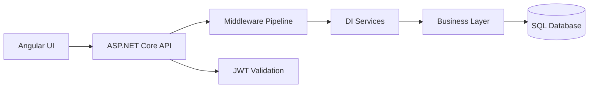

# C#/.NET + Angular + Database Interview Q&A Handbook

## Overview
This handbook consolidates practical interview questions across C#/.NET backend, Angular token handling, and core SQL/database operations.

## Why this topic matters
Senior interviews often test whether you can connect coding fundamentals with production architecture decisions, not only syntax recall.

## Core concepts
- ASP.NET Core architecture and middleware pipeline
- Dependency injection lifetimes and service design
- LINQ, collections, language fundamentals, and OOP principles
- AuthN/AuthZ with JWT and API security controls
- Angular token propagation for secure API calls
- SQL DML/DDL behavior, indexing, and query optimization

## Detailed explanation of each concept
These questions span three layers of real systems: API/runtime design, frontend integration, and persistence/data correctness. The strongest answers explain where a concept is used in production, what risk it mitigates, and what trade-offs it introduces. For example, choosing `Scoped` vs `Singleton` affects concurrency safety and memory behavior, while choosing `PATCH` vs `PUT` affects payload size, conflict handling, and API contract clarity. Database questions in this set test data safety, operational impact, and performance behavior under scale.

## Evaluation (How to assess answer quality)
- Correct technical definition plus practical production use
- Explicit risk and mitigation in each answer
- Performance/security impact awareness
- Clear examples and debugging awareness
- Ability to choose patterns by scenario, not by habit

## Architecture / flow diagram


**Flow explanation:** UI sends tokenized requests, middleware handles cross-cutting concerns, DI resolves service graph, business logic executes, and persistence layer performs data operations safely.

## Real-world example
A payroll platform uses Angular + ASP.NET Core + SQL Server. Tokens are attached via Angular interceptor, API validates JWT middleware, services are scoped per request for unit-of-work safety, and SQL procedures are tuned with indexing and execution-plan analysis.

## Best practices
- Keep controller thin, move logic to services
- Use scoped DbContext/repository patterns
- Use middleware for logging/correlation/error handling
- Prefer parameterized SQL and execution plan monitoring
- Add model validation and standardized error contracts

## Common mistakes / misconceptions
- Using `Singleton` for request-specific/stateful services
- Ignoring JWT expiry/clock skew and refresh behavior
- Treating `DELETE`, `TRUNCATE`, and `DROP` as equivalent
- Running heavy logic in controllers instead of services
- Skipping load testing for critical database procedures

## Industry relevance
These are frequently asked in enterprise product teams, consulting deliveries, fintech, health-tech, and internal platform engineering interviews.

## Interview discussion points
- Correctness vs performance trade-offs
- Security controls in API + frontend + DB
- Reliability, rollback, and production-safe evolution

## Related/dependent links
- [Azure Dotnet Interview Handbook](./azure_dotnet_interview_handbook.md)
- [Web Stack README](../web-stack/README.md)
- [System Design HLD/LLD](../system-design/system_design_hld_lld.md)

## Interview Questions (32)
1. Draw and explain project architecture and flow.
2. Write function to reverse a string.
3. Write LINQ query for distinct records.
4. Difference between `Single()` and `SingleOrDefault()`; what happens if 2 records match?
5. Difference between Singleton and Scoped services; where used?
6. Explain middleware and create custom middleware.
7. Explain dependency injection and where used.
8. Difference between ViewData and ViewBag; where used and performance comparison.
9. How to pass data to view.
10. Difference between Hashtable and Dictionary.
11. What is HTTP PATCH verb? How to pass partial columns? Syntax.
12. Difference between Dapper and AutoMapper; which is better and why?
13. Difference between Dapper and Entity Framework.
14. Difference between `==` and `Equals()`.
15. Difference between Encapsulation and Abstraction.
16. SOLID: explain first principle.
17. Difference between abstract class and interface.
18. Use of `yield`.
19. Which authentication is used in project?
20. Explain JWT token and parts. Required package and sample code.
21. Difference between Thread and TPL.
22. How to validate model in .NET?
23. Explain `AsNoTracking()`. Where used?
24. Explain routing in .NET.
25. Explain CORS and how to implement.
26. Angular: how to pass token.
27. DB: difference between DROP, DELETE, TRUNCATE.
28. DB: optimize stored procedure.
29. DB: impact of multiple clustered indexes.
30. DB: remove duplicate records from table.
31. DB: get records in table A not present in table B.
32. DB: update gender column male->female and female->male.

---

### Q1. Draw and explain project architecture and flow.
**Question summary:** Tests full-stack architecture understanding from UI request to DB response.
**Crisp answer (7-8 lines):** In enterprise .NET projects, flow is usually UI -> API Gateway -> ASP.NET Core API -> Services -> Repository/EF/Dapper -> SQL. Middleware handles auth, logging, error handling, and correlation IDs. DI creates service graph per request. Domain/service layer keeps business logic separated from transport layer. DB layer handles persistence and transactions. This separation improves testability, scalability, and maintainability.
**Deep explanation:** Explain architecture by layers and control points. Incoming request first passes reverse proxy/API gateway and reaches ASP.NET Core middleware pipeline where CORS, auth, exception handling, and telemetry are enforced. Controller only maps request/response and delegates to application services. Service layer applies business rules and calls persistence abstractions. Data access uses EF Core or Dapper depending on complexity and performance needs. This design supports independent testing, clear ownership, and safer changes.
**Answer summary:**
- **Decision:** Use layered architecture with middleware + DI boundaries.
- **Risk:** Tight coupling between controllers and DB creates fragile systems.
- **Mitigation:** Keep business logic in services and data access behind interfaces.
**Practical example:** Payroll approval request flows from Angular UI through JWT-authenticated API, then service validates approval rules, updates DB, and logs an audit event.
**Simple diagram:**
```text
Angular -> API Middleware -> Controller -> Service -> Repository -> SQL
```
**Trusted reference links:**  
- https://learn.microsoft.com/aspnet/core/fundamentals/middleware/

### Q2. Write function to reverse a string.
**Question summary:** Tests C# coding fundamentals and edge-case handling.
**Crisp answer (7-8 lines):** Use `char[]`, reverse in-place, and return new string. Handle null explicitly. Complexity is O(n). Avoid repeated string concatenation because it is O(n²). For interviews, show both concise and readable version.
**Deep explanation:** A robust answer includes null handling and complexity rationale. In C#, strings are immutable, so in-place reversal requires char array conversion. This approach is memory-efficient compared to repeated concatenation loops. Mention Unicode grapheme caveat for advanced discussion.
**Answer summary:**
- **Decision:** Use array reversal for clarity and performance.
- **Risk:** Null/unicode edge cases ignored in naive implementation.
- **Mitigation:** Add null guards and clarify text-encoding limitations.
**Practical example:** Reversing masked account identifiers in a utility service during data obfuscation tests.
**Simple diagram:**
```csharp
public static string ReverseString(string input)
{
    if (input is null) return null;
    var chars = input.ToCharArray();
    Array.Reverse(chars);
    return new string(chars);
}
```
**Trusted reference links:**  
- https://learn.microsoft.com/dotnet/csharp/programming-guide/strings/

### Q3. Write LINQ query for distinct records.
**Question summary:** Tests LINQ usage and deduplication strategy.
**Crisp answer (7-8 lines):** Use `Distinct()` for primitive equality and `DistinctBy()` (in .NET 6+) for key-based distinct. For older versions, use `GroupBy(x => key).Select(g => g.First())`. Choose the method based on equality requirements.
**Deep explanation:** Distinct logic depends on equality semantics. Primitive types work directly, but object distinct requires key selector or custom comparer. Mention that DB-side distinct with `IQueryable` is preferable for large sets.
**Answer summary:**
- **Decision:** Use key-based distinct for object collections.
- **Risk:** In-memory dedupe on huge datasets can be expensive.
- **Mitigation:** Push distinct operation to database where possible.
**Practical example:** Deduplicating customer emails before campaign notification dispatch.
**Simple diagram:**
```csharp
var unique = customers.DistinctBy(c => c.Email).ToList();
```
**Trusted reference links:**  
- https://learn.microsoft.com/dotnet/api/system.linq.enumerable.distinct

### Q4. Difference between `Single()` and `SingleOrDefault()`; what if 2 records match?
**Question summary:** Tests query semantics and exception behavior.
**Crisp answer (7-8 lines):** `Single()` expects exactly one record and throws if zero or more than one. `SingleOrDefault()` allows zero and returns default for none, but still throws if more than one. If 2 records satisfy condition, both throw `InvalidOperationException`.
**Deep explanation:** Use these methods only when uniqueness is guaranteed by business rule/index. If uniqueness is uncertain, use `FirstOrDefault()` and validate externally.
**Answer summary:**
- **Decision:** Use `Single*` only for logically unique keys.
- **Risk:** Runtime exceptions if data integrity is weak.
- **Mitigation:** Enforce unique constraints and validate query intention.
**Practical example:** Fetching active payroll cycle by unique period code where DB has unique index.
**Simple diagram:**
```text
0 row: Single -> error, SingleOrDefault -> default
2 rows: Single -> error, SingleOrDefault -> error
```
**Trusted reference links:**  
- https://learn.microsoft.com/dotnet/api/system.linq.enumerable.single

### Q5. Difference between Singleton and Scoped services; where used?
**Question summary:** Tests DI lifetime design.
**Crisp answer (7-8 lines):** Singleton has one instance for entire app lifetime. Scoped creates one instance per request scope. Singleton suits stateless shared services (config cache, utility). Scoped suits request-bound logic (unit-of-work, DbContext-backed services). Never inject scoped directly into singleton.
**Deep explanation:** Lifetime mismatch can cause memory leaks, stale state, or thread-safety bugs. In web APIs, scoped is safest default for business/data services. Singleton should be immutable or thread-safe.
**Answer summary:**
- **Decision:** Use scoped for request data; singleton for shared stateless services.
- **Risk:** Lifetime mismatch causes subtle production bugs.
- **Mitigation:** Validate service graph and avoid scoped->singleton dependency.
**Practical example:** `IClockProvider` singleton, `OrderService` scoped, `DbContext` scoped.
**Simple diagram:**
```text
App Lifetime: Singleton [one]
Request Lifetime: Scoped [one per request]
```
**Trusted reference links:**  
- https://learn.microsoft.com/aspnet/core/fundamentals/dependency-injection

### Q6. Explain middleware and create custom middleware.
**Question summary:** Tests ASP.NET Core pipeline understanding.
**Crisp answer (7-8 lines):** Middleware is a pipeline component that handles request/response cross-cutting concerns. Each middleware can inspect, modify, short-circuit, or pass to next. Common uses: auth, logging, exception handling, correlation ID, CORS.
**Deep explanation:** Custom middleware is used when concern applies globally and consistently. Keep it lightweight, order-aware, and resilient. Order matters: exception handling early, auth before authorization, endpoint routing near the end.
**Answer summary:**
- **Decision:** Use middleware for cross-cutting concerns.
- **Risk:** Wrong order breaks security or behavior.
- **Mitigation:** Define and test pipeline order explicitly.
**Practical example:** Correlation-ID middleware added to every request for distributed tracing.
**Simple diagram:**
```csharp
public class CorrelationMiddleware
{
  private readonly RequestDelegate _next;
  public CorrelationMiddleware(RequestDelegate next) => _next = next;
  public async Task Invoke(HttpContext ctx)
  {
    ctx.Response.Headers["X-Correlation-Id"] = Guid.NewGuid().ToString();
    await _next(ctx);
  }
}
```
**Trusted reference links:**  
- https://learn.microsoft.com/aspnet/core/fundamentals/middleware/write

### Q7. Explain dependency injection and where used.
**Question summary:** Tests inversion-of-control and maintainability thinking.
**Crisp answer (7-8 lines):** DI provides dependencies from container instead of creating with `new`. It reduces coupling, improves testability, and centralizes lifecycle management. Used in controllers, services, repositories, and infrastructure clients.
**Deep explanation:** DI enables substitutable implementations and easier unit testing via mocks/fakes. Constructor injection is preferred for required dependencies. Keep dependency graph simple and avoid service locator anti-pattern.
**Answer summary:**
- **Decision:** Use constructor DI across app layers.
- **Risk:** Hidden dependencies and hard-to-test code without DI.
- **Mitigation:** Register interfaces clearly and keep services cohesive.
**Practical example:** `IEmailSender` swapped between SMTP and SendGrid implementations via config.
**Simple diagram:**
```text
Container -> resolves -> Controller(Service -> Repo -> DB)
```
**Trusted reference links:**  
- https://learn.microsoft.com/dotnet/core/extensions/dependency-injection

### Q8. Difference between ViewData and ViewBag; where used and performance wise?
**Question summary:** Tests MVC view data-passing mechanisms.
**Crisp answer (7-8 lines):** `ViewData` is dictionary-based (`ViewData["Key"]`), `ViewBag` is dynamic wrapper over `ViewData`. Both are request-scoped and used for small UI metadata. Performance difference is negligible; readability and compile-time safety are bigger concerns. Strongly typed ViewModel is preferred for main data.
**Deep explanation:** Both are weakly typed and can fail at runtime due to typo/cast issues. Use them for small optional values, not core model payload.
**Answer summary:**
- **Decision:** Prefer ViewModel for main data; ViewData/ViewBag for minor metadata.
- **Risk:** Runtime errors due to dynamic/weak typing.
- **Mitigation:** Keep usage minimal and consistent.
**Practical example:** Using `ViewBag.PageTitle` while main page data comes from typed model.
**Simple diagram:**
```text
Controller -> ViewModel (primary) + ViewBag/ViewData (auxiliary)
```
**Trusted reference links:**  
- https://learn.microsoft.com/aspnet/core/mvc/views/overview

### Q9. How to pass data to view.
**Question summary:** Tests MVC communication pattern.
**Crisp answer (7-8 lines):** Pass primary data via strongly typed model (`return View(model)`), temporary flow data with `TempData`, and small metadata with ViewBag/ViewData.
**Deep explanation:** Strongly typed models ensure compile-time checks and maintainability. `TempData` is good for PRG pattern messages after redirect.
**Answer summary:**
- **Decision:** Use typed model as default mechanism.
- **Risk:** Dynamic data passing reduces reliability.
- **Mitigation:** Restrict weakly typed channels to small metadata.
**Practical example:** Order details page receives `OrderViewModel` and success toast via `TempData`.
**Simple diagram:**
```text
Controller -> View(model)
Controller -> TempData["Message"] -> next request
```
**Trusted reference links:**  
- https://learn.microsoft.com/aspnet/core/mvc/controllers/actions

### Q10. Difference between Hashtable and Dictionary.
**Question summary:** Tests collection type choice.
**Crisp answer (7-8 lines):** `Hashtable` is non-generic and stores `object` keys/values, causing boxing/unboxing and runtime casts. `Dictionary<TKey,TValue>` is generic, type-safe, and generally faster. Prefer Dictionary in modern .NET.
**Deep explanation:** Generic collections improve performance and safety. `Hashtable` exists mainly for legacy interop.
**Answer summary:**
- **Decision:** Use `Dictionary<TKey,TValue>` for new code.
- **Risk:** Hashtable type casting bugs and overhead.
- **Mitigation:** Migrate legacy hashtable paths to generic collections.
**Practical example:** API cache key map implemented using `Dictionary<string, CacheEntry>`.
**Simple diagram:**
```text
Hashtable -> object/object
Dictionary -> strong types
```
**Trusted reference links:**  
- https://learn.microsoft.com/dotnet/standard/collections/

### Q11. What is PATCH verb and syntax for partial columns?
**Question summary:** Tests REST semantics and partial update handling.
**Crisp answer (7-8 lines):** `PATCH` applies partial updates to resource fields instead of replacing full resource (`PUT`). In .NET, use JSON Patch (`JsonPatchDocument<T>`) or custom DTO patch endpoints.
**Deep explanation:** PATCH reduces payload and conflict scope but needs strong validation, authorization per field, and concurrency checks.
**Answer summary:**
- **Decision:** Use PATCH for partial updates with strict validation.
- **Risk:** Uncontrolled patching can violate data integrity.
- **Mitigation:** Whitelist fields and enforce model/state validation.
**Practical example:** Updating only employee email and phone in profile service.
**Simple diagram:**
```csharp
[HttpPatch("{id}")]
public IActionResult Patch(int id, [FromBody] JsonPatchDocument<EmployeeDto> patch)
{
    var model = _service.Get(id);
    patch.ApplyTo(model, ModelState);
    if(!ModelState.IsValid) return BadRequest(ModelState);
    _service.Update(model);
    return NoContent();
}
```
**Trusted reference links:**  
- https://learn.microsoft.com/aspnet/core/web-api/jsonpatch

### Q12. Difference between Dapper and AutoMapper; which is better and why?
**Question summary:** Tests tool purpose clarity.
**Crisp answer (7-8 lines):** They solve different problems. Dapper is micro-ORM for SQL data access. AutoMapper maps object-to-object (Entity->DTO). One is not replacement for the other.
**Deep explanation:** Choose Dapper for performance-critical SQL with manual control. Choose AutoMapper to reduce DTO mapping boilerplate. Many systems use both together.
**Answer summary:**
- **Decision:** Use each for its specific layer concern.
- **Risk:** Tool misuse due to false equivalence.
- **Mitigation:** Separate data access and object mapping responsibilities.
**Practical example:** Dapper fetches projection, AutoMapper maps domain model to API response DTO.
**Simple diagram:**
```text
SQL <-> Dapper; ObjectA -> AutoMapper -> ObjectB
```
**Trusted reference links:**  
- https://github.com/DapperLib/Dapper  
- https://automapper.org/

### Q13. Dapper and EF difference?
**Question summary:** Tests ORM strategy trade-offs.
**Crisp answer (7-8 lines):** EF Core is full ORM with change tracking, migrations, LINQ abstraction. Dapper is lightweight, SQL-first, faster for hot paths. EF improves developer velocity; Dapper gives fine SQL control.
**Deep explanation:** Decision depends on domain complexity, team SQL maturity, and performance criticality. Hybrid usage is common.
**Answer summary:**
- **Decision:** EF for productivity; Dapper for critical query performance.
- **Risk:** Wrong tool choice causes either complexity or latency issues.
- **Mitigation:** Benchmark key workloads and choose per use case.
**Practical example:** EF for CRUD admin module, Dapper for high-volume reporting endpoint.
**Simple diagram:**
```text
EF: high abstraction
Dapper: low abstraction / high control
```
**Trusted reference links:**  
- https://learn.microsoft.com/ef/core/

### Q14. Difference between `==` and `Equals()`.
**Question summary:** Tests equality semantics.
**Crisp answer (7-8 lines):** `==` can be operator-overloaded and may check reference/value based on type implementation. `Equals()` checks logical equality as defined by type override. For strings in C#, both compare value.
**Deep explanation:** In custom types, override `Equals`/`GetHashCode` consistently; optionally overload `==`. Mention null-safe comparisons.
**Answer summary:**
- **Decision:** Use semantic equality intentionally by type.
- **Risk:** Incorrect equality causes bugs in sets/dictionaries.
- **Mitigation:** Implement equality contracts correctly.
**Practical example:** ValueObject equality in domain model for Address.
**Simple diagram:**
```text
== : operator semantics
Equals(): object equality semantics
```
**Trusted reference links:**  
- https://learn.microsoft.com/dotnet/csharp/programming-guide/statements-expressions-operators/equality-comparisons

### Q15. Difference between Encapsulation and Abstraction.
**Question summary:** Tests OOP concept clarity.
**Crisp answer (7-8 lines):** Encapsulation hides internal state and exposes controlled operations. Abstraction hides complexity and exposes essential behavior contract.
**Deep explanation:** Encapsulation is about data protection and invariants; abstraction is about interface simplification and role-focused design.
**Answer summary:**
- **Decision:** Use encapsulation for invariants, abstraction for extensibility.
- **Risk:** Leaky design increases coupling.
- **Mitigation:** Keep clear contracts and private state.
**Practical example:** `BankAccount` hides balance mutation rules while `IPaymentGateway` abstracts provider details.
**Simple diagram:**
```text
Encapsulation: data + behavior boundary
Abstraction: interface over implementation
```
**Trusted reference links:**  
- https://learn.microsoft.com/dotnet/csharp/fundamentals/object-oriented/

### Q16. SOLID: explain first principle.
**Question summary:** Tests SRP understanding.
**Crisp answer (7-8 lines):** First principle is SRP (Single Responsibility Principle): a class should have one reason to change. It improves maintainability, testability, and reduces side effects.
**Deep explanation:** SRP does not mean one method per class; it means coherent responsibility boundary. Violating SRP creates fragile change impact.
**Answer summary:**
- **Decision:** Partition classes by business responsibility.
- **Risk:** God classes amplify regression risk.
- **Mitigation:** Refactor by cohesive responsibility seams.
**Practical example:** Split invoice generation, tax calculation, and email dispatch into separate services.
**Simple diagram:**
```text
One class -> one responsibility -> one reason to change
```
**Trusted reference links:**  
- https://learn.microsoft.com/dotnet/architecture/modern-web-apps-azure/common-web-application-architectures

### Q17. Difference between abstract class and interface.
**Question summary:** Tests inheritance vs contract design.
**Crisp answer (7-8 lines):** Interface defines contract; abstract class can include shared state/implementation. Use interface for capability contracts and loose coupling. Use abstract class when common base behavior is meaningful.
**Deep explanation:** Prefer interfaces for service boundaries and testing. Use abstract base for template-method or shared code where inheritance is natural.
**Answer summary:**
- **Decision:** Interface for extensibility; abstract class for shared implementation.
- **Risk:** Wrong choice creates rigid inheritance trees.
- **Mitigation:** Favor composition and interface-first design.
**Practical example:** `INotificationSender` interface with abstract `NotificationBase` for shared logging logic.
**Simple diagram:**
```text
Interface: contract only
Abstract class: contract + base behavior
```
**Trusted reference links:**  
- https://learn.microsoft.com/dotnet/csharp/language-reference/keywords/interface

### Q18. Use of `yield`.
**Question summary:** Tests lazy iteration understanding.
**Crisp answer (7-8 lines):** `yield return` enables deferred execution for iterators. It returns sequence items one by one without materializing full collection. Useful for memory efficiency and stream-like processing.
**Deep explanation:** Ideal for large sequences and pipelines. Trade-off: execution happens during enumeration; side effects should be controlled.
**Answer summary:**
- **Decision:** Use `yield` for lazy, memory-efficient iteration.
- **Risk:** Hidden deferred side effects.
- **Mitigation:** Keep iterator logic deterministic and side-effect-light.
**Practical example:** Paginated export generator streaming records to CSV.
**Simple diagram:**
```csharp
IEnumerable<int> Seq(){ for(int i=0;i<3;i++) yield return i; }
```
**Trusted reference links:**  
- https://learn.microsoft.com/dotnet/csharp/language-reference/statements/yield

### Q19. Which authentication used in project?
**Question summary:** Tests practical auth selection rationale.
**Crisp answer (7-8 lines):** For modern SPA + API projects, JWT Bearer authentication is common. For enterprise internal apps, OpenID Connect with Azure AD/Entra ID is typical. Selection depends on trust boundaries and SSO requirements.
**Deep explanation:** Mention token lifecycle, refresh strategy, role/claim mapping, and endpoint authorization policy.
**Answer summary:**
- **Decision:** Choose auth protocol based on user/channel and SSO needs.
- **Risk:** Weak token validation causes unauthorized access.
- **Mitigation:** Validate issuer/audience/signature/expiry and apply policies.
**Practical example:** Angular SPA authenticates via Entra ID and calls API with bearer token.
**Simple diagram:**
```text
User -> IdP login -> JWT -> API Bearer validation
```
**Trusted reference links:**  
- https://learn.microsoft.com/aspnet/core/security/authentication/

### Q20. Explain JWT token, parts, package, and code.
**Question summary:** Tests JWT internals and implementation ability.
**Crisp answer (7-8 lines):** JWT has 3 parts: Header, Payload (claims), Signature. API validates signature, issuer, audience, and expiry. In ASP.NET Core, use `Microsoft.AspNetCore.Authentication.JwtBearer`.
**Deep explanation:** Security depends on proper key management, short-lived access tokens, and refresh token controls. Claims should be minimal and authorization should use policies.
**Answer summary:**
- **Decision:** Use standard JWT bearer middleware and strict validation params.
- **Risk:** Token replay/misconfiguration can bypass controls.
- **Mitigation:** Enforce expiry, audience/issuer validation, HTTPS, and key rotation.
**Practical example:** Employee portal API validates `role=Manager` claim for approval endpoint.
**Simple diagram:**
```csharp
builder.Services.AddAuthentication("Bearer")
  .AddJwtBearer("Bearer", o =>
  {
    o.TokenValidationParameters = new TokenValidationParameters
    {
      ValidateIssuer = true,
      ValidateAudience = true,
      ValidateLifetime = true,
      ValidateIssuerSigningKey = true
    };
  });
```
**Trusted reference links:**  
- https://learn.microsoft.com/aspnet/core/security/authentication/jwtbearer

### Q21. Difference between Thread and TPL.
**Question summary:** Tests concurrency model choice.
**Crisp answer (7-8 lines):** `Thread` is low-level OS thread management. TPL (`Task`, `async/await`) is higher-level abstraction using thread pool and scheduling. Prefer TPL for scalable app code.
**Deep explanation:** Manual thread management is costly and error-prone. TPL improves composability, cancellation, and error propagation.
**Answer summary:**
- **Decision:** Use TPL by default in application code.
- **Risk:** Manual threading leads to resource waste and bugs.
- **Mitigation:** Use tasks, cancellation tokens, and async best practices.
**Practical example:** Parallel document processing with `Task.WhenAll`.
**Simple diagram:**
```text
Thread -> manual lifecycle
Task/TPL -> scheduler-managed concurrency
```
**Trusted reference links:**  
- https://learn.microsoft.com/dotnet/standard/parallel-programming/task-parallel-library-tpl

### Q22. How to validate model in .NET?
**Question summary:** Tests API input safety.
**Crisp answer (7-8 lines):** Use DataAnnotations (`[Required]`, `[StringLength]`, etc.) on DTOs and `[ApiController]` auto-validation. For custom rules, use `IValidatableObject` or FluentValidation.
**Deep explanation:** Validation should run before business logic to reduce bad writes and simplify error contracts.
**Answer summary:**
- **Decision:** Validate at boundary DTO layer.
- **Risk:** Invalid inputs propagate to domain/persistence.
- **Mitigation:** Centralize validation and return consistent `400` payloads.
**Practical example:** Salary update endpoint rejects negative amount and invalid employee ID format.
**Simple diagram:**
```text
Request DTO -> Validation -> Controller/Service
```
**Trusted reference links:**  
- https://learn.microsoft.com/aspnet/core/mvc/models/validation

### Q23. Explain `AsNoTracking()`. Where used?
**Question summary:** Tests EF Core query performance tuning.
**Crisp answer (7-8 lines):** `AsNoTracking()` disables change tracking for read-only queries. It reduces memory and improves query performance. Use when you do not update entities after reading.
**Deep explanation:** Tracking adds overhead for state manager. For high-volume read APIs, no-tracking is preferred.
**Answer summary:**
- **Decision:** Use no-tracking for read-only workloads.
- **Risk:** Accidentally expecting updates on detached entities.
- **Mitigation:** Apply tracking only where updates are needed.
**Practical example:** Dashboard listing endpoint reads 10k rows with `AsNoTracking()`.
**Simple diagram:**
```csharp
var users = await _db.Users.AsNoTracking().ToListAsync();
```
**Trusted reference links:**  
- https://learn.microsoft.com/ef/core/querying/tracking

### Q24. Explain routing in .NET.
**Question summary:** Tests request dispatch mechanism.
**Crisp answer (7-8 lines):** Routing maps URL patterns to endpoints/controllers/actions. ASP.NET Core supports conventional routing and attribute routing. Attribute routing is common for Web APIs.
**Deep explanation:** Good routing design improves API versioning, discoverability, and governance. Keep route contracts stable and resource-oriented.
**Answer summary:**
- **Decision:** Prefer explicit attribute routing for APIs.
- **Risk:** Inconsistent routes hurt maintainability.
- **Mitigation:** Standardize route naming/versioning strategy.
**Practical example:** `api/v1/orders/{id}` and `api/v1/orders/{id}/status`.
**Simple diagram:**
```text
URL -> Endpoint matcher -> Controller action
```
**Trusted reference links:**  
- https://learn.microsoft.com/aspnet/core/fundamentals/routing

### Q25. Explain CORS and how to implement.
**Question summary:** Tests cross-origin security basics.
**Crisp answer (7-8 lines):** CORS controls which origins can call your API from browsers. Configure explicit allowed origins, methods, and headers. Avoid `AllowAnyOrigin` in production with credentials.
**Deep explanation:** CORS is browser enforcement, not full API security. Still require JWT/API auth server-side.
**Answer summary:**
- **Decision:** Use restrictive origin allowlists.
- **Risk:** Overly broad CORS opens attack surface.
- **Mitigation:** Per-environment policies and security review.
**Practical example:** Allow only `https://payroll.company.com` to call payroll API.
**Simple diagram:**
```csharp
builder.Services.AddCors(o => o.AddPolicy("ui", p =>
  p.WithOrigins("https://app.example.com")
   .AllowAnyHeader().AllowAnyMethod()));
app.UseCors("ui");
```
**Trusted reference links:**  
- https://learn.microsoft.com/aspnet/core/security/cors

### Q26. Angular: how to pass token.
**Question summary:** Tests frontend secure API consumption.
**Crisp answer (7-8 lines):** Use Angular HTTP interceptor and append `Authorization: Bearer <token>` header for API calls. Keep token storage strategy secure and refresh flow controlled.
**Deep explanation:** Interceptor centralizes token injection and reduces duplication. Handle token expiry and 401 retry safely.
**Answer summary:**
- **Decision:** Use HTTP interceptor for token propagation.
- **Risk:** Token leakage in insecure storage/logging.
- **Mitigation:** Secure storage practices and short token lifetimes.
**Practical example:** Interceptor reads token from auth service and injects into all `/api/*` requests.
**Simple diagram:**
```typescript
intercept(req: HttpRequest<any>, next: HttpHandler) {
  const token = this.auth.getToken();
  const authReq = req.clone({ setHeaders: { Authorization: `Bearer ${token}` } });
  return next.handle(authReq);
}
```
**Trusted reference links:**  
- https://angular.io/guide/http#intercepting-requests-and-responses

### Q27. DB: difference between DROP, DELETE, TRUNCATE.
**Question summary:** Tests DDL vs DML and logging behavior.
**Crisp answer (7-8 lines):** `DELETE` removes rows (can use WHERE, fully logged). `TRUNCATE` removes all rows quickly (minimal logging, no WHERE). `DROP` removes table object/schema itself.
**Deep explanation:** Choose command by intent and recovery needs. Drop is destructive schema operation.
**Answer summary:**
- **Decision:** Use DELETE for selective row removal.
- **Risk:** Wrong command can cause irreversible loss.
- **Mitigation:** Use transaction/backup and least-privilege permissions.
**Practical example:** Cleanup old audit rows with `DELETE WHERE CreatedOn < ...`.
**Simple diagram:**
```text
DELETE -> rows
TRUNCATE -> all rows
DROP -> table object
```
**Trusted reference links:**  
- https://learn.microsoft.com/sql/t-sql/statements/

### Q28. DB: optimize stored procedure.
**Question summary:** Tests SQL tuning approach.
**Crisp answer (7-8 lines):** Analyze execution plan, add proper indexes, avoid `SELECT *`, parameterize inputs, reduce RBAR loops, and track IO/time stats.
**Deep explanation:** Optimization is workload-specific. Validate cardinality, sargability, and parameter sniffing issues.
**Answer summary:**
- **Decision:** Tune using execution-plan evidence, not guesswork.
- **Risk:** Untuned SPs cause latency spikes and blocking.
- **Mitigation:** Baseline metrics, index strategy, and periodic review.
**Practical example:** Rewriting non-sargable date filter improved report API from 8s to 600ms.
**Simple diagram:**
```text
Slow SP -> Plan analysis -> index/query fix -> benchmark -> deploy
```
**Trusted reference links:**  
- https://learn.microsoft.com/sql/relational-databases/performance/performance-tuning

### Q29. DB: impact of multiple clustered indexes.
**Question summary:** Tests indexing fundamentals.
**Crisp answer (7-8 lines):** A table can have only one clustered index because clustered index defines physical row order. Attempting multiple clustered indexes is invalid.
**Deep explanation:** Additional access paths should use nonclustered indexes. Choose clustered key carefully for range queries and write behavior.
**Answer summary:**
- **Decision:** One clustered index per table; others nonclustered.
- **Risk:** Poor clustered key increases fragmentation and write cost.
- **Mitigation:** Choose narrow, stable, selective clustered keys.
**Practical example:** Orders table uses clustered index on `OrderId` and nonclustered on `CustomerId, CreatedOn`.
**Simple diagram:**
```text
Table -> [one clustered] + [many nonclustered]
```
**Trusted reference links:**  
- https://learn.microsoft.com/sql/relational-databases/indexes/clustered-and-nonclustered-indexes-described

### Q30. DB: remove duplicate records from table.
**Question summary:** Tests window-function cleanup pattern.
**Crisp answer (7-8 lines):** Use `ROW_NUMBER()` partitioned by duplicate key and delete rows where row number > 1.
**Deep explanation:** Keep deterministic ordering (latest created or smallest ID) to retain correct record.
**Answer summary:**
- **Decision:** Use window functions for safe dedupe.
- **Risk:** Non-deterministic delete can remove wrong row.
- **Mitigation:** Define business rule for record retention.
**Practical example:** Remove duplicate users by email keeping latest verified entry.
**Simple diagram:**
```sql
WITH cte AS (
  SELECT *, ROW_NUMBER() OVER (PARTITION BY Email ORDER BY Id DESC) rn
  FROM Users
)
DELETE FROM cte WHERE rn > 1;
```
**Trusted reference links:**  
- https://learn.microsoft.com/sql/t-sql/functions/row-number-transact-sql

### Q31. DB: get records in table A not present in table B.
**Question summary:** Tests anti-join query patterns.
**Crisp answer (7-8 lines):** Use `LEFT JOIN ... WHERE B.key IS NULL` or `NOT EXISTS`.
**Deep explanation:** `NOT EXISTS` is usually safer with NULL semantics and optimizer support.
**Answer summary:**
- **Decision:** Prefer `NOT EXISTS` for anti-join clarity.
- **Risk:** Incorrect NULL handling with `NOT IN`.
- **Mitigation:** Use tested anti-join patterns.
**Practical example:** Find employees without payroll record for current month.
**Simple diagram:**
```sql
SELECT a.*
FROM A a
WHERE NOT EXISTS (SELECT 1 FROM B b WHERE b.Id = a.Id);
```
**Trusted reference links:**  
- https://learn.microsoft.com/sql/t-sql/queries/from-transact-sql

### Q32. DB: update gender male->female and female->male.
**Question summary:** Tests conditional update logic.
**Crisp answer (7-8 lines):** Use single `UPDATE` with `CASE` expression to swap values atomically.
**Deep explanation:** Ensure only expected values are updated and protect with transaction in critical tables.
**Answer summary:**
- **Decision:** Use CASE-based set update.
- **Risk:** Accidental updates for unexpected values.
- **Mitigation:** Add WHERE clause and verification query.
**Practical example:** Data correction migration for legacy import inconsistency.
**Simple diagram:**
```sql
UPDATE Employees
SET Gender = CASE
    WHEN Gender = 'Male' THEN 'Female'
    WHEN Gender = 'Female' THEN 'Male'
    ELSE Gender
END
WHERE Gender IN ('Male','Female');
```
**Trusted reference links:**  
- https://learn.microsoft.com/sql/t-sql/queries/update-transact-sql
