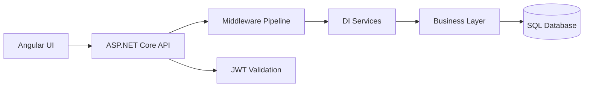

# C#/.NET + Angular + Database Interview Q&A Handbook

## Overview
This handbook consolidates practical interview questions across C#/.NET backend, Angular token handling, and core SQL/database operations.

## Why this topic matters
Senior interviews often test whether you can connect coding fundamentals with production architecture decisions, not only syntax recall.

## Core concepts
- ASP.NET Core architecture and middleware pipeline
- Dependency injection lifetimes and service design
- LINQ, collections, language fundamentals, and OOP principles
- AuthN/AuthZ with JWT and API security controls
- Angular token propagation for secure API calls
- SQL DML/DDL behavior, indexing, and query optimization

## Detailed explanation of each concept
These questions span three layers of real systems: API/runtime design, frontend integration, and persistence/data correctness. The strongest answers explain where a concept is used in production, what risk it mitigates, and what trade-offs it introduces. For example, choosing `Scoped` vs `Singleton` affects concurrency safety and memory behavior, while choosing `PATCH` vs `PUT` affects payload size, conflict handling, and API contract clarity. Database questions in this set test data safety, operational impact, and performance behavior under scale.

## Evaluation (How to assess answer quality)
- Correct technical definition plus practical production use
- Explicit risk and mitigation in each answer
- Performance/security impact awareness
- Clear examples and debugging awareness
- Ability to choose patterns by scenario, not by habit

## Architecture / flow diagram


**Flow explanation:** UI sends tokenized requests, middleware handles cross-cutting concerns, DI resolves service graph, business logic executes, and persistence layer performs data operations safely.

## Real-world example
A payroll platform uses Angular + ASP.NET Core + SQL Server. Tokens are attached via Angular interceptor, API validates JWT middleware, services are scoped per request for unit-of-work safety, and SQL procedures are tuned with indexing and execution-plan analysis.

## Best practices
- Keep controller thin, move logic to services
- Use scoped DbContext/repository patterns
- Use middleware for logging/correlation/error handling
- Prefer parameterized SQL and execution plan monitoring
- Add model validation and standardized error contracts

## Common mistakes / misconceptions
- Using `Singleton` for request-specific/stateful services
- Ignoring JWT expiry/clock skew and refresh behavior
- Treating `DELETE`, `TRUNCATE`, and `DROP` as equivalent
- Running heavy logic in controllers instead of services
- Skipping load testing for critical database procedures

## Industry relevance
These are frequently asked in enterprise product teams, consulting deliveries, fintech, health-tech, and internal platform engineering interviews.

## Interview discussion points
- Correctness vs performance trade-offs
- Security controls in API + frontend + DB
- Reliability, rollback, and production-safe evolution

## Related/dependent links
- [Azure Dotnet Interview Handbook](./azure_dotnet_interview_handbook.md)
- [Web Stack README](../web-stack/README.md)
- [System Design HLD/LLD](../system-design/system_design_hld_lld.md)

## Interview Questions (32)
1. Draw and explain project architecture and flow.
2. Write function to reverse a string.
3. Write LINQ query for distinct records.
4. Difference between `Single()` and `SingleOrDefault()`; what happens if 2 records match?
5. Difference between Singleton and Scoped services; where used?
6. Explain middleware and create custom middleware.
7. Explain dependency injection and where used.
8. Difference between ViewData and ViewBag; where used and performance comparison.
9. How to pass data to view.
10. Difference between Hashtable and Dictionary.
11. What is HTTP PATCH verb? How to pass partial columns? Syntax.
12. Difference between Dapper and AutoMapper; which is better and why?
13. Difference between Dapper and Entity Framework.
14. Difference between `==` and `Equals()`.
15. Difference between Encapsulation and Abstraction.
16. SOLID: explain first principle.
17. Difference between abstract class and interface.
18. Use of `yield`.
19. Which authentication is used in project?
20. Explain JWT token and parts. Required package and sample code.
21. Difference between Thread and TPL.
22. How to validate model in .NET?
23. Explain `AsNoTracking()`. Where used?
24. Explain routing in .NET.
25. Explain CORS and how to implement.
26. Angular: how to pass token.
27. DB: difference between DROP, DELETE, TRUNCATE.
28. DB: optimize stored procedure.
29. DB: impact of multiple clustered indexes.
30. DB: remove duplicate records from table.
31. DB: get records in table A not present in table B.
32. DB: update gender column male->female and female->male.

---

# .NET / ASP.NET Core / C# / SQL / Angular Interview Questions and Answers

## 1. Draw and explain project architecture and flow

### Typical enterprise .NET architecture

```text
Client / Browser / Angular
        ↓
API Gateway / Load Balancer / Reverse Proxy
        ↓
ASP.NET Core Web API
        ↓
Middleware Pipeline
        ↓
Controller / Minimal API Endpoint
        ↓
Application Service / Business Layer
        ↓
Domain Layer
        ↓
Repository / Data Access Layer
        ↓
Database / External APIs / Cache / Queue
```

### Layer explanation

| Layer | Responsibility |
|---|---|
| Client | Sends request and displays response |
| API Gateway / Reverse Proxy | Routing, TLS, rate limiting, authentication offload if needed |
| Middleware | Cross-cutting concerns like logging, exception handling, authentication, CORS |
| Controller | Receives HTTP request and validates input |
| Application Service | Coordinates business use case |
| Domain Layer | Core business rules/entities |
| Repository/Data Access | Database operations using EF Core/Dapper |
| Infrastructure | External services like email, storage, queue, cache |

### Request flow

```text
User request
   ↓
Routing
   ↓
CORS / Exception / Logging middleware
   ↓
Authentication middleware
   ↓
Authorization middleware
   ↓
Controller action
   ↓
Service layer
   ↓
Repository
   ↓
Database
   ↓
Response returned to client
```

### Interview answer

In my project, I usually follow layered or clean architecture. The API controller receives the HTTP request, validates the model, and forwards the request to the application/service layer. The service layer contains business orchestration and calls repositories or external services. Data access is handled using EF Core or Dapper. Cross-cutting concerns like authentication, logging, exception handling, CORS, and correlation IDs are handled using middleware. This keeps the code maintainable, testable, and loosely coupled.

---

## 2. Write function to reverse a string

```csharp
public static string ReverseString(string input)
{
    if (string.IsNullOrEmpty(input))
        return input;

    char[] chars = input.ToCharArray();
    Array.Reverse(chars);
    return new string(chars);
}
```

Using LINQ:

```csharp
public static string ReverseString(string input)
{
    if (string.IsNullOrEmpty(input))
        return input;

    return new string(input.Reverse().ToArray());
}
```

Use `Array.Reverse()` for a simple and efficient approach. The LINQ approach is concise but may be slightly less efficient.

---

## 3. Write LINQ query for distinct records

Distinct primitive values:

```csharp
var distinctNames = employees
    .Select(e => e.Name)
    .Distinct()
    .ToList();
```

Distinct records by one column:

```csharp
var distinctEmployees = employees
    .GroupBy(e => e.Email)
    .Select(g => g.First())
    .ToList();
```

Using `DistinctBy`:

```csharp
var distinctEmployees = employees
    .DistinctBy(e => e.Email)
    .ToList();
```

`DistinctBy` is available in modern .NET versions.

---

## 4. Difference between Single() and SingleOrDefault(); what happens if 2 records match?

| Method | Behavior |
|---|---|
| `Single()` | Expects exactly one matching record |
| `SingleOrDefault()` | Expects zero or one matching record |

If no record exists:

```text
Single()           → throws exception
SingleOrDefault()  → returns default value/null
```

If two or more records match, both throw an exception:

```text
InvalidOperationException: Sequence contains more than one matching element
```

Use `Single()` when exactly one record must exist. Use `SingleOrDefault()` when zero or one record is acceptable.

---

## 5. Difference between Singleton and Scoped services; where used?

| Lifetime | Instance created | Best used for |
|---|---|---|
| Singleton | One instance for entire application lifetime | Stateless shared services, cache, config provider |
| Scoped | One instance per HTTP request | Business services, repositories, DbContext |
| Transient | New instance every time requested | Lightweight stateless services |

Singleton example:

```csharp
builder.Services.AddSingleton<IMemoryCacheService, MemoryCacheService>();
```

Scoped example:

```csharp
builder.Services.AddScoped<IEmployeeService, EmployeeService>();
builder.Services.AddDbContext<AppDbContext>();
```

Use Singleton for stateless, thread-safe services. Use Scoped for services that work within one request, especially `DbContext`. Do not inject a Scoped service directly into a Singleton service because it can create lifetime issues.

---

## 6. Explain middleware and create custom middleware

Middleware is a component in the ASP.NET Core request pipeline. Each middleware can process the request before passing it to the next middleware and can also process the response on the way back.

Common middleware:

```csharp
app.UseExceptionHandler();
app.UseHttpsRedirection();
app.UseCors();
app.UseAuthentication();
app.UseAuthorization();
app.MapControllers();
```

Custom middleware:

```csharp
public class RequestLoggingMiddleware
{
    private readonly RequestDelegate _next;

    public RequestLoggingMiddleware(RequestDelegate next)
    {
        _next = next;
    }

    public async Task InvokeAsync(HttpContext context)
    {
        Console.WriteLine($"Request: {context.Request.Method} {context.Request.Path}");

        await _next(context);

        Console.WriteLine($"Response: {context.Response.StatusCode}");
    }
}
```

Register middleware:

```csharp
app.UseMiddleware<RequestLoggingMiddleware>();
```

Middleware is used for cross-cutting concerns such as exception handling, logging, authentication, authorization, CORS, compression, and request tracing.

---

## 7. Explain dependency injection and where used

Dependency Injection is a design pattern where dependencies are provided to a class from outside instead of the class creating them directly.

Without DI:

```csharp
public class EmployeeService
{
    private readonly EmployeeRepository _repo = new EmployeeRepository();
}
```

With DI:

```csharp
public class EmployeeService
{
    private readonly IEmployeeRepository _repo;

    public EmployeeService(IEmployeeRepository repo)
    {
        _repo = repo;
    }
}
```

Register service:

```csharp
builder.Services.AddScoped<IEmployeeRepository, EmployeeRepository>();
builder.Services.AddScoped<IEmployeeService, EmployeeService>();
```

DI is used in controllers, services, repositories, logging, configuration, DbContext, external API clients, and unit testing. Benefits are loose coupling, better testability, cleaner code, easy replacement of implementation, and centralized lifetime management.

---

## 8. Difference between ViewData and ViewBag; where used and performance comparison

| Feature | ViewData | ViewBag |
|---|---|---|
| Type | Dictionary | Dynamic wrapper over ViewData |
| Syntax | `ViewData["Name"]` | `ViewBag.Name` |
| Type safety | No | No |
| Casting required | Yes for complex types | Usually no explicit cast |
| Performance | Slightly faster | Slight dynamic overhead |

ViewData example:

```csharp
ViewData["Message"] = "Hello";
```

```html
<h1>@ViewData["Message"]</h1>
```

ViewBag example:

```csharp
ViewBag.Message = "Hello";
```

```html
<h1>@ViewBag.Message</h1>
```

ViewData is slightly faster because it is dictionary-based. ViewBag uses dynamic resolution, so it has small overhead. In real applications, this difference is usually negligible. For strongly typed data, prefer ViewModel.

---

## 9. How to pass data to view

Using ViewModel:

```csharp
public class EmployeeViewModel
{
    public int Id { get; set; }
    public string Name { get; set; }
}
```

```csharp
public IActionResult Details()
{
    var model = new EmployeeViewModel
    {
        Id = 1,
        Name = "Rahul"
    };

    return View(model);
}
```

```csharp
@model EmployeeViewModel
<h1>@Model.Name</h1>
```

Using ViewBag:

```csharp
ViewBag.Message = "Welcome";
return View();
```

Using ViewData:

```csharp
ViewData["Message"] = "Welcome";
return View();
```

Using TempData:

```csharp
TempData["Message"] = "Saved successfully";
return RedirectToAction("Index");
```

Best practice: use ViewModel for structured data.

---

## 10. Difference between Hashtable and Dictionary

| Feature | Hashtable | Dictionary<TKey,TValue> |
|---|---|---|
| Namespace | `System.Collections` | `System.Collections.Generic` |
| Type safety | No | Yes |
| Boxing/unboxing | Required for value types | Not required |
| Performance | Slower | Faster |
| Compile-time checking | No | Yes |
| Recommended | Legacy | Preferred |

Hashtable:

```csharp
Hashtable table = new Hashtable();
table.Add(1, "One");
table.Add("Two", 2);
```

Dictionary:

```csharp
Dictionary<int, string> dict = new Dictionary<int, string>();
dict.Add(1, "One");
```

Dictionary is preferred in modern C# because it is generic, type-safe, faster, and avoids boxing/unboxing.

---

## 11. What is HTTP PATCH verb? How to pass partial columns? Syntax

`PATCH` is used to partially update a resource. `PUT` usually replaces the full resource. `PATCH` updates selected fields only.

Controller example using JSON Patch:

```csharp
[HttpPatch("{id}")]
public async Task<IActionResult> PatchEmployee(int id, [FromBody] JsonPatchDocument<Employee> patchDoc)
{
    if (patchDoc == null)
        return BadRequest();

    var employee = await _context.Employees.FindAsync(id);

    if (employee == null)
        return NotFound();

    patchDoc.ApplyTo(employee, ModelState);

    if (!ModelState.IsValid)
        return BadRequest(ModelState);

    await _context.SaveChangesAsync();

    return NoContent();
}
```

Required package:

```bash
dotnet add package Microsoft.AspNetCore.Mvc.NewtonsoftJson
```

Program.cs:

```csharp
builder.Services
    .AddControllers()
    .AddNewtonsoftJson();
```

PATCH request body:

```json
[
  {
    "op": "replace",
    "path": "/email",
    "value": "newemail@test.com"
  },
  {
    "op": "replace",
    "path": "/phone",
    "value": "9999999999"
  }
]
```

DTO-based PATCH alternative:

```csharp
public class EmployeePatchDto
{
    public string? Email { get; set; }
    public string? Phone { get; set; }
}
```

```csharp
[HttpPatch("{id}")]
public async Task<IActionResult> UpdatePartial(int id, EmployeePatchDto dto)
{
    var employee = await _context.Employees.FindAsync(id);

    if (employee == null)
        return NotFound();

    if (dto.Email != null)
        employee.Email = dto.Email;

    if (dto.Phone != null)
        employee.Phone = dto.Phone;

    await _context.SaveChangesAsync();

    return NoContent();
}
```

---

## 12. Difference between Dapper and AutoMapper; which is better and why?

Dapper and AutoMapper solve different problems.

| Tool | Purpose |
|---|---|
| Dapper | Micro ORM for database access |
| AutoMapper | Object-to-object mapping library |

Dapper executes SQL queries and maps database results to C# objects.

```csharp
var employees = connection.Query<Employee>(
    "SELECT * FROM Employees WHERE DepartmentId = @DeptId",
    new { DeptId = 10 }
);
```

AutoMapper maps one object type to another, for example Entity to DTO.

```csharp
var employeeDto = _mapper.Map<EmployeeDto>(employee);
```

They are not alternatives. Use Dapper for database access. Use AutoMapper for object mapping. You can use both together.

---

## 13. Difference between Dapper and Entity Framework

| Feature | Dapper | Entity Framework Core |
|---|---|---|
| Type | Micro ORM | Full ORM |
| Control over SQL | High | Medium |
| Performance | Very fast | Slightly slower |
| Change tracking | No built-in tracking | Built-in tracking |
| LINQ support | No | Yes |
| Migrations | No | Yes |
| Complex domain model | Manual | Easier |
| Best for | Performance, stored procedures, custom SQL | CRUD, domain models, maintainability |

Dapper example:

```csharp
var employee = connection.QueryFirstOrDefault<Employee>(
    "SELECT * FROM Employees WHERE Id = @Id",
    new { Id = id }
);
```

EF Core example:

```csharp
var employee = await _context.Employees
    .FirstOrDefaultAsync(e => e.Id == id);
```

Dapper is better when high performance and full SQL control are required. EF Core is better when productivity, change tracking, LINQ, migrations, and maintainable CRUD operations are required.

---

## 14. Difference between == and Equals()

For value types:

```csharp
int a = 10;
int b = 10;

Console.WriteLine(a == b);       // true
Console.WriteLine(a.Equals(b));  // true
```

For reference types:

```csharp
Employee e1 = new Employee { Id = 1 };
Employee e2 = new Employee { Id = 1 };

Console.WriteLine(e1 == e2);       // false by default
Console.WriteLine(e1.Equals(e2));  // false unless overridden
```

String exception:

```csharp
string s1 = "test";
string s2 = "test";

Console.WriteLine(s1 == s2);       // true
Console.WriteLine(s1.Equals(s2));  // true
```

`==` is an operator and can be overloaded. `Equals()` is a method that can be overridden. For reference types, `==` usually checks reference equality unless overloaded. `Equals()` can be customized to check value equality.

---

## 15. Difference between Encapsulation and Abstraction

| Concept | Meaning | Example |
|---|---|---|
| Encapsulation | Hiding internal data and controlling access | Private fields with public methods/properties |
| Abstraction | Hiding implementation complexity and exposing only essentials | Interface or abstract class |

Encapsulation example:

```csharp
public class BankAccount
{
    private decimal _balance;

    public void Deposit(decimal amount)
    {
        if (amount <= 0)
            throw new ArgumentException("Invalid amount");

        _balance += amount;
    }

    public decimal GetBalance()
    {
        return _balance;
    }
}
```

Abstraction example:

```csharp
public interface IPaymentService
{
    void Pay(decimal amount);
}
```

Encapsulation protects data inside a class. Abstraction hides implementation details and exposes only required behavior.

---

## 16. SOLID: explain first principle

The first principle of SOLID is **S — Single Responsibility Principle**.

Meaning:

```text
A class should have only one reason to change.
```

Bad example:

```csharp
public class EmployeeService
{
    public void AddEmployee() { }
    public void SendEmail() { }
    public void GenerateReport() { }
}
```

Better example:

```csharp
public class EmployeeService
{
    public void AddEmployee() { }
}

public class EmailService
{
    public void SendEmail() { }
}

public class ReportService
{
    public void GenerateReport() { }
}
```

Single Responsibility Principle improves maintainability, testability, and reduces side effects when code changes.

---

## 17. Difference between abstract class and interface

| Feature | Abstract Class | Interface |
|---|---|---|
| Purpose | Base class with common behavior | Contract/capability |
| Multiple inheritance | Not possible | Multiple interfaces possible |
| Fields | Can have fields | Cannot have normal instance fields |
| Constructor | Can have constructor | Cannot have normal constructor |
| Access modifiers | Supported | Members are usually public |
| Implementation | Can provide implementation | Can provide default methods in modern C#, but mostly used as contract |

Abstract class:

```csharp
public abstract class Animal
{
    public void Sleep()
    {
        Console.WriteLine("Sleeping");
    }

    public abstract void Speak();
}
```

Interface:

```csharp
public interface IAnimal
{
    void Speak();
}
```

Use abstract class when classes share common base behavior. Use interface when defining a contract that different classes can implement.

---

## 18. Use of yield

`yield` is used to return elements one by one from an iterator without creating the full collection in memory.

```csharp
public static IEnumerable<int> GetNumbers()
{
    yield return 1;
    yield return 2;
    yield return 3;
}
```

Usage:

```csharp
foreach (var number in GetNumbers())
{
    Console.WriteLine(number);
}
```

Practical example:

```csharp
public static IEnumerable<int> GetEvenNumbers(int max)
{
    for (int i = 0; i <= max; i++)
    {
        if (i % 2 == 0)
            yield return i;
    }
}
```

`yield` enables lazy evaluation and is useful when working with large sequences.

---

## 19. Which authentication is used in project?

Sample interview answer:

In most modern ASP.NET Core Web API projects, we use **JWT Bearer Token authentication** with OAuth2/OpenID Connect. The frontend obtains a token after login and passes it in the `Authorization` header for every API request.

```text
Authorization: Bearer <token>
```

In enterprise projects, authentication may be integrated with Azure AD / Microsoft Entra ID, OAuth2, OpenID Connect, JWT Bearer authentication, IdentityServer, or a custom identity provider.

Strong answer:

In my project, APIs are protected using JWT Bearer authentication. The user logs in through the identity provider, receives an access token, and sends it with each API request. The API validates token signature, issuer, audience, expiry, and claims. Authorization is then applied using roles or policies.

---

## 20. Explain JWT token and parts. Required package and sample code

JWT means JSON Web Token. It is a compact token format used to securely transmit user identity and claims between client and server.

JWT has 3 parts:

```text
Header.Payload.Signature
```

| Part | Meaning |
|---|---|
| Header | Token type and algorithm |
| Payload | Claims like user id, role, email, expiry |
| Signature | Verifies token integrity |

Required package:

```bash
dotnet add package Microsoft.AspNetCore.Authentication.JwtBearer
```

Program.cs configuration:

```csharp
using Microsoft.AspNetCore.Authentication.JwtBearer;
using Microsoft.IdentityModel.Tokens;
using System.Text;

var key = Encoding.UTF8.GetBytes(builder.Configuration["Jwt:Key"]);

builder.Services
    .AddAuthentication(JwtBearerDefaults.AuthenticationScheme)
    .AddJwtBearer(options =>
    {
        options.TokenValidationParameters = new TokenValidationParameters
        {
            ValidateIssuer = true,
            ValidateAudience = true,
            ValidateLifetime = true,
            ValidateIssuerSigningKey = true,
            ValidIssuer = builder.Configuration["Jwt:Issuer"],
            ValidAudience = builder.Configuration["Jwt:Audience"],
            IssuerSigningKey = new SymmetricSecurityKey(key)
        };
    });

app.UseAuthentication();
app.UseAuthorization();
```

Generate JWT token:

```csharp
using System.IdentityModel.Tokens.Jwt;
using System.Security.Claims;
using System.Text;
using Microsoft.IdentityModel.Tokens;

public string GenerateToken(string username, string role)
{
    var claims = new[]
    {
        new Claim(ClaimTypes.Name, username),
        new Claim(ClaimTypes.Role, role)
    };

    var key = new SymmetricSecurityKey(
        Encoding.UTF8.GetBytes(_configuration["Jwt:Key"])
    );

    var creds = new SigningCredentials(key, SecurityAlgorithms.HmacSha256);

    var token = new JwtSecurityToken(
        issuer: _configuration["Jwt:Issuer"],
        audience: _configuration["Jwt:Audience"],
        claims: claims,
        expires: DateTime.Now.AddHours(1),
        signingCredentials: creds
    );

    return new JwtSecurityTokenHandler().WriteToken(token);
}
```

Protect API:

```csharp
[Authorize]
[HttpGet]
public IActionResult GetData()
{
    return Ok("Secured data");
}
```

---

## 21. Difference between Thread and TPL

| Feature | Thread | TPL |
|---|---|---|
| Full form | Thread class | Task Parallel Library |
| Level | Low-level | Higher-level abstraction |
| Management | Manual | Managed by .NET ThreadPool |
| Return value | Difficult | Easy with Task<T> |
| Exception handling | Manual | Easier |
| Async/await support | No direct | Yes |
| Recommended | Rarely | Preferred |

Thread example:

```csharp
Thread thread = new Thread(() =>
{
    Console.WriteLine("Running on separate thread");
});

thread.Start();
```

TPL example:

```csharp
Task.Run(() =>
{
    Console.WriteLine("Running using task");
});
```

Async example:

```csharp
public async Task<string> GetDataAsync()
{
    await Task.Delay(1000);
    return "Done";
}
```

Thread is a low-level construct. TPL provides a higher-level abstraction using Task and async/await. In modern .NET, TPL is preferred for asynchronous and parallel programming.

---

## 22. How to validate model in .NET?

Using data annotations:

```csharp
public class EmployeeDto
{
    [Required]
    public string Name { get; set; }

    [EmailAddress]
    public string Email { get; set; }

    [Range(18, 60)]
    public int Age { get; set; }
}
```

Controller validation:

```csharp
[HttpPost]
public IActionResult Create(EmployeeDto employee)
{
    if (!ModelState.IsValid)
        return BadRequest(ModelState);

    return Ok();
}
```

With `[ApiController]`, model validation errors automatically return `400 Bad Request`.

```csharp
[ApiController]
[Route("api/[controller]")]
public class EmployeeController : ControllerBase
{
}
```

For complex validation rules, we can use FluentValidation.

---

## 23. Explain AsNoTracking(). Where used?

`AsNoTracking()` tells Entity Framework Core not to track returned entities in the change tracker.

```csharp
var employees = await _context.Employees
    .AsNoTracking()
    .ToListAsync();
```

Use it for read-only queries where you do not plan to update the entity.

Benefits:

```text
Better performance
Less memory usage
Faster read operations
```

Do not use `AsNoTracking()` when you want to update the entity directly after fetching it.

---

## 24. Explain routing in .NET

Routing maps incoming HTTP requests to controller actions or endpoints.

Controller route:

```csharp
[Route("api/[controller]")]
[ApiController]
public class EmployeesController : ControllerBase
{
    [HttpGet("{id}")]
    public IActionResult GetEmployee(int id)
    {
        return Ok();
    }
}
```

Request:

```text
GET /api/employees/1
```

Conventional routing in MVC:

```csharp
app.MapControllerRoute(
    name: "default",
    pattern: "{controller=Home}/{action=Index}/{id?}");
```

Attribute routing:

```csharp
[HttpGet("active")]
public IActionResult GetActiveEmployees()
{
    return Ok();
}
```

Routing decides which controller action should handle an incoming request based on URL pattern and HTTP verb.

---

## 25. Explain CORS and how to implement

CORS stands for Cross-Origin Resource Sharing. It controls whether a browser allows a frontend application from one origin to call an API hosted on another origin.

Example:

```text
Angular app: https://app.company.com
API: https://api.company.com
```

Implement CORS:

```csharp
builder.Services.AddCors(options =>
{
    options.AddPolicy("AllowAngularApp", policy =>
    {
        policy.WithOrigins("https://app.company.com")
              .AllowAnyHeader()
              .AllowAnyMethod();
    });
});
```

Use CORS:

```csharp
app.UseCors("AllowAngularApp");
```

Important order:

```csharp
app.UseRouting();
app.UseCors("AllowAngularApp");
app.UseAuthentication();
app.UseAuthorization();
```

Avoid `AllowAnyOrigin()` in production unless the API is truly public.

---

## 26. Angular: how to pass token

JWT token is usually passed in the HTTP `Authorization` header.

Manual way:

```typescript
const headers = new HttpHeaders({
  Authorization: `Bearer ${token}`
});

this.http.get('/api/employees', { headers }).subscribe();
```

Better way: HTTP Interceptor.

```typescript
@Injectable()
export class AuthInterceptor implements HttpInterceptor {
  intercept(req: HttpRequest<any>, next: HttpHandler): Observable<HttpEvent<any>> {
    const token = localStorage.getItem('access_token');

    if (token) {
      const cloned = req.clone({
        setHeaders: {
          Authorization: `Bearer ${token}`
        }
      });

      return next.handle(cloned);
    }

    return next.handle(req);
  }
}
```

Register interceptor:

```typescript
providers: [
  {
    provide: HTTP_INTERCEPTORS,
    useClass: AuthInterceptor,
    multi: true
  }
]
```

For better security, avoid storing sensitive tokens in localStorage if the application has high security requirements. Consider secure cookies depending on architecture.

---

## 27. DB: difference between DROP, DELETE, TRUNCATE

| Command | Type | Removes | Rollback | Identity reset | WHERE allowed |
|---|---|---|---|---|---|
| DELETE | DML | Selected/all rows | Yes inside transaction | No | Yes |
| TRUNCATE | DDL | All rows | Yes in many DBs if inside transaction | Yes | No |
| DROP | DDL | Entire table object | Depends | Table removed | No |

DELETE:

```sql
DELETE FROM Employees WHERE DepartmentId = 10;
```

TRUNCATE:

```sql
TRUNCATE TABLE Employees;
```

DROP:

```sql
DROP TABLE Employees;
```

DELETE removes rows and supports WHERE. TRUNCATE removes all rows faster and resets identity. DROP removes the complete table structure.

---

## 28. DB: optimize stored procedure

Common ways to optimize stored procedure:

```text
Check execution plan
Add proper indexes
Avoid SELECT *
Use proper WHERE clauses
Avoid unnecessary cursors
Avoid scalar functions in WHERE
Use temp tables carefully
Avoid parameter sniffing issues
Update statistics
Use SET NOCOUNT ON
Reduce unnecessary joins
Return only required columns
Use pagination for large result sets
```

Example:

```sql
CREATE PROCEDURE GetEmployeesByDepartment
    @DepartmentId INT
AS
BEGIN
    SET NOCOUNT ON;

    SELECT Id, Name, Email
    FROM Employees
    WHERE DepartmentId = @DepartmentId;
END
```

Index:

```sql
CREATE INDEX IX_Employees_DepartmentId
ON Employees(DepartmentId);
```

Parameter sniffing mitigation:

```sql
OPTION (RECOMPILE);
```

or

```sql
DECLARE @LocalDepartmentId INT = @DepartmentId;
```

Strong answer:

I start by checking the actual execution plan and identifying scans, expensive joins, missing indexes, key lookups, and parameter sniffing. Then I optimize indexes, queries, joins, filters, and returned columns. I validate improvement using logical reads, CPU time, duration, and execution plan comparison.

---

## 29. DB: impact of multiple clustered indexes

A table can have only **one clustered index**.

Reason:

```text
Clustered index defines the physical/logical order of data rows in the table.
```

Since data can be ordered only one way, only one clustered index is allowed. SQL Server will throw an error if you try to create multiple clustered indexes on the same table. You can create one clustered index and multiple non-clustered indexes.

Clustered index:

```sql
CREATE CLUSTERED INDEX IX_Employees_Id
ON Employees(Id);
```

Multiple non-clustered indexes:

```sql
CREATE NONCLUSTERED INDEX IX_Employees_Email
ON Employees(Email);

CREATE NONCLUSTERED INDEX IX_Employees_DepartmentId
ON Employees(DepartmentId);
```

---

## 30. DB: remove duplicate records from table

Assume table:

```sql
Employees(Id, Name, Email)
```

Remove duplicates by Email, keeping the lowest Id:

```sql
WITH CTE AS
(
    SELECT *,
           ROW_NUMBER() OVER(PARTITION BY Email ORDER BY Id) AS rn
    FROM Employees
)
DELETE FROM CTE
WHERE rn > 1;
```

Preview duplicates first:

```sql
SELECT Email, COUNT(*) AS Count
FROM Employees
GROUP BY Email
HAVING COUNT(*) > 1;
```

---

## 31. DB: get records in table A not present in table B

Using LEFT JOIN:

```sql
SELECT A.*
FROM TableA A
LEFT JOIN TableB B ON A.Id = B.Id
WHERE B.Id IS NULL;
```

Using NOT EXISTS:

```sql
SELECT A.*
FROM TableA A
WHERE NOT EXISTS
(
    SELECT 1
    FROM TableB B
    WHERE B.Id = A.Id
);
```

`NOT EXISTS` is often preferred because it handles NULL scenarios better than `NOT IN`.

---

## 32. DB: update gender column male->female and female->male

```sql
UPDATE Employees
SET Gender =
    CASE
        WHEN Gender = 'Male' THEN 'Female'
        WHEN Gender = 'Female' THEN 'Male'
        ELSE Gender
    END;
```

If values are M/F:

```sql
UPDATE Employees
SET Gender =
    CASE
        WHEN Gender = 'M' THEN 'F'
        WHEN Gender = 'F' THEN 'M'
        ELSE Gender
    END;
```

---

# Quick Revision Summary

| Topic | Key Point |
|---|---|
| Architecture | Controller → Service → Repository → DB |
| Reverse string | Use `Array.Reverse()` |
| LINQ distinct | Use `Distinct()`, `DistinctBy()`, or `GroupBy()` |
| Single vs SingleOrDefault | Both fail if more than one match |
| Singleton vs Scoped | Singleton app-wide, Scoped per request |
| Middleware | Request pipeline component |
| DI | Inject dependency instead of creating manually |
| ViewData vs ViewBag | ViewData dictionary, ViewBag dynamic |
| Hashtable vs Dictionary | Dictionary is generic and preferred |
| PATCH | Partial update |
| Dapper vs AutoMapper | DB access vs object mapping |
| Dapper vs EF | Micro ORM vs full ORM |
| == vs Equals | Operator vs method |
| Encapsulation vs Abstraction | Data hiding vs implementation hiding |
| SRP | One class, one responsibility |
| Abstract vs Interface | Base behavior vs contract |
| yield | Lazy iteration |
| JWT | Header.Payload.Signature |
| Thread vs TPL | Low-level vs Task-based |
| Model validation | Data annotations / FluentValidation |
| AsNoTracking | Read-only EF query optimization |
| Routing | URL to endpoint mapping |
| CORS | Browser cross-origin access control |
| Angular token | Authorization Bearer header |
| DROP/DELETE/TRUNCATE | Object removal vs row removal |
| SP optimization | Execution plan, indexes, query tuning |
| Clustered index | Only one per table |
| Remove duplicates | ROW_NUMBER CTE |
| A not in B | LEFT JOIN / NOT EXISTS |
| Gender swap | CASE expression |
