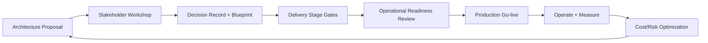

# Documentation, Blueprinting, Delivery Governance, and Operational Readiness Architecture

## Overview
This page covers architect-level operating practices that convert technical design into reliable enterprise execution: documentation standards, architecture blueprints, stakeholder workshops, delivery governance, operational readiness gates, and cost optimization governance.

## Why this topic matters
Senior architect interviews evaluate not only design skill but also execution leadership. Many programs fail due to weak decision records, unclear ownership, poor readiness controls, and missing governance loops.

## Core concepts
- Architecture documentation operating model
- Blueprinting for implementation alignment
- Stakeholder workshop facilitation and decision capture
- Delivery governance and stage-gate controls
- Operational readiness and go-live evidence
- Cost optimization governance and FinOps integration

## Detailed explanation of each concept
Documentation should be treated as an execution artifact, not a presentation artifact. Architecture blueprints must include boundaries, dependencies, controls, failure modes, and ownership. Stakeholder workshops should produce decisions, risk positions, and accountable actions.

Delivery governance needs objective stage gates, exception workflows, and measurable KPIs. Operational readiness must verify observability, runbooks, support ownership, and rollback capability before production rollout. Cost optimization should be integrated with architecture and reliability decisions to avoid short-term savings that increase long-term risk.

## Evaluation (How to assess architecture quality)
- Decision-to-delivery traceability rate
- Stage-gate pass/fail quality and rework frequency
- Go-live incident rate within first 30 days
- Documentation freshness and ownership adherence
- Exception aging and closure rate
- Cost variance vs planned architecture baseline

## Architecture / flow diagram


**Flow explanation:**  
Architecture decisions are converted into blueprints, governed through delivery gates, validated through readiness checks, and continuously improved with operational and cost evidence.

## Real-world example
A global enterprise transformed release quality by introducing mandatory architecture decision records, cross-functional design workshops, tier-based readiness gates, and post-go-live KPI reviews. Production incident rate dropped and audit evidence quality improved, while cost variance became more predictable through monthly architecture-finops governance.

## Best practices
- Keep architecture decisions versioned and traceable to implementation
- Use workshop agendas focused on decisions, risks, and ownership
- Define stage gates with objective evidence requirements
- Enforce readiness gates before any critical go-live
- Track cost and reliability together in governance reviews
- Close exception loops with time-bound ownership

## Common mistakes / misconceptions
- Treating documentation as optional after design approval
- Running workshops without decision closure
- Using governance as a checklist instead of risk-control system
- Skipping readiness due to deadline pressure
- Optimizing cost without reliability impact analysis

## Industry relevance
These capabilities are key for architect roles because enterprises need leaders who can govern complexity, align stakeholders, and deliver controlled outcomes at scale.

## Interview discussion points
- How to enforce architecture conformance without slowing delivery
- How to run decision-oriented stakeholder sessions
- How to define readiness for high-criticality systems
- How to integrate cost governance with technical governance
- How to present risk-based delivery decisions to leadership

## Links to dependent / related topics
- [Governance Overview](./README.md)
- [Enterprise Azure Foundation](../cloud-architecture/enterprise_azure_foundation_landing_zone.md)
- [CI/CD in Azure DevOps](../azure/cicd_azure_devops.md)
- [Reliability Operations](../reliability-operations/ha_dr_sli_slo_incident_capacity.md)
- [Migration Strategies](../migration-architecture/migration_strategies_azure_migrate.md)

## Interview Questions (50)
1. Why is architecture documentation critical for enterprise delivery?
2. What should be included in an architecture decision record (ADR)?
3. How do you keep architecture docs from becoming stale?
4. What is the difference between HLD and implementation blueprint?
5. How do you define blueprint quality criteria?
6. How do you map architecture decisions to delivery tasks?
7. How do you structure stakeholder workshops effectively?
8. What workshop outputs are mandatory?
9. How do you handle conflicting stakeholder priorities?
10. How do you capture and track architectural risks?
11. What is delivery governance and why does it fail?
12. How do you design stage-gate models?
13. What evidence should be required at each gate?
14. How do you design exception handling in governance?
15. How do you avoid governance bureaucracy?
16. How do you align platform and product governance?
17. What is operational readiness in architecture terms?
18. Which readiness controls are non-negotiable?
19. How do you run go-live readiness reviews?
20. How do you handle readiness disagreements?
21. How do you define rollback readiness evidence?
22. How do you ensure runbook quality?
23. How do you define ownership and support model clearly?
24. How do you design incident communication plans before go-live?
25. How do you integrate SLI/SLO into readiness governance?
26. How do you integrate security/compliance into delivery governance?
27. How do you ensure auditability of delivery decisions?
28. How do you prioritize remediation actions post-review?
29. What KPIs indicate governance health?
30. How do you detect architecture drift during delivery?
31. How do you enforce architecture conformance across teams?
32. How do you scale governance for multi-region programs?
33. How do you govern third-party dependencies?
34. How do you govern vendor and SaaS decisions?
35. What is cost optimization architecture governance?
36. How do you align FinOps with architecture decisions?
37. How do you perform cost-risk trade-off reviews?
38. How do you avoid false cost optimization?
39. How do you design cost guardrails in delivery?
40. How do you run monthly architecture operations reviews?
41. How do you present governance posture to leadership?
42. How do you manage decision debt in long programs?
43. How do you improve governance maturity over time?
44. How do you support team autonomy with guardrails?
45. How do you handle urgent delivery under strict governance?
46. How do advanced compliance requirements change governance design?
47. How do you adapt governance in hybrid environments?
48. How do you adapt governance in multi-region patterns?
49. How do you measure program-level architecture success?
50. How do you conclude governance interview answers strongly?

## Answers for important questions (Summary + Crisp + Deep)

### Q1. Why is architecture documentation critical for enterprise delivery?
**Question summary:** Documentation as execution control, not static artifact.  
**Crisp answer (7-8 lines):** Documentation aligns teams on design intent, constraints, and ownership. It reduces rework and conflicting implementation decisions. It supports onboarding, audits, and incident response. It preserves rationale behind trade-offs. It enables traceability from decision to delivery outcomes.  
**Deep explanation:** In enterprise programs, architecture decisions are implemented by many teams over long timelines, often with changing stakeholders. Without clear documentation, decisions are reinterpreted inconsistently, creating drift, integration failures, and governance blind spots. High-quality documentation should include context, assumptions, alternatives, accepted trade-offs, and expected operational impacts. Architects should position documentation as a living control artifact linked to implementation and review workflows. This improves delivery predictability and reduces reliance on tribal knowledge.  
**Answer summary:**  
- Documentation prevents decision ambiguity across teams and time.  
- It preserves rationale and supports governance, audits, and incident response.  
- Treating docs as living artifacts improves execution consistency and risk control.  
**Simple diagram:**  
```text
Decision intent -> documented controls -> consistent implementation
```
**Trusted reference links:**  
- https://learn.microsoft.com/en-us/azure/architecture/framework/

### Q2. What should be included in an architecture decision record (ADR)?
**Question summary:** ADR structure essentials for traceable governance.  
**Crisp answer (7-8 lines):** Include context, decision, options considered, trade-offs, assumptions, risks, and expected impacts. Add owner, date, status, and review trigger. Link ADR to implementation work items and operational metrics. Capture exceptions and dependencies.  
**Deep explanation:** ADR quality determines how well teams understand and execute architectural intent. Good ADRs avoid vague narratives and instead define clear decision boundaries, alternatives rejected, and measurable implications for reliability, security, cost, and delivery speed. They should include revisit conditions so teams know when decisions need reassessment. Architects should ensure ADRs are linked to delivery tasks and post-implementation outcomes to close the governance loop.  
**Answer summary:**  
- ADRs must capture context, options, rationale, and measurable impact.  
- Ownership, review triggers, and implementation links are mandatory fields.  
- Strong ADRs improve traceability and reduce decision re-litigation.  
**Simple diagram:**  
```text
Context -> options -> decision -> impact -> review trigger
```
**Trusted reference links:**  
- https://adr.github.io/

### Q3. How do you keep architecture docs from becoming stale?
**Question summary:** Documentation freshness governance model.  
**Crisp answer (7-8 lines):** Assign ownership and update triggers tied to changes/releases. Enforce doc updates in pull-request/governance gates. Schedule periodic freshness reviews. Use versioning and status labels. Monitor stale-document KPIs by domain.  
**Deep explanation:** Documentation staleness is usually an ownership and process failure, not a tooling problem. Teams should define “documentation-as-delivery” policy where significant architecture-impacting changes cannot close without corresponding doc updates. Freshness checks should be embedded in release and review processes, with clear accountability per domain. Architects should track stale-document rate and use it as a governance health indicator to prevent silent architecture drift.  
**Answer summary:**  
- Make documentation updates part of normal delivery workflow, not optional tasks.  
- Assign explicit owners and freshness review cadence for each architecture area.  
- Track staleness metrics to detect governance erosion early.  
**Simple diagram:**  
```text
Code/design change -> doc update gate -> release
```
**Trusted reference links:**  
- https://learn.microsoft.com/en-us/azure/architecture/framework/devops/

### Q4. What is the difference between HLD and implementation blueprint?
**Question summary:** Distinguishes strategic design from execution-level detail.  
**Crisp answer (7-8 lines):** HLD explains system-level structure, principles, and major decisions. Blueprint translates HLD into implementable components, sequences, controls, and ownership. HLD aligns strategy; blueprint aligns execution. Both are needed for enterprise programs.  
**Deep explanation:** HLD communicates architecture direction, major boundaries, and non-functional priorities. Implementation blueprint operationalizes that direction with environment details, dependencies, delivery phases, runbooks, and validation criteria. Many programs fail because HLD exists but blueprint detail is missing, causing teams to improvise inconsistent implementations. Architects should ensure the two artifacts remain linked and versioned as design evolves.  
**Answer summary:**  
- HLD sets strategic architecture intent and boundaries.  
- Blueprint defines executable details, controls, and ownership for delivery.  
- Linking both prevents interpretation gaps between design and implementation.  
**Simple diagram:**  
```text
HLD (what/why) -> Blueprint (how/who/when)
```
**Trusted reference links:**  
- https://learn.microsoft.com/en-us/azure/architecture/framework/architect-design

### Q5. How do you define blueprint quality criteria?
**Question summary:** Blueprint quality and completeness model.  
**Crisp answer (7-8 lines):** Blueprint should include boundaries, dependencies, failure modes, security controls, observability, rollout/rollback, and ownership. It should map to measurable acceptance criteria. It must be reviewable and executable by teams without ambiguity.  
**Deep explanation:** Blueprint quality is determined by execution readiness, not diagram aesthetics. A high-quality blueprint allows delivery teams to implement and operate the solution with predictable behavior. It should include explicit assumptions, risk controls, and validation checkpoints across lifecycle stages. Architects should also ensure blueprint includes operational dimensions (runbooks, alerts, support model), because production readiness gaps often stem from missing operational detail.  
**Answer summary:**  
- Blueprint quality is measured by execution clarity and operational completeness.  
- Include technical, security, reliability, and ownership controls explicitly.  
- Tie blueprint to acceptance criteria so governance can validate implementation quality.  
**Simple diagram:**  
```text
Blueprint completeness -> predictable delivery and operations
```
**Trusted reference links:**  
- https://learn.microsoft.com/en-us/azure/well-architected/framework

### Q6. How do you map architecture decisions to delivery tasks?
**Question summary:** Decision-to-execution traceability model.  
**Crisp answer (7-8 lines):** Decompose each architecture decision into work packages, controls, and validation steps. Link ADR IDs to backlog items and test evidence. Assign owners and deadlines. Track completion and residual risk per decision.  
**Deep explanation:** Architecture value is realized only when decisions become actionable delivery work with measurable outcomes. Teams should establish traceability from decision records to implementation tasks, test plans, and operational readiness evidence. This model exposes gaps where strategic decisions were accepted but not implemented fully. Architects should use traceability dashboards in governance reviews to keep execution aligned with design intent.  
**Answer summary:**  
- Convert each architecture decision into owned, testable delivery tasks.  
- Maintain traceability from ADR to implementation and validation evidence.  
- Use traceability gaps as governance signals for risk escalation.  
**Simple diagram:**  
```text
ADR -> backlog tasks -> validation evidence -> closure
```
**Trusted reference links:**  
- https://learn.microsoft.com/en-us/azure/cloud-adoption-framework/

### Q7. How do you structure stakeholder workshops effectively?
**Question summary:** Workshop structure for decision quality.  
**Crisp answer (7-8 lines):** Define objective, decisions required, constraints, and participants in advance. Use time-boxed agenda with option comparison and risk framing. Capture decisions and action owners live. Reserve explicit conflict-resolution segment. End with next-step commitments.  
**Deep explanation:** Workshops should be designed as decision forums, not status meetings. Pre-work should include context pack, options, constraints, and unresolved questions so participants can contribute meaningfully. During session, architects should drive clarity on trade-offs and decision criteria, ensuring technical and business voices are both heard. Post-workshop outputs should include finalized decisions, open risks, accountable owners, and timelines.  
**Answer summary:**  
- Run workshops as decision engines with pre-defined outcomes.  
- Use structured option/risk framing to accelerate aligned choices.  
- Document decisions and ownership immediately to prevent ambiguity.  
**Simple diagram:**  
```text
Prep -> workshop decisions -> owned action plan
```
**Trusted reference links:**  
- https://learn.microsoft.com/en-us/azure/architecture/framework/

### Q8. What workshop outputs are mandatory?
**Question summary:** Mandatory artifacts from architecture workshops.  
**Crisp answer (7-8 lines):** Required outputs include decisions made, options rejected, risk register updates, action owners, timelines, and unresolved escalations. Also capture assumptions and evidence needed before next gate. Publish summary quickly.  
**Deep explanation:** Workshop value collapses if outputs are unclear or delayed. Mandatory outputs should support immediate execution and governance review, including what was decided, why, what remains open, and who owns follow-up actions. Architects should standardize this output format across programs to enable consistent tracking and auditability.  
**Answer summary:**  
- Capture decision rationale, risk updates, and accountable action ownership.  
- Record unresolved items with explicit escalation and timeline paths.  
- Standardized outputs improve governance consistency and execution speed.  
**Simple diagram:**  
```text
Workshop -> decision log + risk updates + action register
```
**Trusted reference links:**  
- https://learn.microsoft.com/en-us/azure/architecture/framework/operational-excellence/

### Q9. How do you handle conflicting stakeholder priorities?
**Question summary:** Conflict resolution strategy in architecture governance.  
**Crisp answer (7-8 lines):** Use explicit decision criteria tied to business objectives, risk, and constraints. Quantify trade-offs where possible. Escalate unresolved conflicts to defined governance body. Document accepted compromises and residual risks. Avoid implicit decisions by delay.  
**Deep explanation:** Conflicts are normal in enterprise architecture because stakeholders optimize different outcomes (speed, risk, cost, compliance). Architects should neutralize personal preference by using shared criteria and evidence-based option evaluation. When conflicts persist, escalation should be structured and time-bound to avoid delivery stall. Documenting compromises and residual risk ensures transparent accountability and reduces future rework.  
**Answer summary:**  
- Resolve conflicts with shared criteria and evidence, not hierarchy alone.  
- Use formal escalation for unresolved issues within agreed timelines.  
- Document compromises and residual risk to preserve decision transparency.  
**Simple diagram:**  
```text
Conflict -> criteria evaluation -> decision/escalation -> documented outcome
```
**Trusted reference links:**  
- https://learn.microsoft.com/en-us/azure/cloud-adoption-framework/

### Q10. How do you capture and track architectural risks?
**Question summary:** Risk capture and lifecycle governance model.  
**Crisp answer (7-8 lines):** Maintain architecture risk register with severity, owner, mitigation, due date, and status. Review risks at each stage gate. Link risks to decisions and implementation artifacts. Escalate aging/high-severity risks proactively.  
**Deep explanation:** Architecture risks should be treated as managed portfolio items rather than informal concerns in meeting notes. Each risk should include impact scope, probability, trigger conditions, mitigation plan, and owner accountability. Governance should track risk aging and closure effectiveness, not just risk count. Architects should ensure that accepted risks are explicit and reviewed periodically to prevent silent normalization of high exposure.  
**Answer summary:**  
- Use structured risk register with ownership and mitigation accountability.  
- Integrate risk review into delivery gates and decision records.  
- Track risk aging and closure quality to prevent governance blind spots.  
**Simple diagram:**  
```text
Risk identified -> mitigation plan -> gate review -> closure
```
**Trusted reference links:**  
- https://learn.microsoft.com/en-us/azure/architecture/framework/operational-excellence/

### Q11. What is delivery governance and why does it fail?
**Question summary:** Delivery governance definition and failure modes.  
**Crisp answer (7-8 lines):** Delivery governance is the system of controls that ensures architecture intent is implemented safely and predictably. It fails when controls are vague, ownership is unclear, evidence is weak, or cadence is inconsistent. It also fails when treated as bureaucracy instead of risk control.  
**Deep explanation:** Effective delivery governance connects design intent, implementation evidence, and operational outcomes through clear stage gates and accountability. Failure occurs when governance artifacts exist but are not tied to measurable decisions, or when exceptions bypass controls without visibility. Another frequent failure is governance overload that slows teams and drives shadow process workarounds. Architects should design governance that is strict on high-risk controls and lightweight on low-risk areas to maintain trust and velocity.  
**Answer summary:**  
- Governance fails when it lacks clarity, ownership, and evidence discipline.  
- Overly heavy or overly weak governance both increase delivery risk.  
- Risk-based, measurable governance is the sustainable operating model.  
**Simple diagram:**  
```text
Design intent -> governance gates -> controlled delivery outcomes
```
**Trusted reference links:**  
- https://learn.microsoft.com/en-us/azure/architecture/framework/devops/

### Q12. How do you design stage-gate models?
**Question summary:** Stage-gate design for controlled delivery progression.  
**Crisp answer (7-8 lines):** Define phases with clear entry/exit criteria tied to risk profile. Assign gate owners and required evidence artifacts. Differentiate gate depth by service criticality. Include escalation and exception policies. Keep gate decisions time-bound.  
**Deep explanation:** Stage gates should provide predictable control points where teams validate readiness before increasing exposure. Good gate models prevent late surprises by requiring progressive evidence: design validation, security checks, performance tests, operational readiness, and rollout approvals. Architects should avoid identical gate requirements for all workloads and instead apply tiered rigor. This keeps governance effective without creating unnecessary friction.  
**Answer summary:**  
- Use progressive, evidence-driven gates aligned to lifecycle risk stages.  
- Apply tiered gate rigor by workload criticality and impact scope.  
- Include clear ownership and time-bound decision process for every gate.  
**Simple diagram:**  
```text
Phase 1 -> Gate 1 -> Phase 2 -> Gate 2 -> Production
```
**Trusted reference links:**  
- https://learn.microsoft.com/en-us/azure/well-architected/operational-excellence/

### Q13. What evidence should be required at each gate?
**Question summary:** Gate evidence framework.  
**Crisp answer (7-8 lines):** Require architecture conformance, security/policy checks, performance benchmarks, test results, rollback plans, and operational readiness artifacts. Evidence should be objective, reproducible, and owned. Avoid subjective gate approvals.  
**Deep explanation:** Gate evidence should demonstrate that risks for the next exposure level are controlled. This means design correctness, implementation quality, resilience behavior, security compliance, and operational supportability must be proven with artifacts, not declarations. Architects should standardize evidence templates and quality criteria to reduce inconsistency across teams. Evidence retention also supports auditability and post-incident learning.  
**Answer summary:**  
- Require objective artifacts for security, performance, reliability, and operations.  
- Standardize evidence quality rules to improve cross-team consistency.  
- Evidence-based gates reduce subjective approvals and hidden risk acceptance.  
**Simple diagram:**  
```text
Gate decision <- validated evidence set
```
**Trusted reference links:**  
- https://learn.microsoft.com/en-us/azure/architecture/framework/security/governance

### Q14. How do you design exception handling in governance?
**Question summary:** Governance exception model with control and agility.  
**Crisp answer (7-8 lines):** Allow exceptions through formal request, risk acceptance, owner accountability, and expiry date. Require mitigation plan and review cadence. Track exception inventory and aging. Prevent permanent “temporary” exceptions.  
**Deep explanation:** Exceptions are necessary in complex delivery environments but become dangerous when unmanaged. A strong exception model keeps flexibility while preserving governance integrity through explicit risk acceptance and time-bound closure. Architects should ensure exceptions are visible in governance dashboards and reviewed at each relevant gate. This prevents hidden control erosion and supports transparent leadership decisions.  
**Answer summary:**  
- Exceptions should be formal, risk-accepted, and time-bound.  
- Each exception needs owner accountability and mitigation plan.  
- Aging and recurring exceptions are key governance health indicators.  
**Simple diagram:**  
```text
Exception request -> risk review -> temporary approval -> closure
```
**Trusted reference links:**  
- https://learn.microsoft.com/en-us/azure/governance/

### Q15. How do you avoid governance bureaucracy?
**Question summary:** Lean governance strategy without risk compromise.  
**Crisp answer (7-8 lines):** Keep controls risk-based and automate checks where possible. Eliminate redundant approvals. Use standard templates and fast decision cadence. Focus governance energy on high-impact risks. Measure governance cycle time and rework.  
**Deep explanation:** Bureaucracy appears when governance controls are copied blindly across contexts and rely on manual ceremony. Architects should design lean governance by automating repeatable checks, reducing duplicate artifacts, and using clear severity-based pathways. The goal is faster high-quality decisions, not fewer controls. Governance efficiency should be tracked with metrics such as cycle time, exception rate, and post-gate defect leakage.  
**Answer summary:**  
- Use risk-based, automated controls to reduce manual governance friction.  
- Remove redundant approvals while preserving critical risk checks.  
- Measure governance efficiency and quality to continuously improve model.  
**Simple diagram:**  
```text
Risk-based automation -> faster governance with control integrity
```
**Trusted reference links:**  
- https://learn.microsoft.com/en-us/azure/architecture/framework/devops/

### Q16. How do you align platform and product governance?
**Question summary:** Governance alignment across shared platform and product teams.  
**Crisp answer (7-8 lines):** Platform governance sets mandatory guardrails and shared controls. Product governance owns domain outcomes and implementation choices within boundaries. Use joint forums for cross-cutting decisions. Define RACI clearly. Track shared KPIs.  
**Deep explanation:** Misalignment happens when platform teams over-control product delivery or when product teams bypass shared controls. A balanced model defines non-negotiable controls (security, observability, compliance) and negotiated flexibility zones for domain innovation. Architects should establish joint governance cadence with clear escalation rules and outcome metrics that both groups share. This model supports autonomy without sacrificing enterprise consistency.  
**Answer summary:**  
- Platform defines guardrails; product owns domain execution within those limits.  
- Joint governance and explicit RACI prevent control/autonomy conflicts.  
- Shared KPIs align incentives across both governance layers.  
**Simple diagram:**  
```text
Platform guardrails + product autonomy -> aligned governance
```
**Trusted reference links:**  
- https://learn.microsoft.com/en-us/azure/cloud-adoption-framework/

### Q17. What is operational readiness in architecture terms?
**Question summary:** Operational readiness as architecture outcome.  
**Crisp answer (7-8 lines):** Operational readiness means a system can be safely run, supported, recovered, and governed in production. It includes observability, runbooks, ownership, incident response, and rollback capability. It is not only test pass status.  
**Deep explanation:** Operational readiness is the proof that design decisions are executable under real production conditions. Systems can be functionally correct yet operationally unready if support ownership, monitoring, and recovery controls are weak. Architects should define readiness criteria early and map them to measurable evidence before release. This prevents “build-complete but operate-incomplete” failures that commonly occur in large programs.  
**Answer summary:**  
- Readiness validates run-time operability, not only build-time correctness.  
- It includes support model, recovery capability, and governance controls.  
- Evidence-based readiness gates reduce post-go-live instability and incident cost.  
**Simple diagram:**  
```text
Build complete + ops controls complete = production ready
```
**Trusted reference links:**  
- https://learn.microsoft.com/en-us/azure/well-architected/operational-excellence/

### Q18. Which readiness controls are non-negotiable?
**Question summary:** Baseline readiness controls for critical releases.  
**Crisp answer (7-8 lines):** Non-negotiables include monitoring/alerting, runbooks, ownership, rollback plan, security controls, backup/recovery validation, and communication protocol. For critical systems, include rehearsal evidence. All controls need accountable owners.  
**Deep explanation:** Non-negotiable controls represent minimum viable production safety. Without them, incident impact and recovery duration increase sharply regardless of functional quality. Architects should define these controls by service tier and enforce them at release gates. Governance should treat missing controls as explicit risk acceptance, not silent omission.  
**Answer summary:**  
- Baseline controls must cover detection, response, recovery, and governance.  
- Critical systems require rehearsal-backed evidence, not checklist declarations.  
- Missing controls should trigger explicit risk acceptance and escalation.  
**Simple diagram:**  
```text
Readiness baseline -> go-live eligibility
```
**Trusted reference links:**  
- https://learn.microsoft.com/en-us/azure/well-architected/reliability/

### Q19. How do you run go-live readiness reviews?
**Question summary:** Go-live review execution model.  
**Crisp answer (7-8 lines):** Use structured checklist with evidence review, risk sign-off, and clear go/no-go decision owners. Include product, platform, security, and operations stakeholders. Capture open risks and mitigation plans. Time-box decision process.  
**Deep explanation:** Go-live readiness review should evaluate whether residual risk is acceptable and controllable, not whether the team is confident. Reviews should inspect objective evidence for performance, security, reliability, and operational support. Architects should ensure unresolved high-severity items are escalated with explicit risk decisions rather than deferred implicitly. This makes launch decisions transparent and accountable.  
**Answer summary:**  
- Conduct cross-functional, evidence-first readiness reviews before launch.  
- Use explicit go/no-go ownership and documented residual risk decisions.  
- Time-box review flow to preserve delivery pace without lowering control quality.  
**Simple diagram:**  
```text
Evidence review -> risk decision -> go/no-go
```
**Trusted reference links:**  
- https://learn.microsoft.com/en-us/azure/architecture/framework/operational-excellence/devops

### Q20. How do you handle readiness disagreements?
**Question summary:** Conflict resolution for readiness gates.  
**Crisp answer (7-8 lines):** Resolve via predefined decision criteria and escalation path. Separate factual gaps from risk appetite differences. Require written risk acceptance for contested go-live decisions. Set remediation timeline. Keep decision log transparent.  
**Deep explanation:** Readiness disagreements are common when schedule pressure conflicts with control rigor. Architects should use objective criteria first, then escalate unresolved risk-appetite conflicts to governance authority quickly. Documented risk acceptance ensures accountability and reduces retrospective blame after incidents. Transparent decision logs also improve future gate quality by showing where criteria need refinement.  
**Answer summary:**  
- Use objective criteria and escalation governance to resolve readiness conflicts.  
- Require explicit written risk acceptance when launching with known gaps.  
- Capture decisions to improve future readiness standards and accountability.  
**Simple diagram:**  
```text
Disagreement -> criteria check -> escalation -> documented decision
```
**Trusted reference links:**  
- https://learn.microsoft.com/en-us/azure/architecture/framework/

### Q21. How do you define rollback readiness evidence?
**Question summary:** Rollback readiness validation model.  
**Crisp answer (7-8 lines):** Evidence should include rollback plan, trigger thresholds, tested rollback procedure, ownership matrix, and estimated recovery timing. Validate data and contract compatibility for rollback path. Confirm communication templates and escalation channels.  
**Deep explanation:** Rollback readiness is often overstated when plans exist but execution has not been rehearsed. Architects should require proof that rollback steps are feasible within acceptable impact windows, including data-state and dependency implications. Triggers should be objective and aligned to business impact metrics. This turns rollback from theoretical safety net into practical risk control.  
**Answer summary:**  
- Rollback readiness requires tested execution evidence, not plan documents alone.  
- Include triggers, ownership, and compatibility checks for realistic recovery.  
- Integrate communication and escalation into rollback validation scope.  
**Simple diagram:**  
```text
Trigger breach -> tested rollback path -> recovery confirmation
```
**Trusted reference links:**  
- https://learn.microsoft.com/en-us/azure/well-architected/reliability/testing

### Q22. How do you ensure runbook quality?
**Question summary:** Runbook quality governance strategy.  
**Crisp answer (7-8 lines):** Define runbook templates with step clarity, ownership, prerequisites, and validation checks. Rehearse runbooks regularly. Update after incidents and architecture changes. Track runbook failure points and stale status.  
**Deep explanation:** Runbooks fail in incidents when they are generic, outdated, or missing decision branches. Quality requires operational realism: exact commands, expected outcomes, fallback options, and contact/escalation paths. Architects should integrate runbook review into release and incident postmortem cycles so runbooks evolve with system changes. Runbook quality metrics help prevent silent decay.  
**Answer summary:**  
- Runbooks must be explicit, current, and scenario-tested under realistic conditions.  
- Integrate runbook updates into change and post-incident governance workflows.  
- Measure stale/failed runbook usage to maintain operational readiness quality.  
**Simple diagram:**  
```text
Template -> drill -> update -> validated runbook
```
**Trusted reference links:**  
- https://learn.microsoft.com/en-us/azure/architecture/framework/operational-excellence/

### Q23. How do you define ownership and support model clearly?
**Question summary:** Ownership clarity model for operations and delivery.  
**Crisp answer (7-8 lines):** Define RACI by component and lifecycle stage. Assign incident, change, and compliance ownership explicitly. Document handoff boundaries and escalation contacts. Align support model with service criticality and time zones. Review ownership after org or architecture changes.  
**Deep explanation:** Ambiguous ownership is a major source of delayed incident response and governance failure. Architects should ensure each service and dependency has clear accountable owner for run-time operations, change decisions, and control evidence. Ownership should include after-hours responsibilities, escalation hierarchy, and cross-team interfaces. This operational clarity is essential for reliable enterprise execution.  
**Answer summary:**  
- Explicit ownership boundaries reduce incident delays and governance ambiguity.  
- Include lifecycle, escalation, and support-coverage responsibilities in model.  
- Revalidate ownership after major architecture or organizational changes.  
**Simple diagram:**  
```text
Component -> owner -> support/escalation responsibilities
```
**Trusted reference links:**  
- https://learn.microsoft.com/en-us/azure/cloud-adoption-framework/organize/

### Q24. How do you design incident communication plans before go-live?
**Question summary:** Predefined communication architecture for incidents.  
**Crisp answer (7-8 lines):** Define audience channels, severity-based update cadence, communication owners, approval path, and templates. Include customer support and leadership notifications. Test communication flow in drills. Keep single source of truth.  
**Deep explanation:** Incident communication is often improvised under stress, leading to inconsistent messaging and stakeholder confusion. Architects should establish communication architecture before launch with role-based responsibilities and predefined templates. Cadence and escalation rules should map to severity levels and legal/compliance obligations. Practiced communication plans reduce business impact during incidents and improve trust.  
**Answer summary:**  
- Build communication flow before incidents occur with role and cadence clarity.  
- Include internal, customer, and leadership pathways with approval governance.  
- Rehearse plans to ensure execution quality under real pressure.  
**Simple diagram:**  
```text
Incident command -> internal/status/customer communication streams
```
**Trusted reference links:**  
- https://learn.microsoft.com/en-us/azure/well-architected/operational-excellence/

### Q25. How do you integrate SLI/SLO into readiness governance?
**Question summary:** Reliability objective integration with go-live controls.  
**Crisp answer (7-8 lines):** Require defined SLI/SLO for critical services before launch. Validate instrumentation coverage and alert thresholds. Tie readiness decisions to SLO risk posture. Include error-budget policy in deployment governance. Review post-launch SLO behavior early.  
**Deep explanation:** Readiness without reliability objectives is incomplete because teams cannot judge acceptable performance or incident thresholds consistently. Architects should ensure SLI definitions reflect user-critical paths and that observability supports accurate measurement from day one. SLO targets should influence rollout decisions and trigger stabilization work when risk increases. This makes readiness and reliability governance mutually reinforcing.  
**Answer summary:**  
- SLI/SLO must be defined and measurable before high-criticality go-live.  
- Readiness decisions should include SLO risk and error-budget posture.  
- Early post-launch SLO reviews validate governance assumptions rapidly.  
**Simple diagram:**  
```text
SLI/SLO defined -> readiness gate -> release governance
```
**Trusted reference links:**  
- https://learn.microsoft.com/en-us/azure/architecture/framework/reliability/

### Q26. How do you integrate security/compliance into delivery governance?
**Question summary:** Security-compliance integration into stage gates.  
**Crisp answer (7-8 lines):** Map controls to delivery stages and enforce through automated checks plus review evidence. Include policy validation, access controls, vulnerability checks, and audit trails. Track exceptions with expiry. Involve security/compliance owners in high-risk gates.  
**Deep explanation:** Security and compliance should be embedded into delivery flow, not appended at final approval stage. Architects should define control coverage per lifecycle stage and automate repeatable checks to reduce manual error. Governance must track exceptions transparently and ensure compensating controls are active where needed. This approach improves both delivery speed and control integrity.  
**Answer summary:**  
- Embed security/compliance controls throughout lifecycle gates, not only at release end.  
- Automate checks and keep evidence traceable for audit and incident response.  
- Govern exceptions explicitly with owner accountability and closure timelines.  
**Simple diagram:**  
```text
Stage gates + security/compliance controls -> controlled release
```
**Trusted reference links:**  
- https://learn.microsoft.com/en-us/azure/architecture/framework/security/governance

### Q27. How do you ensure auditability of delivery decisions?
**Question summary:** Decision auditability and evidence chain model.  
**Crisp answer (7-8 lines):** Keep immutable decision logs, approvals, evidence artifacts, and change history linked to releases. Use standardized IDs across ADRs, tickets, and deployment records. Retain records by compliance policy. Periodically validate evidence completeness.  
**Deep explanation:** Auditability requires traceable linkage from decision intent to implementation and operational outcome. Many teams collect artifacts but fail to link them, making audits and incident reviews inefficient. Architects should implement a unified evidence model with consistent identifiers and retention controls. This improves compliance confidence and post-incident root-cause efficiency.  
**Answer summary:**  
- Build end-to-end evidence chain from decision to deployment and operations.  
- Standardize identifiers and retention policies for reliable audit retrieval.  
- Validate evidence completeness regularly to avoid governance surprises.  
**Simple diagram:**  
```text
ADR ID -> task ID -> deploy record -> operational evidence
```
**Trusted reference links:**  
- https://learn.microsoft.com/en-us/azure/devops/organizations/audit/

### Q28. How do you prioritize remediation actions post-review?
**Question summary:** Remediation prioritization model after assessments.  
**Crisp answer (7-8 lines):** Prioritize by risk severity, exploitability, business impact, and dependency criticality. Group quick wins and structural fixes separately. Assign owners and due dates. Track closure effectiveness, not just closure count. Reassess priority after incidents.  
**Deep explanation:** Remediation backlogs can become unmanageable without clear prioritization rules. Architects should apply risk scoring that includes both likelihood and impact, then sequence fixes to reduce near-term exposure while advancing long-term architecture health. Quick tactical fixes should not displace structural remediation indefinitely. Closure quality should be validated with metrics and incident recurrence trends.  
**Answer summary:**  
- Use risk-impact scoring to prioritize remediation objectively.  
- Balance immediate containment actions with structural long-term fixes.  
- Measure remediation effectiveness by risk reduction outcomes, not ticket closure volume.  
**Simple diagram:**  
```text
Risk score -> remediation tier -> tracked closure
```
**Trusted reference links:**  
- https://learn.microsoft.com/en-us/azure/well-architected/operational-excellence/

### Q29. What KPIs indicate governance health?
**Question summary:** Governance KPI framework.  
**Crisp answer (7-8 lines):** Track gate pass quality, exception aging, decision-to-delivery traceability, post-go-live incident rate, and rework due to architecture drift. Include cycle time and audit evidence quality. Review trends by domain/team.  
**Deep explanation:** Governance health should be measured by outcomes and control behavior, not activity volume. High-quality governance shows predictable delivery, low surprise incident rates, and timely exception closure. KPI frameworks should combine speed (cycle time), quality (defect leakage), and control integrity (traceability, audit readiness). Architects should use trend analysis to guide governance improvements and coaching priorities.  
**Answer summary:**  
- Use balanced KPIs covering speed, quality, and control integrity.  
- Trend direction matters more than isolated KPI snapshots.  
- Domain-level breakdowns expose governance weak points for targeted action.  
**Simple diagram:**  
```text
Governance KPIs -> trend review -> model improvements
```
**Trusted reference links:**  
- https://learn.microsoft.com/en-us/azure/architecture/framework/

### Q30. How do you detect architecture drift during delivery?
**Question summary:** Drift detection strategy in program execution.  
**Crisp answer (7-8 lines):** Compare implemented artifacts against approved blueprint/ADRs using reviews, automated checks, and runtime telemetry. Flag undocumented deviations. Track drift severity and ownership. Correct quickly or formalize decision updates.  
**Deep explanation:** Architecture drift is natural in evolving programs but dangerous when unmanaged. Detection requires both design-time and runtime signals: code/repo checks, policy scans, and production behavior anomalies. Architects should define drift governance that distinguishes acceptable adaptation from risky divergence. Undocumented drift should trigger remediation or explicit decision updates to preserve traceability.  
**Answer summary:**  
- Detect drift through combined code, policy, and runtime conformance checks.  
- Treat undocumented deviation as governance risk requiring action.  
- Either remediate drift or formalize updated architecture decisions with traceability.  
**Simple diagram:**  
```text
Blueprint vs implementation -> drift signal -> action
```
**Trusted reference links:**  
- https://learn.microsoft.com/en-us/azure/governance/policy/overview

### Q31. How do you enforce architecture conformance across teams?
**Question summary:** Multi-team conformance enforcement model.  
**Crisp answer (7-8 lines):** Use reference architectures, policy-as-code, reusable templates, and review gates. Define non-negotiable controls and flexible zones. Provide enablement support, not only enforcement. Measure conformance and exceptions by team/domain.  
**Deep explanation:** Conformance enforcement should combine guardrails and developer enablement. Hard controls are needed for high-risk areas (security, compliance, reliability), while lower-risk concerns can allow guided flexibility. Architects should provide reusable patterns and tooling to reduce friction, because pure enforcement without support drives bypass behavior. Transparent metrics and exception governance sustain fairness and effectiveness.  
**Answer summary:**  
- Enforce with guardrails plus practical enablement for teams.  
- Separate mandatory controls from adaptable implementation zones.  
- Track conformance/exceptions to maintain governance credibility at scale.  
**Simple diagram:**  
```text
Guardrails + templates + reviews -> conformance
```
**Trusted reference links:**  
- https://learn.microsoft.com/en-us/azure/architecture/framework/govern

### Q32. How do you scale governance for multi-region programs?
**Question summary:** Governance scaling across regions.  
**Crisp answer (7-8 lines):** Define global baseline controls with regional overlays for legal and operational differences. Keep decision records synchronized. Track regional exceptions centrally. Run periodic parity reviews and failover governance drills.  
**Deep explanation:** Multi-region governance must balance global consistency with local constraints such as data residency and regulatory obligations. Architects should enforce baseline standards while allowing structured regional variation through documented overlays. Central visibility into regional exceptions and drift is necessary to maintain control integrity. Governance drills should validate not just technical failover but also cross-region decision and communication flows.  
**Answer summary:**  
- Use global baseline + controlled regional overlay governance model.  
- Keep regional exceptions visible and time-bound under central oversight.  
- Validate governance behavior through parity reviews and regional drills.  
**Simple diagram:**  
```text
Global controls -> regional overlays -> centralized oversight
```
**Trusted reference links:**  
- https://learn.microsoft.com/en-us/azure/architecture/guide/design-principles/geographical-distribution

### Q33. How do you govern third-party dependencies?
**Question summary:** Third-party dependency governance model.  
**Crisp answer (7-8 lines):** Classify dependency criticality, security posture, SLA impact, and replacement risk. Define approval and review process. Monitor version, vulnerability, and operational health continuously. Keep fallback/exit strategy for critical dependencies.  
**Deep explanation:** Third-party dependencies can become major reliability and security risks when governance is weak. Architects should require due diligence at onboarding and continuous reassessment as versions, vulnerabilities, and commercial conditions evolve. Critical dependencies need fallback pathways or contingency plans to reduce concentration risk. Governance should include ownership and lifecycle management, not one-time approval.  
**Answer summary:**  
- Govern dependencies as lifecycle risks, not procurement checklist items.  
- Continuously monitor security, reliability, and contract/SLA implications.  
- Define fallback or exit strategy for high-criticality external dependencies.  
**Simple diagram:**  
```text
Dependency intake -> risk classification -> ongoing governance
```
**Trusted reference links:**  
- https://learn.microsoft.com/en-us/azure/well-architected/security/

### Q34. How do you govern vendor and SaaS decisions?
**Question summary:** Vendor/SaaS governance and decision quality.  
**Crisp answer (7-8 lines):** Evaluate business fit, integration complexity, security/compliance posture, cost model, lock-in risk, and operability impact. Use structured scorecard and pilot validation. Capture decision rationale and exit options.  
**Deep explanation:** Vendor/SaaS decisions have long-term architectural implications on data portability, identity integration, operational tooling, and cost predictability. Architects should use objective scorecards and controlled pilots to validate assumptions before broad adoption. Governance must include contract lifecycle checkpoints and contingency planning for pricing/model changes. This ensures SaaS adoption remains strategic rather than reactive.  
**Answer summary:**  
- Vendor decisions should be evidence-based across technical and business dimensions.  
- Include lock-in and exit strategy in initial governance, not later remediation.  
- Pilot validation reduces large-scale adoption risk and improves decision confidence.  
**Simple diagram:**  
```text
Scorecard + pilot -> vendor decision + exit plan
```
**Trusted reference links:**  
- https://learn.microsoft.com/en-us/azure/architecture/framework/cost/optimize-costs

### Q35. What is cost optimization architecture governance?
**Question summary:** Cost governance integrated into architecture lifecycle.  
**Crisp answer (7-8 lines):** It is the control system ensuring architecture decisions deliver sustainable cost-efficiency without degrading reliability or security. It includes budgets, tagging, cost KPIs, policy guardrails, and review cadence tied to architecture changes.  
**Deep explanation:** Cost optimization governance should be embedded from design through operations, not left to post-incident budget controls. Architects should define cost assumptions per decision and track actual variance after deployment. Governance must evaluate cost changes with reliability and compliance implications to avoid false savings. This creates balanced financial accountability across teams and services.  
**Answer summary:**  
- Cost optimization governance is continuous, architecture-linked, and outcome-driven.  
- Use assumptions, policies, and KPI reviews to control cost drift over time.  
- Balance spend optimization with reliability and compliance requirements.  
**Simple diagram:**  
```text
Architecture choice -> cost model -> variance review -> optimization
```
**Trusted reference links:**  
- https://learn.microsoft.com/en-us/azure/cost-management-billing/

### Q36. How do you align FinOps with architecture decisions?
**Question summary:** FinOps-architecture alignment operating model.  
**Crisp answer (7-8 lines):** Include FinOps in design reviews, capture cost hypotheses, and validate against usage telemetry post-release. Define shared KPIs between architecture and finance. Use unit economics for service-level accountability.  
**Deep explanation:** FinOps alignment works when cost is treated as a design parameter, not accounting output. Architects should involve FinOps early to evaluate pricing models, scaling behavior, and lifecycle cost implications of architecture options. Post-deployment feedback loops are critical to compare forecast with reality and adjust design or operations accordingly. Shared metrics reduce friction between engineering and finance teams.  
**Answer summary:**  
- Integrate FinOps into design-time decision forums and post-release reviews.  
- Use unit economics to make cost ownership actionable for engineering teams.  
- Close forecast-to-actual loop to improve architecture decision quality over time.  
**Simple diagram:**  
```text
Design options + FinOps input -> deployed cost validation loop
```
**Trusted reference links:**  
- https://learn.microsoft.com/en-us/azure/architecture/framework/cost/overview

### Q37. How do you perform cost-risk trade-off reviews?
**Question summary:** Structured cost vs risk decision process.  
**Crisp answer (7-8 lines):** Compare options on lifecycle cost, reliability impact, security exposure, and delivery complexity. Quantify downside scenarios. Make accepted risk explicit with ownership. Revisit trade-offs as conditions change.  
**Deep explanation:** Cost-risk trade-offs should avoid simplistic “cheapest option wins” logic. Architects should model both direct costs and potential incident/compliance costs from reduced controls or capacity. Reviews should include scenario analysis and decision records documenting why risks were accepted or mitigated. This creates transparent accountability and prevents hidden technical debt accumulation.  
**Answer summary:**  
- Evaluate cost decisions alongside reliability/security risk implications.  
- Use scenario-based analysis to reveal hidden downside exposure.  
- Document accepted trade-offs with ownership and review checkpoints.  
**Simple diagram:**  
```text
Option cost + risk profile -> governance decision
```
**Trusted reference links:**  
- https://learn.microsoft.com/en-us/azure/well-architected/cost-optimization/

### Q38. How do you avoid false cost optimization?
**Question summary:** Preventing cost cuts that increase long-term risk.  
**Crisp answer (7-8 lines):** Validate savings against SLO, security, and operational impact. Avoid removing critical controls for short-term budget gains. Measure downstream cost from incidents/rework. Use reversible experiments before broad cost changes.  
**Deep explanation:** False optimization occurs when visible spend decreases but hidden reliability, security, or labor costs rise. Architects should require guardrail checks before cost reduction actions and monitor post-change behavior closely. If stability or support burden degrades, savings may be negative in net business terms. This discipline protects against short-term accounting wins that erode long-term platform value.  
**Answer summary:**  
- Cost savings must be validated against reliability and security outcomes.  
- Use controlled experiments before scaling cost-cutting changes.  
- Track hidden operational costs to detect false optimization early.  
**Simple diagram:**  
```text
Cost cut -> control check -> outcome validation
```
**Trusted reference links:**  
- https://learn.microsoft.com/en-us/azure/architecture/framework/cost/optimize-costs

### Q39. How do you design cost guardrails in delivery?
**Question summary:** Delivery-integrated cost control framework.  
**Crisp answer (7-8 lines):** Enforce budget tags, policy limits, SKU rules, and pre-deployment cost checks. Define escalation for over-budget changes. Include cost sign-off for high-impact architecture decisions. Track cost drift per release.  
**Deep explanation:** Cost guardrails should be implemented as proactive controls in delivery pipelines and architecture review gates. This prevents costly choices from reaching production without visibility. Architects should combine automated policy checks with human review for exceptional cases. Release-level cost drift tracking helps identify patterns early and informs backlog prioritization for optimization work.  
**Answer summary:**  
- Embed cost checks into delivery pipeline and governance gates.  
- Combine policy automation with risk-based approval for exceptions.  
- Monitor release-level cost drift to drive continuous optimization actions.  
**Simple diagram:**  
```text
Design/release -> cost guardrail checks -> approve/escalate
```
**Trusted reference links:**  
- https://learn.microsoft.com/en-us/azure/governance/policy/

### Q40. How do you run monthly architecture operations reviews?
**Question summary:** Monthly governance review operating cadence.  
**Crisp answer (7-8 lines):** Review reliability, security, cost, delivery, and governance KPIs by domain. Highlight top risks, aging exceptions, and unresolved remediation. Make explicit decisions with owners and deadlines. Track follow-through next cycle.  
**Deep explanation:** Monthly reviews provide strategic control over architecture health by connecting operational signals to decision-making. Effective reviews are concise, evidence-driven, and action-oriented, not status-heavy. Architects should structure agenda around risk and outcomes, ensuring unresolved items have clear escalation and ownership. Consistent cadence builds organizational discipline and reduces reactive firefighting.  
**Answer summary:**  
- Use monthly reviews for risk-based architecture steering, not passive reporting.  
- Focus on decisions, owners, deadlines, and measurable follow-through.  
- Repeatable cadence improves cross-team accountability and execution quality.  
**Simple diagram:**  
```text
KPI review -> risk decisions -> action tracking -> next cycle
```
**Trusted reference links:**  
- https://learn.microsoft.com/en-us/azure/architecture/framework/operational-excellence/

### Q41. How do you present governance posture to leadership?
**Question summary:** Executive governance communication model.  
**Crisp answer (7-8 lines):** Present trend-based risk posture, control effectiveness, key exceptions, and business impact implications. Keep narrative decision-oriented and concise. Provide clear asks and mitigation timelines. Avoid raw technical metric dumps without context.  
**Deep explanation:** Leadership communication should convert governance data into risk and confidence signals relevant to business outcomes. Architects should emphasize trend direction, critical exposures, and mitigation progress rather than dense technical detail. Effective presentation includes explicit decisions needed from leadership and consequences of delay. This supports timely strategic action and trust in architecture leadership.  
**Answer summary:**  
- Translate governance metrics into business risk and confidence narrative.  
- Highlight priority risks, mitigation progress, and decisions required.  
- Keep leadership reporting concise, trend-oriented, and action-focused.  
**Simple diagram:**  
```text
Governance data -> risk narrative -> leadership decisions
```
**Trusted reference links:**  
- https://learn.microsoft.com/en-us/azure/well-architected/framework

### Q42. How do you manage decision debt in long programs?
**Question summary:** Decision debt identification and remediation model.  
**Crisp answer (7-8 lines):** Track deferred decisions and temporary exceptions as debt inventory. Assign review triggers and owners. Prioritize debt by risk and coupling impact. Prevent indefinite deferrals. Fold debt reduction into roadmap.  
**Deep explanation:** Decision debt accumulates when temporary choices are made under pressure without closure plans. Over time, this debt increases coupling, cost, and incident risk. Architects should maintain explicit debt register linked to ADRs and governance cadence, with measurable reduction goals. Treating decision debt as managed portfolio item prevents hidden architectural erosion in long-running programs.  
**Answer summary:**  
- Make deferred decisions explicit and track them as governance debt.  
- Prioritize debt reduction by operational risk and architecture impact.  
- Integrate closure into roadmap to prevent permanent “temporary” states.  
**Simple diagram:**  
```text
Deferred decision -> debt register -> prioritized closure
```
**Trusted reference links:**  
- https://learn.microsoft.com/en-us/azure/architecture/framework/

### Q43. How do you improve governance maturity over time?
**Question summary:** Governance maturity improvement roadmap.  
**Crisp answer (7-8 lines):** Start with baseline controls, then standardize evidence, automate repeatable checks, and introduce KPI-driven continuous improvement. Benchmark maturity by outcomes, not process volume. Coach teams and refine controls iteratively.  
**Deep explanation:** Governance maturity should evolve through phased capability building: visibility first, consistency second, automation third, and optimization continuously. Architects should avoid over-engineering early and instead focus on highest-risk controls that improve outcomes quickly. As maturity grows, governance should become more proactive and less manual. Continuous measurement and learning loops are essential for sustainable improvement.  
**Answer summary:**  
- Build maturity incrementally: baseline, standardization, automation, optimization.  
- Measure maturity by risk/outcome improvement, not governance artifact count.  
- Continuous coaching and feedback loops sustain long-term governance quality.  
**Simple diagram:**  
```text
Baseline -> standardize -> automate -> optimize
```
**Trusted reference links:**  
- https://learn.microsoft.com/en-us/azure/cloud-adoption-framework/

### Q44. How do you support team autonomy with guardrails?
**Question summary:** Autonomy-with-control governance model.  
**Crisp answer (7-8 lines):** Provide clear non-negotiable controls and reusable paved-road templates. Allow implementation flexibility within defined boundaries. Offer fast exception path for justified deviations. Measure autonomy impact and guardrail adherence.  
**Deep explanation:** Team autonomy improves delivery speed and ownership, but without guardrails it can increase architecture drift and compliance risk. Architects should define mandatory controls for critical concerns while enabling domain-specific implementation choices. Reusable templates and self-service tooling reduce friction and encourage compliance by default. Fast escalation for legitimate exceptions preserves innovation while maintaining control integrity.  
**Answer summary:**  
- Combine mandatory guardrails with flexible implementation zones.  
- Use paved-road enablement to make compliant autonomy practical.  
- Track adherence and exception trends to keep balance healthy over time.  
**Simple diagram:**  
```text
Guardrails + self-service patterns -> controlled autonomy
```
**Trusted reference links:**  
- https://learn.microsoft.com/en-us/azure/architecture/framework/govern/

### Q45. How do you handle urgent delivery under strict governance?
**Question summary:** Urgent-path governance without control collapse.  
**Crisp answer (7-8 lines):** Use expedited path with minimum critical controls preserved. Time-box risk acceptance and require post-release remediation commitments. Keep decision authority explicit. Audit urgent-path usage frequency and outcomes.  
**Deep explanation:** Urgent delivery needs special handling, but governance should degrade gracefully rather than be bypassed entirely. Architects should define emergency governance mode with reduced but critical checks (security, rollback, ownership, communication). Any bypassed controls must be tracked as explicit debt with closure deadlines. This preserves speed while preventing normalization of risky behavior.  
**Answer summary:**  
- Use emergency governance mode that preserves minimum critical controls.  
- Document and time-bound any bypassed controls as remediation debt.  
- Monitor urgent-path usage to prevent abuse and governance erosion.  
**Simple diagram:**  
```text
Urgent change -> expedited controlled path -> post-release closure
```
**Trusted reference links:**  
- https://learn.microsoft.com/en-us/azure/devops/

### Q46. How do advanced compliance requirements change governance design?
**Question summary:** Compliance-driven governance adaptation model.  
**Crisp answer (7-8 lines):** Increase evidence rigor, control traceability, segregation of duties, and exception oversight. Integrate legal/compliance review into high-risk gates. Strengthen retention and audit controls. Use policy automation where possible.  
**Deep explanation:** Advanced compliance requirements shift governance from “good practice” to “provable control operation.” Architects should ensure traceability from requirement to implementation and evidence, including who approved, when, and under what conditions. Segregation-of-duties and enhanced retention may add process overhead, so automation and standardized templates are essential to maintain delivery velocity. Governance should be risk-tiered to avoid overburdening low-impact changes unnecessarily.  
**Answer summary:**  
- Compliance-heavy environments require stronger evidence and approval traceability.  
- Automate controls to preserve speed while increasing governance rigor.  
- Apply risk-tiered governance to balance assurance with delivery practicality.  
**Simple diagram:**  
```text
Compliance requirement -> enhanced gate/evidence model
```
**Trusted reference links:**  
- https://learn.microsoft.com/en-us/azure/compliance/

### Q47. How do you adapt governance in hybrid environments?
**Question summary:** Governance adaptation for on-prem + cloud coexistence.  
**Crisp answer (7-8 lines):** Define common baseline controls across environments, then map environment-specific differences explicitly. Keep identity, policy, and observability consistency where possible. Track hybrid exceptions and retirement plans. Avoid indefinite transition ambiguity.  
**Deep explanation:** Hybrid governance must handle heterogeneous platforms without losing control consistency. Architects should establish shared minimum controls and equivalent evidence paths across on-prem and cloud systems. Differences should be documented as explicit overlays with owners and closure plans. This prevents transition-state governance gaps and supports gradual modernization without control regression.  
**Answer summary:**  
- Establish cross-environment baseline governance with explicit overlay differences.  
- Keep control/evidence equivalence visible across hybrid boundaries.  
- Govern hybrid exceptions as temporary states with retirement roadmap.  
**Simple diagram:**  
```text
Shared baseline controls + environment overlays
```
**Trusted reference links:**  
- https://learn.microsoft.com/en-us/azure/architecture/hybrid/

### Q48. How do you adapt governance in multi-region patterns?
**Question summary:** Multi-region governance adaptation strategy.  
**Crisp answer (7-8 lines):** Maintain global control baseline and region-specific compliance overlays. Synchronize decision records and control evidence. Monitor drift and exception aging by region. Run periodic cross-region governance reviews and failover governance tests.  
**Deep explanation:** Multi-region governance adds complexity through legal variance, service differences, and operational time-zone distribution. Architects should preserve global architecture consistency while allowing controlled regional adaptation. Governance telemetry must be region-aware so drift and exception concentration are visible early. Cross-region review cadence ensures lessons and control updates propagate quickly.  
**Answer summary:**  
- Use global baseline governance with structured regional adaptation controls.  
- Track regional drift and exceptions as first-class governance metrics.  
- Validate multi-region governance behavior through recurring review and drills.  
**Simple diagram:**  
```text
Global governance -> regional overlays -> centralized oversight
```
**Trusted reference links:**  
- https://learn.microsoft.com/en-us/azure/architecture/guide/design-principles/geographical-distribution

### Q49. How do you measure program-level architecture success?
**Question summary:** Program-level architecture success KPI model.  
**Crisp answer (7-8 lines):** Measure delivery predictability, risk reduction, incident outcomes, cost variance, compliance posture, and stakeholder confidence. Track trend against baseline and roadmap targets. Include decision debt and exception closure metrics.  
**Deep explanation:** Program-level success should combine technical and governance outcomes to reflect real enterprise value. Architects should avoid narrow KPI focus (e.g., delivery speed only) that hides risk accumulation. A balanced framework includes quality of decisions, control effectiveness, and long-term operational stability. Regular trend-based review enables course correction and maturity growth.  
**Answer summary:**  
- Use balanced KPIs spanning delivery, risk, cost, and compliance outcomes.  
- Include governance debt/exception metrics to detect hidden future risk.  
- Review trends against roadmap targets to guide strategic adjustments.  
**Simple diagram:**  
```text
Program KPIs -> trend analysis -> governance improvement decisions
```
**Trusted reference links:**  
- https://learn.microsoft.com/en-us/azure/well-architected/framework

### Q50. How do you conclude governance interview answers strongly?
**Question summary:** Strong interview synthesis for governance topics.  
**Crisp answer (7-8 lines):** Close with business objective, governance model, risk controls, and measurable outcomes. Highlight how governance enables delivery, not blocks it. Mention ownership clarity and continuous improvement loops. Keep concise and decision-oriented.  
**Deep explanation:** Strong governance conclusions demonstrate that you can lead complex delivery ecosystems, not just define controls. Interviewers want to hear how you balance speed, risk, compliance, and cost with practical operating mechanisms. A clear closing structure is objective -> governance approach -> control model -> measurable outcomes -> improvement cadence. This conveys both strategic clarity and execution maturity.  
**Answer summary:**  
- Conclude with governance as an enabler of predictable delivery outcomes.  
- Include explicit control, ownership, and measurement model in your synthesis.  
- End with continuous-improvement loop to show long-term leadership mindset.  
**Simple diagram:**  
```text
Objective -> governance controls -> outcomes -> improve
```
**Trusted reference links:**  
- https://learn.microsoft.com/en-us/azure/architecture/framework/
