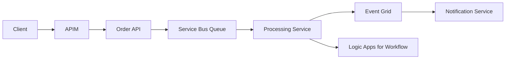

# APIM, Messaging, and Eventing

## Overview

Integration architecture connects distributed systems safely and reliably. This topic covers API Management, Service Bus, Event Grid, and workflow integration patterns.
It explains how to design integration boundaries that survive scale, failures, and organizational change. In enterprise systems, integration is where reliability and governance are either proven or broken.

## Why this topic matters

Most enterprise failures happen at boundaries between systems. Interviewers test whether you can design resilient integration rather than isolated services.
Strong architects explain not only what service to use, but how message contracts, retries, backpressure, security controls, and observability work together as one operating model.

## Core concepts

- API gateway and APIM
- Sync vs async integration
- Service Bus queues/topics
- Event Grid event routing
- Logic Apps orchestration
- Reliability patterns (retry, DLQ, idempotency)

## Detailed explanation of each concept

### APIM
Centralized API facade for security, throttling, versioning, transformations, and analytics.

### Sync vs async
Synchronous calls fit immediate responses; asynchronous messaging improves resilience and decoupling.

### Service Bus
Reliable broker for commands/workflows needing durability, ordering controls, and retries.

### Event Grid
Low-latency event distribution for notification-style patterns.

### Logic Apps
Workflow orchestration with connectors for SaaS and enterprise integration.

### Reliability patterns
Retries with backoff, dead-letter queues, idempotent consumers, poison message handling.

## Evaluation (How to assess integration architecture quality)

Use measurable integration health indicators:
- API error/timeout rate and saturation behavior
- Queue backlog age and retry volume
- Dead-letter rate and recovery success time
- End-to-end trace coverage across sync + async paths
- Consumer compatibility and contract break frequency

## Architecture / flow diagram



**Flow explanation:**  
APIM secures and governs ingress traffic. Transactional processing flows through API services, while durable workflows are decoupled via Service Bus. Downstream event notifications are distributed through Event Grid, and business process orchestration is handled by Logic Apps where connector-based workflows are required.

## Real-world example

An order platform receives API requests through APIM, persists orders, publishes command messages to Service Bus, processes fulfillment asynchronously, and emits events for billing and notification consumers.
This design isolates user-facing responsiveness from slower backend processing, which keeps frontend latency stable even during downstream delays. It also enables partial recovery and replay through queue mechanisms without losing transaction intent.

## Best practices

- Use APIM policies for auth, rate limits, schema checks.
- Use Service Bus for reliable command processing.
- Keep consumers idempotent.
- Use correlation IDs across services.
- Keep integration contracts versioned and explicitly governed.
- Build operational dashboards around queue lag, DLQ, and API degradation.

## Common mistakes / misconceptions

- Using synchronous calls for long-running workflows.
- No dead-letter strategy.
- Treating Event Grid as durable queue replacement.
- Ignoring API version strategy.
- Coupling business transactions to one fragile synchronous chain.

## Industry relevance

Core in banking, retail, logistics, and healthcare where multiple systems must coordinate safely.
Integration maturity is often the determining factor in modernization success for large enterprises with mixed legacy and cloud-native systems.

## Interview discussion points

- API governance model
- Event-driven trade-offs
- Exactly-once myth vs practical idempotency
- Contract evolution and backward compatibility
- Reliability ownership across platform and product teams

## Question Answer Format (Use for each question)

For every integration question, answer using:
1. **Question summary** (2-3 lines)
2. **Crisp answer** (7-8 lines)
3. **Deep explanation** (~40 lines)
4. **Simple diagram or flow**
5. **Related topic link(s)**

## Links to dependent / related topics

- [Security, IAM, Networking](../security/security_iam_networking.md)
- [Compute Architecture Decisions](../compute/compute_architecture.md)
- [System Design HLD/LLD](../system-design/system_design_hld_lld.md)

## Interview Questions (50)

### Top 5 most asked industry questions
1. Why APIM if APIs already work?
2. Service Bus vs Event Grid: when to use each?
3. How do you design idempotent consumers?
4. How do you handle API versioning in enterprise platforms?
5. How do you secure external and internal APIs differently?

### Scenario-based questions
6. Payment workflow must be reliable under spikes. Integration design?
7. Partner API abuse causes outage. Controls in APIM?
8. Message consumers fail intermittently. Recovery strategy?
9. Event ordering is critical for one workflow. How do you enforce?
10. Migration from synchronous monolith calls to async microservices?
11. API breaking change required for compliance. Rollout plan?
12. Duplicate messages causing double processing. Fix approach?
13. Need full traceability across APIs and queues. Design?
14. One downstream system is legacy and unstable. Integration pattern?
15. Need region failover for integration plane. Design?

### Tricky questions
16. Can Event Grid replace Service Bus for all workloads?
17. Is DLQ only needed for critical systems?
18. Is exactly-once delivery guaranteed by default?
19. Can APIM replace service authentication entirely?
20. Is async always better than sync?
21. Should all APIs use same throttling limits?
22. Can retries solve all transient failures?
23. Is a message broker enough without observability?
24. Should queues be shared across domains?
25. Can versioning be skipped for internal APIs?

### Cross-topic/interlinked questions
26. How does Entra ID integrate with APIM authorization?
27. How does private networking affect APIM design?
28. How does queue depth influence autoscaling compute?
29. How does messaging architecture impact DR strategy?
30. How do governance policies apply to integration resources?
31. How does event-driven architecture affect data consistency?
32. How do you secure AI service APIs through APIM?
33. How do you design cost-aware messaging architecture?
34. How do you align integration patterns with system NFRs?
35. How do you monitor SLA/SLO for API + messaging flows?

### Additional deep-dive questions
36. Explain queue vs topic in Service Bus.
37. Explain correlation ID usage in distributed tracing.
38. How do you design poison message handling?
39. How do you test API policies pre-production?
40. How do you run schema evolution safely?
41. How do you enforce consumer contract compatibility?
42. How do you design retry budget limits?
43. How do you handle message TTL and ordering trade-offs?
44. How do you design command vs event semantics?
45. How do you decide between orchestration and choreography?
46. How do you secure inter-service communication in async flows?
47. How do you build audit trails for regulated integrations?
48. How do you run failover drills for integration systems?
49. How do you present integration risk to leadership?
50. How do you modernize legacy integrations incrementally?

## Answers for important questions (Summary + Crisp + Deep)

### Q1. Why APIM if APIs already work?

**Question summary:**  
Interviewers are testing governance maturity. They want to see why working APIs still need a control plane for security, lifecycle, and operations.

**Crisp answer (7-8 lines):**  
Working APIs are not the same as governed APIs.  
APIM provides centralized security and policy enforcement.  
It standardizes throttling, auth, transformation, and version controls.  
It gives operational observability and usage analytics at one layer.  
It reduces duplicated cross-cutting code in each API service.  
It supports partner onboarding and developer portal experiences.  
It improves compliance posture with consistent gateway governance.  
APIM turns APIs into managed enterprise products.

**Deep explanation (~40 lines):**  
Individual APIs may function technically, but enterprise environments require consistent policy enforcement across all interfaces. Without APIM, teams implement security and governance differently, leading to drift and avoidable risk.

APIM centralizes cross-cutting concerns: authentication, authorization, rate limiting, transformation, response shaping, and traffic governance. This reduces per-service duplication and operational inconsistency.

Lifecycle management is another reason. APIs evolve; APIM supports versioning, deprecation windows, and controlled consumer migration patterns. It also improves consumer experience through catalogs and documentation.

Operational visibility improves significantly when gateway-level metrics and traces are standardized. This helps incident response and capacity planning.

In interviews, position APIM as governance and operational leverage, not just a routing proxy.

**Answer summary:**  
APIM is needed because enterprise APIs require centralized security, policy consistency, lifecycle governance, and operational visibility beyond basic endpoint functionality.

**Simple diagram:**  
```text
Client Traffic -> APIM Policy Layer -> Backend APIs
               (Auth, Throttle, Version, Observability)
```

**Trusted reference links:**  
- https://learn.microsoft.com/en-us/azure/api-management/api-management-key-concepts

### Q2. Service Bus vs Event Grid: when to use each?

**Question summary:**  
This tests eventing design clarity. Interviewers expect clear distinction between durable command workflows and lightweight event fan-out.

**Crisp answer (7-8 lines):**  
Use Service Bus for reliable, durable workflow messaging.  
Use Event Grid for lightweight event notification fan-out.  
Service Bus supports queues/topics with stronger delivery controls.  
Event Grid excels for reactive event routing at scale.  
Choose Service Bus for business-critical command processing.  
Choose Event Grid for near-real-time publish-subscribe signals.  
Do not treat them as interchangeable drop-in substitutes.  
Select by durability, ordering, and processing semantics.

**Deep explanation (~40 lines):**  
Service Bus is built for enterprise messaging where delivery guarantees, retry handling, dead-letter workflows, and ordered/session-aware processing are important. It suits command and transactional workflows that require reliable completion.

Event Grid is optimized for event distribution and fan-out. It is ideal for notification-style patterns where multiple subscribers react independently.

Architectural misuse is common: using Event Grid where durable processing is required, or using Service Bus for simple event notifications where lighter routing is sufficient.

Decision criteria should include delivery durability, processing ownership, replay needs, and operational complexity.

In interviews, emphasize semantic fit rather than feature overlap.

**Answer summary:**  
Service Bus is for durable workflow messaging; Event Grid is for scalable event notification and fan-out. Choose based on processing guarantees and event semantics.

**Simple diagram:**  
```text
Command Workflow -> Service Bus
Reactive Notifications -> Event Grid
```

**Trusted reference links:**  
- https://learn.microsoft.com/en-us/azure/service-bus-messaging/service-bus-messaging-overview  
- https://learn.microsoft.com/en-us/azure/event-grid/overview

### Q3. How do you design idempotent consumers?

**Question summary:**  
Interviewers evaluate reliability correctness under at-least-once delivery. They expect duplicate-safe processing and side-effect control.

**Crisp answer (7-8 lines):**  
Assume duplicate message delivery by default.  
Use business idempotency key for each operation event.  
Persist processed keys in durable dedupe store.  
Make writes conditional and conflict-aware.  
Protect side effects with outbox or compensation logic.  
Bound retries and handle poison messages explicitly.  
Monitor duplicate-hit rates and processing anomalies.  
Idempotency is mandatory for reliable async systems.

**Deep explanation (~40 lines):**  
At-least-once delivery means consumers can receive repeats during retries, restarts, or transient failures. Idempotent design ensures repeated processing does not create duplicate business outcomes.

Use deterministic keys from business context, not transport metadata alone. Store processing decisions durably and check before applying side effects.

Database updates should be conditional to prevent duplicate writes. External actions (email, payment calls) need explicit side-effect safeguards.

Operationally, monitor dedupe effectiveness and failure cases. In interviews, frame idempotency as correctness invariant, not performance optimization.

**Answer summary:**  
Design idempotent consumers with operation keys, durable dedupe checks, conditional writes, and controlled side-effect handling for duplicate-safe processing.

**Simple diagram:**  
```text
Message -> Idempotency Check -> Process Once -> Record Key -> Safe Retry Path
```

**Trusted reference links:**  
- https://learn.microsoft.com/en-us/azure/architecture/patterns/idempotent-messaging

### Q4. How do you handle API versioning in enterprise platforms?

**Question summary:**  
This tests lifecycle governance. Interviewers expect compatibility strategy that minimizes consumer disruption.

**Crisp answer (7-8 lines):**  
Version APIs with explicit lifecycle and deprecation policy.  
Prefer backward-compatible changes whenever possible.  
Use URI/header strategy consistently across domains.  
Publish version roadmap and migration timelines early.  
Run parallel versions during transition windows.  
Track consumer usage by version with telemetry.  
Retire old versions only after readiness criteria are met.  
Versioning is a contract governance discipline.

**Deep explanation (~40 lines):**  
Enterprise API versioning is primarily a consumer stability problem. Breaking changes should be rare and intentional, with clear migration windows and communication plans.

Consistency matters more than style choice. Whether URI or header versioning, enforce one model per platform and document standards.

Telemetry-driven governance is critical. Platform teams must know which consumers are still on older versions before retirement.

Use APIM and contract tests to reduce breakage risk. In interviews, demonstrate versioning as ongoing product management for APIs.

**Answer summary:**  
Handle API versioning through consistent contract strategy, compatibility-first evolution, telemetry-based migration, and controlled deprecation governance.

**Simple diagram:**  
```text
API Contract Change -> New Version Publish -> Consumer Migration Window -> Version Retirement
```

**Trusted reference links:**  
- https://learn.microsoft.com/en-us/azure/architecture/best-practices/api-design

### Q5. How do you secure external and internal APIs differently?

**Question summary:**  
Interviewers test layered security architecture. They expect differentiated controls by exposure level and threat model.

**Crisp answer (7-8 lines):**  
External APIs require stronger perimeter and abuse controls.  
Use WAF, strict throttling, and tighter auth scopes externally.  
Internal APIs still require auth, logging, and least privilege.  
Use private networking and service identities for internal paths.  
Apply zero-trust principles to both, with different intensity.  
Segment policies by API risk and consumer type.  
Monitor both channels with tailored anomaly detection.  
Security model should match exposure and business risk.

**Deep explanation (~40 lines):**  
External APIs face broader threat exposure and require stronger ingress controls: bot protection, rate limiting, strict schema validation, and hardened authentication flows. Internal APIs are not inherently trusted and still require identity and policy enforcement.

Internal API design should emphasize private connectivity, service-to-service auth, and detailed observability. External APIs need stronger consumer governance and contractual access controls.

A unified policy model with exposure-based profiles helps maintain consistency while addressing different risk levels.

In interviews, explain external/internal differences as threat-model-driven policy layering.

**Answer summary:**  
Secure external and internal APIs with shared zero-trust principles, but apply stronger perimeter and abuse controls to externally exposed surfaces.

**Simple diagram:**  
```text
External -> WAF + APIM + Strict Throttle/Auth
Internal -> Private Network + Service Identity + APIM Policy
```

**Trusted reference links:**  
- https://learn.microsoft.com/en-us/azure/architecture/guide/security/

### Q6. Payment workflow must be reliable under spikes. Integration design?

**Question summary:**  
This scenario tests reliability-first integration architecture under burst demand. Interviewers expect durable processing, idempotency, and controlled recovery.

**Crisp answer (7-8 lines):**  
Front payment APIs with APIM for throttling and protection.  
Persist payment intent before async processing begins.  
Use Service Bus for durable command handling under spikes.  
Make payment consumers idempotent with transaction keys.  
Use retry with DLQ for non-transient failures.  
Keep synchronous path minimal to protect checkout latency.  
Monitor queue lag and processing success rate in real time.  
Design for correctness first, then throughput optimization.

**Deep explanation (~40 lines):**  
Payment workflows must prioritize correctness and durability over raw speed. Start by reducing synchronous dependencies in the checkout path. Capture and persist payment intent quickly, then move heavy processing to durable async channels.

Service Bus is suitable because it provides reliable queue semantics, retry behavior, and dead-letter support. Under spike conditions, queue buffers absorb surge load while workers scale horizontally.

Idempotency is non-negotiable. Duplicate message handling should never create double charge scenarios. Use transaction identifiers and conditional persistence to enforce exactly-once business effect over at-least-once delivery.

Failure handling should distinguish transient errors from terminal ones. DLQ processes and replay workflows need operational ownership and runbooks.

In interviews, show that payment integration architecture is about durable correctness, controlled latency, and recoverable operations.

**Answer summary:**  
Design spike-resilient payment integration with APIM protection, durable queue-based processing, idempotent consumers, and strong failure-recovery controls.

**Simple diagram:**  
```text
Checkout API -> APIM -> Persist Intent -> Service Bus -> Idempotent Payment Worker -> Success/Retry/DLQ
```

**Trusted reference links:**  
- https://learn.microsoft.com/en-us/azure/service-bus-messaging/service-bus-messaging-overview

### Q7. Partner API abuse causes outage. Controls in APIM?

**Question summary:**  
Interviewers test API protection strategy and abuse resilience. They expect policy-driven controls and operational response playbook.

**Crisp answer (7-8 lines):**  
Apply per-partner rate limits and quota policies immediately.  
Use IP, token, and subscription-level throttling controls.  
Enforce request validation and payload size restrictions.  
Protect high-risk routes with stricter burst limits.  
Enable rapid deny/block policies for abusive clients.  
Use response caching where safe to absorb load.  
Monitor partner traffic anomalies continuously.  
Combine prevention controls with incident response runbooks.

**Deep explanation (~40 lines):**  
Partner abuse often overwhelms API tiers through burst traffic, malformed payloads, or uncontrolled retries. APIM should enforce consumption boundaries per partner contract using quotas and rate limits.

Authentication and subscription segmentation are critical so abusive behavior can be isolated quickly. Request validation and size checks reduce resource exhaustion attacks.

During incident response, temporary emergency controls may include stricter throttling, route-level filtering, or partner-specific denial until behavior is corrected.

Long-term, update contract governance and traffic policies based on observed patterns. In interviews, emphasize both preventive controls and rapid containment strategy.

**Answer summary:**  
Mitigate partner API abuse with layered APIM throttling, validation, and rapid isolation controls backed by monitoring and incident runbooks.

**Simple diagram:**  
```text
Partner Traffic -> APIM Quota/Throttle/Validation -> Backend APIs (protected)
```

**Trusted reference links:**  
- https://learn.microsoft.com/en-us/azure/api-management/api-management-sample-flexible-throttling

### Q8. Message consumers fail intermittently. Recovery strategy?

**Question summary:**  
This tests resilience design for unstable downstream processing. Interviewers expect structured retry, DLQ, and replay model.

**Crisp answer (7-8 lines):**  
Separate transient from permanent failure handling first.  
Use bounded retry with exponential backoff for transient issues.  
Move terminal failures to dead-letter queue for triage.  
Keep consumers idempotent to support safe replay.  
Capture failure metadata for root-cause analysis.  
Define replay workflows with governance approval where needed.  
Monitor retry storms and DLQ growth proactively.  
Recovery should be automated, observable, and controlled.

**Deep explanation (~40 lines):**  
Intermittent failures are common in distributed systems and should be expected in design. Recovery begins with classification: transient dependency failures can be retried; data/contract errors require quarantine and investigation.

Retry strategy must be bounded and jittered to avoid amplifying dependency stress. Dead-letter queues are critical to isolate poison messages without blocking healthy traffic.

Replay should be deterministic and idempotent. Without idempotency, recovery actions can create duplicate side effects.

Operational metrics should include retry depth, DLQ rate, and replay success. In interviews, show that recovery strategy is part of system correctness and availability design.

**Answer summary:**  
Recover intermittent consumer failures using bounded retries, DLQ quarantine, idempotent replay, and telemetry-driven root-cause workflows.

**Simple diagram:**  
```text
Consume -> Fail? -> Retry (bounded) -> Success or DLQ -> Triage -> Replay
```

**Trusted reference links:**  
- https://learn.microsoft.com/en-us/azure/architecture/patterns/competing-consumers

### Q9. Event ordering is critical for one workflow. How do you enforce?

**Question summary:**  
Interviewers assess event consistency strategy. They expect ordering controls scoped to workflow need, not system-wide overconstraint.

**Crisp answer (7-8 lines):**  
Scope ordering guarantees to only required business flows.  
Use message sessions/partition keys for ordered streams.  
Keep a single logical writer where strict sequencing is needed.  
Include sequence numbers and validation checks in payloads.  
Handle out-of-order events with buffering or compensation.  
Avoid global ordering if only local ordering is required.  
Monitor ordering violations and recovery outcomes.  
Ordering design should balance correctness and throughput.

**Deep explanation (~40 lines):**  
Strict ordering can reduce throughput and increase coupling, so apply it selectively to workflows that truly require sequence integrity. Use platform features like sessions or partition routing to maintain ordered processing for related entity streams.

Embed sequence metadata so consumers can detect gaps or out-of-order arrivals. When disorder is possible, design bounded buffering and reconciliation logic.

Global ordering across all events is rarely necessary and often harmful. In interviews, emphasize domain-scoped ordering guarantees with explicit trade-off awareness.

**Answer summary:**  
Enforce ordering only where needed using partition/session controls, sequence metadata, and recovery logic for out-of-order cases.

**Simple diagram:**  
```text
Entity Events -> Partition/Session -> Ordered Consumer -> Sequence Validation
```

**Trusted reference links:**  
- https://learn.microsoft.com/en-us/azure/service-bus-messaging/message-sessions

### Q10. Migration from synchronous monolith calls to async microservices?

**Question summary:**  
This tests modernization integration strategy. Interviewers expect phased transition that preserves business continuity.

**Crisp answer (7-8 lines):**  
Start by identifying high-latency and fragile sync call chains.  
Introduce async boundaries using queue/topic integration points.  
Apply strangler pattern to migrate one capability at a time.  
Keep contract compatibility during coexistence period.  
Add idempotency and observability before scaling out.  
Use dual-run validation for critical business flows.  
Phase cutover by risk and business dependency.  
Modernization should reduce coupling without disrupting operations.

**Deep explanation (~40 lines):**  
Monolith-to-async migration should be evolutionary. Begin with dependency mapping and identify synchronous hotspots causing latency or reliability issues. Introduce asynchronous integration boundaries around those hotspots first.

Use strangler-style decomposition to move one domain capability at a time. During coexistence, maintain contract compatibility and clear ownership for handoff behavior.

Add idempotency and traceability early so async transitions remain debuggable. For critical flows, dual-run and reconciliation reduce migration risk.

In interviews, present migration as controlled coupling reduction with measurable reliability gains.

**Answer summary:**  
Migrate from synchronous monolith integrations by phased async boundary introduction, compatibility-safe coexistence, and risk-based domain cutover.

**Simple diagram:**  
```text
Monolith Sync Call -> Async Boundary (Queue/Topic) -> New Microservice Consumer -> Gradual Strangler Cutover
```

**Trusted reference links:**  
- https://learn.microsoft.com/en-us/azure/architecture/patterns/strangler-fig

### Q11. How do you design DLQ operational ownership?

**Question summary:**  
Interviewers test whether DLQ is treated as a first-class operational workflow, not just a technical fallback.

**Crisp answer (7-8 lines):**  
Assign clear team ownership for each DLQ domain.  
Define triage SLAs by business criticality.  
Store full failure context for diagnosis and replay.  
Create standardized runbooks for classify-fix-replay flow.  
Automate alerting on DLQ growth thresholds.  
Separate poison-data issues from transient platform faults.  
Track replay outcomes and recurring root causes.  
DLQ health is a reliability KPI, not a side task.

**Deep explanation (~40 lines):**  
Dead-letter queues are often where integration reliability problems become visible. Without ownership, DLQ grows silently and business workflows degrade over time.

Each domain should have a responsible service owner and clear triage timelines. Failure payloads must preserve metadata needed for diagnosis, including correlation IDs, timestamps, and error categories.

Operational runbooks should define classification rules, remediation actions, and replay approval gates, especially for regulated workflows. Alerts should trigger before backlog becomes business-impacting.

In interviews, highlight that DLQ management is part of production reliability engineering and governance.

**Answer summary:**  
Design DLQ ownership with accountable teams, SLAs, runbooks, observability, and controlled replay to keep integration reliability measurable and recoverable.

**Simple diagram:**  
```text
Processing Failure -> DLQ -> Owner Triage -> Fix -> Controlled Replay -> Audit
```

**Trusted reference links:**  
- https://learn.microsoft.com/en-us/azure/service-bus-messaging/service-bus-dead-letter-queues

### Q12. How do you prevent schema drift in event-driven systems?

**Question summary:**  
This evaluates contract governance maturity. Interviewers expect proactive version and compatibility strategy for producers and consumers.

**Crisp answer (7-8 lines):**  
Treat event schema as governed product contracts.  
Use schema registry and compatibility validation in CI.  
Prefer additive changes over breaking changes.  
Version contracts with clear deprecation windows.  
Test producer-consumer compatibility continuously.  
Reject incompatible payloads before production release.  
Track contract usage across dependent services.  
Schema governance prevents silent integration failures.

**Deep explanation (~40 lines):**  
Schema drift is a leading cause of asynchronous failures because breakage appears at runtime across independently deployed services. Formal contract governance reduces this risk.

Use compatibility policies in pipelines so breaking changes are caught before deployment. Favor additive evolution and optional fields to keep older consumers functional.

Visibility into consumer versions is essential before retiring old schema variants. For high-criticality domains, contract testing and replay simulation provide additional confidence.

In interviews, explain schema governance as cross-team reliability control, not documentation alone.

**Answer summary:**  
Prevent schema drift with registry-backed contracts, CI compatibility checks, additive evolution, and telemetry-informed deprecation governance.

**Simple diagram:**  
```text
Producer Change -> Schema Validation CI -> Registry Publish -> Consumer Compatibility Checks
```

**Trusted reference links:**  
- https://learn.microsoft.com/en-us/azure/architecture/guide/multitenant/considerations/messaging

### Q13. How do you handle long-running business processes?

**Question summary:**  
Interviewers assess orchestration strategy for distributed workflows that span minutes or hours with partial failures.

**Crisp answer (7-8 lines):**  
Model workflow as explicit state machine or saga.  
Use durable orchestration for checkpointed progress.  
Design compensating actions for irreversible step failures.  
Persist state transitions with correlation identifiers.  
Keep each step idempotent and timeout-aware.  
Expose workflow status for operational visibility.  
Separate business retries from technical retries.  
Long-running flows need resilience and auditability.

**Deep explanation (~40 lines):**  
Long-running processes cannot rely on synchronous transactions across services. They require stateful coordination with persisted checkpoints and clear transition rules.

Saga or orchestration models provide control over step ordering, retries, and compensation when downstream actions fail. Compensation must be business-valid, not purely technical rollback.

Operationally, workflow status must be queryable for support and incident handling. Timeouts and retry policies should be tailored by step criticality.

In interviews, frame long-running process design as distributed consistency with business-aware failure management.

**Answer summary:**  
Handle long-running processes using durable stateful orchestration, idempotent steps, compensation logic, and transparent workflow observability.

**Simple diagram:**  
```text
Start -> Step A -> Step B -> Step C
          |fail|-> Compensation Flow -> Final State
```

**Trusted reference links:**  
- https://learn.microsoft.com/en-us/azure/architecture/reference-architectures/saga/saga

### Q46. How do you secure inter-service communication in async flows?

**Question summary:**  
Interviewers evaluate zero-trust implementation for producers, brokers, and consumers in internal event pipelines.

**Crisp answer (7-8 lines):**  
Use managed identity for service authentication end-to-end.  
Enforce least-privilege access per queue/topic scope.  
Use private networking and deny public exposure where possible.  
Encrypt transport and storage by default.  
Rotate credentials and keys through centralized governance.  
Validate publisher and subscriber authorization continuously.  
Audit access patterns and anomalous message activity.  
Security must follow every async hop consistently.

**Deep explanation (~40 lines):**  
Async communication often appears internal, but it still requires full zero-trust controls. Authentication should be workload identity-based, eliminating shared secrets wherever possible.

Authorization should be granular: services can publish or consume only what they own. Network isolation with private endpoints and restricted egress reduces attack surface.

Security monitoring must include broker-level access anomalies and unusual message patterns. In interviews, describe async security as identity, network, encryption, and governance combined.

**Answer summary:**  
Secure async inter-service communication with identity-based auth, least-privilege authorization, private networking, encryption, and continuous monitoring.

**Simple diagram:**  
```text
Service Identity -> Private Broker Access -> Authorized Queue/Topic -> Audited Consume/Publish
```

**Trusted reference links:**  
- https://learn.microsoft.com/en-us/azure/well-architected/security/

### Q47. How do you build audit trails for regulated integrations?

**Question summary:**  
This tests evidence-grade traceability for compliance, forensics, and legal accountability.

**Crisp answer (7-8 lines):**  
Record immutable event and API transaction lineage.  
Capture identity, policy decision, and timestamp metadata.  
Link all records with correlation and business IDs.  
Store trails in tamper-evident retention systems.  
Control access and redact sensitive fields in views.  
Support query patterns for investigations and audits.  
Validate trail completeness through periodic checks.  
Audit trail quality is a compliance control objective.

**Deep explanation (~40 lines):**  
Regulated integration environments require provable lineage, not just operational logs. Every significant action should emit an auditable record tied to actor identity and policy outcomes.

Correlation across synchronous and asynchronous steps is crucial to reconstruct end-to-end business transactions. Storage design must ensure integrity, retention compliance, and secure retrieval.

Audit trails should be tested for completeness, not assumed. In interviews, emphasize that compliance evidence is designed as part of architecture, not assembled after incidents.

**Answer summary:**  
Build regulated audit trails using immutable correlated records, identity-rich metadata, secure retention, and validation of trail completeness.

**Simple diagram:**  
```text
API + Event Actions -> Correlated Audit Records -> Immutable Store -> Compliance Review
```

**Trusted reference links:**  
- https://learn.microsoft.com/en-us/azure/architecture/framework/security/monitoring-and-threat-detection

### Q48. How do you run failover drills for integration systems?

**Question summary:**  
Interviewers assess operational resilience maturity beyond architecture diagrams.

**Crisp answer (7-8 lines):**  
Define failover scenarios by dependency and region risks.  
Automate drill steps with clear pass/fail criteria.  
Test API routing, messaging continuity, and replay recovery.  
Include data consistency verification after failback.  
Measure RTO/RPO against committed objectives.  
Capture lessons and update runbooks immediately.  
Run drills regularly, not only before audits.  
Resilience is proven through practiced execution.

**Deep explanation (~40 lines):**  
Failover readiness cannot be assumed from topology design alone. Drills should simulate realistic faults, including regional outages, broker unavailability, and partial dependency failure.

Testing must cover traffic rerouting, message durability, backlog recovery, and eventual consistency checks. Success criteria should include both technical restoration and business workflow integrity.

Post-drill retrospectives should drive concrete improvements in automation, runbooks, and alerting. In interviews, show failover drills as reliability governance mechanism.

**Answer summary:**  
Run failover drills with scenario-based automation, measurable recovery targets, consistency validation, and continuous runbook improvement.

**Simple diagram:**  
```text
Planned Fault -> Failover Execution -> Service + Queue Recovery -> Consistency Check -> Lessons Applied
```

**Trusted reference links:**  
- https://learn.microsoft.com/en-us/azure/well-architected/reliability/testing

### Q49. How do you present integration risk to leadership?

**Question summary:**  
This tests communication ability to translate technical integration concerns into business risk language.

**Crisp answer (7-8 lines):**  
Map risks to business outcomes and customer impact first.  
Quantify likelihood, impact, and detection confidence.  
Show top risk scenarios with current control effectiveness.  
Present mitigation options with cost and timeline trade-offs.  
Use simple risk heatmap and trend indicators.  
Highlight decision points requiring leadership support.  
Track residual risk after mitigation actions.  
Leadership communication must enable informed decisions.

**Deep explanation (~40 lines):**  
Executive audiences need clarity on business exposure, not implementation details. Integration risk communication should tie technical failure modes to revenue, compliance, and customer trust consequences.

A concise model includes severity, probability, and control maturity. Trend direction is important because rising risk may require immediate investment decisions.

Provide actionable options, not only problem statements. In interviews, demonstrate that architects manage risk both technically and organizationally.

**Answer summary:**  
Present integration risk in business terms with quantified exposure, control maturity, mitigation choices, and explicit decision asks.

**Simple diagram:**  
```text
Technical Risk -> Business Impact Mapping -> Risk Score/Trend -> Mitigation Options -> Leadership Decision
```

**Trusted reference links:**  
- https://learn.microsoft.com/en-us/azure/well-architected/

### Q50. How do you modernize legacy integrations incrementally?

**Question summary:**  
Interviewers evaluate pragmatic modernization that reduces risk while delivering continuous value.

**Crisp answer (7-8 lines):**  
Start with integration landscape and dependency mapping.  
Prioritize high-risk or high-value interfaces first.  
Introduce APIM façade to stabilize external contracts.  
Extract workflows gradually using strangler approach.  
Adopt async messaging where decoupling gives clear value.  
Run parallel validation before final cutover.  
Retire legacy endpoints with controlled migration windows.  
Incremental modernization minimizes disruption and risk.

**Deep explanation (~40 lines):**  
Legacy integration modernization succeeds when it is iterative and business-aligned. Begin by understanding current interfaces, ownership gaps, and failure hotspots. Use APIM as a stabilization layer so consumers are insulated from backend changes.

Move capabilities out of legacy systems in slices, prioritizing domains with highest reliability or agility payoff. Introduce asynchronous patterns where they reduce coupling and improve resilience.

Parallel run and reconciliation build confidence before decommissioning old flows. In interviews, frame modernization as a risk-managed transformation journey, not a big-bang rewrite.

**Answer summary:**  
Modernize legacy integrations through phased extraction, contract stabilization, async decoupling, and controlled cutover with validation.

**Simple diagram:**  
```text
Legacy Integration -> APIM Facade -> Incremental Service Extraction -> Async Decoupling -> Legacy Retirement
```

**Trusted reference links:**  
- https://learn.microsoft.com/en-us/azure/architecture/patterns/strangler-fig

### Q14. How do you choose retry policy across API and messaging layers?

**Question summary:**  
This tests resilience policy design. Interviewers expect retry boundaries that avoid storms and cascading failures.

**Crisp answer (7-8 lines):**  
Apply retries only for transient, recoverable failure types.  
Use exponential backoff with jitter everywhere.  
Set max retry limits by business latency tolerance.  
Avoid layered blind retries across gateway and consumer.  
Use circuit breakers for repeated dependency failure.  
Route unrecoverable cases to DLQ or fallback path.  
Measure retry success versus amplification risk.  
Retries must improve recovery, not increase outage impact.

**Deep explanation (~40 lines):**  
Uncoordinated retry policies often turn partial failures into full outages. Design retry behavior across layers so each failure is retried intentionally once within a controlled boundary.

Use exponential backoff and jitter to reduce synchronized load spikes. Distinguish technical transient conditions from business validation failures that should not be retried.

Circuit breakers and bulkheads provide additional protection when dependencies degrade. Monitoring should show retry depth, dependency saturation, and fallback engagement.

In interviews, show retry policy as a system-level control, not an SDK default.

**Answer summary:**  
Choose retry policy by failure semantics, layer boundaries, and dependency protection to recover safely without triggering retry storms.

**Simple diagram:**  
```text
Request Fail -> Classify Error -> Retry(backoff/jitter, bounded) -> Success or Fallback/DLQ
```

**Trusted reference links:**  
- https://learn.microsoft.com/en-us/azure/architecture/patterns/retry

### Q15. APIM in multi-region architecture: what changes?

**Question summary:**  
Interviewers evaluate global integration design readiness including resilience, latency, and governance consistency.

**Crisp answer (7-8 lines):**  
Deploy APIM with region-aware active-active strategy.  
Use global routing for latency and failover decisions.  
Keep policy definitions consistent across regions.  
Externalize configuration and secrets securely.  
Plan data residency and compliance boundaries early.  
Validate failover behavior through regular drills.  
Observe region-specific traffic and error patterns.  
Multi-region APIM needs both control and operations maturity.

**Deep explanation (~40 lines):**  
Multi-region APIM design must balance latency optimization with resilience objectives. Active-active topology reduces regional blast radius but introduces governance synchronization requirements.

Routing should account for health, geography, and business constraints. Policy and backend configuration drift between regions can cause inconsistent behavior, so automation is essential.

Certificate and secret management should be centralized with secure distribution workflows. Disaster recovery testing must verify both traffic failover and policy integrity.

In interviews, explain that global API architecture is as much an operations problem as a deployment pattern.

**Answer summary:**  
In multi-region deployments, APIM requires active-active routing, policy consistency automation, secure config management, and failover-tested operations.

**Simple diagram:**  
```text
Global Clients -> Traffic Manager/Front Door -> APIM Region A / APIM Region B -> Regional Backends
```

**Trusted reference links:**  
- https://learn.microsoft.com/en-us/azure/api-management/high-availability

### Q16. How do you design idempotency keys across channels?

**Question summary:**  
This checks cross-channel consistency when requests may arrive via API retries, batch jobs, or event replay.

**Crisp answer (7-8 lines):**  
Use business operation IDs, not transport-generated IDs.  
Keep key scope explicit: tenant, operation type, time window.  
Store keys in durable low-latency dedupe storage.  
Apply conditional writes for side-effecting operations.  
Return cached prior result for duplicate API calls.  
Share idempotency standard across sync and async paths.  
Expire keys based on business replay horizon.  
Design keys for correctness first, then performance.

**Deep explanation (~40 lines):**  
Idempotency breaks when each channel generates different identity semantics for the same business action. A robust approach starts from business intent and assigns a deterministic operation identifier that remains stable across retries and delivery modes.

Scope matters. If the same key can appear across tenants or operations, collisions create false dedupe events. Include enough context to avoid accidental suppression while keeping keys predictable.

Storage must support fast existence checks and atomic write-if-absent behavior. For APIs, duplicate calls should return prior accepted result, not just generic conflict. For messaging, dedupe lookup should happen before irreversible side effects.

In interviews, position idempotency key design as a platform contract spanning API, eventing, and replay workflows.

**Answer summary:**  
Design idempotency keys from business intent, apply durable dedupe checks, and enforce the same key model across all integration channels.

**Simple diagram:**  
```text
API/Event/Batch -> Business Operation ID -> Dedupe Store Check -> Process Once -> Reuse Result
```

**Trusted reference links:**  
- https://learn.microsoft.com/en-us/azure/architecture/patterns/idempotent-messaging

### Q17. How do you govern API products for multiple consumer groups?

**Question summary:**  
Interviewers test API productization maturity, including segmentation, lifecycle, and policy governance.

**Crisp answer (7-8 lines):**  
Group APIs into products by consumer persona and use case.  
Define product-level SLA, quota, and auth requirements.  
Separate internal, partner, and public API products.  
Use onboarding workflows with approval and subscription keys.  
Version products with documented lifecycle commitments.  
Track adoption, error rates, and policy violations per product.  
Retire products with migration timelines and communication.  
Govern APIs as products, not endpoint collections.

**Deep explanation (~40 lines):**  
Different consumers have different trust models, support needs, and performance expectations. Product segmentation in APIM prevents one-size-fits-all policies that either over-restrict or under-protect.

Each API product should define usage contract: who can access, how much traffic is allowed, what authentication applies, and what support tier is offered. Product governance also needs lifecycle controls so deprecations are predictable.

Operational telemetry by product helps platform teams prioritize improvements and detect misuse. In interviews, explain product governance as the bridge between architecture controls and business consumption.

**Answer summary:**  
Govern API portfolios by consumer-oriented products with distinct policy, lifecycle, and observability controls.

**Simple diagram:**  
```text
APIs -> Product A (Internal) | Product B (Partner) | Product C (Public) -> Consumer-specific policies
```

**Trusted reference links:**  
- https://learn.microsoft.com/en-us/azure/api-management/api-management-howto-add-products

### Q18. How do you design exactly-once business outcome with at-least-once delivery?

**Question summary:**  
This evaluates reliability correctness under practical messaging constraints where transport-level exactly-once is not guaranteed.

**Crisp answer (7-8 lines):**  
Accept at-least-once transport as the default reality.  
Enforce dedupe using business transaction identifiers.  
Use atomic state transition with idempotent write logic.  
Separate message acknowledgment from business commit safely.  
Protect external side effects with outbox or ledger checks.  
Use replay-safe handlers for recovery operations.  
Audit duplicate suppression and reconciliation metrics.  
Aim for exactly-once effect, not exactly-once delivery.

**Deep explanation (~40 lines):**  
Distributed messaging platforms typically guarantee at-least-once delivery, so duplicate arrivals are expected. Exactly-once business outcomes are achieved by stateful application logic, not by assuming perfect transport.

Handlers should check whether the business transaction has already been applied before executing side effects. State transitions should be atomic so partial completion cannot create ambiguity.

For external calls, an outbox or transactional ledger pattern helps coordinate event emission and state commit. Replay tooling must preserve idempotent semantics.

In interviews, articulate the distinction between transport guarantees and business correctness guarantees.

**Answer summary:**  
Deliver exactly-once business effects through idempotent state transitions, dedupe checks, and atomic processing over at-least-once messaging.

**Simple diagram:**  
```text
Message Receive -> Check Txn Ledger -> Apply Once -> Commit -> Ack
```

**Trusted reference links:**  
- https://learn.microsoft.com/en-us/azure/architecture/patterns/transactional-outbox

### Q19. How do you secure event payload data end-to-end?

**Question summary:**  
Interviewers test data protection controls across producer, broker, consumer, and observability planes.

**Crisp answer (7-8 lines):**  
Minimize payload data to least-required fields.  
Classify payload sensitivity before event contract approval.  
Use encryption in transit and at rest by default.  
Apply field-level protection for high-sensitivity attributes.  
Use managed identity for producer-consumer authentication.  
Prevent sensitive data leakage in logs and DLQ tooling.  
Enforce retention and purge policy per classification.  
Security controls must persist across full event lifecycle.

**Deep explanation (~40 lines):**  
Event systems can unintentionally replicate sensitive data across queues, consumers, logs, and replay stores. Protection begins with data minimization and explicit classification during contract design.

Transport and storage encryption are baseline controls, but highly sensitive fields may require tokenization or envelope encryption with strict key access governance. Identity-based access to brokers and processors prevents broad shared-secret risk.

Operational tooling is a frequent weak spot; logs and DLQ viewers often expose raw payloads. Masking, redaction, and role-based access are essential.

In interviews, explain payload security as lifecycle governance from publish to retention purge.

**Answer summary:**  
Secure event payloads with minimization, classification, encryption, identity controls, and leak-resistant operational practices across the full lifecycle.

**Simple diagram:**  
```text
Producer -> Encrypted Broker -> Authenticated Consumer -> Masked Logs/DLQ -> Retention Purge
```

**Trusted reference links:**  
- https://learn.microsoft.com/en-us/azure/well-architected/security/application-secrets

### Q20. How do you design event replay without corrupting state?

**Question summary:**  
This tests replay governance and data correctness when reprocessing historical events.

**Crisp answer (7-8 lines):**  
Define replay purpose and scope before execution.  
Replay only through idempotent handlers and safe paths.  
Use isolation mode or shadow environment for validation.  
Stamp replay metadata to avoid business confusion.  
Throttle replay throughput to protect live systems.  
Compare post-replay state with reconciliation checks.  
Maintain auditable approvals for critical domain replays.  
Replay is controlled recovery, not blind reprocessing.

**Deep explanation (~40 lines):**  
Replay is powerful but risky because it can duplicate side effects or reintroduce obsolete data assumptions. A safe replay process starts with scope boundaries and explicit intent, such as rebuilding projections or recovering missed processing windows.

Handlers must be idempotent and replay-aware. Some downstream integrations should be suppressed or rerouted in replay mode to avoid repeated notifications or transactions.

Validation includes before/after reconciliation and anomaly checks. For regulated systems, replay authorization and traceability are required controls.

In interviews, position replay as an operational capability governed by policy and correctness checks.

**Answer summary:**  
Design replay as an audited, idempotent, throttled, and validated process to recover state safely without creating new inconsistencies.

**Simple diagram:**  
```text
Replay Request -> Approval -> Replay Pipeline (Idempotent) -> Reconciliation -> Closeout Audit
```

**Trusted reference links:**  
- https://learn.microsoft.com/en-us/azure/architecture/patterns/event-sourcing

### Q21. How do you model API-to-event handoff reliably?

**Question summary:**  
Interviewers evaluate reliability between synchronous request acceptance and asynchronous downstream processing.

**Crisp answer (7-8 lines):**  
Validate and persist command intent before acknowledging API.  
Use transactional outbox for guaranteed event publication.  
Return accepted response with tracking correlation ID.  
Publish events asynchronously from outbox worker.  
Handle publish retries with idempotent outbox records.  
Expose command status endpoint for client visibility.  
Audit handoff completion and lag metrics.  
Never rely on in-memory handoff for critical workflows.

**Deep explanation (~40 lines):**  
The API-to-event boundary is a classic failure point. If an API call succeeds but event publish fails, data inconsistency occurs. Transactional outbox prevents this by coupling command persistence and event intent in one durable transaction.

A background publisher reads pending outbox entries and emits events with retry logic. Clients receive acknowledgment tied to a correlation ID, then track downstream completion asynchronously.

This model increases reliability and observability while decoupling frontend latency from backend processing. In interviews, describe it as the safe bridge between synchronous UX and asynchronous business execution.

**Answer summary:**  
Use persisted command intent plus transactional outbox and correlation-based status tracking to make API-to-event handoff reliable.

**Simple diagram:**  
```text
Client API -> Persist Command + Outbox -> Ack(Tracking ID) -> Outbox Publisher -> Event Bus
```

**Trusted reference links:**  
- https://learn.microsoft.com/en-us/azure/architecture/patterns/transactional-outbox

### Q22. How do you avoid chatty microservice API chains?

**Question summary:**  
This tests integration anti-pattern detection where excessive service hops increase latency and fragility.

**Crisp answer (7-8 lines):**  
Reduce synchronous hop count for business transactions.  
Use API composition/BFF for read aggregation where needed.  
Move non-critical steps to asynchronous events.  
Align service boundaries with business capabilities.  
Cache stable reference data near consumers.  
Measure chain depth and p95 latency continuously.  
Refactor hotspots using domain ownership clarity.  
Fewer network hops improve resilience and speed.

**Deep explanation (~40 lines):**  
Chatty service chains often appear after naive decomposition where each endpoint calls many other endpoints synchronously. This increases cumulative latency and failure probability.

Analyze critical request paths and remove unnecessary dependencies. For read-heavy composite views, use composition layers or precomputed projections. For write workflows, split immediate versus deferred actions and publish events for non-blocking steps.

Contract and domain ownership clarity prevents accidental cross-service coupling. In interviews, demonstrate that microservices success depends on interaction design, not just deployment separation.

**Answer summary:**  
Avoid chatty chains by minimizing synchronous dependencies, using composition wisely, and offloading non-critical work to async workflows.

**Simple diagram:**  
```text
Before: API A -> B -> C -> D
After:  API A -> B + Async Events for deferred steps
```

**Trusted reference links:**  
- https://learn.microsoft.com/en-us/azure/architecture/microservices/design/interservice-communication

### Q23. How do you define integration SLOs and SLIs?

**Question summary:**  
Interviewers test reliability engineering discipline in API and messaging platforms.

**Crisp answer (7-8 lines):**  
Define user-impacting reliability objectives per integration flow.  
Choose SLIs: availability, latency, error rate, lag, and freshness.  
Set SLOs by business criticality and contractual commitments.  
Track error budget burn with alert thresholds.  
Separate platform SLOs from service-specific SLOs.  
Review SLO performance in architecture governance cadence.  
Tie remediation priorities to budget burn severity.  
SLOs convert reliability intent into measurable action.

**Deep explanation (~40 lines):**  
SLOs help integration teams make explicit reliability commitments and prioritize improvements rationally. Without them, decisions become reactive and incident-driven.

For APIs, common SLIs include success rate and latency percentiles. For messaging, include queue age, processing success, and time-to-final-state. Targets should reflect business impact, not arbitrary technical ideals.

Error budgets create decision balance between feature velocity and stability work. In interviews, explain SLOs as architecture governance tools that align technical operations with business expectations.

**Answer summary:**  
Define integration SLOs using business-relevant SLIs and error budgets to drive measurable reliability governance and prioritization.

**Simple diagram:**  
```text
Business Critical Flow -> SLIs -> SLO Targets -> Error Budget -> Action Decisions
```

**Trusted reference links:**  
- https://learn.microsoft.com/en-us/azure/well-architected/reliability/

### Q24. How do you design webhook ingestion safely?

**Question summary:**  
This tests external event ingestion robustness against untrusted senders and delivery variability.

**Crisp answer (7-8 lines):**  
Verify webhook signatures and source trust first.  
Enforce schema validation and payload size limits.  
Acknowledge quickly after durable intake persistence.  
Process asynchronously with idempotent consumers.  
Throttle noisy senders and isolate tenant impact.  
Store delivery attempts and signature audit metadata.  
Handle retries and duplicates as normal behavior.  
Treat webhooks as hostile-by-default external input.

**Deep explanation (~40 lines):**  
Webhook endpoints face internet-originated traffic and cannot assume sender reliability or integrity. Signature verification and replay protection are mandatory at ingress.

The receiver should persist accepted events quickly and return fast acknowledgment to minimize sender retry storms. Business processing should happen asynchronously with dedupe safeguards.

Tenant or partner isolation prevents one noisy source from degrading platform stability. Audit trails support security investigations and dispute resolution.

In interviews, frame webhook ingestion as a secure intake pipeline rather than a direct business processing endpoint.

**Answer summary:**  
Design webhook ingestion with authentication, validation, durable intake, async idempotent processing, and sender isolation controls.

**Simple diagram:**  
```text
External Sender -> Verify Signature -> Persist Intake -> Ack -> Async Processor
```

**Trusted reference links:**  
- https://learn.microsoft.com/en-us/azure/architecture/best-practices/api-design

### Q25. How do you instrument end-to-end traceability across API and events?

**Question summary:**  
Interviewers assess observability architecture for distributed correlation across synchronous and asynchronous boundaries.

**Crisp answer (7-8 lines):**  
Create and propagate correlation IDs from API ingress.  
Map correlation context into message headers consistently.  
Use distributed tracing with span linkage across hops.  
Standardize log fields for queryable diagnostics.  
Capture business identifiers alongside technical trace IDs.  
Visualize flow latency by stage and dependency.  
Alert on trace breakpoints and missing correlation.  
Traceability is essential for incident and audit response.

**Deep explanation (~40 lines):**  
Without trace continuity, incident debugging across API and event systems becomes guesswork. Correlation should start at first request boundary and persist through every downstream call and message.

Adopt standard propagation formats and enforce them through middleware and SDK wrappers. Logs and metrics must include shared identifiers so teams can pivot between observability views quickly.

Business IDs are as important as technical spans for supportability. In interviews, explain traceability as an architectural requirement for operability and compliance.

**Answer summary:**  
Achieve end-to-end traceability by propagating correlation context across APIs and events with consistent tracing, logging, and business-linked identifiers.

**Simple diagram:**  
```text
Client Req(corr-id) -> API -> Message Header(corr-id) -> Consumer -> Downstream Service
```

**Trusted reference links:**  
- https://learn.microsoft.com/en-us/azure/azure-monitor/app/distributed-trace-data

### Q26. How do you handle poison messages at scale?

**Question summary:**  
This tests large-scale failure isolation and remediation discipline for recurring bad messages.

**Crisp answer (7-8 lines):**  
Detect repeated processing failure patterns early.  
Quarantine poison messages into DLQ with full context.  
Tag failure reason categories for rapid triage.  
Build automated classifiers for common fixable issues.  
Prevent endless retry loops with strict max delivery count.  
Create replay pipelines only after corrective action.  
Track poison-message rate as platform health signal.  
Scale operations by automation plus clear ownership.

**Deep explanation (~40 lines):**  
At scale, poison messages can overwhelm operations if every failure requires manual diagnosis. A robust model classifies failure types, quarantines problematic messages, and surfaces actionable insights quickly.

Max delivery count should be strict enough to protect throughput while allowing transient recovery attempts. DLQ payload must include processing metadata and normalized error tags.

Automation can route known categories to predefined remediation flows, while unknown categories escalate for engineering review. Replay should only occur after root cause correction.

In interviews, show poison-message strategy as reliability operations engineering, not ad hoc troubleshooting.

**Answer summary:**  
Handle poison messages with bounded retries, enriched DLQ quarantine, automated classification, and controlled replay under clear ownership.

**Simple diagram:**  
```text
Consumer Fail -> Retry Limit Reached -> DLQ Classify -> Fix -> Replay
```

**Trusted reference links:**  
- https://learn.microsoft.com/en-us/azure/service-bus-messaging/service-bus-dead-letter-queues

### Q27. How do you balance API caching with data correctness?

**Question summary:**  
Interviewers check trade-off thinking between latency/cost optimization and freshness requirements.

**Crisp answer (7-8 lines):**  
Cache only responses with acceptable staleness tolerance.  
Define TTL by business freshness requirements per endpoint.  
Use cache variation keys for tenant and auth context.  
Invalidate on known state-changing events where feasible.  
Bypass cache for high-criticality real-time operations.  
Monitor cache hit ratio versus stale-read incidents.  
Document cache semantics in API contracts.  
Caching must optimize safely, not hide consistency risks.

**Deep explanation (~40 lines):**  
Caching can dramatically reduce backend load, but stale data can cause business defects if applied blindly. Endpoint-level policy should define whether stale reads are acceptable and for how long.

Tenant and authorization context must be part of cache key strategy to prevent data leakage. Where event signals exist, use targeted invalidation to improve freshness without eliminating cache benefits.

For critical decision paths, prefer uncached reads or extremely short TTL. In interviews, demonstrate that caching is a business-consistency decision as much as a performance tactic.

**Answer summary:**  
Balance caching and correctness through endpoint-specific TTL, secure keying, targeted invalidation, and explicit contract-level freshness semantics.

**Simple diagram:**  
```text
API Request -> Cache Check -> Fresh Hit or Backend Fetch -> Response (with policy-defined staleness)
```

**Trusted reference links:**  
- https://learn.microsoft.com/en-us/azure/architecture/best-practices/caching

### Q28. How do you design circuit breakers in integration paths?

**Question summary:**  
This evaluates dependency protection under degradation to prevent cascading outages.

**Crisp answer (7-8 lines):**  
Place circuit breakers around unstable downstream dependencies.  
Trip based on error rate and latency thresholds.  
Use half-open probes for controlled recovery checks.  
Pair with fallback responses or queued deferred handling.  
Keep breaker policy per dependency, not global default.  
Emit breaker state metrics for operations visibility.  
Test breaker behavior in failure drills regularly.  
Circuit breakers protect system health during instability.

**Deep explanation (~40 lines):**  
When dependencies fail repeatedly, continued traffic attempts waste resources and amplify failures upstream. Circuit breakers short-circuit these calls, preserving capacity for healthier paths.

Trip thresholds should consider both error frequency and latency saturation. Recovery should be cautious via half-open mode, allowing limited probe traffic before full reopen.

Fallback behavior depends on business context: cached responses, deferred async handling, or explicit degraded mode. In interviews, explain breaker design as controlled degradation engineering.

**Answer summary:**  
Design circuit breakers with dependency-specific thresholds, controlled recovery probes, and business-aligned fallback to prevent cascading failures.

**Simple diagram:**  
```text
Call Dependency -> Failures Spike -> Circuit Open -> Fallback/Queue -> Half-open Probe -> Recover
```

**Trusted reference links:**  
- https://learn.microsoft.com/en-us/azure/architecture/patterns/circuit-breaker

### Q29. How do you model command versus event contracts clearly?

**Question summary:**  
Interviewers test semantic precision in messaging design to avoid ownership confusion and coupling.

**Crisp answer (7-8 lines):**  
Use commands for requested actions with clear owner.  
Use events for facts about completed state change.  
Keep command contracts imperative and event contracts declarative.  
Define responsibility boundaries in contract documentation.  
Avoid mixing command intent inside event payloads.  
Version both types with compatibility rules.  
Use governance review for ambiguous contracts.  
Semantic clarity reduces integration misuse and rework.

**Deep explanation (~40 lines):**  
Command and event confusion is a frequent source of architecture drift. Commands target a specific service and imply responsibility to attempt execution. Events announce something that has already happened and should not demand action.

When contracts blur these semantics, consumers make assumptions that create fragile coupling. Documentation and naming conventions should reinforce intent boundaries.

Governance reviews can detect anti-patterns early, such as broadcasting commands as events or introducing hidden dependencies through event fields. In interviews, stress semantic rigor as a scalability enabler.

**Answer summary:**  
Keep command and event contracts semantically distinct, with explicit ownership and intent, to maintain clean integration boundaries.

**Simple diagram:**  
```text
Command: Service A -> Service B (Do X)
Event:   Service B -> Many Consumers (X Done)
```

**Trusted reference links:**  
- https://learn.microsoft.com/en-us/azure/architecture/guide/architecture-styles/event-driven

### Q30. How do you design integration for regulatory auditability?

**Question summary:**  
This tests compliance-ready architecture where transaction lineage and decision traceability are mandatory.

**Crisp answer (7-8 lines):**  
Capture immutable audit records for critical integration actions.  
Include actor identity, timestamp, and correlation identifiers.  
Store request-response evidence with policy-compliant retention.  
Ensure tamper-evident logging for high-risk domains.  
Trace async transitions across all workflow steps.  
Control audit data access with least privilege.  
Support investigation queries with indexed metadata.  
Auditability must be built into flow design upfront.

**Deep explanation (~40 lines):**  
Regulated workflows require evidence that actions occurred correctly, by authorized identities, and within policy constraints. Integration architecture should emit audit records as a first-class output, not an afterthought.

Records should include lineage across API calls, message transitions, approvals, and outcomes. Tamper resistance and retention controls depend on domain obligations.

Audit systems must remain queryable during incidents and external reviews while protecting sensitive content. In interviews, explain compliance as architecture requirements shaping observability, storage, and access design.

**Answer summary:**  
Design regulatory auditability with immutable lineage records, strong identity context, secure retention, and cross-flow traceability.

**Simple diagram:**  
```text
API/Event Action -> Audit Record Stream -> Immutable Store -> Compliance Query
```

**Trusted reference links:**  
- https://learn.microsoft.com/en-us/azure/architecture/framework/security/design-review-checklist

### Q31. How do you isolate noisy tenants in shared integration platforms?

**Question summary:**  
Interviewers assess multi-tenant resilience and fairness controls.

**Crisp answer (7-8 lines):**  
Apply tenant-scoped quotas and rate limits at ingress.  
Partition queues/topics by tenant criticality tier.  
Use workload isolation for high-noise or premium tenants.  
Enforce per-tenant retry and concurrency boundaries.  
Monitor tenant saturation and starvation indicators.  
Auto-throttle abusive traffic before shared impact.  
Provide transparent usage dashboards to consumers.  
Isolation protects platform fairness and stability.

**Deep explanation (~40 lines):**  
In shared platforms, a single noisy tenant can degrade overall service unless isolation is explicit. Controls should start at API ingress with tenant-aware quotas and continue through messaging concurrency and worker pools.

Critical tenants may require stronger isolation, including dedicated partitions or compute pools. Observability should highlight tenant-level resource usage and error behavior.

Fairness policies must be transparent and contract-aligned. In interviews, position tenant isolation as both technical resilience and business governance capability.

**Answer summary:**  
Isolate noisy tenants using end-to-end tenant-aware throttling, partitioning, concurrency controls, and transparent fairness governance.

**Simple diagram:**  
```text
Tenant A/B/C -> APIM Tenant Limits -> Partitioned Queues -> Isolated Worker Pools
```

**Trusted reference links:**  
- https://learn.microsoft.com/en-us/azure/architecture/guide/multitenant/approaches/integration

### Q32. How do you design rollback strategy for integration releases?

**Question summary:**  
This tests release safety where contracts and traffic policies can break multiple dependent systems.

**Crisp answer (7-8 lines):**  
Use backward-compatible contract changes as default.  
Deploy gateway policies with staged rollout controls.  
Keep fast rollback path for config and code artifacts.  
Version policies and contracts with change history.  
Run canary validation against representative consumers.  
Gate release on synthetic and real traffic health checks.  
Prepare rollback runbook with ownership and timelines.  
Safe release depends on reversibility and visibility.

**Deep explanation (~40 lines):**  
Integration release failures propagate widely because many consumers depend on shared contracts and policies. Rollback design should assume partial failure and prioritize quick restoration.

Configuration-as-code and artifact versioning allow deterministic rollback of APIM policies, routing rules, and consumer mappings. Canary rollout with targeted traffic reduces blast radius.

Health gates should include functional, latency, and error-budget signals. In interviews, explain rollback as a planned architecture capability, not emergency improvisation.

**Answer summary:**  
Build rollback-ready integration releases with compatibility-first changes, staged deployment, versioned artifacts, and rehearsed recovery runbooks.

**Simple diagram:**  
```text
Release -> Canary -> Health Gate -> Full Rollout
                     |fail|-> Automated Rollback
```

**Trusted reference links:**  
- https://learn.microsoft.com/en-us/azure/well-architected/operational-excellence/release-engineering

### Q33. How do you decide APIM policy placement versus service logic?

**Question summary:**  
Interviewers evaluate separation of concerns between gateway-level cross-cutting controls and domain logic ownership.

**Crisp answer (7-8 lines):**  
Place cross-cutting concerns in APIM consistently.  
Keep domain rules and business decisions in services.  
Use APIM for auth, throttling, transformation, and routing.  
Avoid embedding business workflows in gateway policies.  
Document policy boundaries as platform standards.  
Review policy sprawl to prevent hidden complexity.  
Test policy and service behavior independently.  
Clear boundaries improve maintainability and governance.

**Deep explanation (~40 lines):**  
APIM is powerful, but overusing policies for business logic creates hidden coupling and debugging complexity. Gateway should handle concerns that are common and protocol-adjacent.

Business decisions belong where domain state and invariants are managed, typically service layer. This keeps behavior testable and evolution-friendly.

Policy boundary guidelines help teams apply consistent design and reduce accidental duplication. In interviews, explain boundary discipline as key to long-term platform sustainability.

**Answer summary:**  
Use APIM for shared cross-cutting controls and keep business logic in domain services to preserve clarity and evolution flexibility.

**Simple diagram:**  
```text
APIM: Auth/Throttle/Transform
Service: Domain Rules/State Changes
```

**Trusted reference links:**  
- https://learn.microsoft.com/en-us/azure/api-management/api-management-policies

### Q34. How do you design for backpressure in event consumers?

**Question summary:**  
This tests throughput stability when producers outpace consumer capacity.

**Crisp answer (7-8 lines):**  
Monitor queue lag and processing latency continuously.  
Scale consumers horizontally with bounded concurrency.  
Apply pull limits to prevent resource saturation.  
Prioritize critical message classes when backlog grows.  
Use load-shedding or defer non-critical workloads.  
Tune prefetch and batch sizes by workload profile.  
Coordinate producer throttling when sustained overload appears.  
Backpressure keeps systems stable under stress.

**Deep explanation (~40 lines):**  
Without backpressure, consumer saturation causes runaway lag, timeouts, and retry storms. Integration design should include explicit controls for intake pace, worker concurrency, and resource protection.

Lag metrics are leading indicators and should trigger automated scaling or throttling actions. Prioritization ensures critical workflows continue even during overload.

Producer-consumer coordination matters for prolonged spikes; unbounded producer throughput can overwhelm even autoscaled consumers. In interviews, frame backpressure as an end-to-end flow control strategy.

**Answer summary:**  
Design backpressure using lag-aware scaling, bounded concurrency, priority handling, and producer coordination to maintain stable throughput.

**Simple diagram:**  
```text
Producer Rate > Consumer Capacity -> Lag Growth -> Throttle/Scale/Prioritize -> Stabilized Flow
```

**Trusted reference links:**  
- https://learn.microsoft.com/en-us/azure/architecture/patterns/queue-based-load-leveling

### Q35. How do you choose between Event Grid and Service Bus in hybrid model?

**Question summary:**  
Interviewers test ability to combine services by semantics instead of picking one for all cases.

**Crisp answer (7-8 lines):**  
Use Event Grid for broadcast notification fan-out.  
Use Service Bus for durable workflow command handling.  
Bridge them when workflows need both semantics.  
Keep event contracts lightweight and decoupled.  
Send critical command processing through durable queues/topics.  
Avoid duplicating same responsibility across both systems.  
Document routing intent and ownership clearly.  
Hybrid use works when responsibilities are explicit.

**Deep explanation (~40 lines):**  
Real platforms often need both event notification and durable work queues. Event Grid is efficient for reactive publish-subscribe patterns. Service Bus is better for ordered, retry-aware, business-critical processing.

A hybrid pattern can route domain events through Event Grid, while selected consumers emit explicit commands into Service Bus for durable execution. This keeps notification and workflow concerns separated.

Misuse happens when teams mirror every message across both services without clear semantics. In interviews, emphasize fit-for-purpose integration with documented boundaries.

**Answer summary:**  
Choose hybrid integration by assigning Event Grid to broadcast events and Service Bus to durable commands, with explicit boundaries and ownership.

**Simple diagram:**  
```text
Domain Event -> Event Grid -> Subscribers
Critical Action -> Service Bus -> Durable Worker
```

**Trusted reference links:**  
- https://learn.microsoft.com/en-us/azure/event-grid/overview  
- https://learn.microsoft.com/en-us/azure/service-bus-messaging/service-bus-messaging-overview

### Q36. How do you prevent duplicate external side effects in retries?

**Question summary:**  
This tests correctness when retries can trigger repeated emails, payments, or downstream updates.

**Crisp answer (7-8 lines):**  
Use idempotency token per business side-effect action.  
Check prior execution status before external call.  
Persist outcome atomically with token decision.  
Prefer external APIs that support idempotent keys.  
Design compensations for non-idempotent partners.  
Separate technical retry from business re-execution intent.  
Audit duplicate-attempt suppression behavior.  
Protecting side effects is critical for trust.

**Deep explanation (~40 lines):**  
Retries are necessary for resilience but dangerous when external systems perform irreversible operations. Side-effect protection should use stable business tokens and durable execution ledgers.

Before calling external systems, check whether the action has already been completed. If the partner supports idempotency keys, propagate the same key consistently. If not, guard with internal ledgers and compensation workflows.

Observability should expose prevented duplicates and unresolved ambiguity states. In interviews, show that side-effect safety is a core reliability and business integrity requirement.

**Answer summary:**  
Prevent duplicate side effects by combining idempotency tokens, execution ledgers, partner key propagation, and compensation-aware retry strategy.

**Simple diagram:**  
```text
Retry Trigger -> Side-effect Token Check -> Execute Once -> Record Outcome -> Suppress Duplicates
```

**Trusted reference links:**  
- https://learn.microsoft.com/en-us/azure/architecture/patterns/compensating-transaction

### Q37. How do you model API deprecation communication for partners?

**Question summary:**  
Interviewers test lifecycle governance and stakeholder communication maturity in partner ecosystems.

**Crisp answer (7-8 lines):**  
Publish deprecation policy with minimum notice period.  
Communicate timelines via portal, email, and API headers.  
Provide migration guides with contract diffs and examples.  
Track partner adoption progress by version telemetry.  
Offer sandbox validation before forced retirement.  
Escalate at-risk partners early through account channels.  
Enforce retirement only after agreed criteria.  
Deprecation succeeds through visibility and support.

**Deep explanation (~40 lines):**  
Partner integrations have longer change cycles than internal services, so deprecation needs structured communication and migration support. Technical notices alone are insufficient.

Use multiple channels and machine-readable warnings in responses to ensure visibility. Migration documentation should focus on behavioral differences and testing guidance.

Telemetry-driven outreach prioritizes partners with highest risk. In interviews, explain deprecation as consumer-success program backed by platform governance.

**Answer summary:**  
Manage partner deprecation with clear policy, multi-channel communication, guided migration, and telemetry-informed adoption governance.

**Simple diagram:**  
```text
Deprecation Announce -> Migration Support -> Usage Tracking -> Final Retirement
```

**Trusted reference links:**  
- https://learn.microsoft.com/en-us/azure/architecture/best-practices/api-design

### Q38. How do you design asynchronous SLA commitments?

**Question summary:**  
This checks whether SLA language covers eventual completion timelines and intermediate states.

**Crisp answer (7-8 lines):**  
Define SLA as time-to-accepted plus time-to-completed.  
Expose state transitions for pending, processing, completed, failed.  
Set targets by business criticality and workflow type.  
Include retry and recovery impact in commitment model.  
Publish maximum acceptable completion windows.  
Measure percentile completion latency, not averages only.  
Alert on breach risk before hard SLA violations.  
Async SLAs must reflect end-to-end user outcomes.

**Deep explanation (~40 lines):**  
Traditional API SLA metrics focus on immediate response, but async systems require commitments around eventual result availability. Consumers need clear expectations for completion windows and failure visibility.

Status models should be explicit and queryable. Observability must measure accepted-to-finalized latency percentiles and identify bottlenecks.

SLA definitions should account for planned retries and error handling paths. In interviews, show that asynchronous reliability commitments are about lifecycle outcomes, not request acknowledgment speed.

**Answer summary:**  
Design async SLAs around accepted-to-final outcome timelines, explicit state visibility, and percentile-based completion observability.

**Simple diagram:**  
```text
Accepted -> Processing -> Completed/Failed (SLA measured across full timeline)
```

**Trusted reference links:**  
- https://learn.microsoft.com/en-us/azure/well-architected/reliability/

### Q39. How do you design schema evolution testing pipeline?

**Question summary:**  
Interviewers test CI/CD rigor for contract safety across independently deployed producers and consumers.

**Crisp answer (7-8 lines):**  
Validate schema compatibility rules in CI pipelines.  
Run producer and consumer contract tests automatically.  
Maintain golden sample payload suites by version.  
Block releases on incompatible contract diffs.  
Simulate replay against prior consumer versions.  
Publish schema change reports to stakeholders.  
Track production parse-error telemetry post-release.  
Testing pipelines prevent runtime contract surprises.

**Deep explanation (~40 lines):**  
Schema evolution failures are expensive because they surface after deployment in dependent services. CI pipelines should perform structural compatibility checks and semantic contract validation.

Golden payload libraries provide regression confidence for edge cases. Replay simulation against older consumers helps identify hidden breakage risks.

Post-release telemetry closes the loop by detecting parse errors early. In interviews, present schema testing as mandatory platform engineering discipline.

**Answer summary:**  
Build schema evolution safety with CI compatibility validation, contract tests, replay simulation, and production telemetry feedback loops.

**Simple diagram:**  
```text
Schema Change -> CI Compatibility -> Contract Tests -> Deploy -> Parse/Error Monitoring
```

**Trusted reference links:**  
- https://learn.microsoft.com/en-us/azure/architecture/guide/multitenant/considerations/messaging

### Q40. How do you design integration cost governance?

**Question summary:**  
This tests financial architecture discipline across API gateway, messaging throughput, and observability footprint.

**Crisp answer (7-8 lines):**  
Tag integration resources by product and tenant ownership.  
Track cost per transaction and per workflow stage.  
Set budgets with alerts for abnormal spend growth.  
Optimize retry behavior to avoid wasteful traffic.  
Tune message size, retention, and polling patterns.  
Right-size APIM tiers and regional footprint periodically.  
Review cost against reliability and latency outcomes.  
Cost governance should drive design trade-off decisions.

**Deep explanation (~40 lines):**  
Integration platforms can incur hidden costs through excessive retries, over-retention, verbose payloads, and oversized gateway tiers. Governance starts with cost visibility mapped to business domains.

Unit economics like cost per successful transaction helps prioritize optimization. Some spend increases are justified for reliability gains, so decisions should evaluate cost versus value.

Regular architecture reviews should rebalance throughput plans, retention policies, and tier sizing. In interviews, emphasize cost governance as continuous architecture management.

**Answer summary:**  
Govern integration cost through tagged visibility, unit-economics tracking, budget guardrails, and periodic design optimization reviews.

**Simple diagram:**  
```text
Integration Flow -> Usage Metrics + Cost Tags -> Budget Alerts -> Optimization Actions
```

**Trusted reference links:**  
- https://learn.microsoft.com/en-us/azure/well-architected/cost-optimization/

### Q41. How do you handle PII in integration payload contracts?

**Question summary:**  
Interviewers test privacy-by-design controls in API and event schema decisions.

**Crisp answer (7-8 lines):**  
Classify PII fields during contract design review.  
Minimize or avoid PII in events where possible.  
Tokenize or encrypt sensitive fields when required.  
Apply role-based access to payload inspection tools.  
Mask PII in logs, traces, and DLQ viewers.  
Define retention and purge by regulatory requirement.  
Audit access to sensitive integration data.  
Privacy controls must be end-to-end and enforceable.

**Deep explanation (~40 lines):**  
PII propagation through integration layers creates broad exposure surface if not managed intentionally. Contract governance should challenge whether each sensitive field is necessary for downstream processing.

Where PII is unavoidable, protection mechanisms include encryption/tokenization and strict access controls. Operational systems often leak data inadvertently, so masking and redaction are crucial.

Retention and deletion policies must match legal obligations and business purpose limitations. In interviews, position PII handling as architecture, security, and compliance integration.

**Answer summary:**  
Handle PII with minimization, protection, controlled access, masked operations telemetry, and policy-driven retention governance.

**Simple diagram:**  
```text
PII Field Review -> Minimize/Protect -> Controlled Processing -> Masked Ops -> Purge Lifecycle
```

**Trusted reference links:**  
- https://learn.microsoft.com/en-us/azure/security/fundamentals/data-encryption-best-practices

### Q42. How do you design event-driven integration testing in lower environments?

**Question summary:**  
This tests practical testability of asynchronous systems where timing and ordering variability make bugs hard to reproduce.

**Crisp answer (7-8 lines):**  
Use deterministic test fixtures with known event sequences.  
Simulate retries, delay, and out-of-order delivery cases.  
Validate idempotency and compensation behavior explicitly.  
Run contract and schema compatibility tests continuously.  
Use trace assertions across producer-consumer boundaries.  
Keep representative yet sanitized production-like payloads.  
Automate replay scenarios in CI regression suites.  
Async testing must include failure-path realism.

**Deep explanation (~40 lines):**  
Async integration failures often hide in edge timing conditions and partial failure paths. Lower environment testing should deliberately inject these behaviors rather than only validating happy-path flows.

Deterministic fixtures and replayable scenarios improve repeatability. End-to-end assertions should verify not just delivery but final business state correctness.

Tracing aids diagnosis when tests fail across multiple components. In interviews, show that event-driven testing requires scenario engineering, not only unit coverage.

**Answer summary:**  
Design event-driven lower-env testing with deterministic fixtures, fault injection, idempotency checks, and end-to-end state validation.

**Simple diagram:**  
```text
Test Event Set -> Fault Injection -> Async Pipeline -> State/Trace Assertions
```

**Trusted reference links:**  
- https://learn.microsoft.com/en-us/azure/architecture/patterns/publisher-subscriber

### Q43. How do you handle message TTL and ordering trade-offs?

**Question summary:**  
Interviewers evaluate ability to balance freshness requirements with strict sequencing overhead.

**Crisp answer (7-8 lines):**  
Define business value window for each message type.  
Set TTL to prevent stale processing beyond usefulness.  
Apply ordering only where domain sequence truly matters.  
Use partition/session strategy for scoped ordering.  
Handle expired messages with explicit compensation logic.  
Monitor expired-count and ordering-lag metrics.  
Avoid global strict ordering with low TTL mismatch.  
Trade-offs should follow business criticality semantics.

**Deep explanation (~40 lines):**  
TTL and ordering influence both correctness and throughput. Very short TTL can drop necessary work during spikes, while strict ordering can create backlog and latency.

Design should classify flows: some need freshness over completeness, others need sequence integrity over speed. Scoped ordering for entity streams often balances needs better than system-wide guarantees.

Expired message handling must be explicit, including whether to compensate, alert, or ignore. In interviews, explain TTL-ordering decisions as domain-driven trade-offs.

**Answer summary:**  
Balance TTL and ordering by business semantics, using scoped sequencing and explicit expired-message handling policies.

**Simple diagram:**  
```text
Message -> TTL Check + Ordered Partition -> Process or Expire Handling
```

**Trusted reference links:**  
- https://learn.microsoft.com/en-us/azure/service-bus-messaging/message-expiration

### Q44. How do you design command vs event semantics?

**Question summary:**  
This checks architectural clarity on intent, ownership, and coupling in asynchronous communication.

**Crisp answer (7-8 lines):**  
Commands request actions from a known owner service.  
Events publish completed facts to interested subscribers.  
Commands imply accountability; events imply observability.  
Use commands for controlled workflow transitions.  
Use events for decoupled reactions and projections.  
Avoid hidden command behavior inside event handlers.  
Document semantic rules in platform standards.  
Clear semantics prevent integration ambiguity.

**Deep explanation (~40 lines):**  
Command/event ambiguity creates fragile workflows and unclear ownership. Commands are directive and should target a responsible service that decides execution. Events are informational and should remain free of mandatory coupling.

System design should preserve these semantics across naming, routing, and error handling. For example, command failure is an execution outcome; event consumption failure is subscriber-local concern.

Governance and reviews help prevent drift as teams scale. In interviews, emphasize semantics as architectural language that controls coupling.

**Answer summary:**  
Design commands as explicit requests to owners and events as published facts to observers, with governance to enforce semantic consistency.

**Simple diagram:**  
```text
Command Path: Request -> Owner Service -> Outcome
Event Path: State Change -> Publish Fact -> Independent Subscribers
```

**Trusted reference links:**  
- https://learn.microsoft.com/en-us/azure/architecture/guide/architecture-styles/event-driven

### Q45. How do you decide between orchestration and choreography?

**Question summary:**  
Interviewers test coordination strategy for distributed workflows with different complexity and control needs.

**Crisp answer (7-8 lines):**  
Use orchestration when flow control must be centralized.  
Use choreography for loosely coupled reactive domains.  
Choose orchestration for strict sequencing and visibility.  
Choose choreography for scalability and team autonomy.  
Avoid hidden global process logic in pure choreography.  
Mix both patterns when domains differ by needs.  
Assess operational debugging and governance requirements.  
Decision depends on control, coupling, and clarity.

**Deep explanation (~40 lines):**  
Orchestration provides a central coordinator that manages step order, retries, and compensation. It improves traceability for complex business processes but can become a control bottleneck if overused.

Choreography distributes reactions through events, improving autonomy and scalability. However, end-to-end process logic can become implicit and difficult to debug when too many services participate.

Hybrid models are common: orchestrate high-criticality flows while allowing peripheral reactions through choreography. In interviews, show decision criteria tied to domain complexity and operability needs.

**Answer summary:**  
Choose orchestration for explicit control and choreography for decentralized scalability, using hybrid patterns where workflow complexity varies.

**Simple diagram:**  
```text
Orchestration: Coordinator -> Step A -> Step B -> Step C
Choreography: Event -> Service A/B/C reactions
```

**Trusted reference links:**  
- https://learn.microsoft.com/en-us/azure/architecture/reference-architectures/saga/saga
