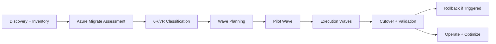

# Migration Strategies and Azure Migrate Architecture

## Overview
This page covers architect-level migration strategy decisions for enterprise programs: 6Rs/7Rs, discovery, dependency mapping, Azure Migrate usage, wave planning, cutover, rollback, governance, security, and post-migration optimization.

## Why this topic matters
In senior interviews, migration is evaluated as a business-risk transformation problem, not a pure technical move. Strong answers must balance speed, modernization value, resilience, compliance, and cost.

## Core concepts
- 6Rs/7Rs migration strategy model
- Discovery and dependency mapping
- Azure Migrate assessments and readiness
- Wave-based migration operating model
- Application and database migration patterns
- Cutover and rollback architecture
- Security, governance, and compliance in transition
- HA/DR and business continuity during migration
- TCO and operational readiness after go-live

## Detailed explanation of each concept
Migration strategy must begin with business outcomes and risk appetite, then map workloads to the right path (rehost, replatform, refactor, repurchase, retire, retain). Discovery is mandatory because hidden dependencies are the main source of migration failures. Azure Migrate provides evidence for readiness and sizing, but architects must combine tool outputs with business, compliance, and operations constraints.

Wave-based execution is the safest enterprise approach because it creates learning loops and controlled blast radius. Application and data migration patterns must be selected per workload behavior and downtime tolerance. Cutover and rollback cannot be left as project-end tasks; they must be designed from day one with objective trigger criteria. Governance, identity, and security controls should remain consistent throughout transition-state architecture. Success is measured not only by move completion, but by stable operations, cost transparency, and resilience after migration.

## Evaluation (How to assess architecture quality)
- Percentage of applications with strategy classification (6R/7R) approved
- Dependency mapping completeness rate
- Migration wave success rate and rollback frequency
- Cutover downtime against target
- Post-migration incident rate and recovery time
- Policy/security compliance variance during migration
- Target-state cost and performance variance against plan

## Architecture / flow diagram


**Flow explanation:**  
Discovery and assessment feed strategy selection. Strategy drives wave planning and pilot validation. Execution proceeds in controlled waves with explicit cutover and rollback controls, then transitions into optimization.

## Real-world example
A large enterprise with 350 workloads used Azure Migrate for inventory and dependency insights, then classified workloads by 7Rs. They started with low-risk pilots, then moved to domain-based waves. Tier-1 systems used parallel-run and phased cutover with rollback thresholds. Security and policy controls were enforced through the landing zone baseline. Post-migration, they optimized cost and availability by right-sizing and service modernization.

## Best practices
- Use business-value and risk criteria, not only technical readiness
- Run pilot wave before major business-critical waves
- Keep transition-state architecture explicit and temporary
- Design cutover and rollback criteria before migration start
- Keep identity and security controls consistent across environments
- Track wave metrics and update playbooks between waves

## Common mistakes / misconceptions
- Treating all workloads as rehost by default
- Ignoring hidden dependencies and shared data paths
- Big-bang migration without rollback rehearsals
- Underestimating operational readiness and support model changes
- Assuming tool assessments are final architecture decisions

## Industry relevance
Migration architecture is a top interview area for senior architects because it demonstrates cross-functional leadership across technology, operations, governance, and business strategy.

## Interview discussion points
- How to choose replatform over refactor pragmatically
- How to minimize downtime during cutover
- How to migrate interdependent systems safely
- How to prevent migration from becoming long-term technical debt
- How to prove migration outcomes with measurable indicators

## Links to dependent / related topics
- [Migration Architecture Master](./migration_architecture_master.md)
- [Enterprise Azure Foundation](../cloud-architecture/enterprise_azure_foundation_landing_zone.md)
- [System Design HLD/LLD](../system-design/system_design_hld_lld.md)
- [Compute Architecture](../compute/compute_architecture.md)
- [CI/CD in Azure DevOps](../azure/cicd_azure_devops.md)

## Interview Questions (50)
1. How do you choose between rehost, replatform, and refactor?
2. What are the 6Rs/7Rs and how do they drive strategy?
3. When is rehost the right business decision?
4. When is replatform better than rehost?
5. When is refactor justified despite higher cost?
6. How do repurchase, retire, and retain decisions work?
7. How do you assess application criticality for migration?
8. How do you perform dependency mapping effectively?
9. Why do migration programs fail due to hidden dependencies?
10. How do you use Azure Migrate in discovery and planning?
11. What does Azure Migrate assessment not tell you?
12. How do you prioritize migration waves?
13. What is a pilot wave and how do you define it?
14. How do you design wave acceptance criteria?
15. How do you manage cross-team coordination in wave migration?
16. How do you migrate monolith applications safely?
17. How do you use strangler pattern in modernization?
18. How do you handle session/state during app migration?
19. How do you modernize API contracts during migration?
20. How do you decide containerization during migration?
21. How do you approach homogeneous database migration?
22. How do you approach heterogeneous database migration?
23. Online vs offline migration: how do you decide?
24. How does CDC help in low-downtime migration?
25. How do you handle schema conversion and validation?
26. How do you validate data correctness after migration?
27. How do you design phased cutover for data platforms?
28. How do you define cutover readiness?
29. How do you minimize downtime during cutover?
30. How do you design rollback strategy for migration failure?
31. How do you set rollback trigger thresholds?
32. How do you test rollback before go-live?
33. How do you maintain security and compliance during migration?
34. How do you migrate identity and access controls?
35. How do you design network connectivity for migration?
36. How do you choose ExpressRoute vs VPN in migration phase?
37. How do you keep governance consistent across source and target?
38. How do you manage HA/DR during transition?
39. How do you align migration with business continuity goals?
40. How do you perform TCO comparison pre/post migration?
41. How do you handle operational readiness before cutover?
42. How do you structure migration documentation and blueprints?
43. How do you run stakeholder workshops for migration alignment?
44. How do you govern delivery in multi-wave migration programs?
45. How do you handle advanced compliance requirements in migration?
46. How do you migrate complex hybrid scenarios incrementally?
47. How do you manage multi-region migration strategy?
48. How do you measure migration success after go-live?
49. How do you optimize migrated workloads post-cutover?
50. How do you conclude migration architecture answers in interviews?

## Answers for important questions (Summary + Crisp + Deep)

### Q1. How do you choose between rehost, replatform, and refactor?
**Question summary:** Core strategy decision balancing speed, value, and risk.  
**Crisp answer (7-8 lines):** Rehost is fastest and lowest disruption. Replatform adds moderate cloud optimization with limited code change. Refactor redesigns for cloud-native outcomes and highest long-term value. Choose based on business urgency, technical debt, team capability, and risk tolerance. Rehost for deadlines, replatform for pragmatic improvement, refactor for strategic differentiation. Use portfolio criteria, not opinion. Revisit decisions by wave outcomes.  
**Deep explanation:** Strategy selection works best when you evaluate each application against explicit business and technical dimensions instead of using a single migration default. Rehost is useful when timeline pressure is dominant, such as data center exit or contract deadlines, and the business accepts that some inefficiencies remain in the short term. Replatform is a better fit when moderate engineering effort can unlock immediate operational gains, like managed databases, stronger autoscaling, or simpler patching and support operations. Refactor is justified when the current architecture blocks product velocity, reliability targets, security controls, or scale requirements, and when the organization can absorb transformation effort in exchange for long-term value. A strong architect answer also explains sequencing, because many portfolios intentionally start with rehost for selected systems and then replatform or refactor in later waves. Decision quality improves when teams use a scorecard with criteria such as business criticality, technical debt severity, release cadence needs, compliance constraints, and expected lifecycle horizon. This approach creates consistency, reduces subjective bias, and gives leadership a transparent rationale for investment trade-offs.  
**Answer summary:**  
- Select migration path per workload using objective criteria, not team preference.  
- Rehost optimizes speed, replatform balances speed and improvement, refactor maximizes long-term architecture value.  
- Use governance scorecards and wave feedback to revisit decisions as program evidence matures.  
**Simple diagram:**  
```text
Urgency high -> Rehost | Balanced -> Replatform | Strategic modernize -> Refactor
```
**Trusted reference links:**  
- https://learn.microsoft.com/en-us/azure/cloud-adoption-framework/migrate/

### Q2. What are the 6Rs/7Rs and how do they drive strategy?
**Question summary:** Portfolio strategy framework.  
**Crisp answer (7-8 lines):** The Rs are rehost, replatform, refactor/rearchitect, repurchase, retire, retain, and sometimes relocate. They provide a classification model for migration decisions. Each application gets mapped to one path based on constraints and value. This avoids random migration choices. It supports phased planning and budget clarity. It also improves stakeholder communication.  
**Deep explanation:** The 6Rs/7Rs model is most valuable because it creates a shared decision language across business, architecture, security, and delivery teams. Without this model, migration programs often drift into ad hoc choices driven by deadlines, vendor pressure, or local team preferences. By mapping every application to a strategy category, you can forecast cost, risk, skill needs, and delivery timeline more realistically. It also improves wave design because you can intentionally mix low-risk and moderate-risk workloads instead of accidentally stacking a wave with high-complexity transitions. Another benefit is governance transparency: leaders can review why a system is being retained, retired, or modernized and can challenge assumptions with clear evidence. Strong architect-level framing includes the idea that strategy classifications are not permanent labels; they should be revisited as dependencies change, business priorities shift, and pilot wave learnings expose new constraints or opportunities.  
**Answer summary:**  
- 6R/7R is a portfolio governance framework, not just migration terminology.  
- It improves planning quality, risk balancing, and cross-stakeholder decision transparency.  
- Classifications should be reviewed over time based on real migration evidence.  
**Simple diagram:**  
```text
Assess app -> Map to R -> Plan wave -> Execute
```
**Trusted reference links:**  
- https://learn.microsoft.com/en-us/azure/cloud-adoption-framework/migrate/

### Q3. When is rehost the right business decision?
**Question summary:** Rehost suitability criteria.  
**Crisp answer (7-8 lines):** Rehost is right when speed is critical and change risk must stay low. It suits datacenter exit timelines and stable legacy systems. It is useful when team capacity for redesign is limited. It preserves existing behavior with minimum transformation. It should be treated as transitional for debt-heavy systems. Pair with post-migration optimization plan.  
**Deep explanation:** Rehost is the correct decision when business urgency is high and architecture change risk must be tightly controlled in the current phase. Typical scenarios include hard data center closure deadlines, urgent regulatory infrastructure changes, or limited engineering bandwidth during a broader transformation program. It is important to communicate that rehost can protect continuity but usually does not remove structural inefficiencies such as heavy operations overhead, tight coupling, or limited elasticity. Because of this, mature teams treat rehost as a managed transition state rather than an automatic end state. A strong decision model includes explicit checkpoints after stabilization to assess whether replatform or refactor should follow for selected systems. Interview-quality answers also mention operational guardrails after rehost, including right-sizing, security baseline hardening, and incident trend reviews so cost and reliability do not degrade silently.  
**Answer summary:**  
- Rehost is best for speed and continuity when change risk must stay low.  
- It should be planned as a transition strategy for systems with remaining architecture debt.  
- Post-rehost checkpoints are necessary to trigger optimization or deeper modernization.  
**Simple diagram:**  
```text
As-is move now -> optimize later
```
**Trusted reference links:**  
- https://learn.microsoft.com/en-us/azure/cloud-adoption-framework/migrate/azure-best-practices/contoso-migration-strategy-and-process

### Q4. When is replatform better than rehost?
**Question summary:** Mid-path modernization strategy.  
**Crisp answer (7-8 lines):** Replatform is better when moderate change can yield major operational gain. Examples include managed DB migration, runtime upgrades, or autoscaling improvements. It balances modernization and delivery speed. It reduces some legacy burden without full redesign. Use it when business wants measurable improvement with controlled risk. Confirm compatibility and rollback path.  
**Deep explanation:** Replatform is strongest when targeted platform changes can improve reliability, security, or cost without rewriting core business logic. Common examples include moving to managed database services, adopting platform-native autoscaling, externalizing configuration and secrets, or upgrading runtime components to supported versions. This path is often attractive because it delivers visible operational improvements while keeping delivery risk lower than a full redesign. However, architects should define strict scope boundaries so the initiative does not expand into an unplanned refactor that misses timeline commitments. Good governance includes an explicit definition of what is in-scope for replatform, measurable success criteria, and decision gates for any scope escalation. In interviews, calling out this boundary discipline is a strong signal that you can protect both business commitments and architecture integrity.  
**Answer summary:**  
- Replatform is the middle path for high-impact platform improvements with limited code change.  
- It improves operations quickly while controlling transformation complexity.  
- Success depends on strict scope boundaries and measurable outcome gates.  
**Simple diagram:**  
```text
Partial modernization -> improved ops/cost without full rewrite
```
**Trusted reference links:**  
- https://learn.microsoft.com/en-us/azure/cloud-adoption-framework/migrate/

### Q5. When is refactor justified despite higher cost?
**Question summary:** Strategic modernization trigger.  
**Crisp answer (7-8 lines):** Refactor is justified when current architecture blocks growth, resilience, or release agility. It is warranted for high-value systems with long business life. Use when technical debt risk exceeds transformation risk. Require clear business case and phased execution. Tie outcomes to measurable KPIs. Avoid speculative refactors without value proof.  
**Deep explanation:** Refactor is justified when the existing system architecture structurally limits business outcomes and those limitations cannot be solved with incremental platform tuning. Indicators include recurring reliability incidents from tight coupling, inability to scale specific workloads independently, slow release cycles due to monolithic deployment constraints, or compliance requirements that require architectural separation and stronger control boundaries. Because refactor carries high complexity, the decision needs a robust business case linked to measurable outcomes such as reduced incident frequency, faster lead time, improved recovery objectives, or lower long-term operating cost. Strong migration programs execute refactor with phased transition patterns like strangler or capability-by-capability decomposition rather than big-bang replacement. Architects should also discuss coexistence complexity, data contract evolution, and operational readiness during transition to show practical delivery maturity.  
**Answer summary:**  
- Refactor is for strategic systems where architecture debt blocks business and operational outcomes.  
- It requires explicit ROI, phased transition design, and strong governance controls.  
- Use refactor when long-term value clearly outweighs short-term transformation cost and risk.  
**Simple diagram:**  
```text
High strategic value + high debt -> Refactor
```
**Trusted reference links:**  
- https://learn.microsoft.com/en-us/azure/architecture/guide/architecture-styles/

### Q6. How do repurchase, retire, and retain decisions work?
**Question summary:** Non-build migration options.  
**Crisp answer (7-8 lines):** Repurchase replaces custom software with SaaS where it improves value and speed. Retire removes low-value or unused systems. Retain keeps systems on-prem temporarily due to constraints. These decisions reduce wasted migration effort. They require business and compliance validation. Review retained systems periodically.  
**Deep explanation:** Repurchase, retire, and retain decisions are critical because they prevent migration programs from wasting effort on low-value transitions. Repurchase is valuable when SaaS offerings provide stronger capabilities, faster feature evolution, and lower operations burden than continuing to run custom legacy solutions. Retire decisions free budget and delivery capacity by removing systems that no longer provide meaningful business value or that duplicate existing capabilities. Retain is appropriate when constraints such as latency, regulatory boundaries, third-party dependencies, or contractual limitations make immediate migration impractical. The key is to avoid turning retain into an indefinite holding state by defining revisit dates, trigger criteria, and accountable owners. Senior-level answers should emphasize that these categories are strategic business decisions, not technical leftovers.  
**Answer summary:**  
- Repurchase, retire, and retain optimize portfolio value by reducing unnecessary migration effort.  
- Retain decisions must include revisit governance to prevent long-term stagnation.  
- These are first-class strategy options that improve program focus and economics.  
**Simple diagram:**  
```text
Low value -> Retire | Better SaaS fit -> Repurchase | constrained -> Retain
```
**Trusted reference links:**  
- https://learn.microsoft.com/en-us/azure/cloud-adoption-framework/migrate/

### Q7. How do you assess application criticality for migration?
**Question summary:** Criticality-based prioritization model.  
**Crisp answer (7-8 lines):** Evaluate revenue impact, customer impact, compliance exposure, and operational dependency. Classify systems into criticality tiers. Map tiers to migration sequencing and controls. Higher criticality requires deeper testing and safer cutover strategy. Include incident history and RTO/RPO needs. Reassess criticality during program evolution.  
**Deep explanation:** Application criticality assessment should combine business impact, technical dependency, compliance exposure, and recovery expectations into one classification model. Business impact includes customer-facing disruption, revenue effects, and legal/regulatory consequences of downtime or data issues. Technical criticality includes dependency centrality, coupling complexity, and historical incident behavior. This classification should directly influence migration plan decisions such as wave placement, test depth, rollback rehearsal intensity, and approval gates. Critical systems typically require stronger observability baselines, stricter cutover criteria, and longer stabilization windows than low-impact systems. Strong architecture communication links criticality tiers to concrete execution controls so governance is evidence-driven rather than subjective.  
**Answer summary:**  
- Criticality must reflect both business consequence and technical dependency risk.  
- Tiering should directly drive testing depth, sequencing, and rollback rigor.  
- Clear criticality mapping improves governance quality and migration predictability.  
**Simple diagram:**  
```text
Criticality tier -> migration controls and sequence
```
**Trusted reference links:**  
- https://learn.microsoft.com/en-us/azure/architecture/framework/reliability/

### Q8. How do you perform dependency mapping effectively?
**Question summary:** Dependency discovery method.  
**Crisp answer (7-8 lines):** Combine tool-based discovery with architecture interviews and runtime telemetry. Map app-to-app, app-to-data, and shared service dependencies. Include identity, DNS, batch jobs, and external integrations. Validate with SMEs and logs. Update maps continuously across waves. Treat dependency map as migration control artifact.  
**Deep explanation:** Effective dependency mapping is not a one-time diagram exercise; it is a continuously refined control artifact that evolves across migration waves. It should combine automated discovery outputs with runtime telemetry, architecture walkthroughs, and operational interviews to capture hidden interfaces. Beyond application calls, the map must include identity providers, DNS resolution paths, certificate dependencies, scheduler jobs, shared files, and downstream reporting or analytics consumers. Dependency criticality should be ranked so wave design can isolate high-risk coupling clusters and avoid unsafe partial cutovers. Leading teams connect dependency map completeness to wave entry criteria, which prevents schedule pressure from bypassing unresolved integration risks. In architect interviews, this level of depth shows real-world delivery experience rather than theoretical migration planning.  
**Answer summary:**  
- Build dependencies as a living, multi-source, cross-functional artifact.  
- Include hidden operational dependencies, not just service-to-service calls.  
- Tie dependency completeness directly to wave readiness and cutover safety.  
**Simple diagram:**  
```text
Discovery + telemetry + SME validation -> dependency graph
```
**Trusted reference links:**  
- https://learn.microsoft.com/en-us/azure/migrate/migrate-services-overview

### Q9. Why do migration programs fail due to hidden dependencies?
**Question summary:** Root-cause pattern in failed migrations.  
**Crisp answer (7-8 lines):** Hidden dependencies break cutover assumptions. Teams often migrate primary app components but miss supporting systems. This causes runtime failures, latency spikes, or auth issues. Dependencies outside source code are often overlooked. Lack of validation windows amplifies impact. Prevent through layered discovery and rehearsal.  
**Deep explanation:** Hidden dependencies fail migrations because cutover plans often assume the visible application path is the full system boundary, which is rarely true in enterprise environments. Critical hidden dependencies commonly include hardcoded endpoints, shared legacy databases, undocumented file-transfer paths, identity trust relationships, scheduled jobs, and reporting pipelines. When these are missed, post-cutover behavior can appear healthy initially and then fail under specific business workflows, making incident diagnosis slower and more expensive. Prevention requires layered detection: tooling discovery, telemetry correlation, SME interviews, and rehearsal-based validation of complete business transactions. Architects should also highlight that rollback quality depends on dependency clarity; unknown dependencies make rollback timing uncertain and increase outage duration.  
**Answer summary:**  
- Hidden dependencies create false cutover confidence and delayed production failures.  
- Prevention requires layered discovery and end-to-end rehearsal, not tooling alone.  
- Dependency clarity is essential for both successful cutover and fast rollback.  
**Simple diagram:**  
```text
Unmapped dependency -> cutover failure path
```
**Trusted reference links:**  
- https://learn.microsoft.com/en-us/azure/cloud-adoption-framework/migrate/

### Q10. How do you use Azure Migrate in discovery and planning?
**Question summary:** Azure Migrate practical role.  
**Crisp answer (7-8 lines):** Use Azure Migrate for inventory, readiness, dependency visibility, and sizing insights. Feed outputs into strategy classification and wave planning. Validate assumptions with architecture review. Use assessment reports for stakeholder alignment. Re-run assessments after remediation or major changes. Keep evidence traceable in decision records.  
**Deep explanation:** Azure Migrate should be positioned as an evidence engine that improves migration planning fidelity by reducing uncertainty in inventory, readiness, dependency, and sizing assumptions. The strongest usage model is to feed assessment outputs directly into architecture decision forums, where workload strategy classification and wave sequencing are finalized. Tool output should be cross-checked with business criticality, compliance constraints, and support model readiness before commitment. It is also important to re-run assessments after remediation actions, because migration feasibility and sizing recommendations can change materially after dependency cleanup or platform upgrades. Architect-level answers should mention that assessment evidence improves stakeholder trust when tied to transparent assumptions and tracked decision records.  
**Answer summary:**  
- Azure Migrate provides critical discovery evidence for strategy and wave planning.  
- Its outputs must be combined with business and governance context before decisions.  
- Reassessment and decision traceability are key to reliable migration planning.  
**Simple diagram:**  
```text
Assessment outputs -> strategy mapping -> wave plan
```
**Trusted reference links:**  
- https://learn.microsoft.com/en-us/azure/migrate/

### Q11. What does Azure Migrate assessment not tell you?
**Question summary:** Limits of assessment tooling.  
**Crisp answer (7-8 lines):** It does not fully capture business criticality, organizational readiness, compliance constraints, and support model maturity. It may miss contextual architecture intent. It does not replace stakeholder decision-making. It provides technical evidence, not complete strategy. Use it with governance and business inputs. Validate with pilots.  
**Deep explanation:** Azure Migrate assessments are strong at technical discovery, but they do not capture organizational constraints that often determine migration success or failure. For example, a workload may appear technically “ready” but still be blocked by licensing terms, support-team capability, data residency controls, or business freeze periods. Assessment tools also cannot fully evaluate transition complexity caused by undocumented human processes such as manual reconciliation jobs or end-of-month operational dependencies. Senior architects should explicitly show how assessment output is combined with business criticality, compliance obligations, and operating model readiness before deciding strategy and wave sequencing. This framing demonstrates that you use tooling as evidence, not as an automatic decision engine.  
**Answer summary:**  
- Assessment output is necessary technical input, but not complete migration truth.  
- Final strategy must include business, compliance, and operational readiness factors.  
- Strong decisions come from combining tool evidence with architect judgment and governance review.  
**Simple diagram:**  
```text
Tool data + business/compliance context = final decision
```
**Trusted reference links:**  
- https://learn.microsoft.com/en-us/azure/migrate/migrate-appliance

### Q12. How do you prioritize migration waves?
**Question summary:** Wave sequencing strategy.  
**Crisp answer (7-8 lines):** Start with low-risk, representative workloads for pilot learning. Sequence by dependency clusters and business timelines. Avoid first-wave inclusion of unstable critical systems. Balance business value and risk in each wave. Keep rollback feasibility as a wave gate. Re-tune sequencing using wave outcomes.  
**Deep explanation:** Wave prioritization should optimize both delivery momentum and risk containment. Early waves should include representative but lower-risk applications so teams validate landing zone controls, cutover runbooks, observability, and incident response without exposing critical business services. As confidence increases, waves can include more complex systems, but only when dependency mapping, rollback readiness, and support ownership are proven. Good architects avoid two extremes: moving too slowly with excessive caution, or moving too fast by loading critical systems before controls are mature. Wave design should be re-evaluated after each execution cycle using evidence from defects, rollback events, and post-cutover stability.  
**Answer summary:**  
- Start with learning-oriented waves, then scale complexity based on evidence.  
- Use dependency and rollback readiness as hard sequencing constraints.  
- Continuously re-prioritize waves from actual outcomes, not static plans.  
**Simple diagram:**  
```text
Pilot -> controlled waves -> critical waves
```
**Trusted reference links:**  
- https://learn.microsoft.com/en-us/azure/cloud-adoption-framework/migrate/plan-migration

### Q13. What is a pilot wave and how do you define it?
**Question summary:** Pilot wave design fundamentals.  
**Crisp answer (7-8 lines):** Pilot wave is a low-risk migration batch used to validate platform, process, and runbooks. Choose apps that represent common patterns but limited business impact. Define success criteria across technical and operational dimensions. Capture lessons and update standards. Do not treat pilot as optional.  
**Deep explanation:** A pilot wave is a controlled migration experiment that validates whether your platform and operating model are truly ready for scale. It should test technical controls (network, identity, policy, observability), operational readiness (runbooks, on-call, escalation), and governance flow (approvals, exception handling, evidence capture). Pilot selection should avoid business-critical blast radius while still representing common migration patterns so learnings are transferable. The most important indicator of a good pilot is whether it changes standards, checklists, and sequencing for subsequent waves. If pilot output does not materially improve the program approach, it was likely too shallow or poorly scoped.  
**Answer summary:**  
- Pilot wave validates platform, process, and governance in a low-risk setting.  
- It must be representative enough to produce reusable standards.  
- Pilot success is measured by actionable improvements to later waves.  
**Simple diagram:**  
```text
Pilot validation -> standard updates -> scale
```
**Trusted reference links:**  
- https://learn.microsoft.com/en-us/azure/cloud-adoption-framework/migrate/

### Q14. How do you design wave acceptance criteria?
**Question summary:** Objective wave go/no-go controls.  
**Crisp answer (7-8 lines):** Define readiness criteria for dependency validation, security controls, performance baseline, rollback readiness, and operational ownership. Include business acceptance criteria for service continuity. Set measurable thresholds before execution. Require evidence for each criterion. Keep exception process explicit.  
**Deep explanation:** Wave acceptance criteria should act as objective gates that protect business continuity under delivery pressure. Effective criteria include technical readiness (dependency validation, performance baseline, security controls), operational readiness (monitoring, runbooks, ownership), and business readiness (stakeholder signoff, communication plans, support windows). Each criterion should have measurable thresholds and required evidence artifacts, not subjective statements like “team is confident.” Mature programs also define who can approve exceptions and under what risk conditions. This approach makes wave decisions predictable, auditable, and less vulnerable to schedule-driven risk acceptance.  
**Answer summary:**  
- Acceptance criteria must combine technical, operational, and business readiness checks.  
- Every gate needs measurable thresholds and explicit evidence.  
- Exception handling must be governed so timelines do not override risk controls.  
**Simple diagram:**  
```text
Criteria met -> go | criteria gap -> hold/remediate
```
**Trusted reference links:**  
- https://learn.microsoft.com/en-us/azure/well-architected/operational-excellence/

### Q15. How do you manage cross-team coordination in wave migration?
**Question summary:** Program governance during migration.  
**Crisp answer (7-8 lines):** Use RACI model and wave command cadence. Assign clear owners for app, data, network, security, and operations. Track dependencies and blockers in shared control board. Run pre-cutover and post-cutover checkpoints. Keep escalation path short. Capture decisions in architecture records.  
**Deep explanation:** Cross-team coordination is usually the hardest part of enterprise migration because dependencies span application, data, network, security, and operations teams with different priorities. A strong operating model uses clear role boundaries, fixed decision cadence, shared risk board, and explicit escalation paths for blockers that threaten wave timelines. Coordination also requires a single source of truth for dependencies, readiness evidence, and go/no-go status so teams are not working from conflicting assumptions. Senior architects should describe how decisions are logged, how unresolved risks are surfaced, and how accountability is enforced. This demonstrates leadership of complex programs, not just technical design skill.  
**Answer summary:**  
- Define explicit ownership and governance cadence across all participating teams.  
- Use shared decision artifacts and risk visibility to avoid coordination drift.  
- Fast escalation and accountability are essential for predictable wave execution.  
**Simple diagram:**  
```text
Teams + RACI + wave cadence -> coordinated execution
```
**Trusted reference links:**  
- https://learn.microsoft.com/en-us/azure/cloud-adoption-framework/

### Q16. How do you migrate monolith applications safely?
**Question summary:** Monolith migration risk control.  
**Crisp answer (7-8 lines):** Start with stability and observability baseline. Choose rehost/replatform first if business risk is high. Isolate high-change modules for phased modernization. Protect state and session behavior during transition. Use staged traffic and rollback controls. Avoid big-bang decomposition without evidence.  
**Deep explanation:** Monolith migration should prioritize stability first, then modernization in controlled increments. The first phase often focuses on runtime stabilization, observability improvements, and infrastructure migration with minimal functional change so incident risk stays manageable. Once baseline stability is proven, teams can incrementally extract high-change domains or bottleneck components using interface boundaries and traffic controls. Attempting full decomposition under aggressive timelines typically creates coordination failure, hidden dependency issues, and prolonged production instability. A senior answer should include coexistence design, state handling, and rollback-safe rollout patterns.  
**Answer summary:**  
- Stabilize monolith operations before attempting deep structural change.  
- Use incremental extraction for high-value domains instead of big-bang decomposition.  
- Coexistence and rollback controls are mandatory during modernization phases.  
**Simple diagram:**  
```text
Stabilize monolith -> gradual modernization
```
**Trusted reference links:**  
- https://learn.microsoft.com/en-us/azure/architecture/guide/architecture-styles/

### Q17. How do you use strangler pattern in modernization?
**Question summary:** Incremental replacement architecture.  
**Crisp answer (7-8 lines):** Route selected capabilities from legacy to new services gradually. Keep coexistence window controlled. Use API gateway/routing layer for traffic steering. Measure behavior parity before expansion. Retire legacy slices incrementally. Prevent prolonged dual-write complexity with explicit milestones.  
**Deep explanation:** The strangler pattern works by introducing a controlled routing layer that progressively redirects specific capabilities from the legacy system to modern services. This approach reduces risk because each increment is small enough to test, monitor, and roll back if needed. Success depends on strict interface governance, compatibility testing, and telemetry that confirms behavioral parity between legacy and new paths. The most common failure mode is indefinite coexistence where temporary bridges become permanent complexity; to avoid this, architects should define retirement milestones and explicit exit criteria from the start.  
**Answer summary:**  
- Strangler enables low-risk capability-by-capability modernization.  
- Routing control and parity observability are central to safe rollout.  
- Define retirement milestones early to prevent long-term hybrid debt.  
**Simple diagram:**  
```text
Legacy facade -> route capability by capability to new services
```
**Trusted reference links:**  
- https://learn.microsoft.com/en-us/azure/architecture/patterns/strangler-fig

### Q18. How do you handle session/state during app migration?
**Question summary:** Stateful behavior transition.  
**Crisp answer (7-8 lines):** Externalize session state to shared, resilient store where possible. Plan compatibility between old and new session formats. Use sticky sessions only when unavoidable and temporary. Validate session timeout and security behavior. Test failover and cutback scenarios. Keep migration window controlled.  
**Deep explanation:** Session and state behavior is a frequent hidden risk during migration because old and new components may encode user context differently. If compatibility is not planned, users may experience random logouts, inconsistent transactions, or broken multi-step workflows after cutover. Architects should define where state lives, how formats are versioned, how timeout/security settings are aligned, and how failback affects active sessions. Testing must include real user journeys and edge cases such as partial failures and retries. This depth shows practical readiness for production transition risk.  
**Answer summary:**  
- State strategy must be explicit across old and new components.  
- Compatibility, timeout, and failback behavior should be validated end-to-end.  
- Session handling quality directly affects user-facing migration stability.  
**Simple diagram:**  
```text
Old/new app nodes -> shared session/state store
```
**Trusted reference links:**  
- https://learn.microsoft.com/en-us/azure/architecture/best-practices/caching

### Q19. How do you modernize API contracts during migration?
**Question summary:** API evolution without consumer breakage.  
**Crisp answer (7-8 lines):** Use backward-compatible contract changes first. Introduce versioning policy and deprecation timeline. Monitor consumer migration progress. Keep old and new contracts in coexistence window. Validate security and performance parity. Remove legacy contracts only after readiness thresholds.  
**Deep explanation:** API contract modernization succeeds when technical versioning is paired with consumer migration governance. Teams should introduce additive, backward-compatible changes first, then manage deprecation timelines with clear communication and usage telemetry. Consumer adoption progress must be measured so old versions are retired only when risk is acceptable. Security, throttling, and observability behavior should remain consistent across versions to avoid non-functional regressions. Strong architect answers emphasize that contract evolution is ecosystem change management, not just endpoint implementation.  
**Answer summary:**  
- Use backward-compatible evolution and staged deprecation instead of abrupt contract breaks.  
- Track consumer migration with telemetry before retiring legacy versions.  
- Treat API modernization as governance and adoption program, not only coding work.  
**Simple diagram:**  
```text
v1 + v2 coexist -> consumer migrate -> v1 retire
```
**Trusted reference links:**  
- https://learn.microsoft.com/en-us/azure/architecture/best-practices/api-design

### Q20. How do you decide containerization during migration?
**Question summary:** Containerization decision boundary.  
**Crisp answer (7-8 lines):** Containerize when packaging consistency and deployment portability add clear value. Avoid forced containerization for stable systems with low change frequency. Assess runtime constraints, ops maturity, and security controls. Start with suitable stateless workloads. Keep rollback simple.  
**Deep explanation:** Containerization should be selected when it solves concrete migration problems such as environment consistency, release portability, or platform standardization across teams. It is not automatically the right move for every workload, especially if the application is stable, low-change, and currently well-supported. Introducing containers without operational maturity can increase complexity through cluster governance, security scanning, and runtime troubleshooting demands. Architects should evaluate application fit, team skills, compliance requirements, and rollback options before deciding. The decision should be outcome-based and phased, not trend-driven.  
**Answer summary:**  
- Containerization is a strategic option, not a mandatory migration step.  
- Choose it when delivery and operations outcomes clearly improve.  
- Validate team/platform readiness to avoid adding unmanaged complexity.  
**Simple diagram:**  
```text
Workload fit + team readiness -> containerize decision
```
**Trusted reference links:**  
- https://learn.microsoft.com/en-us/azure/architecture/guide/technology-choices/compute-decision-tree

### Q21. How do you approach homogeneous database migration?
**Question summary:** Same-engine DB migration approach.  
**Crisp answer (7-8 lines):** Use like-to-like engine migration with schema compatibility checks. Plan replication/backup strategy based on downtime target. Validate performance after move. Keep rollback path through source continuity until stabilization. Run reconciliation checks.  
**Deep explanation:** Homogeneous database migration is generally lower risk because source and target engines share behavior patterns, but operational risk still remains significant. Performance may change due to infrastructure differences, indexing drift, storage layout, or network latency effects after migration. Teams should validate not only schema compatibility but also transaction behavior, batch processing windows, and query-plan stability under realistic workload. A disciplined rollback path is required until post-cutover stability is confirmed. Strong architect answers show that “same engine” does not mean “no migration risk.”  
**Answer summary:**  
- Homogeneous migration reduces compatibility risk but not operational risk.  
- Performance and workload behavior must be validated under production-like conditions.  
- Keep rollback and reconciliation controls active through stabilization window.  
**Simple diagram:**  
```text
DB engine A (source) -> DB engine A (target)
```
**Trusted reference links:**  
- https://learn.microsoft.com/en-us/azure/dms/dms-overview

### Q22. How do you approach heterogeneous database migration?
**Question summary:** Cross-engine migration complexity.  
**Crisp answer (7-8 lines):** Start with schema and data-type conversion assessment. Identify behavioral differences in transactions and queries. Use phased migration with compatibility testing. Validate application query behavior and performance early. Keep dual-run where needed for confidence. Plan longer stabilization window.  
**Deep explanation:** Heterogeneous migration introduces deeper risk because data types, SQL dialects, transaction semantics, indexing behavior, and optimizer characteristics can differ significantly between engines. Even when schema conversion tools accelerate translation, they cannot guarantee functional equivalence for stored procedures, complex queries, and edge-case transaction behavior. Architects should plan phased validation that includes application query testing, reconciliation checkpoints, and performance benchmarking under realistic load. Code adaptation effort and transition complexity should be budgeted early rather than discovered late in cutover preparation. This depth demonstrates mature understanding of platform transition risk.  
**Answer summary:**  
- Heterogeneous moves require semantic, functional, and performance compatibility engineering.  
- Tooling helps but does not eliminate manual validation and code adaptation.  
- Use phased execution with strong testing to control conversion risk.  
**Simple diagram:**  
```text
DB engine A -> schema/data transform -> DB engine B
```
**Trusted reference links:**  
- https://learn.microsoft.com/en-us/azure/dms/

### Q23. Online vs offline migration: how do you decide?
**Question summary:** Downtime strategy choice.  
**Crisp answer (7-8 lines):** Choose online migration when downtime tolerance is low and tooling supports continuous sync. Choose offline when downtime window is acceptable and complexity must be minimized. Evaluate data volume, change rate, and cutover risk. Include rollback complexity in decision.  
**Deep explanation:** Online versus offline migration is a trade-off between availability requirements and operational complexity. Online migration minimizes business interruption by keeping source and target synchronized, but it requires robust replication controls, lag monitoring, and more complex cutover orchestration. Offline migration is simpler to execute and can reduce synchronization failure modes, but it depends on business acceptance of planned downtime windows. The correct choice should be driven by service criticality, transaction rate, reconciliation requirements, and rollback constraints. Senior architects should explicitly show how stakeholders approve this trade-off with clear risk visibility.  
**Answer summary:**  
- Online mode favors availability but increases orchestration complexity.  
- Offline mode is simpler but requires accepted downtime windows.  
- Choose based on business impact, data-change profile, and rollback feasibility.  
**Simple diagram:**  
```text
Low downtime tolerance -> online | acceptable downtime -> offline
```
**Trusted reference links:**  
- https://learn.microsoft.com/en-us/azure/dms/

### Q24. How does CDC help in low-downtime migration?
**Question summary:** CDC role in data transition.  
**Crisp answer (7-8 lines):** CDC captures ongoing changes from source to target after initial load. It narrows cutover delta and downtime window. It supports phased validation before final switch. It enables rollback confidence while source remains active. Requires careful lag monitoring and data consistency checks.  
**Deep explanation:** CDC enables low-downtime migration by continuously capturing and replaying source changes after initial data load, which keeps target state close to production reality. This shrinks cutover delta and allows teams to validate data quality before final switch instead of relying on one large synchronization event. However, CDC success depends on strict monitoring of replication lag, handling of schema changes, and reconciliation of out-of-order or failed events. Architects should define lag thresholds, pause/freeze procedures, and rollback implications in advance. Including these controls in design demonstrates practical low-downtime execution maturity.  
**Answer summary:**  
- CDC keeps source and target aligned, reducing final cutover downtime.  
- It requires lag monitoring, reconciliation, and controlled freeze procedures.  
- CDC design quality directly affects cutover confidence and rollback safety.  
**Simple diagram:**  
```text
Initial load + CDC sync -> short cutover window
```
**Trusted reference links:**  
- https://learn.microsoft.com/en-us/azure/dms/tutorial-sql-server-azure-sql-online

### Q25. How do you handle schema conversion and validation?
**Question summary:** Schema migration assurance.  
**Crisp answer (7-8 lines):** Perform automated conversion, then manual review for incompatible constructs. Validate DDL behavior, constraints, indexes, and procedures. Run representative workload tests. Track schema exceptions with owners. Freeze schema changes during final cutover window.  
**Deep explanation:** Schema conversion is not complete when conversion scripts run successfully; it is complete when application behavior remains correct and performant under real usage. Automated tools accelerate baseline conversion, but manual review is needed for unsupported constructs, indexing strategy, constraints, and procedure logic. Teams should validate schema behavior with representative workload tests and maintain an issue register for conversion exceptions with clear owners and resolution deadlines. Architects should also include change-freeze strategy near cutover to avoid schema drift between validation and go-live. This prevents last-minute surprises that jeopardize migration windows.  
**Answer summary:**  
- Automation starts schema conversion; rigorous manual validation completes it.  
- Validate functional behavior and performance, not only DDL conversion success.  
- Track exceptions with ownership and protect cutover with schema freeze discipline.  
**Simple diagram:**  
```text
Convert schema -> validate behavior -> approve
```
**Trusted reference links:**  
- https://learn.microsoft.com/en-us/sql/ssma/sql-server-migration-assistant

### Q26. How do you validate data correctness after migration?
**Question summary:** Data reconciliation strategy.  
**Crisp answer (7-8 lines):** Use row counts, checksums, sampling, and business-critical query validation. Compare source and target by priority datasets. Validate reference integrity and key reports. Automate reconciliation where possible. Define acceptable variance thresholds.  
**Deep explanation:** Data correctness validation should combine technical reconciliation and business process verification to ensure migration did not alter operational truth. Technical checks include row counts, checksums, key integrity, and null/default consistency, while business checks validate critical reports, financial aggregates, and workflow outcomes used by end users. Validation should be risk-weighted, with deeper checks on high-value datasets and regulated records. Architects should define acceptable variance thresholds and escalation paths for discrepancies before cutover approval. This layered approach reduces the chance of “technically successful” migration that fails business trust.  
**Answer summary:**  
- Use layered reconciliation: technical integrity plus business outcome validation.  
- Prioritize high-value and regulated datasets for deeper checks.  
- Define variance thresholds and escalation rules before go-live decisions.  
**Simple diagram:**  
```text
Technical checks + business checks -> migration confidence
```
**Trusted reference links:**  
- https://learn.microsoft.com/en-us/azure/architecture/data-guide/relational-data/

### Q27. How do you design phased cutover for data platforms?
**Question summary:** Controlled data transition model.  
**Crisp answer (7-8 lines):** Use read-first cutover then write cutover where possible. Shift low-risk consumers first. Keep dual-read/compare windows for confidence. Limit phase durations with clear exit criteria. Track lag and query performance continuously.  
**Deep explanation:** Phased cutover allows controlled transition by moving read paths and write paths in planned stages rather than a single high-risk switch. This approach helps isolate issues, validate behavior progressively, and limit blast radius if regressions appear. It requires compatibility planning so old and new consumers can coexist temporarily without data inconsistency. Architects should define strict phase entry/exit criteria, telemetry dashboards, and maximum coexistence windows to avoid long-term hybrid complexity. A disciplined phased model improves resilience and operational confidence during migration.  
**Answer summary:**  
- Move consumers in controlled phases to reduce cutover risk and isolate issues.  
- Enforce compatibility and telemetry visibility during coexistence periods.  
- Use strict phase boundaries to prevent indefinite transition complexity.  
**Simple diagram:**  
```text
Read shift -> validate -> write shift -> finalize
```
**Trusted reference links:**  
- https://learn.microsoft.com/en-us/azure/architecture/patterns/

### Q28. How do you define cutover readiness?
**Question summary:** Cutover go/no-go criteria.  
**Crisp answer (7-8 lines):** Confirm dependency validation, security controls, performance baseline, support readiness, rollback drills, and stakeholder signoffs. Ensure data sync is within threshold. Verify monitoring and incident runbooks. Use objective pass criteria only.  
**Deep explanation:** Cutover readiness should be treated as a formal control gate where technical, operational, and business criteria are all met with evidence. Technical readiness includes dependency validation, performance baseline, and security control parity; operational readiness includes runbooks, monitoring, and on-call ownership; business readiness includes stakeholder communication and support coverage. Without objective readiness gates, programs often accept risk due to date pressure and create avoidable incidents. Architects should define clear approvers and escalation authority for unresolved criteria. This structure creates accountable and repeatable go/no-go decisions.  
**Answer summary:**  
- Readiness must include technical, operational, and business controls together.  
- Evidence-based gates prevent schedule pressure from overriding risk management.  
- Clear approvers and escalation rules are essential for reliable go/no-go decisions.  
**Simple diagram:**  
```text
Readiness gates all pass -> cutover proceed
```
**Trusted reference links:**  
- https://learn.microsoft.com/en-us/azure/well-architected/operational-excellence/

### Q29. How do you minimize downtime during cutover?
**Question summary:** Low-downtime execution strategy.  
**Crisp answer (7-8 lines):** Reduce delta with pre-sync mechanisms, freeze nonessential changes, and automate switch steps. Use DNS/traffic control with tested timings. Keep rollback path warm. Schedule for lowest business impact window. Rehearse end-to-end cutover sequence.  
**Deep explanation:** Downtime minimization is primarily a preparation problem, not a cutover-day improvisation problem. Teams should reduce switch-over delta through pre-sync approaches, automate repetitive cutover steps, and rehearse the full sequence with realistic timing assumptions. Communication planning is equally important so business teams, operations, and support channels are synchronized during the transition window. Architects should also define rollback decision points within the cutover timeline so recovery actions are timely if metrics degrade. This end-to-end discipline is what enables predictable low-downtime outcomes.  
**Answer summary:**  
- Pre-sync and automation reduce switch-time and human-error risk.  
- Rehearsal and communication planning are essential to predictable execution.  
- Define rollback checkpoints inside cutover timeline, not after failures escalate.  
**Simple diagram:**  
```text
Pre-sync -> short switch -> validate
```
**Trusted reference links:**  
- https://learn.microsoft.com/en-us/azure/cloud-adoption-framework/migrate/

### Q30. How do you design rollback strategy for migration failure?
**Question summary:** Failure containment and recovery.  
**Crisp answer (7-8 lines):** Define rollback path, triggers, ownership, and timing upfront. Keep source operational until stability window passes. Preserve reversible routing and data strategy. Automate rollback where possible. Validate service and data after rollback.  
**Deep explanation:** Rollback strategy should be engineered as a first-class migration path with explicit triggers, ownership, timing windows, and reversible architecture choices. Teams should preserve source operability until stability criteria are met, and they should avoid irreversible changes during the highest-risk cutover steps unless recovery alternatives are proven. Automated rollback procedures reduce response time and lower dependency on ad hoc human coordination under pressure. Architects should discuss how rollback interacts with data synchronization, routing, and stakeholder communication to avoid partial recovery states. This level of detail differentiates production-ready migration leadership from theoretical planning.  
**Answer summary:**  
- Rollback must be designed upfront with clear triggers and accountable ownership.  
- Keep reversible controls and source continuity until stabilization is proven.  
- Automation and tested data/routing recovery paths are critical for fast containment.  
**Simple diagram:**  
```text
Failure trigger -> revert routing/data path -> verify recovery
```
**Trusted reference links:**  
- https://learn.microsoft.com/en-us/azure/well-architected/reliability/testing

### Q31. How do you set rollback trigger thresholds?
**Question summary:** Objective rollback criteria design.  
**Crisp answer (7-8 lines):** Use thresholds for error rate, latency, failed transactions, data sync health, and business process failure. Define time windows and severity levels. Include manual override governance. Avoid vague “team confidence” criteria. Test trigger behavior in rehearsal.  
**Deep explanation:** Rollback thresholds should be quantified before cutover so incident decisions are fast, consistent, and defendable. Typical signals include sustained error-rate increase, latency breach, failed business transactions, replication lag, and critical workflow failure. Thresholds should include time windows and severity levels to avoid flapping on short-lived noise. Architects should define who can trigger rollback, who approves exceptions, and how decisions are communicated to stakeholders in real time. This governance design reduces delay and prevents prolonged customer impact during unstable cutovers.  
**Answer summary:**  
- Use measurable technical and business metrics as rollback triggers.  
- Add time windows and severity bands to avoid noisy or delayed decisions.  
- Define trigger ownership and communication workflow before migration day.  
**Simple diagram:**  
```text
Metric breach + duration -> rollback decision
```
**Trusted reference links:**  
- https://learn.microsoft.com/en-us/azure/architecture/framework/reliability/

### Q32. How do you test rollback before go-live?
**Question summary:** Rollback rehearsal method.  
**Crisp answer (7-8 lines):** Run full rollback simulation in pre-production with realistic data and routing. Measure recovery time and data integrity. Validate runbook clarity and role readiness. Fix gaps and rerun until stable. Treat rollback drill as mandatory gate.  
**Deep explanation:** Rollback testing should simulate realistic failure conditions, not just run a simplified script in an ideal environment. Effective rehearsal validates data restoration behavior, routing reversal, runbook clarity, and cross-team coordination under time pressure. It should measure recovery time against targets and capture evidence for unresolved gaps. Architects should require repeat drills until metrics and operational behavior meet defined standards. This ensures rollback is an executable control, not a document assumption.  
**Answer summary:**  
- Test rollback under realistic failure scenarios, not happy-path demos.  
- Measure recovery performance and fix runbook/coordination gaps iteratively.  
- Make rollback drill completion a mandatory cutover gate for critical systems.  
**Simple diagram:**  
```text
Mock cutover -> forced failure -> rollback drill
```
**Trusted reference links:**  
- https://learn.microsoft.com/en-us/azure/site-recovery/site-recovery-overview

### Q33. How do you maintain security and compliance during migration?
**Question summary:** Control continuity through transition.  
**Crisp answer (7-8 lines):** Apply same or stronger controls in target before migration. Enforce identity, policy, encryption, and logging baselines. Track temporary exceptions with expiry. Audit changes across source and target. Validate control evidence for compliance teams.  
**Deep explanation:** Security and compliance posture should be preserved or improved throughout migration, including coexistence phases where risk often increases. Target environments should enforce baseline controls (identity, encryption, logging, policy, private access) before workloads move, not after stabilization. Temporary exceptions may be necessary but must be time-bound, risk-accepted, and tracked to closure. Architects should provide audit evidence mapping for each wave so compliance teams can verify control continuity. This approach avoids creating an ungoverned transition window that later becomes an audit and incident liability.  
**Answer summary:**  
- Enforce baseline controls in target before migration activity begins.  
- Track temporary exceptions with expiry and accountable remediation.  
- Maintain audit evidence per wave to prove continuous compliance posture.  
**Simple diagram:**  
```text
Source controls -> target controls parity -> migration
```
**Trusted reference links:**  
- https://learn.microsoft.com/en-us/azure/compliance/

### Q34. How do you migrate identity and access controls?
**Question summary:** IAM transition architecture.  
**Crisp answer (7-8 lines):** Map current access models to target Entra ID/RBAC design. Remove excessive permissions during migration where feasible. Use group-based role assignments and least privilege. Validate critical access paths before cutover. Keep break-glass and rollback access paths ready.  
**Deep explanation:** Identity migration failures can block business operations even when application and data migration succeed. A robust IAM transition maps legacy roles to target Entra ID and RBAC models, removes unnecessary privileges, and validates critical access paths for users, services, and automation pipelines. Phased rollout reduces risk by proving access behavior in controlled scopes before broad cutover. Architects should include break-glass strategy, privileged access governance, and post-cutover access audits to ensure least privilege is sustained. This demonstrates security maturity during transformation.  
**Answer summary:**  
- Map and validate identity paths early; do not defer IAM to final cutover.  
- Use phased RBAC transition with least-privilege enforcement and audit checks.  
- Include emergency access and post-cutover access review controls.  
**Simple diagram:**  
```text
Legacy IAM map -> target RBAC groups -> validation
```
**Trusted reference links:**  
- https://learn.microsoft.com/en-us/azure/role-based-access-control/overview

### Q35. How do you design network connectivity for migration?
**Question summary:** Migration connectivity architecture.  
**Crisp answer (7-8 lines):** Build secure connectivity baseline early with hub-spoke and controlled routing. Define migration traffic paths and bandwidth needs. Separate migration-plane and production-plane traffic where needed. Validate DNS and identity dependencies. Include monitoring and failover design.  
**Deep explanation:** Migration connectivity design must support secure data movement, stable application paths, and predictable cutover behavior. Teams should define traffic classes, bandwidth requirements, routing boundaries, DNS strategy, and inspection points before execution waves begin. Connectivity should be phased so pilot and early waves validate assumptions before critical systems depend on them. Architects should also include monitoring for latency, packet loss, and route anomalies, because network instability can masquerade as application failure during migration. A dependency-aware network plan is essential for both timeline reliability and incident containment.  
**Answer summary:**  
- Build connectivity as a staged, governed migration capability, not a one-time setup.  
- Validate routing, DNS, and inspection behavior before critical wave execution.  
- Monitor network health continuously to separate platform and application risks.  
**Simple diagram:**  
```text
Source/DC <-> secure cloud transit <-> target workloads
```
**Trusted reference links:**  
- https://learn.microsoft.com/en-us/azure/architecture/reference-architectures/hybrid-networking/

### Q36. How do you choose ExpressRoute vs VPN in migration phase?
**Question summary:** Transitional connectivity choice.  
**Crisp answer (7-8 lines):** Choose ExpressRoute for sustained high-throughput, private, predictable enterprise migration. Choose VPN for rapid enablement or backup connectivity. Many programs use both. Decide with data volume, timeline, compliance, and cost. Validate failover and route policy early.  
**Deep explanation:** ExpressRoute versus VPN decisions during migration should account for both immediate transition needs and long-term operating model outcomes. ExpressRoute is often preferred for predictable throughput, private connectivity, and enterprise-grade reliability, while VPN offers faster setup and practical fallback paths. Many programs intentionally combine both for resilience, using clear route preference and tested failover behavior. Architects should tie this choice to data volume, compliance requirements, timeline constraints, and cost profile. This demonstrates balanced decision-making under real program pressures.  
**Answer summary:**  
- Select connectivity based on risk, throughput, compliance, and timeline needs.  
- Combine ExpressRoute and VPN when resilience and flexibility both matter.  
- Validate route preference and failover behavior through controlled drills.  
**Simple diagram:**  
```text
Primary path + backup path with route governance
```
**Trusted reference links:**  
- https://learn.microsoft.com/en-us/azure/expressroute/expressroute-introduction

### Q37. How do you keep governance consistent across source and target?
**Question summary:** Governance continuity model.  
**Crisp answer (7-8 lines):** Define target governance baseline early and enforce via policy/IaC. Map source controls to target controls and track gaps. Use exception registry with owners and deadlines. Include governance checks in each wave gate. Keep audit trail for control equivalence.  
**Deep explanation:** Governance consistency is achieved by mapping source controls to target controls and enforcing the mapped baseline through policy, IaC, and delivery gates. Without this, migration creates fragmented control posture where teams follow different standards by environment, increasing compliance and operational risk. Each wave should include control validation evidence and tracked exceptions so leadership can see risk trajectory clearly. Architects should describe this as a control continuity model, not just a checklist exercise. It proves that migration governance is designed for sustained operations, not temporary project convenience.  
**Answer summary:**  
- Use explicit control mapping to preserve governance across source and target states.  
- Enforce mapped controls via policy/IaC and wave-level evidence gates.  
- Track exceptions transparently to avoid silent governance drift during transition.  
**Simple diagram:**  
```text
Source controls -> mapped target controls -> wave gate checks
```
**Trusted reference links:**  
- https://learn.microsoft.com/en-us/azure/governance/

### Q38. How do you manage HA/DR during transition?
**Question summary:** Resilience while in mixed-state.  
**Crisp answer (7-8 lines):** Define temporary resilience model for coexistence period. Ensure failover paths are clear for both old and new stacks. Test recovery scenarios before major cutovers. Avoid introducing single points in transition tooling. Update DR runbooks per wave.  
**Deep explanation:** During migration, resilience risk often increases because legacy and target systems coexist with temporary bridges and additional failure paths. Architects should define interim HA/DR controls for this coexistence period, including failover routing, data synchronization recovery, and role ownership under incident pressure. These temporary controls should be tested before major wave cutovers and retired systematically as transition complexity decreases. Ignoring transition-state resilience leads to avoidable outages even if final-state design is strong. A senior answer should clearly separate interim resilience design from target-state resilience architecture.  
**Answer summary:**  
- Coexistence phases need dedicated interim HA/DR controls and ownership.  
- Test transition-state failover and recovery before high-impact waves.  
- Retire temporary resilience mechanisms deliberately after stabilization.  
**Simple diagram:**  
```text
Legacy + target coexistence with tested failover options
```
**Trusted reference links:**  
- https://learn.microsoft.com/en-us/azure/reliability/reliability-overview

### Q39. How do you align migration with business continuity goals?
**Question summary:** BC alignment with technical execution.  
**Crisp answer (7-8 lines):** Translate continuity goals into RTO/RPO and service-priority tiers. Sequence migration to minimize continuity risk. Include business owners in cutover planning. Validate continuity procedures in rehearsals. Monitor business KPIs post-cutover.  
**Deep explanation:** Business continuity goals should be translated into practical migration controls such as service-priority tiers, RTO/RPO targets, allowable downtime windows, and communication obligations. Technical sequencing should follow these priorities so critical customer and regulatory processes are protected first. Continuity validation should include rehearsal of operational procedures, not only system failover mechanics. Architects should show how business owners participate in go/no-go and rollback decisions for continuity-critical workloads. This ensures migration remains outcome-driven rather than purely technical.  
**Answer summary:**  
- Convert continuity goals into explicit migration constraints and controls.  
- Sequence and govern waves according to business-critical service priorities.  
- Involve business continuity stakeholders in readiness, cutover, and rollback decisions.  
**Simple diagram:**  
```text
BC goals -> RTO/RPO tiers -> migration controls
```
**Trusted reference links:**  
- https://learn.microsoft.com/en-us/azure/well-architected/reliability/

### Q40. How do you perform TCO comparison pre/post migration?
**Question summary:** Economic validation model.  
**Crisp answer (7-8 lines):** Establish baseline current-state costs including infra, licenses, operations, and risk overhead. Model target-state lifecycle costs with assumptions. Compare scenarios by strategy path. Include sensitivity for growth and resilience level. Reconcile model with actual post-go-live spend and outcomes.  
**Deep explanation:** TCO comparison should evaluate full lifecycle economics, including infrastructure, licensing, operations effort, resilience overhead, and risk-related costs. Strong analysis compares strategy scenarios (rehost, replatform, refactor) rather than presenting a single cloud-cost estimate. Assumptions should be transparent and stress-tested for growth, availability requirements, and support-model changes. After migration, actual cost and performance data should be used to recalibrate the model and correct planning biases. This demonstrates that TCO is an ongoing architecture governance tool, not a one-time approval slide.  
**Answer summary:**  
- Model lifecycle cost across multiple strategy options, not one target state.  
- Include operational and resilience cost dimensions, not only infrastructure spend.  
- Reconcile model with post-migration actuals to improve future decisions.  
**Simple diagram:**  
```text
Current baseline vs target scenarios -> decision
```
**Trusted reference links:**  
- https://learn.microsoft.com/en-us/azure/cost-management-billing/

### Q41. How do you handle operational readiness before cutover?
**Question summary:** Day-2 readiness gates.  
**Crisp answer (7-8 lines):** Validate monitoring, alerting, runbooks, on-call ownership, access controls, and incident communication. Confirm support teams can operate target stack. Run controlled game-day checks. Require objective readiness evidence before go-live.  
**Deep explanation:** Operational readiness before cutover should prove that teams can detect, triage, and recover from issues in the target environment without relying on undocumented heroics. This includes alert quality, runbook completeness, access rights, on-call ownership, escalation paths, and support handoffs across time zones if relevant. Technical readiness alone is insufficient if support teams are unfamiliar with the platform and incident procedures. Architects should require evidence from game-days or simulation drills before approving production migration. This step significantly reduces first-week instability after go-live.  
**Answer summary:**  
- Validate people, process, and tooling readiness together before cutover approval.  
- Use drills to verify incident response capability in the target environment.  
- Treat operational readiness as a hard gate, not a post-go-live improvement task.  
**Simple diagram:**  
```text
Ops controls + team readiness -> go-live decision
```
**Trusted reference links:**  
- https://learn.microsoft.com/en-us/azure/well-architected/operational-excellence/

### Q42. How do you structure migration documentation and blueprints?
**Question summary:** Documentation architecture for execution.  
**Crisp answer (7-8 lines):** Document target architecture, transition architecture, wave plan, dependency graph, cutover/rollback runbooks, and control mappings. Keep versions and ownership explicit. Link documents to IaC and monitoring evidence. Keep blueprint actionable, not presentation-only.  
**Deep explanation:** Migration documentation should be execution-focused and continuously maintained, not static project artifacts. High-quality documentation includes target and transition architecture, wave plans, dependency maps, cutover and rollback runbooks, control mappings, and owner accountability matrices. It should also link directly to IaC repositories, monitoring dashboards, and evidence sources used in governance decisions. During high-stress cutovers, clear documentation reduces coordination errors and decision delays. Architects should define ownership and review cadence so documentation remains accurate throughout the program.  
**Answer summary:**  
- Keep migration documentation actionable, versioned, and owner-managed.  
- Include architecture, operations, governance, and evidence links in one model.  
- Updated documentation is a reliability control during high-pressure execution windows.  
**Simple diagram:**  
```text
Blueprint + runbooks + evidence references
```
**Trusted reference links:**  
- https://learn.microsoft.com/en-us/azure/cloud-adoption-framework/

### Q43. How do you run stakeholder workshops for migration alignment?
**Question summary:** Stakeholder alignment process.  
**Crisp answer (7-8 lines):** Align on goals, risk tolerance, migration strategies, and wave priorities. Capture constraints and non-negotiable controls. Make trade-offs explicit. Assign owners and timelines. Keep unresolved decisions visible with escalation path.  
**Deep explanation:** Stakeholder workshops should create shared decisions on outcomes, constraints, risk tolerance, and sequencing rather than generating broad but non-committal discussion. Effective facilitation captures unresolved decisions, assigns owners, sets timelines, and defines escalation routes for blockers. Workshop outputs should feed directly into architecture decision records and wave planning artifacts so alignment translates into execution behavior. Architects should also ensure business, security, operations, and platform leaders are present because migration trade-offs cut across all these domains. This structure improves decision quality and reduces late-stage conflict.  
**Answer summary:**  
- Use workshops to create decisions, ownership, and timelines, not just discussion notes.  
- Ensure cross-functional representation for realistic migration trade-off alignment.  
- Link workshop outcomes directly to wave plans and governance records.  
**Simple diagram:**  
```text
Goals + constraints -> decisions -> owned actions
```
**Trusted reference links:**  
- https://learn.microsoft.com/en-us/azure/architecture/framework/

### Q44. How do you govern delivery in multi-wave migration programs?
**Question summary:** Program governance model.  
**Crisp answer (7-8 lines):** Use stage gates, wave boards, risk registers, and architecture decision records. Track wave metrics and exceptions centrally. Enforce non-negotiable controls and lightweight escalation. Review and improve playbooks each wave.  
**Deep explanation:** Multi-wave governance should provide control and predictability without creating excessive process friction. A strong model uses stage gates, risk registers, decision records, exception logs, and wave-level KPI reviews to keep risk visible and manageable. Governance cadence should be frequent enough to unblock decisions quickly while maintaining auditability and control parity. Architects should also include feedback loops so lessons from each wave update checklists, runbooks, and design standards. This turns governance into a delivery accelerator rather than a bureaucratic bottleneck.  
**Answer summary:**  
- Build governance around clear gates, transparent risks, and fast decision escalation.  
- Measure wave outcomes and exceptions to manage program quality at scale.  
- Use iterative governance updates so each wave improves the next.  
**Simple diagram:**  
```text
Wave governance cycle: plan -> gate -> execute -> review
```
**Trusted reference links:**  
- https://learn.microsoft.com/en-us/azure/cloud-adoption-framework/

### Q45. How do you handle advanced compliance requirements in migration?
**Question summary:** High-regulation migration controls.  
**Crisp answer (7-8 lines):** Map regulatory controls to migration phases and evidence outputs. Validate data residency, encryption, access, and audit traceability. Involve compliance teams early in wave design. Use compensating controls with expiry where needed. Keep audit-ready artifacts continuously.  
**Deep explanation:** Advanced compliance migration requires control-by-control mapping across discovery, build, cutover, and stabilization phases so requirements are not treated as end-stage audit activities. Architects should account for data residency, encryption, privileged access governance, evidence retention, and regional regulatory nuances in wave design. Compensating controls may be needed temporarily, but they must be explicitly approved, tracked, and retired on schedule. Evidence collection should be continuous and owner-assigned to avoid compliance blind spots during fast delivery cycles. This demonstrates enterprise-grade governance maturity in regulated environments.  
**Answer summary:**  
- Integrate compliance requirements into each migration phase, not post-factum audits.  
- Manage compensating controls with explicit approvals, owners, and expiry dates.  
- Maintain continuous, owner-mapped evidence to sustain audit readiness.  
**Simple diagram:**  
```text
Regulatory controls -> migration control plan -> evidence
```
**Trusted reference links:**  
- https://learn.microsoft.com/en-us/azure/compliance/

### Q46. How do you migrate complex hybrid scenarios incrementally?
**Question summary:** Hybrid transition architecture.  
**Crisp answer (7-8 lines):** Define transition-state target with explicit coexistence boundaries. Migrate by dependency clusters. Keep identity and connectivity consistent across environments. Retire temporary bridges with milestones. Avoid indefinite hybrid complexity.  
**Deep explanation:** Complex hybrid migration should be designed as a temporary transition architecture with explicit boundaries and retirement milestones. Coexistence patterns are useful for risk reduction, but if unmanaged they become long-term complexity that increases operational cost and incident probability. Architects should prioritize identity consistency, secure connectivity, observability parity, and dependency-based sequencing across environments. Each temporary bridge should have clear decommission criteria tied to workload migration milestones. This approach ensures hybrid is a controlled phase, not an accidental permanent state.  
**Answer summary:**  
- Treat hybrid coexistence as a time-bounded transition model with clear exit criteria.  
- Maintain control parity for identity, networking, and observability across environments.  
- Retire temporary integration bridges systematically to reduce long-term complexity debt.  
**Simple diagram:**  
```text
Hybrid coexistence -> phased move -> bridge retirement
```
**Trusted reference links:**  
- https://learn.microsoft.com/en-us/azure/architecture/hybrid/

### Q47. How do you manage multi-region migration strategy?
**Question summary:** Regional sequencing and parity controls.  
**Crisp answer (7-8 lines):** Start with reference region pilot, then replicate with controlled regional overlays. Keep governance and IaC baseline consistent. Validate regional compliance constraints and service availability differences. Track drift across regions.  
**Deep explanation:** Multi-region migration introduces configuration variance, compliance differences, and service-availability asymmetry that can quickly fragment architecture if unmanaged. A reference-region-first strategy allows teams to validate controls, tooling, and runbooks once, then replicate with controlled regional overlays. Governance must enforce global baseline parity while explicitly documenting and approving regional deviations. Drift monitoring and regional readiness checks are critical before each expansion wave. This pattern balances standardization with practical regional constraints.  
**Answer summary:**  
- Use a reference-region model to validate migration patterns before broad rollout.  
- Enforce global baseline controls while governing approved regional deviations.  
- Monitor regional drift continuously to preserve consistency and reliability.  
**Simple diagram:**  
```text
Reference region -> regional rollout with parity checks
```
**Trusted reference links:**  
- https://learn.microsoft.com/en-us/azure/architecture/guide/design-principles/geographical-distribution

### Q48. How do you measure migration success after go-live?
**Question summary:** Post-migration success metrics.  
**Crisp answer (7-8 lines):** Track stability, performance, cost, security compliance, and support outcomes against baseline and targets. Measure incident rate, user impact, and recovery metrics. Validate business KPIs tied to migration goals. Monitor trend, not single-point status.  
**Deep explanation:** Migration success should be measured over a stabilization horizon, not at the moment cutover completes. Key measures include service stability, performance, cost profile, security posture, support burden, and business KPI recovery compared to pre-migration baseline and target assumptions. Teams should track trend lines and anomaly windows to distinguish temporary transition noise from structural issues. Governance forums should review these outcomes and trigger remediation or optimization actions where targets are missed. This outcome-based model prevents “project completed” bias and protects long-term business value.  
**Answer summary:**  
- Evaluate success over post-go-live stability window, not just migration completion date.  
- Measure both technical and business outcomes against baseline and target.  
- Use governance reviews to drive corrective actions and continuous optimization.  
**Simple diagram:**  
```text
Go-live -> stabilize -> KPI validation -> optimize
```
**Trusted reference links:**  
- https://learn.microsoft.com/en-us/azure/well-architected/framework

### Q49. How do you optimize migrated workloads post-cutover?
**Question summary:** Day-2 modernization path.  
**Crisp answer (7-8 lines):** Run right-sizing, cost tuning, reliability hardening, and security tightening after stabilization. Remove transitional workarounds. Modernize where ROI is clear. Update architecture standards from lessons learned.  
**Deep explanation:** Post-cutover optimization is where migration value is realized or lost. After stabilization, teams should execute a prioritized backlog covering right-sizing, resilience hardening, security tightening, automation improvements, and service modernization opportunities with clear ROI. Transitional workarounds introduced for timeline safety should be removed deliberately to avoid carrying migration debt into steady state. Optimization ownership should be assigned to platform and product teams with measurable targets and review cadence. This converts migration from a relocation exercise into sustained architecture improvement.  
**Answer summary:**  
- Stabilization should be followed by structured optimization with clear ROI targets.  
- Remove temporary migration workarounds to prevent long-term technical debt.  
- Assign ownership and cadence so optimization is executed, not deferred indefinitely.  
**Simple diagram:**  
```text
Stabilize -> optimize -> standardize
```
**Trusted reference links:**  
- https://learn.microsoft.com/en-us/azure/well-architected/

### Q50. How do you conclude migration architecture answers in interviews?
**Question summary:** Interview synthesis and communication.  
**Crisp answer (7-8 lines):** Close with business goal, selected strategy mix, wave execution model, and risk controls. Mention cutover/rollback readiness, governance, and measurable outcomes. Highlight trade-offs and why they were accepted. Keep conclusion concise and decision-focused.  
**Deep explanation:** A strong migration interview conclusion should synthesize decision logic, execution model, risk controls, and expected outcomes in business language. Start by restating the objective and constraints, then summarize chosen strategy mix and wave approach with rationale. Close with cutover/rollback readiness, governance controls, and measurable success indicators that prove the plan is operationally executable. This structure demonstrates both architecture depth and leadership-level communication. Interviewers use this synthesis to assess whether you can drive enterprise change under real constraints.  
**Answer summary:**  
- Conclude with objective, strategy rationale, and wave execution clarity.  
- Explicitly mention risk controls: readiness gates, rollback, governance, and compliance.  
- Finish with measurable outcomes to show business and operational accountability.  
**Simple diagram:**  
```text
Goal -> strategy mix -> waves -> controls -> outcomes
```
**Trusted reference links:**  
- https://learn.microsoft.com/en-us/azure/architecture/framework/
