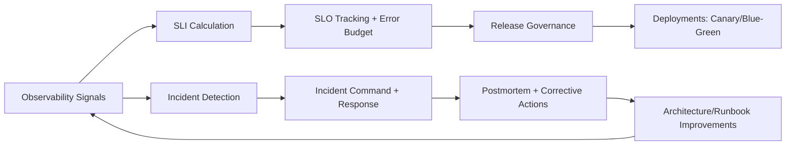

# HA/DR, SLI/SLO/SLA, Incident Handling, and Capacity Planning Architecture

## Overview
This page provides architect-level reliability operations guidance for enterprise systems: high availability (HA), disaster recovery (DR), service-level engineering (SLI/SLO/SLA), incident response models, and capacity planning under growth and failure conditions.

## Why this topic matters
Senior architect interviews evaluate whether you can design systems that remain dependable in real production conditions, not only in happy-path demos. Reliability architecture is where technical design, business risk, and operating model discipline converge.

## Core concepts
- HA vs DR and resilience layering
- Failure domains and blast-radius control
- SLI, SLO, SLA alignment model
- Incident lifecycle and command model
- Error budgets and release governance
- Capacity planning and demand forecasting
- Deployment safety patterns (blue-green, canary)
- Observability and reliability feedback loops

## Detailed explanation of each concept
Reliability architecture starts with explicit business continuity goals translated into technical controls and operational commitments. HA controls keep services available through localized failures, while DR restores service across larger disruptions. These are complementary, not interchangeable. SLI/SLO/SLA provide measurable reliability contracts: SLI tracks real behavior, SLO defines internal target, and SLA defines external commitment with legal/business implications.

Incident handling must be designed as an operating system with clear role ownership, escalation paths, communication protocols, and post-incident learning loops. Capacity planning must be continuous and scenario-based, accounting for growth, seasonal spikes, failure-mode traffic shifts, and cost limits. Mature reliability architecture links deployment governance with error budgets so delivery speed and stability are balanced intentionally.

## Evaluation (How to assess architecture quality)
- Availability and latency SLI trend quality
- SLO attainment rate by service tier
- Change failure rate and mean time to recover (MTTR)
- Incident recurrence rate after corrective actions
- Capacity headroom and saturation alert quality
- RTO/RPO drill success rates
- Error budget burn stability

## Architecture / flow diagram


**Flow explanation:**  
Reliability operations close the loop from telemetry to decision-making. SLI/SLO and incident outcomes inform release policy and architecture updates, which then improve future reliability behavior.

## Real-world example
A payments platform defines tiered SLOs for APIs and async workers. Canary releases are gated by error-budget burn rate and p95 latency thresholds. When a dependency outage occurs, incident command routes failover traffic and enforces degraded mode. Postmortem outcomes add circuit-breaker tuning and queue backpressure controls, reducing repeat incidents in later quarters.

## Best practices
- Define reliability objectives per business-criticality tier
- Separate HA controls from DR controls and test both
- Use error budgets to balance feature velocity and stability
- Run incident drills and DR exercises regularly
- Build capacity models for normal, peak, and degraded conditions
- Link deployment gates to live reliability signals

## Common mistakes / misconceptions
- Treating backup as full DR strategy
- Defining SLAs without internal SLO operating model
- Running incident response without role clarity
- Capacity planning only on average load
- Releasing aggressively when error budget is exhausted

## Industry relevance
Reliability and operations are core differentiators for architect roles because enterprises value predictable service outcomes under stress more than theoretical architecture elegance.

## Interview discussion points
- How to define service tiers and reliability targets
- How to choose active-active vs active-passive resilience patterns
- How to use error budgets in release decisions
- How to reduce incident recurrence, not only MTTR
- How to align reliability with cost constraints

## Links to dependent / related topics
- [Reliability and Operations Overview](./README.md)
- [Compute Architecture](../compute/compute_architecture.md)
- [CI/CD in Azure DevOps](../azure/cicd_azure_devops.md)
- [System Design HLD/LLD](../system-design/system_design_hld_lld.md)
- [Enterprise Azure Foundation](../cloud-architecture/enterprise_azure_foundation_landing_zone.md)

## Interview Questions (50)
1. What is the difference between HA and DR?
2. Why is backup not equal to DR?
3. How do you identify failure domains in architecture?
4. How do you design blast-radius containment?
5. How do you choose active-active vs active-passive?
6. How do you define service criticality tiers?
7. What is SLI and how do you choose useful indicators?
8. What is SLO and how should it be set?
9. What is SLA and how does it differ from SLO?
10. How do you map SLI to user experience outcomes?
11. What is an error budget and why does it matter?
12. How do you use error budgets for release governance?
13. What triggers incident declaration?
14. How do you design incident severity models?
15. What roles are needed in incident command?
16. How do you structure incident communication flows?
17. How do you reduce MTTR systematically?
18. How do you reduce incident recurrence?
19. How do you run effective postmortems?
20. How do you avoid blame culture in incident reviews?
21. How do retries help reliability and when do they hurt?
22. How do circuit breakers improve resilience?
23. How do bulkheads protect distributed systems?
24. How do timeouts influence reliability behavior?
25. How do queues and backpressure improve stability?
26. How do you design graceful degradation patterns?
27. How do health checks differ from readiness probes?
28. How do you design synthetic monitoring strategy?
29. How do you set alert thresholds without noise?
30. How do you reduce alert fatigue?
31. How do you design DR runbooks?
32. How often should DR drills be executed?
33. How do you measure DR drill success?
34. How do you define and validate RTO and RPO?
35. How do you build capacity planning models?
36. How do you include peak and failure scenarios in capacity planning?
37. How do you align capacity planning with cost goals?
38. How do canary deployments support reliability?
39. How does blue-green reduce deployment risk?
40. When should you stop deployments during incidents?
41. How do you design operational readiness gates?
42. How do SRE and platform teams collaborate on reliability?
43. How do you govern reliability in multi-team systems?
44. How do you operationalize reliability for async systems?
45. How do you balance reliability with feature delivery speed?
46. How do you present reliability posture to leadership?
47. How do compliance requirements affect reliability operations?
48. How do you handle reliability in multi-region designs?
49. How do you evolve reliability architecture over time?
50. How do you conclude reliability interview answers strongly?

## Answers for important questions (Summary + Crisp + Deep)

### Q1. What is the difference between HA and DR?
**Question summary:** Clarifies two commonly mixed resilience domains.  
**Crisp answer (7-8 lines):** HA keeps services running through localized failures. DR restores service after major disruptions. HA focuses on immediate continuity inside or near a region. DR focuses on recovery across wider failure scenarios. HA usually targets uptime and fault tolerance. DR targets recovery objectives (RTO/RPO). Both are required for enterprise reliability.  
**Deep explanation:** HA and DR should be designed as complementary resilience layers with different time horizons and failure assumptions. HA controls are intended to absorb routine infrastructure and dependency faults with minimal user impact, often using redundancy, failover, retries, and graceful degradation. DR controls address low-frequency, high-impact events such as regional outages, major data corruption, or critical control-plane failures. A mature architecture defines what failures HA must survive without business interruption and what failures require DR procedures and controlled recovery. Interview-quality answers explain that HA without DR leaves enterprise continuity exposed to large-scale disruption, while DR without HA leads to frequent avoidable incidents for common faults.  
**Answer summary:**  
- HA handles localized fault tolerance; DR handles large-scale recovery.  
- They serve different failure scopes and recovery timelines.  
- Enterprise-grade design needs both layers with explicit boundaries.  
**Simple diagram:**  
```text
Localized faults -> HA controls | Major disruption -> DR recovery
```
**Trusted reference links:**  
- https://learn.microsoft.com/en-us/azure/well-architected/reliability/

### Q2. Why is backup not equal to DR?
**Question summary:** Distinguishes data protection from service continuity.  
**Crisp answer (7-8 lines):** Backup protects data restoration. DR restores end-to-end service operation. Backup alone does not provide application failover, routing, identity recovery, or operational procedures. DR includes runbooks, dependencies, and tested recovery paths. Backup is part of DR, not a replacement.  
**Deep explanation:** Backup strategy is necessary for data retention and point-in-time recovery, but it does not guarantee business service availability after a major disruption. DR requires coordinated restoration of application tiers, network routes, identity services, secrets, integrations, and operating procedures. Many organizations overestimate resilience by equating successful backup jobs with recovery readiness, which becomes visible only during real incidents. Strong architect answers include the concept that DR is a system-level capability and must be validated through drills, while backup is a data-level control that supports DR but cannot substitute for it.  
**Answer summary:**  
- Backup restores data; DR restores service operations.  
- DR includes orchestration, dependency recovery, and tested runbooks.  
- Treat backup as one DR component, not full continuity strategy.  
**Simple diagram:**  
```text
Backup = data restore | DR = full service recovery
```
**Trusted reference links:**  
- https://learn.microsoft.com/en-us/azure/backup/backup-overview

### Q3. How do you identify failure domains in architecture?
**Question summary:** Failure-domain mapping for resilience design.  
**Crisp answer (7-8 lines):** Identify compute, network, data, identity, and external dependency boundaries where single faults can propagate. Map shared services and coupling points. Analyze regional and zonal dependencies. Validate with incident history and chaos tests. Prioritize domains by business impact. Design controls per domain.  
**Deep explanation:** Failure domains are practical boundaries where a single defect, outage, or misconfiguration can affect multiple components simultaneously. Architects should identify not only infrastructure domains such as zones and regions but also logical domains such as shared identity providers, centralized queues, DNS layers, and deployment pipelines. The purpose is to expose hidden concentration risk that diagrams may not reveal. Strong answers include evidence sources: incident retrospectives, telemetry correlation, dependency graphs, and controlled failure experiments. Once mapped, each failure domain should have containment controls and recovery playbooks aligned to service criticality.  
**Answer summary:**  
- Failure domains include both physical infrastructure and logical shared dependencies.  
- Mapping should be evidence-driven using incidents, telemetry, and dependency analysis.  
- Domain visibility enables targeted containment and recovery architecture.  
**Simple diagram:**  
```text
Service -> shared dependencies -> potential failure domains
```
**Trusted reference links:**  
- https://learn.microsoft.com/en-us/azure/reliability/reliability-overview

### Q4. How do you design blast-radius containment?
**Question summary:** Containment strategy for preventing cascading failures.  
**Crisp answer (7-8 lines):** Partition services, data, and traffic domains. Limit shared dependencies and enforce isolation boundaries. Use bulkheads, quotas, and scoped failover. Separate environments and service tiers. Contain failure paths with circuit breakers and backpressure. Validate containment with drills.  
**Deep explanation:** Blast-radius containment reduces incident impact by ensuring faults remain local instead of propagating across the platform. Effective design includes tenancy boundaries, workload partitioning, dependency isolation, and traffic controls that prevent overloaded components from dragging down unrelated services. Architects should also include organizational containment such as scoped ownership and runbooks per domain to accelerate response. In interviews, highlighting both technical and operational containment shows real production understanding.  
**Answer summary:**  
- Containment depends on partitioning, isolation, and controlled dependency sharing.  
- Use resilience patterns to prevent cross-domain cascading behavior.  
- Test containment assumptions through failure exercises and incident review.  
**Simple diagram:**  
```text
Fault in domain A -> isolated impact (does not spread to B/C)
```
**Trusted reference links:**  
- https://learn.microsoft.com/en-us/azure/architecture/patterns/bulkhead

### Q5. How do you choose active-active vs active-passive?
**Question summary:** Resilience pattern selection trade-off.  
**Crisp answer (7-8 lines):** Active-active offers faster failover and load distribution but higher complexity and cost. Active-passive is simpler and cheaper but slower to recover. Decide based on RTO/RPO, consistency constraints, and team maturity. Evaluate operational burden and testing capability. Align with business criticality and budget.  
**Deep explanation:** Pattern selection should be driven by recovery objectives and operating capability, not trend preference. Active-active requires stronger data-consistency handling, routing control, and observability maturity to avoid split-brain or asymmetric degradation. Active-passive can satisfy many enterprise workloads if failover automation and readiness are robust. Architects should explain trade-offs explicitly and tie the final choice to measurable objectives and support-team readiness.  
**Answer summary:**  
- Active-active improves continuity but increases complexity and governance needs.  
- Active-passive simplifies operations with potentially longer recovery windows.  
- Choose by RTO/RPO, consistency model, and operational maturity.  
**Simple diagram:**  
```text
Active-Active (fast failover, complex) | Active-Passive (simpler, slower)
```
**Trusted reference links:**  
- https://learn.microsoft.com/en-us/azure/architecture/guide/design-principles/reliability

### Q6. How do you define service criticality tiers?
**Question summary:** Tiering model for reliability investment.  
**Crisp answer (7-8 lines):** Classify services by business impact, regulatory impact, and dependency centrality. Assign each tier target SLO, response expectations, and resilience controls. Tier-1 gets strongest controls and strictest governance. Lower tiers get pragmatic controls. Review tier assignments periodically.  
**Deep explanation:** Criticality tiering prevents over-engineering low-impact services and under-protecting business-critical paths. A strong model combines business revenue/customer impact, legal exposure, operational dependency, and incident history. Each tier should map to concrete controls: redundancy level, DR rigor, incident response urgency, and release gate strictness. Architects should describe how tier governance evolves with changing business priorities.  
**Answer summary:**  
- Tiering aligns reliability investment with business impact.  
- Each tier must map to explicit objectives and control depth.  
- Periodic reassessment keeps reliability posture aligned to business change.  
**Simple diagram:**  
```text
Tier 1/2/3 -> SLO targets + control model
```
**Trusted reference links:**  
- https://learn.microsoft.com/en-us/azure/well-architected/reliability/

### Q7. What is SLI and how do you choose useful indicators?
**Question summary:** SLI design fundamentals.  
**Crisp answer (7-8 lines):** SLI is a measurable indicator of service behavior. Useful SLIs reflect user experience directly (availability, latency, correctness). Avoid vanity metrics that do not map to impact. Segment SLIs by critical path. Ensure measurement quality and consistency.  
**Deep explanation:** Good SLIs are outcome-oriented signals that correlate with what users actually experience, not merely internal system counters. For example, request success rate and p95 latency on customer-critical endpoints are typically stronger than generic CPU usage metrics for reliability decisions. Architects should choose a small set of high-value SLIs per service and ensure instrumentation quality, sampling integrity, and consistent definitions across teams. This makes SLI data actionable for incident response and release governance.  
**Answer summary:**  
- SLI must represent real user-impacting behavior.  
- Prefer a small set of high-signal indicators over broad noisy dashboards.  
- Reliable instrumentation and consistent definitions are essential for trust.  
**Simple diagram:**  
```text
User experience -> measurable SLI -> reliability decisions
```
**Trusted reference links:**  
- https://sre.google/sre-book/service-level-objectives/

### Q8. What is SLO and how should it be set?
**Question summary:** SLO target-setting approach.  
**Crisp answer (7-8 lines):** SLO is the target value for an SLI over a period. Set it based on user expectations, business risk, and system capability. Avoid unrealistic targets that create alert noise or engineering paralysis. Tier SLOs by criticality. Review with incident and capacity evidence.  
**Deep explanation:** SLO design should balance aspiration and operability. Targets that are too low fail to protect users; targets that are unrealistically high can exhaust teams and reduce delivery velocity. Strong architects define SLOs by service tier, business impact, and historical system behavior, then refine using post-incident and trend analysis. SLOs should also connect to release governance and error budget policies so they influence day-to-day decisions.  
**Answer summary:**  
- Set SLOs using business impact, user expectations, and observed capability.  
- Avoid arbitrary “always high” targets that are operationally unsustainable.  
- Tie SLOs to error-budget and release policies for real operational effect.  
**Simple diagram:**  
```text
SLI measurement + business need -> SLO target
```
**Trusted reference links:**  
- https://learn.microsoft.com/en-us/azure/architecture/framework/reliability/

### Q9. What is SLA and how does it differ from SLO?
**Question summary:** External commitment vs internal target.  
**Crisp answer (7-8 lines):** SLA is the external contractual commitment to customers. SLO is the internal reliability target used to operate services. SLO is typically stricter than SLA to maintain buffer. SLA includes legal/commercial implications. SLO drives engineering behavior.  
**Deep explanation:** SLA and SLO serve different audiences and responsibilities. SLA represents what the business commits externally and may trigger credits or contractual consequences when missed. SLO is the internal operating target that helps engineering teams proactively manage reliability before SLA risk materializes. Mature organizations set SLO targets more stringent than SLA so there is margin for unexpected variance. Architects should explain this distinction clearly in interviews to show both technical and business governance awareness.  
**Answer summary:**  
- SLA is customer-facing commitment; SLO is internal operating target.  
- SLO should usually be stricter than SLA to create reliability buffer.  
- Conflating them weakens both engineering governance and business accountability.  
**Simple diagram:**  
```text
SLI -> SLO (internal) -> SLA (external commitment)
```
**Trusted reference links:**  
- https://learn.microsoft.com/en-us/azure/well-architected/reliability/principles

### Q10. How do you map SLI to user experience outcomes?
**Question summary:** User-centric reliability measurement.  
**Crisp answer (7-8 lines):** Start from critical user journeys, then choose SLIs for each step. Measure success, latency, and correctness where users feel impact. Segment by region/tenant/priority where needed. Correlate SLI changes with support and business metrics. Refine mapping regularly.  
**Deep explanation:** SLI mapping should begin with user journeys such as checkout, login, search, or claim submission rather than with infrastructure components. For each journey, architects should identify observable signals that capture failure, delay, and degraded behavior from the user perspective. This approach prevents teams from optimizing low-impact internal metrics while missing customer pain points. Strong answers also include segmentation and business correlation to ensure reliability investments improve real outcomes, not only dashboards.  
**Answer summary:**  
- Build SLI strategy from user journeys, not component internals.  
- Measure experience-impacting signals: success, latency, and correctness.  
- Correlate telemetry with business/support outcomes to validate relevance.  
**Simple diagram:**  
```text
User journey -> SLI set -> reliability priorities
```
**Trusted reference links:**  
- https://sre.google/sre-book/monitoring-distributed-systems/

### Q11. What is an error budget and why does it matter?
**Question summary:** Reliability-velocity balancing mechanism.  
**Crisp answer (7-8 lines):** Error budget is allowed unreliability derived from SLO target. It creates a measurable trade-off between release speed and stability. If budget burns too fast, reliability work is prioritized. If healthy, delivery can move faster. It aligns engineering and business decisions.  
**Deep explanation:** Error budget operationalizes reliability strategy by turning abstract SLO targets into actionable decision thresholds. Instead of debating reliability vs feature delivery subjectively, teams use budget burn rate to decide when to slow releases, harden systems, or continue normal pace. This reduces conflict between product and platform teams by using shared evidence. Architects should also mention burn-window views (short and long) to avoid overreacting to temporary spikes while still detecting sustained degradation.  
**Answer summary:**  
- Error budget makes reliability trade-offs explicit and measurable.  
- It governs when to prioritize stabilization over feature velocity.  
- Shared budget policy aligns product and engineering decision-making.  
**Simple diagram:**  
```text
SLO target -> allowed error budget -> release decisions
```
**Trusted reference links:**  
- https://sre.google/workbook/error-budget-policy/

### Q12. How do you use error budgets for release governance?
**Question summary:** Applying error budgets to deployment policy.  
**Crisp answer (7-8 lines):** Define release policies tied to budget burn levels. Healthy budget allows normal cadence. High burn enforces tighter gates or release freeze. Require remediation plans before resuming normal velocity. Use dashboards and automated checks. Keep policy transparent and agreed cross-functionally.  
**Deep explanation:** Error-budget governance should be codified and predictable, not negotiated incident by incident. Teams need clear thresholds for normal, caution, and freeze states, plus explicit actions at each stage. Automated budget checks in CI/CD improve consistency and reduce emotional decision-making during pressure periods. Architects should explain that policy is only effective when product, engineering, and operations leaders agree on behavior before incidents occur.  
**Answer summary:**  
- Translate budget burn into explicit release-state policies.  
- Automate checks and enforce remediation before accelerating delivery again.  
- Pre-agreed cross-functional policy prevents reactive governance chaos.  
**Simple diagram:**  
```text
Budget healthy -> deploy | budget high burn -> restrict/freeze
```
**Trusted reference links:**  
- https://learn.microsoft.com/en-us/azure/architecture/framework/devops/

### Q13. What triggers incident declaration?
**Question summary:** Incident declaration criteria model.  
**Crisp answer (7-8 lines):** Trigger when user-impacting thresholds are breached or critical systems degrade beyond tolerance. Use objective metrics and business impact signals. Include security/regulatory escalation triggers. Declare early when uncertainty is high and impact is plausible. Better to down-scope later than delay response.  
**Deep explanation:** Incident declaration should be based on predefined, objective criteria to avoid delayed response and inconsistent severity handling. Teams should include both technical thresholds (error rate, latency, saturation) and business indicators (failed transactions, support surge, SLA risk). Early declaration enables coordinated command response, faster communication, and clearer accountability. Architects should emphasize that delayed declaration often causes longer outages than the original technical issue.  
**Answer summary:**  
- Use objective user-impact and risk thresholds for declaration.  
- Include technical, business, and compliance-trigger conditions.  
- Declare early to mobilize coordination and reduce outage duration.  
**Simple diagram:**  
```text
Threshold breach + user impact -> incident declared
```
**Trusted reference links:**  
- https://learn.microsoft.com/en-us/azure/well-architected/operational-excellence/

### Q14. How do you design incident severity models?
**Question summary:** Severity classification governance.  
**Crisp answer (7-8 lines):** Define severity by user impact, scope, duration risk, and business/regulatory effect. Keep severity criteria explicit and simple. Map each severity to response SLA and command roles. Reassess severity dynamically as evidence evolves. Document examples for consistency.  
**Deep explanation:** Severity models should create consistent response behavior under stress. If criteria are vague, teams over/under-escalate and lose trust in incident governance. Strong models include clear impact dimensions and predefined response obligations (communication cadence, staffing, escalation authority). Architects should also mention dynamic reassessment because incident impact can expand or contract quickly.  
**Answer summary:**  
- Severity should be impact-based and operationally actionable.  
- Map each severity to explicit response obligations and roles.  
- Reclassify dynamically as incident evidence changes.  
**Simple diagram:**  
```text
Impact score -> Sev level -> response model
```
**Trusted reference links:**  
- https://learn.microsoft.com/en-us/azure/architecture/framework/operational-excellence/

### Q15. What roles are needed in incident command?
**Question summary:** Incident role clarity for fast coordination.  
**Crisp answer (7-8 lines):** Core roles include incident commander, operations lead, communications lead, subject matter leads, and scribe. Commander drives decisions and prioritization. Comms lead handles stakeholder updates. SMEs execute technical actions. Scribe tracks timeline and evidence. Clear role separation avoids confusion.  
**Deep explanation:** Incident command works when responsibilities are explicit and conflict-free. The incident commander should focus on coordination and priority decisions, not deep troubleshooting. SMEs should execute technical mitigation with clear task ownership, while communications maintains consistent stakeholder updates to prevent rumor-driven escalations. Scribe role is often undervalued but critical for postmortem quality and legal/compliance evidence. Architects should frame role clarity as a reliability multiplier during high-pressure events.  
**Answer summary:**  
- Separate command, execution, and communication responsibilities clearly.  
- Keep the incident commander focused on coordination, not individual debugging.  
- Timeline/evidence capture is essential for post-incident learning and governance.  
**Simple diagram:**  
```text
Commander -> Ops/SMEs + Comms + Scribe
```
**Trusted reference links:**  
- https://learn.microsoft.com/en-us/azure/architecture/framework/operational-excellence/devops

### Q16. How do you structure incident communication flows?
**Question summary:** Communication architecture during incidents.  
**Crisp answer (7-8 lines):** Define audience-specific channels: internal responders, leadership, support teams, and customers. Set update cadence by severity. Keep messages factual and time-stamped. Use a single source of truth for status. Align legal/compliance messaging paths where needed.  
**Deep explanation:** Communication failures often amplify technical incidents into business crises. Structured communication flow ensures the right stakeholders receive timely, consistent updates without flooding engineering channels. Architects should specify cadence standards, owner roles, approval paths for external messaging, and escalation logic for changing severity. A unified status source reduces conflicting narratives and improves decision quality.  
**Answer summary:**  
- Use role-based channels and severity-based update cadence.  
- Maintain a single trusted status source to avoid message drift.  
- Integrate legal/compliance approval paths for external communications.  
**Simple diagram:**  
```text
Incident command -> internal updates -> external updates
```
**Trusted reference links:**  
- https://learn.microsoft.com/en-us/azure/well-architected/operational-excellence/

### Q17. How do you reduce MTTR systematically?
**Question summary:** MTTR improvement strategy.  
**Crisp answer (7-8 lines):** Improve detection speed, diagnosis clarity, and response automation. Strengthen runbooks and ownership model. Invest in observability correlation and alert quality. Rehearse failure scenarios. Remove recurring operational friction. Track MTTR components separately.  
**Deep explanation:** MTTR improvement should be decomposed into stages: detection, triage, decision, mitigation, and recovery validation. Teams often optimize one stage while ignoring others, resulting in limited overall gain. Architects should use incident timeline analysis to identify bottlenecks, then implement targeted actions such as better instrumentation, pre-approved recovery actions, and clearer escalation boundaries. Continuous rehearsal and post-incident measurement are critical for sustained MTTR reduction.  
**Answer summary:**  
- Break MTTR into stages and optimize each bottleneck explicitly.  
- Combine observability, automation, and role clarity for faster recovery.  
- Use incident timeline analytics to drive continuous MTTR improvements.  
**Simple diagram:**  
```text
Detect -> Triage -> Mitigate -> Validate (optimize each)
```
**Trusted reference links:**  
- https://learn.microsoft.com/en-us/azure/architecture/framework/reliability/testing

### Q18. How do you reduce incident recurrence?
**Question summary:** Long-term reliability improvement loop.  
**Crisp answer (7-8 lines):** Identify systemic root causes, not only immediate triggers. Track corrective actions with ownership and deadlines. Prioritize fixes by recurrence risk and impact. Validate fix effectiveness in production telemetry. Update architecture standards and runbooks. Audit recurring themes quarterly.  
**Deep explanation:** Recurrence reduction depends on treating incidents as system-learning opportunities rather than isolated events. Superficial fixes often remove symptom visibility but leave structural risk unchanged. Strong teams use postmortem themes to drive backlog priorities across platform, architecture, and operational domains. Architects should demonstrate that corrective actions are tracked to closure with measurable evidence of risk reduction.  
**Answer summary:**  
- Focus on structural root causes, not symptom-level patching.  
- Govern corrective actions with accountable ownership and closure evidence.  
- Feed incident learnings into architecture standards to prevent repeats.  
**Simple diagram:**  
```text
Incident -> root cause -> corrective actions -> verification
```
**Trusted reference links:**  
- https://learn.microsoft.com/en-us/azure/architecture/framework/operational-excellence/

### Q19. How do you run effective postmortems?
**Question summary:** Postmortem quality model.  
**Crisp answer (7-8 lines):** Build factual timeline and impact analysis first. Identify technical and process root causes. Define corrective actions with owners, priority, and due dates. Avoid blame language. Track completion and effectiveness. Share learnings across teams.  
**Deep explanation:** Postmortems should improve system reliability and team capability, not assign fault. High-quality postmortems combine evidence-driven timeline reconstruction with multidimensional cause analysis across architecture, operations, and governance. Corrective actions should include preventive controls, detection improvements, and runbook refinements with measurable outcomes. Architects should highlight closure governance because postmortems without follow-through do not reduce future risk.  
**Answer summary:**  
- Effective postmortems are factual, blameless, and action-oriented.  
- Address technical, process, and organizational contributors together.  
- Track corrective-action completion and impact to ensure real improvement.  
**Simple diagram:**  
```text
Timeline -> causes -> actions -> follow-through
```
**Trusted reference links:**  
- https://sre.google/sre-book/postmortem-culture/

### Q20. How do you avoid blame culture in incident reviews?
**Question summary:** Culture and governance in reliability teams.  
**Crisp answer (7-8 lines):** Focus on system conditions and decision context, not personal fault. Use neutral language and evidence. Encourage reporting of near misses. Reward learning and corrective action ownership. Separate accountability from blame. Leadership must model behavior.  
**Deep explanation:** Blame culture suppresses transparency, delays detection of systemic risks, and reduces quality of incident learning. A healthy reliability culture still enforces accountability, but it does so through clear ownership of improvements rather than personal punishment for complex system failures. Architects in senior roles should explicitly reinforce blameless analysis practices and create governance mechanisms where teams can surface weaknesses safely. This leads to faster problem discovery and better long-term reliability outcomes.  
**Answer summary:**  
- Replace blame with system-focused evidence-based analysis.  
- Maintain accountability through ownership of corrective actions.  
- Leadership behavior and review language determine whether learning culture survives.  
**Simple diagram:**  
```text
Blame down -> transparency up -> reliability learning up
```
**Trusted reference links:**  
- https://learn.microsoft.com/en-us/azure/well-architected/operational-excellence/

### Q21. How do retries help reliability and when do they hurt?
**Question summary:** Retry pattern trade-offs.  
**Crisp answer (7-8 lines):** Retries recover transient failures and improve success rates. They hurt when applied blindly, causing retry storms and cascading load. Use bounded retries with jitter and backoff. Respect idempotency and timeout budgets. Fail fast for non-transient errors. Monitor retry impact.  
**Deep explanation:** Retry logic should be designed as controlled resilience behavior, not default repetition. When tuned properly, retries mitigate short-lived network or dependency glitches. When uncontrolled, they amplify failure by increasing load on already degraded services and expanding latency tails. Architects should specify retry budgets, classification of retryable errors, and interplay with circuit breakers and queue buffering.  
**Answer summary:**  
- Retries are useful for transient faults when bounded and policy-driven.  
- Unbounded retries can trigger cascading failures and performance collapse.  
- Combine retries with backoff, idempotency, and circuit-breaker logic.  
**Simple diagram:**  
```text
Transient error -> bounded retry -> recover
```
**Trusted reference links:**  
- https://learn.microsoft.com/en-us/azure/architecture/patterns/retry

### Q22. How do circuit breakers improve resilience?
**Question summary:** Circuit breaker role in fault containment.  
**Crisp answer (7-8 lines):** Circuit breakers stop repeated calls to failing dependencies. They reduce cascading failures and protect upstream services. They allow controlled recovery checks. They improve latency during dependency outage by failing fast. Tune thresholds carefully. Integrate with fallback behavior.  
**Deep explanation:** Circuit breakers convert uncontrolled failure amplification into managed degradation. Without them, repeated timeout chains consume thread pools and saturate upstream resources. With well-configured open/half-open behavior, services can preserve capacity and continue partial functionality while dependencies recover. Architects should highlight breaker tuning, observability, and fallback UX strategy to demonstrate practical implementation maturity.  
**Answer summary:**  
- Circuit breakers contain failure propagation and preserve service capacity.  
- They improve recovery behavior through controlled probing and fail-fast logic.  
- Effectiveness depends on threshold tuning and integration with fallback paths.  
**Simple diagram:**  
```text
Dependency failing -> breaker opens -> upstream protected
```
**Trusted reference links:**  
- https://learn.microsoft.com/en-us/azure/architecture/patterns/circuit-breaker

### Q23. How do bulkheads protect distributed systems?
**Question summary:** Isolation strategy against shared-resource exhaustion.  
**Crisp answer (7-8 lines):** Bulkheads isolate workloads so failure in one segment does not sink all services. Partition threads, queues, pools, and dependencies by domain. Limit resource contention across critical and non-critical paths. Monitor each partition independently. Align partitions to business priority tiers.  
**Deep explanation:** Bulkhead architecture prevents noisy-neighbor and cascading saturation effects by enforcing hard isolation boundaries in shared infrastructure and software resources. This is especially important in multi-tenant or mixed-priority systems where bursty traffic from one workload can degrade another. Architects should explain partition strategy, fallback behavior when partitions fill, and the trade-off between isolation strength and resource utilization efficiency.  
**Answer summary:**  
- Bulkheads reduce cross-service impact from localized overload or faults.  
- Partitioning should align to business criticality and traffic behavior.  
- Isolation improves resilience but requires careful capacity and policy tuning.  
**Simple diagram:**  
```text
Partition A failure -> Partition B/C continue
```
**Trusted reference links:**  
- https://learn.microsoft.com/en-us/azure/architecture/patterns/bulkhead

### Q24. How do timeouts influence reliability behavior?
**Question summary:** Timeout strategy and failure dynamics.  
**Crisp answer (7-8 lines):** Timeouts prevent indefinite waiting and resource lock-up. They bound latency and enable faster fallback decisions. Too short causes false failures; too long causes saturation. Set by dependency profile and SLO budget. Tune with telemetry. Coordinate with retries and breakers.  
**Deep explanation:** Timeout configuration directly shapes system failure mode. Without timeouts, request chains can hang and consume scarce resources, leading to broad service degradation. Overly aggressive timeouts can trigger unnecessary retries and user-visible errors even when dependencies are healthy but variable. Architects should design timeout budgets end-to-end across call chains, ensuring total behavior stays within user SLO while preserving recovery opportunities.  
**Answer summary:**  
- Timeouts bound failure duration and protect system resources.  
- Misconfigured timeouts either increase false errors or prolong saturation.  
- Design timeout budgets with full call-chain and SLO context.  
**Simple diagram:**  
```text
Call exceeds budget -> timeout -> fallback/retry decision
```
**Trusted reference links:**  
- https://learn.microsoft.com/en-us/azure/architecture/patterns/

### Q25. How do queues and backpressure improve stability?
**Question summary:** Async buffering and overload control.  
**Crisp answer (7-8 lines):** Queues decouple producers and consumers, smoothing bursts. Backpressure limits intake when consumers are saturated. Together they prevent immediate overload collapse. They improve resilience for async workflows. Require DLQ, retry policy, and monitoring. Tune throughput and limits per tier.  
**Deep explanation:** Queue-based architectures absorb demand variability and isolate slow downstream components from producer spikes. Backpressure policies are essential to prevent unbounded queue growth and delayed failure visibility. Architects should include queue depth thresholds, consumer scaling logic, dead-letter handling, and poison-message strategy. Strong answers connect these controls to SLO impact and recovery behavior during dependency incidents.  
**Answer summary:**  
- Queues absorb burst traffic and decouple workload timing dependencies.  
- Backpressure prevents overload from turning into system-wide instability.  
- Reliability depends on full queue governance: scaling, DLQ, retries, and observability.  
**Simple diagram:**  
```text
Burst producers -> queue buffer -> controlled consumer processing
```
**Trusted reference links:**  
- https://learn.microsoft.com/en-us/azure/architecture/patterns/queue-based-load-leveling

### Q26. How do you design graceful degradation patterns?
**Question summary:** Service behavior under partial failure.  
**Crisp answer (7-8 lines):** Identify core vs optional features. Keep core path available during dependency failures. Use cached or partial responses when needed. Expose clear user messaging for degraded mode. Define exit criteria to restore full behavior. Test degraded paths regularly.  
**Deep explanation:** Graceful degradation is a user-experience resilience strategy, not just a technical fallback. It requires explicit prioritization of essential service capabilities and controlled reduction of non-essential functions during incidents. Architects should design trigger conditions, UX behavior, and observability for degradation states so teams can manage them intentionally. This approach reduces outage severity and preserves trust even during major dependency failures.  
**Answer summary:**  
- Prioritize essential service functions and degrade non-critical capabilities first.  
- Make degraded behavior explicit, testable, and observable.  
- Controlled degradation improves continuity when full recovery is not immediate.  
**Simple diagram:**  
```text
Dependency issue -> degrade optional features -> core path stays up
```
**Trusted reference links:**  
- https://learn.microsoft.com/en-us/azure/architecture/patterns/

### Q27. How do health checks differ from readiness probes?
**Question summary:** Runtime health signal semantics.  
**Crisp answer (7-8 lines):** Liveness checks indicate whether process is alive. Readiness checks indicate whether instance can receive traffic safely. Liveness failure usually triggers restart. Readiness failure removes instance from serving path. Keep checks meaningful and lightweight. Avoid dependency-heavy liveness checks.  
**Deep explanation:** Confusing liveness and readiness checks creates unstable recovery behavior. Liveness should detect unrecoverable internal failure states where restart helps. Readiness should reflect dependency and initialization state so traffic routing remains safe. Architects should ensure probe design avoids flapping and that probe thresholds align with startup and recovery characteristics of the service.  
**Answer summary:**  
- Liveness answers “should restart?” while readiness answers “should serve traffic?”.  
- Misuse of probes can increase instability and unnecessary restarts.  
- Probe design must reflect service startup, dependency, and recovery behavior.  
**Simple diagram:**  
```text
Liveness fail -> restart | Readiness fail -> remove from traffic
```
**Trusted reference links:**  
- https://kubernetes.io/docs/tasks/configure-pod-container/configure-liveness-readiness-startup-probes/

### Q28. How do you design synthetic monitoring strategy?
**Question summary:** Proactive reliability detection model.  
**Crisp answer (7-8 lines):** Build synthetic tests for critical user journeys and dependency checks. Run from multiple regions and network contexts. Track latency, success, and correctness. Alert on trend breaches, not only hard failures. Correlate synthetic and real-user telemetry. Review test relevance periodically.  
**Deep explanation:** Synthetic monitoring detects availability and latency degradation before customer volume exposes full impact, especially for low-traffic or off-peak periods. Effective strategy includes journey-level tests, regional diversity, and realistic authentication/data paths where possible. Architects should avoid overbuilding synthetic suites with low business relevance and instead focus on critical-path coverage tied to incident response workflows.  
**Answer summary:**  
- Synthetic monitoring provides early warning on critical user journeys.  
- Multi-region and trend-aware design improves detection quality.  
- Keep synthetic coverage aligned with business-critical flows and response actions.  
**Simple diagram:**  
```text
Synthetic journey tests -> alerts -> incident response
```
**Trusted reference links:**  
- https://learn.microsoft.com/en-us/azure/azure-monitor/app/availability-overview

### Q29. How do you set alert thresholds without noise?
**Question summary:** Alert design quality and signal-to-noise control.  
**Crisp answer (7-8 lines):** Use baseline behavior and SLO context to define thresholds. Prefer multi-signal conditions and duration windows. Separate warning and critical levels. Suppress known non-actionable events. Re-tune thresholds using incident outcomes. Measure alert precision and recall.  
**Deep explanation:** Alert quality depends on balancing sensitivity and actionability. Thresholds based purely on static limits often create false positives during normal variation or false negatives during gradual degradation. Architects should design alerts around user-impacting signals, include time windows to reduce flapping, and route alerts based on ownership and severity. Reviewing alert outcome data after incidents is essential for continuous tuning.  
**Answer summary:**  
- Calibrate thresholds with SLO context and observed baseline patterns.  
- Use duration, multi-signal logic, and severity tiers to reduce noise.  
- Continuously tune alerts using incident and responder feedback.  
**Simple diagram:**  
```text
Baseline + SLO -> threshold policy -> actionable alerts
```
**Trusted reference links:**  
- https://learn.microsoft.com/en-us/azure/azure-monitor/alerts/alerts-overview

### Q30. How do you reduce alert fatigue?
**Question summary:** Sustaining responder effectiveness.  
**Crisp answer (7-8 lines):** Eliminate low-value alerts and duplicate signals. Route alerts to accountable teams only. Use grouping/correlation and suppression windows. Improve runbooks for common alerts. Track alert load per responder. Review noisy alerts in reliability governance.  
**Deep explanation:** Alert fatigue reduces incident response quality because responders become desensitized to notifications and may miss critical events. Effective mitigation combines technical tuning (deduplication, correlation, threshold refinement) and operational improvements (clear ownership, better runbooks, escalation discipline). Architects should treat alert hygiene as a reliability KPI and include it in regular governance reviews.  
**Answer summary:**  
- Reduce alert volume by removing non-actionable and duplicate signals.  
- Strengthen ownership routing and automation to lower responder overload.  
- Track and govern alert quality continuously to protect response effectiveness.  
**Simple diagram:**  
```text
Noisy alerts down -> responder focus up -> faster incident handling
```
**Trusted reference links:**  
- https://learn.microsoft.com/en-us/azure/well-architected/operational-excellence/monitoring

### Q31. How do you design DR runbooks?
**Question summary:** DR runbook architecture and execution quality.  
**Crisp answer (7-8 lines):** Define step-by-step recovery actions, ownership, dependencies, and verification checks. Include failover and failback procedures. Add communication templates and escalation paths. Keep runbooks versioned and tested. Map runbooks to RTO/RPO objectives.  
**Deep explanation:** DR runbooks should be executable instructions under stress, not generic documentation. They must include prerequisites, role assignments, validation checkpoints, and rollback/failback considerations. Strong runbooks account for dependencies such as identity, DNS, secrets, and external integrations. Architects should ensure runbooks are kept current with architecture changes and validated through recurring exercises.  
**Answer summary:**  
- DR runbooks must be operationally explicit with ownership and validation steps.  
- Include dependency recovery, communication, failover, and failback paths.  
- Version and drill runbooks regularly to maintain execution readiness.  
**Simple diagram:**  
```text
DR trigger -> runbook execution -> validation -> business recovery
```
**Trusted reference links:**  
- https://learn.microsoft.com/en-us/azure/site-recovery/site-recovery-overview

### Q32. How often should DR drills be executed?
**Question summary:** DR testing cadence strategy.  
**Crisp answer (7-8 lines):** Frequency depends on criticality and change velocity. Tier-1 systems should be tested more frequently. Trigger additional drills after major architecture changes. Include both tabletop and technical failover exercises. Track drill outcomes and remediation closure.  
**Deep explanation:** DR drill cadence should be risk-based rather than calendar-only. High-criticality, high-change systems require more frequent validation because assumptions decay quickly with platform evolution. Architects should recommend a baseline schedule plus event-driven drills after major infra, data, or dependency changes. The goal is to keep recovery behavior continuously trustworthy, not periodically assumed.  
**Answer summary:**  
- Set drill cadence by service criticality and architecture change frequency.  
- Add event-driven drills after major platform or dependency changes.  
- Use drill outcomes to drive corrective actions and readiness improvements.  
**Simple diagram:**  
```text
Risk tier + change events -> DR drill cadence
```
**Trusted reference links:**  
- https://learn.microsoft.com/en-us/azure/well-architected/reliability/testing

### Q33. How do you measure DR drill success?
**Question summary:** DR validation metrics and evidence model.  
**Crisp answer (7-8 lines):** Measure achieved RTO/RPO, recovery completeness, dependency restoration accuracy, and communication effectiveness. Track failed steps and manual workarounds. Validate business workflow outcomes post-recovery. Capture evidence and remediation backlog. Compare trend across drills.  
**Deep explanation:** DR drill success should be evaluated through both technical and operational dimensions. Technical metrics include failover duration, data-loss tolerance, and service restoration correctness. Operational metrics include command coordination, escalation clarity, and stakeholder communication quality. Architects should ensure drill reports include actionable gap ownership and target closure timelines to improve future readiness.  
**Answer summary:**  
- Evaluate DR drills with RTO/RPO, service correctness, and dependency recovery metrics.  
- Include operational and communication quality, not just infrastructure failover time.  
- Use trend-based evidence and remediation closure to improve resilience maturity.  
**Simple diagram:**  
```text
Drill metrics -> gaps -> remediation -> improved next drill
```
**Trusted reference links:**  
- https://learn.microsoft.com/en-us/azure/reliability/reliability-overview

### Q34. How do you define and validate RTO and RPO?
**Question summary:** Recovery objective definition and proof.  
**Crisp answer (7-8 lines):** Define RTO/RPO by business impact tolerance and regulatory constraints. Map objectives to service tiers and architecture controls. Validate through rehearsal and measured drills. Reassess objectives when business or architecture changes. Document exceptions explicitly.  
**Deep explanation:** RTO and RPO are business-informed commitments, not arbitrary technical numbers. Architects should translate business continuity requirements into architecture decisions for data replication, failover mode, and recovery automation depth. Validation must be empirical through controlled exercises; declared objectives without measured evidence are unreliable. Objective review should be part of governance cadence as systems and business priorities evolve.  
**Answer summary:**  
- RTO/RPO must be business-driven and tier-aligned.  
- Architecture controls should be explicitly mapped to each recovery objective.  
- Validate objectives through drills and update with changing business context.  
**Simple diagram:**  
```text
Business tolerance -> RTO/RPO -> architecture controls -> drill proof
```
**Trusted reference links:**  
- https://learn.microsoft.com/en-us/azure/well-architected/reliability/

### Q35. How do you build capacity planning models?
**Question summary:** Capacity modeling framework.  
**Crisp answer (7-8 lines):** Build models from demand trends, growth assumptions, and workload behavior profiles. Include steady state, peak, and failure-mode loads. Map capacity to SLO targets and scaling limits. Validate with load tests and production telemetry. Review models regularly.  
**Deep explanation:** Capacity planning should combine statistical demand forecasting with architecture constraints such as autoscaling lag, dependency bottlenecks, and quota limits. Models that use only average load are insufficient because incidents often occur in spike and degraded scenarios. Architects should include confidence ranges, headroom targets, and failure redistribution assumptions to avoid optimistic planning. Continuous telemetry feedback is needed to keep models relevant as usage patterns change.  
**Answer summary:**  
- Capacity models should include trend, variance, and failure-mode behavior.  
- Tie capacity assumptions to SLO outcomes and scaling constraints.  
- Revalidate models continuously with testing and production telemetry.  
**Simple diagram:**  
```text
Demand forecast + system limits -> capacity model
```
**Trusted reference links:**  
- https://learn.microsoft.com/en-us/azure/well-architected/performance-efficiency/

### Q36. How do you include peak and failure scenarios in capacity planning?
**Question summary:** Stress-aware capacity planning.  
**Crisp answer (7-8 lines):** Model planned peaks, unexpected surges, and failover redistribution loads. Include dependency degradation effects. Test saturation behavior and scaling response time. Reserve headroom for incident conditions. Validate queue and timeout behavior under stress.  
**Deep explanation:** Capacity failures often occur when systems are forced into non-normal states, such as regional failover, dependency slowness, or traffic spikes from external events. Architects should plan for these scenarios explicitly, including reduced component availability and re-routed traffic concentration. Testing should verify not only throughput but recovery behavior and system stability under sustained stress. This makes capacity planning resilience-aware rather than purely performance-oriented.  
**Answer summary:**  
- Plan capacity for degraded and failover conditions, not only normal peaks.  
- Include dependency and scaling-lag effects in stress scenarios.  
- Validate stability and recovery behavior under sustained high-load conditions.  
**Simple diagram:**  
```text
Normal load + surge + failover load -> required headroom
```
**Trusted reference links:**  
- https://learn.microsoft.com/en-us/azure/architecture/framework/performance-efficiency/

### Q37. How do you align capacity planning with cost goals?
**Question summary:** Reliability-cost optimization balance.  
**Crisp answer (7-8 lines):** Define minimum reliability headroom first, then optimize spend around it. Use right-sizing, autoscaling policies, and reserved capacity where appropriate. Compare overprovisioning vs incident risk cost. Review cost and reliability KPIs together. Avoid cost cuts that violate SLOs.  
**Deep explanation:** Capacity-cost alignment should be treated as a constrained optimization problem. Underprovisioning may reduce short-term spend but can increase outage cost, customer churn, and operational toil. Overprovisioning can waste budget without meaningful reliability gain. Architects should define acceptable risk boundaries, model scenario-based cost impact, and tune scaling policies to preserve both resilience and economics.  
**Answer summary:**  
- Optimize within reliability constraints, not at the expense of SLO commitments.  
- Evaluate trade-offs using both spend metrics and outage-risk economics.  
- Use iterative right-sizing and scaling governance to maintain balance.  
**Simple diagram:**  
```text
Reliability floor + cost optimization loop
```
**Trusted reference links:**  
- https://learn.microsoft.com/en-us/azure/well-architected/cost-optimization/

### Q38. How do canary deployments support reliability?
**Question summary:** Progressive release reliability control.  
**Crisp answer (7-8 lines):** Canary sends small traffic share to new version first. It limits blast radius of regressions. It enables live validation against SLO metrics. Rollout expands only on healthy signals. Rollback is faster and safer. Requires observability and gating discipline.  
**Deep explanation:** Canary deployment converts release risk into a controlled experiment with measurable exposure. It is especially valuable for systems with uncertain behavioral change or complex dependency interactions that testing cannot fully model. Architects should define canary cohort size, observation window, promotion/rollback thresholds, and communication workflow. This approach reduces change-failure rate and increases confidence in production evolution.  
**Answer summary:**  
- Canary reduces release risk by limiting exposure and validating live behavior.  
- Promotion should be governed by explicit reliability thresholds.  
- Effective canary requires strong telemetry and automated rollback pathways.  
**Simple diagram:**  
```text
5% canary -> metrics check -> expand or rollback
```
**Trusted reference links:**  
- https://learn.microsoft.com/en-us/azure/architecture/patterns/canary-release

### Q39. How does blue-green reduce deployment risk?
**Question summary:** Parallel environment release strategy.  
**Crisp answer (7-8 lines):** Blue-green keeps old and new environments in parallel. Traffic switches after validation. Rollback is immediate by switching back. It reduces deployment downtime and uncertainty. It requires duplicate environment capacity and sync discipline. Works well for high-criticality releases.  
**Deep explanation:** Blue-green strategy reduces risk by separating deployment from traffic cutover. Validation occurs in the green environment before user impact, then routing shift is controlled and reversible. This is operationally simpler for rollback than in-place updates, but it increases cost and requires environment parity and data synchronization planning. Architects should discuss when this pattern is justified by business criticality and release risk profile.  
**Answer summary:**  
- Blue-green isolates release validation from live traffic exposure.  
- Fast rollback via traffic switch significantly improves recovery speed.  
- Requires capacity duplication and strict environment parity management.  
**Simple diagram:**  
```text
Blue(current) + Green(new) -> switch -> monitor
```
**Trusted reference links:**  
- https://learn.microsoft.com/en-us/azure/architecture/framework/devops/ci-cd

### Q40. When should you stop deployments during incidents?
**Question summary:** Deployment freeze governance during instability.  
**Crisp answer (7-8 lines):** Stop deployments when incident impact is active or reliability signals are unstable. Freeze changes for affected domains first. Continue only emergency fixes through controlled path. Resume normal deployments after stabilization criteria are met. Tie policy to error-budget and severity rules.  
**Deep explanation:** Continuing routine deployments during active incidents often introduces new variables that complicate diagnosis and recovery. A clear freeze policy protects system stability and responder focus. Architects should define scope of freeze, exception handling for urgent fixes, and explicit criteria for unfreezing. Linking freeze decisions to severity and error-budget state improves consistency and governance quality.  
**Answer summary:**  
- Pause non-essential deployments during active instability to reduce risk.  
- Allow only controlled emergency fixes with explicit approvals.  
- Resume delivery based on defined stabilization and governance criteria.  
**Simple diagram:**  
```text
Incident active -> deploy freeze -> stabilize -> controlled resume
```
**Trusted reference links:**  
- https://learn.microsoft.com/en-us/azure/architecture/framework/devops/

### Q41. How do you design operational readiness gates?
**Question summary:** Pre-release operational control framework.  
**Crisp answer (7-8 lines):** Gate on monitoring coverage, alert quality, runbook readiness, ownership, rollback capability, and compliance checks. Require evidence artifacts, not declarations. Differentiate gate rigor by criticality tier. Include sign-off accountability. Review gate quality after incidents.  
**Deep explanation:** Operational readiness gates ensure production changes are supportable from day one. These gates should evaluate detectability, diagnosability, recoverability, and governance compliance before release approval. Architects should define measurable criteria, ownership roles, and exception pathways to avoid checkbox behavior. Well-designed gates reduce post-release incidents and improve handoff quality between build and run teams.  
**Answer summary:**  
- Readiness gates must verify operational support capability before release.  
- Use measurable evidence and tier-based rigor for gate decisions.  
- Continuously improve gate design using incident and release outcomes.  
**Simple diagram:**  
```text
Ops evidence checks -> go/no-go gate
```
**Trusted reference links:**  
- https://learn.microsoft.com/en-us/azure/well-architected/operational-excellence/

### Q42. How do SRE and platform teams collaborate on reliability?
**Question summary:** Reliability operating model across teams.  
**Crisp answer (7-8 lines):** Platform teams provide shared reliability foundations. SRE teams define reliability practices, SLO governance, and incident frameworks. Product teams implement service-specific controls. Collaboration needs clear boundaries, shared metrics, and escalation protocols. Run joint reviews and reliability roadmaps.  
**Deep explanation:** Reliability ownership is distributed, so role clarity is essential. Platform teams deliver reusable capabilities (observability, deployment safety, policy controls), SRE teams define operating standards and reliability governance, and service teams apply those standards in domain context. Architects should describe interaction cadences and conflict-resolution mechanisms so reliability decisions remain consistent across the organization.  
**Answer summary:**  
- Reliability requires shared ownership across platform, SRE, and product teams.  
- Define boundaries and common metrics to avoid governance ambiguity.  
- Joint review cadence aligns strategic standards with service-level realities.  
**Simple diagram:**  
```text
Platform foundations + SRE governance + service implementation
```
**Trusted reference links:**  
- https://sre.google/

### Q43. How do you govern reliability in multi-team systems?
**Question summary:** Cross-team reliability governance at scale.  
**Crisp answer (7-8 lines):** Set common reliability standards and tiered SLO policy. Require service ownership and dependency contracts. Track reliability KPIs centrally. Use architecture reviews for high-risk changes. Enforce incident and postmortem quality. Align incentives to reliability outcomes.  
**Deep explanation:** Multi-team systems fail when reliability responsibilities are diffuse and dependency contracts are weak. Governance should enforce minimum standards while allowing domain flexibility for implementation details. Architects should include cross-team dependency review, shared incident learning, and common evidence models so reliability posture is visible and improvable across the platform.  
**Answer summary:**  
- Apply shared reliability standards with explicit team ownership boundaries.  
- Govern dependencies and high-risk changes through structured review mechanisms.  
- Use centralized KPI and postmortem governance to drive platform-wide improvement.  
**Simple diagram:**  
```text
Team services + shared standards + governance loops
```
**Trusted reference links:**  
- https://learn.microsoft.com/en-us/azure/architecture/framework/

### Q44. How do you operationalize reliability for async systems?
**Question summary:** Reliability controls for message-driven architectures.  
**Crisp answer (7-8 lines):** Monitor queue lag, throughput, retry, and DLQ trends. Design idempotent consumers and poison-message handling. Apply backpressure and scaling controls. Track end-to-end latency across async hops. Include replay and recovery runbooks. Validate failure-mode behavior regularly.  
**Deep explanation:** Async reliability depends on flow control, consumer correctness, and observability across decoupled stages. Teams should avoid relying only on queue depth because hidden latency and replay behavior can still violate user expectations. Architects should define service-level objectives for async workflows, operationalize dead-letter governance, and ensure replay paths are safe and auditable.  
**Answer summary:**  
- Async reliability requires queue governance plus end-to-end workflow visibility.  
- Idempotency, DLQ handling, and replay safety are non-negotiable controls.  
- Monitor latency and failure patterns across hops, not only per component.  
**Simple diagram:**  
```text
Producer -> Queue -> Consumer -> DLQ/replay controls
```
**Trusted reference links:**  
- https://learn.microsoft.com/en-us/azure/architecture/patterns/competing-consumers

### Q45. How do you balance reliability with feature delivery speed?
**Question summary:** Reliability-velocity trade-off governance.  
**Crisp answer (7-8 lines):** Use error budgets and tiered release policy. Keep reliability guardrails automated. Prioritize high-risk changes for progressive rollout. Reserve capacity for reliability debt reduction. Make trade-offs explicit with data. Avoid binary “speed vs stability” framing.  
**Deep explanation:** Delivery speed and reliability should be managed as a controlled trade-off system, not an organizational conflict. Error budgets, canary gates, and readiness checks provide objective mechanisms for adjusting release pace. Architects should ensure product planning includes reliability investment, otherwise delivery pressure accumulates hidden operational risk. Clear data-driven policy helps teams move fast while preserving service trust.  
**Answer summary:**  
- Use policy-based mechanisms to trade speed and stability intentionally.  
- Automate reliability controls so governance supports velocity, not blocks it.  
- Fund reliability improvements continuously to prevent hidden risk accumulation.  
**Simple diagram:**  
```text
Error budget + release gates -> balanced delivery pace
```
**Trusted reference links:**  
- https://learn.microsoft.com/en-us/azure/architecture/framework/devops/

### Q46. How do you present reliability posture to leadership?
**Question summary:** Executive communication model for reliability.  
**Crisp answer (7-8 lines):** Present reliability trends, incident impact, recovery performance, and risk hotspots. Use business-impact framing, not only technical metrics. Show improvement trajectory and unresolved risks. Tie asks to clear outcomes and investment logic. Keep narrative concise and evidence-based.  
**Deep explanation:** Leadership communication should translate reliability telemetry into business risk and confidence language. Instead of metric dumps, architects should present trend direction, customer impact, major contributors, and remediation progress. The goal is decision support: where to invest, where to reduce risk, and where to accept controlled exposure. This style demonstrates strategic ownership expected at senior architect level.  
**Answer summary:**  
- Convert reliability metrics into business risk and decision-ready insights.  
- Highlight trends, top risks, and remediation progress transparently.  
- Link investment requests to measurable reliability and customer outcomes.  
**Simple diagram:**  
```text
Reliability data -> risk narrative -> leadership decisions
```
**Trusted reference links:**  
- https://learn.microsoft.com/en-us/azure/well-architected/framework

### Q47. How do compliance requirements affect reliability operations?
**Question summary:** Compliance-reliability intersection.  
**Crisp answer (7-8 lines):** Compliance influences logging, retention, access controls, incident reporting, and recovery process constraints. It can shape RTO/RPO design and drill evidence expectations. Reliability operations must preserve auditability while restoring service. Include compliance stakeholders in runbook design and drills.  
**Deep explanation:** Compliance requirements can add mandatory controls that influence detection, response, communication, and recovery operations. For example, regulated industries may require specific evidence retention, breach-notification timelines, and access traceability during incidents. Architects should integrate these constraints into reliability runbooks and governance so teams can act quickly without violating obligations. This avoids conflict between operational urgency and compliance risk.  
**Answer summary:**  
- Compliance requirements must be embedded into reliability workflows, not layered later.  
- Incident and recovery operations should remain both fast and auditable.  
- Include compliance stakeholders in drill and runbook governance.  
**Simple diagram:**  
```text
Reliability response + compliance controls -> governed recovery
```
**Trusted reference links:**  
- https://learn.microsoft.com/en-us/azure/compliance/

### Q48. How do you handle reliability in multi-region designs?
**Question summary:** Reliability governance across regions.  
**Crisp answer (7-8 lines):** Use global baseline controls with regional overlays. Define failover and traffic-routing strategy clearly. Maintain configuration parity with drift governance. Validate regional dependency readiness. Run region-failover drills and monitor cross-region latency and consistency impacts.  
**Deep explanation:** Multi-region reliability requires balancing consistency, autonomy, and regulatory constraints. Architects should enforce baseline observability, identity, and policy controls globally while allowing controlled regional differences for residency and service availability constraints. Failover behavior must be tested under realistic load because cross-region dependencies often behave differently than expected. Continuous parity checks reduce configuration drift that can undermine recovery plans.  
**Answer summary:**  
- Apply global reliability baseline with controlled regional variance governance.  
- Test failover and dependency behavior under realistic cross-region conditions.  
- Monitor and remediate drift to keep recovery assumptions valid.  
**Simple diagram:**  
```text
Region A <-> Region B with governed parity and failover
```
**Trusted reference links:**  
- https://learn.microsoft.com/en-us/azure/architecture/guide/design-principles/geographical-distribution

### Q49. How do you evolve reliability architecture over time?
**Question summary:** Reliability maturity evolution model.  
**Crisp answer (7-8 lines):** Use incident learnings, SLO trends, and growth forecasts to drive architecture changes. Prioritize recurring risk removal. Standardize proven patterns into platform templates. Retire ineffective controls. Reassess objectives as business and system complexity evolve.  
**Deep explanation:** Reliability architecture should be treated as a living system that adapts to changing workload behavior, product expectations, and operational realities. Static controls become stale as traffic patterns, dependencies, and compliance requirements evolve. Architects should institutionalize continuous improvement loops where telemetry and incident outcomes feed roadmap priorities, platform standards, and governance updates. This creates compounding reliability gains instead of reactive patch cycles.  
**Answer summary:**  
- Reliability architecture must evolve continuously with evidence and business change.  
- Institutionalize learning loops from incidents, SLO trends, and capacity shifts.  
- Standardize successful controls and retire low-value patterns proactively.  
**Simple diagram:**  
```text
Observe -> learn -> improve -> standardize -> repeat
```
**Trusted reference links:**  
- https://learn.microsoft.com/en-us/azure/architecture/framework/reliability/

### Q50. How do you conclude reliability interview answers strongly?
**Question summary:** Final synthesis structure for senior interviews.  
**Crisp answer (7-8 lines):** End with business-critical objective and reliability model. Summarize HA/DR, SLO governance, incident operations, and capacity strategy. Highlight key trade-offs and why chosen. Mention measurable outcomes and evidence loops. Keep concise, decision-oriented, and executive-clear.  
**Deep explanation:** Strong reliability conclusions show that you can connect architecture controls, operational behavior, and business outcomes under pressure. Interviewers evaluate whether you can explain reliability as an operating model, not only a set of technologies. A clear closing sequence is objective -> control strategy -> governance model -> measurable outcomes -> improvement loop. This demonstrates strategic depth, practical execution capability, and leadership communication maturity.  
**Answer summary:**  
- Conclude with objective, control model, and decision rationale.  
- Include operational governance and measurable reliability outcomes.  
- Show continuous-improvement mindset to demonstrate senior ownership.  
**Simple diagram:**  
```text
Goal -> reliability controls -> operations -> measurable outcomes
```
**Trusted reference links:**  
- https://learn.microsoft.com/en-us/azure/architecture/framework/
