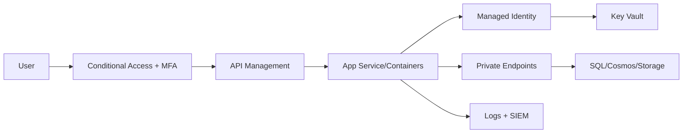

# Security, IAM, and Networking

## Overview

This topic covers identity-first security architecture for enterprise Azure systems, including Entra ID, managed identities, Key Vault, private networking, and Zero Trust.
It focuses on how security controls compose end-to-end across identity, network, secrets, and runtime layers so that security remains enforceable in production, not only documented in design reviews.

## Why this topic matters

Security failures are architecture failures. Senior architect interviews test whether you design secure-by-default platforms, not post-deployment fixes.
You are expected to explain control placement, enforcement order, blast-radius reduction, and operational detection/response strategy. Feature knowledge alone is not sufficient.

## Core concepts

- Microsoft Entra ID
- RBAC and PIM
- Managed identities
- Key Vault
- VNet segmentation
- NSG, Firewall, WAF
- Private endpoints
- Zero Trust

## Detailed explanation of each concept

### Entra ID
Identity control plane for users, apps, and workload identities. Supports conditional access, MFA, identity governance, and federation.

### PIM and privileged access
Just-in-time elevation and approval-based privileged access reduce standing admin risk.

### Managed identity
Removes embedded credentials from code and enables token-based service authentication.

### Key Vault
Centralized secrets/keys/certificates storage with access controls and audit trail.

### Network segmentation
VNet/subnet boundaries isolate workload tiers and reduce lateral movement.

### NSG, Firewall, WAF
- NSG: subnet/NIC traffic filtering
- Firewall: centralized L3-L7 network control and egress governance
- WAF: HTTP threat protection (OWASP)

### Private endpoints
Private connectivity for PaaS resources; avoids public internet exposure.

### Zero Trust
Continuous verification model based on identity, device, context, and resource sensitivity.

## Evaluation (How to assess security architecture quality)

Assess security design with objective measures:
- Privileged identity exposure and standing admin reduction
- Secret rotation and secret usage compliance
- Public endpoint exposure count for sensitive workloads
- Mean time to detect/respond for auth/network anomalies
- Policy and control coverage across subscriptions/environments

## Architecture / flow diagram



**Flow explanation:**  
Identity assurance starts at user and policy gate (conditional access + MFA), then access is brokered through governed API entry points. Workloads use managed identity to access secrets and data, while private endpoints and centralized logging enforce network isolation and detection. This creates defense-in-depth across identity, network, and workload planes.

## Real-world example

A healthcare platform isolates PHI workloads in private subnets, enforces PIM for admin operations, uses managed identity for service access, and routes all data service calls over private endpoints with strict logging.
The operating model includes regular privileged access review, access anomaly alerting, and evidence generation for audits. This is critical in regulated environments where technical controls must be demonstrable and repeatable.

## Best practices

- Enforce MFA and conditional access for privileged roles.
- Use managed identities for service-to-service auth.
- Deny public network access for sensitive data stores.
- Centralize security logs and monitor identity anomalies.
- Define threat scenarios and test response runbooks quarterly.
- Align security controls with workload criticality tiers.

## Common mistakes / misconceptions

- Treating NSG as full replacement for firewall.
- Storing secrets in app settings.
- Allowing broad contributor roles in production.
- Assuming private endpoint automatically solves all data security concerns.
- Treating security as a one-time architecture milestone instead of ongoing operations.

## Industry relevance

Required in finance, healthcare, telecom, and public-sector architectures with strict compliance and auditability requirements.
Security architecture maturity strongly correlates with outage impact, breach probability, and regulatory risk exposure in enterprise cloud programs.

## Interview discussion points

- Identity-first architecture
- Retrieval-time authorization for AI/data workloads
- Defense-in-depth
- Security vs delivery speed
- Privileged access lifecycle and zero-standing-access patterns
- Detection and response architecture

## Question Answer Format (Use for each question)

For every security question, answer using:
1. **Question summary** (2-3 lines)
2. **Crisp answer** (7-8 lines)
3. **Deep explanation** (~40 lines)
4. **Simple diagram or flow**
5. **Related topic link(s)**

## Links to dependent / related topics

- [Azure Governance Hierarchy](../azure/governance_hierarchy.md)
- [APIM, Messaging, Eventing](../integration/apim_messaging_eventing.md)
- [RAG, Azure OpenAI, AI Search](../data-ai/rag_openai_ai_search.md)

## Interview Questions (50)

### Top 5 most asked industry questions
1. How do you implement least privilege at enterprise scale?
2. Entra ID + RBAC + PIM: how do they work together?
3. Why use managed identities over secrets?
4. When should private endpoints be mandatory?
5. How do you implement Zero Trust in Azure?

### Scenario-based questions
6. Security audit finds public SQL endpoints. Immediate and long-term fix?
7. CI/CD pipeline needs production access. How do you secure it?
8. Partner users need temporary API access. Design approach?
9. Security team requests full lock-down, product team needs agility. Resolve?
10. You detect unusual token usage from workload identity. Response plan?
11. Sensitive workload requires no outbound internet. Network design?
12. Legacy app cannot use managed identity immediately. Transition plan?
13. Multi-region app with strict compliance. Identity and network model?
14. Incident occurred due to leaked secret. Prevent recurrence?
15. High-privilege admin account compromise scenario: containment steps?

### Tricky questions
16. Is RBAC enough without PIM?
17. Is Key Vault optional if app is in private VNet?
18. Can NSG replace WAF?
19. Does private endpoint remove need for encryption?
20. Is MFA enough for Zero Trust?
21. Can managed identity be overprivileged?
22. Is firewall required for all architectures?
23. Does mTLS remove need for OAuth?
24. Should all workloads share one managed identity?
25. Is API security only APIM responsibility?

### Cross-topic/interlinked questions
26. How does governance policy enforce security baselines?
27. How do APIM policies align with Entra ID claims?
28. How do private endpoints affect data platform architecture?
29. How does security design impact system latency/cost?
30. How do identity controls affect RAG retrieval authorization?
31. How do networking controls affect DR architecture?
32. How do RBAC boundaries map to subscription design?
33. How do security controls influence compute service choices?
34. How do you secure event-driven architectures end to end?
35. How do security logs feed incident response playbooks?

### Additional deep-dive questions
36. Explain user-assigned vs system-assigned managed identity.
37. How do you design secret rotation strategy?
38. How do you implement JIT admin access?
39. How do you segment workloads in hub-spoke?
40. How do you design egress control strategy?
41. How do you use Defender for Cloud in architecture governance?
42. How do you test security controls before production?
43. How do you design break-glass access?
44. How do you secure service-to-service API calls?
45. How do you approach certificate lifecycle management?
46. How do you enforce encryption standards across teams?
47. How do you handle cross-tenant identity federation securely?
48. How do you track privileged operations for audits?
49. How do you present security trade-offs to business stakeholders?
50. How do you mature security posture quarter over quarter?

## Answers for important questions (Summary + Crisp + Deep)

### Q1. How do you implement least privilege at enterprise scale?

**Question summary:**  
Interviewers want to validate if you can enforce least privilege consistently across subscriptions, teams, and environments without blocking delivery.

**Crisp answer (7-8 lines):**  
Start with role design aligned to job responsibilities.  
Assign access through Entra groups, not direct users.  
Scope permissions at lowest practical boundary.  
Use PIM for just-in-time privileged elevation.  
Remove standing admin rights from daily accounts.  
Run periodic access recertification with owners.  
Automate policy checks for overprivileged assignments.  
Least privilege needs governance plus operations discipline.

**Deep explanation (~40 lines):**  
Enterprise least privilege fails when role assignments are ad hoc and unmanaged over time. Build a permission model from business operating roles, then map those roles to minimal RBAC permissions.

Use group-based access to reduce drift and make review manageable. Scope decisions matter: resource group or specific resource assignments usually provide better blast-radius control than broad subscription-level roles.

Privileged access should be time-bound using PIM with approval and MFA conditions. This limits exposure window and improves auditability.

Regular access recertification is essential because teams and responsibilities change continuously. Combine this with automated detection of overly broad assignments and stale privileged roles.

In interviews, emphasize that least privilege at scale is not a one-time setup; it is an ongoing identity governance capability.

**Answer summary:**  
Implement least privilege through role engineering, scoped group-based RBAC, JIT privilege elevation, and continuous recertification.

**Simple diagram:**  
```text
Business Role -> Entra Group -> Scoped RBAC -> PIM Elevation -> Periodic Access Review
```

**Trusted reference links:**  
- https://learn.microsoft.com/en-us/azure/role-based-access-control/overview  
- https://learn.microsoft.com/en-us/entra/id-governance/privileged-identity-management/pim-configure

### Q2. Entra ID + RBAC + PIM: how do they work together?

**Question summary:**  
This checks whether you can clearly separate authentication, authorization, and privilege governance responsibilities.

**Crisp answer (7-8 lines):**  
Entra ID authenticates users and workloads.  
RBAC authorizes what they can do in Azure.  
PIM controls when privileged roles can be activated.  
Entra Conditional Access strengthens authentication context.  
RBAC scopes permissions by resource hierarchy.  
PIM adds approval, MFA, and time limits to elevation.  
Together they reduce standing privilege risk.  
This trio forms identity-centered access governance.

**Deep explanation (~40 lines):**  
A common interview failure is mixing these services conceptually. Entra ID verifies identity and issues tokens. RBAC evaluates those identities against role assignments and scope to determine allowed actions.

PIM sits on top of privileged role assignments and converts static admin access into controlled, temporary elevation. This greatly reduces attack surface from compromised admin credentials.

Conditional Access further strengthens assurance by considering risk signals and device context during authentication.

When combined, these controls create layered access governance: verify identity strongly, authorize minimally, and elevate rarely with oversight. In interviews, present this as a coordinated control model rather than separate tools.

**Answer summary:**  
Entra authenticates, RBAC authorizes, and PIM governs privileged activation; together they implement secure, auditable access control.

**Simple diagram:**  
```text
Identity (Entra) -> Permission Check (RBAC Scope) -> Temporary Admin Activation (PIM)
```

**Trusted reference links:**  
- https://learn.microsoft.com/en-us/entra/fundamentals/whatis  
- https://learn.microsoft.com/en-us/azure/role-based-access-control/overview

### Q3. Why use managed identities over secrets?

**Question summary:**  
Interviewers evaluate your ability to reduce credential risk in cloud-native service-to-service authentication.

**Crisp answer (7-8 lines):**  
Managed identity removes hardcoded credentials from code.  
Authentication uses short-lived tokens from Entra ID.  
It reduces secret rotation and leakage overhead.  
Access can be scoped with RBAC and Key Vault policies.  
It improves auditability of service authentication activity.  
It supports secure automation for CI/CD and runtime.  
It lowers breach probability from secret sprawl.  
Managed identity is safer and operationally simpler.

**Deep explanation (~40 lines):**  
Secrets embedded in config files, pipelines, or scripts are common breach vectors. Managed identities replace these static credentials with platform-managed identities that request tokens at runtime.

Because tokens are short-lived and issued on demand, the impact of accidental exposure is reduced compared with long-lived secrets. Access is still controlled through RBAC and resource-specific authorization.

Operationally, teams avoid frequent secret rotation incidents and configuration drift tied to credential updates. This improves reliability as well as security.

In interviews, position managed identity as both security control and DevOps simplification mechanism.

**Answer summary:**  
Use managed identities to eliminate static secrets, enforce scoped token-based auth, and reduce credential management risk.

**Simple diagram:**  
```text
Workload -> Managed Identity Token -> Target Resource (RBAC Authorized)
```

**Trusted reference links:**  
- https://learn.microsoft.com/en-us/entra/identity/managed-identities-azure-resources/overview

### Q4. When should private endpoints be mandatory?

**Question summary:**  
This tests risk-based networking decisions for data protection and compliance-sensitive workloads.

**Crisp answer (7-8 lines):**  
Use mandatory private endpoints for regulated data workloads.  
Require them for production systems with strict threat models.  
Apply when internet exposure is unacceptable by policy.  
Use for critical data stores serving sensitive applications.  
Pair with DNS and routing controls for consistency.  
Restrict public network access after private path validation.  
Audit exceptions with explicit risk approval.  
Treat private access as default for high-risk systems.

**Deep explanation (~40 lines):**  
Private endpoints are not required for every workload, but they should be mandatory where data sensitivity, compliance obligations, or threat exposure demands private network-only access.

Public endpoints increase attack surface and often complicate audit narratives for regulated industries. Private endpoints constrain access paths and enable tighter network governance.

Implementation requires correct private DNS integration and routing, otherwise teams face connectivity and troubleshooting issues. Policies should enforce private endpoint usage for designated resource classes.

In interviews, explain private endpoints as a risk-based control tied to data classification and exposure tolerance.

**Answer summary:**  
Make private endpoints mandatory for sensitive and regulated workloads where public exposure is not acceptable.

**Simple diagram:**  
```text
App Subnet -> Private Endpoint -> Data Service (Public Access Disabled)
```

**Trusted reference links:**  
- https://learn.microsoft.com/en-us/azure/private-link/private-endpoint-overview

### Q5. How do you implement Zero Trust in Azure?

**Question summary:**  
Interviewers test if you can convert Zero Trust principles into practical identity, network, and monitoring controls.

**Crisp answer (7-8 lines):**  
Start with explicit verification for every access request.  
Enforce MFA and Conditional Access for user access.  
Apply least privilege with RBAC and PIM controls.  
Use managed identities for workload authentication.  
Segment network paths and prefer private connectivity.  
Continuously monitor identity and traffic anomalies.  
Assume breach and design rapid containment response.  
Zero Trust is continuous policy enforcement, not a product.

**Deep explanation (~40 lines):**  
Zero Trust implementation means no implicit trust based on location or network membership. Every identity and workload interaction must be validated with contextual controls.

For users, Conditional Access and MFA provide baseline strong authentication. For workloads, managed identities and scoped authorization replace shared credentials.

Network segmentation and private endpoints reduce lateral movement opportunities. Detection engineering with logs, alerts, and automated response is necessary because prevention controls are not perfect.

Zero Trust maturity grows over time through policy hardening, access reviews, and incident learnings. In interviews, present it as a security operating model rather than a single architecture diagram.

**Answer summary:**  
Implement Zero Trust with explicit verification, least privilege, segmented connectivity, and continuous detection-response operations.

**Simple diagram:**  
```text
Request -> Verify Identity/Context -> Authorize Least Privilege -> Monitor -> Adapt Controls
```

**Trusted reference links:**  
- https://learn.microsoft.com/en-us/security/zero-trust/azure-infrastructure-overview

### Q6. Security audit finds public SQL endpoints. Immediate and long-term fix?

**Question summary:**  
This scenario tests incident response plus architectural remediation for exposed data services.

**Crisp answer (7-8 lines):**  
Immediately restrict public network access to SQL.  
Allow only approved admin jump paths temporarily.  
Validate active connections and suspicious access logs.  
Enable private endpoint connectivity for applications.  
Update DNS/routing for private data path adoption.  
Enforce policy to deny future public exposure.  
Document exception workflow with risk approvals.  
Treat this as both incident and governance gap.

**Deep explanation (~40 lines):**  
Public SQL endpoint exposure should be handled as active risk. First contain by narrowing or disabling public access while preserving controlled operational access for emergency support.

Immediately review authentication logs, firewall rules, and unusual query patterns to assess potential compromise. Then move application traffic to private endpoints with validated DNS resolution.

Long term, enforce organization policies that deny public endpoint enablement for sensitive data services. Include compliance checks in CI/CD and periodic posture scans.

In interviews, distinguish immediate containment from durable governance controls.

**Answer summary:**  
Contain exposure quickly, migrate traffic to private access, and enforce policy controls to prevent recurrence.

**Simple diagram:**  
```text
Public SQL Exposure -> Contain Access -> Private Endpoint Migration -> Policy Enforcement
```

**Trusted reference links:**  
- https://learn.microsoft.com/en-us/azure/azure-sql/database/private-endpoint-overview

### Q7. CI/CD pipeline needs production access. How do you secure it?

**Question summary:**  
Interviewers evaluate non-human privileged access design for deployment automation.

**Crisp answer (7-8 lines):**  
Use workload identity/federated credentials for pipeline auth.  
Avoid long-lived secrets in pipeline variables.  
Grant least-privilege RBAC scoped to deployment targets.  
Separate build and deploy permissions by environment.  
Require approvals for production release stages.  
Log and monitor all privileged pipeline actions.  
Rotate trust relationships and review access regularly.  
Pipeline identity should be tightly governed.

**Deep explanation (~40 lines):**  
Pipelines often become hidden admin backdoors when overprivileged and secret-based. Use federated identity with Entra so pipelines obtain short-lived tokens instead of storing credentials.

Scope RBAC to required resources and operations only. Keep production deployment rights isolated from development workflows and enforce approval gates.

Audit trails must link deployment actions to pipeline runs and approvers. Regular reviews should remove stale pipeline identities and broadened permissions.

In interviews, show secure CI/CD as identity governance plus release control architecture.

**Answer summary:**  
Secure pipelines with federated identity, scoped RBAC, environment segregation, approval gates, and full deployment auditing.

**Simple diagram:**  
```text
Pipeline -> Federated Entra Token -> Scoped Prod RBAC -> Audited Deployment
```

**Trusted reference links:**  
- https://learn.microsoft.com/en-us/azure/devops/pipelines/security/overview

### Q8. Partner users need temporary API access. Design approach?

**Question summary:**  
This tests external identity onboarding with least privilege and time-bound access controls.

**Crisp answer (7-8 lines):**  
Onboard partner identities via Entra B2B governance.  
Assign partner-specific groups and API product scopes.  
Use APIM subscriptions with quota and throttling policies.  
Apply time-bound access with review and expiry controls.  
Enforce MFA and conditional access for partner sign-in.  
Monitor usage anomalies and revoke quickly when needed.  
Keep partner permissions isolated per contract.  
Temporary access must be auditable and revocable.

**Deep explanation (~40 lines):**  
Partner access design should avoid shared credentials and broad internal role assignments. Use external identities with explicit group-based authorization mapped to partner contract boundaries.

Time-bounded access reduces long-term exposure and aligns with project-based or temporary collaborations. APIM adds consumption governance through quotas and key lifecycle controls.

Conditional Access and MFA provide assurance against weak external identity hygiene. Logging and anomaly detection are needed for operational security.

In interviews, describe this as controlled external collaboration with strong identity and gateway governance.

**Answer summary:**  
Provide temporary partner API access through governed external identities, scoped API entitlements, and enforced expiry with monitoring.

**Simple diagram:**  
```text
Partner Identity -> Entra B2B Group -> APIM Product Scope -> Time-bound Access Expiry
```

**Trusted reference links:**  
- https://learn.microsoft.com/en-us/entra/external-id/what-is-b2b

### Q9. Security team requests full lock-down, product team needs agility. Resolve?

**Question summary:**  
Interviewers test your ability to balance risk control with delivery speed in enterprise architecture.

**Crisp answer (7-8 lines):**  
Adopt tiered control model by data and workload risk.  
Enforce strict baselines as non-negotiable guardrails.  
Allow controlled flexibility through approved patterns.  
Use policy-as-code for fast, consistent enforcement.  
Define exception process with expiration and owner.  
Measure both security posture and delivery lead time.  
Review trade-offs in architecture governance forum.  
Balance comes from risk-based standardization.

**Deep explanation (~40 lines):**  
Security versus agility conflict usually indicates missing shared control framework. Define mandatory baseline controls for all workloads, then allow differentiated controls by risk classification.

Developer agility improves when secure reference architectures and automation are provided, reducing manual approvals. Exception handling should be transparent, time-limited, and tied to risk acceptance.

Joint metrics help avoid one-sided optimization. Track incident exposure and release velocity together.

In interviews, show that governance design enables both control and speed when based on standard patterns and clear risk boundaries.

**Answer summary:**  
Resolve lock-down versus agility by enforcing baseline guardrails, enabling risk-tiered flexibility, and automating secure-by-default patterns.

**Simple diagram:**  
```text
Risk Tiering -> Baseline Controls + Pattern Flexibility -> Faster Delivery with Controlled Risk
```

**Trusted reference links:**  
- https://learn.microsoft.com/en-us/azure/cloud-adoption-framework/ready/landing-zone/design-area/security

### Q10. You detect unusual token usage from workload identity. Response plan?

**Question summary:**  
This tests incident handling for potential workload identity compromise or misuse.

**Crisp answer (7-8 lines):**  
Contain by disabling or restricting affected identity access.  
Investigate token issuance and resource access logs.  
Validate source workload integrity and deployment changes.  
Rotate associated credentials/certs if applicable.  
Review RBAC scope and remove unnecessary permissions.  
Hunt for lateral movement or related anomalies.  
Restore access with tightened controls and monitoring.  
Capture lessons into identity threat playbooks.

**Deep explanation (~40 lines):**  
Unusual token usage may indicate compromised workload runtime, stolen tokens, or misconfigured automation. Immediate containment should reduce blast radius by restricting identity permissions or disabling assignments.

Forensics should correlate token logs, resource activity, and deployment timelines to determine root cause. Validate compute environment integrity, including container image provenance and host posture.

Post-incident hardening includes narrower RBAC scopes, improved anomaly detection, and stronger runtime security controls. In interviews, present response as containment, investigation, eradication, and improvement cycle.

**Answer summary:**  
Respond to suspicious workload token activity with rapid containment, deep log correlation, scope reduction, and post-incident control hardening.

**Simple diagram:**  
```text
Anomaly Detected -> Contain Identity -> Investigate Logs/Runtime -> Remediate -> Harden
```

**Trusted reference links:**  
- https://learn.microsoft.com/en-us/azure/architecture/framework/security/monitoring-and-threat-detection

### Q11. Sensitive workload requires no outbound internet. Network design?
**Question summary:**  
Tests egress-zero architecture for high-security environments.
**Crisp answer (7-8 lines):**  
Use private endpoints for all PaaS dependencies.  
Route egress through centralized Azure Firewall/NVA.  
Deny direct internet via UDR and NSG controls.  
Use private DNS zones for internal name resolution.  
Host updates via approved private mirrors/proxies.  
Allowlist only required destinations if any.  
Continuously monitor egress attempts and blocks.  
Design for explicit outbound control by default.
**Deep explanation (~40 lines):**  
No-internet egress requires strict routing and dependency planning. Workloads often break when hidden outbound dependencies are missed, so dependency inventory is essential before enforcement.

Private endpoints and internal DNS keep data traffic on private network paths. Firewall-enforced egress plus deny-by-default routing prevents uncontrolled external access.

Operationally, teams need secure update channels and package repositories without public internet paths. In interviews, emphasize that zero-egress design is both network and supply-chain architecture.
**Answer summary:**  
Implement no-internet workloads using private connectivity, forced egress control, dependency mapping, and monitored deny-by-default outbound policy.
**Simple diagram:**  
```text
Workload Subnet -> UDR -> Azure Firewall -> Approved Private Destinations Only
```
**Trusted reference links:**  
- https://learn.microsoft.com/en-us/azure/firewall/overview

### Q12. Legacy app cannot use managed identity immediately. Transition plan?
**Question summary:**  
Evaluates pragmatic modernization from secret-based auth to identity-based auth.
**Crisp answer (7-8 lines):**  
Inventory all secrets and access paths first.  
Move secrets to Key Vault as immediate control.  
Use short rotation cycles during transition period.  
Refactor app components incrementally for managed identity.  
Migrate highest-risk paths first (prod data access).  
Add telemetry to confirm token-based access adoption.  
Remove legacy secrets after cutover verification.  
Treat transition as staged risk reduction.
**Deep explanation (~40 lines):**  
Legacy systems often cannot switch all auth paths at once. Start by centralizing secrets in Key Vault to reduce exposure while planning identity migration slices.

Prioritize components handling sensitive data and high privilege. Build adapter layers where needed so code changes can be incremental.

Track migration progress with metrics (secret calls vs token calls). In interviews, show this as controlled modernization with measurable security improvement.
**Answer summary:**  
Use a phased migration: stabilize secrets in Key Vault, prioritize high-risk flows, adopt managed identity incrementally, then retire secrets.
**Simple diagram:**  
```text
Legacy Secret Auth -> Key Vault Centralization -> Incremental MI Refactor -> Secret Retirement
```
**Trusted reference links:**  
- https://learn.microsoft.com/en-us/azure/key-vault/general/basic-concepts

### Q13. Multi-region app with strict compliance. Identity and network model?
**Question summary:**  
Tests global architecture with compliance-aware segmentation and access governance.
**Crisp answer (7-8 lines):**  
Use centralized identity governance with regional policy constraints.  
Apply least privilege roles per region and function.  
Keep data-plane access private with regional endpoints.  
Enforce residency rules via region-scoped deployments.  
Use conditional access and PIM for privileged actions.  
Standardize controls with policy-as-code globally.  
Run region failover drills with compliance checks.  
Design for resilience without violating regulations.
**Deep explanation (~40 lines):**  
Multi-region compliance architecture must align availability goals with residency and regulatory boundaries. Identity governance can be centralized, but permissions and operations should remain region-scoped to limit cross-region exposure.

Network architecture should use private connectivity and regional segmentation to prevent unintended data transit. Governance automation ensures consistent enforcement while honoring local legal constraints.

In interviews, highlight explicit control mapping: identity assurance, network isolation, and compliance evidence per region.
**Answer summary:**  
Build compliant multi-region security with centralized governance, regional isolation, private data paths, and auditable policy consistency.
**Simple diagram:**  
```text
Global Identity Governance -> Region A/B Private Workloads -> Region-scoped Access + Compliance Controls
```
**Trusted reference links:**  
- https://learn.microsoft.com/en-us/azure/well-architected/security/design-networking

### Q14. Incident occurred due to leaked secret. Prevent recurrence?
**Question summary:**  
Evaluates post-incident remediation depth and prevention controls.
**Crisp answer (7-8 lines):**  
Revoke and rotate exposed secret immediately.  
Assess blast radius using access and activity logs.  
Migrate secret usage to managed identities where possible.  
Enforce secret scanning in repos and pipelines.  
Restrict Key Vault access and enable purge protection.  
Implement short-lived credentials and rotation automation.  
Train teams on secure secret handling patterns.  
Convert incident learnings into enforced controls.
**Deep explanation (~40 lines):**  
Secret leakage incidents require both immediate containment and systemic fixes. Rotation alone is insufficient if root causes such as code storage, weak pipeline controls, or broad access remain.

Adopt preventative controls including secret scanning, policy checks, and managed identity migration. Key Vault hardening with audit logging and access minimization is essential.

Use incident retrospective outputs to update architecture standards and CI/CD guardrails. In interviews, emphasize institutional learning and control uplift.
**Answer summary:**  
Prevent recurrence by combining rapid containment, root-cause remediation, identity-based auth adoption, and pipeline guardrails.
**Simple diagram:**  
```text
Leak Detected -> Revoke/Rotate -> Root Cause Fix -> Guardrails + MI Adoption -> Ongoing Monitoring
```
**Trusted reference links:**  
- https://learn.microsoft.com/en-us/azure/security/fundamentals/secrets-best-practices

### Q15. High-privilege admin account compromise scenario: containment steps?
**Question summary:**  
Tests privileged identity incident response and blast-radius control.
**Crisp answer (7-8 lines):**  
Disable compromised account and revoke active sessions.  
Block risky sign-ins and reset auth factors immediately.  
Review privileged actions and scope potential damage.  
Temporarily tighten PIM activation and approvals.  
Validate integrity of critical resources and policies.  
Use break-glass process only if necessary.  
Communicate incident status to governance stakeholders.  
Restore operations with hardened privileged controls.
**Deep explanation (~40 lines):**  
Privileged account compromise is high severity due to broad potential impact. Immediate identity containment must happen before detailed investigation to prevent further unauthorized changes.

Analyze activity logs for destructive operations, privilege escalation, and persistence mechanisms. Validate key control planes including IAM roles, network policies, and security settings.

Post-incident actions include stricter PIM policies, stronger Conditional Access, and frequent privileged access reviews. In interviews, present a clear containment-to-recovery sequence.
**Answer summary:**  
Contain privileged compromise rapidly, assess and remediate impact, then harden privileged access governance to reduce recurrence risk.
**Simple diagram:**  
```text
Privileged Compromise -> Disable/Revoke -> Impact Analysis -> Recovery -> Privilege Hardening
```
**Trusted reference links:**  
- https://learn.microsoft.com/en-us/entra/identity/role-based-access-control/security-emergency-access

### Q16. Is RBAC enough without PIM?
**Question summary:** Tests privileged governance maturity.
**Crisp answer (7-8 lines):** RBAC defines permissions, but not activation control. PIM adds time-bound elevation, approval, and audit. Without PIM, privileged access is often standing and high risk. Use both for strong admin governance. RBAC grants role scope. PIM governs privilege lifecycle. Combined controls reduce exposure window. Enterprise designs should avoid static admin access.
**Deep explanation (~40 lines):** RBAC alone can still leave users permanently overprivileged. PIM reduces standing privilege and enforces just-in-time access with stronger accountability. Interviewers expect this distinction.
**Answer summary:** RBAC is necessary but insufficient for privileged operations; add PIM for secure admin lifecycle control.
**Simple diagram:** ```text
RBAC (Who can) + PIM (When/how long) -> Safer Privileged Access
```
**Trusted reference links:** https://learn.microsoft.com/en-us/entra/id-governance/privileged-identity-management/pim-configure

### Q17. Is Key Vault optional if app is in private VNet?
**Question summary:** Tests secret management fundamentals.
**Crisp answer (7-8 lines):** Private network reduces exposure path but does not replace secret governance. Key Vault centralizes storage, access policy, rotation, and auditing. Secrets in code/config remain risky even on private networks. Use managed identity + Key Vault. Apply least privilege to vault access. Enable logging and rotation workflows. Private VNet and Key Vault are complementary controls.  
**Deep explanation (~40 lines):** Network isolation protects transport boundaries; it does not solve credential lifecycle, auditing, or accidental disclosure. Key Vault remains required for secure secret operations.
**Answer summary:** Keep Key Vault even in private VNets; network and secret controls address different risks.
**Simple diagram:** ```text
Private App -> Managed Identity -> Key Vault -> Secret Access
```
**Trusted reference links:** https://learn.microsoft.com/en-us/azure/key-vault/general/overview

### Q18. Can NSG replace WAF?
**Question summary:** Tests control-plane separation.
**Crisp answer (7-8 lines):** NSG filters network traffic by IP/port/protocol. WAF inspects HTTP/S payload threats like OWASP attacks. NSG cannot detect SQL injection/XSS patterns. Use NSG for segmentation baseline. Use WAF for app-layer protection. Combine both in defense-in-depth. Choose controls by layer and threat type.  
**Deep explanation (~40 lines):** L3/L4 filters and L7 protections are different. Architects should layer NSG and WAF rather than substitute one for the other.
**Answer summary:** NSG cannot replace WAF; each protects different attack layers.
**Simple diagram:** ```text
Client -> WAF(L7) -> App Subnet(NSG L3/L4) -> Workload
```
**Trusted reference links:** https://learn.microsoft.com/en-us/azure/web-application-firewall/overview

### Q19. Does private endpoint remove need for encryption?
**Question summary:** Tests misunderstanding of private connectivity.
**Crisp answer (7-8 lines):** No. Private endpoint secures path exposure, not data confidentiality guarantees alone. Keep TLS in transit and encryption at rest. Use key management controls for sensitive data. Private routing lowers attack surface. Encryption protects data if boundaries fail. Apply both controls always. Compliance often mandates encryption regardless of network.  
**Deep explanation (~40 lines):** Private network paths reduce internet exposure but do not eliminate insider, misconfiguration, or lateral risks. Encryption remains mandatory for layered defense and compliance.
**Answer summary:** Private endpoint complements, not replaces, encryption controls.
**Simple diagram:** ```text
Private Path + TLS + Encrypted Storage -> Stronger Data Protection
```
**Trusted reference links:** https://learn.microsoft.com/en-us/azure/security/fundamentals/encryption-overview

### Q20. Is MFA enough for Zero Trust?
**Question summary:** Tests Zero Trust depth.
**Crisp answer (7-8 lines):** MFA is baseline, not complete Zero Trust. Add device posture, risk-based access, least privilege, segmentation, and continuous monitoring. Use conditional policies and workload identities. Assume breach and contain quickly. Enforce per-request verification context. Govern privileged access lifecycles. Zero Trust is an operating model, not a single control.
**Deep explanation (~40 lines):** MFA strengthens identity assurance but does not address authorization scope, network movement, workload compromise, or runtime anomalies.
**Answer summary:** MFA is necessary but insufficient; Zero Trust requires layered continuous controls.
**Simple diagram:** ```text
MFA + Conditional Access + Least Privilege + Monitoring = Zero Trust
```
**Trusted reference links:** https://learn.microsoft.com/en-us/security/zero-trust/

### Q21. Can managed identity be overprivileged?
**Question summary:** Tests least-privilege for workloads.
**Crisp answer (7-8 lines):** Yes, identities can be overprivileged like users. Scope roles minimally. Avoid contributor at subscription scope. Separate identities per service/domain. Review role assignments periodically. Use PIM-like governance for sensitive ops where possible. Monitor identity usage anomalies. Treat workload IAM as first-class governance.
**Deep explanation (~40 lines):** Managed identity removes secrets, but authorization risk remains. Overbroad role assignments expand blast radius during workload compromise.
**Answer summary:** Managed identities must be governed with strict scoped RBAC and recurring reviews.
**Simple diagram:** ```text
Workload MI -> Minimal RBAC Scope -> Resource
```
**Trusted reference links:** https://learn.microsoft.com/en-us/azure/active-directory/managed-identities-azure-resources/

### Q22. Is firewall required for all architectures?
**Question summary:** Risk-based control selection.
**Crisp answer (7-8 lines):** Not universally mandatory, but common for enterprise governance. Use firewall when centralized egress/inbound control is required. Low-risk isolated workloads may use lighter patterns. Evaluate compliance, threat model, and complexity. Prefer standard security baseline for production. Document justified exceptions. Reassess as architecture evolves.  
**Deep explanation (~40 lines):** Security controls should follow risk and policy obligations; many enterprises standardize firewall due to visibility and governance benefits.
**Answer summary:** Firewall usage is risk-driven, often baseline in enterprise platforms.
**Simple diagram:** ```text
Risk/Compliance High -> Central Firewall; Lower Risk -> Pattern-based Exception
```
**Trusted reference links:** https://learn.microsoft.com/en-us/azure/firewall/firewall-faq

### Q23. Does mTLS remove need for OAuth?
**Question summary:** Authentication vs authorization distinction.
**Crisp answer (7-8 lines):** mTLS validates channel and certificate identity. OAuth handles delegated authorization and scopes. mTLS alone does not provide user/app consent model. Use both when API authorization context matters. mTLS strengthens service trust. OAuth controls access rights granularity. Layer both for high-assurance APIs.  
**Deep explanation (~40 lines):** mTLS and OAuth solve different concerns; combining them is common in high-security APIs.
**Answer summary:** mTLS does not replace OAuth; they are complementary.
**Simple diagram:** ```text
mTLS(Channel Trust) + OAuth(Token Scope) -> Secure API Access
```
**Trusted reference links:** https://learn.microsoft.com/en-us/azure/architecture/best-practices/api-design

### Q24. Should all workloads share one managed identity?
**Question summary:** Tests blast-radius awareness.
**Crisp answer (7-8 lines):** No. Shared identity increases blast radius and audit ambiguity. Use per-workload or per-domain identities. Assign minimal permissions per identity. Separate prod/non-prod identities. Rotate and monitor access independently. Improves forensic traceability. Supports safer least-privilege.
**Deep explanation (~40 lines):** Identity sharing couples services and makes authorization boundaries weak. Isolation improves containment and operational clarity.
**Answer summary:** Use identity segmentation; avoid one shared managed identity.
**Simple diagram:** ```text
Service A MI / Service B MI / Service C MI -> Distinct RBAC
```
**Trusted reference links:** https://learn.microsoft.com/en-us/entra/identity/managed-identities-azure-resources/managed-identity-best-practice-recommendations

### Q25. Is API security only APIM responsibility?
**Question summary:** Tests layered security mindset.
**Crisp answer (7-8 lines):** No. APIM is one layer for gateway controls. Services must enforce authorization and input validation too. Data layer needs encryption and access controls. Network and identity controls remain essential. Observability drives detection/response. Shared responsibility across layers. Defense-in-depth is required.
**Deep explanation (~40 lines):** Relying solely on gateway security creates single-point assumptions. End-to-end controls are required from ingress to data access.
**Answer summary:** API security is multi-layered; APIM is necessary but not sufficient.
**Simple diagram:** ```text
APIM + Service AuthZ + Data Security + Monitoring
```
**Trusted reference links:** https://learn.microsoft.com/en-us/azure/well-architected/security/

### Q26. How does governance policy enforce security baselines?
**Question summary:** Cross-topic governance + security enforcement.
**Crisp answer (7-8 lines):** Use Azure Policy initiatives for mandatory controls. Deny noncompliant deployments. Audit/modify where auto-remediation fits. Assign at management-group scope. Track compliance drift dashboards. Use exemptions with expiry/approval. Integrate into CI/CD gates.
**Deep explanation (~40 lines):** Governance policy scales security standards across subscriptions and teams with consistent enforcement.
**Answer summary:** Security baselines at scale require policy-as-code with central assignment and controlled exceptions.
**Simple diagram:** ```text
Management Group Policy -> Subscription Deployments -> Compliant/Denied
```
**Trusted reference links:** https://learn.microsoft.com/en-us/azure/governance/policy/overview

### Q27. How do APIM policies align with Entra ID claims?
**Question summary:** Identity-to-API authorization mapping.
**Crisp answer (7-8 lines):** Validate JWT from Entra at APIM. Check claims/roles/scopes in policy. Route/limit by consumer identity context. Pass trusted claims to backend minimally. Enforce deny-by-default for missing claims. Version policy with contract changes. Monitor auth failures by claim type.
**Deep explanation (~40 lines):** Gateway claim checks reduce unauthorized access early and provide consistent identity-aware access controls.
**Answer summary:** Entra claims drive APIM authorization and policy decisions for consistent access enforcement.
**Simple diagram:** ```text
Token(Entra Claims) -> APIM Validate/Authorize -> Backend
```
**Trusted reference links:** https://learn.microsoft.com/en-us/azure/api-management/validate-jwt-policy

### Q28. How do private endpoints affect data platform architecture?
**Question summary:** Security-network impact on data design.
**Crisp answer (7-8 lines):** They enforce private-only data access paths. Require private DNS integration and hub-spoke routing. Increase control, reduce public exposure. Add operational complexity for name resolution/connectivity. Influence ETL/service placement decisions. Improve compliance posture. Need standardized deployment patterns.
**Deep explanation (~40 lines):** Private endpoints reshape connectivity, DNS, and integration choices across data services.
**Answer summary:** Private endpoints strengthen data security but require disciplined network and DNS architecture.
**Simple diagram:** ```text
Data Workloads -> Private DNS -> Private Endpoint -> Data Service
```
**Trusted reference links:** https://learn.microsoft.com/en-us/azure/private-link/private-endpoint-dns

### Q29. How does security design impact system latency/cost?
**Question summary:** Trade-off discussion capability.
**Crisp answer (7-8 lines):** Security layers can add hops and processing overhead. Private paths and firewalls may increase latency slightly. Token validation and encryption add compute cost. Poor design can overpay without risk reduction. Right-sized controls optimize outcome. Measure p95 latency plus risk posture. Tune by workload criticality.
**Deep explanation (~40 lines):** Security should be risk-optimized, not maximalist. Measure and tune controls to preserve business SLOs.
**Answer summary:** Good security design balances protection with measurable performance and cost impacts.
**Simple diagram:** ```text
Control Layering -> Latency/Cost Impact -> Measured Optimization
```
**Trusted reference links:** https://learn.microsoft.com/en-us/azure/well-architected/tradeoffs

### Q30. How do identity controls affect RAG retrieval authorization?
**Question summary:** AI + IAM integration.
**Crisp answer (7-8 lines):** Enforce user/workload identity before retrieval. Filter indexed content by access claims. Apply tenant and role-aware data boundaries. Prevent unauthorized document grounding. Log retrieval decisions for audit. Use managed identities for service components. Include policy checks in prompt pipeline.
**Deep explanation (~40 lines):** RAG security depends on retrieval-time authorization, not only model safety controls.
**Answer summary:** Identity-aware retrieval is essential to prevent data leakage in AI responses.
**Simple diagram:** ```text
User Claims -> Retrieval Filter -> Authorized Chunks -> LLM Response
```
**Trusted reference links:** https://learn.microsoft.com/en-us/azure/architecture/ai-ml/guide/rag/rag-solution-design-and-evaluation-guide

### Q31. How do networking controls affect DR architecture?
**Question summary:** Cross-topic security + resilience.
**Crisp answer (7-8 lines):** DR needs mirrored network/security controls in secondary region. Replicate firewall/NSG/route policies. Ensure private DNS failover patterns. Test identity and endpoint failover regularly. Avoid permissive shortcuts during DR. Validate RTO/RPO with security intact. Document runbooks.
**Deep explanation (~40 lines):** Insecure DR designs often fail open. Security parity across primary and secondary is required.
**Answer summary:** DR must preserve security posture while restoring service.
**Simple diagram:** ```text
Primary Secure Network <-> Secondary Secure Network (Failover Ready)
```
**Trusted reference links:** https://learn.microsoft.com/en-us/azure/well-architected/reliability/disaster-recovery

### Q32. How do RBAC boundaries map to subscription design?
**Question summary:** Governance hierarchy alignment.
**Crisp answer (7-8 lines):** Split subscriptions by environment, domain, and control boundaries. Assign RBAC at minimal needed scope. Avoid broad cross-subscription contributor roles. Use management groups for inherited policy/roles. Separate platform vs app team permissions. Review boundary model quarterly. Balance manageability and isolation.
**Deep explanation (~40 lines):** Subscription boundaries are security boundaries in practice; design them for least privilege and operational ownership.
**Answer summary:** Subscription architecture should enable clean RBAC isolation and accountability.
**Simple diagram:** ```text
Mgmt Group -> Subscriptions (Prod/NonProd/Domain) -> Scoped RBAC
```
**Trusted reference links:** https://learn.microsoft.com/en-us/azure/cloud-adoption-framework/ready/enterprise-scale/management-group-and-subscription-organization

### Q33. How do security controls influence compute service choices?
**Question summary:** Compute-security trade-off understanding.
**Crisp answer (7-8 lines):** Choose services based on identity/network/security feature fit. Need VNet injection/private endpoints? shortlist accordingly. Consider patching responsibility and runtime hardening. Evaluate secretless auth support. Match control needs with operational capacity. Avoid service choice by cost alone. Security posture is a core decision factor.
**Deep explanation (~40 lines):** Compute choice impacts attack surface, control depth, and compliance burden.
**Answer summary:** Select compute options that natively support required security controls and governance.
**Simple diagram:** ```text
Security Requirements -> Compute Capability Fit -> Service Selection
```
**Trusted reference links:** https://learn.microsoft.com/en-us/azure/well-architected/service-guides/

### Q34. How do you secure event-driven architectures end to end?
**Question summary:** Messaging security architecture.
**Crisp answer (7-8 lines):** Use identity-based auth for publishers/consumers. Scope queue/topic permissions minimally. Encrypt transport/storage and protect sensitive fields. Validate schema and data classification. Monitor broker access anomalies. Secure DLQ and replay workflows. Apply tenant isolation where needed.
**Deep explanation (~40 lines):** Event security spans identity, data protection, broker authorization, and operational tooling.
**Answer summary:** End-to-end event security requires layered controls across publish, transit, consume, and operations.
**Simple diagram:** ```text
Publisher -> Secure Broker -> Authorized Consumer + Audited Operations
```
**Trusted reference links:** https://learn.microsoft.com/en-us/azure/architecture/guide/multitenant/approaches/messaging

### Q35. How do security logs feed incident response playbooks?
**Question summary:** Detection-to-response integration.
**Crisp answer (7-8 lines):** Centralize logs in SIEM with normalized schemas. Correlate identity, network, and workload events. Map alerts to runbook actions. Define severity-based response SLAs. Automate containment for high-confidence detections. Capture incident metrics and lessons. Tune detections continuously.
**Deep explanation (~40 lines):** Logging value appears only when tied to decisionable response workflows.
**Answer summary:** Build closed-loop detection and response using centralized telemetry and actionable runbooks.
**Simple diagram:** ```text
Security Logs -> SIEM Correlation -> Alert -> Playbook Action -> Feedback
```
**Trusted reference links:** https://learn.microsoft.com/en-us/azure/sentinel/overview

### Q36. Explain user-assigned vs system-assigned managed identity.
**Question summary:** Core identity model distinction.
**Crisp answer (7-8 lines):** System-assigned identity is tied to one resource lifecycle. User-assigned identity is standalone and reusable across resources. System-assigned simplifies single-workload scenarios. User-assigned helps shared identity governance patterns. Both use Entra token auth. Choose by lifecycle and blast-radius needs. Avoid over-sharing user-assigned identities.
**Deep explanation (~40 lines):** Lifecycle coupling is the key decision driver.
**Answer summary:** Pick system-assigned for simplicity, user-assigned for reuse with strict governance.
**Simple diagram:** ```text
System MI <-> One Resource | User MI -> Many Resources
```
**Trusted reference links:** https://learn.microsoft.com/en-us/entra/identity/managed-identities-azure-resources/overview

### Q37. How do you design secret rotation strategy?
**Question summary:** Secret lifecycle governance.
**Crisp answer (7-8 lines):** Classify secrets by criticality and expiry needs. Automate rotation where supported. Use versioned retrieval in apps. Test rotation in lower environments first. Monitor stale/expiring secrets. Minimize manual handling steps. Prioritize migration to managed identity.
**Deep explanation (~40 lines):** Rotation failures cause outages; design for automation and app compatibility.
**Answer summary:** Rotation strategy must be automated, tested, monitored, and progressively reduced via secretless auth.
**Simple diagram:** ```text
Create -> Store -> Rotate -> Validate -> Retire
```
**Trusted reference links:** https://learn.microsoft.com/en-us/azure/key-vault/secrets/tutorial-rotation

### Q38. How do you implement JIT admin access?
**Question summary:** Privileged risk reduction.
**Crisp answer (7-8 lines):** Use PIM-eligible roles, not permanent active roles. Require approval and MFA for activation. Set short activation durations. Capture justification and audit logs. Alert on unusual activation patterns. Review eligibility regularly. Remove unused privileged assignments.
**Deep explanation (~40 lines):** JIT shrinks exposure window and improves accountability.
**Answer summary:** Implement JIT via PIM with strict activation controls and continuous review.
**Simple diagram:** ```text
Eligible Role -> Request -> Approve/MFA -> Time-bound Active -> Expire
```
**Trusted reference links:** https://learn.microsoft.com/en-us/entra/id-governance/privileged-identity-management/pim-how-to-activate-role

### Q39. How do you segment workloads in hub-spoke?
**Question summary:** Network isolation architecture.
**Crisp answer (7-8 lines):** Place shared services in hub. Isolate app tiers/domains into spokes. Use NSGs, UDRs, and firewall policies for controlled east-west traffic. Apply per-spoke DNS and private endpoint patterns. Separate prod and non-prod spokes. Monitor flow logs for policy drift.
**Deep explanation (~40 lines):** Segmentation should match blast-radius and ownership boundaries.
**Answer summary:** Hub-spoke segmentation enforces controlled connectivity and workload isolation at scale.
**Simple diagram:** ```text
Hub(Security/Shared) <-> Spoke A | Spoke B | Spoke C
```
**Trusted reference links:** https://learn.microsoft.com/en-us/azure/architecture/networking/architecture/hub-spoke

### Q40. How do you design egress control strategy?
**Question summary:** Outbound governance for data exfiltration prevention.
**Crisp answer (7-8 lines):** Force outbound via centralized firewall/proxy. Deny direct internet from workloads. Allowlist required destinations by FQDN/IP tags. Segment egress by environment criticality. Log all outbound decisions. Alert on unusual egress patterns. Review allowlists regularly.
**Deep explanation (~40 lines):** Egress control reduces exfiltration and command-and-control risk.
**Answer summary:** Centralized, logged, allowlist-based egress governance is key for enterprise security.
**Simple diagram:** ```text
Workload -> UDR -> Firewall Allowlist -> External Destinations
```
**Trusted reference links:** https://learn.microsoft.com/en-us/azure/firewall/tutorial-firewall-dnat-policy

### Q41. How do you use Defender for Cloud in architecture governance?
**Question summary:** Continuous posture management usage.
**Crisp answer (7-8 lines):** Enable Defender plans per workload type. Use secure score and recommendations as governance inputs. Integrate findings with remediation backlog. Automate policy enforcement for recurring issues. Track trends by subscription/team. Escalate high-severity exposure quickly. Use exemptions with justification.
**Deep explanation (~40 lines):** Defender helps operationalize posture management beyond design-time controls.
**Answer summary:** Use Defender as a continuous control feedback loop for architecture governance.
**Simple diagram:** ```text
Defender Findings -> Governance Review -> Remediation -> Posture Improvement
```
**Trusted reference links:** https://learn.microsoft.com/en-us/azure/defender-for-cloud/defender-for-cloud-introduction

### Q42. How do you test security controls before production?
**Question summary:** Shift-left security validation.
**Crisp answer (7-8 lines):** Validate IaC policy compliance in CI. Run identity/network integration tests. Execute threat scenarios and abuse cases. Perform secrets and dependency scans. Test incident runbooks in staging. Verify logging and alert paths. Require security gates before promotion.
**Deep explanation (~40 lines):** Pre-production testing should include controls, detection, and response workflows.
**Answer summary:** Test security as part of delivery pipeline and operational rehearsal.
**Simple diagram:** ```text
CI Security Tests -> Staging Threat Drills -> Gate -> Production
```
**Trusted reference links:** https://learn.microsoft.com/en-us/azure/devops/migrate/security-validation-cicd-pipeline

### Q43. How do you design break-glass access?
**Question summary:** Emergency access governance.
**Crisp answer (7-8 lines):** Create emergency accounts with strict controls. Exclude only from blocking conditions required for recovery. Store credentials securely with dual control. Monitor and alert on any use. Test break-glass process periodically. Enforce post-use review and credential reset. Keep account count minimal.
**Deep explanation (~40 lines):** Break-glass access is for exceptional outages; misuse risk is high without governance.
**Answer summary:** Break-glass accounts need tight governance, monitoring, and rehearsed procedures.
**Simple diagram:** ```text
Emergency Need -> Controlled Break-glass Access -> Recovery -> Review/Reset
```
**Trusted reference links:** https://learn.microsoft.com/en-us/entra/identity/role-based-access-control/security-emergency-access

### Q44. How do you secure service-to-service API calls?
**Question summary:** Workload authentication architecture.
**Crisp answer (7-8 lines):** Use managed identities or app registrations with OAuth. Validate tokens at API gateway/service. Apply least-privilege scopes and audience checks. Use mTLS where required for channel assurance. Rotate certificates/credentials automatically. Log auth failures and anomalous calls. Avoid shared static secrets.
**Deep explanation (~40 lines):** Strong service auth requires identity-based trust, token validation, and scoped authorization.
**Answer summary:** Secure S2S APIs with token-based auth, scoped permissions, and layered transport protections.
**Simple diagram:** ```text
Service A Token -> API Validate -> Authorized Service B
```
**Trusted reference links:** https://learn.microsoft.com/en-us/azure/architecture/microservices/design/security

### Q45. How do you approach certificate lifecycle management?
**Question summary:** PKI operational maturity.
**Crisp answer (7-8 lines):** Inventory all cert consumers and expiry timelines. Centralize cert storage/issuance workflow. Automate renewal and deployment. Use alerts for impending expiration. Separate dev/test/prod certificate chains. Revoke compromised certificates immediately. Test rollover and trust updates regularly.
**Deep explanation (~40 lines):** Certificate outages are preventable with lifecycle automation and visibility.
**Answer summary:** Manage certs as an automated lifecycle with inventory, renewal, rollout, and revocation controls.
**Simple diagram:** ```text
Issue -> Deploy -> Monitor Expiry -> Renew/Roll -> Revoke(if needed)
```
**Trusted reference links:** https://learn.microsoft.com/en-us/azure/key-vault/certificates/about-certificates

### Q46. How do you enforce encryption standards across teams?
**Question summary:** Standardization at scale.
**Crisp answer (7-8 lines):** Publish encryption baseline policy by data class. Enforce through Azure Policy and CI checks. Standardize key management patterns. Require TLS minimum versions platform-wide. Monitor noncompliant resources continuously. Use approved exception process with expiry. Review standards with security architecture board.
**Deep explanation (~40 lines):** Encryption compliance needs automated enforcement and clear ownership, not guideline documents only.
**Answer summary:** Enforce encryption via policy-as-code, platform defaults, and exception governance.
**Simple diagram:** ```text
Standards -> Policy Enforcement -> Compliance Monitoring -> Remediation
```
**Trusted reference links:** https://learn.microsoft.com/en-us/azure/security/fundamentals/encryption-overview

### Q47. How do you handle cross-tenant identity federation securely?
**Question summary:** External collaboration risk control.
**Crisp answer (7-8 lines):** Use Entra B2B/B2B Direct Connect policies. Restrict app/resource access by partner groups. Enforce MFA and conditional access for external users. Limit trust settings and review regularly. Monitor cross-tenant sign-in anomalies. Use least privilege and time-bound assignments. Revoke stale external access promptly.
**Deep explanation (~40 lines):** Cross-tenant federation needs strict trust boundaries and monitoring to avoid external overreach.
**Answer summary:** Secure federation with constrained trust, conditional controls, and lifecycle-governed external access.
**Simple diagram:** ```text
Partner Tenant Identity -> Federated Trust Policy -> Scoped Resource Access
```
**Trusted reference links:** https://learn.microsoft.com/en-us/entra/external-id/cross-tenant-access-overview

### Q48. How do you track privileged operations for audits?
**Question summary:** Auditability of high-risk actions.
**Crisp answer (7-8 lines):** Centralize activity logs for IAM and control-plane actions. Tag privileged operations and correlate with approver context. Retain records per compliance policy. Alert on unusual privileged patterns. Link actions to ticket/change references. Run periodic audit completeness checks. Keep immutable log storage where required.
**Deep explanation (~40 lines):** Privileged audit trails must be complete, queryable, and tamper-resistant for compliance and forensics.
**Answer summary:** Track privileged operations through correlated immutable logging with governance-backed review.
**Simple diagram:** ```text
Privileged Action -> Activity Log -> Correlation/Audit Store -> Review
```
**Trusted reference links:** https://learn.microsoft.com/en-us/azure/azure-monitor/essentials/activity-log

### Q49. How do you present security trade-offs to business stakeholders?
**Question summary:** Leadership communication competency.
**Crisp answer (7-8 lines):** Translate controls into business risk and impact terms. Show options with cost, latency, and risk reduction values. Use clear residual-risk framing. Highlight compliance and customer trust implications. Recommend preferred path with rationale. State assumptions and dependencies. Define follow-up metrics.
**Deep explanation (~40 lines):** Business stakeholders need decision-ready trade-offs, not technical details alone.
**Answer summary:** Communicate security options as quantified business decisions with residual risk transparency.
**Simple diagram:** ```text
Security Option A/B/C -> Cost/Impact/Risk Matrix -> Decision
```
**Trusted reference links:** https://learn.microsoft.com/en-us/azure/well-architected/security/principles

### Q50. How do you mature security posture quarter over quarter?
**Question summary:** Continuous improvement operating model.
**Crisp answer (7-8 lines):** Define maturity KPIs and target states each quarter. Prioritize highest-risk gaps from posture data. Run remediation sprints with ownership. Measure control adoption and incident trends. Reduce exception backlog systematically. Validate improvements with drills and reviews. Update standards from lessons learned.
**Deep explanation (~40 lines):** Security maturity is iterative; posture programs need metrics, ownership, and governance cadence.
**Answer summary:** Improve posture quarterly through risk-prioritized roadmap, measurable controls, and continuous feedback loops.
**Simple diagram:** ```text
Assess -> Prioritize -> Remediate -> Validate -> Standardize -> Repeat
```
**Trusted reference links:** https://learn.microsoft.com/en-us/azure/advisor/advisor-security-recommendations
