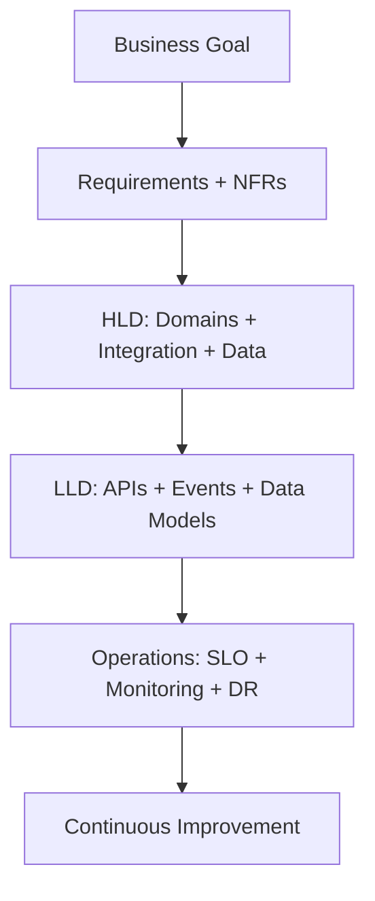

# System Design (HLD/LLD) for Senior Architect Interviews

## Overview
This page gives a complete approach for turning business problems into architecture decisions across high-level design (HLD) and low-level design (LLD).
It is structured for interview execution: how to frame requirements, model trade-offs, communicate decisions, and defend architecture choices under pressure.

## Why this topic matters
Architect interviews heavily rely on case discussions; structure and trade-offs matter more than memorized services.
This topic tests your ability to think in systems: balancing reliability, security, performance, delivery speed, and cost while accounting for organizational constraints and migration realities.

## Core concepts
- Requirement clarification
- NFR engineering
- HLD decomposition
- LLD contracts and data flows
- Resilience and operations
- Cost and governance alignment

## Detailed explanation of each concept

### Requirement clarification
Capture business objective, critical user journeys, constraints, compliance, and success metrics.

### NFR engineering
Define latency, throughput, availability, RTO/RPO, security levels, and cost guardrails before component selection.

### HLD
Domain boundaries, service responsibilities, integration patterns, data stores, and trust zones.

### LLD
API contracts, event schemas, idempotency keys, retry policies, and data model details.

### Resilience and operations
SLI/SLO, alerting, incident runbooks, load tests, chaos drills, and DR exercises.

### Cost/governance alignment
Ensure architecture choices map to budget targets and governance controls.

## Evaluation (How to assess system design quality)

Use these checkpoints:
- Requirement completeness and assumption clarity
- NFR traceability to architecture decisions
- Failure mode coverage and recovery strategy
- Operational readiness (monitoring, runbooks, ownership)
- Cost and governance fit for target environment

## Architecture / flow diagram



**Flow explanation:**  
System design starts with business intent, converts that into measurable requirements and NFRs, then decomposes into HLD components and LLD contracts. Operations and reliability are designed as first-class architecture elements. Feedback from production loops into iterative design improvements.

## Real-world example
Modernizing claims platform: HLD defines domain services (policy, claims, payment), async event bus, APIM edge, and secure data zones; LLD defines event contracts, retry/dead-letter policy, and access scopes by domain.
The team phased migration using strangler-style boundaries and parallel run validation. This reduced business risk while enabling incremental modernization of legacy modules.

## Best practices
- Start with business outcomes and NFRs.
- Keep architecture diagrams tied to runtime behavior.
- Make failure behavior explicit.
- Document decisions and trade-offs.
- Explicitly separate must-have scope from optional enhancements in interview responses.
- Tie each major component to at least one measurable requirement.

## Common mistakes / misconceptions
- Jumping to tool selection before requirement analysis.
- Ignoring operational model in design.
- No explicit data consistency strategy.
- No migration path from current state.
- Designing idealized target state without transitional architecture.

## Industry relevance
Universal for enterprise modernization, cloud transformation, and platform re-architecture programs.
System design quality directly impacts program risk, delivery predictability, and executive confidence in transformation initiatives.

## Interview discussion points
- Trade-off reasoning
- Risk-driven design
- Migration strategy
- Architecture governance
- NFR-first thinking
- Operations as architecture, not post-implementation concern

## Question Answer Format (Use for each question)

For every system design question, answer using:
1. **Question summary** (2-3 lines)
2. **Crisp answer** (7-8 lines)
3. **Deep explanation** (~40 lines)
4. **Simple diagram or flow**
5. **Related topic link(s)**

## Links to dependent / related topics
- [Azure Governance Hierarchy](../azure/governance_hierarchy.md)
- [Security, IAM, Networking](../security/security_iam_networking.md)
- [Compute Architecture Decisions](../compute/compute_architecture.md)
- [APIM, Messaging, Eventing](../integration/apim_messaging_eventing.md)
- [RAG, Azure OpenAI, AI Search](../data-ai/rag_openai_ai_search.md)

## Interview Questions (50)
1. How do you start a system design interview response?
2. How do you convert business goals to NFRs?
3. How do you choose between sync and async boundaries?
4. How do you design service boundaries?
5. How do you model data ownership?
6. How do you estimate scale assumptions?
7. How do you design caching layers?
8. How do you design for p99 latency?
9. How do you make architecture resilient to dependencies failing?
10. How do you define and measure SLOs?
11. How do you design DR strategy and prove readiness?
12. How do you design multi-region architecture?
13. How do you design API versioning strategy?
14. How do you design schema evolution for events?
15. How do you handle distributed transactions?
16. How do you design idempotent APIs and consumers?
17. How do you approach backpressure and throttling?
18. How do you control architecture cost?
19. How do you design observability from day one?
20. How do you build security zones in architecture?
21. How do you design migration from monolith to services?
22. How do you phase rollout by business risk?
23. How do you design architecture for compliance constraints?
24. How do you handle legacy integration constraints?
25. How do you choose data stores by workload type?
26. How do you compare eventual vs strong consistency decisions?
27. How do you design feature flags and safe releases?
28. How do you handle capacity planning uncertainty?
29. How do you design fail-safe defaults?
30. How do you design runbooks for critical workflows?
31. How do you select reliability patterns for queues/events?
32. How do you design tenant isolation?
33. How do you present trade-offs to non-technical leadership?
34. How do you prioritize technical debt in architecture roadmap?
35. How do you define architecture principles for teams?
36. How do you enforce standards without slowing teams?
37. How do you align platform and product team responsibilities?
38. How do you design architecture review board process?
39. How do you design quality gates in CI/CD?
40. How do you justify buy vs build decisions?
41. How do you design for unknown future requirements?
42. How do you avoid over-engineering?
43. How do you balance extensibility and simplicity?
44. How do you design secure AI-assisted workflows?
45. How do you integrate data architecture into system design?
46. How do you design for partial data corruption scenarios?
47. How do you test architecture assumptions early?
48. How do you use ADRs in architecture governance?
49. How do you create first-90-day architecture plan?
50. How do you conclude a system design interview strongly?

## Answers for important questions (Summary + Crisp + Deep)

### Q1. How do you start a system design interview response?
**Question summary:** Tests structure and communication under ambiguity.
**Crisp answer (7-8 lines):** Start with business goal and scope. Clarify assumptions and constraints explicitly. Define success metrics and key user journeys. Capture NFRs before picking components. State trade-off priorities upfront. Propose high-level architecture flow. Validate with interviewer before diving deeper. Keep reasoning transparent throughout.
**Deep explanation (~40 lines):** A strong start shows control of problem framing, not tool memorization. Interviewers look for clarity, sequencing, and assumption management.
**Answer summary:** Begin with framing, measurable requirements, and aligned design direction.
**Simple diagram:** ```text
Goal -> Scope/Assumptions -> NFRs -> HLD -> LLD
```
**Trusted reference links:** https://learn.microsoft.com/en-us/azure/architecture/guide/design-principles/

### Q2. How do you convert business goals to NFRs?
**Question summary:** Business-to-technical translation capability.
**Crisp answer (7-8 lines):** Map each business objective to measurable quality targets. Define latency, availability, throughput, and recovery goals. Add compliance and security constraints. Set cost guardrails and scaling assumptions. Prioritize NFR conflicts explicitly. Tie every major component to one or more NFRs. Document traceability in design notes. Revisit NFRs as scope evolves.
**Deep explanation (~40 lines):** NFR engineering converts vague priorities into decision criteria and prevents architecture drift.
**Answer summary:** NFRs should be measurable, prioritized, and traceable to design decisions.
**Simple diagram:** ```text
Business Outcome -> NFR Targets -> Architecture Choices
```
**Trusted reference links:** https://learn.microsoft.com/en-us/azure/well-architected/

### Q3. How do you choose between sync and async boundaries?
**Question summary:** Integration pattern decision-making.
**Crisp answer (7-8 lines):** Use sync for immediate client confirmation paths. Use async for decoupling and burst smoothing. Evaluate latency tolerance and consistency needs. Prefer async for long-running/non-critical side effects. Keep sync chains short to reduce failure coupling. Add idempotency and retries for async paths. Mix both deliberately by workflow step. Document boundary rationale.
**Deep explanation (~40 lines):** Boundary choices shape resilience and user experience; there is rarely one pattern for all steps.
**Answer summary:** Choose interaction style per business semantics, latency, and failure tolerance.
**Simple diagram:** ```text
Critical immediate step -> Sync | Deferred processing -> Async
```
**Trusted reference links:** https://learn.microsoft.com/en-us/azure/architecture/guide/architecture-styles/event-driven

### Q4. How do you design service boundaries?
**Question summary:** Domain decomposition competence.
**Crisp answer (7-8 lines):** Start from business capabilities and ownership. Group high-cohesion behaviors together. Minimize cross-boundary chatty calls. Align boundaries with data ownership. Separate high-change from stable domains. Define clear contracts between services. Validate boundaries with team structure realities. Refactor boundaries based on production evidence.
**Deep explanation (~40 lines):** Good boundaries reduce coupling and improve delivery autonomy.
**Answer summary:** Design boundaries around domain ownership, cohesion, and operability.
**Simple diagram:** ```text
Business Capability A/B/C -> Service Boundaries -> Contracted Interfaces
```
**Trusted reference links:** https://learn.microsoft.com/en-us/azure/architecture/microservices/model/microservice-boundaries

### Q5. How do you model data ownership?
**Question summary:** Consistency and coupling control.
**Crisp answer (7-8 lines):** Assign one authoritative owner per data domain. Keep writes owned by source service. Share via APIs/events, not shared database writes. Define consistency expectations per workflow. Use projections for read optimization. Include lineage and schema ownership. Govern changes through versioned contracts. Monitor data drift and reconciliation gaps.
**Deep explanation (~40 lines):** Clear data ownership prevents hidden coupling and conflicting updates.
**Answer summary:** One domain owner per dataset with explicit integration contracts.
**Simple diagram:** ```text
Owner Service -> Publish/Serve Data -> Consumer Projections
```
**Trusted reference links:** https://learn.microsoft.com/en-us/azure/architecture/microservices/design/data-considerations

### Q6. How do you estimate scale assumptions?
**Question summary:** Capacity reasoning under uncertainty.
**Crisp answer (7-8 lines):** Estimate user growth and peak traffic envelopes. Define read/write and payload profiles. Model p95/p99 throughput scenarios. Add burst and seasonal multipliers. Plan headroom for failure mode load shifts. Validate assumptions with telemetry quickly. Recalibrate capacity quarterly. Keep assumptions explicit in design artifacts.
**Deep explanation (~40 lines):** Scale estimates should be hypothesis-driven and iteratively refined from real usage.
**Answer summary:** Use transparent assumptions, stress envelopes, and continuous recalibration.
**Simple diagram:** ```text
Demand Inputs -> Peak Model -> Capacity Plan -> Telemetry Feedback
```
**Trusted reference links:** https://learn.microsoft.com/en-us/azure/well-architected/performance-efficiency/

### Q7. How do you design caching layers?
**Question summary:** Performance vs correctness balancing.
**Crisp answer (7-8 lines):** Cache only data with acceptable staleness. Place cache close to access path. Define TTL by business freshness needs. Use invalidation on critical data changes. Segment cache keys by tenant/context. Protect against cache stampede patterns. Measure hit ratio and stale-read impact. Document cache semantics in contracts.
**Deep explanation (~40 lines):** Effective caching is a data semantics decision, not a generic optimization.
**Answer summary:** Cache by workload semantics with explicit freshness and invalidation strategy.
**Simple diagram:** ```text
Request -> Cache -> Backend Fallback -> Response
```
**Trusted reference links:** https://learn.microsoft.com/en-us/azure/architecture/best-practices/caching

### Q8. How do you design for p99 latency?
**Question summary:** Tail-latency architecture skill.
**Crisp answer (7-8 lines):** Identify longest dependency chains first. Reduce synchronous hops in critical path. Use timeouts and bounded retries. Precompute or cache expensive reads. Isolate noisy neighbors with resource controls. Measure p99 by endpoint and workflow stage. Optimize worst offenders iteratively. Design degradation fallback for overload periods.
**Deep explanation (~40 lines):** p99 improvements come from removing variability and dependency amplification.
**Answer summary:** Control critical path complexity and variability to improve tail latency.
**Simple diagram:** ```text
Critical Path Analysis -> Hop Reduction + Guardrails -> Lower p99
```
**Trusted reference links:** https://learn.microsoft.com/en-us/azure/architecture/patterns/bulkhead

### Q9. How do you make architecture resilient to dependencies failing?
**Question summary:** Dependency failure containment.
**Crisp answer (7-8 lines):** Classify dependencies by criticality. Add circuit breakers and timeouts. Use retry with jitter only for transient faults. Provide fallback or degraded responses where possible. Move non-critical steps to async processing. Isolate failure domains with bulkheads. Monitor dependency health and error budgets. Rehearse failure drills regularly.
**Deep explanation (~40 lines):** Resilience requires planned degradation, not blind retries.
**Answer summary:** Contain dependency failures through isolation, fallbacks, and controlled recovery.
**Simple diagram:** ```text
Dependency Fail -> Circuit Open -> Fallback/Queue -> Recovery
```
**Trusted reference links:** https://learn.microsoft.com/en-us/azure/architecture/patterns/circuit-breaker

### Q10. How do you define and measure SLOs?
**Question summary:** Reliability governance discipline.
**Crisp answer (7-8 lines):** Pick user-impacting SLIs first. Set SLO targets by business criticality. Include latency, availability, and correctness metrics. Track error budget burn continuously. Alert on burn rate, not only hard breaches. Review SLO trends in governance cadence. Tie remediation priorities to budget health. Keep SLOs realistic and revisable.
**Deep explanation (~40 lines):** SLOs make reliability trade-offs explicit and decisionable.
**Answer summary:** Use SLOs as measurable reliability commitments linked to action.
**Simple diagram:** ```text
SLIs -> SLO Targets -> Error Budget -> Engineering Decisions
```
**Trusted reference links:** https://learn.microsoft.com/en-us/azure/well-architected/reliability/

### Q11. How do you design DR strategy and prove readiness?
**Question summary:** DR planning and evidence maturity.
**Crisp answer (7-8 lines):** Define RTO/RPO by business workflow. Choose active-active or active-passive per domain. Replicate data with tested failover paths. Keep security and IAM parity in secondary region. Run scheduled failover and failback drills. Measure recovery against objectives. Track unresolved DR risks in backlog. Update runbooks from drill outcomes.
**Deep explanation (~40 lines):** DR is credible only when tested with measurable outcomes.
**Answer summary:** Design DR from business objectives and validate continuously through drills.
**Simple diagram:** ```text
Primary -> Replication -> Secondary -> Drill/Validate -> Improve
```
**Trusted reference links:** https://learn.microsoft.com/en-us/azure/well-architected/reliability/disaster-recovery

### Q12. How do you design multi-region architecture?
**Question summary:** Global availability and governance.
**Crisp answer (7-8 lines):** Select region topology by latency and compliance constraints. Define traffic routing and failover strategy. Separate stateless and stateful replication patterns. Keep config, policy, and secrets consistent across regions. Control data residency explicitly. Test regional outage scenarios regularly. Monitor region-specific health and cost. Avoid unnecessary global complexity.
**Deep explanation (~40 lines):** Multi-region adds resilience and latency benefits but increases operational complexity.
**Answer summary:** Use multi-region where justified by business need and operate with strict consistency controls.
**Simple diagram:** ```text
Global Entry -> Region A/B -> Stateful Replication + Failover
```
**Trusted reference links:** https://learn.microsoft.com/en-us/azure/architecture/guide/design-principles/design-for-resiliency

### Q13. How do you design API versioning strategy?
**Question summary:** Contract lifecycle governance.
**Crisp answer (7-8 lines):** Define compatibility policy upfront. Prefer additive non-breaking changes. Version explicitly when breaking changes are required. Provide migration windows and deprecation timelines. Track consumer adoption by version telemetry. Keep parallel versions during transition. Communicate roadmap clearly to consumers. Retire only after readiness criteria.
**Deep explanation (~40 lines):** API versioning is consumer-risk management, not naming style.
**Answer summary:** Govern versions with compatibility-first design and telemetry-driven retirement.
**Simple diagram:** ```text
v1 -> v2 Introduced -> Migration Window -> v1 Retirement
```
**Trusted reference links:** https://learn.microsoft.com/en-us/azure/architecture/best-practices/api-design

### Q14. How do you design schema evolution for events?
**Question summary:** Async contract stability.
**Crisp answer (7-8 lines):** Treat schemas as governed contracts. Use compatibility checks in CI. Favor additive fields and defaults. Version events with clear deprecation path. Test producer/consumer compatibility continuously. Reject breaking changes without coordination. Track parsing failures post-release. Maintain schema ownership accountability.
**Deep explanation (~40 lines):** Event schema drift causes delayed failures; prevention must be automated.
**Answer summary:** Evolve schemas with compatibility discipline and pipeline enforcement.
**Simple diagram:** ```text
Schema Change -> CI Validation -> Safe Publish -> Consumer Compatibility
```
**Trusted reference links:** https://learn.microsoft.com/en-us/azure/architecture/guide/multitenant/considerations/messaging

### Q15. How do you handle distributed transactions?
**Question summary:** Consistency in distributed systems.
**Crisp answer (7-8 lines):** Avoid broad ACID across services by default. Use saga/compensation for multi-step workflows. Keep local transactions within service boundaries. Design idempotent steps and retries. Persist workflow state transitions. Detect and reconcile partial failures. Use orchestration for critical control flows. Define business consistency expectations explicitly.
**Deep explanation (~40 lines):** Distributed transaction strategy must match domain consistency tolerance and failure behaviors.
**Answer summary:** Prefer eventual consistency with compensation unless strict consistency is mandatory.
**Simple diagram:** ```text
Step A -> Step B -> Step C | failure -> Compensation
```
**Trusted reference links:** https://learn.microsoft.com/en-us/azure/architecture/reference-architectures/saga/saga

### Q16. How do you design idempotent APIs and consumers?
**Question summary:** Duplicate-safe processing.
**Crisp answer (7-8 lines):** Use business idempotency keys on write operations. Persist key decisions durably. Return prior accepted result for duplicate requests. Make consumer handlers check prior processing state. Guard side effects with dedupe logic. Use bounded retries and DLQ for failures. Track duplicate rate metrics. Treat idempotency as correctness invariant.
**Deep explanation (~40 lines):** At-least-once delivery and client retries make duplicate handling mandatory.
**Answer summary:** Idempotency ensures repeated requests do not corrupt business state.
**Simple diagram:** ```text
Request/Event -> Idempotency Check -> Process Once -> Record
```
**Trusted reference links:** https://learn.microsoft.com/en-us/azure/architecture/patterns/idempotent-messaging

### Q17. How do you approach backpressure and throttling?
**Question summary:** Flow control under stress.
**Crisp answer (7-8 lines):** Monitor queue lag and saturation indicators. Apply ingress rate limits and quotas. Scale consumers with bounded concurrency. Prioritize critical traffic classes during overload. Use load shedding for non-critical operations. Coordinate producer throttling when needed. Alert on sustained pressure trends. Backpressure should preserve core service quality.
**Deep explanation (~40 lines):** Without backpressure, overload cascades into retries and outages.
**Answer summary:** Use end-to-end flow control to maintain stability during spikes.
**Simple diagram:** ```text
High Load -> Throttle/Scale/Prioritize -> Stable Throughput
```
**Trusted reference links:** https://learn.microsoft.com/en-us/azure/architecture/patterns/queue-based-load-leveling

### Q18. How do you control architecture cost?
**Question summary:** Cost-aware system design.
**Crisp answer (7-8 lines):** Set cost budgets and unit economics early. Tag resources by product and environment. Right-size compute/storage by usage profiles. Reduce wasteful retries and over-retention. Use autoscaling with safe bounds. Review spend against SLO outcomes monthly. Optimize high-cost hotspots first. Treat cost as design-time and runtime concern.
**Deep explanation (~40 lines):** Cost control requires visibility, guardrails, and continuous tuning.
**Answer summary:** Govern cost with measurable budgets, tagging, and iterative optimization.
**Simple diagram:** ```text
Usage + Cost Metrics -> Budget Guardrails -> Optimization Loop
```
**Trusted reference links:** https://learn.microsoft.com/en-us/azure/well-architected/cost-optimization/

### Q19. How do you design observability from day one?
**Question summary:** Operability-first architecture.
**Crisp answer (7-8 lines):** Define SLIs and key business events upfront. Standardize logs, metrics, and traces across services. Propagate correlation IDs end to end. Instrument critical workflows and failure paths. Build dashboards for latency, errors, and backlog. Tie alerts to runbooks and ownership. Validate telemetry in pre-prod tests. Observability is a core architecture deliverable.
**Deep explanation (~40 lines):** Systems are only operable if designed with consistent telemetry and actionable alerting.
**Answer summary:** Start with standardized telemetry design, correlation, and response workflows.
**Simple diagram:** ```text
Telemetry -> Correlation -> Dashboards/Alerts -> Runbook Action
```
**Trusted reference links:** https://learn.microsoft.com/en-us/azure/azure-monitor/overview

### Q20. How do you build security zones in architecture?
**Question summary:** Trust boundary design.
**Crisp answer (7-8 lines):** Define zones by sensitivity and exposure level. Segment network paths with least-privilege connectivity. Use identity-based access between zones. Place ingress controls at external boundaries. Protect data zones with private endpoints and strict RBAC. Monitor cross-zone traffic and access anomalies. Review zone model as workloads evolve. Security zoning limits blast radius.
**Deep explanation (~40 lines):** Clear trust boundaries prevent lateral movement and simplify compliance.
**Answer summary:** Design zones around risk, enforce least-privilege interaction, and monitor crossings.
**Simple diagram:** ```text
Edge Zone -> App Zone -> Data Zone (controlled boundaries)
```
**Trusted reference links:** https://learn.microsoft.com/en-us/azure/well-architected/security/design-networking

### Q21. How do you design migration from monolith to services?
**Question summary:** Transitional architecture strategy.
**Crisp answer (7-8 lines):** Map monolith modules and dependency hotspots. Choose strangler boundaries by business value and risk. Keep contracts stable with facade/gateway layer. Extract one capability at a time. Run coexistence with clear ownership split. Add observability before cutover. Reconcile data during parallel runs. Retire legacy paths progressively.
**Deep explanation (~40 lines):** Incremental migration reduces business disruption and improves control.
**Answer summary:** Use staged strangler migration with stable contracts and phased cutover.
**Simple diagram:** ```text
Monolith -> Facade -> Incremental Service Extraction -> Legacy Retirement
```
**Trusted reference links:** https://learn.microsoft.com/en-us/azure/architecture/patterns/strangler-fig

### Q22. How do you phase rollout by business risk?
**Question summary:** Risk-driven release planning.
**Crisp answer (7-8 lines):** Classify workflows by impact and reversibility. Start with low-risk cohorts or regions. Use canary and progressive traffic ramp-up. Define clear rollback criteria before release. Monitor business and technical KPIs during each phase. Gate expansion on stability evidence. Keep executive visibility on residual risks. Document phase outcomes.
**Deep explanation (~40 lines):** Phased rollout protects critical operations while validating assumptions.
**Answer summary:** Sequence releases by impact, observability, and rollback readiness.
**Simple diagram:** ```text
Low-risk cohort -> Canary -> Expand -> Full rollout
```
**Trusted reference links:** https://learn.microsoft.com/en-us/azure/well-architected/operational-excellence/release-engineering

### Q23. How do you design architecture for compliance constraints?
**Question summary:** Regulation-aware design.
**Crisp answer (7-8 lines):** Translate regulatory clauses into technical controls. Classify data and residency obligations. Enforce least privilege and audit trails. Apply encryption, retention, and deletion policies. Use policy-as-code for continuous compliance. Build evidence collection into operations. Validate controls in periodic audits. Design exceptions with governance approval.
**Deep explanation (~40 lines):** Compliance should be implemented as architecture controls with evidence, not documentation only.
**Answer summary:** Convert regulations into enforceable technical controls and auditable operations.
**Simple diagram:** ```text
Regulation -> Control Mapping -> Enforcement -> Audit Evidence
```
**Trusted reference links:** https://learn.microsoft.com/en-us/azure/compliance/

### Q24. How do you handle legacy integration constraints?
**Question summary:** Pragmatic modernization constraints.
**Crisp answer (7-8 lines):** Identify protocol and dependency limitations early. Add adapter layer to decouple legacy contracts. Preserve backward compatibility during transition. Offload non-critical workflows asynchronously. Track technical debt with retirement milestones. Use dual-run validation for critical interfaces. Contain risk with phased domain migration. Keep business continuity as primary objective.
**Deep explanation (~40 lines):** Legacy constraints require pattern-based adaptation, not forced rewrites.
**Answer summary:** Use adapters and phased extraction to modernize safely around legacy limits.
**Simple diagram:** ```text
New Services <-> Adapter Layer <-> Legacy System
```
**Trusted reference links:** https://learn.microsoft.com/en-us/azure/architecture/guide/technology-choices/integration-choose

### Q25. How do you choose data stores by workload type?
**Question summary:** Data platform decision quality.
**Crisp answer (7-8 lines):** Start with access patterns and consistency needs. Match OLTP to transactional stores. Use document/kv stores for flexible high-scale access. Use analytics stores for large aggregations. Evaluate latency, cost, and operations overhead. Consider compliance and encryption requirements. Avoid one-store-for-all anti-pattern. Revisit choices as workload evolves.
**Deep explanation (~40 lines):** Data store selection should follow workload semantics and operational constraints.
**Answer summary:** Choose stores by fit-to-purpose behavior, not platform preference.
**Simple diagram:** ```text
Workload Pattern -> Consistency/Scale Needs -> Data Store Choice
```
**Trusted reference links:** https://learn.microsoft.com/en-us/azure/architecture/data-guide/technology-choices/

### Q26. How do you compare eventual vs strong consistency decisions?
**Question summary:** Consistency trade-off reasoning.
**Crisp answer (7-8 lines):** Strong consistency for critical correctness workflows. Eventual consistency for scalable decoupled domains. Evaluate user tolerance for temporary divergence. Consider latency and availability implications. Add reconciliation for eventual models. Document invariants that must remain strict. Communicate trade-offs to stakeholders. Choose per domain, not globally.
**Deep explanation (~40 lines):** Consistency strategy should reflect business correctness and scalability needs.
**Answer summary:** Apply consistency models by workflow criticality and tolerance.
**Simple diagram:** ```text
Critical Invariants -> Strong | Scalable decoupled flows -> Eventual
```
**Trusted reference links:** https://learn.microsoft.com/en-us/azure/architecture/patterns/cqrs

### Q27. How do you design feature flags and safe releases?
**Question summary:** Controlled rollout architecture.
**Crisp answer (7-8 lines):** Use flags for decoupling deploy from release. Scope flags by tenant/cohort/region. Define default-safe states and kill switches. Track flag usage and stale flag cleanup. Combine with canary and observability gates. Avoid embedding long-term logic in flags. Document ownership and retirement dates.
**Deep explanation (~40 lines):** Feature flags reduce blast radius when used with strong governance.
**Answer summary:** Use flag governance to enable reversible, low-risk releases.
**Simple diagram:** ```text
Deploy -> Flag off/on by cohort -> Observe -> Expand/Rollback
```
**Trusted reference links:** https://learn.microsoft.com/en-us/azure/azure-app-configuration/overview

### Q28. How do you handle capacity planning uncertainty?
**Question summary:** Planning under ambiguous demand.
**Crisp answer (7-8 lines):** Build baseline and stress scenarios. Use autoscaling with guardrails. Keep buffer for known peak windows. Validate with load testing and synthetic traffic. Monitor leading indicators for saturation. Prepare fallback modes for overload. Review forecasts against real usage monthly.
**Deep explanation (~40 lines):** Capacity planning is a continuous forecast-and-correct loop.
**Answer summary:** Use scenario modeling, adaptive scaling, and proactive monitoring.
**Simple diagram:** ```text
Forecast -> Capacity Plan -> Monitor -> Reforecast
```
**Trusted reference links:** https://learn.microsoft.com/en-us/azure/well-architected/performance-efficiency/capacity-planning

### Q29. How do you design fail-safe defaults?
**Question summary:** Safety-first failure behavior.
**Crisp answer (7-8 lines):** Set secure deny defaults for access and policy checks. Prefer graceful degradation for optional features. Fail closed for sensitive operations. Include explicit timeout and fallback behaviors. Avoid ambiguous partial-success responses. Surface clear error semantics to callers. Test failure defaults in chaos scenarios.
**Deep explanation (~40 lines):** Default behavior during uncertainty determines outage severity and security exposure.
**Answer summary:** Design defaults that minimize harm during faults.
**Simple diagram:** ```text
Unknown/Failure -> Safe Default -> Controlled Recovery
```
**Trusted reference links:** https://learn.microsoft.com/en-us/azure/architecture/patterns/fail-safe

### Q30. How do you design runbooks for critical workflows?
**Question summary:** Operational readiness.
**Crisp answer (7-8 lines):** Define trigger conditions and severity mapping. Include step-by-step diagnosis and containment actions. Assign ownership and escalation paths clearly. Add rollback and communication templates. Link dashboards, logs, and scripts in one place. Rehearse runbooks in incident drills. Update after every real incident.
**Deep explanation (~40 lines):** Runbooks are executable architecture for incident response.
**Answer summary:** Build actionable, tested runbooks tied to telemetry and ownership.
**Simple diagram:** ```text
Alert -> Runbook Steps -> Escalate/Recover -> Postmortem Update
```
**Trusted reference links:** https://learn.microsoft.com/en-us/azure/well-architected/operational-excellence/instrument-application

### Q31. How do you select reliability patterns for queues/events?
**Question summary:** Messaging reliability design.
**Crisp answer (7-8 lines):** Start from failure modes and delivery guarantees needed. Use retries with backoff for transient failures. Use DLQ for poison messages. Apply idempotent consumers for duplicate safety. Use outbox for consistent publish after write. Add circuit breaker around fragile dependencies. Track queue lag and replay success.
**Deep explanation (~40 lines):** Pattern selection should map directly to identified failure scenarios.
**Answer summary:** Combine retry, idempotency, DLQ, and outbox based on workflow risk.
**Simple diagram:** ```text
Event -> Retry -> Success or DLQ -> Replay
```
**Trusted reference links:** https://learn.microsoft.com/en-us/azure/architecture/patterns/

### Q32. How do you design tenant isolation?
**Question summary:** Multi-tenant security and performance boundaries.
**Crisp answer (7-8 lines):** Choose isolation level by tenant risk tier. Enforce tenant-aware auth and data partitioning. Apply per-tenant quotas and throttling. Separate noisy or premium tenants where needed. Isolate secrets and keys by tenant sensitivity. Monitor tenant-level saturation and access anomalies. Document escalation paths for tenant impact.
**Deep explanation (~40 lines):** Tenant isolation balances cost efficiency with security and fairness.
**Answer summary:** Build tenant-aware boundaries across identity, data, traffic, and operations.
**Simple diagram:** ```text
Tenant Context -> AuthZ + Partitioning + Quotas -> Isolated Execution
```
**Trusted reference links:** https://learn.microsoft.com/en-us/azure/architecture/guide/multitenant/

### Q33. How do you present trade-offs to non-technical leadership?
**Question summary:** Executive communication skill.
**Crisp answer (7-8 lines):** Frame options by business impact first. Quantify cost, risk, and timeline differences. Use simple decision matrix with recommendation. Explain residual risk in plain language. Show dependencies and assumptions clearly. Provide phased option if uncertainty is high. End with explicit decision request.
**Deep explanation (~40 lines):** Leadership needs clarity, options, and decision consequences, not service-level detail.
**Answer summary:** Translate architecture trade-offs into decision-ready business terms.
**Simple diagram:** ```text
Option A/B/C -> Impact Matrix -> Recommendation -> Decision
```
**Trusted reference links:** https://learn.microsoft.com/en-us/azure/well-architected/framework

### Q34. How do you prioritize technical debt in architecture roadmap?
**Question summary:** Strategic debt management.
**Crisp answer (7-8 lines):** Classify debt by risk, cost, and delivery impact. Prioritize items that threaten reliability/security first. Quantify impact using incidents and slowdown metrics. Combine debt work with feature roadmap windows. Define target-state milestones and owners. Track debt burn-down transparently. Reassess quarterly with architecture board.
**Deep explanation (~40 lines):** Debt prioritization should be evidence-driven and outcome-oriented.
**Answer summary:** Tackle debt by measurable risk and business impact, not age alone.
**Simple diagram:** ```text
Debt Inventory -> Risk/Impact Score -> Roadmap Prioritization
```
**Trusted reference links:** https://learn.microsoft.com/en-us/azure/well-architected/operational-excellence/

### Q35. How do you define architecture principles for teams?
**Question summary:** Standard-setting capability.
**Crisp answer (7-8 lines):** Keep principles short, testable, and decision-oriented. Align principles to business goals and risk posture. Include examples of acceptable patterns. Tie principles to review checklists and templates. Revisit principles with major platform changes. Avoid vague slogans without enforcement. Train teams on practical application.
**Deep explanation (~40 lines):** Principles should guide decisions consistently across teams.
**Answer summary:** Effective principles are concise, actionable, and embedded in delivery workflows.
**Simple diagram:** ```text
Principles -> Standards -> Reviews -> Team Decisions
```
**Trusted reference links:** https://learn.microsoft.com/en-us/azure/architecture/guide/design-principles/

### Q36. How do you enforce standards without slowing teams?
**Question summary:** Governance vs velocity balance.
**Crisp answer (7-8 lines):** Automate guardrails in CI/CD and IaC checks. Provide golden paths and reusable templates. Use risk-tiered review depth. Keep exceptions fast but controlled. Measure cycle time and compliance together. Coach teams with enablement, not only gatekeeping. Continuously remove low-value controls.
**Deep explanation (~40 lines):** Automation and platform enablement are key to scalable governance.
**Answer summary:** Enforce standards through automation and developer-friendly secure defaults.
**Simple diagram:** ```text
Templates + Policy Checks -> Fast Compliant Delivery
```
**Trusted reference links:** https://learn.microsoft.com/en-us/azure/cloud-adoption-framework/ready/landing-zone/

### Q37. How do you align platform and product team responsibilities?
**Question summary:** Operating model clarity.
**Crisp answer (7-8 lines):** Define clear capability ownership boundaries. Platform owns shared services and guardrails. Product teams own domain logic and SLA outcomes. Establish interface contracts and support expectations. Use RACI for incident and change ownership. Review responsibilities as architecture evolves. Avoid gray zones with explicit escalation paths.
**Deep explanation (~40 lines):** Clear ownership reduces friction and accelerates incident resolution.
**Answer summary:** Align teams through explicit ownership contracts and operational interfaces.
**Simple diagram:** ```text
Platform Responsibilities | Product Responsibilities -> Shared Operating Model
```
**Trusted reference links:** https://learn.microsoft.com/en-us/azure/architecture/framework/devops/principles

### Q38. How do you design architecture review board process?
**Question summary:** Governance process design.
**Crisp answer (7-8 lines):** Set review scope by risk and change impact. Use lightweight templates for consistency. Time-box decisions and define outcomes. Include security, reliability, and cost checkpoints. Record decisions with rationale and actions. Track exceptions and follow-up closure. Continuously improve process with feedback.
**Deep explanation (~40 lines):** Review boards should accelerate quality decisions, not create bottlenecks.
**Answer summary:** Build outcome-driven review process with clear criteria and decision traceability.
**Simple diagram:** ```text
Proposal -> Risk-based Review -> Decision/Actions -> Follow-up
```
**Trusted reference links:** https://learn.microsoft.com/en-us/azure/architecture/framework/

### Q39. How do you design quality gates in CI/CD?
**Question summary:** Release quality enforcement.
**Crisp answer (7-8 lines):** Add gates for tests, security scans, and policy compliance. Require contract checks for APIs/events. Validate performance thresholds for critical paths. Block promotion on high-severity defects. Include deployment readiness checks and rollback hooks. Keep feedback fast and actionable. Calibrate gate strictness by environment risk.
**Deep explanation (~40 lines):** Quality gates are reliability controls, not only developer constraints.
**Answer summary:** Use staged automated gates to prevent risky changes from reaching production.
**Simple diagram:** ```text
Build -> Test/Security/Policy Gates -> Deploy Approval -> Release
```
**Trusted reference links:** https://learn.microsoft.com/en-us/azure/devops/pipelines/release/approvals/

### Q40. How do you justify buy vs build decisions?
**Question summary:** Strategic architecture economics.
**Crisp answer (7-8 lines):** Evaluate strategic differentiation first. Compare TCO, time-to-market, and operational burden. Assess compliance and integration fit. Model lock-in and exit costs explicitly. Consider team skills and maintenance capacity. Pilot where uncertainty is high. Revisit decision as scale and needs change.
**Deep explanation (~40 lines):** Buy vs build is dynamic and should be evidence-backed, not ideology-driven.
**Answer summary:** Decide by business value, total lifecycle cost, and operational fit.
**Simple diagram:** ```text
Requirements -> Buy/Build Criteria -> Option Score -> Decision
```
**Trusted reference links:** https://learn.microsoft.com/en-us/azure/architecture/guide/technology-choices/

### Q41. How do you design for unknown future requirements?
**Question summary:** Future-proofing without overbuilding.
**Crisp answer (7-8 lines):** Design for change at boundaries, not everywhere. Keep contracts versionable and modular. Prefer loosely coupled integrations. Document assumptions and revisit triggers. Avoid speculative complexity without evidence. Invest in observability to detect change signals early. Use incremental architecture evolution.
**Deep explanation (~40 lines):** Adaptability comes from clean boundaries and iterative governance.
**Answer summary:** Optimize for evolvability through modular boundaries and measured iteration.
**Simple diagram:** ```text
Stable Core + Flexible Boundaries -> Easier Future Change
```
**Trusted reference links:** https://learn.microsoft.com/en-us/azure/architecture/guide/design-principles/

### Q42. How do you avoid over-engineering?
**Question summary:** Scope discipline in design.
**Crisp answer (7-8 lines):** Anchor design to current validated requirements. Separate must-have from nice-to-have capabilities. Choose simplest architecture meeting NFRs. Defer complexity until data justifies it. Track complexity cost explicitly. Use phased roadmap for advanced features. Review decisions with delivery teams.
**Deep explanation (~40 lines):** Over-engineering increases cost and delay without near-term value.
**Answer summary:** Keep architecture as simple as possible while meeting required outcomes.
**Simple diagram:** ```text
Validated Need -> Minimal Viable Architecture -> Iterate
```
**Trusted reference links:** https://learn.microsoft.com/en-us/azure/well-architected/

### Q43. How do you balance extensibility and simplicity?
**Question summary:** Design quality trade-off.
**Crisp answer (7-8 lines):** Keep core flows simple and explicit. Add extension points only at likely change seams. Use clear contracts for plug-in behavior. Avoid abstract frameworks without real use cases. Monitor extension adoption before expanding. Refactor when extension complexity outweighs value. Document extension governance rules.
**Deep explanation (~40 lines):** Extensibility should be intentional and constrained.
**Answer summary:** Design simple core with targeted extensibility where change is likely.
**Simple diagram:** ```text
Simple Core -> Defined Extension Points -> Controlled Growth
```
**Trusted reference links:** https://learn.microsoft.com/en-us/azure/architecture/best-practices/

### Q44. How do you design secure AI-assisted workflows?
**Question summary:** AI integration with security controls.
**Crisp answer (7-8 lines):** Enforce identity and authorization before AI actions. Filter data access by user/tenant context. Add prompt and output safety controls. Protect sensitive data with redaction and policy checks. Log decisions for auditability. Use human approval for high-risk actions. Monitor abuse and drift continuously.
**Deep explanation (~40 lines):** AI workflows need retrieval, policy, and governance controls beyond model selection.
**Answer summary:** Secure AI workflows combine identity, data governance, safety guardrails, and audit trails.
**Simple diagram:** ```text
User/Auth -> Authorized Data Retrieval -> AI -> Guardrails -> Action
```
**Trusted reference links:** https://learn.microsoft.com/en-us/azure/ai-foundry/responsible-ai/

### Q45. How do you integrate data architecture into system design?
**Question summary:** System-data co-design.
**Crisp answer (7-8 lines):** Model data domains with ownership and lifecycle. Align storage choices to workload patterns. Design ingestion, serving, and archival paths early. Define quality, lineage, and governance controls. Plan analytical and transactional needs separately. Include privacy/compliance constraints in data flows. Tie data SLAs to product SLAs.
**Deep explanation (~40 lines):** Data architecture is foundational; it should not be appended after service design.
**Answer summary:** Integrate data domain, quality, and lifecycle decisions into core architecture.
**Simple diagram:** ```text
Domain Data Model -> Ingest/Store/Serve -> Governance/Lineage
```
**Trusted reference links:** https://learn.microsoft.com/en-us/azure/architecture/data-guide/

### Q46. How do you design for partial data corruption scenarios?
**Question summary:** Integrity failure resilience.
**Crisp answer (7-8 lines):** Detect corruption with validation and checksums. Isolate affected partitions quickly. Use immutable logs/snapshots for recovery. Rebuild derived states via replay where possible. Define reconciliation workflows with business owners. Alert on integrity anomalies early. Test corruption recovery drills periodically.
**Deep explanation (~40 lines):** Data corruption planning requires detection, containment, and deterministic recovery.
**Answer summary:** Build corruption resilience through integrity checks, isolation, and rehearsed recovery.
**Simple diagram:** ```text
Detect -> Isolate -> Recover/Rebuild -> Reconcile
```
**Trusted reference links:** https://learn.microsoft.com/en-us/azure/architecture/framework/resiliency/data-integrity

### Q47. How do you test architecture assumptions early?
**Question summary:** Risk-reduction via early validation.
**Crisp answer (7-8 lines):** Identify highest-risk assumptions first. Design spikes and prototypes for unknowns. Run load and failure experiments early. Validate integration contracts in lower environments. Measure results against expected thresholds. Adjust architecture before full build. Record outcomes in decision logs.
**Deep explanation (~40 lines):** Early assumption testing prevents late-stage rework and surprises.
**Answer summary:** Validate key risks quickly with targeted experiments and feed results into design.
**Simple diagram:** ```text
Assumption -> Experiment -> Evidence -> Decision Update
```
**Trusted reference links:** https://learn.microsoft.com/en-us/azure/well-architected/operational-excellence/shift-left

### Q48. How do you use ADRs in architecture governance?
**Question summary:** Decision traceability and accountability.
**Crisp answer (7-8 lines):** Create ADR for significant architecture decisions. Capture context, options, and chosen rationale. Record consequences and rollback considerations. Link ADRs to implementation and review artifacts. Keep ADRs lightweight but mandatory for high-impact changes. Review ADR relevance during major revisions. Archive superseded decisions with reasons.
**Deep explanation (~40 lines):** ADRs preserve decision memory and reduce repeated debate.
**Answer summary:** Use ADRs as concise, living records of architecture decisions and trade-offs.
**Simple diagram:** ```text
Decision Need -> ADR Draft -> Review -> Adopt -> Revisit
```
**Trusted reference links:** https://learn.microsoft.com/en-us/azure/architecture/guide/design-principles/

### Q49. How do you create first-90-day architecture plan?
**Question summary:** Early leadership execution plan.
**Crisp answer (7-8 lines):** First 30 days: discovery and risk baseline. Next 30 days: target-state options and quick wins. Final 30 days: prioritized roadmap and governance cadence. Align stakeholders and ownership early. Define measurable outcomes and milestones. Address top reliability/security debt immediately. Communicate progress transparently each sprint.
**Deep explanation (~40 lines):** A 90-day plan should balance learning, stabilization, and forward execution.
**Answer summary:** Structure first 90 days into discovery, design alignment, and measurable execution.
**Simple diagram:** ```text
0-30 Discover -> 31-60 Design/Align -> 61-90 Execute/Roadmap
```
**Trusted reference links:** https://learn.microsoft.com/en-us/azure/cloud-adoption-framework/

### Q50. How do you conclude a system design interview strongly?
**Question summary:** Closing communication effectiveness.
**Crisp answer (7-8 lines):** Recap architecture against key requirements and NFRs. Call out major trade-offs and why chosen. Highlight failure handling and operational readiness. Mention security and cost posture briefly. Propose phased rollout and risk controls. State open assumptions and next validation steps. End with clear confidence and adaptability.
**Deep explanation (~40 lines):** Strong closure demonstrates synthesis, ownership, and pragmatic execution mindset.
**Answer summary:** Finish by linking design decisions back to outcomes, risks, and execution plan.
**Simple diagram:** ```text
Requirements -> Design -> Trade-offs -> Operations -> Rollout
```
**Trusted reference links:** https://learn.microsoft.com/en-us/azure/architecture/framework/
