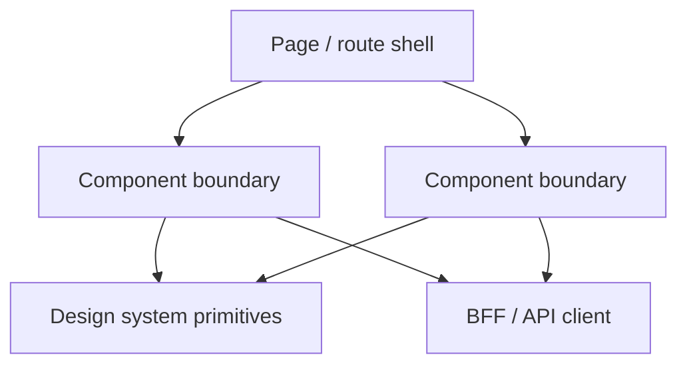
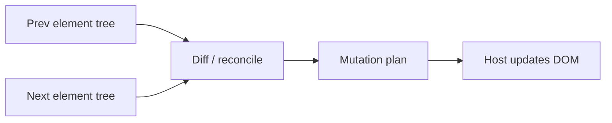
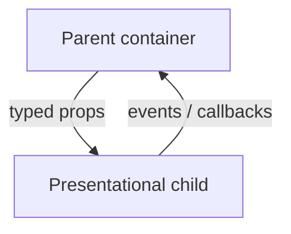
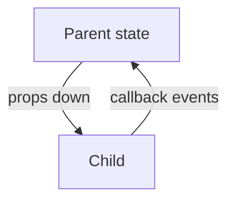
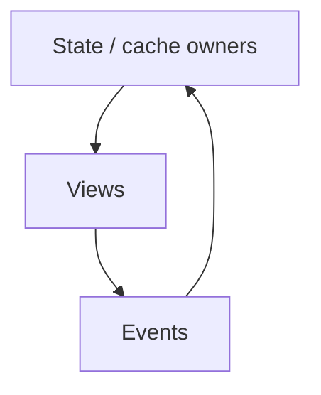
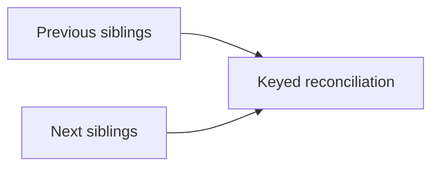
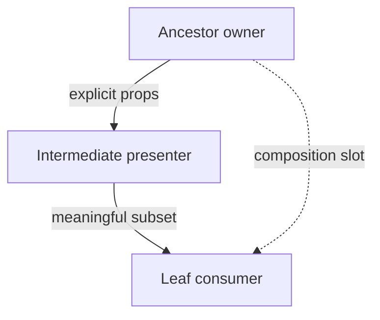

# React 100 Interview Q&A (Instruction-Format)

## Interview Questions (100)
1. What is React, and why is it component-based?
2. What is the Virtual DOM, and how does reconciliation work?
3. What is the difference between functional and class components?
4. What are props in React?
5. What is state in React?
6. How is state different from props?
7. What are controlled components?
8. What are uncontrolled components?
9. What is one-way data flow in React?
10. What is JSX and why is it used?
11. What are fragments in React?
12. Why do list items need keys in React?
13. What makes a good key in React lists?
14. What is prop drilling and when is it a problem?
15. What is component composition in React?
16. What problem do Hooks solve in React?
17. How does useState work?
18. What are functional updates in useState?
19. How does useEffect map to lifecycle?
20. What is the dependency array in useEffect?
21. What causes infinite loops in useEffect?
22. How do you clean up side effects?
23. What is useLayoutEffect?
24. What is useRef used for?
25. What is useMemo?
26. What is useCallback?
27. What is useContext?
28. What is useReducer?
29. How do custom hooks help?
30. What are Rules of Hooks?
31. What triggers re-render?
32. What is React.memo?
33. How to avoid unnecessary re-renders?
34. What is referential equality?
35. How do keys affect rendering performance?
36. What is React.lazy and Suspense?
37. What is code splitting?
38. What is concurrent rendering?
39. What is automatic batching?
40. What are transitions in React 18?
41. Common React performance anti-patterns?
42. How do you profile React performance?
43. What is hydration?
44. What causes hydration mismatch?
45. Best practices for large lists?
46. When is Context enough vs Redux?
47. Redux core principles?
48. Why Redux Toolkit?
49. What are selectors?
50. Zustand vs Redux?
51. Atom-based state tools?
52. Server state vs client state?
53. Why React Query?
54. What are optimistic updates?
55. Predictable state transitions design?
56. What is React Router?
57. What is nested routing?
58. Protected routes?
59. Loaders/actions in router?
60. File-based routing concept?
61. Scalable React project structure?
62. Presentational vs container split?
63. Feature-based folder structure?
64. Shared component library strategy?
65. Micro-frontend concerns?
66. Why are forms complex?
67. Why React Hook Form?
68. Validation with Zod/Yup?
69. Dynamic forms design?
70. File upload in forms?
71. Best place for API calls?
72. Cancel in-flight requests?
73. Handle async race conditions?
74. API failure and retries?
75. SWR vs React Query?
76. React Testing Library philosophy?
77. Testing components effectively?
78. Unit vs integration test split?
79. Mocking API calls in tests?
80. Testing hooks?
81. E2E options for React?
82. Stable selectors in UI tests?
83. Common React security risks?
84. How React prevents XSS?
85. dangerouslySetInnerHTML usage?
86. Secure token handling?
87. Accessibility best practices?
88. Keyboard and focus management?
89. Semantic HTML in components?
90. SSR vs CSR vs SSG?
91. ISR and edge rendering?
92. Client vs server components?
93. Streaming SSR trade-offs?
94. Next.js vs Remix vs SPA?
95. i18n strategy?
96. Theme system design?
97. Error boundaries design?
98. React observability strategy?
99. Enterprise-scale React preparation?
100. How to explain React architecture trade-offs?

## Answers (strict structure)

### Q1. What is React, and why is it component-based?
**Question summary:** Tests whether you can describe React as a product architecture choice, not only a UI syntax choice, and connect components to team velocity, quality, and operating cost.  
**Crisp answer (7-8 lines):** React is a declarative UI library where you assemble interfaces from reusable components. Components bundle rendering, composition, and (with hooks) local behavior in one boundary. That boundary is the primary unit for reuse, testing, onboarding, design systems, performance tuning, and code ownership across teams. The component model trades some ceremony for predictability because data generally flows downward and responsibilities become easier to reason about compared to unstructured DOM scripting. Enterprises adopt React because large teams need shared vocabulary, modular delivery, incremental adoption paths, rich ecosystem tooling, and a hiring market that aligns with SPA and SSR frameworks built on React. Choosing React is partly a socioeconomic and toolchain decision that must match staffing, SSR needs, accessibility requirements, governance, licensing, release cadence, and integration with API gateways or micro-frontends.

**Deep explanation (~70 lines):**
When an interviewer asks what React is, they are probing whether you can separate the
library mechanics from an architecture narrative. Components are boundaries: they define
contracts (props and context usage), encapsulate markup and behavior behind a declarized
render function, and create natural seams for QA, instrumentation, rollout, dependency
upgrades, Storybook catalogs, lint rules, accessibility audits, bundle splitting
boundaries, caching layers, SSR serialization edges, telemetry hooks, and cross-cutting
policies like feature flags. The virtual tree and reconciliation model are
implementation details that support efficient updates, but the architecture story is
about modularity and ownership. In enterprise programs, modularity is how you scale
teams without turning the UI into a distributed monolith of implicit global couplings.
The trade-off is over-fragmentation: too many tiny components increase prop plumbing,
mental overhead, and bundle surface unless you invest in design systems and composition
patterns. Another trade-off is performance discipline: components make rerender scope
easy to accidentally widen if state is lifted too high or context values are unstable.
Security and compliance also attach to component boundaries because data presentation,
redaction, client-side permission checks, and dangerous HTML handling often live at this
layer. Operationally, components map to feature ownership in CI ownership matrices, test
ownership, SLO attribution, and incident response runbooks. Reliability matters because
React errors can break subtrees; you need error boundaries, safe fallbacks,
observability of client exceptions, source maps, and correlation IDs through API calls.
Cost matters because client bundles affect time-to-interactive, conversion, and mobile
user experience; component architecture influences code splitting, lazy routes, image
strategies, and memoization investment. Production failure patterns include uncontrolled
rerenders, memory leaks from uncleaned subscriptions, stale closures in effects,
hydration mismatches in SSR, and prop-driven security mistakes. Decision criteria
include team skill, need for SSR, integration with content management, personalization
and experimentation velocity, WCAG posture, localization complexity, longevity of vendor
support, interoperability with backend-for-frontend layers, offline needs, realtime UI
needs, and operational maturity around front-end telemetry. Risks include ecosystem
churn, reliance on hooks discipline, toolchain complexity like bundlers and compilers,
duplicated business logic across client and server, and unclear ownership during
micro-frontend integration. Mitigations include TypeScript adoption, ESLint/React
Compiler strategy, SSR framework standardization (Next.js, Remix, etc.) where warranted,
disciplined state ownership diagrams, layered testing (unit, RTL integration,
accessibility, perf budgets), feature flag rollouts, rollback strategy, CDN caching
rules, observability dashboards for Web Vitals, and architecture review checkpoints for
risky patterns like client-only secrets. In interviews, connect componentization to
measurable outcomes: faster feature delivery, reduced regression rate, improved
accessibility scores, lower p75 interaction latency, and safer refactors through
boundary tests.

**Answer summary:**  
- **Decision:** Treat components as deployable architecture units with explicit contracts, tests, and ownership.  
- **Risk:** Over-fragmentation, unstable context, and rerender amplification destroy performance and maintainability.  
- **Mitigation:** Design system, colocate state, stabilize references, measure Web Vitals, enforce security and accessibility at boundaries.  

**Practical example:** A multi-brand retail group split checkout into `CartLineItem`, `PromoPanel`, and `PaymentSelector` components owned by different squads, shared tokens from a design system, and cut duplicate markup across regions while keeping PCI-sensitive flows behind iframes and hardened APIs.  

**Simple diagram:**  


**Trusted reference links:**  
- https://react.dev/learn/thinking-in-react  
- https://react.dev/learn/describing-the-ui  

### Q2. What is the Virtual DOM, and how does reconciliation work?
**Question summary:** Tests whether you can explain render commitment, diffing, keys, and how this ties to performance, correctness, and debugging in production SPAs and SSR apps.  
**Crisp answer (7-8 lines):** React builds a lightweight description of UI as a tree of elements. On each render it produces a new tree (conceptually) and reconciles it with the previous tree to compute the smallest set of host updates (usually DOM updates). Reconciliation compares element type and key at siblings to decide reuse versus unmount and mount. The goal is predictable updates without hand-writing imperative DOM operations at scale. Keys are not an optimization hint only; they influence identity and state preservation for list items. Concurrent features can interrupt, resume, or discard work, so understanding commit phases matters for side effects, which belong in effects, not render. Performance still requires developer discipline because reconciliation is not a substitute for algorithmic efficiency in app logic or data transformations.

**Deep explanation (~70 lines):**
Virtual DOM is often taught poorly as “React is fast because virtual DOM,” but the
senior answer reframes it as a delta-minimization strategy between declarative UI and
imperative host operations. Reconciliation walks the element tree, compares element
types, props, and children order, and decides whether to update an existing instance or
destroy and recreate. When the element type changes at a node, React typically treats
that subtree as incompatible and remounts, which resets local state in that subtree
unless lifted. For lists, keys provide stable identity so React can match moved items
rather than blindly reusing DOM nodes incorrectly. Incorrect keys produce subtle bugs
such as preserved input values in wrong rows, duplicated animation state, incorrect
focus, and flaky drag-and-drop behavior. Understanding the commit phase matters: render
is pure in intention, and side effects belong in `useEffect`, `useLayoutEffect`, or
event handlers. Real-world performance issues often come from unnecessary renders,
expensive render paths, huge prop objects, inline function props destabilizing
memoization, context update fan-out, and derived data recalculated every render.
Production implications include jank on low-end devices, battery drain on mobile,
increased hydration cost in SSR, and higher server CPU if render is heavy. SSR adds
hydration mismatch risk if HTML from server differs from client first render.
Mitigations include memoization with clear measurement, component splitting, derived
state patterns, selectors, virtualization for large lists, stable keys from domain IDs,
React concurrent features used intentionally, and avoiding anonymous children functions
that defeat memo. Observability includes React Profiler, Chrome performance panels, user
timing marks, and Core Web Vitals in RUM. Enterprise failure modes include “fix
rerenders with memo everywhere,” increasing complexity without evidence, and
misunderstanding that keys must be stable across reorder. Trade-offs appear when
choosing controlled updates versus expensive structural edits; sometimes lifting state
simplifies logic but expands rerender scope. Architecturally, treat reconciliation as
implementation detail beneath a stronger invariant: minimize render-phase work and keep
reconciliation cheap by structure and stable identities. Risks include false confidence
that virtual DOM removes algorithmic complexity, ignoring network and layout effects,
ignoring main-thread contention from non-React code, and mishandling error boundaries
causing partial outages. Explain with operational language: correlate commits with long
tasks in performance traces, quantify wasted renders via Profiler, tie DOM churn to
Largest Contentful Paint and Interaction to Next Paint. Conclude with mitigation
patterns: normalization of props, reducer patterns for complex transitions, disciplined
context providers, suspense boundaries isolating latency, selective streaming in SSR
frameworks. This is how you show production-grade understanding beyond textbook diffing.

**Answer summary:**  
- **Decision:** Use stable identities (keys, component boundaries) and keep render work cheap; treat diffing as a helper, not a performance guarantee.  
- **Risk:** Wrong keys and mount churn cause state bugs; heavy render paths harm INP and mobile UX.  
- **Mitigation:** Profile first, virtualize large lists, stabilize props, compartmentalize with suspense/error boundaries.  

**Practical example:** A ticketing grid used array index keys; after reordering filters, attendee rows showed wrong seating labels until keys switched to immutable `ticketId`, eliminating mis-association without changing business logic.

**Simple diagram:**  


**Trusted reference links:**  
- https://react.dev/learn/preserving-and-resetting-state  
- https://react.dev/learn/render-and-commit  

### Q3. What is the difference between functional and class components?
**Question summary:** Tests migration literacy, lifecycle mapping, organizational reality of legacy stacks, hooks-based modeling, constraints like error boundaries, and how you lead modernization safely.  
**Crisp answer (7-8 lines):** Functional components are functions that return elements; hooks attach stateful logic and lifecycle-like behavior to functions. Class components are ES classes with explicit lifecycle methods and `this`-bound instance state. Modern React favors functions plus hooks because logic colocation improves reuse (`useEffect`, reducers, custom hooks). Classes remain in codebases needing incremental migration or special cases involving older patterns. Functional components simplify typing and tooling in TypeScript ecosystems. Architectural decisions hinge on refactor risk, backward compatibility within large teams, codemods, SSR constraints, concurrency expectations, dependency libraries that still assume classes for certain patterns (less common today), testing strategies, observability wrappers, adoption of React Compiler, compatibility with Suspense/streaming SSR, staffing skills, onboarding cost, gradual migration behind feature toggles.

**Deep explanation (~70 lines):**
The distinction is mental model plus operational migration strategy. Hooks enable
function components to encapsulate reusable stateful primitives without inheritance or
higher-order component explosion common in legacy React. Class lifecycles map
approximately to hooks: `componentDidMount` plus `componentDidUpdate` patterns often
converge into `useEffect` with thoughtful dependency discipline; rendering derived props
anti-patterns from classes often become redundant when colocated computations are
explicit. Risks emerge when migrating without understanding concurrency semantics
because effects run differently than naive lifecycle ordering assumptions, especially
around Strict Mode double-invokes in development. Enterprise reality includes gigantic
class components coupling network calls, caches, timers, subscriptions, imperative DOM
work, modal managers, localization, analytics, entitlement checks into one
unmaintainable object. Migrating requires incremental extraction: isolate effects,
derive state, tighten props, isolate side effects behind services, encapsulate telemetry
in hooks, unify error handling paths, stabilize dependencies, codemod mechanically where
possible, preserve behavior parity by snapshot and integration testing, observe
performance regressions, and integrate feature flags when behavior might shift.
Organizational concerns include onboarding new engineers accustomed to hooks when
reading class codebases, flaky tests depending on internals, Redux patterns using
`connect` HOCs, legacy context APIs, and deep inheritance antipatterns. Performance
trade-offs are mostly neutral if patterns are disciplined; poorly written hooks cause
effect storms, stale closures, and memory leaks equally to classes. SSR adds nuance
because class components historically had pitfalls with serialization and hydration;
hooks require consistent server-client initial render parity. Governance includes
architectural decision records documenting standard (no new classes), tooling rules in
ESLint, code review gates, Storybook parity, typed component props, observability
wrappers, migration OKRs tied to reliability and velocity. Failure patterns include
blindly converting classes to hooks without extracting side effects causing duplicate
fetches and race conditions, mis-specified effect dependencies hiding bugs until
production, ignoring error boundary limitations (still class-based historically, now
evolving ecosystem), ignoring test updates, ignoring internationalization hooks,
ignoring micro-frontend integration where multiple React versions coexist. Decision
criteria balance risk: high-risk domains like payments convert last with maximal tests,
lower-risk surfaces convert early. Provide mitigations like shadow traffic, staged
rollout, error budget monitoring, crash analytics, rollback plan, and pairing with QA
for accessibility regressions.

**Answer summary:**  
- **Decision:** Default to functions plus hooks for new code; migrate classes with incremental extraction and parity tests.  
- **Risk:** Effect misuse, concurrency surprises, hydration drift, duplicated side effects during migration.  
- **Mitigation:** Strict dependency discipline, integration tests, feature flags, profiling, ADRs for standards.  

**Practical example:** A SaaS billing console converted a 1,200-line class screen to hooks by first extracting data hooks and effect cleanup; p95 latency improved after removing redundant polling caused by overlapping `componentDidUpdate` branches.

**Simple diagram:**  
```text
class: lifecycle methods + this state -> render
function: hooks (state/effect/memo) -> render
```

**Trusted reference links:**  
- https://react.dev/reference/react/hooks  
- https://react.dev/reference/react/Component  

### Q4. What are props in React?
**Question summary:** Tests API design maturity: immutability, contracts, coupling, composition, typing, accessibility attributes, security of prop payloads, versioning, testing seams, runtime validation, Storybook-driven design, backward compatibility responsibilities.  
**Crisp answer (7-8 lines):** Props are inputs from a parent component to a child, conceptually immutable in React’s mental model; a child signals change via callbacks. Props define your component’s public API and should be intentional, minimal, typed, and stable across releases. Props drive rendering when they change according to identity and shallow comparisons in many optimization paths. Architectural anti-patterns include “god props,” boolean prop explosion, passing entire models when only fragments are needed, passing unstable inline objects/functions breaking memoization, passing unsanitized HTML strings, leaking internal state shapes across layers, inconsistent naming conventions, omitting accessibility props, omitting localization keys, coupling to routing objects at leaf component level.

**Deep explanation (~70 lines):**
Think of props as an interface boundary like a microservice API: version carefully,
document, test, observe usage. In enterprises, leaf components belong in design systems
with prop schemas that encode intent: `variant`, `size`, `tone`, `loading`, `disabled`,
`aria-*` passthrough props, event hooks for analytics that do not violate privacy, and
safe extensibility slots. Risks include tight coupling between page containers and
reusable components when business DTO shapes leak into UI props, rendering refactors
brittle. Security risks include injecting untrusted HTML, passing dangerously derived
URLs, leaking PII into analytics props, trusting client-side props for authorization
rather than server truth. Operational risks include breaking changes cascading across
dozens of consuming teams without codemods. Mitigations include TypeScript interfaces,
discriminated unions for variant props, default props documented in Storybook, prop
deprecation strategy with warnings, backward-compatible adapters, lint rules forbidding
anonymous object literals in hot paths where memoization matters, encapsulating data
mapping in selectors at container edges, validating external config with zod/yup when
props come from CMS, and snapshot plus interaction tests. Performance ties to
referential stability: parents should not recreate large objects each render when
passing to memoized children; separate frequently changing props from stable ones
through composition or children render props patterns judiciously. Accessibility
requires explicit prop passthrough for labels, describedby, roles, focus management
hooks. Internationalization often means passing message keys or already localized
strings with clear ownership to avoid double translation. Micro-frontend environments
require prop contracts stable across independently deployed teams; consider shared
schema packages. Failure patterns include prop drilling when architecture resists
composition; solve with context intentionally, not prematurely, or move state down.
Another failure is using context for high churn values causing global rerenders.
Decision criteria: favor explicit props for leaf components, container-level mapping for
domain models, stable callback props using `useCallback` when necessary and measured.
Connect to measurable outcomes: fewer production UI defects, reduced bundle due to
deleting unused variants, improved Storybook adoption, shorter PR review time because
API is crisp.

**Answer summary:**  
- **Decision:** Design props like a stable public contract; map domain models at container edges.  
- **Risk:** Unstable references, leaky DTO shapes, insecure HTML, breaking changes across teams.  
- **Mitigation:** Types, Storybook, selective memoization, validation for CMS-driven props, codemods for evolution.  

**Practical example:** A design-system `Button` exposed `variant` and `size` enums instead of raw `className`; product teams stopped shipping inconsistent CTAs and automated accessibility checks became enforceable.

**Simple diagram:**  


**Trusted reference links:**  
- https://react.dev/learn/passing-props-to-a-component  
- https://react.dev/reference/react/cloneElement  

### Q5. What is state in React?
**Question summary:** Tests ownership, minimal state philosophy, derived data, async sources, server cache integration, concurrency, forms, URL as state, performance of updates, batching, transitions, state machines for complex UX, operational debugging.  
**Crisp answer (7-8 lines):** State is data that changes over time and should trigger UI updates when it changes. Local component state is best when only that subtree cares. State should be minimal: derive everything you can from props plus stable sources. Server data is often not “React state” but cached remote state (React Query, etc.) with its own consistency rules. Async state needs explicit status: loading, success, error, empty. Concurrent React encourages transitions to keep UI responsive. Enterprise apps mix UI state, session state, entitlement state, feature flags, experiments, and remote caches; architecture is choosing correct layer. Failure to model state causes bugs like stale UI, double submissions, lost user input, inconsistent filters, race conditions.

**Deep explanation (~70 lines):**
Senior answers separate kinds of state: ephemeral UI (modals, toggles), session context
(auth subject, tenant), domain state (cart), server cache (lists, detail records), URL
state (shareable filters), form state (often specialized libraries), and cross-cutting
policy state (feature flags). Putting everything in one global store is an operational
risk: high churn causes rerenders, coupling increases, tests become heavy, changes blast
across teams. Local state reduces blast radius but can complicate sharing; lift only
with clear data flow diagrams. Derived state should be computed during render from
authoritative sources to avoid synchronization bugs where two state variables disagree
until an effect runs. Effects synchronizing state are a smell; prefer reducers for
complex transitions. Server state needs caching, invalidation, retries, deduplication,
pagination, optimistic updates, idempotency keys, and conflict resolution patterns in
enterprise CRUD. URL state matters for supportability, deep linking, analytics, SEO in
marketing surfaces, reproducible bug reports; encode only what users should share, keep
secrets out. Forms add validation, touched/dirty semantics, accessibility announcements,
localization of errors, masking for PII, debounced async validation hitting APIs,
concurrency cancellation on unmount. Security includes never storing tokens in careless
local state readable by unrelated components unless isolated; prefer HTTP-only cookies
for session or hardened storage patterns reviewed by security architects. Operational
debugging uses React DevTools state inspection, telemetry on state transitions,
correlation with API logs, breadcrumbs in error reporting, reproducible QA scripts.
Risks include using state for derived values duplicated from props causing infinite
loops via effects mirroring props into state—a classic production defect class.
Concurrent rendering means updates may be interrupted; ensure state transitions are
resilient and side effects guarded. Measurably, poor state architecture shows up as high
INP from unnecessary rerenders, expensive commits from large object graphs, memory
growth from retained caches, inconsistent UI under slow networks. Mitigations include
reducers, finite state machines for checkout-like flows, React Query for server caches,
context split by domain and stability, memoized selectors, architectural lint rules for
where global state allowed, code review checklist for local vs remote state, SSR
hydration alignment for initial state, story-based tests for state transitions. Connect
to business value: fewer abandoned carts from reliable progress states, faster support
because URL encodes failure context, lower incident count from explicit error states.

**Answer summary:**  
- **Decision:** Classify state by lifetime and owner; keep authoritative sources single; derive the rest.  
- **Risk:** Mirrored state, global churn, cache invalidation bugs, race conditions in async flows.  
- **Mitigation:** Reducers/FSMs, React Query, URL for shareable UI state, tight effect discipline.  

**Practical example:** A loan application replaced scattered `useState` mirrors with a reducer and explicit step machine; submission double-clicks dropped and compliance logs became auditable per transition.

**Simple diagram:**  
```text
authoritative source -> derive -> render
user action -> transition -> new authoritative state
```

**Trusted reference links:**  
- https://react.dev/learn/managing-state  
- https://react.dev/learn/you-might-not-need-an-effect  

### Q6. How is state different from props?
**Question summary:** Tests data flow clarity, directionality, ownership, immutability mental model, where bugs come from, and how you teach teams to structure applications for maintainability.  
**Crisp answer (7-8 lines):** Props flow down from parent to child as inputs the child should not mutate. State is owned by a component (or external store integrated via hooks) and updated through setters or dispatchers. Changing props comes from parent rerender; changing state schedules rerender locally and may affect descendants. Props express configuration and data injection; state expresses mutable UI or domain progress within an ownership boundary. Mixing the two concepts causes duplicated sources of truth. Children communicate upward via callbacks, not by mutating props. In practice, TypeScript reinforces these contracts. Senior teams document ownership per feature to avoid ambiguous updates.

**Deep explanation (~70 lines):**
The crucial interview depth is explaining why this distinction governs reliability.
Props encode a contract of dependencies: when parent rerenders with new props, child
must render consistently from those inputs. If child copies props into state in an
effect “to initialize,” you often introduce synchronization bugs when props later change
but state does not, or vice versa. The preferred pattern is treat props as authoritative
when they represent external configuration, derive during render, or use a keyed reset
strategy when identity changes require remounting. State encodes internal degrees of
freedom the parent should not micromanage: text in an input before commit, transient
highlight state, accordion expansion that is not persisted, stepper intermediate states
not yet broadcast. Architectural trade-offs arise in controlled components: parent owns
value through props while child emits onChange events—this blurs lines but preserves
single source of truth in parent when required for forms spanning multiple inputs.
Operational risks include prop drilling through many layers when intermediate components
do not care; mitigations include composition (`children`), context with stable value
design, colocating state, or extracting custom hooks at container level. Performance
ties to memoization: props can be unstable function references causing child rerenders;
state updates may batch; parent state changes may fan out broadly. Testing benefits from
clear ownership: stub props for pure presentational components, test stateful behavior
with user events. SSR requires initial props and initial state alignment; hydration bugs
often come from mismatched assumptions about seeding state only on client. Security
cautions: never treat props as authorization; server must enforce; props can include
redacted display data only. Large organizations formalize these rules in ADRs: “No
mirroring props into state except with explicit reset keys documented.” Failure
patterns: child mutates objects received via props (reference sharing), causing parent
state corruption across subtrees unintentionally due to shared object graphs.
Mitigation: immutable updates, cloning where necessary but measured, structural sharing
patterns from state libraries. Connect to observable metrics: decreased bug reopened
rate post ADR adoption, simpler onboarding time, clearer Storybook catalogs.

**Answer summary:**  
- **Decision:** Maintain a single authoritative source per datum; derive or reset deliberately—never subtly mirror props.  
- **Risk:** Duplicate truth, accidental mutation of shared references, hydration mismatch from seeding hacks.  
- **Mitigation:** Controlled patterns, keyed resets, immutability, container-level selectors, ESLint hooks rules.  

**Practical example:** A dashboard widget copied incoming `tenantConfig` props into local state on mount; when admins updated tenant settings live, stale widgets persisted until engineers removed the mirror pattern and keyed remounts on `tenantId`.

**Simple diagram:**  


**Trusted reference links:**  
- https://react.dev/learn/passing-data-deeply-with-context  
- https://react.dev/learn/state-as-a-snapshot  

### Q7. What are controlled components?
**Question summary:** Tests form architecture, single source of truth, validation integration, accessibility, enterprise form libraries, async validation, performance of controlled inputs, pitfalls with large forms, integration with react-hook-form strategies.  
**Crisp answer (7-8 lines):** Controlled components wire input `value` to React state (or upstream store) and update via `onChange`. The DOM is not the source of truth; React state is. This simplifies validation, masking, programmatic resets, disabling submit while invalid, syncing dependent fields, and testing predictable state snapshots. Costs include potential performance issues when every keystroke updates global state incorrectly, unnecessary rerenders, complexity for file inputs nuances, IME composition considerations, race conditions when async validations compete with keystrokes unless cancelled.

**Deep explanation (~70 lines):**
In enterprise apps, controlled inputs underpin compliance-heavy forms: structured error
messages localized, cross-field dependency rules (tax jurisdiction affects VAT field
visibility), entitlement-driven field disabling, masking for identifiers, auditing user
edits. Architecture layers separate presentational inputs from orchestration containers
mapping to APIs. Controlled pattern integrates naturally with Redux or reducers when
form state spans steps, but heed performance: localize state near fields, debounce
validations only when measured necessary, avoid lifting every keystroke to global store
without need. Libraries like React Hook Form still align conceptually by controlling via
subscriptions and refs while optimizing renders; discuss trade-offs candidly.
Accessibility requires associating inputs with labels, announcing errors politely,
preserving focus management on validation failure, respecting `aria-invalid`, using
`aria-describedby`. Security includes sanitizing copy/paste payloads, guarding against
unintended exfiltration in analytics events from sensitive fields. Internationalization
spans decimal separators and RTL layout issues affecting cursor behavior in controlled
masks. Operational debugging uses replayable tests with Testing Library typing flows.
SSR/hydration must ensure initial controlled value aligns with rendered HTML to avoid
mismatches; often seed from server-validated defaults. Risks include fighting the DOM
for caret position in masked fields, IME bugs if controlled updates interrupt
composition events, degraded performance on low-end mobiles if parent rerenders enormous
trees per keystroke. Mitigations include field-level state colocation, component
memoization backed by Profiler evidence, virtualization for unusual cases, using
`defaultValue` only when consciously uncontrolled, transitions for heavy dependent
recalculations, abort controllers for validation fetch races. Measurably, controlled
modelling reduces invalid submissions caught late, lowers support tickets from “form ate
my data,” improves analytics funnel clarity. Discuss failure mode: resetting entire form
unintentionally due to unstable component keys causing remount. Governance: standardize
controlled vs uncontrolled per design system primitives to prevent hybrid confusion.

**Answer summary:**  
- **Decision:** Use controlled inputs when React must own validation, dependencies, masking, resets, auditing.  
- **Risk:** IME issues, keystroke-induced rerender storms, async validation races.  
- **Mitigation:** Colocate field state, cancellation, Profiler-driven memoization, strict a11y error patterns.

**Practical example:** A healthcare referral form controlled patient identifiers with server-validated SSR defaults; HIPAA audit logs captured field-level attempts without trusting browser storage.

**Simple diagram:**  
```text
state value -> props value -> input
input onChange -> setState -> rerender
```

**Trusted reference links:**  
- https://react.dev/reference/react-dom/components/input#controlling-an-input-with-a-state-variable  

### Q8. What are uncontrolled components?
**Question summary:** Tests pragmatic hybrid design, refs, integrating non-React widgets, performance trade-offs, when controlled overhead is unjustified, migration paths, SSR caveats.  
**Crisp answer (7-8 lines):** Uncontrolled components let the DOM hold input state; React sets initial `defaultValue` and reads via refs on submit or imperative events. Useful for integrating legacy widgets, reducing rerenders on every keystroke, simple forms, migrating incrementally off jQuery-era plugins. Trade-offs include less centralized realtime validation unless you attach listeners explicitly, harder time-travel debugging, subtler SSR hydration alignment for certain plugins, programmatic resets require imperative DOM work or keys to remount, testing must simulate real DOM behaviors.

**Deep explanation (~70 lines):**
Senior architects articulate when DOM authority reduces engineering cost without
sacrificing governance. Examples include rich editors with internal undo stacks, maps,
spreadsheets-like embeds where React state mirroring duplicates truth and fights
third-party internals. Operational strategy includes isolating integrations behind
adapter components with stable imperative APIs, sanitizing outbound values before API
calls, and limiting blast radius with error boundaries around plugin failures. SSR risks
escalate because many plugins assume `window`; gate them with dynamic import and
skeleton shells. Accessibility still required: wrappers must expose labels, shortcuts,
announcements for errors even if internals are opaque. Performance benefits come from
skipping React commits per keystroke, but naive use can still bottleneck if parent
rerenders recreate plugin props causing reinitialization—track referential instability.
Migration pattern: begin uncontrolled for velocity, converge to controlled at boundaries
needing compliance validation before navigation between steps. Security risk: trusting
DOM reads without sanitization can reintroduce XSS if plugins inject HTML incorrectly;
validate server-side anyway. Telemetry may miss intermediate field states unless
instrumented purposely; decide if funnel analytics acceptable. Enterprises standardize
hybrids: controlled for simple fields via design system primitives, uncontrolled
wrappers for heavyweight embeds behind contract tests measuring mount cost and leak-free
teardown on route changes. Discuss testing: Cypress/Playwright flows reading final DOM
versus RTL unit tests bridging ref APIs. Observability hooks include mount durations,
crashes inside third-party code captured with error reporting tags isolating vendor.
Risks include forgotten cleanup of global listeners registering twice on strict mode
mounts in dev doubling handlers—implement idempotent teardown. Measurably track
reduction in rerender counts and improvements in interaction latency budgets when
uncontrolled used correctly.

**Answer summary:**  
- **Decision:** Prefer uncontrolled integrations for heavyweight third-party widgets; keep thin React adapter boundary.  
- **Risk:** Harder realtime validation, SSR fragility, memory leaks from plugins, insecure HTML paths.  
- **Mitigation:** Dynamic import guards, sanitization server-side, strict cleanup, isolation error boundaries.

**Practical example:** A trading desk reused a vendor chart accepting DOM-managed inputs behind a wrapper; React rerenders dropped sharply while retaining server-side validation of submitted orders.

**Simple diagram:**  
```text
defaultValue seeds DOM
reads via ref on submit / blur
React state minimal
```

**Trusted reference links:**  
- https://react.dev/reference/react-dom/components/input#providing-an-initial-value-for-an-input  

### Q9. What is one-way data flow in React?
**Question summary:** Tests predictability, debugging reasoning, Flux history, concurrency implications, organizational enforcement, contrasts with bidirectional MVC patterns that caused tangled observers historically.  
**Crisp answer (7-8 lines):** One-way data flow means UI is a function of state coming down; events flow up to mutators. Predictability improves because data dependencies are easier to trace than ad hoc two-way bindings everywhere. Large apps adopt unidirectional patterns at scale with stores, reducers, or query caches still preserving conceptual flow. This supports time-travel debugging in some stacks, clearer audit trails for complex forms, easier static analysis. Trade-off: more boilerplate than magical binding; requires discipline and tooling. Concurrency-friendly because render remains a projection when side effects isolated.

**Deep explanation (~70 lines):**
Interviewers want architecture consequences, not a slogan. Unidirectional flow reduces
the “who updated this field?” mystery that plagued two-way binding ecosystems in large
teams. It clarifies debugging: traverse props chain, inspect parent state updates,
correlate with Redux DevTools timelines or Query cache logs, correlate with analytics
events upstream. Operational advantages include repeatable reproduction of customer
issues when state snapshots logged responsibly with privacy safeguards. Complexity
arises when pragmatic shortcuts reintroduce two-way coupling through mutable objects
hoisted oddly; enforce immutability and explicit transitions. Patterns like
container/presentational components strengthen flow: containers mutate remote/cache
state; presentation renders. SSR microservices may supply initial state payloads;
hydrate carefully. Micro-frontends threaten global implicit flows if shared globals
abused; contractual event buses or routed message passing regain directionality.
Measurably, onboarding time decreases when juniors can follow data flow diagrams;
incident meantime-to-recovery improves when traces align with architecture. Risks
include prop drilling resentment causing premature chaotic context sprawl—mitigate with
composition and domain-scoped contexts. Another risk is pretending one-way flow removes
need for transactional semantics across APIs; optimistic UI still needs rollback paths.
Discuss integration with CQRS-esque read models using React Query for reads and
mutations funneling invalidations intentionally. Tie to compliance: centralized mutation
logging easier when flows explicit. Mention failure pattern: cyclic update loops when
parent sets child props based on callbacks firing during render mistakenly—guard with
event-phase discipline and derived memoization.

**Answer summary:**  
- **Decision:** Enforce directional data movement with explicit containers, reducers, caches; forbid mystery mutations.  
- **Risk:** Prop drilling hacks, cyclic updates, leaky shared mutable models.  
- **Mitigation:** Composition, stable domain contexts, immutability, architecture reviews for cross-team surfaces.

**Practical example:** A logistics control tower standardized on reducer-driven panels; nighttime operations cut mean debug time finding shipment anomalies because transitions logged atomically.

**Simple diagram:**  


**Trusted reference links:**  
- https://react.dev/learn/reacting-to-input-with-state  

### Q10. What is JSX and why is it used?
**Question summary:** Tests compilation model, ergonomics versus templates, injection safety expectations, SSR implications, tooling chain, misconceptions about JSX being HTML strings, portability to design tooling.  
**Crisp answer (7-8 lines):** JSX is syntactic sugar for `React.createElement` calls composing type, props, children. Toolchains transform JSX to JS for browsers. Benefits include colocation of structure with logic where appropriate, familiarity for HTML-ish readability, tooling integration with TypeScript, lint rules, accessibility plugins. JSX is not a security boundary by itself—escaping semantics differ from raw HTML concatenation—but still demands discipline with user content. JSX maps cleanly to nested component trees aligning mental model.

**Deep explanation (~70 lines):**
Senior framing addresses engineering system: JSX feeds compilers (Babel/SWC), enabling
dead code elimination, fast refresh ergonomics for developer productivity measured in
reload cycles costing minutes daily across hundreds of engineers. TypeScript interplay
flags invalid props at compile-time, aligning with governance reducing production UI
defects attributable to typo’d prop names. JSX encourages composability: higher-order
wrapping, conditional rendering readability, fragments reducing invalid DOM hierarchies
historically patched with pointless div soup affecting layout semantics and styling
performance. Operational cautions include developers assuming JSX magically sanitizes
URLs and HTML like template engines—not always—so policy demands safe patterns and
DomPurify where necessary with security review plus CSP headers complementing defenses.
SSR frameworks compile JSX differently for streaming; suspense boundaries interplay with
chunked HTML emission affecting TTFB and perceived performance. JSX vs template DSL
debate often touches preference; enterprise answer cites hiring, interoperability,
ESLint accessibility plugins availability, deterministic codemods, integration with
AST-based transforms for design tokens. Risks include business logic creeping into JSX
with heavy inline computations causing rerender hotspots; refactor to helpers with
memoization guarded by Profiler. JSX plus dynamic tag names must validate allowlists to
prevent tag injection misuse. Telemetry bundling interacts: improper dynamic imports
inflate bundles; compilers help. Mention maintenance: JSX-driven components align with
Storybook visual regression harnesses standard at platform level. Hydration mismatches
correlate with JSX conditionals branching differently server vs client (time-dependent
code, locale assumptions); enforce deterministic rendering or gate client-only
fragments. Measurable outcomes include reduced UI defect escape rates after TS prop
enforcement, incremental compile times improved by SWC decisions. Failure pattern:
dangerouslySetInnerHTML used casually—address in next question series but hint
governance.

**Answer summary:**  
- **Decision:** Standardize JSX + TS as contract-first UI authoring with compiler toolchain owned by platform team.  
- **Risk:** Security complacency, heavy inline JSX logic, nondeterministic SSR branches.  
- **Mitigation:** Lint + CSP + safe HTML gates, refactor heavy expressions, SSR consistency reviews.

**Practical example:** A fintech migrated from string templates to JSX with TS enums for icon names, eliminating injection via dynamic tag strings after security review tightened allowlists.

**Simple diagram:**  
```text
JSX -> compiler -> JS function calls -> React elements tree
```

**Trusted reference links:**  
- https://react.dev/learn/writing-markup-with-jsx  

### Q11. What are fragments in React?
**Question summary:** Tests DOM correctness, semantics, styling constraints, keyed fragments, SSR markup shape, avoidance of meaningless wrapper nodes harming CSS and accessibility.  
**Crisp answer (7-8 lines):** Fragments (`<>...</>` or `<React.Fragment>`) let components return multiple sibling elements without an extra DOM parent. Helps avoid breaking CSS layouts reliant on direct child combinators or flex/grid structures. Named keyed fragments attach keys for reconciliation in lists needing stable sibling groups without injecting dom nodes—a subtle advanced point. SSR output remains coherent when fragment usage aligns server-client tree shape. Fragments aid table row column assembly patterns historically painful with wrappers breaking table semantics unless using awkward structures.

**Deep explanation (~70 lines):**
DOM pollution from unnecessary div wrappers increases layout bugs, specificity wars,
degraded accessibility tree structure in edge cases such as breaking required
parent-child semantics in tables, lists, SVG groups. Fragments mitigate while preserving
grouping in React reconciliation. Operational styling systems using design tokens and
CSS modules historically broke when wrappers inserted unknowingly altering cascade;
fragments stabilize. Risks arise when fragments hide structural nodes needed by
third-party selectors; tests depending on brittle CSS paths fail—migrate tests to
semantic roles. SSR streaming can interleave suspense boundaries affecting fragment
adjacency perceptions; engineers must visualize output. Keyed fragments matter when
iterating sets returning groups; mistakes cause remount churn losing internal state
unexpectedly. Mention micro-frontend CSS isolation contexts like Shadow DOM
interplay—fragments do not magically scope styles; clarify boundaries. Measurably,
shaving wrapper nodes trimmed layout thrash in complex dashboards correlating improved
INP. Failure pattern: abusing fragments to bypass semantic HTML needing actual
containers like `<li>` omissions causing invalid markup and accessibility
deficits—fragments aren’t excuses for semantics violations. Teach teams fragments
complement semantic tags, not replace.

**Answer summary:**  
- **Decision:** Use fragments when grouping React nodes without altering host DOM semantics required by CSS or HTML validity.  
- **Risk:** Invalid semantic structures, flaky CSS selectors relying on phantom wrappers disappearing.  
- **Mitigation:** Maintain semantic wrappers where spec demands; use keyed fragments intentionally in lists.

**Practical example:** A grid analytics board removed intermediary div wrappers fragmenting KPI rows; sticky column CSS stopped breaking due to accidental extra flex item layers.

**Simple diagram:**  
```text
<> A B C </> renders siblings A B C directly under parent
```

**Trusted reference links:**  
- https://react.dev/reference/react/Fragment  

### Q12. Why do list items need keys in React?
**Question summary:** Tests identity semantics, correctness versus performance misconceptions, SSR list streaming, virtualization interactions, concurrency, debugging state mis-association defects.  
**Crisp answer (7-8 lines):** Keys help React identify which items correspond across renders when sibling order changes. Correct keys preserve component state associations with logical entities. Incorrect keys yield UI corruption more serious than slowdowns. Keys should be stable, predictable domain identifiers—not array indexes for volatile lists altering membership/order. Indexes sometimes acceptable only for fully static lists with no reorder/filter risk. Libraries like virtualization rely on stable keys for measurement caches. Mention warnings in dev signal risk.

**Deep explanation (~70 lines):**
Many engineers wrongly say keys are “just for perf.” Ownership answer: identity drives
correctness—inputs keep focus incorrectly, optimistic UI rows misattach, animations
trigger wrong targets, checkbox selections leak across unrelated rows post filter.
Operational debugging for such bugs wastes days; keys are preventative architecture. For
SSR with streaming suspense lists, hydration mismatches multiply when keys
nondeterministic if derived from timestamps client-only. Stable IDs from backends must
drive keys; provisional client IDs acceptable if collision-resistant patterns exist
until server confirmation merges identity with explicit transition strategy. Risks
include using composite keys inconsistently violating uniqueness; duplicates cause React
warnings and unstable behavior. Pagination plus infinite scroll requires careful
reconciliation when merging pages keyed by offsets incorrectly—prefer cursor IDs stored
in caches. Mention anti-pattern generating keys from JSON.stringify payloads—heavy and
brittle. Measurably, correcting keys drops reported UI defect tickets categorized as
mysterious data swaps. Discuss accessibility: mismatched identities confuse screen
reader announcements referencing stale row semantics. Tie to concurrency: interruptions
make identity even more consequential when partial commits occur. Governance: codegen
from OpenAPI schemas can embed ids ensuring lists always keyed. Migration path for
legacy lists lacking IDs: augment API contract—worth negotiation rather than patching
frontend hacks.

**Answer summary:**  
- **Decision:** Key list rows by immutable domain identifiers; treat keys as correctness primitives.  
- **Risk:** State mis-association bugs, flaky UX, hydration weirdness when keys unstable or duplicated.  
- **Mitigation:** API contracts require IDs; avoid index keys unless list static and proven; virtualization libraries configured accordingly.

**Practical example:** A support ticketing queue keyed rows by `(queue, index)`; cross-queue merges reassigned attachments until keys used `ticketUUID` exclusively.

**Simple diagram:**  


**Trusted reference links:**  
- https://react.dev/learn/rendering-lists  

### Q13. What makes a good key in React lists?
**Question summary:** Tests whether keys are treated as reconciliation identity primitives tied to backend contracts,
not improvisation, and covers uniqueness, stability across renders, merges of optimistic IDs, composite keys pitfalls,
privacy of identifiers in logs, and alignment with virtualization and drag-and-drop libraries.

**Crisp answer (7-8 lines):** Prefer stable surrogate keys from authoritative domain data such as UUID primary keys assigned
persistently across sessions. Composite keys appear when natural keys need scoping—but ensure uniqueness siblings-wide and
deterministic stringify ordering. Avoid random keys per render. Avoid keys derived from timestamps unless server-controlled
deterministically. Indexes only if list immutable in identity and reordering never occurs—including filters pretending to be
different lists reusing subtree state incorrectly. Operationalize keys at API/schema levels so frontend never guesses.
Coordinate with virtualization engines requiring stable identities for measurement caches. Document approach in design
reviews for compliance data rows where keys must not leak PII when surfaced in tooling.

**Deep explanation (~70 lines):**
Good keys correlate one-to-one with entity identity surviving UI operations that mutate order or membership pragmatically.

When orders change mid-flight inside collaborative enterprise apps reconciling websocket patches, surrogate keys unify server
truth and client optimistic rows bridging temporary negative IDs migrating after confirmation transactional boundaries.

Architectural governance aligns OpenAPI schemas always returning stable identifiers—even for polymorphic unions—preventing UI
engineering inventing surrogates via unstable hashes that defeat caching strategies.

Discuss composite keys thoughtfully: `'${tenantId}:${orderId}'` safe when collisions impossible and string rules stable across
localization and encoding; brittle when undefined fields slip through optional chaining producing accidental duplicates.

Operational failures involve duplicate sibling keys collapsing subtrees subtly; React warnings ignored in CI due to log noise;
production corruption surfaces weeks later after filter toggles.

Performance ties to virtualization recalculating layout thrash when keys misalign with physical row indexes; animation
libraries lose continuity when keys remount components resetting CSS transitions.

Security cautions: keys displayed in HTML data attributes for debugging may leak internal identifiers to aggregators; prefer
internal React keys separate from DOM attributes except carefully controlled diagnostics behind feature flags.

SSR streaming lists require keys consistent between partial HTML chunks and later client continuation; nondeterministic key
assignment from `Math.random` breaks hydration catastrophically.

Accessibility concerns when assistive technologies announce row counts after reorder; stable keys keep relationships between
controls and descriptions via `aria-labelledby` pairs intact.

Mitigations include schema lint requiring IDs, contract tests verifying list endpoints, Storybook stories snapshotting
reorder flows, error budgets monitoring unexpected remount percentages inferable from telemetry breadcrumbs when available.

Migrating legacy lists lacking identifiers requires backend augmentation acceptable cost compared to indefinite UI hacks.

Interview depth ties trade-offs balancing opaque database IDs exposing enumeration risk externally versus opaque client-only
identifiers—solve with authenticated APIs—not by omitting stable keys internally.

Discuss eventual consistency merges where two provisional rows reconcile; keyed remount resets local draft fields unless you
implement explicit migration mapping old provisional key state to persisted entity—architecture pattern beyond React alone.

Measure impact post-fix via reduced reopened defects tagged “UI state bleed,” fewer mistaken row associations in support
tickets, and steadier virtualization caches because accidental remount churn stops resetting measured row heights.

**Answer summary:**
- **Decision:** Standardize on domain surrogate keys propagated by APIs; forbid render-random identities.
- **Risk:** Duplicate keys, unstable composites, leaky debug attributes, SSR hydration divergence.
- **Mitigation:** Schema contracts, virtualization-aware testing, deterministic merge strategies after persistence.

**Practical example:** A procurement cart merged duplicate line items keyed earlier by product name; switching to stable
`lineItemId` from the order service eliminated quantity flicker when bilingual product titles changed.

**Simple diagram:**
```text
API entity id -> React key -> instance state preserved across reorder
```

**Trusted reference links:**
- https://react.dev/learn/rendering-lists
- https://react.dev/learn/preserving-and-resetting-state

### Q14. What is prop drilling and when is it a problem?
**Question summary:** Examines maintainability of passing props through intermediate components that do not use them,
contrasts with composition and context, discusses performance illusions, testing pain, organizational module boundaries,
and governance for allowed drilling depth.

**Crisp answer (7-8 lines):** Prop drilling passes data through layers solely to reach deep descendants. It remains fine for
shallow trees and explicit dataflow clarity. It becomes problematic when intermediate components accumulate pass-through
props unrelated to their responsibilities, increasing coupling, breaking encapsulation, complicating refactors, bloating
signatures, destabilizing memoization with frequently changing props threading through many memos. Alternatives include
component composition with `children` slots, context with stable values decomposed by domain, localized custom hooks at
container edges, dependency injection patterns for cross-cutting services, or state machines colocated with feature modules.

**Deep explanation (~70 lines):**
Prop drilling is not automatically an anti-pattern; enterprises sometimes overuse context prematurely creating global rerender
fan-out worse than explicit drilling through few layers.

The problem threshold emerges when every feature addition threads new props across seven layers of layout shells unrelated to
domain logic—editors cannot refactor safely, PR velocity drops, merge conflicts concentrate in shared layout files.

Composition patterns pass render props or `children` to inject leaf nodes without intermediate awareness of business props,
preserving cleaner boundaries.

Context alternative demands discipline splitting providers by update frequency: high-churn values like cursor positions should
not share provider with low-churn session entitlements.

Performance nuance: drilling large objects causes rerenders if any ancestor rerenders often; sometimes colocating state lower
reduces scope even if it looks like duplication conceptually.

Testing complexity grows when intermediate components must forward props in mocks; brittle tests break during signature
refactors without functional change.

Micro-frontend integration complicates drilling across independent bundles; prefer well-versioned shared contracts or event
buses with typed schemas rather than implicit global React trees spanning teams unsafely.

Governance might define maximum drilling depth before mandatory composition refactor—architecture lint guidance not
arbitrary ban.

Security implications appear when drilling includes sensitive entitlements visible in devtools prop inspection through many
layers—minimize surface by mapping to least-privilege display DTO at edge.

Operational observability unaffected directly, but incident reproduction improves when props trail explicit versus hidden
implicit cross-module singletons circumventing tracing.

Migrating incremental steps extracts “provider boundary” modules owning domain-specific contexts without rewriting entire apps
overnight.

Failure pattern: scattering `any` forwarding props weakening TypeScript guarantees—mitigate typed wrapper interfaces per
domain vertical.

Accessibility improvements sometimes require prop drilling for `aria-*` attributes to deeply nested controls; still prefer
composition to keep semantics local.

Measure engineering outcomes: time to implement new field across UI layers decreases after composition refactor estimated via
historic story points telemetry anonymized ethically.

Discuss trade-offs: explicit drilling improves traceability versus magic globals harming onboarding time.

**Answer summary:**
- **Decision:** Tolerate shallow drilling; refactor to composition or scoped context when pass-through dominates modules.
- **Risk:** Fragile intermediates, unstable memoization signatures, leaky sensitive props across layers.
- **Mitigation:** Typed edge mapping, structural composition, frequency-split contexts, ADR thresholds for depth.

**Practical example:** A SaaS navigation shell threaded twelve analytics props down toleaf buttons until composition slots let
marketing inject tracked CTAs without editing core chrome each sprint.

**Simple diagram:**


**Trusted reference links:**
- https://react.dev/learn/passing-data-deeply-with-context

### Q15. What is component composition in React?
**Question summary:** Probes leveraging `children`, render props, slots, layout shells, avoidance of premature abstraction,
maintaining inversion of control aligning with enterprise design systems orchestrating cross-cutting UX policies.

**Crisp answer (7-8 lines):** Composition arranges simpler components inside containers without rigid inheritance hierarchies.

Containers orchestrate behavior and inject content areas; leaf components remain reusable. Patterns include `children` props,
compound components exporting namespaces, controlled render props injecting state, wrappers applying cross-cutting UX like
analytics or entitlement gates. Prefer composition over class inheritance duplication which historically caused brittle React
antecedents akin to mixin confusion. Architectural payoff: inversion of control—framework shell defines extension points teams
plug into without rewriting core navigation components weekly.

**Deep explanation (~70 lines):**
Composition implements modularity analogous to dependency injection boundaries in backend architectures transposed to UI.

Design systems exploit compound primitives—Tabs, Tabs.List, Tabs.Panel—balancing discoverability ergonomic APIs while keeping
internals encapsulated preventing prop explosion at single mega-component extremes.

Operational concerns include versioning compound APIs across major releases coordinating codemods; backward compatibility relies
clear namespaces.

Testing benefits: Storybook compositions capture integration states without mocking deep prop drilling corridors.

SSR frameworks integrate composition boundaries with streaming suspense slots suspending granular subtrees gracefully.

Accessibility composition ensures focus traps in modal shells wrap arbitrary child trees safely using refs carefully managed
rather than leaky DOM queries brittle to internal changes.

Security composition patterns wrap sensitive regions with entitlement boundary components asserting server-signed claims not
modifiable client tampering blindly though UI can still lie—emphasizing defense-in-depth narratives interviewers crave.

Performance: composition avoids rerender hotspots by isolating dynamic children subtrees memoized internally while shells
remain stable wrappers.

Failures occur when premature abstraction lumps unrelated concerns—“God layout” accepting dozens props defeating composition
benefits revert to refactor splitting.

Governance fosters templates scaffolders generating feature modules with predetermined slots reducing drift.

Discuss micro-frontend module federation interplay: compose remote exposed components verifying shared dependency semver
pinned preventing duplicate React catastrophic hook failures.

Measured outcomes include shortened PR cycles quantified historically, lowered duplicate markup percentage tracked via lint
duplicate detectors approximate heuristically.

Interview angle ties business agility enabling marketing experiments injecting alternate hero modules without risking checkout
engineering stability concurrently.

Contrast inheritance mental models emphasizing React eschews classical UI inheritance purposely encouraging explicit structure.

**Answer summary:**
- **Decision:** Model UI as slots and hierarchical compounds; forbid inheritance-heavy UI extension.
- **Risk:** Compound API churn, semver drift across federated bundles, leaky imperative DOM coupling.
- **Mitigation:** Versioned namespaces, integration stories, entitlement wrappers, suspense-isolated shells.

**Practical example:** An insurance quote flow composed `WizardLayout` with interchangeable `children` steps; underwriting
released optional fraud step behind feature toggle without rewriting earlier steps unrelated compliance logic.

**Simple diagram:**
```text
Layout shell -> slot A + slot B + policy chrome
Leaf components plugged without shell knowing domain props deeply
```

**Trusted reference links:**
- https://react.dev/learn/passing-components-as-props

### Q16. What problem do Hooks solve in React?
**Question summary:** Evaluates duplication across lifecycle methods in classes, abstraction via custom hooks aligning with
DDD service layers conceptually localized, enforcing rules enabling static analysis concurrency assumptions, SSR discipline,
migration implications, pitfalls abusing hooks for non-reactive workflows.

**Crisp answer (7-8 lines):** Hooks colocate related stateful concerns—data fetching nuances, subscriptions, derived
synchronization—within functional components cleanly via reusable functions starting `use`.

They eliminate wrapper component explosion from render props historically shipping huge trees complicating JSX comprehension.

Rules of Hooks constrain call ordering enabling React to associate fiber state reliably across renders including concurrent
interruptibility improving foundation for tooling like React Forget compiler directions.

Teams gain testable extracted logic encapsulated without rendering entire class hierarchies mocking `this`.

Challenges persist: misuse triggers subtle bugs disciplined training plus lint enforcement mitigates progressively.

Enterprise adoption pairs hooks with standardized service modules preventing ad hoc fetch sprawl anarchic duplication.

**Deep explanation (~70 lines):**
Before hooks matured, cross-cutting reusable logic often implemented via higher-order components stacking nested JSX impairing

readability analogous callback hell parallels though structurally distinct visually.

Hooks allow sharing logic respecting React’s closure render model emphasizing each render snapshots state interplay unlike
implicit mutable instances historically confusing asynchronous timing novices inconsistently expert interviews highlight.

Architects align custom hooks resembling application services mapping API domain errors into UI statuses consistently across
screens reducing divergence support tickets escalate.

Operational aspects include deterministic cleanup functions releasing websocket subscriptions preventing duplicate listeners when
StrictMode double-mount surfaces integration bugs preemptively priceless production savings intangible yet measurable outage
prevented anecdotes convince leadership funding training.

Concurrency compatibility demands hooks authoring idempotent tolerant replays interruptions without assuming single render commit
alignment naive developers overlook causing stale merges.

SSR requires hooks guarding browser-only globals inside effects not render path avoiding mismatch classic pitfall flagged
during audits.

Governance mandates hook naming prefixes enabling lint autofix cohesion plus discoverability codebase search efficient.

Misuse arises implementing hooks dynamically violating rules breaking fiber association irrevocably catastrophic runtime opaque
until production toggles escalate—CI must fail builds.

Discuss trade-offs: hooks readability improves yet effect dependency omission bugs remain leading defect taxonomy quantified by
orgs instrumenting aggregated error classifications anonymized ethically.

Measured outcomes include duplication lines removed metrics tracked via refactor diffs intangible productivity boosts appear
pulse surveys engineers self-report reduced frustration maintaining previously entangled lifecycle spreads.

Interview narrative closes tying hooks fostering platform teams shipping internal libraries standardizing telemetry,
internationalization, accessibility announcements uniform patterns impossible previously scattered inconsistently hamper brand
parity enterprise marketing demands.

Risk remains mental model sophistication; mitigate mentoring pair programming bootcamps dashboards tracking hook-specific defect
density trending downward post-training ROI demonstration finance departments appreciate converting technical initiative business
numbers stakeholders comprehend simplistically bridging communication gap architects champion cross-functionally sustainably.

**Answer summary:**
- **Decision:** Use hooks plus custom hooks as the shared behavioral abstraction layer across features.
- **Risk:** Dependency bugs, StrictMode regressions caught late, SSR window access mistakes.
- **Mitigation:** `eslint-plugin-react-hooks`, SSR guards, trainings, telemetry on hook-related crashes.

**Practical example:** A cybersecurity operations console extracted `useTelemetryFeed` consolidating websocket reconnect
backoff, audit logging, unsubscribe cleanup—cutting duplicated effect code duplicated previously across twelve dashboards inconsistently risking memory leaks outages during incident escalations stressing teams unnecessarily.

**Simple diagram:**
```text
render -> hooks register state slices -> React stores per fiber -> effects schedule post-commit cleanups separately
```

**Trusted reference links:**
- https://react.dev/reference/rules/rules-of-hooks
- https://react.dev/learn/reusing-logic-with-custom-hooks

### Q17. How does useState work?
**Question summary:** Tests whether you can explain hook storage, enqueueing updates, batching, lazy initialization,
functional updates, and how concurrency changes what “happens immediately” means in UI code.

**Crisp answer (7-8 lines):** `useState` allocates a typed memory cell on the component’s fiber, keyed by stable hook order.
Calling the setter schedules a rerender; React batches multiple setters inside the same synchronous event funnel to avoid wasted
paint work. Passing a value replaces the queued next state definition; passing a function applies it against the queued previous
when React processes updates, which avoids stale reads when updates chain. Passing `() => initial` initializes once lazily—useful for expensive deserialization or hydrating large defaults. Concurrent rendering can postpone painting; UX should still behave
smoothly because each render computes a coherent snapshot—never mutate state variables in-place. Treat snapshots as immutable to
keep concurrency reasoning tractable across teams.

**Deep explanation (~70 lines):**
`useState` is the beginner hook and still the hinge of most correctness conversations because it embodies React’s rendering
economics.

Each render invokes your function component anew; hooks are how React persists values across invocations despite the ephemeral
functional shell.

Architecturally this means your component’s observable state belongs to fiber memory, while your closures capture specific
snapshot values—interview answers should reconcile those two viewpoints without implying hidden shared mutable globals.

Batching materially affects production behavior: bursts of increments from scanners, keystrokes from search inputs, carousel
animations, and websocket batch updates all hit the scheduler together; misunderstandings yield “lost events” accusations when
engineering actually mishandled snapshot logic.

Stale reads appear when closures created on render line N incorrectly assume state mutated later without functional updates—a
finance desk might mis-tabulate deltas; a kiosk might drop rapid taps counted separately.

Operational debugging starts with reproducing bursts and logging snapshot boundaries; React DevTools makes hook cells visible.

Performance ties to granularity: consolidating unrelated fields yields larger rerenders; splitting state increases hook count
noise but confines updates—choose based on Profiler evidence measuring commit time and subtree cost.

Concurrency adds nuance where updating urgent UI vs deferrable computations uses `startTransition` or related patterns—not a
replacement for correctness in setters themselves but part of responsiveness strategy.

Hydration setups require seeded state consistent across server markup and first client renders; mismatch surfaces as confusing
warnings or subtle UI divergence.

Mitigations pair technical and process measures: ESLint exhaustive-deps interacts indirectly because effects often synchronize
outside systems based on hook-managed state snapshots; forbid direct mutation of referenced objects retained in state structures;
use reducer when transitions gain conditional branches intertwined.

Organizations standardize reducer adoption thresholds to avoid anarchic sprawling `useState` trees rewriting business rules poorly.

Testing should simulate bursts with Testing Library asynchronous flows rather than unrealistic microtask assumptions.

Measurements include Web Vitals interaction delays driven by cascading rerenders, memory retained by stale closures through
subscriber leaks companion effects must clean.

Teaching teams the snapshot mental model—“state updates apply to the next render”—prevents mythical expectations that setters flip
globals synchronously like imperative variables universally.

Discuss trade-offs of controlled inputs depending on centralized state churn increasing commits without careful component
boundaries splitting form modules.

Interviewers listen for SSR awareness, concurrency awareness, disciplined immutability, batching realism, Profiler discipline, and governance around shared component libraries enforcing consistent initializer patterns securing expensive startup paths.

**Answer summary:**
- **Decision:** Model `useState` as persisted hook memory plus snapshot renders; batch updates knowingly; initialize expensive work lazily.
- **Risk:** Stale closures, mistaken synchronous expectations, granular rerender blowups when state blobs grow unbounded.
- **Mitigation:** Functional updates where needed, split state deliberately, Profiler + DevTools audits, hydrate deterministically.

**Practical example:** A commodities blotter streamed hundreds of ticks per second through functional increments on the same setter to avoid collapsing quotes during batched merges while still emitting throttled repaint transitions for readability.

**Simple diagram:**
```text
setter -> enqueue update -> React schedules reconcile -> render reads new snapshot
```

**Trusted reference links:**
- https://react.dev/reference/react/useState
- https://react.dev/learn/state-as-a-snapshot

### Q18. What are functional updates in useState?
**Question summary:** Validates queue semantics versus closure captures, correctness under batched bursts, purity expectations for updater functions, and when migrating to reducers buys clarity.

**Crisp answer (7-8 lines):** Functional updates supply `setState(previous => next)` rather than referencing outer variables.
React invokes your updater sequentially against the freshest queued value internally, aligning batched bursts with deterministic math.
Prefer them whenever computed next relies on prior: counters, quotas, merges, reorder heuristics, optimistic toggles undone.
Pure updaters mutate nothing externally; synchronous side-effects inside updater functions are correctness bugs risking nondeterminism under concurrency. If logic branches widen, adopt `useReducer` for readability and transactional transitions.

**Deep explanation (~70 lines):**
Functional updates embody how React abstracts an internal FIFO queue merging partial transitions before commitment.

Architecturally treat these updaters micro-reducers constrained to scalar or small struct transitions; keep them deterministic and free of observable side-effects.

Stale closure bugs haunt products where engineers capture `count` variables from render but schedule asynchronous callbacks firing later referencing outdated numbers—financial misstatements exemplify seriousness even if hypothetical interview scenario acceptable caution.

Operational excellence instrumentally tests bursts: emulate double clicks, multitouch kiosk taps, websocket frame batches, chunked CSV imports incrementing aggregates.

Concurrency interactions stress impure updaters because React may rerun or discard speculative paths; impurities leak global variables unpredictably defeating revert guarantees.

Hydration interplay rarely touches functional updates explicitly but symmetrical bugs appear when SSR seeds baseline counts diverging subtly from queued increments referencing stale seeds—keep seeding symmetrical.

When conditional transitions widen, engineering teams often graduate to `useReducer` or small state machines so each transition stays explicit and testable instead of chaining many interdependent setters.

Concurrency scheduling can mark some UI feedback as urgent while batching other updates with transitions; functional updates still keep each committed transition internally consistent.

A dangerous anti-pattern is reading or mutating external mutable caches inside an updater to “save a render.” That breaks replay guarantees and can leak state across requests in incorrectly pooled SSR setups.

Micro-optimizing updater bodies without Profiler evidence is usually wasted effort; prioritize correctness, determinism, and clarity first.

TypeScript discriminated unions help ensure impossible states do not compile, which pairs well with functional updates that always return a well-typed next snapshot.

Operationally, log transition summaries (not raw PII) when debugging complex counters in regulated domains so support can replay sequences from structured breadcrumbs.

**Answer summary:**
- **Decision:** Use functional updates whenever the next state is a function of the previous state or updates may batch.
- **Risk:** Stale totals, impure updaters, hidden coupling to external mutable caches, complexity explosion vs reducers.
- **Mitigation:** Pure updaters, burst-focused tests, graduate to `useReducer` when transitions fan out, TypeScript unions.

**Practical example:** A warehouse scanning app incremented `scannedCount` per beep; functional updates prevented dropped counts
when two scans were coalesced inside a single React batch during high-throughput peaks.

**Simple diagram:**
```text
setCount(c => c + 1)
setCount(c => c + 2)
queue applies sequentially to latest prev
```

**Trusted reference links:**
- https://react.dev/reference/react/useState#setstate

### Q19. How does useEffect map to lifecycle?
**Question summary:** Tests accurate mapping to commit phases versus render, StrictMode doubling, cleanup symmetry, SSR boundaries, overlap with dedicated data libraries, and misconceptions equating lifecycle one-to-one.

**Crisp answer (7-8 lines):** `useEffect` runs after the browser paints the committed tree for passive effects baseline case.
Cleanup runs before rerun on dependency changes and on unmount, releasing subscriptions, timers, listeners, aborted fetches.
Dependencies gate reruns shallowly referencing render scope values—not deep structural compare.
StrictMode mounts, cleans up, mounts again in development purposely surfacing asymmetric cleanup setups.
Mapping to class lifecycle is illustrative only: mentally combine selective `didMount/didUpdate/unmount` patterns but prefer multiple small effects per concern instead of monolithic ones.

**Deep explanation (~70 lines):**
Effects exist because render must stay a pure projection of state and props while the real world mutates outside: networks,
timers, DOM APIs, third-party widgets, analytics bridges.

Lifecycle analogies help legacy teams migrate but mislead if engineers expect identical ordering under concurrent scheduling where
commit boundaries differ subtly.

Production reliability correlates with cleanup discipline: duplicated websocket listeners from missing unsubscribe patterns under
route churn remains top defect class in SPAs.

Separate effects per concern surfaces dependency precision and reduces accidental storms when unrelated values change.

Fetch patterns modern stacks often delegate to React Query or router loaders; still discuss effect-based fetch trade-offs: race
conditions require abort signals, deduplication, idempotent GET assumptions, retry policies, redaction of secrets from logs.

SSR diverges: effects do not run on server; mistaken render-phase fetch attempts break parity or leak credentials into logs if
copied naively from browser tutorials.

StrictMode’s double invoke is a governance friend demanding idempotent setup without doubling global side effects like analytics
double counting—guard with reference keys or module-level dedupe policies reviewed cross-functionally.

Performance narrative contrasts `useLayoutEffect` for synchronous layout reads before paint at cost of blocking—reserve for
measurable focus/scroll fixes not routine data loading.

Observability ties effect boundaries to span tracing: open telemetry spans around subscription lifecycle aids diagnosing leaks
correlating memory growth with navigation patterns.

Security highlights verifying effect-driven token refresh intervals cannot be hijacked by prop tampering without server
enforcement still—client effects assist UX never authority.

Operationally, review network waterfalls for duplicate calls after navigation: effect storms show up as identical requests racing
each other; dependency hygiene and split effects move those curves down in ways leadership can see on cost and error-rate
dashboards.

**Answer summary:**
- **Decision:** Use `useEffect` for post-commit external sync; split effects; require symmetric cleanup; avoid duplicating data libraries without reason.
- **Risk:** Duplicated listeners, races without abort, infinite loops effect→setState, SSR parity breaks, StrictMode fragility.
- **Mitigation:** AbortControllers, smaller effects, lint rules, idempotent setup, prefer loaders/query libs where they fit better.

**Practical example:** A fleet tracking map subscribed to websocket vehicle updates using an effect with cleanup closing the socket on route change—preventing duplicated handlers that previously doubled markers after navigations.

**Simple diagram:**
```text
render commit -> passive effects flush -> subscriptions active -> cleanup on dep change/unmount
```

**Trusted reference links:**
- https://react.dev/reference/react/useEffect

### Q20. What is the dependency array in useEffect?
**Question summary:** Evaluates shallow compare semantics, stale closure prevention, effect storm risks, ref indirection patterns, and engineering governance around lint suppressions.

**Crisp answer (7-8 lines):** The dependency array lists render-scope values your effect’s logic truly depends on.
React compares prior and next deps with `Object.is` shallowly per slot; functions, objects, arrays differ if recreated each render unless stabilized intentionally.
Omitted deps run every commit—rarely correct and usually a bug or mistaken “run once” attempt.
`eslint-plugin-react-hooks` encodes safe defaults; suppressions require review and comment explaining invariant.
Sometimes split effects instead of expanding deps blindly to keep concerns isolated and storms measurable.

**Deep explanation (~70 lines):**
Dependencies express a contract between render computations and post-commit synchronization—architects should treat them like
versioned API surfaces.

Stale closure bugs occur when effects reference values not listed—displaying outdated entitlements, posting outdated feature
flags, or computing analytics with old experiment buckets.

Over-broad deps cause duplicated fetches that can collapse availability during traffic spikes and raise infrastructure cost;
balance this by decomposing effects instead of widening one effect’s dependency list until it mirrors the whole component.

Stabilizing callbacks with `useCallback` or values with `useMemo` is justified when Profiler shows fewer commits or fewer child
rerenders; blanket wrapping without evidence usually adds noise and obscures real dependencies.

Refs hold mutable `.current` without forcing rerenders. They are appropriate for stable subscription handles, animation frame
IDs, or imperative widgets, but using refs mainly to silence `exhaustive-deps` often hides stale logic—prefer redesigning the
effect boundary with an explicit dep or a split effect.

Custom hooks should narrow the dependency surface that product code sees: an effect with five moving parts can be one
`useAutoSaveDraft` hook exposing a minimal, stable API.

Framework routers and data libraries (loaders, React Query) move data dependencies out of components; reach for effects when
you are synchronizing true externals, not reimplementing fetch caching ad hoc.

Telemetry that flags duplicate identical requests in short windows helps catch dependency storms early. Pair that with tests
that change one dep at a time and assert how many fetch calls occurred.

Governance-wise, any `eslint-disable-next-line react-hooks/exhaustive-deps` should cite the invariant being protected and carry
reviewer sign-off, or drift will accrete silently.

**Answer summary:**
- **Decision:** Treat deps as an explicit synchronization contract—accurate, minimal per effect, lint-enforced, suppress rarely with review.
- **Risk:** Stale closures, fetch storms from unstable identities, masking bugs via refs, careless lint disables.
- **Mitigation:** Split effects, stabilize callbacks when measured, encapsulate in hooks, prefer data frameworks when appropriate.

**Practical example:** A portfolio dashboard accidentally omitted `currency` from deps; FX updates appeared stale until customers refreshed—lint rule caught similar issues in code review subsequently.

**Simple diagram:**
```text
deps: [a, b] -> effect re-runs when a or b reference changes (shallow)
```

**Trusted reference links:**
- https://react.dev/reference/react/useEffect#specifying-reactive-dependencies

### Q21. What causes infinite loops in useEffect?
**Question summary:** Tests whether you distinguish render-time derivation from post-commit synchronization and can diagnose
feedback loops from dependencies, unstable identities, or redundant `setState` calls inside effects.

**Crisp answer (7-8 lines):** Infinite loops occur when an effect fires, updates state on every pass, rerenders immediately, and
the effect qualifies to run again with no stabilization. Typical causes include unstable dependency identities (fresh objects or
callbacks each render), mirroring props into local state inside an effect with no equality guard, omitting deps and reading
changing values inconsistently, and implementing “computed UI state” inside effects rather than during render. Concurrency and
StrictMode can surface teardown bugs faster, but root causes remain incorrect effect boundaries. Resolve by deriving in render,
splitting concerns, fixing deps, guarding updates, and migrating fetch-heavy flows to resilient client data libraries using
cancellation and deduplication primitives.

**Deep explanation (~70 lines):**
The highest-signal architectural mistake is treating `useEffect` as a cheap place for business rules because it feels similar
to older lifecycle aggregation. Effects run after commit; render must already represent consistent UI from props/state alone. When
effects reintroduce derivation, they invite oscillation especially if intermediate state snapshots differ subtly between server and
client or between concurrent attempts.

Dependency arrays implement a shallow structural contract referencing render-scope values truly used inside the closure. Omitting a
changing value risks staleness while listing an unstable recreated object risks storms. ESLint exhaustive-deps debates are central
engineering governance: suppression without documented invariants corrodes reliability.

Operational triage aligns React Profiler commits per single user gesture, network timelines showing duplicated identical queries,
CPU long tasks starving interaction metrics, memory churn from needless rerenders. Those signals justify targeted refactors versus
guesswork rewriting hooks randomly.

Architectural remediation patterns include splitting effects so each synchronizes exactly one external system, moving immutable
heavy computation into memoized selectors or pure helpers, and using data libraries whose cache keys and invalidations replace
adhoc imperative refetch choreography.

Testing reproduces infinite loops indirectly by asserting how many identical network calls occur for one user gesture, or by
freezing timers in unit tests around polling effects to ensure backoff and teardown behave.

Accessibility regressions appear when rerender storms increase interaction latency; tying fixes to Interaction to Next Paint and
manual keyboard runs prevents shipping “fixes” that only optimize synthetic benchmarks.

Interview closure should emphasize operational discipline: Profiler evidence, enforced lint rules with rare reviewed suppressions,
and templates that discourage using effects as a general-purpose code smell hiding place.

**Answer summary:**
- **Decision:** Use effects only to synchronize externals with guardrails; derive UI state during render whenever feasible.
- **Risk:** Feedback loops degrade latency, amplify backend load, inflate logging cost, exhaust mobile batteries under load tests.
- **Mitigation:** Accurate deps, split effects, equality guards before `setState`, hardened data-fetch layer with abort tokens.

**Practical example:** A KPI tile mirrored `filters` props into local state whenever the effect compared object references changing
every parent render despite identical semantics; memoized selectors stabilized references and halted infinite refetch bursts.

**Simple diagram:**
```text
effect -> setState -> render -> unstable dep -> rerun effect -> loop
```

**Trusted reference links:**
- https://react.dev/reference/react/useEffect
- https://react.dev/learn/you-might-not-need-an-effect

### Q22. How do you clean up side effects?
**Question summary:** Evaluates subscription hygiene, idempotent setup under StrictMode, aborting in-flight async, releasing
imperative widgets, and aligning cleanup with navigation in SPAs.

**Crisp answer (7-8 lines):** Return a cleanup function from `useEffect` to unsubscribe sockets, clear timers, detach DOM listeners,
abort fetches, revoke object URLs, dispose third-party widgets, and cancel debounced work. Cleanup must be safe if called twice in
development StrictMode; setup should also be idempotent. For async work, use `AbortController` signals or boolean “ignore stale
response” guards tied to unmount. For routing changes, treat navigation like unmount for listeners scoped to a page. For global
singletons, gate with reference counting rather than duplicate registration. Always pair resource acquisition with symmetric
release in the same effect module for auditability.

**Deep explanation (~70 lines):**
Cleanup is the difference between a demo and a system that survives thousands of navigations without leaking memory or duplicating
listeners. Architecturally, treat each effect as owning a resource contract: acquire in setup, release in cleanup, never rely on
garbage collection of closures alone to stop timers or sockets.

Async fetch patterns should abort or ignore stale responses; race conditions are not theoretical in enterprise apps with slow
networks and aggressive users clicking quickly. Ignoring stale responses is acceptable when abort is impossible (some older APIs),
but prefer abort for clarity and to release bandwidth.

WebSocket and SSE subscriptions require explicit close on dependency changes, not only unmount, because route transitions may
recreate channels with different query parameters or entitlements. Debounced search must clear pending debounce timers on unmount
to prevent state updates after teardown warnings.

Imperative maps, charts, and rich editors often register global listeners; centralize disposal in cleanup and test unmount paths
because StrictMode double-invocation reveals missing symmetry fast.

Security implications include leaving alive listeners forwarding messages after logout—cleanup must align with session lifecycle
events coordinated with auth libraries.

Observability supports correlating memory growth with navigation counts in RUM lab sessions; if retained DOM nodes climb, suspect
missing teardown from third-party scripts bridged through React.

Performance ties to fewer redundant network calls and reduced main-thread timer churn; measurable improvements include lower long
task rates after fixing duplicated intervals.

Accessibility ties indirectly: focus traps and dialog managers must unregister key handlers on close; missing cleanup leaks
global shortcuts confusing screen reader users.

Governance includes code review checklists marking every external registration with mirrored cleanup and banning empty dependency
arrays without explanation when setup references props that change over time.

Testing uses unmount helpers in Testing Library and fake timers to assert timers cleared; integration tests navigate routes
repeatedly monitoring websocket mock open/close counts parity.

Failure patterns include cleanup capturing stale state and accidentally closing wrong channel—use refs for latest identifiers while
keeping subscription lifetime governed by effect deps intentionally.

**Answer summary:**
- **Decision:** Every external registration gets a symmetric cleanup; async work is aborted or ignored deterministically on change/unmount.
- **Risk:** Duplicated listeners, stale updates after unmount, session leakage after logout, climbing memory in long sessions.
- **Mitigation:** AbortController pattern, StrictMode-safe idempotent setup, route-scoped ownership, tests that exercise unmount/navigation.

**Practical example:** A live auction page opened a websocket per effect run but only closed on full page unload; adding cleanup on
`auctionId` dependency changes stopped duplicate bid listeners that had been double-applying updates.

**Simple diagram:**
```text
setup acquires -> active -> cleanup releases -> (deps change) setup again
```

**Trusted reference links:**
- https://react.dev/reference/react/useEffect#connecting-to-an-external-system

### Q23. What is useLayoutEffect?
**Question summary:** Tests understanding of synchronous layout/paint timing, when it is appropriate, performance risks, SSR
caveats, and contrast with passive `useEffect`.

**Crisp answer (7-8 lines):** `useLayoutEffect` fires synchronously after DOM mutations but before the browser paints, letting you
read layout and write DOM adjustments without visible flicker. Use sparingly for measured scroll restoration, focus management
needing coordinates, animation start based on element geometry, and synchronizing non-React plugins that require immediate layout
reads. It blocks painting, so misuse harms INP and mobile performance. SSR requires careful handling because layout effects do not
match server output timing; often use `useIsomorphicLayoutEffect` patterns or move work to client-only branches. Default remains
`useEffect` for most async and non-visual side effects.

**Deep explanation (~70 lines):**
`useLayoutEffect` exists because some UI corrections must happen before the user sees an inconsistent frame. Classic examples
include keeping a popover anchored to a moving target, synchronizing scroll position after dynamic content expansion, or
preventing caret jumps in controlled inputs with complex masking.

Architecturally, treat it as a sharp tool: every layout effect adds main-thread work on the critical path to paint, magnifying jank
on low-end Android devices common in global user bases. Teams should require Profiler evidence or reproducible flicker videos
before introducing layout effects widely.

SSR complicates the story: layout effects do not run on server; importing components using them into SSR bundles without guards
causes warnings and behavioral skew. Many codebases wrap with `typeof window` checks or dedicated client-only entry points.

Accessibility interactions often need layout effects when focus must move based on element sizes; still prefer CSS and native
focus APIs when possible to reduce JS layout thrash.

Testing should include visual regression or Playwright traces capturing frame-by-frame flicker when debating `useLayoutEffect`
versus `useEffect`.

Failure mode: converting all effects to layout effects “to be safe” blocks painting under load, increasing time-to-interactive and
hurting business metrics even if unit tests pass.

Mitigation includes minimizing DOM writes, batching measurements, using `ResizeObserver` thoughtfully, and isolating third-party
layout mutations behind small components with strict ownership.

**Answer summary:**
- **Decision:** Use `useLayoutEffect` only when pre-paint synchronization is required; otherwise prefer passive effects.
- **Risk:** Blocks paint, hurts interaction latency, complicates SSR, increases maintenance cost.
- **Mitigation:** Guard client-only usage, measure before/after, scope to small subtrees, consider CSS solutions first.

**Practical example:** A spreadsheet-like grid used `useLayoutEffect` to align sticky headers after column resize, eliminating a
visible 1-frame misalignment caught in QA video review; the effect was scoped to the grid component only.

**Simple diagram:**
```text
commit DOM -> useLayoutEffect (sync) -> paint -> useEffect (async)
```

**Trusted reference links:**
- https://react.dev/reference/react/useLayoutEffect

### Q24. What is useRef used for?
**Question summary:** Assesses mutable boxes, stable handles across renders, bridging imperative APIs, avoiding rerenders, and
contrasting props/state mental models.

**Crisp answer (7-8 lines):** `useRef` stores a mutable `.current` value that persists across renders without triggering rerenders
when updated. Common uses: DOM element handles, timer IDs, websocket instance handles, latest callback or value patterns carefully
documented, integrating non-React libraries, and measuring mount timings. Updating `.current` does not schedule updates; therefore
it is not UI state. Misuse includes storing UI state in refs to bypass React on purpose, creating untested implicit flows, or
silencing dependency lint without fixing architecture. Ref-forwarding composes component libraries exposing DOM nodes safely.

**Deep explanation (~70 lines):**
Refs solve problems where React’s render model is intentionally blind: you need a stable pointer to an imperative object or DOM
node that should not become part of render dependencies by default.

Architecturally, refs often implement escape hatches at integration boundaries: mapping a React-owned div into a map SDK, holding
an animation frame request ID, tracking whether a component is mounted to ignore late promises.

The “latest value ref” pattern stores a pointer to props or callbacks that change every render but should be read inside
long-lived async routines without recreating them; document invariants clearly or future maintainers break assumptions silently.

Accessibility uses refs to move focus programmatically; pair with careful `tabIndex` management and avoid fighting the browser’s
natural focus order without need.

Security cautions: refs do not sanitize DOM; still avoid assigning untrusted strings into sensitive attributes; server remains
authority.

Performance benefit: avoiding rerenders when mutating `.current` helps hot paths; trade-off is hidden state complicating testing
and mental models—govern with comments and patterns cataloged in design system docs.

SSR: DOM refs are null until mount; code must branch or place logic in effects/layout effects appropriately.

Failure patterns include storing large mutable objects mutated in render causing cross-render corruption—still forbidden; mutation
timing matters.

Testing uses refs sparingly in RTL; prefer accessible queries; when necessary, expose test ids responsibly not as primary selector
strategy in production E2E.

**Answer summary:**
- **Decision:** Use refs for imperative handles and integration glue; keep user-visible state in React state machines or stores.
- **Risk:** Hidden mutable state, stale logic, bypassing accessibility, reliance on refs to mask broken effect deps.
- **Mitigation:** Document invariants, test integration boundaries, prefer state for anything that should render deterministically.

**Practical example:** A document viewer kept a `pdf.js` instance in a ref so rotating the device did not remount the heavy engine
on every render while still letting React control the surrounding layout shell.

**Simple diagram:**
```text
render -> ref.current stable box -> imperative world (DOM, SDKs)
```

**Trusted reference links:**
- https://react.dev/reference/react/useRef

### Q25. What is useMemo?
**Question summary:** Explores memoizing expensive computations, referential stability for dependencies, misconceptions about magic
performance, Profiler-driven adoption, and interaction with concurrency.

**Crisp answer (7-8 lines):** `useMemo` remembers a computed value between renders when dependencies unchanged according to shallow
`Object.is` compares per dep slot. Use it when computation is objectively expensive or when referential stability is required for
memoized children or effect dependency lists. Avoid blanket `useMemo` wrapping simple expressions—complexity climbs without gains.
Concurrency means memoization caches align to render attempts; correctness still depends on deps accurately reflecting inputs.
Profiler and production RUM guide decisions more than intuition.

**Deep explanation (~70 lines):**
`useMemo` is frequently misunderstood as automatic speed. Architecturally it is a cache keyed by deps for a pure computation in
render—not a concurrency lock, not a store, not a substitute for algorithmic fixes like virtualization for huge lists.

Referential stability is a legitimate architectural reason even if computation is cheap: passing a stable options object prevents
memoized subtree rerenders downstream; stabilize only after measuring child rerender costs.

Stale memo bugs occur similarly to stale effects when deps omit fields; TypeScript tuples and ESLint configs help yet discipline
remains essential.

SSR and hydration symmetry still require computations deterministic given props; nondeterministic time-based memo without deps is
incorrect.

Operational measurement uses React Profiler component render durations and Flamegraph comparisons before/after removing spurious
memos clogging codebase readability.

Governance adopts guidelines: memoization requires Profiler screenshot or artifact attached to ticket demonstrating benefit or
explicit referential stability contract documented.

Accessibility rarely direct but oversized render work steals time from assistive tech responsiveness indirectly.

Anti-pattern: memoizing JSX elements with unstable children props defeats purpose—fix upstream instability instead.

Concurrency interaction: recomputation may occur more than naive mental model predicts; correctness must not rely on accidental
ordering; keep computations pure.

**Answer summary:**
- **Decision:** Adopt `useMemo` for measured hotspots or deliberate referential stability; reject speculative pervasive wrapping.
- **Risk:** Stale cached values from wrong deps, obscured logic, inflated maintenance overhead without measurable payoff.
- **Mitigation:** Accurate deps, Profiler evidence, code review norms, refactor algorithm before memoizing unnecessarily.

**Practical example:** A reporting table memoized grouped rows derived from tens of thousands of raw points preventing repeated
`O(n log n)` sorts on unrelated parent rerenders unrelated to grouping changes.

**Simple diagram:**
```text
deps unchanged -> reuse memo value
deps changed -> recompute memo value
```

**Trusted reference links:**
- https://react.dev/reference/react/useMemo

### Q26. What is useCallback?
**Question summary:** Examines function identity stability for memoized children and effect deps, cost of closure capture, and
disciplined adoption versus speculative wrapping.

**Crisp answer (7-8 lines):** `useCallback` returns a stable function reference across renders when deps unchanged. Useful for passing
callbacks into `React.memo` children or listing functions in effect dependency arrays without spurious reruns. Callbacks still close
over render snapshots; combine with functional updates or refs when you need “always latest” semantics without expanding deps.
Avoid wrapping every handler by default; readability and maintenance suffer. Measure with Profiler whether child rerenders materially
drop. Concurrency still requires pure render discipline; callbacks are not lifecycle magic.

**Deep explanation (~70 lines):**
Interviewers expect you to articulate that `useCallback` is mostly about referential equality in React’s reconciliation and
dependency machinery, not micro-optimizing function allocation cost in isolation.

Architecturally, stable callbacks enable pure presentational memoized subtrees—a design-system table row memo component receiving
handlers should not churn identity each parent render unnecessarily.

Stale closure pitfalls remain: a memoized callback captures values from render N; inside async flows launched later, engineers
often need refs or dependency updates intentionally.

Operational adoption should be rationed platform-wide; large codebases cluttered with meaningless `useCallback` obscure real
bugs and hamper onboarding.

SSR implications minimal directly; hydration parity concerns remain about callbacks triggering effects inconsistently—deps matter
more.

Testing sometimes requires stable spy functions; mocking memoized callbacks may need wrappers—ensure tests validate behavior not
implementation noise.

Governance recommends pairing `useCallback` introduction with Profiler artifacts or memoized-child contracts documented in Storybook.

Anti-pattern: `useCallback` dep arrays including unstable objects defeats purpose—upstream stabilize or pass primitives.

Accessibility: unstable handlers seldom impact a11y directly—indirect latency improvements help keyboard users slightly when
heavy rerenders trimmed measurably.

**Answer summary:**
- **Decision:** Use `useCallback` when Profiler or dependency contracts justify stable function identities; reject blanket wrapping.
- **Risk:** Stale closures, misleading sense of optimization, unreadable dependency arrays masking architecture smells.
- **Mitigation:** Pair with memoized children intentionally, simplify handlers, leverage refs carefully, measure impact.

**Practical example:** A virtualized list passed `onRowActivate` down thousands of memoized rows; stabilizing the callback cut
interaction latency noticeably after Profiler showed row subtree rerenders tied solely to identity churn.

**Simple diagram:**
```text
memo child compares props -> stable onClick avoids rerender avalanche
```

**Trusted reference links:**
- https://react.dev/reference/react/useCallback

### Q27. What is useContext?
**Question summary:** Probes scaling cross-cutting concerns, rerender semantics on provider value changes, context splitting
patterns, and contrast with localized state containers.

**Crisp answer (7-8 lines):** Context provides dependency-injection-like propagation without prop drilling through intermediate
trees. Consumers rerender when provider value identity changes—not deep equality—making stable value shaping critical. Split contexts
by update frequency (session vs ephemeral UI pulses) to avoid global rerenders. Prefer colocated providers near subtrees needing
them. Combine with memoized selectors externally or dedicated state libraries for complex domains. SSR requires matching provider
trees server/client; hydrate mismatches originate from asymmetric defaults.

**Deep explanation (~70 lines):**
Context is intentionally simple—which means foot guns scale with org size.

Architecturally, misuse turns React trees into accidental broadcast buses: entitlement flags updating frequently should not live
alongside localization dictionaries static per session—they belong different providers minimizing consumer churn.

Testing strategies mock providers at subtree boundaries cleanly—better than global module mocks brittle across suites.

Performance discipline measures how many memoized descendents rerender after context updates using Profiler; refactor split or move
pulse data to refs plus subscription patterns when appropriate thoughtfully.

Micro-frontends caution: contexts do not traverse independent React roots federated mounts—plan explicit bridging contracts.

Security warns contexts should not convey authority decisions alone; UX gating complements server authorization always.

Operational debugging traces context churn using why-did-you-render tooling cautiously interpreting noise filtered actionable.

Internationalization leverages context for locale direction and message catalogs—stable references via memo packaging provider value
recommended.

Governance adopts naming conventions that separate session-scoped contexts from realtime contexts so onboarding engineers can grep
purpose quickly.

Failure pattern: gigantic context objects mutated in place without replacing the provider value leave consumers silently stale;
prefer immutable snapshots or smaller providers whose values replace predictably.

**Answer summary:**
- **Decision:** Use context for truly cross-cutting, slowly changing data; split by volatility; stabilize provider values consciously.
- **Risk:** Wide rerenders, accidental mega-context coupling, SSR mismatch, misuse as global mutable bag.
- **Mitigation:** Context splitting, memoized value objects from selectors, colocate providers, lint patterns for gigantic contexts.

**Practical example:** A SaaS app split `ThemeContext` from `RealtimePresenceContext`; chat presence updates stopped rerendering
unrelated procurement screens.

**Simple diagram:**
```text
Provider value -> descendants consume -> rerender on identity change only
```

**Trusted reference links:**
- https://react.dev/reference/react/useContext

### Q28. What is useReducer?
**Question summary:** Evaluates transactional state transitions, event modeling, readability vs sprawling `useState`, integration
testing, and interoperability with middleware patterns.

**Crisp answer (7-8 lines):** `useReducer` models state via `(state, action) => nextState`, centralizing transition logic readable and
testable independent of JSX. Powerful for wizard flows, collaborative editors optimistic concurrency, intricate form wizards reduc-
ing contradictory flags. Prefer reducers once multiple interdependent booleans/strings evolve together risking illegal combined
states. Combine with TypeScript discriminated unions for exhaustive switches. Middleware-like patterns (logging, undo) wrap
dispatch deliberately. Redux differs by global store DevTools ecosystems—local reducer remains component-scoped pragmatically.

**Deep explanation (~70 lines):**
`useReducer` clarifies causal stories: explicit actions enumerate how state may evolve, which improves onboarding reviews and audits
when regulated workflows demand traceable transitions between UI steps.

Architecturally, local reducers often mirror finite-state thinking without importing a heavyweight library—you can sketch a transition
table, encode it as a reducer, and test it as pure logic separate from JSX noise.

Pure reducer functions are trivially unit-tested with tables of `{state, action} -> expected` cases, catching illegal transitions
before they reach QA.

Concurrent rendering reinforces that reducers must stay synchronous and pure. Async orchestration belongs in effects, data libraries,
or thunks—not inside reducer bodies where replay assumptions break.

Hydration-aware apps must initialize reducer state consistently with serialized bootstrap payloads delivered from SSR to avoid divergent first client renders.

Anti-pattern: treat the reducer like a miniature server caching remote lists. That overlaps with TanStack Query responsibilities and
blur ownership boundaries until invalidation semantics become inconsistent.

Accessibility improves when transitions are explicit—you can coordinate focus moves and polite announcements tied to actionable events
rather than patching ad hoc timers after render.

Operational debugging benefits from logging action sequences (redacted appropriately) rather than scattered `setState` calls with no naming.

Choose global Redux-like stacks when timeline debugging across many modules justifies tooling investment; otherwise a local reducer keeps ownership contained.

**Answer summary:**
- **Decision:** Use `useReducer` for intertwined transitions; pair with typed actions; isolate side-effects outside the reducer pure core.
- **Risk:** Boilerplate overdose for trivial toggles; reducer absorbing async side-effects impurifying concurrency assumptions.
- **Mitigation:** Start with structured actions early when complexity climbs; encapsulate orchestration separately; exhaustive switch typing.

**Practical example:** A regulated onboarding wizard replaced six dependent `useState` hooks with a reducer; illegal states like
`submitted=true` while `errors` nonempty became impossible at the type level.

**Simple diagram:**
```text
dispatch(action) -> reducer -> next state -> render snapshots coherent
```

**Trusted reference links:**
- https://react.dev/reference/react/useReducer

### Q29. How do custom hooks help?
**Question summary:** Explores extracting reusable stateful behavior, enforcing naming conventions, test boundaries, versioning
across teams, pitfalls of pretending hooks erase architecture discipline.

**Crisp answer (7-8 lines):** Custom hooks (`use*` functions) encapsulate hook composition behind call sites sharing behavior across features.
They clarify ownership boundaries, unify telemetry and error normalization, shorten components, accelerate consistent patterns like
authentication, pagination, virtualization controllers. They remain hooks—calling rules invariant; cannot conditionalize arbitrarily.
Poorly designed hooks obscure data flow harder than duplication sometimes—balance reuse versus clarity. SSR demands hooks guard browser
globals. Platform teams publish internal hook libraries audited for security posture.

**Deep explanation (~70 lines):**
Custom hooks are how platform teams codify repeatable workflows—auth/session handling, virtualization controllers, experimentation
hooks, logging wrappers—without every feature rewriting divergent brittle copies.

Architecturally separate hooks into domains (`useApiClient`, `useLocale`, `useEntitlementsPreview`) so product components compose orthogonal
capabilities instead of dragging cross-cutting globals through props.

Publishing hooks as semver’d internal packages makes breaking changes explicit: teams read changelogs, run codemods, and avoid silently
different runtime assumptions across seventeen apps.

Tests should target hook behavior via small harness components (modern preference) asserting returned state transitions and side-effect
ordering using fake timers where needed.

Hooks that touch JWTs must standardize redaction paths and forbid logging raw tokens—even “temporary” instrumentation becomes permanent in some incidents.

Performance-wise, encapsulate memoized computations inside hooks when they prevent expensive recalculations leaking into every caller,
but do not widen rerender scopes accidentally by returning unstable object identities without need.

Returning giant tuples harms ergonomics—prefer typed objects documenting fields to improve Storybook demos and IntelliSense ergonomics.

In micro-frontends, document whether hooks assume a shared DI context or encapsulate bridging entirely; undocumented singleton assumptions explode at runtime.

Accessibility improves when announcements and focus helpers live inside well-tested hooks reused across flows consistently.

Poorly layered hooks sometimes create cyclic dependencies that produce render loops; architecture reviews should flag hook graphs as readily as dependency graphs between modules.

Balancing duplication versus abstraction is empirical: if onboarding time drops measurably and incidents decrease, abstraction wins—if debugging becomes opaque, reconsider boundaries.

**Answer summary:**
- **Decision:** Extract reusable stateful workflows into `use*` hooks with stable contracts and shared tests; publish via internal packages as needed.
- **Risk:** Opaque hooks hiding implicit global dependencies; breaking changes cascading; misuse of conditional hook invocation.
- **Mitigation:** Strong typing, documented contracts, semver, Storybook demos, forbid hooks smuggling undisclosed side effects casually.

**Practical example:** A platform hook `useTenantSession` centralized token refresh backoff, entitlement parsing, logout side-effects,
shrinking duplication across seventeen apps and aligning incident logging fields.

**Simple diagram:**
```text
multiple components -> useFeatureX -> shared hooks composition internally
```

**Trusted reference links:**
- https://react.dev/learn/reusing-logic-with-custom-hooks

### Q30. What are Rules of Hooks?
**Question summary:** Verifies fiber state association model, conditional invocation hazards, ESLint tooling, bridging team training,
scaling code review norms.

**Crisp answer (7-8 lines):** Hooks must be called unconditionally at top-level of React functions or custom hooks—not inside loops,
conditions, nested functions unexpectedly—so fiber state maps consistently by call order. Violations cause undefined behavior,
crashes, subtle cross-component corruption in worst cases that are painful to diagnose—prevent them with CI + lint failures instead.
`eslint-plugin-react-hooks` is default adoption. Naming `use*` signals hook semantics. Migrating legacy patterns requires refactoring
alternative composition strategies event handlers extracting smaller components properly.

**Deep explanation (~70 lines):**
The rules encode how React aligns hook state with fibers: hooks run in declaration order each render.

If hooks shift order between renders due to branching, associations between callsites and persisted state cells desynchronize,
producing nondeterministic UI or outright crashes—the failure mode resembles memory corruption severity without low-level glamour.

Architecturally enforce the rule by extracting child components that own conditional hook usage so each component’s hook list remains
linear and predictable.

Operationally, blocking merges on hook violations is cheaper than weekend war rooms decoding impossible stacks from production users’
browsers.

Concurrent rendering makes sporadic ordering bugs more likely to surface intermittently; deterministic hook order is part of your
defense-in-depth story.

Tests should not bypass rules with clever dynamic hook injection “just for coverage”—fix the structure instead.

SSR frameworks often improve error messages when hook usage is invalid; still treat warnings seriously because parity issues may be
latent.

Micro-frontend stacks must ensure a single React instance per page; duplicate React copies plus hook usage cause hook errors that look
like rule violations but actually stem from bundling mistakes.

Mentoring matters: junior engineers sometimes reach for hooks inside loops when mapping data—teach them to render child components
instead.

Anti-pattern: dynamic arrays of hooks created from configuration without stable component boundaries—refactor into explicit component
types or data-driven render functions without hook lists.

The interview win is calm clarity: rules protect predictable mental models and keep concurrent React comprehensible as teams scale.

**Answer summary:**
- **Decision:** Enforce Rules of Hooks in CI/lint unconditionally; refactor invalid patterns rather than disabling rules casually.
- **Risk:** Undefined hook state mapping, flaky reproduction, catastrophic cross-feature corruption theoretically possible under misuse.
- **Mitigation:** `eslint-plugin-react-hooks`, trainings, codemods, component splits to keep hook top-level readability.

**Practical example:** A dynamic dashboard attempted to loop `useMemo` hooks per widget type violating rules; refactoring into stable
adapter components eliminated random white screens after navigation hot reload inconsistencies.

**Simple diagram:**
```text
illegal: if (cond) useEffect(...)
legal: extract child component owning effect always invoked
```

**Trusted reference links:**
- https://react.dev/reference/rules/rules-of-hooks

### Q31. What triggers re-render?
**Question summary:** Tests the render schedule model: state updates, context changes, parent rerenders, memo boundaries, and how
concurrent features shift when work commits.

**Crisp answer (7-8 lines):** A component rerenders when its own state or reducer dispatch updates, when consumed context provider
value identity changes, when parent rerenders and memoization does not block children, or when forced via remount via key changes.
Props alone do not magically rerender without a parent cycle or context signal. Concurrent React may prepare multiple render
attempts before commit; still think in snapshot terms per render. Profiler helps separate “parent caused” vs “local state” churn.
Stabilize callbacks and context values to shrink unnecessary child refreshes.

**Deep explanation (~70 lines):**
Misunderstanding rerender triggers yields either paranoia (“everything rerenders always”) or negligence (“memo fixes all perf”).

Architecturally, treat rerenders as scheduled work derived from an explicit graph: root state changes fan out until memoized
presentational boundaries halt propagation.

Profiling identifies whether expensive child subtrees rerender because unstable props identities or because parent state actually
changed frequently by legitimate UX.

SSR hydration paths should match initial render snapshots; mismatches cause corrective rerenders that look like mysterious double
work.

React 18 automatic batching merges many setters in async flows—rerender counts drop compared to legacy mental models but timing
shifts require updated debugging assumptions.

StrictMode double render in development intentionally surfaces impure render assumptions—educationally valuable not production
signal.

Accessibility: unnecessary rerenders degrade interaction latency; smoothing them improves assistive technology experience tangibly
under load.

Governance includes performance budgets per route and monitoring long tasks tied to commit storms.

Testing can assert render counts using spies carefully but avoid brittle overfitting; focus user-observable latency.

**Answer summary:**
- **Decision:** Map rerenders to explicit state/context/parent sources; stop propagation with memoization backed by measurement.
- **Risk:** Death by a thousand subtree refreshes from unstable props and mega-context updates.
- **Mitigation:** Memoize hot leaves, split context, move high-churn signals to refs carefully, profile before spamming `memo`.

**Practical example:** A header rerendered entire page trees on every websocket presence tick until presence moved to isolated
context subtree wrapped in memoized consumers.

**Simple diagram:**
```text
state/context/parent commit -> child render unless memo blocks prop churn
```

**Trusted reference links:**
- https://react.dev/learn/render-and-commit

### Q32. What is React.memo?
**Question summary:** Evaluates higher-order memoization for components, shallow prop compare limits, interaction with context, and
ethical use versus complexity tax.

**Crisp answer (7-8 lines):** `React.memo` wraps components to skip rerender when props are shallowly equal to previous render. It
helps presentational components with expensive JSX or deep trees when parent rerenders often for unrelated reasons. It does not help
if props include unstable references or if the component consumes contexts that change anyway. Provide custom comparers sparingly—more
bugs surface when equality misses edge cases. `memo` complements `useCallback/useMemo`, not replaces algorithmic optimizations like
virtualization.

**Deep explanation (~70 lines):**
`memo` is a guarded fast-path—not a correctness tool.

Architecturally compose pages so expensive leaf widgets are memoized while stateful orchestration shells remain rerender-friendly for
simplicity reasons.

Operational failures occur when developers memoize everything indiscriminately producing confusing debugging where UI appears stale
because memo comparator forgot a field—balance with tests.

Context consumption bypasses prop memoization: a memoized child still rerenders if context value identity changes even if props
identical—split contexts accordingly.

SSR mostly neutral; still ensure props compare stable across hydration passes.

Custom comparers increase maintenance cost; prefer normalizing props upstream and keeping comparers shallow.

Performance measurement uses Profiler to confirm skipped renders matter on low-end hardware.

Anti-pattern: memoizing while passing children as inline functions recreating subtree each parent render—restructure composition.

**Answer summary:**
- **Decision:** Memoize measured expensive leaves with stable prop contracts; avoid blanket memoization without evidence.
- **Risk:** Stale UI from incorrect memoization, obscured data flow, wasted engineering time if context invalidates anyway.
- **Mitigation:** Stabilize props, split context, pair memo with Profiler proof, add tests for prop contract evolution.

**Practical example:** A design-system data table row component wrapped in `memo` cut rerenders during live filter typing after
parent chart state updated frequently but row props stable.

**Simple diagram:**
```text
parent rerender -> memo compares props -> skip child render if shallow equal
```

**Trusted reference links:**
- https://react.dev/reference/react/memo

### Q33. How to avoid unnecessary re-renders?
**Question summary:** Tests systematic performance methodology: measure first, algorithmic fixes, memoization, state colocation, context
splitting, list virtualization, and avoiding cargo-cult patterns.

**Crisp answer (7-8 lines):** Start with Profiler and RUM to find actual bottlenecks. Colocate state so updates don’t fan out across
unrelated subtrees. Split volatile context from stable session data. Stabilize prop identities only when evidence shows child thrash.
Use virtualization for large collections. Avoid inline object and function props through hot paths when memoized children depend on
identity. Upgrade data libraries to reduce duplicated fetch-driven renders. Prefer CSS for visual changes not requiring React state.
Batch related updates intentionally with transitions for non-urgent work.

**Deep explanation (~70 lines):**
Avoiding unnecessary rerenders is an engineering process, not a single technique.

Architecturally, draw state ownership diagrams: if only a tiny widget needs live updates, don’t store that signal alongside page-
level state lifting rerender radius.

Context splitting is often higher leverage than widespread `memo` because context bypasses prop memoization walls.

Algorithmic improvements dominate micro-optimizations: virtualizing 10k rows beats memoizing each row identically still too many
commits.

Operational metrics include Interaction to Next Paint distributions, long task counts, CPU time in commit phase, and memory churn.

Testing ensures perf refactors don’t regress accessibility—focus order and aria-live announcements still correct.

Governance sets performance PR checklist requiring evidence artifact or budget compliance.

Failure pattern: developers blanket `useCallback` without fixing upstream unstable objects—complexity rises while Profiler flat.

**Answer summary:**
- **Decision:** Measure, colocate state, split context, fix algorithms, then apply targeted memoization with proof.
- **Risk:** Premature optimization obscuring code, stale memoization, continued thrash if context remains monolithic.
- **Mitigation:** Profiler + Web Vitals, virtualization, stable selectors, architectural state reviews.

**Practical example:** A dashboard moved rapidly updating sparkline data into an isolated subtree provider; unrelated forms stopped
rerendering and INP improved without adding `memo` everywhere.

**Simple diagram:**
```text
measure -> reduce fan-out -> stabilize identities -> memoize hot leaves if still needed
```

**Trusted reference links:**
- https://react.dev/learn/render-and-commit

### Q34. What is referential equality?
**Question summary:** Explores `Object.is` semantics in React dependency and memo comparisons, identity vs structural equality, and
implications for hooks and context.

**Crisp answer (7-8 lines):** Referential equality means two references point to the same object or function instance in memory.
React’s dependency comparisons and default memo props compare referentially, not deep structurally. Fresh object literals or array
literals each render are new identities even if contents match—deps always “changed.” Structural sameness requires manual deep
compare or normalization upstream. Primitives compare by value. Understanding this explains most hook storms and memo bypass bugs.
Normalize data at boundaries with stable shapes or serialize keys cautiously only when cheaper than redesign.

**Deep explanation (~70 lines):**
Referential equality is the lens through which much of React’s optimization story actually operates.

Architecturally, map DTOs into view models with stable references when underlying domain data unchanged—selectors or memoized mappers help.

Operational debugging prints prop references when diagnosing unexpected rerenders correlated with Profiler.

Misunderstanding hurts hooks: exhaustive-deps wants accurate values; stabilization uses `useMemo` sparingly—not everywhere.

Structural compare libraries (`fast-deep-equal`) appear in custom memo comparers occasionally—ensure performance measured.

SSR wants deterministic identity choices; random `crypto.randomUUID` per render sabotages stabilization unless intentional.

Governance forbids naive `JSON.stringify` dependency hacks without understanding key ordering pitfalls and runtime cost—it is rarely the
best fix compared to reshaping props.

Concurrency doesn’t eliminate identity rules; correctness still demands accurate dependency expressions.

Anti-pattern: selectors returning fresh arrays despite logically stable lists—memoization layers upstream must stabilize output.

**Answer summary:**
- **Decision:** Treat identity as part of API design; stabilize references at boundaries feeding memoized dependents and hooks.
- **Risk:** Hook storms, broken memo shields, flaky optimizations from accidental per-render allocations.
- **Mitigation:** Selectors, `useMemo` with evidence, immutable data patterns, normalize props in containers.

**Practical example:** A chart config object literal created each render kept triggering effects depending on `options` until options
were memoized from primitive inputs.

**Simple diagram:**
```text
{} !== {} even if contents match -> referential inequality
```

**Trusted reference links:**
- https://developer.mozilla.org/en-US/docs/Web/JavaScript/Reference/Global_Objects/Object/is

### Q35. How do keys affect rendering performance?
**Question summary:** Connects key identity to reconciliation cost, mount churn, state preservation, virtualization measurement,
animation continuity.

**Crisp answer (7-8 lines):** Keys determine which existing instances match which logical items in sibling lists. Good keys reduce
unnecessary unmount/mount cycles—expensive for DOM, focus, animations, and internal widget state. Bad keys cause mis-association,
which is worse than slow renders. Index keys can be cheap only when items never reorder or filter. Virtualized lists rely on stable
keys for measurement caches. Changing keys intentionally resets local state—useful pattern for controlled remount after entity switch.

**Deep explanation (~70 lines):**
Performance discussions about keys must keep correctness first: wrong keys misbind state producing corrupted UI.

Architecturally align keys with domain identifiers to minimize DOM churn when reordering filters or merging pages of data.

Virtualization engines track cell sizes keyed by identity; unstable keys produce measurement thrash and scroll jank.

Animations using FLIP techniques depend on consistent identity across frames; key churn breaks continuity.

SSR streaming lists need deterministic server keys matching client continuation; random client-only keys break hydration.

Operational profiling sometimes shows mount/unmount storms from key changes after poorly chosen composite keys including volatile fields.

Accessibility impacts appear when focus is lost because components remount unexpectedly during benign filter toggles.

Governance encodes key strategy in API guidelines: list payloads should include stable IDs.

**Answer summary:**
- **Decision:** Prefer domain-stable keys; accept intentional remount via key changes when switching logical entities by design.
- **Risk:** Mount storms, janky scrolling in virtualized lists, broken focus and animations, hydration defects with random keys.
- **Mitigation:** Schema-level IDs, cursor pagination keys, virtualization library config reviews, explicit remount keys at boundaries.

**Practical example:** Replacing index keys with `shipmentId` in a fleet map cut average mount time during resort operations and
stopped marker popovers from sticking to wrong vehicles.

**Simple diagram:**
```text
stable keys -> reuse instances -> fewer DOM operations + preserved state
```

**Trusted reference links:**
- https://react.dev/learn/rendering-lists

### Q36. What is React.lazy and Suspense?
**Question summary:** Assesses code-split component loading, fallback UX, error boundaries interplay, router integration, SSR
framework differences.

**Crisp answer (7-8 lines):** `React.lazy` defines async components loaded via dynamic `import()` bundled separately. `Suspense` wraps
lazy trees providing fallback UI while chunks load and can coordinate nested boundaries. Pair with error boundaries for load failures
network-wise. Router frameworks often wrap route elements with suspense automatically—know your framework defaults. SSR requires
framework-specific streaming support; naive dynamic import patterns may still need client-only gates. Measure bundle impact with
build analyzers to ensure splits align user navigation patterns.

**Deep explanation (~70 lines):**
Lazy loading is route-level performance architecture: ship minimal initial JS, fetch feature code when needed.

Operational concerns include slow networks and awkward fallbacks—fallback UI must meet accessibility standards and avoid blank flashes
that look like errors.

Errors during import should map to retry UI or logged incidents with correlation IDs.

Micro-frontends complicate lazy boundaries because remotes load across the network independently—coordinate versions and shared
dependencies to avoid duplicate React.

Testing uses integration tests ensuring fallback appears and resolves; mock dynamic import carefully.

Performance ties to Largest Contentful Paint trade-offs: delayed content can harm if fallback quality is poor—balance skeleton design.

**Answer summary:**
- **Decision:** Lazy-load large feature islands behind Suspense with accessible fallbacks and error recovery paths.
- **Risk:** Layout shift, poor offline behavior, duplicate dependency downloads, confusing loading states hurting perceived perf.
- **Mitigation:** Skeleton design, route-level splitting aligned to analytics navigation, error boundaries, bundle analysis.

**Practical example:** An admin console lazy-loaded “Billing exports” behind Suspense; initial login bundle shrank measurably while
fallback skeleton preserved layout stability.

**Simple diagram:**
```text
Suspense boundary -> lazy import pending -> fallback UI -> resolved component
```

**Trusted reference links:**
- https://react.dev/reference/react/lazy
- https://react.dev/reference/react/Suspense

### Q37. What is code splitting?
**Question summary:** Evaluates bundler strategy, route vs component splits, cache efficiency, deployment implications, measurement
with bundle analyzers, impact on runtime loading policies.

**Crisp answer (7-8 lines):** Code splitting divides JavaScript bundles into chunks loaded on demand or in parallel to improve initial
load and caching. Common strategies include route-based splits, feature-based dynamic imports, vendor chunk separation, and preloading on
intent signals. Trade-offs include more round trips on high-latency networks unless HTTP/2 and caching are tuned. Versioned filenames
help long-term caching. Align splits to real user navigation patterns via analytics—over-splitting raises overhead without benefit.

**Deep explanation (~70 lines):**
Splitting is an operational decision affecting CDN costs, mobile users on poor networks, and release rollback complexity.

Architecturally align chunk boundaries to team ownership lines when failures should isolate cleanly.

Operational observability should track chunk load failures separately from API outages for faster diagnosis.

Micro-frontends and module federation require explicit dependency deduplication strategies so React and large libraries aren’t shipped
many times unintentionally.

CI should enforce bundle budgets tied to representative routes—not only global totals.

Testing under throttled networks ensures skeletons degrade gracefully offline or flaky conditions.

Anti-pattern splitting every tiny component incurring waterfalls negating theoretical wins—analyze before slicing aggressively.

**Answer summary:**
- **Decision:** Split along navigation and feature boundaries with measured impact; tune caching and preload hints deliberately.
- **Risk:** Request waterfalls, version skew across chunks during deploys, over-fragmentation overhead.
- **Mitigation:** Bundle analyzer, RUM navigation data, preload likely next chunks, coherent deploy rollback plans.

**Practical example:** A marketplace split buyer and seller consoles; first-time buyers avoided downloading heavy seller tooling,
improving measured mobile funnel completion.

**Simple diagram:**
```text
initial chunk -> route change -> fetch feature chunk -> execute
```

**Trusted reference links:**
- https://react.dev/reference/react/lazy

### Q38. What is concurrent rendering?
**Question summary:** Tests scheduling model, interruptible rendering, transitions, Suspense interaction, implications for effects and
breaking assumptions about synchronous render completion.

**Crisp answer (7-8 lines):** Concurrent rendering lets React prepare updates interruptibly, prioritizing urgent interactions while
deferring heavier work to improve responsiveness. Components must remain pure renders; effects run after commit. Features like `startTransition` mark lower-priority UI updates while inputs stay crisp. Suspense integrates async readiness with scheduling. Libraries and tests that assumed strictly synchronous renders may need modernization. Operational wins show up most clearly in Interaction to Next Paint when used with disciplined purity.

**Deep explanation (~70 lines):**
Concurrency changes how engineers reason about timing: renders may occur speculatively; only committed updates must affect users.

Architecturally purity becomes non-negotiable—not just style—because attempts may replay.

Operational debugging gets harder briefly if teams depended on incidental ordering; instrumentation should rely on commits and effects explicit.

Transitions help keep typing smooth while dashboards reaggregate heavy derived views.

SSR streaming leverages concurrent scheduling to flush HTML incrementally with suspense boundaries.

Testing should emulate realistic async timelines and concurrency rather than brittle synchronous assertions only.

Anti-pattern storing side effects inside render—even “small logs”—becomes dangerously nondeterministic.

**Answer summary:**
- **Decision:** Adopt purity, transitions for heavy UI churn, cancellation-friendly async patterns, align libraries with concurrent model.
- **Risk:** Impure components cause rare production bugs; tests mislead if they assume synchronous commit.
- **Mitigation:** Lint/review purity, incremental migration guides, profiling INP improvements, suspense boundaries for async UI.

**Practical example:** A data-heavy ops board wrapped filter recomputation with `startTransition`, keeping keystrokes responsive while
client-side aggregates caught up perceptibly smoother.

**Simple diagram:**
```text
scheduler interleaves urgent input updates ahead of deferred transition work when possible
```

**Trusted reference links:**
- https://react.dev/blog/2022/03/29/react-v18#what-is-concurrent-react

### Q39. What is automatic batching?
**Question summary:** Explores React 18 batching scope across async boundaries, effect on state update ordering, debugging implications,
contrast with legacy behavior.

**Crisp answer (7-8 lines):** React 18 expands automatic batching so multiple updates often coalesce into fewer commits even inside
timeouts, promises, and native handlers when using modern React DOM APIs accordingly. Fewer commits reduce flicker and overhead.
Debugging code expecting intermediate renders every microtask may need updates—assert final coherent UI snapshots. Rare cases needing
immediate flush use `flushSync` but pay performance penalties. Understand batching interplay with transitions and suspense for accurate
mental models interviewing production triage calmly.

**Deep explanation (~70 lines):**
Batching means React delays committing until it knows the minimal coherent update set produced by an event-ish slice of logic.

Architecturally concurrent roots broaden batch boundaries compared to legacy—good for UX, occasionally surprising instrumentation.

Operational logs sampling after each presumed render may skew—prefer effect-based instrumentation or consolidated commit observers.

Teams migrating from legacy wrappers should read official migration docs for subtle SSR/hydrate differences around batch scheduling.

Incorrect reliance on sequencing two paints between microtasks deserves refactor to derive final state intentionally.

Perf gains appear as reduced wasted layout when intermediate inconsistent trees never paint.

Anti-pattern circumventing batching loudly with pervasive `flushSync` reviving jank thoughtfully discouraged unless measured necessity.

**Answer summary:**
- **Decision:** Design for coherent final snapshots; assume batching for multiple `setState` bursts across async hops in modern roots.
- **Risk:** Rare legacy sequencing assumptions violated; misunderstanding leads to flaky tests expecting stale intermediate UI.
- **Mitigation:** Update tests intentionally, migrate createRoot pathways, reserve `flushSync` for justified cases with profiling docs.

**Practical example:** After adopting React 18, a settings save pathway updated multiple isolated hooks following `await` without an
intermediate broken UI flicker users previously noticed.

**Simple diagram:**
```text
burst of updates -> scheduler merges -> fewer commits painted
```

**Trusted reference links:**
- https://react.dev/blog/2022/03/29/react-v18#new-feature-automatic-batching

### Q40. What are transitions in React 18?
**Question summary:** Evaluates transition APIs marking updates as lower priority, interplay with concurrency, pitfalls mislabeling
urgent finance or safety UI as non-urgent.

**Crisp answer (7-8 lines):** Transitions declare some updates can wait so urgent interactions stay smooth. Typical pattern: keep
controlled input updates immediate, and wrap expensive UI recomputation in `startTransition` (or `useTransition`). `isPending`
supports lightweight pending affordances without blocking typing. Do not mark authoritative outcomes (balances, compliance gates,
safety interlocks) as “low priority” without domain review—perception improvements must not trade away correctness. Transitions do not
create parallel CPU; they change scheduling. Split work (virtualization, incremental results) if the transitional update is still too
large.

**Deep explanation (~70 lines):**
Transitions encode product intent in the scheduler: some UI can arrive a beat later if it keeps the interaction path under budget.

Architecturally, they pair naturally with large client-side sorts, graph layouts, or rebuilding expensive derived models from filters.

Operationally, validate with field data: Interaction to Next Paint and long tasks should move in the right direction; if not, your
“transition” is still too monolithic—partition it.

Accessibility needs subtle pending communication: avoid loud constant announcements; prefer visually quiet indicators tied to regions
without stealing focus.

Failure modes include starving important updates accidentally by overusing transitions everywhere, or masking stale authoritative
figures—governance should classify UX patterns by risk tier.

Concurrency plus Suspense boundaries can stream partial results while transitional work catches up testing realistic throttled CPUs.

Misuse anti-pattern attempting transitions to hide network slowness without skeletons—that is still perceived latency shifting blame
onto scheduler incorrectly.

Interview credibility comes from honesty: transitions improve scheduling of JavaScript-heavy React work; they cannot fix algorithmic
complexity quadratic loops without further refactor.

**Answer summary:**
- **Decision:** Use transitions for large visual recomputation behind urgent input; classify urgency with domain-aware judgment.
- **Risk:** Incorrect prioritization, misleading stale UI if misapplied, misplaced belief transitions remove CPU limits.
- **Mitigation:** Measure INP, split heavy renders, suspense fallbacks, product/legal review when outcomes are authoritative.

**Practical example:** Predictive search kept text input urgent while reordering sizable ranked lists transitioned, removing typing jank during client-only ranking bursts.

**Simple diagram:**
```text
urgent: controlled input updates
transition: reorder/recompute heavy lists
```

**Trusted reference links:**
- https://react.dev/reference/react/useTransition

### Q41. Common React performance anti-patterns?
**Question summary:** Tests recognition of systematic perf foot-guns beyond “use memo everywhere,” including render-phase work,
accidental O(n^2) patterns, context misuse, data fetching in render, and layout thrash.

**Crisp answer (7-8 lines):** Frequent anti-patterns include heavy computation in render, unstable props breaking memoization,
mega-context updates, fetching in render, missing virtualization for large lists, synchronous layout reads causing thrash, effects
that refetch on every render due to bad deps, logging huge objects each commit, duplicating expensive selectors, and prop drilling
large JSON blobs. Fix with measurement, algorithmic improvements, colocated state, proper data libraries, and intentional architecture
boundaries—not random micro-optimizations.

**Deep explanation (~70 lines):**
Anti-patterns cluster where teams skip profiling and copy-paste “perf tips” from blogs.

Render-phase work includes JSON.stringify on massive structures, regex on huge strings, or sorting unmemoized collections each
parent refresh—Profiler shows cost directly.

Data fetching during render (not in effects or loaders) creates waterfalls, races, and SSR hazards while still feeling “easy.”

Context as a global event bus for high-frequency updates fans rerenders across unrelated subtrees; split providers or move pulses to
more targeted channels.

List anti-patterns render thousands of rows without windowing, turning reconciliation and DOM updates into predictable meltdown on
mobile.

Layout thrash arises from measuring DOM in render or tight read/write loops without batching—`useLayoutEffect` only when measured
necessary.

Duplicate derived computations across multiple children instead of computing once at container level multiplies CPU cost linearly
with tree depth.

Operational guidance: tag performance regressions in observability with release markers; maintain perf budgets in CI for critical
routes.

Accessibility anti-pattern: huge rerenders block screen reader responsiveness—perf is an a11y concern under load.

**Answer summary:**
- **Decision:** Profile first; fix algorithmic and architectural issues before cosmetic memoization.
- **Risk:** Death by papercuts—small repeated heavy work in render accumulates into bad INP and mobile churn.
- **Mitigation:** Virtualize, split context, move IO out of render, stabilize props with selectors, enforce budgets.

**Practical example:** A timeline rendered 5k events with rich tooltips each parent refresh; virtualization plus memoized row props
cut commit time by an order of magnitude on a mid-tier laptop.

**Simple diagram:**
```text
measure -> remove render hotspots -> reduce fan-out -> memoize last mile only if needed
```

**Trusted reference links:**
- https://react.dev/learn/render-and-commit

### Q42. How do you profile React performance?
**Question summary:** Evaluates tooling fluency: React Profiler, Chrome Performance, Web Vitals, field vs lab, interpreting commit
phases, linking to business metrics.

**Crisp answer (7-8 lines):** Use React Profiler to see which components commit often and how long phases take. Pair with Chrome
Performance timeline to catch long tasks, layout, and scripting outside React. Validate improvements with Web Vitals in RUM for
real users. Reproduce on throttled CPU/network in lab. Capture interaction scenarios (typing, navigation) not only idle pages.
Correlate commits with network waterfalls when effects drive fetches. Document before/after numbers to avoid imaginary wins.

**Deep explanation (~70 lines):**
Profiling is an operational discipline: hypotheses, measurements, controlled changes, re-measurement.

Profiler “ranked” view highlights expensive subtrees; “flamegraph” shows call stacks of commit work—learn both.

Field RUM tells you which routes and devices hurt most—optimize what users experience, not only desktop dev machines.

Long task API helps connect React commits to main-thread blocking beyond DevTools alone in some environments.

Record profiles during realistic authenticated sessions; empty pages mislead.

When Suspense and concurrent features appear, identify whether delays are JS, network chunk loading, or layout.

Share artifacts in PRs (sanitized) for architecture transparency.

**Answer summary:**
- **Decision:** Combine React Profiler with browser tracing and RUM; optimize top interactions driving business outcomes.
- **Risk:** Optimizing cold starts while INP still bad on hot paths; chasing microbenchmarks ignoring real navigation flows.
- **Mitigation:** Scenario scripts, throttling, before/after archives, align with Core Web Vitals budgets.

**Practical example:** A support console fixed INP by profiling filter typing: most time was JSON parsing in render, not network.

**Simple diagram:**
```text
Profiler (component cost) + Performance panel (long tasks) + RUM (field reality)
```

**Trusted reference links:**
- https://react.dev/learn/react-developer-tools

### Q43. What is hydration?
**Question summary:** Tests SSR/SSG models: attaching client React to server HTML, performance trade-offs, suspense streaming, and
correctness requirements.

**Crisp answer (7-8 lines):** Hydration is the client pass that attaches event listeners and stateful React behavior to HTML already
rendered on the server. It must find a consistent tree shape; mismatches warn and may force corrections or full client rerenders.
Frameworks differ: traditional SSR may hydrate entire page; streaming may hydrate incrementally with Suspense boundaries. Hydration
adds main-thread cost—balance with TTFB improvements from SSR. Avoid non-deterministic renders that differ server vs client (time,
random, locale assumptions). Use `suppressHydrationWarning` only narrowly for known benign text differences.

**Deep explanation (~70 lines):**
Hydration is the bridge between fast first paint and interactive SPA behavior.

Architecturally, decide what is server-rendered vs client-only to reduce hydration surface— Islands architecture patterns reduce JS
executed on entry.

Mismatch debugging uses diff tools comparing HTML snapshots; common culprits are `Date.now`, random IDs without seed, locale
formatting differences, client-only plugins manipulating DOM before hydration completes.

Performance conversation balances smaller HTML with larger hydration JS—measure total time-to-interactive holistically.

Security: hydration does not replace XSS defenses; dangerous HTML still dangerous.

Testing should include snapshot tests plus running client hydration against saved HTML fixtures from production builds when feasible.

**Answer summary:**
- **Decision:** Keep server and first client render deterministic; minimize hydration scope; fix mismatches at source not suppress
habitually.
- **Risk:** Mismatch warnings, duplicate work, layout shift, SEO pages that feel fast but hydrate expensively.
- **Mitigation:** Framework guidance, Suspense streaming, client-only boundaries, guard non-deterministic code.

**Practical example:** A marketing site used client-only random hero rotation causing mismatch; seeding from server props eliminated
console noise and double paint.

**Simple diagram:**
```text
server HTML -> client JS attaches -> interactive React tree
```

**Trusted reference links:**
- https://react.dev/reference/react-dom/client/hydrateRoot

### Q44. What causes hydration mismatch?
**Question summary:** Focuses on determinism, browser-only APIs, invalid HTML, third-party scripts, timezones, number formatting,
extensions mutating DOM.

**Crisp answer (7-8 lines):** Mismatches happen when server HTML differs from what React expects on first client render: using time,
Math.random, or locale APIs inconsistently, conditional rendering based on `window` during initial render, invalid HTML nesting
breaking browser repair, third-party scripts altering DOM, browser extensions injecting nodes, or whitespace differences around
text. Fix by gating client-only sections, moving non-determinism to effects, passing server-computed values as props, using
framework streaming correctly, and validating HTML semantics in components.

**Deep explanation (~70 lines):**
Enterprise apps often stumble on internationalization: if the server renders a default locale while the client immediately switches
to the user’s saved locale during the first render pass, text nodes differ and hydration complains. Fix by passing the resolved
locale through the request (cookie/header) so the first client render matches server output, or delay locale-specific text until
after mount with an explicit loading skeleton that is identical on both sides.

Invalid HTML nesting is another source: browsers auto-correct broken tables or mis-nested `<p>` tags; React’s virtual tree may not
match the repaired DOM—use semantic markup reviews and lint plugins for JSX.

Third-party scripts can mutate the DOM before hydration completes. Ordering, `async` attributes, and trusted tag managers require
architecture review; sometimes you must isolate ad slots as client-only islands.

Browser extensions can inject nodes unpredictably; while not your “fault,” support teams see impossible-to-reproduce tickets—note the
limitation honestly in interviews and isolate critical flows in controlled environments for reproduction.

Cross-browser differences in date/number formatting reinforce the rule: format on the server and pass display strings, or pass
canonical numeric props and format identically on both sides using the same library versions.

**Answer summary:**
- **Decision:** Treat hydration as deterministic rendering contract across environments; relocate browser-only branching out of render.
- **Risk:** Silent double work, degraded SEO-like experiences, flaky QA, unexplained telemetry errors.
- **Mitigation:** Server props for seeded values, `useEffect` for client divergence, Suspense boundaries, semantic HTML audits.

**Practical example:** A countdown timer rendered differently on server vs client due to timezone; server sent epoch deadline prop and
client derived display identically—mismatch vanished.

**Simple diagram:**
```text
SSR tree != first client render tree -> hydration warning / corrective work
```

**Trusted reference links:**
- https://react.dev/reference/react-dom/client/hydrateRoot

### Q45. Best practices for large lists?
**Question summary:** Tests virtualization, keying strategy, incremental rendering patterns, suspense, avoiding accidental quadratic
work, and metrics that validate improvements under real scroll interactions.

**Crisp answer (7-8 lines):** Prefer windowing virtualization libraries for enormous collections so DOM nodes stay proportional to the
viewport, not dataset size. Use stable keys and slim row props; memoize rows when Profiler shows benefit. Avoid recomputing heavy
derived arrays on each keystroke—pre-index outside hot paths or use transitions. Chunk “load more” carefully with accessible loading
markers. Instrument scroll smoothness using Performance panels and Core Web Vitals on low-end phones. Combine virtualization with code
splitting for heavy cells when needed.

**Deep explanation (~70 lines):**
Large lists stress React reconciliation, DOM size, layout, GC, and event wiring costs.

Architecturally separate “data shaping” from “row rendering”: containers compute slices; rows remain pure and cheap.

Recycler patterns used by virtualization can break naive assumptions about mounting—reinitialize imperative widgets via effects keyed to
underlying item IDs.

Operational QA should include keyboard navigation across thousands of rows; focus traps and aria-posinset correctness matter.

Discuss trade-offs of infinite scroll vs pagination for usability, analytics completeness, SEO content pages—not only engineering taste.

Prefetching adjacent windows can hide latency costs but raises memory usage—measure on representative low-memory devices rather than only
developers’ workstations.

**Answer summary:**
- **Decision:** Virtualize or paginate at scale; stabilize keys; prove scroll performance with device lab + RUM, not anecdotes.
- **Risk:** Scroll jank, memory blowups, focus bugs in recycled DOM, inaccessible endless spinners without boundaries.
- **Mitigation:** Windowing libs, incremental fetch, keyed rows, a11y review on long lists, lazy heavy cell modules.

**Practical example:** A logistics timeline virtualized 20k events; memoized rows and stable `eventId` keys kept INP acceptable on a
budget Android handset in field testing.

**Simple diagram:**
```text
viewport -> visible slice -> render rows -> recycle offscreen pool
```

**Trusted reference links:**
- https://react.dev/learn/rendering-lists

### Q46. When is Context enough vs Redux?
**Question summary:** Tests pragmatic global state governance, devtools needs, server cache boundaries, and avoidance of both context
megastores and Redux-by-default culture.

**Crisp answer (7-8 lines):** Context works for relatively stable, tree-scoped data shaped as memoized values with split providers.
Reach for Redux Toolkit when you need disciplined global conventions, rich devtools history, middleware for cross-cutting workflows, or
multi-team alignment on one state architecture. Most systems should also treat server cache as a separate concern (TanStack Query etc.)
instead of stuffing API replicas into either context or Redux blindly. Choose based on churn rate, debugging needs, and breadth of
consumers—not logo preference.

**Deep explanation (~70 lines):**
Misused context becomes a stealth global event bus; misused Redux becomes ceremony without clarity.

Hybrid architectures are normal: session + theme + feature flags in context; remote entities in a query cache; complex cross-page
workflows in Redux slices when replayability matters.

Operational costs include onboarding time, boilerplate, and test harness complexity—quantify them when deciding.

Governance through ADRs avoids “store wars” between teams shipping conflicting patterns in one SPA.

**Answer summary:**
- **Decision:** Prefer colocation + query caches; add Redux RTK when conventions and tooling repay their cost; split volatile context.
- **Risk:** Context fan-out rerenders; Redux for server cache without invalidation discipline; unclear ownership between layers.
- **Mitigation:** Context splitting, RTK Query vs TanStack Query clarity, platform standards, trainings.

**Practical example:** A bank kept regulatory “read-only entitlements” in context while trading workflow history moved to RTK for
replayable debugging during investigations.

**Simple diagram:**
```text
volatile server data -> query cache; durable client workflow -> Redux; static session -> context
```

**Trusted reference links:**
- https://redux-toolkit.js.org/
- https://react.dev/learn/passing-data-deeply-with-context

### Q47. Redux core principles?
**Question summary:** Single source of truth, read-only state, pure reducers, action traceability, predictability for audits.

**Crisp answer (7-8 lines):** Redux stores the whole state tree in one place; you change it only by dispatching actions; reducers compute
the next state deterministically without side effects inside. Selectors map state to views. Middleware extends dispatch for async and
logging needs. The payoff is replayable debugging and testable transitions. Modern apps often keep server cache out of reducers using
dedicated libraries unless there is a compelling reason.

**Deep explanation (~70 lines):**
The principles exist to make causality explicit in large systems where ad hoc mutation becomes un-auditable.

Architecturally, side effects belong in middleware/thunks/listeners, preserving reducer purity for property-based testing opportunities.

Operational incident response can replay action timelines when logs exist—legal and compliance teams occasionally value this clarity.

**Answer summary:**
- **Decision:** Keep reducers pure; actions explicit; side effects at the edges via sanctioned patterns.
- **Risk:** Accidental mutation breaking time-travel assumptions; reducers bloated with unrelated concerns.
- **Mitigation:** Immutability lint, RTK defaults, normalized entity patterns, slice isolation.

**Practical example:** Replaying a short action stream reproduced a rare UI bug triggered by a bespoke “refresh permissions” action
sequence.

**Simple diagram:**
```text
UI -> dispatch(action) -> reducer -> new state -> selectors -> UI
```

**Trusted reference links:**
- https://redux.js.org/understanding/thinking-in-redux/three-principles

### Q48. Why Redux Toolkit?
**Question summary:** Ergonomics, fewer foot-guns, RTK Query, standardization payoff for enterprises.

**Crisp answer (7-8 lines):** Redux Toolkit lowers boilerplate with `createSlice`, sensible defaults via `configureStore`, Immer-backed
immutable updates ergonomically, and optional RTK Query for cached data fetching workflows. Enterprises benefit from repeatable patterns,
official docs, trainings, and less bespoke middleware glue. Still requires architectural judgment about what belongs inside the store versus
outside in query caches or URL routers.

**Deep explanation (~70 lines):**
Redux Toolkit is not “Redux lite”—it encodes hardened defaults organizations can teach once and reuse everywhere: sane store setup,
immutable-friendly reducers via Immer ergonomics, and optional RTK Query for fetch/cache flows that historically became bespoke `useEffect`
soup.

Because patterns repeat across dozens of repos, variance drops: fewer incompatible homegrown Flux mutations, clearer code review norms,
easier escalation when on-call inherits unfamiliar feature code.

Incremental migration commonly lands `createSlice` next to legacy reducers until feature teams codemod at sustainable pace anchored by
architecture checkpoints.

Strong test factories creating lightweight stores per scenario keep reducer tests deterministic and fast CI feedback loops disciplined.

**Answer summary:**
- **Decision:** Use RTK as the default Redux entry path; clarify boundaries with networked cache libraries to avoid duplication.
- **Risk:** Parallel fetch stacks (RTK Query + React Query) without guidance; oversized global store returning for convenience only.
- **Mitigation:** Platform standards, trainings, lint patterns, incremental migration roadmap.

**Practical example:** Standardizing slices + RTK Query for internal admin apps cut duplicated error-handling snippets by half in a
baseline audit PR.

**Simple diagram:**
```text
slice + RTK Query endpoints -> configured store -> typed selectors/hooks
```

**Trusted reference links:**
- https://redux-toolkit.js.org/

### Q49. What are selectors?
**Question summary:** Derived data from stores, memoization strategies, guarding components from schema churn.

**Crisp answer (7-8 lines):** Selectors derive view-specific data from raw store slices, ideally memoized so referential stability prevents
avoidable rerenders. Composable selectors (Reselect-like) reuse inputs efficiently. Encapsulating shape protects components from refactor
ripple when store normalization changes internally. Tests target selector tables verifying derivations deterministically independently of
React rendering.

**Deep explanation (~70 lines):**
Selectors are APIs between storage modeling and UX needs.

Architecturally, selectors evolve as the stable surface while internal store normalization refactors churn underneath—critical for teams
scaling entity graphs without rewiring screens weekly.

Operational debugging compares selector outputs when chasing unnecessary rerenders: if output arrays/objects are recreated identically too
often, memoization boundaries are wrong upstream.

Avoid monolithic selectors that recompute dozens of unrelated fields; compose smaller selectors so caches hit more often.

**Answer summary:**
- **Decision:** Memoize selectors for expensive or stability-sensitive derives; compose small selector building blocks.
- **Risk:** Recomputing giant structures each action; coupling components directly to deep store shapes.
- **Mitigation:** Reselect patterns, normalization patterns, standalone selector unit tests, occasional temporary logging of referential churn in dev-only builds.

**Practical example:** Derived `visibleRows` memoization stopped rerenders of a grid when unrelated `userPreferences.language` flipped.

**Simple diagram:**
```text
state -> memo selector -> derived props -> memo child
```

**Trusted reference links:**
- https://redux.js.org/usage/deriving-data-selectors

### Q50. Zustand vs Redux?
**Question summary:** Minimal global store ergonomics versus structured ecosystem; governance implications.

**Crisp answer (7-8 lines):** Zustand emphasizes small API surface hook-based stores, low boilerplate—great for pragmatic global UI state in
focused apps. Redux/RTK delivers conventions, middleware, devtools timelines valuable for sprawling multi-team portfolios. Decide using
complexity audits, auditing needs, and training capacity—not hype. Align org guidelines to avoid unmanaged proliferation of disparate
stores without ownership.

**Deep explanation (~70 lines):**
Zustand fits small-medium global UI coordination where teams want ergonomics hook-first without building another bespoke singleton.

Highly regulated orgs standardized on Redux may still tolerate Zustand for isolated widgets if bounded by architectural review—not as a second
silent global platform without conventions.

Operational debugging differs: Redux devtools replay remains a heavyweight advantage when investigations require chronological certainty; Zustand
can integrate tooling but maturity varies organizationally worth verifying before betting programs.

Acquisition integrations sometimes yield mixed ecosystems—successful programs pick guardrails allowing autonomy without untyped global sprawl silently metastasizing.

**Answer summary:**
- **Decision:** Zustand when global state bounded and conventions internal suffice; Redux when cross-team reproducibility dominates.
- **Risk:** Unreviewed proliferation of disparate global mini-stores; future migration surprises when tooling expectations shift.
- **Mitigation:** ADRs, platform ownership of store patterns, training and starter templates for sanctioned approaches only.

**Practical example:** New internal tools used Zustand for UI panels; external customer apps remained RTK-aligned for standardized on-call runbooks.

**Simple diagram:**
```text
small surface Zustand vs structured RTK toolchain
```

**Trusted reference links:**
- https://github.com/pmndrs/zustand
- https://redux-toolkit.js.org/

### Q51. Atom-based state tools?
**Question summary:** Evaluates fine-grained reactivity (Jotai/Recoil-style), dependency graphs, SSR/hydration, debugging mental load.

**Crisp answer (7-8 lines):** Atom libraries model state as tiny reactive units composing derived atoms, aiming for targeted rerenders
without centralized store broadcasts. Powerful for intricate interactive surfaces (diagram editors, spreadsheets-like apps). Complexity
lies in reasoning about graphs, persistence, SSR wiring, and team familiarity. Prefer simpler models until measurement proves fan-out pain.
Pair with discipline and tooling; document dependency flows for onboarding.

**Deep explanation (~70 lines):**
Fine-grained reactive models try to update only the components subscribed to the precise data that changed—useful when coarse store
updates or context propagation would otherwise rerender enormous interactive canvases.

Isolation matters: keep atoms inside feature modules so your app does not accumulate dozens of implicit cross-feature couplings that are
harder to trace than a structured Redux timeline.

SSR and persistence require explicit serialization of atom stores (or delaying atom-driven UI behind client mount) because there is no
single obvious “default” hydration story like some meta-frameworks wrap for you.

Debugging can be harder when many derived atoms interconnect; invest in documented dependency diagrams and tooling your team agrees to learn.

Prefer measuring before adopting: atom models pay off where interaction frequency and rerender amplification are objectively high; they are
often unnecessary overhead for typical form-and-table CRUD dashboards.

Accessibility benefits indirectly when expensive subtrees rerender less under load, preserving keyboard responsiveness—but do not confuse the
tool with actual accessible design work.

**Answer summary:**
- **Decision:** Use atoms selectively for genuinely fine-grained UIs; keep boundaries documented and SSR-safe.
- **Risk:** Implicit dependency graphs obscure causality; persistence and multi-tab sync harder than central store patterns.
- **Mitigation:** DevTools training, encapsulated modules, incremental adoption behind feature slices.

**Practical example:** An infinite canvas modeling tool adopted Jotai for per-node edits without rerendering the whole canvas each pointer move.

**Simple diagram:**
```text
atoms -> derived atoms -> component subscriptions granular
```

**Trusted reference links:**
- https://jotai.org/

### Q52. Server state vs client state?
**Question summary:** Caching semantics, staleness, invalidation, optimistic updates, tenancy isolation, aligning with TanStack Query.

**Crisp answer (7-8 lines):** Server state embodies remote authoritative data subject to staleness and network failure; manage with caches,
dedupe, retries, keys, mutations, rollback. Client state captures UI/ephemeral workflows not intrinsic to backend truth alone. Crossing
them naively duplicates sources of truth: Redux holding huge API JSON without invalidation is a recurring failure mode. Security keys
queries by tenant/session carefully. Prefer libraries encoding these distinctions rather than rewriting them per screen.

**Deep explanation (~70 lines):**
Treat server state as inherently asynchronous and sometimes wrong: caches exist because networks fail, payloads arrive late, and users
retry actions. Libraries like TanStack Query encode staleness (`staleTime`), refetch policies, retries, keyed invalidation—language your
architecture should standardize rather than rewriting per endpoint.

Client state covers things like wizard step indexes, ephemeral validation highlights, collapsible pane toggles—these aren’t authoritative
facts about your business ecosystem.

Operational metrics should separate “mutation failures” vs “queries failing” dashboards because remediation differs sharply (API regressions vs
CDN misconfigurations etc.).

Governance forbids pretending client caches are security boundaries: never hide sensitive flows behind “UI disables button” logic without
matching server authorization.

Avoid mirroring monster API payloads into component state duplicated from caches—dual sources inevitably diverge and cause phantom bugs in
production support queues.

Testing should exercise offline/slow/offline-online transitions so UI messaging matches degraded reality rather than “happy-path demo only.”

**Answer summary:**
- **Decision:** Model server caches explicitly; isolate client/UI state separately; servers remain ultimate authority on business outcomes.
- **Risk:** Silent staleness post-mutation; cross-tenant cache collisions if keys sloppy; deceptive optimistic UI harming trust when rollback hidden.
- **Mitigation:** Query key factories, mutation invalidations, backoff policies, user-visible reconciliation on conflicts.

**Practical example:** Standardizing TanStack Query for entity lists wiped out dozens of subtly divergent Redux thunks and reduced support tickets about “stale after save.”

**Simple diagram:**
```text
Query cache mirrors server snapshots; reducer/local state captures wizard UI only
```

**Trusted reference links:**
- https://tanstack.com/query/latest

### Q53. Why React Query?
**Question summary:** Evaluates networked UI architecture: caches, deduplication across observers, selective invalidations, mutations,
devtools, conventions for keys and typed errors across large SPAs.

**Crisp answer (7-8 lines):** TanStack Query gives your app an explicit networked data layer with cached reads, deduped observers,
predictable staleness/refetch semantics, standardized hooks for mutations/infinite pagination, retries/backoff knobs, suspense integration
paths, devtools timelines, and community patterns for error normalization and query-key factories. It replaces per-screen bespoke `useEffect`
fetch spaghetti with repeatable operations that scale across teams. It does not replace server authorization—you still enforce access and
truth on backends. Investing in conventions (especially query keys scoped by tenant) prevents disastrous cache collisions quietly.

**Deep explanation (~70 lines):**
The core win is consolidating cross-cutting networked UI concerns behind one disciplined library: concurrency dedupe when several
components request the same data simultaneously, coherent invalidations after mutations, and consistent degraded-mode UX during outages.

Architecturally introduce query-key factories typed so keys cannot silently omit tenant identifiers—a common foot-gun leaking cross-org data
between sessions if sloppy.

Operational support benefits when errors are categorized (HTTP vs parse vs timeout) uniformly in one layer instead of seventeen slightly
different `catch` blocks across features.

Discuss limitations honestly: caches can mask bugs if invalidation missing; optimistic updates mis-modeled undermine trust—both require governance.

Testing concentrates on behavioral contracts: verifying cache hits, invalidations, and rollback correctness after mocked failures—not just
snapshotting JSX.

Interview maturity pairs TanStack Query adoption with SSR framework guidance ensuring server prefetch + client hydration interplay chosen
explicitly—not accidental.

Security demands never placing secrets solely in caches accessible across users; keyed caches obey session boundaries audited regularly.

Rollout playbook trains teams creating shared wrappers (`useEnterpriseQuery`) that stamp consistent telemetry headers so support can
trace a UI call through gateways and services without every squad inventing a new pattern.

Avoid forking the library for one-off behaviors: prefer wrapping and configuration so upgrades stay feasible.

**Answer summary:**
- **Decision:** Use TanStack Query (or analogous) wherever networked reads dominate; bake key + error normalization conventions.
- **Risk:** Incorrect cache keys hiding cross-tenant bleed; forgetting invalidations; optimistic paths without rollback clarity.
- **Mitigation:** Key factories, mutation hooks encapsulating rollback, observability dashboards, drills for failure UX.

**Practical example:** Ten mounted widgets previously fired identical profile requests; observers deduped to one fetch with shared cache coherence.

**Simple diagram:**
```text
queries + mutations -> normalized cache layer -> subscribed components rerender selectively
```

**Trusted reference links:**
- https://tanstack.com/query/latest/docs/framework/react/overview

### Q54. What are optimistic updates?
**Question summary:** Covers perceived performance trade-offs, reconciliation with server truth, idempotency keys, rollback UX, risk in
regulated flows.

**Crisp answer (7-8 lines):** Optimistic updates apply the likely successful outcome to UI before the server acknowledges it, then reconcile
or roll back on failure. They need idempotent APIs, clear error handling, and UX that explains reversals when they happen. Avoid optimism
where financial or safety correctness cannot tolerate even brief wrong states on screen. Instrument rollback rates; high rates mean the
client model disagrees with the server constantly. Accessibility requires announcing failures politely when authoritative values revert.

**Deep explanation (~70 lines):**
Optimistic UI is speculative execution for humans—it speeds perceived latency but introduces distributed systems ambiguity until the server
responds.

Architecturally encapsulate optimism in mutation helpers so each feature implements rollback consistently rather than reinventing contradictory patterns.

Operational observability distinguishes “API failing” versus “optimistic assumption wrong”; both manifest as rollbacks yet root causes differ.

Testing must cover slow networks, duplicated clicks, concurrent edits, offline toggles—not only happy synchronous paths.

**Answer summary:**
- **Decision:** Use optimism selectively with idempotent server contracts and visible reconciliation on failure domains permitting it.
- **Risk:** Incorrect balances, contradictory UI/server states, abusive double-submit windows if guards missing.
- **Mitigation:** Idempotency keys, typed mutation pipelines, transactional messaging to users, dashboards on rollback spikes.

**Practical example:** A kanban board moved tickets optimistically; errors snapped cards back with a non-blocking toast referencing support ID.

**Simple diagram:**
```text
assume success locally -> reconcile with server ACK or rollback
```

**Trusted reference links:**
- https://tanstack.com/query/latest/docs/framework/react/guides/optimistic-updates

### Q55. Predictable state transitions design?
**Question summary:** Modeling workflows explicitly with reducers/FSMs, preventing illegal composites, auditing transitions.

**Crisp answer (7-8 lines):** Predictable transitions name each change as an explicit event and route through pure transition functions or
machines—never scattered boolean toggles across files hiding implicit constraints. Prefer discriminated unions and exhaustive handling in
TypeScript. For mission-critical workflows, consider XState or similar explicit graphs. Logs of transitions aid audits. Tests enumerate
illegal transitions verifying impossibility. Especially relevant for payments onboarding compliance flows where silent illegal states costly.

**Deep explanation (~70 lines):**
Predictable transitions reduce the accidental state space engineers (and auditors) must reason about—fewer combinations of booleans line up into
nonsense like “published && draft && locked.”

Architecturally, represent transitions as explicit events (`SUBMIT`, `APPROVE`, `ROLL_BACK`) flowing through pure reducers/state machines rather than
seven modules toggling half-related flags asynchronously.

Operational compliance often wants a chronological explanation of UI decisions; attaching stable transition IDs to telemetry and server writes makes
those narratives reconstructible without guessing from screenshots.

Pure transition cores are trivially simulation-tested with tables capturing edge timelines—cheap insurance compared to escalation hours after release.

Predictable models rarely fix raw CPU hotspots by themselves—but they massively reduce rework and Sev2 incidents stemming from unexplained inconsistent UI.

**Answer summary:**
- **Decision:** Encode complex workflows as explicit states/events; centralize transitions; forbid silent cross-module toggles coordinating illegally.
- **Risk:** Divergent spaghetti flags; audits failing; regressions unreproducible without transition traces.
- **Mitigation:** Reducers/state machines, exhaustive typing, structured logging, simulation tests covering edge timelines.

**Practical example:** Trade approval UI adopted explicit transitions; auditors replayed enumerated steps matching database audit rows cleanly.

**Simple diagram:**
```text
STATE + EVENT -> guard -> NEXT_STATE (or reject)
```

**Trusted reference links:**
- https://react.dev/learn/managing-state

### Q56. What is React Router?
**Question summary:** Client-side routing, data APIs in modern routers, SSR integration, guarding strategies, versioning routes.

**Crisp answer (7-8 lines):** React Router maps URLs to UI trees enabling SPA navigation without reloads supporting nested layouts, loaders,
actions in modern versions for data-aware routing integrations. SSR frameworks may wrap routers with server loaders. Patterns include guarded
routes, lazy route modules error boundaries localized per route outlet. Decide between browser router variants based on deployment hosting
constraints: static versus dynamic rendering needs, fallback hosting environments, baseline browser support expectations, and whether you rely on
modern data APIs shipped with contemporary router stacks.

**Deep explanation (~70 lines):**
React Router expresses navigable product structure in URLs: bookmarks, sharable diagnostics links to support desks, funnel analytics—all depend on sane routing semantics.

Modern data routers align route navigation with loaders and actions so fetching can begin at navigation boundaries, enabling clearer loading states than ad hoc mounts.

Architecturally compose routing near roots alongside suspense/error boundaries orchestrating granular failure containment per subtree.

Operational analytics correlate route transitions with performance regressions—for example spikes when a route chunk balloons after a dependency addition.

Accessibility requires route changes to behave predictably—move focus logically, leverage live regions sparingly yet intentionally—so SPAs approximate multi-page ergonomics ethically.

Governance standards benefit from centralized route manifests and explicit policies for breaking deep-link changes when information architecture must evolve.

Integration tests should emulate navigation flows and assert auth gates: client redirects complement server enforcement but never replace it.

**Answer summary:**
- **Decision:** Treat routing as core architecture—not add-on glue; coordinate loaders/actions with suspense and error UX intentionally.
- **Risk:** Unauthorized route access mistaken client-only guarding; duplicated data fetching conflicting with query libs; brittle deep links breaking deploys.
- **Mitigation:** Server-backed auth checks, declarative routes, typed params, centralized route config modules.

**Practical example:** Nested outlet routes mirrored enterprise org chart navigation reducing duplicated layout wrappers across hundreds of URLs.

**Simple diagram:**
```text
URL -> route match -> layout outlet -> leaf route components
```

**Trusted reference links:**
- https://reactrouter.com/

### Q57. What is nested routing?
**Question summary:** Focuses on route outlets, hierarchical IA, preserving layout chrome versus leaf swaps, SSR + lazy-loading boundaries.

**Crisp answer (7-8 lines):** Nested routing keeps parent shells (navigation chrome, breadcrumbs, sidebars, auth gates) mounted while swapping inner
regions as the URL drills deeper (`/org/:orgId/users/:userId`). `Outlet` renders the matched child branch. Benefits: fewer duplicated wrappers,
localized rerenders versus replacing entire page trees each navigation. Pair child routes with lazy `React.lazy`, suspense fallbacks per boundary, and guards
applied at sensible segments. Coordinate focus management across nested transitions so SPA navigation does not confuse keyboard users who rely on predictable focus and headings.

**Deep explanation (~70 lines):**
Outlets let you isolate expensive subtrees: switching `/settings/profile` versus `/settings/billing` may keep shared settings shells mounted unchanged while only swapping the inner subtree.

Nested routes encode domain hierarchies—organizations, projects, workspaces—so breadcrumbs, permissions, and mental models line up with how stakeholders describe the product.

Analytics often becomes easier because structured path segments create funnel steps without bolting on ad hoc trackers for every screen.

Micro-frontend federation can embed remote route subtrees under stable shells, but you must align React and router dependency versions to avoid the classic “invalid hook call” duplicate bundle failure mode.

Testing deep links with SSR/streaming ensures nested suspense boundaries fail loudly when they should rather than hiding errors behind generic fallbacks.

Avoid using a single mega-route with opaque query parameters to represent unrelated pages—this tends to recreate unmaintainable `if (mode)` JSX tangled with router concerns.

**Answer summary:**
- **Decision:** Use nested routes for hierarchical IA; encapsulate shells vs leaf pages clearly; suspend/lazy thoughtfully with accessible fallbacks.
- **Risk:** Confusing outlets, unintended state retention, auth gaps on child segments, micro-frontend version skew.
- **Mitigation:** Central route configs, guarded segments, suspense per boundary, semver policies for federated bundles.

**Practical example:** Admin consoles kept sidebar/header mounted while swapping inner CRM modules via outlet children improving perceived speed noticeably.

**Simple diagram:**
```text
ParentLayout (path /app) -> Outlet renders child (/app/users/:id)
```

**Trusted reference links:**
- https://reactrouter.com/en/main/start/tutorial

### Q58. Protected routes?
**Question summary:** Tests defense in depth: route-level UX gating plus real authorization on loaders/server endpoints.

**Crisp answer (7-8 lines):** Protected routes redirect unauthenticated users and block unauthorized roles from entering sensitive UI. Use
framework loaders (or server components) to validate sessions before rendering private data. Client guards alone are bypassable and should
not be treated as security. Sanitize `returnTo` query parameters to prevent open redirects. Avoid rendering sensitive placeholders while auth
is unknown—use neutral skeletons. Log 401/403 route attempts with care (minimal PII). Ensure token refresh flows do not create redirect
loops.

**Deep explanation (~70 lines):**
Route protection is mostly a navigation and rendering concern: it reduces accidental exposure of UI affordances and helps users understand
where to sign in.

Real security still happens on the server for every API call and for any secrets embedded in HTML. A common failure mode is briefly
showing private layout chrome during hydration because client and server disagree about session state—loaders and consistent SSR session
models reduce that class of bug.

For micro-frontends, coordinate auth state across independently deployed bundles so a remote route cannot mount assuming a session that the
shell has not established.

Testing should cover anonymous, authenticated, and partially entitled users, asserting not only redirection but also that no privileged
strings appear in SSR output for forbidden roles.

Maintain a documented route-to-permission matrix so product and security can review drift over time rather than guessing from code alone.

Operational dashboards can separate “route blocked” spikes from backend 403 bursts to localize failures quickly during incidents.

**Answer summary:**
- **Decision:** Use protected routes for UX and progressive rendering; rely on servers for authority; sanitize redirects.
- **Risk:** Data flashes, spoofable UI assumptions, redirect loops during refresh storms, brittle client-only guards.
- **Mitigation:** SSR/route loaders, permission matrix reviews, hardened session handling, tests for SSR HTML leakage.

**Practical example:** A payroll SPA moved entitlement checks into SSR loaders so anonymous users never received HTML containing sensitive
identifiers in layout placeholders during hydration races.

**Simple diagram:**
```text
navigation -> auth check -> render protected UI OR redirect
```

**Trusted reference links:**
- https://reactrouter.com/en/main/route/loader

### Q59. Loaders/actions in router?
**Question summary:** Understands tying data fetching/mutations to navigation using modern routers and how this interacts with client caches.

**Crisp answer (7-8 lines):** Router loaders prefetch data needed for a destination route, often composing with SSR and suspense. Actions handle
intentful mutations aligned with navigations/forms. Prefer one coordinated strategy: if TanStack Query already owns networked caching, decide
explicitly whether loaders duplicate that layer or hydrate it—undocumented duplication causes stale inconsistencies. Normalize errors centrally.
Measure loader latency independently from render costs. Actions should return structured results guiding invalidations cleanly.

**Deep explanation (~70 lines):**
Data routers reconnect “navigation” with “getting the bytes needed for the next screen.” That can reduce cascading `useEffect` fetch waterfalls
because work starts at navigation boundaries rather than scattered across mounts.

Architecturally clarify ownership: loaders may fetch critical path data for SSR, while React Query may still manage client refetch/backoff semantics
for interactive lists. Mixed stacks are fine when governed by documented rules—not accidental overlap.

Operational observability splits router timing from backend timing helping isolate whether slowdowns are gateways, backends, or client CPU.

Security sanitizes dynamic route params used in loaders; never interpolate unsanitized user strings into downstream queries blindly.

Accessibility benefits when loading states tie to routed regions with proper `aria-busy` patterns instead of chaotic global overlays.

Testing includes failure paths: loaders throwing should map to actionable error boundaries and retry affordances—not silent blank shells.

Avoid duplicating identical fetches in both a loader and a mount effect without shared cache keys—you can easily double traffic and create
subtle staleness when each layer invalidates differently.

**Answer summary:**
- **Decision:** Use loaders/actions when they simplify SSR + navigation coherence; declare how they coexist with networked caches intentionally.
- **Risk:** Duplicate fetching, contradictory caches, flaky navigation timing assumptions, brittle error propagation.
- **Mitigation:** ADRs on data ownership, shared fetch clients, suspense boundaries per route, structured error taxonomy.

**Practical example:** A CRM route loader hydrated TanStack Query `initialData`, eliminating spinner flashes while preserving client stale-while-
revalidate behavior afterward.

**Simple diagram:**
```text
navigation -> loader fetches critical data -> suspense resolves -> interactive subtree mounts with warm cache optionally
```

**Trusted reference links:**
- https://reactrouter.com/en/main/route/loader

### Q60. File-based routing concept?
**Question summary:** Explains framework conventions tying routes to filesystem structure and organizational trade-offs at scale.

**Crisp answer (7-8 lines):** Frameworks like the Next.js App Router map URL segments to filesystem modules, which reduces hand-maintained route
registration and encourages colocating route-local components, tests, and data modules. The trade-off is that reorganizing folders becomes a
routing change: refactors ripple and deep links must be migrated intentionally (often codemods + communication). Understand dynamic segments,
layouts, parallel routes, and intercepting routes carefully—capabilities differ by framework and version—before standardizing conventions across
teams.

**Deep explanation (~70 lines):**
File-based routing accelerates early delivery because engineers can add a page by adding a file in a known location; onboarding time drops and
reviews become more mechanical.

At scale, route trees become social objects: many teams editing the same subtree creates merge conflicts and implicit coupling. Mitigate with
domain-based subfolders and ownership policies.

Framework edge features (catch-all segments, route groups, intercepting routes) are powerful but easy to misuse if teams don’t read the
current documentation—misinterpretation causes subtle 404 behavior and SEO regressions.

IA changes must be planned with stakeholder communication because URLs are contracts: marketing links, bookmarks, SEO, analytics funnels all
depend on stable paths.

Some organizations keep a centralized “route manifest” documenting human-friendly names alongside file paths so security and analytics can audit
routes without reading the whole tree.

**Answer summary:**
- **Decision:** Use file-based routing when your framework standardizes it; plan refactors with codemods and route ownership boundaries.
- **Risk:** Rigid structure slowing IA changes, merge hotspots, misunderstandings around dynamic routing edge cases across frameworks.
- **Mitigation:** Domain-scoped subtrees, migration scripts, changelog discipline for URL changes, training on conventions.

**Practical example:** A marketing-driven site iterated campaigns weekly; file routing sped scaffolding new landing routes while IA refactors codemoded import paths mechanically.

**Simple diagram:**
```text
src/routes/dashboard/page.tsx corresponds to URL /dashboard (framework-specific details vary)
```

**Trusted reference links:**
- https://nextjs.org/docs/app/building-your-application/routing

### Q61. Scalable React project structure?
**Question summary:** Interviewer probes boundaries, ownership, build graph health, and how structure supports many teams without entanglement.

**Crisp answer (7-8 lines):** Scale React codebases with clear domain boundaries (feature folders or packages), a thin
app shell, and explicit public APIs between areas. Keep shared UI tokens and primitives
in a design system while isolating business rules next to features. Watch for barrel-
file cycles, tests that import half the app, and packages that become junk drawers. Use
CODEOWNERS, lint rules for import boundaries, and incremental TypeScript project
references or monorepo tooling so CI stays fast. Refactor toward structure
incrementally: extract vertical slices before attempting big-bang purity.

**Deep explanation (~70 lines):**
Scalable structure is less about a trendy folder diagram and more about constraining how
change propagates. When ten teams touch the same directory, every release becomes a
coordination exercise and merge conflicts hide real defects. A practical pattern is to
treat each product area as a vertical slice that owns its routes, components, hooks, API
adapters, and tests, exposing only a small surface (typed entry points, storybook
examples, or package exports) to neighbors.

Horizontal layers (components, hooks, utils) still exist, but they should be thin and
policy-driven: primitives and cross-cutting concerns belong in foundations, not
scattered copies. The failure mode is a “flat components/ dump” where import graphs
become a hairball—builds slow, treeshaking regresses, and refactors fearfully avoid
large files nobody understands. Tooling helps: ESLint import rules, dependency-cruiser
or similar graph checks, and TypeScript path maps that encode allowed directions of
dependency flow.

Monorepos versus multirepo is a trade-off between consistency and autonomy. Inside a
monorepo, workspace packages can version shared contracts (OpenAPI clients, auth
helpers) while letting teams ship independently if boundaries are enforced. In multirepo
setups, you pay for duplicated configuration and drift unless you invest in generators
and semver discipline for shared libraries. Measurement matters: track time-to-merge,
flaky test rates, median CI duration, and module graph size over quarters to know if a
structure is helping.

Design systems interact heavily with structure. If every feature imports deep paths from
the library’s guts, you cannot evolve tokens or APIs safely. Publish explicit exports,
codify contribution guidelines, and pair visual changes with migration notes.
Performance signals include bundle deltas per route and cold-start compile times in
dev—these often regress long before runtime profiling shows pain.

Operations and reliability also lean on layout: observability dashboards, feature flags,
and kill switches are easier when each slice owns its telemetry namespace and documents
blast radius. Security reviews map cleanly when sensitive modules live behind narrow
interfaces instead of being importable from arbitrary UI leaves.

Migration from a legacy ball-of-mud starts with stopping the bleeding: freeze new cross-
imports, carve one pilot feature directory, and prove CI/lint rules that block
regressions. Narrate that story in interviews—you are showing judgment about gradual
constraint rather than rewriting for aesthetics.

Governance is the human half: RFCs for cross-cutting shifts, onboarding docs that
explain the dependency compass, and periodic architecture hours to retire ghost modules.
Combined with disciplined automation, structure becomes a throughput multiplier instead
of bureaucracy.

**Answer summary:**
- **Decision:** Vertical slices plus thin foundations; explicit exports; enforced import boundaries backed by lint and CI.
- **Risk:** Hidden cycles, barrel re-export traps, ambiguous ownership, exploding bundle graphs, slow flaky pipelines.
- **Mitigation:** Graph checks, package-level APIs, incremental extraction, observable CI budgets, documented ownership matrices.

**Practical example:** A B2B suite split onboarding, billing, and admin into packages with forbidden reverse imports; CI caught a sneaky cycle from billing into onboarding within hours, preventing a week-long revert.

**Simple diagram:**
```text
feature package -> public index.ts -> app shell routes only through public API
```

**Trusted reference links:**
- https://react.dev/learn/scaling-up-with-reducer-and-context
- https://nx.dev/concepts/more-concepts/applications-and-libraries

### Q62. Presentational vs container split?
**Question summary:** Tests whether you still map the old pattern to modern hooks, colocation, and when separation helps versus adds ceremony.

**Crisp answer (7-8 lines):** Presentational components focus on rendering and styling given props; containers
orchestrate data fetching, mutations, and routing side effects. In modern React you
often colocate hooks near leaves instead of rigid HOC splits, but the idea—separating
pure UI from imperative orchestration—remains valuable for reuse and testing. Use
explicit containers where async complexity, auth, or analytics would pollute reusable
visuals. Avoid duplicating tiny wrapper files that only forward props without adding
clarity. Storybook and visual regression tests love presentational layers; integration
tests target container boundaries.

**Deep explanation (~70 lines):**
The original container/presentational split helped teams reason about where side effects
lived in a class-component world. Hooks blurred the physical boundary because you can
call data hooks directly in leaf components, which tempts people to declare the pattern
dead. The underlying concern persists: mixing networking, error policies, and pixel-
perfect layout in one component makes reuse and snapshot testing expensive and couples
design iterations to API churn.

A pragmatic rule is to keep components that appear in many contexts (cards, tables,
inputs) free of feature-specific network code. When a screen needs bespoke orchestration
(parallel queries, optimistic flows, session refresh), introduce a local coordinator—
sometimes a route module, sometimes a small hook-backed component—that passes plain data
and callbacks downward. That preserves clarity without inventing global “container”
folders that become grab bags.

Testing strategy reinforces the split: presentational pieces assert accessibility,
visual states, and edge props cheaply; containers assert loading, error, and success
transitions often with MSW or similar. If every test must boot the entire graph, teams
stop writing them.

Performance considerations include memoization boundaries: pure presentational subtrees
can be isolated behind `React.memo` when props are stable, while containers may
legitimately rerender often due to query updates. Over-splitting creates prop drilling
again—balance with composition or context for cross-cutting theme tokens, not business
data unless scope is tiny.

Design systems usually export presentational units; application features compose them
with domain-specific copy and validation messages. Interviewers listen for this
collaboration story: how you prevented a library from importing app-only hooks, keeping
release cadence independent.

Anti-patterns include “container” files that are just indirection with no behavior, and
“presentational” components that still fire analytics side effects on render. Name and
structure should track real responsibilities, not historical dogma.

In micro-frontends, the split helps define ownership: shared design packages stay
presentation-first while each remote owns its data wiring, reducing version-lock
surprises when primitives bump.

**Answer summary:**
- **Decision:** Separate pure UI from orchestration wherever reuse, testing, or design velocity demands it.
- **Risk:** Pointless wrappers, prop drilling resurgence, hidden side effects labeled presentational.
- **Mitigation:** Colocate coordinators, typed props, Storybook contracts, lint rules forbidding fetch in primitives.

**Practical example:** A pricing table stayed presentation-only while a sibling hook handled tax API retries; UX iterated weekly without rewriting network policies.

**Simple diagram:**
```text
container hook -> plain props -> presentational subtree (memo optional)
```

**Trusted reference links:**
- https://react.dev/learn/passing-data-deeply-with-context
- https://kentcdodds.com/blog/application-state-management-with-react

### Q63. Feature-based folder structure?
**Question summary:** Tests alignment of code boundaries with journeys, import enforcement, shared kernels, and how structure ages under refactors.

**Crisp answer (7-8 lines):** Group by user-facing capability or bounded context—not only by technical type—so routes,
hooks, adapters, stories, and tests for one journey stay discoverable together. Declare
public exports per slice and forbid deep imports via lint or package boundaries. Pair
feature folders with a tiny shared foundation (tokens, HTTP client, telemetry helpers).
When monorepo graphs grow, promote stable slices to packages with `exports` maps.
Migrate one hero flow first, automate forbidden edges, document the compass for
newcomers, celebrate metrics like reduced cross-feature churn incidents.

**Deep explanation (~70 lines):**
Feature-first layout is persuasive because conversations with product managers and
analysts already use verbs and nouns aligned to customer journeys rather than filenames
like hooks or utils which carry no semantics. Translating domain language directly into
folders shortens archaeology during incidents—a pager describing checkout failures maps
to checkout routes, dialogs, loaders, analytics events, without opening unrelated trees.
Architects still owe explicit seams: primitives and infra stay horizontal, slices
consume them through narrow typed surfaces. When features reach for each other's guts,
velocities collapse because refactors ripple across unrelated OKRs under the same pull
request backlog.

Automated enforcement distinguishes aspirational sketches from disciplined architecture.
Teams adopt dependency-cruiser rules, ESLint boundaries, TS project references in
monorepos, or workspace package manifests that declare allowed edges. Barrel files help
ergonomics yet can mask cycles unless they re-export carefully; reviewers should watch
aggregated exports sweeping half the codebase into unrelated hot modules. Measurement
pairs with enforcement: cyclic dependency graphs, bundle deltas per slice, flaky test
hotspots per subtree, median time to patch a Sev2 inside a bounded folder after change
freeze windows.

Shared kernels—authentication, feature flags, pricing engines—deserve first-class
packages with semantic versioning and consumer contracts. Feature layers should not fork
hidden copies of those concerns when latency pressure hits; that pattern revives
distributed ball-of-mud states and makes security patches nightmare logistics.
Internationalization, accessibility, and observability benefit from colocating strings,
aria notes, and trace attributes with the journey they describe, so audits do not
involve global string tables disconnected from UI states.

Migration narratives matter in interviews: freeze new cross-imports, branch a pilot
journey, codify rules, then expand with codemods and office hours. Leaders align
stakeholders with route maps and dashboards showing ownership and blast radius.
Governance includes periodic pruning of ghost modules, sunset duplicate components, and
RFCs for cross-cutting moves that would otherwise thrash structure quarterly.

**Answer summary:**
- **Decision:** Slice by journey or bounded context; enforce import rules; extract shared kernels as versioned packages.
- **Risk:** Hidden cycles via barrels, duplicated domain logic, unclear ownership, merge hotspots masquerading as features.
- **Mitigation:** Graph linting, export maps, CODEOWNERS, incremental pilot migrations, metrics on defect locality.

**Practical example:** A healthcare portal grouped intake, records, and billing; CI blocked billing from importing intake hooks until a shared consent package owned the HIPAA-sensitive API.

**Simple diagram:**
```text
journey-folder -> exports index -> consumes shared-kernel (no sibling deep imports)
```

**Trusted reference links:**
- https://martinfowler.com/bliki/BoundedContext.html
- https://nx.dev/concepts/more-concepts/monorepo-nx-enterprise

### Q64. Shared component library strategy?
**Question summary:** Covers versioning, accessibility baselines, contribution workflow, avoiding fork sprawl, and bundle accountability.

**Crisp answer (7-8 lines):** Operate the library like a shipped product with semver, changelogs, visual regression
pipelines, WCAG-tested primitives, and SLAs on contributions versus product fire drills.
Export tokens, primitives, and documented patterns rather than every bespoke screen.
Provide codemods for breaking changes and communication channels for consumers. Guard
deep imports with package exports. Track adoption, duplicate sunset counts, Storybook
engagement, bundle impact per upgrade, accessibility audit regressions—not only story
count.

**Deep explanation (~70 lines):**
Enterprises adopt shared libraries because brand consistency and accessibility
compliance amortize across teams; the failure mode is a shadow economy of unofficial
forks duplicated when approvals feel slow or APIs feel rigid. Credibility hinges on
predictable upgrade timelines, transparent RFC processes for breaking token shifts, and
empathetic deprecation windows that acknowledge quarterly planning cycles. Architecture
discussions address tree-shaking, side-effect imports, accidental peer dependency
mismatches, and story-driven documentation that doubles as onboarding for contractors
rotating through large programs.

Tokens map semantic roles—not raw hex—forcing components to derive states from theme
layers that support branding, density modes, contrast requirements, density scaling for
data-heavy dashboards, and internationalization quirks like longer German labels.
Compound components and headless primitives let product teams innovate without exploding
variant matrices that designers cannot realistically maintain across five product lines
releasing simultaneously worldwide.

Operational excellence includes deterministic visual diff suites gating merges, axe
checks in CI paired with manual spot audits for nuanced screen reader behaviors,
responsive viewport matrices, smoke tests validating focus management interactions that
consumers inherit blindly. Security-sensitive exports such as Markdown renderers embed
sanitization boundaries as defaults so accidental raw HTML escalation requires explicit
risk acceptance—not silent copy-pastes from StackOverflow examples.

Metrics convert debates from taste to stewardship: median time-to-adopt refreshed
tokens, Mean time-to-resolution when a Sev2 stems from library regression, proportion of
duplicated buttons retired each quarter. Leadership sponsors office hours pairing design
and engineering reviewers to keep contribution friction low yet standards high—a balance
tougher than banning all spontaneity or rubber-stamping every variant request.

**Answer summary:**
- **Decision:** Product-style releases with tokens, primitives, WCAG-first defaults, and migration tooling—not ad hoc duplication.
- **Risk:** Shadow forks, deep imports, heavyweight bundles, review bottlenecks, breaking surprises at React major bumps.
- **Mitigation:** Export maps, size budgets, dual-track RFCs for token shifts, parity tests across consuming apps.

**Practical example:** A fintech consortium standardized data tables behind virtualized primitives; three apps shaved duplicate grid code across releases while WCAG regressions surfaced in CI, not audits.

**Simple diagram:**
```text
tokens -> primitives -> documented patterns -> app recipes (consumers obey semver + codemods)
```

**Trusted reference links:**
- https://storybook.js.org/docs/react/get-started/why-storybook
- https://www.w3.org/WAI/WCAG22/quickref/

### Q65. Micro-frontend concerns?
**Question summary:** Probes duplication of React/router runtimes, cross-bundle communication, UX coherence, deployments, observability across remotes.

**Crisp answer (7-8 lines):** Micro-frontends grant team autonomy yet risk duplicate React/router versions, brittle
shared state, duplicated network layers, fragmented UX, uneven accessibility,
overlapping analytics tags, coordinating deployments mismatched with backends, and
compounded security patching. Prefer shell contracts for navigation, SSO, telemetry
context, styling tokens; standardize semver ranges and automated alignment checks during
CI. Module Federation or multi-SPA wrappers require operational rigor—not only bundler
config—with ownership for shared shell versus remotes spelled in ADRs documenting blast
radius fallback strategies.

**Deep explanation (~70 lines):**
Organizational drivers include independent deploy cadences, heterogeneous tech ages,
acquisitions retaining legacy stacks surfaced through a common shell reminiscent of
portals; technical trade-offs revisit global CSS leakage, hydration mismatches embedding
remote markup, route collision handling requiring orchestrated404 semantics, SSR
streaming compatibility when shells stream but remotes still CSR-only remnants of early
experiments.

Duplicate runtime copies produce infamous invalid hook call bugs and subtle state
corruption when context providers fail bridging bundle boundaries. Mitigation patterns
include shared externals via bundler configuration, strict lockfile policies, canary
integration environments replaying production-like remote versions, contract tests
verifying prop bridges for cross-remote message buses eventing domain updates without
tight coupling into each other's stores.

User experience cannot fragment fonts, focus order, or loading skeleton semantics;
design systems must inject consistent motion and density while allowing brand subtleties
per business unit sparingly lest customers perceive Frankenstein conglomerates incapable
of cohesion. Operational observability mandates distributed traces stitching shell
navigation timings with remote hydration spans and error boundaries that surface remote
identities for on-call—not anonymous React minified stacks indistinguishable in
aggregated dashboards drowning noise.

Governance coordinates release trains when backend contracts shift—otherwise remotes
silently ship incompatible API assumptions leaving shell owners firefighting phantom
regressions originating three deployments prior. Regulatory environments demand
articulated data residency guardrails when remotes originate separate vendors with
divergent retention policies while sharing auth cookies through top-level domains
carefully avoiding open redirect footguns or overly permissive postMessage handlers
crossing trust boundaries.

**Answer summary:**
- **Decision:** Use micro-frontends when autonomy outweighs integration tax; enforce shell contracts, shared runtime alignment, observability.
- **Risk:** Duplicate React, style drift, fragile messaging, deploy skew, security holes in postMessage bridges.
- **Mitigation:** Shared externals, integration envs, design tokens, trace correlation IDs, release coordination playbooks.

**Practical example:** An enterprise portal federated HR and expenses remotes; CI failed when expenses pinned React 18.2 while shell expected 18.3, catching hook bugs pre-prod.

**Simple diagram:**
```text
shell (auth, nav, theme) -> remote bundles with contract tests -> unified tracing + shared design tokens
```

**Trusted reference links:**
- https://webpack.js.org/concepts/module-federation/
- https://martinfowler.com/articles/micro-frontends.html

### Q66. Why are forms complex?
**Question summary:** Validation timing, accessibility, async rules, concurrency, SSR parity, uploads, UX states.

**Crisp answer (7-8 lines):** Forms intertwine synchronous UI state, asynchronous validations, optimistic saves,
concurrency with navigation, SSR serialized defaults versus client hydration, keyboard
and screen reader flows, chunked uploads with progress, masking, localized error
strings, and strict rules on telemetry that must never log secrets. Naive stacks race
slow responses against fast navigation, hide errors from assistive tech, or confuse
client hints with server authority. Branching wizards and feature flags that reshape
required fields turn implicit boolean soup into brittle state machines if you never
model transitions explicitly.

**Deep explanation (~70 lines):**
Forms are the contract surface between reversible UI drafts and authoritative business
rules—policies pricing, underwriting, entitlement, or regional law—that frontends
partially mirror for guidance. Clients should explain constraints early without
promising outcomes servers may still veto; that dual role demands layered validation
tiers and honest messaging when results disagree.

Cross-field rules and async checks need cancellation and ordering: debounced uniqueness
queries must not apply results from requests that are already obsolete, and combined
constraints (pick A or B, not both) require schema-level awareness rather than scattered
`setState` calls.

Accessibility is non-negotiable: associate errors with fields, move focus to summaries
when submission fails, avoid relying on color alone, and keep live regions concise so
screen reader users are not spammed on every keystroke. Motion preferences matter for
success animations that must still be perceivable without glittering transitions.

Operational concerns include hydration parity when dictionaries for selects differ
between SSR and CSR, privacy when autosave drafts touch sensitive industries, and
analytics that must hash or drop identifiers. Model branching as explicit states so
stale answers from abandoned steps cannot resurface during submit.

**Answer summary:**
- **Decision:** Model forms explicitly (schema + state machines), sync validation tiers, SSR-safe defaults, strict a11y and privacy.
- **Risk:** Races resetting fields, client-only faux-security, leaky telemetry, hydration drift, brittle wizards.
- **Mitigation:** Idempotent server validation, AbortController semantics, aria patterns, masking logs, disciplined autosave checkpoints.

**Practical example:** A loan application halted double submissions using server-generated idempotency keys while client validation merely guided users before authoritative underwriting APIs rejected inconsistencies.

**Simple diagram:**
```text
input blur/change -> local schema -> async rules (cancel races) -> server authority -> accessible error summary
```

**Trusted reference links:**
- https://www.w3.org/WAI/tutorials/forms/
- https://react.dev/reference/react-dom/components/form

### Q67. Why React Hook Form?
**Question summary:** Uncontrolled refs vs state re-renders, validation integration, SSR, DX trade-offs versus Formik-era patterns.

**Crisp answer (7-8 lines):** React Hook Form registers inputs with refs so large surfaces—editable grids, dense
settings panels—avoid rerendering the whole tree on every keystroke, while still letting
you opt into controlled islands where animations or masked inputs demand it. Schema
resolvers unify validation errors for accessibility and keep parity with server parsers.
SSR and progressive enhancement paths differ by meta-framework; validate defaultValues
versus DOM timing carefully. Use `watch` narrowly—broad subscriptions restore the
renders you eliminated. Pair `useFieldArray` with stable keys and tests around
reorder/remove flows.

**Deep explanation (~70 lines):**
Before hooks matured, centralized form state mirrored every edit through React trees,
multiplying renders in tables where hundreds of cells mount simultaneously. Hook-centric
libraries shift work to native inputs and validations triggered on blur or submit scales
better while preserving React composition.

Resolvers integrate Zod/Yup so one schema informs TypeScript inference, client UX, and
often mirrors server parsers—fewer discrepancies mean fewer “works in dev” surprises
when APIs tighten. Resolver errors should map to field-level messages plus page
summaries matching WCAG guidance.

Developer ergonomics emphasize `register`, `handleSubmit`, controlled exceptions, and
small helper hooks instead of handwritten `onChange` chains prone to divergence. That
discipline pays off during refactors renaming fields—you touch fewer mechanics.

Testing should cover async validation timelines, SSR default hydration, arrays with
duplicate constraints, and focus movement after server rejects a field. Abuse of `watch`
recreates accidental render amplification; reviewers should challenge wide watchers
during PRs just like oversized contexts.

**Answer summary:**
- **Decision:** Use RHF for large/low-rerender forms; integrate schema resolvers; watch subscriptions surgically.
- **Risk:** Misused watch causing rerenders, field array indexing bugs, SSR mismatch if defaults mishandled.
- **Mitigation:** Isolate controlled islands, deterministic defaultValues, thorough integration tests around async validation.

**Practical example:** A vendor grid adopted RHF with Zod resolver; CPU profiles dropped materially versus a legacy all-controlled form while axe tests still passed on error summaries.

**Simple diagram:**
```text
refs register fields -> resolver validates -> errors map to aria -> submit posts server actions / fetch
```

**Trusted reference links:**
- https://react-hook-form.com/
- https://zod.dev/

### Q68. Validation with Zod/Yup?
**Question summary:** Schema-sharing client/server, error mapping UX, coercion pitfalls, localization, versioning.

**Crisp answer (7-8 lines):** Zod emphasizes TypeScript-first composition and inferred types that travel through React
layers and Node handlers alike; Yup is still widely deployed and behaves similarly
conceptually even if ergonomics differ. Coercion belongs in deliberate transforms—dates,
trimmed strings, empty-to-null—not surprise defaults that break SSR equality. Translate
machine-readable issue paths into localized catalogs; expose stable codes to
translators. Version schemas beside API deployments and gate optional fields behind
flags until clients catch up. Client validation informs UX; servers enforce security.

**Deep explanation (~70 lines):**
Duplicate validation on both tiers only helps when parsers stay aligned: teams share
modules or generate schemas from OpenAPI/Proto to minimize drift that otherwise lets
crafted requests bypass UI checks silently.

Parsing is not semantics: coercion rules must be audited because tiny
differences—whether `""` becomes `undefined` or stays empty—ripple into consent,
payouts, eligibility, or pricing engines that interpret falsy differently.

Accessible UX consumes structured validation results: flatten nested field errors,
correlate `path` arrays to aria relationships, summarize blockers ahead of submit
buttons, avoid concatenating translator-unfriendly prose in code.

Operational compatibility uses additive schemas, discriminated unions for mutually
exclusive bundles, adapters for migrated legacy payloads, and snapshot tests or fuzz
pipelines on date/timezones so daylight-saving edges do not corrupt ages or billing
windows quietly.

**Answer summary:**
- **Decision:** Share typed schemas across tiers; map errors to UX; version with APIs; never trust client-only validation.
- **Risk:** Coercion bugs, untranslated errors, schema drift, performance on huge objects if parsing naively.
- **Mitigation:** Explicit transforms, error codes, contract tests, server duplication, incremental parsing layers.

**Practical example:** A marketplace reused Zod between Next server actions and mobile web; phishing attempts forging JSON failed server parses while UI mirrored identical messages.

**Simple diagram:**
```text
payload -> schema safeParse -> discriminated errors -> localized messages -> authoritative server re-parse
```

**Trusted reference links:**
- https://zod.dev/
- https://github.com/jquense/yup

### Q69. Dynamic forms design?
**Question summary:** Schema-driven rendering, branching, versioning, persistence, SSR + client divergence.

**Crisp answer (7-8 lines):** Publish questionnaires as declarative schema with server-side feature flags altering
visibility—not ad hoc JSX forks per customer. Persist drafts with encrypted storage when
handling sensitive answers, versioning payloads with idempotent autosaves to survive
multi-tab races. Hydrate SSR with the same schema revision the client trusts; reconcile
when versions disagree by blocking submission with a polite refresh path. Prefer
explicit finite-state machines over dozens of booleans that imply illegal combinations.

**Deep explanation (~70 lines):**
Dynamic forms exist because regulated and enterprise programs change questionnaires
faster than app store timelines: legal, risk, and localization teams need runtime
updates with auditable trails and regional variation under sovereignty rules.

Renderers must map schema `type` fields to a fixed component registry—never `eval`
remote code. That whitelist pattern blocks XSS even if a CMS operator pastes unsafe
templates.

Draft persistence trades convenience for privacy: `localStorage` may be unacceptable;
prefer short-lived server drafts with auth, or device-bound encryption with explicit
consent.

Observability pairs schema versions with funnel metrics so mis-versioned rollouts show
up as abandonment spikes, not mysterious “users are confused” anecdotes. Tests should
snapshot rendered trees per schema hash to catch accidental field loss.

**Answer summary:**
- **Decision:** Declarative schema + safe component registry + explicit state machines + versioned payloads + audited persistence.
- **Risk:** XSS via unsafe widgets, unsynced SSR/CSR schema, branching bugs, leaky drafts, abandonment from bad UX.
- **Mitigation:** Whitelist renderers, version negotiation, autosave encryption, dashboards on config drift.

**Practical example:** A tax SaaS streamed schema revisions; clients polled version pins and blocked submit until SSR and CSR reconciled preventing silent field loss audits caught early.

**Simple diagram:**
```text
schema (versioned) -> registry resolves widget -> finite state guards branches -> autosave drafts -> reconcile with server snapshot
```

**Trusted reference links:**
- https://json-schema.org/learn/getting-started-step-by-step.html
- https://react.dev/learn/managing-state

### Q70. File upload in forms?
**Question summary:** Multipart vs signed URLs, resumable chunks, progress UX, SSR limits, antivirus scanning, quotas.

**Crisp answer (7-8 lines):** For heavier files use pre-signed uploads to object storage with resumable multipart so
app servers avoid streaming giant payloads; small PDFs may still ride classic multipart
forms. Separate “bytes landed” from “accepted by policy”: scan for malware
asynchronously, expose pending/clean/rejected UX, and gate final submit until metadata
records point to safe objects. Client-side MIME checks aid UX—servers sniff magic bytes
for authority. Provide keyboard-accessible pickers and concise progress—not per-second
chatter to screen readers. Stream where possible and respect retention envelopes.

**Deep explanation (~70 lines):**
Architectural split matters for cost and reliability: gateways proxying uploads burn CPU
and connections, while signed URL flows push throughput to CDNs/objects at the expense
of careful CORS, clock skew handling, and mobile WebView quirks.

Resumable uploads materially improve completion rates on flaky networks—especially field
workers and global teams—provided your UI communicates partial state honestly and
resumes idempotently.

Virus scanning asynchronous pipelines prevents dangerous “instant success.” Downstream
reviewers depend on deterministic states before merges into case management systems
trusting binary integrity.

Accessibility translates to actionable announcements: summarize failures, milestones,
cancellations; ensure drag-and-drop complements rather than replaces focusable controls.
Telemetry should log object IDs—not raw filenames stuffed with secrets.

**Answer summary:**
- **Decision:** Prefer signed/resumable uploads; async scanning; strict server validation; accessible progress and cancellation.
- **Risk:** CORS pain, fake success before scan, memory blowups, insecure MIME trust, retention violations.
- **Mitigation:** Chunked SDKs, status webhooks, streaming parsers, content sniffing, policy-as-code retention.

**Practical example:** A claims portal used resumable S3 uploads; UI showed scan-pending states until a lambda tagged objects clean, blocking merge until verdicts arrived.

**Simple diagram:**
```text
client requests signed URL -> PUT chunks -> storage notifies scan -> UI polls/webhook -> form submits metadata ref only
```

**Trusted reference links:**
- https://developer.mozilla.org/en-US/docs/Web/API/File_API/Using_files_from_web_applications
- https://docs.aws.amazon.com/AmazonS3/latest/userguide/mpuoverview.html

### Q71. Best place for API calls?
**Question summary:** Data routers, hooks, server components, avoiding duplicate loaders and cache fights.

**Crisp answer (7-8 lines):** Prefer fetching at the boundary that owns navigation and suspense—router loaders/server
components/route modules—when you need SSR and early bytes. Else colocate TanStack Query
(or similar) in feature hooks keyed by stable query keys tied to URLs. Avoid mirroring
identical calls in loaders and mount effects unless you hydrate shared cache
deliberately. Mutations belong beside UI emitting them, reused across screens via hooks.
Instrument waterfalls; cancel with AbortSignal on navigation.

**Deep explanation (~70 lines):**
Boundary choice encodes UX: loaders start work at navigation minimizing spinners chained
after paint, while CSR-only bolts may suffice for ancillary widgets. SSR frameworks
shift the optimal insertion point upward—verify cache semantics versus client stores.

Ownership clarity prevents contradictory caches—document whether React Query hydration
wraps loader output or loaders stay thin gateways populating caches with `initialData`
plus sensible `staleTime`.

Network policies—auth refreshing, tenancy headers—should live inside a single typed
client reused by loaders and mutations to avoid divergence that breaks only in
production gateways.

Governance includes tracing names on fetch spans, alerting on duplicated identical
requests per navigation, ADRs spelling where server actions replace legacy POST glue.

**Answer summary:**
- **Decision:** Fetch where navigation/SSR coherence demands; unify cache stories; typed shared clients.
- **Risk:** Double fetch waterfalls, contradictory caches, untraced hotspots, leaky credentials in duplicated clients.
- **Mitigation:** Loader + query hydration pattern, AbortSignal discipline, centralized fetch policies.

**Practical example:** A dashboard loader prefetched KPI JSON into TanStack Query initial cache; mounts skipped redundant GETs yet still polled per tab policy afterward.

**Simple diagram:**
```text
navigation -> loader/server fetch -> hydrate query cache OR mount hook subscribe
```

**Trusted reference links:**
- https://tanstack.com/query/latest
- https://reactrouter.com/en/main/route/loader

### Q72. Cancel in-flight requests?
**Question summary:** AbortController, TanStack cancellation, respecting navigation and strict mode quirks.

**Crisp answer (7-8 lines):** `fetch` wrappers should wire `AbortSignal` from callers; combine with TanStack Query’s
automatic cancellation on unmount/query invalidation. Clean up timers and subscriptions
similarly. When using Redux-saga-like patterns propagate abort through typed clients.
SSR streaming must tolerate aborted promises without logging false errors. Duplicate
concurrent requests collapse via dedupe keys in libraries or shared in-flight promises.
Document double-invocation expectations under Strict Mode tests.

**Deep explanation (~70 lines):**
Cancellation prevents race updates: slower responses overwriting fresher edits after
reordering navigations destroys trust—you must ignore or gate responses with correlation
ids.

Libraries differ: native `AbortController` interoperates broadly; Axios supports
signals; Apollo uses different ergonomics—standardize wrappers for teams.

Operational logging should classify intentional abort separately from failures to avoid
polluting SLI burn rates masking real outage signals.

Accessibility ties to cancelling spinners cleanly—halt aria-busy when work stops—even if
aborted—so AT users aren’t stranded waiting forever.

**Answer summary:**
- **Decision:** Abort on navigation/component teardown; correlate responses; classify abort noise in telemetry.
- **Risk:** Stale commits, leaky listeners, flaky Strict Mode doubles, drowned SLO dashboards.
- **Mitigation:** Shared fetch façade, regression tests swapping routes mid-flight, humane error mapping.

**Practical example:** A search palette aborted prior typeahead GETs via AbortSignal—only latest term painted results eliminating odd flicker regressions QA flagged.

**Simple diagram:**
```text
navigation/unmount -> controller.abort -> fetch rejects AbortError -> ignore stale handlers
```

**Trusted reference links:**
- https://developer.mozilla.org/en-US/docs/Web/API/AbortController
- https://tanstack.com/query/latest/docs/framework/react/guides/query-cancellation

### Q73. Handle async race conditions?
**Question summary:** Request versioning, reducer patterns, guarding state updates.

**Crisp answer (7-8 lines):** Track monotonically increasing request ids or AbortController per async unit; discard
late responses mismatching ids. Prefer reducers that fold events over ad hoc sequential
`setState`. When impossible to abort upstream, freeze UI snapshots until authoritative
merge or show conflict dialogs. SSR should serialize consistent seeds so CSR doesn’t
regress. Observability compares timestamps correlating anomalies. Property-style tests
fuzz ordering of completions against shared fixtures.

**Deep explanation (~70 lines):**
Race bugs surface when parallel fetches reorder around user edits—they are classic yet
still ship when teams skip discipline during crunch.

Redux-saga/channel patterns or reactive streams formalize concurrency; lighter apps use
reducer hooks or finite machines inside features.

Operational triage distinguishes races from infra latency using span ids—pair support
tickets with chronological logs instead of guesses.

Governance mandates code review checklist items for effects touching remote data—cheap
insurance relative to escalation hours.

**Answer summary:**
- **Decision:** Correlate requests, centralize merges, finite states for multi-step workflows.
- **Risk:** Stale renders, contradictory forms, flaky tests masking production races.
- **Mitigation:** Abort + ids, exhaustive tests ordering completions, SSR parity checks.

**Practical example:** A pricing panel ignored quote responses lacking matching request tokens after users edited quantities rapidly—finance stopped seeing impossible crossed prices.

**Simple diagram:**
```text
effect issues request N -> only apply results where N matches latest
```

**Trusted reference links:**
- https://react.dev/reference/react/useEffect
- https://kentcdodds.com/blog/fix-the-not-an-error-console-warning

### Q74. API failure and retries?
**Question summary:** Backoff, jitter, idempotency, Surfacing degraded UX responsibly.

**Crisp answer (7-8 lines):** Retry idempotent reads with exponential backoff and jitter via libraries or gateways;
POST mutations require tokens or uniquely keyed server semantics to replay safely—never
blind automatic POST storms. Surfacing deterministic error taxonomy helps localization
and alerting. Offline-first flows queue with durable rules. Tie circuit-breaker
thresholds to dashboards so partial degrades page-by-page—not global blackouts—for blast
radius containment.

**Deep explanation (~70 lines):**
Client retries interact with infra rate limits—uncoordinated thundering herds can worsen
incidents; coordinate with gateways and backoff budgets documented in SLAs.

UX distinguishes retryable flaky networks from permanent authorization failures
minimizing helpless loops frustrating users unnecessarily.

Security forbids blindly echoing upstream stack traces yet still requires actionable
correlation ids for SOC triage aligning browser to server logs responsibly.

Operational playbooks annotate which routes degrade gracefully caching last-known-good
snapshots read-only acknowledging staleness ethically.

**Answer summary:**
- **Decision:** Retry safe reads thoughtfully; POST only with idempotency; categorize errors powering UX telemetry.
- **Risk:** Double-spend mutations, amplification outages, leaky sensitive errors.
- **Mitigation:** Mutation keys, server dedupe tables, backoff policies, degraded read-only shells.

**Practical example:** A checkout POST retried safely using idempotency keys—gateway deduped duplicates while flaky Wi-Fi ceased double charges support escalations noticed previously.

**Simple diagram:**
```text
error taxonomy -> transient (retry backoff) vs permanent (block + guide) vs conflict (manual)
```

**Trusted reference links:**
- https://aws.amazon.com/builders-library/timeouts-retries-and-backoff-with-jitter/
- https://stripe.com/docs/api/idempotent_requests

### Q75. SWR vs React Query?
**Question summary:** Feature depth, suspense integration, normalization, ecosystems.

**Crisp answer (7-8 lines):** TanStack Query leads many teams needing mutations, retries, persistence plugins,
DevTools richness, suspense experiments, predictable cache hierarchies keyed explicitly.
SWR excels at ergonomic fetch hooks with lighter footprint historically—evaluate current
feature matrices before choosing. Both dwarf ad hoc contexts; standardize conventions
(keys, serializers, SSR hydration). Migration cost matters if legacy code ingrained SWR
patterns prematurely before mutation complexity arrived.

**Deep explanation (~70 lines):**
Decision drivers include mutation choreography, optimistic update tooling, prefetch
APIs, SSR patterns, governance around shared defaults per product line consuming one
platform SDK.

Architectural alignment with routers and suspense boundaries informs selection when
streaming HTML must align with hydrating queries deterministically avoiding double
penalties.

Operational tooling—time-travel devtools adoption—helps incident reproduction when stale
caches blamed incorrectly without inspectable timelines.

Teams standardize wrappers adding auth, tracing headers, exponential policies—regardless
which core library—to avoid seventeen bespoke fetch dialects drifting subtly.

**Answer summary:**
- **Decision:** Pick TanStack Query when mutation-heavy; SWR acceptable for read-mostly ergonomics until complexity grows—audit yearly.
- **Risk:** Split conventions across squads causing cache chaos; training debt when choices drift silently.
- **Mitigation:** Org-wide query client factory document, scaffolding templates, SSR guidelines.

**Practical example:** A commerce org standardized React Query wrappers—gift cards reused mutation helpers onboarding features instead of rewriting retry logic inconsistently fragmenting reliability.

**Simple diagram:**
```text
QueryClient defaults -> feature hooks -> suspense/error boundaries overlay
```

**Trusted reference links:**
- https://tanstack.com/query/latest/docs/framework/react/overview
- https://swr.vercel.app/docs/getting-started

### Q76. React Testing Library philosophy?
**Question summary:** User-centric queries and resilience to refactors—not coupling to internals.

**Crisp answer (7-8 lines):** React Testing Library steers queries toward roles, labels, and accessible text because
those mirror how humans and assistive tech encounter the UI. Tests should survive
refactors that keep behavior intact—the suite protects users, not a specific hook
layout. Prefer MSW over module mocks that silently delete integration signal. Narrow
unit tests still fit pure parsers and tiny utilities. When markup is inaccessible, fix
the markup or escalate with axe reports instead of leaning on brittle test hacks long
term.

**Deep explanation (~70 lines):**
Confidence grows when refactor diffs unrelated to UX stop failing CI arbitrarily—teams
ship faster knowing protection targets contracts customers feel.

Anti-patterns include selecting by classnames or undocumented DOM structure that
designers change freely; coupling tests to Redux store internals when behavior could be
asserted via rendered outcomes invites churn.

Organizational adoption pairs RTL with guidelines on faker usage, deterministic clocks,
and accessibility lint in CI so quality is a default, not an individual heroics pattern
that drifts by squad.

Leadership metrics might track mean time to add a behavior test, flake rate, and
coverage on top five revenue paths—keeping discussion grounded in delivery data instead
of dogma.

**Answer summary:**
- **Decision:** Accessible queries plus integration breadth; HTTP-level mocks; prioritize tests on core journeys.
- **Risk:** Flaky timeouts, shallow snapshots, module mocks hiding integration bugs, inaccessible DOM that tests paper over.
- **Mitigation:** Deterministic providers, MSW, axe in CI, review checklists for query choice and async handling.

**Practical example:** A design refresh renamed CSS modules wholesale—RTL suites stayed green while visual regression flagged intentional pixel deltas separately without conflating behavior drift.

**Simple diagram:**
```text
render(AppProviders) -> user interacts -> assert visible accessible outcomes
```

**Trusted reference links:**
- https://testing-library.com/docs/react-testing-library/intro/
- https://mswjs.io/

### Q77. Testing components effectively?
**Question summary:** Granularity versus realism—providers, branches, suspense, and stable factories.

**Crisp answer (7-8 lines):** Provide a thin `renderWithProviders` layering router, TanStack Query, theme, feature
flags, and i18n as production does. Enumerate scenarios: loading, empty, success,
forbidden, degraded read-only mode, and hard failure—not only the sunny path. Use
`@testing-library/user-event` for realistic input. Exercise suspense boundaries from
routers and `React.lazy` with deliberate fallbacks. Stabilize time and network mocks so
animations and polls do not flake. Keep factories readable; avoid giant props blobs that
obscure intent.

**Deep explanation (~70 lines):**
Scenario matrices outperform single asserts: multilingual copy, RTL layout quirks,
keyboard-only workflows, and screen reader-visible error summaries should appear in
suites that stakeholders trust for release gates.

Boilerplate creep is solved by scaffolding and small builders for common entities—not by
skipping sad paths that customers hit during incidents.

Suspense and error boundaries need explicit assertions: stalled promises should reveal
fallback UI without infinite spinners locking focus traps incorrectly.

Governance includes flake budgets: when tests become noisy, teams delete or silence
them—which is worse than missing coverage unless you discipline reruns versus root fixes
transparently during retrospectives.

**Answer summary:**
- **Decision:** Default to realistic provider stacks; scripted scenario matrices; tame async with MSW plus fake timers.
- **Risk:** Unrepresentative tests, flaky CI, duplication of gigantic setup blocks, asserting implementation trivia.
- **Mitigation:** Shared render helpers, data builders, prioritized journey list, alerting on flake spikes.

**Practical example:** A checkout flow asserted card decline and retry branches; regressions tied to PSP timeouts were caught pre-release instead of inflaming support queues.

**Simple diagram:**
```text
renderWithProviders -> user flows -> RTL queries -> assert UX states + suspense/error
```

**Trusted reference links:**
- https://testing-library.com/docs/react-testing-library/setup/
- https://kentcdodds.com/blog/integration-testing

### Q78. Unit vs integration test split?
**Question summary:** Pyramid realism, seams, ROI on React codebases.

**Crisp answer (7-8 lines):** Unit-test pure utilities, reducers, validators, serializers, formatters—they are cheap,
deterministic, pinpoint regressions precisely. Integration-test feature slices with RTL
plus MSW to exercise hooks, routers, caches, i18n, and loaders together—that is where
most React regressions hide. Reserve E2E for few critical scripts users cannot tolerate
breaking. Prefer coverage on money paths over vanity percentages. Adapt the pyramid when
micro-frontends or complex auth demand more contract tests near boundaries.

**Deep explanation (~70 lines):**
Misplaced unit tests mocking every module evaporate confidence because they celebrate
strings matching instead of coherent behavior customers feel end-to-end.

Conversely, gigantic integration setups that boot entire apps per test lengthen CI
feedback loops until developers skip suites locally—trade width for parallelization and
ruthless prioritization journeys.

Architecture seams like OpenAPI-generated clients deserve contract tests aligning
consumer expectations with backends independent of JSX specifics.

Governance tracks defect escape rate by layer: spikes in integration-layer misses
justify investment; pervasive E2E flakes justify surgical replacement with lower layers
first.

**Answer summary:**
- **Decision:** Thick integration for React features; skinny pure units; sparing E2E on irreplaceable paths.
- **Risk:** Mock-heavy false greens, oversized slow suites, meaningless coverage quotas.
- **Mitigation:** MSW realism, flaky budgets, prioritized journey backlog, parallelism.

**Practical example:** A payments team redirected effort from mocking internals to RTL+MSW integration tests; Sev2 regressions dropped while CI stayed under ten minutes partitioned.

**Simple diagram:**
```text
pure helpers (unit fast) <- feature slice RTL+MSW (integration) -> few Playwright smokes
```

**Trusted reference links:**
- https://kentcdodds.com/blog/write-tests
- https://martinfowler.com/articles/practical-test-pyramid.html

### Q79. Mocking API calls in tests?
**Question summary:** MSW versus module mocks and maintenance cost.

**Crisp answer (7-8 lines):** Prefer MSW (or parallel HTTP stubs) intercepting realistic URLs, headers, and bodies so
components exercise serializers and error parsers you ship. Avoid mocking your own
modules unless crossing system boundaries unavoidable. Encode delay, failure injectors,
pagination edges as reusable handlers. Snapshot handler contracts when APIs version.
Teach teams not to drift handlers from OpenAPI—generate fixtures when feasible.

**Deep explanation (~70 lines):**
Layered mocking mirrors production networking—latency, chunked bodies, redirects—rather
than abruptly resolving promises that omit parsing branches never executed until
incidents.

Operations benefit when tests assert telemetry headers correlate with mocks simulating
infra slowdowns distinguishing client bugs from gateway brownouts realistically.

Maintenance debt hits when swagger updates skip MSW parity—automate drift checks tying
schema versions to handlers in CI.

Accessibility still matters inside mocked stacks: asserting error dialogs appear when
mocked 403 matches production semantics not silent blank screens.

**Answer summary:**
- **Decision:** Mock at HTTP boundaries; share fixtures; version handlers with schemas.
- **Risk:** Handlers lying about reality; double maintenance; mocking away critical parsing paths.
- **Mitigation:** Contract tests, OpenAPI codegen, reviewer checklist for unhappy paths.

**Practical example:** Handlers simulated 429+Retry-After; UI surfaced polite backoff copy—production matched because parser code paths were warmed in tests beforehand.

**Simple diagram:**
```text
RTL render -> fetch hits MSW -> handlers return realistic payloads/errors
```

**Trusted reference links:**
- https://mswjs.io/docs/
- https://testing-library.com/docs/react-testing-library/example-intro/

### Q80. Testing hooks?
**Question summary:** `renderHook`, providers, timers, SSR-safe patterns.

**Crisp answer (7-8 lines):** `@testing-library/react` `renderHook` (or wrappers) validates custom hooks isolated with
realistic provider trees—especially when hooks touch QueryClient, routers, locales. Fake
timers systematically for intervals and debouncing. Assert cleanup on unmount discards
subscriptions. Prefer integration through components when feasible because hooks seldom
exist devoid of rendering context realistically; reach for isolated hook tests mainly
for reusable libraries or gnarly async state machines needing exhaustive tables.

**Deep explanation (~70 lines):**
Library authors shipping hooks externally discipline surface area with exhaustive
cases—consumers embedding those hooks benefit from narrower tests assuming library
coverage exists but still asserting integration seams.

Operational reliability demands verifying Strict Mode double-invocation expectations do
not explode duplicate intervals when developers forget guards during refactors hurriedly
patching incidents overnight.

SSR parity sometimes requires running hooks under dual environments or extracting
environment-agnostic cores tested purely while thin adapters stay trivial.

Governance encourages naming hook test utilities mirroring production providers so
onboarding contributors stop inventing twenty bespoke wrapper variants diverging
silently.

**Answer summary:**
- **Decision:** `renderHook` with real providers; fake timers; verify cleanup; prefer component integration when possible.
- **Risk:** Over-mocking React internals, missing provider context, flaky timers.
- **Mitigation:** Shared wrapper utilities, docs on hook contracts, property tests for reducers.

**Practical example:** A `useSessionRefresh` hook test advanced fake timers ensuring duplicate refresh storms did not schedule after unmount—mobile webviews stopped draining batteries reported earlier.

**Simple diagram:**
```text
renderHook(() => useFoo(), { wrapper }) -> act/advanceTimers -> assert state + cleanup
```

**Trusted reference links:**
- https://testing-library.com/docs/react-testing-library/api/#renderhook
- https://react.dev/reference/reactStrictMode

### Q81. E2E options for React?
**Question summary:** Playwright versus Cypress versus ROI and environments.

**Crisp answer (7-8 lines):** Playwright often wins parallelization, tracing, multi-browser matrix, codegen—Cypress
excels DX for many teams historically with rich time-travel debugging. Align E2E against
ephemeral preview envs seeded deterministically. Tag smoke versus deep regressions
nightly. Stable selectors prioritize roles/`data-testid` policy over CSS chaos.
Correlate traces with backend logs using shared ids. Fight flake with retry policies but
measure root causes—retries mask product bugs if abused.

**Deep explanation (~70 lines):**
React hydration races surface uniquely in E2E—assert only after network idle or explicit
readiness markers instead of arbitrary sleeps destabilizing pipelines randomly.

Operations integrate deployment hooks running smokes before promoting canary
traffic—fail fast when micro-frontends version skew breaks shell assumptions customers
would hit minutes later otherwise.

Cost management caps parallel workers versus license spend—executive stakeholders prefer
fewer deeper flows over hundreds of shallow duplicates that cheaper layers already
stress adequately.

**Answer summary:**
- **Decision:** Small high-signal E2E set on Playwright or Cypress with tracing and tagged suites.
- **Risk:** Flake, slow feedback, environment drift, over-reliance on CSS selectors.
- **Mitigation:** Seed data, readiness contracts, role/testid policy, nightly triage ritual.

**Practical example:** Five Playwright smokes guarded login, pay, and refund—rolled back a canary when shell authentication cookie changes broke before full traffic shift.

**Simple diagram:**
```text
preview env -> seed -> E2E navigates -> trace + logs correlated
```

**Trusted reference links:**
- https://playwright.dev/
- https://www.cypress.io/

### Q82. Stable selectors in UI tests?
**Question summary:** Roles, labels, `data-testid` policy, resisting brittle CSS.

**Crisp answer (7-8 lines):** Default to accessible roles and visible labels per RTL guidance. When markup cannot
expose stable accessible names, adopt a disciplined `data-testid` namespace (`screen`,
`checkout.submit`) agreed with design systems—never raw CSS classes designers rename
weekly. Document policies in CONTRIBUTING. E2E should share philosophy with component
tests to reduce dual mental models. Review changes removing testids with same rigor as
API breaks.

**Deep explanation (~70 lines):**
Brittle selectors couple tests to implementation noise—refactors improving semantics
should not break CI if behavior preserved; conversely tests must catch broken
accessibility when labels disappear silently harming customers truly.

Governance publishes allowlists and lint rules preventing duplicate conflicting testid
conventions bloating DOM unnecessarily confusing designers aesthetically yet
pragmatically accepting minimal attributes improving automation reliability measurably.

Internationalization complicates text-based queries—prefer roles with name options
referencing translated strings via keys or aria-label attributes stable across locales
intentionally chosen during design reviews collaboratively.

Observability tags sometimes align testids with analytics funnels—avoid leaking PII into
attributes scraped by third-party RUM tooling.

**Answer summary:**
- **Decision:** Accessible queries first; namespaced testids when necessary; written policy.
- **Risk:** CSS-chained selectors, duplicate ids, locale-flaky text matching.
- **Mitigation:** Lint, design pairing, shared testing cookbook, periodic audits.

**Practical example:** Switching design tokens renamed CSS modules but `data-testid='invoice-total'` kept E2E stable while a11y roles improved simultaneously.

**Simple diagram:**
```text
prefer getByRole -> else label text -> else stable data-testid (documented)
```

**Trusted reference links:**
- https://testing-library.com/docs/queries/about#priority
- https://playwright.dev/docs/locators

### Q83. Common React security risks?
**Question summary:** XSS, unsafe HTML, bad auth assumptions, dependency supply chain.

**Crisp answer (7-8 lines):** Top risks: injecting unsanitized HTML or URLs, trusting client-only route guards,
leaking secrets into bundles, unsafe `postMessage` bridges in micro-frontends, bad
Content-Security-Policy hygiene, vulnerable dependencies, and logging PII to client
analytics. React escapes text by default but not when you bypass with
`dangerouslySetInnerHTML`, custom URL schemes, or JSON-LD embedded raw. Treat npm audits
and lockfile review as release gates; pin CI provenance.

**Deep explanation (~70 lines):**
Architecture reviews ask where user-generated content flows—comments, bios, CMS
blocks—and ensure sanitization libraries versioned centrally with tests reproducing
historical bypasses researchers publish periodically responsibly.

Supply chain attacks remind teams verify package integrity with provenance signatures
increasingly supported by registries—automation blocks merges when checksums drift
inexplicably indicating potential compromise requiring incident response immediately.

Operational dashboards should correlate CSP violations with recent feature-flag
toggles—experiments that add scripts without security review routinely cause preventable
noise that buries genuinely novel attacker behavior.

Governance ties threat models to React surfaces: only vetted modules expose
`dangerouslySetInnerHTML` wrappers with PR templates capturing risk acceptance for
regulated features.

**Answer summary:**
- **Decision:** Treat UGC as hostile; server authority; CSP; supply chain checks; minimal dangerous APIs.
- **Risk:** XSS, token theft, open redirects, vulnerable packages, micro-frontend trust holes.
- **Mitigation:** Sanitize, httpOnly cookies, strict `postMessage` origins, audits, ADRs for exceptions.

**Practical example:** A CMS rich-text field attempted raw HTML; a sanitizer wrapper plus CSP report-only mode caught third-party script injections before enforcement blocked customers.

**Simple diagram:**
```text
trusted templates only -> sanitize UGC -> CSP reports -> audited deps
```

**Trusted reference links:**
- https://react.dev/learn/dom-components#dangerously-setting-the-inner-html
- https://owasp.org/www-project-top-ten/

### Q84. How React prevents XSS?
**Question summary:** Default escaping and where it stops.

**Crisp answer (7-8 lines):** React escapes string children inserted into DOM text nodes, limiting classic HTML
injection unless you circumvent via `dangerouslySetInnerHTML`, custom attribute handlers
injecting raw HTML into DOM APIs directly, or buggy server rendering pipelines emitting
unsanitized HTML ahead of hydration. URLs in `href`/`src` still need validation blocking
`javascript:` schemes. Serialization of JSON into script tags demands safe embed
patterns. CSP provides defense-in-depth layering beyond framework defaults indispensable
for mature programs.

**Deep explanation (~70 lines):**
Hydration mismatches are rarely XSS by themselves but they reveal when SSR templates
stray from client escaping conventions—attackers probe weird Unicode and parser edges
when those layers disagree.

Third-party widgets that write imperative DOM may bypass React’s child escaping—vendor
review must confirm they treat content as hostile, not “trusted CMS output.”

Operational cadences pair automated scanners with staged DAST before big
releases—especially when marketing adds third-party tags that collide with tightened CSP
rollout plans.

Training should separate framework defaults from product policy: legal rich text and
embeds still need sanitization pipelines even when plain JSX text is safe.

**Answer summary:**
- **Decision:** Trust default escaping; treat explicit escape hatches as privileged; validate URLs; add CSP.
- **Risk:** Sanitizer bypass, unsafe URLs, imperative DOM libraries, bad SSR templates.
- **Mitigation:** Allowlisted components, security review, automated scans, safe JSON embedding helpers.

**Practical example:** Pen testers failed to inject script via JSX text but flagged `javascript:` bookmarklets in unsanitized deep links—URL policy closed the gap.

**Simple diagram:**
```text
JSX text -> escaped -> DOM; bypass only via explicit dangerous APIs + review
```

**Trusted reference links:**
- https://react.dev/learn/dom-components#dangerously-setting-the-inner-html
- https://cheatsheetseries.owasp.org/cheatsheets/Cross_Site_Scripting_Prevention_Cheat_Sheet.html

### Q85. dangerouslySetInnerHTML usage?
**Question summary:** When justified, sanitization, CSP, auditing.

**Crisp answer (7-8 lines):** Use only behind an audited sanitizer (`DOMPurify` configs reviewed) with strict
allowlists, never raw CMS HTML unchecked. Narrow surface: wrap in dedicated component
forbidding arbitrary props escalation. Pair with CSP disallowing unsafe-inline except
nonces pinned carefully. Log usage in codeowners file requiring security stamp. Prefer
markdown-to-safe-HTML pipelines over pasting CMS blobs when possible alternatives exist.

**Deep explanation (~70 lines):**
Sanitizer allowlists decay the moment new embed types ship without joint design/security
review—treat changes like API changes with versioning and penetration retests where
warranted.

Performance and resilience matter: sanitizing gigantic HTML blobs on every render burns
CPU—cache sanitized output immutably by content hash when possible yet invalidate on
policy bumps.

CSP nonces rotated per request interplay with CDN caching—architecture must avoid
caching personalized HTML carrying stale nonces that break hydration or inadvertently
loosen policy.

Audit trails listing every callsite importing the sanctioned wrapper help SOC teams
scope incident response instead of blindly searching mega-repos manually during
adrenaline-heavy nights.

**Answer summary:**
- **Decision:** Centralize sanitized component; forbid scattered calls; CSP + audits.
- **Risk:** Sanitizer bypass, oversized HTML denial-of-service, nonce misconfiguration.
- **Mitigation:** Threat modeling, incremental allowlist changes, fuzzing payloads, caching sanitized output server-side.

**Practical example:** A help center migrated to a single `SanitizedHtml` module; penetration retests narrowed focus and logging proved no stray call sites remained.

**Simple diagram:**
```text
CMS HTML -> server sanitize -> store -> client renders via SanitizedHtml only
```

**Trusted reference links:**
- https://github.com/cure53/DOMPurify
- https://react.dev/reference/react-dom/components/common#dangerously-set-inner-html

### Q86. Secure token handling?
**Question summary:** httpOnly cookies, storage trade-offs, XSS blast radius.

**Crisp answer (7-8 lines):** Prefer short-lived sessions in httpOnly, Secure, SameSite cookies with rotation and
server-side binding where possible—avoid long-lived refresh tokens in `localStorage`
readable by any XSS. When SPAs talk to third-party APIs, use BFF or token exchange
patterns that keep secrets off the client. Document CORS rules and CSRF protections
explicitly. Treat successful XSS as credential compromise unless tokens are inaccessible
to JavaScript by design.

**Deep explanation (~70 lines):**
Bearer tokens reachable from React enlarge XSS blast radius compared with httpOnly
session cookies—even excellent component hygiene cannot promise zero XSS forever, so
placement of secrets is architectural insurance.

Micro-frontends complicate scopes: agreeing on registrable domains, cookie attributes,
SharedWorker usage, and which remotes may call which session endpoints prevents silent
divergence that pen tests exploit later between squads onboarded asynchronously.

Operations teams correlate refresh spikes versus botnets versus flaky mobile radios so
WAF thresholds do not punish legitimate users—observability on auth churn is
humanitarian as much as statistical.

Incident runbooks should rotate sessions decisively while keeping user messaging
factual—over-announcing breach details harms trust when root cause was benign config
drift instead of adversary action.

**Answer summary:**
- **Decision:** Prefer opaque cookies via same-site APIs or vetted auth SDKs; keep refresh off client when feasible.
- **Risk:** XSS token theft, permissive CORS, CSRF gaps on cookie sessions, secrets in env bundles.
- **Mitigation:** PKCE where OAuth applies, CSP, churning sessions on privilege change, secure logging discipline.

**Practical example:** A SaaS dashboard moved OAuth refresh entirely server-side; red-team XSS payloads could perturb UI yet could not harvest refresh material stored in JS memory previously.

**Simple diagram:**
```text
browser cookie (httpOnly) -> BFF/session API -> downstream services (no bearer in SPA)
```

**Trusted reference links:**
- https://developer.mozilla.org/en-US/docs/Web/HTTP/Cookies
- https://cheatsheetseries.owasp.org/cheatsheets/JSON_Web_Token_for_Java_Cheat_Sheet.html

### Q87. Accessibility best practices?
**Question summary:** WCAG-aligned patterns in React-heavy SPAs.

**Crisp answer (7-8 lines):** Design keyboard-first flows, visible focus, logical heading hierarchy, landmarks,
captions or transcripts for media, and color contrast backed by tokens—not hover-only
affordances. Prefer real labels over `placeholder` text. Use live regions sparingly for
async status that isn’t already exposed via text. Wire `eslint-plugin-jsx-a11y` and axe
in CI. Virtualized lists must keep focus and announcements coherent when rows recycle.

**Deep explanation (~70 lines):**
Accessibility is product quality—not a checkbox sprint: inclusive flows widen the
addressable market and cut support churn when users can finish tasks without
workarounds.

Components using portals (`createPortal`) need deliberate focus traps, escape handling,
scroll locking, and returning focus to the element that opened the overlay.

Token-driven themes still need contrast budgets; automate checks on light, dark, and
high-contrast modes because designers iterate faster than audits can run manually each
sprint.

Instrument customer journeys with qualitative feedback loops—sessions with disabled
users catch what automated rules miss (live region verbosity, confusing landmark
structure, timing of validation messages).

**Answer summary:**
- **Decision:** Automate lint + axe; pair with manual passes on top journeys; document modal/focus patterns.
- **Risk:** Keyboard dead-ends, unreadable errors, motion sickness from undamped animations, token contrast regressions.
- **Mitigation:** Design review gates, reduced-motion CSS, usability studies with assistive tech users.

**Practical example:** A retail checkout restored focus to the triggering control after address validation modals; cart abandonment on mobile screen readers dropped in post-release surveys.

**Simple diagram:**
```text
semantics + focus order -> keyboard path -> CI a11y -> spot manual audit
```

**Trusted reference links:**
- https://www.w3.org/WAI/WCAG22/quickref/
- https://www.npmjs.com/package/eslint-plugin-jsx-a11y

### Q88. Keyboard and focus management?
**Question summary:** Traps, restoration, roving tabindex, route changes.

**Crisp answer (7-8 lines):** Manage focus explicitly for modals/menus: trap inside while open, restore to the trigger
on close, and expose `Escape` behavior consistent with platform expectations. For
composite widgets (toolbars, grids) use roving tabindex or library helpers that follow
ARIA Authoring Practices. On SPA route changes move focus to headings or main content
via `skip links` patterns. Avoid disabling outline—replace with visible themed focus
rings. Test with keyboard-only workflows in every release train.

**Deep explanation (~70 lines):**
Route transitions without focus moves strand assistive tech users: the view changes but
the reading cursor does not—move focus to an `h1` or `main` region after navigations
complete meaningfully.

Portals detach nodes from their React parents in the DOM tree; `aria-modal`, inert
backdrops, and z-index must align so focus cannot reach “ghost” interactive elements
behind sheets.

Data grids and composite widgets need roving tabindex patterns or vetted headless
libraries that implement keyboard specs—reinventing grids without reading APG recipes
ships subtle violations fast.

Operations includes logging when focus-trap libraries throw in production because third-
party scripts injected modals without coordination—coordinate marketing tags with
accessibility owners before campaigns land.

**Answer summary:**
- **Decision:** Explicit focus contracts for overlays; document patterns; test SPA navigations.
- **Risk:** Silent focus loss, cyclic tab traps, inaccessible nested scroll areas.
- **Mitigation:** Headless primitives audited, e2e keyboard scripts, design/dev paired reviews.

**Practical example:** An admin SPA moved focus to the page title on each route change—support tickets citing “lost voiceover context” fell sharply within a quarter.

**Simple diagram:**
```text
open overlay -> trap focus -> close -> restore trigger; route -> focus main heading
```

**Trusted reference links:**
- https://www.w3.org/WAI/ARIA/apg/patterns/
- https://react.dev/reference/react-dom/createPortal

### Q89. Semantic HTML in components?
**Question summary:** Choosing correct elements versus `div` soup; heading levels; landmarks.

**Crisp answer (7-8 lines):** Prefer `<button>` for actions, anchors with real `href` for navigation (even in SPAs via
router links), `<nav>`/`main>`/`aside>` landmarks sparingly but consistently, `<table>`
for tabular data—not CSS grid fakery harming screen reader semantics. Preserve heading
ladders (`h1`…`h6`) so outline navigation works; avoid skipping levels arbitrarily.
Styled components still carry semantic tags internally. Lint for landmark uniqueness per
page shells.

**Deep explanation (~70 lines):**
Native elements expose platform behaviors—`<button>` handles Space/Enter, participates
in implicit form submission, and lands in tab order—without reimplementing keyboards in
scattered `div` handlers.

Heading ladders build an outline for assistive tech and SEO; skipping levels purely for
typography breaks predictable navigation analogous to brittle JSON hierarchies slowing
incident response when humans parse logs under pressure.

Router links should still render `<a href>` so open-in-new-tab, copying URLs, prefetch,
and browser history ergonomics behave honestly—`history.push` on `div` removes
affordances power users depend on.

Landmarks (`main`, `nav`, `aside`) help when shells define them once; duplicate `main`
regions per nested layout confuse “skip to content” shortcuts—encode rules in your
layout components.

**Answer summary:**
- **Decision:** Map UI affordances to native elements before adding ARIA; landmarks once per logical page.
- **Risk:** Inert controls, bogus links breaking middle-click/open-in-new-tab, tables mislabeled as grids.
- **Mitigation:** Component guidelines, JSX lint rules, design/dev pairing on patterns.

**Practical example:** A reporting team replaced clickable `div`s with `<button>`; keyboard activation parity improved and CSP-friendly click handlers simplified.

**Simple diagram:**
```text
meaningful tag -> implicit role -> minimal aria -> CSS decorates safely
```

**Trusted reference links:**
- https://developer.mozilla.org/en-US/docs/Glossary/Semantics
- https://html.spec.whatwg.org/

### Q90. SSR vs CSR vs SSG?
**Question summary:** Latency, SEO, freshness, infra cost, interactivity island trade-offs.

**Crisp answer (7-8 lines):** CSR ships JS-heavy shells—great for highly interactive authenticated apps tolerating
spinner-first loads if cached bundles fast. SSR renders markup per request boosting SEO
and perceived speed yet costs compute and couples release cadence with Node edge
budgets. SSG pre-renders at build suitable for stable marketing/help content with
revalidation bridging freshness gaps. Mixed architectures hydrate islands sparingly
balancing TTFB and TTI narratives—instrument both RUM synthetic lab Web Vitals
deliberately.

**Deep explanation (~70 lines):**
CSR fits authenticated, highly interactive shells where SEO is secondary: you pay TTI
and bundle-size taxes but gain simpler deploy surfaces if CDN edge rendering is not in
your skill set yet.

SSR improves first meaningful paint and crawlability for public pages, but it ties
availability to server pools—protect hot paths with caching, deadlines, and circuit
breakers so slow databases do not brown out HTML globally.

SSG (and incremental regeneration) fits content that changes on known cadences—pair with
webhooks or time-based revalidation instead of rebuilding the world for each typo in a
blog post.

Mixed models are normal: land marketing on SSG/ISR, hydrate interactive islands, and
keep deeply personal dashboards CSR-first—validate with field Web Vitals segmented by
page template, not sitewide averages that hide losers.

**Answer summary:**
- **Decision:** Match rendering mode to content volatility + SEO + interactivity; measure field data not opinions.
- **Risk:** Hydration mismatch, expensive SSR hot paths, stale SSG under sudden content shifts.
- **Mitigation:** ISR/revalidate, edge caching, selective client islands, consistent data loaders.

**Practical example:** A marketplace kept catalog SSG with hourly revalidation while checkout stayed CSR behind auth—Core Web Vitals improved on landing without overloading origin SSR pools during flash sales.

**Simple diagram:**
```text
static content SSG/ISR -> mixed shells -> interactive CSR enclaves
```

**Trusted reference links:**
- https://web.dev/articles/rendering-on-the-web
- https://nextjs.org/docs/app/building-your-application/rendering

### Q91. ISR and edge rendering?
**Question summary:** Freshness windows, cache invalidation, regional latency, consistency.

**Crisp answer (7-8 lines):** Incremental Static Regeneration serves cached HTML while background rebuilds refresh
defined paths—great for catalog-like data with tolerable staleness windows. Edge
functions move auth checks, geo personalization, and security headers closer to users
yet complicate debugging and cold starts. Pair tags or webhooks for invalidation when
upstream CMS changes. Document eventual consistency: editors may see lagging pages
briefly—set expectations and monitoring on stale-serve rates.

**Deep explanation (~70 lines):**
ISR is an explicit staleness contract: decide how old data may be before a path rebuilds
or revalidates, and communicate that honestly to editorial teams who blame “CDN ghosts”
otherwise.

Edge handlers reduce latency but shift debugging toward distributed traces—cold starts
and regional configuration skew become first-class observability dashboards, not
anecdotes during war rooms.

Invalidation can be temporal (TTL), tag-based (group related URLs), or event-driven via
CMS hooks—missing automation means manual purges become runbooks typed under stress
prone to typo outages.

Security teams review edge logs for secrets echoed by misconfigured redirects; partition
env vars per region and tighten retention because edges multiply surface area compared
with a single origin.

**Answer summary:**
- **Decision:** Use ISR/edge when traffic geography and cache hit rates justify ops complexity; define SLOs for staleness.
- **Risk:** Thundering herds on rebuild, poisoned caches, regional divergence, secret leakage in edge logs.
- **Mitigation:** Keyed revalidation, canary regions, observability on cache age headers, least-privilege edge env vars.

**Practical example:** A news site revalidated article paths on CMS webhooks—readers saw updates within seconds while origin databases avoided per-request rendering crushing sports traffic spikes.

**Simple diagram:**
```text
request -> edge cache HIT (fresh) | MISS -> origin build -> populate edge
```

**Trusted reference links:**
- https://nextjs.org/docs/app/building-your-application/data-fetching/incremental-static-regeneration
- https://www.cloudflare.com/learning/cdn/what-is-edge-computing/

### Q92. Client vs server components?
**Question summary:** RSC-era split: secrecy, bundle cost, waterfalls, serialization constraints.

**Crisp answer (7-8 lines):** Frameworks such as Next App Router differentiate server components fetching close to
data without bloating bundles versus client components owning state, effects, and
browser APIs—keep serialization constraints in mind: props crossing the wire must be
JSON-like. Decide boundaries per route: dashboards may stay client-heavy while marketing
reads server-first. Explicitly hoist shared layout server components to shrink JS. Mis-
boundaries inflate waterfalls or duplicate fetches across layers accidentally—trace with
tooling.

**Deep explanation (~70 lines):**
Server components run where data and credentials already live, shrinking the browser
bundle—but any value passed into a client component is part of the public payload, so
never treat those props as places to hide secrets.

Serialization rules reject functions, class instances, and symbols naively—plan DTO
layers or shared Zod schemas so the server→client contract stays explicit and versioned
like an API.

Boundaries affect data waterfalls: lifting fetches into the server tree can remove
client round trips, while over-nesting client wrappers can reintroduce spinner chains
you were trying to delete.

Tooling (`next build` analyzer, `@next/bundle-analyzer`) validates that whole subtrees
remain server-only; pairing this with code review stops accidental `"use client"` at the
top of huge layout files.

**Answer summary:**
- **Decision:** Server by default for read-mostly shells; promote to client for interactivity; audit boundaries with bundle analyzer.
- **Risk:** Accidental mega-client subgraphs, non-serializable props, duplicated fetch + query stacks.
- **Mitigation:** Lint rules, ADRs per route, shared fetch clients, suspense boundaries with explicit fallbacks.

**Practical example:** A docs site rendered MDX server-side for zero-JS readers while interactive playgrounds imported client islands—global JS budget fell while editors kept rich components.

**Simple diagram:**
```text
server tree (data+layout) -> client leaves (state/effects) -> streamed HTML + selective hydration
```

**Trusted reference links:**
- https://nextjs.org/docs/app/building-your-application/rendering/client-components
- https://nextjs.org/docs/app/building-your-application/rendering/server-components

### Q93. Streaming SSR trade-offs?
**Question summary:** TTFB vs progressive HTML, suspense coordination, error handling mid-stream.

**Crisp answer (7-8 lines):** Streaming sends HTML in chunks so browsers can parse early skeletons while slow data
resolves—improving LCP when paired with meaningful placeholder design. It complicates
error handling: failures mid-stream need fallbacks or partial replacement strategies.
Ensure compatible CDNs/proxies buffer policies align. Client hydration must match
streamed order to avoid mismatch bugs. Load-test combined SSR+DB paths because
parallelism shifts bottlenecks.

**Deep explanation (~70 lines):**
Streaming helps when some queries are predictably slow—users see meaningful structure
early instead of a single white screen, which improves perceived performance even if
total time is unchanged.

Trade-offs include partial failure modes: if a chunk throws late, you need error UI that
does not trash the already-streamed shell without confusing assistive tech reading half
a page.

Infrastructure must not buffer entire responses—misconfigured reverse proxies or WAFs
can negate streaming benefits silently until RUM shows no stepwise paint improvements
despite engineering effort.

Hydration ordering matters: mismatched suspense boundaries between server and client
trees recreate classic mismatch bugs—disciplined keys and data loaders reduce that class
of defect during refactors.

**Answer summary:**
- **Decision:** Stream when variance in backend latency dominates; combine with suspense per route slice.
- **Risk:** Hydration mismatch, chunked error visibility, intermediary buffering defeating streaming gains.
- **Mitigation:** Boundaries per feature, deterministic fallbacks, edge config review, CLS budgets.

**Practical example:** A commerce PLP streamed category shell immediately while recommendations hydrated later—field LCP improved without blocking the hero grid on personalization latency.

**Simple diagram:**
```text
shell streams -> suspense holes resolve -> hydrate in order matching stream
```

**Trusted reference links:**
- https://react.dev/reference/react-dom/server/renderToPipeableStream
- https://web.dev/learn/core-web-vitals/

### Q94. Next.js vs Remix vs SPA?
**Question summary:** Framework coupling, data APIs, hosting, migration cost.

**Crisp answer (7-8 lines):** Next dominates hiring mindshare and integrates Vercel-era patterns (App Router, RSC,
ISR) with large ecosystem examples. Remix emphasizes nested routing loaders/actions and
web standards—great when you want progressive enhancement and explicit transitions.
Plain SPA+Vite excels for B2B consoles behind CDN with CSR tolerable SEO-wise and
simpler deployment footprints. Choices hinge on SSR needs, backend colocation
willingness, organizational expertise, licensing, observability tooling
compatibility—not benchmark religion alone.

**Deep explanation (~70 lines):**
Adoption risk is mostly staffing—framework ergonomics matter less than whether your org
can mentor patterns consistently through hiring waves and acquisitions without
fragmenting conventions silently.

Next’s ecosystem depth helps when you want batteries-included hosting stories, ISR,
image optimization knobs, and copy-paste examples at scale; Remix shines when
transitions, forms, and nested data routes model your product faithfully with fewer
moving parts mentally.

Pure SPAs remain valid for authenticated dense UIs where SEO is negligible and
operational simplicity outweighs SSR tax—provided you still instrument Web Vitals and
manage bundle growth ruthlessly anyway.

Migration should be incremental: pilot one subdomain, watch CI timings and incidents,
retire duplicate routers instead of indefinitely operating two incompatible stacks side
by side.

**Answer summary:**
- **Decision:** Match framework to SSR/SEO requirements, DX hiring pool, infra vendor strategy, incremental migration realism.
- **Risk:** Over-frameworking tiny sites, mismatched talents, duplicated patterns during hybrid migrations.
- **Mitigation:** ADRs with measurable criteria, training budget, scaffolding templates standardized org-wide.

**Practical example:** A SaaS reboot chose Remix for multipart form-heavy flows while marketing stayed on ISR Next—teams shared React primitives but routed data differently per subdomain constraints.

**Simple diagram:**
```text
requirements matrix -> SSR depth -> team skills -> pilot route -> broaden
```

**Trusted reference links:**
- https://nextjs.org/docs
- https://remix.run/docs/en/main
- https://vitejs.dev/

### Q95. i18n strategy?
**Question summary:** Message catalogs, ICU formatting, routing, SSR parity, RTL.

**Crisp answer (7-8 lines):** Centralize strings in namespace files or TMS exports; load translations at build or
runtime with lazy chunks per locale to protect bundle size. Use ICU-aware formatters for
dates, numbers, plural rules—never string-concatenate. Route strategies include locale
prefixes, subdomains, or cookies with explicit SEO decisions. SSR must emit the same
language the user expects (cookie + Accept-Language policy). Test RTL layouts and
mirrored icons. Pair with pseudo-localization in CI to catch truncation early.

**Deep explanation (~70 lines):**
Glossaries reconcile product, legal, and engineering: stable keys prevent “fix copy in
JSX” hacks that auditors cannot diff across locales when regulations change quarterly.

ICU matters because plural and gender rules are not cosmetic—finance and healthcare
wording mistakes create liability; format numbers and dates with locale-aware APIs
shared between server and client to avoid hydration mismatches.

Routing choices affect SEO: prefixing `/en/` makes alternates explicit; cookie-only
locale detection can confuse crawlers unless you document canonical behavior and
hreflang carefully.

Operations cares about translator SLAs, TMS downtime, and phased rollouts—feature flags
that hide partially localized surfaces beat shipping mixed languages that confuse
customers and support desks.

**Answer summary:**
- **Decision:** Namespace keys, ICU formatting, locale routing policy, lazy locale bundles, RTL regression tests.
- **Risk:** Divergent SSR/CSR languages, huge combined bundles, legal copy drift, layout truncation.
- **Mitigation:** TMS integration, CI pseudo-locale, design constraints for expansion, content freeze windows.

**Practical example:** A fintech froze trading copy behind a CMS with keys consumed by both Next server and mobile web—regulators received identical phrasing across surfaces after prior inconsistent manual edits.

**Simple diagram:**
```text
locale detect -> load messages -> format with ICU -> render mirrored layout if RTL
```

**Trusted reference links:**
- https://formatjs.io/docs/react-intl/
- https://unicode-org.github.io/icu/userguide/

### Q96. Theme system design?
**Question summary:** Tokens, density, dark mode, SSR/hydration parity, performance.

**Crisp answer (7-8 lines):** Model design tokens as semantic roles (color.background.default) resolved to values per
theme; ship via CSS variables injected at root for runtime switching without rebundling
entire style sheets. Separate brand from density modes (compact vs comfortable). Ensure
SSR outputs the correct theme class or variables matching cookies to avoid flashy
mismatches during hydration. Test contrast automatically in CI. Prefer co-located token
JSON consumed by tooling (Figma, Storybook).

**Deep explanation (~70 lines):**
Semantic tokens decouple product vocabulary from raw hex values so rebrands update
variable maps instead of sweeping PRs across unrelated features owned by different
teams.

CSS variables at the document root let themes switch without rebuilding large CSS-in-JS
caches on every toggle—pair with a small FOUC-avoidance snippet when you must read
cookies or `prefers-color-scheme` before paint.

Density modes interact with data grids and forms: tokens should encode spacing scales so
compact enterprise UIs do not break touch targets on tablets when users roam between
offices and factories.

Governance ships token schema in versioned packages; designers and engineers review
diffs together because token breaks are API breaks for every consuming screen and
charting library embedded downstream.

**Answer summary:**
- **Decision:** Semantic tokens mapped to vars; SSR-safe initial theme; contrast automation; documented density ladders.
- **Risk:** Flash of wrong theme, inconsistent token usage drifting hex values, sluggish theme toggles rebuilding CSS-in-JS caches.
- **Mitigation:** Blocking inline script snippets for theme hints when acceptable, lint disallowed raw colors, visual regression thresholds.

**Practical example:** A healthcare portal resolved tokens to CSS vars at build and hydrated `prefers-color-scheme` with a deterministic cookie override—clinical staff stopped reporting painful white flashes overnight shifts.

**Simple diagram:**
```text
tokens.json -> ThemeProvider sets CSS vars -> components consume semantic vars only
```

**Trusted reference links:**
- https://design-tokens.github.io/community-group/format/
- https://developer.mozilla.org/en-US/docs/Web/CSS/Using_CSS_custom_properties

### Q97. Error boundaries design?
**Question summary:** Granularity, resets, logging, integration with routers and observability.

**Crisp answer (7-8 lines):** Place boundaries around route segments, data-heavy widgets, and third-party shells so
failures localize—avoid one global boundary hiding all context. Pair with
`componentDidCatch`/reporting hooks sending fingerprints, component stack, route, build
version, and correlation ids. Offer reset actions that remount subtrees or navigate
home. Remember boundaries do not catch event handler errors or async errors unless
wrapped—use disciplined error policies in data layers too. Test boundary UI for
accessibility.

**Deep explanation (~70 lines):**
Fat boundaries turn every failure into the same generic outage page—route-level and
feature-level cages keep revenue-critical panels alive when an optional widget crashes,
improving both UX and mean time to diagnose.

Async and event-handler errors bypass boundaries by design; pairing React error
reporting with global `unhandledrejection` listeners and data-layer try/catch avoids
false confidence that boundaries alone secure reliability.

Telemetry should dedupe identical build/version fingerprints so a misconfiguration does
not emit a million events blowing observability budgets masking genuinely novel
incidents requiring human attention immediately.

Recovery UX needs keyboard-accessible exit paths—offer clear navigation back to safe
routes and avoid modal traps that strand assistive tech users inside broken subtrees
without focus management discipline.

**Answer summary:**
- **Decision:** Boundaries per route + risky leaf widgets; reporting with rich context; humane recovery UX.
- **Risk:** Silent async failures, flooding logs without dedupe, trapping users without exit affordances.
- **Mitigation:** Error policies in data libs, deduped client reporting, retries with limits, E2E drills.

**Practical example:** A maps widget wrapped in its own boundary prevented a third-party SDK crash from blanking entire dashboards—users saw an isolated retry card while core KPIs kept rendering.

**Simple diagram:**
```text
error -> boundary catches -> report + localized fallback -> optional reset navigation
```

**Trusted reference links:**
- https://react.dev/reference/react/Component#catching-rendering-errors-with-an-error-boundary
- https://github.com/getsentry/sentry-javascript

### Q98. React observability strategy?
**Question summary:** RUM, Core Web Vitals, tracing, logging hygiene, tying client signals to backends.

**Crisp answer (7-8 lines):** Collect field Web Vitals (LCP, INP, CLS) sliced by route template, device class, locale,
and release version—averages disguise bad mobile outliers. Inject trace IDs from APIs
into fetch clients so RUM slowdowns align with spans in backend dashboards. Restrict
client logs to schemas without PII. Tag crashes with bundle version and active feature
flags. Review incidents jointly between frontend and platform teams rather than blaming
React whenever latency spikes ambiguously across layers.

**Deep explanation (~70 lines):**
Monetizing routes deserve tighter budgets than internal admin pages—tiered SLIs force
honest trade-offs between feature backlog and responsiveness where money actually
converts.

Trace context propagation differentiates sluggish APIs from sluggish React
reconciliation—joined dashboards shorten incidents compared with guessing in chat
threads under pressure.

Structured client events need schemas and redaction—free-form logging of objects leaks
PII into observability vendors and makes retention policies unenforceable during audits.

Correlate rollouts with flags and bundle IDs so you can answer whether a regression is a
deployment, an experiment, or organic traffic mix shifts without burning a weekend
bisecting blindly.

**Answer summary:**
- **Decision:** RUM + traces + structured client errors; segmented budgets; correlate flags/releases.
- **Risk:** PII leakage, noisy logs, masking backend faults, alert fatigue from duplicated signals.
- **Mitigation:** Schema validation on events, sampling, linked dashboards, privacy review checkpoints.

**Practical example:** A retailer correlated INP regressions with a specific remote bundle and flag combo—rollback took minutes once traces tied slow interactions to hydration stalls, not databases wrongly suspected initially.

**Simple diagram:**
```text
instrumented fetch -> propagate traceparent -> spans -> FE RUM overlays + backend APM joins
```

**Trusted reference links:**
- https://web.dev/vitals/
- https://opentelemetry.io/docs/concepts/signals/traces/

### Q99. Enterprise-scale React preparation?
**Question summary:** RFC culture, scaffolding, staffed platform teams, continuous modernization.

**Crisp answer (7-8 lines):** Treat the React stack as internal infrastructure: staffed platform crews, RFCs for
majors (React bumps, routers, SSR hosts), shared scaffolds with lint/tests/budgets
enforced in CI, and ADRs anchored to KPIs—not heroics that vanish after one principal
engineer exits. Rotate dependency upgrades on a schedule with codemods and release
notes. Quarterly portfolio reviews on bundle drift, axe regressions, CVEs, flaky tests,
and onboarding time so executives can see engineering health numerically—not just story
throughput.

**Deep explanation (~70 lines):**
Boring consistency beats heroics: repeatable scaffolds, shared CI recipes, and
onboarding paths let new hires ship safely in week one instead of reverse-engineering
seventeen variants of the same repo layout.

Codemods amortize React and framework upgrades across squads—without them, majors pile
up until CVEs or broken toolchains force risky big-bang migrations during the worst
possible business quarter.

ADRs anchored to KPIs survive leadership churn better than slides arguing library
popularity without conversion, incident, or onboarding numbers on the same page.

Executive reviews belong on security advisory backlogs and flake rates—not only feature
velocity—so maintenance competes for capacity before outages force it during the worst
quarter.

**Answer summary:**
- **Decision:** Platform ownership + RFC/ADR rituals + templated repos + quantitative health reviews.
- **Risk:** Drift across teams, stalled majors increasing CVE exposure, burnout bus factors.
- **Mitigation:** Office hours, upgrade trains, shared codemods, executive-sponsored quality capacity.

**Practical example:** A conglomerate chartered a UI platform guild to ship Next majors quarterly with codemods; pods stopped maintaining seventeen bespoke compiler stacks and reused one upgrade train.

**Simple diagram:**
```text
RFC -> scaffold update -> codemods -> CI gates green -> fleets adopt
```

**Trusted reference links:**
- https://martinfowler.com/articles/scaling-architecture-conversationally.html
- https://nx.dev/getting-started/tutorials/react-monorepo-tutorial

### Q100. How to explain React architecture trade-offs?
**Question summary:** Executive narratives linking UX, resilience, staffing, velocity, capital spend.

**Crisp answer (7-8 lines):** Tell architecture as bounded bets with KPIs: CSR stays operationally simple while SSR
trades origin capacity for SEO and LCP; shared design systems speed delivery at the cost
of governance; strict CSP tightens XSS blast radius while slowing some marketing
experiments needing tag exceptions. Tie each bullet to dashboards leadership already
trusts—conversion, SLA minutes, infra spend—instead of debating taste.

**Deep explanation (~70 lines):**
Executives approve budgets when narratives connect engineering choices to shopper
latency, outage minutes, hiring friction, or compliance exposure—framework brands are
footnotes unless recruiting markets demand them explicitly.

Present risk envelopes for each architectural bet—best case, expected case, and
rollback—so leaders see guarded optionality rather than ideological all-or-nothing
arguments.

Anchor stories to KPIs executives already defend in quarterly reviews—otherwise
engineering narratives feel like discretionary spend disconnected from conversions, SLA
minutes, or payroll efficiency.

Close with disciplined pilots: bounded surfaces, pre-agreed metrics, and explicit dates
to expand or revert so decisions end with evidence rather than infinite opinion churn.

**Answer summary:**
- **Decision:** Tie stack choices to metrics + bounded risks stakeholders already track.
- **Risk:** Techno-religious debates devoid of KPI anchoring confuse executives blocking budgets.
- **Mitigation:** ADRs summarized in one-slide trade matrices; periodic outcome reviews tying releases to deltas.

**Practical example:** A CTO funded incremental SSR rollout after dashboards tied LCP changes to signup lift forecasts with scenario bands—numeric narrative beat a technology popularity pitch without customer evidence.

**Simple diagram:**
```text
customer metric <- engineering lever -> measured delta -> iterative funding loop
```

**Trusted reference links:**
- https://react.dev/
- https://web.dev/learn/performance/why-performance-matters/
